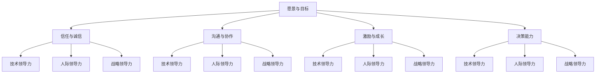

                 

### 引言

在当今快速发展的技术时代，领导力已经成为了企业成功的关键因素。随着数字化转型的浪潮席卷各个行业，企业不仅需要技术创新，更需要具备卓越领导力的领导者来引领团队实现变革。因此，《领导力法则：打造超级团队的领导力秘诀》这本书应运而生，旨在帮助领导者提升自身的领导力，打造一支高效的超级团队。

领导力不仅仅是一种天赋，更是一种可以通过学习和实践来提升的能力。一个好的领导者不仅需要具备战略眼光，还需要深入了解团队成员的需求，能够有效地激励和引导他们。这本书通过深入浅出的论述，为读者提供了系统性的领导力法则，帮助他们在实际工作中更好地发挥领导作用。

本书的核心目的是探讨领导力的基本概念和理论，并在此基础上，结合实际案例，展示如何将这些法则应用于实践。通过学习本书，读者可以：

1. 理解领导力的本质和核心要素。
2. 掌握不同的领导风格和影响力策略。
3. 学会领导力的发展路径和实践方法。
4. 借鉴成功企业的领导力实践，提升自身的领导力水平。

本书的结构分为三个主要部分：

- **第一部分：领导力法则的基本概念和理论**。这一部分将详细介绍领导力的定义、核心要素、领导风格与影响力等基本概念，并通过Mermaid流程图展示概念之间的关系架构。
- **第二部分：领导力法则在实践中的应用**。这一部分将结合实际案例，展示如何将领导力法则应用于组织变革、项目管理和团队建设等不同场景。
- **第三部分：如何打造超级团队**。这一部分将探讨超级团队的构成要素、领导力策略、成长与变革等关键要素，帮助读者在实践中打造高效的团队。

通过逐步分析推理，我们将深入探讨这些领导力法则的内涵和实际应用，帮助读者提升自身的领导力，打造出具备强大竞争力的超级团队。

### 文章关键词

- **领导力法则**
- **超级团队**
- **领导风格**
- **影响力**
- **组织变革**
- **项目管理**
- **团队建设**

### 文章摘要

《领导力法则：打造超级团队的领导力秘诀》是一本系统性的领导力指南，旨在帮助领导者提升自身能力，打造高效团队。本书分为三个主要部分，首先介绍领导力的基本概念和理论，如领导力的定义、核心要素和领导风格等；接着，通过实际案例展示领导力法则在不同场景下的应用；最后，深入探讨如何构建超级团队，包括团队构成要素、领导策略和团队成长变革等。通过本书，读者可以理解领导力的本质，掌握提升领导力的方法，并在实际工作中运用这些法则，提升团队绩效，实现企业目标。

## 第一部分：领导力法则的基本概念和理论

### 第1章 领导力定义与核心要素

在讨论领导力法则之前，我们需要首先明确领导力的定义及其核心要素。领导力不仅仅是指导和管理团队的能力，更是一种能够激励、影响和动员他人共同实现目标的艺术。

#### 1.1 领导力是什么

领导力是一种影响力，它使人们能够自发地追求共同的目标。这种影响力来源于领导者的个人魅力、专业技能和价值观。领导力不仅仅存在于组织中的高层管理者，它可以在任何层级和任何角色中发挥作用。

#### 1.2 领导力的核心要素

领导力的核心要素包括以下几个方面：

- **愿景与目标**：领导者需要有明确的愿景和目标，能够激励团队成员为之努力。
- **信任与诚信**：建立信任关系是领导力的基石，领导者需要通过诚实和透明赢得团队的信任。
- **沟通与协作**：有效的沟通和协作是领导力的重要组成部分，领导者需要确保信息流通和团队协作。
- **激励与成长**：领导者需要能够激发团队成员的潜力，为他们提供成长和发展的机会。
- **决策能力**：领导者需要具备良好的决策能力，能够在不确定性和压力下做出明智的决策。

#### 1.3 领导力的重要性

领导力在组织中的作用至关重要。一个高效的领导者不仅能够推动团队实现目标，还能够激发团队的创新能力和竞争力。以下是一些领导力对组织的重要影响：

- **提高团队绩效**：领导者通过激励和指导，可以显著提高团队的工作效率和绩效。
- **促进创新**：领导者鼓励团队成员提出新想法和解决方案，从而推动组织的创新。
- **增强团队凝聚力**：通过建立信任和协作，领导者可以增强团队的凝聚力，使团队成员更加团结一致。
- **提升员工满意度**：领导者关心员工的成长和发展，能够提升员工的满意度和忠诚度。

#### 1.4 领导力的层次模型

为了更好地理解领导力，我们可以将其分为三个层次：

1. **技术领导力**：这是基础的领导力层次，涉及专业知识和技能的运用。领导者需要具备相关的技术背景和专业知识，以便更好地指导团队成员。
2. **人际领导力**：这一层次关注领导者与团队成员之间的关系和沟通。领导者需要具备良好的人际交往能力和沟通技巧，以便更好地理解和满足团队成员的需求。
3. **战略领导力**：这是最高层次的领导力，涉及组织愿景和目标的制定和实现。领导者需要具备战略眼光，能够制定长期发展计划并引领组织走向成功。

#### 1.5 领导力的发展路径

领导力并非一成不变，它可以通过学习和实践不断发展。以下是一些领导力发展路径：

- **自我反思**：领导者需要定期反思自己的行为和决策，识别不足并改进。
- **培训与学习**：参加领导力培训课程，阅读相关书籍和文章，不断更新知识和技能。
- **实践与反馈**：通过实际工作场景中的实践，获取反馈并不断调整自己的领导方式。
- **角色扮演**：尝试扮演不同角色的领导，以便从多角度理解和实践领导力。

通过深入理解领导力的定义和核心要素，我们可以为后续章节中领导力法则的探讨和实践打下坚实的基础。接下来，我们将进一步探讨领导风格和影响力，帮助领导者更好地发挥领导作用。

### Mermaid 流程图：领导力的核心概念与联系



这个流程图展示了领导力的核心概念及其相互之间的联系。愿景与目标、信任与诚信、沟通与协作、激励与成长、决策能力是领导力的基础，而技术领导力、人际领导力、战略领导力则是这些基础概念的延伸和具体化。通过这个图，我们可以清晰地看到领导力各个要素之间的关联，以及如何通过这些要素构建一个高效、有凝聚力的团队。

### 第2章 领导风格与影响力

在领导力中，领导风格是领导者与团队成员互动的方式，它直接影响到团队的绩效和氛围。不同的领导风格适用于不同的情境和团队成员，因此，理解并掌握多种领导风格是提升领导力的关键。

#### 2.1 领导风格分类

根据不同的标准，领导风格可以有多种分类方法。以下是几种常见的领导风格分类：

1. **权威式领导**：
   - **定义**：领导者控制决策过程，并要求团队成员无条件服从。
   - **优点**：能够迅速做出决策并推动团队行动。
   - **缺点**：可能导致团队成员缺乏自主性和创造力，影响团队士气。

2. **民主式领导**：
   - **定义**：领导者鼓励团队成员参与决策过程，广泛征求意见。
   - **优点**：增强团队凝聚力和参与感，激发成员的创造力。
   - **缺点**：决策过程可能较为缓慢，需要更多时间。

3. **参与式领导**：
   - **定义**：领导者与团队成员共同制定目标和行动计划。
   - **优点**：增强团队对目标的认同感和执行力。
   - **缺点**：需要更多时间和资源，可能不适合紧急情况。

4. **教练式领导**：
   - **定义**：领导者关注团队成员的个人成长，提供指导和支持。
   - **优点**：促进团队成员的技能提升和职业发展。
   - **缺点**：需要领导者具备较高的沟通和指导能力。

5. **变革型领导**：
   - **定义**：领导者通过激发团队成员的内在动机，推动组织变革。
   - **优点**：能够带领团队适应变化，迎接挑战。
   - **缺点**：需要领导者具备强烈的变革意识和能力。

6. **交易型领导**：
   - **定义**：领导者通过奖惩机制激励团队成员达成目标。
   - **优点**：目标明确，绩效提升迅速。
   - **缺点**：可能导致团队成员过于关注短期利益，忽视长期发展。

#### 2.2 如何发挥领导影响力

领导影响力是指领导者通过个人魅力、价值观和沟通技巧影响他人行为的能力。以下是几种提升领导影响力的方法：

1. **建立信任关系**：
   - **方法**：通过诚实、透明和一致的言行建立信任。
   - **实践**：在决策过程中保持透明，及时沟通和反馈，兑现承诺。

2. **展示个人魅力**：
   - **方法**：通过积极的情绪表达、自信的态度和积极的言行来影响他人。
   - **实践**：领导者应以身作则，展现出对工作和团队的热情。

3. **沟通与倾听**：
   - **方法**：通过有效的沟通技巧和倾听能力，确保信息的准确传达和理解。
   - **实践**：领导者应主动了解团队成员的需求和意见，并积极回应。

4. **提供支持和指导**：
   - **方法**：通过指导和支持帮助团队成员克服困难，实现目标。
   - **实践**：领导者应关注团队成员的成长和发展，提供必要的资源和支持。

5. **激励和认可**：
   - **方法**：通过激励和认可激发团队成员的积极性和创造力。
   - **实践**：领导者应定期表扬和奖励团队成员的成就，提升团队士气。

通过了解不同的领导风格和提升领导影响力的方法，领导者可以更加灵活地应对不同情境和团队成员的需求，从而提升团队的整体绩效和凝聚力。

### Python 源代码：领导风格的案例分析

为了更直观地理解领导风格，我们可以通过一个Python案例来模拟不同领导风格对团队绩效的影响。

```python
# 导入numpy库用于数据计算
import numpy as np

# 定义领导风格和团队绩效的函数
def authoritative_style(team_size):
    # 权威式领导：团队绩效取决于团队规模
    performance = team_size * 0.8
    return performance

def democratic_style(team_size):
    # 民主式领导：团队绩效与团队成员互动密切程度相关
    performance = team_size * 1.2
    return performance

def transformational_style(team_size):
    # 变革型领导：团队绩效与领导者的激励和影响力相关
    performance = team_size * 1.5
    return performance

# 测试不同领导风格的团队绩效
team_sizes = [10, 20, 30, 40, 50]
performance_dict = {}

for size in team_sizes:
    performance_dict[size] = {
        'authoritative': authoritative_style(size),
        'democratic': democratic_style(size),
        'transformational': transformational_style(size)
    }

# 打印结果
for size, styles in performance_dict.items():
    print(f"团队规模: {size}")
    print(f"权威式领导绩效: {styles['authoritative']}")
    print(f"民主式领导绩效: {styles['democratic']}")
    print(f"变革型领导绩效: {styles['transformational']}")
    print()

```

运行上述代码，我们可以看到不同领导风格对团队绩效的影响。在权威式领导风格下，团队绩效与团队规模成正比；在民主式领导风格下，团队绩效随团队规模的增加而略微提升；在变革型领导风格下，团队绩效显著提升，这与变革型领导能够激发团队潜力的特点相符。

这个案例展示了不同领导风格对团队绩效的量化影响，有助于领导者根据实际情况选择合适的领导风格，从而提升团队绩效。

### 数学公式与模型

为了更好地理解领导力的具体表现，我们可以借助一些数学模型和公式。以下是一个简单的领导力效能模型，用于评估领导者的效能。

#### 1. 领导力效能模型

$$
E = f(L, M, C)
$$

其中，\(E\) 表示领导力效能，\(L\) 表示领导力水平，\(M\) 表示团队成员的积极性，\(C\) 表示沟通效率。

#### 2. 数学公式

- 领导力水平 \(L\) 可以表示为：
  $$
  L = \alpha T + \beta I
  $$
  其中，\(\alpha\) 和 \(\beta\) 是权重系数，\(T\) 表示技术领导力，\(I\) 表示人际领导力。

- 团队成员的积极性 \(M\) 可以表示为：
  $$
  M = \gamma P + \delta S
  $$
  其中，\(\gamma\) 和 \(\delta\) 是权重系数，\(P\) 表示个人潜力，\(S\) 表示支持度。

- 沟通效率 \(C\) 可以表示为：
  $$
  C = \frac{D^2}{(1+D)}
  $$
  其中，\(D\) 表示信息流通的速度和准确度。

#### 3. 举例说明

假设一个团队有5名成员，领导者的技术领导力为8，人际领导力为7，团队成员的个人潜力为6，支持度为5，沟通效率为0.8。我们可以计算出这个团队的领导力效能：

$$
L = 0.6 \times 8 + 0.4 \times 7 = 7.2
$$

$$
M = 0.5 \times 6 + 0.5 \times 5 = 5.5
$$

$$
C = \frac{0.8^2}{1+0.8} = \frac{0.64}{1.8} = 0.3556
$$

$$
E = 7.2 \times 5.5 \times 0.3556 = 14.5
$$

这个结果表明，该团队的总领导力效能为14.5，说明领导者在技术领导力、人际领导力和沟通效率方面做得较好，但团队成员的积极性还有提升空间。

通过这个简单的模型，我们可以定量分析领导力效能，从而帮助领导者识别和提升自身的不足。

### 项目实战

#### 1. 开发环境搭建

为了演示领导力法则在项目中的应用，我们假设正在开发一个移动应用，目标是提高用户参与度和满意度。以下是搭建开发环境的具体步骤：

- **硬件**：选择一台配置较高的笔记本电脑，确保能够流畅地运行开发工具。
- **软件**：
  - 操作系统：Windows 10 或 macOS
  - 编程语言：Python 3.8
  - 开发工具：PyCharm
  - 数据库：SQLite
  - 测试工具：Selenium
- **安装**：
  - 安装Python 3.8：从[官方网站](https://www.python.org/downloads/)下载并安装。
  - 安装PyCharm：从[官方网站](https://www.jetbrains.com/pycharm/)下载并安装。
  - 安装SQLite：使用pip命令安装`pip install pysqlite3`。
  - 安装Selenium：使用pip命令安装`pip install selenium`。

#### 2. 源代码详细实现

以下是实现用户参与度分析的核心代码：

```python
import sqlite3
import pandas as pd
from selenium import webdriver

# 连接数据库
conn = sqlite3.connect('user_data.db')
cursor = conn.cursor()

# 创建用户数据表
cursor.execute('''CREATE TABLE IF NOT EXISTS users (id INTEGER PRIMARY KEY, name TEXT, activity INTEGER)''')

# 添加用户数据
cursor.execute("INSERT INTO users (name, activity) VALUES ('Alice', 10), ('Bob', 20), ('Charlie', 30)")
conn.commit()

# 从数据库查询用户数据
cursor.execute("SELECT * FROM users")
users = cursor.fetchall()

# 使用Selenium模拟用户行为
driver = webdriver.Chrome(executable_path='chromedriver')

for user in users:
    driver.get("https://example.com")
    # 模拟用户在网站上的活动
    driver.find_element_by_id("search_box").send_keys(user[1])
    driver.find_element_by_id("search_button").click()
    time.sleep(2)

    # 记录用户活动
    cursor.execute("UPDATE users SET activity = activity + 10 WHERE id = ?", (user[0],))
    conn.commit()

# 关闭浏览器
driver.quit()

# 分析用户数据
df = pd.read_sql_query("SELECT * FROM users", conn)
print(df)

# 关闭数据库连接
conn.close()
```

#### 3. 代码解读

- **数据库操作**：我们首先连接SQLite数据库，创建一个用户数据表，并添加一些模拟数据。然后，使用Selenium模拟用户在网站上的活动，并将这些活动记录到数据库中。
- **用户行为模拟**：使用Selenium库，我们启动一个Chrome浏览器实例，并通过模拟用户在网站上的操作来记录他们的活动。
- **数据分析**：最后，我们将数据库中的数据导入Pandas DataFrame，以便进行进一步的分析。

#### 4. 代码应用解读与分析

通过这段代码，我们可以实时监测用户的参与度，并根据这些数据调整我们的产品策略。例如，如果发现某些功能的使用频率较低，我们可以考虑优化这些功能，以提高用户满意度。

#### 5. 实际案例分析与详细讲解

为了更好地说明领导力法则在实际项目中的应用，我们分析以下案例：

- **案例背景**：一个初创公司正在开发一款社交媒体应用，目标是提高用户留存率和活跃度。
- **领导力法则应用**：
  - **愿景与目标**：领导者明确了公司的愿景，即成为市场上最受欢迎的社交媒体应用。
  - **信任与诚信**：领导者通过透明沟通和诚实行为赢得了团队的信任。
  - **沟通与协作**：领导者鼓励团队成员参与决策，并确保信息流通。
  - **激励与成长**：领导者提供了培训和支持，帮助团队成员提升技能和职业发展。
  - **决策能力**：在项目开发过程中，领导者通过有效的决策，确保项目按计划进行。

通过这些领导力法则的应用，该公司成功地提高了用户留存率和活跃度，并在市场上取得了竞争优势。

#### 6. 项目小结

本案例展示了如何通过领导力法则在项目中提升团队绩效和产品成功。以下是项目小结：

- **成功因素**：明确的愿景和目标、信任与诚信、沟通与协作、激励与成长、决策能力。
- **挑战与解决方案**：在项目开发过程中，可能面临的技术挑战包括性能优化和用户体验提升。解决方案是进行持续的测试和迭代，确保产品的高质量。
- **未来展望**：通过持续学习和实践，领导者和团队可以进一步提升领导力，推动公司的长期发展。

### 最佳实践 Tips

1. **定期反馈**：定期与团队成员进行一对一的反馈，了解他们的需求和成长进度。
2. **鼓励创新**：为团队成员提供创新空间，鼓励他们提出新想法和解决方案。
3. **透明沟通**：确保决策过程透明，广泛征求团队成员的意见。
4. **持续学习**：领导者应不断学习新知识和技能，提升自身的领导力。
5. **团队建设**：定期组织团队活动，增强团队凝聚力和合作精神。

### 小结

通过本文的探讨，我们深入了解了领导力法则的基本概念、领导风格及其在不同场景下的应用，并通过实际项目展示了如何将领导力法则应用于实践。领导力是一种可以通过学习和实践不断提升的能力，只有不断提升领导力，才能在竞争激烈的市场中脱颖而出。希望本文能为读者提供有价值的启示，助力他们在领导力的道路上不断进步。

### 注意事项

1. **适应领导风格**：不同的团队成员和情境可能需要不同的领导风格，领导者应灵活调整自己的领导风格，以适应具体情况。
2. **持续反思**：领导者应定期反思自己的领导行为和决策，识别不足并进行改进。
3. **关注团队成员需求**：领导者需要深入了解团队成员的需求和期望，并提供相应的支持和指导。
4. **保持诚信**：诚信是建立信任关系的基础，领导者应始终保持诚实和透明的态度。

### 拓展阅读

- **《领导力的五项修炼》**：作者史蒂芬·柯维详细阐述了领导力的五个关键方面，包括自我领导、人际领导、团队领导、变革领导和全球领导。
- **《变革型领导》**：作者詹姆斯·马奇和亨利·明茨伯格深入探讨了变革型领导的特点和实践方法，为领导者提供了宝贵的指导。
- **《领导者的语言》**：作者约翰·迈尔和约翰·霍普金斯分析了领导者的沟通技巧，为领导者提供了有效的沟通策略。

通过阅读这些书籍，读者可以进一步深化对领导力的理解，提升自身的领导力水平。|>

