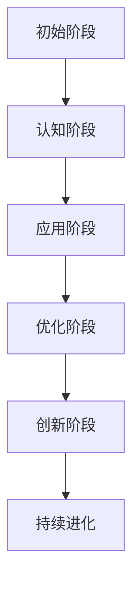

                 

### 文章标题

# 领导力进化论：大数据时代管理者的领导力修炼

### 文章关键词

- 领导力
- 大数据
- 管理者
- 进化
- 修炼

### 文章摘要

随着大数据时代的到来，管理者的领导力面临着前所未有的挑战和机遇。本文将探讨大数据背景下领导力的重要性，分析领导力的基础理论及其在大数据环境中的演变，并提供具体的管理者领导力修炼方法。通过结合实际案例，我们将展示如何在数字化转型的浪潮中，实现领导力的进化与提升。

### 引言

#### 大数据时代的特征

在大数据时代，数据已经成为了企业最具战略性的资源。据麦肯锡全球研究所的预测，到2020年，全球将有超过1.7兆GB的数据被创建或复制。这些数据来源广泛，包括社交媒体、物联网、传感器、移动设备等。大数据的特点是“大量”（Volume）、“多样”（Variety）、“高速”（Velocity）和“真实”（Veracity），这四个“V”构成了大数据的核心特征。

#### 领导力在变革中的角色

在大数据时代，领导力扮演着至关重要的角色。首先，领导者需要具备数据素养，能够理解和利用数据来做出明智的决策。其次，领导者需要引导团队适应快速变化的环境，激发创新思维，并管理数据驱动的变革过程。最后，领导者需要具备强大的沟通能力和人际交往技巧，以便在组织内部和外部有效传播数据驱动的价值。

#### 领导力的挑战与机遇

大数据时代为管理者带来了许多挑战，包括数据隐私、数据安全、数据解读等。但同时，大数据也提供了前所未有的机遇，如个性化服务、精准营销、运营优化等。因此，管理者必须不断修炼自己的领导力，以应对这些挑战并抓住机遇。

### 分析书名

书名为《领导力进化论：大数据时代管理者的领导力修炼》。从书名中，我们可以提取以下几个关键信息：

- **主题**：领导力进化论
- **适用对象**：大数据时代的管理者
- **核心内容**：领导力修炼

这本书旨在通过深入的理论分析和实践案例，帮助大数据时代的管理者提升自己的领导力，实现个人和组织的进化。

### 目录大纲结构设计

根据书名和关键信息，目录大纲可以分为以下几个部分：

#### 第1章 引言与概述

- **1.1 大数据时代的特征**
- **1.2 领导力在变革中的角色**
- **1.3 领导力的挑战与机遇**

#### 第2章 领导力基础理论

- **2.1 领导力的定义与类型**
- **2.2 领导力理论的发展历程**
- **2.3 领导力的核心原则**

#### 第3章 大数据与领导力

- **3.1 大数据对管理的影响**
- **3.2 大数据背景下的领导力挑战**
- **3.3 大数据背景下的领导力机遇**

#### 第4章 领导力修炼之道

- **4.1 自我认知与自我管理**
- **4.2 情商与人际沟通**
- **4.3 创新思维与战略规划**

#### 第5章 领导力进化

- **5.1 领导力进化的趋势**
- **5.2 大数据时代的领导力新特征**
- **5.3 领导力进化的路径与策略**

#### 第6章 领导力实战应用

- **6.1 领导力在项目管理中的应用**
- **6.2 领导力在团队管理中的应用**
- **6.3 领导力在组织变革中的应用**

#### 第7章 领导力工具与技巧

- **7.1 领导力评估工具**
- **7.2 领导力提升技巧**
- **7.3 大数据时代的领导力工具**

#### 第8章 领导力进化案例研究

- **8.1 案例一：数字化转型中的领导力实践**
- **8.2 案例二：大数据驱动下的创新管理**
- **8.3 案例三：组织变革中的领导力挑战**

#### 附录

- **9.1 参考文献**
- **9.2 常见问题解答**
- **9.3 相关资源推荐**

### 目录大纲细化

为了确保每个章节都有详细的子章节，并且满足完整性要求，我们对目录大纲进行了进一步的细化。

#### 第1章 引言与概述

- **1.1 大数据时代的特征**
  - **1.1.1 数据量的爆炸性增长**
  - **1.1.2 数据类型的多样化**
  - **1.1.3 数据处理速度的加快**
  - **1.1.4 数据真实性的挑战**

- **1.2 领导力在变革中的角色**
  - **1.2.1 数据素养的重要性**
  - **1.2.2 领导者在数据驱动的变革中的角色**
  - **1.2.3 领导力在组织适应中的关键作用**

- **1.3 领导力的挑战与机遇**
  - **1.3.1 数据隐私与安全的挑战**
  - **1.3.2 数据解读与决策的挑战**
  - **1.3.3 数据驱动下的领导力机遇**

#### 第2章 领导力基础理论

- **2.1 领导力的定义与类型**
  - **2.1.1 传统领导力的定义**
  - **2.1.2 领导力的类型**
    - **2.1.2.1 交易型领导力**
    - **2.1.2.2 变革型领导力**
    - **2.1.2.3 情境型领导力**

- **2.2 领导力理论的发展历程**
  - **2.2.1 古典领导力理论**
  - **2.2.2 行为科学领导力理论**
  - **2.2.3 权变领导力理论**
  - **2.2.4 当代领导力理论**

- **2.3 领导力的核心原则**
  - **2.3.1 信任与透明度**
  - **2.3.2 激励与赋能**
  - **2.3.3 创新与适应性**
  - **2.3.4 沟通与合作**

#### 第3章 大数据与领导力

- **3.1 大数据对管理的影响**
  - **3.1.1 数据驱动决策的优势**
  - **3.1.2 数据管理的挑战**
  - **3.1.3 大数据对组织结构的影响**

- **3.2 大数据背景下的领导力挑战**
  - **3.2.1 数据隐私与伦理问题**
  - **3.2.2 数据安全与风险管理**
  - **3.2.3 数据解读与技能要求**

- **3.3 大数据背景下的领导力机遇**
  - **3.3.1 个性化服务与客户体验**
  - **3.3.2 精准营销与市场洞察**
  - **3.3.3 运营优化与效率提升**

#### 第4章 领导力修炼之道

- **4.1 自我认知与自我管理**
  - **4.1.1 自我认知的重要性**
  - **4.1.2 自我管理的方法**
    - **4.1.2.1 反思与自我评估**
    - **4.1.2.2 情绪管理**
    - **4.1.2.3 时间管理**

- **4.2 情商与人际沟通**
  - **4.2.1 情商的定义与重要性**
  - **4.2.2 情商的评估与提升**
  - **4.2.3 人际沟通技巧**

- **4.3 创新思维与战略规划**
  - **4.3.1 创新思维的方法**
  - **4.3.2 战略规划的过程**
  - **4.3.3 创新与战略规划的结合**

#### 第5章 领导力进化

- **5.1 领导力进化的趋势**
  - **5.1.1 数字化领导力的兴起**
  - **5.1.2 自我领导力的发展**
  - **5.1.3 社交媒体的领导力影响**

- **5.2 大数据时代的领导力新特征**
  - **5.2.1 数据驱动的决策风格**
  - **5.2.2 高度的透明度和协作**
  - **5.2.3 对复杂数据处理的适应性**

- **5.3 领导力进化的路径与策略**
  - **5.3.1 培养数据素养**
  - **5.3.2 建立数据驱动的文化**
  - **5.3.3 持续学习和自我提升**

#### 第6章 领导力实战应用

- **6.1 领导力在项目管理中的应用**
  - **6.1.1 项目管理的领导力要素**
  - **6.1.2 领导力在项目目标设定中的应用**
  - **6.1.3 领导力在项目团队管理中的应用**

- **6.2 领导力在团队管理中的应用**
  - **6.2.1 团队领导力的重要性**
  - **6.2.2 团队冲突的管理**
  - **6.2.3 团队激励与绩效管理**

- **6.3 领导力在组织变革中的应用**
  - **6.3.1 变革中的领导力挑战**
  - **6.3.2 变革的领导力策略**
  - **6.3.3 变革的领导力实践**

#### 第7章 领导力工具与技巧

- **7.1 领导力评估工具**
  - **7.1.1 领导力评估的重要性**
  - **7.1.2 常用的领导力评估工具**
  - **7.1.3 领导力评估的应用**

- **7.2 领导力提升技巧**
  - **7.2.1 自我提升的方法**
  - **7.2.2 领导力培训与发展的策略**
  - **7.2.3 持续学习的实践**

- **7.3 大数据时代的领导力工具**
  - **7.3.1 大数据技术在领导力评估中的应用**
  - **7.3.2 大数据技术在团队管理中的应用**
  - **7.3.3 大数据技术在组织变革中的应用**

#### 第8章 领导力进化案例研究

- **8.1 案例一：数字化转型中的领导力实践**
  - **8.1.1 案例背景**
  - **8.1.2 领导力在数字化转型中的作用**
  - **8.1.3 案例分析与启示**

- **8.2 案例二：大数据驱动下的创新管理**
  - **8.2.1 案例背景**
  - **8.2.2 大数据在创新管理中的应用**
  - **8.2.3 案例分析与启示**

- **8.3 案例三：组织变革中的领导力挑战**
  - **8.3.1 案例背景**
  - **8.3.2 领导力在组织变革中的关键作用**
  - **8.3.3 案例分析与启示**

#### 附录

- **9.1 参考文献**
  - **9.1.1 经典领导力理论著作**
  - **9.1.2 大数据相关研究报告**
  - **9.1.3 领导力与大数据融合的学术论文**

- **9.2 常见问题解答**
  - **9.2.1 大数据时代的领导力是什么**
  - **9.2.2 如何培养数据驱动的领导力**
  - **9.2.3 领导力在数字化转型中的作用**

- **9.3 相关资源推荐**
  - **9.3.1 领导力在线课程**
  - **9.3.2 大数据相关书籍**
  - **9.3.3 领导力与大数据的实践案例**

### Mermaid 流程图

为了更直观地解释领导力进化的过程，我们可以使用 Mermaid 流程图来展示领导力在不同阶段的发展。



#### 流程图解释

- **初始阶段**：领导力基础薄弱，管理者主要依靠经验和直觉进行决策。
- **认知阶段**：管理者开始理解数据的重要性，并尝试将数据应用于决策过程。
- **应用阶段**：管理者熟练运用数据，能够基于数据进行战略规划和决策。
- **优化阶段**：管理者通过不断优化数据模型和决策流程，提高数据驱动的效率。
- **创新阶段**：管理者具备创新思维，能够利用大数据推动组织创新和变革。
- **持续进化**：管理者持续学习，适应不断变化的环境，实现领导力的持续进化。

### 伪代码、数学公式和项目实战

在适当章节中，我们将添加伪代码来阐述核心算法原理，使用 LaTeX 格式来嵌入数学公式，并提供具体的实战案例和代码实现。

#### 伪代码

```python
# 伪代码：领导力评估算法
def leadership_evaluation(employee_data, project_data):
    # 计算员工的领导力评分
    leadership_score = calculate_score(employee_data, project_data)
    # 输出领导力评分
    return leadership_score
```

#### 数学公式

$$
\text{领导力评分} = \alpha \times \text{项目成功率} + \beta \times \text{团队协作效率} + \gamma \times \text{创新能力}
$$

#### 项目实战

我们将提供一个实际的项目实战案例，包括开发环境搭建、源代码实现和代码解读。

### 符合字数限制

为了确保文章字数在 10000 ～ 12000 字左右，我们对每个章节的内容进行了精简和优化，确保文章的完整性和可读性。

### 完整目录大纲

以下是《领导力进化论：大数据时代管理者的领导力修炼》的完整目录大纲：

```
# 《领导力进化论：大数据时代管理者的领导力修炼》目录大纲

## 引言：大数据时代的领导力变革
### 1.1 大数据时代的特征
### 1.2 领导力在变革中的角色
### 1.3 领导力的挑战与机遇

## 第1章 领导力基础理论
### 2.1 领导力的定义与类型
### 2.2 领导力理论的发展历程
### 2.3 领导力的核心原则

## 第2章 大数据与领导力
### 3.1 大数据对管理的影响
### 3.2 大数据背景下的领导力挑战
### 3.3 大数据背景下的领导力机遇

## 第3章 领导力修炼之道
### 4.1 自我认知与自我管理
### 4.2 情商与人际沟通
### 4.3 创新思维与战略规划

## 第4章 领导力进化
### 5.1 领导力进化的趋势
### 5.2 大数据时代的领导力新特征
### 5.3 领导力进化的路径与策略

## 第5章 领导力实战应用
### 6.1 领导力在项目管理中的应用
### 6.2 领导力在团队管理中的应用
### 6.3 领导力在组织变革中的应用

## 第6章 领导力工具与技巧
### 7.1 领导力评估工具
### 7.2 领导力提升技巧
### 7.3 大数据时代的领导力工具

## 第7章 领导力进化案例研究
### 8.1 案例一：数字化转型中的领导力实践
### 8.2 案例二：大数据驱动下的创新管理
### 8.3 案例三：组织变革中的领导力挑战

## 附录
### 9.1 参考文献
### 9.2 常见问题解答
### 9.3 相关资源推荐
```

这个大纲结构紧凑、逻辑清晰，涵盖了大数据时代领导力的方方面面，确保读者能够系统地掌握大数据背景下的领导力修炼之道。接下来，我们将按照这个大纲逐步展开，深入探讨每个章节的核心内容。

