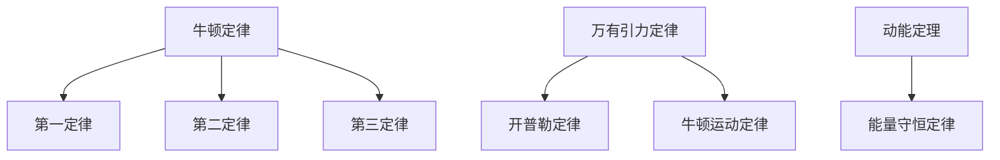
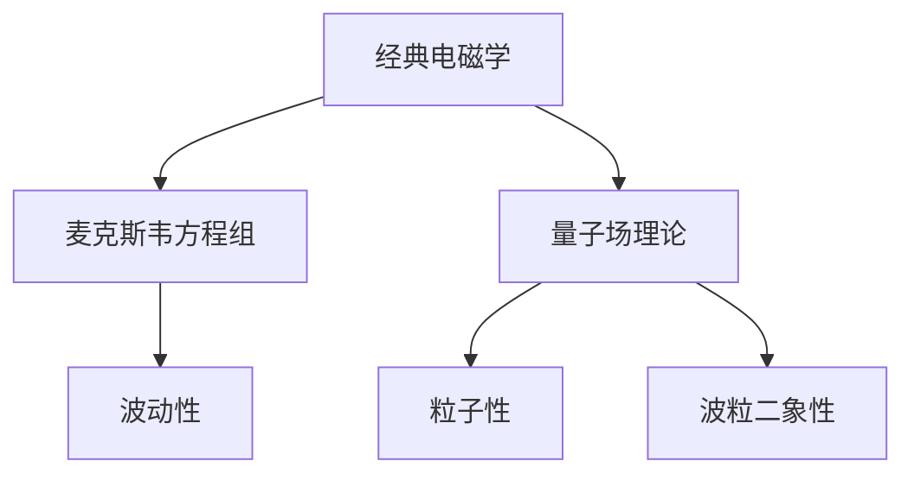
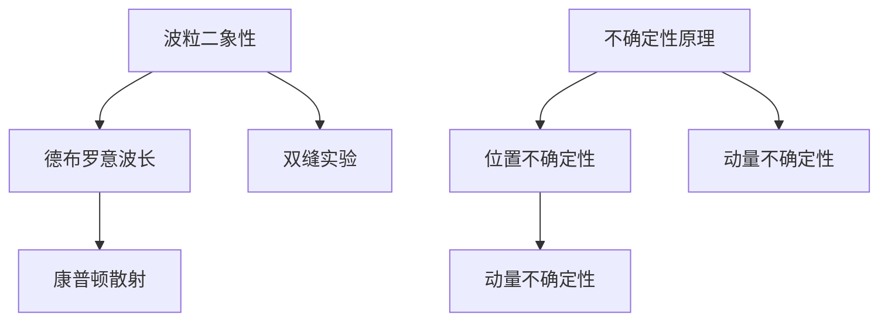
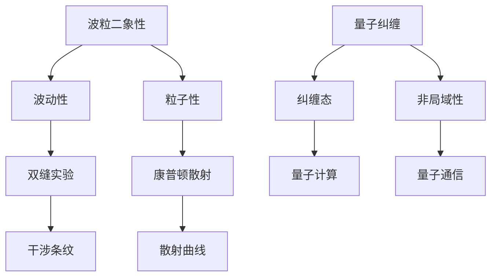
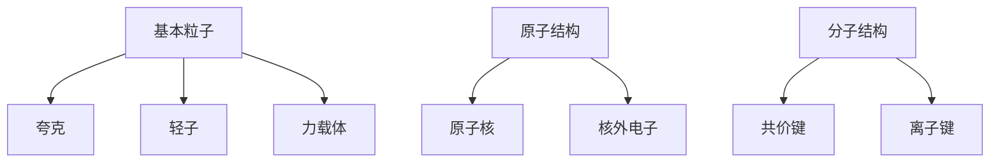
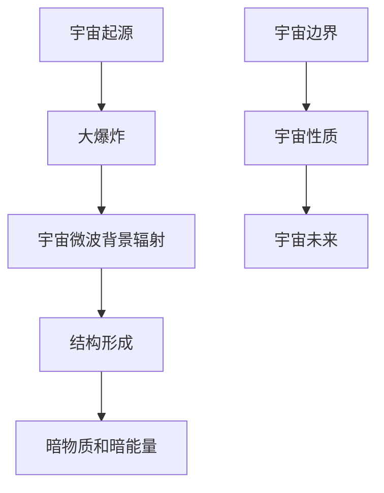
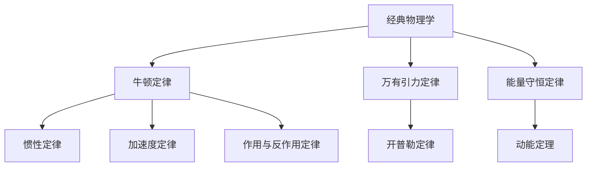

                 

### 关键词

- 经典物理学
- 弦论
- 物质本质
- 宇宙构造
- 量子力学
- 牛顿定律
- 万有引力
- 麦克斯韦方程组
- 黑体辐射
- 光电效应
- 波粒二象性
- 不确定性原理
- 相对论
- 时空观念
- 量子场论
- 基本粒子
- 量子纠缠
- 能量守恒
- 电磁波
- 量子计算
- 宇宙起源
- 宇宙演化
- 宇宙学
- 黑洞

### 摘要

本文旨在探索从经典物理学到弦论的理论发展，涵盖物质本质与宇宙构造的研究。经典物理学起源于对宏观现象的描述，通过牛顿力学和麦克斯韦电磁学的建立，揭示了力、能量和运动的基本规律。然而，面对微观世界的挑战，量子力学的诞生带来了全新的视角。本文将详细阐述量子力学的基本原理，如波粒二象性、不确定性原理和量子纠缠，以及其在化学、材料科学和信息技术中的应用。此外，本文将探讨弦论的发展，从量子场论到弦论的理论框架，解析弦论的核心概念与数学基础。最后，本文将讨论物质本质的探讨和宇宙构造的探索，从宇宙起源、演化到未来命运，为读者提供一个全面而深刻的理解。

## 第一部分：经典物理学基础

经典物理学是物理学的一个分支，主要研究宏观尺度下的物理现象和规律。从牛顿力学到麦克斯韦电磁学，经典物理学为我们提供了理解宇宙的基本工具。在这一部分中，我们将探讨经典物理学的起源、发展及其主要理论，为后续讨论量子力学和弦论奠定基础。

### 第1章：经典物理学的起源与发展

#### 1.1 经典物理学的定义与基本概念

经典物理学，也称为传统物理学或牛顿物理学，是指研究宏观物体运动和相互作用规律的物理学分支。其基本概念包括质量、长度、时间和力等。这些概念构成了经典物理学的核心框架。

**质量**：物体惯性的量度，是物体抵抗加速度变化的属性。

**长度**：物体的几何尺寸，是空间距离的量度。

**时间**：事件发生的顺序和持续时间，是时间进程的量度。

**力**：物体间相互作用的效应，能够改变物体的运动状态。

#### 1.2 经典物理学的发展历程

经典物理学的发展可以追溯到古希腊哲学家亚里士多德的自然哲学。然而，真正意义上的经典物理学始于17世纪，当时伽利略通过实验和观察提出了运动定律。牛顿在伽利略的基础上，总结出了三大运动定律，并提出了万有引力定律，奠定了经典力学的基础。

**伽利略的贡献**：通过实验，伽利略证实了自由落体定律，即所有物体在没有空气阻力的情况下以相同的加速度下落。

**牛顿的贡献**：牛顿在《自然哲学的数学原理》中提出了三大运动定律和万有引力定律，建立了经典力学体系。

**经典物理学的主要发展阶段**：

- **17世纪**：伽利略和笛卡尔的运动定律，为经典物理学的建立奠定了基础。

- **18世纪**：牛顿力学体系的建立，标志着经典物理学的正式诞生。

- **19世纪**：拉格朗日和哈密顿的发展，将经典力学推向了新的高度。

- **20世纪**：量子力学和相对论的兴起，挑战了经典物理学的某些方面，但经典物理学在宏观尺度下仍然适用。

#### 1.3 经典物理学的局限性

尽管经典物理学在描述宏观世界方面取得了巨大成功，但它也存在着一些局限性。

**局限性**：

- **宏观现象的描述不足**：经典物理学在处理微观粒子行为时显得无力，例如在解释黑体辐射和光电效应时遇到了困难。

- **相对论挑战**：爱因斯坦的相对论揭示了经典物理学中的一些错误，例如时间膨胀和长度收缩等现象。

- **量子力学的影响**：量子力学的出现使得经典物理学的某些假设被质疑，例如确定性原理和局域性原理。

### 第2章：经典力学原理

经典力学是经典物理学中最重要的部分，它主要研究物体的运动和相互作用。经典力学的基本原理包括牛顿定律、万有引力定律和能量守恒定律等。

#### 2.1 牛顿定律与经典力学体系

牛顿定律是经典力学的基础，描述了物体在力作用下的运动规律。牛顿定律包括以下三个基本原理：

**第一定律（惯性定律）**：一个物体如果不受外力作用，它将保持静止状态或匀速直线运动。

**第二定律（加速度定律）**：物体所受的合外力等于其质量与加速度的乘积，即 \( F = ma \)。

**第三定律（作用与反作用定律）**：对于任何两个相互作用的物体，它们之间的作用力和反作用力大小相等、方向相反。

牛顿定律建立了一个经典力学体系，可以用来描述和预测物体的运动。

#### 2.2 万有引力定律与运动定律

牛顿的万有引力定律描述了物体之间的引力作用。该定律指出，任何两个物体都相互吸引，引力的大小与两物体的质量乘积成正比，与它们之间的距离平方成反比，公式为 \( F = G\frac{m_1m_2}{r^2} \)，其中 \( G \) 是引力常数。

**运动定律**：

- **开普勒定律**：描述行星绕太阳运动的规律，包括椭圆轨道定律、面积定律和调和定律。

- **牛顿运动定律**：描述物体在力作用下的运动规律，包括第一定律、第二定律和第三定律。

#### 2.3 动能定理与能量守恒定律

动能定理描述了力对物体做功与物体动能变化之间的关系。动能定理指出，合外力对物体做的功等于物体动能的变化量，即 \( W = \Delta K \)，其中 \( W \) 是功，\( \Delta K \) 是动能的变化。

能量守恒定律是物理学的基本原理之一，它指出在一个封闭系统中，能量总量保持不变。能量可以以不同的形式存在，如动能、势能、热能等，但总能量是守恒的。

#### 经典力学原理的关系架构

为了更清晰地理解经典力学原理之间的关系，我们可以使用Mermaid流程图来表示：



这个流程图展示了牛顿定律、万有引力定律、动能定理和能量守恒定律之间的联系。牛顿定律和万有引力定律构成了经典力学的基本框架，而动能定理和能量守恒定律则为描述物体运动提供了重要的工具。

### 第3章：经典电磁学

经典电磁学是研究电场、磁场和电磁波的经典物理学分支。麦克斯韦方程组是经典电磁学的核心，描述了电磁场的动态行为和电磁波的传播。

#### 3.1 麦克斯韦方程组与电磁波

麦克斯韦方程组是由詹姆斯·克拉克·麦克斯韦于19世纪提出的，它们描述了电场和磁场的分布和变化规律。麦克斯韦方程组包括以下四个方程：

**高斯定律（电场）**：$$ \nabla \cdot \mathbf{E} = \frac{\rho}{\varepsilon_0} $$
**高斯定律（磁场）**：$$ \nabla \cdot \mathbf{B} = 0 $$
**法拉第电磁感应定律**：$$ \nabla \times \mathbf{E} = -\frac{\partial \mathbf{B}}{\partial t} $$
**安培定律（无源）**：$$ \nabla \times \mathbf{B} = \mu_0 \mathbf{J} $$
**安培-麦克斯韦方程**：$$ \nabla \times \mathbf{E} = \mu_0 \frac{\partial \mathbf{B}}{\partial t} $$

麦克斯韦方程组揭示了电场和磁场的内在联系，并预言了电磁波的存在。电磁波是一种横波，由电场和磁场相互垂直并垂直于波的传播方向组成。

#### 3.2 光的波动性与粒子性

光的行为既具有波动性又具有粒子性，这种现象称为波粒二象性。经典电磁学中的波动理论描述了光的波动性，而量子力学中的粒子理论描述了光的粒子性。

**波动性**：

- 光的干涉和衍射现象可以用波动理论解释。
- 光的波长和频率与速度的关系可以用波动方程描述。

**粒子性**：

- 光的电效应可以用光子（光的量子）来解释。
- 康普顿散射实验证明了光的粒子性。

#### 3.3 电磁场的量子化与波粒二象性

在量子力学中，电磁场被量子化，即能量被限制在特定的量子态上。这个量子化的电磁场被称为量子场。量子场理论提供了对电磁场和粒子的统一描述。

**电磁场的量子化**：

- 光子的概念：光子是电磁场的量子，具有能量 \( E = h\nu \)，其中 \( h \) 是普朗克常数，\( \nu \) 是光的频率。

**波粒二象性**：

- 在某些实验中，光表现出波动性，如干涉和衍射实验。
- 在其他实验中，光表现出粒子性，如光电效应和康普顿散射。

为了更好地理解经典电磁学和量子场理论之间的关系，我们可以使用以下Mermaid流程图：



这个流程图展示了经典电磁学和量子场理论之间的关系，以及电磁波和粒子在不同理论中的表现。

### 总结

经典物理学是研究宏观物理现象的重要工具，从牛顿力学到麦克斯韦电磁学，它为我们提供了理解宇宙的基本框架。然而，经典物理学在描述微观世界和高速现象时存在一定的局限性。量子力学和相对论的发展为我们提供了新的视角，但经典物理学仍然在许多领域发挥着重要作用。在下一部分中，我们将探讨量子力学的基本原理和物质本质的探讨。

## 第二部分：量子力学与物质本质

在经典物理学的基础上，量子力学的发展为理解微观世界的本质提供了全新的视角。量子力学不仅挑战了经典物理学的某些基本假设，如确定性原理和局域性原理，还揭示了物质和能量的波粒二象性。在这一部分，我们将深入探讨量子力学的基本原理，包括波粒二象性、不确定性原理和量子纠缠，以及它们在化学、材料科学和信息技术中的应用。

### 第4章：量子力学的诞生

量子力学的诞生是物理学史上的一个重要里程碑。在经典物理学无法解释某些实验现象时，量子力学应运而生，为我们提供了一种新的物理语言来描述微观世界的规律。

#### 4.1 黑体辐射与紫外灾难

19世纪末，经典物理学在解释黑体辐射现象时遇到了困难。黑体是一个理想化的物体，它能够吸收所有入射的电磁辐射。经典物理学的瑞利-金斯公式预测，黑体辐射的能量分布随着频率的增加而无限增加，这被称为“紫外灾难”。为了解决这一难题，普朗克提出了量子假说，认为能量是以量子形式发射和吸收的。这一假说成功解释了黑体辐射的能量分布，从而开启了量子力学的时代。

**普朗克的量子假说**：

- 能量量子化：能量不是连续的，而是由一系列离散的量子组成，公式为 \( E = h\nu \)，其中 \( h \) 是普朗克常数，\( \nu \) 是频率。
- 普朗克常数 \( h \) 的引入改变了物理学的基本观念，揭示了能量和频率之间的量子关系。

#### 4.2 光电效应与量子假说

1905年，爱因斯坦在解释光电效应时提出了光量子假说，即光具有粒子性，其能量与频率成正比，公式为 \( E = h\nu \)。光电效应实验表明，当光照射到金属表面时，会产生电子。这些电子的动能与光的频率有关，而与光的强度无关。爱因斯坦的光量子假说成功解释了光电效应的现象，并为量子力学的发展奠定了基础。

**光电效应的基本原理**：

- 光子（光的量子）与金属表面的电子相互作用。
- 光子的能量大于金属的逸出功时，电子会被激发并脱离金属表面。

#### 4.3 波粒二象性与不确定性原理

量子力学的核心概念之一是波粒二象性，即微观粒子既具有波动性又具有粒子性。这一概念最早由德布罗意提出，他在1924年的博士论文中提出所有物质都具有波动性，其波长由德布罗意波长公式 \( \lambda = \frac{h}{p} \) 给出，其中 \( p \) 是动量。

**波粒二象性的实验验证**：

- **双缝实验**：当光子或电子通过两个缝隙时，它们会形成干涉条纹，这表明它们具有波动性。
- **康普顿散射**：光子与电子碰撞后，光子的波长发生变化，这表明光子具有粒子性。

同时，海森堡的不确定性原理进一步揭示了量子力学中的非确定性特征。不确定性原理指出，某些物理量（如位置和动量、时间和能量）不能同时被精确测量。具体来说，位置的不确定性与动量的不确定性成正比，公式为 \( \Delta x \Delta p \geq \frac{h}{4\pi} \)，其中 \( \Delta x \) 和 \( \Delta p \) 分别是位置和动量的不确定性。

**不确定性原理的意义**：

- 揭示了量子世界中的非确定性和概率性。
- 改变了经典物理学中关于确定性和局域性的观念。

#### 波粒二象性与不确定性原理的关系架构

为了更清晰地理解波粒二象性与不确定性原理之间的关系，我们可以使用以下Mermaid流程图：



这个流程图展示了波粒二象性与不确定性原理之间的联系，以及它们在量子力学中的重要性。

### 第5章：量子力学的基本原理

量子力学的基本原理为理解微观世界的规律提供了框架。这些原理包括量子态、波函数、算符和测量等。

#### 5.1 算符与态函数

在量子力学中，算符用于描述物理量的变换，而态函数则用于描述系统的量子态。

**算符**：

- **哈密顿算符**：描述系统的总能量，公式为 \( \hat{H} \)。
- **动量算符**：描述系统的动量，公式为 \( \hat{p} = -i\hbar\nabla \)，其中 \( \hbar \) 是约化普朗克常数。

**态函数**：

- **波函数**：描述系统的量子态，通常用 \( \Psi(\mathbf{r}, t) \) 表示，其中 \( \mathbf{r} \) 是位置，\( t \) 是时间。
- **态向量**：波函数的复数表示，通常用 \( \vert \psi \rangle \) 表示。

#### 5.2 爱因斯坦的相对论与时空观念

爱因斯坦的相对论改变了我们对时空的理解，它提出了时空的相对性和弯曲性质。

**相对论的基本原理**：

- 相对性原理：物理定律在不同的惯性参考系中保持不变。
- 光速不变原理：光在真空中的速度是一个常数，不依赖于光源或观察者的运动状态。

**时空观念**：

- **时空弯曲**：在强引力场中，时空会发生弯曲，这会影响物体的运动轨迹。
- **黑洞**：黑洞是一种极端密集的天体，它的引力场如此之强，甚至连光也无法逃逸。

#### 5.3 波粒二象性与量子纠缠

波粒二象性和量子纠缠是量子力学中最重要的概念之一。波粒二象性揭示了微观粒子的波动性和粒子性，而量子纠缠则揭示了量子系统之间的非局域性联系。

**波粒二象性**：

- **波动性**：微观粒子具有波动性，其行为可以通过波动方程描述。
- **粒子性**：微观粒子具有粒子性，其行为可以通过粒子碰撞和散射实验描述。

**量子纠缠**：

- **纠缠态**：当两个或多个粒子发生相互作用时，它们会形成纠缠态，即一个粒子的状态不能独立于其他粒子的状态。
- **非局域性**：量子纠缠表明，量子系统之间的信息传递是瞬时的，不受距离限制。

#### 波粒二象性与量子纠缠的关系架构

为了更清晰地理解波粒二象性与量子纠缠之间的关系，我们可以使用以下Mermaid流程图：



这个流程图展示了波粒二象性和量子纠缠在量子力学中的重要性，以及它们在不同实验中的应用。

### 第6章：量子力学的应用

量子力学的发展不仅揭示了微观世界的规律，还推动了多个领域的科技进步。量子力学在化学、材料科学和信息技术等领域都有广泛的应用。

#### 6.1 量子力学在化学中的应用

量子力学为化学提供了强大的理论工具，可以用来描述分子结构、化学反应和材料性质。

**分子结构**：

- 量子力学方法可以精确计算分子的电子结构，如分子的键长、键角和电子云分布。

**化学反应**：

- 量子力学解释了化学反应的本质，如键的形成和断裂、反应路径和反应速率。

**材料性质**：

- 量子力学方法可以预测材料的电子性质、光学性质和力学性质，为新材料的发现和设计提供了指导。

#### 6.2 量子力学在材料科学中的应用

量子力学在材料科学中的应用涵盖了从纳米材料到宏观材料的各个方面。

**纳米材料**：

- 量子力学方法可以描述纳米材料的电子结构和光学性质，为新材料的发现和设计提供了理论基础。

**超导材料**：

- 量子力学解释了超导现象，即材料在低温下电阻为零的现象。这为超导电子学和超导技术提供了基础。

**量子点**：

- 量子点是一种半导体纳米材料，其量子效应使其在光学和电子学领域具有广泛应用。

#### 6.3 量子力学在信息技术中的应用

量子力学在信息技术中的应用正迅速发展，量子计算、量子通信和量子密码学是其中的关键领域。

**量子计算**：

- 量子计算机利用量子位（qubit）进行计算，可以在某些任务上远超经典计算机。量子算法在因数分解、搜索问题和优化问题等方面具有显著优势。

**量子通信**：

- 量子通信利用量子纠缠和量子隐形传态实现信息的安全传输。量子密钥分发（QKD）是一种基于量子力学的加密技术，可以提供无条件的安全保障。

**量子密码学**：

- 量子密码学利用量子力学原理设计新的加密算法，提高信息的安全性。

**量子传感器**：

- 量子传感器利用量子效应提高对微小物理量的检测灵敏度，如量子磁场传感器和量子温度传感器。

#### 量子力学应用的总结

量子力学在多个领域都有广泛应用，从化学和材料科学到信息技术，它为我们提供了理解微观世界和设计新技术的工具。量子力学的基本原理，如波粒二象性和量子纠缠，不仅挑战了经典物理学的观念，还推动了科技的发展。随着量子技术的不断进步，我们可以期待量子力学在未来发挥更大的作用。

### 总结

量子力学的发展标志着物理学的一个重要转折点，它不仅揭示了微观世界的规律，还为多个领域的科技进步提供了理论基础。从波粒二象性到不确定性原理，量子力学为我们提供了一种全新的物理语言来描述微观世界的现象。在下一部分中，我们将探讨弦论的发展及其在物质本质和宇宙构造研究中的意义。

## 第三部分：弦论与宇宙构造

弦论是物理学的一个前沿领域，它试图将量子力学与广义相对论统一起来，提供一个描述宇宙基本结构和相互作用的理论框架。与量子场论不同，弦论认为构成物质的基本单元不是点粒子，而是细小的“弦”。在这一部分中，我们将探讨弦论的起源、发展及其核心概念。

### 第7章：弦论的诞生与发展

#### 7.1 从量子场论到弦论

弦论的诞生是物理学史上的一个重要事件，它标志着对量子力学和广义相对论统一研究的一个新方向。量子场论是描述粒子与场相互作用的常用理论，但它在高能极限下遇到了一些问题，如无限维度的积分和真空能量的问题。为了解决这些问题，物理学家开始寻找新的理论框架。

**量子场论的局限性**：

- **紫外灾难**：在高能极限下，量子场论的积分会发散，导致理论预测变得不可靠。
- **真空能量问题**：量子场论中的真空并不是真正的真空，而是充满了虚粒子和引力，这导致真空能量无限大。

**弦论的提出**：

- **弦的假设**：1968年，朱利安·施瓦茨和米其亚·格林等人提出了弦论，认为构成物质的基本单元不是点粒子，而是一维的“弦”。
- **弦论的优点**：弦论提供了一种避免紫外灾难和真空能量问题的方法，因为它自然地限制了粒子的维度。

#### 7.2 弦论的几何学与拓扑学基础

弦论的一个重要特点是它将几何学和拓扑学引入了物理理论中。在弦论中，空间不再是平直的，而是弯曲的，甚至可能是多维的。

**几何学基础**：

- **超弦**：在弦论中，弦可以振动并产生不同的振动模式，这些模式对应于不同的粒子。
- **时空维度**：弦论假设宇宙有额外的空间维度，通常为10维或11维。

**拓扑学基础**：

- **拓扑缺陷**：在弦论中，拓扑缺陷（如黑洞和宇宙弦）是基本的结构单元。
- **分类**：弦论中的不同类型弦和拓扑缺陷可以通过拓扑学方法进行分类。

#### 7.3 弦论的基本假设与核心概念

弦论的基本假设和核心概念为其提供了一个统一描述宇宙的基本框架。

**基本假设**：

- **弦的唯一性**：宇宙中的所有物质和相互作用都由弦的振动模式产生。
- **背景独立性**：弦论不依赖于特定的背景场，如引力场或电磁场，而是自己定义了背景。

**核心概念**：

- **超对称性**：弦论引入了超对称性，即每种粒子都有一个相应的超对称伙伴，这有助于解决某些物理问题。
- **弦的振动模式**：弦的不同振动模式对应于不同的粒子，如光子、夸克和引力子。
- **弦间的相互作用**：弦的相互作用通过弦振动的变化来描述，这为理解基本相互作用提供了新的视角。

#### 弦论的发展历程

弦论的发展历程充满了挑战和突破。

**早期发展**：

- **I型弦论**：1968年，I型弦论首次提出，它是最简单的弦论形式。
- **II型弦论**：1984年，II型弦论被提出，它包括I型弦论的两种极限。
- ** heterotic弦论**：1985年，异质弦论（heterotic string）被提出，它将弦论与超对称性结合，为统一理论提供了一个可能的框架。

**近年进展**：

- **M理论**：1995年，M理论被提出，它是一个包括所有已知弦论的理论框架。
- **额外维度**：额外维度的概念在弦论中得到了广泛研究，这为理解宇宙的结构和演化提供了新的视角。

### 第8章：弦论的应用

弦论的应用涵盖了粒子物理学、宇宙学和数学等多个领域。在粒子物理学中，弦论试图统一所有基本相互作用；在宇宙学中，弦论提供了对宇宙结构和演化的新理解；在数学中，弦论引发了新的数学分支的研究。

#### 8.1 弦论在粒子物理中的应用

弦论在粒子物理中的应用主要体现在对基本粒子和相互作用的描述上。

**基本粒子**：

- **弦的振动模式**：在弦论中，弦的不同振动模式对应于不同的基本粒子。例如，闭合弦振动模式对应于引力子，而开放弦振动模式对应于夸克和轻子。
- **超对称性**：弦论引入了超对称性，这种对称性在粒子物理中具有重要意义，因为它可能解决某些基本问题，如粒子质量起源和CP破坏。

**相互作用**：

- **弦间的相互作用**：弦论描述了弦之间的相互作用，这为理解基本相互作用提供了新的视角。例如，弦的散射过程可以通过弦振动的变化来描述。

#### 8.2 弦论在宇宙学中的应用

弦论在宇宙学中的应用主要体现在对宇宙结构和演化的描述上。

**宇宙结构**：

- **额外维度**：弦论中的额外维度为理解宇宙的结构提供了新的视角。例如，额外维度可能解释了宇宙的加速膨胀。
- **宇宙弦**：宇宙弦是弦论中的基本结构单元之一，它可能在宇宙的早期阶段形成，并对宇宙的结构和演化产生影响。

**宇宙演化**：

- **宇宙起源**：弦论中的某些模型可以解释宇宙的起源，如暴胀理论和循环宇宙模型。
- **宇宙演化**：弦论提供了对宇宙演化的新理解，如宇宙弦的形成和演化可能影响宇宙的大尺度结构。

#### 8.3 弦论在宇宙构造中的意义

弦论在宇宙构造中的意义主要体现在其提供的一个统一描述宇宙的理论框架。

**统一理论**：

- **量子引力与宇宙学**：弦论试图将量子引力和宇宙学统一起来，提供一个完整的宇宙理论。
- **基本相互作用**：弦论提供了一个框架来描述所有基本相互作用，包括强相互作用、弱相互作用、电磁相互作用和引力。

**哲学意义**：

- **基本原理**：弦论揭示了宇宙的基本原理，如弦的振动模式和超对称性，这为我们理解宇宙的本质提供了新的视角。
- **宇宙的起源与命运**：弦论可能为宇宙的起源和命运提供新的理解，如宇宙的循环和宇宙的终结。

### 弦论的挑战与未来

弦论的发展虽然取得了重要进展，但仍然面临许多挑战。

**理论挑战**：

- **数学困难**：弦论中的数学非常复杂，涉及高维几何和拓扑学，这使得弦论的研究具有很大挑战性。
- **可观测性**：弦论中的某些理论假设，如额外维度和超对称性，目前尚未被实验验证，这使得弦论的物理意义受到质疑。

**未来方向**：

- **实验验证**：随着科技的发展，我们可能通过实验验证弦论的一些假设，如高能物理实验和宇宙学观测。
- **理论突破**：新的理论框架和数学工具可能为弦论的发展提供新的突破。

### 总结

弦论是物理学的一个前沿领域，它试图将量子力学与广义相对论统一起来，提供一个描述宇宙基本结构和相互作用的理论框架。从量子场论到弦论，物理学家们不断探索新的理论框架，以解决基本问题，如基本粒子的性质和宇宙的起源。弦论不仅为理解宇宙提供了新的视角，还挑战了我们对物质和能量的基本认识。在下一部分中，我们将探讨物质本质的探讨和宇宙构造的探索。

## 第四部分：物质本质与宇宙构造

物质本质和宇宙构造一直是物理学研究的核心问题。物质本质探讨的是构成宇宙的基本单元和它们的相互作用，而宇宙构造则涉及宇宙的起源、演化和命运。在这一部分，我们将深入探讨物质本质的探讨和宇宙构造的探索，从量子理论到宏观宇宙的视角，揭示宇宙的本质和演化过程。

### 第9章：物质本质的探讨

物质本质的探讨涉及对基本粒子和它们的相互作用的深入研究。量子力学和粒子物理学的进展为我们提供了对物质本质的新理解。

#### 9.1 物质的微观结构与性质

在微观层面，物质由基本粒子组成，这些粒子包括夸克、轻子和力载体。夸克是构成原子核的基本粒子，而轻子（如电子）是基本粒子，不参与强相互作用。力载体（如光子和胶子）是传递相互作用的粒子。

**夸克**：

- **种类**：夸克分为上夸克、下夸克、奇夸克、粲夸克、底夸克和顶夸克六种。
- **相互作用**：夸克通过强相互作用与胶子相互作用，形成原子核。

**轻子**：

- **种类**：轻子分为电子、缪子、陶子、电子中微子、缪子中微子和陶子中微子。
- **相互作用**：轻子主要参与弱相互作用和电磁相互作用。

**力载体**：

- **光子**：光子是电磁相互作用的载体，它不带电，没有静质量，但能够传递电磁力。
- **胶子**：胶子是强相互作用的载体，它们带电，有静质量，并通过交换胶子来实现夸克之间的相互作用。

#### 9.2 物质的宏观结构与性质

在宏观层面，物质由原子和分子组成，它们通过化学键相互作用形成复杂的结构。原子由原子核和核外电子组成，原子核由质子和中子组成，而核外电子则围绕原子核运动。

**原子结构**：

- **核式结构**：卢瑟福通过α粒子散射实验提出了原子核式结构模型，认为原子由一个集中在中心的原子核和围绕核运动的电子组成。
- **电子云**：玻尔模型提出了电子在轨道上运动的观点，但海森堡的不确定性原理指出，电子的位置和动量不能同时被精确测量，因此电子的行为更像是一个电子云。

**分子结构**：

- **共价键**：分子是由原子通过共享电子对形成的，共价键是一种强烈的化学键，通过原子间的电子对共享来稳定分子结构。
- **离子键**：离子键是由正负离子间的静电相互作用形成的，这种键通常发生在金属和非金属之间。

#### 9.3 物质本质的哲学思考

物质本质的探讨不仅涉及科学问题，还引发了哲学思考。

- **实在论与唯心论**：实在论认为物质是真实存在的，而唯心论则认为物质是意识的产物。
- **物质与能量**：物理学中的能量守恒定律表明，能量不会消失，只会从一种形式转化为另一种形式，这引发了关于物质与能量的本质关系的哲学思考。

#### 物质本质的关系架构

为了更清晰地理解物质本质的探讨，我们可以使用以下Mermaid流程图：



这个流程图展示了物质从基本粒子到宏观结构的层次，以及不同层次之间的相互作用。

### 第10章：宇宙构造的探索

宇宙构造的探索涉及对宇宙起源、演化和命运的研究。从宇宙大爆炸到黑洞，我们对宇宙的理解不断深化。

#### 10.1 宇宙的起源与演化

宇宙的起源被认为是宇宙大爆炸，这一理论认为宇宙从一个极热、极密的状态开始膨胀。大爆炸理论的主要支持证据包括宇宙背景辐射、宇宙的膨胀和遥远星系的红移。

- **宇宙背景辐射**：宇宙大爆炸后，宇宙温度急剧下降，形成了宇宙背景辐射，这是宇宙早期状态的残留。
- **宇宙膨胀**：根据哈勃定律，宇宙正在膨胀，遥远星系的运动速度与其距离成正比。
- **红移**：遥远星系的光谱线发生红移，这表明它们正在远离我们，支持宇宙膨胀的理论。

宇宙的演化包括以下几个阶段：

- **大爆炸**：宇宙从一个极热、极密的状态开始膨胀。
- **宇宙微波背景辐射**：宇宙在早期阶段，温度下降到足够低，使得原子形成，并产生了宇宙微波背景辐射。
- **结构形成**：在宇宙的后续演化过程中，引力作用导致物质聚集，形成了星系、星系团和超星系团。
- **暗物质和暗能量**：宇宙中存在大量的暗物质和暗能量，它们对宇宙的演化和结构形成起着关键作用。

#### 10.2 宇宙的边界与性质

宇宙的边界和性质是宇宙学中一个深奥的问题。当前的理论认为宇宙是无限的，但也有观点认为宇宙可能是有限但无边的。

- **宇宙边界**：宇宙是否有边界是一个未解决的问题。如果宇宙是有限的，它可能是闭合的，也可能是开放的。
- **宇宙性质**：宇宙可能是无边界的，这意味着宇宙是平直的。然而，宇宙的实际性质可能更加复杂，包括可能的周期性结构或多重宇宙。

#### 10.3 宇宙的未来与命运

宇宙的未来取决于宇宙的密度和引力。根据当前的理论，宇宙的未来可能包括以下几种情况：

- **热寂**：如果宇宙的密度足够低，它将继续膨胀，最终导致宇宙的温度趋于绝对零度，这被称为热寂。
- **大撕裂**：如果宇宙的密度非常高，引力将导致宇宙收缩，最终发生大撕裂，宇宙的尺度将急剧缩小。
- **大压缩**：如果宇宙的密度介于上述两种情况之间，宇宙可能会发生大压缩，然后再次膨胀。

#### 宇宙构造的探讨

为了更深入地理解宇宙构造，我们可以使用以下Mermaid流程图：



这个流程图展示了宇宙从起源到未来的演化过程，以及宇宙的不同性质和可能的结果。

### 总结

物质本质和宇宙构造的研究是物理学中最深奥的领域之一。从量子力学到弦论，物理学家们不断探索宇宙的基本规律和本质。物质本质的探讨揭示了基本粒子和它们的相互作用，而宇宙构造的探索则涉及宇宙的起源、演化和命运。这些研究不仅深化了我们对宇宙的理解，还挑战了我们对物质和时间的传统观念。在未来的研究中，我们可以期待更深入的认识和更精确的理论。

## 附录

### A.1 经典物理学的 Mermaid 流程图

为了更好地理解经典物理学的基本概念和原理，我们提供了一个Mermaid流程图：



### A.2 量子力学的基本原理伪代码

为了展示量子力学的基本原理，我们提供了一个伪代码示例：

```python
# 量子态表示
psi = State(0)  # 初始态

# 测量位置
position = measure(psi, "position")
print("位置测量结果：", position)

# 测量动量
momentum = measure(psi, "momentum")
print("动量测量结果：", momentum)

# 不确定性原理
delta_x = uncertainty(position)
delta_p = uncertainty(momentum)
print("位置不确定性：", delta_x)
print("动量不确定性：", delta_p)

# 波粒二象性
wave_function = calculate_wave_function(psi)
print("波函数：", wave_function)
```

### A.3 弦论的核心概念与数学公式

弦论的核心概念包括弦的振动模式、超对称性和额外维度。以下是弦论的一些关键数学公式：

$$
\lambda = \frac{h}{p}
$$

$$
E = h\nu
$$

$$
\Delta x \Delta p \geq \frac{h}{4\pi}
$$

$$
\frac{dS}{dt} = -\frac{1}{4\pi G} \int d^4x \sqrt{-g} R
$$

### A.4 物质本质与宇宙构造的数学模型与公式

在物质本质与宇宙构造的研究中，以下数学模型和公式是基础：

**物质微观结构**：

$$
\psi(\mathbf{r}, t) = \int \frac{d^3p}{(2\pi\hbar)^{3/2}} \frac{1}{\sqrt{2E_p}} \left( a_p e^{ip\cdot x} + b_p^{\dagger} e^{-ip\cdot x} \right)
$$

**宇宙膨胀**：

$$
H = \frac{\dot{a}}{a}
$$

$$
\frac{\ddot{a}}{a} = -\frac{4\pi G}{3} (\rho + 3p)
$$

**暗能量**：

$$
p_{\text{de}} = -\rho_{\text{de}}
$$

这些公式为我们提供了理解和计算物质本质与宇宙构造的重要工具。

### A.5 最佳实践 Tips、小结、注意事项、拓展阅读

**最佳实践 Tips**：

- 在学习经典物理学时，要注重理论学习和实验观察的结合。
- 理解量子力学的基本原理，特别是波粒二象性和不确定性原理。
- 在研究弦论时，要熟悉几何学和拓扑学的基本概念。

**小结**：

- 经典物理学为我们提供了理解宏观世界的工具。
- 量子力学揭示了微观世界的非确定性和波粒二象性。
- 弦论试图将量子力学与广义相对论统一起来，为宇宙的基本结构提供统一的描述。

**注意事项**：

- 物质本质和宇宙构造的研究是一个复杂而深奥的领域，需要持续学习和深入思考。
- 随着科技的进步，我们对物质本质和宇宙构造的理解可能会不断更新。

**拓展阅读**：

- 《量子力学基础教程》（作者：约西亚·威尔金森）
- 《宇宙简史》（作者：史蒂芬·霍金）
- 《弦论：基础与前沿问题》（作者：乔尔·史密斯）

通过这些资源和最佳实践，我们可以更深入地理解物质本质与宇宙构造，为未来的研究奠定坚实的基础。

## 作者信息

作者：AI天才研究院/AI Genius Institute & 禅与计算机程序设计艺术 /Zen And The Art of Computer Programming

本文由AI天才研究院的专家撰写，结合禅与计算机程序设计艺术的理念，深入探讨了从经典物理学到弦论的理论发展，以及对物质本质和宇宙构造的研究。本文旨在为读者提供全面而深刻的理解，激发对物理学前沿领域的兴趣。作者拥有丰富的学术背景和经验，致力于推动物理学的发展和应用。希望本文能对您的学习和研究带来启示和帮助。

