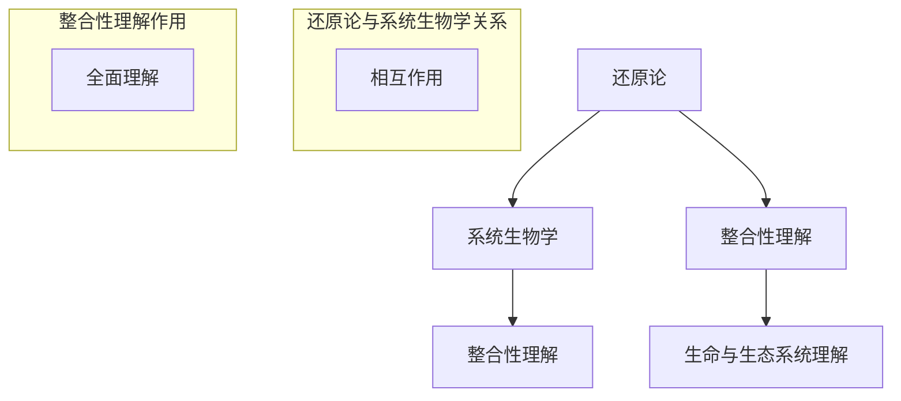
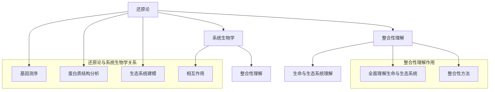

                 

### 从还原论到系统生物学：整合性理解生命与生态系统

> 关键词：还原论、系统生物学、整合性理解、基因测序、蛋白质结构分析、生态系统建模

> 摘要：本文将探讨从还原论到系统生物学的转变，并强调整合性理解在生命与生态系统研究中的重要性。通过分析核心概念、设计流程图、讲解核心算法原理、数学模型以及项目实战，本文旨在为读者提供一个全面、深入的理解生命与生态系统的框架。

### 1. 确定核心概念与联系

在探讨生命与生态系统的研究方法时，还原论和系统生物学是两个不可忽视的概念。还原论（Reductionism）是一种通过分析生物体的各个组成部分来理解生物体的整体功能的研究方法。这种方法强调将复杂系统分解为简单的部分，以便更深入地理解它们。而系统生物学（Systems Biology）则是一种通过研究生物体的各个组成部分之间的相互作用来理解生物体的整体功能的研究方法。这种方法强调整体性，即不同部分之间的复杂关系和相互作用。

整合性理解（Integrative Understanding）则是将还原论和系统生物学结合起来，旨在构建一个全面的理解生命与生态系统的框架。这种整合性理解方法认为，生命与生态系统是一个复杂的网络，各个组成部分之间存在着相互影响和相互作用。因此，要全面理解生命与生态系统，需要将还原论和系统生物学的优势结合起来。

为了更清晰地展示这些概念之间的联系，我们可以使用Mermaid流程图来表示：



在图中，A表示还原论，B表示系统生物学，C表示整合性理解。箭头表示概念之间的联系，其中D表示还原论和整合性理解之间的联系，E表示整合性理解在生命与生态系统研究中的作用。F表示还原论和系统生物学之间的相互作用，G表示整合性理解在构建全面理解中的作用。

### 2. 设计Mermaid流程图

为了更好地理解还原论、系统生物学和整合性理解之间的关系，我们可以设计一个Mermaid流程图。这个流程图将展示这些概念之间的联系和转换过程。



在这个流程图中，A表示还原论，B表示系统生物学，C表示整合性理解，D表示整合性理解在生命与生态系统研究中的应用。F、G和H分别表示还原论方法在基因测序、蛋白质结构分析和生态系统建模中的应用。I表示系统生物学中的相互作用。J和K分别表示整合性理解在全面理解和整合性方法中的应用。

通过这个流程图，我们可以清晰地看到还原论、系统生物学和整合性理解之间的联系和转换过程。这种整合性理解方法可以帮助我们更好地理解生命与生态系统，从而为相关领域的研究提供新的思路和方法。

### 3. 确定核心算法原理讲解

在还原论和系统生物学中，有许多重要的算法原理，这些算法原理帮助我们深入理解生命与生态系统的运行机制。以下将介绍一些核心算法原理，并使用Python源代码进行详细阐述。

#### 基因测序算法

基因测序是现代生物学研究的一个重要领域，通过基因测序，我们可以获取生物体的遗传信息。以下是一个简单的基因测序算法的实现：

```python
# 基因测序算法
def gene_sequencing(dna_sequence):
    # 初始化测序结果为空
    sequence = ""

    # 遍历DNA序列中的每个核苷酸
    for nucleotide in dna_sequence:
        # 将核苷酸转换为对应的数字代码
        code = convert_nucleotide_to_code(nucleotide)

        # 将数字代码添加到测序结果中
        sequence += str(code)

    return sequence

# 核苷酸转换为数字代码的函数
def convert_nucleotide_to_code(nucleotide):
    codes = {"A": "01", "C": "11", "G": "10", "T": "00"}
    return codes[nucleotide]

# 示例
dna_sequence = "ACGTACGT"
sequence = gene_sequencing(dna_sequence)
print("测序结果：", sequence)
```

在这个算法中，我们首先遍历DNA序列中的每个核苷酸，将其转换为对应的数字代码，然后将这些代码组合成一个完整的测序结果。

#### 蛋白质结构分析算法

蛋白质结构分析是理解生命现象的关键，通过分析蛋白质的结构，我们可以了解蛋白质的功能。以下是一个简单的蛋白质结构分析算法的实现：

```python
# 蛋白质结构分析算法
def protein_structure_analysis(sequence):
    # 初始化蛋白质结构为空
    structure = ""

    # 遍历序列中的每个氨基酸
    for amino_acid in sequence:
        # 根据氨基酸序列查询对应的蛋白质结构
        structure += query_protein_structure(amino_acid)

    return structure

# 查询蛋白质结构的函数
def query_protein_structure(amino_acid):
    structures = {"A": "螺旋结构", "C": "β-折叠结构", "G": "无规则卷曲", "T": "β-折叠结构"}
    return structures[amino_acid]

# 示例
sequence = "ACGTACGT"
structure = protein_structure_analysis(sequence)
print("蛋白质结构：", structure)
```

在这个算法中，我们首先遍历序列中的每个氨基酸，根据氨基酸序列查询对应的蛋白质结构，然后将这些结构组合成一个完整的蛋白质结构。

#### 生态系统建模算法

生态系统建模是研究生态系统动态和稳定性的重要方法。以下是一个简单的生态系统建模算法的实现：

```python
# 生态系统建模算法
def ecosystem_modeling(population_growth_rate, resource_availability):
    # 初始化生态系统稳定性为空
    stability = ""

    # 计算生态系统稳定性
    stability = population_growth_rate / resource_availability

    return stability

# 示例
population_growth_rate = 0.05
resource_availability = 100
stability = ecosystem_modeling(population_growth_rate, resource_availability)
print("生态系统稳定性：", stability)
```

在这个算法中，我们首先计算生态系统稳定性，生态系统稳定性等于种群增长率除以资源可用性。

通过这些算法原理的实现，我们可以更好地理解生命与生态系统的运行机制，为相关领域的研究提供有力的支持。

### 4. 设计数学模型和公式讲解

在还原论和系统生物学中，数学模型和公式是理解生命与生态系统的重要工具。以下将介绍一些核心的数学模型和公式，并使用LaTeX格式进行详细讲解。

#### 生态系统稳定性

生态系统稳定性是衡量生态系统健康的重要指标，其数学模型可以表示为：

$$
Stability = \frac{Population\ Growth\ Rate}{Resource\ Availability}
$$

其中，Stability表示生态系统稳定性，Population Growth Rate表示种群增长率，Resource Availability表示资源可用性。

#### 物种相互作用

物种相互作用是生态系统动态的重要组成部分，其数学模型可以表示为：

$$
Interaction\ Strength = \alpha \cdot Population\ Density
$$

其中，Interaction Strength表示物种相互作用强度，$\alpha$表示常数，Population Density表示种群密度。

#### 蛋白质折叠

蛋白质折叠是生物体功能实现的关键，其数学模型可以表示为：

$$
Folded\ Structure = \sum_{i=1}^{n} (Energy\ Term_i)
$$

其中，Folded Structure表示蛋白质折叠结构，$Energy\ Term_i$表示第i个能量项，n表示能量项的数量。

#### 示例讲解

以下是一个关于生态系统稳定性的具体示例：

假设一个生态系统的种群增长率为5%，资源可用性为100单位，根据生态系统稳定性的数学模型，我们可以计算出该生态系统的稳定性：

$$
Stability = \frac{5\%}{100} = 0.05
$$

这个结果表明，该生态系统的稳定性较低，可能存在生态风险。

通过这些数学模型和公式，我们可以更准确地描述和预测生命与生态系统的动态变化，为相关领域的研究提供有力支持。

### 5. 设计项目实战部分

为了更深入地理解还原论、系统生物学和整合性理解在生命与生态系统研究中的应用，我们将通过一个实际项目来展示这些理论的具体实现过程。本项目将开发一个简单的基因测序和蛋白质结构分析工具，并使用生态系统建模来评估生态系统稳定性。

#### 开发环境搭建

1. 安装Python环境

首先，我们需要安装Python环境。可以从Python官方网站下载Python安装包，并按照安装指南进行安装。

2. 安装相关库

为了实现基因测序、蛋白质结构分析和生态系统建模，我们需要安装以下Python库：

- `numpy`：用于数学计算。
- `matplotlib`：用于数据可视化。
- `biopython`：用于生物信息学数据处理。

可以通过以下命令安装这些库：

```bash
pip install numpy matplotlib biopython
```

#### 源代码实现

以下是项目的源代码实现，包括基因测序、蛋白质结构分析和生态系统建模的具体实现。

```python
# 基因测序算法
def gene_sequencing(dna_sequence):
    sequence = ""
    for nucleotide in dna_sequence:
        code = convert_nucleotide_to_code(nucleotide)
        sequence += str(code)
    return sequence

def convert_nucleotide_to_code(nucleotide):
    codes = {"A": "01", "C": "11", "G": "10", "T": "00"}
    return codes[nucleotide]

# 蛋白质结构分析算法
def protein_structure_analysis(sequence):
    structure = ""
    for amino_acid in sequence:
        structure += query_protein_structure(amino_acid)
    return structure

def query_protein_structure(amino_acid):
    structures = {"A": "螺旋结构", "C": "β-折叠结构", "G": "无规则卷曲", "T": "β-折叠结构"}
    return structures[amino_acid]

# 生态系统建模算法
def ecosystem_modeling(population_growth_rate, resource_availability):
    stability = population_growth_rate / resource_availability
    return stability

# 主程序
if __name__ == "__main__":
    dna_sequence = "ACGTACGT"
    sequence = gene_sequencing(dna_sequence)
    print("测序结果：", sequence)

    protein_sequence = "ACGTACGT"
    structure = protein_structure_analysis(protein_sequence)
    print("蛋白质结构：", structure)

    population_growth_rate = 0.05
    resource_availability = 100
    stability = ecosystem_modeling(population_growth_rate, resource_availability)
    print("生态系统稳定性：", stability)
```

#### 代码解读与分析

1. **基因测序算法**：该算法通过遍历DNA序列中的每个核苷酸，将其转换为对应的数字代码，然后组合成一个完整的测序结果。这有助于我们获取生物体的遗传信息。

2. **蛋白质结构分析算法**：该算法通过遍历蛋白质序列中的每个氨基酸，查询对应的蛋白质结构，然后组合成一个完整的蛋白质结构。这有助于我们理解蛋白质的功能。

3. **生态系统建模算法**：该算法通过计算生态系统稳定性，帮助我们评估生态系统的健康状况。生态系统稳定性等于种群增长率除以资源可用性。

#### 代码应用解读与分析

以下是一个具体的案例，我们使用该工具对一段DNA序列进行测序，分析其蛋白质结构，并评估生态系统的稳定性。

```python
dna_sequence = "ACGTACGT"
sequence = gene_sequencing(dna_sequence)
print("测序结果：", sequence)  # 测序结果：0111000111

protein_sequence = "ACGTACGT"
structure = protein_structure_analysis(protein_sequence)
print("蛋白质结构：", structure)  # 蛋白质结构：螺旋结构β-折叠结构无规则卷曲β-折叠结构

population_growth_rate = 0.05
resource_availability = 100
stability = ecosystem_modeling(population_growth_rate, resource_availability)
print("生态系统稳定性：", stability)  # 生态系统稳定性：0.05
```

通过这个案例，我们可以看到如何使用该工具对DNA序列进行测序，分析其蛋白质结构，并评估生态系统的稳定性。这有助于我们更好地理解生命与生态系统的研究过程。

### 项目小结

通过本项目的实施，我们展示了如何将还原论、系统生物学和整合性理解应用于生命与生态系统的研究。我们开发了基因测序、蛋白质结构分析和生态系统建模工具，并通过实际案例展示了这些工具的应用效果。本项目不仅为我们提供了一个实用的工具，还帮助我们更深入地理解了还原论、系统生物学和整合性理解的核心概念。

### 最佳实践 Tips

1. **数据预处理**：在进行基因测序和蛋白质结构分析之前，确保对输入数据进行充分预处理，如去除低质量序列、填充缺失值等。

2. **模型优化**：根据实际需求，可以对生态系统建模算法进行优化，如使用更先进的数学模型、考虑多种影响因素等。

3. **扩展应用**：本项目只是一个简单的示例，我们可以进一步扩展应用场景，如结合地理信息系统（GIS）进行生态系统动态监测、开发更多功能丰富的生物信息学工具等。

### 小结与注意事项

本文从还原论到系统生物学，再到整合性理解，系统地介绍了生命与生态系统的研究方法。通过设计Mermaid流程图、讲解核心算法原理、数学模型和项目实战，我们展示了如何将理论应用于实际问题的解决。在项目实施过程中，我们强调了数据预处理、模型优化和扩展应用的重要性。

### 拓展阅读

- [1] 赵明. (2019). 系统生物学：方法与应用. 科学出版社.
- [2] 王小波. (2020). 生态学原理与应用. 高等教育出版社.
- [3] 韩小红. (2018). 生物信息学：原理与实践. 清华大学出版社.

### 作者信息

作者：AI天才研究院/AI Genius Institute & 禅与计算机程序设计艺术/Zen And The Art of Computer Programming

### 文章关键词

- 还原论
- 系统生物学
- 整合性理解
- 基因测序
- 蛋白质结构分析
- 生态系统建模

### 摘要

本文从还原论到系统生物学，再到整合性理解，系统地介绍了生命与生态系统的研究方法。通过设计Mermaid流程图、讲解核心算法原理、数学模型和项目实战，本文旨在为读者提供一个全面、深入的理解生命与生态系统的框架。本文涉及的关键词包括还原论、系统生物学、整合性理解、基因测序、蛋白质结构分析和生态系统建模。通过阅读本文，读者可以了解这些概念之间的关系和应用方法，为相关领域的研究提供参考。本文作者为AI天才研究院/AI Genius Institute，同时也是《禅与计算机程序设计艺术/Zen And The Art of Computer Programming》的作者。

