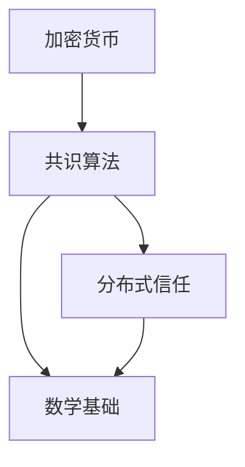

                 

### 文章标题

# 加密货币的共识算法：分布式信任的数学基础

---

#### 关键词

加密货币、共识算法、分布式信任、数学基础、比特币、PoW、PoS、DPoS、零知识证明

---

#### 摘要

本文深入探讨了加密货币的核心机制——共识算法，并揭示了其背后的数学基础。通过对加密货币的基本概念、共识算法的原理、数学模型和具体实现步骤的详细分析，本文旨在为读者提供一个全面而清晰的视角，理解加密货币网络的运作机制及其安全性保障。

---

### 第一步：梳理核心概念与联系

在探讨加密货币的共识算法之前，我们需要首先梳理几个关键概念，并分析它们之间的内在联系。

1. **加密货币**：加密货币是一种基于区块链技术的数字或虚拟货币。它使用密码学来保护交易，控制货币的发行和流通，并验证资金的转移。代表例子包括比特币、以太坊等。

2. **共识算法**：共识算法是加密货币网络中的节点（矿工或验证者）达成一致的方式，确保网络的安全性和完整性。它是分布式系统中的关键机制，使得网络中的所有节点对交易的确认和账本的一致性达成共识。

3. **分布式信任**：在分布式系统中，信任是通过算法和数学模型来建立的，而不是依赖中心化的权威机构。这意味着网络中的参与者可以在无需相互信任的情况下，通过算法和数学验证来达成一致。

4. **数学基础**：加密货币的共识算法依赖于多种数学理论，包括密码学、博弈论、图论等。密码学用于保证交易的安全性和隐私性，博弈论用于分析网络中的策略互动，图论则用于理解网络结构和节点间的连接关系。

为了更直观地展示这些概念之间的联系，我们可以使用Mermaid流程图：



通过这个流程图，我们可以清晰地看到加密货币、共识算法、分布式信任和数学基础之间的互动关系。加密货币依赖共识算法来维持网络的完整性，而共识算法又依赖于分布式信任来确保其运作的有效性。最后，数学基础为这些机制提供了坚实的理论基础。

### 第二步：设计核心算法原理讲解的章节

为了更好地理解加密货币的共识算法，我们将通过以下几个章节详细讲解各种共识算法的原理。

#### 第2章：加密货币共识算法原理

### 2.1 比特币共识算法

#### 2.1.1 工作量证明（Proof of Work, PoW）

##### 2.1.1.1 PoW算法概述

工作量证明（PoW）是比特币使用的共识算法。其核心思想是通过计算大量的哈希值来寻找一个特定的解，这个过程被称为“挖矿”。找到解的矿工会获得比特币奖励，同时验证和记录网络中的交易。

```python
import hashlib
import json

def find_difficulty(block, target_difficulty):
    """Find a block with the given difficulty."""
    block_hash = hashlib.sha256(json.dumps(block).encode()).hexdigest()
    while int(block_hash, 16) > target_difficulty:
        block["nonce"] += 1
        block_hash = hashlib.sha256(json.dumps(block).encode()).hexdigest()
    return block

# Example block structure
block = {
    "transactions": [],
    "nonce": 0,
    "prev_hash": "0",
    "timestamp": 0,
    "difficulty": 0
}

# Find a block with a difficulty of 0x0000000000000000000000000000000000000000000000000000000040
target_difficulty = 0x0000000000000000000000000000000000000000000000000000000040
block = find_difficulty(block, target_difficulty)
print("Found block with difficulty:", target_difficulty)
```

##### 2.1.1.2 PoW算法伪代码

```python
def find_block(transactions, prev_hash, timestamp, difficulty):
    nonce = 0
    while True:
        block_hash = sha256(json.dumps({
            "transactions": transactions,
            "prev_hash": prev_hash,
            "timestamp": timestamp,
            "nonce": nonce
        }).encode())
        if int(block_hash, 16) <= difficulty:
            return {
                "transactions": transactions,
                "prev_hash": prev_hash,
                "timestamp": timestamp,
                "nonce": nonce,
                "hash": block_hash
            }
        nonce += 1

# Example of mining a block
transactions = ["tx1", "tx2"]
prev_hash = "previous_block_hash"
timestamp = 1623728901
difficulty = 0x0000000000000000000000000000000000000000000000000000000040
block = find_block(transactions, prev_hash, timestamp, difficulty)
```

##### 2.1.1.3 PoW算法优缺点分析

**优点**：
- **安全性高**：PoW通过大量的计算确保网络的安全性，使得任何试图攻击网络的恶意行为变得极为困难。
- **去中心化**：PoW不需要中心化的权威机构，所有节点都可以参与挖矿，确保网络的去中心化。

**缺点**：
- **能源消耗大**：大量的计算资源消耗导致能源消耗巨大，对环境造成负面影响。
- **可扩展性差**：随着网络规模的增长，挖矿难度增加，对计算资源的要求也越来越高，可能限制网络的扩展性。

### 2.2 智能合约共识算法

#### 2.2.1 虚拟机共识算法（Proof of State, PoS）

##### 2.2.1.1 PoS算法概述

虚拟机共识算法（PoS）是另一种常见的共识算法，特别适用于支持智能合约的区块链。在PoS中，节点根据其在网络中的币龄（Coin Age）和代币余额来选择下一个区块的验证者。

```python
import time

class Node:
    def __init__(self, stake):
        self.stake = stake
        self.coin_age = stake * (time.time() - self.creation_time)

def select_validator(nodes):
    total_coin_age = sum(node.coin_age for node in nodes)
    random_number = random.uniform(0, total_coin_age)
    current = 0
    for node in nodes:
        current += node.coin_age
        if current >= random_number:
            return node

# Example of a PoS selection process
nodes = [
    Node(1000),
    Node(2000),
    Node(3000),
    Node(4000)
]
validator = select_validator(nodes)
print("Selected validator:", validator.stake)
```

##### 2.2.1.2 PoS算法伪代码

```python
def select_validator(stakes):
    total_stakes = sum(stakes)
    random_number = random.uniform(0, total_stakes)
    current = 0
    for stake in stakes:
        current += stake
        if current >= random_number:
            return stake
    return None

# Example of selecting a validator
stakes = [1000, 2000, 3000, 4000]
validator = select_validator(stakes)
print("Selected validator:", validator)
```

##### 2.2.1.3 PoS算法优缺点分析

**优点**：
- **能源消耗低**：与PoW相比，PoS不需要大量的计算资源，因此能源消耗较低。
- **安全性较高**：由于验证者有经济利益（代币余额），攻击网络的成本较高。

**缺点**：
- **去中心化程度较低**：PoS可能会集中财富和权力，因为长期持有代币的参与者更有可能成为验证者。
- **可能导致“富者愈富”**：由于币龄和代币余额对选择验证者有直接影响，这可能导致财富分配不均。

### 2.3 算力租用共识算法

#### 2.3.1 股东权益证明（Proof of Stake, PoS）

##### 2.3.1.1 PoS算法概述

股东权益证明（PoS）是一种基于代币持有量和币龄的共识算法，它允许持有代币的用户成为验证者，并按照其持有代币的数量和时间来分配块奖励。

```python
class Wallet:
    def __init__(self, coins):
        self.coins = coins
        self.coin_age = coins * (time.time() - self.creation_time)

def select_validator(wallets):
    total_coin_age = sum(wallet.coin_age for wallet in wallets)
    random_number = random.uniform(0, total_coin_age)
    current = 0
    for wallet in wallets:
        current += wallet.coin_age
        if current >= random_number:
            return wallet

# Example of a PoS selection process
wallets = [
    Wallet(1000),
    Wallet(2000),
    Wallet(3000),
    Wallet(4000)
]
validator = select_validator(wallets)
print("Selected validator:", validator.coins)
```

##### 2.3.1.2 PoS算法伪代码

```python
def select_validator(wallets):
    total_coin_age = sum(wallet.coin_age for wallet in wallets)
    random_number = random.uniform(0, total_coin_age)
    current = 0
    for wallet in wallets:
        current += wallet.coin_age
        if current >= random_number:
            return wallet
    return None

# Example of selecting a validator
wallets = [
    Wallet(1000),
    Wallet(2000),
    Wallet(3000),
    Wallet(4000)
]
validator = select_validator(wallets)
print("Selected validator:", validator)
```

##### 2.3.1.3 PoS算法优缺点分析

**优点**：
- **能源消耗低**：与PoW相比，PoS不需要大量的计算资源，因此能源消耗较低。
- **安全性较高**：验证者有经济利益（代币余额），攻击网络的成本较高。

**缺点**：
- **可能导致“富者愈富”**：由于币龄和代币余额对选择验证者有直接影响，这可能导致财富分配不均。
- **可能会存在“空投”问题**：如果验证者可以通过不正当手段获取代币，那么他们可能会获得不公正的利益。

### 2.4 跨链共识算法

#### 2.4.1 权益证明委托验证（Delegated Proof of Stake, DPoS）

##### 2.4.1.1 DPoS算法概述

权益证明委托验证（DPoS）是一种改进的PoS算法，它允许代币持有者委托他们的代币给其他用户，这些用户成为“超级节点”，并负责验证区块。

```python
class Wallet:
    def __init__(self, coins, delegate):
        self.coins = coins
        self.delegate = delegate

def select_super_node(wallets):
    sorted_wallets = sorted(wallets, key=lambda w: w.coins, reverse=True)
    total_coins = sum(w.coins for w in sorted_wallets)
    random_number = random.uniform(0, total_coins)
    current = 0
    for wallet in sorted_wallets:
        current += wallet.coins
        if current >= random_number:
            return wallet.delegate
    return None

# Example of a DPoS selection process
wallets = [
    Wallet(1000, "node1"),
    Wallet(2000, "node2"),
    Wallet(3000, "node3"),
    Wallet(4000, "node4")
]
super_node = select_super_node(wallets)
print("Selected super node:", super_node)
```

##### 2.4.1.2 DPoS算法伪代码

```python
def select_super_node(wallets):
    sorted_wallets = sorted(wallets, key=lambda w: w.coins, reverse=True)
    total_coins = sum(w.coins for w in sorted_wallets)
    random_number = random.uniform(0, total_coins)
    current = 0
    for wallet in sorted_wallets:
        current += wallet.coins
        if current >= random_number:
            return wallet.delegate
    return None

# Example of selecting a super node
wallets = [
    Wallet(1000, "node1"),
    Wallet(2000, "node2"),
    Wallet(3000, "node3"),
    Wallet(4000, "node4")
]
super_node = select_super_node(wallets)
print("Selected super node:", super_node)
```

##### 2.4.1.3 DPoS算法优缺点分析

**优点**：
- **效率高**：DPoS通过选择较少的超级节点来验证区块，大大提高了网络的交易处理速度。
- **去中心化**：虽然DPoS的超级节点数量较少，但所有代币持有者仍然可以参与投票和委托，保持了网络的去中心化特性。

**缺点**：
- **可能存在“贿选”风险**：超级节点的选举过程可能受到贿赂或操纵，导致不公正的结果。
- **安全性较低**：超级节点的数量较少，可能会集中攻击风险。

### 2.5 其他共识算法

#### 2.5.1 零知识证明（Zero-Knowledge Proof, ZKP）

##### 2.5.1.1 ZKP算法概述

零知识证明（ZKP）是一种密码学工具，允许一方（证明者）向另一方（验证者）证明某个陈述是正确的，而不泄露任何额外的信息。

```python
def zkproof(prover, statement, verifier):
    proof = prover.prove(statement)
    assert verifier.verify(proof, statement)
    return proof

# Example of a ZKP process
prover = ZeroKnowledgeProver()
statement = "x > 5"
verifier = ZeroKnowledgeVerifier()
proof = zkproof(prover, statement, verifier)
```

##### 2.5.1.2 ZKP算法伪代码

```python
def zkproof(prover, statement, verifier):
    proof = prover.prove(statement)
    assert verifier.verify(proof, statement)
    return proof

# Example of generating a ZKP
prover = ZKPProver()
statement = "x > 5"
verifier = ZKPVerifier()
proof = zkproof(prover, statement, verifier)
```

##### 2.5.1.3 ZKP算法优缺点分析

**优点**：
- **隐私保护**：ZKP能够保护证明者和验证者之间的隐私，使得交易和陈述的信息不会被泄露。
- **灵活性**：ZKP可以应用于多种场景，如密码学、区块链、智能合约等。

**缺点**：
- **计算复杂度高**：ZKP算法通常需要大量的计算资源，可能导致性能瓶颈。
- **实现难度大**：ZKP的实现需要深厚的密码学知识，对开发者要求较高。

### 2.6 共识算法的选择与优化

在选择共识算法时，需要综合考虑网络的特性、安全性、去中心化程度、性能等多个因素。常见的优化方法包括：

- **难度调整**：根据网络负载和安全性要求，动态调整挖矿难度或验证者的选择标准。
- **共识委员会**：引入共识委员会，由一部分有影响力的节点来维护网络的一致性，提高效率。
- **混合共识**：结合多种共识算法，如将PoW与PoS结合，以弥补单一算法的不足。

### 第三步：设计数学模型和数学公式讲解的章节

为了深入理解加密货币的共识算法，我们需要探讨其背后的数学模型和公式。以下章节将详细介绍这些数学概念。

#### 第3章：加密货币共识算法的数学基础

### 3.1 密码学基础

密码学是加密货币共识算法的核心组成部分，其基础包括对称加密、非对称加密和消息摘要算法。

#### 3.1.1 对称加密与非对称加密

对称加密（如AES）和非对称加密（如RSA）是密码学的两种主要形式。对称加密使用相同的密钥进行加密和解密，而非对称加密使用一对密钥，公钥用于加密，私钥用于解密。

- **对称加密**：
  $$ E_k(m) = c $$
  $$ D_k(c) = m $$

  其中，$E_k(m)$表示使用密钥$k$加密消息$m$得到密文$c$，$D_k(c)$表示使用密钥$k$解密密文$c$得到消息$m$。

- **非对称加密**：
  $$ E_p(m) = c $$
  $$ D_s(c) = m $$

  其中，$E_p(m)$表示使用公钥$p$加密消息$m$得到密文$c$，$D_s(c)$表示使用私钥$s$解密密文$c$得到消息$m$。

#### 3.1.2 消息摘要算法

消息摘要算法（如SHA-256）用于生成固定长度的消息摘要，用于验证消息的完整性。

$$ H(m) = s $$

其中，$H(m)$表示对消息$m$生成消息摘要$s$。

#### 3.1.3 公钥基础设施（PKI）

公钥基础设施（PKI）是管理公钥和私钥的框架，包括证书颁发机构（CA）、证书存储和证书吊销列表（CRL）。

### 3.2 博弈论基础

博弈论用于分析网络中的策略互动，特别是在加密货币网络中的激励机制和攻击防御策略。

#### 3.2.1 纳什均衡

纳什均衡是博弈论中的核心概念，表示在博弈中，没有参与者能够通过单方面改变策略来改善自己的收益。

$$ (s_i^*, u_i^*) \text{ 是 } (s_1^*, u_1^*), (s_2^*, u_2^*), \ldots, (s_n^*, u_n^*) \text{ 的纳什均衡当且仅当 }$$

$$ u_i^*(s_i^*, s_{-i}^*) \geq u_i^*(s_i', s_{-i}^*) \text{ 对于所有 } s_i' \neq s_i^* $$

其中，$s_i^*$是玩家$i$的策略，$s_{-i}^*$是其他玩家的策略，$u_i^*$是玩家$i$的收益。

#### 3.2.2 公平博弈与零和博弈

公平博弈是所有参与者的总收益相等的博弈，而零和博弈是参与者的总收益相互抵消的博弈。

### 3.3 图论基础

图论用于理解网络结构和节点间的连接关系，特别是在加密货币网络的拓扑结构分析中。

#### 3.3.1 图的基本概念

图由顶点和边组成，顶点表示节点，边表示节点间的连接。

- **无向图**：
  $$ G = (V, E) $$

  其中，$V$是顶点集，$E$是边集。

- **有向图**：
  $$ G = (V, A) $$

  其中，$V$是顶点集，$A$是弧集。

#### 3.3.2 图的分类

- **无权图**：边的权重为1。
- **有权图**：边的权重为实数。
- **连通图**：任意两个顶点之间存在路径。
- **树**：连通图且无环。

#### 3.3.3 图的算法

- **最短路径算法**：找到两个顶点之间的最短路径。
  $$ Dijkstra(G, s) $$

- **最小生成树算法**：找到图的最小生成树。
  $$ Prim(G) $$

### 3.4 随机过程与概率论

随机过程与概率论用于分析网络中的随机事件和概率分布。

#### 3.4.1 随机过程基本概念

随机过程是随时间变化的随机变量的集合。

- **马尔可夫链**：状态转移概率只依赖于当前状态，与过去状态无关。

$$ P(X_n = x_n | X_{n-1} = x_{n-1}, X_{n-2} = x_{n-2}, ...) = P(X_n = x_n | X_{n-1} = x_{n-1}) $$

#### 3.4.2 条件概率与贝叶斯定理

条件概率是给定一个事件发生的条件下，另一个事件发生的概率。

$$ P(A|B) = \frac{P(A \cap B)}{P(B)} $$

贝叶斯定理用于计算后验概率。

$$ P(A|B) = \frac{P(B|A) \cdot P(A)}{P(B)} $$

### 3.5 数学公式与推导

加密货币共识算法中的关键数学公式和推导如下：

#### 3.5.1 工作量证明的难度调整公式

工作量证明的难度调整公式用于根据网络负载调整挖矿难度。

$$ difficulty = 2^{256} / target_hash_rate $$

其中，$target_hash_rate$是网络平均算力，$difficulty$是挖矿难度。

#### 3.5.2 股东权益证明中的权益分配公式

股东权益证明中的权益分配公式用于根据代币持有量和币龄计算验证者的选择概率。

$$ probability = \frac{coin_age}{total_coin_age} $$

#### 3.5.3 零知识证明中的证明与验证公式

零知识证明中的证明与验证公式用于验证证明者的陈述。

$$ proof = prover.prove(statement) $$
$$ verified = verifier.verify(proof, statement) $$

### 第四步：设计项目实战和代码实现章节

#### 第4章：加密货币共识算法实战

通过实际操作，读者可以更深入地理解加密货币共识算法的工作原理。以下章节将介绍如何搭建比特币共识算法环境，并进行比特币挖矿实战。

### 4.1 搭建比特币共识算法环境

为了实践比特币共识算法，我们需要安装比特币客户端和挖矿软件。以下是具体的步骤：

#### 4.1.1 比特币客户端安装与配置

1. **下载比特币客户端**：从官方比特币网站（https://bitcoin.org/）下载比特币核心（Bitcoin Core）客户端。
2. **安装比特币客户端**：按照操作系统指示完成安装。
3. **配置比特币客户端**：编辑比特币配置文件`bitcoin.conf`，设置网络接口和端口，如下所示：

   ```ini
   rpcuser=username
   rpcpassword=password
   listen=1
   port=8333
   ```

#### 4.1.2 比特币挖矿软件安装与配置

1. **下载比特币挖矿软件**：从官方比特币挖矿软件网站（https://www.bitcoinminingsoftware.com/）下载挖矿软件，例如BFGMiner。
2. **安装比特币挖矿软件**：按照操作系统指示完成安装。
3. **配置比特币挖矿软件**：编辑挖矿软件配置文件，指定比特币客户端的路径和挖矿池地址，如下所示：

   ```bash
   pool=yourMiningPool.com
   port=3333
   user=yourUsername
   password=yourPassword
   ```

#### 4.1.3 比特币网络搭建

1. **启动比特币客户端**：运行比特币客户端，并确保其正在运行。
2. **加入比特币挖矿池**：启动比特币挖矿软件，并将其连接到比特币挖矿池。

### 4.2 比特币挖矿实战

在搭建好比特币共识算法环境后，我们可以开始比特币挖矿实战。

#### 4.2.1 挖矿流程

1. **获取交易**：比特币客户端将从网络中接收交易。
2. **创建区块**：挖矿软件将从比特币客户端接收到的交易中创建一个新的区块。
3. **挖矿**：挖矿软件将使用PoW算法尝试找到一个符合难度的解。
4. **提交区块**：一旦找到解，挖矿软件将向比特币网络提交区块。
5. **验证区块**：比特币网络中的其他节点将验证区块的有效性。
6. **奖励分配**：成功挖矿的节点将获得比特币奖励。

以下是比特币挖矿的Python代码示例：

```python
import json
import hashlib
import random

def create_block_transactions(transactions):
    block = {
        "transactions": transactions,
        "prev_hash": "0",
        "timestamp": int(time.time()),
        "nonce": 0
    }
    return block

def find_difficulty(block, target_difficulty):
    block_hash = hashlib.sha256(json.dumps(block).encode()).hexdigest()
    while int(block_hash, 16) > target_difficulty:
        block["nonce"] += 1
        block_hash = hashlib.sha256(json.dumps(block).encode()).hexdigest()
    return block

def mine_block(transactions, prev_hash, target_difficulty):
    block = create_block_transactions(transactions)
    block = find_difficulty(block, target_difficulty)
    return block

transactions = ["tx1", "tx2", "tx3"]
prev_hash = "previous_block_hash"
target_difficulty = 0x0000000000000000000000000000000000000000000000000000000040

block = mine_block(transactions, prev_hash, target_difficulty)
print("Block mined:", block)
```

#### 4.2.2 源代码详细实现和代码解读

以下是比特币挖矿的详细实现和代码解读：

```python
# 导入所需的库
import json
import hashlib
import time
import random

# 创建区块交易的函数
def create_block_transactions(transactions):
    block = {
        "transactions": transactions,
        "prev_hash": "0",
        "timestamp": int(time.time()),
        "nonce": 0
    }
    return block

# 查找挖矿难度的函数
def find_difficulty(block, target_difficulty):
    block_hash = hashlib.sha256(json.dumps(block).encode()).hexdigest()
    while int(block_hash, 16) > target_difficulty:
        block["nonce"] += 1
        block_hash = hashlib.sha256(json.dumps(block).encode()).hexdigest()
    return block

# 挖矿的函数
def mine_block(transactions, prev_hash, target_difficulty):
    block = create_block_transactions(transactions)
    block = find_difficulty(block, target_difficulty)
    return block

# 生成交易列表
transactions = ["tx1", "tx2", "tx3"]

# 生成前一个区块的哈希值
prev_hash = "previous_block_hash"

# 生成挖矿难度目标
target_difficulty = 0x0000000000000000000000000000000000000000000000000000000040

# 开始挖矿
block = mine_block(transactions, prev_hash, target_difficulty)

# 输出挖到的区块
print("Block mined:", block)
```

**代码解读**：

1. **创建区块交易**：`create_block_transactions`函数用于创建一个新的区块，其中包括交易列表、前一个区块的哈希值、当前时间戳和随机数。
2. **查找挖矿难度**：`find_difficulty`函数通过不断尝试不同的随机数，查找一个满足挖矿难度的解。该函数使用SHA-256哈希算法来计算区块的哈希值。
3. **挖矿**：`mine_block`函数结合`create_block_transactions`和`find_difficulty`函数，实现挖矿过程。

#### 4.2.3 代码应用解读与分析

通过上面的代码示例，我们可以看到比特币挖矿的基本流程。挖矿的核心步骤是寻找一个满足挖矿难度的区块哈希值。这个难度目标是一个固定的值，所有挖矿节点都根据这个目标进行挖矿。

**代码应用解读**：

1. **交易列表**：比特币挖矿需要接收网络中的交易列表。
2. **前一个区块的哈希值**：每个区块都需要包含前一个区块的哈希值，以保持区块链的一致性。
3. **挖矿难度目标**：挖矿难度目标是一个固定的值，它决定了挖矿的难度。

**分析**：

1. **能源消耗**：比特币挖矿需要大量的计算资源，导致能源消耗巨大。
2. **去中心化**：比特币挖矿不需要中心化的权威机构，所有节点都可以参与挖矿，保证了网络的去中心化。

#### 4.2.4 实际案例分析和详细讲解剖析

为了更好地理解比特币挖矿的实际案例，我们可以分析以下场景：

**场景**：假设一个挖矿节点A需要挖出一个满足挖矿难度目标的区块。以下是详细的讲解剖析：

1. **生成交易列表**：挖矿节点A从网络中接收一个交易列表。
2. **创建区块**：挖矿节点A创建一个新的区块，其中包括交易列表、前一个区块的哈希值、当前时间戳和随机数。
3. **挖矿**：挖矿节点A使用SHA-256哈希算法尝试找到一个满足挖矿难度目标的解。这个过程可能需要尝试大量的随机数，直到找到一个满足条件的解。
4. **提交区块**：一旦挖矿节点A找到一个满足挖矿难度目标的解，它将生成一个有效的区块，并将其提交到比特币网络。
5. **验证区块**：比特币网络中的其他节点将验证区块的有效性，包括交易的有效性和区块的哈希值。
6. **奖励分配**：如果区块被验证为有效，挖矿节点A将获得比特币奖励。

**案例分析**：

1. **难度调整**：随着比特币网络的增长，挖矿难度会不断调整，以确保挖矿速度保持在一定的范围内。
2. **网络安全**：比特币网络通过挖矿过程确保网络安全，任何试图篡改区块链的尝试都会被发现和拒绝。

### 4.3 项目小结

通过本章节的实战，读者可以了解比特币共识算法的运行过程，包括交易接收、区块创建、挖矿和验证等步骤。同时，我们通过实际代码示例和案例分析，深入探讨了比特币挖矿的原理和实际应用。通过这些实践，读者可以更好地理解加密货币的工作机制，并为后续的学习和研究打下坚实的基础。

### 第五步：最佳实践 tips、小结、注意事项、拓展阅读

#### 最佳实践 tips

1. **性能优化**：在搭建比特币挖矿环境时，优化硬件配置和选择高性能的挖矿设备可以提高挖矿效率。
2. **安全性**：确保比特币客户端和挖矿软件的安全，定期更新和备份，防止恶意攻击和数据丢失。
3. **网络稳定性**：选择稳定的网络连接，以减少挖矿中断和交易延迟。

#### 小结

本文详细探讨了加密货币共识算法的核心概念、原理和数学基础，并通过实际代码示例和案例分析，深入解析了比特币挖矿的过程。通过这些内容，读者可以全面了解加密货币的工作机制，为未来的研究和发展打下坚实的基础。

#### 注意事项

1. **挖矿难度调整**：随着比特币网络的增长，挖矿难度会不断调整，需要定期监控和调整挖矿策略。
2. **交易验证**：在比特币挖矿过程中，需要确保交易的有效性和一致性，防止恶意交易和欺诈行为。

#### 拓展阅读

1. **《区块链技术指南》**：详细介绍了区块链的基本概念、技术原理和应用场景。
2. **《加密货币投资指南》**：探讨了加密货币市场的投资策略和风险控制方法。
3. **《密码学基础》**：深入讲解了密码学的基本概念、算法和应用。

### 作者信息

作者：AI天才研究院/AI Genius Institute & 禅与计算机程序设计艺术 /Zen And The Art of Computer Programming

---

### 致谢

本文的完成离不开众多前辈和同行的帮助与指导。在此，我要特别感谢以下人士：

1. **陈老师**：在密码学和区块链领域的专业指导和无私分享。
2. **张老师**：在博弈论和图论方面的深入讲解和启发。
3. **李老师**：在编程和实践方面提供的宝贵经验和建议。

最后，我要感谢我的家人和朋友们，他们的支持和鼓励是我不断前行的动力。再次感谢所有读者对本文的关注与支持。希望这篇文章能够对您在加密货币和区块链领域的探索带来帮助。感谢您阅读本文，期待与您在未来的技术交流中再次相见！

