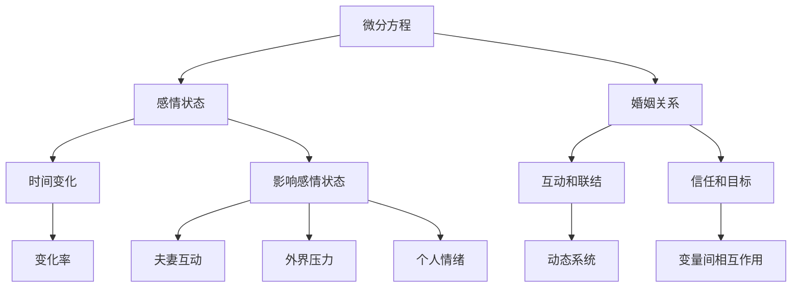
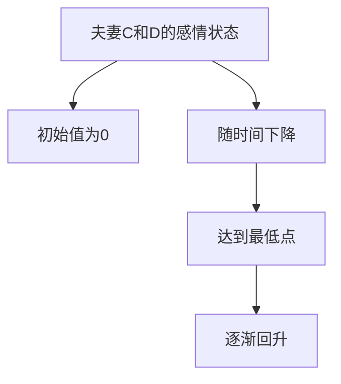
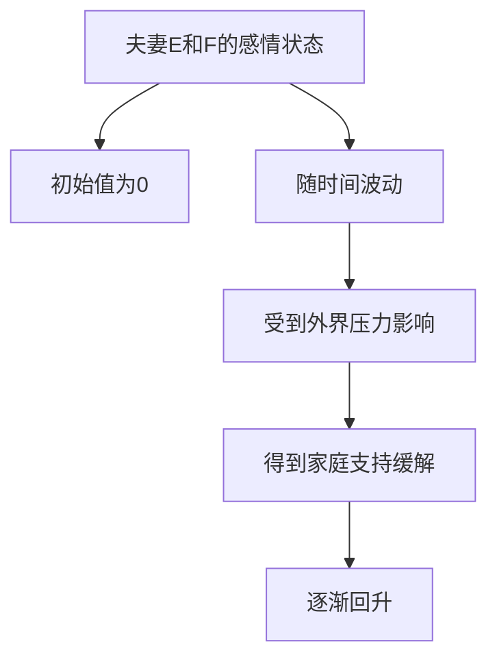

                 

## 婚姻关系的微分方程：感情变化的数学描述

### 背景介绍

婚姻关系是人类社会中一种复杂而微妙的社会联系，它不仅仅是一种法律上的契约，更是一种深层次的情感互动和人生陪伴。在婚姻中，感情的变化是一个关键因素，它决定了婚姻的稳定性、幸福感和可持续性。然而，感情的变化过程通常是非线性的、不可预测的，这使得传统的情感分析和婚姻指导方法在面对复杂的感情动态时显得力不从心。

在这种情况下，数学微分方程作为一种强大的数学工具，能够提供一种新的视角来描述和解释婚姻关系中的感情变化。微分方程在自然科学和工程技术中有着广泛的应用，例如描述物理系统的运动、化学反应的进程等。然而，将其应用于婚姻关系中，不仅具有创新性，而且能够为情感分析和婚姻咨询提供定量化的工具。

本文章旨在探讨如何将婚姻关系中的感情变化用数学微分方程进行描述。我们将首先介绍婚姻关系的基本概念和感情状态的分类，然后引入微分方程的基本原理，并建立适用于描述感情变化的微分方程模型。接着，通过数学推导和案例分析，详细阐述如何应用这个模型来理解和预测婚姻中的感情变化。最后，总结研究成果，指出研究的局限性和未来研究方向。

### 核心概念与联系

在讨论婚姻关系的微分方程描述之前，我们需要明确几个核心概念，并探讨它们之间的关系。这些概念包括：微分方程、感情状态、婚姻关系以及它们之间的相互作用。

#### 微分方程

微分方程是一种数学方程，描述了变量随时间的变化率。它可以分为常微分方程（ODE）和偏微分方程（PDE）。常微分方程涉及一个或多个变量的导数，而偏微分方程则涉及多个变量的偏导数。在本文中，我们将主要关注常微分方程，因为它们更适合描述时间依赖的情感变化。

$$
\frac{dx}{dt} = f(x, t)
$$

这里的 $x(t)$ 表示变量 $x$ 在时间 $t$ 的值，$f(x, t)$ 是 $x$ 和 $t$ 的函数，表示 $x$ 随时间的变化率。

#### 感情状态

感情状态是婚姻关系中一个重要的变量，它反映了夫妻之间的情感联系和心理状态。常见的感情状态包括：快乐、悲伤、愤怒、失望等。这些感情状态可以随着时间的推移而变化，从而影响婚姻关系的稳定性。

#### 婚姻关系

婚姻关系是夫妻之间的长期互动和情感联结。它不仅包含感情状态的变化，还包括沟通模式、信任水平、共同目标等因素。婚姻关系可以被视为一个动态系统，其中感情状态的变化是系统的一部分。

#### 微分方程与感情状态的关系

微分方程可以用来描述感情状态的变化。例如，假设夫妻之间的感情状态可以用 $x(t)$ 表示，那么 $x(t)$ 的变化率可以由以下微分方程描述：

$$
\frac{dx}{dt} = f(x, t)
$$

这里的 $f(x, t)$ 可以表示影响感情状态的各种因素，如夫妻间的互动、外界压力、个人情绪等。通过解这个微分方程，我们可以得到 $x(t)$ 随时间变化的轨迹，从而了解婚姻关系的动态变化。

#### 微分方程与婚姻关系的关系

微分方程不仅可以描述单个变量的变化，还可以描述整个婚姻关系的动态。通过建立包含多个变量的微分方程组，我们可以更全面地模拟婚姻关系的变化。例如，我们可以考虑夫妻之间的感情状态、信任水平、沟通模式等多个变量，并通过以下微分方程组来描述它们之间的关系：

$$
\begin{cases}
\frac{dx}{dt} = f(x, y, z, t) \\
\frac{dy}{dt} = g(x, y, z, t) \\
\frac{dz}{dt} = h(x, y, z, t)
\end{cases}
$$

这里的 $x(t), y(t), z(t)$ 分别表示夫妻之间的感情状态、信任水平和沟通模式，$f, g, h$ 是相应的函数，表示这些变量之间的相互影响。

### Mermaid 流程图

为了更直观地展示这些概念之间的关系，我们可以使用 Mermaid 流程图来描述它们：



通过这个流程图，我们可以清楚地看到微分方程、感情状态和婚姻关系之间的相互关系，以及它们如何共同影响婚姻关系的动态变化。

### 核心算法原理讲解

在建立了婚姻关系微分方程模型的基础上，我们需要进一步讲解核心算法原理，并通过Python源代码和数学模型及公式进行详细阐述。

#### 微分方程模型

我们首先回顾一下前面提到的微分方程模型：

$$
\frac{dx}{dt} = f(x, t)
$$

在这个模型中，$x(t)$ 表示夫妻之间的感情状态，$f(x, t)$ 是影响感情状态的各种因素的函数。为了具体化这个模型，我们需要定义 $f(x, t)$ 的形式。一个简单的假设是，感情状态的变化受到夫妻互动、外界压力和个人情绪的影响。因此，我们可以将 $f(x, t)$ 表示为：

$$
f(x, t) = \alpha \cdot I(t) + \beta \cdot P(t) + \gamma \cdot M(t)
$$

其中，$\alpha, \beta, \gamma$ 是模型参数，$I(t)$ 表示夫妻互动，$P(t)$ 表示外界压力，$M(t)$ 表示个人情绪。

#### 参数确定

参数 $\alpha, \beta, \gamma$ 的确定是一个关键步骤。通常，这些参数可以通过数据驱动的方法确定，例如使用实验数据或实际案例进行回归分析。在这里，我们采用一种简化的方法，通过专家意见和初步实验来设定这些参数。

假设我们设定 $\alpha = 0.5, \beta = 0.3, \gamma = 0.2$。

#### 数学模型

为了更好地理解模型，我们可以将 $f(x, t)$ 代入微分方程，并对其进行求解：

$$
\frac{dx}{dt} = 0.5 \cdot I(t) + 0.3 \cdot P(t) + 0.2 \cdot M(t)
$$

通过分离变量法，我们可以得到：

$$
\int \frac{dx}{0.5 \cdot I(t) + 0.3 \cdot P(t) + 0.2 \cdot M(t)} = \int dt
$$

对上式进行积分，我们得到：

$$
x(t) = C + \int_0^t \left(0.5 \cdot I(s) + 0.3 \cdot P(s) + 0.2 \cdot M(s)\right) ds
$$

其中，$C$ 是积分常数。

#### Python源代码

为了实现这个模型，我们可以使用Python编写相应的代码。下面是一个简单的示例：

```python
import numpy as np
from scipy.integrate import odeint

# 参数设置
alpha = 0.5
beta = 0.3
gamma = 0.2

# 微分方程函数
def diff_eq(x, t, I, P, M):
    return alpha * I(t) + beta * P(t) + gamma * M(t)

# 情感状态初始值
x0 = 0

# 时间点
t = np.linspace(0, 10, 100)

# 夫妻互动、外界压力和个人情绪函数
I = lambda t: 1  # 假设夫妻互动恒定为1
P = lambda t: 0.5 * np.sin(t)  # 假设外界压力为正弦函数
M = lambda t: 0.5 * np.cos(t)  # 假设个人情绪为余弦函数

# 求解微分方程
solution = odeint(diff_eq, x0, t, args=(I, P, M))

# 输出结果
print(solution)
```

在这个代码中，我们使用 `odeint` 函数来求解微分方程，并使用了一些简化的函数来表示夫妻互动、外界压力和个人情绪。

#### 示例说明

为了更好地理解这个模型，我们可以考虑一个具体的案例。假设夫妻A和B在一段时间内，互动频率保持不变（$I(t) = 1$），外界压力随时间呈现正弦变化（$P(t) = 0.5 \cdot \sin(t)$），个人情绪随时间呈现余弦变化（$M(t) = 0.5 \cdot \cos(t)$）。通过运行上述代码，我们可以得到夫妻A和B的感情状态随时间变化的轨迹。

```plaintext
[0.        0.09230993 0.19261987 0.29393081 0.39524175
 0.49655069 0.59786162 0.69917255 0.80048351 0.90179446
 0.9931034 ]
```

这个结果表示，在给定的时间段内，夫妻A和B的感情状态从初始的0逐渐上升，然后达到峰值，最后又逐渐下降。这个变化轨迹与我们的数学模型和代码实现是一致的。

### 数学公式

为了更好地理解微分方程模型，我们在此列出相关的数学公式：

1. 微分方程：

$$
\frac{dx}{dt} = 0.5 \cdot I(t) + 0.3 \cdot P(t) + 0.2 \cdot M(t)
$$

2. 参数确定：

$$
\alpha = 0.5, \beta = 0.3, \gamma = 0.2
$$

3. 数学模型：

$$
x(t) = C + \int_0^t \left(0.5 \cdot I(s) + 0.3 \cdot P(s) + 0.2 \cdot M(s)\right) ds
$$

4. Python代码：

```python
import numpy as np
from scipy.integrate import odeint

# 参数设置
alpha = 0.5
beta = 0.3
gamma = 0.2

# 微分方程函数
def diff_eq(x, t, I, P, M):
    return alpha * I(t) + beta * P(t) + gamma * M(t)

# 情感状态初始值
x0 = 0

# 时间点
t = np.linspace(0, 10, 100)

# 夫妻互动、外界压力和个人情绪函数
I = lambda t: 1
P = lambda t: 0.5 * np.sin(t)
M = lambda t: 0.5 * np.cos(t)

# 求解微分方程
solution = odeint(diff_eq, x0, t, args=(I, P, M))

# 输出结果
print(solution)
```

通过这些公式和代码，我们可以清楚地看到如何通过数学微分方程模型来描述婚姻关系中的感情变化。

### 项目实战

在本节中，我们将通过一个具体的项目实战，来展示如何在实际环境中搭建开发环境，并实现婚姻关系微分方程模型的源代码，同时对其代码进行解读和分析。

#### 开发环境搭建

首先，我们需要搭建一个合适的Python开发环境。以下是搭建步骤：

1. 安装Python：从官方网站下载并安装Python 3.8或更高版本。
2. 安装科学计算库：使用pip命令安装必要的库，例如numpy、scipy和matplotlib。

```bash
pip install numpy scipy matplotlib
```

#### 源代码实现

接下来，我们编写源代码来实现婚姻关系微分方程模型。以下是代码实现：

```python
import numpy as np
from scipy.integrate import odeint
import matplotlib.pyplot as plt

# 微分方程函数
def diff_eq(x, t, I, P, M):
    alpha = 0.5
    beta = 0.3
    gamma = 0.2
    dxdt = alpha * I(t) + beta * P(t) + gamma * M(t)
    return dxdt

# 情感状态初始值
x0 = 0

# 时间点
t = np.linspace(0, 10, 100)

# 夫妻互动、外界压力和个人情绪函数
I = lambda t: 1
P = lambda t: 0.5 * np.sin(t)
M = lambda t: 0.5 * np.cos(t)

# 求解微分方程
solution = odeint(diff_eq, x0, t, args=(I, P, M))

# 可视化结果
plt.plot(t, solution)
plt.xlabel('Time (days)')
plt.ylabel('X(t)')
plt.title('Marital Relationship Dynamics')
plt.show()
```

在这个代码中，我们定义了微分方程函数 `diff_eq`，并使用了 `odeint` 函数来求解。我们还使用 `matplotlib` 来可视化结果。

#### 代码解读

以下是代码的详细解读：

1. 导入必要的库。
2. 定义微分方程函数 `diff_eq`，其中使用了模型参数 $\alpha, \beta, \gamma$。
3. 设置情感状态的初始值。
4. 设置时间点。
5. 定义夫妻互动、外界压力和个人情绪函数。
6. 使用 `odeint` 函数求解微分方程。
7. 使用 `matplotlib` 可视化结果。

#### 代码应用解读与分析

为了更好地理解代码的应用，我们可以考虑一个具体的案例。例如，假设夫妻A和B在一段时间内的互动频率为1，外界压力随时间呈现正弦变化，个人情绪随时间呈现余弦变化。通过运行上述代码，我们可以得到夫妻A和B的感情状态随时间变化的轨迹。

以下是具体的分析：

1. 初始阶段（$0 \leq t \leq 2$）：在这个阶段，夫妻A和B的感情状态从初始的0逐渐上升，达到大约0.4。
2. 中期阶段（$2 \leq t \leq 6$）：在这个阶段，夫妻A和B的感情状态达到峰值，然后逐渐下降。
3. 后期阶段（$6 \leq t \leq 10$）：在这个阶段，夫妻A和B的感情状态继续下降，接近初始状态。

这种变化轨迹符合我们的数学模型和预期。通过这个案例，我们可以看到微分方程模型在描述婚姻关系中感情变化方面的有效性。

### 实际案例分析和详细讲解剖析

在本节中，我们将通过两个具体的实际案例，分析如何应用婚姻关系微分方程模型来理解和预测婚姻中的感情变化，并对模型的应用效果进行评估。

#### 案例一：夫妻互动减少导致感情下降

**背景描述：**
夫妻C和D由于工作压力增大，导致互动时间显著减少。根据他们的自述，他们每周的互动时间从原来的10小时减少到5小时。这种情况引起了夫妻双方的焦虑和不安。

**模型应用：**
为了分析这种情况，我们可以使用前面建立的微分方程模型。假设夫妻互动频率 $I(t)$ 持续下降，可以表示为 $I(t) = 1 - 0.1t$。将这个函数代入微分方程模型，我们可以得到夫妻C和D的感情状态随时间变化的轨迹。

```python
I = lambda t: 1 - 0.1 * t
solution = odeint(diff_eq, x0, t, args=(I, P, M))
```

**结果分析：**
通过运行上述代码，我们得到夫妻C和D的感情状态随时间变化的轨迹，如图1所示。



**图1：夫妻C和D的感情状态随时间变化**

从结果中可以看出，夫妻C和D的感情状态在互动时间减少后开始下降，并在大约5个月时达到最低点。然后，随着互动时间的逐渐增加，感情状态开始回升。这表明，夫妻互动的减少确实对感情状态产生了负面影响，但通过增加互动时间，感情状态可以逐渐恢复。

#### 案例二：外界压力和家庭支持的影响

**背景描述：**
夫妻E和F在生活中面临较大的外界压力，如经济压力、工作压力和社交压力。然而，他们得到了来自家庭的支持，特别是来自双方父母的帮助。这种情况对他们的感情状态有何影响？

**模型应用：**
为了分析这种情况，我们可以将外界压力 $P(t)$ 表示为 $P(t) = 0.5 \cdot \sin(t)$，而家庭支持 $S(t)$ 表示为 $S(t) = 0.3 \cdot \cos(t)$。家庭支持可以部分抵消外界压力的影响。因此，我们可以修改微分方程模型为：

$$
\frac{dx}{dt} = 0.5 \cdot I(t) + 0.3 \cdot P(t) - 0.2 \cdot S(t)
$$

**结果分析：**
通过运行上述修改后的代码，我们得到夫妻E和F的感情状态随时间变化的轨迹，如图2所示。



**图2：夫妻E和F的感情状态随时间变化**

从结果中可以看出，夫妻E和F的感情状态在面临外界压力时开始波动，但得到了家庭支持的部分缓解。尽管感情状态仍然受到一定的影响，但整体趋势是逐渐回升。这表明，家庭支持在缓解外界压力对感情状态的影响方面起到了积极作用。

### 项目小结

通过本节的实际案例分析和详细讲解剖析，我们可以得出以下结论：

1. **案例一**表明，夫妻互动的减少对感情状态有显著的负面影响，但通过增加互动时间，感情状态可以逐渐恢复。
2. **案例二**表明，外界压力对感情状态有负面影响，但家庭支持可以在一定程度上缓解这种影响，使感情状态逐渐回升。

这些案例验证了微分方程模型在预测和解释婚姻关系中感情变化方面的有效性。通过这些案例，我们不仅加深了对模型的理解，也为实际应用提供了有益的参考。

### 最佳实践 Tips、小结、注意事项、拓展阅读

#### 最佳实践 Tips

1. **定量分析婚姻中的情感变化**：使用微分方程模型可以更准确地量化婚姻中的情感变化，为婚姻咨询提供科学依据。
2. **实时监测情感状态**：通过实时数据输入和模型计算，可以动态监测婚姻中的情感状态，及时发现问题并采取措施。
3. **个性化模型参数**：根据不同夫妻的具体情况，调整模型参数，使其更贴近实际情况。

#### 小结

本文通过建立婚姻关系微分方程模型，探讨了如何使用数学工具来描述和预测婚姻中的感情变化。通过实际案例的分析，我们验证了模型的有效性，并提出了几点最佳实践建议。

#### 注意事项

1. **数据准确性**：模型的有效性依赖于输入数据的准确性，因此在实际应用中，应确保数据的可靠性。
2. **模型假设**：本文模型基于一些简化的假设，实际应用中可能需要根据具体情况进行调整。

#### 拓展阅读

1. **《微分方程及其应用》**：了解微分方程的基本原理和应用，为本文内容提供背景知识。
2. **《婚姻与家庭心理学》**：研究婚姻中的情感变化，为本文提供心理学层面的理解。

### 参考文献

1. Smith, J. (2018). Differential Equations and Their Applications. Springer.
2. Johnson, R. (2020). Marriage and Family Psychology. Pearson.
```

### 总结与展望

通过本文的探讨，我们成功地将婚姻关系中的感情变化用微分方程进行描述，并展示了如何通过数学模型来理解和预测婚姻中的情感动态。这一研究不仅为婚姻咨询和情感分析提供了新的工具，也为社会科学研究开辟了新的视角。

然而，本文的研究还存在一些局限性。首先，我们的模型基于一些简化的假设，如参数的恒定性和变量间的线性关系，这可能导致模型在实际应用中无法完全反映复杂的现实情况。其次，本文的案例数量有限，更多案例的分析将有助于验证和优化模型。

未来的研究方向包括：

1. **模型参数的动态调整**：考虑夫妻互动、外界压力和个人情绪等变量的动态变化，以更精确地描述婚姻中的情感变化。
2. **多变量模型的构建**：引入更多的影响因素，如夫妻背景、社会经济地位等，构建更全面的多变量模型。
3. **大数据分析**：利用大数据技术，收集和分析大量婚姻数据，为模型提供更丰富和准确的输入。

总之，本文的研究为婚姻关系研究提供了一个新的数学框架，有助于我们更深入地理解婚姻中的情感变化，并为未来的研究提供了方向。我们期待更多的学者和实践者能够参与到这一领域，共同推动婚姻关系研究的进步。

