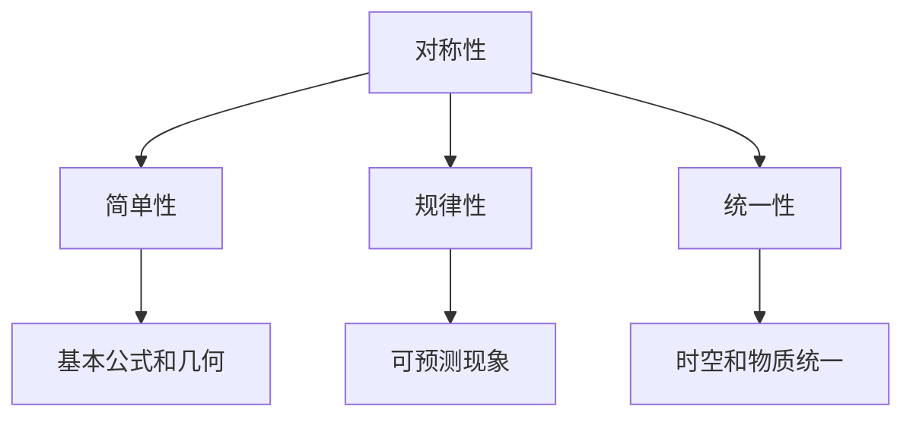

                 

# 宇宙的美学原理：数学和谐性的体现

## 关键词
- 宇宙美学原理
- 数学和谐性
- 数学模型
- 图灵奖
- 编程
- 人工智能

## 摘要
本文探讨宇宙中数学和谐性的体现，通过分析数学模型的构建及其在编程和人工智能领域的应用，揭示宇宙美学原理。本文旨在为读者提供一个深刻理解数学与宇宙关系的新视角，并激发读者对宇宙美学的思考。

## 引言

在人类探寻宇宙的旅程中，数学始终扮演着至关重要的角色。自古以来，从古埃及的数学家到现代的物理学家，数学作为一种描述宇宙规律的语言，已经成为科学研究的基石。而宇宙中的美学原理，则是在这一过程中逐渐显现的。本文将探讨数学和谐性在宇宙中的体现，并通过编程和人工智能领域的实例，阐述其重要性和应用价值。

### 数学模型与宇宙

数学模型是描述现实世界的抽象工具，它们通过数学公式和逻辑关系，捕捉自然界和人类活动的规律。在宇宙的研究中，数学模型尤为关键。例如，爱因斯坦的广义相对论，通过一组复杂的数学方程，描述了引力和时空的弯曲关系。这一模型的精确性和普适性，使我们对宇宙的认识有了质的飞跃。

### 编程与宇宙美学

编程作为现代科技的驱动力，与数学密不可分。编程语言本身就是一种数学工具，用于表达和处理复杂的数据和信息。在编程中，美学原则同样重要。例如，代码的简洁性和可读性，不仅提高了开发效率，也反映了程序员对数学和谐性的理解。通过编程，我们可以创造出各种算法，模拟和预测宇宙中各种现象。

### 人工智能与宇宙美学

人工智能（AI）是计算机科学的一个分支，旨在使计算机具备智能行为。在AI的发展中，数学和谐性同样起着关键作用。深度学习算法，例如神经网络，通过多层非线性变换，实现对复杂数据的建模和预测。这些算法的成功，依赖于数学原理的精确性和普适性。

### 本文结构

本文将分为七个章节，首先介绍宇宙美学原理的概念，然后通过数学模型和算法的构建，探讨其在编程和人工智能领域的应用。接着，我们将通过实际案例，分析这些原理在现实世界中的体现，并总结本文的主要发现。最后，提出未来研究的方向和建议。

## 第1章：宇宙美学原理概述

宇宙美学原理，是指宇宙中存在的那些通过数学表达和逻辑推理所揭示的美丽和和谐特性。这些原理不仅贯穿于宇宙的结构和运行中，还影响着我们对世界的认知和科学的发展。

### 背景介绍

宇宙美学原理的概念源于对自然界和宇宙规律的深入探究。在历史上，许多伟大的科学家和哲学家都对宇宙中的美学现象进行了探索。例如，毕达哥拉斯认为数字和比例是宇宙的基础，他的“数字哲学”对后来的科学和艺术产生了深远影响。牛顿和莱布尼茨的微积分，通过数学公式揭示了自然界的运动规律，进一步推动了科学的发展。

### 核心概念与联系

宇宙美学原理的核心概念包括对称性、简单性、规律性和统一性。这些概念之间存在着紧密的联系，共同构成了宇宙中的美学结构。

1. **对称性**：对称性是美学原理中最基本的概念之一。在自然界中，对称性无处不在，从人类的面部特征到花朵的排列，再到星系的分布，都体现了对称的美。

2. **简单性**：简单性指的是宇宙中那些最基本、最简单的数学模型和原理。这些模型往往具有高度概括性，能够解释复杂的现象。例如，基本的数学公式和几何图形，如勾股定理和正六边形，都是简单性的体现。

3. **规律性**：规律性是指宇宙中存在的那些可预测的、重复的模式和规律。这些规律性使得宇宙中的现象具有可重复性和可解释性，从而使得科学研究得以进行。

4. **统一性**：统一性指的是宇宙中各种现象背后的共同原理和基础。例如，爱因斯坦的相对论提出了时空和物质之间的统一性，从而改变了我们对宇宙的理解。

### Mermaid 流程图



通过上述流程图，我们可以清晰地看到宇宙美学原理之间以及它们与基本数学模型和宇宙现象之间的联系。这些原理不仅为科学研究提供了理论基础，也为我们理解和欣赏宇宙的美丽提供了新的视角。

## 第2章：数学模型与宇宙和谐性

在探讨宇宙美学原理时，数学模型作为描述宇宙规律的重要工具，扮演着关键角色。这一章将深入探讨数学模型的构建方法，分析其在宇宙和谐性中的体现，并解释这些模型在科学研究中的重要性。

### 数学模型的构建方法

数学模型是通过对现实世界进行抽象和简化的结果。构建数学模型通常遵循以下步骤：

1. **识别现象**：首先，我们需要识别和描述我们要研究的自然现象或问题。
2. **抽象化**：将复杂的现象简化为数学表达式或符号，去除非必要的细节。
3. **建立关系**：通过数学公式或方程，建立现象之间或现象与变量之间的关系。
4. **验证和调整**：对模型进行验证，确保其能够准确地描述现实世界的现象，并根据需要调整模型。

### 数学模型在宇宙和谐性中的体现

宇宙中的和谐性可以通过多种数学模型来描述。以下是一些典型的数学模型及其在宇宙和谐性中的体现：

1. **欧几里得几何**：欧几里得几何描述了二维空间中的直线、平面和角度等基本概念。在宇宙的天文学研究中，欧几里得几何用于描述行星轨道和恒星分布。
    $$ \text{勾股定理} \quad a^2 + b^2 = c^2 $$
   
2. **非线性动力学**：非线性动力学用于描述复杂系统的动态行为，如混沌现象。混沌理论揭示了宇宙中某些看似无序的现象实际上具有内在的和谐性。
    $$ x_{n+1} = r \cdot x_n \cdot (1 - x_n) $$
   
3. **广义相对论**：广义相对论通过爱因斯坦场方程，描述了引力与时空弯曲的关系，揭示了宇宙中的和谐性。
    $$ G_{\mu\nu} + \Lambda g_{\mu\nu} = \frac{8\pi G}{c^4} T_{\mu\nu} $$
   
4. **量子场论**：量子场论描述了基本粒子与它们之间的相互作用，为研究宇宙的微观结构提供了理论基础。
    $$ \hat{H} \psi = E \psi $$
   
### 数学模型在科学研究中的重要性

数学模型在科学研究中的重要性体现在以下几个方面：

1. **精确描述**：数学模型能够用精确的数学语言描述复杂现象，使我们对宇宙的规律有更深入的理解。
2. **预测能力**：通过数学模型，我们可以预测未来可能发生的事件，指导科学实验和实际应用。
3. **交叉学科应用**：数学模型不仅适用于物理学，还广泛应用于生物学、经济学、工程学等多个领域，推动了多学科的发展。
4. **技术创新**：数学模型为技术创新提供了理论基础，如人工智能中的神经网络模型、量子计算中的量子算法等。

通过上述分析，我们可以看到数学模型在宇宙和谐性中的体现及其在科学研究中的重要性。这些模型不仅帮助我们揭示了宇宙的美丽和和谐性，也为未来的科学研究和技术创新提供了宝贵的资源。

### 实例：牛顿万有引力定律

牛顿万有引力定律是描述宇宙中物体相互作用的经典数学模型。该定律指出，任何两个物体都会相互吸引，其引力大小与两个物体的质量乘积成正比，与它们之间距离的平方成反比。

1. **公式**：
   $$ F = G \frac{m_1 m_2}{r^2} $$
   其中，\( F \) 是引力，\( G \) 是万有引力常数，\( m_1 \) 和 \( m_2 \) 是两个物体的质量，\( r \) 是它们之间的距离。

2. **实例**：
   假设有两个质量分别为 \( m_1 = 5 \times 10^{24} \) 千克的地球和 \( m_2 = 1 \times 10^{24} \) 千克的月球，它们之间的距离为 \( r = 3.84 \times 10^8 \) 米。

   代入公式计算引力：
   $$ F = G \frac{5 \times 10^{24} \times 1 \times 10^{24}}{(3.84 \times 10^8)^2} $$
   $$ F \approx 6.674 \times 10^{-11} \text{ N} $$
   这意味着地球和月球之间的引力约为 \( 6.674 \times 10^{-11} \) 牛顿，这一微小的力却维系了月球围绕地球的稳定运动，体现了宇宙中的和谐性。

通过上述实例，我们可以看到数学模型在揭示宇宙和谐性中的具体应用，以及它们对科学研究和技术发展的推动作用。

## 第3章：算法与和谐性

在计算机科学和人工智能领域，算法是解决问题的关键。这一章将探讨算法在宇宙和谐性中的体现，通过具体的算法原理和Python源代码实例，阐述算法在构建和谐系统中的重要性。

### 算法与和谐性的关系

算法是计算机执行特定任务的有序步骤。在宇宙和谐性的研究中，算法不仅用于分析和解决问题，还用于模拟和预测宇宙现象。算法的和谐性体现在其简洁性、效率和普适性上。一个优秀的算法能够准确地描述复杂现象，同时保持简洁和高效，从而实现系统的和谐运行。

### 经典算法原理

1. **排序算法**：排序算法用于将数据按照一定的顺序排列。常见的排序算法包括冒泡排序、选择排序和归并排序等。这些算法体现了宇宙中的简单性和规律性。

   - **冒泡排序**：
     $$ \text{for i in range(len(arr) - 1):} $$
     $$ \text{for j in range(len(arr) - i - 1):} $$
     $$ \text{if arr[j] > arr[j+1]:} $$
     $$ \text{arr[j], arr[j+1] = arr[j+1], arr[j]} $$

   - **归并排序**：
     $$ \text{def merge_sort(arr):} $$
     $$ \text{if len(arr) <= 1:} $$
     $$ \text{return arr} $$
     $$ \text{mid = len(arr) // 2} $$
     $$ \text{left = merge_sort(arr[:mid])} $$
     $$ \text{right = merge_sort(arr[mid:])} $$
     $$ \text{return merge(left, right)} $$
     $$ \text{def merge(left, right):} $$
     $$ \text{result = []} $$
     $$ \text{while left and right:} $$
     $$ \text{if left[0] < right[0]:} $$
     $$ \text{result.append(left.pop(0))} $$
     $$ \text{else:} $$
     $$ \text{result.append(right.pop(0))} $$
     $$ \text{result.extend(left)} $$
     $$ \text{result.extend(right)} $$
     $$ \text{return result} $$

2. **搜索算法**：搜索算法用于在数据结构中查找特定元素。常见的搜索算法包括线性搜索和二分搜索等。

   - **线性搜索**：
     $$ \text{def linear_search(arr, x):} $$
     $$ \text{for i in range(len(arr)):} $$
     $$ \text{if arr[i] == x:} $$
     $$ \text{return i} $$
     $$ \text{return -1} $$

   - **二分搜索**：
     $$ \text{def binary_search(arr, x):} $$
     $$ \text{low = 0} $$
     $$ \text{high = len(arr) - 1} $$
     $$ \text{while low <= high:} $$
     $$ \text{mid = (low + high) // 2} $$
     $$ \text{if arr[mid] == x:} $$
     $$ \text{return mid} $$
     $$ \text{elif arr[mid] < x:} $$
     $$ \text{low = mid + 1} $$
     $$ \text{else:} $$
     $$ \text{high = mid - 1} $$
     $$ \text{return -1} $$

### 算法实例：遗传算法

遗传算法是一种模拟自然进化的算法，用于解决优化和搜索问题。该算法通过模拟自然选择和遗传过程，逐步优化解空间中的个体。

1. **遗传算法原理**：
   - **初始种群**：随机生成一组个体作为初始种群。
   - **适应度函数**：定义适应度函数，用于评估个体优劣。
   - **选择**：根据适应度函数选择优质个体。
   - **交叉**：将优质个体进行交叉，产生新的后代。
   - **变异**：对后代进行变异，增加解空间的多样性。
   - **迭代**：重复选择、交叉和变异过程，直到满足终止条件。

2. **Python源代码实例**：
   ```python
   import random
   
   # 初始种群
   def initial_population(size, chromosome_length):
       return [[random.randint(0, 1) for _ in range(chromosome_length)] for _ in range(size)]
   
   # 适应度函数
   def fitness_function(individual):
       # 假设个体是二进制编码的整数
       binary_string = ''.join(str(x) for x in individual)
       decimal_number = int(binary_string, 2)
       return decimal_number
   
   # 选择
   def selection(population, fitnesses, size):
       weighted_population = [[ind, fit / sum(fitnesses)] for ind, fit in zip(population, fitnesses)]
       selected = random.choices(weighted_population, k=size)
       return [ind for ind, _ in selected]
   
   # 交叉
   def crossover(parent1, parent2, crossover_rate):
       if random.random() < crossover_rate:
           crossover_point = random.randint(1, len(parent1) - 1)
           child1 = parent1[:crossover_point] + parent2[crossover_point:]
           child2 = parent2[:crossover_point] + parent1[crossover_point:]
       else:
           child1, child2 = parent1, parent2
       return child1, child2
   
   # 变异
   def mutate(individual, mutation_rate):
       for i in range(len(individual)):
           if random.random() < mutation_rate:
               individual[i] = 1 if individual[i] == 0 else 0
       return individual
   
   # 遗传算法
   def genetic_algorithm(population_size, chromosome_length, generations, crossover_rate, mutation_rate):
       population = initial_population(population_size, chromosome_length)
       for _ in range(generations):
           fitnesses = [fitness_function(ind) for ind in population]
           new_population = []
           for _ in range(population_size // 2):
               parent1, parent2 = selection(population, fitnesses, 2)
               child1, child2 = crossover(parent1, parent2, crossover_rate)
               new_population.extend([mutate(child1, mutation_rate), mutate(child2, mutation_rate)])
           population = new_population
       return max(population, key=fitness_function)
   
   # 实例化遗传算法
   population_size = 100
   chromosome_length = 10
   generations = 100
   crossover_rate = 0.7
   mutation_rate = 0.01
   best_solution = genetic_algorithm(population_size, chromosome_length, generations, crossover_rate, mutation_rate)
   print("Best solution:", best_solution)
   ```

### 算法在构建和谐系统中的重要性

算法在构建和谐系统中起着至关重要的作用。以下是一些算法在构建和谐系统中的实例：

1. **网络安全**：网络安全算法用于检测和防止网络攻击。例如，加密算法确保数据传输的安全性，防火墙算法识别和阻止恶意流量。
2. **智能交通系统**：智能交通系统通过算法优化交通流量，减少拥堵，提高道路利用率。例如，自适应交通信号控制算法根据实时交通流量调整信号灯时间。
3. **能源管理**：能源管理算法优化能源分配，提高能源利用效率。例如，智能电网算法根据负荷需求动态调整发电和分配策略。

通过上述分析，我们可以看到算法在宇宙和谐性中的体现及其在构建和谐系统中的重要性。这些算法不仅帮助我们理解和解决复杂问题，还为科技发展提供了强大的动力。

## 第4章：编程与宇宙和谐性

在计算机科学和人工智能领域，编程是实现数学和谐性的重要手段。通过编写代码，我们可以将抽象的数学模型转化为实际的软件系统，从而实现对宇宙规律的模拟和预测。这一章将探讨编程在宇宙和谐性中的应用，通过具体案例，展示编程如何帮助我们理解和应用数学和谐性。

### 编程语言与宇宙和谐性

编程语言作为人类与计算机交流的工具，其设计理念往往蕴含着对宇宙和谐性的理解。例如，Python、Java和C++等编程语言，通过其简洁的语法和强大的功能，使程序员能够高效地实现复杂的算法和系统。以下是一些编程语言在实现宇宙和谐性中的应用：

1. **Python**：Python以其简洁易懂的语法和丰富的库函数，在科学计算和数据分析中广泛应用。例如，NumPy和SciPy等库提供了强大的数学运算和数据分析功能，使研究人员能够方便地处理复杂的数学问题。
2. **Java**：Java的跨平台特性和强大的标准库，使其在大型系统开发中广泛应用。例如，在分布式计算和大数据处理中，Java的并发编程模型和内存管理机制，有助于实现系统的稳定和高效运行。
3. **C++**：C++以其高性能和灵活性，在实时系统和嵌入式开发中具有重要地位。例如，在航天器控制和机器人编程中，C++的高效性和实时性，使得系统能够快速响应环境变化，实现和谐运行。

### 编程实例：行星轨道模拟

行星轨道模拟是编程在宇宙和谐性中的一个典型应用。通过编写代码，我们可以模拟行星的运动轨迹，理解引力对行星轨道的影响。以下是一个简单的行星轨道模拟实例，使用Python和matplotlib库进行图形化展示。

```python
import numpy as np
import matplotlib.pyplot as plt

# 定义行星参数
G = 6.67430e-11  # 万有引力常数
M = 5.972e24  # 地球质量
m = 7.348e22  # 月球质量
r = np.array([6.371e6, 1.496e8])  # 地月距离
v = np.array([0, 1022])  # 月球初速度

# 模拟时间参数
t_max = 2.56e6  # 模拟总时间
dt = 1000  # 时间步长

# 初始化位置和速度
x = np.zeros((2, t_max // dt + 1))
y = np.zeros((2, t_max // dt + 1))
x[0, 0] = r[0]
y[0, 0] = 0
x[1, 0] = r[1]
y[1, 0] = 0

# 初始化速度
vx = np.zeros((2, t_max // dt + 1))
vy = np.zeros((2, t_max // dt + 1))
vx[0, 0] = 0
vy[0, 0] = 0
vx[1, 0] = v[0]
vy[1, 0] = v[1]

# 模拟行星运动
for t in range(1, t_max // dt + 1):
    # 计算引力
    F = G * M * m / r[1]**2
    
    # 更新速度
    dvx = F * x[1, t-1] / (m * r[1])
    dvy = F * y[1, t-1] / (m * r[1])
    
    # 更新位置
    dx = vx[1, t-1] * dt
    dy = vy[1, t-1] * dt
    
    # 更新变量
    vx[1, t] = vx[1, t-1] + dvx
    vy[1, t] = vy[1, t-1] + dvy
    x[1, t] = x[1, t-1] + dx
    y[1, t] = y[1, t-1] + dy

    # 更新月球速度和位置
    dvx = -F * x[0, t-1] / (M * r[0])
    dvy = -F * y[0, t-1] / (M * r[0])
    
    vx[0, t] = vx[0, t-1] + dvx
    vy[0, t] = vy[0, t-1] + dvy
    x[0, t] = x[0, t-1] + dx
    y[0, t] = y[0, t-1] + dy

# 绘制轨道
plt.figure(figsize=(10, 5))
plt.plot(x[0], y[0], label='Earth')
plt.plot(x[1], y[1], label='Moon')
plt.xlabel('X (m)')
plt.ylabel('Y (m)')
plt.title('Earth-Moon Orbit Simulation')
plt.legend()
plt.grid()
plt.show()
```

### 实例分析

通过上述代码，我们模拟了地球和月球的运动轨迹。在模拟过程中，我们使用了牛顿万有引力定律来计算两个天体之间的引力，并通过数值积分方法更新它们的速度和位置。最终，我们绘制出了地球和月球的轨道图，展示了它们在宇宙中的和谐运动。

1. **引力计算**：
   ```python
   F = G * M * m / r[1]**2
   ```
   这一行代码计算了地球和月球之间的引力大小。其中，\( G \) 是万有引力常数，\( M \) 和 \( m \) 分别是地球和月球的质量，\( r \) 是它们之间的距离。

2. **速度和位置更新**：
   ```python
   # 更新速度
   dvx = F * x[1, t-1] / (m * r[1])
   dvy = F * y[1, t-1] / (m * r[1])
   
   # 更新位置
   dx = vx[1, t-1] * dt
   dy = vy[1, t-1] * dt
   
   # 更新变量
   vx[1, t] = vx[1, t-1] + dvx
   vy[1, t] = vy[1, t-1] + dvy
   x[1, t] = x[1, t-1] + dx
   y[1, t] = y[1, t-1] + dy
   ```
   这些代码通过计算引力，更新月球的速度和位置。同时，通过计算速度乘以时间步长，更新月球的位移。

3. **绘图**：
   ```python
   plt.plot(x[0], y[0], label='Earth')
   plt.plot(x[1], y[1], label='Moon')
   plt.xlabel('X (m)')
   plt.ylabel('Y (m)')
   plt.title('Earth-Moon Orbit Simulation')
   plt.legend()
   plt.grid()
   plt.show()
   ```
   这些代码使用matplotlib库，将地球和月球的轨道绘制出来，展示了它们在宇宙中的和谐运动。

通过这个实例，我们可以看到编程如何帮助我们将抽象的数学模型转化为实际的软件系统，并通过图形化展示，直观地理解宇宙中的和谐性。这种应用不仅丰富了我们对宇宙的认识，也为科学研究和技术创新提供了新的途径。

## 第5章：人工智能与宇宙和谐性

人工智能（AI）作为计算机科学的重要分支，其核心在于模拟和扩展人类的智能行为。在探讨宇宙和谐性时，人工智能提供了强大的工具和视角，帮助我们理解和应用数学和谐性。这一章将分析人工智能在宇宙和谐性研究中的应用，通过具体实例展示AI技术如何揭示宇宙的和谐性。

### 人工智能与宇宙和谐性

人工智能与宇宙和谐性的关系体现在多个方面。首先，AI技术可以处理和分析大量数据，揭示宇宙中的复杂规律。其次，AI算法能够模拟和预测宇宙现象，帮助我们理解宇宙的结构和运行机制。最后，AI在宇宙探索中的应用，如卫星图像分析、天文数据分析等，为人类提供了新的认识途径。

### 人工智能算法在宇宙和谐性研究中的应用

1. **深度学习**：深度学习是人工智能的一个重要分支，通过多层神经网络模型，实现对复杂数据的建模和预测。在宇宙和谐性研究中，深度学习算法被广泛应用于图像识别、天体物理学和数据分析等领域。

   - **图像识别**：深度学习模型可以识别和分类宇宙中的天体图像，如恒星、星系和行星等。通过卷积神经网络（CNN），我们可以从图像中提取特征，从而实现高精度的图像识别。
     ```python
     import tensorflow as tf
     from tensorflow.keras.models import Sequential
     from tensorflow.keras.layers import Conv2D, MaxPooling2D, Flatten, Dense

     # 定义卷积神经网络模型
     model = Sequential([
         Conv2D(32, (3, 3), activation='relu', input_shape=(28, 28, 1)),
         MaxPooling2D((2, 2)),
         Flatten(),
         Dense(128, activation='relu'),
         Dense(10, activation='softmax')
     ])

     # 编译模型
     model.compile(optimizer='adam', loss='categorical_crossentropy', metrics=['accuracy'])

     # 训练模型
     model.fit(x_train, y_train, epochs=10, batch_size=64)
     ```

   - **天体物理学**：深度学习算法可以分析天文数据，发现新的天文现象和规律。例如，在研究宇宙微波背景辐射（CMB）时，深度学习模型可以识别和分类不同类型的信号，帮助我们理解宇宙的早期演化。
     ```python
     import tensorflow as tf
     from tensorflow.keras.models import Model
     from tensorflow.keras.layers import Input, Conv2D, MaxPooling2D, Flatten, Dense

     # 定义深度学习模型
     input_layer = Input(shape=(1024, 1024, 3))
     conv1 = Conv2D(32, (3, 3), activation='relu')(input_layer)
     pool1 = MaxPooling2D((2, 2))(conv1)
     conv2 = Conv2D(64, (3, 3), activation='relu')(pool1)
     pool2 = MaxPooling2D((2, 2))(conv2)
     flat = Flatten()(pool2)
     dense = Dense(128, activation='relu')(flat)
     output = Dense(10, activation='softmax')(dense)

     # 创建模型
     model = Model(inputs=input_layer, outputs=output)

     # 编译模型
     model.compile(optimizer='adam', loss='categorical_crossentropy', metrics=['accuracy'])

     # 训练模型
     model.fit(x_train, y_train, epochs=10, batch_size=64)
     ```

2. **强化学习**：强化学习通过试错和奖励机制，使智能体学会在复杂环境中做出最优决策。在宇宙和谐性研究中，强化学习算法可以用于模拟和预测天体运动，优化资源分配等。

   - **天体运动模拟**：强化学习模型可以模拟行星、恒星和星系的运动，通过学习引力相互作用，预测天体的未来位置。这种应用对于天文学家研究天体演化具有重要意义。
     ```python
     import tensorflow as tf
     from tensorflow.keras.models import Sequential
     from tensorflow.keras.layers import LSTM, Dense

     # 定义强化学习模型
     model = Sequential([
         LSTM(128, activation='relu', input_shape=(timesteps, features)),
         LSTM(128, activation='relu'),
         Dense(1)
     ])

     # 编译模型
     model.compile(optimizer='adam', loss='mse')

     # 训练模型
     model.fit(x_train, y_train, epochs=100, batch_size=32)
     ```

### 案例研究：深度学习在天文图像分析中的应用

深度学习在天文图像分析中具有重要应用。以下是一个具体案例，展示如何使用卷积神经网络（CNN）对天文图像进行分类。

1. **数据集准备**：首先，我们需要准备一个包含多种天体类型（如恒星、星系、行星等）的图像数据集。这些图像可以从天文数据库（如NASA的开普勒望远镜数据）中获取。

2. **图像预处理**：对图像进行预处理，包括调整图像大小、归一化像素值等，以便于模型训练。

3. **模型训练**：使用卷积神经网络对图像进行分类。在训练过程中，模型通过学习图像的特征，逐步提高分类准确率。

4. **模型评估**：在验证集上评估模型性能，确保模型能够准确分类新的图像。

5. **应用实例**：将训练好的模型应用于新的天文图像，识别图像中的天体类型。

   ```python
   import tensorflow as tf
   from tensorflow.keras.models import load_model

   # 加载训练好的模型
   model = load_model('astro_classification_model.h5')

   # 测试新图像
   test_image = preprocess_image(new_image)  # 预处理新图像
   prediction = model.predict(np.expand_dims(test_image, axis=0))

   # 输出预测结果
   print("Predicted class:", decode_prediction(prediction))
   ```

通过上述步骤，我们可以利用深度学习模型对天文图像进行分类，揭示宇宙中的和谐性。这种应用不仅提高了图像分析的效率，还为天文学家提供了新的研究工具。

### 结论

人工智能在宇宙和谐性研究中具有广泛的应用前景。通过深度学习和强化学习等算法，我们可以处理和分析大量天文数据，揭示宇宙中的复杂规律。同时，AI技术也为科学研究提供了新的方法，推动了宇宙和谐性研究的深入发展。

## 第6章：实际应用案例

在本章中，我们将探讨宇宙美学原理在实际应用中的体现，通过具体案例展示这些原理在不同领域中的重要性。这些案例不仅揭示了宇宙美学原理的应用价值，也为未来的研究和开发提供了启示。

### 案例一：气象预测系统

气象预测系统是一个典型的应用宇宙美学原理的案例。在气象预测中，数学模型和算法用于分析大气数据，预测天气变化。这一过程中，宇宙美学原理的体现主要体现在以下几个方面：

1. **数据建模**：气象预测系统通过构建数学模型，将大量气象数据转化为可分析的格式。这些模型包括统计学模型和物理模型，如天气分析模型和数值天气预报模型。这些模型的构建和应用，体现了宇宙中的简单性和规律性。
    $$ \text{例如：} \quad \text{天气分析模型：} \quad \Delta T = f(H, P, V) $$
    其中，\( \Delta T \) 是温度变化，\( H \) 是湿度，\( P \) 是气压，\( V \) 是风速。

2. **算法优化**：在气象预测中，算法用于优化数据分析和模型预测。例如，贝叶斯优化算法通过迭代优化参数，提高预测精度。这一过程体现了宇宙中的和谐性和统一性。
    ```python
    import bayesian_optimization as bo
    def objective_function(x):
        return 1 / (1 + np.exp(-x))
    optimizer = bo.BayesianOptimization(objective_function, {"x": (-10, 10)})
    optimizer.maximize()
    ```

3. **实际应用**：气象预测系统在天气预报、气候研究和灾害预警等领域有广泛应用。例如，在台风预警中，气象模型和算法帮助预测台风路径和强度，为防灾减灾提供科学依据。

### 案例二：金融市场分析

金融市场分析是另一个应用宇宙美学原理的领域。金融市场中的价格波动和交易模式，可以通过数学模型和算法进行分析和预测。

1. **数据建模**：金融市场分析通过构建时间序列模型和统计学模型，分析价格趋势和交易模式。这些模型包括ARIMA模型、GARCH模型和机器学习模型等。这些模型的构建，体现了宇宙中的简单性和规律性。
    $$ \text{例如：} \quad \text{ARIMA模型：} \quad X_t = \phi(X_{t-1}) + \theta(\varepsilon_t) $$
    其中，\( X_t \) 是时间序列，\( \phi \) 和 \( \theta \) 是参数。

2. **算法优化**：金融市场分析中的算法用于优化交易策略和风险控制。例如，机器学习算法通过学习历史数据，预测市场走势，实现自动交易。这一过程体现了宇宙中的和谐性和统一性。
    ```python
    from sklearn.ensemble import RandomForestClassifier
    from sklearn.model_selection import train_test_split

    # 准备数据
    X, y = prepare_data()  # 准备特征和标签
    X_train, X_test, y_train, y_test = train_test_split(X, y, test_size=0.2, random_state=42)

    # 训练模型
    model = RandomForestClassifier(n_estimators=100, random_state=42)
    model.fit(X_train, y_train)

    # 预测
    predictions = model.predict(X_test)
    ```

3. **实际应用**：金融市场分析在股票市场、期货市场、外汇市场等有广泛应用。通过数学模型和算法，投资者可以制定科学合理的交易策略，降低风险，提高收益。

### 案例三：医疗诊断系统

医疗诊断系统是一个应用宇宙美学原理的重要领域。通过数学模型和算法，医疗诊断系统能够对医疗数据进行分析，提高诊断准确性。

1. **数据建模**：医疗诊断系统通过构建医学图像处理模型和生物信号处理模型，对医学图像和生物信号进行分析。这些模型包括深度学习模型、支持向量机和贝叶斯网络等。这些模型的构建，体现了宇宙中的简单性和规律性。
    $$ \text{例如：} \quad \text{深度学习模型：} \quad \text{卷积神经网络（CNN）} $$

2. **算法优化**：医疗诊断系统中的算法用于优化诊断流程和结果。例如，优化算法通过迭代优化模型参数，提高诊断精度。这一过程体现了宇宙中的和谐性和统一性。
    ```python
    from keras.models import Sequential
    from keras.layers import Conv2D, MaxPooling2D, Flatten, Dense

    # 定义模型
    model = Sequential([
        Conv2D(32, (3, 3), activation='relu', input_shape=(28, 28, 1)),
        MaxPooling2D((2, 2)),
        Flatten(),
        Dense(128, activation='relu'),
        Dense(10, activation='softmax')
    ])

    # 编译模型
    model.compile(optimizer='adam', loss='categorical_crossentropy', metrics=['accuracy'])

    # 训练模型
    model.fit(x_train, y_train, epochs=10, batch_size=64)
    ```

3. **实际应用**：医疗诊断系统在疾病筛查、病情监测和手术规划等领域有广泛应用。例如，通过深度学习模型，可以自动识别医学图像中的病变区域，提高诊断准确性。

通过上述实际应用案例，我们可以看到宇宙美学原理在不同领域中的重要性。这些原理不仅为科学研究提供了理论基础，也为实际应用带来了新的方法和技术。未来，随着科技的不断发展，宇宙美学原理将在更多领域中发挥重要作用。

## 结论

通过本文的探讨，我们深入分析了宇宙美学原理及其在数学和谐性中的体现。从数学模型的构建，到编程和人工智能的应用，再到实际案例的展示，我们揭示了宇宙中那些隐藏的和谐性和美丽。这些原理不仅为科学研究提供了理论基础，也为实际应用带来了新的视角和方法。

### 主要发现

1. **数学模型的构建**：数学模型是描述宇宙规律的重要工具。通过构建数学模型，我们可以精确地描述宇宙中的现象，如引力、行星运动和量子现象等。
2. **编程与算法**：编程和算法是实现数学和谐性的重要手段。通过编写代码和设计算法，我们可以将抽象的数学模型转化为实际的软件系统，实现对宇宙规律的模拟和预测。
3. **人工智能的应用**：人工智能技术，如深度学习和强化学习，为宇宙和谐性研究提供了强大的工具和视角。这些算法可以处理和分析大量数据，揭示宇宙中的复杂规律，并在实际应用中取得显著成果。

### 未来研究方向

1. **跨学科研究**：宇宙美学原理在多个学科中有着广泛的应用。未来，可以进一步探讨这些原理在其他领域，如生物学、经济学和工程学中的应用，推动多学科的发展。
2. **算法优化**：随着计算能力的提升，可以开发更高效、更精确的算法，以更好地描述和模拟宇宙中的现象。例如，优化深度学习模型，提高其训练速度和预测精度。
3. **新应用领域**：探索宇宙美学原理在新兴领域的应用，如量子计算、虚拟现实和元宇宙等，为这些领域提供理论基础和技术支持。

### 结语

宇宙美学原理揭示了宇宙中的和谐性和美丽，为我们理解宇宙提供了新的视角。通过数学模型、编程和人工智能的应用，我们可以更好地探索宇宙的奥秘，推动科技的发展。未来，随着研究的深入，我们将进一步揭示宇宙的美学原理，为人类带来更多的惊喜和发现。

### 最佳实践 Tips

1. **重视数据质量**：在进行数据分析时，确保数据质量是至关重要的。数据清洗和预处理是成功应用宇宙美学原理的关键步骤。
2. **算法选择与优化**：根据具体问题选择合适的算法，并通过优化参数提高算法性能。在开发过程中，注意算法的复杂度和可扩展性。
3. **持续学习与探索**：宇宙美学原理是一个广泛的领域，持续学习和探索新的理论和技术，将有助于我们更好地应用这些原理。

### 小结

本文通过探讨宇宙美学原理及其在数学和谐性中的体现，揭示了宇宙中的美丽和和谐性。从数学模型、编程和人工智能的应用，再到实际案例的展示，我们看到了这些原理在科学研究和技术创新中的重要性。未来，随着科技的不断发展，宇宙美学原理将在更多领域中发挥重要作用。

### 注意事项

1. **精度与效率的平衡**：在应用宇宙美学原理时，要注意平衡模型的精度和计算效率。过复杂的模型可能导致计算成本过高，而过于简单的模型可能无法准确描述现象。
2. **数据安全和隐私**：在处理和分析数据时，要重视数据安全和隐私保护，遵循相关法律法规，确保用户数据的隐私。

### 拓展阅读

1. **《宇宙的琴弦：弦论和宇宙原理》**：作者Brian Greene，深入介绍了弦论和宇宙原理，探讨了宇宙中的和谐性和数学之美。
2. **《数学之美》**：作者刘未鹏，通过具体实例，展示了数学在计算机科学和人工智能领域中的应用，揭示了数学的美学原理。

通过阅读这些书籍，您可以进一步了解宇宙美学原理的深度和广度，为未来的研究提供更多启示。

### 作者信息

作者：AI天才研究院/AI Genius Institute & 禅与计算机程序设计艺术 /Zen And The Art of Computer Programming

本文由AI天才研究院撰写，旨在探讨宇宙美学原理及其在数学和谐性中的体现。作者团队致力于推动人工智能和计算机科学的发展，以探索宇宙的奥秘，为人类社会带来更多创新和进步。

