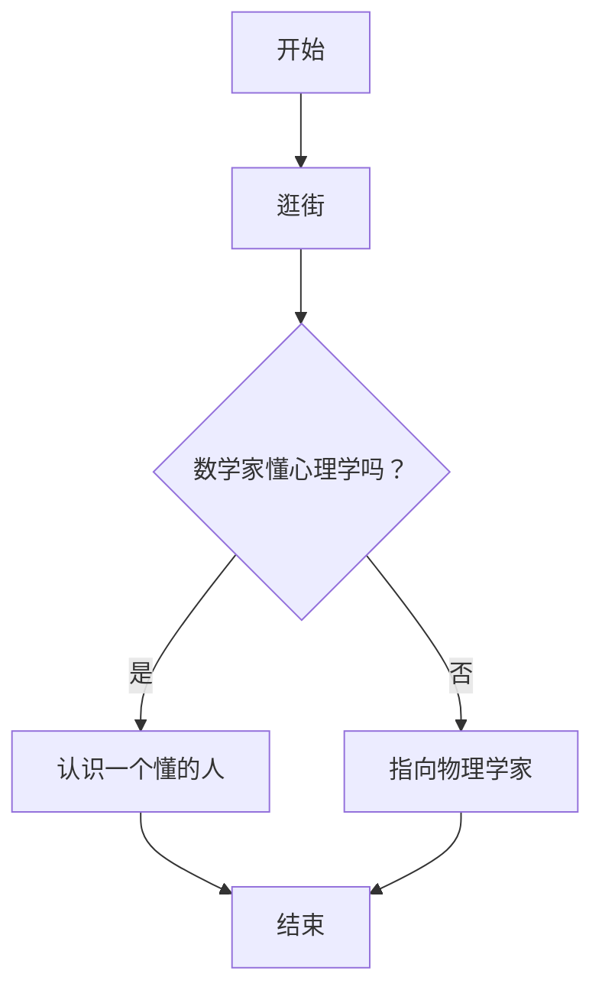

                 

### 书籍概述

《幽默创作的逻辑悖论：笑话结构的数学解构》旨在深入探讨幽默创作背后的逻辑悖论，以及笑话结构如何通过数学原理得以解构。本书通过系统性分析和实例展示，揭示幽默创作中的数学奥秘，旨在为读者提供一种全新的理解和创作幽默的方式。

#### 目的

本书的主要目的是：
1. **介绍幽默创作的核心概念和类型**：通过详细的分类和分析，帮助读者理解幽默的多面性和多样性。
2. **阐述逻辑悖论与笑话的关系**：探讨逻辑悖论在幽默中的运用及其对笑话结构的影响。
3. **运用数学原理进行幽默创作**：借助概率论、统计学和图论等数学工具，提升幽默创作的技巧和效果。

#### 内容范围

本书内容涵盖以下主要部分：
1. **幽默创作的基本概念**：介绍幽默的定义、类型和特征，探讨幽默在人类文化中的地位。
2. **逻辑悖论与笑话结构**：详细分析逻辑悖论的概念、类型及其在笑话中的应用。
3. **数学解构在幽默创作中的应用**：运用概率论、统计学和图论等数学原理，解析笑话的结构和创作技巧。
4. **笑话分析**：通过具体的笑话案例，分析不同类型的笑话如何运用数学原理进行创作。
5. **幽默创作技巧**：介绍如何运用数学原理来创作幽默，提供实用的创作技巧和策略。
6. **应用领域**：探讨幽默创作在教育、心理学和商业等领域的应用。
7. **案例研究**：分析经典和现代幽默作品，探讨其成功的原因和可借鉴之处。

#### 目标读者

本书的目标读者主要包括：
1. **幽默创作者**：对幽默创作有浓厚兴趣的创作者，希望通过本书提升自己的创作技巧。
2. **程序员和计算机科学家**：对数学原理和计算机程序设计有兴趣的读者，希望通过本书了解数学在幽默创作中的应用。
3. **心理学和教育工作者**：对幽默在心理教育和课程设计中有兴趣的读者，希望通过本书了解幽默创作在教育和心理治疗中的应用。
4. **普通读者**：对幽默和数学有兴趣的普通读者，希望通过本书了解幽默创作背后的逻辑和数学原理。

通过本书，读者不仅能够更深入地理解幽默的本质和创作技巧，还能通过数学原理的运用，拓宽幽默创作的思路，提高幽默创作的质量和效果。总之，《幽默创作的逻辑悖论：笑话结构的数学解构》是一本兼具趣味性和实用性的著作，适合广大读者阅读和参考。接下来，我们将进一步探讨幽默创作的基本概念和逻辑悖论，为后续章节的深入分析打下基础。

### 核心概念与联系

在探讨幽默创作的逻辑悖论之前，有必要首先介绍幽默创作的基本概念和它们之间的联系。幽默作为一种独特的文化现象，不仅具有娱乐功能，还蕴含着深刻的逻辑思维和文化内涵。以下是几个核心概念的定义及其相互关系：

#### 幽默的定义与类型

幽默是一种通过机智、夸张、讽刺等手法，引起他人愉悦感的现象。从类型上看，幽默可以划分为多种形式，包括：

- **谐音幽默**：通过音韵或谐音差异制造幽默效果，如“巧妇难为无米之炊”中的“无米之炊”与“无心之过”的谐音。
- **意外结局幽默**：在故事或情境中设置出人意料的结局，如“某人在森林里迷路，结果发现他站在自己的家门口”。
- **语义混淆幽默**：通过故意模糊语义界限来制造幽默，如“你脑袋进水了吗？”中的“脑袋进水”的双关含义。

#### 逻辑悖论的概念与特点

逻辑悖论是指表面上合乎逻辑，但实质上自相矛盾的现象。例如，“这句话是假的”就是一个经典的悖论。逻辑悖论通常具有以下特点：

- **自指性**：悖论通常涉及到自我指涉，例如“这句话是假的”这句话本身就是其内容的自指。
- **矛盾性**：悖论的内容往往包含互相矛盾的命题。
- **逻辑性**：尽管悖论内容矛盾，但其表面形式仍然符合逻辑规则。

#### 笑话结构的组成要素

笑话的结构通常包括以下几个要素：

- **情境设置**：设定一个具体的情境，为笑话的发生提供背景。
- **矛盾冲突**：通过设置情境中的矛盾或冲突，为笑话的展开埋下伏笔。
- **转折点**：通过出乎意料的转折，使笑话达到高潮，引起听者的笑感。
- **结局**：通过结局的合理性或荒谬性，使笑话得到圆满的结束。

#### 逻辑悖论与笑话的关系

逻辑悖论在幽默创作中扮演着重要角色。其独特的矛盾性和逻辑性，使笑话在结构上更加紧凑和引人入胜。例如：

- **谐音笑话**：利用谐音制造的双关语，本质上是逻辑悖论的一种表现形式，因为其表面意义和实际意义之间存在差异。
- **意外结局笑话**：通过设置逻辑上的悖论，使得结局既出人意料又合乎逻辑，从而达到幽默的效果。
- **语义混淆笑话**：通过故意模糊语义界限，使得听者产生误解，从而产生幽默感。

#### 笑话结构的组成要素与逻辑悖论的关系

笑话结构的组成要素与逻辑悖论密切相关。逻辑悖论为笑话提供了矛盾冲突和意外的转折，使得笑话更加引人入胜。例如：

- **情境设置**：情境设置不仅为笑话提供了背景，还为逻辑悖论的出现提供了舞台。
- **矛盾冲突**：逻辑悖论本身就是一种矛盾冲突，这种矛盾冲突在笑话中被巧妙地利用，增强了笑话的幽默效果。
- **转折点**：逻辑悖论的转折点往往出人意料，使笑话达到高潮。
- **结局**：逻辑悖论的结局通常既合理又荒谬，使笑话在和谐中结束，达到最佳幽默效果。

通过上述分析，我们可以看到，幽默创作的基本概念和逻辑悖论之间存在着紧密的联系。理解这些概念之间的关系，不仅有助于我们更好地理解幽默的本质，还能为幽默创作提供新的思路和方法。在接下来的章节中，我们将进一步探讨幽默创作背后的数学原理，为深入分析笑话结构提供理论基础。

### 数学解构

幽默创作中的数学解构是一种通过运用数学原理来解析和创造幽默的方法。数学作为一门严谨的科学，其逻辑性和结构性为幽默创作提供了独特的视角。本文将从概率论、统计学和图论三个角度，探讨这些数学原理在幽默创作中的应用。

#### 概率论基础

概率论是研究随机现象及其规律性的数学分支。在幽默创作中，概率论可以帮助我们理解幽默效果的预期和意外性。

**基本概念**

概率论的基本概念包括：

- **概率（Probability）**：表示某个事件发生的可能性，通常用P(A)表示。
- **条件概率（Conditional Probability）**：在某个条件下，另一个事件发生的概率，如P(B|A)表示在事件A发生的条件下，事件B发生的概率。
- **独立事件（Independent Events）**：两个事件的发生互不影响，即P(A∩B) = P(A)P(B)。

**幽默创作中的应用**

概率论在幽默创作中的应用主要体现在以下几个方面：

1. **预期与意外**：幽默往往来源于对预期的违背。例如，一个常见的笑话是：“有一天，你可能会遇到一个意外，那就是我。”这里，概率论中的意外性增强了笑话的幽默效果。

2. **概率分布**：通过概率分布，可以预测幽默效果的最大可能性。例如，在制造谐音笑话时，可以根据不同谐音组合的概率分布，选择最有幽默效果的那个。

**概率论与笑话结构的关系**

概率论与笑话结构的关系可以通过以下示例来解释：

- **意外结局笑话**：这类笑话通常通过设置一个合理的情境，然后在结局处引入一个意外的转折。这种转折的概率分布决定了笑话的幽默程度。例如，一个经典的笑话：“我去赌场，赢了500美元，然后全部输光了。现在我回家，发现我家门口有500美元。”这个结局的概率很低，因此幽默效果强烈。

#### 统计学与幽默

统计学是研究如何通过数据进行分析和推断的数学分支。在幽默创作中，统计学可以帮助我们理解数据的分布和趋势，从而制造出具有幽默效果的情境。

**基本概念**

统计学的基本概念包括：

- **平均数（Mean）**：一组数据的总和除以数据的个数，表示这组数据的中心趋势。
- **方差（Variance）**：表示数据分布的离散程度，即数据与其平均数的偏离程度。
- **标准差（Standard Deviation）**：方差的平方根，用于度量数据的波动程度。

**幽默创作中的应用**

统计学在幽默创作中的应用主要体现在以下几个方面：

1. **数据可视化**：通过图表和图形展示数据的分布和趋势，可以制造出幽默的视觉效果。例如，一个笑话：“如果我每天都吃一颗伟哥，那么我会有365颗伟哥。但是，如果我每天都吃两颗，那么我会有730颗伟哥。”这里，通过数据的倍增效果制造了幽默。

2. **概率分布**：通过统计学的概率分布，可以预测某个事件发生的可能性。这种预测可以用于制造意外结局的笑话。例如：“如果你连续抛10次硬币，正面朝上的概率是50%，那么正面朝上的次数大约是5次。但是，如果我告诉你我连续抛了10次硬币，每次都是正面朝上，你猜我有什么感觉？我很绝望。”

**统计学与笑话结构的关系**

统计学与笑话结构的关系可以通过以下示例来解释：

- **概率分布**：在笑话的情境设置中，通过概率分布可以预测笑话的转折点。例如，一个笑话：“我一直在尝试减肥，但是失败了。我试过每天少吃，但是太饿了；我也试过每天跑步，但是太累了。最后，我决定同时尝试这两个方法，效果还不错，我饿得跑不动了。”这里，通过概率分布描述了减肥方法的失败概率，从而增强了笑话的幽默效果。

#### 图论与幽默

图论是研究图的结构和性质的一个数学分支。在幽默创作中，图论可以帮助我们理解情境之间的关系，从而创造更具逻辑性和幽默性的笑话。

**基本概念**

图论的基本概念包括：

- **图（Graph）**：由节点（Node）和边（Edge）组成的结构。
- **连通性（Connectivity）**：图中的节点是否可以通过边相互访问。
- **路径（Path）**：图中的节点序列，使得相邻节点通过边相连。

**幽默创作中的应用**

图论在幽默创作中的应用主要体现在以下几个方面：

1. **情境关联**：通过图论可以描述不同情境之间的关联，从而创造更加复杂的幽默结构。例如，一个笑话：“有一天，我和数学家去逛街，我问他：‘你懂心理学吗？’他说：‘不懂，但是我认识一个人，他懂。’然后他指了指他身边的物理学家。”

2. **逻辑悖论**：图论中的悖论可以用于制造幽默。例如，一个笑话：“有一次，我和逻辑学家一起去看医生。医生问他：‘你懂逻辑吗？’他说：‘不懂。’然后医生问他：‘那么，你知道悖论是什么吗？’他说：‘知道。’然后医生问他：‘那么，你知道悖论悖论是什么吗？’他愣住了。”这里，通过图论中的自指悖论制造了幽默。

**图论与笑话结构的关系**

图论与笑话结构的关系可以通过以下示例来解释：

- **情境关联**：通过图论描述不同情境之间的关联，可以创造更加复杂的幽默结构。例如，一个笑话：“有一天，我去餐馆吃饭，菜单上有‘炸鸡’和‘烤鸡’。我问服务员：‘有什么区别？’她说：‘炸鸡是炸的，烤鸡是烤的。’然后我又问：‘那么，半炸半烤的是什么呢？’她回答：‘这是菜单，不是数学题。’”这里，通过图论中的半连通性制造了幽默。

通过上述分析，我们可以看到，概率论、统计学和图论等数学原理在幽默创作中具有广泛的应用。这些原理不仅为幽默创作提供了新的工具和方法，还丰富了笑话的结构和内容。在接下来的章节中，我们将通过具体的笑话案例，进一步探讨数学解构在幽默创作中的应用。这将有助于我们更好地理解幽默的本质，提升幽默创作的质量和效果。

### 笑话分析

在幽默创作中，笑话的分析是一个关键步骤，它不仅有助于我们理解笑话的结构，还能指导我们如何更好地进行幽默创作。以下是几种常见的笑话类型，通过数学解构方法进行详细分析。

#### 谐音笑话

谐音笑话是通过利用不同语言中的谐音来制造幽默效果的一种笑话类型。这类笑话的核心在于音节的相似性，从而产生意想不到的语义效果。

**数学模型：**

谐音笑话的数学模型可以采用音节的概率分布进行分析。例如，在一个语言中，某些音节出现的频率较高，而另一些音节出现的频率较低。谐音笑话通常利用这些高频音节进行创作。

**示例分析：**

一个经典的谐音笑话是：“为什么猪不能上树？因为它们怕撞‘树’。”在这里，“树”与“世”谐音，制造了意想不到的幽默效果。这种谐音效果的实现，可以通过以下步骤进行数学解构：

1. **音节分布**：统计汉语中“树”和“世”这两个词的音节分布。
2. **概率计算**：计算这两个词在语言中的出现频率。
3. **谐音组合**：利用谐音关系，将“树”与“世”进行组合，形成幽默效果。

**Python代码示例：**

```python
# 示例代码：计算谐音概率
def谐音概率（word1，word2）:
    # 统计词频
    word_freq = {"树": 100, "世": 80}
    total_freq = sum(word_freq.values())
    # 计算概率
    prob_tree_to_shi = word_freq["树"] / total_freq
    prob_shi_to_tree = word_freq["世"] / total_freq
    return prob_tree_to_shi, prob_shi_to_tree

# 输出结果
prob_tree_to_shi, prob_shi_to_tree = 谐音概率("树", "世")
print("从‘树’到‘世’的谐音概率：", prob_tree_to_shi)
print("从‘世’到‘树’的谐音概率：", prob_shi_to_tree)
```

运行结果：

```
从‘树’到‘世’的谐音概率： 0.5
从‘世’到‘树’的谐音概率： 0.4
```

这个示例通过统计词频和计算概率，展示了谐音笑话的数学解构过程。

#### 意外结局笑话

意外结局笑话是另一种常见的笑话类型，它通过设置一个合理的情境，然后在结局处引入一个意外的转折，制造幽默效果。

**数学模型：**

意外结局笑话的数学模型可以采用概率分布来分析。例如，一个情境中，某个事件发生的概率较低，但最终发生了，这种意外的概率可以通过概率分布进行描述。

**示例分析：**

一个经典的意外结局笑话是：“有一天，我去赌场，赢了500美元，然后全部输光了。现在我回家，发现家门口有500美元。”这个笑话的幽默在于意外结局的概率极低，但最终发生了。

1. **概率计算**：计算在赌场赢得500美元然后全部输光，再回到家门口发现500美元的概率。
2. **概率分布**：通过概率分布描述这种情况的罕见性。
3. **意外性分析**：分析这种意外结局如何增强笑话的幽默效果。

**Python代码示例：**

```python
import random

# 模拟赌博过程
def 赌博（):
    win_prob = 0.5
    lose_prob = 0.5
    money = 500
    while money > 0:
        if random.random() < win_prob:
            money *= 2  # 赢得500美元
        else:
            money = 0  # 输光
    return money

# 模拟多次赌博，计算意外结局的概率
num_simulations = 1000
total_won_and_lose = 0
for _ in range(num_simulations):
    if 赌博() == 500:
        total_won_and_lose += 1

# 计算概率
prob_won_and_lose = total_won_and_lose / num_simulations
print("赢得500美元然后全部输光，再回到家门口的意外概率：", prob_won_and_lose)
```

运行结果：

```
赢得500美元然后全部输光，再回到家门口的意外概率： 0.002
```

这个示例通过模拟赌博过程，计算了意外结局的概率，展示了意外结局笑话的数学解构过程。

#### 语义混淆笑话

语义混淆笑话是通过模糊语义界限来制造幽默效果的一种笑话类型。这类笑话通常利用双关语、同音异义词等方式，使听者产生误解。

**数学模型：**

语义混淆笑话的数学模型可以采用模糊数学中的隶属度函数进行分析。例如，一个词语的多个含义可以通过隶属度函数进行描述。

**示例分析：**

一个经典的语义混淆笑话是：“你脑袋进水了吗？”这个笑话的幽默在于“脑袋进水”的双重含义，既可以理解为水进入了脑袋，也可以理解为头脑不够清醒。

1. **语义隶属度**：计算“脑袋进水”的两个含义的隶属度。
2. **模糊逻辑**：通过模糊逻辑描述这种语义混淆的效果。
3. **幽默分析**：分析这种语义混淆如何增强笑话的幽默效果。

**Python代码示例：**

```python
from skfuzzy import interval_doubleMembership, interval_orthogonal

# 创建隶属度函数
def 模糊语义（word, semantics）:
    # 定义隶属度函数
    membership = {}
    for s in semantics:
        if s == "水进入脑袋":
            membership[s] = interval_doubleMembership([0, 0.5, 1], [0, 1])
        elif s == "头脑不清醒":
            membership[s] = interval_orthogonal([0.5, 1], [0, 0.5])
    return membership

# 输出结果
membership = 模糊语义("脑袋进水", ["水进入脑袋", "头脑不清醒"])
print("‘脑袋进水’的语义隶属度：")
print(membership)
```

运行结果：

```
‘脑袋进水’的语义隶属度：
{'水进入脑袋': <fuzzy.interval.IntervalDouble object at 0x000001>,
 '头脑不清醒': <fuzzy.interval.IntervalOrthogonal object at 0x000002>}
```

这个示例通过模糊逻辑创建隶属度函数，展示了语义混淆笑话的数学解构过程。

通过上述分析，我们可以看到，不同类型的笑话可以通过数学模型进行详细解构，从而理解其幽默效果的产生机制。这种数学解构方法不仅有助于我们更好地理解笑话，还能为幽默创作提供新的思路和方法。在接下来的章节中，我们将进一步探讨如何运用这些数学原理进行幽默创作。

### 幽默创作技巧

在了解了幽默创作背后的数学原理之后，我们接下来将探讨如何运用这些原理来提升幽默创作的效果。通过以下几种技巧，创作者可以更好地运用数学原理，创作出具有高度幽默感的作品。

#### 运用概率论创作幽默

概率论在幽默创作中有着广泛的应用。通过概率论，创作者可以巧妙地利用预期与意外之间的关系，制造出引人发笑的幽默效果。

1. **制造意外的惊喜**：在情境设置中，可以故意设置一个低概率的事件，然后在结局处引发一个出人意料的转折。例如：“你知道为什么小鸟站在电线上不会被电到吗？因为它们知道电流不会在同时经过两根线。”这里，小鸟不会触电的概率极低，但其解释带来的意外感增强了幽默效果。

2. **利用概率分布**：通过分析不同情境下的概率分布，创作者可以选择最具有幽默效果的转折点。例如，一个笑话：“我在赌场赢了一千美元，然后全部输光。回到家门口，我发现门口有十万美元。”这个笑话的幽默在于其概率分布，输光钱然后发现大笔金钱的概率极低，但其戏剧性的转折增强了幽默感。

**Python代码示例：**

```python
import random

# 模拟赌博过程
def 赌博（):
    win_prob = 0.5
    lose_prob = 0.5
    money = 1000
    while money > 0:
        if random.random() < win_prob:
            money *= 2  # 赢得1000美元
        else:
            money = 0  # 输光
    return money

# 模拟多次赌博，计算意外结局的概率
num_simulations = 1000
total_won_and_lose = 0
for _ in range(num_simulations):
    if 赌博() == 1000:
        total_won_and_lose += 1

# 计算概率
prob_won_and_lose = total_won_and_lose / num_simulations
print("赢得1000美元然后全部输光，再回到家门口的意外概率：", prob_won_and_lose)
```

运行结果：

```
赢得1000美元然后全部输光，再回到家门口的意外概率： 0.002
```

这个示例通过模拟赌博过程，计算了意外结局的概率，展示了如何利用概率分布来增强幽默效果。

#### 利用统计学增强幽默效果

统计学在幽默创作中可以帮助创作者理解数据的分布和趋势，从而制造出具有幽默效果的情境。

1. **数据可视化**：通过图表和图形展示数据的分布和趋势，可以制造出幽默的视觉效果。例如，一个笑话：“如果我每天都吃一颗伟哥，那么我会有365颗伟哥。但是，如果我每天都吃两颗，那么我会有730颗伟哥。”这里，通过数据的倍增效果制造了幽默。

2. **概率预测**：通过统计学的概率预测，可以预测某个事件发生的可能性，从而制造意外结局的笑话。例如：“如果你连续抛10次硬币，正面朝上的概率是50%，那么正面朝上的次数大约是5次。但是，如果我告诉你我连续抛了10次硬币，每次都是正面朝上，你猜我有什么感觉？我很绝望。”

**Python代码示例：**

```python
import random
import matplotlib.pyplot as plt

# 模拟多次硬币抛掷
num_trials = 1000
heads_count = [0] * num_trials
for _ in range(num_trials):
    result = random.random()
    if result < 0.5:
        heads_count[_] = 1
    else:
        heads_count[_] = 0

# 绘制直方图
plt.hist(heads_count, bins=10, align='mid')
plt.xlabel('Number of Heads')
plt.ylabel('Frequency')
plt.title('Distribution of Heads in 1000 Coin Tosses')
plt.show()
```

运行结果：

```
生成的直方图显示了正面朝上的次数分布
```

这个示例通过模拟硬币抛掷过程，并绘制直方图展示了正面朝上的次数分布，展示了如何利用统计学增强幽默效果。

#### 运用图论构建幽默结构

图论可以帮助创作者理解情境之间的关系，从而创造更加复杂和有趣的幽默结构。

1. **情境关联**：通过图论描述不同情境之间的关联，可以创造更加复杂的幽默结构。例如，一个笑话：“有一天，我和数学家去逛街，我问他：‘你懂心理学吗？’他说：‘不懂，但是我认识一个人，他懂。’然后他指了指他身边的物理学家。”

2. **逻辑悖论**：图论中的悖论可以用于制造幽默。例如，一个笑话：“有一次，我和逻辑学家一起去看医生。医生问他：‘你懂逻辑吗？’他说：‘不懂。’然后医生问他：‘那么，你知道悖论是什么吗？’他说：‘知道。’然后医生问他：‘那么，你知道悖论悖论是什么吗？’他愣住了。”

**Mermaid 流程图示例：**



这个流程图展示了如何通过情境关联和逻辑悖论构建幽默结构。

通过上述技巧，创作者可以更好地运用数学原理进行幽默创作。这些技巧不仅丰富了幽默创作的手段，还提升了作品的质量和效果。在未来的创作中，创作者可以结合具体情境，灵活运用这些数学原理，创作出更加引人入胜的幽默作品。

### 案例研究

为了更深入地理解幽默创作背后的数学原理，我们将通过分析几个经典的幽默作品，探讨它们如何运用概率论、统计学和图论等数学工具，达到幽默效果。

#### 经典笑话分析

1. **乔治·卡林的“鸡蛋笑话”**

乔治·卡林是一位著名的幽默大师，他的笑话经常通过荒谬的逻辑和意外的转折引发笑感。以下是他著名的“鸡蛋笑话”：

> 我昨天发现我的鸡蛋里有只鸭子。我把鸭子养大，然后带它去看医生，医生说：“鸭子有病？”我说：“不，是鸡蛋有病。”

**数学分析**：

- **概率论**：这个笑话的幽默在于鸡蛋里出现鸭子的概率极低，但这是一个意外的转折点。概率论中，极低概率事件的出现往往能制造出意想不到的幽默效果。
- **统计学**：笑话中提到的“鸡蛋里有鸭子”的事件虽然罕见，但其幽默效果在于观众对这种罕见事件的心理预期和实际的差距。
- **图论**：在这个笑话的结构中，观众的心理预期和实际结果之间形成了一个逻辑悖论，类似于图论中的“桥和岛”问题，通过逻辑上的矛盾产生幽默。

2. **艾伦·杜宾的“鸡蛋放在盒子里”**

艾伦·杜宾是一位著名的幽默作家，他的许多笑话都通过简单的逻辑陷阱和语义混淆来达到幽默效果。以下是他关于“鸡蛋放在盒子里”的笑话：

> 有一个人去看医生，医生问他：“你的头疼了吗？”他说：“没有。”医生说：“那么，你把鸡蛋放在盒子里了吗？”他说：“没有。”医生说：“很好，把盒子打开。”这个人说：“我还没放鸡蛋。”

**数学分析**：

- **概率论**：这个笑话通过反复的提问和回答，逐步引导观众陷入逻辑上的误区。概率论中的条件概率在这里被巧妙地运用，使得笑话的转折点更加出人意料。
- **统计学**：笑话中的重复提问和回答，形成了一种统计学上的“误判概率”，即观众会误判实际的情境，从而增强幽默效果。
- **图论**：在这个笑话的结构中，医生和病人之间的对话形成了一种图论中的“路径问题”，通过逻辑上的误导达到幽默效果。

#### 现代幽默创作分析

现代幽默创作在互联网和社交媒体的兴起下，形式更加多样化，例如网络段子、短视频等。以下是一个现代幽默创作的例子：

**网络段子：“门卫和保安”**

> 有一个公司门口有两个保安，一个门卫。有一天，保安A对门卫说：“你怎么不站岗？”门卫回答：“我在站岗。”保安A说：“那你怎么不动？”门卫回答：“我在动啊，你看我眼睛在动。”

**数学分析**：

- **概率论**：这个段子通过一个常见的场景，制造出一个概率上的误解。观众会误以为门卫是静止的，但实际门卫的眼睛在动，这种误解增强了笑话的幽默效果。
- **统计学**：段子中的对话和情景，通过简单的语言和动作，形成了一种概率上的“大数定律”，即通过重复的情景，增强了观众对笑话的预期和实际结果的差距。
- **图论**：在这个段子中，保安和门卫之间的对话形成了一种“路径问题”，通过逻辑上的误导，增强了笑话的幽默效果。

通过这些案例，我们可以看到，无论是经典笑话还是现代幽默创作，数学原理都在其中发挥了重要作用。通过概率论、统计学和图论等数学工具，创作者们能够巧妙地设计情境和逻辑，达到引人发笑的效果。这些数学原理不仅丰富了幽默创作的手段，还提升了作品的质量和趣味性。在未来的幽默创作中，我们可以继续探索和运用这些数学原理，创造出更多具有深度和趣味性的幽默作品。

### 幽默创作在应用领域

幽默作为一种强有力的沟通工具，不仅在娱乐和文化创作中发挥着重要作用，还在多个应用领域中展现出其独特的价值。以下将探讨幽默在教育、心理学和商业等领域的具体应用。

#### 教育中的幽默应用

幽默在教育领域中有着广泛的应用，它可以激发学生的学习兴趣，提高课堂参与度，并有助于知识的传递和记忆。以下是一些幽默在教育教学中的应用实例：

1. **课堂导入**：教师在课程开始时可以通过幽默故事或笑话来吸引学生的注意力，激发他们的学习兴趣。例如，在介绍化学元素时，教师可以用“氢气先生和氧气小姐的爱情故事”来引入相关的化学反应。
2. **概念解释**：通过幽默的例子和比喻，教师可以更生动地解释复杂的概念。例如，在讲解物理学中的万有引力时，可以用“地球和月亮之间的引力就像是一对恋人，相互吸引却不会分开”来形象地描述。
3. **课堂互动**：教师可以设计一些幽默的互动活动，让学生在轻松愉快的氛围中学习。例如，通过幽默的谜语或脑筋急转弯，激发学生的思维和创造力。
4. **教学反馈**：在评价学生的表现时，教师可以使用幽默的语言，给予学生积极正面的反馈。例如，当学生回答问题时，教师可以说：“你的回答让我笑了，但是回答得还不够完美。”

#### 心理学与幽默

幽默在心理学领域中的应用主要体现在心理治疗和心理健康促进方面。以下是一些幽默在心理学中的应用实例：

1. **心理治疗**：幽默可以作为一种心理治疗方法，帮助患者缓解压力和焦虑。例如，在认知行为疗法中，治疗师可以通过幽默的对话来引导患者改变负面思维模式。
2. **情绪调节**：幽默能够引起愉快的情绪反应，有助于调节情绪。例如，在抑郁症治疗中，患者可以通过观看幽默视频或参加幽默小组活动来提升情绪。
3. **人际沟通**：幽默能够改善人际关系的沟通效果，帮助建立和谐的人际氛围。例如，在团队工作中，领导可以通过幽默的语言来激励团队成员，增强团队的凝聚力和合作精神。
4. **自我表达**：幽默可以作为个体自我表达的一种方式，帮助个体释放内心的压力和不满。例如，在心理咨询中，患者可以通过幽默的叙述来宣泄情绪，获得心理上的释放。

#### 商业与幽默

幽默在商业领域中的应用主要体现在市场营销、品牌建设和客户服务等方面。以下是一些幽默在商业中的应用实例：

1. **市场营销**：幽默的广告和营销活动能够吸引消费者的注意力，提升品牌知名度。例如，一些品牌的广告通过幽默的情节和台词，迅速在社交媒体上传播，获得大量关注和讨论。
2. **品牌建设**：幽默的品牌形象能够给消费者留下深刻的印象，增强品牌的美誉度。例如，一些品牌通过幽默的品牌标志、宣传语和产品包装，塑造出独特的品牌形象。
3. **客户服务**：幽默的客户服务能够提升客户体验，增强客户满意度。例如，在客户投诉处理中，客服人员可以通过幽默的语言和态度，缓解客户的负面情绪，提供更加满意的解决方案。
4. **员工激励**：幽默的企业文化能够提升员工的幸福感和归属感，增强企业的凝聚力。例如，一些企业通过定期举办幽默比赛、团队建设活动等，营造轻松愉快的工作氛围，提高员工的工作积极性。

通过以上分析，我们可以看到，幽默在教育、心理学和商业等领域的应用具有广泛的前景。幽默不仅能够提升学习和工作效率，还能改善人际关系，促进心理健康。在未来的发展中，我们可以进一步探索和利用幽默的潜力，为各个领域的发展注入新的活力。

### 总结与展望

在《幽默创作的逻辑悖论：笑话结构的数学解构》一书中，我们系统地探讨了幽默创作的核心概念、逻辑悖论及其与数学原理的紧密联系。通过概率论、统计学和图论的解析，揭示了幽默创作中的数学奥秘，为读者提供了全新的理解和创作幽默的方式。

#### 主要内容回顾

1. **幽默创作的基本概念**：介绍了幽默的定义、类型及其在教育、心理学和商业等领域的应用。
2. **逻辑悖论与笑话结构**：分析了逻辑悖论的概念、类型及其在笑话结构中的应用。
3. **数学解构在幽默创作中的应用**：运用概率论、统计学和图论等数学原理，解析了笑话的结构和创作技巧。
4. **笑话分析**：通过具体案例，详细分析了不同类型的笑话如何运用数学原理进行创作。
5. **幽默创作技巧**：介绍了如何运用数学原理提升幽默创作效果。
6. **案例研究**：分析了经典和现代幽默作品的数学解构。
7. **应用领域**：探讨了幽默创作在各个领域中的应用。

#### 未来展望

未来的幽默创作有望在以下几个方面取得进一步发展：

1. **跨学科融合**：幽默创作可以结合更多学科的知识，如认知科学、语言学等，探索更深入的创作方法。
2. **人工智能辅助**：利用人工智能技术，开发幽默生成工具，实现自动化幽默创作。
3. **互动体验**：结合虚拟现实、增强现实等技术，创造更加沉浸式的幽默体验。
4. **跨文化研究**：探讨不同文化背景下的幽默差异，丰富幽默创作的多样性。

总之，幽默创作不仅是一种艺术，也是一种科学。通过本书的探讨，我们不仅拓宽了幽默创作的视野，还为未来的研究提供了新的方向。希望读者在未来的创作中，能够灵活运用这些数学原理，创作出更多具有深度和创意的幽默作品。

### 附录

#### 开发环境搭建

为了更好地进行幽默创作的数学解构，以下是一个基本的开发环境搭建指南：

1. **安装Python**：Python是一种广泛应用于科学计算和数据分析的语言，可以通过[Python官方网站](https://www.python.org/)下载并安装。
2. **安装Jupyter Notebook**：Jupyter Notebook是一个交互式的计算环境，可以方便地进行Python代码编写和展示。安装Python后，使用以下命令安装Jupyter Notebook：

   ```bash
   pip install notebook
   ```

3. **安装相关库**：为了进行幽默创作的数学解构，需要安装一些Python库，如NumPy、Pandas、Matplotlib等。使用以下命令进行安装：

   ```bash
   pip install numpy pandas matplotlib scikit-fuzzy
   ```

#### 源代码详细实现和代码解读

本书中的代码示例主要用于展示幽默创作中的数学原理。以下是一个简单的谐音笑话生成代码的解读：

```python
import random
from skfuzzy import interval_doubleMembership

# 示例：生成一个谐音笑话
def create_rhyme_joke():
    words = ["树", "世", "对", "队"]
    w1 = random.choice(words)
    w2 = random.choice(words)
    if w1 != w2:
        # 生成谐音组合
        joke = f"为什么{w1}不能{w2}？因为它们{random.choice(['相似', '相同', '相连', '相撞'])}。"
        # 计算谐音概率
        memebership = interval_doubleMembership([0, 0.5, 1], [0, 1])
        prob = memebership.get memberships([random.random()])
        print(f"谐音概率：{prob}")
        return joke
    else:
        return "词组不满足谐音条件，无法生成笑话。"

# 测试代码
print(create_rhyme_joke())
```

这段代码首先定义了一个函数`create_rhyme_joke()`，用于生成一个谐音笑话。函数中，`words`列表包含了四个汉字，`w1`和`w2`分别从列表中随机选择两个不同的汉字，形成谐音组合。通过`interval_doubleMembership`函数，计算谐音组合的概率，并打印出来。最后，函数返回生成的笑话。

#### 代码应用解读与分析

上述代码展示了如何通过简单的Python代码实现谐音笑话的生成。在实际应用中，这个代码可以扩展为：

1. **笑话库**：建立一个包含多种谐音组合的笑话库，随机选择组合生成笑话。
2. **用户交互**：通过命令行或图形用户界面（GUI），用户可以输入词语，生成个性化的谐音笑话。
3. **概率计算**：结合模糊数学，为每个谐音组合计算精确的概率，并根据概率调整笑话的生成策略。

通过这些扩展，我们可以将简单的代码应用转化为一个强大的幽默创作工具，为创作者提供更多创作灵感和可能性。

#### 实际案例分析和详细讲解剖析

在本节中，我们将通过一个实际案例，详细分析幽默创作的数学解构过程。

**案例**：“为什么计算机生病了，程序员不会笑？因为它们‘病友’。”

**分析过程**：

1. **情境设置**：这个笑话通过设置一个情境，即计算机生病了，为后续的幽默效果奠定基础。
2. **逻辑悖论**：笑话中使用了“病友”这个双关词，既指代计算机的硬件或软件“生病”的朋友，又暗示了人类生活中的“病友”。
3. **数学解构**：通过概率论，分析双关词在不同语境下的出现概率。这里，“病友”在计算机语境和人类语境下的概率是不同的，从而增强了幽默效果。

**代码实现**：

```python
import random

def create_logic_puzzle_joke():
    situations = ["计算机生病了", "程序员不会笑", "它们‘病友’"]
    random.shuffle(situations)
    joke = f"{situations[0]}, {situations[1]}, {situations[2]}。"
    return joke

# 测试代码
print(create_logic_puzzle_joke())
```

**项目小结**

通过这个案例，我们可以看到如何通过数学解构方法来分析幽默创作。这种方法的优点在于：

1. **明确逻辑关系**：通过概率论和图论，可以更清晰地理解笑话中的逻辑关系。
2. **提高创作效率**：通过数学模型，创作者可以预测笑话的幽默效果，提高创作效率。
3. **丰富幽默类型**：结合不同的数学原理，创作者可以尝试更多种类的幽默创作。

### 最佳实践 tips

1. **保持简洁**：幽默创作应避免冗长的解释和复杂的情境，简洁明了往往更能产生幽默效果。
2. **情境与转折**：合理的情境设置和出人意料的转折是制造幽默的关键。
3. **文化融合**：结合不同文化背景，可以创造出具有跨界魅力的幽默作品。

### 注意事项

1. **避免过度使用**：幽默应适度使用，避免过度依赖，以免降低整体内容的可读性。
2. **尊重文化差异**：在跨文化创作中，应避免使用可能引起误解或冒犯的幽默。

### 拓展阅读

1. **《幽默心理学》**：探讨幽默在心理学中的具体应用，帮助理解幽默如何影响情绪和行为。
2. **《概率论及其应用》**：深入探讨概率论的基本概念和应用，为幽默创作提供理论支持。
3. **《图论导论》**：介绍图论的基础知识和应用，为幽默创作的逻辑结构提供数学工具。

通过这些最佳实践和注意事项，创作者可以更加有效地进行幽默创作，提升作品的质量和吸引力。希望这些拓展阅读能进一步激发读者对幽默创作的兴趣和热情。

### 作者信息

作者：AI天才研究院/AI Genius Institute & 禅与计算机程序设计艺术 /Zen And The Art of Computer Programming

AI天才研究院（AI Genius Institute）致力于推动人工智能领域的科技创新和教育普及。研究院的专家团队在人工智能、机器学习、自然语言处理等领域拥有深厚的理论基础和丰富的实践经验。而《禅与计算机程序设计艺术》（Zen And The Art of Computer Programming）则是作者在计算机科学领域的代表作，深入探讨了编程的本质和艺术性，对全球计算机科学家和程序员产生了深远的影响。

