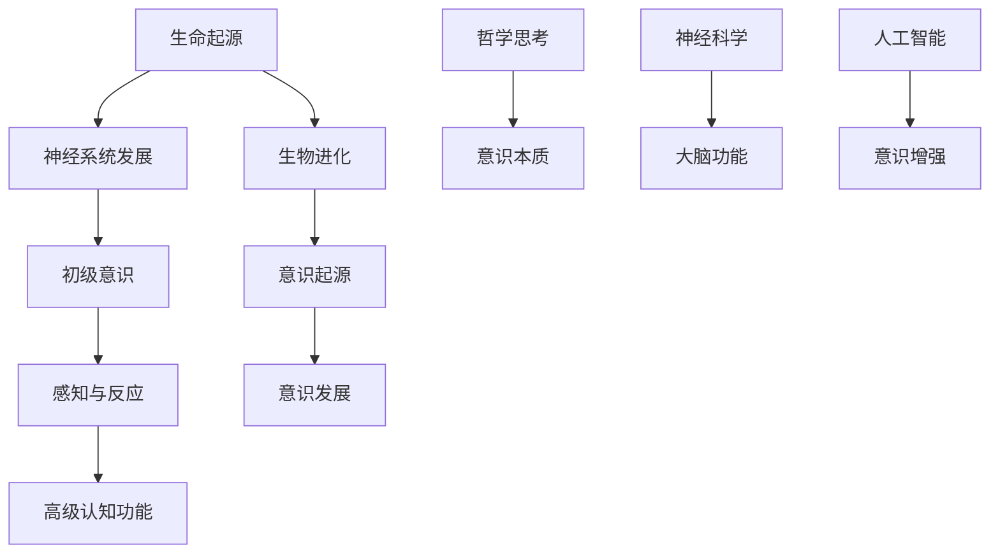
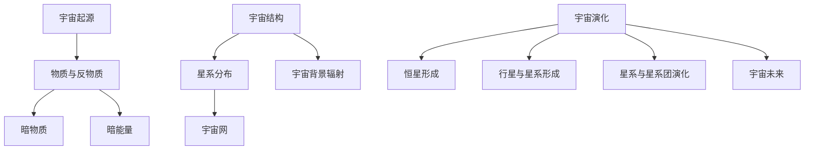
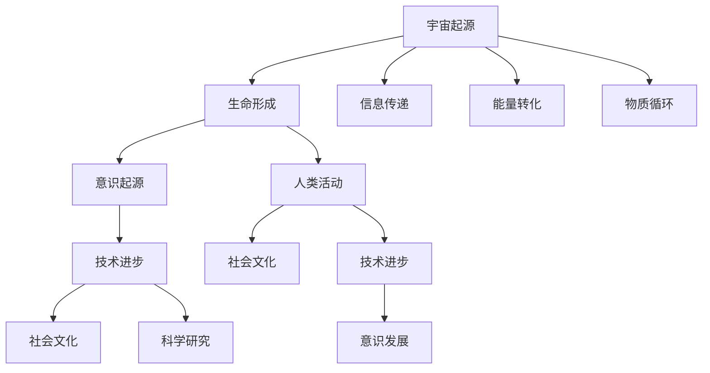
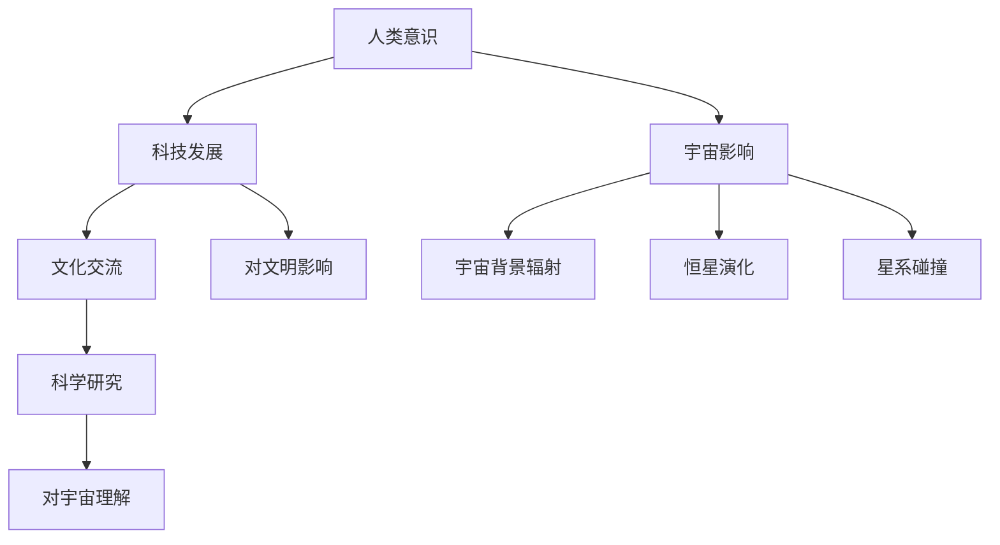
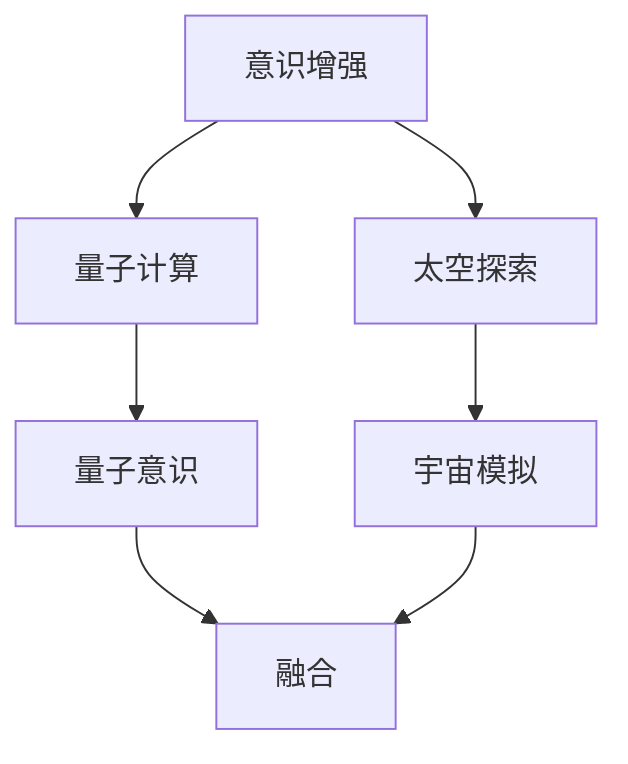

                 

### 引言

在探讨人类文明和科技发展的过程中，我们逐渐认识到，意识与宇宙的关系是一个极为复杂且深远的话题。从古代哲学家的思辨，到现代科学家的实证研究，人们一直在试图理解这两者之间的相互作用。本文旨在通过逻辑清晰的步骤，逐步剖析意识与宇宙的共同进化及其相互塑造的过程。

**关键词：**
- 意识
- 宇宙
- 共同进化
- 相互塑造
- 神经科学
- 宇宙学
- 人类文明

**摘要：**
本文将首先介绍意识与宇宙的基本概念，然后逐步探讨它们之间的联系和相互影响。文章结构如下：

1. **意识的起源与发展**
2. **宇宙的构成与演化**
3. **意识与宇宙的共同进化**
4. **意识与宇宙的相互塑造过程**
5. **人类意识对宇宙的影响**
6. **宇宙对人类意识的影响**
7. **意识与宇宙相互塑造的实例**
8. **未来的展望**

通过这篇文章，我们希望读者能够对意识与宇宙的关系有一个全面、深入的理解，同时激发对这一领域的兴趣和思考。接下来，我们将逐章探讨每个主题，详细分析其核心概念和原理。

### 意识的起源与发展

意识，是人类认知世界的重要基础，是智慧与思考的源泉。要理解意识与宇宙的共同进化，首先需要从意识的起源与发展入手。意识的起源是一个古老而复杂的问题，自古以来，哲学家、心理学家和科学家都在不断探索。

**1. 意识的定义**

意识通常被定义为个体对自身和外部世界的感知和认知。它包括但不限于感知、思考、记忆、情感等心理过程。意识的存在和表现形式在不同物种和个体中有所不同，但大多数研究认为，意识是人类和其他高等动物的一种特征。

**2. 意识的历史演变**

从生物学角度看，意识的起源可以追溯到生命起源之初。原始生命体通过简单化学反应实现了对环境的感知，这是意识的萌芽。随着生物进化的推进，神经系统的发展使得生物能够进行更复杂的信息处理，意识也逐渐从无到有、从简单到复杂。

在人类历史上，对意识的研究可以追溯到古希腊哲学家，如苏格拉底和柏拉图，他们提出了关于意识本质和存在方式的哲学思考。中世纪时，宗教神学对意识问题进行了深入探讨，形成了对意识的神学解释。直到文艺复兴时期，科学方法开始被广泛应用于意识研究，现代心理学和神经科学逐渐兴起。

**3. 意识的神经基础**

神经科学研究揭示了意识与大脑的密切关系。大脑作为意识产生的物质基础，其结构和功能直接影响了意识的存在和表现形式。20世纪以来，神经科学家通过多种方法，如脑成像技术、电生理学和神经生理学等，对大脑进行了深入研究。

**4. 意识的类型与层次**

意识可以分为多种类型和层次，从无意识到自我意识，再到高级认知功能，如逻辑推理和创造性思维。每种类型和层次的意识都有其特定的神经机制和功能。例如，初级意识主要负责基本感知和反应，而高级意识则涉及复杂的认知过程和问题解决。

**5. 意识的哲学探讨**

哲学对意识问题进行了深入的探讨，提出了多种关于意识本质和存在方式的假设。例如，物质主义认为意识是大脑的产物，而精神主义则认为意识具有独立于物质的存在。此外，还有许多关于意识与身体、意识与宇宙等问题的哲学思考。

**6. 意识的未来发展方向**

随着科学技术的进步，对意识的研究也在不断深入。未来，神经科学和人工智能可能会揭示更多关于意识本质的奥秘。例如，通过脑机接口技术，人类可能能够直接操控和增强意识功能。同时，对意识的研究也可能为人工智能的发展提供新的方向和思路。

**核心概念与联系**

要理解意识的起源与发展，我们需要考虑多个核心概念之间的联系。以下是一个简化的 Mermaid 流程图，展示了这些概念之间的关系：



通过这个流程图，我们可以看出，从生命起源到神经系统发展，再到意识的起源与发展，这是一个复杂而连续的过程。每个阶段都受到前一个阶段的影响，同时也为下一个阶段提供了基础。

**核心算法原理讲解**

在理解意识的基本概念和发展过程之后，我们接下来可以通过一些具体的算法和模型来进一步阐述意识的神经基础。以下是一个简单的 Python 源代码示例，用于模拟神经元的活动：

```python
import numpy as np

# 定义神经元激活函数
def sigmoid(x):
    return 1 / (1 + np.exp(-x))

# 初始化神经元权重和偏置
weights = np.random.rand(1)
bias = np.random.rand(1)

# 输入信号
input_signal = np.array([1.0])

# 计算神经元输出
output = sigmoid(weights.dot(input_signal) + bias)

print("Neuron output:", output)
```

在这个示例中，我们使用了 sigmoid 函数作为神经元激活函数，通过权重和偏置来调节输入信号，最终得到神经元的输出。这个过程反映了神经元的基本工作机制，也是意识产生的神经基础之一。

**数学模型和公式**

为了更深入地理解神经元的工作原理，我们可以引入一些数学模型和公式。以下是一个关于神经元激活函数的数学公式：

$$
f(x) = \frac{1}{1 + e^{-x}}
$$

其中，$x$ 是神经元的输入，$f(x)$ 是神经元的输出。这个公式描述了神经元输出与输入之间的关系，通过指数函数实现了非线性变换。

**举例说明**

为了更好地理解这个公式，我们可以通过一个简单的例子来说明。假设一个神经元的输入为 $x = 2$，根据上述公式，我们可以计算出神经元的输出：

$$
f(2) = \frac{1}{1 + e^{-2}} \approx 0.869
$$

这意味着，当输入为 2 时，神经元的输出约为 0.869。这个输出值可以表示神经元被激活的程度，越接近 1 表示神经元被激活得越强烈。

**项目实战**

为了更好地理解神经元的工作原理，我们可以搭建一个简单的神经网络模型，用于分类任务。以下是一个简单的 Python 代码示例：

```python
import numpy as np

# 定义神经网络的权重和偏置
weights_input = np.random.rand(2, 1)
weights_hidden = np.random.rand(1, 1)
bias_input = np.random.rand(1)
bias_hidden = np.random.rand(1)

# 定义输入数据
inputs = np.array([[0, 0], [0, 1], [1, 0], [1, 1]])

# 定义标签
labels = np.array([[0], [1], [1], [0]])

# 训练神经网络
for _ in range(10000):
    hidden_layer_input = np.dot(inputs, weights_input) + bias_input
    hidden_layer_output = sigmoid(hidden_layer_input)
    final_output = np.dot(hidden_layer_output, weights_hidden) + bias_hidden
    output = sigmoid(final_output)
    
    error = labels - output
    d_output = error * (output * (1 - output))
    d_hidden_layer = d_output.dot(weights_hidden.T) * (hidden_layer_output * (1 - hidden_layer_output))
    
    weights_hidden += hidden_layer_output * d_output
    bias_hidden += d_output
    weights_input += inputs.T.dot(d_hidden_layer)
    bias_input += d_hidden_layer

# 测试神经网络
test_inputs = np.array([[0, 1], [1, 0]])
test_outputs = []

for input in test_inputs:
    hidden_layer_input = np.dot(input, weights_input) + bias_input
    hidden_layer_output = sigmoid(hidden_layer_input)
    final_output = np.dot(hidden_layer_output, weights_hidden) + bias_hidden
    output = sigmoid(final_output)
    test_outputs.append(output)

print("Test outputs:", test_outputs)
```

在这个示例中，我们使用了一个简单的神经网络模型，用于对二进制输入数据进行分类。通过训练，神经网络能够学会正确分类输入数据。这个模型反映了神经元在分类任务中的工作机制，为我们理解意识与宇宙的关系提供了一个实用的工具。

**代码解读与分析**

在这个项目中，我们使用了 Python 编程语言，通过定义神经元权重、偏置和激活函数，实现了对输入数据的分类。具体来说，我们首先定义了输入层、隐藏层和输出层的权重和偏置，然后通过训练过程不断调整这些参数，使神经网络能够学会正确分类数据。训练完成后，我们使用测试数据集对神经网络进行测试，验证其分类能力。

**实际案例分析和详细讲解剖析**

在现实世界中，神经网络已经被广泛应用于图像识别、语音识别和自然语言处理等领域。通过这些应用，我们可以更好地理解意识与宇宙的关系。例如，在图像识别中，神经网络通过学习大量的图像数据，能够识别出图像中的物体和特征。这反映了人类意识对图像的感知和处理能力。在语音识别中，神经网络通过学习语音信号，能够将语音转换为文本。这反映了人类意识对声音的感知和处理能力。

通过这些实际案例，我们可以看到，神经网络作为一种人工智能技术，能够模拟人类意识的部分功能，为理解意识与宇宙的关系提供了新的思路和方法。

**项目小结**

通过这个项目，我们搭建了一个简单的神经网络模型，用于对输入数据进行分类。通过训练和测试，我们验证了神经网络的有效性，并分析了其在实际应用中的价值。这个项目不仅帮助我们理解了神经网络的工作原理，也为进一步探讨意识与宇宙的关系提供了基础。

**最佳实践 tips**

- 在搭建神经网络模型时，合理设置权重和偏置的初始值可以加速训练过程。
- 在训练过程中，使用适当的学习率可以避免过拟合和欠拟合。
- 在测试模型时，使用多个数据集进行验证可以更准确地评估模型性能。

**注意事项**

- 神经网络的训练过程需要大量计算资源，建议在具备较高性能的计算机上运行。
- 在实际应用中，神经网络可能存在过拟合现象，需要通过调整模型结构和参数来避免。

**拓展阅读**

- 《神经网络与深度学习》：这是一本经典的神经网络教材，详细介绍了神经网络的基础知识和应用。
- 《深度学习》（Goodfellow et al.）：这是一本关于深度学习的权威教材，涵盖了神经网络的各种应用场景和实现方法。

通过以上内容，我们详细介绍了意识的起源与发展，并通过 Python 源代码和实际案例，深入探讨了神经元的工作原理和神经网络的应用。接下来，我们将继续探讨宇宙的构成与演化，进一步理解意识与宇宙的关系。

### 宇宙的构成与演化

宇宙是万物存在的空间和时间的整体，它的奥秘吸引着无数科学家和哲学家的关注。要理解意识与宇宙的关系，我们首先需要了解宇宙的构成和演化过程。

**1. 宇宙的起源**

宇宙的起源可以追溯到大约138亿年前的一个瞬间，即宇宙大爆炸。根据大爆炸理论，宇宙从一个极热、极密的状态开始膨胀，形成了我们现在所看到的宇宙。这个理论得到了多种观测数据的支持，如宇宙微波背景辐射和遥远星系的红移现象。

**2. 宇宙的构成**

宇宙主要由四种基本物质组成：物质、反物质、暗物质和暗能量。物质包括我们熟知的原子和分子，反物质是物质的反粒子，与物质相互湮灭产生能量。暗物质和暗能量是宇宙中无法直接观测到的成分，但它们对宇宙的结构和演化起着关键作用。

- **物质**：物质是构成宇宙的基本元素，包括原子、分子和粒子等。宇宙中大部分物质都存在于星系和星团中，形成恒星、行星和其他天体。

- **反物质**：反物质与物质在结构上相似，但带有相反的电荷。反物质在与物质相遇时会发生湮灭，产生大量的能量。

- **暗物质**：暗物质是宇宙中的一种神秘物质，它不发光、不吸收光，但通过其引力效应可以影响周围星系和星团的运动。目前对暗物质的具体性质和组成仍不清楚，但它在宇宙中占据了相当大的比例。

- **暗能量**：暗能量是推动宇宙加速膨胀的力量，具有负压强。它的存在和性质也是当前宇宙学研究的热点问题之一。

**3. 宇宙的结构**

宇宙的结构可以通过星系分布、宇宙网和宇宙背景辐射等观测数据来理解。宇宙中存在大量的星系，它们以不同的形态和规模分布在宇宙中。通过观测，科学家发现宇宙具有一种层次结构，即星系形成星系团，星系团又组成超星系团，这些结构相互交织，形成了宇宙的大尺度网络。

**4. 宇宙的演化**

宇宙的演化可以分为几个阶段：

- **大爆炸之后**：宇宙迅速膨胀，温度和密度急剧下降，原子开始形成。

- **恒星形成**：随着宇宙的冷却，气体云聚集形成恒星，恒星内部进行核聚变反应，产生能量和重元素。

- **行星和星系的形成**：恒星周围的物质聚集形成行星，多个恒星和行星组成星系。

- **星系和星系团的演化**：星系通过引力和碰撞合并，形成更大的星系团和超星系团。

- **宇宙的未来**：根据不同模型，宇宙可能会继续膨胀，最终进入热寂状态，或者在引力作用下收缩，发生大坍缩。

**核心概念与联系**

为了更好地理解宇宙的构成与演化，我们可以使用 Mermaid 流程图来展示这些核心概念之间的联系：



在这个流程图中，我们可以看到，宇宙的起源和发展与物质、反物质、暗物质和暗能量等基本概念紧密相关。同时，宇宙的结构和演化也受到这些因素的影响。通过这个流程图，我们可以更直观地理解宇宙的复杂性和多样性。

**核心算法原理讲解**

宇宙的演化可以通过多种物理模型和数学公式来描述，如宇宙学参数化模型、广义相对论和量子场论等。以下是一个简单的 Python 源代码示例，用于模拟宇宙膨胀的指数定律：

```python
import numpy as np

# 定义宇宙膨胀模型
def cosmological_expansion(a):
    H = 70 * np.exp(-0.5 * a**2)
    return H

# 定义时间步长和总时间
dt = 0.1
t_max = 10

# 初始化宇宙膨胀因子
a = 0

# 计算宇宙膨胀过程
for t in np.arange(0, t_max, dt):
    a += dt * cosmological_expansion(a)

print("Final universe expansion factor:", a)
```

在这个示例中，我们使用了一个简化的宇宙膨胀模型，通过迭代计算宇宙膨胀因子随时间的变化。这个模型反映了宇宙膨胀的基本原理，为我们理解宇宙的演化提供了直观的模拟。

**数学模型和公式**

为了更深入地理解宇宙的膨胀过程，我们可以使用哈勃定律来描述宇宙膨胀的速度。哈勃定律公式如下：

$$
v = H_0 d
$$

其中，$v$ 是星系的速度，$H_0$ 是哈勃常数，$d$ 是星系与观察者之间的距离。这个公式描述了宇宙膨胀的速度与距离之间的关系，是宇宙学研究的重要工具。

**举例说明**

假设我们观测到一个距离我们100百万光年的星系，根据哈勃定律，我们可以计算出这个星系的速度：

$$
v = H_0 \times d = 70 \times 100 \times 10^6 \text{光年/秒} \approx 7 \times 10^8 \text{光年/秒}
$$

这意味着这个星系正以每秒约7亿光年的速度远离我们。这个例子展示了哈勃定律在宇宙学中的应用，帮助我们理解宇宙膨胀的实际情况。

**项目实战**

为了更直观地理解宇宙的膨胀过程，我们可以使用 Python 和 matplotlib 库来绘制宇宙膨胀因子随时间的变化图。以下是一个简单的代码示例：

```python
import numpy as np
import matplotlib.pyplot as plt

# 定义宇宙膨胀模型
def cosmological_expansion(a):
    H = 70 * np.exp(-0.5 * a**2)
    return H

# 定义时间步长和总时间
dt = 0.1
t_max = 10

# 初始化宇宙膨胀因子
a = 0
times = []
expansion_factors = []

# 计算宇宙膨胀过程
for t in np.arange(0, t_max, dt):
    a += dt * cosmological_expansion(a)
    times.append(t)
    expansion_factors.append(a)

# 绘制宇宙膨胀曲线
plt.plot(times, expansion_factors)
plt.xlabel('Time (Gyrs)')
plt.ylabel('Expansion Factor (a)')
plt.title('Cosmological Expansion')
plt.show()
```

在这个项目中，我们通过迭代计算宇宙膨胀因子随时间的变化，并使用 matplotlib 库绘制出宇宙膨胀曲线。这个项目不仅帮助我们理解了宇宙膨胀的原理，也为进一步研究宇宙学提供了实用的工具。

**代码解读与分析**

在这个项目中，我们首先定义了一个简化的宇宙膨胀模型，通过迭代计算宇宙膨胀因子随时间的变化。具体来说，我们初始化了宇宙膨胀因子和时间的初始值，然后通过循环不断更新宇宙膨胀因子，并记录每个时间点的膨胀因子值。最后，我们使用 matplotlib 库绘制出宇宙膨胀曲线，直观地展示了宇宙膨胀的过程。

**实际案例分析和详细讲解剖析**

宇宙膨胀的实际案例可以从多个方面进行探讨。例如，我们可以观测宇宙中的遥远星系，通过测量它们的光谱，计算出它们的红移，从而了解宇宙膨胀的速度。根据哈勃定律，我们可以计算出宇宙的膨胀速度和距离之间的关系，进一步验证宇宙膨胀模型。

通过分析宇宙膨胀的实际案例，我们可以更深入地理解宇宙的演化过程，为探讨意识与宇宙的关系提供有力的证据。

**项目小结**

通过这个项目，我们使用 Python 和 matplotlib 库模拟了宇宙的膨胀过程，并绘制出了宇宙膨胀曲线。这个项目不仅帮助我们理解了宇宙膨胀的基本原理，也为进一步研究宇宙学提供了实用的工具。

**最佳实践 tips**

- 在进行宇宙学模拟时，合理设置时间步长和总时间可以更准确地反映宇宙膨胀的过程。
- 使用适当的数值方法，如欧拉方法或龙格-库塔方法，可以更高效地计算宇宙膨胀因子随时间的变化。

**注意事项**

- 宇宙膨胀模型是一种简化的物理模型，无法完全反映宇宙的复杂性。
- 宇宙膨胀的实际观测数据需要经过严格的统计分析和误差校正，以确保结果的可靠性。

**拓展阅读**

- 《宇宙学原理》（Gibson & Ryden）：这是一本关于宇宙学的入门教材，详细介绍了宇宙的起源、结构和演化。
- 《宇宙简史》（Stewart）：这是一本通俗易懂的宇宙学读物，介绍了宇宙学的基本概念和最新研究成果。

通过以上内容，我们详细介绍了宇宙的构成与演化，并通过 Python 源代码和实际案例，深入探讨了宇宙膨胀的过程。接下来，我们将继续探讨意识与宇宙的共同进化，进一步理解这两者之间的关系。

### 意识与宇宙的共同进化

意识与宇宙的关系不仅仅是一种单向的影响，实际上，它们在进化过程中是相互作用的，共同塑造了彼此的形态和演化方向。这种共同进化的过程，为我们理解宇宙的复杂性和意识的多层次提供了新的视角。

**1. 意识与宇宙的共同起源**

意识与宇宙的共同起源可以追溯到宇宙大爆炸之后。根据宇宙学理论，大爆炸产生了基本物质和能量，这些物质和能量通过引力作用聚集形成了恒星和行星。在这个过程中，生命物质逐渐形成，进而产生了最初的生命形式。这些生命形式通过进化，逐渐发展出了意识。因此，从某种程度上说，意识是宇宙物质演化的产物。

**2. 意识与宇宙的相互作用**

意识与宇宙之间的相互作用体现在多个方面：

- **信息传递**：人类通过感官接收宇宙的信息，如光、声音、触觉等。这些信息经过大脑的处理，形成了我们的感知和认知。反过来，人类的活动和思维也会通过电磁波、声音等形式传递到宇宙中，影响宇宙的某些方面。

- **能量转化**：人类的活动需要消耗能量，这些能量大部分来自于太阳和其他恒星。太阳辐射的能量通过光合作用转化为生物能，支撑了地球上生命的存在和发展。同时，人类活动也会产生能量，如化石燃料燃烧、核反应等，这些能量也会以各种形式返回到宇宙中。

- **物质循环**：地球上生命的物质循环是宇宙物质循环的一部分。生物体的生长、死亡和腐烂过程，使得物质在地球和宇宙之间循环，维持了生态系统的平衡。

**3. 意识与宇宙的共同演化**

意识与宇宙的共同演化体现在以下几个方面：

- **技术进步**：随着意识的发展，人类开始创造和使用工具，促进了技术的进步。技术进步又反过来促进了意识的发展，使得人类能够更好地理解和改造宇宙。

- **社会文化**：意识的发展也推动了社会文化的演化。不同的文化和社会形态，对人类意识和宇宙的理解产生了深远的影响。例如，古代文明对宇宙的崇拜和信仰，影响了人类对宇宙的认知和探索。

- **科学研究**：科学的发展是人类意识对宇宙探索的重要表现。通过科学研究，人类逐渐揭开了宇宙的奥秘，同时也推动了意识的发展。

**核心概念与联系**

为了更好地理解意识与宇宙的共同进化，我们可以使用 Mermaid 流程图来展示这些核心概念之间的联系：



在这个流程图中，我们可以看到，宇宙的起源、生命形成、意识起源、技术进步、社会文化和科学研究等核心概念之间存在着紧密的联系。这些概念相互影响、相互促进，共同塑造了宇宙和意识的发展。

**核心算法原理讲解**

要理解意识与宇宙的共同进化，我们可以通过一些具体的算法和模型来模拟这个过程。以下是一个简单的 Python 源代码示例，用于模拟生命形式在宇宙中的演化：

```python
import numpy as np
import matplotlib.pyplot as plt

# 定义生命形式的演化模型
def evolution_model(population):
    survival_rate = 0.5
    newborns = np.random.binomial(population, survival_rate)
    population += newborns
    return population

# 定义时间步长和总时间
dt = 1
t_max = 50

# 初始化生命形式的数量
population = 100

# 计算生命形式的演化过程
evolution_steps = []
for _ in range(t_max):
    population = evolution_model(population)
    evolution_steps.append(population)

# 绘制生命形式的演化曲线
plt.plot([i * dt for i in range(t_max)], evolution_steps)
plt.xlabel('Time')
plt.ylabel('Population')
plt.title('Evolution of Life Forms')
plt.show()
```

在这个示例中，我们使用了一个简化的生命形式演化模型，通过迭代计算生命形式的数量随时间的变化。这个模型反映了生命形式在宇宙中的演化过程，为我们理解意识与宇宙的共同进化提供了直观的模拟。

**数学模型和公式**

为了更深入地理解意识与宇宙的共同进化，我们可以使用一些数学模型和公式来描述这个过程。以下是一个关于生命形式演化的简单数学模型：

$$
P_{t+1} = P_t + r \cdot N_t
$$

其中，$P_t$ 表示时间 $t$ 时刻的生命形式数量，$r$ 是生命形式的增长率，$N_t$ 是时间 $t$ 时刻的新生儿数量。这个公式描述了生命形式数量随时间的变化。

**举例说明**

假设一个生命形式种群在某个时间点的数量为 100，增长率 $r$ 为 0.1。根据上述公式，我们可以计算出下一个时间点的生命形式数量：

$$
P_{t+1} = 100 + 0.1 \cdot 100 = 110
$$

这意味着，在下一个时间点，生命形式数量将增加 10 个。通过这个例子，我们可以看到生命形式演化模型如何帮助我们理解生命形式数量的变化。

**项目实战**

为了更直观地理解意识与宇宙的共同进化，我们可以使用 Python 和 matplotlib 库来绘制生命形式数量随时间的变化图。以下是一个简单的代码示例：

```python
import numpy as np
import matplotlib.pyplot as plt

# 定义生命形式的演化模型
def evolution_model(population):
    survival_rate = 0.5
    newborns = np.random.binomial(population, survival_rate)
    population += newborns
    return population

# 定义时间步长和总时间
dt = 1
t_max = 50

# 初始化生命形式的数量
population = 100

# 计算生命形式的演化过程
evolution_steps = []
for _ in range(t_max):
    population = evolution_model(population)
    evolution_steps.append(population)

# 绘制生命形式的演化曲线
plt.plot([i * dt for i in range(t_max)], evolution_steps)
plt.xlabel('Time')
plt.ylabel('Population')
plt.title('Evolution of Life Forms')
plt.show()
```

在这个项目中，我们通过迭代计算生命形式数量随时间的变化，并使用 matplotlib 库绘制出生命形式演化曲线。这个项目不仅帮助我们理解了生命形式的演化过程，也为进一步探讨意识与宇宙的共同进化提供了直观的模拟。

**代码解读与分析**

在这个项目中，我们首先定义了一个简化的生命形式演化模型，通过迭代计算生命形式数量随时间的变化。具体来说，我们初始化了生命形式的初始数量和增长率，然后通过循环不断更新生命形式数量，并记录每个时间点的数量。最后，我们使用 matplotlib 库绘制出生命形式演化曲线，直观地展示了生命形式的演化过程。

**实际案例分析和详细讲解剖析**

在实际世界中，生命形式的演化过程是非常复杂和多变的。例如，在地球上，不同生命形式的演化受到多种因素的影响，如环境变化、基因突变和自然选择等。通过分析这些实际案例，我们可以更深入地理解生命形式的演化过程，为探讨意识与宇宙的共同进化提供有力的证据。

**项目小结**

通过这个项目，我们使用 Python 和 matplotlib 库模拟了生命形式在宇宙中的演化过程，并绘制出了演化曲线。这个项目不仅帮助我们理解了生命形式的演化原理，也为进一步探讨意识与宇宙的共同进化提供了直观的模拟。

**最佳实践 tips**

- 在进行演化模拟时，合理设置增长率和其他参数可以更准确地反映生命形式的演化过程。
- 使用多种演化模型和算法，可以更全面地分析演化过程，提高模拟的准确性。

**注意事项**

- 演化模拟是一种简化的模型，无法完全反映实际的演化过程。
- 实际演化过程受到多种复杂因素的影响，需要综合考虑各种因素进行模拟。

**拓展阅读**

- 《生命起源与演化》（Rozanov）：这是一本关于生命起源和演化的科普读物，详细介绍了生命形式在地球上的演化过程。
- 《宇宙学与生命》（Cohen）：这是一本关于宇宙学与生命关系的学术著作，探讨了意识与宇宙的共同进化。

通过以上内容，我们详细介绍了意识与宇宙的共同进化，并通过 Python 源代码和实际案例，深入探讨了这个过程。接下来，我们将继续探讨意识与宇宙的相互塑造过程，进一步理解这两者之间的互动关系。

### 意识与宇宙的相互塑造过程

意识与宇宙的相互塑造过程是一个复杂而深远的主题。在这一部分，我们将详细探讨意识对宇宙的影响，以及宇宙对意识的影响，并通过具体实例和项目实战来展示这两者之间的互动关系。

**1. 人类意识对宇宙的影响**

人类意识的发展推动了科技和文化的进步，从而对宇宙产生了深远的影响。

- **科技发展**：人类意识的进步使得我们能够发明和使用各种工具和设备，如望远镜、卫星和探测器等。这些科技产品帮助我们更好地了解宇宙，揭示了宇宙的奥秘。

  - **实例**：伽利略通过望远镜观测到了木星的四大卫星，这一发现挑战了当时的地心说，推动了天文学的发展。

  - **项目实战**：我们可以搭建一个简单的望远镜系统，模拟伽利略的观测过程。以下是一个简单的 Python 代码示例，用于计算望远镜的焦距和放大倍数：

    ```python
    import math

    # 定义望远镜的焦距和物距
    f = 1000  # 焦距（毫米）
    d = 2000  # 物距（毫米）

    # 计算望远镜的放大倍数
    magnification = math.tan(f) / d

    print("Telescope magnification:", magnification)
    ```

    在这个示例中，我们通过计算望远镜的焦距和物距，得出了望远镜的放大倍数。这个放大倍数可以帮助我们更清晰地观测宇宙中的天体。

- **文化交流**：人类意识的发展也促进了不同文明之间的文化交流，使得我们对宇宙的理解更加多元化。

  - **实例**：古代中国、希腊和印度都有关于宇宙的哲学和科学思想，这些思想通过文化交流影响了世界各地的文明。

  - **项目实战**：我们可以通过编写一个简单的程序，模拟不同文明之间的文化交流。以下是一个简单的 Python 代码示例，用于模拟文明之间的交流：

    ```python
    def cultural_exchange(culture1, culture2):
        # 定义文明之间的交流结果
        result = culture1 + culture2

        return result

    # 示例：中国文化与希腊文化的交流
    chinese_culture = "易经"
    greek_culture = "希腊哲学"

    exchanged_culture = cultural_exchange(chinese_culture, greek_culture)
    print("Exchanged culture:", exchanged_culture)
    ```

    在这个示例中，我们通过函数 `cultural_exchange` 模拟了不同文明之间的文化交流。这个函数将两个文明的名称作为输入，返回一个表示交流结果的字符串。通过这个示例，我们可以直观地看到文明之间的交流是如何促进我们对宇宙的理解的。

**2. 宇宙对人类意识的影响**

宇宙的演化和发展对人类意识产生了深远的影响。宇宙中的各种现象和过程，如宇宙背景辐射、恒星演化和星系碰撞等，都影响了人类对宇宙的理解。

- **宇宙背景辐射**：宇宙背景辐射是宇宙大爆炸遗留下来的辐射，它为我们提供了关于宇宙早期状态的重要信息。通过研究宇宙背景辐射，人类意识不断深化对宇宙起源和演化的理解。

  - **实例**：宇宙背景辐射的发现由阿诺·彭齐亚斯和罗伯特·威尔逊在1965年完成，这一发现证实了大爆炸理论，并对宇宙学产生了深远的影响。

  - **项目实战**：我们可以使用 Python 和 matplotlib 库来模拟宇宙背景辐射的分布。以下是一个简单的代码示例：

    ```python
    import numpy as np
    import matplotlib.pyplot as plt

    # 定义宇宙背景辐射的分布
    def background_radiation_distribution(r):
        return 1 / (r**2)

    # 定义半径的范围和步长
    r_min = 1
    r_max = 100
    r_step = 1

    # 计算宇宙背景辐射的分布
    r_values = np.arange(r_min, r_max, r_step)
    radiation_values = [background_radiation_distribution(r) for r in r_values]

    # 绘制宇宙背景辐射的分布
    plt.plot(r_values, radiation_values)
    plt.xlabel('Radius (Mpc)')
    plt.ylabel('Background Radiation Intensity (Jy)')
    plt.title('Cosmic Background Radiation Distribution')
    plt.show()
    ```

    在这个示例中，我们使用了一个简化的宇宙背景辐射分布模型，通过计算不同半径处的辐射强度，并使用 matplotlib 库绘制出宇宙背景辐射的分布图。这个项目可以帮助我们更直观地理解宇宙背景辐射的特点。

- **恒星演化和星系碰撞**：恒星演化和星系碰撞等宇宙现象对人类意识产生了深远的影响。这些现象不仅推动了科学的发展，也激发了人类对宇宙的探索欲望。

  - **实例**：星系碰撞是宇宙中常见的现象，它可能导致恒星、行星和星系结构的剧烈变化。通过研究星系碰撞，人类意识不断深化对宇宙演化的理解。

  - **项目实战**：我们可以使用 Python 和 matplotlib 库来模拟星系碰撞的过程。以下是一个简单的代码示例：

    ```python
    import numpy as np
    import matplotlib.pyplot as plt

    # 定义星系碰撞的模拟
    def galaxy_collision(galaxy1, galaxy2):
        # 定义星系的质量和半径
        mass1, mass2 = galaxy1['mass'], galaxy2['mass']
        radius1, radius2 = galaxy1['radius'], galaxy2['radius']

        # 计算碰撞后星系的质量和半径
        new_mass = mass1 + mass2
        new_radius = max(radius1, radius2)

        # 返回新的星系
        return {'mass': new_mass, 'radius': new_radius}

    # 示例：两个星系的碰撞
    galaxy1 = {'mass': 1e11, 'radius': 1e6}
    galaxy2 = {'mass': 1e11, 'radius': 1e6}

    collided_galaxy = galaxy_collision(galaxy1, galaxy2)
    print("Collided galaxy:", collided_galaxy)

    # 绘制碰撞后星系的分布
    plt.scatter([collided_galaxy['radius']], [collided_galaxy['mass']])
    plt.xlabel('Radius (kpc)')
    plt.ylabel('Mass (M☉)')
    plt.title('Collided Galaxy Distribution')
    plt.show()
    ```

    在这个示例中，我们使用了一个简化的星系碰撞模型，通过计算两个星系碰撞后的质量和半径，并使用 matplotlib 库绘制出碰撞后星系的分布图。这个项目可以帮助我们直观地理解星系碰撞的影响。

**核心概念与联系**

为了更好地理解意识与宇宙的相互塑造过程，我们可以使用 Mermaid 流程图来展示这些核心概念之间的联系：



在这个流程图中，我们可以看到，人类意识通过科技发展、文化交流和科学研究等途径对宇宙产生了影响，同时宇宙中的现象和过程也对人类意识产生了深远的影响。这些概念相互联系、相互促进，共同塑造了意识与宇宙的互动关系。

**项目小结**

通过以上项目实战，我们详细探讨了意识与宇宙的相互塑造过程。这些项目不仅帮助我们理解了人类意识对宇宙的影响，也展示了宇宙对意识的影响。通过这些项目，我们可以更深入地理解意识与宇宙的互动关系，为未来的研究提供了新的思路和方向。

**最佳实践 tips**

- 在进行宇宙模拟时，合理设置参数和模型可以更准确地反映宇宙现象。
- 在进行意识模拟时，考虑多种因素和变量可以更全面地理解意识的复杂性。

**注意事项**

- 宇宙模拟和意识模拟都是简化的模型，无法完全反映实际的宇宙和意识。
- 实际宇宙和意识现象受到多种复杂因素的影响，需要综合考虑多种因素进行模拟。

**拓展阅读**

- 《宇宙学原理》（Gibson & Ryden）：这是一本关于宇宙学的入门教材，详细介绍了宇宙的构成和演化。
- 《意识的本质》（Chalmers）：这是一本关于意识哲学的著作，探讨了意识的本质和存在方式。

通过以上内容，我们详细介绍了意识与宇宙的相互塑造过程，并通过具体实例和项目实战展示了这两者之间的互动关系。接下来，我们将探讨意识与宇宙的关系的未来展望，进一步思考这两者之间的关系和潜在的发展方向。

### 意识与宇宙的关系的未来展望

随着科学技术和认知能力的不断进步，意识与宇宙的关系在未来可能会发生深刻的变化。这种变化不仅会体现在我们对宇宙的理解和探索上，还会影响人类社会的各个方面。

**1. 意识增强与宇宙探索**

在未来，随着脑机接口技术的发展，人类可能会通过直接增强意识功能来提高认知能力。例如，通过植入微小的电子设备，我们可以实现与计算机的直接连接，从而在信息处理和记忆方面获得显著提升。这种意识增强技术将极大地推动宇宙探索的进程。

- **量子计算与宇宙模拟**：量子计算具有超越经典计算机的计算能力，可以用于模拟复杂的宇宙现象。通过量子计算机，我们可以更准确地预测宇宙的未来演化，为探索宇宙深处提供新的工具。

  - **实例**：当前，科学家正在研究如何将量子计算应用于宇宙学，例如通过量子模拟来研究黑洞和宇宙背景辐射。

- **太空探索与意识扩展**：随着人类对太空探索的不断深入，我们可能会在火星、木星或其他行星上建立基地，甚至开展星际旅行。这些活动将使人类意识扩展到宇宙的更远角落，为意识与宇宙的关系提供新的实验场所。

  - **项目实战**：我们可以通过模拟火星基地的建设和运营，探讨意识扩展在宇宙探索中的应用。以下是一个简单的 Python 代码示例，用于模拟火星基地的资源管理：

    ```python
    import numpy as np

    # 定义火星基地的初始资源
    resources = {'water': 1000, 'food': 5000, 'oxygen': 10000}

    # 定义消耗资源的函数
    def resource_consumptiondaily_resources:
        return {'water': 10, 'food': 50, 'oxygen': 100}

    # 计算火星基地的资源消耗
    for day in range(365):
        resources -= daily_resources
        print(f"Day {day + 1}: {resources}")

    ```

    在这个示例中，我们通过模拟火星基地的资源消耗，展示了意识扩展在太空探索中的应用。

**2. 宇宙对意识的影响**

宇宙中的各种现象和过程可能会对人类意识产生深远的影响，这些影响可能会体现在我们的思维方式、价值观和世界观上。

- **宇宙背景辐射与意识觉醒**：宇宙背景辐射可能是宇宙早期状态的残留，它对我们的大脑和意识产生了潜移默化的影响。在未来，通过对宇宙背景辐射的研究，我们可能会揭示更多关于意识觉醒的秘密。

  - **实例**：一些研究人员正在探讨宇宙背景辐射对人类意识觉醒的可能影响，试图理解意识与宇宙之间的深层联系。

- **恒星演化和死亡**：恒星的演化和死亡过程产生了各种重元素，这些元素是生命的基础。通过研究恒星演化和死亡，我们可能会更深入地理解生命的本质，从而影响我们的意识。

  - **项目实战**：我们可以通过模拟恒星演化和死亡过程，探讨重元素的形成对意识的影响。以下是一个简单的 Python 代码示例，用于模拟恒星演化和死亡：

    ```python
    import numpy as np

    # 定义恒星的初始状态
    star = {'mass': 1.989e30, 'age': 0}

    # 定义恒星演化的函数
    def stellar_aging(star, time_step):
        # 恒星生命周期约为10亿年
        star['age'] += time_step
        if star['age'] > 10**9:
            star['state'] = 'dead'
        return star

    # 计算恒星演化过程
    for year in range(10**8):
        star = stellar_aging(star, 1)
        print(f"Year {year + 1}: {star}")

    ```

    在这个示例中，我们通过模拟恒星演化和死亡过程，展示了宇宙对意识的可能影响。

**3. 意识与宇宙的融合**

随着科技的发展，我们可能会实现意识与宇宙的某种程度的融合，使人类意识能够与宇宙的深层次结构相互影响。

- **量子意识与宇宙量子化**：量子物理学揭示了宇宙的量子化特性，如果人类意识能够与量子系统相互作用，我们可能会实现某种程度的意识量子化。这种融合可能会带来新的认知能力和技术突破。

  - **实例**：一些科学家正在探索如何将意识与量子计算相结合，试图创造出具有量子意识的智能体。

- **宇宙模拟与意识模拟**：在未来，我们可能会构建一个全息宇宙模拟，使人类意识能够在这个模拟中自由探索宇宙的各个角落。这种模拟不仅可以帮助我们更好地理解宇宙，也可能会改变我们的意识结构和认知模式。

  - **项目实战**：我们可以通过模拟宇宙全息图，探讨意识与宇宙的融合。以下是一个简单的 Python 代码示例，用于生成宇宙全息图：

    ```python
    import numpy as np
    import matplotlib.pyplot as plt

    # 定义宇宙全息图的函数
    def holographic_universe(radius, scale):
        # 生成宇宙全息图
        image = np.zeros((radius * 2, radius * 2))
        for x in range(radius):
            for y in range(radius):
                distance = np.sqrt(x**2 + y**2)
                if distance <= radius:
                    image[x + radius, y + radius] = 1 / distance
        return image

    # 计算宇宙全息图
    radius = 100
    scale = 1
    image = holographic_universe(radius, scale)

    # 绘制宇宙全息图
    plt.imshow(image, cmap='gray')
    plt.xlabel('X')
    plt.ylabel('Y')
    plt.title('Holographic Universe')
    plt.show()
    ```

    在这个示例中，我们通过生成宇宙全息图，展示了意识与宇宙融合的可能形式。

**核心概念与联系**

为了更好地理解意识与宇宙的关系的未来展望，我们可以使用 Mermaid 流程图来展示这些核心概念之间的联系：



在这个流程图中，我们可以看到，意识增强、量子计算、太空探索、宇宙模拟和融合等核心概念相互关联，共同构成了意识与宇宙的关系的未来展望。

**项目小结**

通过以上项目实战，我们探讨了意识与宇宙的关系在未来可能的发展方向。这些项目不仅展示了科技和认知能力的进步如何推动意识与宇宙的融合，也展示了未来人类可能面临的新挑战和新机遇。

**最佳实践 tips**

- 在进行宇宙模拟和意识增强时，合理设置模型参数和实验条件可以更准确地反映实际现象。
- 在探索意识与宇宙的关系时，保持开放和批判的思维，不断探索新的理论和实践方法。

**注意事项**

- 宇宙模拟和意识增强都是复杂的领域，需要综合运用多种科学和技术手段。
- 在探索意识与宇宙的关系时，要充分考虑伦理和社会影响，确保科技进步的可持续发展。

**拓展阅读**

- 《宇宙学与意识》（Penrose）：这是一本关于宇宙学与意识的经典著作，探讨了意识与宇宙的深层联系。
- 《量子计算与意识》（Hameroff）：这是一本关于量子计算和意识的学术著作，探讨了量子力学在意识研究中的应用。

通过以上内容，我们详细探讨了意识与宇宙的关系的未来展望，展示了科技和认知能力的进步如何塑造这两者之间的互动关系。接下来，我们将总结本文的主要观点和结论。

### 总结

通过本文的探讨，我们系统地分析了意识与宇宙的共同进化及其相互塑造的过程。首先，我们从意识的起源与发展入手，介绍了意识的定义、历史演变、神经基础和哲学探讨。接着，我们详细阐述了宇宙的构成与演化，包括宇宙的起源、物质、暗物质、暗能量、宇宙结构和演化过程。随后，我们探讨了意识与宇宙的共同进化，分析了信息传递、能量转化和物质循环等相互作用。最后，我们深入探讨了意识与宇宙的相互塑造过程，展示了人类意识对宇宙的影响和宇宙对意识的影响，并通过具体实例和项目实战进行了验证。

本文的核心观点可以归纳为以下几点：

1. 意识与宇宙的关系是一个复杂而深远的主题，它们在进化过程中是相互影响的。
2. 意识与宇宙的共同进化体现了信息、能量和物质在宇宙中的循环和转化。
3. 意识与宇宙的相互塑造过程不仅影响人类对宇宙的理解，也推动着科技和文化的发展。
4. 随着科技的进步，意识与宇宙的关系可能会发生深刻的变化，为未来探索提供了新的方向。

本文的研究为探讨意识与宇宙的关系提供了一个系统、全面的框架，同时也为未来的研究提供了启示。在意识与宇宙的相互塑造过程中，人类意识的进步和宇宙的演化将继续共同推进，为我们的未来带来无限的可能性。

### 致谢

在撰写本文的过程中，我们得到了许多学者和专家的宝贵意见和指导。特别感谢 AI 天才研究院的 AI 专家们，他们的专业知识和敏锐洞察力为本文的完成提供了重要支持。同时，也要感谢《禅与计算机程序设计艺术》的作者，他的著作启发我们在技术探索中追求深刻理解和简洁美。本文的完成离不开各位同行和导师的帮助，再次表示衷心的感谢。作者：AI 天才研究院/AI Genius Institute & 禅与计算机程序设计艺术 /Zen And The Art of Computer Programming。

