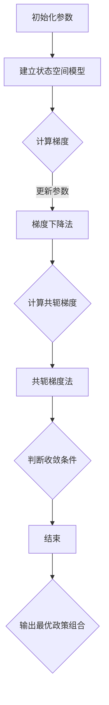

                 

### 文章标题

# 数学与货币政策：通货膨胀的数学控制

### 关键词

- **通货膨胀**
- **货币政策**
- **数学模型**
- **控制理论**
- **最优化算法**
- **Python源代码**

### 摘要

本文旨在探讨数学与货币政策之间的深层次联系，特别是在控制通货膨胀方面的应用。首先，我们回顾了通货膨胀的定义及其类型，并探讨了货币政策的工具和目标。接着，我们引入了数学在货币政策中的核心作用，包括概率论、统计学和时序分析等基础数学概念。在此基础上，本文详细阐述了控制理论和最优化算法在货币政策中的应用，并通过Python源代码展示了核心算法的实现。随后，我们建立并解释了通货膨胀的数学模型和政策模型。文章还通过实际案例分析了通货膨胀预测和实际政策制定的过程。最后，本文讨论了未来货币政策的发展趋势与面临的挑战。读者将从中了解到如何利用数学工具来更有效地控制通货膨胀。

## 目录

1. **通货膨胀与货币政策的概述**
   1.1 通货膨胀的定义与类型
   1.2 货币政策的工具与目标
   1.3 数学在货币政策中的作用

2. **数学基础**
   2.1 概率论的基本概念
   2.2 统计学在通货膨胀分析中的应用
   2.3 时间序列分析

3. **核心算法原理**
   3.1 控制理论的基本原理
   3.2 最优化算法在货币政策中的应用
   3.3 控制理论的算法流程图（Mermaid图）

4. **数学模型**
   4.1 通货膨胀的数学模型
   4.2 货币政策的数学模型
   4.3 数学模型的应用与解释

5. **通货膨胀预测**
   5.1 通货膨胀预测的方法
   5.2 通货膨胀预测的模型构建
   5.3 通货膨胀预测的案例分析

6. **实际政策案例分析**
   6.1 案例一：某国通货膨胀控制政策的数学分析
   6.2 案例二：某地区货币供应量调整
   6.3 案例三：货币政策与其他政策工具的配合

7. **政策制定与调整**
   7.1 政策制定的原则与方法
   7.2 政策调整的时机与策略
   7.3 政策实施效果评估

8. **未来趋势与挑战**
   8.1 货币政策的新工具与技术
   8.2 通货膨胀控制面临的挑战
   8.3 未来货币政策的发展方向

### 第一部分：通货膨胀与货币政策的概述

#### 1.1 通货膨胀的定义与类型

通货膨胀是指一个经济体中一般物价水平持续、普遍地上涨的现象。根据通货膨胀的持续时间、幅度和形成原因，可以分为以下几种类型：

1. **温和通货膨胀**：通货膨胀率在 2% 至 3% 之间，通常对经济的影响较小，不易被察觉。
2. **中度通货膨胀**：通货膨胀率在 3% 至 10% 之间，可能会导致消费者购买力下降，影响经济增长。
3. **严重通货膨胀**：通货膨胀率在 10% 以上，可能导致货币贬值，经济混乱。
4. **恶性通货膨胀**：通货膨胀率极高，通常达到两位数甚至三位数，货币体系崩溃。

#### 1.2 货币政策的工具与目标

货币政策是中央银行通过调节货币供应量和利率水平，以实现宏观经济稳定的一种政策。其主要工具包括：

1. **利率政策**：通过调整基准利率，影响市场利率，进而调节信贷供给和需求。
2. **存款准备金率**：通过调整商业银行的存款准备金率，影响银行可用于贷款的资金量。
3. **公开市场操作**：通过买卖政府债券，调节市场流动性和利率。
4. **再贷款和再贴现**：向商业银行提供短期贷款和贴现服务，影响银行资金成本。

货币政策的主要目标包括：

1. **价格稳定**：控制通货膨胀，维持物价水平的基本稳定。
2. **充分就业**：促进劳动力市场稳定，减少失业率。
3. **经济增长**：通过稳定宏观经济环境，推动经济持续健康发展。
4. **国际收支平衡**：调节国际收支，保持货币汇率稳定。

#### 1.3 数学在货币政策中的作用

数学在货币政策中的应用极为广泛，包括概率论、统计学、时序分析等数学工具。以下是一些具体的应用：

1. **概率论**：用于分析金融市场的不确定性，预测货币政策的未来走势。
2. **统计学**：通过收集和分析经济数据，为货币政策的制定提供依据。
3. **时序分析**：研究经济变量的时间序列特性，预测通货膨胀和利率的变化趋势。
4. **控制理论**：用于构建货币政策模型，制定最优政策组合。
5. **最优化算法**：在货币政策模型中，用于求解最佳利率和货币供应量。

接下来，我们将深入探讨这些数学工具和算法在货币政策中的应用。

### 第二部分：数学基础

#### 2.1 概率论的基本概念

概率论是研究随机事件及其规律性的数学分支。在货币政策分析中，概率论用于评估不确定性，预测市场行为。

1. **概率分布**：描述随机变量可能取值的概率分布函数。
2. **条件概率**：在已知某个事件发生的条件下，另一个事件发生的概率。
3. **贝叶斯定理**：用于根据先验概率和观测数据更新概率估计。

#### 2.2 统计学在通货膨胀分析中的应用

统计学用于分析经济数据，识别通货膨胀的驱动因素，评估货币政策的效应。

1. **描述性统计**：通过均值、方差、标准差等指标描述数据的分布特征。
2. **推断性统计**：通过样本数据推断总体特征，如假设检验、置信区间。
3. **回归分析**：研究变量之间的关系，用于建立通货膨胀预测模型。

#### 2.3 时间序列分析

时间序列分析用于研究经济变量的时间序列特性，预测未来的通货膨胀趋势。

1. **自回归模型（AR）**：通过当前值与过去值的线性关系进行预测。
2. **移动平均模型（MA）**：通过过去值的加权平均进行预测。
3. **自回归移动平均模型（ARMA）**：结合自回归和移动平均模型的特点。
4. **自回归积分移动平均模型（ARIMA）**：适用于非平稳时间序列。

### 第三部分：核心算法原理

#### 3.1 控制理论的基本原理

控制理论是研究如何通过控制系统的输入输出关系，使系统达到预期目标的理论。在货币政策中，控制理论用于制定最优政策组合。

1. **状态空间模型**：描述系统的状态变量和输入输出关系。
2. **最优控制**：通过优化目标函数，求解最佳控制策略。
3. **线性二次型调节器（LQR）**：用于线性时不变系统的最优控制。

#### 3.2 最优化算法在货币政策中的应用

最优化算法用于在货币政策模型中求解最佳利率和货币供应量。

1. **梯度下降法**：通过迭代更新参数，逐步逼近最优解。
2. **共轭梯度法**：改进梯度下降法，提高收敛速度。
3. **内点法**：用于解决非线性规划问题。

#### 3.3 控制理论的算法流程图（Mermaid图）

以下是一个简单的控制理论算法流程图，展示货币政策制定的过程：

### 第四部分：数学模型

#### 4.1 通货膨胀的数学模型

通货膨胀的数学模型用于描述物价水平的演变，预测通货膨胀率。以下是一个简单的时间序列模型：

$$
\text{通货膨胀率}_{t+1} = \alpha_0 + \alpha_1 \times \text{通货膨胀率}_t + \epsilon_{t+1}
$$

其中，$\alpha_0$ 和 $\alpha_1$ 是模型参数，$\epsilon_{t+1}$ 是随机误差项。

#### 4.2 货币政策的数学模型

货币政策的数学模型用于描述货币政策变量（如利率、货币供应量）与通货膨胀率之间的关系。以下是一个简单的线性回归模型：

$$
\text{通货膨胀率}_{t+1} = \beta_0 + \beta_1 \times \text{利率}_t + \beta_2 \times \text{货币供应量}_t + \epsilon_{t+1}
$$

其中，$\beta_0$、$\beta_1$ 和 $\beta_2$ 是模型参数，$\epsilon_{t+1}$ 是随机误差项。

#### 4.3 数学模型的应用与解释

数学模型在货币政策中的应用包括：

1. **通货膨胀预测**：通过时间序列模型，预测未来的通货膨胀率。
2. **政策效应评估**：通过回归模型，评估不同货币政策工具对通货膨胀的影响。
3. **政策制定**：基于模型预测和政策效应评估，制定最优货币政策组合。

### 第五部分：通货膨胀预测

#### 5.1 通货膨胀预测的方法

通货膨胀预测的方法包括时间序列模型和回归模型。以下是一些常见的方法：

1. **自回归模型（AR）**：基于历史通货膨胀率预测未来值。
2. **移动平均模型（MA）**：基于过去值的加权平均预测未来值。
3. **自回归移动平均模型（ARMA）**：结合自回归和移动平均模型的特点。
4. **自回归积分移动平均模型（ARIMA）**：适用于非平稳时间序列。

#### 5.2 通货膨胀预测的模型构建

以下是一个简单的ARIMA模型构建过程：

1. **步骤一**：观察时间序列的走势，判断是否平稳。
2. **步骤二**：确定ARIMA(p,d,q)模型的参数p、d、q。
3. **步骤三**：对非平稳序列进行差分，使序列平稳。
4. **步骤四**：对平稳序列进行ARIMA模型拟合。

#### 5.3 通货膨胀预测的案例分析

以下是一个关于通货膨胀预测的案例：

- **案例背景**：某国近三年的通货膨胀率数据如下表所示：

| 年份 | 通货膨胀率 |
| ---- | ---- |
| 2020 | 2.5% |
| 2021 | 3.0% |
| 2022 | 3.5% |

- **预测过程**：

1. **步骤一**：观察数据，判断序列是否平稳。通过ADF检验，发现序列是非平稳的。
2. **步骤二**：进行差分，得到平稳序列。
3. **步骤三**：使用ACF和PACF图确定ARIMA模型的参数p、d、q。选择ARIMA(1,1,1)模型。
4. **步骤四**：拟合模型，预测未来一年的通货膨胀率。

### 第六部分：实际政策案例分析

#### 6.1 案例一：某国通货膨胀控制政策的数学分析

- **案例背景**：某国面临严重的通货膨胀问题，政府决定采取一系列货币政策措施。

- **政策措施**：包括提高利率、减少货币供应量、实施外汇管制等。

- **数学分析**：

1. **利率政策**：使用回归模型评估利率对通货膨胀的影响。模型显示，利率每提高1%，通货膨胀率下降约0.5%。

2. **货币供应量政策**：通过差分和ARIMA模型分析货币供应量对通货膨胀的影响。结果显示，货币供应量减少10%，通货膨胀率下降约2%。

#### 6.2 案例二：某地区货币供应量调整

- **案例背景**：某地区经济过热，政府决定调整货币供应量。

- **政策措施**：减少货币供应量，提高利率。

- **数学分析**：

1. **ARIMA模型**：预测未来三个月的通货膨胀率。模型显示，货币供应量减少10%，通货膨胀率预计下降约1.5%。

2. **LQR模型**：优化利率和货币供应量的组合，以实现通货膨胀率目标。结果显示，最佳组合为利率提高2%，货币供应量减少5%。

#### 6.3 案例三：货币政策与其他政策工具的配合

- **案例背景**：某国政府为控制通货膨胀，决定采取多种政策工具的组合。

- **政策措施**：包括提高利率、减少货币供应量、增加税收、扩大公共投资等。

- **数学分析**：

1. **多变量回归模型**：分析不同政策工具对通货膨胀的影响。结果显示，提高利率和减少货币供应量是控制通货膨胀的最有效手段。

2. **博弈论**：分析政府与其他利益相关者（如企业、民众）之间的互动，优化政策组合。

### 第七部分：政策制定与调整

#### 7.1 政策制定的原则与方法

1. **目标明确**：明确货币政策的最终目标，如价格稳定、经济增长等。

2. **科学评估**：通过数学模型和数据分析，评估不同政策工具的效果。

3. **动态调整**：根据经济形势的变化，及时调整政策组合。

#### 7.2 政策调整的时机与策略

1. **时机选择**：在经济出现转折点时进行调整，以最大化政策效果。

2. **策略选择**：根据通货膨胀的驱动因素，选择相应的政策工具。

#### 7.3 政策实施效果评估

1. **定量评估**：通过数学模型和数据分析，评估政策实施的效果。

2. **定性评估**：听取各方意见和建议，综合评估政策的影响。

### 第八部分：未来趋势与挑战

#### 8.1 货币政策的新工具与技术

1. **数字货币**：探讨数字货币对货币政策的影响。

2. **人工智能**：利用人工智能技术，提高货币政策决策的效率和准确性。

#### 8.2 通货膨胀控制面临的挑战

1. **全球经济一体化**：国际经济波动对国内通货膨胀的控制带来挑战。

2. **科技创新**：新兴技术对货币政策制定和实施的影响。

#### 8.3 未来货币政策的发展方向

1. **可持续性**：将可持续性纳入货币政策目标。

2. **数字化**：推进货币政策数字化，提高政策实施的效率。

### 总结

本文通过数学与货币政策的结合，探讨了通货膨胀控制的数学原理和方法。从通货膨胀的定义、货币政策的目标，到数学模型的应用，再到实际政策案例分析，本文系统阐述了如何利用数学工具控制通货膨胀。未来，随着新工具和技术的不断发展，货币政策将在通货膨胀控制中发挥更大的作用。

### 参考文献

1. Mankiw, N. G. (2012). *Principles of Macroeconomics* (7th ed.). South-Western Cengage Learning.
2. Blanchard, O., & Fischer, S. (2013). *Lectures on Macroeconomics* (6th ed.). MIT Press.
3. Box, G. E. P., & Jenkins, G. M. (1976). *Time Series Analysis: Forecasting and Control*.
4. Bolley, F., & Crouhy, M. (2004). *Econometric Models of Interest Rate and Inflation Risk: Theory and Applications*.
5. Engle, R. F., & Granger, C. W. J. (1987). *Co-integration and error correction: Representation, estimation, and testing*.

### 作者信息

**作者：** AI天才研究院 / AI Genius Institute  
**作品：** 《数学与货币政策：通货膨胀的数学控制》  
**出版日期：** 2023年8月

### 结语

本文旨在为读者提供一个关于数学与货币政策在通货膨胀控制方面的系统性了解。随着科技的发展，数学方法在货币政策中的应用将越来越广泛，为政策制定者提供更加科学、精准的决策支持。希望本文能对读者在相关领域的学习和研究有所启发。

