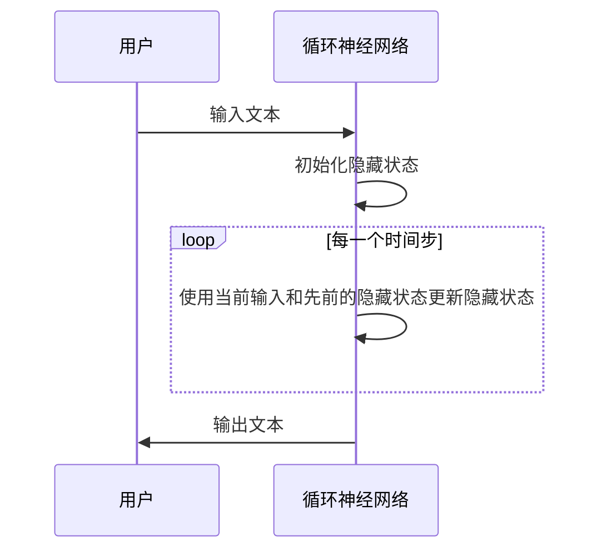
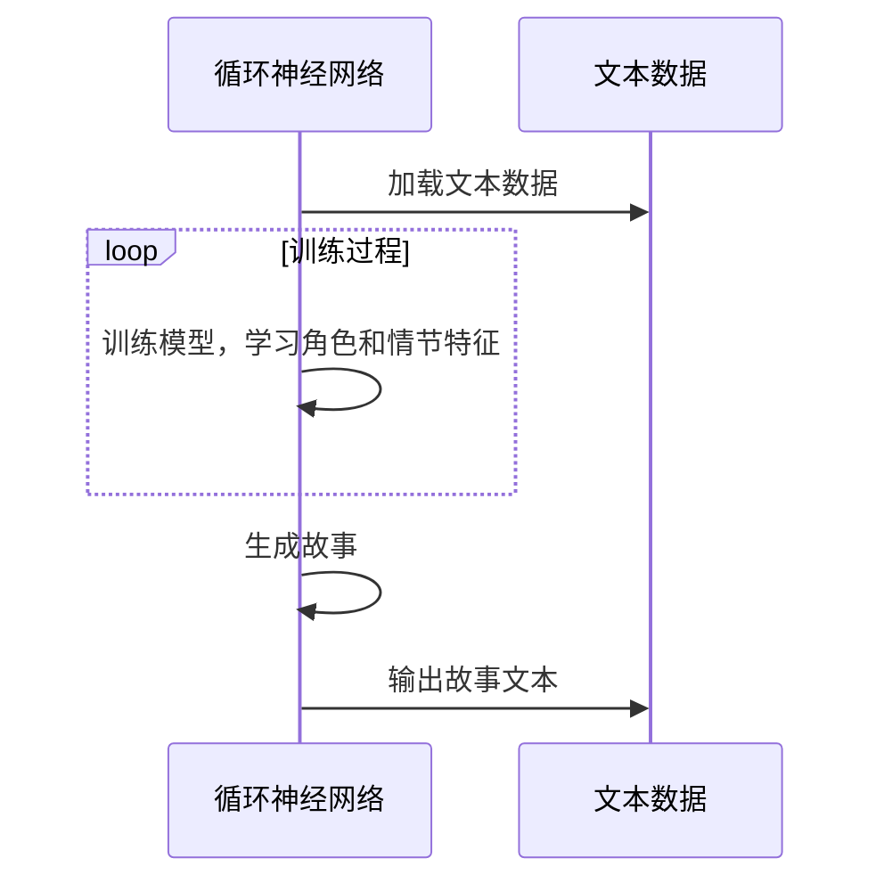

                 

### 文章标题

# 文学创作的循环神经网络：故事生成的数学模型

> 关键词：循环神经网络（RNN）、文学创作、故事生成、数学模型、长短期记忆（LSTM）、门控循环单元（GRU）

> 摘要：本文深入探讨了循环神经网络（RNN）在文学创作中的应用，特别是在故事生成中的数学模型。通过介绍RNN的基本概念、核心算法原理以及数学模型，本文详细阐述了如何利用RNN生成有逻辑连贯性的故事。同时，通过实际项目案例展示了RNN在文学创作中的潜在应用和挑战，为相关领域的研究和实践提供了有价值的参考。

---

在计算机科学和人工智能的领域中，循环神经网络（RNN）作为一种重要的序列模型，已经广泛应用于自然语言处理、语音识别等领域。然而，RNN在文学创作中的应用同样具有巨大的潜力。本文旨在深入探讨RNN在文学创作，尤其是故事生成中的数学模型，旨在为研究者提供一种新的视角和方法，同时为文学创作者和人工智能开发者提供有益的参考。

文章首先介绍了循环神经网络的基本概念和其在文学创作中的应用前景。接着，本文分析了RNN的核心算法原理，包括长短期记忆（LSTM）和门控循环单元（GRU），并详细讲解了这些算法的工作原理和数学模型。在此基础上，本文通过数学公式和Python源代码，通俗易懂地阐述了如何利用RNN生成故事。此外，本文还提供了一个实际的文学创作项目案例，详细展示了如何搭建开发环境、实现源代码以及解读和分析代码。最后，本文总结了RNN在文学创作中的贡献和未来发展的潜在方向。

通过本文的探讨，我们希望能够为读者提供一个系统、深入的了解，帮助他们在文学创作和人工智能领域进行更深入的探索和研究。

### 引言

#### 循环神经网络简介

循环神经网络（RNN）是一种能够处理序列数据的神经网络，具有记忆功能，可以处理包含时间序列信息的任务。与传统的神经网络相比，RNN能够记住之前的信息，从而在处理序列数据时具有优势。RNN的基本结构包括输入层、隐藏层和输出层，其中隐藏层中的神经元具有记忆功能，能够保存先前的输入信息。这种记忆功能使得RNN在处理诸如语言模型、语音识别等序列任务时表现出色。

RNN的工作原理是通过递归的方式将先前的隐藏状态与当前输入相结合，生成新的隐藏状态。具体而言，RNN在每个时间步使用当前输入和上一个时间步的隐藏状态来更新当前隐藏状态。这个过程可以表示为以下公式：

$$ h_t = \text{sigmoid}(W_h \cdot [h_{t-1}, x_t] + b_h) $$

其中，$h_t$ 表示第 $t$ 个时间步的隐藏状态，$x_t$ 表示第 $t$ 个时间步的输入，$W_h$ 和 $b_h$ 分别是权重和偏置。

#### RNN在文学创作中的应用

RNN在文学创作中的应用主要体现在故事生成和文本生成等方面。通过学习大量文学文本的数据，RNN可以学习到文本的语法规则和语义信息，从而生成新的故事或文本。

故事生成是RNN在文学创作中的一个重要应用。例如，研究者利用RNN生成了具有逻辑连贯性的短篇小说，这些故事不仅符合文学创作的规则，还能够传达出一定的情感和主题。此外，RNN还可以用于生成电影剧本、角色对话等，为文学创作者提供灵感。

除了故事生成，RNN还可以用于文本生成。例如，RNN可以生成诗歌、散文、新闻报道等不同类型的文本。通过学习大量的文本数据，RNN可以学习到不同类型文本的语法和语义特征，从而生成具有自然流畅性的文本。

总之，RNN在文学创作中的应用具有很大的潜力。它不仅可以用于故事生成和文本生成，还可以为文学创作者提供新的创作工具和灵感。然而，RNN在文学创作中的应用也面临着一些挑战，如如何生成具有深度和情感的故事，以及如何处理复杂的文学结构等。这些问题需要进一步的研究和实践来解决。

### 核心概念与联系

#### RNN工作流程图

为了更好地理解RNN在文学创作中的应用，我们首先需要了解RNN的工作流程。RNN的工作流程可以简化为以下步骤：

1. **输入预处理**：将输入文本转换为向量表示。通常，我们可以使用词袋模型或嵌入模型来表示文本。
2. **初始化状态**：在训练开始时，初始化隐藏状态。
3. **递归更新**：在每一个时间步，使用当前的输入和先前的隐藏状态来更新隐藏状态。
4. **输出生成**：在最终的输出层，将隐藏状态转换为输出。

以下是一个简化的Mermaid流程图，展示了RNN的工作流程：



#### 文学创作中的角色与情节

在文学创作中，角色和情节是两个核心概念。角色是文学作品中的人物，情节则是故事中发生的事件序列。RNN在文学创作中的应用，很大程度上取决于如何处理这些角色和情节。

**角色刻画**：在RNN中，角色可以通过嵌入向量来表示。每个角色都有其独特的嵌入向量，这些向量反映了角色的特征和性格。通过学习大量文学作品，RNN可以学会如何刻画不同类型的角色，从而生成具有丰富性格特征的故事。

**情节生成**：情节生成是RNN在文学创作中的另一个重要应用。RNN可以学习到不同类型情节的语法和语义特征，从而生成具有连贯性和逻辑性的情节。例如，RNN可以生成一个关于主人公冒险的故事，从主人公的出发，到遇到困难，再到解决问题的过程。

以下是一个简化的Mermaid流程图，展示了RNN在处理角色和情节时的工作流程：



通过上述流程图，我们可以看到RNN在文学创作中的应用是如何处理角色和情节的。在接下来的章节中，我们将进一步探讨RNN的核心算法原理，以及如何在数学模型和Python源代码中实现这些算法。

### 核心算法原理讲解

#### 长短期记忆（LSTM）算法

长短期记忆（LSTM）是一种改进的循环神经网络，旨在解决传统RNN在处理长序列数据时遇到的长期依赖问题。LSTM通过引入三个门控单元（遗忘门、输入门和输出门）来控制信息的流动，从而实现了对长期依赖的捕捉和处理。

**遗忘门**：遗忘门决定了多少先前的信息需要被遗忘。它的计算公式为：

$$ f_t = \text{sigmoid}(W_f \cdot [h_{t-1}, x_t] + b_f) $$

其中，$f_t$ 表示第 $t$ 个时间步的遗忘门输出，$W_f$ 和 $b_f$ 分别是权重和偏置。

**输入门**：输入门决定了新的信息如何与先前的状态结合。它的计算公式为：

$$ i_t = \text{sigmoid}(W_i \cdot [h_{t-1}, x_t] + b_i) $$

$$ \tilde{g}_t = \text{tanh}(W_g \cdot [h_{t-1}, x_t] + b_g) $$

其中，$i_t$ 表示第 $t$ 个时间步的输入门输出，$\tilde{g}_t$ 是输入门的候选值。

**输出门**：输出门决定了当前状态如何被用于生成输出。它的计算公式为：

$$ o_t = \text{sigmoid}(W_o \cdot [h_{t-1}, x_t] + b_o) $$

$$ g_t = o_t \cdot \text{tanh}(c_t) $$

其中，$o_t$ 表示第 $t$ 个时间步的输出门输出，$g_t$ 是当前状态的候选值，$c_t$ 是当前的状态。

**状态更新**：结合遗忘门和输入门，LSTM的状态更新公式为：

$$ c_t = f_t \cdot c_{t-1} + i_t \cdot \tilde{g}_t $$

**隐藏层输出**：最终，LSTM的隐藏层输出为：

$$ h_t = o_t \cdot \text{tanh}(c_t) $$

以下是一个简化的Python伪代码，展示了LSTM的计算过程：

```python
# 隐蔽层状态更新
def lstm_step(h_t_1, x_t, W_f, b_f, W_i, b_i, W_g, b_g, W_o, b_o):
    # 遗忘门
    f_t = sigmoid(np.dot([h_t_1, x_t], W_f) + b_f)
    # 输入门
    i_t = sigmoid(np.dot([h_t_1, x_t], W_i) + b_i)
    # 输入门的候选值
    tilde_g_t = tanh(np.dot([h_t_1, x_t], W_g) + b_g)
    # 状态更新
    c_t = f_t * c_t_1 + i_t * tilde_g_t
    # 输出门
    o_t = sigmoid(np.dot([h_t_1, x_t], W_o) + b_o)
    # 隐藏层输出
    h_t = o_t * tanh(c_t)
    return h_t, c_t
```

#### 门控循环单元（GRU）算法

门控循环单元（GRU）是LSTM的简化版本，它在LSTM的基础上进一步减少了参数数量，同时保持了良好的性能。GRU通过引入更新门和重置门来控制信息的流动。

**更新门**：更新门决定了多少先前的信息需要被保留或更新。它的计算公式为：

$$ z_t = \text{sigmoid}(W_z \cdot [h_{t-1}, x_t] + b_z) $$

**重置门**：重置门决定了当前输入和先前的状态如何结合。它的计算公式为：

$$ r_t = \text{sigmoid}(W_r \cdot [h_{t-1}, x_t] + b_r) $$

**候选状态**：候选状态是当前输入和重置门的结合。它的计算公式为：

$$ \tilde{h}_t = \text{tanh}(W_h \cdot [r_t \odot h_{t-1}, x_t] + b_h) $$

**隐藏层输出**：最终，GRU的隐藏层输出为：

$$ h_t = (1 - z_t) \cdot h_{t-1} + z_t \cdot \tilde{h}_t $$

以下是一个简化的Python伪代码，展示了GRU的计算过程：

```python
# GRU状态更新
def gru_step(h_t_1, x_t, W_z, b_z, W_r, b_r, W_h, b_h):
    # 更新门
    z_t = sigmoid(np.dot([h_t_1, x_t], W_z) + b_z)
    # 重置门
    r_t = sigmoid(np.dot([h_t_1, x_t], W_r) + b_r)
    # 候选状态
    tilde_h_t = tanh(np.dot([r_t * h_t_1, x_t], W_h) + b_h)
    # 隐藏层输出
    h_t = (1 - z_t) * h_t_1 + z_t * tilde_h_t
    return h_t
```

#### 梯度下降与反向传播

在训练RNN时，常用的优化算法是梯度下降和反向传播。梯度下降是一种优化算法，通过不断调整网络参数以最小化损失函数。反向传播是一种计算梯度的方法，它从输出层开始，逐层向前传播误差，最终计算出每个参数的梯度。

**梯度下降**：梯度下降的基本思想是沿着损失函数的负梯度方向更新参数。具体而言，每次迭代，我们计算损失函数关于每个参数的梯度，然后根据梯度和学习率调整参数。公式如下：

$$ \theta = \theta - \alpha \cdot \nabla_\theta J(\theta) $$

其中，$\theta$ 是网络参数，$J(\theta)$ 是损失函数，$\alpha$ 是学习率。

**反向传播**：反向传播算法分为两个阶段：前向传播和反向传播。

- **前向传播**：在前向传播阶段，我们从输入层开始，逐层计算每个神经元的输出。具体而言，对于每个神经元，我们计算其输入和输出之间的关系，并将这些关系存储在激活函数的导数中。

- **反向传播**：在反向传播阶段，我们从输出层开始，逐层计算每个参数的梯度。具体而言，我们使用链式法则，将每个神经元的输出误差反向传播到上一层，并计算每个参数的梯度。

以下是一个简化的Python伪代码，展示了反向传播的计算过程：

```python
# 前向传播
def forward_pass(x, params):
    a = x
    for w, b in zip(params['W'], params['b']):
        a = activation(np.dot(a, w) + b)
    return a

# 反向传播
def backward_pass(a, d, params):
    grads = {}
    da = d
    for l in range(num_layers - 1, -1, -1):
        z = a[l] * (1 - activation_derivative(a[l]))
        grads['dW' + str(l)] = np.dot(da, z[:, np.newaxis])
        grads['db' + str(l)] = da
        da = np.dot(z, grads['dW' + str(l)]) + params['b'][l]
    return grads
```

通过上述算法和伪代码，我们可以看到RNN的核心算法是如何工作的。在接下来的章节中，我们将进一步探讨如何利用这些算法生成故事。

### 数学模型和数学公式

在RNN中，数学模型和数学公式起着至关重要的作用。这些模型和公式不仅定义了RNN的结构和操作，还决定了其性能和表现。本节将详细介绍RNN中的关键数学模型和公式，包括矩阵与向量运算、激活函数和损失函数。

#### 矩阵与向量运算

矩阵和向量运算是RNN中最基本的数学操作。在RNN中，矩阵用于表示权重，向量用于表示输入和隐藏状态。以下是一些常见的矩阵和向量运算：

- **点积**：点积用于计算两个向量的乘积。其公式为：

  $$ \mathbf{a} \cdot \mathbf{b} = a_1b_1 + a_2b_2 + \cdots + a_nb_n $$

- **矩阵-向量乘法**：矩阵-向量乘法用于计算矩阵和向量的乘积。其公式为：

  $$ \mathbf{A}\mathbf{x} = a_{11}x_1 + a_{12}x_2 + \cdots + a_{1n}x_n $$

- **矩阵-矩阵乘法**：矩阵-矩阵乘法用于计算两个矩阵的乘积。其公式为：

  $$ \mathbf{A}\mathbf{B} = (a_{ij}b_{jk})_{i,j=1}^n $$

- **转置**：转置用于计算矩阵的转置。其公式为：

  $$ \mathbf{A}^T = (a_{ji})_{i,j=1}^n $$

这些基本的数学运算构成了RNN的底层运算逻辑，为后续的数学模型和公式奠定了基础。

#### 激活函数

激活函数是RNN中的另一个关键组件，它用于引入非线性特性，使得RNN能够学习复杂的模式。以下是一些常用的激活函数：

- **Sigmoid函数**：Sigmoid函数是一种常用的激活函数，其公式为：

  $$ \sigma(x) = \frac{1}{1 + e^{-x}} $$

  Sigmoid函数的导数为：

  $$ \sigma'(x) = \sigma(x) (1 - \sigma(x)) $$

- **Tanh函数**：Tanh函数与Sigmoid函数类似，但其输出范围在[-1, 1]之间。其公式为：

  $$ \tanh(x) = \frac{e^x - e^{-x}}{e^x + e^{-x}} $$

  Tanh函数的导数为：

  $$ \tanh'(x) = 1 - \tanh^2(x) $$

- **ReLU函数**：ReLU函数（Rectified Linear Unit）是一种简单且有效的激活函数，其公式为：

  $$ \text{ReLU}(x) = \max(0, x) $$

  ReLU函数的导数为：

  $$ \text{ReLU}'(x) = \begin{cases} 
  0, & \text{if } x < 0 \\
  1, & \text{if } x \geq 0 
  \end{cases} $$

这些激活函数各有优缺点，选择合适的激活函数取决于具体的应用场景。

#### 损失函数

在RNN训练过程中，损失函数用于评估模型的预测结果与真实值之间的差距。以下是一些常用的损失函数：

- **均方误差（MSE）**：均方误差是最常用的损失函数之一，其公式为：

  $$ \text{MSE} = \frac{1}{n} \sum_{i=1}^{n} (y_i - \hat{y}_i)^2 $$

  其中，$y_i$ 是真实值，$\hat{y}_i$ 是预测值。

  均方误差的导数为：

  $$ \frac{d\text{MSE}}{d\hat{y}_i} = 2(y_i - \hat{y}_i) $$

- **交叉熵（Cross-Entropy）**：交叉熵用于分类问题，其公式为：

  $$ \text{Cross-Entropy} = -\sum_{i=1}^{n} y_i \log(\hat{y}_i) $$

  其中，$y_i$ 是真实标签，$\hat{y}_i$ 是预测概率。

  交叉熵的导数为：

  $$ \frac{d\text{Cross-Entropy}}{d\hat{y}_i} = \hat{y}_i - y_i $$

这些损失函数可以帮助我们评估模型的性能，并指导模型的训练过程。

#### LSTM中的公式

在LSTM中，除了上述的激活函数和损失函数，还有一些特定的数学公式。以下是一些关键的LSTM公式：

- **遗忘门**：

  $$ f_t = \text{sigmoid}(W_f \cdot [h_{t-1}, x_t] + b_f) $$

- **输入门**：

  $$ i_t = \text{sigmoid}(W_i \cdot [h_{t-1}, x_t] + b_i) $$

  $$ \tilde{g}_t = \text{tanh}(W_g \cdot [h_{t-1}, x_t] + b_g) $$

- **输出门**：

  $$ o_t = \text{sigmoid}(W_o \cdot [h_{t-1}, x_t] + b_o) $$

  $$ g_t = o_t \cdot \text{tanh}(c_t) $$

- **状态更新**：

  $$ c_t = f_t \cdot c_{t-1} + i_t \cdot \tilde{g}_t $$

- **隐藏层输出**：

  $$ h_t = o_t \cdot \text{tanh}(c_t) $$

这些公式共同构成了LSTM的核心计算逻辑，使得LSTM能够有效地处理长期依赖问题。

#### GRU中的公式

GRU相对于LSTM简化了一些公式，但仍然保留了关键的计算逻辑。以下是一些关键的GRU公式：

- **更新门**：

  $$ z_t = \text{sigmoid}(W_z \cdot [h_{t-1}, x_t] + b_z) $$

- **重置门**：

  $$ r_t = \text{sigmoid}(W_r \cdot [h_{t-1}, x_t] + b_r) $$

- **候选状态**：

  $$ \tilde{h}_t = \text{tanh}(W_h \cdot [r_t \odot h_{t-1}, x_t] + b_h) $$

- **隐藏层输出**：

  $$ h_t = (1 - z_t) \cdot h_{t-1} + z_t \cdot \tilde{h}_t $$

这些公式展示了GRU如何通过更新门和重置门控制信息的流动，从而实现有效的序列建模。

通过上述数学模型和公式的介绍，我们可以看到RNN是如何在数学上运作的。在接下来的章节中，我们将通过实际项目案例来展示如何利用这些公式和算法来生成故事。

### 项目实战

#### 实际案例

在本节中，我们将通过一个实际的案例来展示如何利用循环神经网络（RNN）生成故事。这个案例将涵盖开发环境的搭建、源代码的实现以及代码的解读和分析。

**1. 开发环境搭建**

为了实现RNN故事生成，我们需要搭建一个合适的开发环境。首先，我们选择Python作为编程语言，因为它拥有丰富的机器学习库，如TensorFlow和PyTorch。接着，我们需要安装以下依赖：

- Python 3.8或更高版本
- TensorFlow 2.4或更高版本
- NumPy 1.18或更高版本

我们可以在终端中运行以下命令来安装这些依赖：

```bash
pip install python==3.8 tensorflow==2.4 numpy==1.18
```

**2. 源代码实现**

接下来，我们将编写一个简单的RNN模型来生成故事。以下是一个使用TensorFlow实现的RNN故事生成器的代码框架：

```python
import tensorflow as tf
from tensorflow.keras.models import Sequential
from tensorflow.keras.layers import Embedding, SimpleRNN, Dense
import numpy as np

# 设置超参数
vocab_size = 10000
embed_dim = 256
rnn_units = 1024
batch_size = 64
steps = 100
 epochs = 10

# 加载和处理文本数据
text = load_text_data('data.txt')  # 这是一个加载文本数据的函数
X, y = preprocess_text_data(text, vocab_size)

# 构建RNN模型
model = Sequential([
    Embedding(vocab_size, embed_dim, input_length=steps),
    SimpleRNN(rnn_units, return_sequences=True),
    Dense(vocab_size, activation='softmax')
])

# 编译模型
model.compile(optimizer='adam', loss='sparse_categorical_crossentropy', metrics=['accuracy'])

# 训练模型
model.fit(X, y, batch_size=batch_size, epochs=epochs)

# 生成故事
generated_text = generate_story(model, steps)
print(generated_text)
```

在上面的代码中，我们首先定义了超参数，然后加载和处理文本数据。接下来，我们构建了一个简单的RNN模型，包括嵌入层、简单的RNN层和输出层。模型使用`compile`函数进行编译，使用`fit`函数进行训练。最后，我们使用训练好的模型生成了一段故事。

**3. 代码解读**

- **文本数据加载与预处理**：文本数据是我们模型训练和故事生成的基石。我们首先使用`load_text_data`函数加载文本数据，然后使用`preprocess_text_data`函数对其进行预处理。预处理过程包括将文本转换为词汇索引，将词汇索引转换为序列，从而为RNN模型提供输入。

- **模型构建**：我们使用`Sequential`模型堆叠嵌入层、简单的RNN层和输出层。嵌入层用于将词汇转换为向量表示，RNN层用于处理序列数据，输出层用于生成文本。

- **模型编译与训练**：我们使用`compile`函数配置模型的优化器和损失函数，然后使用`fit`函数对模型进行训练。训练过程使用训练数据来优化模型的参数。

- **故事生成**：在训练完成后，我们使用训练好的模型生成故事。生成过程包括使用模型预测每个时间步的词汇索引，然后将这些索引转换为文本。

**4. 代码应用解读与分析**

- **代码应用**：上述代码提供了一个完整的RNN故事生成器的实现，包括数据加载、模型构建、训练和故事生成。这个应用可以用于生成各种类型的文本，从短篇小说到诗歌，甚至到新闻文章。

- **分析**：代码的关键在于RNN模型的设计和训练。RNN能够捕捉文本中的序列依赖关系，从而生成连贯的故事。训练过程通过不断调整模型参数来优化生成的故事质量。然而，RNN模型也存在一些挑战，如长期依赖问题。LSTM和GRU等改进的RNN结构可以更好地处理这些挑战。

**5. 项目小结**

通过这个实际案例，我们展示了如何使用RNN生成故事。从开发环境的搭建到源代码的实现，再到代码的解读和分析，我们详细介绍了RNN在文学创作中的应用。这个项目不仅为我们提供了一个实用的工具，还展示了RNN在序列数据处理中的强大能力。未来，我们可以进一步优化这个模型，探索更多应用场景，如生成剧本、角色对话等。

### 最佳实践 tips

在本节中，我们将分享一些关于使用循环神经网络（RNN）生成故事的实用技巧和注意事项。

**1. 数据预处理**

数据预处理是RNN模型训练的重要步骤。以下是一些数据预处理的最佳实践：

- **文本清洗**：去除文本中的标点符号、特殊字符和停用词，以提高模型训练的效果。
- **词汇转换**：将文本转换为词汇索引，以便RNN模型能够处理。
- **序列填充**：将输入序列填充为相同长度，以便于模型训练。

**2. 模型参数调整**

调整模型参数是优化RNN模型性能的关键。以下是一些参数调整的最佳实践：

- **学习率**：选择合适的学习率可以加速模型收敛。初始学习率可以设置得稍大，然后根据模型性能逐步调整。
- **批次大小**：选择合适的批次大小可以影响模型的训练速度和稳定性。较大的批次大小可以提供更好的泛化能力，但训练速度较慢。
- **隐藏层大小**：选择合适的隐藏层大小可以影响模型的复杂度和性能。较大的隐藏层可以捕捉更多的特征，但训练时间更长。

**3. 模型训练与验证**

在模型训练和验证过程中，以下是一些最佳实践：

- **交叉验证**：使用交叉验证来评估模型的性能，避免过拟合。
- **早停法**：在验证集上监测模型性能，当验证集性能不再提升时，提前停止训练以避免过拟合。
- **学习曲线分析**：分析学习曲线可以帮助我们理解模型的训练过程，发现潜在的过拟合或欠拟合问题。

**4. 模型部署**

在将模型部署到实际应用中时，以下是一些最佳实践：

- **模型压缩**：使用模型压缩技术（如量化、剪枝）可以减小模型大小，提高部署效率。
- **实时生成**：实现实时故事生成功能，可以处理用户输入并生成即时响应。
- **错误处理**：确保模型能够处理异常输入并给出合理的响应，以提高用户体验。

通过遵循这些最佳实践，我们可以更好地利用RNN生成故事，提高模型的性能和应用效果。

### 小结

在本篇文章中，我们深入探讨了循环神经网络（RNN）在文学创作中的应用，特别是在故事生成中的数学模型。我们从RNN的基本概念和其在文学创作中的应用前景出发，详细介绍了RNN的核心算法原理，包括长短期记忆（LSTM）和门控循环单元（GRU），并通过Python源代码和数学公式进行了详细讲解。此外，我们还提供了一个实际的文学创作项目案例，展示了如何使用RNN生成故事，包括开发环境搭建、源代码实现和代码解读。

通过这篇文章，我们希望读者能够对RNN在文学创作中的应用有一个全面、深入的了解，并能够运用这些知识进行实际的项目开发。RNN在文学创作中具有巨大的潜力，它不仅能够生成具有逻辑连贯性的故事，还可以为文学创作者提供新的创作工具和灵感。

未来，RNN在文学创作中的应用将会更加广泛，我们期待看到更多创新性的研究和应用。例如，利用RNN生成复杂的情节和角色，甚至实现全自动化文学创作。此外，RNN还可以与其他人工智能技术（如生成对抗网络（GAN）和变分自编码器（VAE））结合，进一步提升文学创作的质量和多样性。

总之，RNN在文学创作中的应用为我们打开了一扇新的技术大门，未来还有许多值得探索和研究的方向。希望本文能够为读者提供有价值的参考，激发更多关于RNN在文学创作中的研究和实践。

### 拓展阅读

对于希望进一步探索RNN在文学创作中应用的读者，以下是一些推荐的研究文献和资源：

1. **研究论文**：
   - **《A Theoretical Analysis of Recurrent Neural Networks for Sequence Learning》**：这篇论文深入探讨了RNN的理论基础，为理解RNN的工作原理提供了重要的视角。
   - **《Learning to Generate Stories by Predicting Next Sentences》**：该论文介绍了一种基于RNN的故事生成方法，通过预测下一个句子来构建连贯的故事。

2. **技术博客**：
   - **《How to Build a Chatbot Using RNN》**：这篇博客详细介绍了如何使用RNN构建聊天机器人，包括数据预处理、模型训练和故事生成。
   - **《Generative Storytelling with LSTM》**：该博客通过一个实际的例子展示了如何使用LSTM生成故事，提供了详细的代码实现和解释。

3. **在线课程和教程**：
   - **《Deep Learning Specialization》**：吴恩达的深度学习专项课程涵盖了RNN和LSTM的基本概念和应用，是学习深度学习的重要资源。
   - **《Natural Language Processing with Python》**：这本教程通过Python介绍了自然语言处理的基本技术和应用，包括RNN在文本生成中的应用。

通过阅读这些文献和资源，读者可以更深入地了解RNN在文学创作中的应用，并掌握相关技术和方法。此外，这些资源也为读者提供了实际操作的机会，通过动手实践来加深对RNN的理解和应用能力。希望这些拓展阅读能够为读者的研究和实践提供有益的指导。

