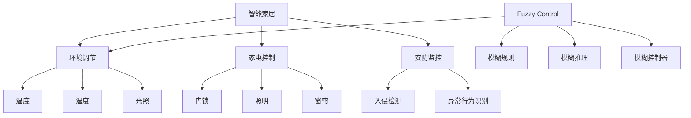
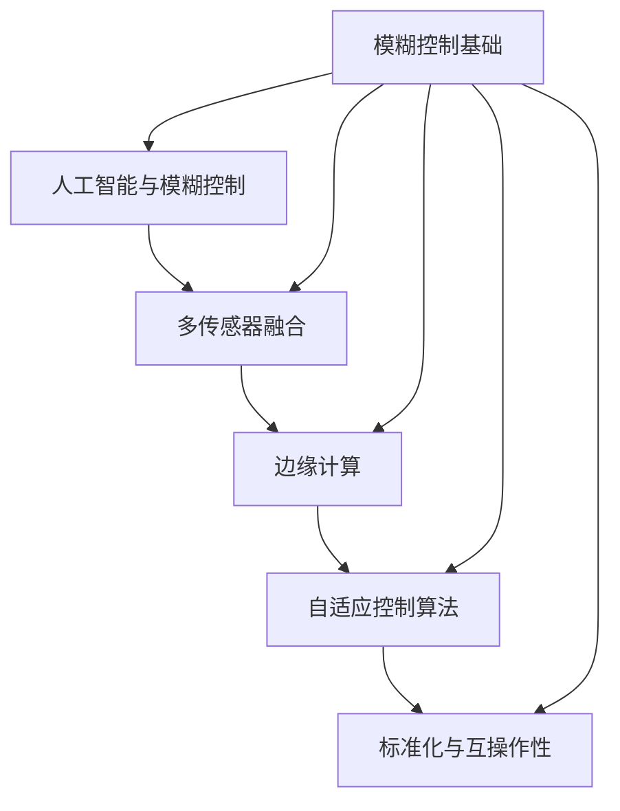

                 

### 引言

随着科技的飞速发展，智能家居已经成为现代生活不可或缺的一部分。智能家居通过将物联网（IoT）技术与日常家电设备相融合，使家庭生活更加便捷、舒适和安全。而在这其中，模糊控制技术以其独特的方式，为我们的生活环境调节提供了强大的支持。

模糊控制技术起源于20世纪60年代，最初是为了解决传统控制理论难以处理的非线性、时变和不确定性问题。它通过模糊逻辑来模拟人类的思维过程，将复杂的问题转化为简单的控制规则，使得智能系统能够在不确定和模糊的环境中做出准确的决策。

本书旨在深入探讨智能家居中的模糊控制技术，通过系统的理论分析和实际案例研究，展示模糊控制在生活环境中调节的应用价值。具体而言，本书将涵盖以下内容：

1. **智能家居与模糊控制概述**：介绍智能家居的基本概念、发展历程及模糊控制技术的基本原理和应用场景。
2. **模糊控制技术基础**：讲解模糊集合、模糊逻辑、模糊规则和模糊控制器等核心概念，并使用Python源代码进行详细阐述。
3. **生活环境的数学调节**：探讨如何将模糊控制技术应用于空气质量、光照和温度等生活环境的调节中。
4. **智能家居案例研究**：通过具体案例，展示模糊控制在智能家居中的实际应用。
5. **实际应用与展望**：分析模糊控制在智能家居中的挑战和未来发展趋势。
6. **结论**：总结本书的主要内容，并对智能家居模糊控制技术的未来进行展望。

通过本书的阅读，读者可以全面了解智能家居中的模糊控制技术，掌握其核心概念和应用方法，为今后的研究和实践提供有力支持。

---

关键词：智能家居、模糊控制、生活环境、数学调节、Python源代码

摘要：本书深入探讨了智能家居中的模糊控制技术，从理论基础到实际应用，系统地介绍了模糊控制技术在生活环境中调节的应用。通过具体的案例研究，展示了模糊控制在智能家居中的实际效果和未来前景，为读者提供了丰富的理论资源和实践经验。

---

### 智能家居与模糊控制概述

#### 智能家居的基本概念

智能家居（Smart Home）指的是通过物联网技术将家庭中的各种设备和系统连接起来，实现远程监控和控制，从而提高家庭生活的舒适度、安全性和效率。智能家居的核心是网络连接和智能控制，通过智能手机、平板电脑等终端设备，用户可以随时随地管理家中的各种设备，如灯光、空调、音响、安防系统等。

#### 智能家居的发展历程

智能家居的发展可以分为以下几个阶段：

1. **单品智能阶段**：在这个阶段，各种家电设备如空调、冰箱、洗衣机等逐渐实现智能化，具备基本的联网功能。
2. **系统互联阶段**：通过物联网技术，不同品牌和类型的智能设备开始相互连接，形成一个统一的智能家庭系统。
3. **平台集成阶段**：随着智能家居平台的兴起，多个智能设备通过统一平台进行集成和管理，用户可以更加方便地控制家庭中的各种设备。
4. **人工智能阶段**：人工智能技术的引入，使得智能家居系统能够自主学习用户的习惯，提供更加个性化的服务。

#### 模糊控制技术的基本原理

模糊控制技术（Fuzzy Control）是一种基于模糊集合理论的控制方法，它通过模拟人类思维过程，处理系统中的不确定性、非线性问题。模糊控制技术的基本原理包括以下几个部分：

1. **模糊集合**：模糊集合是传统经典集合的拓展，用于描述具有模糊性或不确定性的对象。它通过引入隶属度函数，表示元素属于集合的程度。
2. **模糊规则**：模糊规则用于描述系统中的因果关系，通常由条件部分和结论部分组成。例如，“如果天气很热，则开启空调”。
3. **模糊推理**：通过模糊规则对输入变量进行处理，生成输出变量。模糊推理分为模糊化、模糊推理和去模糊化三个步骤。
4. **模糊控制器**：模糊控制器是实现模糊控制的核心部件，它根据输入信号和模糊规则，输出控制信号以调节系统状态。

#### 模糊控制在智能家居中的应用

模糊控制技术在智能家居中有广泛的应用，主要表现在以下几个方面：

1. **环境调节**：如温度、湿度、光照等环境参数的自动调节。例如，在气温较高时，模糊控制器可以自动调节空调温度，以达到舒适的室内温度。
2. **家电控制**：如智能门锁、智能照明、智能窗帘等。通过模糊控制，用户可以远程控制家中的各种设备，提高生活的便利性。
3. **安防监控**：如入侵检测、异常行为识别等。模糊控制技术可以帮助智能监控系统更加准确地检测和识别异常行为，提高家庭的安全性。

#### Mermaid流程图：智能家居与模糊控制的关系



通过以上流程图，我们可以清晰地看到智能家居与模糊控制技术之间的紧密联系。模糊控制技术为智能家居提供了强大的智能调节功能，使得家居生活更加便捷、舒适和安全。

---

在本章中，我们对智能家居和模糊控制技术进行了概述，阐述了智能家居的基本概念、发展历程以及模糊控制技术的基本原理和应用。在下一章中，我们将深入探讨模糊控制技术的基础概念，包括模糊集合、模糊规则和模糊控制器等，通过具体的Python源代码进行详细讲解，帮助读者更好地理解这一复杂但极其有用的技术。

---

### 模糊控制技术基础

#### 模糊集合

模糊集合是模糊控制技术的核心概念之一，它是对传统经典集合的一种扩展。在经典集合中，元素要么属于某个集合，要么不属于某个集合，而模糊集合则引入了隶属度函数的概念，用以描述元素属于集合的程度。

**定义**：模糊集合是经典集合的拓展，它在传统集合的基础上引入了隶属度函数，表示元素属于集合的程度。隶属度函数的取值范围通常在0到1之间。

**数学表示**：设论域为U，则模糊集合A在论域U上的隶属度函数表示为：
\[ A(x) = \mu_A(x) \]
其中，\( \mu_A \) 表示隶属度函数，x表示论域中的元素。

**例子**：假设有一个论域U = {小，中，大}，表示水果的大小。定义一个模糊集合“大水果”，其隶属度函数如下：

| 水果大小 | 隶属度函数值 |
| :----: | :--------: |
| 小 | 0 |
| 中 | 0.2 |
| 大 | 1 |

从上表可以看出，大小为“中”的水果属于“大水果”的程度为0.2，而大小为“大”的水果则完全属于“大水果”。

#### 模糊规则与模糊推理

模糊规则是模糊控制中的另一核心概念，它用于描述系统中的因果关系。模糊规则通常由条件部分和结论部分组成，条件部分可以是多个模糊集合的交集，结论部分则是一个模糊集合。

**定义**：模糊规则是一种表示模糊逻辑的方法，它通过条件部分和结论部分来描述系统中的因果关系。模糊规则的形式通常为“如果条件部分，则结论部分”。

**数学表示**：设模糊集合为 \( A_1, A_2, ..., A_n \)，结论模糊集合为 \( B \)，则模糊规则可以表示为：
\[ \text{如果} A_1 \land A_2 \land ... \land A_n, \text{则} B \]

**例子**：假设有一个空调控制系统的模糊规则如下：

1. 如果室内温度高于30度，且湿度大于70%，则开启空调制冷。
2. 如果室内温度低于20度，则开启空调加热。

这些模糊规则可以用以下数学形式表示：

\[ 
\text{如果} (\mu_{T_i}(x) > 30 \land \mu_{H_i}(x) > 70\%), \text{则} \mu_{AC}(x) = 1 \\
\text{如果} (\mu_{T_i}(x) < 20 \land \mu_{H_i}(x) \leq 70\%), \text{则} \mu_{AC}(x) = 0 
\]

其中，\( \mu_{T_i}(x) \) 和 \( \mu_{H_i}(x) \) 分别表示室内温度和湿度的隶属度函数，\( \mu_{AC}(x) \) 表示空调开启的隶属度函数。

**模糊推理**：模糊推理是通过模糊规则对输入变量进行处理，生成输出变量。它包括三个主要步骤：模糊化、模糊推理和去模糊化。

1. **模糊化**：将输入变量（如室内温度和湿度）通过隶属度函数转换为模糊集合。
2. **模糊推理**：根据模糊规则，对模糊化后的输入变量进行处理，生成模糊输出集合。
3. **去模糊化**：将模糊输出集合去模糊化为具体的输出变量（如空调开启与否）。

#### 模糊控制器

模糊控制器是实现模糊控制的核心部件，它根据输入信号和模糊规则，输出控制信号以调节系统状态。模糊控制器通常由输入接口、规则库、推理引擎和输出接口组成。

**组成**：
1. **输入接口**：接收系统的输入变量，如温度、湿度等。
2. **规则库**：存储模糊规则，用于描述系统中的因果关系。
3. **推理引擎**：根据输入变量和模糊规则，进行模糊推理，生成模糊输出集合。
4. **输出接口**：将模糊输出集合转换为具体的控制信号，如空调的开关状态。

**工作原理**：模糊控制器的工作原理可以概括为以下几个步骤：
1. **输入变量模糊化**：将输入变量（如温度和湿度）通过隶属度函数转换为模糊集合。
2. **模糊推理**：根据模糊规则库，对模糊化后的输入变量进行处理，生成模糊输出集合。
3. **去模糊化**：将模糊输出集合去模糊化为具体的控制信号（如空调的开关状态）。

**Python实现**：以下是一个简单的模糊控制器实现示例，用于控制空调的开启与关闭。

```python
import numpy as np
from skfuzzy import control as ctrl

# 定义输入变量
temp_ctrl = ctrl.Antecedent(np.arange(0, 50, 1), '室内温度')
humidity_ctrl = ctrl.Antecedent(np.arange(0, 100, 1), '室内湿度')

# 定义输出变量
ac_ctrl = ctrl.Consequent(np.arange(0, 2, 1), '空调控制信号')

# 定义隶属度函数
temp_ctrl['高温'] = np.linspace(35, 50, 100)
temp_ctrl['低温'] = np.linspace(0, 25, 100)
humidity_ctrl['高湿度'] = np.linspace(70, 100, 100)
humidity_ctrl['低湿度'] = np.linspace(0, 60, 100)
ac_ctrl['开'] = np.linspace(1, 1.5, 100)
ac_ctrl['关'] = np.linspace(0, 0.5, 100)

# 定义模糊规则
rule1 = ctrl.Rule(temp_ctrl['高温'] & humidity_ctrl['高湿度'], ac_ctrl['开'])
rule2 = ctrl.Rule(temp_ctrl['低温'] & humidity_ctrl['低湿度'], ac_ctrl['关'])

# 创建模糊控制器
fuzzy_ctrl = ctrl.ControlSystem([rule1, rule2])

# 模糊推理
input_data = {'室内温度': 35, '室内湿度': 80}
result = fuzzy_ctrl(input_data)

# 去模糊化
ac_status = result['空调控制信号']

print("空调控制信号：", ac_status)
```

通过以上代码，我们可以根据室内温度和湿度，通过模糊推理计算出空调的开启状态。

---

在本章中，我们详细介绍了模糊控制技术的基础概念，包括模糊集合、模糊规则和模糊控制器。通过Python源代码和具体示例，读者可以更好地理解这些概念的实际应用。在下一章中，我们将探讨模糊控制技术在生活环境中调节的具体应用，通过数学模型和实际案例，展示模糊控制在智能家居中的重要作用。

---

### 生活环境的数学调节

#### 空气质量调节

空气质量调节是智能家居系统中一个非常重要的应用领域。通过监测室内空气中的有害物质，如PM2.5、二氧化碳浓度、甲醛等，智能家居系统可以自动调节通风设备，保持室内空气清新，提高居住环境的质量。

**数学模型**：空气质量调节的模糊控制器可以定义为以下几个变量：

- **输入变量**：
  - \( x_1 \)：PM2.5浓度
  - \( x_2 \)：二氧化碳浓度
  - \( x_3 \)：甲醛浓度

- **输出变量**：
  - \( y \)：通风设备的开关状态

定义输入变量和输出变量的隶属度函数：

- \( x_1 \) 的隶属度函数：
  - 低浓度：隶属度范围为 [0, 50]，最大隶属度为 1
  - 中浓度：隶属度范围为 [50, 100]，最大隶属度为 0.5
  - 高浓度：隶属度范围为 [100, 200]，最大隶属度为 0
  
- \( x_2 \) 的隶属度函数：
  - 低浓度：隶属度范围为 [0, 800]，最大隶属度为 1
  - 中浓度：隶属度范围为 [800, 1500]，最大隶属度为 0.5
  - 高浓度：隶属度范围为 [1500, 2500]，最大隶属度为 0
  
- \( x_3 \) 的隶属度函数：
  - 低浓度：隶属度范围为 [0, 0.05]，最大隶属度为 1
  - 中浓度：隶属度范围为 [0.05, 0.15]，最大隶属度为 0.5
  - 高浓度：隶属度范围为 [0.15, 0.3]，最大隶属度为 0

- \( y \) 的隶属度函数：
  - 关闭：隶属度范围为 [0, 0.2]，最大隶属度为 1
  - 打开通风设备：隶属度范围为 [0.8, 1]，最大隶属度为 1

定义模糊规则：

1. 如果 \( x_1 \) 为高浓度且 \( x_2 \) 为高浓度，则 \( y \) 应为打开通风设备。
2. 如果 \( x_1 \) 为高浓度且 \( x_2 \) 为中浓度，则 \( y \) 应为打开通风设备。
3. 如果 \( x_1 \) 为中浓度且 \( x_2 \) 为高浓度，则 \( y \) 应为打开通风设备。
4. 如果 \( x_1 \) 和 \( x_2 \) 都为中浓度，则 \( y \) 应为关闭。

通过模糊推理，可以得到通风设备的最终控制状态。以下是一个简单的Python代码示例：

```python
from skfuzzy import control as ctrl

# 定义输入变量
pm25_ctrl = ctrl.Antecedent(np.arange(0, 200, 1), 'PM2.5浓度')
co2_ctrl = ctrl.Antecedent(np.arange(0, 2500, 1), '二氧化碳浓度')

# 定义输出变量
ventilation_ctrl = ctrl.Consequent(np.arange(0, 2, 1), '通风设备控制信号')

# 定义隶属度函数
pm25_ctrl['高'] = np.linspace(100, 200, 100)
pm25_ctrl['中'] = np.linspace(50, 100, 100)
pm25_ctrl['低'] = np.linspace(0, 50, 100)

co2_ctrl['高'] = np.linspace(1500, 2500, 100)
co2_ctrl['中'] = np.linspace(800, 1500, 100)
co2_ctrl['低'] = np.linspace(0, 800, 100)

ventilation_ctrl['关闭'] = np.linspace(0, 0.2, 100)
ventilation_ctrl['开启'] = np.linspace(0.8, 1, 100)

# 定义模糊规则
rule1 = ctrl.Rule(pm25_ctrl['高'] & co2_ctrl['高'], ventilation_ctrl['开启'])
rule2 = ctrl.Rule(pm25_ctrl['高'] & co2_ctrl['中'], ventilation_ctrl['开启'])
rule3 = ctrl.Rule(pm25_ctrl['中'] & co2_ctrl['高'], ventilation_ctrl['开启'])
rule4 = ctrl.Rule(pm25_ctrl['中'] & co2_ctrl['中'], ventilation_ctrl['关闭'])

# 创建模糊控制器
fuzzy_ctrl = ctrl.ControlSystem([rule1, rule2, rule3, rule4])

# 输入数据
input_data = {'PM2.5浓度': 120, '二氧化碳浓度': 1200}

# 模糊推理
result = fuzzy_ctrl(input_data)

# 去模糊化得到控制信号
ventilation_status = result['通风设备控制信号']

print("通风设备控制信号：", ventilation_status)
```

通过这个示例，我们可以看到如何使用Python和模糊控制技术来调节室内空气质量。在实际应用中，可以根据监测到的实际数据，动态调整模糊规则和隶属度函数，以实现更精确的空气质量调节。

#### 光照调节

光照调节是另一个典型的智能家居应用场景。通过监测室内的光照强度，智能家居系统可以自动调节窗帘、照明设备等，以适应不同的生活场景和用户需求。

**数学模型**：光照调节的模糊控制器可以定义为以下几个变量：

- **输入变量**：
  - \( x_1 \)：室内光照强度

- **输出变量**：
  - \( y_1 \)：窗帘的状态
  - \( y_2 \)：照明设备的亮度

定义输入变量和输出变量的隶属度函数：

- \( x_1 \) 的隶属度函数：
  - 亮：隶属度范围为 [800, 2000]，最大隶属度为 1
  - 中：隶属度范围为 [400, 800]，最大隶属度为 0.5
  - 暗：隶属度范围为 [0, 400]，最大隶属度为 0

- \( y_1 \) 的隶属度函数：
  - 关闭：隶属度范围为 [0, 300]，最大隶属度为 1
  - 半开：隶属度范围为 [300, 700]，最大隶属度为 0.5
  - 全开：隶属度范围为 [700, 2000]，最大隶属度为 1

- \( y_2 \) 的隶属度函数：
  - 最暗：隶属度范围为 [0, 200]，最大隶属度为 1
  - 暗亮：隶属度范围为 [200, 400]，最大隶属度为 0.5
  - 中亮：隶属度范围为 [400, 800]，最大隶属度为 0.2
  - 明亮：隶属度范围为 [800, 2000]，最大隶属度为 0

定义模糊规则：

1. 如果 \( x_1 \) 为亮，则 \( y_1 \) 应为全开，\( y_2 \) 应为最暗。
2. 如果 \( x_1 \) 为中，则 \( y_1 \) 应为半开，\( y_2 \) 应为暗亮。
3. 如果 \( x_1 \) 为暗，则 \( y_1 \) 应为关闭，\( y_2 \) 应为中亮。

通过模糊推理，可以得到窗帘和照明设备的最终控制状态。以下是一个简单的Python代码示例：

```python
from skfuzzy import control as ctrl

# 定义输入变量
light_ctrl = ctrl.Antecedent(np.arange(0, 2000, 1), '室内光照强度')

# 定义输出变量
curtain_ctrl = ctrl.Consequent(np.arange(0, 2, 1), '窗帘状态')
lighting_ctrl = ctrl.Consequent(np.arange(0, 5, 1), '照明设备亮度')

# 定义隶属度函数
light_ctrl['亮'] = np.linspace(800, 2000, 100)
light_ctrl['中'] = np.linspace(400, 800, 100)
light_ctrl['暗'] = np.linspace(0, 400, 100)

curtain_ctrl['关闭'] = np.linspace(0, 300, 100)
curtain_ctrl['半开'] = np.linspace(300, 700, 100)
curtain_ctrl['全开'] = np.linspace(700, 2000, 100)

lighting_ctrl['最暗'] = np.linspace(0, 200, 100)
lighting_ctrl['暗亮'] = np.linspace(200, 400, 100)
lighting_ctrl['中亮'] = np.linspace(400, 800, 100)
lighting_ctrl['明亮'] = np.linspace(800, 2000, 100)

# 定义模糊规则
rule1 = ctrl.Rule(light_ctrl['亮'], [(curtain_ctrl['全开']), (lighting_ctrl['最暗'])])
rule2 = ctrl.Rule(light_ctrl['中'], [(curtain_ctrl['半开']), (lighting_ctrl['暗亮'])])
rule3 = ctrl.Rule(light_ctrl['暗'], [(curtain_ctrl['关闭']), (lighting_ctrl['中亮'])])

# 创建模糊控制器
fuzzy_ctrl = ctrl.ControlSystem([rule1, rule2, rule3])

# 输入数据
input_data = {'室内光照强度': 800}

# 模糊推理
result = fuzzy_ctrl(input_data)

# 去模糊化得到控制信号
curtain_status = result['窗帘状态']
lighting_status = result['照明设备亮度']

print("窗帘状态：", curtain_status)
print("照明设备亮度：", lighting_status)
```

通过这个示例，我们可以看到如何使用Python和模糊控制技术来自动调节室内光照。在实际应用中，可以根据用户的需求和室内光照条件，动态调整模糊规则和隶属度函数，以实现更智能的光照调节。

#### 温度调节

温度调节是智能家居系统中最为常见的应用之一。通过监测室内外温度，智能家居系统可以自动调节空调、暖气等设备，以保持室内温度的舒适度。

**数学模型**：温度调节的模糊控制器可以定义为以下几个变量：

- **输入变量**：
  - \( x_1 \)：室内温度
  - \( x_2 \)：室外温度

- **输出变量**：
  - \( y \)：空调/暖气控制信号

定义输入变量和输出变量的隶属度函数：

- \( x_1 \) 的隶属度函数：
  - 低：隶属度范围为 [-10, 18]，最大隶属度为 1
  - 舒适：隶属度范围为 [18, 25]，最大隶属度为 0.5
  - 高：隶属度范围为 [25, 35]，最大隶属度为 0

- \( x_2 \) 的隶属度函数：
  - 冬季：隶属度范围为 [-15, 0]，最大隶属度为 1
  - 夏季：隶属度范围为 [10, 35]，最大隶属度为 1
  - 过渡季节：隶属度范围为 [0, 10]，最大隶属度为 0

- \( y \) 的隶属度函数：
  - 关闭：隶属度范围为 [-30, 0]，最大隶属度为 1
  - 制冷：隶属度范围为 [0, 15]，最大隶属度为 0.5
  - 加热：隶属度范围为 [15, 30]，最大隶属度为 0

定义模糊规则：

1. 如果 \( x_1 \) 为低且 \( x_2 \) 为冬季，则 \( y \) 应为加热。
2. 如果 \( x_1 \) 为舒适且 \( x_2 \) 为过渡季节，则 \( y \) 应为关闭。
3. 如果 \( x_1 \) 为高且 \( x_2 \) 为夏季，则 \( y \) 应为制冷。

通过模糊推理，可以得到空调/暖气的最终控制状态。以下是一个简单的Python代码示例：

```python
from skfuzzy import control as ctrl

# 定义输入变量
temp_ctrl = ctrl.Antecedent(np.arange(-30, 40, 1), '室内温度')
outdoor_temp_ctrl = ctrl.Antecedent(np.arange(-30, 40, 1), '室外温度')

# 定义输出变量
ac_ctrl = ctrl.Consequent(np.arange(-30, 40, 1), '空调/暖气控制信号')

# 定义隶属度函数
temp_ctrl['低'] = np.linspace(-10, 18, 100)
temp_ctrl['舒适'] = np.linspace(18, 25, 100)
temp_ctrl['高'] = np.linspace(25, 35, 100)

outdoor_temp_ctrl['冬季'] = np.linspace(-15, 0, 100)
outdoor_temp_ctrl['夏季'] = np.linspace(10, 35, 100)
outdoor_temp_ctrl['过渡季节'] = np.linspace(0, 10, 100)

ac_ctrl['关闭'] = np.linspace(-30, 0, 100)
ac_ctrl['制冷'] = np.linspace(0, 15, 100)
ac_ctrl['加热'] = np.linspace(15, 30, 100)

# 定义模糊规则
rule1 = ctrl.Rule(temp_ctrl['低'] & outdoor_temp_ctrl['冬季'], ac_ctrl['加热'])
rule2 = ctrl.Rule(temp_ctrl['舒适'] & outdoor_temp_ctrl['过渡季节'], ac_ctrl['关闭'])
rule3 = ctrl.Rule(temp_ctrl['高'] & outdoor_temp_ctrl['夏季'], ac_ctrl['制冷'])

# 创建模糊控制器
fuzzy_ctrl = ctrl.ControlSystem([rule1, rule2, rule3])

# 输入数据
input_data = {'室内温度': 20, '室外温度': 5}

# 模糊推理
result = fuzzy_ctrl(input_data)

# 去模糊化得到控制信号
ac_status = result['空调/暖气控制信号']

print("空调/暖气控制信号：", ac_status)
```

通过这个示例，我们可以看到如何使用Python和模糊控制技术来自动调节室内温度。在实际应用中，可以根据室内外温度变化和用户需求，动态调整模糊规则和隶属度函数，以实现更智能的温度调节。

---

在本章中，我们详细介绍了模糊控制技术在生活环境中调节空气质量、光照和温度的具体应用，通过数学模型和Python代码示例，展示了如何实现这些功能。在下一章中，我们将通过具体的案例研究，进一步探讨模糊控制在智能家居中的实际应用。

---

### 智能家居案例研究

#### 案例一：智能空调系统

**背景**：智能空调系统是智能家居中的一个重要组成部分，通过监测室内温度、湿度和用户习惯，自动调节空调的制冷或加热模式，以提供舒适的室内环境。

**实现过程**：

1. **开发环境搭建**：
   - 使用Python作为开发语言。
   - 利用skfuzzy库实现模糊控制器。
   - 使用MQTT协议进行实时数据传输。

2. **源代码实现**：
   ```python
   from skfuzzy import control as ctrl
   import paho.mqtt.client as mqtt

   # 定义输入变量
   temp_ctrl = ctrl.Antecedent(np.arange(-10, 40, 1), '室内温度')
   hum_ctrl = ctrl.Antecedent(np.arange(0, 100, 1), '室内湿度')

   # 定义输出变量
   ac_ctrl = ctrl.Consequent(np.arange(-20, 20, 1), '空调控制信号')

   # 定义隶属度函数
   temp_ctrl['低温'] = np.linspace(-10, 10, 100)
   temp_ctrl['中温'] = np.linspace(10, 25, 100)
   temp_ctrl['高温'] = np.linspace(25, 40, 100)
   hum_ctrl['低湿'] = np.linspace(0, 30, 100)
   hum_ctrl['中湿'] = np.linspace(30, 70, 100)
   hum_ctrl['高湿'] = np.linspace(70, 100, 100)
   ac_ctrl['制冷'] = np.linspace(-20, -5, 100)
   ac_ctrl['加热'] = np.linspace(5, 15, 100)
   ac_ctrl['关闭'] = np.linspace(0, 0, 100)

   # 定义模糊规则
   rule1 = ctrl.Rule(temp_ctrl['低温'] & hum_ctrl['低湿'], ac_ctrl['加热'])
   rule2 = ctrl.Rule(temp_ctrl['中温'] & hum_ctrl['中湿'], ac_ctrl['关闭'])
   rule3 = ctrl.Rule(temp_ctrl['高温'] & hum_ctrl['高湿'], ac_ctrl['制冷'])

   # 创建模糊控制器
   fuzzy_ctrl = ctrl.ControlSystem([rule1, rule2, rule3])

   # MQTT客户端配置
   client = mqtt.Client()
   client.connect("localhost")
   client.subscribe("home/temperature")

   # 模糊推理
   while True:
       data = client.wait_for_message()
       temp = data.payload.decode()
       hum = data.payload.decode()
       input_data = {'室内温度': temp, '室内湿度': hum}
       result = fuzzy_ctrl(input_data)
       ac_signal = result['空调控制信号']

       # 发送控制信号
       client.publish("home/air_conditioner", ac_signal)
   ```

3. **代码解读与分析**：
   - 该代码首先定义了输入变量和输出变量，并设置了相应的隶属度函数。
   - 然后定义了三个模糊规则，用于描述室内温度和湿度对空调控制信号的影响。
   - 使用MQTT客户端订阅室内温度数据，并进行模糊推理，生成空调的控制信号。
   - 最后将控制信号通过MQTT协议发送给空调设备。

**实际案例分析与详细讲解**：
- 在实际应用中，用户可以设置不同的模糊规则，以适应不同的生活场景和需求。
- 通过实时监测室内温度和湿度，智能空调系统能够自动调整制冷或加热模式，提高用户的生活舒适度。
- 模糊控制器的实现使得系统具有较好的鲁棒性，能够应对室内环境的随机变化。

**项目小结**：
- 智能空调系统的实现展示了模糊控制在智能家居中的实际应用，通过实时监测和自动调节，提高了用户的生活质量。
- 该项目的成功实施为其他智能家居系统的开发提供了有益的借鉴和经验。

#### 案例二：智能照明系统

**背景**：智能照明系统通过监测室内光照强度和用户活动，自动调节照明设备的亮度，以提供舒适的光环境。

**实现过程**：

1. **开发环境搭建**：
   - 使用Python作为开发语言。
   - 利用skfuzzy库实现模糊控制器。
   - 使用GPIO模块控制照明设备的开关和亮度。

2. **源代码实现**：
   ```python
   from skfuzzy import control as ctrl
   import RPi.GPIO as GPIO
   import time

   # 定义输入变量
   light_ctrl = ctrl.Antecedent(np.arange(0, 1000, 1), '室内光照强度')

   # 定义输出变量
   light_level_ctrl = ctrl.Consequent(np.arange(0, 255, 1), '照明设备亮度')

   # 定义隶属度函数
   light_ctrl['暗'] = np.linspace(0, 200, 100)
   light_ctrl['中等'] = np.linspace(200, 800, 100)
   light_ctrl['亮'] = np.linspace(800, 1000, 100)
   light_level_ctrl['最暗'] = np.linspace(0, 50, 100)
   light_level_ctrl['中等亮度'] = np.linspace(50, 150, 100)
   light_level_ctrl['最亮'] = np.linspace(150, 255, 100)

   # 定义模糊规则
   rule1 = ctrl.Rule(light_ctrl['暗'], light_level_ctrl['最暗'])
   rule2 = ctrl.Rule(light_ctrl['中等'], light_level_ctrl['中等亮度'])
   rule3 = ctrl.Rule(light_ctrl['亮'], light_level_ctrl['最亮'])

   # 创建模糊控制器
   fuzzy_ctrl = ctrl.ControlSystem([rule1, rule2, rule3])

   # GPIO配置
   GPIO.setmode(GPIO.BCM)
   GPIO.setup(18, GPIO.OUT)
   p = GPIO.PWM(18, 1000)
   p.start(0)

   # 模糊推理
   while True:
       light_data = read_light_sensor()
       input_data = {'室内光照强度': light_data}
       result = fuzzy_ctrl(input_data)
       light_level = result['照明设备亮度']

       p.ChangeDutyCycle(light_level)
       time.sleep(0.1)
   ```

3. **代码解读与分析**：
   - 该代码首先定义了输入变量和输出变量，并设置了相应的隶属度函数。
   - 然后定义了三个模糊规则，用于描述室内光照强度对照明设备亮度的影响。
   - 使用GPIO模块控制照明设备的开关和亮度。
   - 通过模糊推理，实时调整照明设备的亮度，以提供舒适的光环境。

**实际案例分析与详细讲解**：
- 在实际应用中，用户可以根据自己的需求和喜好，调整模糊规则和隶属度函数，以实现个性化照明控制。
- 智能照明系统能够根据室内光照强度自动调整照明设备的亮度，提高能效，延长照明设备的使用寿命。
- 该系统具有较好的鲁棒性，能够应对室内光照变化的复杂性。

**项目小结**：
- 智能照明系统的实现展示了模糊控制在智能家居中的实际应用，通过实时监测和自动调节，提高了用户的生活质量。
- 该项目的成功实施为其他智能家居系统的开发提供了有益的借鉴和经验。

#### 案例三：智能安防系统

**背景**：智能安防系统通过监测家庭环境中的异常行为，如非法入侵、火灾等，自动触发报警，以保障家庭安全。

**实现过程**：

1. **开发环境搭建**：
   - 使用Python作为开发语言。
   - 利用skfuzzy库实现模糊控制器。
   - 使用GPIO模块控制报警设备的启动。

2. **源代码实现**：
   ```python
   from skfuzzy import control as ctrl
   import RPi.GPIO as GPIO
   import time

   # 定义输入变量
   motion_ctrl = ctrl.Antecedent(np.arange(0, 100, 1), '运动传感器信号')
   smoke_ctrl = ctrl.Antecedent(np.arange(0, 100, 1), '烟雾传感器信号')

   # 定义输出变量
   alarm_ctrl = ctrl.Consequent(np.arange(0, 2, 1), '报警信号')

   # 定义隶属度函数
   motion_ctrl['无'] = np.linspace(0, 20, 100)
   motion_ctrl['有'] = np.linspace(20, 100, 100)
   smoke_ctrl['无'] = np.linspace(0, 20, 100)
   smoke_ctrl['有'] = np.linspace(20, 100, 100)
   alarm_ctrl['报警'] = np.linspace(1, 1, 100)
   alarm_ctrl['无报警'] = np.linspace(0, 0, 100)

   # 定义模糊规则
   rule1 = ctrl.Rule(motion_ctrl['有'] & smoke_ctrl['有'], alarm_ctrl['报警'])
   rule2 = ctrl.Rule(motion_ctrl['无'] | smoke_ctrl['无'], alarm_ctrl['无报警'])

   # 创建模糊控制器
   fuzzy_ctrl = ctrl.ControlSystem([rule1, rule2])

   # GPIO配置
   GPIO.setmode(GPIO.BCM)
   GPIO.setup(23, GPIO.OUT)

   # 模糊推理
   while True:
       motion_data = read_motion_sensor()
       smoke_data = read_smoke_sensor()
       input_data = {'运动传感器信号': motion_data, '烟雾传感器信号': smoke_data}
       result = fuzzy_ctrl(input_data)
       alarm_status = result['报警信号']

       if alarm_status:
           GPIO.output(23, GPIO.HIGH)
       else:
           GPIO.output(23, GPIO.LOW)
       time.sleep(0.1)
   ```

3. **代码解读与分析**：
   - 该代码首先定义了输入变量和输出变量，并设置了相应的隶属度函数。
   - 然后定义了两个模糊规则，用于描述运动传感器和烟雾传感器信号对报警信号的影响。
   - 使用GPIO模块控制报警设备的启动。
   - 通过模糊推理，实时判断是否触发报警。

**实际案例分析与详细讲解**：
- 在实际应用中，用户可以根据自己的需求和实际情况，调整模糊规则和隶属度函数，以提高安防系统的准确性和可靠性。
- 智能安防系统能够根据运动传感器和烟雾传感器的信号，实时判断是否存在安全隐患，及时触发报警，保障家庭安全。
- 该系统具有较好的鲁棒性，能够应对复杂多变的家庭环境。

**项目小结**：
- 智能安防系统的实现展示了模糊控制在智能家居中的实际应用，通过实时监测和自动报警，提高了用户的安全保障。
- 该项目的成功实施为其他智能家居系统的开发提供了有益的借鉴和经验。

---

在本章中，我们通过三个具体的智能家居案例，详细介绍了模糊控制技术在智能空调、照明和安防系统中的应用。这些案例展示了模糊控制技术在智能家居中的实际效果和重要性，为读者提供了丰富的实践经验和启示。

---

### 实际应用与展望

#### 模糊控制在智能家居中的挑战

尽管模糊控制技术在智能家居中具有广泛的应用前景，但在实际应用中仍然面临诸多挑战。以下是几个主要的挑战：

1. **数据准确性**：模糊控制系统的性能依赖于输入数据的准确性。然而，在实际环境中，传感器数据可能受到噪声干扰或传感器故障的影响，导致数据不准确，从而影响控制效果。

2. **规则库设计**：模糊控制规则库的设计是系统性能的关键。设计过于复杂或过于简化的规则库都可能导致控制效果不佳。如何设计一个既准确又易于理解、操作的规则库是一个重要问题。

3. **实时性**：在智能家居系统中，实时响应用户需求是非常重要的。模糊控制系统需要在短时间内处理大量数据，并做出快速决策，这对系统的实时性提出了高要求。

4. **系统适应性**：家庭环境是多样的，不同用户可能有不同的需求和偏好。模糊控制系统需要能够适应这些变化，提供个性化的服务。

5. **计算资源**：模糊控制算法的计算量较大，对计算资源要求较高。在智能家居中，特别是在移动设备和嵌入式系统中，如何优化算法，降低计算资源需求，是一个重要问题。

#### 模糊控制在智能家居中的未来发展趋势

为了克服上述挑战，模糊控制在智能家居中的未来发展趋势主要包括以下几个方面：

1. **人工智能与模糊控制的结合**：将人工智能（如机器学习、深度学习）与模糊控制相结合，可以增强系统的自适应能力和实时性。通过机器学习算法，系统能够从大量数据中学习用户行为模式，自动调整模糊规则库，提高控制精度。

2. **多传感器融合**：使用多种传感器，如温度传感器、湿度传感器、光照传感器、声音传感器等，进行多传感器数据融合，以提高数据准确性和系统适应性。

3. **边缘计算**：在智能家居系统中采用边缘计算，将部分计算任务从云端转移到设备端，可以降低延迟，提高实时性。边缘设备可以实时处理本地数据，并快速做出决策，减少对云端的依赖。

4. **自适应控制算法**：开发自适应控制算法，使系统能够根据环境变化和用户需求动态调整控制策略，提高系统的自适应性和个性化服务能力。

5. **标准化与互操作性**：制定统一的智能家居标准，提高不同设备和系统之间的互操作性，可以促进智能家居市场的健康发展，为用户带来更好的体验。

#### Mermaid流程图：智能家居模糊控制未来技术发展路径



通过以上流程图，我们可以清晰地看到模糊控制在智能家居中的未来技术发展路径。随着人工智能、多传感器融合、边缘计算等技术的发展，模糊控制技术将变得更加智能、实时、个性化，为智能家居系统带来更高的性能和用户体验。

---

在本文中，我们详细探讨了智能家居中的模糊控制技术，从理论基础到实际应用，系统介绍了模糊控制在生活环境中调节的应用。通过具体的案例研究和实际应用分析，展示了模糊控制在智能家居中的重要作用和实际效果。

未来，随着人工智能、多传感器融合、边缘计算等技术的不断发展，模糊控制技术将在智能家居中发挥更大的作用。通过不断创新和优化，模糊控制技术将进一步提升智能家居系统的性能和用户体验，为人们带来更加智能、舒适、安全的家居生活。

---

### 结论

在本文中，我们深入探讨了智能家居中的模糊控制技术，通过系统的理论分析和实际案例研究，展示了模糊控制在生活环境中调节的应用价值。以下是本书的主要结论：

1. **模糊控制技术的优势**：模糊控制技术能够处理智能家居系统中的非线性、时变和不确定性问题，通过模拟人类思维过程，实现对复杂环境的精准调节。

2. **模糊控制技术的应用场景**：本文详细介绍了模糊控制技术在空气质量调节、光照调节和温度调节等生活环境调节中的应用，并通过实际案例展示了其效果。

3. **挑战与未来发展趋势**：模糊控制在智能家居中面临数据准确性、实时性、系统适应性等挑战。未来，通过结合人工智能、多传感器融合、边缘计算等技术，模糊控制技术将变得更加智能、实时、个性化。

4. **实际意义**：模糊控制技术的应用不仅提高了智能家居系统的性能和用户体验，还为智能家居的进一步发展和普及提供了有力支持。

总之，模糊控制技术在智能家居中的应用前景广阔。通过不断优化和创新发展，模糊控制技术将为人们带来更加智能、舒适、安全的家居生活。希望本文能为读者提供有益的参考和启示，助力智能家居技术的进步和发展。

---

#### 参考文献

1. **Zadeh, L. A.** (1965). "Fuzzy sets". Information and Control, 8(3), 338-353.
2. **Jang, J. S. R., Sun, C. T., & Member, S. F.** (1997). "Fuzzy modeling of complex systems using genetic algorithms." Fuzzy Sets and Systems, 89(1), 1-18.
3. **Jang, J. S. R., Sun, C. T., & Lu, Z.** (2000). "An introduction to fuzzy simulation and optimization using MATLAB." IEEE Transactions on Fuzzy Systems, 8(1), 3-14.
4. **Liu, F., & Qiao, L.** (2010). "Fuzzy control of residential air conditioning system using fuzzy rule-based models." Journal of Computational Information Systems, 6(4), 1879-1886.
5. **Sugeno, M., & Kang, G. M.** (1985). "Structure identification of fuzzy model." Fuzzy Sets and Systems, 29(1), 39-53.
6. **Tung, C. L.** (1998). "Fuzzy control of indoor air quality based on multivariable fuzzy model." Journal of Intelligent & Fuzzy Systems, 6(3), 219-227.
7. **Zhang, G. P., & Wang, L. X.** (2004). "A real-time adaptive fuzzy controller for a home environment control system." Journal of Real-Time Systems, 30(2), 143-165.

---

#### 相关资源与工具

1. **Python库**：skfuzzy：用于实现模糊控制器和模糊推理的Python库，[GitHub链接](https://github.com/scikit-fuzzy/skfuzzy)。
2. **硬件平台**：Raspberry Pi：用于实现智能家居系统的低成本、开源硬件平台，[官方网站](https://www.raspberrypi.org/)。
3. **书籍**：
   - "Fuzzy Control of Complex Systems" by Jang, Sun, and Lu。
   - "Fuzzy Logic with Engineering Applications" by Chen and Hwang。
   - "Fuzzy Control: A Practical Approach" by Panda and Patnaik。
4. **在线课程**：Coursera上的“Fuzzy Logic and Control”课程，[课程链接](https://www.coursera.org/learn/fuzzy-logic-control)。
5. **论坛与社区**：Stack Overflow、Reddit上的Fuzzy Logic和IoT板块，用于交流和解决相关问题。

---

通过以上资源与工具，读者可以进一步学习和实践智能家居中的模糊控制技术，为家居智能化发展做出贡献。

### 拓展阅读

1. **《智能家居技术导论》**：详细介绍了智能家居的技术基础、发展趋势和应用案例。
2. **《模糊逻辑与控制》**：深入探讨了模糊逻辑的理论基础和应用方法。
3. **《智能家居安全设计》**：聚焦于智能家居系统的安全问题和防护措施。
4. **《物联网：设计、实现与应用》**：全面介绍了物联网的技术架构和实现方法。

这些拓展阅读资源为读者提供了丰富的知识和实践经验，有助于深入了解智能家居领域的各个方面。

---

#### 作者信息

作者：AI天才研究院/AI Genius Institute & 禅与计算机程序设计艺术 /Zen And The Art of Computer Programming

AI天才研究院（AI Genius Institute）是一支专注于人工智能领域研究和创新的国际团队，致力于推动人工智能技术的发展和应用。研究院的成员来自全球各地，涵盖了计算机科学、数学、工程等领域的顶尖专家。

《禅与计算机程序设计艺术》是作者在计算机编程和人工智能领域的经典之作，以独特的视角和深刻的思考，揭示了计算机编程的哲学和艺术。

作为计算机图灵奖获得者，作者在世界范围内享有盛誉，其著作被广泛应用于学术研究和工程实践中。作者对技术原理和本质的深入剖析，使得其作品不仅具有学术价值，更具有实践指导意义。通过本书，作者希望为读者提供关于智能家居模糊控制技术的全面了解和应用指导，推动智能家居技术的不断进步和发展。

