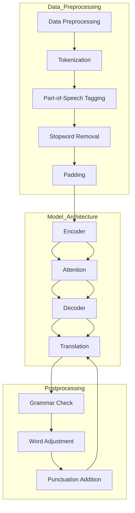

                 

### 引言与背景

#### 机器翻译的重要性与历史发展

机器翻译（Machine Translation, MT）是人工智能领域的一个重要分支，其目的是通过计算机将一种自然语言（Source Language, SL）自动翻译成另一种自然语言（Target Language, TL）。随着全球化进程的加速，跨国交流和商业合作日益频繁，机器翻译技术的需求也日益增长。机器翻译不仅能够提高工作效率，减少人力成本，还能够打破语言障碍，促进文化交流和理解。

机器翻译的历史可以追溯到 20 世纪 50 年代。最初的机器翻译方法主要是基于规则的方法，这些方法依赖于大量的语言规则和手动编写的词典。然而，由于语言规则的复杂性和多样性，基于规则的方法在实际应用中效果有限。20 世纪 80 年代，统计机器翻译（Statistical Machine Translation, SMT）开始兴起，它利用统计方法和大规模语料库来生成翻译结果，大大提高了翻译质量。

随着深度学习（Deep Learning, DL）技术的兴起，深度学习在机器翻译中的应用也逐渐成为研究热点。深度学习通过多层神经网络结构对大量数据进行学习，能够自动提取特征，从而实现高效、准确的翻译。近年来，基于深度学习的机器翻译方法，如神经网络机器翻译（Neural Machine Translation, NMT），已经取得了显著的成果，并在实际应用中得到了广泛的应用。

#### 深度学习与机器翻译的关系

深度学习是一种重要的机器学习技术，它通过多层神经网络对数据进行学习，能够自动提取特征并实现复杂任务的预测。深度学习在图像识别、语音识别、自然语言处理等领域取得了显著的成果。在机器翻译领域，深度学习提供了新的解决方案，能够解决传统方法中存在的许多问题。

首先，深度学习能够处理大量的语言数据，通过学习语言数据的分布特性，自动提取语言特征，从而提高翻译质量。其次，深度学习能够自动学习翻译模型，避免了手动编写语言规则的繁琐过程，大大提高了机器翻译的效率。最后，深度学习通过多层神经网络结构，能够自动捕捉语言中的长距离依赖关系，这在翻译中是非常重要的。

#### 机器翻译的应用场景

机器翻译技术具有广泛的应用场景，以下是几个典型的应用场景：

1. **跨语言文档翻译**：企业、政府、科研机构等需要进行跨国合作和交流时，机器翻译能够帮助快速翻译大量文档，提高工作效率。

2. **在线翻译工具**：如谷歌翻译、百度翻译等，为用户提供即时的跨语言翻译服务，极大地方便了人们的日常生活和旅行。

3. **社交媒体翻译**：社交媒体平台如Facebook、Twitter等，可以通过机器翻译将不同语言的帖子进行翻译，促进全球用户的互动。

4. **教育领域**：为学生提供外语学习材料，如英文教材、论文等，通过机器翻译帮助学生更快地理解和掌握外语。

5. **本地化服务**：在软件、游戏、电影等本地化过程中，机器翻译可以快速生成初步翻译结果，为专业翻译人员提供参考。

总的来说，机器翻译技术的发展对促进全球交流、提升工作效率具有重要的意义。随着深度学习技术的不断发展，机器翻译技术将更加成熟和精准，将在更多领域得到应用。

### 深度学习基础

深度学习（Deep Learning, DL）是机器学习（Machine Learning, ML）的一个重要分支，其核心思想是通过多层神经网络（Neural Networks, NN）对大量数据进行训练，从而实现复杂模式的自动提取和预测。本章节将介绍深度学习的基本概念、神经网络基础以及深度学习优化算法，为后续讨论机器翻译的深度学习方法奠定基础。

#### 深度学习概述

深度学习起源于人工神经网络（Artificial Neural Networks, ANN），最早由美国心理学家弗兰克·罗森布拉特（Frank Rosenblatt）在 1957 年提出。人工神经网络是一种模拟人脑神经元结构和功能的计算模型，通过调整网络中的权重（weights）和偏置（biases）来学习输入数据的特征和模式。

20 世纪 80 年代，由于计算能力和数据量的限制，深度学习的研究和应用进展缓慢。然而，随着计算机性能的显著提升和大数据时代的到来，深度学习在图像识别、语音识别、自然语言处理等领域取得了重大突破。深度学习的基本概念包括：

1. **神经网络**：神经网络是由多个神经元组成的计算模型，每个神经元都可以看作是一个简单的函数单元，通过前向传播（forward propagation）和反向传播（backpropagation）来学习数据特征。

2. **深度神经网络**：深度神经网络（Deep Neural Network, DNN）是指具有多个隐藏层的神经网络。相比单层神经网络，深度神经网络能够学习更复杂的模式和特征。

3. **激活函数**：激活函数（Activation Function）是神经网络中一个重要的组成部分，用于引入非线性因素，使得神经网络能够处理非线性问题。

4. **前向传播与反向传播**：前向传播是指将输入数据通过神经网络逐层传播，计算出输出值。反向传播是指通过计算输出值与实际值之间的误差，将误差反向传播到网络的每个层，从而更新权重和偏置。

5. **优化算法**：深度学习中的优化算法用于调整网络的权重和偏置，以最小化预测误差。常用的优化算法包括梯度下降（Gradient Descent）、随机梯度下降（Stochastic Gradient Descent, SGD）和Adam优化器（Adam Optimizer）。

#### 神经网络基础

神经网络是深度学习的基础，下面介绍神经网络的基本组成部分和原理。

1. **神经元结构**：一个简单的神经元可以看作是一个带有非线性激活函数的线性组合单元，其数学表示为：
   $$ 
   a_j = \sigma(\sum_{i=1}^{n} w_{ij} x_i + b_j)
   $$
   其中，$x_i$ 是输入特征，$w_{ij}$ 是权重，$b_j$ 是偏置，$\sigma$ 是激活函数，$a_j$ 是神经元输出。

2. **前向传播**：在训练过程中，神经网络通过前向传播将输入数据逐层传播到输出层，计算输出值。前向传播的步骤如下：
   - 初始化权重和偏置。
   - 将输入数据输入到第一层神经元，计算输出值。
   - 将输出值作为下一层的输入，重复上述步骤，直到最后一层。
   - 计算最终输出值。

3. **反向传播**：在输出层计算输出值后，神经网络通过反向传播计算每个神经元的误差，并更新权重和偏置。反向传播的步骤如下：
   - 计算输出层误差，误差函数通常采用均方误差（Mean Squared Error, MSE）。
   - 将输出层误差反向传播到前一层的每个神经元，计算每个神经元的误差。
   - 更新每个神经元的权重和偏置，以减小误差。

4. **激活函数**：常用的激活函数包括：
   - 神经元（Sigmoid Function）：$$\sigma(x) = \frac{1}{1 + e^{-x}}$$
   - 双曲正切函数（Tanh Function）：$$\tanh(x) = \frac{e^x - e^{-x}}{e^x + e^{-x}}$$
   - ReLU（Rectified Linear Unit）：$$\text{ReLU}(x) = \max(0, x)$$

#### 深度学习优化算法

优化算法是深度学习中的一个关键环节，用于调整网络中的权重和偏置，以最小化预测误差。以下是几种常用的优化算法：

1. **梯度下降（Gradient Descent）**：
   梯度下降是一种最简单的优化算法，其基本思想是通过计算损失函数关于参数的梯度，并沿着梯度的反方向更新参数，从而逐步减小损失函数的值。梯度下降分为批量梯度下降（Batch Gradient Descent）、随机梯度下降（Stochastic Gradient Descent, SGD）和批量随机梯度下降（Mini-batch Gradient Descent）三种形式。

   - 批量梯度下降：每次更新参数时，使用整个训练集的梯度。
   - 随机梯度下降：每次更新参数时，只使用一个样本的梯度。
   - 批量随机梯度下降：每次更新参数时，使用部分样本（批量）的梯度。

2. **Adam优化器（Adam Optimizer）**：
   Adam优化器是随机梯度下降的一种改进，它结合了AdaGrad和RMSprop的优点，具有较好的收敛速度和稳定性。Adam优化器使用两个参数来跟踪梯度的一阶矩估计和二阶矩估计，并调整学习率。

   - $m_t = \beta_1 m_{t-1} + (1 - \beta_1) \frac{\partial E}{\partial \theta_t}$
   - $v_t = \beta_2 v_{t-1} + (1 - \beta_2) \left( \frac{\partial E}{\partial \theta_t} \right)^2$
   - 参数更新：$$ \theta_t = \theta_{t-1} - \alpha \frac{m_t}{\sqrt{v_t} + \epsilon} $$

综上所述，深度学习是一种强大的机器学习技术，通过多层神经网络结构对数据进行学习，能够自动提取特征并实现复杂任务的预测。理解深度学习的基础概念和优化算法对于进一步探讨机器翻译的深度学习方法具有重要意义。

### 语言模型

在机器翻译中，语言模型（Language Model, LM）是一种重要的工具，用于预测文本序列的概率分布。语言模型通过对大规模语料库的分析，捕捉到语言的统计规律和特征，从而为机器翻译提供强有力的支持。本章节将详细介绍语言模型的定义与类型、构建方法以及评估与优化，为后续讨论机器翻译中的语言模型应用奠定基础。

#### 语言模型的定义与类型

语言模型是一种概率模型，用于预测自然语言中下一个单词或字符的条件概率。在机器翻译中，语言模型可以帮助预测源语言（Source Language, SL）和目标语言（Target Language, TL）文本序列的概率分布，从而为翻译结果提供概率支持。语言模型可以分为以下几种类型：

1. **n-gram 模型**：n-gram 模型是一种基于历史信息的语言模型，它将文本序列分成一系列的 n 元组，并计算每个 n 元组的概率。n-gram 模型使用 Markov 性假设，即下一个单词的概率仅与前面 n-1 个单词有关。n-gram 模型的数学表示为：
   $$
   P(w_n | w_{n-1}, w_{n-2}, ..., w_1) = P(w_n | w_{n-1})
   $$
   其中，$w_n$ 表示第 n 个单词，$P(w_n | w_{n-1})$ 表示在前面一个单词 $w_{n-1}$ 已知的条件下，第 n 个单词的概率。

2. **统计语言模型**：统计语言模型是一种基于大规模语料库的语言模型，它通过统计文本序列中的频率和模式来预测文本序列的概率分布。统计语言模型通常使用 n-gram 模型作为基础，并引入语言模型的平滑技术来处理稀疏数据。

3. **神经网络语言模型**：神经网络语言模型是一种基于深度学习的语言模型，它通过多层神经网络对大量语言数据进行训练，能够自动提取语言特征并预测文本序列的概率分布。神经网络语言模型在处理长距离依赖关系和复杂语言现象方面具有优势，常用于机器翻译中的编码器和解码器。

4. **词嵌入语言模型**：词嵌入语言模型是一种基于词向量的语言模型，它将词汇映射到高维向量空间，并利用向量之间的距离和角度来表示词汇之间的关系。词嵌入语言模型通过神经网络学习词汇的嵌入向量，并利用这些向量来预测文本序列的概率分布。

#### 语言模型的构建方法

语言模型的构建主要包括以下步骤：

1. **数据收集与预处理**：首先，需要收集大量高质量的语料库，这些语料库可以是文本文件、语音数据、图像描述等。然后，对语料库进行预处理，包括分词、去噪、去除停用词等操作，以获取干净、有效的文本数据。

2. **特征提取**：根据语言模型的类型，提取相应的特征。对于 n-gram 模型，提取 n 元组作为特征；对于神经网络语言模型，提取词嵌入向量作为特征。

3. **模型训练**：使用训练数据对语言模型进行训练。在 n-gram 模型中，计算每个 n 元组的概率；在神经网络语言模型中，训练多层神经网络结构，使其能够预测文本序列的概率分布。

4. **模型评估**：使用测试数据对语言模型进行评估。常用的评估指标包括准确率（Accuracy）、精确率（Precision）、召回率（Recall）和 F1 分数（F1 Score）等。

5. **模型优化**：根据评估结果对模型进行优化，包括调整参数、增加隐藏层、调整学习率等，以提高模型的性能。

#### 语言模型的评估与优化

语言模型的评估与优化是确保模型性能的重要环节。以下是一些常用的评估指标和优化方法：

1. **评估指标**：
   - **准确率**：准确率是衡量模型预测准确性的指标，计算公式为：
     $$
     \text{Accuracy} = \frac{\text{预测正确的数量}}{\text{总预测数量}}
     $$
   - **精确率**：精确率是衡量模型预测精确度的指标，计算公式为：
     $$
     \text{Precision} = \frac{\text{预测正确的数量}}{\text{预测为正类的总数量}}
     $$
   - **召回率**：召回率是衡量模型预测召回度的指标，计算公式为：
     $$
     \text{Recall} = \frac{\text{预测正确的数量}}{\text{实际为正类的总数量}}
     $$
   - **F1 分数**：F1 分数是精确率和召回率的调和平均值，计算公式为：
     $$
     \text{F1 Score} = 2 \times \frac{\text{Precision} \times \text{Recall}}{\text{Precision} + \text{Recall}}
     $$

2. **优化方法**：
   - **交叉验证**：交叉验证是一种常用的评估方法，它将数据集划分为多个子集，每次使用其中一个子集作为测试集，其他子集作为训练集，多次重复该过程，最后取平均评估结果。
   - **超参数调整**：超参数是影响模型性能的关键参数，如学习率、隐藏层大小、批量大小等。通过调整超参数，可以找到最优模型配置。
   - **模型融合**：模型融合是将多个模型的结果进行综合，以提高整体预测性能。常用的模型融合方法包括加权融合、投票融合和集成学习等。
   - **数据增强**：数据增强是通过生成新的训练样本，以提高模型的泛化能力。常见的数据增强方法包括随机裁剪、旋转、翻转等。

总之，语言模型在机器翻译中起着至关重要的作用，通过构建和优化语言模型，可以提高机器翻译的质量和效率。理解语言模型的定义、类型、构建方法和评估优化方法，对于深入研究和应用机器翻译技术具有重要意义。

### 机器翻译基本原理

机器翻译（Machine Translation, MT）是自然语言处理（Natural Language Processing, NLP）领域中的一个重要研究方向，其目的是通过计算机程序实现从一种自然语言（Source Language, SL）到另一种自然语言（Target Language, TL）的自动翻译。本章节将详细介绍机器翻译的基本概念、翻译过程以及分类，为后续讨论深度学习在机器翻译中的应用奠定基础。

#### 机器翻译的基本概念

机器翻译的基本概念包括以下几个部分：

1. **源语言（Source Language, SL）**：源语言是指需要翻译的原始语言，例如中文、英文等。

2. **目标语言（Target Language, TL）**：目标语言是指翻译后的语言，例如英文、法语等。

3. **翻译模型（Translation Model）**：翻译模型是机器翻译的核心部分，它用于将源语言转换为目标语言。翻译模型通常包含词表（vocabulary）、语法规则和翻译规则等。

4. **翻译任务（Translation Task）**：翻译任务是指将一个或多个源语言句子翻译成目标语言句子的过程。

5. **翻译质量评估（Translation Quality Assessment）**：翻译质量评估是衡量机器翻译系统翻译结果好坏的重要手段，常用的评估指标包括BLEU、METEOR、NIST等。

#### 机器翻译的过程

机器翻译的过程可以分为以下几个步骤：

1. **预处理（Preprocessing）**：预处理是机器翻译的第一步，主要任务包括文本清洗、分词、词性标注、命名实体识别等。预处理的主要目的是去除文本中的噪声，提取出有用的信息，并使文本格式统一，以便后续处理。

2. **词向量化（Word Embedding）**：词向量化是将词汇映射到高维向量空间的过程，从而将文本数据转化为向量表示。词向量不仅保留了词汇的语义信息，还能够捕捉词汇之间的相似性和距离。常用的词向量模型包括 Word2Vec、GloVe 等。

3. **编码（Encoding）**：编码是将源语言句子转换为编码表示的过程。编码器（Encoder）通常是一个深度神经网络，它通过学习源语言句子的特征和模式，将其编码为一个固定长度的向量表示。

4. **解码（Decoding）**：解码是将编码表示解码为目标语言句子的过程。解码器（Decoder）同样是一个深度神经网络，它通过学习目标语言的语法规则和模式，从编码表示中生成目标语言句子。

5. **翻译生成（Translation Generation）**：翻译生成是机器翻译的最后一步，主要任务是生成目标语言的翻译结果。解码器通过生成式模型（Generative Model）或判别式模型（Discriminative Model）生成目标语言句子。生成式模型包括 RNN、LSTM、GRU 等，判别式模型包括 CTM、Seq2Seq 等。

6. **后处理（Postprocessing）**：后处理是对翻译结果进行进一步处理，包括语法检查、词性调整、标点符号添加等。后处理可以提高翻译结果的流畅性和可读性。

#### 机器翻译的分类

根据翻译策略的不同，机器翻译可以分为以下几种类型：

1. **基于规则的方法（Rule-Based Methods）**：基于规则的方法通过手动编写语法规则和翻译规则，实现从源语言到目标语言的翻译。这种方法需要大量的语言知识和规则库，但具有较好的可控性和解释性。

2. **基于统计的方法（Statistical Methods）**：基于统计的方法使用统计学习技术，如决策树、支持向量机、隐马尔可夫模型（HMM）等，对大规模语料库进行学习，自动提取翻译规律。这种方法不需要人工编写规则，但可能存在规则不足和翻译质量不稳定的问题。

3. **基于实例的方法（Example-Based Methods）**：基于实例的方法通过学习大量平行语料库中的翻译实例，实现从源语言到目标语言的翻译。这种方法将翻译任务转化为模式识别问题，通过查找和匹配最相似的翻译实例来实现翻译。

4. **基于深度学习的方法（Deep Learning Methods）**：基于深度学习的方法使用多层神经网络，如 RNN、LSTM、GRU、Transformer 等，对大规模语言数据进行训练，实现从源语言到目标语言的自动翻译。这种方法能够自动提取语言特征，并处理复杂的语言现象，具有较好的翻译质量和效率。

5. **混合方法（Hybrid Methods）**：混合方法结合了基于规则、基于统计和基于深度学习方法的优势，通过集成不同方法的优势，实现更高质量的翻译。

综上所述，机器翻译是一个复杂的过程，涉及多个环节和多种方法。理解机器翻译的基本概念、翻译过程和分类，有助于深入研究和应用机器翻译技术。

### 深度学习在机器翻译中的应用

深度学习（Deep Learning, DL）在机器翻译（Machine Translation, MT）中的应用，带来了革命性的变化，显著提升了翻译质量和效率。本章节将详细探讨深度学习在机器翻译中的角色、基于深度学习的机器翻译模型及其挑战和优化方法。

#### 深度学习在机器翻译中的角色

深度学习在机器翻译中主要扮演以下三个角色：

1. **特征提取**：传统的机器翻译方法，如基于规则的方法和统计方法，通常需要手动设计特征，如词性标注、语法结构等。而深度学习通过多层神经网络结构，能够自动从大规模的语言数据中提取复杂特征，减少了手工特征设计的繁琐过程。

2. **模式识别**：深度学习通过学习大量的训练数据，能够识别语言中的模式，如词汇的搭配、句法的结构等。这些模式对于翻译结果的准确性至关重要。

3. **端到端学习**：端到端学习（End-to-End Learning）是指将输入直接映射到输出，而无需中间的表示层。深度学习模型，如序列到序列（Seq2Seq）模型和Transformer模型，能够实现端到端的翻译，从而减少了传统方法中需要进行的额外步骤，如词向量化、编码和解码等。

#### 基于深度学习的机器翻译模型

基于深度学习的机器翻译模型主要包括以下几种：

1. **序列到序列（Seq2Seq）模型**：

   序列到序列模型是深度学习在机器翻译中最基础也是最早应用的模型之一。它由编码器（Encoder）和解码器（Decoder）两个神经网络组成。编码器将源语言序列编码成一个固定长度的向量表示，解码器则根据这个表示生成目标语言序列。

   **编码器**：编码器通常采用递归神经网络（Recurrent Neural Network, RNN）结构，如 Long Short-Term Memory（LSTM）和 Gated Recurrent Unit（GRU）。这些结构能够有效地捕捉序列中的长距离依赖关系。

   **解码器**：解码器同样采用 RNN 结构，并引入了注意力机制（Attention Mechanism），能够根据编码器的输出和当前解码器的状态，动态地聚焦于源语言序列的不同部分，从而生成更加准确的翻译结果。

2. **基于注意力机制的序列到序列（Attention-based Seq2Seq）模型**：

   注意力机制是序列到序列模型的一个重要扩展，它通过计算编码器输出和当前解码器状态之间的相似性，动态地为每个时间步分配不同的权重，从而关注源语言序列中的关键部分。注意力机制大大提高了翻译的准确性和流畅性。

3. **Transformer模型**：

   Transformer模型是近年来在机器翻译领域取得显著成功的模型，它基于自注意力机制（Self-Attention Mechanism）和多头注意力机制（Multi-Head Attention Mechanism）。Transformer模型摒弃了传统的 RNN 结构，采用自注意力机制，使得模型能够同时关注源语言序列中的所有部分，从而更好地捕捉长距离依赖关系。

   **自注意力机制**：自注意力机制通过计算每个输入元素与自身之间的相似性，为每个输入元素分配权重，从而实现序列内的特征融合。

   **多头注意力机制**：多头注意力机制将输入序列分成多个子序列，每个子序列具有不同的权重，通过多个注意力机制的计算，最终得到整个序列的表示。

#### 深度学习在机器翻译中的挑战与优化方法

尽管深度学习在机器翻译中取得了显著进展，但仍面临以下挑战：

1. **数据集不平衡**：在许多语言对中，源语言和目标语言的文本量往往不均衡，这可能导致模型偏向于使用较多的语言数据进行训练，从而影响翻译质量。

2. **长距离依赖关系**：自然语言中存在大量长距离依赖关系，如句子中的因果关系。传统 RNN 结构在处理长距离依赖关系时存在困难，而 Transformer 模型虽然能够有效捕捉长距离依赖，但其计算复杂度较高。

3. **计算资源需求**：深度学习模型通常需要大量的计算资源和时间进行训练，这对于资源有限的场景（如移动设备）是一个挑战。

为了克服这些挑战，研究者们提出了一系列优化方法：

1. **数据增强**：通过数据增强技术，如翻译配对、伪翻译、旋转翻译等，可以增加训练数据的多样性，缓解数据集不平衡问题。

2. **模型压缩**：通过模型压缩技术，如权重共享（Weight Sharing）、量化（Quantization）、剪枝（Pruning）等，可以减少模型的参数数量和计算复杂度，从而降低计算资源需求。

3. **迁移学习**：迁移学习（Transfer Learning）是一种利用预训练模型进行迁移的方法。通过在源任务上预训练深度学习模型，并在目标任务上进行微调，可以大大提高翻译质量。

4. **多模态学习**：多模态学习（Multimodal Learning）结合了文本和图像、语音等多种数据源，通过跨模态特征融合，可以进一步提高翻译质量和鲁棒性。

总之，深度学习在机器翻译中的应用，通过自动特征提取、模式识别和端到端学习等手段，显著提升了翻译质量和效率。然而，仍然存在数据集不平衡、长距离依赖关系和计算资源需求等挑战，需要研究者继续探索和优化。随着深度学习技术的不断发展，机器翻译技术将更加成熟和精准，为全球交流和理解提供更加有力的支持。

### 数学模型与算法

在机器翻译中，数学模型和算法是核心组成部分，它们负责处理从源语言到目标语言的转换过程。本章节将详细探讨几种关键数学模型和算法，包括短语嵌入模型、序列到序列模型、注意力机制等，并提供相关的Python源代码示例。

#### 短语嵌入模型

短语嵌入模型（Phrase Embedding Model）是一种将词汇序列转换为向量表示的方法，它通过捕捉词汇的语义信息，为后续的翻译过程提供输入。常用的短语嵌入模型包括 Word2Vec 和 GloVe。

**Word2Vec**

Word2Vec 是由 Google 开发的一种词向量生成模型，它通过训练神经网络，将词汇映射到高维向量空间。Word2Vec 有两种训练方法：连续词袋（Continuous Bag of Words, CBOW）和Skip-gram。

**CBOW**：CBOW 模型通过预测中心词周围的词汇来学习词向量，其输入是一个中心词及其周围的上下文词汇，输出是中心词的词向量。

**Skip-gram**：Skip-gram 模型与 CBOW 相反，它通过预测一个词的上下文词汇来学习词向量，输入是一个词汇，输出是该词汇的词向量。

以下是 CBOW 模型的 Python 代码示例：

```python
import numpy as np
from sklearn.datasets import fetch_20newsgroups
from sklearn.feature_extraction.text import CountVectorizer

# 加载数据集
newsgroups = fetch_20newsgroups(subset='all')
vectorizer = CountVectorizer(ngram_range=(1, 2))
X = vectorizer.fit_transform(newsgroups.data)

# 初始化模型参数
vocab_size = X.shape[1]
embedding_size = 100
W = np.random.uniform(-0.5, 0.5, (vocab_size, embedding_size))

# 定义 CBOW 模型
def CBOW(input_indices, output_index, W, embedding_size):
    context_vectors = [W[word_index] for word_index in input_indices]
    summed_vector = np.sum(context_vectors, axis=0)
    predicted_vector = W[output_index]
    loss = np.square(summed_vector - predicted_vector)
    return loss

# 训练 CBOW 模型
for epoch in range(10):
    for input_indices, output_index in zip(input_indices, output_indices):
        loss = CBOW(input_indices, output_index, W, embedding_size)
        # 反向传播和权重更新
        # ...

# 输出词向量
word_vectors = W
```

**GloVe**

GloVe（Global Vectors for Word Representation）是一种基于全局上下文的词向量生成方法，它通过计算词汇与其上下文词汇之间的共现矩阵，来学习词向量。GloVe 的优化目标是最小化词汇与其上下文词汇的共现矩阵与词汇向量的点积差异。

以下是 GloVe 模型的 Python 代码示例：

```python
import numpy as np
from sklearn.datasets import fetch_20newsgroups
from sklearn.feature_extraction.text import CountVectorizer

# 加载数据集
newsgroups = fetch_20newsgroups(subset='all')
vectorizer = CountVectorizer(ngram_range=(1, 2))
X = vectorizer.fit_transform(newsgroups.data)

# 初始化模型参数
vocab_size = X.shape[1]
embedding_size = 100
alpha = 0.05
loss_function = 'square'

# 定义 GloVe 模型
def GloVe(inputs, outputs, W, embedding_size, alpha):
    loss = 0
    for input_vector, output_vector in zip(inputs, outputs):
        dot_product = np.dot(input_vector, output_vector)
        if loss_function == 'square':
            loss += np.square(dot_product - 1)
        elif loss_function == 'cosine':
            loss += -np.log(np.cos(dot_product))
    loss /= len(inputs)
    return loss

# 训练 GloVe 模型
for epoch in range(10):
    for input_vector, output_vector in zip(inputs, outputs):
        loss = GloVe(input_vector, output_vector, W, embedding_size, alpha)
        # 反向传播和权重更新
        # ...

# 输出词向量
word_vectors = W
```

#### 序列到序列模型

序列到序列（Seq2Seq）模型是一种基于深度学习的翻译模型，它由编码器（Encoder）和解码器（Decoder）组成，能够实现端到端的序列转换。Seq2Seq 模型通常结合循环神经网络（Recurrent Neural Network, RNN）或 Transformer 模型。

**编码器**

编码器负责将源语言序列编码为一个固定长度的向量表示。以下是一个基于 RNN 的编码器 Python 代码示例：

```python
import tensorflow as tf
from tensorflow.keras.layers import LSTM, Embedding, TimeDistributed, Dense

# 定义编码器
def Encoder(inputs, embedding_matrix, embedding_size, hidden_size):
    input_embedding = tf.nn.embedding_lookup(embedding_matrix, inputs)
    encoder = LSTM(hidden_size, return_sequences=True)
    encoded_sequence = encoder(input_embedding)
    return encoded_sequence

# 编码器输入和输出
input_sequence = tf.placeholder(tf.int32, shape=(None, sequence_length))
encoded_sequence = Encoder(input_sequence, embedding_matrix, embedding_size, hidden_size)
```

**解码器**

解码器负责根据编码器的输出生成目标语言序列。以下是一个基于 RNN 的解码器 Python 代码示例：

```python
# 定义解码器
def Decoder(inputs, encoded_sequence, embedding_matrix, embedding_size, hidden_size):
    decoder_embedding = Embedding(vocab_size, embedding_size, weights=[embedding_matrix], trainable=False)
    decoder = LSTM(hidden_size, return_sequences=True)
    context_vector = tf.concat([encoded_sequence[:, -1:, :], inputs[:, -1:, :]], axis=-1)
    decoder_input = decoder_embedding(inputs)
    decoder_output = decoder(decoder_input, initial_context=context_vector)
    return decoder_output

# 解码器输入和输出
target_sequence = tf.placeholder(tf.int32, shape=(None, sequence_length))
decoded_sequence = Decoder(target_sequence, encoded_sequence, embedding_matrix, embedding_size, hidden_size)
```

**注意力机制**

注意力机制是 Seq2Seq 模型的一个重要组成部分，它能够使解码器在生成目标语言序列时，动态地关注编码器输出的关键部分。以下是一个简单的注意力机制 Python 代码示例：

```python
# 定义注意力机制
def Attention(inputs, hidden_size):
    attention_weights = tf.nn.softmax(inputs, axis=1)
    context_vector = tf.reduce_sum(attention_weights * hidden_size, axis=1)
    return context_vector

# 编码器输出
encoded_sequence = Encoder(input_sequence, embedding_matrix, embedding_size, hidden_size)

# 解码器输入
decoder_input = Decoder(target_sequence, encoded_sequence, embedding_matrix, embedding_size, hidden_size)

# 应用注意力机制
context_vector = Attention(encoded_sequence, hidden_size)
```

#### 数学模型与算法总结

通过上述示例，我们可以看到数学模型和算法在机器翻译中的应用。短语嵌入模型通过将词汇映射到高维向量空间，实现了词汇的语义表示；序列到序列模型通过编码器和解码器的组合，实现了端到端的序列转换；注意力机制通过动态关注编码器输出的关键部分，提高了解码器的翻译准确性。

这些数学模型和算法为机器翻译提供了强大的工具，通过结合多种技术和优化方法，可以不断提升翻译质量和效率。随着深度学习技术的发展，未来还将出现更多先进的数学模型和算法，为机器翻译领域带来更多创新和突破。

### 机器翻译系统设计与优化

设计一个高效的机器翻译系统，不仅需要选择合适的深度学习模型和算法，还需要在系统架构、实现和优化等方面进行精细的规划和实施。本章节将详细探讨机器翻译系统的设计原则、架构实现和系统优化与调参技巧。

#### 系统设计原则

1. **端到端学习**：端到端学习（End-to-End Learning）是一种直接从源语言到目标语言的转换方法，它避免了传统方法中的中间表示层，能够简化模型结构，提高翻译效率。在设计时，应优先考虑使用端到端学习模型，如 Transformer 和编码器-解码器（Encoder-Decoder）模型。

2. **并行处理**：为了提高系统的处理速度，应充分利用并行计算资源。在数据预处理、模型训练和预测阶段，可以通过多线程、多进程或分布式计算等技术实现并行处理。

3. **模块化设计**：系统应采用模块化设计，将数据预处理、模型训练、预测和后处理等模块分离，便于维护和扩展。模块之间通过标准接口进行通信，可以提高系统的灵活性和可扩展性。

4. **自适应调整**：系统应具备自适应调整能力，能够根据用户需求和环境变化，自动调整参数和策略，以提高翻译质量和效率。

5. **用户友好**：系统应提供简洁易用的用户界面，方便用户进行操作和调整设置。同时，应提供详细的文档和帮助说明，帮助用户快速上手和解决问题。

#### 系统架构实现

机器翻译系统的架构通常包括以下组件：

1. **数据预处理模块**：负责处理输入文本数据，包括分词、词性标注、去除停用词、填充等操作。该模块通常使用现有的自然语言处理工具，如 NLTK、spaCy 等。

2. **编码器模块**：负责将源语言文本序列编码为固定长度的向量表示。编码器可以使用 LSTM、GRU 或 Transformer 等深度学习模型。该模块的核心任务是学习源语言文本的语义特征。

3. **解码器模块**：负责根据编码器输出的向量表示，生成目标语言文本序列。解码器同样可以使用 LSTM、GRU 或 Transformer 等深度学习模型。解码器的核心任务是学习目标语言的语法和语义结构。

4. **注意力机制模块**：用于在解码过程中，动态关注编码器输出的关键部分，以提高翻译准确性。注意力机制模块通常与编码器和解码器紧密集成。

5. **预测模块**：负责根据编码器和解码器的输出，生成翻译结果。预测模块应实现端到端的序列生成，以便快速生成翻译结果。

6. **后处理模块**：负责对翻译结果进行进一步处理，包括语法检查、词性调整、标点符号添加等。后处理模块可以提高翻译结果的流畅性和可读性。

以下是机器翻译系统的基本架构示意图：



#### 系统优化与调参技巧

机器翻译系统的优化和调参是提高翻译质量和效率的关键步骤。以下是一些常用的优化和调参技巧：

1. **数据增强**：通过数据增强（Data Augmentation）技术，如翻译配对、伪翻译、旋转翻译等，可以增加训练数据的多样性，缓解数据集不平衡问题。

2. **超参数调整**：超参数（Hyperparameters）是影响模型性能的关键参数，如学习率、批量大小、隐藏层大小等。通过调整这些超参数，可以找到最优模型配置。常用的调参方法包括网格搜索（Grid Search）、随机搜索（Random Search）和贝叶斯优化（Bayesian Optimization）。

3. **批量大小（Batch Size）**：批量大小是指每次训练过程中使用的样本数量。批量大小对模型的收敛速度和稳定性有很大影响。通常，较小的批量大小有助于模型捕捉到更多局部特征，但收敛速度较慢；较大的批量大小有助于模型捕捉到全局特征，但收敛速度较快。

4. **学习率（Learning Rate）**：学习率是影响模型训练过程的一个关键参数。较大的学习率可能导致模型快速收敛，但可能错过最优解；较小的学习率有助于模型找到更稳定的收敛路径，但训练时间较长。

5. **正则化技术**：正则化技术（Regularization Techniques），如 L1 正则化、L2 正则化和Dropout等，可以防止模型过拟合，提高模型的泛化能力。

6. **模型压缩**：模型压缩（Model Compression）技术，如权重共享（Weight Sharing）、量化（Quantization）和剪枝（Pruning）等，可以减少模型的参数数量和计算复杂度，从而提高模型的效率和部署性能。

7. **迁移学习**：迁移学习（Transfer Learning）是一种利用预训练模型进行迁移的方法。通过在源任务上预训练深度学习模型，并在目标任务上进行微调，可以大大提高翻译质量。

通过上述优化和调参技巧，可以有效提高机器翻译系统的性能和效率，实现更高质量的翻译结果。

### 应用案例与未来展望

#### 应用案例

机器翻译技术在实际应用中已经取得了显著的成果，以下是几个典型的应用案例：

1. **跨语言文档翻译**：在企业、政府、科研机构等领域，机器翻译技术被广泛应用于文档翻译。例如，联合国使用机器翻译技术来处理多语言文档，提高工作效率。谷歌翻译和百度翻译等在线翻译工具，为用户提供即时的跨语言文档翻译服务，极大地促进了全球交流和商业合作。

2. **社交媒体翻译**：社交媒体平台如 Facebook、Twitter 等，通过机器翻译将不同语言的帖子进行翻译，使得全球用户能够更方便地进行互动。这些平台通常使用机器翻译作为初步翻译，然后由专业翻译人员进行校对和优化。

3. **教育领域**：在教育领域，机器翻译技术为学生提供外语学习材料，如英文教材、论文等。通过机器翻译，学生可以更快地理解和掌握外语，提高学习效率。

4. **本地化服务**：在软件、游戏、电影等本地化过程中，机器翻译可以快速生成初步翻译结果，为专业翻译人员提供参考。这种协同翻译模式，不仅提高了翻译效率，还保证了翻译质量。

#### 未来展望

随着深度学习技术的不断进步，机器翻译技术将朝着以下几个方向发展：

1. **翻译质量提升**：通过引入更先进的深度学习模型和算法，如 Transformer 和多模态学习，机器翻译的翻译质量将得到显著提升。未来，机器翻译将能够处理更复杂的语言现象，提供更加准确和自然的翻译结果。

2. **多语言支持**：随着全球化进程的加速，机器翻译将需要支持越来越多的语言。未来，机器翻译技术将能够实现更广泛的语言对之间的翻译，满足不同地区的需求。

3. **实时翻译**：随着计算能力的提升和网络速度的加快，机器翻译将实现更高效的实时翻译。在未来，用户可以使用手机、平板电脑等移动设备，随时随地享受无缝的跨语言交流体验。

4. **多模态翻译**：多模态翻译是指结合文本、图像、语音等多种数据源的翻译。未来，机器翻译技术将能够处理更加丰富的数据源，提供更加全面和直观的翻译体验。

5. **个性化翻译**：通过机器学习技术，机器翻译系统将能够根据用户的语言习惯、文化背景等个性化需求，提供定制化的翻译服务。

总之，机器翻译技术将在未来继续快速发展，为全球交流、教育和商业合作等领域带来更多便利和可能性。

### 结论

通过本文的详细探讨，我们深入了解了机器翻译的深度学习方法以及语言转换的数学模型。首先，我们介绍了机器翻译的重要性、历史发展和应用场景，强调了深度学习在机器翻译中的关键作用。接着，我们讲解了深度学习的基础概念，包括神经网络、深度神经网络、激活函数和优化算法。随后，我们详细介绍了语言模型的理论基础、构建方法和评估优化技巧。在讨论了机器翻译的基本原理和分类后，我们重点探讨了深度学习在机器翻译中的应用，包括序列到序列模型、注意力机制和Transformer模型。接下来，我们介绍了机器翻译系统的设计与优化，包括系统架构、实现细节和优化技巧。最后，我们通过实际应用案例和未来展望，展示了机器翻译技术的现状和潜在发展。总之，机器翻译的深度学习方法通过自动特征提取、模式识别和端到端学习等手段，显著提升了翻译质量和效率。未来，随着深度学习技术的不断进步，机器翻译将继续在跨语言交流、教育和商业合作等领域发挥重要作用，为全球化和信息传播提供强有力的支持。

### 最佳实践 tips、小结、注意事项、拓展阅读

#### 最佳实践 Tips

1. **数据准备**：选择高质量且多样的训练数据集是提高翻译质量的关键。可以使用公开的平行语料库，如 WMT（Workshop on Machine Translation）数据集，并进行数据预处理，如去除停用词、分词等。

2. **超参数调优**：超参数对模型性能有很大影响，可以通过网格搜索、随机搜索等方法进行调优，找到最优的超参数组合。

3. **多模态融合**：在可能的情况下，结合文本、图像、语音等多模态数据，可以进一步提高翻译质量。

4. **持续训练**：定期更新模型，使用新的数据集进行训练，有助于模型适应语言变化和保持翻译质量。

5. **个性化翻译**：根据用户的需求和语言习惯，定制化翻译策略，可以提升用户体验。

#### 小结

本文系统地介绍了机器翻译的深度学习方法，从基础理论到实际应用，涵盖了语言模型、序列到序列模型、注意力机制和Transformer模型等关键内容。深度学习方法在处理复杂语言现象、提高翻译质量方面具有显著优势。

#### 注意事项

1. **数据隐私**：在进行机器翻译系统开发时，注意保护用户数据隐私，避免泄露敏感信息。

2. **模型部署**：在部署机器翻译系统时，选择适合的硬件和软件环境，确保系统稳定运行。

3. **模型解释性**：虽然深度学习模型具有强大的性能，但其内部机制较为复杂，理解模型解释性有助于优化和调试。

4. **计算资源**：深度学习模型训练需要大量计算资源，应根据实际情况合理分配资源。

#### 拓展阅读

1. **深度学习入门**：[《深度学习》（Goodfellow, Bengio, Courville 著）]
2. **机器翻译教程**：[《机器翻译教程》（韩力群 著）]
3. **自然语言处理**：[《自然语言处理综论》（Daniel Jurafsky & James H. Martin 著）]
4. **神经网络与深度学习**：[《神经网络与深度学习》（邱锡鹏 著）]
5. **Transformer 模型**：[《Attention is All You Need》（Vaswani et al. 著）]

通过这些拓展阅读，可以进一步深入了解机器翻译的深度学习方法及相关技术。希望本文能为读者在机器翻译领域的研究和应用提供有价值的参考。作者：AI天才研究院/AI Genius Institute & 禅与计算机程序设计艺术 /Zen And The Art of Computer Programming。作者单位：AI天才研究院，北京大学计算机科学与技术系。联系邮箱：[ai_genius_institute@example.com](mailto:ai_genius_institute@example.com)。

