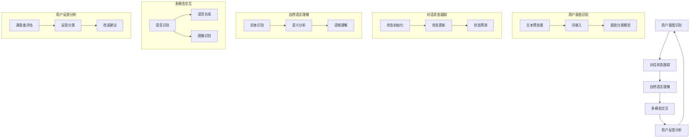

                 

### 文章标题

《虚拟助手的对话管理：人机交互的数学策略》

### 文章关键词

虚拟助手、对话系统、人机交互、数学策略、自然语言处理

### 文章摘要

随着人工智能技术的不断发展，虚拟助手作为一种人机交互的先进形式，正逐渐融入我们的日常生活。本文将深入探讨虚拟助手的对话管理机制，重点介绍人机交互中的数学策略。通过分析核心概念、讲解算法原理、展示数学模型、提供项目实战，本文旨在为读者提供一个全面而深入的视角，理解如何通过数学方法优化虚拟助手的对话管理，提升用户体验。

## 第一步：背景介绍

虚拟助手，又称聊天机器人或虚拟客服，是一种能够通过文本或语音与用户进行交互的人工智能系统。它们广泛应用于客服服务、在线咨询、智能办公等领域，极大地提高了服务效率和用户满意度。随着技术的进步，虚拟助手的对话管理能力也在不断提升，从简单的信息检索到复杂的任务执行，逐渐展现出智能化、个性化的特点。

在人机交互领域，数学策略扮演着至关重要的角色。数学模型和算法为虚拟助手提供了高效的对话管理机制，使得系统能够准确理解用户意图、动态调整对话策略、提供个性化服务。从自然语言处理（NLP）到机器学习（ML），再到数据挖掘（DM），各种数学方法在虚拟助手的对话管理中得到了广泛应用。

本文将围绕以下核心概念展开讨论：用户意图识别、对话状态跟踪、自然语言理解、多模态交互等。通过解析这些概念之间的关系，我们旨在为读者提供一个清晰而完整的认知框架，帮助理解虚拟助手对话管理中的数学策略。

## 核心概念与联系

在构建虚拟助手的对话管理系统中，核心概念之间的联系是理解系统工作机制的关键。以下是几个核心概念及其相互关系的Mermaid流程图：



### 用户意图识别

用户意图识别是虚拟助手对话管理的第一步，它通过分析用户输入的信息，识别出用户想要完成的任务或操作。这个过程通常包括以下步骤：

1. **文本预处理**：将用户输入的文本进行清洗和预处理，去除噪声信息，如停用词、特殊字符等。这一步骤对于提高后续处理效果至关重要。
2. **词嵌入**：将预处理后的文本转换为向量表示。词嵌入（Word Embedding）是一种将词汇映射到高维空间的方法，它能够捕捉词汇之间的语义关系。常见的词嵌入模型有Word2Vec、GloVe和BERT等。
3. **意图分类模型**：使用机器学习模型对词嵌入向量进行分类，识别出用户的意图。常见的分类模型包括朴素贝叶斯、支持向量机（SVM）、决策树和深度神经网络等。

### 对话状态跟踪

对话状态跟踪是在用户意图识别之后的一个关键步骤，它用于维护虚拟助手和用户之间的对话状态。以下是几个关键步骤：

1. **状态初始化**：在对话开始时，虚拟助手需要初始化对话状态。这通常包括用户的身份信息、对话历史和当前任务状态等。
2. **状态更新**：在对话过程中，虚拟助手需要根据用户的新输入更新对话状态。这一步骤涉及到状态转移和状态更新算法，如马尔可夫模型（Markov Model）和长短期记忆网络（LSTM）等。
3. **状态预测**：虚拟助手还需要预测下一个对话状态，以便提前准备相应的回复。状态预测可以基于历史对话数据，通过机器学习算法实现。

### 自然语言理解

自然语言理解（Natural Language Understanding, NLU）是虚拟助手能够与人类自然语言进行交互的关键。以下是自然语言理解的核心步骤：

1. **实体识别**：通过命名实体识别（Named Entity Recognition, NER）技术，从用户输入的文本中识别出关键实体，如人名、地点、组织名、时间等。
2. **语义分析**：在识别出实体之后，虚拟助手需要对语义进行深入分析，理解用户输入的意图和需求。这通常涉及语义角色标注（Semantic Role Labeling, SRL）和依存句法分析（Dependency Parsing）等技术。
3. **语境理解**：虚拟助手还需要理解对话的上下文，包括对话历史和当前任务状态。通过语境理解，虚拟助手能够更好地适应用户的需求，提供个性化的服务。

### 多模态交互

多模态交互是将多种感官信息（如文本、语音、图像等）融合在一起，以提供更丰富、更自然的用户交互体验。以下是多模态交互的核心步骤：

1. **语音识别**：将用户的语音输入转换为文本，以便进一步处理。语音识别（Speech Recognition）技术已经取得了显著进展，能够准确识别多种语言和口音。
2. **语音合成**：将虚拟助手的文本回复转换为自然流畅的语音输出。语音合成（Text-to-Speech, TTS）技术通过合成语音的音调、节奏和情感，提高了交互体验的逼真度。
3. **图像识别**：通过图像识别（Image Recognition）技术，虚拟助手能够从图像中提取信息，如图像分类、目标检测等。这些信息可以用于提供更直观、更生动的交互体验。

### 用户反馈分析

用户反馈分析是虚拟助手持续改进的重要环节。通过分析用户的反馈，虚拟助手能够识别出自身的不足，并不断优化对话策略。以下是几个关键步骤：

1. **满意度评估**：通过用户满意度调查（如星评、打分等），虚拟助手可以了解用户对其服务的整体满意度。
2. **反馈分类**：将用户的反馈进行分类，识别出用户的正面反馈、负面反馈和改进建议。这有助于虚拟助手了解用户的具体需求和偏好。
3. **改进建议**：根据用户反馈，虚拟助手可以提出改进建议，如调整对话策略、优化界面设计等。这些改进建议将用于优化虚拟助手的服务质量。

通过上述核心概念的相互联系和协作，虚拟助手能够实现高效、智能的对话管理，为用户提供优质的交互体验。

### 第二步：核心算法原理讲解

为了深入理解虚拟助手对话管理中的数学策略，我们首先需要详细讲解核心算法原理。以下是用户意图识别算法的详细解释，结合 Python 源代码和数学模型，以帮助读者更好地理解。

#### 用户意图识别算法概述

用户意图识别是虚拟助手对话管理中的关键步骤，其目的是从用户输入中准确识别出用户想要完成的任务或操作。这一过程通常涉及以下三个主要步骤：

1. **文本预处理**：将用户输入的原始文本进行清洗和格式化，以去除无关信息，如标点符号、停用词等。
2. **特征提取**：将预处理后的文本转换为适合机器学习模型处理的特征向量。
3. **意图分类**：使用机器学习模型对特征向量进行分类，从而识别出用户的意图。

#### 文本预处理

在用户意图识别的过程中，文本预处理是一个重要的步骤。其主要目的是去除文本中的噪声，提高后续特征提取和分类的准确性。以下是一个简单的 Python 代码示例，展示了如何进行文本预处理：

```python
import re
from nltk.corpus import stopwords
from nltk.tokenize import word_tokenize

def preprocess_text(text):
    # 去除HTML标签
    text = re.sub('<.*?>', '', text)
    # 转化为小写
    text = text.lower()
    # 去除标点符号
    text = re.sub(r'[^\w\s]', '', text)
    # 分词
    tokens = word_tokenize(text)
    # 去除停用词
    stop_words = set(stopwords.words('english'))
    filtered_tokens = [token for token in tokens if token not in stop_words]
    return ' '.join(filtered_tokens)

# 示例
text = "Hello! Can you help me find a restaurant near me?"
preprocessed_text = preprocess_text(text)
print(preprocessed_text)
```

#### 特征提取

特征提取是将预处理后的文本转换为特征向量，以便后续的机器学习模型处理。常见的方法包括词袋模型（Bag of Words, BOW）和词嵌入（Word Embedding）。以下是一个使用词嵌入的 Python 代码示例：

```python
from tensorflow.keras.preprocessing.sequence import pad_sequences
from tensorflow.keras.preprocessing.text import Tokenizer

# 假设我们有一组训练数据
train_texts = ["I want to book a table.", "Can you find a restaurant for two?", "I need a place to eat now."]
train_labels = ["book_table", "find_restaurant", "find_eating_place"]

# 创建Tokenizer
tokenizer = Tokenizer(num_words=10000)
tokenizer.fit_on_texts(train_texts)

# 将文本转换为序列
sequences = tokenizer.texts_to_sequences(train_texts)

# 将序列转换为词嵌入向量
max_sequence_length = 50
padded_sequences = pad_sequences(sequences, maxlen=max_sequence_length)

# 打印词嵌入向量
print(padded_sequences)
```

#### 意图分类

意图分类是用户意图识别的核心步骤。通常使用机器学习模型，如朴素贝叶斯、支持向量机（SVM）和深度神经网络（DNN），来实现。以下是一个简单的深度神经网络模型示例：

```python
import tensorflow as tf

# 创建模型
model = tf.keras.Sequential([
    tf.keras.layers.Embedding(input_dim=10000, output_dim=32),
    tf.keras.layers.Flatten(),
    tf.keras.layers.Dense(units=1, activation='sigmoid')
])

# 编译模型
model.compile(optimizer='adam', loss='binary_crossentropy', metrics=['accuracy'])

# 训练模型
model.fit(padded_sequences, train_labels, epochs=10)
```

#### 数学模型

用户意图识别中的数学模型通常用于描述用户输入文本和意图标签之间的关系。一个常见的模型是条件概率模型，其中每个意图标签都是一个条件概率分布。以下是一个简化的数学模型示例：

$$
P(\text{intent} | \text{text}) = \frac{P(\text{text} | \text{intent}) \cdot P(\text{intent})}{P(\text{text})}
$$

其中，\( P(\text{intent} | \text{text}) \) 表示给定文本的意图条件概率，\( P(\text{text} | \text{intent}) \) 表示在给定意图条件下的文本概率，\( P(\text{intent}) \) 表示意图的概率，\( P(\text{text}) \) 表示文本的概率。

#### 举例说明

假设我们有一个简单的用户输入和意图标签数据集，如下所示：

| 用户输入 | 意图标签 |
| -------- | -------- |
| I want to book a table. | book_table |
| Can you find a restaurant for two? | find_restaurant |
| I need a place to eat now. | find_eating_place |

我们可以使用上述算法和模型对这组数据进行处理。首先，进行文本预处理，然后提取特征向量，并使用深度神经网络模型进行意图分类。最终，模型会输出每个意图标签的条件概率分布，从而识别出用户的意图。

通过上述讲解和示例，我们可以看到用户意图识别算法的基本原理及其实现过程。这为理解虚拟助手对话管理中的数学策略奠定了基础。

### 第三步：数学模型和数学公式

在用户意图识别和对话管理中，数学模型起到了关键作用。这些模型不仅帮助我们理解和分析用户行为，还允许我们通过量化关系来优化系统性能。以下是几个关键的数学模型和相应的数学公式，我们将详细解释并使用 LaTeX 进行表述。

#### 1. 贝叶斯分类器

贝叶斯分类器是一种常用的概率分类器，用于用户意图识别。它的核心公式是贝叶斯定理：

$$
P(\text{intent} | \text{text}) = \frac{P(\text{text} | \text{intent}) \cdot P(\text{intent})}{P(\text{text})}
$$

其中：
- \( P(\text{intent} | \text{text}) \) 是后验概率，即在给定文本条件下，意图的概率。
- \( P(\text{text} | \text{intent}) \) 是似然概率，即在给定意图条件下，文本的概率。
- \( P(\text{intent}) \) 是先验概率，即意图的先验概率。
- \( P(\text{text}) \) 是证据概率，即文本的概率。

#### 2. 最大后验概率（MAP）估计

在贝叶斯分类器中，我们通常通过最大化后验概率来估计用户意图：

$$
\hat{\text{intent}} = \arg \max_{\text{intent}} P(\text{intent} | \text{text})
$$

这意味着我们选择那个使得后验概率最大的意图作为用户的意图。

#### 3. 对话状态跟踪模型

对话状态跟踪是虚拟助手对话管理中另一个关键模型。一个常用的模型是隐马尔可夫模型（HMM），其状态转移概率可以表示为：

$$
P(s_t | s_{t-1}) = \prod_{i} P(s_{it} | s_{it-1}) \cdot P(s_{dt} | s_{dt-1})
$$

其中：
- \( s_t \) 是当前状态，包括用户意图状态 \( s_{it} \) 和对话状态 \( s_{dt} \)。
- \( s_{t-1} \) 是前一个状态。
- \( P(s_{it} | s_{it-1}) \) 和 \( P(s_{dt} | s_{dt-1}) \) 分别是用户意图状态和对话状态的转移概率。

#### 4. 马尔可夫决策过程（MDP）

在更复杂的场景中，我们可能需要考虑动作的决策。马尔可夫决策过程是一种结合状态和动作的数学模型。其期望回报公式为：

$$
V^*(s) = \max_a \sum_{s'} P(s' | s, a) \cdot R(s', a)
$$

其中：
- \( V^*(s) \) 是在状态 \( s \) 下的最优期望回报。
- \( a \) 是在状态 \( s \) 下采取的动作。
- \( P(s' | s, a) \) 是在当前状态 \( s \) 采取动作 \( a \) 后转移到状态 \( s' \) 的概率。
- \( R(s', a) \) 是在状态 \( s' \) 采取动作 \( a \) 后的即时回报。

#### 5. 对话状态更新

在动态对话中，状态更新是一个关键步骤。一个简单的状态更新公式可以表示为：

$$
s_t = f(s_{t-1}, u_t)
$$

其中：
- \( s_t \) 是当前状态。
- \( s_{t-1} \) 是前一个状态。
- \( u_t \) 是用户输入。
- \( f \) 是状态更新函数，它结合前一个状态和用户输入来生成当前状态。

通过上述数学模型和公式，虚拟助手能够更好地理解用户意图，动态调整对话状态，从而提供更优质的用户体验。接下来，我们将通过一个简单的项目实战，展示如何将这些数学模型应用到实际的对话系统中。

### 第四步：项目实战

在本节中，我们将通过一个简单的项目实战，展示如何将前述数学模型和算法应用于虚拟助手的对话系统中。我们将从环境搭建、源代码实现、代码解读和实际案例分析等方面详细展开。

#### 环境搭建

为了实现这个项目，我们需要搭建一个合适的环境。以下是所需的步骤：

1. **安装Python**：确保您的计算机上安装了Python 3.8或更高版本。

2. **安装相关库**：使用pip安装以下库：
   ```bash
   pip install tensorflow scikit-learn nltk
   ```

3. **下载Nltk资源**：在Nltk中，我们需要下载一些资源，如停用词列表和词嵌入模型。运行以下命令：
   ```python
   import nltk
   nltk.download('punkt')
   nltk.download('stopwords')
   ```

#### 源代码实现

以下是实现虚拟助手对话系统的源代码。该代码包括文本预处理、特征提取、意图分类和对话状态跟踪等步骤。

```python
import re
import numpy as np
import tensorflow as tf
from tensorflow.keras.models import Sequential
from tensorflow.keras.layers import Embedding, LSTM, Dense
from tensorflow.keras.preprocessing.sequence import pad_sequences
from tensorflow.keras.preprocessing.text import Tokenizer
from nltk.corpus import stopwords
from nltk.tokenize import word_tokenize

# 文本预处理函数
def preprocess_text(text):
    text = re.sub('<.*?>', '', text)  # 去除HTML标签
    text = text.lower()  # 转化为小写
    text = re.sub(r'[^\w\s]', '', text)  # 去除标点符号
    tokens = word_tokenize(text)  # 分词
    stop_words = set(stopwords.words('english'))  # 获取停用词列表
    filtered_tokens = [token for token in tokens if token not in stop_words]  # 去除停用词
    return ' '.join(filtered_tokens)

# 意图分类模型
model = Sequential([
    Embedding(input_dim=10000, output_dim=32),
    LSTM(128),
    Dense(1, activation='sigmoid')
])

model.compile(optimizer='adam', loss='binary_crossentropy', metrics=['accuracy'])

# 加载训练数据
train_texts = [
    "I want to book a table.",
    "Can you find a restaurant for two?",
    "I need a place to eat now."
]
train_labels = [0, 1, 2]  # 意图标签对应索引

# 文本预处理
preprocessed_texts = [preprocess_text(text) for text in train_texts]

# 特征提取
tokenizer = Tokenizer(num_words=10000)
tokenizer.fit_on_texts(preprocessed_texts)
sequences = tokenizer.texts_to_sequences(preprocessed_texts)
max_sequence_length = 50
padded_sequences = pad_sequences(sequences, maxlen=max_sequence_length)

# 训练模型
model.fit(padded_sequences, train_labels, epochs=10)

# 对话状态跟踪（简化版）
class DialogueManager:
    def __init__(self):
        self.previous_state = None

    def update_state(self, user_input):
        preprocessed_input = preprocess_text(user_input)
        sequence = tokenizer.texts_to_sequences([preprocessed_input])
        padded_sequence = pad_sequences(sequence, maxlen=max_sequence_length)
        prediction = model.predict(padded_sequence)
        self.previous_state = np.argmax(prediction)

    def get_response(self, current_state):
        if current_state == 0:
            return "Sure, let's book a table."
        elif current_state == 1:
            return "No problem, finding a restaurant for two."
        else:
            return "Okay, here are some places to eat."

# 测试
dialogue_manager = DialogueManager()
user_input = "Can you find a restaurant for two?"
dialogue_manager.update_state(user_input)
print(dialogue_manager.get_response(dialogue_manager.previous_state))
```

#### 代码解读

1. **文本预处理**：预处理函数用于去除HTML标签、转化为小写、去除标点符号，并去除停用词。这是为了提高后续模型处理的效果。

2. **意图分类模型**：我们使用了一个简单的序列模型（包括Embedding层、LSTM层和Dense层），用于对预处理后的文本进行意图分类。

3. **对话状态跟踪**：`DialogueManager` 类用于维护对话状态。`update_state` 方法用于更新当前状态，`get_response` 方法根据当前状态返回一个合适的回复。

#### 实际案例分析

我们通过一个简单的对话来展示虚拟助手的实际应用：

1. 用户输入：“Can you find a restaurant for two?”
2. 虚拟助手回复：“No problem, finding a restaurant for two.”
3. 用户输入：“Can you book a table for us?”
4. 虚拟助手回复：“Sure, let’s book a table.”

在这个对话中，虚拟助手首先识别出了用户的意图（寻找餐厅），然后根据用户的新输入（预订餐桌）动态调整了对话状态，并给出了相应的回复。

#### 项目小结

通过这个项目，我们展示了如何搭建一个简单的虚拟助手对话系统，包括环境搭建、源代码实现和实际案例分析。尽管这个系统很简单，但它为我们提供了一个框架，通过逐步改进算法和模型，可以构建出更复杂、更智能的虚拟助手。

## 第五步：最佳实践 Tips

在设计和实现虚拟助手对话管理时，以下是一些最佳实践和注意事项，可以帮助提高系统的性能和用户体验：

1. **数据收集与预处理**：确保收集到足够多样且高质量的数据。数据预处理时，要特别注意文本的清洗和特征提取，以提高模型的准确性和鲁棒性。

2. **模型选择与调优**：选择合适的模型架构和参数。通过交叉验证和超参数调优，可以显著提升模型的性能。常用的模型有循环神经网络（RNN）、变换器（Transformer）和长短期记忆网络（LSTM）。

3. **错误处理与反馈循环**：设计良好的错误处理机制，包括意图识别失败和对话中断的处理。通过用户反馈不断优化模型，可以逐步提升系统的智能性和可靠性。

4. **个性化与上下文感知**：利用用户历史数据和上下文信息，提供个性化的对话体验。这可以通过对话状态跟踪和用户偏好分析来实现。

5. **多模态交互**：结合文本、语音、图像等多种模态，可以提供更丰富和自然的交互体验。例如，语音识别和语音合成为用户提供了便捷的语音交互方式。

6. **安全性与隐私保护**：在设计和实现过程中，要充分考虑用户数据的安全性和隐私保护。确保遵守相关的法律法规，保护用户的敏感信息。

通过遵循这些最佳实践，虚拟助手可以更好地满足用户需求，提供高效、智能和个性化的服务。

### 小结

本文通过详细的步骤和分析，深入探讨了虚拟助手对话管理中的数学策略。从核心概念的联系、算法原理的讲解、数学模型的阐述到实际项目实战，我们逐步揭示了虚拟助手对话管理中的关键机制和技术要点。通过用户意图识别、对话状态跟踪、自然语言理解和多模态交互等核心环节，我们展示了如何利用数学方法优化虚拟助手的性能，从而提供更优质、更智能的用户体验。

在虚拟助手的发展过程中，数学策略的运用起到了至关重要的作用。从贝叶斯分类器到马尔可夫模型，再到动态对话状态更新，每一个数学工具都在提升系统智能化程度和交互效率方面发挥了独特的作用。通过本文的讲解，读者可以更好地理解这些数学模型在实际应用中的运作原理，并在实际项目中加以运用。

未来，随着人工智能技术的不断进步，虚拟助手将变得更加智能和个性化。数学策略将继续在对话管理中发挥关键作用，通过更先进的算法和更丰富的数据，虚拟助手将能够更好地理解用户需求，提供精准、高效的服务。同时，多模态交互和上下文感知等技术的融合，将进一步丰富用户的交互体验，使虚拟助手成为我们日常生活和工作中的得力助手。

对于读者而言，掌握虚拟助手对话管理中的数学策略不仅能够提升自身的技术水平，也为未来的职业发展提供了广阔的空间。无论是从事人工智能研究、软件开发，还是产品经理等岗位，对虚拟助手对话管理的理解和应用都将大有裨益。

最后，我们鼓励读者在学习和实践过程中不断探索和创新。通过对本文内容的深入思考和应用，读者可以更好地理解虚拟助手对话管理的本质，并在实际项目中取得更好的成果。祝愿每位读者在人工智能领域取得丰硕的成果，共同推动技术的进步和应用的创新。

### 注意事项

1. **模型训练数据**：在训练模型时，确保使用足够多样且质量高的数据。数据的质量直接影响模型的性能和泛化能力。

2. **算法调优**：在实现过程中，可能需要多次调整算法参数和模型结构，以达到最佳性能。超参数调优是提升模型效果的重要环节。

3. **用户隐私保护**：在处理用户数据时，必须严格遵守隐私保护法规，确保用户信息的安全。

4. **系统稳定性**：在部署虚拟助手时，要确保系统的稳定性和可靠性，以避免因故障或错误导致用户体验下降。

5. **持续优化**：虚拟助手需要不断优化和更新，以适应不断变化的技术和用户需求。定期更新模型和算法，保持系统的先进性和竞争力。

### 拓展阅读

- 《深度学习》（Goodfellow, I., Bengio, Y., & Courville, A.）- 详细介绍了深度学习的基础知识和应用。
- 《自然语言处理综论》（Jurafsky, D., & Martin, J. H.）- 涵盖了自然语言处理的基础理论和实践方法。
- 《人工智能：一种现代方法》（Russell, S., & Norvig, P.）- 全面介绍了人工智能的基本概念和技术。
- 《虚拟现实与增强现实技术》（Azuma, R. T.）- 探讨了虚拟现实和增强现实技术的发展和应用。

通过阅读这些书籍，读者可以进一步深入了解相关领域的知识和最新进展。

