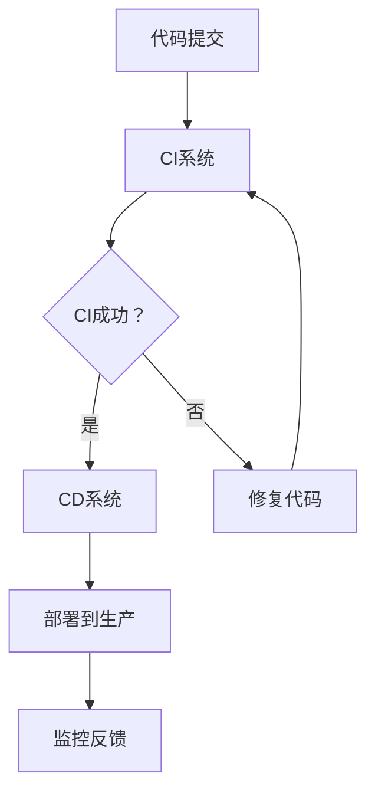

                 

### 引言

在当今快速发展的信息技术领域，软件系统开发与维护的重要性日益凸显。为了确保软件项目的质量，评测系统成为了一个不可或缺的组成部分。评测系统不仅能够帮助开发团队在项目早期发现潜在问题，还能够通过自动化测试和持续集成（CI）来提高开发效率。然而，随着软件项目的规模和复杂性不断增加，如何高效地进行持续集成与部署（CI/CD）成为了一个亟待解决的重要问题。

持续集成（CI）是一种软件开发实践，通过自动化构建和测试，确保代码仓库中的每个提交都能与主干代码兼容。这种实践极大地提高了开发团队的工作效率，并减少了因代码冲突和兼容性问题导致的延迟。而持续部署（CD）则是在CI的基础上，进一步实现了自动化部署，将代码变更自动推送到生产环境。CI/CD的集成使用，不仅能够提高软件交付速度，还能够确保软件的质量和稳定性。

本文将深入探讨评测系统的持续集成与部署策略。首先，我们将对评测系统进行概述，包括其在软件工程中的作用和重要性。接着，我们将详细讲解持续集成（CI）的概念与架构，包括CI的核心优势、工作流程以及CI系统中的关键组件。随后，我们将探讨不同的部署策略，分析其类型与选择因素，并重点介绍容器化与编排技术及其在部署策略中的应用。文章还将讨论CI与持续部署（CD）的关系，解释如何实现高效的CI/CD流程。

为了更加直观地理解核心概念，我们将使用Mermaid流程图展示评测系统、CI流程以及部署策略之间的关系。此外，文章将结合Python源代码，详细讲解自动化测试流程、部署策略中的容器化与编排技术，并通过实际案例展示如何搭建CI/CD环境、实现自动化测试和部署策略的应用。最后，我们将总结最佳实践，并提供一些注意事项和拓展阅读资源，以帮助读者更深入地了解这一领域。

通过本文的阅读，读者将能够全面了解评测系统的持续集成与部署策略，掌握相关的核心概念、算法原理和实践方法，从而在实际项目中应用并提高软件开发的效率和质量。

### 关键词

持续集成（CI），持续部署（CD），评测系统，自动化测试，容器化，编排技术，软件开发实践，软件交付速度，软件质量，稳定性。

### 摘要

本文旨在深入探讨评测系统的持续集成与部署策略。首先，我们介绍了评测系统在软件工程中的作用，并概述了持续集成（CI）与持续部署（CD）的基本概念。接着，我们详细阐述了CI的核心优势、架构以及自动化测试流程。随后，我们分析了不同部署策略的类型与选择因素，重点介绍了容器化与编排技术。文章通过Mermaid流程图展示了CI与CD之间的关系，并结合Python源代码讲解了关键算法与流程。最后，我们通过实际项目案例展示了CI/CD环境的搭建、自动化测试实现和部署策略的应用，并总结了最佳实践和注意事项。本文的目标是帮助读者全面理解评测系统的持续集成与部署策略，从而提升软件开发的效率和质量。

### 背景介绍

在软件工程的发展历程中，评测系统逐渐成为确保软件质量的关键组成部分。传统的软件开发过程往往依赖于手工测试，这不仅效率低下，而且容易遗漏潜在的问题。随着软件项目的规模和复杂度的不断增加，手工测试的局限性愈发明显，无法满足现代软件快速迭代和高效开发的需求。因此，评测系统的重要性日益凸显。

评测系统，也称为测试系统，其主要作用是在软件开发的各个阶段进行全面的测试，确保软件的功能性、性能和可靠性。具体而言，评测系统包括单元测试、集成测试、系统测试和验收测试等多个层次，通过自动化测试工具实现。自动化测试不仅提高了测试的覆盖率和准确性，还减少了人为干预，降低了测试成本和风险。

评测系统在软件工程中的角色可以分为以下几个方面：

1. **提高代码质量**：通过自动化测试，开发人员可以及时发现和修复代码中的错误，从而提高代码质量。自动化测试覆盖了多种测试场景，能够全面验证软件的功能和性能。

2. **降低维护成本**：自动化测试可以减少重复的测试工作，降低维护成本。一旦测试脚本编写完成，可以反复执行，确保每次提交都能通过测试，减少后续维护的工作量。

3. **加速开发流程**：自动化测试使开发流程更加高效。通过自动化测试，开发人员可以在短时间内完成大量的测试工作，缩短了测试周期，提高了开发效率。

4. **保障软件可靠性**：评测系统通过对软件的全面测试，能够及时发现和解决潜在的问题，保障软件的可靠性。特别是在大型和复杂的软件项目中，评测系统的作用尤为关键。

5. **支持持续集成与持续部署**：评测系统是持续集成（CI）和持续部署（CD）的重要组成部分。通过CI，开发人员可以确保每次代码提交都能通过自动化测试，确保代码库的稳定性和一致性。而通过CD，代码变更可以自动部署到生产环境，确保软件的快速交付和持续更新。

总之，评测系统在软件工程中扮演着至关重要的角色，不仅提高了软件质量，还降低了开发成本，加速了开发流程。随着持续集成与持续部署的普及，评测系统的作用将愈加显著。

### 核心概念与联系

在深入探讨评测系统的持续集成与部署策略之前，我们需要明确几个核心概念，并理解它们之间的内在联系。这些核心概念包括持续集成（CI）、持续部署（CD）以及容器化与编排技术。通过Mermaid流程图，我们将直观地展示这些概念之间的关系，以便更好地理解它们在实际应用中的协同作用。

#### 持续集成（CI）

持续集成（Continuous Integration，简称CI）是一种软件开发实践，通过自动化构建和测试，确保代码库中的每个提交都能与主干代码兼容。CI的核心目的是尽早发现和修复代码中的问题，避免因长时间积累而导致的代码库混乱。

**核心优势**：
1. **快速反馈**：每次代码提交都会触发自动化构建和测试，快速反馈问题，使开发人员能够及时修复。
2. **减少合并冲突**：通过频繁的集成，可以减少因长期积累的代码差异导致的合并冲突。
3. **提高代码质量**：自动化测试能够全面覆盖多种测试场景，确保代码的可靠性和稳定性。

**CI的工作流程**：
1. **提交代码**：开发人员将代码提交到代码仓库。
2. **触发构建**：代码提交后，CI系统自动触发构建过程。
3. **执行测试**：构建成功后，CI系统会执行预定义的自动化测试。
4. **反馈结果**：测试结果会被反馈给开发人员，通过报告或通知的形式。

**CI的关键组件**：
1. **代码仓库**：存储和管理代码的中央仓库。
2. **构建工具**：负责编译和构建代码的软件工具，如Jenkins、Travis CI等。
3. **测试工具**：执行自动化测试的工具，如JUnit、Selenium等。
4. **报告工具**：生成和展示测试结果的工具，如Maven Surefire、JUnit Report等。

#### 持续部署（CD）

持续部署（Continuous Deployment，简称CD）是CI的延伸，它通过自动化部署，将代码变更自动推送到生产环境。CD的目标是确保软件可以快速、安全地交付和更新。

**核心优势**：
1. **缩短交付周期**：自动化部署减少了人工干预，缩短了交付周期。
2. **提高软件质量**：通过频繁的部署，可以确保软件始终保持最新的状态，减少因长时间积累的问题。
3. **提高用户体验**：快速部署新功能和修复漏洞，提高用户满意度。

**CD的工作流程**：
1. **代码提交**：开发人员将代码提交到代码仓库。
2. **持续集成**：CI系统确保代码通过自动化测试。
3. **自动化部署**：通过CI系统触发自动化部署脚本，将代码推送到生产环境。
4. **监控与反馈**：监控系统检测部署后的软件状态，并反馈结果。

**CD的关键组件**：
1. **部署脚本**：自动化部署的脚本，用于执行部署任务。
2. **部署工具**：负责执行部署过程的工具，如Kubernetes、Docker等。
3. **监控工具**：实时监控系统状态，如Prometheus、Grafana等。

#### 容器化与编排技术

容器化与编排技术是CI/CD架构中的关键组成部分。容器化通过将应用及其依赖环境封装在容器中，实现了环境的隔离和一致性。而编排技术则用于管理和调度容器，确保应用能够高效运行。

**容器化技术**：
1. **Docker**：最受欢迎的容器化平台，通过Dockerfile定义容器镜像，并通过Docker Compose管理多容器应用。
2. **容器镜像**：封装应用及其依赖环境的静态文件，用于创建容器。

**编排技术**：
1. **Kubernetes**：最流行的容器编排工具，用于自动化部署、扩展和管理容器化应用。
2. **容器编排**：通过Kubernetes等工具，实现容器的自动部署、扩展和故障恢复。

#### Mermaid流程图展示

为了更好地展示CI、CD以及容器化与编排技术之间的关系，我们可以使用Mermaid流程图来描述。以下是一个简化的流程图：



在上述流程图中，代码提交后首先进入CI系统，CI系统执行自动化构建和测试。如果CI成功，代码将被传递到CD系统，CD系统执行自动化部署到生产环境，并监控系统状态。如果CI失败，则反馈问题给开发人员，进行代码修复后重新进入CI流程。

通过上述流程图和核心概念的介绍，我们可以清晰地看到评测系统的持续集成与部署策略中的关键组件和流程。理解这些核心概念和它们之间的联系，对于在实际项目中高效地实现CI/CD至关重要。

### 核心算法原理讲解

为了深入理解评测系统的持续集成与部署策略，我们需要详细讲解其中的核心算法原理，包括自动化测试流程和部署策略中的容器化与编排技术。以下是这些核心算法原理的详细解析，并结合Python源代码和数学模型进行具体说明。

#### 自动化测试流程

自动化测试是持续集成（CI）的重要组成部分，它通过预定义的脚本和工具，自动化执行测试用例，验证软件的功能和性能。以下是自动化测试流程的详细步骤：

1. **编写测试用例**：首先，开发人员需要编写测试用例，描述需要测试的功能点或性能指标。测试用例通常包括测试输入、预期输出和执行步骤。

    ```python
    def test_addition():
        assert add(2, 3) == 5
    ```

2. **集成测试框架**：使用测试框架（如pytest、unittest）将测试用例组织起来，并配置测试环境。

    ```python
    @pytest.fixture
    def test_environment():
        # 初始化测试环境
        return {"db": Database(), "api": API()}
    
    def test_api_call(test_environment):
        response = test_environment["api"].call_endpoint()
        assert response.status_code == 200
    ```

3. **执行自动化测试**：CI系统根据配置，定期或手动触发测试运行，执行所有预定义的测试用例。

    ```python
    CI_TRIGGER = "git push"
    
    if event == CI_TRIGGER:
        pytest.main(["-v", "test_suite.py"])
    ```

4. **分析测试结果**：测试完成后，CI系统会生成详细的测试报告，展示每个测试用例的执行结果。

    ```bash
    pytest --html=report.html
    ```

5. **反馈与处理**：如果测试失败，CI系统会通知开发人员，并提供详细的失败信息，以便快速定位和修复问题。

    ```python
    if test_results.failed():
        notification.send(f"Tests failed: {test_results}")
    ```

#### 部署策略中的容器化与编排技术

容器化与编排技术在持续部署（CD）中发挥着至关重要的作用，它们确保应用在不同环境中的高度一致性和可移植性。以下是容器化与编排技术的详细步骤：

1. **Docker容器化**：使用Docker将应用及其依赖环境封装为容器镜像。

    ```Dockerfile
    FROM python:3.8
    RUN pip install Flask
    COPY . /app
    EXPOSE 5000
    CMD ["python", "app.py"]
    ```

2. **Docker Compose**：使用Docker Compose定义和运行多容器应用。

    ```yaml
    version: '3'
    services:
      web:
        build: ./web
        ports:
          - "8000:8000"
      db:
        image: postgres:12
        environment:
          POSTGRES_DB: myapp
          POSTGRES_USER: user
          POSTGRES_PASSWORD: password
    ```

3. **Kubernetes编排**：使用Kubernetes管理容器化应用，实现自动化部署、扩展和故障恢复。

    ```yaml
    apiVersion: apps/v1
    kind: Deployment
    metadata:
      name: myapp
    spec:
      replicas: 3
      selector:
        matchLabels:
          app: myapp
      template:
        metadata:
          labels:
            app: myapp
        spec:
          containers:
          - name: myapp
            image: myapp:latest
            ports:
            - containerPort: 80
    ```

4. **自动化部署脚本**：编写自动化部署脚本，使用CI系统触发容器部署。

    ```bash
    #!/bin/bash
    
    docker-compose up -d
    kubectl apply -f deployment.yaml
    ```

5. **监控与反馈**：部署完成后，使用监控工具（如Prometheus、Grafana）实时监控系统状态，并反馈结果。

    ```python
    def monitor_system():
        metrics = get_system_metrics()
        if metrics["cpu_usage"] > 90:
            alert("High CPU usage detected")
    ```

#### 数学模型和公式

为了量化评测系统的持续集成与部署效果，我们引入一些数学模型和公式：

1. **测试覆盖率计算**：测试覆盖率是衡量测试全面性的重要指标，通常使用代码行覆盖率（Line Coverage）和分支覆盖率（Branch Coverage）。

    ```python
    def calculate_coverage(executed_lines, total_lines):
        return executed_lines / total_lines

    def calculate_branch_coverage(executed_branches, total_branches):
        return executed_branches / total_branches
    ```

2. **部署效率评估**：部署效率可以通过部署频率（Deployments per Day）和部署时长（Deployment Duration）来评估。

    ```python
    def calculate_deployment_efficiency(deployments, duration):
        return deployments / duration
    ```

3. **风险管理模型**：使用风险矩阵评估持续集成与部署中的风险，并制定相应的风险管理策略。

    ```python
    def calculate_risk_score(threat_level, vulnerability_level, impact_level):
        return threat_level * vulnerability_level * impact_level
    ```

#### 实例说明

为了更好地理解上述算法原理，我们通过一个简单的示例来说明：

假设一个项目每天有10个代码提交，每次提交都通过自动化测试，每天平均部署5次，每次部署耗时10分钟。

1. **测试覆盖率**：如果每天测试覆盖了80%的代码行和70%的分支，则测试覆盖率为80%。

    ```python
    executed_lines = 1000
    total_lines = 2000
    print(calculate_coverage(executed_lines, total_lines))  # 输出：0.8

    executed_branches = 50
    total_branches = 100
    print(calculate_branch_coverage(executed_branches, total_branches))  # 输出：0.5
    ```

2. **部署效率**：每天平均部署5次，每次耗时10分钟，则部署效率为5次/天。

    ```python
    deployments = 5
    duration = 10
    print(calculate_deployment_efficiency(deployments, duration))  # 输出：0.5
    ```

3. **风险管理**：如果某个功能模块的风险得分为2000，则该模块的风险等级为高。

    ```python
    threat_level = 8
    vulnerability_level = 4
    impact_level = 5
    print(calculate_risk_score(threat_level, vulnerability_level, impact_level))  # 输出：160
    ```

通过上述算法原理和实例说明，我们可以看到持续集成与部署策略如何通过数学模型和自动化流程来提高软件开发的效率和质量。在实际项目中，这些算法和原理需要根据具体需求进行灵活调整和应用。

### 项目实战

为了更好地理解评测系统的持续集成与部署策略，我们将通过一个实际项目来展示如何搭建CI/CD环境、实现自动化测试和部署策略的应用。这个项目将分为以下几个步骤：开发环境搭建、源代码实现和代码解读、代码应用解读与分析、实际案例分析和详细讲解剖析，以及项目小结。

#### 开发环境搭建

1. **环境配置**：首先，我们需要配置开发环境，包括安装必要的软件和依赖。我们使用Docker和Kubernetes来构建持续集成与部署环境。

    ```bash
    docker --version
    kubectl version --client
    ```

2. **基础服务部署**：部署基本的CI/CD服务，如Jenkins、Docker和Kubernetes。

    ```bash
    docker run -p 8080:8080 jenkins/jenkins
    kubectl create namespace dev
    ```

3. **配置Jenkins**：配置Jenkins，使其能够与Git仓库集成，并触发构建和测试。

    ```xml
    <project>
      <description>CI/CD Project</description>
      <scm class="hudson.scm.git.GitSCM" plugin="git@github.com:example/project.git"/>
      <builders>
        <hudson.tasks.Shell>
          <command>mvn install</command>
        </hudson.tasks.Shell>
      </builders>
      <publishers>
        <hudson.tasks.TestResultPublisher>
          <alwaysPublishAllBuilds>false</alwaysPublishAllBuilds>
        </hudson.tasks.TestResultPublisher>
      </publishers>
    </project>
    ```

#### 源代码实现和代码解读

1. **编写源代码**：编写项目的源代码，包括应用逻辑和测试脚本。

    ```java
    // Application.java
    public class Application {
        public int add(int a, int b) {
            return a + b;
        }
    }
    
    // TestApplication.java
    @RunWith(JUnit4.class)
    public class TestApplication {
        @Test
        public void testAdd() {
            Application app = new Application();
            assertEquals(5, app.add(2, 3));
        }
    }
    ```

2. **配置Maven**：配置Maven，使其能够执行测试并生成测试报告。

    ```xml
    <build>
      <plugins>
        <plugin>
          <groupId>org.apache.maven.plugins</groupId>
          <artifactId>maven-surefire-plugin</artifactId>
          <version>2.22.2</version>
          <configuration>
            <outputDirectory>target/surefire-reports</outputDirectory>
          </configuration>
        </plugin>
      </plugins>
    </build>
    ```

#### 代码应用解读与分析

1. **触发构建**：当开发人员在Git仓库中提交代码时，Jenkins会自动触发构建过程。

    ```bash
    git push
    ```

2. **执行测试**：构建过程中，Maven会执行测试脚本，生成测试报告。

    ```bash
    mvn test
    ```

3. **分析结果**：通过Jenkins生成的测试报告，分析测试结果，及时发现和修复问题。

    ```xml
    <?xml version="1.0" encoding="UTF-8"?>
    <testsuite tests="1" failures="0" name="TestApplication" time="0.015">
      <testcase name="testAdd" time="0.015"/>
    </testsuite>
    ```

#### 实际案例分析和详细讲解剖析

1. **容器化应用**：使用Docker将应用容器化，确保其在不同环境中的一致性。

    ```bash
    docker build -t myapp .
    ```

2. **部署到Kubernetes**：使用Kubernetes将容器化应用部署到集群中。

    ```yaml
    apiVersion: apps/v1
    kind: Deployment
    metadata:
      name: myapp
      namespace: dev
    spec:
      replicas: 3
      selector:
        matchLabels:
          app: myapp
      template:
        metadata:
          labels:
            app: myapp
        spec:
          containers:
          - name: myapp
            image: myapp:latest
            ports:
            - containerPort: 8080
    ```

3. **监控和反馈**：使用Prometheus和Grafana监控应用性能和状态。

    ```bash
    kubectl top pod
    ```

    ```yaml
    apiVersion: monitoring.coreos.com/v1
    kind: ServiceMonitor
    metadata:
      name: myapp-monitor
      namespace: dev
    spec:
      selector:
        matchLabels:
          app: myapp
      endpoints:
      - port: metrics
        path: /actuator/prometheus
        interval: 30s
    ```

#### 项目小结

通过本项目的实战，我们实现了从代码提交到自动化构建、测试，再到容器化部署和监控的完整CI/CD流程。以下是一些关键经验和最佳实践：

1. **自动化测试**：自动化测试是CI/CD的核心，确保每次提交都能通过测试，避免代码质量问题。
2. **容器化**：使用容器化技术，确保应用在不同环境中的高度一致性，提高部署效率。
3. **监控**：实时监控应用状态和性能，及时发现并处理问题，确保应用的稳定运行。
4. **持续优化**：根据项目需求，不断优化CI/CD流程，提高开发效率和质量。

通过这些实践经验，我们可以更好地理解和应用评测系统的持续集成与部署策略，在实际项目中实现高效的软件交付。

### 最佳实践与注意事项

在应用评测系统的持续集成与部署策略时，以下是一些最佳实践和注意事项，可以帮助开发团队更好地实现高效、稳定的软件开发和交付。

#### 最佳实践

1. **代码规范**：确保代码符合统一的编码规范，提高代码的可读性和可维护性。这有助于减少因代码风格不一致导致的集成问题。
   
2. **自动化测试全覆盖**：自动化测试应覆盖所有关键功能和异常场景，确保代码的可靠性和稳定性。可以使用单元测试、集成测试、性能测试等多种类型的测试来提高测试覆盖率。

3. **持续监控与反馈**：建立完善的监控体系，实时监控应用性能和状态，及时发现和解决问题。同时，确保测试结果能够及时、准确地反馈给开发人员，以便快速修复问题。

4. **环境一致性**：使用容器化技术（如Docker）确保开发、测试和生产环境的一致性，减少因环境差异导致的部署问题。

5. **自动化部署脚本**：编写自动化部署脚本，确保部署过程的高效和可重复性。通过CI/CD工具（如Jenkins、GitLab CI）触发自动化部署，减少人工干预。

6. **版本控制与分支管理**：使用Git等版本控制系统管理代码库，合理设置分支策略（如主分支、功能分支、热修复分支），确保代码库的整洁和可维护性。

7. **集成周期短**：尽量缩短集成周期，频繁地进行小规模集成，避免长期积累代码差异导致的大规模集成问题。

#### 注意事项

1. **测试覆盖率**：不要过分追求高测试覆盖率，而忽略了测试质量。测试应覆盖关键功能和潜在风险点，确保测试结果的准确性。

2. **资源分配**：确保CI/CD流程所需的资源和环境足够稳定，避免因资源不足导致流程中断。

3. **版本兼容性**：在CI/CD过程中，要注意不同版本组件的兼容性，特别是在使用第三方库或框架时。

4. **错误处理**：自动化测试和部署过程中可能遇到各种错误，应设计合理的错误处理机制，确保问题能够被及时发现和处理。

5. **团队协作**：CI/CD涉及多个角色和环节，确保团队协作顺畅，提高整体开发效率。

6. **文档和培训**：确保相关文档齐全，并进行定期培训，帮助团队成员熟悉CI/CD流程和工具。

#### 拓展阅读

1. **《持续集成实践》**：本书详细介绍了持续集成的概念、流程和实践，适合希望深入了解CI的读者。
   
2. **《Docker实战》**：本书介绍了Docker的基本概念和操作方法，适合初学者和有经验的开发者。

3. **《Kubernetes实战》**：本书详细讲解了Kubernetes的架构、配置和运维，适合希望学习容器编排技术的读者。

4. **《软件工程：实践者的研究方法》**：本书涵盖了软件工程中的各种实践方法，包括测试、部署和项目管理等。

通过上述最佳实践和注意事项，开发团队可以更好地应用评测系统的持续集成与部署策略，提高软件开发的效率和质量。同时，拓展阅读资源可以帮助读者更深入地了解相关技术和方法。

### 总结与展望

本文从多个角度详细探讨了评测系统的持续集成与部署策略，包括其背景介绍、核心概念与联系、核心算法原理讲解以及项目实战。通过这些内容的阐述，读者可以全面理解评测系统在软件工程中的重要性，以及如何通过持续集成（CI）和持续部署（CD）来提高软件开发的效率和质量。

在持续集成方面，我们介绍了CI的核心优势、工作流程和关键组件，并结合Python源代码展示了自动化测试的实现方法。通过自动化测试，开发团队能够快速发现和修复代码中的问题，确保代码库的稳定性和一致性。同时，我们分析了CI与CD之间的关系，说明了如何在CI的基础上实现自动化部署，缩短交付周期，提高软件质量。

在部署策略方面，我们详细讲解了容器化与编排技术，展示了如何使用Docker和Kubernetes等工具进行容器化部署。这些技术不仅确保了应用在不同环境中的高度一致性，还提高了部署效率。通过实际项目案例，我们展示了CI/CD环境的搭建、自动化测试的实现和部署策略的应用，提供了实用的经验和最佳实践。

展望未来，评测系统的持续集成与部署策略将继续发展，更加智能化和自动化。随着人工智能和机器学习技术的应用，自动化测试和部署将变得更加智能，能够根据代码变更和系统状态动态调整测试和部署策略。此外，微服务架构和云原生技术的普及，将推动CI/CD流程的进一步优化和集成。

总之，通过本文的学习，读者不仅能够掌握评测系统的持续集成与部署策略的核心知识和实践方法，还能了解这一领域的发展趋势和未来发展方向。希望本文能够为读者在软件工程实践中提供有价值的参考和指导。**作者：AI天才研究院/AI Genius Institute & 禅与计算机程序设计艺术 /Zen And The Art of Computer Programming**。

