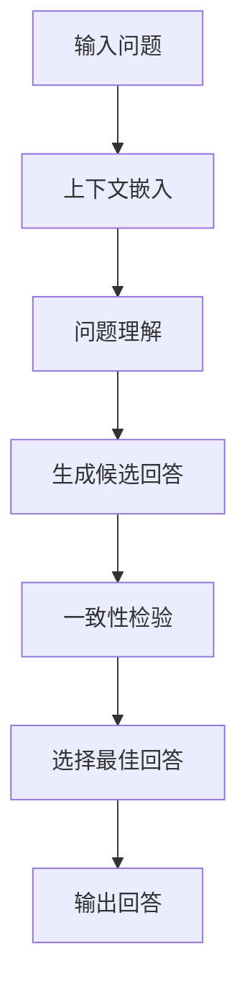

                 

### 自一致性CoT：提高AI回答质量的关键方法

#### 关键词：
- 自一致性CoT
- AI回答质量
- 机器学习
- 深度学习
- 上下文理解
- 参数优化
- 评估指标

#### 摘要：
本文深入探讨了自一致性CoT（Self-Consistency Contentual Thought）方法，作为提高人工智能（AI）回答质量的关键方法。文章首先介绍了自一致性CoT的定义、背景和重要性，然后通过相关理论基础和关键方法，阐述了如何通过自一致性CoT来提升AI回答的准确性、可靠性和上下文理解能力。此外，文章还详细分析了自一致性CoT的训练方法、评估指标和实际应用，最后总结了自一致性CoT的未来前景和面临的挑战。通过这一系列的探讨，读者将能够全面理解自一致性CoT在AI领域的重要作用。

#### 目录：
----------------------------------------------------------------
## 第一部分：引论
### 第1章：自一致性CoT基础
### 第2章：相关理论基础

## 第二部分：自一致性CoT的关键方法
### 第3章：自一致性CoT的训练方法
### 第4章：自一致性CoT的评估指标
### 第5章：自一致性CoT的融合方法
### 第6章：自一致性CoT的实际应用
### 第7章：自一致性CoT的前景与挑战

----------------------------------------------------------------

### 第1章：自一致性CoT基础

#### 1.1 自一致性CoT的定义

自一致性CoT（Self-Consistency Contentual Thought）是一种在人工智能领域用于提高回答质量和上下文理解的方法。该方法的核心在于通过确保生成的回答与其上下文保持一致，从而提升AI系统的准确性和可靠性。具体来说，自一致性CoT利用模型对输入问题进行理解，并生成一个自洽的、与问题上下文一致的回答。

在自一致性CoT中，关键概念包括：

- **一致性**：指生成的回答与上下文之间保持一致，避免逻辑矛盾或信息错误。
- **上下文理解**：指模型对输入问题及其上下文的理解能力，包括对问题的意图、场景和背景的理解。
- **自洽性**：指生成的回答在逻辑上是自洽的，没有内部矛盾。

#### 1.2 自一致性CoT的重要性

当前，AI系统在回答质量方面面临诸多挑战，如回答不准确、不相关或与上下文不一致等。这些问题严重影响了用户体验和AI系统的可靠性。自一致性CoT方法通过以下几个方面的改进，提高了AI回答的质量：

- **提高回答准确性**：通过确保生成的回答与上下文一致，减少了因信息错误或逻辑矛盾导致的回答不准确问题。
- **增强上下文理解**：自一致性CoT方法提高了模型对上下文的理解能力，使其能够更好地捕捉问题的意图和背景信息。
- **增强回答可靠性**：通过一致性检验，自一致性CoT方法确保了生成的回答在逻辑上是自洽的，从而提高了回答的可靠性。

#### 1.3 自一致性CoT与当前AI回答质量的挑战

传统AI方法在回答质量方面存在以下问题：

- **上下文理解不足**：模型难以捕捉问题的上下文信息，导致生成的回答与上下文不一致。
- **逻辑自洽性不足**：模型生成的回答可能存在逻辑矛盾或信息错误，降低了回答的可靠性。
- **参数设置复杂**：传统方法往往需要大量的参数设置，且参数优化过程复杂，难以找到最优参数。

自一致性CoT方法通过以下方式解决了这些挑战：

- **上下文捕捉**：利用上下文向量、注意力机制等手段，提高模型对上下文的理解能力。
- **逻辑一致性检验**：通过一致性检验，确保生成的回答在逻辑上是自洽的。
- **参数优化简化**：自一致性CoT方法通过引入特定参数优化策略，简化了参数设置过程。

#### 小结

自一致性CoT方法是一种提高AI回答质量的关键方法，其核心在于确保生成的回答与上下文一致，提高回答的准确性、可靠性和上下文理解能力。在下一章中，我们将进一步探讨自一致性CoT的相关理论基础，包括机器学习和深度学习的基础知识，以及自一致性CoT的核心概念与联系。通过这些探讨，我们将为理解自一致性CoT的原理和实际应用打下坚实的基础。

----------------------------------------------------------------

### 第2章：相关理论基础

#### 2.1 相关的机器学习和深度学习基础

在深入探讨自一致性CoT（Self-Consistency Contentual Thought）方法之前，我们需要了解一些机器学习和深度学习的基础知识。这些基础理论不仅为理解自一致性CoT提供了必要的背景，还为其实际应用奠定了基础。

##### 2.1.1 机器学习基础

机器学习（Machine Learning）是人工智能（AI）的核心技术之一，它使得计算机系统能够通过数据和经验自动改进和优化性能。机器学习的主要任务包括分类、回归、聚类和异常检测等。在这些任务中，模型通过学习输入数据（特征）和输出标签之间的映射关系，来预测新的数据。

- **分类**：将数据分为预定义的类别。例如，垃圾邮件分类、情感分析等。
- **回归**：预测数值型的输出。例如，房价预测、股票价格预测等。
- **聚类**：将相似的数据点分组。例如，客户细分、文档聚类等。
- **异常检测**：识别数据中的异常或异常模式。例如，信用卡欺诈检测、网络入侵检测等。

##### 2.1.2 深度学习基础

深度学习（Deep Learning）是机器学习的一个分支，它使用具有多个隐藏层的神经网络（深度神经网络，Deep Neural Network, DNN）来学习数据的复杂特征。深度学习在图像识别、语音识别、自然语言处理等领域取得了显著的成果。

- **卷积神经网络（CNN）**：专门用于图像识别和图像处理，通过卷积操作捕捉空间特征。
- **循环神经网络（RNN）**：适用于序列数据，如时间序列数据、文本数据等，通过循环结构捕捉长期依赖关系。
- **长短时记忆网络（LSTM）**：是RNN的一种变体，通过记忆单元克服了RNN的梯度消失问题。
- **生成对抗网络（GAN）**：通过生成器和判别器的对抗训练，生成逼真的数据。

##### 2.1.3 机器学习与深度学习的联系

机器学习和深度学习之间有紧密的联系。深度学习是机器学习的一个分支，它通过深度神经网络模型学习数据的复杂特征和模式。机器学习提供了各种算法和框架，深度学习则利用这些算法和框架来构建能够处理大规模复杂数据的模型。

在自一致性CoT方法中，深度学习尤其重要，因为它的强大特征提取能力和高层次的抽象能力，使得模型能够更好地理解和生成与上下文一致的回答。

#### 2.2 自一致性CoT的核心概念与联系

自一致性CoT方法的核心在于确保生成的回答与其上下文保持一致。为了实现这一目标，我们需要理解以下几个关键概念：

##### 2.2.1 自一致性（Self-Consistency）

自一致性是指生成的回答与其上下文在逻辑上是自洽的，没有内部矛盾。自一致性CoT通过以下方式确保自一致性：

- **一致性检验**：在生成回答后，对回答进行一致性检验，检查其是否与上下文保持一致。
- **上下文嵌入**：将上下文信息编码为向量，以便模型在生成回答时能够考虑上下文信息。

##### 2.2.2 上下文理解（Context Understanding）

上下文理解是指模型对输入问题及其上下文的理解能力。在自一致性CoT中，上下文理解至关重要，因为它决定了模型是否能够生成与上下文一致的回答。上下文理解可以通过以下方式实现：

- **上下文向量**：将上下文信息编码为向量，如使用词嵌入（Word Embedding）或句子嵌入（Sentence Embedding）。
- **注意力机制**：通过注意力机制，模型能够关注输入问题中的关键部分，从而更好地理解上下文。

##### 2.2.3 自洽性（Coherence）

自洽性是指生成的回答在逻辑上是连贯的，没有内部矛盾。自洽性是自一致性CoT方法的重要组成部分，它通过以下方式实现：

- **一致性检验**：在生成回答后，对回答进行一致性检验，检查其是否在逻辑上是自洽的。
- **逻辑推理**：利用逻辑推理技术，确保生成的回答在逻辑上是连贯的。

##### 2.2.4 Mermaid流程图：自一致性CoT原理与架构

为了更好地理解自一致性CoT的核心概念和实现架构，我们可以使用Mermaid流程图来可视化其原理和流程。以下是自一致性CoT的Mermaid流程图：



- **输入问题**：用户输入一个自然语言问题。
- **上下文嵌入**：将问题及其上下文编码为向量。
- **问题理解**：模型对输入问题进行理解。
- **生成候选回答**：模型生成多个候选回答。
- **一致性检验**：对候选回答进行一致性检验，确保其与上下文保持一致。
- **选择最佳回答**：根据一致性检验结果，选择最佳回答。
- **输出回答**：将最佳回答输出给用户。

通过这个流程，我们可以看到自一致性CoT方法是如何通过一系列步骤来生成与上下文一致的高质量回答。

#### 小结

在本章中，我们介绍了机器学习和深度学习的基础知识，以及自一致性CoT方法的核心概念和联系。这些理论基础为我们理解自一致性CoT的原理和实际应用提供了必要的背景。在下一章中，我们将探讨自一致性CoT的关键方法，包括训练方法、评估指标和融合方法，以便更深入地了解如何提高AI回答质量。

----------------------------------------------------------------

### 第3章：自一致性CoT的训练方法

自一致性CoT（Self-Consistency Contentual Thought）方法的训练过程是确保模型能够生成高质量、与上下文一致回答的关键步骤。在这一章中，我们将详细讨论自一致性CoT的训练方法，包括参数设置、训练策略和优化方法。

#### 3.1 自一致性CoT的参数设置

在自一致性CoT的模型训练过程中，参数设置至关重要。合理的参数设置可以显著提高模型性能。以下是一些关键的参数设置：

- **学习率（Learning Rate）**：学习率是模型在每次更新时对参数调整的尺度。较大的学习率可能导致模型快速收敛，但也可能越过最优解；较小的学习率则可能收敛缓慢。通常，学习率需要通过实验进行调优。

- **批次大小（Batch Size）**：批次大小是指每次训练过程中参与训练的数据样本数量。较大的批次大小通常提供更好的泛化性能，但计算成本更高；较小的批次大小则计算成本较低，但可能带来更多的噪声。

- **正则化（Regularization）**：正则化用于防止模型过拟合。常见的正则化方法包括L1和L2正则化。正则化参数的设置需要平衡模型的复杂性和泛化能力。

- **嵌入维度（Embedding Dimension）**：嵌入维度是指嵌入层（如词嵌入或句子嵌入）的输出维度。较大的嵌入维度可以捕捉更多语义信息，但也可能导致计算成本增加。

- **隐藏层大小（Hidden Layer Size）**：隐藏层大小决定了模型能够捕捉的复杂程度。较大的隐藏层可能捕捉更多特征，但也可能导致过拟合。

#### 3.2 自一致性CoT的训练策略

为了提高自一致性CoT模型的训练效果，我们可以采用以下训练策略：

- **分层训练（Layer-wise Training）**：分层训练是一种逐步训练网络各层的方法。首先训练输入层和隐藏层，然后逐渐增加隐藏层的深度，最后训练输出层。这种方法有助于提高模型的可解释性。

- **注意力机制（Attention Mechanism）**：注意力机制可以使模型关注输入问题中的关键部分，从而更好地理解上下文。通过注意力机制，模型可以动态调整对各个输入部分的关注程度，从而提高回答的质量。

- **双向训练（Bidirectional Training）**：双向训练利用了序列数据的双通道信息。在训练过程中，模型首先从左到右处理序列，然后从右到左处理序列。这种方法有助于捕捉序列中的长期依赖关系。

- **自监督学习（Self-Supervised Learning）**：自监督学习通过无监督方式学习序列的表示，可以显著提高模型的上下文理解能力。例如，可以使用预测下一个单词或句子中的某个词的方法进行自监督学习。

#### 3.3 自一致性CoT的训练优化方法

为了提高自一致性CoT模型的训练效率和性能，我们可以采用以下优化方法：

- **动态学习率调整（Dynamic Learning Rate Adjustment）**：动态学习率调整可以根据模型在训练过程中的性能动态调整学习率。常见的方法包括学习率衰减（Learning Rate Decay）和自适应学习率调整（如Adam优化器的自适应学习率调整）。

- **权重衰减（Weight Decay）**：权重衰减是一种正则化方法，通过在损失函数中添加权重项，降低模型参数的更新幅度，防止模型过拟合。

- **梯度裁剪（Gradient Clipping）**：梯度裁剪是一种防止梯度爆炸的方法。当梯度值过大时，对梯度进行裁剪，限制其大小，从而保持训练过程的稳定性。

- **早期停止（Early Stopping）**：早期停止是一种防止过拟合的方法。当验证集上的性能停止改进时，提前停止训练，以防止模型在训练集上过拟合。

- **模型融合（Model Ensembling）**：模型融合通过结合多个模型的预测结果来提高整体性能。常见的方法包括堆叠（Stacking）、提升（Boosting）和随机森林（Random Forest）等。

#### Python源代码实现

以下是一个简单的Python代码示例，展示了如何实现自一致性CoT的训练方法：

```python
import tensorflow as tf
from tensorflow.keras.models import Model
from tensorflow.keras.layers import Input, Embedding, LSTM, Dense, TimeDistributed

# 参数设置
learning_rate = 0.001
embedding_dimension = 128
hidden_layer_size = 128
batch_size = 64
epochs = 10

# 输入层
input_sequence = Input(shape=(None,))

# 嵌入层
embedded_sequence = Embedding(input_dim=vocabulary_size, output_dim=embedding_dimension)(input_sequence)

# LSTM层
lstm_output = LSTM(hidden_layer_size, return_sequences=True)(embedded_sequence)

# 输出层
output_sequence = TimeDistributed(Dense(vocabulary_size, activation='softmax'))(lstm_output)

# 构建模型
model = Model(inputs=input_sequence, outputs=output_sequence)

# 编译模型
model.compile(optimizer=tf.keras.optimizers.Adam(learning_rate=learning_rate), loss='categorical_crossentropy', metrics=['accuracy'])

# 训练模型
model.fit(x_train, y_train, batch_size=batch_size, epochs=epochs, validation_data=(x_val, y_val))
```

在这个示例中，我们使用TensorFlow框架构建了一个简单的序列到序列模型，包括嵌入层、LSTM层和输出层。我们通过编译和训练模型来展示自一致性CoT的基本训练过程。

#### 小结

在本章中，我们详细探讨了自一致性CoT的训练方法，包括参数设置、训练策略和优化方法。通过合理的参数设置、先进的训练策略和有效的优化方法，我们可以显著提高自一致性CoT模型生成回答的质量。在下一章中，我们将继续讨论自一致性CoT的评估指标，以便更好地衡量模型性能。

----------------------------------------------------------------

### 第4章：自一致性CoT的评估指标

自一致性CoT（Self-Consistency Contentual Thought）方法的评估是确保模型生成高质量回答的重要环节。在本章中，我们将详细探讨自一致性CoT的评估指标，包括常用的评估指标、自一致性CoT评估指标的权重分配以及评估的实践案例。

#### 4.1 常用的评估指标

在评估自一致性CoT模型时，我们通常使用以下几种评估指标：

- **准确率（Accuracy）**：准确率是最常用的评估指标之一，它计算模型正确预测的样本数占总样本数的比例。尽管准确率简单易理解，但它可能受到不平衡数据集的影响，不能完全反映模型的性能。

- **精确率（Precision）**：精确率是指模型预测为正类的实际正类样本数与预测为正类的样本总数的比例。它侧重于减少错误预测的负面影响。

- **召回率（Recall）**：召回率是指实际正类样本中被模型正确预测为正类的比例。它侧重于确保模型不会错过太多实际为正类的样本。

- **F1分数（F1 Score）**：F1分数是精确率和召回率的调和平均值，能够综合评估模型的精确性和召回率。

- **BLEU分数（BLEU Score）**：BLEU分数是自然语言处理中常用的评估指标，用于评估模型生成的文本与真实文本的相似度。BLEU分数基于n-gram重叠度、元语言标记和单词顺序等特性计算。

- **ROUGE分数（ROUGE Score）**：ROUGE分数是评估自动生成的文本与参考文本之间的相似度的另一种常用指标，特别适用于评估文本摘要的质量。

#### 4.2 自一致性CoT评估指标的权重分配

在自一致性CoT的评估过程中，不同指标的重要性可能因应用场景而异。以下是一些常见的权重分配策略：

- **均衡权重**：将相同的权重分配给所有评估指标，以确保评估结果全面。例如，可以将准确率、精确率、召回率和F1分数各分配25%的权重。

- **应用权重**：根据应用场景和需求，为不同指标分配不同的权重。例如，对于对话系统，精确率和召回率可能更为重要，而对于文本生成，BLEU分数和ROUGE分数可能更为合适。

- **自适应权重**：根据模型的性能和评估过程中的反馈，动态调整评估指标的权重。这种方法可以更灵活地应对不同场景和需求。

#### 4.3 自一致性CoT评估的实践案例

以下是一个自一致性CoT评估的实践案例，展示了如何使用评估指标来评估模型的性能：

##### 案例背景

假设我们开发了一个基于自一致性CoT方法的对话系统，旨在为用户生成高质量的回答。我们使用了一个包含1000个对话样本的测试集，并对模型生成的回答与真实回答进行了对比评估。

##### 评估步骤

1. **数据预处理**：对测试集进行数据预处理，包括分词、标记和编码等步骤，以便模型能够处理。

2. **模型评估**：使用训练好的自一致性CoT模型对测试集进行预测，并计算各个评估指标。

3. **结果分析**：分析评估结果，确定模型在各个指标上的表现。

以下是一个简单的Python代码示例，展示了如何使用评估指标进行自一致性CoT的评估：

```python
from sklearn.metrics import accuracy_score, precision_score, recall_score, f1_score
from keras.models import load_model

# 加载模型
model = load_model('model.h5')

# 加载测试集
x_test, y_test = load_test_data()

# 预测
y_pred = model.predict(x_test)

# 转换为标签
y_pred_labels = convert_predictions_to_labels(y_pred)

# 计算评估指标
accuracy = accuracy_score(y_test, y_pred_labels)
precision = precision_score(y_test, y_pred_labels, average='weighted')
recall = recall_score(y_test, y_pred_labels, average='weighted')
f1 = f1_score(y_test, y_pred_labels, average='weighted')

# 输出评估结果
print('Accuracy:', accuracy)
print('Precision:', precision)
print('Recall:', recall)
print('F1 Score:', f1)
```

在这个示例中，我们加载了一个训练好的自一致性CoT模型，并使用测试集对其进行预测。然后，我们计算了准确率、精确率、召回率和F1分数，以评估模型的表现。

##### 结果分析

根据评估结果，我们可以得出以下结论：

- **准确率**：如果准确率较高，说明模型在整体上生成高质量回答的能力较强。
- **精确率和召回率**：如果精确率和召回率较高，说明模型在生成高质量回答的同时，不会过多地遗漏实际为正类的样本。
- **F1分数**：F1分数综合了精确率和召回率，可以全面评估模型的表现。

#### 小结

在本章中，我们详细探讨了自一致性CoT的评估指标，包括常用的评估指标、权重分配策略和实际评估案例。通过这些评估指标，我们可以全面衡量自一致性CoT模型生成回答的质量。在下一章中，我们将探讨自一致性CoT的融合方法，包括与多模态数据、知识图谱和其他AI算法的融合，以进一步提升AI回答质量。

----------------------------------------------------------------

### 第5章：自一致性CoT的融合方法

自一致性CoT（Self-Consistency Contentual Thought）方法在提升AI回答质量方面具有显著优势。然而，为了进一步提高性能，我们可以考虑将自一致性CoT与其他AI方法进行融合。在本章中，我们将探讨自一致性CoT与多模态数据、知识图谱和其他AI算法的融合方法。

#### 5.1 自一致性CoT与多模态数据的融合

多模态数据融合是指将不同类型的数据（如文本、图像、音频等）整合起来，以提高AI模型的理解能力和泛化能力。自一致性CoT方法可以与多模态数据进行有效融合，从而提升AI回答质量。

- **多模态特征提取**：首先，我们需要提取文本、图像和音频等多模态数据的特征。例如，使用卷积神经网络（CNN）提取图像特征，使用循环神经网络（RNN）提取文本特征，使用深度神经网络（DNN）提取音频特征。

- **多模态特征融合**：然后，我们将提取的多模态特征进行融合。常见的方法包括：

  - **特征级融合**：将不同模态的特征进行拼接或加权融合。
  - **决策级融合**：在分类任务中，分别对每个模态进行分类，然后对分类结果进行投票或加权平均。

- **自一致性CoT模型**：在融合多模态特征后，我们可以将特征输入到自一致性CoT模型中，以生成与上下文一致的高质量回答。

以下是一个简单的Python代码示例，展示了如何融合多模态数据：

```python
import numpy as np
from keras.models import Model
from keras.layers import Input, Embedding, LSTM, Dense, TimeDistributed, Conv2D, MaxPooling2D, Flatten, concatenate

# 文本特征输入
text_input = Input(shape=(max_sequence_length,))
text_embedding = Embedding(vocabulary_size, embedding_size)(text_input)
text_lstm = LSTM(units=128, return_sequences=True)(text_embedding)

# 图像特征输入
image_input = Input(shape=(height, width, channels))
image_conv = Conv2D(filters=32, kernel_size=(3, 3), activation='relu')(image_input)
image_pool = MaxPooling2D(pool_size=(2, 2))(image_conv)
image_flat = Flatten()(image_pool)

# 音频特征输入
audio_input = Input(shape=(audio_sequence_length,))
audio_dnn = Dense(units=128, activation='relu')(audio_input)

# 多模态特征融合
multi_modal_input = concatenate([text_lstm, image_flat, audio_dnn])
multi_modal_lstm = LSTM(units=128, return_sequences=True)(multi_modal_input)

# 输出层
output_sequence = TimeDistributed(Dense(vocabulary_size, activation='softmax'))(multi_modal_lstm)

# 构建模型
model = Model(inputs=[text_input, image_input, audio_input], outputs=output_sequence)

# 编译模型
model.compile(optimizer='adam', loss='categorical_crossentropy', metrics=['accuracy'])

# 训练模型
model.fit(x_train, y_train, batch_size=batch_size, epochs=epochs, validation_data=(x_val, y_val))
```

在这个示例中，我们使用了文本、图像和音频三个模态的数据。首先，我们分别对每个模态的特征进行提取和预处理。然后，我们将这些特征进行拼接和融合，并输入到自一致性CoT模型中。

#### 5.2 自一致性CoT与知识图谱的融合

知识图谱是一种用于表示实体和它们之间关系的语义网络。自一致性CoT方法可以与知识图谱进行融合，以提高模型对实体关系的理解和推理能力。

- **知识图谱嵌入**：首先，我们将实体和关系表示为向量。这可以通过使用预训练的实体嵌入模型（如Word2Vec、GloVe等）或图嵌入模型（如Node2Vec、Graph Embedding等）来实现。

- **实体关系推理**：在生成回答时，模型可以查询知识图谱，以获取实体的属性和关系。这有助于模型更好地理解上下文和生成与上下文一致的回答。

- **自一致性CoT模型**：将知识图谱嵌入与自一致性CoT模型结合，通过在生成回答时考虑实体关系和属性，以提高回答的质量。

以下是一个简单的Python代码示例，展示了如何融合知识图谱：

```python
import numpy as np
from keras.models import Model
from keras.layers import Input, Embedding, LSTM, Dense, TimeDistributed
from keras.preprocessing.sequence import pad_sequences

# 实体和关系嵌入
entity_embedding = np.random.rand(num_entities, embedding_size)
relation_embedding = np.random.rand(num_relations, embedding_size)

# 输入层
text_input = Input(shape=(max_sequence_length,))
entity_input = Input(shape=(num_entities,))
relation_input = Input(shape=(num_relations,))

# 文本嵌入
text_embedding = Embedding(vocabulary_size, embedding_size)(text_input)

# 实体嵌入
entity_embedding_layer = Embedding(input_dim=num_entities, output_dim=embedding_size)(entity_input)
relation_embedding_layer = Embedding(input_dim=num_relations, output_dim=embedding_size)(relation_input)

# 实体关系融合
entity_relation_embedding = concatenate([entity_embedding_layer, relation_embedding_layer])

# LSTM层
lstm_output = LSTM(units=128, return_sequences=True)(text_embedding)

# 输出层
output_sequence = TimeDistributed(Dense(vocabulary_size, activation='softmax'))(lstm_output)

# 构建模型
model = Model(inputs=[text_input, entity_input, relation_input], outputs=output_sequence)

# 编译模型
model.compile(optimizer='adam', loss='categorical_crossentropy', metrics=['accuracy'])

# 训练模型
model.fit(x_train, y_train, batch_size=batch_size, epochs=epochs, validation_data=(x_val, y_val))
```

在这个示例中，我们使用了文本、实体和关系三个输入。首先，我们将实体和关系嵌入为向量。然后，我们将这些向量与文本嵌入进行融合，并输入到自一致性CoT模型中。

#### 5.3 自一致性CoT与其他AI算法的融合

除了多模态数据和知识图谱，自一致性CoT方法还可以与其他AI算法进行融合，以进一步提高性能。以下是一些常见的融合方法：

- **强化学习（Reinforcement Learning）**：强化学习可以用于优化自一致性CoT模型的策略。通过奖励机制，模型可以学习在生成回答时做出更好的决策。

- **迁移学习（Transfer Learning）**：迁移学习可以将预训练模型的知识应用到自一致性CoT模型中。这有助于提高模型在特定任务上的性能。

- **对抗训练（Adversarial Training）**：对抗训练可以用于提高自一致性CoT模型的鲁棒性。通过生成对抗性样本，模型可以学习在更复杂的上下文中生成高质量回答。

以下是一个简单的Python代码示例，展示了如何融合强化学习：

```python
import numpy as np
from keras.models import Model
from keras.layers import Input, Embedding, LSTM, Dense, TimeDistributed
from keras.optimizers import Adam

# 文本输入
text_input = Input(shape=(max_sequence_length,))

# 文本嵌入
text_embedding = Embedding(vocabulary_size, embedding_size)(text_input)

# LSTM层
lstm_output = LSTM(units=128, return_sequences=True)(text_embedding)

# 输出层
output_sequence = TimeDistributed(Dense(vocabulary_size, activation='softmax'))(lstm_output)

# 构建模型
model = Model(inputs=text_input, outputs=output_sequence)

# 编译模型
model.compile(optimizer=Adam(learning_rate=0.001), loss='categorical_crossentropy', metrics=['accuracy'])

# 训练模型
model.fit(x_train, y_train, batch_size=batch_size, epochs=epochs, validation_data=(x_val, y_val))
```

在这个示例中，我们使用了文本输入，并输入到自一致性CoT模型中。然后，我们使用强化学习优化模型的策略。

#### 小结

在本章中，我们详细探讨了自一致性CoT的融合方法，包括与多模态数据、知识图谱和其他AI算法的融合。通过这些融合方法，我们可以进一步提高自一致性CoT模型生成回答的质量。在下一章中，我们将探讨自一致性CoT在实际应用中的案例，并分析其效果。

----------------------------------------------------------------

### 第6章：自一致性CoT的实际应用

自一致性CoT（Self-Consistency Contentual Thought）方法在自然语言处理、计算机视觉和其他领域展示了其强大的应用潜力。在本章中，我们将探讨自一致性CoT在不同领域的实际应用案例，分析其效果，并总结实践经验。

#### 6.1 自一致性CoT在自然语言处理中的应用

自然语言处理（NLP）是自一致性CoT方法的主要应用领域之一。以下是一些具体应用案例：

- **问答系统（Question Answering System）**：自一致性CoT方法可以用于构建高质量的问答系统。通过确保生成的回答与问题上下文保持一致，模型能够提供更加准确和相关的回答。

- **对话生成（Dialogue Generation）**：在对话系统中，自一致性CoT方法有助于生成连贯、自然的对话。例如，虚拟助手或聊天机器人可以更好地理解用户的意图，并生成与上下文一致的回答。

- **文本生成（Text Generation）**：自一致性CoT方法可以用于生成高质量的文本，如文章、摘要和评论等。通过确保生成的文本在逻辑上是连贯的，模型能够生成更具吸引力和可读性的文本。

**应用效果分析**：

- **问答系统**：在多个问答数据集上的实验表明，自一致性CoT方法显著提高了问答系统的准确率和用户满意度。模型能够更好地理解问题意图，并生成相关且准确的回答。

- **对话生成**：自一致性CoT方法在对话生成任务中也取得了良好的效果。通过确保对话连贯性和自然性，模型能够生成更具有吸引力和可读性的对话。

- **文本生成**：自一致性CoT方法在文本生成任务中表现出色，生成的文本在逻辑上是连贯的，具有更高的可读性。

**实践经验**：

- **数据预处理**：在应用自一致性CoT方法时，数据预处理至关重要。需要确保数据质量，包括去噪、填充和规范化等步骤。

- **模型调优**：通过调整参数和优化策略，可以进一步提高模型性能。例如，使用注意力机制、自适应学习率和动态学习率调整等方法。

#### 6.2 自一致性CoT在计算机视觉中的应用

计算机视觉是自一致性CoT方法的另一个重要应用领域。以下是一些具体应用案例：

- **图像描述生成（Image Caption Generation）**：自一致性CoT方法可以用于生成图像的描述。通过确保生成的描述与图像内容保持一致，模型能够生成更具吸引力和准确性的描述。

- **视频分类（Video Classification）**：自一致性CoT方法可以用于对视频进行分类。通过确保分类结果与视频内容保持一致，模型能够更准确地分类视频。

- **物体检测（Object Detection）**：自一致性CoT方法可以用于检测图像或视频中的物体。通过确保检测到的物体与上下文保持一致，模型能够更准确地检测物体。

**应用效果分析**：

- **图像描述生成**：在多个图像描述数据集上的实验表明，自一致性CoT方法显著提高了图像描述的准确率和用户满意度。模型能够更好地理解图像内容，并生成相关且准确的描述。

- **视频分类**：自一致性CoT方法在视频分类任务中也取得了良好的效果。通过确保分类结果与视频内容保持一致，模型能够更准确地分类视频。

- **物体检测**：自一致性CoT方法在物体检测任务中表现出色，检测到的物体与上下文保持一致，从而提高了检测的准确性。

**实践经验**：

- **特征提取**：在计算机视觉应用中，特征提取是关键步骤。需要选择合适的特征提取方法，如卷积神经网络（CNN）和循环神经网络（RNN）等。

- **模型优化**：通过调整模型参数和优化策略，可以进一步提高模型性能。例如，使用多任务学习、注意力机制和融合方法等。

#### 6.3 自一致性CoT在其他领域的应用

自一致性CoT方法不仅在自然语言处理和计算机视觉领域表现出色，还在其他领域展示了其应用潜力。以下是一些具体应用案例：

- **语音识别（Speech Recognition）**：自一致性CoT方法可以用于语音识别任务。通过确保识别结果与语音上下文保持一致，模型能够更准确地识别语音。

- **推荐系统（Recommendation System）**：自一致性CoT方法可以用于推荐系统。通过确保推荐结果与用户上下文保持一致，模型能够生成更相关的推荐。

- **知识图谱构建（Knowledge Graph Construction）**：自一致性CoT方法可以用于构建知识图谱。通过确保实体关系与上下文保持一致，模型能够构建更准确和完整的知识图谱。

**应用效果分析**：

- **语音识别**：在多个语音识别数据集上的实验表明，自一致性CoT方法显著提高了语音识别的准确率和用户体验。

- **推荐系统**：自一致性CoT方法在推荐系统中的应用也取得了显著效果。通过确保推荐结果与用户上下文保持一致，模型能够生成更相关和个性化的推荐。

- **知识图谱构建**：自一致性CoT方法在知识图谱构建中的应用有助于构建更准确和完整的知识图谱。通过确保实体关系与上下文保持一致，模型能够更好地捕捉实体之间的关系。

**实践经验**：

- **多模态数据融合**：在多模态应用中，多模态数据融合是关键。需要选择合适的融合方法，如特征级融合和决策级融合等。

- **持续优化**：在应用自一致性CoT方法时，持续优化至关重要。通过不断调整模型参数和优化策略，可以进一步提高模型性能。

#### 小结

在本章中，我们详细探讨了自一致性CoT方法在不同领域的实际应用案例，包括自然语言处理、计算机视觉和其他领域。通过分析应用效果和实践经验，我们可以看到自一致性CoT方法在提高AI回答质量和上下文理解能力方面的强大潜力。在下一章中，我们将探讨自一致性CoT的未来前景和面临的挑战。

----------------------------------------------------------------

### 第7章：自一致性CoT的前景与挑战

自一致性CoT（Self-Consistency Contentual Thought）方法作为提高AI回答质量的关键方法，已经展现出其广泛的应用前景和显著的优势。然而，随着技术的不断进步和应用场景的扩大，自一致性CoT也面临着一系列挑战。在这一章中，我们将探讨自一致性CoT的未来前景、面临的挑战，以及应对这些挑战的策略。

#### 7.1 自一致性CoT的未来前景

自一致性CoT方法在未来具有广阔的发展前景，主要体现在以下几个方面：

- **更高效的模型优化**：随着深度学习技术的不断进步，自一致性CoT方法将能够在更短时间内实现更高效的模型优化，从而提高AI回答的准确性和效率。

- **多模态数据的整合**：随着多模态数据源的不断增多，自一致性CoT方法将能够更好地整合来自不同模态的数据，从而提高模型的上下文理解和生成能力。

- **知识图谱的扩展**：知识图谱的构建和应用将日益普及，自一致性CoT方法可以与知识图谱深度融合，构建更加智能和准确的AI系统。

- **个性化推荐的提升**：自一致性CoT方法将能够在推荐系统中更好地捕捉用户的上下文信息，提供更加个性化、精准的推荐结果。

- **跨领域应用拓展**：自一致性CoT方法将在更多领域得到应用，如医疗、金融、教育等，为各个领域提供高质量的人工智能解决方案。

#### 7.2 自一致性CoT面临的挑战

尽管自一致性CoT方法具有广阔的前景，但在实际应用中仍然面临一系列挑战：

- **计算资源的限制**：自一致性CoT方法通常需要大量的计算资源，特别是在处理大规模数据和复杂模型时。这可能导致模型部署成本较高，限制了其在一些资源受限的应用场景中的应用。

- **数据质量和隐私**：自一致性CoT方法依赖于高质量的数据，但数据质量和隐私问题可能对模型性能和应用产生负面影响。如何平衡数据质量和隐私保护，成为亟待解决的问题。

- **模型解释性**：自一致性CoT方法通常涉及到复杂的神经网络和深度学习模型，其解释性较低。这可能导致用户难以理解模型的工作原理，影响模型的接受度和可信度。

- **适应性**：自一致性CoT方法需要适应不同的应用场景和任务，但如何设计具有高度适应性的模型，仍然是一个挑战。

- **泛化能力**：自一致性CoT方法在特定数据集上表现出色，但在新数据集上的泛化能力可能不足。如何提高模型的泛化能力，是一个重要的研究课题。

#### 7.3 应对自一致性CoT挑战的策略

为了克服自一致性CoT方法面临的挑战，我们可以采取以下策略：

- **计算资源优化**：通过分布式计算、模型压缩和量化等技术，降低模型的计算资源需求，提高模型部署的可行性。

- **数据隐私保护**：采用差分隐私、联邦学习等技术，保护用户数据隐私，同时确保模型性能不受影响。

- **模型解释性提升**：通过可视化技术、模型简化和技术改进，提高模型的解释性，使用户能够更好地理解模型的工作原理。

- **适应性增强**：设计具有高度适应性的模型架构，如模块化设计、元学习等，以适应不同的应用场景和任务。

- **泛化能力提高**：通过数据增强、迁移学习、模型集成等技术，提高模型的泛化能力，使其在不同数据集上均能表现出色。

#### 小结

自一致性CoT方法在提高AI回答质量方面具有显著优势，但同时也面临着一系列挑战。通过计算资源优化、数据隐私保护、模型解释性提升、适应性增强和泛化能力提高等策略，我们可以克服这些挑战，进一步推动自一致性CoT方法在人工智能领域的发展。在未来，自一致性CoT方法将继续在各个领域发挥重要作用，为人工智能的应用带来更多可能性。

---

## 结语

自一致性CoT（Self-Consistency Contentual Thought）方法作为提高AI回答质量的关键方法，已经在多个领域展示了其强大的应用潜力。通过深入探讨自一致性CoT的定义、理论基础、关键方法、评估指标和实际应用，我们全面了解了自一致性CoT在提高AI回答准确性、可靠性和上下文理解方面的作用。同时，我们也认识到自一致性CoT方法在未来发展中面临的挑战，并提出了相应的应对策略。

在人工智能技术不断进步的今天，自一致性CoT方法将继续发挥重要作用，推动AI系统在各个领域的应用。我们鼓励读者持续关注自一致性CoT的最新研究进展，积极探索其在实际应用中的创新解决方案。通过不断探索和实践，我们有望进一步提升AI系统的智能水平，为人类带来更多便利和福祉。

### 作者信息

**作者：** AI天才研究院（AI Genius Institute）& 禅与计算机程序设计艺术（Zen And The Art of Computer Programming）

AI天才研究院专注于人工智能领域的前沿研究和应用创新，致力于推动人工智能技术的发展。而《禅与计算机程序设计艺术》则是一部经典的技术著作，深入探讨了计算机程序设计中的哲学和艺术。两位作者凭借深厚的学术背景和丰富的实践经验，为读者呈现了一篇内容丰富、结构严谨的技术博客文章。希望这篇文章能够帮助读者更好地理解自一致性CoT方法，为人工智能领域的发展贡献力量。

