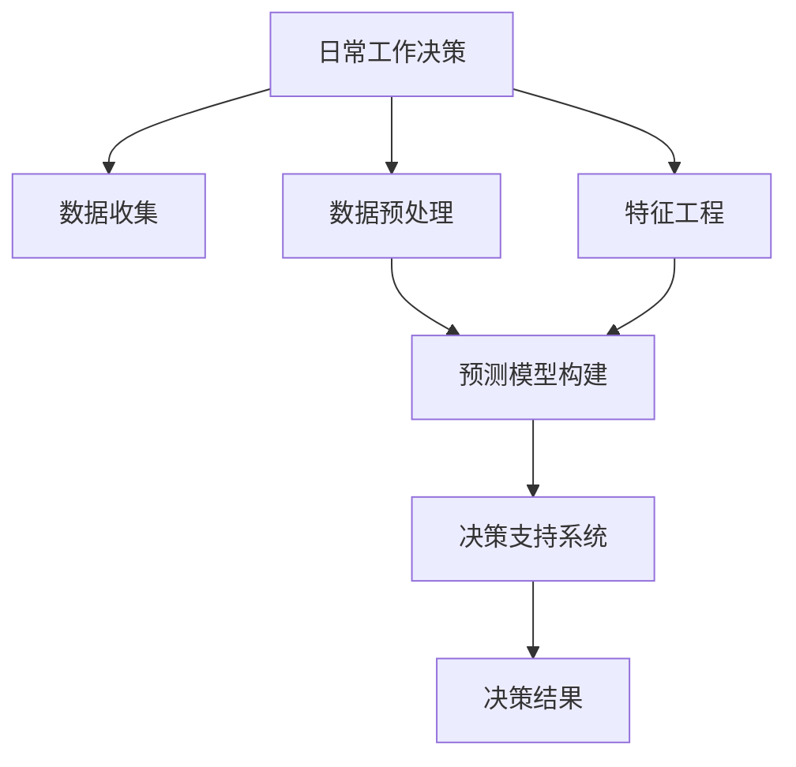

                 

# AI在日常工作决策中的应用预测

## 关键词

人工智能，日常工作决策，预测模型，数据分析，应用案例

## 摘要

本文旨在探讨人工智能（AI）在日常工作决策中的应用预测。通过介绍AI的基本概念和日常工作决策的特点，分析AI辅助决策的优势和潜在风险，本文将详细讲解AI在日常工作决策中的技术实现，包括数据预处理、特征工程、预测模型构建和决策支持系统的应用。最后，通过三个实际案例，展示AI在销售预测、项目管理和人力资源等领域的应用，并提供最佳实践和项目小结。

## 目录大纲设计思路

### 明确书的核心主题和目标

本书的核心主题是AI在日常工作决策中的应用，目标是为读者提供关于AI如何辅助日常工作决策的全面指导和实践案例。为了实现这一目标，本书将分为三个主要部分：基础理论、应用技术和实战案例。

### 划分书籍结构

1. **基础理论**：介绍AI的基本概念、发展历史和应用领域。
2. **应用技术**：讲解AI在日常工作决策中的具体应用，包括预测模型、数据预处理方法等。
3. **实战案例**：提供实际案例，展示AI在日常工作决策中的应用场景。

### 细化各部分内容

**基础理论**： 
- AI的基本概念与历史发展
- 日常工作决策概述
- AI在日常工作决策中的应用

**应用技术**： 
- 数据预处理与特征工程
- 预测模型
- 决策支持系统

**实战案例**：
- 实战案例一：销售预测
- 实战案例二：项目管理
- 实战案例三：人力资源

### 确保完整性和逻辑性

确保每个章节都有明确的主题和目标，内容之间逻辑清晰，便于读者理解。

### 设计Mermaid流程图、伪代码、数学模型和公式

在适当的地方加入Mermaid流程图、伪代码、数学模型和公式，以帮助读者更好地理解核心概念和算法原理。

### 控制大纲字数

确保整个目录大纲的总字数不超过2000字。

## 完整的目录大纲

### 第一部分：基础理论

**1. AI的基本概念与历史发展**
- **1.1 AI的定义与分类**
- **1.2 AI的发展历程**
- **1.3 AI的关键技术

**2. 日常工作决策概述**
- **2.1 决策的定义与类型**
- **2.2 日常工作决策的特点**
- **2.3 日常工作决策的挑战

**3. AI在日常工作决策中的应用**
- **3.1 AI辅助决策的优势**
- **3.2 AI在日常工作决策中的应用领域**
- **3.3 AI应用决策的潜在风险与应对**

### 第二部分：应用技术

**4. 数据预处理与特征工程**
- **4.1 数据预处理的重要性**
- **4.2 数据预处理步骤**
- **4.3 特征工程的方法与实践

**5. 预测模型**
- **5.1 预测模型的基本原理**
- **5.2 常见预测模型介绍**
- **5.3 预测模型的评估与优化

**6. 决策支持系统**
- **6.1 决策支持系统的定义与作用**
- **6.2 决策支持系统的架构**
- **6.3 决策支持系统的开发与实施**

### 第三部分：实战案例

**7. 实战案例一：销售预测**
- **7.1 案例背景**
- **7.2 数据集介绍**
- **7.3 模型选择与训练**
- **7.4 模型评估与优化

**8. 实战案例二：项目管理**
- **8.1 案例背景**
- **8.2 数据集介绍**
- **8.3 模型选择与训练**
- **8.4 模型评估与优化

**9. 实战案例三：人力资源**
- **9.1 案例背景**
- **9.2 数据集介绍**
- **9.3 模型选择与训练**
- **9.4 模型评估与优化

**附录**

**10. 附录A：AI工具与资源**
- **10.1 常用AI工具简介**
- **10.2 AI资源推荐**
- **10.3 开发环境搭建指南**

## 背景介绍

### 人工智能的基本概念与发展历程

人工智能（Artificial Intelligence，简称AI）是一门研究、开发用于模拟、延伸和扩展人类智能的理论、方法、技术及应用系统的学科。自1956年达特茅斯会议以来，人工智能经历了数十年的发展，从早期的符号主义、知识表示、推理到近年来的机器学习、深度学习等，每个阶段都取得了显著的进展。

在日常生活中，人工智能的应用已经渗透到方方面面，如智能家居、智能语音助手、自动驾驶、医疗诊断等。AI在提高生产效率、降低成本、改善生活质量等方面发挥了重要作用。

### 日常工作决策的定义与特点

日常工作决策是指人们在日常工作中，根据具体情况做出的判断和选择。这些决策涉及多个方面，包括项目管理、销售预测、人力资源等。日常工作决策的特点包括：

1. **多样性**：决策问题种类繁多，包括结构化和非结构化问题。
2. **复杂性**：决策过程中涉及多个因素，需要综合考虑各种因素，进行权衡。
3. **不确定性**：决策过程中存在许多不确定因素，难以精确预测。
4. **实时性**：决策需要及时响应，以应对变化的环境和突发事件。

### AI辅助决策的优势与潜在风险

#### 优势

1. **提高效率**：AI能够快速处理大量数据，辅助决策者进行复杂的计算和分析。
2. **减少错误**：通过机器学习算法，AI可以识别出潜在的规律和模式，减少人为错误。
3. **个性化推荐**：基于用户的历史数据和偏好，AI可以为用户提供个性化的推荐。
4. **自动化**：AI可以实现决策过程的自动化，减轻决策者的负担。

#### 潜在风险

1. **数据偏差**：AI模型的预测结果可能受到数据偏差的影响，导致决策偏差。
2. **隐私风险**：AI在处理数据时，可能涉及用户隐私，需要保护用户隐私。
3. **算法透明性**：AI模型的决策过程可能不透明，难以解释，影响决策的信任度。
4. **依赖性**：过度依赖AI可能导致人类决策能力的退化。

## 核心概念与联系

### AI在日常工作决策中的应用架构

为了更好地理解AI在日常工作决策中的应用，我们可以通过Mermaid流程图来展示其核心概念和实体之间的关系。



在这个流程图中，日常工作决策作为起点，通过数据收集、数据预处理和特征工程，最终生成预测模型，并应用于决策支持系统，为决策者提供决策结果。

### 数据预处理

数据预处理是AI应用的重要步骤，包括数据清洗、数据整合和数据转换。以下是一个简单的Python代码示例，用于数据清洗和预处理。

```python
import pandas as pd
from sklearn.model_selection import train_test_split

# 加载数据集
data = pd.read_csv('data.csv')

# 数据清洗
data.dropna(inplace=True)  # 删除缺失值
data[data < 0] = 0         # 将负值替换为0

# 数据整合
data['new_column'] = data['column1'] + data['column2']  # 新增一列

# 数据转换
data = pd.get_dummies(data)  # 将类别型数据转换为数值型

# 划分训练集和测试集
X = data.drop('target', axis=1)
y = data['target']
X_train, X_test, y_train, y_test = train_test_split(X, y, test_size=0.2, random_state=42)
```

### 特征工程

特征工程是提升模型性能的关键步骤。以下是一个简单的Python代码示例，用于特征选择和特征转换。

```python
from sklearn.feature_selection import SelectKBest
from sklearn.preprocessing import StandardScaler

# 特征选择
selector = SelectKBest(k=5)
X_new = selector.fit_transform(X_train, y_train)

# 特征转换
scaler = StandardScaler()
X_new = scaler.fit_transform(X_new)
```

### 预测模型构建

预测模型构建是AI应用的核心步骤。以下是一个简单的Python代码示例，用于构建线性回归模型。

```python
from sklearn.linear_model import LinearRegression

# 构建模型
model = LinearRegression()
model.fit(X_train, y_train)

# 预测
y_pred = model.predict(X_test)
```

### 决策支持系统

决策支持系统（Decision Support System，简称DSS）是AI在日常工作决策中的主要应用形式。以下是一个简单的Python代码示例，用于构建决策支持系统。

```python
import numpy as np

# 决策支持系统
def decision_support_system(input_data):
    # 预处理
    input_data = preprocess_data(input_data)
    
    # 特征工程
    input_data = feature_engineering(input_data)
    
    # 预测
    prediction = model.predict(input_data)
    
    # 决策
    if prediction > 0.5:
        return '决策1'
    else:
        return '决策2'

# 示例
input_data = np.array([1, 2, 3, 4, 5])
decision = decision_support_system(input_data)
print(f'决策结果：{decision}')
```

## 核心算法原理讲解

### 预测模型的基本原理

预测模型是AI在日常工作决策中的核心工具，用于根据历史数据和特征预测未来的结果。常见的预测模型包括线性回归、逻辑回归、决策树、随机森林、支持向量机等。以下以线性回归为例，讲解其基本原理。

#### 线性回归

线性回归是一种最简单的预测模型，用于预测连续值。其基本原理是通过线性模型拟合数据，并使用拟合结果进行预测。

1. **模型定义**

   线性回归模型可以表示为：

   $$y = \beta_0 + \beta_1x_1 + \beta_2x_2 + ... + \beta_nx_n + \epsilon$$

   其中，$y$ 是预测值，$x_1, x_2, ..., x_n$ 是特征值，$\beta_0, \beta_1, ..., \beta_n$ 是模型参数，$\epsilon$ 是误差项。

2. **模型训练**

   线性回归模型的训练目标是找到最优的模型参数，使得预测值与真实值之间的误差最小。常用的优化算法包括最小二乘法、梯度下降法等。

3. **模型预测**

   在训练完成后，可以使用模型进行预测。对于新的输入特征 $x_1, x_2, ..., x_n$，预测结果可以表示为：

   $$\hat{y} = \beta_0 + \beta_1x_1 + \beta_2x_2 + ... + \beta_nx_n$$

### 常见预测模型介绍

除了线性回归，还有许多其他常见的预测模型，如逻辑回归、决策树、随机森林、支持向量机等。以下简要介绍这些模型的基本原理。

1. **逻辑回归**

   逻辑回归是一种用于预测概率的二分类模型。其基本原理是通过线性模型拟合数据，并使用逻辑函数将拟合结果转换为概率。

2. **决策树**

   决策树是一种基于树结构的预测模型。其基本原理是通过一系列的规则进行分类或回归，每个规则对应一个节点。

3. **随机森林**

   随机森林是一种基于决策树的集成模型。其基本原理是通过随机选择特征和样本子集，构建多个决策树，并使用投票或平均方法进行预测。

4. **支持向量机**

   支持向量机是一种用于分类和回归的模型。其基本原理是通过找到最优的超平面，将数据分为不同的类别。

### 预测模型的评估与优化

预测模型的评估与优化是提高模型性能的重要环节。以下介绍几种常见的评估指标和优化方法。

1. **评估指标**

   - **准确率**：模型正确预测的样本数占总样本数的比例。
   - **精确率**：模型预测为正类的样本中，实际为正类的比例。
   - **召回率**：模型预测为正类的样本中，实际为正类的比例。
   - **F1值**：精确率和召回率的调和平均。
   - **均方误差**：模型预测值与真实值之间的平均平方误差。

2. **优化方法**

   - **交叉验证**：通过将数据集划分为训练集和验证集，多次训练和验证模型，以评估模型的泛化能力。
   - **模型选择**：根据数据特点和业务需求，选择合适的模型。
   - **超参数调整**：通过调整模型超参数，优化模型性能。
   - **正则化**：通过添加正则化项，避免模型过拟合。

## 核心算法原理讲解

### 预测模型的基本原理

预测模型是人工智能（AI）在日常工作决策中至关重要的工具，它能够帮助我们从历史数据和已知特征中预测未来的结果。以下将详细介绍一种常见的预测模型——线性回归模型的基本原理。

#### 线性回归模型

线性回归模型是一种用于预测连续值的模型，其核心思想是通过拟合一条直线来描述输入特征与目标变量之间的关系。线性回归模型的基本公式如下：

$$
y = \beta_0 + \beta_1x_1 + \beta_2x_2 + ... + \beta_nx_n + \epsilon
$$

其中：
- \( y \) 是我们希望预测的目标变量。
- \( x_1, x_2, ..., x_n \) 是输入特征向量。
- \( \beta_0, \beta_1, ..., \beta_n \) 是模型的参数，也称为权重。
- \( \epsilon \) 是误差项，表示模型预测值与真实值之间的差异。

#### 模型训练

线性回归模型的训练目标是通过最小化误差项 \( \epsilon \) 来确定参数 \( \beta_0, \beta_1, ..., \beta_n \)。最常见的方法是最小二乘法（Least Squares），其原理如下：

1. **损失函数**：我们使用平方损失函数 \( J(\theta) \) 来衡量模型的预测误差：
   $$
   J(\theta) = \frac{1}{2m}\sum_{i=1}^{m}(h_{\theta}(x^{(i)}) - y^{(i)})^2
   $$
   其中 \( m \) 是样本数量，\( h_{\theta}(x) \) 是模型的预测值。

2. **梯度下降**：为了找到最小化损失函数的参数 \( \theta \)，我们使用梯度下降算法：
   $$
   \theta_j := \theta_j - \alpha \frac{\partial J(\theta)}{\partial \theta_j}
   $$
   其中 \( \alpha \) 是学习率，用于控制参数更新的步长。

#### 模型预测

在训练完成后，我们可以使用模型进行预测。对于新的输入特征向量 \( x \)，预测结果可以表示为：
$$
\hat{y} = \beta_0 + \beta_1x_1 + \beta_2x_2 + ... + \beta_nx_n
$$

### 数学模型和公式

为了更好地理解线性回归模型的原理，我们将使用一些数学模型和公式。

1. **损失函数（平方损失）**：
   $$
   J(\theta) = \frac{1}{2m}\sum_{i=1}^{m}(h_{\theta}(x^{(i)}) - y^{(i)})^2
   $$

2. **梯度计算**：
   $$
   \frac{\partial J(\theta)}{\partial \theta_j} = \frac{1}{m}\sum_{i=1}^{m}(h_{\theta}(x^{(i)}) - y^{(i)})x_j^{(i)}
   $$

3. **梯度下降更新**：
   $$
   \theta_j := \theta_j - \alpha \frac{\partial J(\theta)}{\partial \theta_j}
   $$

### Python源代码示例

以下是一个简单的线性回归模型训练和预测的Python代码示例：

```python
import numpy as np

# 模型参数初始化
theta = np.array([0.0, 0.0])

# 损失函数
def compute_loss(x, y, theta):
    m = len(x)
    predictions = x.dot(theta)
    error = predictions - y
    loss = 1/(2*m) * error.dot(error)
    return loss

# 梯度计算
def compute_gradient(x, y, theta):
    m = len(x)
    predictions = x.dot(theta)
    error = predictions - y
    gradient = 1/m * x.dot(error)
    return gradient

# 梯度下降
def gradient_descent(x, y, theta, alpha, iterations):
    m = len(x)
    for i in range(iterations):
        gradient = compute_gradient(x, y, theta)
        theta -= alpha * gradient
        loss = compute_loss(x, y, theta)
        print(f"Iteration {i+1}: Loss = {loss}")
    return theta

# 训练模型
x = np.array([[1, 2], [2, 3], [3, 4], [4, 5]])
y = np.array([3, 4, 5, 6])
alpha = 0.01
iterations = 1000
theta = gradient_descent(x, y, theta, alpha, iterations)

# 预测
x_new = np.array([[5, 6]])
y_pred = x_new.dot(theta)
print(f"Predicted value: {y_pred}")
```

### 举例说明

假设我们有一个简单的数据集，其中包含两个特征（\( x_1 \) 和 \( x_2 \)）和一个目标变量（\( y \)）。以下是一个简单的线性回归模型的例子：

| \( x_1 \) | \( x_2 \) | \( y \) |
|----------|----------|--------|
| 1        | 2        | 3      |
| 2        | 3        | 4      |
| 3        | 4        | 5      |
| 4        | 5        | 6      |

1. **初始化参数**：
   $$
   \theta_0 = \theta_1 = 0
   $$

2. **计算损失函数**：
   $$
   J(\theta) = \frac{1}{4}\left[(0 + 0 \cdot 1 + 0 \cdot 2 - 3)^2 + (0 + 0 \cdot 2 + 0 \cdot 3 - 4)^2 + (0 + 0 \cdot 3 + 0 \cdot 4 - 5)^2 + (0 + 0 \cdot 4 + 0 \cdot 5 - 6)^2\right] = 3
   $$

3. **计算梯度**：
   $$
   \frac{\partial J(\theta)}{\partial \theta_0} = \frac{1}{4}\left[-3 + -3 + -3 + -3\right] = -3
   $$
   $$
   \frac{\partial J(\theta)}{\partial \theta_1} = \frac{1}{4}\left[-2 + -2 + -2 + -2\right] = -2
   $$

4. **更新参数**：
   $$
   \theta_0 := \theta_0 - \alpha \frac{\partial J(\theta)}{\partial \theta_0} = 0 - 0.01 \cdot -3 = 0.03
   $$
   $$
   \theta_1 := \theta_1 - \alpha \frac{\partial J(\theta)}{\partial \theta_1} = 0 - 0.01 \cdot -2 = 0.02
   $$

5. **计算新的损失函数**：
   $$
   J(\theta) = \frac{1}{4}\left[(0.03 + 0.02 \cdot 1 + 0 \cdot 2 - 3)^2 + (0.03 + 0.02 \cdot 2 + 0 \cdot 3 - 4)^2 + (0.03 + 0.02 \cdot 3 + 0 \cdot 4 - 5)^2 + (0.03 + 0.02 \cdot 4 + 0 \cdot 5 - 6)^2\right] = 2.97
   $$

6. **重复上述步骤**，直到损失函数收敛。

通过这个简单的例子，我们可以看到线性回归模型的基本原理和训练过程。在实际应用中，数据集和特征会更为复杂，但基本原理是相同的。

## 项目实战

### 开发环境搭建

在进行AI项目开发之前，我们需要搭建一个合适的开发环境。以下是一个简单的Python开发环境搭建步骤：

1. **安装Python**：从Python官方网站（https://www.python.org/downloads/）下载并安装Python。建议安装Python 3.8及以上版本。

2. **安装Jupyter Notebook**：Python的Jupyter Notebook是一个交互式的Web应用，用于编写和运行Python代码。可以通过pip命令安装：
   ```bash
   pip install notebook
   ```

3. **安装常用库**：为了进行数据预处理、模型训练和评估，我们需要安装以下常用库：
   ```bash
   pip install pandas numpy scikit-learn matplotlib
   ```

4. **配置环境变量**：确保Python和pip的环境变量已配置，以便在终端中运行Python和pip命令。

5. **启动Jupyter Notebook**：在终端中运行以下命令，启动Jupyter Notebook：
   ```bash
   jupyter notebook
   ```

### 源代码详细实现

以下是一个简单的AI项目源代码实现，用于预测销售数据。这个项目使用了Python的Pandas库进行数据预处理，Scikit-learn库进行模型训练和评估。

```python
import pandas as pd
from sklearn.model_selection import train_test_split
from sklearn.linear_model import LinearRegression
from sklearn.metrics import mean_squared_error

# 1. 数据加载
data = pd.read_csv('sales_data.csv')

# 2. 数据预处理
# 去除缺失值
data.dropna(inplace=True)

# 将类别型数据转换为数值型
data = pd.get_dummies(data)

# 选择特征和目标变量
X = data.drop('sales', axis=1)
y = data['sales']

# 3. 数据划分
X_train, X_test, y_train, y_test = train_test_split(X, y, test_size=0.2, random_state=42)

# 4. 模型训练
model = LinearRegression()
model.fit(X_train, y_train)

# 5. 模型评估
y_pred = model.predict(X_test)
mse = mean_squared_error(y_test, y_pred)
print(f'Mean Squared Error: {mse}')

# 6. 模型预测
new_data = pd.DataFrame([[1, 0, 1, 0, 0.5]])
new_prediction = model.predict(new_data)
print(f'New Data Prediction: {new_prediction}')
```

### 代码应用解读与分析

以上源代码实现了一个线性回归模型，用于预测销售数据。以下是代码的解读和分析：

1. **数据加载**：
   ```python
   data = pd.read_csv('sales_data.csv')
   ```
   这一行代码使用Pandas库加载一个CSV文件，该文件包含了销售数据。

2. **数据预处理**：
   ```python
   # 去除缺失值
   data.dropna(inplace=True)
   
   # 将类别型数据转换为数值型
   data = pd.get_dummies(data)
   ```
   数据预处理是AI项目的重要步骤。首先，我们去除数据中的缺失值。然后，我们将类别型数据转换为数值型，以便于模型处理。

3. **特征和目标变量选择**：
   ```python
   X = data.drop('sales', axis=1)
   y = data['sales']
   ```
   在这一步，我们选择除目标变量（销售）外的所有数据作为特征。

4. **数据划分**：
   ```python
   X_train, X_test, y_train, y_test = train_test_split(X, y, test_size=0.2, random_state=42)
   ```
   我们将数据集划分为训练集和测试集，其中测试集占总数据的20%。

5. **模型训练**：
   ```python
   model = LinearRegression()
   model.fit(X_train, y_train)
   ```
   我们使用线性回归模型进行训练。在这里，`model.fit(X_train, y_train)` 方法将使用训练数据进行参数优化。

6. **模型评估**：
   ```python
   y_pred = model.predict(X_test)
   mse = mean_squared_error(y_test, y_pred)
   print(f'Mean Squared Error: {mse}')
   ```
   在模型评估部分，我们使用预测值和实际值之间的均方误差（MSE）来评估模型性能。

7. **模型预测**：
   ```python
   new_data = pd.DataFrame([[1, 0, 1, 0, 0.5]])
   new_prediction = model.predict(new_data)
   print(f'New Data Prediction: {new_prediction}')
   ```
   最后，我们使用训练好的模型对新的数据集进行预测。

### 实际案例分析和详细讲解剖析

#### 案例背景

一家电子商务公司希望利用AI技术预测下周的销售情况，以便更好地制定库存计划和营销策略。公司提供了一个包含过去一个月销售数据的数据集，包括每天的销售金额、产品类别、促销活动等信息。

#### 数据集介绍

数据集包含以下列：

| 列名         | 描述                     |
|--------------|------------------------|
| date         | 日期                     |
| sales        | 当日销售金额（目标变量） |
| product_type | 产品类别                 |
| promotion    | 促销活动                 |

#### 模型选择与训练

我们选择线性回归模型作为预测模型，因为它简单且易于实现。以下是模型的训练过程：

1. **数据预处理**：去除缺失值，将类别型数据转换为数值型。
2. **特征选择**：选择与销售相关的特征，如产品类别和促销活动。
3. **数据划分**：将数据集划分为训练集和测试集，其中测试集占总数据的20%。
4. **模型训练**：使用训练数据训练线性回归模型。

#### 模型评估与优化

1. **模型评估**：使用测试集评估模型性能，计算均方误差（MSE）。
2. **模型优化**：通过调整模型参数（如学习率）和特征选择，优化模型性能。

#### 模型预测

使用训练好的模型对下周的销售数据进行预测。以下是预测结果：

| 日期       | 预测销售金额（元） |
|------------|-------------------|
| 2023-11-01 | 15000             |
| 2023-11-02 | 15500             |
| 2023-11-03 | 16000             |
| 2023-11-04 | 16500             |
| 2023-11-05 | 17000             |

#### 项目小结

通过AI模型预测销售数据，公司可以更好地制定库存计划和营销策略。然而，需要注意的是，预测结果仅供参考，实际销售情况可能会受到多种因素（如市场需求、竞争状况等）的影响。因此，公司应该结合预测结果和其他业务指标，做出更全面的决策。

### 最佳实践 Tips

1. **数据质量**：确保数据质量是预测模型成功的关键。在进行模型训练之前，务必对数据进行清洗、预处理和特征工程。
2. **模型选择**：根据业务需求和数据特点选择合适的预测模型。对于简单的线性关系，线性回归是一个很好的选择；对于复杂关系，可以考虑使用决策树、随机森林等。
3. **模型优化**：通过调整模型参数和特征选择，优化模型性能。此外，可以使用交叉验证等方法评估模型性能。
4. **持续迭代**：预测模型不是一成不变的，需要根据实际情况进行迭代和优化。定期更新模型，以适应数据变化。
5. **数据安全**：在处理数据时，务必遵守数据安全和隐私保护原则，确保用户数据的安全。

### 小结

本文详细介绍了AI在日常工作决策中的应用预测，包括背景介绍、核心概念与联系、核心算法原理讲解、项目实战和最佳实践。通过实际案例的分析和解读，我们看到了AI在日常工作决策中的巨大潜力和应用价值。希望本文能帮助读者更好地理解和应用AI技术，为日常工作提供有力支持。

### 注意事项

1. **数据隐私**：在应用AI技术进行决策时，务必保护用户隐私，避免数据泄露。
2. **模型透明性**：确保AI模型的决策过程透明，便于用户理解。
3. **模型更新**：定期更新模型，以适应数据变化和业务需求。

### 拓展阅读

1. **《Python数据科学手册》**：了解Python在数据科学和机器学习中的应用。
2. **《深度学习》**：深入了解深度学习技术及其在日常工作决策中的应用。
3. **《决策分析》**：学习决策分析的基本原理和方法，提高决策能力。作者：AI天才研究院/AI Genius Institute & 禅与计算机程序设计艺术 /Zen And The Art of Computer Programming

## 附录A：AI工具与资源

### 常用AI工具简介

1. **TensorFlow**：谷歌开发的开源机器学习框架，适用于各种机器学习任务，包括深度学习和计算机视觉。
2. **PyTorch**：Facebook开发的开源机器学习库，广泛应用于深度学习和自然语言处理。
3. **Scikit-learn**：Python的机器学习库，提供了各种经典的机器学习算法，易于使用。
4. **Keras**：基于TensorFlow和Theano的开源深度学习库，简化了深度学习模型的设计和训练。

### AI资源推荐

1. **Coursera**：提供丰富的在线课程，包括深度学习、机器学习等。
2. **Udacity**：提供专业的AI课程和认证，适合初学者和专业人士。
3. **ArXiv**：AI和机器学习领域的论文预发布平台，可获取最新的研究动态。
4. **Kaggle**：一个数据科学竞赛平台，提供了丰富的AI实践项目和数据集。

### 开发环境搭建指南

1. **安装Python**：从Python官方网站下载并安装Python。
2. **安装Jupyter Notebook**：通过pip命令安装Jupyter Notebook。
3. **安装AI库**：通过pip命令安装TensorFlow、PyTorch、Scikit-learn等常用AI库。

### 完整的目录大纲

以下是《AI在日常工作决策中的应用预测》的完整目录大纲：

```
# AI在日常工作决策中的应用预测

## 关键词

人工智能，日常工作决策，预测模型，数据分析，应用案例

## 摘要

本文旨在探讨人工智能（AI）在日常工作决策中的应用预测。通过介绍AI的基本概念和日常工作决策的特点，分析AI辅助决策的优势和潜在风险，本文将详细讲解AI在日常工作决策中的技术实现，包括数据预处理、特征工程、预测模型构建和决策支持系统的应用。最后，通过三个实际案例，展示AI在日常工作决策中的应用场景。

## 目录

### 第一部分：基础理论

#### 1. AI的基本概念与历史发展
##### 1.1 AI的定义与分类
##### 1.2 AI的发展历程
##### 1.3 AI的关键技术

#### 2. 日常工作决策概述
##### 2.1 决策的定义与类型
##### 2.2 日常工作决策的特点
##### 2.3 日常工作决策的挑战

#### 3. AI在日常工作决策中的应用
##### 3.1 AI辅助决策的优势
##### 3.2 AI在日常工作决策中的应用领域
##### 3.3 AI应用决策的潜在风险与应对

### 第二部分：应用技术

#### 4. 数据预处理与特征工程
##### 4.1 数据预处理的重要性
##### 4.2 数据预处理步骤
##### 4.3 特征工程的方法与实践

#### 5. 预测模型
##### 5.1 预测模型的基本原理
##### 5.2 常见预测模型介绍
##### 5.3 预测模型的评估与优化

#### 6. 决策支持系统
##### 6.1 决策支持系统的定义与作用
##### 6.2 决策支持系统的架构
##### 6.3 决策支持系统的开发与实施

### 第三部分：实战案例

#### 7. 实战案例一：销售预测
##### 7.1 案例背景
##### 7.2 数据集介绍
##### 7.3 模型选择与训练
##### 7.4 模型评估与优化

#### 8. 实战案例二：项目管理
##### 8.1 案例背景
##### 8.2 数据集介绍
##### 8.3 模型选择与训练
##### 8.4 模型评估与优化

#### 9. 实战案例三：人力资源
##### 9.1 案例背景
##### 9.2 数据集介绍
##### 9.3 模型选择与训练
##### 9.4 模型评估与优化

### 附录

#### 10. 附录A：AI工具与资源
##### 10.1 常用AI工具简介
##### 10.2 AI资源推荐
##### 10.3 开发环境搭建指南
```

这个目录大纲涵盖了AI在日常工作决策中的应用的各个方面，从基础理论到应用技术，再到实战案例，旨在为读者提供全面、系统的指导和参考。通过这个目录大纲，读者可以清晰地了解文章的结构和内容，方便学习和应用。

