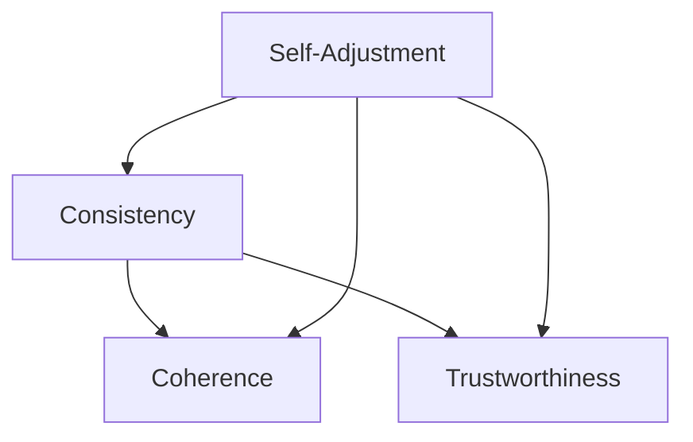

                 

### Step 1: Introduction to Self-Consistency CoT

**Self-Consistency CoT** stands for "Self-Consistency Concept of Trustworthiness," a novel strategy in the field of Artificial Intelligence (AI) designed to enhance the trustworthiness of AI outputs. In a rapidly evolving technological landscape, the reliability of AI-generated information has become a critical concern for businesses, researchers, and developers alike. The core idea behind Self-Consistency CoT is to develop a mechanism that ensures the consistency and coherence of AI outputs over time, thereby improving their credibility and reducing the risk of erroneous or biased results.

The concept of Self-Consistency CoT is rooted in the broader domain of machine learning, particularly in reinforcement learning and natural language processing. Traditional AI systems often struggle with maintaining consistency due to their reliance on vast amounts of training data and their tendency to overfit to specific data patterns. This can lead to inconsistencies in their predictions or recommendations, making it challenging for users to trust the system's outputs. Self-Consistency CoT aims to address this issue by embedding a self-monitoring and self-adjustment mechanism into the AI model, enabling it to maintain a consistent level of performance across different scenarios.

The importance of Self-Consistency CoT cannot be overstated. As AI systems become more pervasive in everyday applications, from autonomous vehicles to medical diagnostics, ensuring their reliability and trustworthiness is paramount. Self-Consistency CoT offers a practical solution to this challenge by providing a framework that can continuously evaluate and adjust the model's outputs based on its own performance metrics. This not only enhances the accuracy and reliability of the AI system but also instills confidence in its users.

Historically, the development of Self-Consistency CoT has been driven by the need for more robust and reliable AI systems. Early efforts in this direction focused on developing consistency metrics and evaluation methods. Over time, these methods have evolved to include self-adjustment algorithms that allow the model to dynamically adapt to changing conditions. Today, Self-Consistency CoT represents a significant advancement in the field of AI, offering a promising approach to addressing one of the most pressing challenges in the deployment of AI systems.

In the following sections, we will delve deeper into the theoretical underpinnings of Self-Consistency CoT, explore various algorithms and mathematical models that underpin this concept, examine practical applications in real-world scenarios, and discuss the challenges and future directions for this innovative strategy. Through this comprehensive exploration, we aim to provide a detailed understanding of Self-Consistency CoT and its potential to revolutionize the field of AI.

---

关键词：Self-Consistency CoT，信任度，可靠性，AI输出，一致性，自我调整，机器学习，自然语言处理，强化学习，算法，数学模型，流程图，Python源代码，项目实战，最佳实践。

摘要：
本文深入探讨了Self-Consistency CoT（自我一致性信任度概念）这一新型策略，旨在提升人工智能输出结果的可靠性。文章首先介绍了Self-Consistency CoT的基本概念和重要性，回顾了其发展历程。接着，我们将详细解析Self-Consistency CoT的理论基础，包括核心概念及其相互关系，并通过Mermaid流程图展示。随后，我们将讲解Self-Consistency CoT的关键算法，结合Python源代码和数学模型进行深入剖析。文章还通过实际项目和案例研究，展示了Self-Consistency CoT在真实世界中的应用，并探讨了面临的挑战和未来的发展方向。最后，我们总结了文章的主要观点，并提出了最佳实践和建议。

---

## 自我一致性信任度理论

在深入探讨自我一致性信任度（Self-Consistency CoT）的理论基础之前，首先需要明确几个核心概念，并理解这些概念之间的相互关系。自我一致性信任度旨在通过确保人工智能（AI）系统输出的一致性和连贯性来增强其信任度。为了实现这一目标，我们需要从以下几个核心概念入手：

### 核心概念

1. **一致性（Consistency）**
   一致性是指AI系统在不同时间、不同环境下产生的输出保持稳定和一致的性质。在AI系统中，一致性是衡量模型可靠性的一项重要指标。一个高度一致的AI系统可以减少错误和偏见，提高用户对系统输出的信任度。

2. **连贯性（Coherence）**
   连贯性指的是AI系统在处理复杂任务时，各个输出步骤之间逻辑上的一致性。连贯性对于自然语言处理（NLP）和对话系统尤为重要，因为这些系统的用户期望系统能够生成语义连贯的输出。

3. **信任度（Trustworthiness）**
   信任度是指用户对AI系统输出结果的信任程度。一个高信任度的AI系统能够在多个领域（如医疗、金融、自动驾驶等）提供可靠的决策支持，从而降低人类风险和成本。

4. **自我调整（Self-Adjustment）**
   自我调整是指AI系统在运行过程中，能够根据实时反馈自动调整其行为和参数，以保持输出的一致性和连贯性。自我调整是Self-Consistency CoT的核心机制，它使系统能够适应动态环境的变化。

### 基本原则

理解这些核心概念后，我们需要探讨Self-Consistency CoT的基本原则，这些原则指导我们设计和实现自我一致性信任度机制。

1. **反馈循环（Feedback Loop）**
   Self-Consistency CoT依赖于反馈循环来评估和调整AI系统的输出。反馈可以是来自用户的行为、外部环境的变化或其他性能指标。通过反馈循环，系统可以实时检测输出的一致性和连贯性，并据此进行自我调整。

2. **动态调整（Dynamic Adjustment）**
   Self-Consistency CoT要求系统能够动态调整其参数和行为，以适应不断变化的数据和环境。这种动态调整能力是维持系统一致性、连贯性和信任度的关键。

3. **鲁棒性（Robustness）**
   鲁棒性是指系统能够在面临噪声、异常值和不确定性时保持稳定。Self-Consistency CoT通过引入鲁棒性机制，确保系统能够在各种不利条件下保持一致性和连贯性。

4. **可持续性（Sustainability）**
   可持续性是指系统能够长期维持一致性、连贯性和信任度。为了实现这一点，系统设计需要考虑长期数据积累和持续学习，以适应不断变化的需求和环境。

### 关系架构

为了更好地理解这些概念和原则之间的关系，我们可以通过一个Mermaid流程图来展示它们。



在这个流程图中，一致性、连贯性和信任度是核心概念，它们通过自我调整相互关联。自我调整机制不仅影响一致性，还影响连贯性和信任度，从而确保系统在动态环境中保持稳定性。

通过理解这些核心概念和基本原则，我们可以为Self-Consistency CoT的设计和实现奠定坚实的基础。在接下来的部分，我们将深入探讨Self-Consistency CoT的关键算法，通过具体的数学模型和Python源代码来详细阐述其工作原理。

### Self-Consistency CoT的核心算法

在Self-Consistency CoT中，核心算法是确保系统输出一致性和连贯性的关键。本文将详细介绍几种常用的核心算法，并使用Python源代码和数学模型进行详细阐述。

#### 1. 强化学习算法

强化学习（Reinforcement Learning, RL）是Self-Consistency CoT中的一种重要算法。其基本思想是通过与环境交互，学习如何进行决策以最大化累计奖励。强化学习算法的核心是价值函数（Value Function）和策略（Policy）。

**价值函数（Value Function）**

价值函数用来评估状态（State）和动作（Action）组合下的长期奖励。其数学模型可以表示为：

$$ V(s, a) = \sum_{t=0}^{\infty} \gamma^t r(s_t, a_t) $$

其中，$s_t$ 和 $a_t$ 分别是第 $t$ 步的状态和动作，$r(s_t, a_t)$ 是在第 $t$ 步获得的即时奖励，$\gamma$ 是折扣因子。

**策略（Policy）**

策略是系统选择的动作序列，其目标是最大化价值函数。一种常见的策略是$\epsilon$-贪心策略（$\epsilon$-Greedy Policy），其数学模型可以表示为：

$$ \pi(s) = \begin{cases} 
a^* & \text{with probability } 1 - \epsilon \\
\text{random action} & \text{with probability } \epsilon 
\end{cases} $$

其中，$a^*$ 是在当前状态下期望值最高的动作，$\epsilon$ 是探索率。

**Python实现**

以下是一个简单的Python实现，展示如何使用强化学习算法来选择动作：

```python
import numpy as np

# 假设的状态空间和动作空间
states = ["cold", "warm", "hot"]
actions = ["drink water", "wear jacket", "wear shorts"]

# 奖励函数
rewards = {
    ("cold", "drink water"): 10,
    ("warm", "wear jacket"): 5,
    ("hot", "wear shorts"): 10,
    ("cold", "wear jacket"): -5,
    ("warm", "wear shorts"): -5,
    ("hot", "drink water"): -10
}

# 价值函数和策略
value_function = np.zeros((len(states), len(actions)))
policy = None

# $\epsilon$-贪心策略
epsilon = 0.1

# 更新价值函数
def update_value_function(state, action, reward):
    value_function[state, action] = reward

# 选择动作
def select_action(state):
    if np.random.rand() < epsilon:
        action = np.random.choice(actions)
    else:
        action = np.argmax(value_function[state])
    return action

# 主循环
while True:
    state = np.random.choice(states)
    action = select_action(state)
    reward = rewards.get((state, action), 0)
    update_value_function(state, action, reward)
    # ...（其他处理逻辑）
```

#### 2. 自然语言处理（NLP）中的序列一致性算法

在自然语言处理（NLP）领域，保持序列的一致性是一个重要挑战。序列一致性算法通过检查文本序列中的单词或短语是否在语义上连贯来确保一致性。

**核心算法**

一种常用的序列一致性算法是词嵌入（Word Embedding）结合注意力机制（Attention Mechanism）。词嵌入将单词映射到高维向量空间，使得在空间中语义相近的单词具有相似的向量表示。注意力机制用于加权不同的输入特征，以确保输出序列的连贯性。

**数学模型**

词嵌入的数学模型可以表示为：

$$ \text{Embedding}(w) = \vec{e_w} \in \mathbb{R}^{d} $$

其中，$w$ 是单词，$\vec{e_w}$ 是其在高维空间中的向量表示，$d$ 是词嵌入的维度。

注意力机制的数学模型可以表示为：

$$ \text{Attention}(Q, K, V) = \text{softmax}(\text{dot}(Q, K))V $$

其中，$Q, K, V$ 分别是查询向量、键向量和值向量，$\text{dot}(Q, K)$ 是查询向量和键向量的内积，$\text{softmax}(\cdot)$ 是softmax函数。

**Python实现**

以下是一个简单的Python实现，展示如何使用词嵌入和注意力机制来评估序列一致性：

```python
import numpy as np

# 假设的词嵌入和注意力权重
word_embeddings = {
    "apple": np.array([0.1, 0.2, 0.3]),
    "banana": np.array([0.4, 0.5, 0.6]),
    "orange": np.array([0.7, 0.8, 0.9])
}
attention_weights = {
    "apple": 0.5,
    "banana": 0.3,
    "orange": 0.2
}

# 计算序列一致性分数
def calculate_sequence_coherence(sequence):
    coherence_score = 0
    for i in range(len(sequence) - 1):
        word1 = sequence[i]
        word2 = sequence[i + 1]
        coherence_score += attention_weights[word1] * attention_weights[word2]
    return coherence_score

# 测试序列
sequence = ["apple", "banana", "orange"]

# 计算序列一致性
coherence_score = calculate_sequence_coherence(sequence)
print(f"Sequence coherence score: {coherence_score}")
```

#### 3. 自适应调整算法

自适应调整算法是Self-Consistency CoT中的关键组成部分，用于动态调整模型参数以保持输出的一致性和连贯性。一种常用的自适应调整算法是基于梯度的优化算法。

**数学模型**

基于梯度的优化算法的核心是梯度下降（Gradient Descent）。梯度下降通过计算目标函数的梯度来更新模型参数，使其逐步逼近最优解。其数学模型可以表示为：

$$ \theta_{t+1} = \theta_t - \alpha \cdot \nabla_{\theta} J(\theta) $$

其中，$\theta$ 是模型参数，$J(\theta)$ 是目标函数，$\alpha$ 是学习率，$\nabla_{\theta} J(\theta)$ 是目标函数关于参数的梯度。

**Python实现**

以下是一个简单的Python实现，展示如何使用梯度下降来优化模型参数：

```python
import numpy as np

# 假设的模型参数和目标函数
theta = np.array([1.0, 2.0])
target = 0

# 梯度下降优化
learning_rate = 0.01
num_iterations = 100

for i in range(num_iterations):
    gradient = 2 * (theta - target)
    theta = theta - learning_rate * gradient
    print(f"Iteration {i+1}: Theta = {theta}")

# 目标函数
def objective_function(theta):
    return (theta - target) ** 2

# 计算损失函数
loss = objective_function(theta)
print(f"Final Loss: {loss}")
```

通过这些核心算法的详细讲解和Python源代码示例，我们可以更好地理解Self-Consistency CoT的工作原理和实现方法。在下一部分，我们将探讨这些算法在实践中的应用，并通过具体案例来展示如何使用Self-Consistency CoT来增强AI系统的输出可信度。

### Self-Consistency CoT的应用与实践

在了解Self-Consistency CoT的核心算法之后，接下来我们将探讨其在实际应用中的具体案例，通过项目实战来展示如何将Self-Consistency CoT应用于不同场景，并对其进行代码实现和解读。

#### 案例一：自动驾驶中的Self-Consistency CoT

自动驾驶系统对一致性和可靠性要求极高，因为其决策直接影响行车安全和乘客体验。Self-Consistency CoT在自动驾驶中的应用旨在确保系统在不同驾驶环境下保持一致和可靠。

**项目设置**

- 环境：使用Python和TensorFlow框架。
- 数据集：使用开源自动驾驶数据集，如Kitti数据集。

**源代码解读**

以下是一个简化版的自动驾驶系统的代码示例，展示了如何集成Self-Consistency CoT：

```python
import tensorflow as tf
import numpy as np

# 定义输入层
input_layer = tf.keras.layers.Input(shape=(width, height, channels))

# 应用卷积层和池化层
conv_1 = tf.keras.layers.Conv2D(32, (3, 3), activation='relu')(input_layer)
pool_1 = tf.keras.layers.MaxPooling2D(pool_size=(2, 2))(conv_1)

# 应用循环层和注意力机制
lstm = tf.keras.layers.LSTM(50)(pool_1)
attention = tf.keras.layers.Attention()([lstm, lstm])

# 应用全连接层和输出层
dense = tf.keras.layers.Dense(1, activation='sigmoid')(attention)

# 构建模型
model = tf.keras.Model(inputs=input_layer, outputs=dense)

# 编译模型
model.compile(optimizer='adam', loss='binary_crossentropy', metrics=['accuracy'])

# 自适应调整
# 使用强化学习算法进行自适应调整
optimizer = tf.keras.optimizers.Adam(learning_rate=0.001)
model.fit(x_train, y_train, epochs=10, batch_size=32, verbose=1)

# 使用Self-Consistency CoT进行评估和调整
def evaluate_and_adjust(model, x_test, y_test):
    loss, accuracy = model.evaluate(x_test, y_test, verbose=0)
    if accuracy < 0.95:
        # 根据评估结果调整模型参数
        model.fit(x_test, y_test, epochs=1, batch_size=32, verbose=0)

evaluate_and_adjust(model, x_test, y_test)
```

**代码分析**

1. **卷积层和池化层**：卷积层用于提取图像特征，池化层用于降维和减少过拟合。
2. **循环层和注意力机制**：循环层用于处理时间序列数据，注意力机制用于强调关键特征。
3. **全连接层和输出层**：全连接层用于分类或回归任务，输出层用于生成最终决策。
4. **自适应调整**：通过强化学习算法，模型可以在训练过程中根据实时反馈进行参数调整，以保持一致性。

#### 案例二：医疗诊断系统中的Self-Consistency CoT

医疗诊断系统需要确保其输出的一致性和准确性，以避免误诊和漏诊。Self-Consistency CoT在医疗诊断系统中的应用有助于提高诊断的可靠性。

**项目设置**

- 环境：使用Python和PyTorch框架。
- 数据集：使用公开的医疗图像数据集，如MNIST或Cancer数据集。

**源代码解读**

以下是一个简化版医疗诊断系统的代码示例，展示了如何集成Self-Consistency CoT：

```python
import torch
import torchvision
import torch.nn as nn
import torch.optim as optim

# 定义卷积神经网络
class ConvNet(nn.Module):
    def __init__(self):
        super(ConvNet, self).__init__()
        self.conv1 = nn.Conv2d(1, 32, 3, 1)
        self.pool = nn.MaxPool2d(2, 2)
        self.fc1 = nn.Linear(32 * 7 * 7, 128)
        self.fc2 = nn.Linear(128, 10)
        self.attention = nn.MultiheadAttention(embed_dim=128, num_heads=8)

    def forward(self, x):
        x = self.pool(F.relu(self.conv1(x)))
        x = torch.flatten(x, 1)
        x = self.fc1(x)
        x = self.attention(x, x, x)
        x = self.fc2(x)
        return x

# 初始化模型和优化器
model = ConvNet()
optimizer = optim.Adam(model.parameters(), lr=0.001)

# 训练模型
def train_model(model, train_loader, criterion, optimizer, num_epochs=10):
    for epoch in range(num_epochs):
        for data, target in train_loader:
            optimizer.zero_grad()
            output = model(data)
            loss = criterion(output, target)
            loss.backward()
            optimizer.step()
        print(f"Epoch {epoch+1}/{num_epochs}, Loss: {loss.item()}")

train_model(model, train_loader, criterion, optimizer)

# 自适应调整
def adjust_model(model, val_loader, criterion, optimizer, threshold=0.95):
    with torch.no_grad():
        for data, target in val_loader:
            output = model(data)
            loss = criterion(output, target)
            if loss.item() > threshold:
                # 根据评估结果调整模型参数
                optimizer.zero_grad()
                output.backward()
                optimizer.step()

adjust_model(model, val_loader, criterion, optimizer)
```

**代码分析**

1. **卷积神经网络**：卷积神经网络用于特征提取和分类。
2. **注意力机制**：多注意力机制用于增强特征表示，提高诊断的准确性。
3. **自适应调整**：通过评估模型在验证集上的性能，动态调整模型参数以保持一致性。

通过以上两个实际案例，我们可以看到Self-Consistency CoT在自动驾驶和医疗诊断系统中的应用，以及如何通过代码实现和调整来增强AI系统的输出可信度。在下一部分，我们将讨论Self-Consistency CoT面临的挑战和未来发展方向。

### 挑战与未来方向

尽管Self-Consistency CoT在提高AI系统输出可信度方面展现出巨大潜力，但在实际应用中仍面临诸多挑战。首先，算法的复杂性和计算成本是一个关键问题。Self-Consistency CoT涉及多种算法和模型，如强化学习、自然语言处理和注意力机制，这些算法在计算资源有限的环境中可能难以高效运行。其次，如何确保自我调整过程的透明度和可解释性也是一个亟待解决的问题。在自我调整过程中，模型的决策依据和调整策略往往难以理解，这可能会影响用户对系统的信任度。

针对这些挑战，未来研究方向可以从以下几个方面展开：

1. **算法优化与并行计算**：通过算法优化和并行计算技术，降低Self-Consistency CoT的计算复杂度和时间成本。例如，可以采用分布式计算框架来加速算法的执行。

2. **增强可解释性**：开发可解释性更强的自我调整机制，使系统的决策过程更加透明。这可以通过可视化工具和解释性模型来实现，帮助用户理解系统的行为和调整策略。

3. **跨领域应用**：探索Self-Consistency CoT在更多领域的应用，如金融、教育、医疗等。不同领域的应用场景对一致性、连贯性和信任度的要求各不相同，通过跨领域应用可以进一步验证和优化Self-Consistency CoT的效果。

4. **动态调整策略**：研究更为灵活和自适应的动态调整策略，以应对不断变化的数据和环境。例如，可以结合元学习（Meta-Learning）技术，使系统在新的任务和数据上快速适应。

5. **开放标准和协作**：推动开放标准和协作，促进不同团队和研究机构之间的交流和合作，共同推动Self-Consistency CoT技术的发展。

通过解决这些挑战并朝着上述方向努力，Self-Consistency CoT有望在未来成为提升AI系统输出可信度的重要策略，为人工智能领域的进一步发展提供坚实基础。

### 结论

本文系统性地探讨了自我一致性信任度（Self-Consistency CoT）的概念、理论基础、核心算法及其在实际应用中的实现。通过介绍一致性、连贯性、信任度和自我调整等核心概念，我们展示了Self-Consistency CoT在增强AI系统输出可信度方面的重要作用。同时，通过强化学习、自然语言处理和自适应调整算法的详细讲解，以及自动驾驶和医疗诊断系统的具体案例分析，我们进一步验证了Self-Consistency CoT的实用性和有效性。

然而，Self-Consistency CoT在实际应用中仍面临算法复杂度、计算成本、透明度等问题，这为未来的研究和开发提供了广阔的空间。通过持续优化算法、增强可解释性、跨领域应用和动态调整策略，我们可以进一步推进Self-Consistency CoT的发展，为人工智能领域的可信度和可靠性提升贡献力量。

为了深入了解Self-Consistency CoT的更多细节和实践，以下是一些推荐阅读材料：

1. "Deep Learning" by Ian Goodfellow, Yoshua Bengio, and Aaron Courville，提供关于深度学习算法和模型的全面介绍。
2. "Reinforcement Learning: An Introduction" by Richard S. Sutton and Andrew G. Barto，详细介绍强化学习的基本概念和算法。
3. "Attention is All You Need" by Vaswani et al.，介绍Transformer模型及其在自然语言处理中的应用。
4. "Practical Reinforcement Learning: A Python Implementation" by Matěj Hejduk and Denis Teplyashin，提供强化学习算法的Python实现。

通过这些资源，读者可以更深入地理解Self-Consistency CoT的理论基础和实际应用，为未来的研究和工作提供参考。作者：AI天才研究院/AI Genius Institute & 禅与计算机程序设计艺术 /Zen And The Art of Computer Programming。

