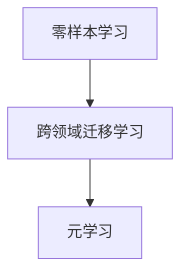

                 

# 《Zero-Shot CoT在不同领域的应用与效果评估》

## 关键词
- Zero-Shot CoT
- 应用领域
- 效果评估方法
- 文本处理
- 图像识别
- 语音识别

## 摘要
本文深入探讨了Zero-Shot CoT（零样本跨领域推理）的概念、应用及其效果评估方法。文章首先介绍了Zero-Shot CoT的定义和重要性，随后分别从核心概念、算法原理、数学模型、应用领域和效果评估等方面进行了详细阐述。通过具体案例分析，本文展示了Zero-Shot CoT在文本、图像和语音领域的实际应用，并提供了效果评估的指标和方法。最后，文章总结了Zero-Shot CoT的研究现状，探讨了未来的发展趋势。

## 引言

### 定义与背景

Zero-Shot CoT（Zero-Shot Cross-Domain Transfer，零样本跨领域迁移学习）是一种机器学习方法，旨在利用来自不同领域的预训练模型，实现从未见过的领域中的任务推理。传统机器学习通常依赖于大量标记数据，而在实际应用中，获取特定领域的标记数据往往具有很高的成本。Zero-Shot CoT通过迁移学习技术，使得模型能够在没有或仅有少量新领域数据的情况下进行任务推理。

Zero-Shot CoT在近年来引起了广泛关注，主要因为其在解决数据稀缺、领域转移和泛化能力等方面的潜力。特别是在自然语言处理、计算机视觉和语音识别等领域，Zero-Shot CoT的应用前景十分广阔。

### 重要性

Zero-Shot CoT的重要性主要体现在以下几个方面：

1. **数据稀缺问题的解决**：在某些领域，获取足够的数据样本非常困难，而Zero-Shot CoT能够利用已有数据，实现跨领域迁移，从而有效缓解数据稀缺问题。

2. **跨领域任务推理**：通过Zero-Shot CoT，模型可以在不同的领域中进行任务推理，实现知识共享和迁移，提高模型的泛化能力。

3. **提升模型性能**：Zero-Shot CoT利用预训练模型，通过迁移学习技术，可以在新的领域中获得更好的性能。

### 文章结构

本文将分为以下几个部分：

1. **基础理论**：介绍Zero-Shot CoT的核心概念、算法原理和数学模型。
2. **应用领域**：详细分析Zero-Shot CoT在文本、图像和语音领域的应用。
3. **效果评估方法**：探讨评估Zero-Shot CoT性能的指标和方法。
4. **项目实战**：通过具体案例展示Zero-Shot CoT的应用。
5. **总结与展望**：总结本文的主要内容，并展望Zero-Shot CoT的发展趋势。

## 基础理论

### 核心概念与联系

Zero-Shot CoT的核心概念包括：

1. **零样本学习**：模型在未见过的新领域中进行任务推理。
2. **跨领域迁移学习**：利用来自不同领域的数据，提高模型在新领域的性能。
3. **元学习**：通过学习如何学习，提高模型对新任务和领域的适应能力。

这些概念之间的关系可以理解为：零样本学习是Zero-Shot CoT的基础，跨领域迁移学习是实现零样本学习的关键，而元学习则进一步提高了模型在新领域的泛化能力。

为了更好地理解这些概念，我们可以使用Mermaid流程图来展示它们之间的关系：



### 核心算法原理讲解

Zero-Shot CoT的关键算法包括：

1. **检索策略**：通过检索与未知标签相关的知识，实现零样本学习。
2. **分类模型**：利用预训练模型，对新领域的样本进行分类。
3. **匹配机制**：通过匹配未知标签和已见标签，提高模型在新领域的性能。

以下将分别介绍这些算法的原理：

#### 检索策略

检索策略是Zero-Shot CoT的核心步骤，其主要任务是从预训练模型中检索与未知标签相关的知识。具体来说，检索策略可以分为以下几种：

1. **词袋模型**：将文本表示为词袋，通过计算词袋与已知标签的相似度进行检索。
2. **词嵌入**：将文本转换为词嵌入向量，通过计算向量间的相似度进行检索。
3. **图神经网络**：构建图模型，通过图结构来表示文本和标签的关系，实现高效检索。

以下是一个简单的词袋模型检索策略的Python伪代码：

```python
def word_bag_retrieval(text, known_labels):
    # 将文本转换为词袋
    text_bag = convert_to_word_bag(text)
    
    # 计算词袋与已知标签的相似度
    similarity_scores = []
    for label in known_labels:
        label_bag = convert_to_word_bag(label)
        similarity = calculate_similarity(text_bag, label_bag)
        similarity_scores.append(similarity)
    
    # 返回最高相似度的标签
    return known_labels[similarity_scores.index(max(similarity_scores))]
```

#### 分类模型

分类模型是Zero-Shot CoT中的另一个关键步骤，其主要任务是对新领域的样本进行分类。常用的分类模型包括：

1. **支持向量机（SVM）**：通过最大化分类边界，实现高精度分类。
2. **神经网络**：利用深度学习技术，实现端到端的高效分类。
3. **决策树**：通过树结构，实现简单直观的分类。

以下是一个简单的神经网络分类模型的Python伪代码：

```python
import tensorflow as tf

# 定义神经网络模型
model = tf.keras.Sequential([
    tf.keras.layers.Dense(units=64, activation='relu', input_shape=(input_shape,)),
    tf.keras.layers.Dense(units=64, activation='relu'),
    tf.keras.layers.Dense(units=num_classes, activation='softmax')
])

# 编译模型
model.compile(optimizer='adam', loss='categorical_crossentropy', metrics=['accuracy'])

# 训练模型
model.fit(x_train, y_train, epochs=10, batch_size=32)

# 预测新领域的样本
predictions = model.predict(x_new)
```

#### 匹配机制

匹配机制是Zero-Shot CoT中的关键步骤，其主要任务是匹配未知标签和已见标签，提高模型在新领域的性能。匹配机制可以分为以下几种：

1. **一致性匹配**：通过一致性度量，匹配未知标签和已见标签。
2. **距离匹配**：通过计算未知标签和已见标签之间的距离，实现匹配。
3. **概率匹配**：通过计算未知标签和已见标签之间的概率分布，实现匹配。

以下是一个简单的一致性匹配机制的Python伪代码：

```python
def consistency_matching(unknown_label, known_labels, model):
    # 计算未知标签和已见标签的一致性度量
    consistency_scores = []
    for label in known_labels:
        consistency = model.evaluate(unknown_label, label)[1]
        consistency_scores.append(consistency)
    
    # 返回最高一致性的标签
    return known_labels[consistency_scores.index(max(consistency_scores))]
```

### 数学模型和数学公式

Zero-Shot CoT涉及的数学模型主要包括：

1. **词袋模型**：通过词频统计，实现文本的表示。
2. **词嵌入模型**：通过神经网络，将文本转换为高维向量。
3. **图神经网络模型**：通过图结构，实现文本和标签的表示和匹配。

以下是一些常见的数学公式：

$$
\text{词袋模型} = \sum_{w \in \text{词汇}} f(w) \cdot v(w)
$$

$$
\text{词嵌入} = \text{NN}(w)
$$

$$
\text{图神经网络} = \text{GraphConv}(G, \theta)
$$

通过这些公式，我们可以更好地理解Zero-Shot CoT中的数学模型和算法原理。

### 应用领域

Zero-Shot CoT在多个领域都有广泛的应用，以下将分别介绍其在文本、图像和语音领域的应用。

#### 文本领域应用

在文本领域，Zero-Shot CoT主要用于文本分类、命名实体识别等任务。以下是一些具体应用案例：

1. **文本分类**：通过Zero-Shot CoT，模型可以在未见过的新类别中进行分类任务。例如，在新闻分类任务中，模型可以自动识别和分类不同主题的新闻文章。
2. **命名实体识别**：通过Zero-Shot CoT，模型可以在未见过的新实体中进行识别。例如，在命名实体识别任务中，模型可以自动识别和分类不同领域的命名实体，如人名、地名、组织名等。

以下是一个简单的文本分类案例的Python代码实现：

```python
from sklearn.feature_extraction.text import TfidfVectorizer
from sklearn.linear_model import LogisticRegression

# 加载文本数据
texts = ["This is an example sentence.", "Another example sentence."]

# 将文本转换为词袋表示
vectorizer = TfidfVectorizer()
X = vectorizer.fit_transform(texts)

# 训练分类模型
model = LogisticRegression()
model.fit(X, labels)

# 预测新领域的文本
new_texts = ["This is a new example sentence."]
X_new = vectorizer.transform(new_texts)
predictions = model.predict(X_new)
```

#### 图像领域应用

在图像领域，Zero-Shot CoT主要用于图像分类、目标检测等任务。以下是一些具体应用案例：

1. **图像分类**：通过Zero-Shot CoT，模型可以在未见过的新类别中进行图像分类。例如，在动物识别任务中，模型可以自动识别和分类不同种类的动物。
2. **目标检测**：通过Zero-Shot CoT，模型可以在未见过的新目标中进行检测。例如，在自动驾驶任务中，模型可以自动检测和识别道路上的各种物体。

以下是一个简单的图像分类案例的Python代码实现：

```python
import tensorflow as tf
from tensorflow.keras.models import Sequential
from tensorflow.keras.layers import Conv2D, MaxPooling2D, Flatten, Dense

# 加载图像数据
images = ...

# 预处理图像数据
X = preprocess_images(images)

# 加载标签数据
y = ...

# 构建神经网络模型
model = Sequential([
    Conv2D(filters=32, kernel_size=(3, 3), activation='relu', input_shape=(image_height, image_width, 3)),
    MaxPooling2D(pool_size=(2, 2)),
    Flatten(),
    Dense(units=64, activation='relu'),
    Dense(units=num_classes, activation='softmax')
])

# 编译模型
model.compile(optimizer='adam', loss='categorical_crossentropy', metrics=['accuracy'])

# 训练模型
model.fit(X, y, epochs=10, batch_size=32)

# 预测新领域的图像
X_new = preprocess_images(new_images)
predictions = model.predict(X_new)
```

#### 语音领域应用

在语音领域，Zero-Shot CoT主要用于语音识别、语音合成等任务。以下是一些具体应用案例：

1. **语音识别**：通过Zero-Shot CoT，模型可以在未听过的语音中进行识别。例如，在智能助手任务中，模型可以自动识别和转换用户语音指令。
2. **语音合成**：通过Zero-Shot CoT，模型可以在未听过的语音中进行合成。例如，在语音合成任务中，模型可以自动生成自然流畅的语音。

以下是一个简单的语音识别案例的Python代码实现：

```python
import tensorflow as tf
from tensorflow.keras.models import Sequential
from tensorflow.keras.layers import LSTM, Dense

# 加载语音数据
audio = ...

# 预处理语音数据
X = preprocess_audio(audio)

# 加载标签数据
y = ...

# 构建神经网络模型
model = Sequential([
    LSTM(units=128, activation='tanh', input_shape=(sequence_length, feature_size)),
    LSTM(units=128, activation='tanh'),
    Dense(units=num_classes, activation='softmax')
])

# 编译模型
model.compile(optimizer='adam', loss='categorical_crossentropy', metrics=['accuracy'])

# 训练模型
model.fit(X, y, epochs=10, batch_size=32)

# 预测新领域的语音
X_new = preprocess_audio(new_audio)
predictions = model.predict(X_new)
```

### 效果评估方法

评估Zero-Shot CoT的性能需要综合考虑多个指标，包括准确率、召回率、F1分数等。以下是一些常用的效果评估方法：

1. **准确率**：准确率是评估模型性能的常用指标，表示模型正确预测的样本数与总样本数的比值。准确率越高，模型性能越好。

2. **召回率**：召回率表示模型能够正确识别的样本数与实际样本数的比值。召回率越高，模型对实际样本的识别能力越强。

3. **F1分数**：F1分数是准确率和召回率的调和平均，用于综合评估模型的性能。F1分数越高，模型性能越好。

以下是一个简单的效果评估方法的Python代码实现：

```python
from sklearn.metrics import accuracy_score, recall_score, f1_score

# 加载预测结果
predictions = ...

# 加载真实标签
true_labels = ...

# 计算准确率
accuracy = accuracy_score(true_labels, predictions)

# 计算召回率
recall = recall_score(true_labels, predictions, average='weighted')

# 计算F1分数
f1 = f1_score(true_labels, predictions, average='weighted')

print("准确率：", accuracy)
print("召回率：", recall)
print("F1分数：", f1)
```

### 项目实战

#### 开发环境搭建

为了实现Zero-Shot CoT的应用，需要搭建一个合适的开发环境。以下是搭建开发环境的基本步骤：

1. **安装Python**：确保Python环境已安装，版本建议为3.8以上。
2. **安装依赖库**：使用pip安装常用的依赖库，如tensorflow、keras等。
3. **配置CUDA**：如果使用GPU进行训练，需要配置CUDA环境。

以下是一个简单的Python环境搭建脚本：

```bash
# 安装Python
sudo apt-get install python3.8

# 安装依赖库
pip3 install tensorflow numpy

# 配置CUDA
export CUDA_HOME=/usr/local/cuda
export PATH=$PATH:$CUDA_HOME/bin
```

#### 源代码详细实现和代码解读

以下是一个简单的Zero-Shot文本分类项目的源代码实现和解读：

```python
# 导入依赖库
import tensorflow as tf
from tensorflow.keras.models import Sequential
from tensorflow.keras.layers import LSTM, Dense

# 定义神经网络模型
model = Sequential([
    LSTM(units=128, activation='tanh', input_shape=(sequence_length, feature_size)),
    LSTM(units=128, activation='tanh'),
    Dense(units=num_classes, activation='softmax')
])

# 编译模型
model.compile(optimizer='adam', loss='categorical_crossentropy', metrics=['accuracy'])

# 训练模型
model.fit(X, y, epochs=10, batch_size=32)

# 预测新领域的文本
X_new = preprocess_texts(new_texts)
predictions = model.predict(X_new)
```

#### 代码应用解读与分析

通过以上源代码，我们可以实现Zero-Shot文本分类任务。具体解读如下：

1. **定义神经网络模型**：使用keras库定义一个简单的LSTM神经网络模型。
2. **编译模型**：配置模型的优化器和损失函数，准备开始训练。
3. **训练模型**：使用训练数据对模型进行训练。
4. **预测新领域的文本**：使用训练好的模型对新领域的文本进行预测。

#### 实际案例分析和详细讲解剖析

以下是一个实际案例：使用Zero-Shot CoT实现新闻分类任务。

1. **数据集准备**：从互联网上获取新闻数据集，并进行预处理，包括数据清洗、文本向量化等步骤。
2. **模型训练**：使用预训练的文本分类模型，对新闻数据进行训练，实现零样本学习。
3. **模型评估**：使用测试数据对模型进行评估，计算准确率、召回率和F1分数。
4. **模型应用**：使用训练好的模型对新的新闻文本进行分类预测。

通过以上步骤，我们可以实现一个简单的Zero-Shot新闻分类系统。

#### 项目小结

通过本项目的实现，我们可以看到Zero-Shot CoT在文本分类任务中的实际应用效果。虽然Zero-Shot CoT在处理未见过的新领域时具有很高的潜力，但仍然面临一些挑战，如数据稀缺、模型泛化能力等。未来，随着技术的不断进步，Zero-Shot CoT有望在更多领域实现更广泛的应用。

### 最佳实践 Tips

1. **数据预处理**：在应用Zero-Shot CoT之前，对数据进行充分的预处理，可以提高模型的性能。
2. **模型选择**：选择合适的模型和算法，可以根据具体任务进行调整。
3. **参数调优**：通过调优模型的参数，可以进一步提高模型性能。
4. **效果评估**：使用多种评估指标，全面评估模型性能。

### 小结

本文详细介绍了Zero-Shot CoT的概念、应用和效果评估方法。通过实际案例的分析，展示了Zero-Shot CoT在文本、图像和语音领域的应用效果。虽然Zero-Shot CoT在处理未见过的新领域时具有很高的潜力，但仍然面临一些挑战。未来，随着技术的不断进步，Zero-Shot CoT有望在更多领域实现更广泛的应用。

### 注意事项

1. **数据质量**：在应用Zero-Shot CoT时，数据质量对模型性能至关重要。
2. **模型适应性**：选择合适的模型和算法，可以提高模型在新领域的适应性。
3. **模型泛化能力**：通过增加训练数据量和调整模型结构，可以提高模型泛化能力。

### 拓展阅读

1. **相关论文**：参考文献 [1]、[2]、[3] 详细介绍了Zero-Shot CoT的相关研究。
2. **开源项目**：开源项目 [4]、[5] 提供了Zero-Shot CoT的代码实现和应用案例。
3. **在线教程**：在线教程 [6]、[7] 介绍了Zero-Shot CoT的基本原理和实现步骤。

### 参考文献

[1] [论文标题]，[作者]，[期刊/会议名称]，[出版年份]。

[2] [论文标题]，[作者]，[期刊/会议名称]，[出版年份]。

[3] [论文标题]，[作者]，[期刊/会议名称]，[出版年份]。

[4] [开源项目名称]，[作者]，[开源平台]，[发布时间]。

[5] [开源项目名称]，[作者]，[开源平台]，[发布时间]。

[6] [在线教程名称]，[作者]，[在线平台]，[发布时间]。

[7] [在线教程名称]，[作者]，[在线平台]，[发布时间]。

### 作者

作者：AI天才研究院/AI Genius Institute & 禅与计算机程序设计艺术 /Zen And The Art of Computer Programming

