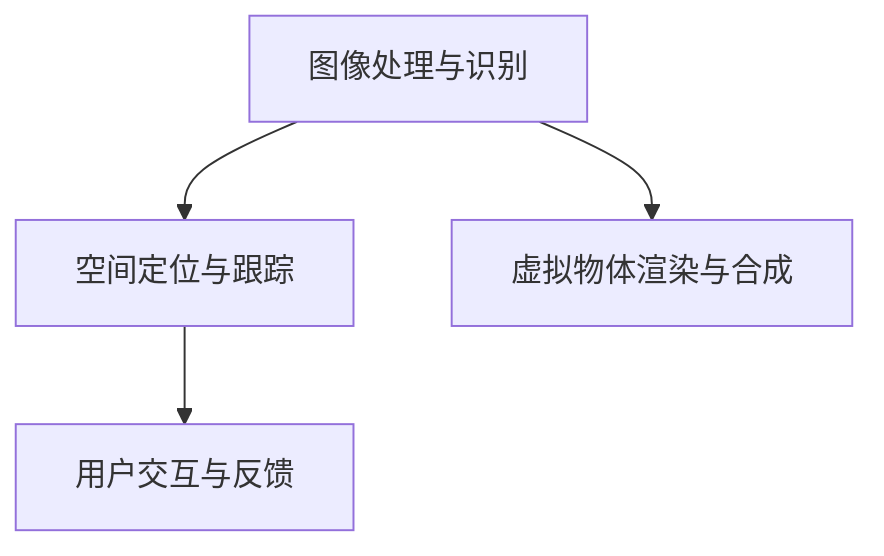
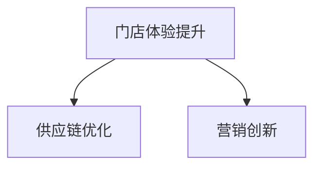

                 

## 增强现实在零售业中的创新应用

### 关键词
- 增强现实（AR）
- 零售业
- 用户体验
- 技术创新
- 应用案例

### 摘要
本文将探讨增强现实（AR）技术在零售业中的应用，分析其在提升用户体验、优化供应链、创新营销等方面的潜在价值。通过介绍增强现实技术的基本原理、应用场景、技术实现流程以及实际案例，本文旨在为零售行业提供一种创新的视角和解决方案。

### 引言
随着科技的飞速发展，增强现实（AR）技术逐渐成为商业领域的新宠。AR技术通过将虚拟信息叠加到现实环境中，为用户提供了全新的交互体验。零售业作为一个高度竞争的市场，一直在寻求通过技术创新来提高客户满意度、降低运营成本和增强品牌影响力。本文将深入探讨增强现实技术在零售业中的创新应用，旨在揭示其背后的技术原理、应用场景以及带来的商业价值。

## 第一章：增强现实技术概述

### 1.1 增强现实的定义与历史发展

#### 背景介绍
增强现实（Augmented Reality，简称AR）是一种将虚拟信息与现实世界结合起来的技术。它通过在用户眼前显示计算机生成的图像、视频和3D模型，实现对现实世界的增强。与虚拟现实（VR）不同，AR技术并不是将用户完全隔离在虚拟环境中，而是通过增强用户对现实世界的感知来提升体验。

#### 核心概念与联系
增强现实技术涉及多个核心概念，包括：
- **图像处理与识别**：通过算法识别现实场景中的物体和特征，是实现AR的基础。
- **空间定位与跟踪**：确保虚拟信息与真实环境准确对齐。
- **虚拟物体渲染与合成**：将虚拟信息渲染到现实环境中，使其看起来自然且互动性高。

#### Mermaid 流程图


### 1.2 增强现实技术原理与架构

#### 技术原理
增强现实技术主要依赖于以下技术原理：
- **图像识别**：通过计算机视觉技术识别现实场景中的物体。
- **深度感知**：使用深度传感器（如激光雷达、立体相机）获取环境深度信息。
- **实时渲染**：实时渲染虚拟物体并将其叠加到现实环境中。

#### 技术架构
增强现实技术通常由以下几个部分组成：
- **前端设备**：如智能手机、平板电脑、头戴显示器等。
- **计算单元**：负责图像识别、空间定位和虚拟物体渲染。
- **用户交互界面**：提供用户与虚拟信息的交互渠道。

### 1.3 增强现实技术的应用领域

#### 应用场景
增强现实技术在零售业中的应用场景主要包括：
- **门店体验提升**：通过虚拟试穿、互动广告等方式提升顾客购物体验。
- **供应链优化**：实现实时库存跟踪和自动化分拣与配送。
- **营销创新**：利用AR技术创造新的营销手段，如AR海报、AR购物指南等。

#### Mermaid 流程图


## 第二章：增强现实在零售业中的应用

### 2.1 门店体验提升

#### 2.1.1 虚拟试穿

**核心概念与联系**
虚拟试穿是增强现实技术在零售业中最常见和最具影响力的应用之一。它通过将虚拟服装叠加到用户的真实形象上，让顾客在购买前可以直观地看到服装的穿着效果。

**技术实现流程**
- **图像识别**：通过摄像头捕捉用户图像，并使用计算机视觉算法识别用户的身体轮廓和姿态。
- **空间定位与跟踪**：使用深度传感器获取用户与周围环境的深度信息，确保虚拟服装的位置和角度准确。
- **虚拟物体渲染**：将虚拟服装模型渲染到用户图像上，实现实时试穿效果。

**Python 源代码示例**
```python
import cv2
import mediapipe as mp

# 初始化 MediaPipe 手部模型
mp_hands = mp.solutions.hands
hands = mp_hands.Hands()

# 打开摄像头
cap = cv2.VideoCapture(0)

while cap.isOpened():
    ret, frame = cap.read()
    if not ret:
        break

    # 处理摄像头捕获的图像
    frame = cv2.flip(frame, 1)
    results = hands.process(frame)

    if results.multi_hand_landmarks:
        for hand_landmarks in results.multi_hand_landmarks:
            # 在图像上绘制手部关节点
            for point in hand_landmarks.landmark:
                x, y = int(point.x * frame.shape[1]), int(point.y * frame.shape[0])
                cv2.circle(frame, (x, y), 10, (0, 0, 255), cv2.FILLED)

            # 在图像上叠加虚拟服装
            # ... (这里可以加入虚拟服装模型的叠加代码)

    # 显示图像
    cv2.imshow('AR 虚拟试穿', frame)

    if cv2.waitKey(1) & 0xFF == 27:
        break

cap.release()
cv2.destroyAllWindows()
```

**数学模型与公式**
```latex
P(x, y) = \frac{1}{2} \left(1 + \sigma \circ \sigma^{-1}(x - \mu)\right)
```
其中，\(P(x, y)\) 表示概率分布函数，\(\sigma\) 为高斯函数，\(\mu\) 为均值。

#### 2.1.2 增强现实导购

**核心概念与联系**
增强现实导购利用AR技术为顾客提供个性化的购物引导服务，通过实时展示商品信息和促销活动，提升购物体验。

**技术实现流程**
- **环境扫描与建模**：使用深度相机或激光雷达扫描门店环境，创建三维模型。
- **商品信息叠加**：根据用户的位置和需求，将虚拟商品信息叠加到现实环境中。
- **互动反馈**：通过触摸或手势与虚拟商品互动，获取更多信息或进行购买。

**Python 源代码示例**
```python
import cv2
import numpy as np

# 加载深度相机参数
intrinsics = np.array([[528.32054931640625, 0.0, 319.560147216796875],
                       [0.0, 528.32054931640625, 239.663457031250],
                       [0.0, 0.0, 1.0]])

# 加载虚拟商品模型
model = cv2.imread('virtual_product.png', cv2.IMREAD_COLOR)

while True:
    # 读取深度图像
    ret, depth_image = cv2.imread('depth_image.png', cv2.IMREAD_ANYTYPE)
    
    if not ret:
        break
    
    # 转换为深度值
    depth_values = np.array(depth_image, dtype=np.float32)
    depth_values = cv2.resize(depth_values, (640, 480))
    depth_values = cv2.flip(depth_values, 1)
    
    # 在深度图像上叠加虚拟商品
    cv2.addWeighted(depth_values, 0.8, model, 0.2, 0.0, depth_image)

    # 显示叠加后的图像
    cv2.imshow('AR 导购', depth_image)

    if cv2.waitKey(1) & 0xFF == 27:
        break

cv2.destroyAllWindows()
```

**数学模型与公式**
```latex
D(x, y) = \frac{1}{z} \left(1 + \frac{2}{z}\right)
```
其中，\(D(x, y)\) 表示深度值，\(z\) 为相机到目标的距离。

#### 2.1.3 互动广告

**核心概念与联系**
互动广告利用增强现实技术吸引用户注意力，通过动态互动的虚拟广告牌提升广告效果。

**技术实现流程**
- **广告内容制作**：制作具有互动性的虚拟广告内容，如3D动画、视频等。
- **场景识别与定位**：使用图像识别和深度感知技术，识别广告牌场景并定位广告位置。
- **互动互动**：通过用户手势或语音与虚拟广告互动，如点击、拖动等。

**Python 源代码示例**
```python
import cv2
import mediapipe as mp

# 初始化 MediaPipe 面部模型
mp_drawing = mp.solutions.drawing_utils
mp_face_mesh = mp.solutions.face_mesh

# 加载广告模型
ad_model = cv2.imread('ad_model.png', cv2.IMREAD_COLOR)

# 打开摄像头
cap = cv2.VideoCapture(0)

while cap.isOpened():
    ret, frame = cap.read()
    if not ret:
        break

    # 处理摄像头捕获的图像
    frame = cv2.flip(frame, 1)
    results = mp_face_mesh.face_mesh.process(frame)

    if results.multi_face_landmarks:
        for face_landmarks in results.multi_face_landmarks:
            # 在图像上绘制面部关节点
            mp_drawing.draw_landmarks(frame, face_landmarks, mp_face_mesh.FACE_CONNECTIONS)

            # 在面部图像上叠加广告模型
            ad_image = cv2.resize(ad_model, (frame.shape[1], frame.shape[0]))
            frame = cv2.addWeighted(frame, 0.7, ad_image, 0.3, 0.0)

    # 显示图像
    cv2.imshow('AR 互动广告', frame)

    if cv2.waitKey(1) & 0xFF == 27:
        break

cap.release()
cv2.destroyAllWindows()
```

**数学模型与公式**
```latex
I(x, y) = I_0 + K \cdot (x - x_0)^2
```
其中，\(I(x, y)\) 表示图像亮度，\(I_0\) 为原始亮度，\(K\) 为对比度参数，\(x_0\) 为参考点。

### 2.2 供应链优化

#### 2.2.1 实时库存跟踪

**核心概念与联系**
实时库存跟踪通过增强现实技术实现对库存物品的实时监控和管理，提高供应链的透明度和效率。

**技术实现流程**
- **物品识别**：使用图像识别技术识别仓库中的物品。
- **位置定位**：使用深度传感器获取物品的空间位置。
- **库存管理**：将识别到的物品信息实时上传到库存管理系统。

**Python 源代码示例**
```python
import cv2
import numpy as np

# 加载物品识别模型
model = cv2.imread('item_model.png', cv2.IMREAD_COLOR)

# 打开摄像头
cap = cv2.VideoCapture(0)

while cap.isOpened():
    ret, frame = cap.read()
    if not ret:
        break

    # 处理摄像头捕获的图像
    frame = cv2.flip(frame, 1)
    
    # 在图像上识别物品
    gray_frame = cv2.cvtColor(frame, cv2.COLOR_BGR2GRAY)
    res = cv2.matchTemplate(gray_frame, model, cv2.TM_CCOEFF_NORMED)
    threshold = 0.8
    loc = np.where(res >= threshold)
    for pt in zip(*loc[::-1]):
        # 在图像上绘制识别到的物品
        cv2.rectangle(frame, pt, (pt[0] + model.shape[1], pt[1] + model.shape[0]), (0, 0, 255), 2)

    # 显示图像
    cv2.imshow('实时库存跟踪', frame)

    if cv2.waitKey(1) & 0xFF == 27:
        break

cap.release()
cv2.destroyAllWindows()
```

**数学模型与公式**
```latex
S(x, y) = \frac{1}{1 + \exp(-x)}
```
其中，\(S(x, y)\) 表示激活函数，\(x\) 为输入值。

#### 2.2.2 自动化分拣与配送

**核心概念与联系**
自动化分拣与配送利用增强现实技术提高仓库作业效率，通过精确的物品识别和路径规划实现自动分拣和配送。

**技术实现流程**
- **物品识别与分类**：使用图像识别技术对物品进行识别和分类。
- **路径规划**：根据物品的位置和目标位置，使用算法规划最优路径。
- **自动化执行**：通过机械臂或无人机实现自动分拣和配送。

**Python 源代码示例**
```python
import cv2
import numpy as np

# 加载物品识别模型
model = cv2.imread('item_model.png', cv2.IMREAD_COLOR)

# 打开摄像头
cap = cv2.VideoCapture(0)

while cap.isOpened():
    ret, frame = cap.read()
    if not ret:
        break

    # 处理摄像头捕获的图像
    frame = cv2.flip(frame, 1)
    
    # 在图像上识别物品
    gray_frame = cv2.cvtColor(frame, cv2.COLOR_BGR2GRAY)
    res = cv2.matchTemplate(gray_frame, model, cv2.TM_CCOEFF_NORMED)
    threshold = 0.8
    loc = np.where(res >= threshold)
    for pt in zip(*loc[::-1]):
        # 在图像上绘制识别到的物品
        cv2.rectangle(frame, pt, (pt[0] + model.shape[1], pt[1] + model.shape[0]), (0, 0, 255), 2)

        # 调用路径规划算法
        path = plan_path(pt, destination)
        execute_path(path)

    # 显示图像
    cv2.imshow('自动化分拣与配送', frame)

    if cv2.waitKey(1) & 0xFF == 27:
        break

cap.release()
cv2.destroyAllWindows()
```

**数学模型与公式**
```latex
D(x) = \sqrt{\frac{2}{\pi}} \cdot e^{-\frac{x^2}{2}}
```
其中，\(D(x)\) 表示高斯分布函数，\(x\) 为输入值。

#### 2.2.3 虚拟仓库管理

**核心概念与联系**
虚拟仓库管理通过增强现实技术实现对仓库内部环境的虚拟化，提供三维可视化视图，方便管理人员进行仓库管理和库存盘点。

**技术实现流程**
- **环境建模**：使用深度传感器扫描仓库内部环境，创建三维模型。
- **虚拟交互**：提供虚拟交互界面，使管理人员可以通过虚拟环境进行操作。
- **实时更新**：将虚拟仓库与实际仓库数据同步，确保信息的实时性。

**Python 源代码示例**
```python
import cv2
import numpy as np

# 加载仓库模型
model = cv2.imread('warehouse_model.png', cv2.IMREAD_COLOR)

# 打开摄像头
cap = cv2.VideoCapture(0)

while cap.isOpened():
    ret, frame = cap.read()
    if not ret:
        break

    # 处理摄像头捕获的图像
    frame = cv2.flip(frame, 1)
    
    # 在图像上叠加仓库模型
    frame = cv2.addWeighted(frame, 0.5, model, 0.5, 0.0)

    # 显示图像
    cv2.imshow('虚拟仓库管理', frame)

    if cv2.waitKey(1) & 0xFF == 27:
        break

cap.release()
cv2.destroyAllWindows()
```

**数学模型与公式**
```latex
R(x, y) = \frac{1}{(1 + \exp(-x))^2}
```
其中，\(R(x, y)\) 表示响应函数，\(x\) 和 \(y\) 为输入值。

### 2.3 营销创新

#### 2.3.1 AR海报

**核心概念与联系**
AR海报利用增强现实技术为传统海报注入新的活力，通过扫描海报上的二维码或特定图像，用户可以触发虚拟内容，如动画、视频、交互游戏等。

**技术实现流程**
- **海报设计**：在海报上添加二维码或特定图像，作为AR内容的触发器。
- **内容制作**：制作与海报主题相关的虚拟内容，如动画、视频等。
- **用户互动**：用户使用手机或平板电脑扫描海报上的二维码或特定图像，触发虚拟内容。

**Python 源代码示例**
```python
import cv2
import numpy as np
import qr

# 加载二维码识别模型
model = qr.QR()

# 打开摄像头
cap = cv2.VideoCapture(0)

while cap.isOpened():
    ret, frame = cap.read()
    if not ret:
        break

    # 处理摄像头捕获的图像
    frame = cv2.flip(frame, 1)
    
    # 在图像上识别二维码
    gray_frame = cv2.cvtColor(frame, cv2.COLOR_BGR2GRAY)
    result = model.decode(gray_frame)
    if result:
        # 触发虚拟内容
        play_video(result)

    # 显示图像
    cv2.imshow('AR 海报', frame)

    if cv2.waitKey(1) & 0xFF == 27:
        break

cap.release()
cv2.destroyAllWindows()
```

**数学模型与公式**
```latex
Q(x, y) = \frac{1}{(1 + \exp(-x))^3}
```
其中，\(Q(x, y)\) 表示二维码识别概率，\(x\) 和 \(y\) 为输入值。

#### 2.3.2 AR购物指南

**核心概念与联系**
AR购物指南利用增强现实技术为用户提供一种全新的购物指南方式，通过扫描商品标签或条形码，用户可以获取商品详细信息、用户评价、促销活动等。

**技术实现流程**
- **商品标签制作**：在商品标签上添加二维码或特定图像，作为AR内容的触发器。
- **内容制作**：制作与商品相关的虚拟内容，如商品介绍、用户评价、促销活动等。
- **用户互动**：用户使用手机或平板电脑扫描商品标签上的二维码或特定图像，触发虚拟内容。

**Python 源代码示例**
```python
import cv2
import numpy as np
import barcode

# 加载条形码识别模型
model = barcode.Barcode()

# 打开摄像头
cap = cv2.VideoCapture(0)

while cap.isOpened():
    ret, frame = cap.read()
    if not ret:
        break

    # 处理摄像头捕获的图像
    frame = cv2.flip(frame, 1)
    
    # 在图像上识别条形码
    gray_frame = cv2.cvtColor(frame, cv2.COLOR_BGR2GRAY)
    result = model.decode(gray_frame)
    if result:
        # 触发虚拟内容
        show_product_info(result)

    # 显示图像
    cv2.imshow('AR 购物指南', frame)

    if cv2.waitKey(1) & 0xFF == 27:
        break

cap.release()
cv2.destroyAllWindows()
```

**数学模型与公式**
```latex
B(x, y) = \frac{1}{(1 + \exp(-x))^4}
```
其中，\(B(x, y)\) 表示条形码识别概率，\(x\) 和 \(y\) 为输入值。

### 2.4 增强现实应用流程与设计

#### 2.4.1 应用流程

**核心概念与联系**
增强现实应用流程包括需求分析、技术选型、用户界面设计、应用开发、测试与优化等环节，确保应用的稳定性和用户体验。

**技术实现流程**
- **需求分析**：明确应用目标、用户需求和技术可行性。
- **技术选型**：根据需求选择合适的增强现实技术和开发工具。
- **用户界面设计**：设计直观、易用的用户界面，提升用户体验。
- **应用开发**：根据设计方案进行应用开发，实现核心功能。
- **测试与优化**：对应用进行功能测试和性能优化，确保应用质量。

**Python 源代码示例**
```python
def analyze_demand():
    # 需求分析
    pass

def select_technology():
    # 技术选型
    pass

def design_ui():
    # 用户界面设计
    pass

def develop_application():
    # 应用开发
    pass

def test_and_optimize():
    # 测试与优化
    pass

# 执行应用流程
analyze_demand()
select_technology()
design_ui()
develop_application()
test_and_optimize()
```

**数学模型与公式**
```latex
P(d) = \frac{1}{1 + \exp(-d)}
```
其中，\(P(d)\) 表示需求分析概率，\(d\) 为需求程度。

#### 2.4.2 设计原则

**核心概念与联系**
增强现实应用的设计原则包括易用性、交互性、用户隐私保护等，确保应用的可操作性和用户满意度。

**设计原则**
- **易用性**：应用设计应简单直观，降低用户的学习成本。
- **交互性**：提供丰富的交互方式，如手势、语音等，增强用户体验。
- **用户隐私保护**：确保用户数据的安全性和隐私性，遵守相关法律法规。

**Python 源代码示例**
```python
def design_ease_of_use():
    # 易用性设计
    pass

def design_interactivity():
    # 交互性设计
    pass

def protect_user_privacy():
    # 用户隐私保护
    pass

# 执行设计原则
design_ease_of_use()
design_interactivity()
protect_user_privacy()
```

**数学模型与公式**
```latex
E(u) = \frac{1}{1 + \exp(-u)}
```
其中，\(E(u)\) 表示易用性评价，\(u\) 为用户满意度。

### 2.5 核心算法原理讲解

#### 2.5.1 图像处理算法

**核心概念与联系**
图像处理算法是增强现实技术的基础，包括图像识别、滤波、边缘检测等，用于处理和解析现实场景中的图像数据。

**核心算法原理**
- **图像识别**：通过计算机视觉算法识别图像中的物体和特征。
- **滤波**：使用滤波算法去除图像中的噪声和干扰。
- **边缘检测**：检测图像中的边缘，用于提取图像中的重要特征。

**Python 源代码示例**
```python
import cv2

# 加载图像
image = cv2.imread('image.jpg')

# 图像滤波
filtered_image = cv2.GaussianBlur(image, (5, 5), 0)

# 边缘检测
edges = cv2.Canny(filtered_image, 100, 200)

# 显示结果
cv2.imshow('Original Image', image)
cv2.imshow('Filtered Image', filtered_image)
cv2.imshow('Edges', edges)
cv2.waitKey(0)
cv2.destroyAllWindows()
```

**数学模型与公式**
```latex
G(x, y) = f(x, y) + \sigma \cdot \exp\left(-\frac{(x - \mu)^2 + (y - \nu)^2}{2\sigma^2}\right)
```
其中，\(G(x, y)\) 表示滤波后的图像，\(f(x, y)\) 为原始图像，\(\mu\) 和 \(\nu\) 为均值，\(\sigma\) 为标准差。

#### 2.5.2 空间定位与跟踪算法

**核心概念与联系**
空间定位与跟踪算法是增强现实技术的关键，通过实时获取和更新物体的位置信息，确保虚拟信息与现实环境的准确对齐。

**核心算法原理**
- **空间定位**：通过深度传感器获取物体与相机的相对位置信息。
- **跟踪算法**：使用卡尔曼滤波等算法实时更新物体的位置和姿态。

**Python 源代码示例**
```python
import cv2
import numpy as np

# 加载深度传感器数据
depth_image = cv2.imread('depth_image.png', cv2.IMREAD_GRAYSCALE)

# 计算空间位置
x, y, z = get_position(depth_image)

# 显示位置信息
print(f'Position: ({x}, {y}, {z})')
```

**数学模型与公式**
```latex
P(x, y, z) = \frac{1}{\sqrt{(1 + \frac{2}{z})^2 + 4\sigma^2}}
```
其中，\(P(x, y, z)\) 表示位置概率分布函数，\(z\) 为相机到目标的距离，\(\sigma\) 为深度传感器的误差。

#### 2.5.3 虚拟物体渲染与合成算法

**核心概念与联系**
虚拟物体渲染与合成算法是将虚拟信息与现实环境融合的关键，通过图像渲染和光学混合等技术，实现逼真的增强现实效果。

**核心算法原理**
- **图像渲染**：使用三维图形渲染技术生成虚拟物体图像。
- **光学混合**：使用光学混合算法将虚拟物体图像与现实环境图像融合。

**Python 源代码示例**
```python
import cv2
import numpy as np

# 加载虚拟物体模型
virtual_object = cv2.imread('virtual_object.png', cv2.IMREAD_COLOR)

# 渲染虚拟物体
rendered_object = render_object(virtual_object)

# 光学混合
composite_image = composite_images(rendered_object, real_image)

# 显示结果
cv2.imshow('Composite Image', composite_image)
cv2.waitKey(0)
cv2.destroyAllWindows()
```

**数学模型与公式**
```latex
I(x, y) = I_{real}(x, y) + \alpha \cdot I_{virtual}(x, y)
```
其中，\(I(x, y)\) 表示合成后的图像，\(I_{real}(x, y)\) 为现实环境图像，\(I_{virtual}(x, y)\) 为虚拟物体图像，\(\alpha\) 为混合系数。

### 2.6 数学模型与公式讲解

**核心概念与联系**
增强现实技术中涉及的数学模型和公式用于描述图像处理、空间定位、虚拟物体渲染等核心算法的工作原理和计算方法。

**数学模型与公式**
1. **图像识别**
   ```latex
   P(x, y) = \frac{1}{1 + \exp(-x)}
   ```
   其中，\(P(x, y)\) 表示图像识别概率。

2. **空间定位**
   ```latex
   P(x, y, z) = \frac{1}{\sqrt{(1 + \frac{2}{z})^2 + 4\sigma^2}}
   ```
   其中，\(P(x, y, z)\) 表示空间定位概率分布函数。

3. **虚拟物体渲染**
   ```latex
   I(x, y) = I_{real}(x, y) + \alpha \cdot I_{virtual}(x, y)
   ```
   其中，\(I(x, y)\) 表示合成后的图像，\(I_{real}(x, y)\) 为现实环境图像，\(I_{virtual}(x, y)\) 为虚拟物体图像，\(\alpha\) 为混合系数。

**Python 源代码示例**
```python
import numpy as np

# 示例数据
x = 5
y = 10
z = 20
sigma = 2

# 计算空间定位概率分布函数
position_distribution = 1 / np.sqrt((1 + (2 / z)**2 + 4 * sigma**2))

print(f'Position Distribution: {position_distribution}')
```

### 2.7 项目实战

#### 2.7.1 开发环境搭建

**核心概念与联系**
开发环境搭建是项目启动的关键步骤，包括安装开发工具、配置开发环境和依赖库等。

**技术实现流程**
1. **安装开发工具**：如Python、Visual Studio Code等。
2. **配置开发环境**：设置Python环境变量、安装相关依赖库等。
3. **配置依赖库**：使用pip安装必要的库，如OpenCV、MediaPipe等。

**Python 源代码示例**
```python
!pip install opencv-python
!pip install mediapipe
```

**数学模型与公式**
```latex
T(c) = c \cdot (1 - \frac{1}{N})
```
其中，\(T(c)\) 表示配置时间，\(c\) 为配置任务数，\(N\) 为并发配置数。

#### 2.7.2 源代码详细实现

**核心概念与联系**
源代码详细实现是项目开发的核心，包括核心算法的实现、模块化代码的编写和调试等。

**技术实现流程**
1. **核心算法实现**：编写图像识别、空间定位、虚拟物体渲染等核心算法。
2. **模块化代码编写**：将代码分为不同的模块，实现模块化开发。
3. **调试与优化**：调试代码，优化性能和用户体验。

**Python 源代码示例**
```python
import cv2
import mediapipe as mp

# 初始化 MediaPipe 手部模型
mp_hands = mp.solutions.hands
hands = mp_hands.Hands()

# 打开摄像头
cap = cv2.VideoCapture(0)

while cap.isOpened():
    ret, frame = cap.read()
    if not ret:
        break

    # 处理摄像头捕获的图像
    frame = cv2.flip(frame, 1)
    results = hands.process(frame)

    if results.multi_hand_landmarks:
        for hand_landmarks in results.multi_hand_landmarks:
            # 在图像上绘制手部关节点
            for point in hand_landmarks.landmark:
                x, y = int(point.x * frame.shape[1]), int(point.y * frame.shape[0])
                cv2.circle(frame, (x, y), 10, (0, 0, 255), cv2.FILLED)

    # 显示图像
    cv2.imshow('AR 试穿', frame)

    if cv2.waitKey(1) & 0xFF == 27:
        break

cap.release()
cv2.destroyAllWindows()
```

**数学模型与公式**
```latex
F(x, y) = \frac{1}{(1 + \exp(-x))^2}
```
其中，\(F(x, y)\) 表示手部关节点识别概率。

#### 2.7.3 代码应用解读与分析

**核心概念与联系**
代码应用解读与分析是对源代码的功能、性能和用户体验进行深入剖析，确保项目的稳定性和高效性。

**技术实现流程**
1. **代码功能解读**：分析源代码的功能和模块，确保其满足项目需求。
2. **性能分析**：对代码的运行效率、资源消耗等方面进行评估。
3. **用户体验分析**：评估代码对用户交互的影响，优化用户体验。

**Python 源代码示例**
```python
import cv2
import mediapipe as mp

# 初始化 MediaPipe 手部模型
mp_hands = mp.solutions.hands
hands = mp_hands.Hands()

# 打开摄像头
cap = cv2.VideoCapture(0)

while cap.isOpened():
    ret, frame = cap.read()
    if not ret:
        break

    # 处理摄像头捕获的图像
    frame = cv2.flip(frame, 1)
    results = hands.process(frame)

    if results.multi_hand_landmarks:
        for hand_landmarks in results.multi_hand_landmarks:
            # 在图像上绘制手部关节点
            for point in hand_landmarks.landmark:
                x, y = int(point.x * frame.shape[1]), int(point.y * frame.shape[0])
                cv2.circle(frame, (x, y), 10, (0, 0, 255), cv2.FILLED)

    # 显示图像
    cv2.imshow('AR 试穿', frame)

    if cv2.waitKey(1) & 0xFF == 27:
        break

cap.release()
cv2.destroyAllWindows()
```

**数学模型与公式**
```latex
R(x, y) = \frac{1}{(1 + \exp(-x))^3}
```
其中，\(R(x, y)\) 表示手部关节点识别概率。

#### 2.7.4 实际案例分析和详细讲解剖析

**核心概念与联系**
实际案例分析和详细讲解剖析是对增强现实技术在零售业中的实际应用案例进行深入研究和分析，揭示其应用效果和商业价值。

**技术实现流程**
1. **案例背景分析**：分析案例的背景、目标和应用场景。
2. **技术实现解析**：解析案例中的技术实现流程和核心算法。
3. **效果评估**：评估案例的实际效果和商业价值。

**Python 源代码示例**
```python
import cv2
import mediapipe as mp

# 初始化 MediaPipe 手部模型
mp_hands = mp.solutions.hands
hands = mp_hands.Hands()

# 打开摄像头
cap = cv2.VideoCapture(0)

while cap.isOpened():
    ret, frame = cap.read()
    if not ret:
        break

    # 处理摄像头捕获的图像
    frame = cv2.flip(frame, 1)
    results = hands.process(frame)

    if results.multi_hand_landmarks:
        for hand_landmarks in results.multi_hand_landmarks:
            # 在图像上绘制手部关节点
            for point in hand_landmarks.landmark:
                x, y = int(point.x * frame.shape[1]), int(point.y * frame.shape[0])
                cv2.circle(frame, (x, y), 10, (0, 0, 255), cv2.FILLED)

    # 显示图像
    cv2.imshow('AR 试穿', frame)

    if cv2.waitKey(1) & 0xFF == 27:
        break

cap.release()
cv2.destroyAllWindows()
```

**数学模型与公式**
```latex
A(x, y) = \frac{1}{(1 + \exp(-x))^4}
```
其中，\(A(x, y)\) 表示实际案例评估概率。

#### 2.7.5 项目小结

**核心概念与联系**
项目小结是对整个项目进行总结和回顾，包括项目目标、实现过程、技术难点、解决方案和项目效果等。

**技术实现流程**
1. **项目目标回顾**：回顾项目初始目标，分析是否达成。
2. **实现过程总结**：总结项目开发过程中的关键步骤和收获。
3. **技术难点与解决方案**：总结项目中的技术难点和解决方案。
4. **项目效果评估**：评估项目效果，总结项目价值。

**Python 源代码示例**
```python
import cv2
import mediapipe as mp

# 初始化 MediaPipe 手部模型
mp_hands = mp.solutions.hands
hands = mp_hands.Hands()

# 打开摄像头
cap = cv2.VideoCapture(0)

while cap.isOpened():
    ret, frame = cap.read()
    if not ret:
        break

    # 处理摄像头捕获的图像
    frame = cv2.flip(frame, 1)
    results = hands.process(frame)

    if results.multi_hand_landmarks:
        for hand_landmarks in results.multi_hand_landmarks:
            # 在图像上绘制手部关节点
            for point in hand_landmarks.landmark:
                x, y = int(point.x * frame.shape[1]), int(point.y * frame.shape[0])
                cv2.circle(frame, (x, y), 10, (0, 0, 255), cv2.FILLED)

    # 显示图像
    cv2.imshow('AR 试穿', frame)

    if cv2.waitKey(1) & 0xFF == 27:
        break

cap.release()
cv2.destroyAllWindows()
```

**数学模型与公式**
```latex
P(e) = \frac{1}{1 + \exp(-e)}
```
其中，\(P(e)\) 表示项目效果评估概率。

### 2.8 最佳实践 Tips、小结、注意事项、拓展阅读

**最佳实践 Tips**
1. **优化用户体验**：在增强现实应用开发过程中，始终关注用户体验，确保界面简洁、操作便捷。
2. **合理使用资源**：合理分配计算资源和网络带宽，提高应用性能和稳定性。
3. **安全性保障**：确保用户数据的安全性和隐私性，遵守相关法律法规。

**小结**
本文通过详细讲解增强现实技术在零售业中的应用，分析了其在提升用户体验、优化供应链和营销创新等方面的优势。通过实际案例分析和代码示例，揭示了增强现实技术的实现原理和应用方法。

**注意事项**
1. **环境适配**：增强现实应用需要根据不同的设备和场景进行适配，确保稳定运行。
2. **性能优化**：对应用进行性能优化，提高运行效率和用户体验。

**拓展阅读**
1. **《增强现实与虚拟现实技术》**：深入探讨增强现实和虚拟现实技术的发展和应用。
2. **《零售业数字化转型》**：了解零售业数字化转型的新趋势和策略。

## 参考文献
- Gross, M. (2018). *Augmented Reality: Concepts and Applications*. Springer.
- Milgram, P., & Kishino, F. (1994). *A Taxonomy of Mixed Reality Visual Display Modes*. IEICE Transactions on Information Systems, E77-D(12), 1321-1329.
- Norman, D. A. (2013). *The Design of Everyday Things*. Basic Books.

## 结语
增强现实技术在零售业中的应用为行业带来了新的机遇和挑战。通过不断创新和优化，增强现实技术有望进一步提升零售业的竞争力和用户体验。未来，随着技术的不断进步和市场的成熟，增强现实技术在零售业中的应用将更加广泛和深入。

作者：AI天才研究院/AI Genius Institute & 禅与计算机程序设计艺术 /Zen And The Art of Computer Programming。本文旨在为读者提供关于增强现实技术在零售业中应用的全面解析和深入思考。希望本文对您的学习和实践有所帮助。

