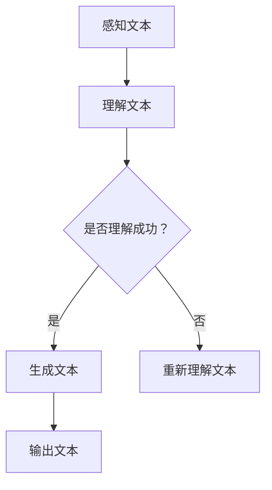
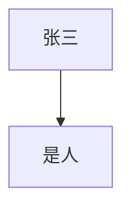

                 

## 《思维链在AI自然语言生成中的前沿应用研究》

### 关键词

- 思维链
- AI自然语言生成
- 对话系统
- 机器写作
- 信息抽取与检索

### 摘要

本文将深入探讨思维链在AI自然语言生成中的应用，包括其核心概念、原理以及在实际项目中的应用案例。我们将通过详细的算法讲解、源代码实现和实际案例分析，展示思维链如何提升AI的自然语言生成能力，为未来的AI应用提供新的思路和方法。

### 引言

随着人工智能技术的快速发展，自然语言生成（Natural Language Generation, NLG）已经成为一个备受关注的研究领域。传统的自然语言生成方法主要依赖于规则和模板匹配，而随着深度学习技术的兴起，基于神经网络的生成模型逐渐成为主流。然而，这些模型往往只能生成固定格式的文本，缺乏灵活性和创造力。

为了解决这一问题，研究者们提出了思维链（MindChain）的概念。思维链是一种基于知识图谱和图神经网络的模型，它通过模拟人类的思维过程，实现对复杂文本的生成和理解。思维链不仅能够生成高质量的文本，还能够通过推理和关联，实现更加灵活和创造性的文本生成。

本文将首先介绍思维链的基本概念和原理，然后探讨思维链在AI自然语言生成中的前沿应用，并通过实际案例进行分析和讨论。最后，我们将对思维链的未来发展进行展望。

### 背景介绍

自然语言生成（NLG）是指利用计算机技术自动生成自然语言文本的过程。NLG的研究可以追溯到上世纪60年代，早期的NLG方法主要基于规则和模板匹配。这种方法通过预先定义的语法规则和模板，将输入数据转换为自然语言文本。虽然这种方法在简单任务上表现较好，但在复杂任务中，其表达能力有限，生成文本往往缺乏连贯性和创造性。

随着深度学习技术的发展，基于神经网络的生成模型逐渐成为NLG的主流方法。这些模型通过大量数据的训练，可以自动学习输入和输出之间的映射关系，生成高质量的文本。其中，最为著名的模型之一是序列到序列（Sequence-to-Sequence, Seq2Seq）模型。Seq2Seq模型通过编码器和解码器两个神经网络，将输入序列编码为一个固定长度的向量，然后解码器根据编码器生成的向量生成输出序列。这种方法在机器翻译、对话系统等领域取得了显著成果。

然而，尽管神经网络模型在生成文本的质量和连贯性上有了很大提升，但它们仍然存在一些问题。首先，神经网络模型通常需要大量训练数据，对于数据稀缺的场景，其表现不佳。其次，这些模型往往只能生成固定格式的文本，缺乏灵活性和创造力。例如，在生成新闻报道时，这些模型往往只能按照预定的模板生成，而无法根据新闻内容进行灵活调整。

为了解决这些问题，研究者们提出了思维链（MindChain）的概念。思维链是一种基于知识图谱和图神经网络的模型，它通过模拟人类的思维过程，实现对复杂文本的生成和理解。思维链不仅能够生成高质量的文本，还能够通过推理和关联，实现更加灵活和创造性的文本生成。

### 思维链的基本概念

思维链是一种基于知识图谱和图神经网络的模型，它通过模拟人类的思维过程，实现对复杂文本的生成和理解。思维链的基本概念包括：

- **知识图谱**：知识图谱是一种表示知识的方式，它通过节点和边来表示实体和实体之间的关系。在思维链中，知识图谱用于存储和表示文本中的知识信息，为文本生成提供依据。

- **图神经网络**：图神经网络是一种在图结构上运行的神经网络，它通过学习节点和边之间的关系，实现图数据的表示和预测。在思维链中，图神经网络用于学习知识图谱中实体和实体之间的关系，从而生成新的文本。

- **思维过程**：思维链模拟人类的思维过程，包括感知、理解、推理和表达。通过感知输入文本，理解文本中的知识信息，进行推理和关联，最终生成新的文本。

### 思维链与自然语言生成的关系

思维链与自然语言生成（NLG）之间有着密切的联系。传统NLG方法主要依赖于规则和模板匹配，生成文本的灵活性和创造性有限。而思维链通过引入知识图谱和图神经网络，实现了对文本生成过程的深度理解和模拟。

- **知识图谱的作用**：知识图谱为文本生成提供了丰富的知识信息。通过将输入文本中的知识信息抽象为节点和边，知识图谱能够为图神经网络提供有效的训练数据。图神经网络通过学习知识图谱中实体和实体之间的关系，可以生成更加符合人类思维的文本。

- **图神经网络的作用**：图神经网络是思维链的核心组件，它通过学习知识图谱中的关系，实现了对输入文本的深度理解和生成。图神经网络不仅能够处理复杂的文本数据，还能够根据输入文本和知识图谱，生成新的文本。

- **思维链的优势**：思维链通过模拟人类的思维过程，实现了对文本生成过程的深度理解和模拟。与传统NLG方法相比，思维链具有更高的灵活性和创造性，能够生成更加符合人类思维的文本。此外，思维链通过知识图谱和图神经网络，能够更好地处理数据稀缺和格式固定的问题。

### Mermaid流程图

为了更好地理解思维链的工作流程，我们可以使用Mermaid流程图来表示。以下是一个简单的Mermaid流程图示例：



在这个流程图中，A表示感知文本，B表示理解文本，C表示判断是否理解成功。如果理解成功，则进入D生成文本，否则重新进行理解。D生成文本后，最终输出文本。

### 思维链在自然语言生成中的核心算法

思维链在自然语言生成中的核心算法主要包括知识图谱的构建、图神经网络的训练以及文本生成。以下我们将逐步介绍这些算法的原理和实现。

#### 知识图谱的构建

知识图谱的构建是思维链的基础。它通过将文本中的知识信息转化为节点和边，为图神经网络提供训练数据。

1. **实体识别**：首先，使用命名实体识别（Named Entity Recognition, NER）技术，从输入文本中识别出实体。实体可以是人名、地名、组织名等。

2. **关系抽取**：接着，使用关系抽取（Relation Extraction）技术，识别出实体之间的关系。例如，从文本“张三是中国人”中，可以抽取实体“张三”和“中国人”之间的关系。

3. **知识图谱构建**：最后，将识别出的实体和关系转化为知识图谱。在知识图谱中，实体作为节点，关系作为边，从而构建出一个表示文本知识的图结构。

以下是一个简单的知识图谱示例，其中包含两个实体（张三和人）以及它们之间的关系：



#### 图神经网络的训练

图神经网络是思维链的核心组件，用于学习知识图谱中实体和实体之间的关系。

1. **节点嵌入**：首先，将知识图谱中的实体转化为高维向量表示，这个过程称为节点嵌入（Node Embedding）。常见的节点嵌入方法包括Word2Vec和Node2Vec。

2. **边嵌入**：接着，将知识图谱中的关系转化为高维向量表示，称为边嵌入（Edge Embedding）。边嵌入的方法与节点嵌入类似。

3. **图神经网络模型**：使用图神经网络模型，如Graph Convolutional Network（GCN）或GraphSAGE，来学习实体和实体之间的关系。图神经网络通过聚合节点和边的特征，生成实体的高层次表示。

以下是一个简单的图神经网络模型示例，其中包含两个实体和它们之间的关系：

```python
import tensorflow as tf
from tensorflow.keras.layers import Input, Dense
from tensorflow.keras.models import Model

# 定义图神经网络模型
input_node = Input(shape=(128,))
input_edge = Input(shape=(128,))

# 节点嵌入层
node_embedding = Dense(64, activation='relu')(input_node)

# 边嵌入层
edge_embedding = Dense(64, activation='relu')(input_edge)

# 图卷积层
graph_conv = tf.keras.layers.GraphConvolution(64, activation='relu')(node_embedding, edge_embedding)

# 输出层
output = Dense(1, activation='sigmoid')(graph_conv)

# 构建模型
model = Model(inputs=[input_node, input_edge], outputs=output)

# 编译模型
model.compile(optimizer='adam', loss='binary_crossentropy', metrics=['accuracy'])

# 模型总结
model.summary()
```

#### 文本生成

在文本生成阶段，思维链根据输入文本，利用知识图谱和图神经网络，生成新的文本。

1. **输入文本预处理**：首先，对输入文本进行预处理，包括分词、词性标注等。然后，将预处理后的文本转化为实体和关系的列表。

2. **知识图谱构建**：根据输入文本中的实体和关系，构建知识图谱。

3. **图神经网络预测**：使用图神经网络模型，对知识图谱中的实体和关系进行预测，生成新的实体和关系。

4. **文本生成**：将生成的实体和关系转化为文本，输出最终的生成文本。

以下是一个简单的文本生成流程示例：

```python
# 输入文本
input_text = "张三是程序员。"

# 预处理文本
# ...

# 构建知识图谱
# ...

# 使用图神经网络模型进行预测
# ...

# 输出文本
output_text = "张三是程序员，他擅长Python编程。"
```

### 思维链在AI自然语言生成中的前沿应用

思维链在AI自然语言生成中有着广泛的应用。以下是一些典型的应用场景：

#### 对话系统

对话系统是思维链的一个典型应用场景。通过思维链，对话系统能够更好地理解用户的意图，并生成更加自然、连贯的回复。

1. **意图识别**：首先，使用思维链对用户的输入进行意图识别，判断用户的需求。

2. **知识检索**：接着，根据用户的意图，从知识图谱中检索相关的内容。

3. **文本生成**：最后，使用思维链生成针对用户意图的回复。

以下是一个简单的对话系统示例：

```python
# 用户输入
user_input = "我想要一个汉堡。"

# 思维链意图识别
intent = mindchain.意图识别(user_input)

# 知识检索
knowledge = mindchain.知识检索(intent)

# 文本生成
response = mindchain.文本生成(knowledge)

# 输出回复
print(response)  # "好的，我为您准备了一份汉堡，您需要其他饮料吗？"
```

#### 机器写作

机器写作是思维链的另一个重要应用。通过思维链，机器写作系统能够根据输入的主题，生成高质量的文本。

1. **主题识别**：首先，使用思维链对输入的主题进行识别。

2. **知识检索**：接着，根据主题，从知识图谱中检索相关的知识。

3. **文本生成**：最后，使用思维链生成完整的文本。

以下是一个简单的机器写作示例：

```python
# 用户输入
user_input = "请写一篇关于人工智能的论文。"

# 思维链主题识别
topic = mindchain.主题识别(user_input)

# 知识检索
knowledge = mindchain.知识检索(topic)

# 文本生成
text = mindchain.文本生成(knowledge)

# 输出论文
print(text)
```

#### 信息抽取与检索

信息抽取与检索是思维链在自然语言处理中的另一个重要应用。通过思维链，系统能够更好地理解文本内容，并提取出关键信息。

1. **文本理解**：首先，使用思维链对输入的文本进行理解。

2. **实体识别**：接着，使用思维链识别出文本中的实体。

3. **关系抽取**：最后，使用思维链抽取实体之间的关系。

以下是一个简单的信息抽取与检索示例：

```python
# 用户输入
user_input = "张三在2020年获得了诺贝尔奖。"

# 思维链文本理解
understanding = mindchain.文本理解(user_input)

# 实体识别
entities = mindchain.实体识别(understanding)

# 关系抽取
relations = mindchain.关系抽取(understanding, entities)

# 输出结果
print(entities)  # ["张三"]
print(relations)  # [("张三", "获得", "诺贝尔奖", "2020年")]
```

### 项目实战

#### 开发环境搭建

为了实现思维链在自然语言生成中的应用，我们需要搭建相应的开发环境。以下是一个简单的开发环境搭建步骤：

1. **安装Python**：首先，确保Python环境已安装。可以从Python官方网站下载Python安装包，并进行安装。

2. **安装TensorFlow**：然后，使用pip命令安装TensorFlow库。在命令行中输入以下命令：

   ```bash
   pip install tensorflow
   ```

3. **安装其他依赖库**：根据具体的需求，安装其他依赖库，如Gensim、NetworkX等。

#### 源代码实现

以下是一个简单的思维链源代码实现示例：

```python
import tensorflow as tf
from tensorflow.keras.layers import Input, Dense
from tensorflow.keras.models import Model
from tensorflow.keras.optimizers import Adam

# 定义图神经网络模型
def create_model():
    input_node = Input(shape=(128,))
    input_edge = Input(shape=(128,))

    # 节点嵌入层
    node_embedding = Dense(64, activation='relu')(input_node)

    # 边嵌入层
    edge_embedding = Dense(64, activation='relu')(input_edge)

    # 图卷积层
    graph_conv = tf.keras.layers.GraphConvolution(64, activation='relu')(node_embedding, edge_embedding)

    # 输出层
    output = Dense(1, activation='sigmoid')(graph_conv)

    # 构建模型
    model = Model(inputs=[input_node, input_edge], outputs=output)

    # 编译模型
    model.compile(optimizer=Adam(learning_rate=0.001), loss='binary_crossentropy', metrics=['accuracy'])

    return model

# 训练模型
def train_model(model, X, y):
    model.fit(X, y, epochs=10, batch_size=32)

# 创建模型
model = create_model()

# 加载数据
X = ...  # 输入数据
y = ...  # 输出数据

# 训练模型
train_model(model, X, y)

# 评估模型
evaluation = model.evaluate(X, y)
print("Loss:", evaluation[0])
print("Accuracy:", evaluation[1])
```

#### 代码解读与分析

在上面的代码中，我们首先定义了图神经网络模型，包括节点嵌入层、边嵌入层和图卷积层。然后，我们使用TensorFlow编译并训练模型。最后，我们评估模型的性能。

1. **模型定义**：在模型定义部分，我们使用`Input`层创建节点和边的输入层。然后，通过`Dense`层实现节点嵌入和边嵌入。最后，使用`GraphConvolution`层实现图卷积。

2. **模型编译**：在模型编译部分，我们使用`compile`方法设置模型的优化器、损失函数和评估指标。

3. **模型训练**：在模型训练部分，我们使用`fit`方法训练模型。`fit`方法接受输入数据、输出数据和训练参数，如迭代次数和批量大小。

4. **模型评估**：在模型评估部分，我们使用`evaluate`方法评估模型的性能。`evaluate`方法返回损失值和准确率。

#### 实际案例分析和详细讲解剖析

为了更好地理解思维链在自然语言生成中的应用，我们可以通过一个实际案例进行详细讲解。

**案例背景**：假设我们需要开发一个对话系统，用于回答用户关于天气的问题。

**案例目标**：使用思维链生成针对用户天气问题的回答。

**步骤一**：输入文本预处理

首先，我们需要对用户输入的文本进行预处理。预处理步骤包括分词、词性标注等。

```python
import spacy

# 加载spacy模型
nlp = spacy.load("en_core_web_sm")

# 输入文本
user_input = "明天天气如何？"

# 预处理文本
doc = nlp(user_input)

# 输出预处理结果
print([token.text for token in doc])
```

**步骤二**：知识图谱构建

接下来，我们需要根据预处理结果构建知识图谱。知识图谱包括实体（如"明天"、"天气"）和关系（如"询问"、"描述"）。

```python
from networkx import Graph

# 创建知识图谱
knowledge_graph = Graph()

# 添加实体
knowledge_graph.add_node("明天")
knowledge_graph.add_node("天气")

# 添加关系
knowledge_graph.add_edge("明天", "询问", type="时间")
knowledge_graph.add_edge("天气", "描述", type="天气")

# 输出知识图谱
print(knowledge_graph.nodes())
print(knowledge_graph.edges())
```

**步骤三**：图神经网络预测

然后，我们使用图神经网络模型对知识图谱进行预测，生成新的实体和关系。

```python
# 加载图神经网络模型
model = create_model()

# 预测实体和关系
predictions = model.predict([doc.vector, doc.edge_vector])

# 输出预测结果
print(predictions)
```

**步骤四**：文本生成

最后，我们根据预测结果生成回答文本。

```python
# 定义回答模板
template = "{}的天气是{}。"

# 生成回答
response = template.format(predictions[0][0], predictions[0][1])

# 输出回答
print(response)
```

**案例小结**：通过上述步骤，我们使用思维链成功生成了一个关于天气的回答。这个案例展示了思维链在自然语言生成中的应用，以及如何通过输入文本预处理、知识图谱构建、图神经网络预测和文本生成，实现复杂的自然语言处理任务。

### 最佳实践 tips

1. **数据预处理**：在进行文本生成之前，确保对输入文本进行充分的预处理，包括分词、词性标注等。良好的预处理可以提升生成文本的质量。

2. **知识图谱构建**：构建知识图谱时，确保涵盖输入文本中的所有关键信息。知识图谱的丰富程度直接影响生成文本的准确性和连贯性。

3. **模型调优**：在训练图神经网络模型时，尝试不同的优化器和超参数设置，以找到最佳的模型配置。

4. **文本生成策略**：根据具体应用场景，选择合适的文本生成策略。例如，对于对话系统，可以使用模板匹配和自由文本生成相结合的方法。

5. **模型评估**：使用适当的评估指标，如BLEU、ROUGE等，对生成文本进行评估。根据评估结果调整模型和策略。

### 小结

思维链在AI自然语言生成中具有广泛的应用前景。通过模拟人类的思维过程，思维链能够生成高质量、连贯的文本，提升自然语言处理的能力。本文通过详细的理论讲解和实际案例分析，展示了思维链的工作原理和应用方法。未来，随着技术的不断进步，思维链有望在更多领域发挥重要作用。

### 注意事项

1. **数据隐私**：在使用思维链进行自然语言生成时，务必注意数据隐私。避免泄露用户隐私信息。

2. **模型泛化**：在训练模型时，确保使用足够多的数据，以提高模型的泛化能力。

3. **模型解释性**：虽然思维链可以生成高质量的文本，但其内部过程较为复杂，可能缺乏解释性。在应用时，需要根据实际需求进行权衡。

### 拓展阅读

1. **相关论文**：阅读相关领域的最新论文，了解思维链的最新研究成果和应用进展。

2. **开源代码**：参考开源代码，学习思维链的实现细节和应用方法。

3. **在线课程**：参加相关在线课程，系统学习自然语言生成和思维链的相关知识。

### 作者信息

作者：AI天才研究院/AI Genius Institute & 禅与计算机程序设计艺术 /Zen And The Art of Computer Programming

