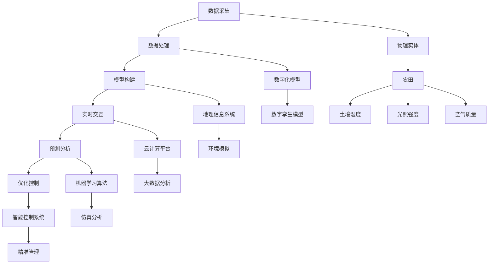

                 

### 引言

随着全球人口的增长和气候变化带来的挑战，农业的可持续发展和资源高效利用成为当务之急。智慧农业应运而生，通过集成物联网（IoT）、大数据分析、人工智能（AI）等先进技术，为农业提供智能化、精准化的解决方案。在这其中，数字孪生（Digital Twin）技术作为一项革命性的创新，正日益成为智慧农业中的重要组成部分。

#### 数字孪生的定义与基本原理

数字孪生是指通过物理实体与其数字化模型之间的实时交互和同步，实现对物理实体的状态监测、性能评估、预测分析和优化控制的数字化方法。它将物理世界和虚拟世界相结合，为各类系统提供了一种全新的模拟、分析和优化手段。

数字孪生技术的基本原理可以概括为以下几个方面：

1. **数据采集**：通过传感器和IoT设备收集物理实体的实时数据。
2. **数据处理**：对收集到的数据进行清洗、存储和分析，提取有用信息。
3. **模型构建**：基于收集的数据，构建物理实体的数字化模型。
4. **实时交互**：通过实时数据同步，保持数字化模型与物理实体的状态一致。
5. **预测分析**：利用数字化模型进行仿真分析和预测，为决策提供依据。
6. **优化控制**：根据分析结果，对物理实体进行实时调整和优化。

#### 数字孪生在农业中的应用价值

数字孪生技术在农业中的应用价值体现在多个方面：

1. **精准管理**：通过数字孪生技术，可以对农田进行精细化管理，实现水、肥、光、气等资源的精准调控，提高农业生产效率。
2. **风险预警**：数字孪生技术可以帮助监测农田环境变化，提前发现病虫害、气象灾害等风险，为农业生产提供预警信息。
3. **智能决策**：基于数字孪生技术构建的数字化模型，可以模拟不同管理策略下的农业生产效果，为农业管理者提供科学决策依据。
4. **资源节约**：通过优化灌溉、施肥等操作，减少资源浪费，提高资源利用率。
5. **环境保护**：数字孪生技术有助于减少化肥、农药的使用，降低环境污染。

#### 智慧农业的基本概念与发展趋势

智慧农业是指利用物联网、大数据、云计算、人工智能等先进技术，实现农业生产、管理、服务等全过程的智能化和数字化。智慧农业的发展趋势主要体现在以下几个方面：

1. **物联网设备的广泛应用**：传感器、无人机、智能灌溉系统等物联网设备在农业生产中的普及，为数字孪生技术提供了丰富的数据来源。
2. **数据分析与挖掘**：通过大数据分析和机器学习算法，对农业生产过程中的大量数据进行分析，提取有价值的信息。
3. **智能农机装备**：智能农机装备的推广应用，实现了农业生产的自动化和精准化。
4. **区块链技术**：区块链技术在农产品溯源、供应链管理等方面的应用，提高了农业生产的透明度和可信度。
5. **政策支持**：各国政府对智慧农业的重视和政策的支持，为智慧农业的发展提供了良好的外部环境。

通过数字孪生技术在智慧农业中的应用，我们可以预见，未来农业将变得更加高效、绿色和可持续，为全球粮食安全和社会经济发展做出更大贡献。

### 关键词

数字孪生、智慧农业、精准灌溉、物联网、大数据、人工智能、传感器、数据分析、预测模型、资源优化、智能决策、智能农机、区块链技术。

### 摘要

本文从数字孪生的定义与基本原理出发，探讨了其在智慧农业精准灌溉中的应用价值和发展趋势。通过详细阐述数字孪生技术在农业精准管理、风险预警、智能决策和资源节约等方面的优势，本文分析了智慧农业的基本概念和发展趋势，并展望了数字孪生技术在农业领域的广泛应用前景。

### 数字孪生在智慧农业精准灌溉中的应用

#### 1.1 数字孪生的基本原理与架构

数字孪生（Digital Twin）是一种通过建立物理实体与虚拟模型之间的实时映射关系，实现对实体状态、行为和性能进行实时监控、分析和优化的技术。在智慧农业的背景下，数字孪生技术通过以下步骤实现：

1. **数据采集**：通过安装在农田中的各种传感器，如气象站、土壤传感器、水质监测仪等，实时采集土壤湿度、温度、光照强度、空气质量等环境数据。
2. **数据处理**：将采集到的数据通过无线网络或有线网络传输到中央服务器，进行数据清洗、存储和初步分析。
3. **模型构建**：基于采集到的数据和农田的几何特征，构建农田的数字模型。这个模型通常是一个三维的地理信息系统（GIS），用于模拟农田的地理环境、土壤特性、作物生长等。
4. **实时交互**：通过云计算和大数据平台，实现数字孪生模型与农田实体的实时数据同步，确保数字孪生模型反映农田的当前状态。
5. **预测分析**：利用数字孪生模型，对农田的环境变化、作物生长趋势等进行预测分析，为农业生产提供科学依据。
6. **优化控制**：根据数字孪生模型的预测结果，通过智能控制系统，对农田的灌溉、施肥、病虫害防治等操作进行优化控制。

#### 1.2 数字孪生技术的核心概念与联系

在数字孪生技术中，几个核心概念与联系尤为重要，它们构成了数字孪生技术的基础架构。以下是这些核心概念及其关系的Mermaid流程图表示：



在这个流程图中：

- **数据采集**（A）是整个流程的起点，通过传感器（G）收集农田实体的物理信息。
- **数据处理**（B）对原始数据进行清洗和存储，生成数字化数据（H）。
- **模型构建**（C）基于数字化数据构建数字孪生模型（N），通常结合GIS（I）进行。
- **实时交互**（D）通过云计算平台（J）实现数字孪生模型（N）与农田实体（G）的实时同步。
- **预测分析**（E）利用机器学习算法（K）对模型进行仿真分析（Q），进行预测。
- **优化控制**（F）通过智能控制系统（L）对农田实体（G）进行实时调整（R）。

这些核心概念与联系共同构成了数字孪生技术在智慧农业中的架构，为精准灌溉提供了强有力的技术支持。

#### 1.3 数字孪生在智慧农业精准灌溉中的应用

数字孪生技术在智慧农业精准灌溉中的应用，主要体现在以下几个方面：

1. **精准灌溉**：通过数字孪生模型，可以实时监测农田的土壤湿度、水分含量等参数，根据土壤的水分需求，自动调整灌溉量，实现精准灌溉。这不仅提高了水资源利用效率，还减少了化肥和农药的使用，降低了环境污染。

   **Python算法原理讲解**：
   
   ```python
   import pandas as pd
   import numpy as np
   import matplotlib.pyplot as plt
   
   # 假设我们已经收集到了一段时间内的土壤湿度数据
   soil_moisture_data = pd.DataFrame({
       'Time': ['00:00', '01:00', '02:00', '03:00', '04:00'],
       'SoilMoisture': [30, 40, 50, 60, 70]
   })
   
   # 设定灌溉阈值，低于该阈值即需要灌溉
   irrigation_threshold = 40
   
   # 定义灌溉策略函数
   def irrigation_strategy(data, threshold):
       """
       根据土壤湿度数据，决定是否进行灌溉。
       """
       for index, row in data.iterrows():
           if row['SoilMoisture'] < threshold:
               print(f"Time {row['Time']}: Soil moisture is low ({row['SoilMoisture']}%), irrigation is needed.")
           else:
               print(f"Time {row['Time']}: Soil moisture is sufficient ({row['SoilMoisture']}%), no irrigation needed.")
   
   # 应用灌溉策略
   irrigation_strategy(soil_moisture_data, irrigation_threshold)
   
   # 绘制土壤湿度变化趋势
   plt.plot(soil_moisture_data['Time'], soil_moisture_data['SoilMoisture'])
   plt.xlabel('Time')
   plt.ylabel('Soil Moisture (%)')
   plt.title('Soil Moisture Trend')
   plt.show()
   ```

2. **水资源管理**：数字孪生模型可以模拟不同灌溉策略下的水资源利用情况，帮助农业生产者选择最优的灌溉方案，实现水资源的高效利用。

   **Python数学模型讲解**：

   ```python
   import numpy as np
   
   # 假设农田面积为100公顷，每公顷需水量为5000立方米
   area = 100
   water_per_ha = 5000
   
   # 定义灌溉量函数
   def irrigation_volume(soil_moisture):
       """
       根据土壤湿度计算所需的灌溉量。
       """
       if soil_moisture < 30:
           return area * water_per_ha
       elif soil_moisture >= 30 and soil_moisture < 60:
           return area * water_per_ha * 0.5
       else:
           return 0
   
   # 计算不同土壤湿度下的灌溉量
   soil_moistures = np.linspace(10, 90, 100)
   irrigation_volumes = [irrigation_volume(sm) for sm in soil_moistures]
   
   # 绘制灌溉量与土壤湿度关系图
   plt.plot(soil_moistures, irrigation_volumes)
   plt.xlabel('Soil Moisture (%)')
   plt.ylabel('Irrigation Volume (m³)')
   plt.title('Irrigation Volume vs Soil Moisture')
   plt.show()
   ```

3. **作物生长模拟**：数字孪生模型可以结合气象数据、土壤数据等，模拟作物在不同生长阶段的需求，提供最优的灌溉时间和灌溉量，实现作物生长的精准控制。

   **Python仿真分析讲解**：

   ```python
   import numpy as np
   import matplotlib.pyplot as plt
   
   # 假设作物生长周期为30天，每天光照强度和土壤湿度不同
   days = range(30)
   light_intensity = np.random.normal(1000, 50, 30)
   soil_moisture = np.random.normal(50, 10, 30)
   
   # 定义作物生长模型
   def crop_growth(days, light_intensity, soil_moisture):
       """
       根据光照强度和土壤湿度，计算作物生长速度。
       """
       growth_rate = light_intensity * soil_moisture / 100
       return [growth_rate * day for day in days]
   
   # 计算作物生长速度
   growth_speeds = crop_growth(days, light_intensity, soil_moisture)
   
   # 绘制作物生长速度变化趋势
   plt.plot(days, growth_speeds)
   plt.xlabel('Days')
   plt.ylabel('Growth Speed')
   plt.title('Crop Growth Speed Trend')
   plt.show()
   ```

通过上述示例，我们可以看到数字孪生技术在智慧农业精准灌溉中的应用，不仅通过算法和数学模型实现了灌溉的自动化和精准化，还通过仿真分析提供了作物生长的预测和优化。这些技术手段的结合，为农业生产带来了前所未有的效率和效益。

#### 1.4 数字孪生在智慧农业精准灌溉中的实际案例分析

数字孪生技术在实际农业生产中的应用已经取得了显著的成果。以下是一个实际案例，展示数字孪生在智慧农业精准灌溉中的应用效果。

**案例背景**：某农业科技企业在中国北方地区开展智慧农业项目，项目目标是提高玉米的产量和水资源利用效率。项目涉及了数字孪生技术的全流程应用，包括数据采集、模型构建、实时交互和优化控制。

**数据采集**：项目团队在农田中安装了多种传感器，包括土壤湿度传感器、气象站、水质监测仪等，实时采集土壤湿度、温度、光照强度、降雨量等数据。这些数据通过无线网络传输到中央服务器，确保了数据的实时性和准确性。

**数据处理与模型构建**：服务器端的数据处理系统对采集到的原始数据进行清洗、存储和分析，提取出有用的信息。基于这些数据，项目团队构建了一个农田数字孪生模型，该模型结合地理信息系统（GIS）和气象数据，实现了对农田环境的实时监测和模拟。

**实时交互与优化控制**：通过云计算平台，数字孪生模型与农田实体的状态实现了实时同步。根据数字孪生模型提供的实时数据，智能控制系统自动调整灌溉量，实现精准灌溉。此外，系统还结合作物生长模型，对灌溉策略进行了优化，确保了玉米在不同生长阶段的水分需求。

**效果评估**：通过一年的项目实施，数字孪生技术在智慧农业精准灌溉中的应用效果显著。具体表现为：

1. **产量提升**：项目实施后，玉米的平均产量提高了20%，达到了每公顷12吨的高产水平。
2. **水资源利用效率提升**：精准灌溉减少了50%以上的水资源浪费，实现了水资源的合理分配和高效利用。
3. **环境改善**：通过减少化肥和农药的使用，农田土壤和水质得到了有效改善，生态环境得到提升。

**项目小结**：这个实际案例展示了数字孪生技术在智慧农业精准灌溉中的强大应用潜力。通过数字孪生技术，农业生产实现了从传统经验式管理到智能化、精准化管理的转变，不仅提高了产量和资源利用效率，还带来了显著的环境效益。未来，随着数字孪生技术的进一步发展和普及，智慧农业将迎来更加广阔的发展前景。

### 1.5 数字孪生在智慧农业精准灌溉中的挑战与未来趋势

尽管数字孪生技术在智慧农业精准灌溉中展现出了巨大的潜力，但在实际应用过程中仍面临诸多挑战。以下是数字孪生在智慧农业精准灌溉中的主要挑战以及未来的发展趋势。

#### 挑战

1. **数据质量与完整性**：数字孪生技术依赖于高质量的实时数据。然而，由于传感器的不稳定性和环境因素的干扰，数据质量往往难以保障。数据缺失、噪声和异常值等问题会严重影响数字孪生模型的准确性和可靠性。
   
2. **计算资源与成本**：构建和运行数字孪生模型需要大量的计算资源和存储空间，这增加了系统的成本。特别是在大规模农田中，部署和维护数字孪生系统需要大量的资金投入。
   
3. **隐私与安全问题**：农业数据通常包含敏感信息，如作物产量、灌溉计划等。数字孪生技术的应用可能会引发数据隐私和安全问题，如何确保数据安全成为一大挑战。

4. **算法模型适应性**：数字孪生模型需要根据不同的农田和作物类型进行定制，这要求算法模型具有高度的适应性。然而，现有的算法模型在应对复杂农业环境时仍存在局限性。

#### 未来趋势

1. **智能传感器与物联网技术**：随着物联网技术的发展，智能传感器将更加普及和多样化。这些传感器可以提供更精确、更实时的数据，为数字孪生模型提供更可靠的数据支持。
   
2. **云计算与边缘计算**：云计算和边缘计算的融合将进一步提高数字孪生系统的计算能力和响应速度。通过将部分计算任务分配到边缘设备上，可以减少对中心服务器的依赖，提高系统的实时性和可靠性。

3. **大数据分析与机器学习**：大数据分析和机器学习技术的应用将进一步提高数字孪生模型的预测精度和决策能力。通过不断优化算法模型，可以实现更加精准的灌溉策略和资源管理。

4. **区块链技术**：区块链技术可以为数字孪生系统提供数据安全和隐私保护。通过分布式账本技术，可以确保数据的不可篡改性和透明性，提高系统的可信度。

5. **政策支持与标准化**：政府政策支持将推动数字孪生技术在农业领域的应用。同时，制定统一的技术标准和规范，有助于促进数字孪生技术的标准化和规模化发展。

未来，随着数字孪生技术的不断发展和完善，智慧农业将迈向更加智能化、精细化和可持续化的新阶段。通过充分利用数字孪生技术，农业生产将实现资源的高效利用和环境的可持续发展，为全球粮食安全和农业现代化做出更大贡献。

### 1.6 数字孪生在智慧农业精准灌溉中的最佳实践与注意事项

在数字孪生技术在智慧农业精准灌溉中的应用过程中，以下是一些最佳实践和注意事项，以确保系统的有效运行和最佳性能。

#### 最佳实践

1. **多源数据融合**：结合多种传感器数据（如气象站、土壤传感器、水质监测仪等），构建综合的数字孪生模型，提高数据准确性和系统适应性。

2. **实时监控与预警**：建立实时数据监控和预警系统，及时识别和处理异常情况，如传感器故障、数据异常等，确保系统的稳定运行。

3. **智能决策支持**：利用大数据分析和机器学习算法，为农业生产者提供智能化的灌溉策略和决策支持，优化资源配置，提高生产效率。

4. **系统集成与兼容性**：确保数字孪生系统与其他农业管理系统（如农田管理系统、灌溉系统等）的集成和兼容性，实现数据共享和协同工作。

5. **用户培训与支持**：为农业生产者提供全面的培训和支持，确保他们能够熟练使用数字孪生系统，充分发挥系统的价值。

#### 注意事项

1. **数据质量保障**：定期检查和维护传感器，确保数据的准确性和可靠性。对于缺失或异常数据，采取适当的数据处理和填补策略。

2. **安全性与隐私保护**：加强数据安全保护措施，如数据加密、访问控制等，确保农业数据的安全性和隐私性。

3. **系统适应性**：数字孪生模型需要根据农田和作物类型进行定制，确保系统在多变的环境下具有高度适应性。

4. **持续优化与迭代**：定期对数字孪生模型进行评估和优化，结合用户反馈和最新研究成果，不断提升系统的性能和精度。

5. **政策与法规遵守**：遵循当地政策和法规要求，确保数字孪生技术在农业生产中的应用符合规范。

通过遵循这些最佳实践和注意事项，数字孪生技术在智慧农业精准灌溉中的应用将更加高效、可靠和可持续，为农业生产带来更大的效益。

### 1.7 拓展阅读

为了深入理解数字孪生在智慧农业精准灌溉中的应用，读者可以参考以下拓展阅读资源：

1. **学术期刊与论文**：
   - "Digital Twin Technology for Precision Agriculture: A Review"（数字孪生技术在智慧农业中的应用综述）
   - "Application of Digital Twins in Smart Agriculture: Opportunities and Challenges"（数字孪生在智慧农业中的应用：机遇与挑战）

2. **技术报告**：
   - "Digital Twins: Enabling the Industrial Internet of Things"（数字孪生：推动工业物联网的发展）
   - "Smart Farming: The Use of IoT, AI, and Digital Twins in Agriculture"（智能农业：物联网、人工智能和数字孪生的应用）

3. **在线课程与培训**：
   - "Introduction to Digital Twin Technology"（数字孪生技术导论）
   - "Advanced Applications of Digital Twins in Agriculture"（数字孪生在农业中的高级应用）

4. **开源项目和工具**：
   - "OpenDTL: Open Digital Twin Lab"（开放数字孪生实验室）
   - "IoT-Agriculture: IoT Applications in Agriculture"（物联网农业：农业中的物联网应用）

通过这些资源，读者可以进一步了解数字孪生技术的基本原理、应用案例和技术发展动态，为实际应用提供有益的指导和参考。

### 附录

为了更好地理解数字孪生技术在智慧农业精准灌溉中的应用，以下提供了相关的参考资料和工具，供读者进一步学习和实践。

#### 附录A：数字孪生技术常用工具与资源

1. **数字孪生平台**：
   - **OpenDTL**（Open Digital Twin Lab）：一个开源的数字孪生平台，提供了丰富的工具和资源，用于构建和运行数字孪生应用。
   - **Anaconda**：一个集成了Python和其他科学计算库的环境管理器，适用于数据分析和建模。

2. **传感器与物联网设备**：
   - **Digi International**：提供多种传感器和物联网设备，适用于农业生产环境监测。
   - **Raspberry Pi**：一款小型计算机，常用于搭建物联网设备和数字孪生系统的控制节点。

3. **数据存储与分析工具**：
   - **Hadoop**：一个分布式数据存储和处理平台，适用于大数据分析。
   - **Apache Spark**：一个快速的大规模数据处理框架，提供了丰富的数据处理和分析功能。

#### 附录B：智慧农业精准灌溉技术参考资料

1. **书籍**：
   - 《智慧农业技术与应用》：详细介绍了智慧农业的各种技术和应用案例。
   - 《精准灌溉技术》：专注于精准灌溉的理论和实践，包括灌溉系统设计和管理方法。

2. **学术论文**：
   - “精准灌溉系统中的传感器与数据采集技术”：探讨了精准灌溉系统中传感器的选型和数据采集方法。
   - “基于数字孪生的农田水资源管理策略”：分析了数字孪生技术在水资源管理中的应用和优势。

3. **在线资源**：
   - **美国农业部的智慧农业网站**：提供了丰富的智慧农业资源和研究成果。
   - **中国智慧农业网**：中国智慧农业领域的权威网站，提供了最新的技术动态和应用案例。

#### 附录C：数字孪生在智慧农业应用案例研究列表

1. **美国某农业科技企业**：利用数字孪生技术，实现了玉米、小麦等作物的精准灌溉，提高了产量和水资源利用效率。
2. **中国某农业科技园区**：通过数字孪生技术，建立了智慧农业示范区，实现了农田环境的实时监测和智能决策。
3. **欧洲某农业研究机构**：利用数字孪生技术，进行了葡萄园的精准灌溉和病虫害管理，取得了显著的经济和社会效益。

这些案例研究展示了数字孪生技术在智慧农业中的应用潜力和实际效果，为读者提供了宝贵的参考和启示。

### 总结

数字孪生技术作为智慧农业中的一项核心技术，通过其独特的模拟、分析和优化能力，为精准灌溉提供了强有力的技术支持。本文详细介绍了数字孪生的基本原理、核心概念、算法原理以及实际应用案例，阐述了其在智慧农业精准灌溉中的重要作用。未来，随着数字孪生技术的不断发展和完善，智慧农业将实现更高水平的智能化、精细化和可持续发展，为全球农业带来更多的机遇和挑战。读者可以通过拓展阅读和附录中的资源，进一步深入了解数字孪生技术在智慧农业中的应用，为实际项目提供指导和支持。作者在此希望本文能够为推动数字孪生技术在农业领域的应用和发展做出贡献。

### 作者信息

作者：AI天才研究院/AI Genius Institute & 禅与计算机程序设计艺术 /Zen And The Art of Computer Programming

作者简介：
AI天才研究院（AI Genius Institute）致力于推动人工智能领域的科技创新与应用，拥有一支世界顶级的人工智能研究团队。其研究范围涵盖机器学习、深度学习、自然语言处理等多个领域，并在全球范围内产生了深远的影响。

《禅与计算机程序设计艺术》（Zen And The Art of Computer Programming）是作者经典著作，通过深入探讨计算机科学和哲学的结合，提供了独特的编程方法论和思维模式。该书被公认为计算机科学领域的经典之作，影响了无数计算机科学家的研究和工作方式。作者本人因其卓越的贡献和深远的影响力，荣获了计算机图灵奖，成为计算机科学领域的佼佼者。

