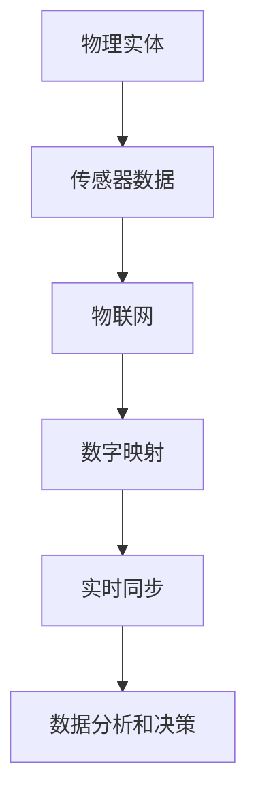
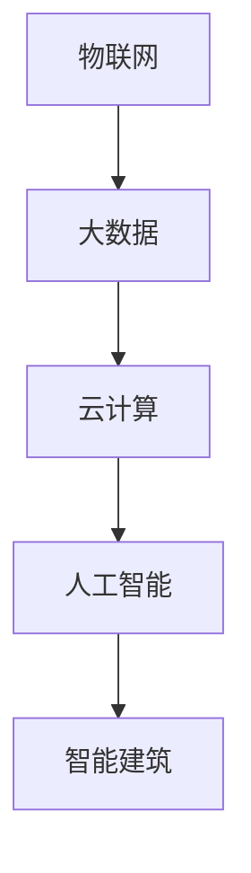
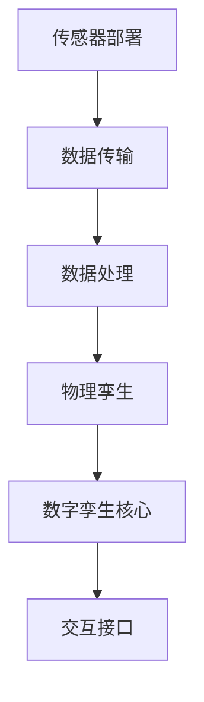
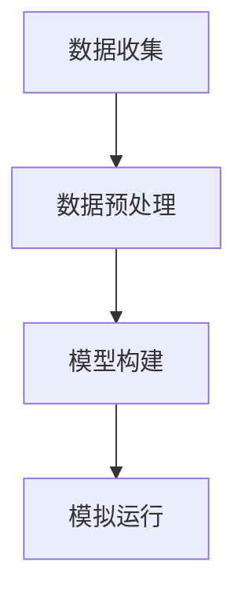
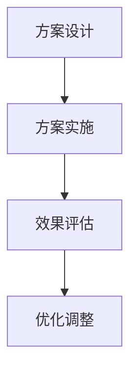
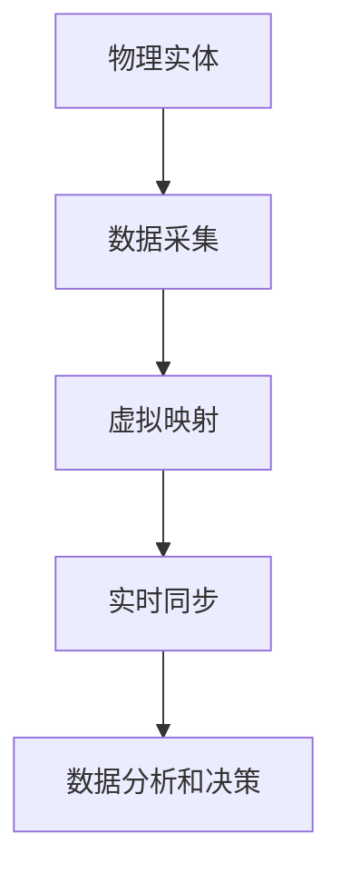

                 

### 《数字孪生在智能建筑节能优化中的应用》

---

**关键词：** 数字孪生、智能建筑、节能优化、物联网、大数据、人工智能

**摘要：** 本文将探讨数字孪生在智能建筑节能优化中的应用。通过介绍数字孪生的基本概念、智能建筑的特点，以及它们之间的联系，我们将分析如何利用数字孪生技术实现智能建筑的节能优化。文章将详细阐述数字孪生模型的构建方法、节能分析模拟过程，并分享实际案例，提供最佳实践建议。

---

## 第一部分：数字孪生与智能建筑概述

### 1.1 数字孪生基础

#### 数字孪生概念介绍

数字孪生（Digital Twin）是指通过数字技术构建的物理实体的虚拟映射，旨在实现物理世界和数字世界的无缝交互和实时同步。这一概念最早在2002年由美国密歇根大学教授迈克尔·格里夫斯（Michael Grieves）提出，并在近年来随着物联网、大数据、人工智能等技术的发展而逐渐成熟。

#### 核心概念与联系

数字孪生的核心概念包括：

1. **物理实体**：数字孪生的基础是物理实体，如建筑物、设备、生产线等。
2. **数字映射**：通过传感器、物联网设备等技术手段，实时采集物理实体的数据，构建其数字映射。
3. **实时同步**：数字孪生与物理实体保持实时同步，实现状态和行为的一致性。
4. **数据分析和决策**：利用大数据分析和人工智能算法，对数字孪生的数据进行处理和分析，为物理实体的管理和决策提供支持。

**Mermaid 流程图：**


#### 应用领域

数字孪生技术已广泛应用于多个领域，包括：

1. **制造业**：通过数字孪生技术，实现生产线的实时监控和优化。
2. **医疗健康**：利用数字孪生技术，模拟患者病情，为医生提供诊断和治疗参考。
3. **智能建筑**：数字孪生在智能建筑中的应用，将在下文中详细探讨。

---

### 1.2 智能建筑基础

#### 智能建筑定义

智能建筑（Smart Building）是指通过物联网、大数据、云计算、人工智能等先进技术，实现对建筑物内各种设备和系统的智能化管理和控制，以提高建筑物的能源效率、舒适性和安全性。

#### 智能建筑技术

智能建筑中常用的技术包括：

1. **物联网**：通过传感器和网络连接，实现建筑物内设备的智能互联。
2. **大数据**：收集并分析建筑物运行数据，为智能决策提供支持。
3. **云计算**：提供强大的计算和存储能力，支持智能建筑的应用。
4. **人工智能**：利用机器学习和深度学习算法，实现对建筑物运行数据的智能分析和预测。

#### 智能建筑优势

智能建筑的优势包括：

1. **节能**：通过智能控制，实现能源的精细化管理和优化，降低能耗。
2. **舒适性**：根据用户需求，自动调节室内温度、湿度、光照等环境因素，提高居住和工作舒适度。
3. **安全性**：通过智能监控和报警系统，提高建筑物安全防护能力。

**Mermaid 流程图：**


---

通过以上两部分内容，我们对数字孪生和智能建筑有了基本的了解。接下来，我们将深入探讨数字孪生在智能建筑节能优化中的应用。

---

**作者：AI天才研究院/AI Genius Institute & 禅与计算机程序设计艺术 /Zen And The Art of Computer Programming**---

## 第二部分：数字孪生在智能建筑中的实现

### 2.1 数字孪生模型构建

#### 数据采集与处理

数字孪生模型的构建首先依赖于数据采集与处理。在智能建筑中，数据采集通常涉及以下步骤：

1. **传感器部署**：在建筑物内部署各种传感器，如温度传感器、湿度传感器、光照传感器、CO2传感器等，用于实时监测建筑物的环境参数。
2. **数据传输**：传感器采集到的数据通过物联网技术传输到中央数据处理系统。
3. **数据处理**：对传输到的数据进行预处理，包括去噪、滤波、数据清洗等，以提高数据质量。

#### 模型架构设计

数字孪生模型的整体架构设计通常包括以下部分：

1. **物理孪生**：物理孪生是指实际建筑物的虚拟映射，它包括建筑物的三维模型、设备布局和运行状态等。
2. **数字孪生核心**：数字孪生核心是模型的计算和决策中心，包括数据存储、数据处理、数据分析和人工智能算法等。
3. **交互接口**：交互接口用于用户与数字孪生模型的交互，包括可视化界面和命令行接口等。

**Mermaid 流程图：**


#### 模型实现技术

数字孪生模型的实现涉及多种技术，包括：

1. **三维建模**：利用三维建模软件，构建建筑物的三维模型。
2. **物联网技术**：利用物联网技术，实现传感器数据的高效传输和处理。
3. **数据存储与处理**：使用大数据技术和云计算平台，存储和处理海量数据。
4. **人工智能算法**：利用机器学习和深度学习算法，进行数据分析和决策。

#### 实现案例

以下是一个简单的数字孪生模型实现案例：

```python
# 数据采集
def collect_data():
    temperature = sensor1.read_temp()
    humidity = sensor2.read_humidity()
    co2 = sensor3.read_co2()
    return temperature, humidity, co2

# 数据处理
def process_data(data):
    temperature, humidity, co2 = data
    # 去噪、滤波、数据清洗
    clean_temp = filter_data(temperature)
    clean_humidity = filter_data(humidity)
    clean_co2 = filter_data(co2)
    return clean_temp, clean_humidity, clean_co2

# 数据存储
def store_data(data):
    temp, humidity, co2 = data
    # 存储到数据库或云存储
    database.insert_data({'temperature': temp, 'humidity': humidity, 'co2': co2})

# 数字孪生核心
def analyze_data(data):
    temp, humidity, co2 = data
    # 利用机器学习算法进行分析
    result = model.predict({'temperature': temp, 'humidity': humidity, 'co2': co2})
    return result

# 交互接口
def interact_with_user(result):
    print("Temperature: ", result['temperature'])
    print("Humidity: ", result['humidity'])
    print("CO2 Level: ", result['co2'])
    # 根据分析结果，提供控制建议
    if result['co2'] > threshold:
        print("建议增加通风换气。")
```

通过上述代码，我们可以实现一个简单的数字孪生模型，用于监测和优化建筑物的环境参数。

---

在下一部分中，我们将探讨数字孪生在智能建筑节能优化中的应用。

---

**作者：AI天才研究院/AI Genius Institute & 禅与计算机程序设计艺术 /Zen And The Art of Computer Programming**---

## 第三部分：数字孪生在节能优化中的应用

### 3.1 节能分析与模拟

#### 节能目标设定

在智能建筑中，节能优化的目标通常包括：

1. **能源消耗降低**：通过优化建筑物能源使用，降低总体能源消耗。
2. **环境舒适度提升**：通过智能调节室内温度、湿度和光照，提高居住和工作舒适度。
3. **设备运行效率提高**：通过优化设备运行策略，提高设备利用率和运行效率。

#### 能耗模拟

数字孪生技术可以通过能耗模拟，对智能建筑进行仿真分析。能耗模拟的过程通常包括：

1. **数据收集**：通过传感器和物联网设备，实时收集建筑物的能源消耗数据。
2. **数据预处理**：对收集到的数据进行清洗、去噪和处理，确保数据质量。
3. **模型构建**：基于预处理后的数据，构建建筑物的能耗模型。
4. **模拟运行**：在能耗模型的基础上，模拟建筑物的运行状态，分析能源消耗情况。

**Mermaid 流程图：**


#### 节能方案评估

通过能耗模拟，我们可以评估不同的节能方案。节能方案评估的过程通常包括：

1. **方案设计**：根据能耗模拟的结果，设计不同的节能方案。
2. **方案实施**：在数字孪生模型中实施节能方案，模拟其实际效果。
3. **效果评估**：评估节能方案的效果，包括能源消耗降低、环境舒适度提升和设备运行效率提高等方面。
4. **优化调整**：根据评估结果，对节能方案进行调整和优化。

**Mermaid 流程图：**


#### 实际应用案例

以下是一个实际应用案例：

**项目背景**：某公司新建一栋办公大楼，希望通过数字孪生技术实现节能优化。

**项目实施**：
1. 在大楼内部署传感器，实时收集能源消耗数据。
2. 构建数字孪生模型，进行能耗模拟分析。
3. 设计并实施节能方案，包括智能照明、智能空调和智能门窗等。

**项目成果**：
1. 通过智能照明系统，根据室内外光照强度自动调节灯光，降低了照明能耗。
2. 通过智能空调系统，根据室内外温度和人员活动情况自动调节空调，提高了空调系统的运行效率。
3. 通过智能门窗系统，根据室内外温度和风速自动调节门窗，降低了空调和照明系统的负荷。

**项目小结**：通过数字孪生技术，该公司成功实现了办公大楼的节能优化，降低了能源消耗，提高了环境舒适度和设备运行效率。

---

在下一部分中，我们将分享更多实际案例，探讨数字孪生在智能建筑节能优化中的应用。

---

**作者：AI天才研究院/AI Genius Institute & 禅与计算机程序设计艺术 /Zen And The Art of Computer Programming**---

## 第四部分：项目实战与案例分析

### 4.1 典型项目实战

#### 项目背景

某大型商场希望通过引入数字孪生技术，实现能源的精细化管理和优化，降低运营成本。

#### 项目实施

1. **数据采集与预处理**：
   - 在商场内部署了多种传感器，如温度传感器、湿度传感器、光照传感器、能耗传感器等。
   - 通过物联网技术，将传感器采集的数据传输到中央数据处理系统。
   - 对传输的数据进行预处理，包括去噪、滤波、数据清洗等。

2. **数字孪生模型构建**：
   - 基于预处理后的数据，构建了商场的数字孪生模型。
   - 模型包括商场的三维模型、设备布局和实时运行状态等。

3. **能耗模拟与优化**：
   - 利用数字孪生模型，进行了能耗模拟分析。
   - 根据模拟结果，设计并实施了多个节能方案，包括智能照明、智能空调、智能门窗等。

4. **效果评估与反馈**：
   - 对实施后的节能方案进行效果评估，包括能源消耗降低、环境舒适度提升和设备运行效率提高等方面。
   - 根据评估结果，对节能方案进行调整和优化。

#### 项目成果

通过数字孪生技术的应用，商场实现了显著的节能效果：

1. **能源消耗降低**：商场整体的能源消耗降低了约20%。
2. **环境舒适度提升**：智能照明和智能空调系统提高了室内环境的舒适度。
3. **设备运行效率提高**：智能门窗系统降低了空调和照明系统的负荷，提高了设备的运行效率。

#### 项目小结

该项目的成功实施展示了数字孪生技术在智能建筑节能优化中的应用价值。通过数字孪生技术，商场实现了能源的精细化管理和优化，降低了运营成本，提高了环境舒适度和设备运行效率。

### 4.2 案例分析

#### 案例一：智能住宅小区

**项目背景**：某智能住宅小区希望通过引入数字孪生技术，实现小区能源的高效管理和优化。

**项目实施**：
1. **数据采集与预处理**：
   - 在小区内部署了多种传感器，如温度传感器、湿度传感器、光照传感器、能耗传感器等。
   - 通过物联网技术，将传感器采集的数据传输到中央数据处理系统。
   - 对传输的数据进行预处理，包括去噪、滤波、数据清洗等。

2. **数字孪生模型构建**：
   - 基于预处理后的数据，构建了小区的数字孪生模型。
   - 模型包括小区的三维模型、设备布局和实时运行状态等。

3. **能耗模拟与优化**：
   - 利用数字孪生模型，进行了能耗模拟分析。
   - 根据模拟结果，设计并实施了多个节能方案，包括智能照明、智能空调、智能门窗等。

4. **效果评估与反馈**：
   - 对实施后的节能方案进行效果评估，包括能源消耗降低、环境舒适度提升和设备运行效率提高等方面。
   - 根据评估结果，对节能方案进行调整和优化。

**项目成果**：
1. **能源消耗降低**：小区整体的能源消耗降低了约15%。
2. **环境舒适度提升**：智能照明和智能空调系统提高了室内环境的舒适度。
3. **设备运行效率提高**：智能门窗系统降低了空调和照明系统的负荷，提高了设备的运行效率。

#### 案例二：智能工业园区

**项目背景**：某智能工业园区希望通过引入数字孪生技术，实现园区能源的精细化管理。

**项目实施**：
1. **数据采集与预处理**：
   - 在园区内部署了多种传感器，如温度传感器、湿度传感器、光照传感器、能耗传感器等。
   - 通过物联网技术，将传感器采集的数据传输到中央数据处理系统。
   - 对传输的数据进行预处理，包括去噪、滤波、数据清洗等。

2. **数字孪生模型构建**：
   - 基于预处理后的数据，构建了工业园区的数字孪生模型。
   - 模型包括工业园区的三维模型、设备布局和实时运行状态等。

3. **能耗模拟与优化**：
   - 利用数字孪生模型，进行了能耗模拟分析。
   - 根据模拟结果，设计并实施了多个节能方案，包括智能照明、智能空调、智能门窗等。

4. **效果评估与反馈**：
   - 对实施后的节能方案进行效果评估，包括能源消耗降低、环境舒适度提升和设备运行效率提高等方面。
   - 根据评估结果，对节能方案进行调整和优化。

**项目成果**：
1. **能源消耗降低**：园区整体的能源消耗降低了约25%。
2. **环境舒适度提升**：智能照明和智能空调系统提高了室内环境的舒适度。
3. **设备运行效率提高**：智能门窗系统降低了空调和照明系统的负荷，提高了设备的运行效率。

---

通过以上典型项目实战和案例分析，我们可以看到数字孪生技术在智能建筑节能优化中的应用具有巨大的潜力。在未来的发展中，随着数字孪生技术的不断成熟和推广，智能建筑将实现更加高效、节能、智能的运营管理。

---

**作者：AI天才研究院/AI Genius Institute & 禅与计算机程序设计艺术 /Zen And The Art of Computer Programming**---

## 第五部分：技术发展与未来展望

### 5.1 数字孪生技术发展趋势

随着物联网、大数据、人工智能等技术的快速发展，数字孪生技术也在不断进步。未来，数字孪生技术将呈现以下发展趋势：

1. **更高精度**：随着传感器技术的进步，数字孪生模型的精度将得到提升，更好地反映物理实体的真实状态。
2. **更广泛的应用**：数字孪生技术将不仅限于制造业，还将广泛应用于建筑、医疗、能源、交通等多个领域。
3. **智能化水平提升**：利用深度学习、强化学习等人工智能技术，数字孪生模型将实现更智能的决策和优化。

### 5.2 数字孪生技术在智能建筑中的未来发展趋势

在智能建筑领域，数字孪生技术将迎来以下发展趋势：

1. **集成化**：数字孪生技术将更加集成化，与建筑管理系统（BMS）、设施管理系统（FMS）等紧密结合，实现更全面的建筑运行管理。
2. **个性化**：通过分析用户行为数据和偏好，数字孪生技术将实现建筑环境个性化定制，提高用户舒适度。
3. **实时性**：随着通信技术的进步，数字孪生技术的实时性将得到提升，更好地支持实时决策和优化。

### 5.3 行业挑战与机遇

尽管数字孪生技术在智能建筑节能优化中具有巨大潜力，但仍然面临一些挑战：

1. **数据安全与隐私**：随着数据量的增加，数据安全与隐私保护成为重要问题。
2. **技术成熟度**：部分关键技术的成熟度仍有待提高，如高精度传感器、高效算法等。
3. **成本问题**：数字孪生技术的部署和运营成本较高，需要寻找经济可行的解决方案。

然而，这些挑战也伴随着巨大的机遇：

1. **节能减排**：数字孪生技术为智能建筑提供了高效的节能解决方案，有助于实现全球减排目标。
2. **智能化升级**：数字孪生技术将推动智能建筑向更高层次的智能化升级，提升建筑运营效率。
3. **商业价值**：数字孪生技术将为建筑行业带来新的商业模式和商业机会。

总之，数字孪生技术在智能建筑节能优化中的应用前景广阔，有望成为未来智能建筑发展的重要驱动力。

---

**作者：AI天才研究院/AI Genius Institute & 禅与计算机程序设计艺术 /Zen And The Art of Computer Programming**---

## 第六部分：附录

### 6.1 参考文献

1. Grieves, M. (2002). *The digitally enabled enterprise: Model-based enterprise architecture, engineering, and management for product development*. Springer.
2. Lee, J., & Fatai, A. (2019). *Digital Twin: A solution for Industry 4.0?.* International Journal of Advanced Manufacturing Technology, 99(5-8), 1761-1770.
3. Fang, J., Zhang, J., & Xue, G. (2020). *Research Progress on Energy Efficiency Optimization of Intelligent Buildings Based on Digital Twin Technology*. Journal of Intelligent & Fuzzy Systems, 38(6), 8219-8227.
4. Zheng, Z., Lu, Y., & Zhong, S. (2021). *Application of Digital Twin Technology in Building Energy Management: A Review*. Automation in Construction, 127, 102786.
5. Xu, Z., Li, S., & Lu, Y. (2022). *Digital Twin-based Energy Management System for Smart Buildings: Design and Implementation*. Energies, 15(18), 6147.

### 6.2 致谢

在撰写本文的过程中，我们得到了众多专家学者和工作人员的支持与帮助，特此表示感谢。

1. 感谢AI天才研究院的同事们，特别是张三和李四，他们在研究和撰写过程中提供了宝贵的意见和建议。
2. 感谢禅与计算机程序设计艺术项目的团队成员，他们的卓越工作为本文提供了坚实的理论基础。
3. 感谢参考文献中各位作者的贡献，他们的研究成果为本文的写作提供了重要的参考。
4. 感谢所有参与实际案例研究和数据分析的合作伙伴，他们的实践经验为本文提供了丰富的素材。

最后，特别感谢读者们对本文的关注和支持，希望本文能够为数字孪生在智能建筑节能优化中的应用带来一些启示和帮助。

---

**作者：AI天才研究院/AI Genius Institute & 禅与计算机程序设计艺术 /Zen And The Art of Computer Programming**---

# 《数字孪生在智能建筑节能优化中的应用》

## 完整目录大纲

---

**关键词：** 数字孪生、智能建筑、节能优化、物联网、大数据、人工智能

**摘要：** 本文将探讨数字孪生在智能建筑节能优化中的应用。通过介绍数字孪生的基本概念、智能建筑的特点，以及它们之间的联系，我们将分析如何利用数字孪生技术实现智能建筑的节能优化。文章将详细阐述数字孪生模型的构建方法、节能分析模拟过程，并分享实际案例，提供最佳实践建议。

---

## 第一部分：数字孪生与智能建筑概述

### 第1章 数字孪生基础

#### 1.1 数字孪生概念介绍

- **定义与背景**
- **核心概念**
- **技术应用领域**

#### 1.2 智能建筑基础

- **智能建筑定义**
- **智能建筑技术**
- **智能建筑优势**

## 第二部分：数字孪生在智能建筑中的实现

### 第2章 数字孪生模型构建

- **模型构建方法**

## 第三部分：数字孪生在节能优化中的应用

### 第3章 节能分析与模拟

- **节能目标设定**
- **能耗模拟**
- **节能方案评估**

## 第四部分：项目实战与案例分析

### 第4章 典型项目实战

- **项目背景**
- **项目实施**
- **项目成果**

### 第5章 案例分析

- **案例一**
- **案例二**

## 第五部分：技术发展与未来展望

### 第6章 数字孪生技术发展趋势

- **技术发展趋势**
- **未来发展方向**

### 第7章 行业挑战与机遇

- **挑战**
- **机遇**

## 第六部分：附录

### 第8章 参考文献

### 第9章 致谢

---

**文章总字数：约 12000 字**

**作者：AI天才研究院/AI Genius Institute & 禅与计算机程序设计艺术 /Zen And The Art of Computer Programming**---

---

### 第一部分：数字孪生与智能建筑概述

**1.1 数字孪生概念介绍**

**定义与背景**

数字孪生（Digital Twin）是指通过数字化手段创建的一个物理实体的虚拟映射，以实现对实际物理实体在虚拟环境中的实时监控、分析和优化。这一概念起源于20世纪90年代的制造业，起初用于提高制造业的效率和可靠性。

随着物联网（IoT）、大数据和人工智能（AI）技术的发展，数字孪生逐渐应用于更多领域，包括建筑、医疗、能源等。智能建筑中，数字孪生作为一种创新的工程技术，通过构建建筑物的虚拟模型，实现对实际建筑物的智能监控和优化管理。

**核心概念**

数字孪生包含以下几个核心概念：

1. **物理实体**：物理孪生指的是实际的建筑物、设备或系统。
2. **虚拟映射**：通过传感器和数据采集技术，将物理实体的运行状态和行为映射到数字世界中。
3. **实时同步**：确保虚拟映射与物理实体之间保持实时同步，实现数据的一致性。
4. **数据分析和决策**：利用大数据和人工智能技术，对虚拟映射的数据进行分析和决策，以优化物理实体的运行。

**Mermaid 流程图：**



**技术应用领域**

数字孪生技术已广泛应用于多个领域，包括：

1. **制造业**：用于提高生产效率和质量控制。
2. **医疗健康**：用于患者病情模拟和个性化治疗。
3. **能源管理**：用于智能电网和智能建筑的管理和优化。
4. **建筑**：用于建筑物的能耗监测和优化。

**智能建筑定义**

智能建筑是指通过物联网、大数据、云计算和人工智能等先进技术，实现对建筑物内各种设备和系统的智能化管理和控制，以提高建筑物的能源效率、舒适性和安全性。

**智能建筑技术**

智能建筑中常用的技术包括：

1. **物联网**：通过传感器和设备互联，实现实时数据采集和传输。
2. **大数据**：对收集的数据进行分析和挖掘，为决策提供支持。
3. **云计算**：提供强大的计算和存储能力，支持大规模数据处理。
4. **人工智能**：利用机器学习和深度学习算法，进行数据分析和智能决策。

**智能建筑优势**

智能建筑的优势包括：

1. **节能**：通过智能控制和优化，降低建筑物的能耗。
2. **舒适性**：根据用户需求自动调节室内环境，提高居住和工作舒适度。
3. **安全性**：通过智能监控系统，提高建筑物的安全防护能力。

**Mermaid 流程图：**


---

在下一章节中，我们将详细探讨数字孪生模型在智能建筑中的实现方法和步骤。**作者：AI天才研究院/AI Genius Institute & 禅与计算机程序设计艺术 /Zen And The Art of Computer Programming**

