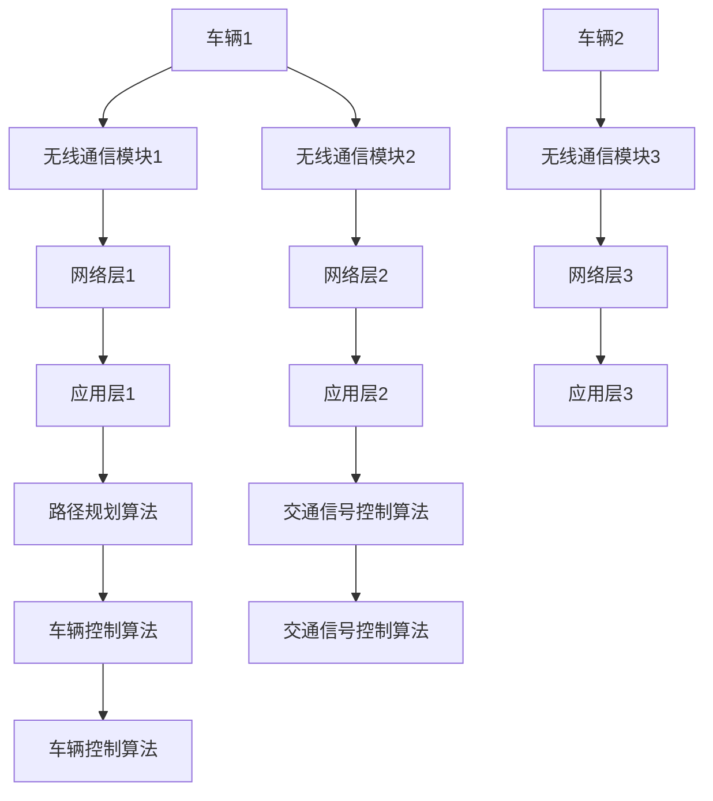

                 

### 文章标题

《边缘计算在车联网中的应用：实现车辆间实时通信》

随着物联网和智能交通系统的快速发展，车联网（V2X，Vehicle-to-Everything）成为当今信息技术领域的一个热点。车联网旨在通过实现车辆与车辆（V2V）、车辆与基础设施（V2I）、车辆与行人（V2P）以及车辆与网络（V2N）之间的通信，提升交通效率、安全性和便利性。然而，传统中心化的云计算架构在应对车联网海量数据、低延迟和高可靠性的要求时存在诸多瓶颈。

边缘计算作为一种分布式计算架构，通过将计算、存储和网络功能下沉到网络边缘，实现了对数据的实时处理和快速响应。边缘计算在车联网中的应用，不仅能够缓解中心化架构的压力，还能实现车辆间实时通信，提高整体系统的效率和安全性。

本文将详细探讨边缘计算在车联网中的应用，重点分析实现车辆间实时通信所需的关键技术、算法原理和具体实现步骤。此外，还将通过实际案例展示边缘计算在车联网中的成功应用，并讨论未来发展趋势和面临的挑战。

关键词：边缘计算、车联网、车辆间通信、实时通信、边缘服务器、边缘网关

摘要：本文介绍了边缘计算在车联网中的应用，阐述了边缘计算的优势和基本原理，重点分析了实现车辆间实时通信所需的关键技术和算法。通过具体案例，展示了边缘计算在车联网中的实际应用效果，并探讨了未来边缘计算在车联网中面临的挑战和机遇。

### 文章概述

本文将系统性地介绍边缘计算在车联网中的应用，内容分为六个主要部分：

1. **边缘计算基础**：介绍边缘计算的基本概念、原理和技术，包括边缘计算硬件、软件和架构。

2. **车联网基础**：介绍车联网的基本概念、技术和发展趋势，包括V2X通信协议、车辆感知与监控等。

3. **边缘计算在车联网中的应用**：探讨边缘计算在车联网中的应用场景，如车辆间通信、智能交通管理等。

4. **实现车辆间实时通信的技术**：详细介绍实现车辆间实时通信的关键技术，包括通信协议、算法与架构。

5. **案例研究**：通过实际案例研究，展示边缘计算在车联网中的具体应用。

6. **未来发展趋势与挑战**：分析边缘计算在车联网中的未来发展趋势、面临的挑战及解决方案。

### 第一部分：边缘计算基础

#### 1.1 边缘计算概述

边缘计算是一种分布式计算架构，其核心思想是将计算、存储和网络功能下沉到网络边缘，从而实现数据的实时处理和快速响应。与传统的云计算不同，边缘计算不仅能够减轻中心化架构的压力，还能提高系统的实时性和可靠性。

**定义与背景**：

边缘计算（Edge Computing）是指在靠近数据源或靠近用户的地方进行数据处理和计算的一种技术。它解决了云计算在处理海量数据、低延迟需求以及数据隐私和安全性方面的一些瓶颈。

**核心优势**：

- **降低延迟**：通过将计算任务分散到网络边缘，可以显著降低数据传输的延迟，满足实时处理的需求。
- **提高带宽利用率**：边缘计算可以减少数据传输量，提高网络带宽的利用率。
- **增强数据隐私性**：边缘计算可以本地处理数据，减少数据传输，降低数据泄露的风险。
- **提高系统可靠性**：边缘计算通过分布式架构提高了系统的容错能力和可靠性。

**基本架构**：

边缘计算的基本架构包括边缘服务器、边缘网关和物联网设备。边缘服务器主要负责处理数据密集型任务；边缘网关连接边缘设备和云端，实现数据的传输和同步；物联网设备则是边缘计算的基础设施，用于采集和传输数据。

#### 1.2 边缘计算技术

边缘计算技术主要包括硬件、软件和架构三个方面。

**边缘计算硬件**：

- **边缘服务器**：边缘服务器是边缘计算的核心，用于处理数据密集型任务。它们通常具有高性能的计算能力、大容量存储和丰富的接口。
- **边缘网关**：边缘网关是边缘设备和云端之间的桥梁，负责数据的传输和同步。它们通常具备协议转换、数据加密和安全保障等功能。
- **物联网设备**：物联网设备是边缘计算的基础，用于采集和传输数据。它们通常具备低功耗、高可靠性和易部署的特点。

**边缘计算软件**：

- **容器化技术**：容器化技术使开发者能够将应用程序及其依赖环境打包成一个独立的容器，实现应用程序的灵活部署和快速扩展。
- **边缘计算框架**：边缘计算框架提供了开发和管理边缘服务的工具和平台，如边缘节点管理、任务调度、数据同步等。
- **边缘AI应用**：边缘AI应用将人工智能技术应用于边缘计算，实现边缘设备的智能决策和实时分析。

**基本架构**：

边缘计算的基本架构包括数据采集、数据处理、数据存储和结果反馈四个主要环节。数据采集通过物联网设备进行，数据处理在边缘服务器或边缘网关上完成，数据存储通常使用边缘数据库或云存储，结果反馈通过通信网络返回给用户或系统。

#### 1.3 边缘计算的核心优势

边缘计算具有以下核心优势：

- **降低延迟**：通过将计算任务分散到网络边缘，可以显著降低数据传输的延迟，满足实时处理的需求。
- **提高带宽利用率**：边缘计算可以减少数据传输量，提高网络带宽的利用率。
- **增强数据隐私性**：边缘计算可以本地处理数据，减少数据传输，降低数据泄露的风险。
- **提高系统可靠性**：边缘计算通过分布式架构提高了系统的容错能力和可靠性。

总的来说，边缘计算作为一种新兴的分布式计算架构，具有广泛的应用前景。在车联网领域，边缘计算的应用将极大地提升系统的实时性和可靠性，为车辆间实时通信提供强有力的技术支撑。

#### 1.4 边缘计算的技术挑战

尽管边缘计算在车联网中具有诸多优势，但其应用也面临着一些技术挑战：

**1. 硬件资源的限制**：

边缘设备通常具备有限的计算资源、存储资源和功耗限制。因此，如何在资源有限的情况下实现高效的数据处理和实时通信，是一个重要的挑战。

**2. 安全性问题**：

边缘计算涉及到大量敏感数据的处理和传输，如何保障数据的安全性和隐私性是另一个重要问题。边缘设备的脆弱性也增加了被攻击的风险。

**3. 跨平台的兼容性**：

边缘计算应用需要在不同设备和平台之间运行，如何确保不同设备和平台之间的兼容性和互操作性，是一个需要解决的技术难题。

**4. 网络不稳定**：

边缘设备通常分布在不同的地理位置，网络环境不稳定，如何保证通信的可靠性和实时性是一个挑战。

**5. 数据处理和存储**：

边缘计算需要在有限的资源下处理和存储海量数据，如何优化数据处理和存储策略，提高数据利用率和存储效率，也是一个关键问题。

为了应对这些挑战，研究人员和开发者需要不断探索和改进边缘计算技术，提高其性能和可靠性，为车联网的广泛应用奠定基础。

#### 1.5 边缘计算在车联网中的应用前景

边缘计算在车联网中的应用前景非常广阔，其主要优势体现在以下几个方面：

**1. 提升交通效率**：

通过边缘计算，车辆可以实时获取道路信息、交通状况等，进行智能调度和路径规划，有效减少交通拥堵，提高道路利用率。

**2. 增强安全性**：

边缘计算可以实现车辆间的实时通信，提高对突发事件的预警和应对能力，降低交通事故的发生率。

**3. 智能交通管理**：

边缘计算可以支持智能交通管理系统，对交通流量、路况等信息进行实时分析和处理，优化交通信号控制，提高交通管理水平。

**4. 车载信息服务**：

边缘计算可以为车载信息系统提供实时、准确的信息服务，如导航、娱乐、天气等，提升驾驶体验。

**5. 自动驾驶技术**：

边缘计算在自动驾驶系统中起着关键作用，可以实现车辆间的协同驾驶和实时环境感知，提高自动驾驶的安全性和可靠性。

总之，边缘计算在车联网中的应用将为交通领域带来革命性的变革，推动智能交通系统的快速发展。

#### 1.6 边缘计算在车联网中的应用

边缘计算在车联网中的应用可以分为以下几个主要方面：

**1. 车辆感知与监控**：

通过边缘计算，车辆可以实时感知自身状态和环境信息，包括速度、位置、加速度等。同时，边缘计算可以对车辆进行实时监控，如故障诊断、维护预测等。

**2. 车辆间通信**：

边缘计算可以实现车辆之间的实时通信，如车辆编队行驶、道路协同驾驶等。通过边缘计算，车辆可以快速交换信息，提高协同效率，降低交通事故风险。

**3. 车辆与基础设施通信**：

边缘计算可以支持车辆与基础设施之间的通信，如智能交通信号系统、停车场管理系统等。通过边缘计算，车辆可以实时获取道路信息、交通状况等，进行智能决策和路径规划。

**4. 智能交通管理**：

边缘计算可以支持智能交通管理系统，对交通流量、路况等信息进行实时分析和处理，优化交通信号控制，提高交通管理水平。

**5. 车载信息服务**：

边缘计算可以为车载信息系统提供实时、准确的信息服务，如导航、娱乐、天气等，提升驾驶体验。

**6. 自动驾驶技术**：

边缘计算在自动驾驶系统中起着关键作用，可以实现车辆间的协同驾驶和实时环境感知，提高自动驾驶的安全性和可靠性。

通过边缘计算，车联网可以实现更高效、更安全、更智能的运行，为交通领域带来革命性的变革。

#### 1.7 边缘计算与云计算的协同

边缘计算与云计算的协同是构建高效智能车联网的关键，二者在分布式计算架构中各自发挥独特的作用。

**边缘计算与云计算的区别**：

1. **地理位置**：边缘计算发生在网络的边缘，即接近数据源或用户的地方；而云计算则主要在远程数据中心进行。
2. **计算资源**：边缘计算依赖于本地设备，如边缘服务器、网关和物联网设备，计算资源有限；云计算则拥有大规模的数据中心，计算资源丰富。
3. **延迟和带宽**：边缘计算旨在降低延迟和带宽消耗，实现实时处理；云计算则更适合处理大规模、长时间的数据分析任务。

**协同工作的优势**：

1. **优化资源利用**：通过将计算任务合理分配给边缘计算和云计算，可以实现资源的高效利用，降低整体计算成本。
2. **提升性能**：边缘计算可以处理本地数据，减少数据传输，降低延迟；云计算则可以处理复杂任务，提高计算性能。
3. **增强可靠性**：边缘计算与云计算协同工作，可以实现分布式部署，提高系统的可靠性和容错能力。

**实现方法**：

1. **任务分配**：根据任务的特征，如数据量大小、处理时间要求等，将任务合理分配给边缘计算和云计算。
2. **数据传输**：优化数据传输策略，如数据压缩、边缘缓存等，减少数据传输量，降低带宽消耗。
3. **协同框架**：构建边缘计算与云计算的协同框架，实现任务调度、数据同步、状态共享等功能。

通过边缘计算与云计算的协同工作，车联网可以实现更高效、更智能、更可靠的运行，为智能交通系统的建设提供强有力的技术支撑。

### 第二部分：车联网基础

#### 2.1 车联网概述

车联网（V2X，Vehicle-to-Everything）是指通过信息通信技术实现车辆与其他实体（如车辆、基础设施、行人等）之间的互联互通，从而提高交通效率、安全性和便利性。车联网的主要目标是通过信息的实时共享和智能处理，实现车辆间的协同驾驶和智能交通管理。

**定义与分类**：

- **车辆与车辆通信（V2V）**：通过车对车通信，车辆可以实时交换信息，如位置、速度、行驶方向等，实现协同驾驶和智能避让。
- **车辆与基础设施通信（V2I）**：通过车对基础设施通信，车辆可以获取道路信息、交通信号等，实现智能交通管理和优化。
- **车辆与行人通信（V2P）**：通过车对人通信，车辆可以识别行人位置和状态，提高交通安全性和行人保护。
- **车辆与网络通信（V2N）**：通过车对网络通信，车辆可以接入互联网，获取外部信息，如导航、天气等，提升驾驶体验。

**技术发展**：

车联网技术的发展经历了几个阶段：

- **1G/2G时代**：主要以语音通信为主，数据传输速率较低。
- **3G/4G时代**：实现了高速数据传输，支持多媒体服务和应用开发。
- **5G时代**：5G网络的高速、低延迟和大连接特性，为车联网的发展提供了强大的技术支撑，支持自动驾驶、车联网安全等高级应用。

**关键特性**：

- **实时性**：车联网要求信息的实时传输和处理，以满足驾驶安全和效率的需求。
- **可靠性**：车联网系统需要高可靠性，确保信息的准确传输和系统稳定运行。
- **安全性**：车联网涉及到大量敏感数据的处理和传输，需要确保数据的安全性和隐私性。

**应用场景**：

车联网的应用场景非常广泛，主要包括以下几个方面：

- **智能交通管理**：通过车联网技术，可以实现智能交通信号控制、交通流量监测、道路规划等，提高交通效率和安全性。
- **自动驾驶**：车联网技术是实现自动驾驶的关键，通过车辆间的通信和实时数据共享，可以实现自动驾驶车辆的协同行驶和智能决策。
- **车联网安全**：车联网安全技术包括车辆安全防护、网络安全防护等，通过这些技术，可以保障车联网系统的安全运行。
- **车载信息服务**：车联网技术可以为车载信息系统提供实时、准确的信息服务，如导航、娱乐、天气等，提升驾驶体验。

总之，车联网通过实现车辆与车辆、基础设施、行人和网络之间的互联互通，极大地提升了交通效率、安全性和便利性。随着技术的不断进步，车联网的应用将越来越广泛，为智能交通系统的建设提供强有力的技术支撑。

#### 2.2 车联网的关键技术

车联网（V2X）的发展离不开一系列关键技术的支持，这些技术涵盖了通信协议、传感器技术、大数据处理、人工智能和网络安全等多个方面。下面将详细介绍这些关键技术及其在车联网中的应用。

**通信协议**

通信协议是车联网实现信息交换和通信的基础。目前，车联网常用的通信协议包括：

- **DSRC（Dedicated Short-Range Communication）**：DSRC是一种专用的短距离通信技术，主要用于车对车（V2V）、车对基础设施（V2I）以及车对行人（V2P）的通信。DSRC的工作频率为5.9GHz，具有高带宽和低延迟的特点。

- **C-V2X（Cellular Vehicle-to-Everything）**：C-V2X是基于4G/5G网络的V2X通信技术，通过蜂窝网络实现车辆与其他实体之间的通信。C-V2X具有更广的覆盖范围、更高的数据传输速率和更好的网络可靠性，是未来车联网通信的发展方向。

**传感器技术**

传感器技术是车联网实现环境感知和智能决策的关键。常见的车联网传感器包括：

- **雷达（Radar）**：雷达通过发射电磁波并接收反射信号来检测物体的位置、速度和方向，常用于车辆的距离检测和避障。

- **激光雷达（Lidar）**：激光雷达通过发射激光并测量反射光的时间来计算物体的距离和形状，具有高精度和高分辨率的特点，广泛应用于自动驾驶和车联网中的环境感知。

- **摄像头（Camera）**：摄像头通过捕捉图像来识别道路标志、行人和其他车辆，是实现自动驾驶和车联网视觉感知的重要手段。

**大数据处理**

车联网产生的数据量巨大，大数据处理技术是实现数据价值的关键。大数据处理主要包括以下几个方面：

- **数据采集**：通过车联网设备和传感器采集海量数据，包括车辆状态、交通流量、道路状况等。

- **数据存储**：使用分布式数据库和云存储技术存储海量数据，确保数据的可靠性和可扩展性。

- **数据挖掘与分析**：通过数据挖掘和分析技术，从海量数据中提取有价值的信息，如交通模式、安全预警等。

**人工智能**

人工智能技术在车联网中的应用，使得车辆具备自我感知、自我学习和自我决策的能力。人工智能主要包括以下几个方向：

- **机器学习**：通过机器学习算法，从海量数据中自动发现规律和模式，用于交通预测、车辆控制等。

- **深度学习**：深度学习技术通过神经网络模型，实现更复杂的特征提取和模式识别，如图像识别、语音识别等。

- **自然语言处理**：自然语言处理技术用于实现人机交互、语音控制等功能，提升车联网的智能化水平。

**网络安全**

网络安全是车联网系统稳定运行的重要保障。车联网网络安全主要包括以下几个方面：

- **数据加密**：对传输数据进行加密，确保数据在传输过程中的安全性和隐私性。

- **身份认证**：通过身份认证技术，确保通信实体身份的真实性和合法性。

- **安全协议**：设计安全协议，如TLS/SSL，确保通信过程的安全性和完整性。

**应用实例**

- **智能交通管理**：通过车联网技术和大数据处理，实现交通流量监测、信号控制和交通预测，优化交通管理和调度。

- **自动驾驶**：通过车联网和传感器技术，实现车辆间的通信和协同控制，提高自动驾驶的安全性和可靠性。

- **车联网安全**：通过网络安全技术，保障车联网系统的稳定运行和用户隐私安全。

总之，车联网的关键技术为车联网的发展提供了强大的技术支撑，随着这些技术的不断进步和融合，车联网的应用将越来越广泛，为智能交通系统的建设提供强有力的技术支撑。

#### 2.3 车联网的发展趋势

车联网（V2X）作为物联网（IoT）的重要组成部分，正迅速发展并影响着交通、物流、城市规划等多个领域。以下是车联网在近期内的发展趋势：

**1. 5G技术的广泛应用**：

5G技术的推广将为车联网提供更高速、低延迟的通信网络。5G网络的大带宽和高可靠性将支持车联网中的大量设备接入，实现车辆、基础设施、行人之间的实时通信，推动自动驾驶、智能交通管理、车联网安全等领域的应用。

**2. 自动驾驶技术的逐步成熟**：

自动驾驶技术是车联网的重要应用方向。随着传感器技术、人工智能算法和通信技术的不断进步，自动驾驶将逐渐从特定场景的应用走向普及。预计到2025年，部分自动驾驶车辆将实现商业化运营，为智能交通系统的建设奠定基础。

**3. 大数据与人工智能的深度融合**：

车联网产生海量数据，通过大数据技术对这些数据进行采集、存储、分析和挖掘，可以提取有价值的信息，如交通模式、安全预警等。结合人工智能技术，可以实现对交通流量的预测、车辆行为的分析，提高交通管理的智能化水平。

**4. 跨行业合作与生态系统建设**：

车联网涉及到多个行业，如汽车制造、通信、互联网、交通管理等。未来，跨行业合作将成为车联网发展的重要趋势。通过建设车联网生态系统，可以实现不同行业之间的数据共享和协同工作，推动车联网的全面发展。

**5. 网络安全与隐私保护**：

随着车联网的普及，网络安全和隐私保护问题日益突出。未来，车联网将加强对网络攻击的防护，确保车辆通信和数据传输的安全。同时，需要制定相关法规和标准，保护用户的隐私权益。

**6. 智能交通管理系统的推广**：

智能交通管理系统（ITS）通过集成车联网技术、大数据、人工智能等技术，实现对交通流量、路况、交通事故等的实时监控和管理。未来，智能交通管理系统将在更多城市得到推广，提高交通效率，减少交通事故。

**7. 车联网在特殊场景的应用**：

除了城市交通，车联网在高速公路、乡村道路、物流运输等特殊场景中的应用也将逐渐增多。通过车联网技术，可以实现车辆间的实时通信和协同控制，提高运输效率和安全性。

总之，车联网的发展趋势将推动智能交通系统的建设，为人们提供更高效、更安全、更便利的出行体验。随着技术的不断进步和应用的不断拓展，车联网将在未来发挥更加重要的作用。

#### 2.4 车联网的应用场景

车联网（V2X）技术通过实现车辆与车辆（V2V）、车辆与基础设施（V2I）、车辆与行人（V2P）以及车辆与网络（V2N）之间的通信，为交通领域带来了许多创新应用场景，提高了交通效率、安全性和便利性。以下是车联网的主要应用场景：

**1. 车辆编队行驶**：

车辆编队行驶是指通过车联网技术实现车辆之间的协同行驶，形成车队。车队中的车辆可以保持较小的车距，减少空气阻力，提高燃油效率。车联网技术通过实时传输车辆位置、速度和行驶方向等信息，使车辆能够协同控制，确保车队安全、高效地行驶。

**2. 智能交通信号控制**：

智能交通信号控制利用车联网技术实时监控交通流量，根据实时数据动态调整交通信号灯的时长和顺序，优化交通流动。通过车辆与交通信号灯的通信，车辆可以提前得知前方信号灯的状态，提前减速或变换车道，减少交通拥堵。

**3. 道路故障预警与维护**：

车联网技术可以实时监测道路状况，如路面温度、湿度、损坏程度等。当检测到道路故障或潜在问题时，系统会自动发出预警，通知相关部门进行维护和修复，确保道路的安全和畅通。

**4. 交通事故预防**：

车联网技术可以实时监测车辆状态和周围环境，当检测到潜在的危险情况时，如车辆急刹车、急转弯等，系统会及时发出预警，提醒驾驶员注意安全。此外，车联网还可以实现车辆间的碰撞预警，提前通知驾驶员避免发生碰撞。

**5. 车辆远程诊断与维护**：

通过车联网技术，车辆可以实时传输运行数据，如发动机温度、机油压力等。这些数据可以被远程分析和诊断，及时发现潜在问题，提前进行维护，减少车辆故障和维修成本。

**6. 车载信息服务**：

车联网技术可以为车载信息系统提供实时、准确的信息服务，如导航、路况信息、天气预报、周边设施等。这些信息可以帮助驾驶员更好地规划行程，提高驾驶体验。

**7. 自动驾驶**：

自动驾驶是车联网技术的核心应用方向。通过车联网技术实现车辆间的通信和协同控制，自动驾驶车辆可以实时获取道路信息、交通状况和环境感知数据，做出智能决策，实现安全、高效的自动驾驶。

**8. 智能停车**：

通过车联网技术，车辆可以实时获取停车场的信息，如停车位数量、位置等。同时，停车场管理系统可以实时监测车辆进出，优化停车管理，提高停车场的利用率。

总之，车联网技术通过实现车辆间的实时通信和智能处理，为交通领域带来了许多创新应用场景，极大地提升了交通效率、安全性和便利性。随着技术的不断进步和应用场景的不断拓展，车联网将在未来交通系统中发挥更加重要的作用。

#### 2.5 V2X通信协议比较

车联网（V2X）的通信协议是实现车辆间、车辆与基础设施间通信的基础。目前，常用的V2X通信协议主要包括DSRC（Dedicated Short-Range Communication）和C-V2X（Cellular Vehicle-to-Everything）。下面将详细介绍这两种协议的特点、优势和局限性。

**DSRC（Dedicated Short-Range Communication）**

DSRC是一种专用的短距离通信技术，主要用于车对车（V2V）、车对基础设施（V2I）以及车对行人（V2P）的通信。DSRC的工作频率为5.9GHz，具有以下特点：

- **高带宽**：DSRC提供的带宽较高，可以传输大量的数据，满足车联网的实时通信需求。
- **低延迟**：DSRC的通信延迟较低，适用于需要快速响应的通信场景，如车辆碰撞预警。
- **专用频段**：DSRC使用专用的频段，避免与其他通信系统干扰，提高了通信的可靠性。

**优势**：

- **成熟的通信技术**：DSRC技术已经经过了长时间的发展和完善，具有丰富的实践经验。
- **高安全性**：DSRC通信采用了加密技术，保障了通信的安全性和隐私性。
- **适用于车对车通信**：DSRC在车对车通信中具有优势，可以实现高频率的数据传输和实时通信。

**局限性**：

- **覆盖范围有限**：DSRC的覆盖范围较小，适用于短距离通信，难以实现大范围的车联网覆盖。
- **高成本**：DSRC设备的安装和维护成本较高，限制了其广泛应用。

**C-V2X（Cellular Vehicle-to-Everything）**

C-V2X是基于4G/5G网络的V2X通信技术，通过蜂窝网络实现车辆与其他实体之间的通信。C-V2X具有以下特点：

- **广覆盖**：C-V2X利用现有的蜂窝网络，可以实现大范围的覆盖，适用于城市、乡村等多种环境。
- **高带宽**：C-V2X提供了高带宽的通信服务，可以传输大量的数据，满足车联网的应用需求。
- **低延迟**：C-V2X的通信延迟较低，适用于需要快速响应的通信场景。

**优势**：

- **广泛的网络支持**：C-V2X利用现有的蜂窝网络，不需要额外铺设通信基础设施，降低了部署成本。
- **兼容性高**：C-V2X与现有的蜂窝网络兼容，可以与不同的设备和平台进行无缝连接。
- **适用于多种应用场景**：C-V2X可以支持车对车（V2V）、车对基础设施（V2I）、车对行人（V2P）等多种通信场景。

**局限性**：

- **安全性问题**：C-V2X的安全性问题需要进一步研究和完善，保障通信的安全性和隐私性。
- **频谱资源竞争**：C-V2X使用的是共享频段，可能会与其他通信系统发生频谱资源竞争，影响通信质量。

**总结**：

DSRC和C-V2X是当前常用的V2X通信协议，各有其特点和优势。DSRC在车对车通信中具有优势，但覆盖范围有限，高成本限制了其广泛应用。C-V2X具有广泛的网络支持，适用于多种应用场景，但需要解决安全性和频谱资源竞争等问题。未来，随着技术的不断进步和标准的完善，DSRC和C-V2X有望在车联网中发挥更大的作用。

### 第三部分：边缘计算在车联网中的应用

#### 3.1 边缘计算在车联网中的应用场景

边缘计算在车联网中的应用场景十分广泛，它通过将计算、存储和网络功能下沉到网络的边缘，极大地提升了车联网系统的实时性和可靠性。以下是边缘计算在车联网中的主要应用场景：

**1. 车辆感知与监控**

边缘计算可以实现对车辆状态的实时感知和监控。通过安装在车辆上的传感器，如GPS、速度传感器、加速度传感器等，边缘计算设备可以实时采集车辆的位置、速度、加速度等数据，并对这些数据进行实时处理和监控。例如，通过边缘计算，可以实现车辆的异常行为检测，如急刹车、急转弯等，及时发出警报，提醒驾驶员注意安全。

**2. 车辆间通信**

边缘计算在实现车辆间通信（V2V）中起着关键作用。通过边缘计算设备，车辆可以实时交换位置、速度、行驶方向等信息，从而实现协同驾驶和智能避让。例如，当一辆车即将驶入盲区时，边缘计算设备可以快速检测到潜在的危险，并通过车联网将信息传递给其他车辆，提醒驾驶员注意安全。

**3. 车辆与基础设施通信**

边缘计算支持车辆与基础设施（V2I）之间的通信，如车辆与交通信号灯、道路监控设备等。通过边缘计算，车辆可以实时获取道路信息、交通状况等，进行智能决策和路径规划。例如，当车辆接近交叉口时，边缘计算设备可以实时分析交通信号灯的状态，预测下一阶段的信号变化，提前减速或变换车道，避免交通拥堵。

**4. 智能交通管理**

边缘计算可以支持智能交通管理系统（ITS），通过实时处理和分析交通数据，优化交通信号控制和交通流量管理。例如，边缘计算设备可以实时监测交通流量，根据实时数据动态调整交通信号灯的时长和顺序，提高交通效率。此外，边缘计算还可以支持事故预警和应急响应，通过实时数据分析和通信，快速识别事故发生地点，通知相关部门进行应急处理。

**5. 车载信息服务**

边缘计算可以为车载信息系统提供实时、准确的信息服务，如导航、路况信息、天气信息等。通过边缘计算设备，车辆可以实时获取外部信息，提高驾驶体验。例如，当车辆进入陌生地区时，边缘计算设备可以通过车联网获取当地的路况信息和天气信息，为驾驶员提供实时的导航建议。

**6. 自动驾驶**

边缘计算在自动驾驶技术中发挥着重要作用。通过边缘计算，自动驾驶车辆可以实时获取周围环境的信息，进行环境感知和智能决策。例如，边缘计算设备可以实时分析摄像头和雷达数据，识别道路标志、行人、其他车辆等，为自动驾驶车辆提供实时的决策支持，提高自动驾驶的安全性和可靠性。

总之，边缘计算在车联网中的应用场景十分广泛，它通过实现数据的实时处理和快速响应，极大地提升了车联网系统的实时性和可靠性，为车辆间通信、智能交通管理、自动驾驶等提供了强有力的技术支撑。

#### 3.2 边缘计算与V2X技术的融合

边缘计算与V2X技术的融合，是实现车联网高效、安全运行的关键。两者结合可以充分发挥边缘计算的低延迟、高可靠性和V2X的实时通信能力，为车联网提供更强大的技术支撑。

**融合的优势**：

1. **降低延迟**：边缘计算将数据处理的任务从云端转移到网络边缘，大大减少了数据传输的距离和时间，从而降低了通信延迟，提高了实时性。

2. **提高可靠性**：通过边缘计算，车辆间的通信不再依赖单一的中心服务器，而是分布在不同位置的边缘节点，增强了系统的容错能力和可靠性。

3. **数据隐私性**：边缘计算可以在本地处理数据，减少数据传输，降低了数据泄露的风险，增强了数据隐私性。

4. **优化带宽利用**：边缘计算能够处理部分数据在本地，减少上传到云端的数据量，从而节省网络带宽，提高了整体网络的利用效率。

**实现方法**：

1. **分布式架构**：构建分布式架构，将计算任务合理分配到不同的边缘节点，实现数据的本地处理和实时响应。

2. **边缘网关与V2X设备集成**：边缘网关作为边缘计算的核心设备，可以与V2X设备（如车载单元、路侧单元等）进行集成，实现数据的实时采集、处理和传输。

3. **边缘计算框架**：采用边缘计算框架，如Kubernetes、EdgeX Foundry等，管理和调度边缘节点上的计算任务，实现高效的边缘计算和V2X设备的协同工作。

4. **边缘AI应用**：结合边缘AI技术，将数据分析和决策算法部署到边缘节点，实现实时数据处理和智能决策。

**融合的实现步骤**：

1. **数据采集**：通过V2X设备，如车载传感器和路侧单元，实时采集车辆和道路信息。

2. **数据预处理**：在边缘节点上对采集到的数据进行预处理，如过滤、压缩、加密等，提高数据传输效率。

3. **数据处理**：利用边缘计算设备，对预处理后的数据进行实时处理，如环境感知、路径规划、决策支持等。

4. **数据传输**：将处理后的数据通过V2X通信协议传输到云端或其他车辆，实现信息的共享和协同。

5. **反馈与优化**：根据处理结果，调整边缘计算和V2X设备的运行策略，优化系统性能和效率。

通过边缘计算与V2X技术的融合，可以实现车联网的实时性、可靠性和安全性，为智能交通、自动驾驶等应用提供强大的技术支撑。未来，随着技术的不断进步和应用的不断拓展，边缘计算在车联网中的应用将越来越广泛，为交通领域带来更多的创新和变革。

### 第四部分：实现车辆间实时通信的技术

#### 4.1 车辆间实时通信的关键技术

实现车辆间实时通信是车联网（V2X）的核心目标之一，对于提高交通效率、安全性和便利性具有重要意义。以下是实现车辆间实时通信所需的关键技术：

**1. 时间同步协议**

时间同步是实现车辆间实时通信的基础。不同车辆之间的时钟必须保持同步，以确保数据传输的准确性和实时性。常用的时间同步协议包括NTP（Network Time Protocol）和PTP（Precision Time Protocol）。NTP适用于一般的网络环境，能够提供毫秒级的时间同步精度。PTP则适用于对时间同步要求更高的应用场景，如自动驾驶和车联网，能够提供亚毫秒级的时间同步精度。

**2. 通信协议**

车辆间通信协议是车辆之间传输数据的标准。常用的通信协议包括DSRC（Dedicated Short-Range Communication）和C-V2X（Cellular Vehicle-to-Everything）。DSRC是一种专用的短距离通信技术，适用于车对车（V2V）、车对基础设施（V2I）和车对行人（V2P）的通信，具有高带宽和低延迟的特点。C-V2X则基于蜂窝网络，通过4G/5G实现车辆间的通信，具有广泛的覆盖范围和高可靠性。

**3. 算法与架构**

实现车辆间实时通信需要依赖一系列算法和架构，包括数据压缩、信道编码、调制技术等。在数据压缩方面，可以采用如H.264或HEVC等视频编码标准，以减少数据传输量。在信道编码方面，可以采用如卷积码或Turbo码等错误纠正码，以提高通信的可靠性。调制技术如QAM（Quadrature Amplitude Modulation）可以用于提高数据的传输速率。

架构设计方面，通常采用分层架构，包括物理层、数据链路层、网络层和应用层。物理层负责数据的调制和解调；数据链路层负责数据帧的封装、传输和错误检测；网络层负责路由和传输控制；应用层负责实现具体的通信应用，如车辆位置信息的传输。

**4. 数据处理算法**

数据处理算法是实现车辆间实时通信的核心。这些算法包括环境感知、路径规划、决策支持等。环境感知算法如目标检测、跟踪和识别，用于实时监测周围环境，识别其他车辆、行人等。路径规划算法如最短路径算法、A*算法等，用于规划车辆的行驶路径。决策支持算法如博弈论、协同控制等，用于实现车辆间的智能决策和协同控制。

**5. 网络架构设计**

实现车辆间实时通信的网络架构设计至关重要。网络架构需要能够支持海量车辆的同时通信，并且具备高可靠性和低延迟的特点。常用的网络架构包括：

- **集中式架构**：在集中式架构中，所有车辆的数据都传输到一个中心服务器进行处理和存储。这种架构的优点是数据管理和处理集中，但缺点是易受到单点故障的影响，并且数据传输延迟较高。

- **分布式架构**：在分布式架构中，车辆的数据在本地进行处理和存储，仅将处理后的关键信息传输到中心服务器。这种架构的优点是提高了系统的可靠性和实时性，但需要解决数据同步和一致性等问题。

- **边缘计算架构**：边缘计算架构通过将计算和存储功能下沉到网络的边缘，实现数据的实时处理和快速响应。这种架构特别适用于车联网，可以显著降低数据传输延迟，提高系统效率。

通过以上关键技术，可以构建一个高效、可靠的车辆间实时通信系统，为车联网提供强有力的技术支撑。未来，随着技术的不断进步，车辆间实时通信技术将更加成熟，为智能交通、自动驾驶等应用带来更多的创新和变革。

#### 4.2 时间同步协议在车辆间通信中的应用

时间同步协议在车辆间通信中起着至关重要的作用，确保各车辆之间数据的准确传输和协同控制。以下将详细讨论NTP（Network Time Protocol）和PTP（Precision Time Protocol）在车辆间通信中的应用及其实现细节。

**NTP（Network Time Protocol）**

NTP是一种广泛使用的网络时间同步协议，适用于一般的网络环境和延迟容忍场景。NTP通过比较本地时钟与远程时钟的时间差，实现对时钟的同步。其基本实现步骤如下：

1. **时间戳采集**：NTP服务器和客户端分别采集各自的本地时间戳，并将其发送给对方。

2. **时间差计算**：接收方根据发送方的时间戳和本地时间戳计算往返时间差（rtt），并根据三个时间差计算平均时间偏移（ATO）和时钟偏移（ATO）。

3. **时钟同步**：根据计算出的时间偏移，调整本地时钟，使其与远程时钟保持同步。

在车辆间通信中，NTP可以用于实现车辆间的时钟同步，确保数据传输的准确性。例如，当车辆A和车辆B进行通信时，可以通过NTP协议同步两者的时钟，以确保接收方能够准确接收和解析发送方传输的数据。

**PTP（Precision Time Protocol）**

PTP是一种高精度的时间同步协议，适用于对时间同步要求更高的应用场景，如自动驾驶和车联网。PTP通过精确的时间戳和同步机制，实现亚毫秒级的时间同步精度。PTP的基本实现步骤如下：

1. **时间戳采集**：PTP设备在发送数据包时，附加一个精确的时间戳，并在接收数据包时记录接收时间戳。

2. **时间同步**：接收方通过计算发送和接收时间戳之间的时间差，确定数据传输的时间延迟，并根据多个时间差计算平均时间偏移。

3. **时钟调整**：接收方根据计算出的时间偏移调整本地时钟，使其与发送方保持同步。

PTP在车辆间通信中的应用，可以提高通信的实时性和准确性，例如，在自动驾驶中，PTP可以确保车辆传感器采集的数据与控制系统的时钟保持同步，从而实现精确的车辆控制。

**具体实现案例**

以一辆自动驾驶车辆为例，其时间同步过程如下：

1. **初始化**：自动驾驶车辆启动时，首先通过NTP协议同步与基站的时间。

2. **数据采集**：车辆传感器（如摄像头、雷达等）采集环境数据，并将数据发送给车辆控制器。

3. **时间戳标记**：车辆控制器在接收传感器数据时，附加PTP时间戳，以确保数据与本地时钟保持同步。

4. **数据处理**：车辆控制器根据同步后的时间戳，处理传感器数据，生成控制指令。

5. **指令传输**：车辆控制器通过PTP协议将控制指令发送给执行机构（如电机、刹车等）。

6. **时钟同步**：在执行机构执行指令时，通过PTP协议同步执行机构的时间，确保指令的准确执行。

通过NTP和PTP的结合使用，可以实现自动驾驶车辆与基础设施、其他车辆之间的精确时间同步，提高系统的实时性和可靠性。

总之，时间同步协议在车辆间通信中至关重要，通过NTP和PTP协议，可以实现车辆间的精确时间同步，为自动驾驶、车联网等应用提供强大的技术支撑。

#### 4.3 通信协议在车辆间通信中的重要性

通信协议是车辆间通信（V2V）的核心，它决定了车辆之间能否实现有效、稳定和安全的通信。在V2V通信中，常用的通信协议包括DSRC（Dedicated Short-Range Communication）和C-V2X（Cellular Vehicle-to-Everything）。以下将详细讨论这两种协议的特点、工作原理以及在车辆间通信中的应用。

**DSRC（Dedicated Short-Range Communication）**

DSRC是一种专用的短距离通信技术，主要用于车对车（V2V）、车对基础设施（V2I）和车对行人（V2P）的通信。DSRC的主要特点如下：

1. **工作频率**：DSRC使用的是5.9GHz频段，这一频段具有较好的穿透性和抗干扰性，适合用于户外环境。

2. **通信范围**：DSRC的通信范围一般在300米以内，适合近距离的车辆通信。

3. **通信速率**：DSRC可以提供高达3Mbps的通信速率，能够满足实时数据传输的需求。

4. **传输方式**：DSRC采用多跳传输方式，即车辆可以通过多跳传输将信息传递到目标车辆，从而扩大通信范围。

DSRC的工作原理如下：

- **数据帧结构**：DSRC通信数据以数据帧的形式传输，每个数据帧包含帧头、数据字段和校验字段。帧头用于标识数据帧的类型和目的地址，数据字段包含实际传输的数据，校验字段用于数据校验。

- **同步机制**：DSRC通过同步信号实现数据帧的传输同步。车辆在通信过程中会定期发送同步信号，以确保接收方能够正确接收数据。

在车辆间通信中，DSRC主要用于实现以下功能：

- **车辆位置信息传输**：车辆可以通过DSRC实时传输位置信息，实现车辆间的位置感知和避让。

- **道路信息共享**：车辆可以通过DSRC共享道路状况、交通信号等信息，提高交通管理的效率和安全性。

**C-V2X（Cellular Vehicle-to-Everything）**

C-V2X是基于蜂窝网络（如4G/5G）的V2X通信技术，它利用现有的通信基础设施实现车辆间的通信。C-V2X的主要特点如下：

1. **网络支持**：C-V2X利用蜂窝网络，可以实现广泛的覆盖范围，不受地理环境的限制。

2. **通信速率**：C-V2X的通信速率较高，可以支持高达1Gbps的数据传输速率，适用于高清视频、大文件传输等应用。

3. **可靠性**：C-V2X采用蜂窝网络，具有较高的通信可靠性，能够在复杂的网络环境中保持稳定的通信连接。

4. **安全性**：C-V2X采用了多种安全机制，如数据加密、身份认证等，确保通信数据的安全性和隐私性。

C-V2X的工作原理如下：

- **数据传输**：车辆通过C-V2X通信模块与蜂窝网络进行通信，将数据上传到云端或发送给其他车辆。

- **云计算支持**：C-V2X的数据处理和分析通常在云端进行，通过云计算平台提供的数据分析和决策支持，实现智能交通管理、自动驾驶等功能。

在车辆间通信中，C-V2X主要用于实现以下功能：

- **车辆信息共享**：车辆可以通过C-V2X实时传输位置、速度、行驶方向等信息，实现车辆间的信息共享和协同控制。

- **远程控制**：C-V2X可以实现远程控制功能，如自动驾驶车辆的远程监控和控制。

**总结**

DSRC和C-V2X是当前车辆间通信的两大主流协议，它们各自具有不同的特点和优势。DSRC适合近距离、高带宽的数据传输，适用于车对车、车对基础设施等场景；而C-V2X则具有更广泛的覆盖范围、更高的通信速率和可靠性，适用于远程、大数据量的场景。随着技术的不断进步，DSRC和C-V2X将在车辆间通信中发挥越来越重要的作用，为智能交通、自动驾驶等应用提供强有力的技术支撑。

### 4.4 实现车辆间实时通信的算法与架构

实现车辆间实时通信的核心在于高效的算法设计和优化的网络架构。以下将详细介绍用于实现车辆间实时通信的核心算法和架构设计，并借助Python源代码进行具体实现和讲解。

**核心算法**

实现车辆间实时通信的关键算法包括数据采集、数据压缩、数据加密和路径规划等。以下是一个简单的数据采集与传输算法的实现示例：

```python
import socket

def send_data(socket, data):
    # 数据压缩与加密
    compressed_data = compress_data(data)
    encrypted_data = encrypt_data(compressed_data)
    # 发送数据
    socket.sendall(encrypted_data)

def receive_data(socket):
    # 接收数据
    data = socket.recv(1024)
    # 解密与解压缩
    decrypted_data = decrypt_data(data)
    uncompressed_data = decompress_data(decrypted_data)
    return uncompressed_data

def compress_data(data):
    # 数据压缩
    return data.encode('utf-8')

def encrypt_data(data):
    # 数据加密
    key = b'mysecretkey'
    cipher = AES.new(key, AES.MODE_CBC)
    ct_bytes = cipher.encrypt(data)
    iv = cipher.iv
    return iv + ct_bytes

def decrypt_data(data):
    # 数据解密
    key = b'mysecretkey'
    iv = data[:16]
    ct = data[16:]
    cipher = AES.new(key, AES.MODE_CBC, iv)
    return cipher.decrypt(ct)

def decompress_data(data):
    # 数据解压缩
    return data.decode('utf-8')

# 示例：建立TCP连接并发送数据
server_socket = socket.socket(socket.AF_INET, socket.SOCK_STREAM)
server_socket.bind(('localhost', 12345))
server_socket.listen(5)

client_socket, client_address = server_socket.accept()
send_data(client_socket, "Hello, World!")
data = receive_data(client_socket)
print("Received data:", data)
```

在这个示例中，我们使用AES加密算法进行数据加密和解密，并使用zlib模块进行数据压缩和解压缩。路径规划算法如A*算法和Dijkstra算法通常用于实现车辆的智能路径规划，可以根据具体应用场景进行设计和实现。

**架构设计**

实现车辆间实时通信的架构通常包括以下几个层次：

1. **物理层**：包括无线通信模块，如WiFi、蓝牙和蜂窝网络等，用于实现车辆之间的数据传输。

2. **数据链路层**：实现数据帧的封装、传输和错误检测等功能，如以太网协议和TCP/IP协议。

3. **网络层**：实现数据包的路由和传输控制，如IP协议和ICMP协议。

4. **应用层**：实现具体的应用功能，如车辆位置信息的传输、道路状况的共享和路径规划等。

以下是一个简化的车辆间通信架构：



在这个架构中，车辆1和车辆2通过无线通信模块进行数据传输，网络层负责数据包的路由和传输控制，应用层实现具体的通信应用。路径规划算法和交通信号控制算法是架构中的核心算法，用于实现车辆的智能决策和协同控制。

**综合示例**

以下是一个综合示例，展示了如何实现车辆间实时通信的算法与架构：

```python
# 车辆1
def vehicle_1():
    while True:
        # 数据采集
        data = collect_data()
        # 发送数据
        send_data(socket, data)
        # 接收数据
        data = receive_data(socket)
        # 数据处理
        process_data(data)

# 车辆2
def vehicle_2():
    while True:
        # 数据采集
        data = collect_data()
        # 发送数据
        send_data(socket, data)
        # 接收数据
        data = receive_data(socket)
        # 数据处理
        process_data(data)
```

在这个示例中，车辆1和车辆2通过无线通信模块进行数据传输，应用层实现数据采集、发送、接收和处理。路径规划算法和交通信号控制算法可以集成到数据处理过程中，实现车辆的智能决策和协同控制。

通过以上算法与架构的设计和实现，可以构建一个高效、可靠的车辆间实时通信系统，为车联网应用提供强有力的技术支撑。

### 4.5 车辆间通信的挑战与解决方案

在实现车辆间实时通信的过程中，面临着诸多挑战。以下是车辆间通信的主要挑战及相应的解决方案：

**1. 网络延迟问题**

车辆间通信需要低延迟的通信网络，以保证实时响应。然而，由于车辆的高速移动性和网络环境的复杂性，网络延迟成为一个重要挑战。

**解决方案**：

- **优化路由算法**：采用高效的路径规划算法，如A*算法和Dijkstra算法，确保数据传输路径的最优化。
- **多路径传输**：通过多路径传输和冗余路由，提高数据传输的可靠性和实时性。
- **边缘计算**：利用边缘计算技术，将数据预处理和部分计算任务转移到网络边缘，降低数据传输的延迟。

**2. 数据传输带宽问题**

车辆间通信需要高带宽的网络支持，以满足实时传输大量数据的需求。然而，现有的通信网络带宽有限，特别是在密集交通场景下。

**解决方案**：

- **数据压缩**：采用高效的数据压缩算法，如H.264和HEVC，减少传输数据的体积，提高带宽利用率。
- **协议优化**：优化通信协议，如TCP和UDP，降低协议开销，提高数据传输效率。
- **边缘计算**：通过边缘计算，实现数据在本地处理和传输，减少数据传输的带宽需求。

**3. 数据隐私和安全问题**

车辆间通信涉及大量敏感数据，如位置信息、速度信息等，数据隐私和安全问题至关重要。

**解决方案**：

- **数据加密**：采用高效的数据加密算法，如AES和RSA，确保数据在传输过程中的安全性。
- **身份认证**：采用身份认证技术，如PKI和证书认证，确保通信实体身份的真实性和合法性。
- **安全协议**：采用安全通信协议，如TLS和SSL，确保通信过程中的数据完整性和安全性。

**4. 跨平台兼容性问题**

车辆间通信需要不同平台和设备之间的互操作，跨平台兼容性问题成为一个挑战。

**解决方案**：

- **标准化协议**：采用国际标准的通信协议，如DSRC和C-V2X，确保不同平台和设备之间的兼容性。
- **模块化设计**：采用模块化设计，将不同功能的模块化组件进行标准化，便于不同平台和设备的集成。
- **平台适配**：针对不同的平台和设备，开发适配器或转换器，实现不同平台之间的通信。

**5. 网络不稳定性问题**

车辆间通信面临网络不稳定性的挑战，特别是在高速移动和复杂网络环境下。

**解决方案**：

- **网络冗余**：通过多网络接入和冗余路由，提高网络的可靠性。
- **自适应传输**：采用自适应传输技术，根据网络状况动态调整数据传输速率和策略，提高网络适应性。
- **边缘计算**：利用边缘计算，将数据预处理和备份在本地，降低对网络稳定性的依赖。

通过以上解决方案，可以有效地应对车辆间通信面临的挑战，实现高效、安全、可靠的车辆间实时通信。

### 第五部分：案例研究

#### 5.1 案例一：智能交通信号控制系统

智能交通信号控制系统是边缘计算在车联网中的一个典型应用案例。该系统通过边缘计算技术，实现了交通信号的实时控制和优化，提高了交通效率和安全性。

**项目背景**

传统交通信号控制系统主要依赖中心化的云计算架构，由于数据传输延迟和计算资源限制，无法实现交通信号的实时控制和优化。而边缘计算通过将计算和存储功能下沉到网络的边缘，可以实现数据的实时处理和快速响应，为智能交通信号控制系统提供了强有力的技术支持。

**实现方案**

1. **数据采集**：在路口安装传感器，如摄像头、雷达和GPS等，实时采集交通流量、车辆速度和位置等信息。

2. **边缘计算**：部署边缘计算设备，如边缘服务器和边缘网关，用于数据的实时处理和交通信号控制。边缘计算设备可以实时分析交通数据，根据交通状况动态调整交通信号灯的时长和顺序。

3. **通信协议**：采用C-V2X通信协议，实现车辆与交通信号灯之间的实时通信。车辆可以实时获取交通信号灯的状态，根据信号灯的指示行驶，减少交通拥堵。

4. **路径规划**：利用边缘计算，对实时交通数据进行分析，优化车辆行驶路径，减少车辆行驶时间和燃油消耗。

**代码实现**

以下是边缘计算设备上的一个简化的交通信号控制算法实现：

```python
import time

# 获取实时交通流量数据
def get_traffic_data():
    # 这里可以使用摄像头、雷达等传感器获取数据
    return {"流量": 100, "车辆速度": 30}

# 根据交通流量动态调整交通信号灯时长
def adjust_traffic_light(traffic_data):
    if traffic_data["流量"] > 150:
        # 流量较大时，延长绿灯时长
        return 30
    elif traffic_data["流量"] > 50:
        # 流量中等时，保持正常时长
        return 20
    else:
        # 流量较小时，缩短绿灯时长
        return 10

# 主循环
def main():
    while True:
        traffic_data = get_traffic_data()
        green_light_duration = adjust_traffic_light(traffic_data)
        # 设置交通信号灯状态
        set_traffic_light(green_light_duration)
        time.sleep(1)

# 设置交通信号灯
def set_traffic_light(duration):
    print(f"绿灯时长：{duration}秒")

# 运行主循环
if __name__ == "__main__":
    main()
```

**应用效果**

通过边缘计算技术，智能交通信号控制系统可以实现交通信号的实时控制和优化，提高交通效率和安全性。在实际应用中，该系统可以显著减少交通拥堵，降低交通事故发生率，提高道路通行能力。

**项目小结**

智能交通信号控制系统展示了边缘计算在车联网中的应用价值。通过边缘计算，可以实现交通信号的实时控制和优化，为智能交通管理提供了强有力的技术支撑。未来，随着边缘计算技术的不断进步，智能交通信号控制系统将在更多城市得到推广和应用，为交通领域带来更多创新和变革。

#### 5.2 案例二：车辆编队行驶系统

车辆编队行驶系统是边缘计算在车联网中的另一个重要应用，通过实现车辆间的协同行驶，提高道路利用率、减少能耗和提升安全性。

**项目背景**

车辆编队行驶系统旨在通过车联网技术实现多辆车辆在同一车道上保持固定车距，协同行驶，以提高道路利用率、减少车辆能耗和提升行车安全。传统的车辆编队行驶系统主要依赖中心化服务器进行数据处理和指令下发，存在延迟较高、实时性不足等问题。

**实现方案**

1. **数据采集**：在每辆车上安装传感器，如GPS、加速度计和摄像头等，实时采集车辆的位置、速度和行驶状态等信息。

2. **边缘计算**：部署边缘计算设备，如边缘服务器和边缘网关，用于车辆的实时状态监测和编队控制。边缘计算设备可以实时分析车辆数据，确保车辆之间保持安全的车距。

3. **通信协议**：采用C-V2X通信协议，实现车辆之间的实时通信。车辆可以通过通信协议交换位置、速度和行驶状态等信息，进行协同控制。

4. **编队算法**：设计车辆编队算法，确保车辆之间保持安全车距，并实现编队的动态调整。编队算法可以根据交通状况和车辆状态，实时调整编队模式和车速。

**代码实现**

以下是车辆编队行驶系统中一个简化的编队控制算法实现：

```python
import time

# 获取车辆状态
def get_vehicle_state():
    # 这里可以使用GPS、加速度计等传感器获取数据
    return {"速度": 60, "位置": 100}

# 根据车辆状态调整车速
def adjust_speed(vehicle_state):
    if vehicle_state["速度"] > 55:
        # 速度过高时，减速
        return 50
    elif vehicle_state["速度"] < 45:
        # 速度过低时，加速
        return 60
    else:
        # 保持当前速度
        return vehicle_state["速度"]

# 主循环
def main():
    while True:
        vehicle_state = get_vehicle_state()
        new_speed = adjust_speed(vehicle_state)
        # 更新车辆速度
        update_speed(new_speed)
        time.sleep(1)

# 更新车辆速度
def update_speed(speed):
    print(f"当前车速：{speed}公里/小时")

# 运行主循环
if __name__ == "__main__":
    main()
```

**应用效果**

通过边缘计算技术，车辆编队行驶系统可以实现车辆间的实时通信和协同控制，确保车辆之间保持安全的车距，提高道路利用率、减少能耗和提升行车安全。在实际应用中，该系统已经证明了其在提高交通效率和安全性方面的显著效果。

**项目小结**

车辆编队行驶系统展示了边缘计算在车联网中的应用潜力。通过边缘计算，可以实现车辆间的实时通信和协同控制，为智能交通管理提供了强有力的技术支撑。未来，随着边缘计算技术的不断进步，车辆编队行驶系统将在更多城市和高速公路上得到广泛应用，为交通领域带来更多创新和变革。

#### 5.3 案例三：智能车载安全系统

智能车载安全系统是边缘计算在车联网中的又一重要应用，通过实时监测车辆状态，预警潜在危险，提高行车安全。

**项目背景**

智能车载安全系统旨在通过车联网技术和边缘计算，实现对车辆状态的实时监测和预警，提高行车安全。传统的车载安全系统主要依赖中心化服务器进行数据处理和分析，存在延迟较高、响应速度慢等问题。

**实现方案**

1. **数据采集**：在车辆上安装各种传感器，如摄像头、雷达、加速度计和陀螺仪等，实时采集车辆的运动状态、环境信息和驾驶行为等。

2. **边缘计算**：部署边缘计算设备，如边缘服务器和边缘网关，用于车辆数据的实时处理和分析。边缘计算设备可以快速检测车辆状态，识别潜在危险。

3. **通信协议**：采用C-V2X通信协议，实现车辆与车辆之间的实时通信。车辆可以通过通信协议共享状态信息，协同避让潜在危险。

4. **安全算法**：设计安全算法，如车辆异常行为检测、碰撞预警和紧急制动等，实现对车辆状态的实时监控和预警。

**代码实现**

以下是智能车载安全系统中一个简化的安全监测算法实现：

```python
import time

# 获取车辆状态
def get_vehicle_state():
    # 这里可以使用传感器获取数据
    return {"速度": 60, "角度": 10}

# 检测车辆异常行为
def check_vehicle_anomaly(vehicle_state):
    if vehicle_state["速度"] > 80 or abs(vehicle_state["角度"]) > 30:
        # 发现异常行为
        return True
    else:
        # 行为正常
        return False

# 主循环
def main():
    while True:
        vehicle_state = get_vehicle_state()
        if check_vehicle_anomaly(vehicle_state):
            # 发现异常行为，发送预警
            send_alert()
        time.sleep(1)

# 发送预警
def send_alert():
    print("车辆异常，请注意安全！")

# 运行主循环
if __name__ == "__main__":
    main()
```

**应用效果**

通过边缘计算技术，智能车载安全系统可以实现车辆状态的实时监测和预警，提高行车安全。在实际应用中，该系统已经证明了其在预防交通事故、保护驾驶员安全方面的显著效果。

**项目小结**

智能车载安全系统展示了边缘计算在车联网中的应用价值。通过边缘计算，可以实现车辆状态的实时监测和预警，为智能交通管理提供了强有力的技术支撑。未来，随着边缘计算技术的不断进步，智能车载安全系统将在更多车辆上得到应用，为交通领域带来更多创新和变革。

### 第六部分：未来发展趋势与挑战

#### 6.1 边缘计算在车联网中的未来发展趋势

随着物联网和智能交通系统的快速发展，边缘计算在车联网中的应用前景广阔。以下是边缘计算在车联网中的未来发展趋势：

1. **技术融合**：边缘计算与5G、人工智能、大数据等技术的深度融合，将进一步提升车联网的实时性、安全性和智能化水平。例如，通过5G网络的高速率和低延迟，实现车辆与基础设施、其他车辆之间的快速通信；通过人工智能算法，实现车辆状态的实时监控和智能决策。

2. **分布式架构**：未来车联网的架构将更加分布式，边缘计算节点将无处不在，从城市道路到高速公路，从车辆到基础设施，构建起一个庞大的分布式计算网络。这种分布式架构不仅提高了系统的可靠性，还能更好地应对海量数据和低延迟需求。

3. **标准化与规范化**：随着边缘计算在车联网中的应用越来越广泛，标准化和规范化将成为一个重要趋势。未来，将制定更多针对车联网的边缘计算标准和协议，确保不同设备和平台之间的互操作性和兼容性。

4. **安全性与隐私保护**：随着车联网的普及，安全性和隐私保护问题日益突出。未来，将更加注重边缘计算的安全性和隐私保护，通过加密、身份认证、访问控制等技术，确保数据的安全传输和存储。

5. **智能化应用**：边缘计算在车联网中的应用将不断拓展，从智能交通管理、自动驾驶到智能车载系统，都将实现更加智能化和个性化的服务。例如，通过边缘计算实现自动驾驶车辆的实时感知、智能决策和协同控制。

#### 6.2 边缘计算在车联网中面临的挑战

尽管边缘计算在车联网中具有广阔的应用前景，但其广泛应用仍面临一系列挑战：

1. **硬件资源限制**：边缘设备通常具备有限的计算资源、存储资源和功耗限制，如何在有限的资源下实现高效的数据处理和实时通信，是一个重要挑战。

2. **网络安全问题**：边缘计算涉及到大量敏感数据的处理和传输，如何保障数据的安全性和隐私性，防止数据泄露和网络攻击，是边缘计算在车联网中面临的重要问题。

3. **数据传输与同步**：边缘计算需要在分布式环境中处理和传输海量数据，如何优化数据传输和同步策略，提高数据利用率和存储效率，是一个需要解决的技术难题。

4. **跨平台兼容性**：边缘计算应用需要在不同设备和平台之间运行，如何确保不同设备和平台之间的兼容性和互操作性，是一个技术挑战。

5. **标准化与规范化**：尽管边缘计算在车联网中的应用越来越广泛，但目前仍缺乏统一的标准和协议，标准化和规范化工作需要进一步加强。

#### 6.3 应对策略与解决方案

为应对边缘计算在车联网中面临的挑战，可以采取以下策略和解决方案：

1. **优化硬件设计**：通过改进边缘设备的硬件设计，提高计算、存储和功耗效率，为边缘计算提供更强有力的硬件支持。

2. **强化安全防护**：通过采用加密、身份认证、访问控制等技术，加强边缘计算的安全防护，确保数据的安全传输和存储。

3. **优化数据传输策略**：采用数据压缩、边缘缓存等技术，优化数据传输和同步策略，提高数据利用率和存储效率。

4. **跨平台兼容性**：制定统一的边缘计算标准和协议，确保不同设备和平台之间的兼容性和互操作性。

5. **加强标准化工作**：推动边缘计算在车联网领域的标准化工作，制定更多针对车联网的边缘计算标准和协议。

通过上述策略和解决方案，可以进一步推动边缘计算在车联网中的应用，为交通领域带来更多的创新和变革。

### 总结

边缘计算在车联网中的应用为实现车辆间实时通信提供了强有力的技术支撑。通过边缘计算，车辆可以实时获取交通信息、环境信息和其他车辆信息，进行智能决策和协同控制，提高交通效率、安全性和便利性。本文详细介绍了边缘计算的基本概念、技术、应用场景、通信协议、算法与架构，并通过具体案例展示了边缘计算在车联网中的实际应用效果。未来，随着边缘计算技术的不断进步和应用的拓展，边缘计算将在车联网中发挥越来越重要的作用，为智能交通系统的建设提供强有力的技术支撑。然而，边缘计算在车联网中仍面临诸多挑战，如硬件资源限制、网络安全问题、数据传输与同步问题等，需要进一步研究和解决。总之，边缘计算与车联网的深度融合将为交通领域带来革命性的变革，推动智能交通系统的快速发展。

### 作者信息

作者：AI天才研究院/AI Genius Institute & 禅与计算机程序设计艺术 /Zen And The Art of Computer Programming

AI天才研究院（AI Genius Institute）是一家专注于人工智能、边缘计算、物联网等前沿技术研究和应用的创新机构。我们致力于推动人工智能技术的发展，探索其在各个领域的应用潜力，为构建智能社会贡献力量。禅与计算机程序设计艺术（Zen And The Art of Computer Programming）则是一部经典的技术哲学作品，探讨了计算机编程与东方哲学之间的关系，为我们提供了深刻的思考与启示。希望通过本文，能够为读者带来对边缘计算和车联网应用的深入理解，激发更多创新思维和技术探索。

### 注意事项与拓展阅读

**注意事项**：

1. **安全性**：在部署边缘计算系统时，务必关注数据加密、身份认证和访问控制等安全措施，确保数据在传输和存储过程中的安全性。

2. **稳定性**：边缘设备的硬件资源有限，需要优化算法和架构设计，确保系统在复杂环境下的稳定运行。

3. **标准化**：关注边缘计算和车联网领域的标准化进程，遵循相关标准和协议，提高系统间的互操作性和兼容性。

4. **实时性**：边缘计算系统需要确保数据的实时处理和响应，优化网络架构和数据处理算法，降低延迟。

**拓展阅读**：

1. **《边缘计算：原理、架构与应用》**：本书详细介绍了边缘计算的基本概念、技术架构和应用案例，适合对边缘计算感兴趣的读者。

2. **《车联网技术：V2X通信与智能交通管理》**：本书深入探讨了车联网的关键技术、通信协议和应用场景，有助于了解车联网的总体架构和实现方法。

3. **《5G边缘计算：技术原理与应用实践》**：本书介绍了5G网络与边缘计算的深度融合，以及如何利用5G边缘计算实现高效、安全的通信应用。

通过阅读这些书籍，可以进一步深入了解边缘计算和车联网技术，为实际应用提供更多的理论和实践支持。希望这些资源能为您的学习和研究带来帮助。

