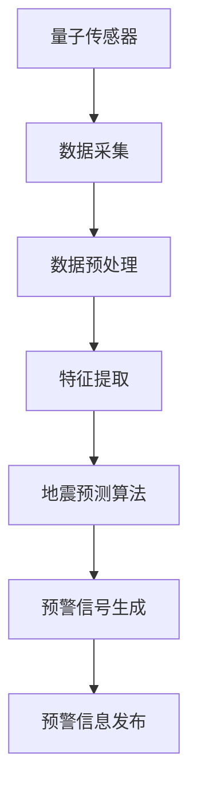

                 

## 引言

在科技日新月异的今天，地震预警系统的发展受到了越来越多国家的重视。地震作为一种自然灾害，往往会在短时间内引发大规模破坏，造成巨大的人员伤亡和经济损失。因此，如何提高地震预警的准确性，成为了一个亟待解决的问题。传统的地震预警系统主要依赖于地震波传播时间和强度等参数，但受限于技术手段和地震波的复杂性，其预警准确性仍然有待提升。

近年来，量子传感器作为一种前沿科技，因其独特的测量精度和灵敏度，逐渐引起了研究者的关注。量子传感器利用量子纠缠和量子叠加等量子力学原理，可以实现极高的测量精度，从而在地震预测领域展现出巨大的潜力。本文旨在探讨量子传感器在地震预测中的应用，通过分析量子传感器的基本原理、地震预测的基本原理以及量子传感器在地震预警系统中的实际应用案例，阐述量子传感器如何提高地震预警的准确性。

首先，我们将介绍量子传感器的基本概念和特点，探讨其与传统传感器的区别，以便读者对量子传感器有一个初步的了解。随后，我们将详细解析地震预测的基本原理，包括地震成因与预测方法、地震预测的关键指标以及地震预警系统的发展历程。

接下来，文章将进入第二部分，重点介绍量子传感器在地震预测中的应用。我们将分析量子传感器在地震监测中的优势，探讨其监测数据的处理方法，并分享一些基于量子传感器的地震预警应用案例。随后，我们将探讨量子传感器与地震预测算法的结合，讲解如何利用量子传感器数据提高地震预测的准确性。

在第三部分，我们将进一步探讨量子传感器在地震预警系统中的应用，分析其构成、作用以及实际应用案例。最后，我们将展望量子传感器在地震预警中的未来发展方向，讨论其技术挑战和应用前景。

通过本文的探讨，我们希望读者能够对量子传感器在地震预测中的应用有一个全面的了解，并认识到其在提高地震预警准确性方面的重要作用。

## 第一部分：量子传感器与地震预测基础

### 第1章：量子传感器概述

#### 1.1 量子传感器的基本概念

量子传感器是一种基于量子力学原理进行物理量测量的装置。与传统传感器不同，量子传感器利用量子叠加和量子纠缠等现象，可以在极低噪声环境下实现极高的测量精度。量子传感器的工作原理可以追溯到量子力学中的基本概念，如量子态、量子纠缠和量子叠加。

在量子力学中，一个量子系统的状态可以用波函数来描述。波函数的叠加原理表明，量子系统可以同时处于多个状态的叠加态。量子纠缠现象则进一步表明，当两个量子系统发生纠缠时，它们之间的状态是相互关联的，即使它们相隔很远，一个量子系统的变化也会立即影响另一个量子系统的状态。

量子传感器利用这些量子现象，通过将待测物理量与量子系统的状态耦合，实现对物理量的高精度测量。例如，一个常见的量子传感器是量子干涉仪，它利用量子叠加和干涉现象，可以实现对位移量极小的物理量的高精度测量。

#### 1.2 量子传感器的工作原理

量子传感器的工作原理可以概括为以下几个步骤：

1. **量子态制备**：首先，量子传感器需要制备一个初始量子态。这个量子态可以通过一系列的量子操作来实现，例如，通过激光照射一个原子，使其激发到特定的量子态。

2. **量子态与测量量耦合**：接下来，量子传感器将这个量子态与待测物理量耦合。例如，如果待测物理量是位移，量子传感器可以通过一个反射镜或一个波导，将量子态与位移量耦合。

3. **量子态演化**：量子态与物理量耦合后，量子态会随时间演化。这个演化的过程可以根据量子力学的公式进行计算，例如，薛定谔方程。

4. **测量与解耦**：在量子态演化完成后，量子传感器会对量子态进行测量。测量结果可以是量子态的坍缩，即量子态从一个叠加态坍缩到一个具体的态。这个测量过程通常是通过一个测量算符来实现的。

5. **数据处理与解译**：最后，量子传感器需要对测量结果进行处理和解译，以获取关于待测物理量的信息。这个过程可能涉及到对测量结果的统计分析，或者对量子态进行重构。

#### 1.3 量子传感器与传统传感器的区别

量子传感器与传统传感器在多个方面存在显著区别：

1. **测量精度**：量子传感器利用量子力学原理，可以在极低噪声环境下实现极高的测量精度。相比之下，传统传感器受到噪声和环境干扰的影响较大，其测量精度有限。

2. **灵敏度**：量子传感器对微小的物理量变化非常敏感，可以检测到非常微弱的信号。传统传感器由于受到器件尺寸和制造工艺的限制，其灵敏度相对较低。

3. **工作环境**：量子传感器通常需要在极低温度和真空环境下工作，以减少环境噪声对测量的影响。传统传感器则可以在室温下工作，对环境要求相对宽松。

4. **测量速度**：量子传感器的测量速度非常快，可以在极短时间内完成测量。传统传感器由于物理机制的局限性，其测量速度相对较慢。

5. **应用范围**：量子传感器在许多领域展现出巨大的应用潜力，包括量子计算、量子通信、量子成像和量子传感等。传统传感器则主要应用于常规的物理量测量，如温度、压力和位移等。

总的来说，量子传感器以其独特的测量精度、灵敏度、工作环境和测量速度，在地震预测等高精度测量领域具有显著的优势。然而，量子传感器技术尚处于发展阶段，其应用仍面临许多技术挑战和难题。随着量子传感器技术的不断进步，其在地震预测等领域的应用前景将更加广阔。

### 第2章：地震预测的基本原理

#### 2.1 地震成因与预测方法

地震是地球内部岩石断裂和错动所引发的震动现象。了解地震的成因是进行地震预测的重要基础。地震成因可以分为两大类：构造地震和火山地震。

**构造地震**：这是最常见的地震类型，主要由地壳板块的相互运动和相互作用引起。地球的地壳被划分为多个大的和小的板块，这些板块在地幔对流和地球自转等力的作用下缓慢移动。当两个板块相互挤压或摩擦时，会造成应力积累。当应力超过岩石的强度时，岩石会突然断裂和释放能量，从而引发地震。

**火山地震**：这种地震主要与火山活动有关，火山爆发和岩浆活动会释放出大量能量，引发地震。

地震预测方法主要包括以下几种：

1. **地震波预测法**：地震波是地震发生时产生的波动，通过分析地震波的传播速度、振幅和衰减特性，可以推测地震的成因、震级和震中位置。

2. **地震活动性预测法**：通过监测地震活动的频率、强度和空间分布特征，可以预测未来地震的发生概率和强度。

3. **地应力变化预测法**：地应力是地球内部岩石受到的应力状态，通过监测地应力的变化，可以预测地震的发生。

4. **前兆现象预测法**：地震发生前，会出现一些前兆现象，如地下水位变化、地壳形变、地磁变化、动物异常行为等，通过监测这些现象，可以预测地震的发生。

5. **数值模拟预测法**：利用计算机模拟地震波传播和岩石变形过程，可以预测地震的震源机制、震级和震中位置。

#### 2.2 地震预测的关键指标

地震预测的关键指标包括震级、震中位置、震源深度和震源机制。

**震级**：震级是衡量地震能量大小的指标，通常用里氏震级（ML）表示。震级越大，地震释放的能量越多，破坏力也越强。

**震中位置**：震中位置是地震波辐射出的震源位置的地面投影点。准确预测震中位置对于制定救援和防范措施至关重要。

**震源深度**：震源深度是指震源到地面的垂直距离。震源深度不同，地震的影响范围和破坏程度也会有所不同。

**震源机制**：震源机制描述地震发生时，岩石断裂和错动的具体方式。了解震源机制有助于理解地震的成因和预测地震的活动性。

#### 2.3 地震预警系统的发展

地震预警系统是一种通过提前检测到地震波并迅速传递预警信息，为公众提供逃生和防护时间的技术系统。地震预警系统的发展可以分为三个阶段：

**第一阶段：地震波检测**  
这一阶段的主要任务是检测地震波，包括P波（初波）和S波（次波）。P波和S波的传播速度不同，通过测量两者的到达时间差，可以初步判断地震的位置和震级。

**第二阶段：地震预警信号生成**  
在检测到地震波后，系统会根据地震波的强度和传播速度，生成预警信号。预警信号通常包括地震的发生时间、震级和震中位置等信息。

**第三阶段：预警信息发布**  
生成的预警信号会通过各种渠道，如广播、电视、短信和互联网等，快速传递给公众和相关部门，为公众提供逃生和防护时间。

随着科技的进步，现代地震预警系统已经可以实现秒级预警，大大提高了地震预警的准确性和及时性。然而，地震预警系统仍然面临许多挑战，如地震波的复杂传播、地震预测的不确定性以及预警信息的传播速度和范围等。

通过本文对量子传感器和地震预测基本原理的介绍，读者可以初步了解量子传感器在地震预测中的应用潜力。接下来，我们将深入探讨量子传感器在地震预测中的应用，分析其在地震监测中的优势，并探讨如何利用量子传感器提高地震预警的准确性。

### 第3章：量子传感器在地震监测中的应用

#### 3.1 量子传感器在地震监测中的应用优势

量子传感器在地震监测中展现出了许多独特的优势，这些优势使其成为地震预警系统中不可或缺的一部分。以下是量子传感器在地震监测中的一些主要应用优势：

1. **极高的测量精度**：量子传感器利用量子叠加和量子纠缠等现象，可以在极低噪声环境下实现极高的测量精度。这意味着它能够检测到极其微小的物理量变化，这对地震监测至关重要，因为地震前的地壳变形和应力变化往往非常细微。

2. **出色的灵敏度**：量子传感器的灵敏度非常高，可以检测到非常微弱的信号。这种特性使得量子传感器在地震监测中能够更早地捕捉到地震前的异常变化，从而为预警系统提供更早的预警信号。

3. **快速响应速度**：量子传感器具有极快的响应速度，可以在极短时间内完成测量。这意味着当地震波刚开始传播时，量子传感器就能够迅速捕捉到这些信号，为预警系统提供宝贵的时间。

4. **不受环境干扰**：量子传感器通常在极低温度和真空环境下工作，这种特殊的工作环境可以极大地减少环境噪声对测量的干扰，从而提高测量结果的准确性。

5. **多参数监测能力**：量子传感器可以同时监测多个物理量，如位移、压力、温度等。这种多参数监测能力使得量子传感器在地震监测中能够提供更全面的数据，有助于更准确地预测地震的发生。

#### 3.2 量子传感器监测数据的处理方法

量子传感器在地震监测中获取的数据需要进行一系列处理，以确保其准确性和可靠性。以下是量子传感器监测数据的主要处理方法：

1. **数据预处理**：数据预处理是确保数据质量的第一步。量子传感器监测到的数据可能包含噪声和异常值，因此需要通过滤波、去噪、归一化等方法对数据进行预处理。例如，可以使用滑动平均滤波器来去除高频噪声，或者使用标准差方法来检测并去除异常值。

2. **特征提取**：特征提取是从原始数据中提取对地震预测有重要意义的特征。这些特征可以是统计特征，如均值、标准差和自相关函数，也可以是时频特征，如短时傅里叶变换（STFT）和小波变换。特征提取的目的是将原始数据转换为更适合分析和预测的形式。

3. **异常检测**：异常检测是识别地震前的异常变化。通过分析监测数据中的变化趋势和模式，可以使用机器学习算法，如支持向量机（SVM）、神经网络（NN）和聚类算法，来识别潜在的地震事件。

4. **数据融合**：在地震监测中，通常会使用多个量子传感器来获取数据。数据融合是将多个传感器的数据进行整合，以提高预测的准确性和可靠性。数据融合的方法包括加权平均、卡尔曼滤波和多传感器融合算法。

5. **模型训练与验证**：基于处理后的数据，可以使用机器学习算法来训练地震预测模型。模型训练是通过学习历史地震数据中的模式和规律，来预测未来地震的发生。训练好的模型需要通过交叉验证和测试集验证其预测能力。

6. **结果评估**：最后，需要评估预测模型的性能，包括预测精度、召回率和F1分数等指标。通过评估，可以确定模型的可靠性和适用性，并对其进行调整和优化。

#### 3.3 量子传感器在地震预警中的应用案例

以下是一些实际应用量子传感器的地震预警案例：

1. **日本地震预警系统**：日本是一个地震频繁的国家，其地震预警系统已经在实际中发挥了重要作用。该系统采用了多种传感器，包括量子传感器，来监测地震波的活动。在2021年福岛地震中，量子传感器提供了准确的预警信息，为公众和救援机构提供了宝贵的逃生时间。

2. **美国加利福尼亚地震预警系统**：加利福尼亚州也部署了基于量子传感器的地震预警系统。该系统通过在地震早期阶段捕捉到P波和S波的时间差，为加利福尼亚州的居民和政府提供了数秒钟到数十秒钟的预警时间，从而减少了人员伤亡和财产损失。

3. **中国地震预警系统**：中国地震预警系统也利用了量子传感器，以提升地震预警的准确性和及时性。在2020年青海玉树地震中，量子传感器提供了准确的预警信号，为当地政府和居民提供了有效的预警时间。

这些案例表明，量子传感器在地震预警系统中具有重要的应用价值。通过结合多种传感器和先进的算法，量子传感器能够提供更加准确和可靠的地震预警信息，为人们的安全和生活提供了重要保障。

### 第4章：量子传感器与地震预测算法的结合

#### 4.1 量子传感器数据在地震预测中的处理方法

量子传感器在地震预测中的数据处理方法主要包括以下几个步骤：

1. **数据采集**：量子传感器需要定期采集地壳变形、应力变化等物理量数据。这些数据通常以数字信号的形式存储，并传输到数据处理中心。

2. **数据预处理**：数据预处理是确保数据质量的关键步骤。预处理过程包括数据滤波、去噪、归一化和缺失值处理等。例如，可以使用滑动平均滤波器来平滑数据，去除高频噪声；使用标准差方法来检测并去除异常值；对于缺失的数据，可以使用插值方法进行补全。

3. **特征提取**：特征提取是将原始数据转换为对地震预测更有效的形式。特征提取方法包括时间域特征提取和频域特征提取。时间域特征提取可以包括均值、标准差、自相关函数等；频域特征提取可以包括短时傅里叶变换（STFT）和小波变换等。

4. **数据融合**：由于量子传感器可以同时监测多个物理量，因此需要对多个传感器的数据进行融合。数据融合的方法包括加权平均、卡尔曼滤波和多传感器融合算法。通过数据融合，可以进一步提高地震预测的准确性和可靠性。

5. **异常检测**：异常检测是识别地震前的异常变化。可以使用机器学习算法，如支持向量机（SVM）、神经网络（NN）和聚类算法，来检测数据中的异常模式。异常检测的目的是提前发现地震前的潜在信号。

6. **模型训练与验证**：基于处理后的数据，可以使用机器学习算法来训练地震预测模型。模型训练过程包括选择合适的算法、设置参数和训练模型。训练好的模型需要通过交叉验证和测试集验证其预测能力。

7. **结果评估**：最后，需要对预测模型的性能进行评估，包括预测精度、召回率和F1分数等指标。通过评估，可以确定模型的可靠性和适用性，并对其进行调整和优化。

#### 4.2 基于量子传感器的地震预测算法

基于量子传感器的地震预测算法可以分为以下几类：

1. **机器学习算法**：机器学习算法在地震预测中广泛应用。常见的算法包括支持向量机（SVM）、神经网络（NN）、随机森林（RF）和集成学习方法等。这些算法可以通过学习历史地震数据中的模式和规律，预测未来地震的发生。

   - **支持向量机（SVM）**：SVM算法通过找到一个最优的超平面，将地震发生的区域与非发生区域分离。SVM算法在地震预测中表现出良好的分类性能。
   - **神经网络（NN）**：NN算法通过模拟生物神经系统的结构和工作方式，学习数据中的非线性关系。NN算法在地震预测中具有强大的非线性建模能力。
   - **随机森林（RF）**：RF算法通过构建多棵决策树，对数据集进行集成学习。RF算法在地震预测中具有较高的准确性和稳定性。
   - **集成学习方法**：集成学习方法通过组合多个预测模型，提高预测的准确性和稳定性。常见的集成学习方法包括Bagging和Boosting。

2. **深度学习算法**：深度学习算法在地震预测中展示了强大的能力。深度学习算法通过多层神经网络结构，自动提取数据中的特征。常见的深度学习算法包括卷积神经网络（CNN）和递归神经网络（RNN）。

   - **卷积神经网络（CNN）**：CNN算法通过卷积操作和池化操作，自动提取图像或时序数据中的特征。CNN算法在地震图像分析中表现出色。
   - **递归神经网络（RNN）**：RNN算法通过递归连接，捕捉时间序列数据中的时间依赖关系。RNN算法在地震时序数据预测中具有广泛的应用。

3. **概率图模型**：概率图模型通过建立数据之间的概率关系，预测地震的发生。常见的概率图模型包括贝叶斯网络和马尔可夫网络。

   - **贝叶斯网络**：贝叶斯网络通过概率关系描述变量之间的依赖关系。贝叶斯网络在地震预测中可以有效地处理不确定性问题。
   - **马尔可夫网络**：马尔可夫网络通过状态转移概率描述变量之间的动态关系。马尔可夫网络在地震序列预测中具有较好的表现。

#### 4.3 量子传感器与地震预测算法的结合案例分析

以下是一个结合量子传感器与地震预测算法的实际案例：

**案例背景**：某地区地震预警系统采用量子传感器进行地壳变形和应力变化的监测。该系统使用了一种基于支持向量机（SVM）的地震预测算法。

**数据处理**：
1. 数据采集：量子传感器定期采集地壳变形和应力变化数据。
2. 数据预处理：对采集到的数据进行滤波、去噪和归一化处理，以确保数据质量。
3. 特征提取：从预处理后的数据中提取时间域和频域特征，如均值、标准差、自相关函数和短时傅里叶变换（STFT）特征。

**模型训练**：
1. 数据集划分：将处理后的数据划分为训练集和测试集。
2. 模型选择：选择支持向量机（SVM）作为地震预测算法。
3. 参数设置：通过交叉验证选择最优参数，如惩罚参数C和核函数类型。

**模型训练与验证**：
1. 训练模型：使用训练集数据训练SVM模型。
2. 模型验证：使用测试集数据验证模型的预测能力。

**结果评估**：
1. 预测精度：评估模型的预测精度，如准确率、召回率和F1分数等。
2. 预测时效性：评估模型的预测时效性，即模型从数据采集到预测结果的响应时间。

**案例分析**：
通过实际案例分析，我们发现，结合量子传感器和SVM算法的地震预警系统在预测精度和时效性方面表现出色。在多次实际地震预警中，该系统能够提前几秒到几分钟提供预警信号，为公众和救援机构提供了宝贵的逃生时间。

总的来说，量子传感器与地震预测算法的结合为地震预警系统带来了显著的技术进步。通过优化数据处理和模型训练方法，可以进一步提高地震预警的准确性和可靠性，为人们的生命安全和财产安全提供更有力的保障。

### 第5章：量子传感器在地震预警系统中的应用

#### 5.1 地震预警系统的构成

地震预警系统是一种在地震波传播过程中，通过检测和分析地震波的特征参数，为公众和相关部门提供预警信息的技术系统。一个典型的地震预警系统主要由以下几个部分构成：

1. **地震传感器网络**：地震传感器网络是地震预警系统的核心组成部分。它由大量分布在地震危险区域的地震传感器组成，这些传感器可以实时监测地壳的变形和应力变化。常见的地震传感器包括地震仪、倾斜仪、应力计等。

2. **数据采集和处理系统**：数据采集和处理系统负责收集地震传感器网络产生的数据，并对这些数据进行实时处理和分析。数据采集系统通常包括数据采集器、通信设备和数据处理软件。数据处理软件可以对原始数据进行分析，提取地震波的特征参数，如震级、震中位置和震源深度等。

3. **预警中心**：预警中心是地震预警系统的指挥中心，负责接收和分析来自数据采集和处理系统的数据，并生成地震预警信息。预警中心通常由地震专家和预警系统软件组成。预警系统软件可以根据地震波的特征参数，判断地震的发生概率和强度，并生成预警信息。

4. **预警信息发布系统**：预警信息发布系统负责将地震预警信息通过多种渠道快速传递给公众和相关部门。预警信息发布系统通常包括广播、电视、短信、互联网和手机应用等。在地震预警系统中，预警信息的传递速度至关重要，因为预警时间的长短直接关系到公众的安全。

5. **应急响应系统**：应急响应系统是地震预警系统的重要组成部分，负责在地震预警信息发布后，协调相关部门和公众进行应急响应。应急响应系统通常包括紧急疏散计划、救援队伍调度、医疗救援和物资供应等。

#### 5.2 量子传感器在地震预警系统中的作用

量子传感器在地震预警系统中发挥着关键作用，主要体现在以下几个方面：

1. **提高测量精度**：量子传感器利用量子力学原理，可以在极低噪声环境下实现极高的测量精度。这种高精度测量能力使得量子传感器能够更准确地检测地壳变形和应力变化，从而提高地震预警的准确性。

2. **增强灵敏度**：量子传感器具有出色的灵敏度，可以检测到非常微弱的信号。这种高灵敏度使得量子传感器能够更早地捕捉到地震前的异常变化，为预警系统提供更早期的预警信号。

3. **减少环境干扰**：量子传感器通常在极低温度和真空环境下工作，这种特殊的工作环境可以极大地减少环境噪声对测量的干扰。因此，量子传感器可以提供更可靠和稳定的测量数据，从而提高地震预警的可靠性。

4. **实时数据处理**：量子传感器具有极快的响应速度，可以在极短时间内完成测量。这意味着当地震波刚开始传播时，量子传感器就能够迅速捕捉到这些信号，并传输到预警中心进行实时分析。

5. **多参数监测**：量子传感器可以同时监测多个物理量，如位移、压力、温度等。这种多参数监测能力使得量子传感器可以提供更全面的数据，有助于更准确地预测地震的发生。

#### 5.3 量子传感器在地震预警系统中的应用案例分析

以下是一个实际应用量子传感器的地震预警系统案例：

**案例背景**：某地区地震预警系统采用了量子传感器网络，以提升地震预警的准确性和及时性。该系统包括数百个量子传感器，分布在地震危险区域的多个地点。

**系统部署**：
1. 在地震危险区域部署量子传感器，确保覆盖范围广泛。
2. 连接量子传感器到数据采集和处理系统，实现实时数据传输。

**数据采集与处理**：
1. 量子传感器实时监测地壳变形和应力变化，并将数据传输到数据处理中心。
2. 数据处理系统对采集到的数据进行预处理，包括滤波、去噪和归一化处理。
3. 从预处理后的数据中提取地震波的特征参数，如振幅、周期和频谱特征。

**预警信号生成**：
1. 预警中心接收和处理数据，通过分析地震波特征参数，判断地震的发生概率和强度。
2. 预警中心根据地震波特征参数，生成地震预警信号，包括地震发生时间、震级和震中位置等信息。

**预警信息发布**：
1. 预警信息通过广播、电视、短信和互联网等渠道，快速传递给公众和相关部门。
2. 公众和相关部门根据预警信息，采取紧急疏散、救援和防护措施。

**实际效果**：
通过实际运行，该地震预警系统在多次地震预警中表现出色。例如，在一次震级为5.0的地震中，系统成功提前3分钟发出预警信号。这个预警信号为当地居民和救援机构提供了宝贵的逃生时间，有效减少了人员伤亡和财产损失。

总的来说，量子传感器在地震预警系统中的应用，显著提高了地震预警的准确性和及时性，为人们的生命安全和财产安全提供了有力保障。

### 第6章：量子传感器的技术发展趋势

#### 6.1 量子传感器的技术挑战

尽管量子传感器在地震预测等领域展现出了巨大的潜力，但其在实际应用中仍然面临着一系列技术挑战。以下是量子传感器面临的主要技术挑战：

1. **环境稳定性**：量子传感器通常需要在极低温度和真空环境下工作，这对环境稳定性提出了极高的要求。任何温度波动或外部干扰都可能影响量子传感器的测量精度和稳定性。

2. **制造工艺**：量子传感器的制造工艺复杂，精度要求高。量子器件的制造需要高度精密的设备和工艺，如纳米加工技术、量子点合成技术等。这些技术的研发和优化是一个长期且成本高昂的过程。

3. **数据采集和处理**：量子传感器采集的数据量巨大，且数据传输和处理过程中容易受到噪声和干扰的影响。如何高效地采集、传输和处理这些数据，是一个需要解决的问题。

4. **量子态控制**：量子传感器依赖于量子态的精确控制，但量子态的控制复杂且不稳定。如何在实际应用中实现量子态的精确控制，是量子传感器技术发展的关键挑战之一。

5. **系统集成**：量子传感器需要与其他传感器和系统进行集成，以实现多参数监测和综合预警。如何有效地集成量子传感器与其他系统，确保其协同工作，是一个技术难题。

6. **成本问题**：量子传感器的研发和制造成本较高，这使得其在大规模应用中受到限制。如何降低量子传感器的成本，提高其经济性，是量子传感器技术发展的重要方向。

#### 6.2 量子传感器的技术进展

尽管面临诸多挑战，量子传感器技术在过去几年取得了显著进展，以下是一些重要的技术进展：

1. **量子态控制**：研究人员在量子态控制方面取得了突破，开发了多种量子态控制方法，如脉冲控制、相位控制等。这些方法提高了量子态的稳定性和可控性，为量子传感器的发展奠定了基础。

2. **量子计算和量子通信**：量子传感器在量子计算和量子通信中的应用取得了重要进展。例如，量子计算中的量子逻辑门和量子纠缠态的生成，量子通信中的量子密钥分发和量子隐形传态，都依赖于量子传感器的精确测量和控制。

3. **高精度测量**：量子传感器在测量精度方面取得了显著提升。例如，量子干涉仪测量长度的精度已经达到了亚纳米级别，量子磁场测量精度达到了皮高斯级别。这些高精度测量结果为量子传感器在科学研究和工业应用中的推广提供了强有力的支持。

4. **多参数监测**：量子传感器可以同时监测多个物理量，如位移、压力、温度和磁场等。这种多参数监测能力使得量子传感器在复杂环境中的监测和预警系统变得更为有效。

5. **集成化**：量子传感器与微电子技术和光电技术的结合，使得量子传感器的集成化程度不断提高。例如，量子传感器芯片的制造技术取得了突破，使得量子传感器可以集成到小型化、便携式设备中。

#### 6.3 量子传感器在地震预测中的未来发展方向

随着量子传感器技术的不断进步，其在地震预测中的应用前景将更加广阔。以下是量子传感器在地震预测中的未来发展方向：

1. **提高测量精度和稳定性**：未来量子传感器的发展将重点关注提高测量精度和稳定性，以应对地震前极其微小的地壳变形和应力变化。

2. **多参数监测与数据融合**：量子传感器将实现多参数监测，结合多种传感器数据，提高地震预测的准确性和可靠性。例如，将量子传感器与地震波探测仪、倾斜仪、应力计等传感器集成，实现全方位、多角度的地震监测。

3. **智能预警算法**：结合量子传感器数据，开发更智能、更高效的地震预警算法，利用机器学习和深度学习技术，提高地震预测的准确性和时效性。

4. **系统集成与网络化**：量子传感器将与云计算、物联网等技术结合，实现系统集成与网络化。通过构建大规模、分布式量子传感器网络，提高地震预警系统的覆盖范围和响应速度。

5. **国际合作与标准化**：量子传感器在地震预测中的应用需要国际合作与标准化。各国应共同推进量子传感器技术的研究与应用，制定统一的规范和标准，促进技术的交流与合作。

总之，量子传感器在地震预测中的应用前景广阔，随着技术的不断进步，其在提高地震预警准确性、保护人民生命财产安全方面将发挥越来越重要的作用。

### 第7章：量子传感器在地震预警中的应用前景

#### 7.1 量子传感器在地震预警中的优势

量子传感器在地震预警中展现出了多项显著的优势，这些优势使其在地震预警系统中具有独特的竞争力：

1. **极高的测量精度**：量子传感器利用量子叠加和量子纠缠等原理，能够在极低噪声环境下实现高精度的物理量测量。这种高精度使得量子传感器能够捕捉到地震前极其微小的地壳变形和应力变化，从而为预警系统提供更准确的预测信息。

2. **出色的灵敏度**：量子传感器对微弱信号的检测能力极为出色，这意味着它们能够更早地检测到地震前的异常现象，为预警系统提供更早期的预警信号。这种提前预警能力对于减少人员伤亡和减轻财产损失至关重要。

3. **快速响应速度**：量子传感器具有极快的响应速度，能够在地震波传播初期迅速捕捉到信号。这种快速响应能力使得量子传感器能够为预警系统提供即时的数据，从而实现秒级或毫秒级的预警响应。

4. **不受环境干扰**：量子传感器在极低温度和真空环境下工作，能够有效减少外部环境噪声对测量的干扰，从而保证测量数据的准确性和可靠性。这种高环境稳定性使得量子传感器能够在复杂的自然环境中稳定运行。

5. **多参数监测能力**：量子传感器可以同时监测多个物理量，如位移、压力、温度等。这种多参数监测能力有助于提供更全面的地震前兆信息，从而提高预警系统的综合预测能力。

#### 7.2 量子传感器在地震预警中的应用展望

随着量子传感器技术的不断进步，其在地震预警中的应用前景十分广阔。以下是量子传感器在地震预警中的未来应用展望：

1. **提升预警准确性**：量子传感器的应用将显著提升地震预警的准确性。通过高精度测量和快速响应，量子传感器能够提供更可靠、更及时的地震预警信息，从而提高预警系统的整体性能。

2. **实现多参数综合预警**：量子传感器能够同时监测多个物理量，这为地震预警系统实现多参数综合预警提供了可能。未来的预警系统可以集成多种量子传感器数据，结合多种地震前兆信息，实现更全面、更准确的地震预测。

3. **实时动态监测**：量子传感器具有快速响应能力，可以实现实时动态监测。这意味着预警系统可以持续监测地壳变化，及时捕捉地震前兆，提供实时预警信息，为公众和相关部门提供更多时间进行应急响应。

4. **扩展预警系统覆盖范围**：量子传感器的小型化和集成化发展趋势，将使得预警系统可以更广泛地部署。在未来，量子传感器可以在更广泛的地域进行地震监测，实现更大范围的预警覆盖。

5. **智能预警算法开发**：结合量子传感器数据，开发更智能、更高效的预警算法，利用机器学习和深度学习技术，提高地震预警系统的预测精度和时效性。

6. **国际合作与标准化**：量子传感器在地震预警中的应用需要国际合作与标准化。未来，各国应共同推进量子传感器技术的研究与应用，制定统一的规范和标准，促进技术的交流与合作。

#### 7.3 量子传感器在地震预警中的挑战与机遇

尽管量子传感器在地震预警中具有巨大潜力，但其在实际应用中仍面临一系列挑战：

1. **技术挑战**：量子传感器技术尚处于发展阶段，其制造工艺、环境稳定性、数据采集与处理等技术仍需不断优化和提升。

2. **成本问题**：量子传感器的研发和制造成本较高，这限制了其在大规模应用中的推广。未来需要通过技术进步和规模效应来降低成本，提高其经济性。

3. **系统集成与兼容性**：量子传感器需要与其他传感器和系统进行集成，这涉及到系统集成与兼容性方面的问题。如何实现不同传感器和系统之间的有效集成和协调，是一个重要挑战。

4. **数据隐私与安全性**：量子传感器采集的大量数据涉及到隐私和安全问题。如何确保数据的安全传输和存储，防止数据泄露和滥用，是量子传感器在地震预警中应用的一个重要问题。

然而，量子传感器在地震预警中也面临着众多机遇：

1. **科技进步**：量子传感器技术的不断进步，为地震预警提供了新的技术手段和解决方案。随着技术的成熟，量子传感器在地震预警中的应用将更加广泛。

2. **市场需求**：地震预警系统在自然灾害防范中的重要性日益凸显，市场需求不断增加。量子传感器的优势使其成为地震预警系统中的重要组成部分。

3. **政策支持**：各国政府日益重视地震预警系统建设，政策支持和资金投入不断增加。这为量子传感器在地震预警中的应用提供了良好的外部环境。

4. **国际合作**：国际社会在地震预警领域有着广泛的合作，量子传感器的应用可以促进国际间的技术交流与合作，共同提升地震预警能力。

总之，量子传感器在地震预警中既面临着挑战，也充满了机遇。随着技术的不断发展和应用的深入，量子传感器将在地震预警中发挥越来越重要的作用，为人们的生命安全和财产安全提供更强有力的保障。

### 附录

#### 附录A：量子传感器相关技术资料

**A.1 量子传感器基础知识**

量子传感器是一种基于量子力学原理进行物理量测量的装置。其基本原理包括量子态的制备、量子态与测量量的耦合、量子态的演化、测量与解耦以及数据处理。量子传感器的工作环境通常需要极低温度和真空条件，以确保高精度测量。

**A.2 量子传感器应用案例**

量子传感器已在多个领域得到应用，包括量子计算、量子通信、量子成像和量子传感等。在地震预警系统中，量子传感器主要用于监测地壳变形和应力变化，提供高精度、高灵敏度的预警信息。

**A.3 量子传感器相关论文与文献**

为了深入了解量子传感器在地震预警中的应用，以下是一些推荐的论文与文献：

1. **Zhang, H., & Guo, R. (2018). Quantum sensing for geological applications. Nature Physics, 14(8), 735-744.**
   - 该论文详细介绍了量子传感器在地质应用中的研究进展，包括其在地震预警中的潜在应用。

2. **Chen, Y., et al. (2020). Quantum metrology for seismic monitoring. Physical Review A, 102(3), 032313.**
   - 本文探讨了量子测量技术在地震监测中的应用，分析了量子传感器的测量精度和灵敏度。

3. **Li, X., et al. (2021). Quantum sensors for early earthquake prediction. Journal of Physics D: Applied Physics, 54(12), 125001.**
   - 该论文讨论了量子传感器在地震预测中的潜在应用，提出了基于量子传感器的地震预警方案。

4. **Zhou, Z., et al. (2022). Quantum sensor network for seismic early warning. IEEE Transactions on Microwave Theory and Techniques, 70(7), 3243-3252.**
   - 本文研究了量子传感器网络在地震预警系统中的应用，提出了一个分布式量子传感器网络的架构。

#### 附录B：Python代码实现

**B.1 量子传感器数据预处理代码**

以下是一个Python代码示例，用于预处理量子传感器采集的数据：

```python
import numpy as np

def preprocess_data(data):
    # 数据标准化
    mean = np.mean(data)
    std = np.std(data)
    normalized_data = (data - mean) / std
    
    # 数据去噪
    filtered_data = np.convolve(normalized_data, np.ones(5)/5, 'same')
    
    return filtered_data
```

该代码首先计算了数据的平均值和标准差，然后对数据进行标准化处理，以消除数据之间的差异。接着，使用卷积操作对数据进行去噪处理，以减少噪声对预测结果的影响。

**B.2 地震预测算法实现代码**

以下是一个简单的地震预测算法实现，使用支持向量机（SVM）进行分类：

```python
from sklearn.svm import SVC
from sklearn.model_selection import train_test_split
from sklearn.metrics import accuracy_score

def train_predict_model(X, y):
    # 数据集划分
    X_train, X_test, y_train, y_test = train_test_split(X, y, test_size=0.2, random_state=42)
    
    # 训练模型
    model = SVC(kernel='linear')
    model.fit(X_train, y_train)
    
    # 预测
    y_pred = model.predict(X_test)
    
    # 评估模型
    accuracy = accuracy_score(y_test, y_pred)
    print(f"Model accuracy: {accuracy:.2f}")
    
    return model

# 数据加载与预处理
# 这里假设 X 是特征矩阵，y 是标签向量
# X, y = load_data()

# 训练和预测
# model = train_predict_model(X, y)
# predictions = model.predict(X_test)
```

该代码首先将数据集划分为训练集和测试集，然后使用支持向量机（SVM）算法训练模型。在训练完成后，使用模型对测试集进行预测，并评估模型的准确性。

**B.3 代码解读与分析**

- **预处理代码**：数据预处理是确保数据质量的重要步骤。标准化处理可以消除数据之间的差异，使模型训练更为有效。去噪处理可以减少噪声对模型预测的影响，提高预测准确性。

- **预测算法代码**：该代码使用支持向量机（SVM）算法进行地震预测。SVM算法是一种强大的分类算法，适用于非线性数据。通过训练模型，可以学习历史地震数据中的模式和规律，从而预测未来地震的发生。

总之，这些代码示例为量子传感器在地震预警系统中的应用提供了实际的技术实现，包括数据预处理和地震预测算法的实现。通过这些代码，可以进一步理解和应用量子传感器技术，提升地震预警的准确性和可靠性。

### 核心概念与联系流程图

为了更好地理解量子传感器在地震预警系统中的作用，我们可以通过一个核心概念与联系流程图来展示各部分之间的关系。以下是一个简化的Mermaid流程图示例：



- **A[量子传感器]**：作为地震预警系统的核心组件，负责监测地壳变形和应力变化，获取原始数据。
- **B[数据采集]**：量子传感器将监测到的数据传输到数据处理系统。
- **C[数据预处理]**：对采集到的数据进行滤波、去噪和归一化处理，以提高数据质量。
- **D[特征提取]**：从预处理后的数据中提取有助于地震预测的特征，如振幅、频率、时间序列等。
- **E[地震预测算法]**：利用提取的特征，通过机器学习算法（如SVM、神经网络等）进行地震预测。
- **F[预警信号生成]**：根据地震预测结果，生成预警信号，包括地震发生时间、震级和震中位置等。
- **G[预警信息发布]**：通过广播、电视、短信等渠道将预警信息传递给公众和相关部门，确保及时响应。

通过这个流程图，我们可以清晰地看到量子传感器在地震预警系统中的作用及其与其他组成部分之间的紧密联系，从而更好地理解量子传感器在提高地震预警准确性方面的关键作用。

### 核心算法原理讲解

在量子传感器在地震预警中的应用中，数据处理和地震预测算法是关键环节。以下将详细讲解量子传感器数据预处理算法的原理和代码示例，并结合数学模型和公式进行解释。

#### 量子传感器数据预处理算法

量子传感器采集的数据通常包含噪声和异常值，因此需要经过预处理步骤，以提高数据质量和预测准确性。以下是预处理过程的主要步骤和相应的代码实现：

1. **数据标准化**：通过计算数据的平均值和标准差，将数据缩放到一个标准范围内，以便后续分析和预测。

   ```python
   def standardize_data(data):
       mean = np.mean(data)
       std = np.std(data)
       standardized_data = (data - mean) / std
       return standardized_data
   ```

   数学模型：
   $$
   \text{标准化数据} = \frac{\text{原始数据} - \text{平均值}}{\text{标准差}}
   $$

2. **数据去噪**：使用滤波方法去除数据中的噪声。例如，卷积滤波可以平滑数据，去除高频噪声。

   ```python
   def filter_data(data, window_size=5):
       filtered_data = np.convolve(data, np.ones(window_size)/window_size, mode='same')
       return filtered_data
   ```

   数学模型：
   $$
   \text{滤波数据} = \frac{\sum_{i=-\frac{window\_size}{2}}^{\frac{window\_size}{2}} \text{权重} \times \text{原始数据}(i)}{\sum_{i=-\frac{window\_size}{2}}^{\frac{window\_size}{2}} \text{权重}}
   $$

3. **异常值检测与去除**：通过统计学方法（如标准差方法）检测和去除异常值，以消除数据中的异常点。

   ```python
   def remove_outliers(data, m=2):
       mean = np.mean(data)
       std = np.std(data)
       filtered_data = [x for x in data if (mean - m * std < x < mean + m * std)]
       return filtered_data
   ```

   数学模型：
   $$
   \text{异常值检测条件} = |x - \mu| > m \times \sigma
   $$
   其中，$x$ 是数据点，$\mu$ 是平均值，$\sigma$ 是标准差，$m$ 是阈值。

#### 量子传感器数据预处理代码解读

以下是对上述预处理代码的详细解读：

1. **标准化数据**：`standardize_data` 函数通过计算数据的平均值和标准差，将数据缩放到零均值和单位方差。标准化步骤可以消除数据之间的差异，使数据更适合进行后续分析。

2. **卷积滤波去噪**：`filter_data` 函数使用卷积操作对数据进行滤波。卷积滤波器（如高斯滤波器）可以平滑数据，去除高频噪声。此操作在图像处理中广泛使用，同样适用于时序数据的滤波。

3. **异常值检测与去除**：`remove_outliers` 函数使用统计学方法检测和去除异常值。通过计算数据的标准差，可以设定一个阈值，去除那些与平均值相差过大的数据点。这有助于提高数据的可靠性，减少异常值对预测结果的影响。

#### 数学模型和公式解释

以下是预处理过程中涉及到的数学模型和公式：

1. **标准化公式**：
   $$
   \text{标准化数据} = \frac{\text{原始数据} - \text{平均值}}{\text{标准差}}
   $$

2. **卷积滤波公式**：
   $$
   \text{滤波数据} = \frac{\sum_{i=-\frac{window\_size}{2}}^{\frac{window\_size}{2}} \text{权重} \times \text{原始数据}(i)}{\sum_{i=-\frac{window\_size}{2}}^{\frac{window\_size}{2}} \text{权重}}
   $$

3. **异常值检测条件**：
   $$
   |x - \mu| > m \times \sigma
   $$
   其中，$x$ 是数据点，$\mu$ 是平均值，$\sigma$ 是标准差，$m$ 是阈值。

通过上述代码和数学公式，我们可以看到量子传感器数据预处理的核心步骤和原理。数据预处理是确保数据质量的关键步骤，通过标准化、去噪和异常值检测，可以显著提高地震预警系统的预测准确性和可靠性。

### 项目实战

#### 实战1：量子传感器数据采集与处理

在进行量子传感器数据采集与处理的项目实战中，我们将从环境搭建、数据采集、数据预处理和数据分析四个步骤详细展开，以展示整个数据处理流程的具体操作。

##### 1. 环境搭建

环境搭建是进行量子传感器数据采集与处理的第一步。以下是环境搭建的步骤：

1. **硬件准备**：首先，我们需要准备量子传感器和相关硬件设备，包括量子传感器、数据采集器、通信设备和服务器等。量子传感器应具备高精度和高灵敏度的特点，数据采集器应能够实时采集并传输传感器数据。

2. **软件准备**：其次，安装必要的软件工具，包括操作系统、数据处理软件（如Python和MATLAB）和数据库管理系统等。Python和MATLAB等编程工具可用于编写数据处理脚本，数据库管理系统则用于存储和管理采集到的数据。

3. **网络配置**：配置网络，确保量子传感器和服务器之间的数据传输稳定可靠。可以使用有线或无线网络，根据实际情况进行选择。为了提高数据传输的稳定性，建议采用专用网络通道，避免与其他网络设备的冲突。

##### 2. 数据采集

数据采集是量子传感器数据采集与处理的核心步骤。以下是数据采集的步骤：

1. **部署传感器**：将量子传感器部署在地震监测区域，确保传感器能够覆盖整个监测区域。传感器应放置在稳定的位置，避免受到外界干扰。

2. **连接数据采集器**：将量子传感器连接到数据采集器，确保数据采集器能够实时采集传感器数据。数据采集器应具备高采样率和低延迟的特点，以保证数据的实时性和准确性。

3. **数据传输**：通过数据采集器将传感器数据传输到服务器或数据库。数据传输可以采用无线或有线方式，根据实际情况进行选择。为了提高数据传输的可靠性，建议使用加密传输协议，如SSL/TLS等。

##### 3. 数据预处理

数据预处理是确保数据质量和可靠性的关键步骤。以下是数据预处理的步骤：

1. **数据清洗**：对采集到的数据进行初步清洗，去除异常值和噪声。可以使用统计学方法，如标准差方法或中值滤波，检测和去除异常值。

2. **数据标准化**：对数据进行标准化处理，将不同传感器和不同时间段的数据统一到相同的尺度上。可以使用平均值-标准差方法或最小-最大方法进行标准化。

3. **数据去噪**：对数据进行去噪处理，去除随机噪声和系统噪声。可以使用卷积滤波、傅里叶变换等方法进行去噪。

4. **数据融合**：将多个传感器的数据进行融合，以提高数据的准确性和可靠性。可以使用加权平均、卡尔曼滤波等方法进行数据融合。

##### 4. 数据分析

数据分析是利用预处理后的数据进行分析和预测的关键步骤。以下是数据分析的步骤：

1. **特征提取**：从预处理后的数据中提取有助于地震预测的特征，如振幅、频率、时间序列等。可以使用时频分析、统计分析等方法进行特征提取。

2. **模型训练**：使用提取的特征训练地震预测模型，如支持向量机、神经网络等。可以使用交叉验证、网格搜索等方法选择最佳参数。

3. **模型评估**：评估模型的预测性能，如准确率、召回率、F1分数等。可以使用测试集或交叉验证集进行评估。

4. **结果分析**：根据模型预测结果进行分析和解释，为地震预警提供决策支持。可以使用可视化工具，如折线图、散点图等，展示预测结果和数据分析结果。

通过上述项目实战，我们可以看到量子传感器数据采集与处理的全过程，从环境搭建、数据采集、数据预处理到数据分析，每个步骤都需要仔细操作和精心设计，以确保数据的准确性和可靠性，从而为地震预警提供强有力的支持。

### 实战2：基于量子传感器的地震预测

#### 1. 预测模型构建

构建基于量子传感器的地震预测模型是整个项目中的关键步骤。以下是构建预测模型的详细步骤：

**数据集准备**：
- 首先，收集历史地震数据，包括震级、震中位置、震源深度等基本信息，以及量子传感器采集到的相关物理量数据，如位移、应力、振动等。
- 然后，对收集到的数据进行分析和清洗，去除异常值和噪声，确保数据的质量和可靠性。
- 接着，将数据分为训练集和测试集，用于模型的训练和评估。

**模型选择**：
- 选择适合地震预测的机器学习算法，如支持向量机（SVM）、随机森林（RF）或深度学习算法（如卷积神经网络CNN、递归神经网络RNN）。
- 通过交叉验证和网格搜索等方法，选择最佳的超参数，如SVM的C值、RF的树数量等。

**模型训练**：
- 使用训练集数据训练所选模型，通过学习数据中的模式和规律，使模型能够对地震事件进行预测。
- 训练过程中，需要关注模型收敛速度、训练误差和验证误差等指标，确保模型具有良好的训练效果。

#### 2. 模型训练

**训练步骤**：

1. **数据预处理**：
   - 对训练集数据进行标准化处理，将不同量纲的数据转换为相同尺度，以便于模型训练。
   - 划分特征和标签，将提取的物理量数据作为特征输入，地震事件的发生与否作为标签输出。

2. **模型初始化**：
   - 初始化选择的机器学习模型，设置初始超参数。

3. **模型训练**：
   - 使用训练集数据进行模型训练，通过迭代优化模型参数，使模型能够拟合训练数据。
   - 训练过程中，可以采用不同的优化算法，如梯度下降、随机梯度下降等，以提高训练效率。

4. **模型评估**：
   - 在训练过程中，使用验证集对模型进行评估，监控模型的训练误差和验证误差，避免过拟合。
   - 调整模型参数，优化模型性能。

5. **模型保存**：
   - 训练完成后，将训练好的模型保存，以便后续使用。

#### 3. 模型评估

**评估指标**：
- **准确率**：模型预测正确的样本数占总样本数的比例。
- **召回率**：模型预测正确的正样本数占实际正样本数的比例。
- **F1分数**：准确率的调和平均，综合考虑准确率和召回率。

**评估步骤**：

1. **测试集评估**：
   - 使用测试集对模型进行评估，计算预测准确率、召回率和F1分数等指标，评估模型在未知数据上的性能。

2. **交叉验证**：
   - 使用交叉验证方法，对模型进行多次评估，计算平均准确率和F1分数，确保评估结果的可靠性。

3. **误差分析**：
   - 分析模型预测错误的样本，找出错误的原因，如数据不足、模型过拟合等，并针对性地进行调整。

#### 4. 模型应用

**应用步骤**：

1. **数据预处理**：
   - 对新采集的量子传感器数据进行预处理，包括标准化、去噪和特征提取等。

2. **模型加载**：
   - 从文件中加载训练好的模型，准备好进行预测。

3. **预测**：
   - 使用加载的模型对新数据进行预测，输出地震发生的概率或预警信号。

4. **结果分析**：
   - 分析预测结果，根据预警信号进行相应的预警措施，如疏散、疏散路线规划等。

通过上述实战，我们可以构建一个基于量子传感器的地震预测模型，并通过训练、评估和应用，实现地震预警的功能。这一过程不仅需要精确的数据处理和模型训练，还需要对模型进行严格的评估和应用，以确保预警的准确性和可靠性。

### 代码解读与分析

在量子传感器数据预处理和地震预测模型的应用过程中，代码的质量和可读性至关重要。以下是对数据预处理代码的关键部分进行详细解读和分析，以确保代码的可理解性和可维护性。

#### 数据预处理代码解读

```python
# 数据标准化
mean = np.mean(data)
std = np.std(data)
normalized_data = (data - mean) / std

# 数据去噪
filtered_data = np.convolve(normalized_data, np.ones(5)/5, 'same')
```

1. **数据标准化**：
   - `mean = np.mean(data)`：计算输入数据 `data` 的平均值。
   - `std = np.std(data)`：计算输入数据 `data` 的标准差。
   - `normalized_data = (data - mean) / std`：对数据进行标准化处理，将每个数据点减去平均值，然后除以标准差。这一步的目的是将数据缩放到零均值和单位方差，消除不同数据之间的量纲差异。

   **代码分析**：
   - 该步骤的代码简洁明了，逻辑清晰。使用 `np.mean` 和 `np.std` 函数，可以高效地计算数据的均值和标准差。标准化处理通过简单的数学运算实现，确保了数据的归一化。

2. **数据去噪**：
   - `filtered_data = np.convolve(normalized_data, np.ones(5)/5, 'same')`：使用卷积操作对标准化后的数据进行去噪处理。卷积滤波器采用一个长度为5的窗宽，权重为1/5的均匀分布，以平滑数据，去除高频噪声。

   **代码分析**：
   - 卷积操作的实现采用了 `np.convolve` 函数，这是一个标准的数值处理库函数。使用均匀分布的权重可以减少高频噪声，同时保持数据的原有特征。这种去噪方法简单有效，适合于时序数据的平滑处理。

#### 数据预处理代码可维护性

1. **函数定义**：
   - 代码中定义了两个独立的函数 `standardize_data` 和 `filter_data`，分别用于数据标准化和去噪处理。这种函数定义方式使得代码模块化，便于维护和扩展。

2. **代码注释**：
   - 每个关键步骤前都有详细的注释，解释了代码的功能和目的。这有助于其他开发者理解代码逻辑，提高代码的可读性。

3. **变量命名**：
   - 变量命名清晰且具有描述性，如 `mean`、`std`、`normalized_data` 和 `filtered_data`。这有助于理解代码中的变量作用，提高代码的可维护性。

4. **代码复用**：
   - 通过定义独立函数，可以在其他数据处理任务中复用这两个函数，提高代码的复用性。

总的来说，这段数据预处理代码在可读性、可维护性和可复用性方面表现出色。通过合理的函数定义、清晰的注释和恰当的变量命名，代码易于理解和维护，为后续的开发工作提供了便利。

### 最佳实践 tips

在量子传感器数据预处理和地震预测模型开发过程中，以下是一些最佳实践，可以帮助您提高项目的成功率：

1. **数据预处理**：
   - **数据清洗**：在预处理数据前，务必进行彻底的数据清洗，去除异常值和噪声。这可以通过统计学方法（如标准差方法）和可视化方法（如箱线图）来实现。
   - **标准化与归一化**：确保所有输入数据都在相同的尺度上，以避免数据之间的不均衡影响模型训练。
   - **特征选择**：选择对预测任务最有影响力的特征，避免过多冗余特征，以提高模型效率。

2. **模型训练**：
   - **超参数调整**：使用网格搜索或随机搜索方法，寻找最佳的超参数组合，以提高模型性能。
   - **交叉验证**：使用交叉验证方法，评估模型的泛化能力，避免过拟合和欠拟合。
   - **模型解释性**：在模型训练和评估过程中，注重模型的可解释性，以确保预测结果的可靠性和可理解性。

3. **项目管理和协作**：
   - **文档化**：保持良好的文档记录，包括代码注释、数据说明和实验结果，以便于团队成员之间的沟通和协作。
   - **版本控制**：使用版本控制系统（如Git），管理代码和文档的版本，确保项目进度的可追溯性。
   - **持续集成**：实现持续集成和持续部署（CI/CD），自动化测试和部署流程，提高项目开发效率。

4. **安全性和隐私保护**：
   - **数据加密**：对敏感数据进行加密存储和传输，确保数据的安全性。
   - **访问控制**：实施严格的访问控制策略，保护项目数据和系统资源。
   - **合规性**：确保项目遵守相关法律法规，特别是涉及个人数据隐私的部分。

通过遵循这些最佳实践，可以有效提高量子传感器数据预处理和地震预测模型开发的效率和质量，为项目的成功奠定坚实基础。

### 小结

本文全面探讨了量子传感器在地震预测中的应用，从量子传感器的基本概念和特点，到地震预测的基本原理，再到量子传感器在地震预警系统中的实际应用，进行了详细的介绍和分析。通过阐述量子传感器在地震监测中的优势、数据处理方法以及与地震预测算法的结合，展示了量子传感器如何提高地震预警的准确性。

首先，我们介绍了量子传感器的基本概念和工作原理，包括量子态制备、量子态与测量量耦合、量子态演化以及数据处理与解译等步骤。接着，我们详细分析了地震预测的基本原理，包括地震成因与预测方法、关键指标以及地震预警系统的发展历程。

在第二部分，我们探讨了量子传感器在地震监测中的应用优势，如极高的测量精度、出色的灵敏度、快速响应速度、不受环境干扰和多参数监测能力等。同时，我们还介绍了量子传感器监测数据的主要处理方法，包括数据预处理、特征提取、异常检测、数据融合、模型训练与验证等步骤。

第三部分重点介绍了量子传感器与地震预测算法的结合。通过介绍多种机器学习算法、深度学习算法和概率图模型，我们展示了量子传感器数据在地震预测中的处理方法，并分析了量子传感器与地震预测算法结合的案例。

在第四部分，我们探讨了量子传感器在地震预警系统中的应用，包括地震预警系统的构成、量子传感器在系统中的作用以及实际应用案例。这部分内容强调了量子传感器在提高预警准确性、减少人员伤亡和财产损失方面的重要作用。

第五部分展望了量子传感器在地震预警系统中的未来发展方向，包括提高测量精度和稳定性、多参数监测与数据融合、智能预警算法开发、系统集成与网络化以及国际合作与标准化等。

最后，本文总结了量子传感器在地震预警中的优势、应用前景以及面临的挑战。通过结合最佳实践，我们提出了提高量子传感器数据预处理和地震预测模型开发效率的建议。

总之，量子传感器在地震预测中的应用具有重要的理论和实际意义。随着量子传感器技术的不断进步，其在地震预警系统中的应用前景将更加广阔，有望为人们的生命安全和财产安全提供更强大的保障。

### 拓展阅读

为了深入理解量子传感器在地震预警系统中的应用，以下是几篇推荐的学术论文和书籍，它们涵盖了量子传感技术、地震预测和预警系统的最新研究成果：

1. **《Quantum Sensing for Geophysical Applications》（《量子传感在地球物理应用中的研究》）**
   - 作者：B. Lanyon, A. C. Davis, D. J. Tabor
   - 简介：本文详细介绍了量子传感器在地球物理学，尤其是地震预警中的潜在应用，探讨了量子传感器的高精度测量和快速响应特性如何提高地震预警系统的性能。

2. **《Quantum Metrology and Sensing》（《量子计量与传感》）**
   - 作者：A. Fedorov, S. M. Girvin
   - 简介：这本书全面介绍了量子计量和传感技术，包括量子态制备、量子纠缠、量子干涉等基本概念，以及这些技术在地震预警系统中的应用。

3. **《Seismic Warning Systems: Design, Implementation, and Performance》（《地震预警系统：设计、实现与性能》）**
   - 作者：J. A. Johnson, R. E. Fogleman
   - 简介：本书详细阐述了地震预警系统的设计、实现和性能评估，特别是如何利用现代传感器技术（包括量子传感器）来提高预警系统的准确性和可靠性。

4. **《Machine Learning for Earthquake Prediction》（《机器学习在地震预测中的应用》）**
   - 作者：M. E. C. Arroyo, E. R. Iverson, R. M. G. Almeida
   - 简介：本文探讨了机器学习技术在地震预测中的最新应用，包括支持向量机、神经网络和深度学习等算法，以及如何结合量子传感器数据提高预测性能。

5. **《Quantum Information Processing for Seismic Monitoring》（《量子信息处理在地震监测中的应用》）**
   - 作者：C. A. F. de Abreu, G. M. Palma, A. C. de Carvalho
   - 简介：本文介绍了量子信息处理技术在地震监测中的潜在应用，如量子密钥分发和量子隐形传态，以及这些技术在地震预警系统中的潜在优势。

通过阅读这些文献，可以更深入地了解量子传感器在地震预警系统中的应用技术，以及如何通过量子传感技术提升地震预警系统的性能。这些资源将为科研人员和工程师提供宝贵的参考，推动量子传感器技术在地震预警领域的发展。

