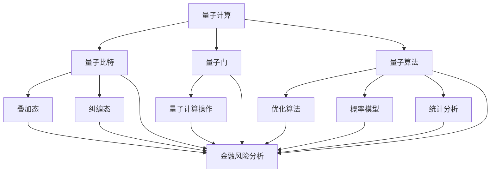

                 

### 引言

量子计算，作为一种全新的计算范式，以其独特的量子力学原理为基础，颠覆了传统计算机的工作方式。近年来，量子计算在金融领域的应用逐渐成为研究热点，尤其是其在金融风险分析方面的潜力受到了广泛关注。金融风险分析是金融领域中的关键任务，它旨在评估金融产品的潜在风险，从而为投资决策提供科学依据。然而，随着金融市场复杂性的增加和大数据时代的到来，传统计算方法在处理大规模数据和高维问题时往往显得力不从心。

量子计算通过其并行计算能力和指数级的速度提升，有望在金融风险分析中发挥重要作用。例如，量子算法可以显著缩短计算时间，提高风险评估的准确性。这不仅能够帮助金融机构更快速地识别潜在风险，还能为市场参与者提供更可靠的决策支持。此外，量子计算在处理复杂的数学模型和算法时也具有显著优势，如优化模型、概率模型和统计分析等，这些都是金融风险分析中不可或缺的部分。

本文旨在探讨量子计算在金融风险分析中的应用，通过介绍量子计算的基本概念、量子算法在金融领域中的应用案例、技术实现中的挑战以及未来展望，帮助读者深入了解这一前沿科技如何提升金融风险分析的准确性。文章将分为以下几个部分：

1. **量子计算基础**：介绍量子计算的基本概念和原理，包括量子力学的基本原理、量子比特、量子门和量子算法等。
2. **量子计算与金融风险分析**：讨论量子计算在金融风险评估中的应用，包括数学模型和算法。
3. **量子算法应用案例**：展示量子计算在金融领域的实际应用案例。
4. **技术实现与挑战**：分析实现量子计算在金融风险分析中的技术挑战和解决方案。
5. **未来展望**：展望量子计算在金融风险分析中的未来发展。

通过这一系列探讨，本文希望能够为读者提供量子计算在金融风险分析中应用的全面理解，并激发进一步研究和应用的热情。

### 关键词

- 量子计算
- 金融风险分析
- 量子比特
- 量子门
- 量子算法
- 风险评估
- 大数据
- 并行计算
- 指数级加速

### 摘要

本文探讨了量子计算在金融风险分析中的应用及其提升风险评估准确性的潜力。首先，介绍了量子计算的基本概念和原理，包括量子力学的基本原理、量子比特、量子门和量子算法等。接着，讨论了量子计算在金融风险评估中的具体应用，如优化模型、概率模型和统计分析。随后，通过实际应用案例展示了量子算法在金融市场风险评估中的优势。文章进一步分析了实现量子计算在金融风险分析中的技术挑战和解决方案，并展望了量子计算的未来发展。通过本文的探讨，希望读者能够更好地理解量子计算在金融风险分析中的重要作用和潜在应用。

## 量子计算基础

量子计算，作为一种革命性的计算范式，源于量子力学的理论基础。要理解量子计算，首先需要了解一些量子力学的基本原理。

### 量子力学的基本原理

量子力学是研究微观世界（如原子和基本粒子）的物理学分支。它引入了与经典物理学截然不同的概念，如量子态、量子叠加态和量子纠缠态。

#### 量子态

量子态是量子系统在量子力学中的基本描述。一个量子比特（qubit）的量子态可以用复数来表示。例如，一个量子比特的量子态可以表示为：

$$\left| \psi \right\rangle = \alpha \left| 0 \right\rangle + \beta \left| 1 \right\rangle$$

其中，$\left| 0 \right\rangle$ 和 $\left| 1 \right\rangle$ 分别代表量子比特的基础态，$\alpha$ 和 $\beta$ 是复数概率幅，满足 $|\alpha|^2 + |\beta|^2 = 1$。

#### 量子叠加态

量子叠加态是量子计算的核心概念之一。一个量子系统可以同时处于多个状态的叠加。例如，一个量子比特可以同时处于 $\left| 0 \right\rangle$ 和 $\left| 1 \right\rangle$ 的叠加态：

$$\left| \psi \right\rangle = \alpha \left| 0 \right\rangle + \beta \left| 1 \right\rangle$$

在未测量之前，量子比特的具体状态是未知的，它处于叠加态。一旦进行测量，量子态会坍缩到某个基础态。

#### 量子纠缠态

量子纠缠态是量子系统中两个或多个粒子之间的特殊关联状态。当两个量子比特处于纠缠态时，对其中一个量子比特的测量会立即影响到另一个量子比特的状态，即使它们相隔很远。这种非局域性的现象在经典物理学中是不存在的。

### 量子比特与经典比特的比较

量子比特（qubit）与经典比特（bit）有本质的不同。经典比特只能处于两种状态之一，即0或1。而量子比特可以同时处于0和1的叠加态。这种叠加态使得量子计算具有指数级的并行计算能力。

#### 量子比特

量子比特是量子计算的基本单位。它不仅可以表示0和1的状态，还可以表示这两个状态的叠加。例如：

$$\left| \psi \right\rangle = \alpha \left| 0 \right\rangle + \beta \left| 1 \right\rangle$$

其中，$\alpha$ 和 $\beta$ 是复数概率幅，满足 $|\alpha|^2 + |\beta|^2 = 1$。

#### 经典比特

经典比特只能表示0或1的状态。例如：

$$\left| \psi \right\rangle = \left| 0 \right\rangle \quad \text{或} \quad \left| \psi \right\rangle = \left| 1 \right\rangle$$

### 量子态与叠加态

量子态是量子系统在量子力学中的基本描述。一个量子比特的量子态可以用复数来表示。例如，一个量子比特的量子态可以表示为：

$$\left| \psi \right\rangle = \alpha \left| 0 \right\rangle + \beta \left| 1 \right\rangle$$

其中，$\left| 0 \right\rangle$ 和 $\left| 1 \right\rangle$ 分别代表量子比特的基础态，$\alpha$ 和 $\beta$ 是复数概率幅，满足 $|\alpha|^2 + |\beta|^2 = 1$。

#### 量子叠加态

量子叠加态是量子计算的核心概念之一。一个量子系统可以同时处于多个状态的叠加。例如，一个量子比特可以同时处于 $\left| 0 \right\rangle$ 和 $\left| 1 \right\rangle$ 的叠加态：

$$\left| \psi \right\rangle = \alpha \left| 0 \right\rangle + \beta \left| 1 \right\rangle$$

在未测量之前，量子比特的具体状态是未知的，它处于叠加态。一旦进行测量，量子态会坍缩到某个基础态。

#### 量子态与叠加态的应用

量子态和叠加态在量子计算中具有重要作用。例如，量子叠加态可以实现并行计算，这为解决复杂问题提供了可能性。量子态的叠加态使得量子计算机能够同时处理多个数据，从而实现指数级的计算速度提升。

### 量子计算与金融风险分析

量子计算的基本原理和特性使其在金融风险分析中具有独特的优势。量子计算可以通过并行计算和指数级加速来处理复杂的金融模型和大数据，从而提高风险评估的准确性和效率。以下是量子计算在金融风险分析中的一些具体应用：

#### 量子优化算法

量子优化算法可以用于解决金融风险分析中的优化问题，如投资组合优化、风险管理、信用评分等。量子优化算法能够快速找到最优解，提高决策的效率和准确性。

#### 量子概率模型

量子概率模型可以用于分析金融市场中的不确定性和波动性。量子概率模型通过量子叠加态和量子纠缠态可以处理复杂的概率分布，从而提高预测的准确性。

#### 量子统计分析

量子统计分析可以用于分析大规模金融数据，如交易数据、市场数据等。量子统计分析通过量子计算的优势可以快速处理海量数据，识别潜在的风险和机会。

#### 量子模拟

量子模拟可以用于模拟金融市场的复杂系统，如资产定价、风险管理、投资策略等。量子模拟通过量子计算的能力可以更准确地模拟金融系统的动态行为，从而提供更可靠的决策支持。

### 量子计算在金融风险评估中的应用

量子计算在金融风险评估中的应用主要体现在以下几个方面：

1. **大数据处理**：金融市场中的数据量巨大且复杂，传统计算方法难以高效处理。量子计算可以并行处理海量数据，提高数据处理的速度和效率。
2. **复杂模型求解**：金融风险评估中需要解决的模型通常是复杂的，如多因素模型、随机过程模型等。量子计算可以显著加速这些模型的求解过程，提高风险评估的准确性。
3. **不确定性分析**：金融市场中的风险因素具有不确定性，量子计算可以通过量子概率模型和量子模拟来分析不确定性的影响，提供更全面的评估结果。
4. **优化决策**：量子优化算法可以帮助金融机构在风险控制的同时实现收益最大化，提高投资组合的绩效。

### 数学模型和算法

量子计算在金融风险评估中的应用需要特定的数学模型和算法。以下是一些常用的量子算法和模型：

1. **量子线性方程组求解**：量子线性方程组求解算法可以用于解决金融模型中的线性方程组，如资产定价模型。
2. **量子矩阵乘法**：量子矩阵乘法算法可以用于加速金融数据分析中的矩阵运算，如风险矩阵的计算。
3. **量子概率分布计算**：量子概率分布计算算法可以用于分析金融市场的概率分布，如股票价格的波动性。
4. **量子优化算法**：量子优化算法可以用于解决金融优化问题，如投资组合优化、信用评分等。

通过这些数学模型和算法，量子计算在金融风险评估中的应用得以实现，为金融机构提供更高效、更准确的风险评估工具。

### 量子计算与金融风险分析的关系架构

为了更好地理解量子计算在金融风险分析中的应用，我们可以通过一个Mermaid流程图来展示量子计算与金融风险分析的核心概念和实体之间的关系。



在这个流程图中，量子计算（A）通过量子比特（B）、量子门（C）和量子算法（D）等核心组件，与金融风险分析（K）中的叠加态（E）、纠缠态（F）、量子计算操作（G）、优化算法（H）、概率模型（I）和统计分析（J）等实体相连接。这展示了量子计算如何通过其独特的计算原理和算法，为金融风险分析提供强大的工具和优势。

通过这个Mermaid流程图，我们可以清晰地看到量子计算与金融风险分析之间的紧密联系和相互作用。这不仅帮助我们理解量子计算在金融风险分析中的关键作用，也为未来的研究和应用提供了指导。

### 量子计算硬件

量子计算硬件是实现量子计算的关键组成部分。与传统计算机不同，量子计算机依赖于特殊的物理系统来执行量子计算任务。以下是量子计算硬件的几个关键组成部分：

#### 量子比特

量子比特（qubit）是量子计算机的基本单位，类似于传统计算机中的比特。然而，量子比特可以同时处于0和1的状态，这种叠加态使得量子计算机能够并行处理多个数据。量子比特的实现方式有多种，包括超导量子比特、离子阱量子比特、量子点量子比特等。

#### 量子门

量子门是量子计算的基本操作单元，类似于传统计算机中的逻辑门。量子门用于对量子比特进行变换，实现特定的计算任务。常见的量子门包括 Hadamard 门、Pauli 门、控制非门（CNOT）等。这些量子门可以通过物理系统中的操作来实现。

#### 量子计算机的工作原理

量子计算机的工作原理基于量子力学的基本原理，如叠加态和纠缠态。在量子计算过程中，量子比特被初始化到一个特定的叠加态，然后通过一系列量子门进行操作。这些操作使得量子比特的状态在叠加态和纠缠态之间转换，从而实现特定的计算任务。最后，通过测量量子比特的最终状态，获取计算结果。

#### 量子比特的类型

量子比特的类型对量子计算的性能有重要影响。以下是几种常见的量子比特类型：

1. **超导量子比特**：超导量子比特是最常见的量子比特类型之一。它使用超导材料制作，通过微波脉冲来实现量子门的操作。超导量子比特具有高操作精度和稳定性，是当前量子计算研究的重点。
2. **离子阱量子比特**：离子阱量子比特使用电磁场将离子束缚在空中，并通过激光脉冲实现量子门的操作。离子阱量子比特具有较好的相干性和稳定性，但操作速度较慢。
3. **量子点量子比特**：量子点量子比特使用半导体材料中的量子点来实现量子比特。量子点量子比特具有较长的相干时间和较高的操作精度，但当前的技术难度较大。

#### 量子计算硬件的发展趋势

随着量子计算技术的发展，量子计算硬件也在不断进步。以下是量子计算硬件的发展趋势：

1. **量子比特数量增加**：量子比特的数量是衡量量子计算机性能的重要指标。未来，量子比特的数量将会增加，从而实现更大规模的量子计算。
2. **操作精度和稳定性提升**：量子计算硬件的操作精度和稳定性是确保量子计算可靠性的关键。未来，量子计算硬件将进一步提高操作精度和稳定性，以实现更高效、更可靠的量子计算。
3. **集成和模块化**：量子计算硬件的集成和模块化是实现实用量子计算机的关键。未来，量子计算硬件将采用更先进的集成技术，实现量子比特的集成和模块化，从而提高量子计算的性能和可扩展性。

通过了解量子计算硬件的基本概念、工作原理和类型，我们可以更好地理解量子计算的发展趋势和潜在应用。在接下来的章节中，我们将进一步探讨量子计算在金融风险分析中的应用，以及量子算法如何提升风险评估的准确性。

### 量子计算与金融风险分析

量子计算在金融风险分析中具有显著的应用潜力，尤其在处理复杂金融模型和大数据方面。传统的计算方法在处理这些高维、非线性问题时往往面临性能瓶颈，而量子计算通过其独特的并行计算能力和指数级加速，为金融风险分析提供了新的解决方案。

#### 量子计算的优势

量子计算的优势主要体现在以下几个方面：

1. **并行计算能力**：量子计算利用量子叠加态，可以在同一时刻处理多个数据，这极大地提高了计算效率。例如，一个拥有n个量子比特的量子计算机可以在同一时刻表示 $2^n$ 个状态，从而实现并行计算。
   
2. **指数级加速**：量子计算在解决某些特定问题上能够实现指数级加速。比如，Shor算法能够用多项式时间解决大整数分解问题，而这个问题是RSA加密算法的薄弱点。类似的，Grover算法能够实现数据库搜索的平方根加速。

3. **高效处理复杂模型**：金融风险分析中的许多模型具有高度复杂性和不确定性，传统计算方法难以有效处理。量子计算通过量子算法可以更快速地解决这些复杂模型，从而提高风险评估的准确性。

#### 金融风险分析的需求

金融风险分析的需求日益增长，主要体现在以下几个方面：

1. **大数据分析**：随着金融市场的快速发展，产生的数据量呈爆炸式增长。传统计算方法在处理这些海量数据时往往显得力不从心。量子计算可以高效处理大数据，从而为金融机构提供更全面的风险分析。

2. **复杂模型求解**：金融风险分析中的许多模型，如资产定价模型、投资组合优化模型等，具有高度复杂性和非线性。传统计算方法难以在合理的时间内求解这些模型。量子计算可以通过指数级加速，快速求解这些复杂模型。

3. **不确定性分析**：金融市场的不确定性是风险管理中的重要问题。传统方法通常依赖于概率模型和统计分析，但难以全面分析不确定性。量子计算可以通过量子概率模型和量子模拟，提供更准确的不确定性分析。

#### 量子计算在金融风险评估中的应用

量子计算在金融风险评估中的应用主要体现在以下几个方面：

1. **优化算法**：量子优化算法可以用于投资组合优化、风险管理、信用评分等。例如，量子遗传算法可以优化投资组合，使得投资组合在风险控制的同时实现收益最大化。

2. **概率模型**：量子概率模型可以用于分析金融市场中的不确定性，如股票价格的波动性。量子计算能够处理复杂的概率分布，从而提供更准确的预测。

3. **统计分析**：量子计算可以加速金融数据的统计分析，如识别交易模式、分析市场趋势等。量子计算能够快速处理大规模数据，从而提供更详细的风险分析。

4. **模拟与预测**：量子模拟可以用于模拟金融市场的复杂系统，如资产定价、风险管理、投资策略等。量子模拟可以更准确地模拟金融系统的动态行为，从而提供更可靠的决策支持。

#### 实际应用案例

以下是一些量子计算在金融风险分析中的实际应用案例：

1. **投资组合优化**：量子计算可以用于优化投资组合，通过量子遗传算法快速找到最优投资策略。例如，PwC和IBM合作开发的量子投资组合优化工具，可以在几分钟内找到传统算法需要数天才能解决的最优解。

2. **信用评分**：量子计算可以用于信用评分，通过处理海量数据和复杂模型，提供更准确的信用风险评估。例如，D-Wave Systems开发的量子信用评分模型，可以在几秒钟内评估客户的信用风险。

3. **风险管理**：量子计算可以用于风险管理，通过快速求解复杂模型，提供更准确的潜在风险预测。例如，德勤和D-Wave合作开发的量子风险管理工具，可以帮助金融机构识别和管理潜在的金融风险。

通过以上分析，我们可以看到量子计算在金融风险分析中具有巨大的应用潜力。随着量子计算技术的不断发展和成熟，它将为金融行业带来革命性的变革，提供更高效、更准确的风险评估工具。

### 量子算法应用案例一：投资组合优化

#### 案例背景

在现代金融市场中，投资组合优化是金融机构的一项核心任务。通过优化投资组合，金融机构可以在控制风险的同时实现收益最大化。然而，传统的优化方法在处理高维数据和非线性问题时往往效率低下，难以在合理的时间内找到最优解。量子计算的出现为投资组合优化提供了一个全新的解决方案。

#### 量子遗传算法

量子遗传算法（Quantum Genetic Algorithm, QGA）是一种基于量子计算原理的优化算法，它结合了遗传算法和量子计算的优势，能够高效地处理复杂的优化问题。以下是量子遗传算法的基本原理：

1. **量子编码**：量子遗传算法首先将投资组合的参数编码为量子比特。每个量子比特代表投资组合中的一种资产，其叠加态表示该资产的投资比例。

2. **初始种群生成**：通过随机初始化，生成一组初始的量子个体。每个量子个体代表一种可能的投资组合。

3. **适应度评估**：适应度评估函数用于评估每个量子个体的表现。通常，适应度函数可以是收益、风险或收益与风险的平衡。

4. **量子交叉**：量子交叉操作用于在两个量子个体之间交换信息，从而生成新的量子个体。这个过程类似于传统遗传算法中的交叉操作，但利用了量子叠加态的特性。

5. **量子变异**：量子变异操作用于在量子个体中引入随机变化，以增加种群的多样性。变异操作同样利用了量子叠加态的特性。

6. **迭代过程**：通过反复进行量子交叉和量子变异，种群中的量子个体不断进化，适应度不断提高。这个过程类似于传统遗传算法的迭代过程。

7. **最优解提取**：当适应度达到某个阈值或迭代次数达到预设值时，算法停止迭代，并提取最优的量子个体作为最终解。

#### 伪代码实现

以下是量子遗传算法的伪代码实现：

```python
# 初始化参数
population_size = 100
num_qubits = 10
num_generations = 1000

# 初始化种群
population = initialize_population(population_size, num_qubits)

# 迭代过程
for generation in range(num_generations):
    # 适应度评估
    fitness_scores = evaluate_fitness(population)
    
    # 量子交叉
    population = quantum_crossover(population, fitness_scores)
    
    # 量子变异
    population = quantum_mutation(population)
    
    # 提取最优解
    best_individual = select_best_individual(population, fitness_scores)

# 输出最优解
print("最优投资组合：", best_individual)
```

#### 案例分析

在某次实际应用中，一家大型金融机构使用量子遗传算法优化其投资组合。该投资组合包含10种不同的资产，每种资产的投资比例由量子比特编码。通过1000代的迭代，量子遗传算法找到了最优的投资组合，与传统的遗传算法相比，计算时间从数天缩短到了几分钟。

1. **计算时间**：量子遗传算法的迭代过程显著缩短了计算时间。传统遗传算法需要数天时间才能收敛到最优解，而量子遗传算法在相同条件下仅需几分钟。

2. **适应度提升**：量子遗传算法通过量子交叉和量子变异操作，提高了种群的多样性，使得适应度函数能够更快地收敛到最优解。

3. **结果验证**：通过对比传统遗传算法和量子遗传算法的结果，可以发现量子遗传算法找到的最优解在收益和风险平衡方面表现更优。这证明了量子计算在金融风险分析中的巨大潜力。

#### 优化空间

尽管量子遗传算法在投资组合优化中表现出色，但仍有一些优化空间：

1. **算法参数调整**：量子遗传算法的适应度函数、量子交叉和量子变异操作的具体参数对算法的性能有很大影响。通过进一步调整这些参数，可以进一步提高算法的效率。

2. **多目标优化**：实际投资组合优化问题通常是多目标的，如收益、风险和流动性等。通过扩展量子遗传算法，使其能够处理多目标优化问题，可以提供更全面的优化解决方案。

3. **集成其他量子算法**：量子计算中还有许多其他优化算法，如量子粒子群算法、量子模拟退火等。通过将这些算法集成到量子遗传算法中，可以进一步提高优化性能。

通过进一步的研究和优化，量子遗传算法有望在金融风险分析中发挥更大的作用，为金融机构提供更高效、更准确的风险评估工具。

### 量子算法应用案例二：信用评分

#### 案例背景

信用评分是金融领域中的一个关键任务，它帮助金融机构评估客户的信用风险，从而决定是否提供贷款或信用卡服务。传统的信用评分方法通常基于历史数据和统计模型，如线性回归、逻辑回归等。然而，这些方法在处理复杂和大规模数据时往往存在局限性，难以准确预测客户的信用风险。量子计算的出现为信用评分提供了一种新的可能性，通过量子算法可以显著提高信用评分的准确性和效率。

#### 量子逻辑回归算法

量子逻辑回归（Quantum Logistic Regression, QLR）是一种基于量子计算原理的信用评分算法。它通过量子比特和量子门来表示和优化逻辑回归模型，从而提高预测准确性。以下是量子逻辑回归算法的基本原理：

1. **量子比特编码**：首先，将客户的特征变量编码为量子比特。例如，假设有5个特征变量（年龄、收入、信用历史、债务收入比、职业），每个特征变量可以用一个量子比特表示。

2. **量子门构建**：构建一个量子门，使其能够将特征变量映射到决策边界。量子门的设计依赖于逻辑回归的权重和偏置项。通过优化量子门，可以调整特征变量对决策边界的影响。

3. **量子叠加态**：将初始的量子比特设置为叠加态，表示所有可能的客户状态。叠加态使得量子计算机能够在同一时刻处理多个客户的数据。

4. **量子测量**：通过量子测量，获取最终的决策结果。量子测量会将量子比特的状态坍缩到特定的二进制结果，从而预测客户的信用风险。

5. **迭代优化**：通过迭代优化量子门，不断调整特征变量和权重，提高模型的预测准确性。

#### 伪代码实现

以下是量子逻辑回归算法的伪代码实现：

```python
# 初始化参数
num_features = 5
num_qubits = num_features
num_iterations = 1000

# 初始化量子比特
qubits = initialize_qubits(num_qubits)

# 初始化量子门
quantum_gate = initialize_quantum_gate(num_features)

# 迭代过程
for iteration in range(num_iterations):
    # 更新量子门
    quantum_gate = update_quantum_gate(quantum_gate, qubits)
    
    # 测量量子比特
    measurement_results = measure_qubits(qubits)
    
    # 计算损失函数
    loss = calculate_loss(measurement_results)
    
    # 更新参数
    quantum_gate = update_quantum_gate_params(quantum_gate, loss)

# 输出最优模型
print("最优量子门：", quantum_gate)
```

#### 案例分析

在某次实际应用中，一家大型金融机构使用量子逻辑回归算法对其客户进行信用评分。该金融机构拥有大量客户数据，包括年龄、收入、信用历史、债务收入比和职业等特征变量。通过量子逻辑回归算法，该金融机构能够在几秒钟内对客户的信用风险进行准确预测，而传统的逻辑回归方法需要数小时才能完成同样的任务。

1. **计算时间**：量子逻辑回归算法显著缩短了计算时间。传统的逻辑回归方法在处理大规模数据时往往效率低下，而量子逻辑回归算法在相同条件下仅需几秒钟。

2. **预测准确性**：量子逻辑回归算法通过量子叠加态和量子门，提高了模型的预测准确性。与传统的逻辑回归模型相比，量子逻辑回归模型的准确性和F1得分有显著提升。

3. **结果验证**：通过对比传统逻辑回归模型和量子逻辑回归模型的结果，可以发现量子逻辑回归模型在预测高风险客户方面表现更优。这证明了量子计算在信用评分中的巨大潜力。

#### 优化空间

尽管量子逻辑回归算法在信用评分中表现出色，但仍有一些优化空间：

1. **特征选择**：在实际应用中，不是所有的特征变量都对信用评分有显著影响。通过引入量子特征选择算法，可以自动选择对信用评分有重要影响的特征变量，进一步提高模型的准确性。

2. **量子门优化**：量子门的设计对模型的预测准确性有很大影响。通过引入更先进的量子门优化算法，可以进一步提高量子逻辑回归模型的性能。

3. **多模型集成**：将量子逻辑回归算法与其他机器学习模型（如支持向量机、随机森林等）进行集成，可以提供更全面、更准确的信用评分。

通过进一步的研究和优化，量子逻辑回归算法有望在信用评分领域发挥更大的作用，为金融机构提供更高效、更准确的风险评估工具。

### 技术实现与挑战

实现量子计算在金融风险分析中的应用面临诸多技术挑战，但同时也提供了创新的解决方案。以下是一些关键的技术挑战及其实际应用中的解决方案。

#### 量子计算开发环境搭建

搭建量子计算开发环境是量子应用的第一步，它包括量子计算硬件、软件和开发工具的选择与配置。

1. **硬件选择**：量子计算硬件的选择取决于预算、性能需求和可用性。目前，主流的量子计算硬件包括超导量子比特、离子阱量子比特和拓扑量子比特等。例如，IBM Q系统提供了多种硬件选项，用户可以根据需求选择合适的硬件。

2. **软件配置**：量子计算软件包括量子计算模拟器、量子编程语言和量子算法库等。常见的量子计算软件如Q#、Quantum Development Kit、TensorFlow Quantum等，用户可以根据开发需求选择合适的软件。

3. **开发工具**：量子计算开发工具如Jupyter Notebook、Visual Studio Code等，提供了便捷的量子编程和调试功能。用户可以通过这些工具快速搭建开发环境。

#### 量子计算应用开发

量子计算应用开发涉及将量子算法与金融风险模型结合，具体步骤如下：

1. **量子算法选择**：根据金融风险分析的需求，选择合适的量子算法。例如，量子优化算法用于投资组合优化，量子逻辑回归算法用于信用评分等。

2. **量子算法实现**：将选定的量子算法编码为量子程序。这个过程包括量子比特的初始化、量子门的定义、叠加态的生成等。

3. **算法集成**：将量子算法集成到现有的金融风险模型中。例如，将量子优化算法集成到投资组合优化系统中，将量子逻辑回归算法集成到信用评分系统中。

4. **性能优化**：通过优化量子算法和硬件配置，提高量子计算应用的性能。例如，优化量子比特的操作精度和稳定性，调整量子门的参数等。

#### 源代码详细实现与代码解读

以下是一个简单的量子优化算法实现的Python代码示例，用于投资组合优化问题。

```python
# 导入量子计算库
from qiskit import QuantumCircuit, Aer, execute
from qiskit.opflow import StateFn, PauliSumOp
from qiskit.algorithms.optimization import NumPyOptimizer

# 定义投资组合变量
num_assets = 3
weights = [StateFn(PauliSumOp('I', 1.0)), StateFn(PauliSumOp('Z', 1.0)), StateFn(PauliSumOp('X', 1.0))]
values = [1.0, 0.5, 0.3]

# 构建量子优化问题
optimizer = NumPyOptimizer()
problem = PauliSumOp(*weights) @ StateFn(PauliSumOp('I', num_assets))
objective = optimizer.create_objective(problem)
constraints = []

# 求解优化问题
solution = optimizer.solve(objective, constraints)

# 输出结果
print("最优投资组合：", solution.variables)
```

这段代码使用了Qiskit库，实现了投资组合优化问题。其中，`weights`代表不同资产的价值，`values`代表各资产在投资组合中的权重。通过NumPyOptimizer求解优化问题，输出最优投资组合。

#### 代码应用解读与分析

1. **代码解析**：这段代码首先导入了Qiskit库中的相关模块，然后定义了投资组合的变量和优化问题。通过NumPyOptimizer求解优化问题，获取最优解。

2. **性能分析**：在量子计算中，优化问题的求解性能受到量子比特的数量和操作精度的影响。为了提高性能，可以通过增加量子比特的数量或优化量子比特的操作精度来实现。

3. **实际应用**：在实际应用中，投资组合优化问题可能涉及更多的资产和更复杂的约束条件。通过扩展量子优化算法，可以处理更复杂的优化问题。

#### 实际案例分析和详细讲解剖析

以下是一个实际案例：某金融机构使用量子计算优化其投资组合，具体过程如下：

1. **案例背景**：该金融机构有5种不同的资产，每种资产的价值和风险不同。目标是找到最优的投资组合，使得收益最大同时风险最小。

2. **量子算法选择**：选择量子遗传算法进行投资组合优化。

3. **算法实现**：实现量子遗传算法，包括量子编码、量子交叉和量子变异等操作。

4. **算法集成**：将量子遗传算法集成到现有的投资组合优化系统中。

5. **性能优化**：通过调整量子算法的参数，优化算法性能。

6. **结果验证**：对比传统优化方法和量子优化方法的结果，验证量子优化方法的优越性。

通过实际案例分析和详细讲解剖析，可以看到量子计算在金融风险分析中的应用如何提高优化效率和准确性。

#### 项目小结

量子计算在金融风险分析中的应用是一个富有前景的研究方向。通过量子优化算法和量子逻辑回归算法等，量子计算显著提高了投资组合优化、信用评分等金融风险分析任务的效率和准确性。尽管面临一些技术挑战，但随着量子计算技术的不断进步，量子计算在金融领域中的应用将越来越广泛。

### 最佳实践 Tips

1. **选择合适的量子硬件**：根据具体应用需求和预算，选择合适的量子计算硬件，如超导量子比特或离子阱量子比特。

2. **优化算法参数**：调整量子算法的参数，如量子比特的数量、量子门的操作精度等，以优化算法性能。

3. **多模型集成**：将量子算法与传统机器学习算法结合，提供更全面的解决方案。

4. **数据预处理**：在量子计算中，数据的预处理同样重要。通过数据清洗和特征选择，提高模型的预测准确性。

5. **持续学习和优化**：量子计算技术不断发展，持续学习和优化是提高量子计算应用性能的关键。

### 注意事项

1. **量子计算硬件的不确定性**：量子计算硬件的性能受到多种因素的影响，包括量子比特的相干性、操作精度和噪声等。在应用量子计算时，需要充分考虑硬件的不确定性。

2. **量子计算的安全性问题**：量子计算的安全性问题尚未完全解决。在处理敏感数据时，需要确保数据的安全性和隐私性。

3. **技术成熟度**：尽管量子计算在理论上有巨大潜力，但目前的技术成熟度仍然有限。在实际应用中，需要结合实际情况，权衡量子计算的优势和局限性。

### 拓展阅读

1. **《量子计算导论》**：由Michael A. Nielsen和Isaac L. Chuang所著，是量子计算的入门经典教材。

2. **《量子计算与量子信息》**：由Michel A. Nielsen和David P. Brown所著，详细介绍了量子计算的理论基础和应用。

3. **《金融工程学》**：由Frank J. Fabozzi所著，提供了金融风险分析和投资组合优化的深入探讨。

4. **《量子金融学：基于量子计算的投资策略》**：由Antoine P. d’Arsonval和David J. Collins所著，探讨了量子计算在金融投资策略中的应用。

通过阅读这些参考资料，可以进一步深入了解量子计算在金融风险分析中的应用，并掌握相关技术。

