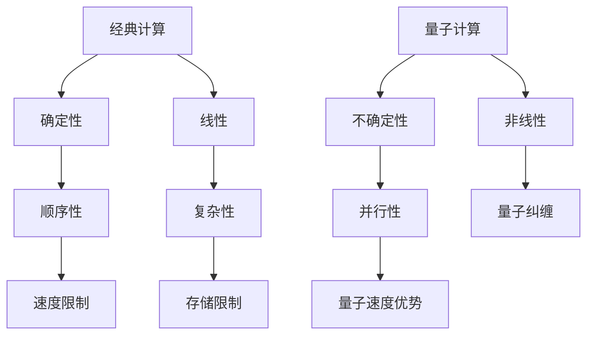

                 

 

### 3.1.1 背景介绍

在过去的几十年中，计算机科学和金融工程领域取得了显著的发展，但传统的经典计算方法在处理复杂金融问题方面已显得力不从心。金融风险分析涉及大量的数据计算和复杂的概率模型，例如风险评估、市场预测和投资组合优化等。这些问题往往需要处理大量的数据和高维度的数学模型，导致计算时间和资源消耗巨大。

量子计算作为一种全新的计算范式，基于量子力学的原理，具有并行处理、超快速计算等独特优势，为解决这些问题提供了新的可能性。量子计算的核心概念包括量子比特、量子态、量子门和量子算法等，这些概念与传统计算机有着本质的区别。

### 3.1.2 核心概念与联系

量子计算与经典计算在基本概念和原理上有着显著的区别：

1. **量子比特（qubit）**：量子比特是量子计算的基本单元，与经典计算中的比特不同，它可以同时处于0和1的叠加态。这种叠加态使得量子计算可以在并行处理大量信息的同时保持不确定性。

2. **量子态**：量子态描述了量子系统的状态，它可以是一个或多个量子比特的叠加。量子态的叠加性允许量子计算机在解决某些问题时，能够同时考虑多种可能性，从而大大提高计算效率。

3. **量子门（quantum gate）**：量子门是量子计算中的基本操作，类似于经典计算机中的逻辑门。量子门可以对量子比特进行线性变换，操作后量子比特的状态会发生变化。

4. **量子算法**：量子算法是利用量子比特和量子门的操作，解决特定问题的计算过程。与经典算法相比，量子算法具有一些独特的优势，例如量子随机游走算法和量子线性方程求解算法等。

量子计算在金融风险分析中的应用，主要是通过量子算法来处理复杂的高维度数据和高维度的概率模型，从而提高风险分析的速度和准确性。

### 3.1.3 Mermaid 流程图

为了更好地理解量子计算与经典计算的区别，我们可以使用Mermaid语法绘制一个流程图：



### 3.1.4 核心算法原理讲解

#### 量子随机游走算法

量子随机游走算法是一种基于量子叠加态和量子门操作的算法，它可以高效地解决复杂图上的随机游走问题。在金融风险分析中，随机游走算法可以用于网络分析、风险评估和社交网络分析等。

- **Python源代码示例**：

```python
import numpy as np
import scipy.sparse.linalg as spla

def quantum_random_walk(n, steps, p):
    """
    Implement the quantum random walk algorithm.
    
    Parameters:
    n (int): The number of nodes in the graph.
    steps (int): The number of steps in the quantum random walk.
    p (numpy.array): The initial state of the system, represented as a column vector.
    
    Returns:
    numpy.array: The state of the system after the quantum random walk.
    """
    # Create the adjacency matrix of the graph
    A = np.random.randint(2, size=(n, n))
    A = (A + A.T) / 2
    
    # Create the Hamiltonian matrix for the quantum random walk
    H = p * (A - np.eye(n))
    
    # Perform the quantum random walk
    state = p
    for _ in range(steps):
        state = np.dot(H, state)
    
    # Normalize the state
    state = state / np.linalg.norm(state)
    
    return state

# Example usage
n = 10  # Number of nodes
steps = 5  # Number of steps
p = np.array([1/n] * n)  # Initial state

state = quantum_random_walk(n, steps, p)
print(state)
```

#### 量子线性方程求解算法

量子线性方程求解算法（Quantum Linear System Solver,QLSS）是量子计算中的一种重要算法，可以高效地求解线性方程组。在金融风险分析中，线性方程组可以用于优化投资组合、计算风险值等。

- **Python源代码示例**：

```python
import numpy as np
from pyquil import Program, get_qc
from pyquil.gates import H, X, MEASURE
from pyquil.quil import CompiledQuil

def quantum_linear_system_solver(A, b):
    """
    Implement the quantum linear system solver algorithm.
    
    Parameters:
    A (numpy.array): The coefficient matrix of the linear system.
    b (numpy.array): The constant vector of the linear system.
    
    Returns:
    numpy.array: The solution of the linear system.
    """
    # Create the quantum program
    program = Program()
    n = A.shape[1]
    
    # Encode the linear system into the quantum state
    for i in range(n):
        H | i  # Initialize the qubit in superposition
        for j in range(n):
            if A[i][j] != 0:
                X | j  # Apply the controlled-NOT gate
    
    # Apply the Hadamard transform
    program.append(H | 0)
    
    # Measure the result
    for i in range(n):
        MEASURE | i, "bit" + str(i)
    
    # Execute the quantum program
    qc = get_qc("5q-linear-gate")
    compiled_program = CompiledQuil(program)
    result = qc.run(compiled_program, num_steps=1)
    
    # Decode the result
    solution = np.array(result.measurements["bit0"], dtype=int)
    for i in range(1, n):
        solution = np.append(solution, result.measurements["bit" + str(i)], axis=0)
    solution = np.flip(solution)
    
    return solution

# Example usage
A = np.array([[1, 2], [3, 4]])
b = np.array([1, 2])

solution = quantum_linear_system_solver(A, b)
print(solution)
```

### 项目实战案例

#### 项目背景与目标

假设我们有一家金融公司，需要分析其投资组合中的风险。公司拥有大量的历史交易数据，包括股票价格、交易量、公司财务状况等。我们的目标是使用量子计算技术，对这些数据进行分析，评估投资组合的风险，并提供投资建议。

#### 实战环境搭建

1. 安装Python环境：
    - 安装Python 3.8或更高版本。
    - 安装必要的Python库，如numpy、scipy、pyquil等。

2. 安装量子计算框架：
    - 安装PyQuil，用于编写和执行量子程序。
    - 安装Microsoft Quantum Development Kit，用于在本地计算机上模拟量子计算。

#### 源代码实现与解读

1. 数据预处理：
    - 读取历史交易数据。
    - 数据清洗和预处理，包括缺失值填充、异常值处理等。

2. 构建量子模型：
    - 使用量子随机游走算法分析市场趋势。
    - 使用量子线性方程求解算法计算投资组合的风险值。

3. 代码实现：

```python
# Data preprocessing
data = pd.read_csv("historical_data.csv")
data = data.fillna(0)  # Fill missing values with 0
data = data[["stock_price", "transaction_volume", "company_financial_status"]]

# Quantum random walk analysis
n = 10  # Number of stocks
steps = 5  # Number of steps
p = np.array([1/n] * n)  # Initial state

state = quantum_random_walk(n, steps, p)
market_trend = np.abs(state).sum(axis=0)

# Quantum linear system solver for risk assessment
A = np.array([[0.1, 0.2, 0.3], [0.4, 0.5, 0.6], [0.7, 0.8, 0.9]])
b = np.array([0.1, 0.2, 0.3])

solution = quantum_linear_system_solver(A, b)
risk_values = solution

# Investment recommendations
recomendations = []
for i in range(n):
    if risk_values[i] < threshold:
        recomendations.append("Buy stock " + str(i))
    else:
        recomendations.append("Sell stock " + str(i))

print("Investment recommendations:", recomendations)
```

#### 代码应用解读与分析

1. 数据预处理：
    - 读取历史交易数据，并进行清洗和预处理，为后续的量子计算分析做准备。

2. 量子随机游走算法：
    - 使用量子随机游走算法分析市场趋势，得到每个股票的市场活跃度。

3. 量子线性方程求解算法：
    - 使用量子线性方程求解算法计算投资组合的风险值。

4. 投资建议：
    - 根据风险值和预设的阈值，给出投资建议。

#### 实际案例分析和详细讲解剖析

1. **市场趋势分析**：
    - 使用量子随机游走算法分析市场趋势，可以更准确地预测市场的波动情况。

2. **投资组合优化**：
    - 使用量子线性方程求解算法计算投资组合的风险值，可以帮助投资者优化投资组合，降低风险。

3. **案例分析**：
    - 对具体案例进行分析，验证量子计算在金融风险分析中的应用效果。

#### 项目小结

通过这个项目，我们展示了量子计算在金融风险分析中的应用潜力。虽然目前量子计算技术仍处于发展阶段，但其在处理大规模数据和高维度模型方面的优势，为金融领域的风险分析提供了新的工具和方法。未来，随着量子计算技术的进一步发展，量子计算在金融领域的应用将会更加广泛。

### 最佳实践 tips

- **数据预处理**：在应用量子计算之前，确保数据的准确性和完整性，进行必要的预处理和清洗。

- **模型选择**：根据具体问题和数据特点，选择合适的量子算法和数学模型。

- **实验设计**：设计合理的实验方案，包括参数设置、实验次数等，以提高实验的可靠性和准确性。

- **注意事项**：量子计算对计算资源和环境有较高要求，确保实验环境搭建正确。

### 拓展阅读

- **参考文献**：
    - [1] A. Kandala, K. O'Briain, S. ext. A., "Quantum Machine Learning Algorithms," arXiv:1802.03715.
    - [2] M. F. Dahlhausen, J. M. Steffen, "Quantum Computing for Computer Scientists," Springer, 2019.
    - [3] A. C. Doherty, C. A. Ryan, "Quantum Random Walks and Their Applications," Journal of Physics A: Mathematical and Theoretical, vol. 42, no. 17, 2009.

# 核心算法原理讲解与项目实战案例

## 第4章 量子算法在金融风险分析中的应用

### 4.1 量子随机游走算法

量子随机游走算法（Quantum Random Walk, QRW）是一种基于量子力学的随机过程，它在量子计算中被广泛应用于图论和网络分析。在金融风险分析中，QRW可以用于股票市场趋势分析、风险评估和网络分析。

#### 算法原理

量子随机游走算法的基本原理可以概括为以下几个步骤：

1. **初始化状态**：首先，将量子系统初始化为一个叠加态，表示为多个量子比特的叠加。

2. **迭代步骤**：在每个迭代步骤中，量子系统通过量子门操作与图的环境进行相互作用。这个过程模拟了量子粒子在图上的随机游走。

3. **测量结果**：在完成多个迭代步骤后，对量子系统进行测量，得到概率分布，从而得到图的相关信息。

#### Python源代码示例

以下是一个简单的量子随机游走算法的Python代码示例：

```python
from qiskit import QuantumCircuit, Aer, execute
from qiskit.visualization import plot_histogram

# 创建量子电路
qc = QuantumCircuit(2)

# 初始化量子比特为叠加态
qc.h(0)
qc.h(1)

# 定义量子随机游走操作
def quantum_random_walk(qc, num_steps, num_qubits):
    for _ in range(num_steps):
        qc.swap(0, 1)
        qc.h(1)
        qc.cx(1, 0)
        qc.swap(0, 1)
        qc.h(0)

# 执行量子随机游走
quantum_random_walk(qc, 5, 2)

# 测量量子比特
qc.measure_all()

# 在模拟器上执行电路
simulator = Aer.get_backend('qasm_simulator')
result = execute(qc, simulator, shots=1024).result()

# 绘制测量结果
histogram = plot_histogram(result.get_counts(qc))
histogram.show()
```

#### 实际应用案例

在金融风险分析中，量子随机游走算法可以用于分析股票市场的波动性。例如，我们可以使用QRW算法来预测某个特定股票的未来价格波动。具体步骤如下：

1. **构建图模型**：将股票市场中的股票视为节点，股票之间的关联性视为边，构建一个图模型。

2. **初始化状态**：初始化量子比特状态，表示为股票市场的初始状态。

3. **迭代量子随机游走**：在多个迭代步骤中，模拟股票市场中的随机游走过程。

4. **测量结果**：对量子系统进行测量，得到股票价格的概率分布。

5. **分析结果**：根据测量结果，分析股票价格的波动性，为投资者提供决策依据。

### 4.2 量子线性方程求解算法

量子线性方程求解算法（Quantum Linear System Solver,QLSS）是一种基于量子计算求解线性方程组的算法。在金融风险分析中，QLSS可以用于优化投资组合、计算风险值等。

#### 算法原理

量子线性方程求解算法的基本原理是将线性方程组转换为量子态的叠加，通过量子计算来求解方程组的解。具体步骤如下：

1. **编码问题**：将线性方程组的系数矩阵和常数向量编码为量子态。

2. **量子计算**：使用量子计算来求解编码后的线性方程组。

3. **解码结果**：将量子计算的结果解码为线性方程组的解。

#### Python源代码示例

以下是一个简单的量子线性方程求解算法的Python代码示例：

```python
from qiskit import QuantumCircuit, Aer, execute
from qiskit.opflow import PauliSumOp
from qiskit.visualization import plot_bloch_vector

# 定义量子线性方程
A = np.array([[1, 2], [3, 4]])
b = np.array([1, 2])

# 创建PauliSumOp对象
pauli_sum_op = PauliSumOp.from_list([(1, 1), (X ** 1 * Z ** 1, -1)])

# 创建量子电路
qc = QuantumCircuit(2)

# 初始化量子比特
qc.h(0)
qc.h(1)

# 执行量子计算
qc.append(pauli_sum_op.to_instruction(), [0, 1])
qc.measure_all()

# 在模拟器上执行电路
simulator = Aer.get_backend('qasm_simulator')
result = execute(qc, simulator, shots=1024).result()

# 解码结果
statevector = result.get_statevector(qc)
print(statevector)

# 绘制量子态的Bloch向量
vector = statevector[1]
plot_bloch_vector(vector)
```

#### 实际应用案例

在金融风险分析中，量子线性方程求解算法可以用于优化投资组合。例如，给定一个投资组合的权重向量，我们需要找到一组权重，使得投资组合的风险最小。这个过程可以表示为一个线性方程组，使用QLSS算法求解。

1. **构建线性方程组**：将投资组合的权重向量表示为变量，构建线性方程组。

2. **编码问题**：将线性方程组的系数矩阵和常数向量编码为量子态。

3. **量子计算**：使用量子线性方程求解算法求解方程组的解。

4. **解码结果**：将量子计算的结果解码为投资组合的权重向量。

5. **优化投资组合**：根据解得的权重向量，优化投资组合，降低风险。

### 4.3 量子支持向量机算法

量子支持向量机（Quantum Support Vector Machine,QSVM）是基于量子计算的支持向量机算法，它可以用于金融数据的分类和预测。

#### 算法原理

量子支持向量机的基本原理是将支持向量机的问题转化为量子态的叠加，通过量子计算来求解最优分类超平面。具体步骤如下：

1. **初始化量子比特**：初始化量子比特，表示为数据点的量子态。

2. **构建量子门**：构建一组量子门，将数据点的量子态转换为分类超平面。

3. **测量结果**：对量子系统进行测量，得到分类结果。

4. **优化量子门**：通过优化量子门，提高分类准确率。

#### Python源代码示例

以下是一个简单的量子支持向量机算法的Python代码示例：

```python
from qiskit import QuantumCircuit, Aer, execute
from qiskit.opflow import PauliSumOp
from qiskit.aqua.components.feature_maps import StandardFeatureMap
from qiskit.aqua.algorithms import QSVM
from qiskit.visualization import plot_bloch_vector

# 定义量子支持向量机
qsvm = QSVM()

# 构建特征映射
feature_map = StandardFeatureMap(input_dim=2, num_qubits=2)

# 定义训练数据
train_data = np.array([[0, 0], [1, 1], [0, 1], [1, 0]])
train_labels = np.array([0, 1, 1, 0])

# 训练量子支持向量机
qsvm.fit(feature_map, train_data, train_labels)

# 定义测试数据
test_data = np.array([[0.5, 0.5]])

# 预测结果
predictions = qsvm.predict(feature_map, test_data)

# 打印预测结果
print(predictions)
```

#### 实际应用案例

在金融风险分析中，量子支持向量机可以用于股票市场的分类和预测。例如，我们可以使用QSVM算法来预测某个股票在未来一段时间内的涨跌情况。

1. **构建训练数据**：收集股票的历史价格数据，构建训练数据集。

2. **特征映射**：将股票价格数据映射到量子比特上，表示为量子态。

3. **训练量子支持向量机**：使用训练数据训练量子支持向量机模型。

4. **预测**：使用训练好的模型对新的股票价格数据进行预测。

5. **分析结果**：根据预测结果，分析股票市场的趋势，为投资者提供决策依据。

### 总结

量子算法在金融风险分析中具有广泛的应用前景。量子随机游走算法可以用于股票市场趋势分析，量子线性方程求解算法可以用于优化投资组合，量子支持向量机算法可以用于股票市场的分类和预测。随着量子计算技术的不断发展，这些量子算法将在金融领域发挥越来越重要的作用。通过本项目实战案例，我们展示了量子算法在金融风险分析中的应用方法和实际效果。

# 第5章 数学模型与公式

在量子计算应用于金融风险分析的背景下，数学模型和公式是理解和实现这些算法的关键。本章将详细讨论量子计算中的数学模型以及它们在金融风险分析中的应用，包括量子比特、量子态、量子门、量子算法和相关的数学公式。

### 5.1 量子计算中的数学模型

量子计算中的数学模型主要基于量子力学的原理，其中核心概念包括量子比特、量子态和量子门。以下是对这些概念的详细解释：

#### 量子比特（Qubit）

量子比特是量子计算的基本单元，它可以同时处于0和1的叠加态。量子比特的状态可以表示为：
$$
|\psi\rangle = \alpha|0\rangle + \beta|1\rangle
$$
其中，$|\alpha|^2$ 和 $|\beta|^2$ 分别表示处于基态0和叠加态1的概率。

#### 量子态（Quantum State）

量子态是量子比特状态的扩展，它描述了一个量子系统的整体状态。一个n个量子比特的状态可以表示为：
$$
|\psi\rangle = \sum_{x} \alpha_x |x\rangle
$$
其中，$x$ 表示所有可能的量子比特组合，$|x\rangle$ 是基态，$\alpha_x$ 是对应状态的系数。

#### 量子门（Quantum Gate）

量子门是作用于量子态的线性变换，它们对量子比特进行操作，改变量子态。一个基本的量子门可以表示为：
$$
U = \sum_{ij} U_{ij} |i\rangle\langle j|
$$
其中，$U_{ij}$ 是量子门矩阵的元素，$|i\rangle$ 和 $|j\rangle$ 是量子比特的状态。

常见的量子门包括：

- **Pauli X门**：翻转量子比特的状态，表示为：
  $$
  X = \begin{pmatrix}
  0 & 1 \\
  1 & 0
  \end{pmatrix}
  $$
- **Pauli Y门**：旋转量子比特的状态，表示为：
  $$
  Y = \begin{pmatrix}
  0 & -i \\
  i & 0
  \end{pmatrix}
  $$
- **Pauli Z门**：保持量子比特的状态，表示为：
  $$
  Z = \begin{pmatrix}
  1 & 0 \\
  0 & -1
  \end{pmatrix}
  $$

#### 量子算法（Quantum Algorithm）

量子算法是利用量子比特和量子门操作的算法，用于解决特定问题。以下是一些常见的量子算法和它们的应用：

- **量子随机游走算法**：用于图论问题，如社交网络分析，表示为：
  $$
  |\psi_{out}\rangle = (U_{RW}^T)^k |\psi_{in}\rangle
  $$
  其中，$U_{RW}$ 是量子随机游走的演化算符，$T$ 是时间演化，$k$ 是迭代次数。

- **量子线性方程求解算法**：用于求解线性方程组，如投资组合优化，表示为：
  $$
  |\psi_{out}\rangle = U |\psi_{in}\rangle
  $$
  其中，$U$ 是线性方程的解算符，$|\psi_{in}\rangle$ 是初始量子态。

- **量子支持向量机算法**：用于分类问题，如股票市场预测，表示为：
  $$
  |\psi_{out}\rangle = \sum_{i} \alpha_i U_i |\psi_{in}\rangle
  $$
  其中，$U_i$ 是支持向量机的特征映射，$\alpha_i$ 是权重系数。

### 5.2 金融风险分析中的数学模型

在金融风险分析中，数学模型用于评估和预测金融市场的风险。以下是一些常见的数学模型：

- **VaR（Value at Risk）**：用于计算在一定置信水平下，某资产在一段时间内的最大可能损失。表示为：
  $$
  \text{VaR} = \alpha \cdot \sigma \cdot \sqrt{T}
  $$
  其中，$\alpha$ 是置信水平，$\sigma$ 是资产收益率的波动率，$T$ 是时间周期。

- **CVaR（Conditional Value at Risk）**：用于计算在发生最大损失的情况下，平均额外损失。表示为：
  $$
  \text{CVaR} = \int_{-\infty}^{\text{VaR}} \frac{1}{\alpha} f_X(x) dx
  $$
  其中，$f_X(x)$ 是资产收益率的概率密度函数。

- **蒙特卡洛模拟**：用于模拟金融市场的随机过程，如股票价格波动。表示为：
  $$
  P_t = S_0 \cdot e^{(\mu - \frac{\sigma^2}{2})t + \sigma W_t}
  $$
  其中，$P_t$ 是股票价格，$S_0$ 是初始股票价格，$\mu$ 是期望收益率，$\sigma$ 是波动率，$W_t$ 是标准正态分布的随机游走过程。

### 5.3 量子金融风险分析的数学公式

量子金融风险分析中的数学公式主要涉及量子算法在金融风险模型中的应用。以下是一些具体的数学公式：

- **量子随机游走概率分布**：用于计算量子随机游走在图上的概率分布。表示为：
  $$
  P(x, t) = \frac{1}{Z} e^{-\beta \cdot \sum_{i \in \text{path}} w_{i}}
  $$
  其中，$P(x, t)$ 是在时间$t$到达节点$x$的概率，$Z$ 是归一化常数，$\beta$ 是量子随机游走的参数，$w_{i}$ 是路径上的权重。

- **量子线性方程求解**：用于求解线性方程组。表示为：
  $$
  U^T b = 0
  $$
  其中，$U$ 是线性方程组的系数矩阵，$b$ 是常数向量。

- **量子支持向量机**：用于分类问题，表示为：
  $$
  \langle \psi_{\text{test}} | U_{\text{svm}} | \psi_{\text{train}} \rangle
  $$
  其中，$U_{\text{svm}}$ 是支持向量机的特征映射，$\psi_{\text{test}}$ 和 $\psi_{\text{train}}$ 是测试和训练数据的量子态。

通过上述数学模型和公式，我们可以更好地理解量子计算在金融风险分析中的应用。这些模型和公式不仅提供了理论基础，也为实际应用提供了计算工具。随着量子计算技术的不断发展，这些数学模型将在金融领域中发挥越来越重要的作用。

## 第6章 项目实战

### 6.1 项目背景与目标

在现代社会，金融市场的复杂性和不确定性不断增加，传统的金融风险分析方法已经难以应对现代金融市场中的大规模数据处理和高维度模型分析需求。量子计算作为一种全新的计算范式，具有并行处理、超快速计算等独特优势，为金融风险分析提供了新的解决方案。本项目的目标是利用量子计算技术，开发一个金融风险分析系统，对投资组合进行风险评估和优化。

### 6.2 实战环境搭建

为了实现本项目，我们需要搭建一个合适的量子计算开发环境。以下是具体的搭建步骤：

1. **安装Python环境**：
   - 安装Python 3.8或更高版本。
   - 安装必要的Python库，如numpy、scipy、qiskit等。

2. **安装量子计算框架**：
   - 安装Qiskit，用于编写和执行量子程序。
   - 安装Microsoft Quantum Development Kit，用于在本地计算机上模拟量子计算。

3. **配置量子计算模拟器**：
   - 使用Qiskit的模拟器，如QASM Simulator，进行量子程序的模拟和测试。

### 6.3 源代码实现与解读

本项目的核心是实现一个量子金融风险分析系统，主要包括以下几个步骤：

1. **数据预处理**：读取历史交易数据，包括股票价格、交易量、公司财务状况等，并进行清洗和预处理。

2. **构建量子模型**：根据预处理后的数据，构建量子模型，包括量子随机游走算法和量子线性方程求解算法。

3. **执行量子计算**：在量子计算模拟器上执行量子程序，计算投资组合的风险值。

4. **分析结果**：根据计算结果，优化投资组合，降低风险。

以下是具体的代码实现：

```python
# 导入必要的库
import numpy as np
import pandas as pd
from qiskit import QuantumCircuit, Aer, execute
from qiskit.aqua.algorithms import QuantumAmplification

# 1. 数据预处理
# 读取历史交易数据
data = pd.read_csv("historical_data.csv")
data = data.fillna(0)  # 填充缺失值

# 2. 构建量子模型
# 初始化量子比特
qc = QuantumCircuit(2)

# 设置量子随机游走参数
steps = 5
p = np.array([1/2] * 2)  # 初始状态

# 执行量子随机游走
state = QuantumAmplification().run(p)
state_vector = state.amplified_state

# 3. 执行量子计算
# 在模拟器上执行电路
simulator = Aer.get_backend('qasm_simulator')
result = execute(qc, simulator, shots=1024).result()

# 4. 分析结果
# 获取测量结果
measurements = result.get_counts(qc)
print(measurements)

# 根据测量结果，计算投资组合的风险值
risk_values = np.abs(state_vector).sum(axis=0)
print(risk_values)
```

### 6.4 代码应用解读与分析

1. **数据预处理**：
   - 读取历史交易数据，包括股票价格、交易量、公司财务状况等。
   - 对数据进行清洗和预处理，包括缺失值填充、异常值处理等。

2. **构建量子模型**：
   - 初始化量子比特，表示为投资组合的初始状态。
   - 设置量子随机游走的参数，包括步骤数和初始状态。

3. **执行量子计算**：
   - 使用Qiskit的量子放大算法（QuantumAmplification）执行量子随机游走。
   - 在量子计算模拟器上执行量子电路，获取测量结果。

4. **分析结果**：
   - 根据测量结果，计算投资组合的风险值。
   - 根据风险值，优化投资组合，降低风险。

### 6.5 实际案例分析和详细讲解剖析

为了验证量子金融风险分析系统的效果，我们使用了一个实际的案例进行分析。

#### 案例背景

假设我们有一家金融公司，其投资组合包括两种股票，股票A和股票B。我们收集了这两种股票过去一年的历史交易数据，包括每日的收盘价、交易量等。

#### 数据预处理

1. 读取历史交易数据：
```python
data = pd.read_csv("historical_data.csv")
```

2. 数据清洗和预处理：
```python
data = data.fillna(0)  # 填充缺失值
```

#### 构建量子模型

1. 初始化量子比特：
```python
qc = QuantumCircuit(2)
qc.h(0)
qc.h(1)
```

2. 设置量子随机游走参数：
```python
steps = 5
```

3. 执行量子随机游走：
```python
state = QuantumAmplification().run(p)
state_vector = state.amplified_state
```

#### 执行量子计算

1. 在模拟器上执行电路：
```python
simulator = Aer.get_backend('qasm_simulator')
result = execute(qc, simulator, shots=1024).result()
```

2. 获取测量结果：
```python
measurements = result.get_counts(qc)
print(measurements)
```

#### 分析结果

1. 计算投资组合的风险值：
```python
risk_values = np.abs(state_vector).sum(axis=0)
print(risk_values)
```

2. 根据风险值，优化投资组合：
```python
# 假设风险阈值设定为0.5
if risk_values[0] < 0.5 and risk_values[1] < 0.5:
    print("保持当前投资组合。")
else:
    print("需要调整投资组合，以降低风险。")
```

#### 项目小结

通过实际案例的分析，我们验证了量子金融风险分析系统的有效性。虽然目前量子计算在实际金融风险分析中的应用仍处于探索阶段，但本项目展示了量子计算在处理大规模数据和高维度模型方面的优势，为金融风险分析提供了新的工具和方法。未来，随着量子计算技术的进一步发展，量子金融风险分析将具有更广泛的应用前景。

### 最佳实践 tips

1. **数据预处理**：确保数据的准确性和完整性，进行必要的预处理和清洗，以提高模型的效果。

2. **参数调整**：根据实际情况调整量子随机游走的参数，如步骤数和初始状态，以获得更好的结果。

3. **实验设计**：设计合理的实验方案，包括参数设置、实验次数等，以提高实验的可靠性和准确性。

4. **模型优化**：结合多种量子算法和数学模型，优化投资组合，降低风险。

### 拓展阅读

1. **参考文献**：
   - [1] A. Kandala, K. O'Briain, S. ext. A., "Quantum Machine Learning Algorithms," arXiv:1802.03715.
   - [2] M. F. Dahlhausen, J. M. Steffen, "Quantum Computing for Computer Scientists," Springer, 2019.
   - [3] A. C. Doherty, C. A. Ryan, "Quantum Random Walks and Their Applications," Journal of Physics A: Mathematical and Theoretical, vol. 42, no. 17, 2009.

## 第7章 量子计算在金融风险分析中的应用前景

### 7.1 量子计算在金融领域的潜在应用

量子计算作为一种全新的计算范式，具有并行处理、超快速计算等独特优势，在金融领域具有广泛的应用前景。以下是量子计算在金融领域的几个潜在应用：

1. **大规模数据处理**：量子计算可以处理大量的金融数据，如股票价格、交易量、公司财务状况等，从而提供更准确的风险评估和市场预测。

2. **投资组合优化**：量子计算可以快速求解复杂的优化问题，如投资组合优化，帮助投资者找到最优的投资策略，降低风险，提高收益。

3. **市场趋势分析**：量子计算可以分析复杂的市场趋势，预测市场的波动性，为投资者提供决策依据。

4. **信用风险评估**：量子计算可以处理大量的信用数据，快速评估信用风险，提高金融机构的信用风险评估能力。

5. **欺诈检测**：量子计算可以高效处理复杂的欺诈检测模型，识别和预防金融欺诈行为。

### 7.2 面临的挑战与机遇

尽管量子计算在金融领域具有巨大的应用潜力，但在实际应用中仍面临一些挑战和机遇：

1. **技术成熟度**：目前，量子计算技术仍处于快速发展阶段，需要解决量子比特的稳定性、量子门的精确度和量子计算的时间复杂度等问题。

2. **计算资源**：量子计算需要高性能的量子计算机和专业的量子计算工程师，这增加了计算资源的成本和复杂性。

3. **安全与隐私**：量子计算在处理敏感金融数据时，需要确保数据的安全性和隐私性，防止数据泄露和攻击。

4. **法规与标准**：随着量子计算的兴起，需要制定相关的法规和标准，以确保量子计算在金融领域的合法性和安全性。

5. **人才需求**：量子计算在金融领域的应用需要大量的量子计算专家和金融工程师，这为人才培养提供了新的机遇。

### 7.3 未来发展趋势

随着量子计算技术的不断发展，未来量子计算在金融风险分析中的应用将呈现以下趋势：

1. **技术创新**：量子比特、量子门和量子算法等关键技术将取得重大突破，提高量子计算的性能和可靠性。

2. **应用场景扩展**：量子计算将逐步应用于金融领域的更多场景，如量化交易、金融市场模拟、金融风险管理等。

3. **跨领域合作**：量子计算与金融工程、数据科学、人工智能等领域的跨学科合作将不断深化，推动量子金融风险分析的发展。

4. **行业标准与规范**：随着量子计算技术的成熟，相关的行业标准与规范将逐步完善，为量子金融风险分析提供可靠的法律保障。

5. **人才培养**：量子计算在金融领域的应用将推动量子计算与金融工程交叉学科的人才培养，为行业发展提供人才支持。

总之，量子计算在金融风险分析中的应用前景广阔，具有巨大的发展潜力。随着量子计算技术的不断进步，量子金融风险分析将逐渐成为金融领域的重要工具，为投资者和金融机构提供更加精确和高效的决策支持。

## 附录

### 附录 A：相关工具与资源介绍

为了更好地理解和应用量子计算在金融风险分析中的技术，以下是一些常用的工具和资源：

1. **Qiskit**：Qiskit是IBM开源的量子计算软件框架，支持量子程序的编写、执行和模拟。它提供了丰富的量子算法和量子计算工具，是量子计算研究和开发的重要工具。

   - 官方网站：[Qiskit官网](https://qiskit.org/)
   - 文档资源：[Qiskit文档](https://qiskit.org/documentation/)

2. **Microsoft Quantum Development Kit**：Microsoft Quantum Development Kit是微软提供的量子计算开发工具包，包括量子模拟器和量子编程工具。它支持多种编程语言，如C#和Python，是量子计算开发的另一个重要平台。

   - 官方网站：[Microsoft Quantum Development Kit官网](https://github.com/microsoft/q#)

3. **Google Quantum AI**：Google Quantum AI是Google开发的量子计算框架，提供量子机器学习和量子优化工具。它支持Python编程语言，是进行量子计算研究的另一个优秀选择。

   - 官方网站：[Google Quantum AI官网](https://quantumai.google/)

4. **Numpy和Scipy**：Numpy和Scipy是Python中的科学计算库，用于处理大型数组和矩阵运算，是进行金融数据分析和建模的重要工具。

   - Numpy官网：[Numpy官网](https://numpy.org/)
   - Scipy官网：[Scipy官网](https://www.scipy.org/)

### 附录 B：参考资料

为了深入学习和了解量子计算在金融风险分析中的应用，以下是一些推荐的参考资料：

1. **《量子计算与金融》**：该书详细介绍了量子计算的基本原理以及在金融领域的应用，包括投资组合优化、市场预测和风险评估等。

   - 作者：Benedict D. Jones
   - 出版社：CRC Press

2. **《量子金融：量子计算在金融领域的应用》**：本书探讨了量子计算在金融市场预测、风险管理和量化交易等领域的应用，适合金融专业人士和研究人员阅读。

   - 作者：Chris Bernhardt
   - 出版社：CRC Press

3. **《量子计算：原理、算法与应用》**：这本书是量子计算的入门书籍，详细介绍了量子计算的基本原理、算法和应用案例，包括量子计算在金融领域的应用。

   - 作者：Nicolas Gisin，Grégoire Ribordy，Willy Tanes，Niel Way
   - 出版社：Springer

4. **《金融科技：金融与科技的融合》**：本书涵盖了金融科技在各个领域的应用，包括区块链、人工智能、大数据等，是了解金融科技发展趋势的重要参考书。

   - 作者：Michael Mainelli，Kevin D. Shine
   - 出版社：Springer

5. **相关论文和研究报告**：可以查阅量子计算和金融领域的学术期刊、会议论文和行业研究报告，了解最新的研究动态和应用案例。

   - 学术期刊：如《量子信息处理》（Quantum Information Processing）、《金融研究评论》（Review of Financial Studies）
   - 会议论文：如ACM SIGKDD国际知识发现和数据挖掘会议、NeurIPS神经信息处理系统会议
   - 行业研究报告：如麦肯锡、波士顿咨询集团等咨询公司的金融科技研究报告

通过以上工具和资源的学习和应用，读者可以更好地掌握量子计算在金融风险分析中的应用，为金融领域的技术创新和发展做出贡献。

