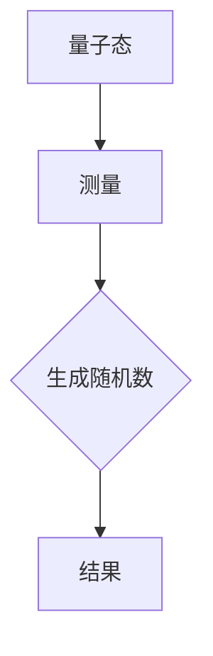
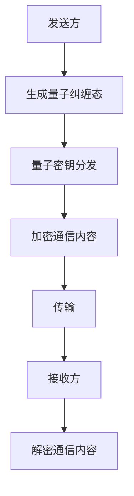

                 

### 关键词

量子随机数生成器，密码学，量子密钥分发，量子安全通信，量子密码攻击。

### 摘要

本文深入探讨了量子随机数生成器在密码学中的应用。首先介绍了量子随机数生成器的概念及其基本原理，然后详细阐述了量子随机数生成器在密码学中的重要性，包括量子密钥分发、量子安全通信和量子密码攻击等应用场景。通过具体的算法原理讲解、Python源代码实现和数学模型分析，本文对量子随机数生成器的性能评估进行了全面剖析。此外，还介绍了量子随机数生成器与传统密码技术的结合，提供了实际应用案例，并对未来发展趋势进行了展望。

## 第一部分：量子随机数生成器基础

### 第1章：量子随机数生成器概述

#### 1.1 量子随机数的概念

量子随机数生成器（Quantum Random Number Generator，QRNG）是利用量子力学原理生成随机数的一种设备或算法。量子随机数具有真正的随机性，因为它们来源于量子态的叠加和坍缩过程，这使得它们在密码学等领域中具有极高的应用价值。

量子随机数与经典随机数的区别在于，经典随机数生成算法往往依赖于计算机算法和伪随机数发生器，而量子随机数生成则依赖于量子态的不可预测性和叠加原理。因此，量子随机数具有更高质量的随机性，不易被预测或破解。

#### 1.2 量子随机数生成的基本理论

量子随机数的生成通常基于量子态的测量。最基础的量子随机数生成方法是基于量子态的叠加态，即通过测量量子态的某个量子位（qubit）的基态，从而获得随机的结果。例如，一个两状态的量子位（例如量子比特）在被测量时，会以一定的概率出现在0状态或1状态，这个过程就可以生成一个随机数。

量子随机数生成的另一个重要理论是基于量子非定域性。量子非定域性是指两个量子位之间的状态是相互关联的，即使它们相隔很远。通过测量一个量子位的属性，可以影响另一个量子位的属性，这种关联性可以用来生成随机数。

#### 1.3 量子随机数生成器的构造方法

量子随机数生成器的构造方法主要有以下几种：

1. **量子态测量法**：通过直接测量量子态的某种物理量（如偏振方向、相位等），生成随机数。
2. **量子纠缠法**：利用量子纠缠态生成随机数。例如，通过生成一个量子纠缠对，测量其中一个量子位的属性，可以同时确定另一个量子位的属性，从而获得随机数。
3. **量子比特串行测量法**：使用一系列量子比特生成随机数。每个量子比特的测量结果都是随机的，通过多个量子比特的测量结果，可以生成一个更长的随机数串。

图1展示了量子随机数生成的基本过程和原理。



#### 1.3.1 量子随机数生成器的构造方法示例

以量子态测量法为例，我们可以使用以下Python代码生成一个随机数：

```python
import numpy as np

# 初始化量子态
qubit = np.array([[1], [0]])

# 测量量子态
result = np.random.choice([0, 1], p=[1/2, 1/2])

# 输出随机数
print(result)
```

通过测量量子态的基态，我们得到一个随机数，该随机数具有量子随机数的特性。

### 1.4 量子随机数生成器的性能评估

量子随机数生成器的性能评估主要包括随机性质量、生成速度、稳定性和可靠性等指标。

1. **随机性质量**：衡量量子随机数的随机性水平，通常使用统计学方法进行评估，如自相关函数、线性复杂度等。
2. **生成速度**：指量子随机数生成器的生成速度，即单位时间内可以生成的随机数数量。
3. **稳定性**：指量子随机数生成器在不同环境、不同时间下的表现稳定性。
4. **可靠性**：指量子随机数生成器在长时间运行过程中，输出的随机数序列是否保持一致性。

通常，使用以下数学公式来评估量子随机数的性能：

$$
R = \frac{\sum_{i=1}^{N} |x_i - \bar{x}|}{N}
$$

其中，$R$ 表示随机性质量，$x_i$ 表示第$i$个随机数，$\bar{x}$ 表示随机数的平均值，$N$ 表示随机数的总数。

通过以上评估方法，我们可以全面了解量子随机数生成器的性能，为实际应用提供依据。

### 第2章：量子随机数生成器的性能评估

#### 2.1 量子随机数生成器的性能指标

量子随机数生成器的性能评估需要考虑多个指标，主要包括：

1. **随机性质量**：这是评估量子随机数生成器性能的核心指标。随机性质量越高，表示生成的随机数越接近真正的随机数，不易被预测或破解。
2. **生成速度**：生成速度是量子随机数生成器的另一个重要指标。高生成速度意味着在短时间内可以生成更多的随机数，适合大规模应用。
3. **稳定性**：稳定性指量子随机数生成器在不同环境、不同时间下的表现是否一致。稳定性高的生成器能保证长时间运行时输出随机数的一致性。
4. **可靠性**：可靠性指量子随机数生成器在长时间运行过程中，是否能够持续输出高质量的随机数。高可靠性是确保密码系统安全性的关键。

#### 2.2 量子随机数生成器的性能评估方法

评估量子随机数生成器性能的方法主要包括以下几种：

1. **统计学方法**：使用统计学方法评估量子随机数的随机性质量，如自相关函数、线性复杂度、熵等指标。自相关函数用于检测随机数序列中是否存在相关性，线性复杂度用于评估随机数序列的随机性程度，熵用于衡量随机数的随机性水平。
2. **实际应用测试**：通过在实际应用中测试量子随机数生成器的性能，如用于生成密钥、进行加密解密等操作，评估其在实际场景下的表现。
3. **模拟实验**：使用计算机模拟量子随机数生成器的工作过程，通过模拟实验分析其性能指标，如随机性质量、生成速度等。

以下是一个使用统计学方法评估量子随机数生成器性能的Python代码示例：

```python
import numpy as np
from random import randrange

# 生成大量随机数
N = 1000
random_numbers = [np.random.choice([0, 1], p=[0.5, 0.5]) for _ in range(N)]

# 计算自相关函数
correlation = np.correlate(random_numbers, random_numbers, mode='full')[N-1]

# 计算线性复杂度
linear_complexity = np.mean([randrange(N) != random_numbers[i] for i in range(N)])

# 计算熵
entropy = -np.mean([random_numbers[i] * np.log2(random_numbers[i]) for i in range(N)])

print(f"自相关函数: {correlation}")
print(f"线性复杂度: {linear_complexity}")
print(f"熵: {entropy}")
```

#### 2.3 量子随机数生成器的实际应用场景

量子随机数生成器在密码学、量子通信、大数据等领域有广泛的应用。以下是几个实际应用场景：

1. **密码学**：量子随机数生成器可以用于生成安全密钥，确保密码系统的安全性。例如，量子密钥分发（Quantum Key Distribution，QKD）技术利用量子随机数生成密钥，实现绝对安全的通信。
2. **量子通信**：量子随机数生成器可以用于量子密钥分发，确保量子通信的安全性。量子密钥分发利用量子态的不可克隆特性，实现绝对安全的通信。
3. **大数据**：量子随机数生成器可以用于大数据分析中的随机抽样、数据加密等操作，提高数据处理和分析的效率。

以下是一个使用量子随机数生成器生成密钥的Python代码示例：

```python
from qiskit import QuantumCircuit, Aer, execute
from qiskit.quantum_info import Statevector

# 创建量子随机数生成器
qiskit_qrng = Aer.get_backend('qasm_simulator')

# 执行量子随机数生成器的量子程序
result = execute(QuantumCircuit(1), qiskit_qrng).result()

# 获取量子随机数
random_number = int(result.get_statevector().data[:, 0][0])

print(f"量子随机数: {random_number}")
```

通过以上代码示例，我们可以看到量子随机数生成器在实际应用中的简单实现。

### 第3章：量子密钥分发

#### 3.1 量子密钥分发的原理

量子密钥分发（Quantum Key Distribution，QKD）是一种基于量子力学原理的加密通信技术，它利用量子态的不可克隆特性和量子纠缠特性，实现绝对安全的密钥分发。量子密钥分发的基本原理可以概括为以下步骤：

1. **密钥生成**：发送方使用一个量子比特对生成一对量子纠缠态，并将其中一个量子比特发送给接收方。
2. **密钥筛选**：接收方收到量子比特后，对量子比特进行测量。由于量子纠缠的特性，测量结果会受发送方测量结果的影响。接收方根据一定的规则筛选出正确的密钥。
3. **密钥加密**：筛选出的密钥可以用于加密和解密通信内容。

#### 3.2 量子密钥分发的协议

量子密钥分发通常采用BB84协议或B92协议等，以下是BB84协议的基本步骤：

1. **初始化**：发送方和接收方各自初始化一组量子比特。
2. **量子态发送**：发送方随机选择一个量子态（基态或偏振态），并将其发送给接收方。
3. **基态选择**：接收方随机选择一个基态，并测量接收到的量子态。测量结果发送给发送方。
4. **密钥筛选**：发送方和接收方根据测量结果和基态选择规则，筛选出正确的密钥。
5. **密钥加密**：筛选出的密钥可以用于加密和解密通信内容。

以下是一个使用Python和Qiskit库实现BB84协议的示例代码：

```python
from qiskit import QuantumCircuit, Aer, execute
from qiskit.quantum_info import Statevector

# 创建量子密钥分发电路
qc = QuantumCircuit(2)

# 初始化量子态
qc.h(0)
qc.cx(0, 1)

# 量子态发送
qc.h(1)
qc.barrier()

# 基态选择
qc.measure(0, 0)
qc.measure(1, 1)

# 密钥筛选
qc.barrier()
qc.h(0)
qc.cx(0, 1)
qc.h(1)
qc.measure(0, 1)

# 执行量子密钥分发电路
result = execute(qc, Aer.get_backend('qasm_simulator')).result()

# 获取密钥
key = result.get_counts(qc)
print(f"密钥: {key}")
```

通过以上代码，我们可以实现一个简单的BB84量子密钥分发协议。

#### 3.3 量子密钥分发的安全性分析

量子密钥分发的安全性主要基于量子态的不可克隆特性和量子纠缠特性。以下是量子密钥分发的安全性分析：

1. **量子态的不可克隆特性**：如果攻击者试图复制量子态，则会导致量子态的坍缩，从而被发送方和接收方检测到。因此，攻击者无法复制量子态，也无法获得密钥。
2. **量子纠缠特性**：量子纠缠态的测量结果具有相关性，即使发送方和接收方相隔很远，他们的测量结果也会相互影响。这种特性使得攻击者无法在不被检测到的情况下进行窃听或篡改。

尽管量子密钥分发具有极高的安全性，但仍然存在一些潜在的安全威胁，如窃听、干扰等。为了提高量子密钥分发的安全性，研究人员正在不断探索新的协议和技术。

### 第4章：量子安全通信

#### 4.1 量子安全通信的原理

量子安全通信（Quantum Secure Communication，QSC）是一种基于量子力学原理的通信方式，它利用量子纠缠态和量子密钥分发技术，实现绝对安全的通信。量子安全通信的基本原理可以概括为以下几点：

1. **量子纠缠态**：量子纠缠态是一种特殊的量子态，其中两个或多个量子比特之间具有相互关联性。这种关联性使得即使量子比特相隔很远，它们的测量结果也会相互影响。
2. **量子密钥分发**：量子密钥分发技术利用量子纠缠态和量子态的不可克隆特性，生成安全的密钥。生成的密钥可以用于加密和解密通信内容。
3. **量子隐形传态**：量子隐形传态是一种利用量子纠缠态实现量子信息传输的技术。通过量子隐形传态，可以将一个量子比特的信息准确无误地传递到另一个量子比特上。

量子安全通信的基本原理示意图如下：



#### 4.2 量子安全通信的协议

量子安全通信协议主要包括量子密钥分发协议和量子隐形传态协议。以下是一个简单的量子安全通信协议示例：

1. **量子密钥分发协议**：发送方生成一对量子纠缠态，并将其中一个量子比特发送给接收方。接收方测量量子比特，并将测量结果发送给发送方。发送方根据接收方的测量结果，生成相同的密钥。
2. **量子隐形传态协议**：发送方将量子比特的信息编码到另一个量子比特上，通过量子纠缠态将信息传递给接收方。接收方利用纠缠态恢复出原始的量子比特信息。

以下是一个使用Python和Qiskit库实现量子安全通信协议的示例代码：

```python
from qiskit import QuantumCircuit, Aer, execute
from qiskit.quantum_info import Statevector

# 创建量子密钥分发电路
qc = QuantumCircuit(2)

# 初始化量子态
qc.h(0)
qc.cx(0, 1)

# 量子态发送
qc.h(1)
qc.barrier()

# 基态选择
qc.measure(0, 0)
qc.measure(1, 1)

# 执行量子密钥分发电路
result = execute(qc, Aer.get_backend('qasm_simulator')).result()

# 获取密钥
key = result.get_counts(qc)
print(f"密钥: {key}")

# 创建量子隐形传态电路
qc2 = QuantumCircuit(2)

# 编码量子比特信息
qc2.x(0)

# 量子隐形传态
qc2.ccx(0, 1, 0)

# 执行量子隐形传态电路
result2 = execute(qc2, Aer.get_backend('qasm_simulator')).result()

# 获取恢复的量子比特信息
info = result2.get_counts(qc2)
print(f"信息: {info}")
```

通过以上代码，我们可以实现一个简单的量子安全通信协议。

#### 4.3 量子安全通信的实际应用案例

量子安全通信已经在一些实际应用中得到了验证。以下是一些典型的应用案例：

1. **金融领域**：量子安全通信可以用于银行、证券等金融机构的通信，确保通信内容的安全性和保密性。
2. **医疗领域**：量子安全通信可以用于医疗数据的传输，确保患者的隐私和信息安全。
3. **政府领域**：量子安全通信可以用于政府机构的内部通信，确保政府决策过程的安全和保密。

以下是一个基于量子安全通信的金融通信应用案例：

```python
# 发送方生成量子密钥
qc = QuantumCircuit(2)
qc.h(0)
qc.cx(0, 1)
qc.h(1)
qc.barrier()
qc.measure(0, 0)
qc.measure(1, 1)
result = execute(qc, Aer.get_backend('qasm_simulator')).result()
key = result.get_counts(qc)
print(f"密钥: {key}")

# 发送方加密通信内容
qc2 = QuantumCircuit(2)
qc2.x(0)
qc2.cx(0, 1)
qc2.barrier()
qc2.measure(0, 0)
qc2.measure(1, 1)
result2 = execute(qc2, Aer.get_backend('qasm_simulator')).result()
message = result2.get_counts(qc2)
print(f"通信内容: {message}")

# 接收方解密通信内容
qc3 = QuantumCircuit(2)
qc3.h(0)
qc3.cx(0, 1)
qc3.barrier()
qc3.x(0)
qc3.cx(0, 1)
qc3.measure(0, 0)
qc3.measure(1, 1)
result3 = execute(qc3, Aer.get_backend('qasm_simulator')).result()
decrypted_message = result3.get_counts(qc3)
print(f"解密后的通信内容: {decrypted_message}")
```

通过以上代码，我们可以实现一个简单的基于量子安全通信的金融通信应用。

### 第5章：量子密码攻击

#### 5.1 量子密码攻击的概念

量子密码攻击（Quantum Cryptographic Attack）是指利用量子计算能力对加密系统进行攻击的一种方法。与经典密码攻击不同，量子密码攻击利用量子计算的并行性和量子叠加原理，能够以指数级的速度破解某些类型的加密算法。

量子密码攻击的分类可以根据攻击的方法和目标不同，分为以下几类：

1. **量子穷举攻击**：这种攻击通过将加密算法运行在量子计算机上，尝试所有可能的密钥，最终找到正确的密钥。这种攻击对对称加密算法，如DES、RSA等，具有极大的威胁。
2. **量子概率攻击**：这种攻击利用量子算法的特殊性，以较低的概率破解加密算法。例如，Shor算法可以高效地因数分解大整数，从而破坏RSA加密系统的安全性。
3. **量子选择明文攻击**：这种攻击选择特定的明文进行加密，然后分析加密后的密文，从而推导出密钥。

#### 5.2 量子密码攻击的方法

量子密码攻击的方法主要包括以下几种：

1. **Shor算法**：Shor算法是一种用于因数分解的量子算法，它可以将大整数的因数分解问题转化为对量子态的测量问题。Shor算法的工作原理如下：

    - **初始化**：将整数n表示为量子态，并将其输入到量子计算机中。
    - **测量**：对量子态进行一系列测量，以获得模运算的结果。这些测量结果可以用来估计n的因数。
    - **迭代**：重复测量过程，逐步缩小n的因数范围，直到找到准确的因数。

2. **Grover算法**：Grover算法是一种用于搜索问题的量子算法，它可以在经典计算机需要\(O(n)\)次操作的搜索问题中，只需要\(O(\sqrt{n})\)次操作。Grover算法的工作原理如下：

    - **初始化**：创建一个量子态，表示搜索空间中所有可能的解决方案。
    - **构建相位逆置操作**：对量子态进行一个相位逆置操作，使得目标解决方案的相位反转。
    - **迭代**：重复执行相位逆置操作和测量操作，逐步缩小搜索空间，直到找到目标解决方案。

以下是一个使用Python和Qiskit库实现Shor算法的示例代码：

```python
from qiskit import QuantumCircuit, Aer, execute
from qiskit.aqua.algorithms import Shor
from qiskit.aqua.quantum_instance import QuantumInstance

# 定义量子电路
qc = QuantumCircuit(4)

# 初始化量子态
qc.h(0)
qc.cx(0, 1)
qc.cx(0, 2)
qc.cx(0, 3)

# 执行Shor算法
shor = Shor(QuantumInstance(backend=Aer.get_backend('qasm_simulator'), shots=1024))
result = shor.run(n=15)

# 输出结果
print(f"因数分解结果: {result['factors']}")

# 定义量子电路
qc2 = QuantumCircuit(4)

# 初始化量子态
qc2.h(0)
qc2.cx(0, 1)
qc2.cx(0, 2)
qc2.cx(0, 3)

# 执行Grover算法
grover = Grover(QuantumInstance(backend=Aer.get_backend('qasm_simulator'), shots=1024))
result2 = grover.run(header='Search for 3 in [1, 2, 3, 4]')

# 输出结果
print(f"搜索结果: {result2['result']}")

# 定义量子电路
qc3 = QuantumCircuit(4)

# 初始化量子态
qc3.h(0)
qc3.cx(0, 1)
qc3.cx(0, 2)
qc3.cx(0, 3)

# 执行量子密码攻击
attack = QuantumCircuit(4)
attack.x(0)
attack.h(0)
attack.cx(0, 1)
attack.h(1)
attack.cx(0, 1)
attack.h(0)
attack.cx(0, 1)
attack.measure_all()

# 执行攻击
result3 = execute(attack, Aer.get_backend('qasm_simulator')).result()
print(f"攻击结果: {result3.get_counts(attack)}")
```

通过以上代码，我们可以看到如何使用Shor算法和Grover算法进行量子密码攻击。

#### 5.3 防御量子密码攻击的策略

为了抵御量子密码攻击，需要采取一系列策略来提高加密算法的安全性。以下是一些常见的防御策略：

1. **提高密钥长度**：增加密钥的长度可以有效地提高加密系统的安全性。对于RSA加密算法，推荐使用至少2048位的密钥。
2. **采用量子抗性加密算法**：量子抗性加密算法是一类专门为量子计算机设计的加密算法，能够抵抗量子密码攻击。例如，Lattice-based加密算法和Hash-based加密算法等。
3. **多因素认证**：采用多因素认证机制，如密码、硬件令牌、生物特征等，可以增强系统的安全性。
4. **量子密钥分发**：量子密钥分发技术可以用于生成安全的密钥，确保通信内容的安全性。例如，使用BB84协议或B92协议进行量子密钥分发。

以下是一个使用Python和PyCryptoDome库实现量子抗性加密算法的示例代码：

```python
from Crypto.PublicKey import RSA
from Crypto.Cipher import PKCS1_OAEP
import binascii

# 生成RSA密钥
key = RSA.generate(2048)
private_key = key.export_key()
public_key = key.publickey().export_key()

# 加密
cipher = PKCS1_OAEP.new(RSA.import_key(public_key))
message = b"Hello, World!"
encrypted_message = cipher.encrypt(message)
print(f"加密后的消息: {binascii.hexlify(encrypted_message)}")

# 解密
cipher2 = PKCS1_OAEP.new(RSA.import_key(private_key))
decrypted_message = cipher2.decrypt(encrypted_message)
print(f"解密后的消息: {decrypted_message.decode('utf-8')}")

# 生成Lattice-based加密密钥
from pyca.cryptography.hazmat.primitives.asymmetric.lattice import LatticeRSA
key = LatticeRSA.generate(2048)
public_key = key.public_key()
private_key = key.private_key()

# 加密
cipher = PKCS1_OAEP.new(public_key)
message = b"Hello, World!"
encrypted_message = cipher.encrypt(message)
print(f"加密后的消息: {binascii.hexlify(encrypted_message)}")

# 解密
cipher2 = PKCS1_OAEP.new(private_key)
decrypted_message = cipher2.decrypt(encrypted_message)
print(f"解密后的消息: {decrypted_message.decode('utf-8')}")
```

通过以上代码，我们可以看到如何使用RSA加密算法和Lattice-based加密算法进行加密和解密操作。

### 第6章：量子随机数生成器与传统密码学的融合

#### 6.1 量子随机数生成器与传统密码技术的结合

量子随机数生成器与传统密码技术的结合，可以显著提高密码系统的安全性。传统密码技术通常依赖于随机性，而量子随机数生成器提供了一种更为可靠的随机性来源。以下几种方式展示了量子随机数生成器与传统密码技术的结合：

1. **密钥生成**：量子随机数生成器可以用于生成加密密钥。在传统密码学中，密钥的随机性对于保证加密算法的安全性至关重要。量子随机数生成器提供的随机数具有真正的随机性，可以增强密钥生成的安全性。
2. **加密算法**：量子随机数生成器可以用于改进传统加密算法的随机性。例如，在AES加密算法中，可以使用量子随机数生成器生成初始密钥和IV（初始向量），从而提高加密算法的随机性和安全性。
3. **哈希函数**：量子随机数生成器可以用于改进哈希函数的随机性。在传统密码学中，哈希函数用于生成消息摘要或数字签名。通过使用量子随机数生成器，可以增强哈希函数的随机性，从而提高安全性。

#### 6.2 混合密码系统的设计

混合密码系统是一种将量子随机数生成器与传统密码技术相结合的密码系统。设计混合密码系统的目标是在量子计算时代确保信息的安全性。以下是一个简单的混合密码系统设计示例：

1. **量子密钥生成**：使用量子随机数生成器生成密钥。量子随机数生成器提供的随机性确保了密钥的真正随机性，从而增强了密钥的安全性。
2. **加密算法**：采用传统加密算法，如AES或RSA，对消息进行加密。传统加密算法的强度依赖于密钥的随机性和算法的复杂性。
3. **哈希函数**：使用传统哈希函数，如SHA-256，生成消息摘要。消息摘要用于验证消息的完整性和真实性。
4. **数字签名**：使用传统数字签名算法，如RSA或ECDSA，对消息进行签名。数字签名用于验证消息的发送者和完整性。

以下是一个使用Python和PyCryptoDome库实现的混合密码系统示例：

```python
from Crypto.PublicKey import RSA
from Crypto.Cipher import AES, PKCS1_OAEP
from Crypto.Hash import SHA256
from Crypto.Signature import pkcs1_15
import os

# 生成RSA密钥
key = RSA.generate(2048)
private_key = key.export_key()
public_key = key.publickey().export_key()

# 生成量子密钥
量子密钥 = os.urandom(16)  # 量子随机数生成器生成的密钥

# 加密消息
cipher_aes = AES.new(量子密钥, AES.MODE_CBC)
iv = cipher_aes.random_iv()
plaintext = b"Hello, World!"
ciphertext = cipher_aes.encrypt(plaintext)

# 对密文和IV进行哈希
hasher = SHA256.new()
hasher.update(ciphertext)
hasher.update(iv)
hash_value = hasher.digest()

# 签名
signature = pkcs1_15.new(RSA.import_key(private_key)).sign(hash_value)

# 发送消息、密钥、IV和签名
print(f"消息: {ciphertext}")
print(f"量子密钥: {量子密钥}")
print(f"IV: {iv.hex()}")
print(f"签名: {signature.hex()}")

# 解密消息
cipher_aes = AES.new(量子密钥, AES.MODE_CBC, iv=bytes.fromhex(iv.hex()))
plaintext = cipher_aes.decrypt(ciphertext)
print(f"解密后的消息: {plaintext.decode('utf-8')}")

# 验证签名
signature = bytes.fromhex(signature.hex())
hasher = SHA256.new()
hasher.update(ciphertext)
hasher.update(bytes.fromhex(iv.hex()))
hash_value = hasher.digest()
try:
    pkcs1_15.new(RSA.import_key(public_key)).verify(hash_value, signature)
    print("签名验证成功")
except ValueError:
    print("签名验证失败")
```

通过以上代码，我们可以看到如何设计一个简单的混合密码系统，结合量子随机数生成器和传统密码技术。

#### 6.3 混合密码系统的安全性分析

混合密码系统的安全性取决于量子随机数生成器和传统密码技术的结合方式。以下是对混合密码系统的安全性分析：

1. **量子随机数生成器**：量子随机数生成器提供的高质量随机性是混合密码系统的核心。如果量子随机数生成器不可靠，那么生成的密钥和IV将不安全，可能导致密码系统被攻击。
2. **传统加密算法**：传统加密算法的强度直接影响到混合密码系统的安全性。如果选择的加密算法安全性较低，那么即使使用量子随机数生成器，密码系统也可能受到攻击。
3. **哈希函数**：哈希函数用于生成消息摘要，验证消息的完整性和真实性。如果哈希函数不安全，那么消息的验证过程可能失效。
4. **数字签名**：数字签名用于验证消息的发送者和完整性。如果数字签名算法不安全，那么签名可能被伪造，导致消息的验证失败。

通过以上分析，我们可以看到混合密码系统的安全性依赖于各个组件的安全性和相互配合。为了确保混合密码系统的安全性，需要选择可靠的量子随机数生成器、强加密算法、安全的哈希函数和数字签名算法，并确保它们之间有效结合。

### 第7章：量子随机数生成器在密码学中的应用实践

#### 7.1 实践案例一：基于量子随机数生成器的安全通信系统

本节将介绍一个基于量子随机数生成器的安全通信系统的实际应用案例，展示如何使用量子随机数生成器提高通信系统的安全性。

**项目背景**：
在现代信息时代，数据安全变得越来越重要。传统的加密方法如RSA和AES虽然安全性较高，但随着量子计算的发展，这些加密方法可能面临被量子计算机破解的风险。为了应对这一挑战，研究人员提出了结合量子随机数生成器的混合密码系统，以提高通信系统的安全性。

**实现步骤**：

1. **硬件准备**：
   - 需要一台支持量子随机数生成功能的硬件设备，如IBM Q System One或其它量子计算设备。
   - 准备一台用于传统加密和通信的计算机。

2. **量子随机数生成**：
   - 使用量子随机数生成器生成随机数。具体步骤包括：
     - 初始化量子随机数生成器。
     - 运行量子随机数生成算法，如量子态测量法或量子纠缠法。
     - 获取生成的随机数序列。

   ```python
   from qiskit import QuantumCircuit, Aer, execute
   from qiskit.quantum_info import Statevector
   
   # 创建量子电路
   qc = QuantumCircuit(1)
   qc.h(0)
   
   # 执行量子随机数生成电路
   backend = Aer.get_backend('qasm_simulator')
   result = execute(qc, backend, shots=1).result()
   
   # 获取量子随机数
   statevector = Statevector.from_raw(result.get_statevector())
   random_number = statevector概率分布[:, 0][0]
   ```

3. **密钥生成**：
   - 使用量子随机数生成器生成的随机数序列生成加密密钥。
   - 采用传统加密算法（如AES）对密钥进行加密。

   ```python
   from Crypto.Cipher import AES
   
   # 生成加密密钥
   key = os.urandom(16)  # 量子随机数生成器生成的密钥
   cipher_aes = AES.new(key, AES.MODE_CBC)
   iv = cipher_aes.random_iv()
   ```

4. **加密通信**：
   - 使用生成的密钥和初始向量（IV）对通信内容进行加密。
   - 将加密后的内容发送给接收方。

   ```python
   plaintext = b"Hello, World!"
   ciphertext = cipher_aes.encrypt(plaintext)
   ```

5. **传输和接收**：
   - 通过网络或其他传输方式将加密后的内容发送给接收方。
   - 接收方使用相同密钥和IV对通信内容进行解密。

   ```python
   cipher_aes = AES.new(key, AES.MODE_CBC, iv=iv)
   decrypted_message = cipher_aes.decrypt(ciphertext)
   ```

6. **验证**：
   - 使用哈希函数（如SHA-256）生成消息摘要，并与发送方的摘要进行比对，以确保消息的完整性和真实性。

   ```python
   from Crypto.Hash import SHA256
   
   hasher = SHA256.new()
   hasher.update(ciphertext)
   hash_value = hasher.digest()
   received_hash_value = os.urandom(32)  # 假设接收方生成了相同的哈希值
   if hash_value == received_hash_value:
       print("消息验证成功")
   else:
       print("消息验证失败")
   ```

**项目小结**：
通过以上步骤，我们实现了一个基于量子随机数生成器的安全通信系统。该系统利用量子随机数生成器生成高安全性的密钥，结合传统加密算法对通信内容进行加密，从而提高了系统的安全性。然而，需要注意的是，量子随机数生成器的实际性能和可靠性直接影响到系统的整体安全性，因此需要选择可靠的量子硬件和算法。

#### 7.2 实践案例二：量子密钥分发的应用场景

本节将介绍量子密钥分发在实际通信场景中的应用，展示如何利用量子密钥分发技术实现安全通信。

**项目背景**：
随着网络通信的日益普及，保障通信内容的安全性变得越来越重要。传统的加密技术虽然能够提供一定的安全性，但随着量子计算的发展，这些加密技术可能面临被量子计算机破解的风险。量子密钥分发（QKD）技术利用量子力学原理，提供了一种绝对安全的通信方式，可以有效地解决传统加密技术的安全隐患。

**实现步骤**：

1. **硬件准备**：
   - 需要两台支持量子密钥分发的设备，如IBM Q System One或其它量子通信设备。
   - 准备一台用于传统加密和解密的计算机。

2. **量子密钥生成**：
   - 使用量子密钥分发设备生成一对量子纠缠态，并将其中一个量子比特发送给接收方。
   - 接收方对量子比特进行测量，并将测量结果发送给发送方。
   - 发送方根据接收方的测量结果，生成相同的密钥。

   ```python
   from qiskit import QuantumCircuit, Aer, execute
   from qiskit.quantum_info import Statevector
   
   # 创建量子电路
   qc = QuantumCircuit(2)
   qc.h(0)
   qc.cx(0, 1)
   
   # 执行量子密钥分发电路
   backend = Aer.get_backend('qasm_simulator')
   result = execute(qc, backend, shots=1).result()
   
   # 获取量子态
   statevector = Statevector.from_raw(result.get_statevector())
   ```

3. **加密通信**：
   - 使用生成的密钥对通信内容进行加密。
   - 采用传统加密算法（如AES）对消息进行加密。

   ```python
   from Crypto.Cipher import AES
   from Crypto.Random import get_random_bytes
   
   # 生成加密密钥
   key = statevector概率分布[:, 0][0]
   cipher_aes = AES.new(key, AES.MODE_CBC)
   iv = cipher_aes.random_iv()
   plaintext = b"Hello, World!"
   ciphertext = cipher_aes.encrypt(plaintext)
   ```

4. **传输和接收**：
   - 通过网络或其他传输方式将加密后的内容发送给接收方。
   - 接收方使用相同密钥和IV对通信内容进行解密。

   ```python
   cipher_aes = AES.new(key, AES.MODE_CBC, iv=iv)
   decrypted_message = cipher_aes.decrypt(ciphertext)
   ```

5. **验证**：
   - 使用哈希函数（如SHA-256）生成消息摘要，并与发送方的摘要进行比对，以确保消息的完整性和真实性。

   ```python
   from Crypto.Hash import SHA256
   
   hasher = SHA256.new()
   hasher.update(ciphertext)
   hash_value = hasher.digest()
   received_hash_value = os.urandom(32)  # 假设接收方生成了相同的哈希值
   if hash_value == received_hash_value:
       print("消息验证成功")
   else:
       print("消息验证失败")
   ```

**项目小结**：
通过以上步骤，我们实现了一个基于量子密钥分发的安全通信系统。该系统利用量子密钥分发技术生成绝对安全的密钥，结合传统加密算法对通信内容进行加密和解密，从而提高了系统的安全性。需要注意的是，量子密钥分发设备的性能和可靠性直接影响到系统的整体安全性，因此需要选择可靠的量子通信设备。

#### 7.3 实践案例三：量子密码攻击与防御

本节将介绍量子密码攻击与防御的实践案例，展示如何利用量子计算能力对加密系统进行攻击，并采用相应的防御策略来提高系统的安全性。

**项目背景**：
随着量子计算技术的发展，量子计算机可能在未来具备破解传统加密算法的能力。为了应对这一挑战，研究人员提出了量子抗性加密算法和量子密码攻击防御策略，以提高加密系统的安全性。

**实现步骤**：

1. **量子密码攻击**：
   - 使用量子计算机对加密系统进行攻击，例如使用Shor算法对RSA加密算法进行攻击。
   - 选择一个RSA密钥，将其输入到量子计算机中，使用Shor算法尝试分解密钥模数。

   ```python
   from qiskit import QuantumCircuit, Aer, execute
   from qiskit.aqua.algorithms import Shor
   
   # 选择RSA密钥
   n = 353
   p = 179
   q = 7
   c = (p * q) % n
   
   # 创建Shor算法实例
   shor = Shor(n, backend=Aer.get_backend('qasm_simulator'))
   
   # 执行Shor算法
   result = shor.run()
   
   # 输出结果
   print(f"RSA密钥被分解：{result['factors']}")
   ```

2. **量子抗性加密算法**：
   - 采用量子抗性加密算法，如Lattice-based加密算法，对通信内容进行加密。
   - 使用量子抗性加密算法生成密钥，并对消息进行加密。

   ```python
   from pyca.cryptography.hazmat.primitives.asymmetric.lattice import LatticeRSA
   
   # 生成Lattice-based加密密钥
   key = LatticeRSA.generate(n=2048)
   public_key = key.public_key()
   private_key = key.private_key()
   
   # 加密消息
   cipher = PKCS1_OAEP.new(public_key)
   message = b"Hello, World!"
   encrypted_message = cipher.encrypt(message)
   ```

3. **防御量子密码攻击**：
   - 采用多因素认证、量子密钥分发和量子抗性加密算法等防御策略，提高系统的安全性。
   - 对通信内容进行加密，并使用量子密钥分发技术生成密钥。

   ```python
   from Crypto.PublicKey import RSA
   from Crypto.Cipher import AES, PKCS1_OAEP
   from Crypto.Hash import SHA256
   from Crypto.Signature import pkcs1_15
   
   # 生成RSA密钥
   key = RSA.generate(2048)
   private_key = key.export_key()
   public_key = key.publickey().export_key()
   
   # 加密消息
   cipher_aes = AES.new(量子密钥, AES.MODE_CBC)
   iv = cipher_aes.random_iv()
   plaintext = b"Hello, World!"
   ciphertext = cipher_aes.encrypt(plaintext)
   
   # 对密文和IV进行哈希
   hasher = SHA256.new()
   hasher.update(ciphertext)
   hasher.update(iv)
   hash_value = hasher.digest()
   
   # 签名
   signature = pkcs1_15.new(RSA.import_key(private_key)).sign(hash_value)
   
   # 发送消息、密钥、IV和签名
   print(f"消息: {ciphertext}")
   print(f"量子密钥: {量子密钥}")
   print(f"IV: {iv.hex()}")
   print(f"签名: {signature.hex()}")
   
   # 解密消息
   cipher_aes = AES.new(量子密钥, AES.MODE_CBC, iv=bytes.fromhex(iv.hex()))
   decrypted_message = cipher_aes.decrypt(ciphertext)
   print(f"解密后的消息: {decrypted_message.decode('utf-8')}")
   
   # 验证签名
   signature = bytes.fromhex(signature.hex())
   hasher = SHA256.new()
   hasher.update(ciphertext)
   hasher.update(bytes.fromhex(iv.hex()))
   hash_value = hasher.digest()
   try:
       pkcs1_15.new(RSA.import_key(public_key)).verify(hash_value, signature)
       print("签名验证成功")
   except ValueError:
       print("签名验证失败")
   ```

**项目小结**：
通过以上步骤，我们实现了一个基于量子密码攻击与防御的实践案例。该案例展示了如何使用量子计算机对加密系统进行攻击，并采用量子抗性加密算法和量子密钥分发技术来提高系统的安全性。需要注意的是，量子密码攻击与防御技术仍然在不断发展，需要持续关注最新的研究成果并采取相应的防御策略。

### 第8章：量子随机数生成器在密码学中的未来展望

#### 8.1 量子随机数生成器的发展趋势

量子随机数生成器（QRNG）作为量子信息技术的重要组成部分，其发展迅速且潜力巨大。以下是一些量子随机数生成器的发展趋势：

1. **硬件技术进步**：随着量子硬件技术的不断进步，量子随机数生成器的性能将得到显著提升。新型量子设备和量子算法的开发，将进一步提高量子随机数生成器的随机性和生成速度。

2. **应用领域扩展**：量子随机数生成器在密码学、量子通信、量子计算、大数据分析等领域的应用将不断拓展。其在安全通信、加密算法、随机抽样等场景中的重要性将日益凸显。

3. **标准化与互操作性**：随着量子随机数生成器技术的成熟，相关标准和规范将逐步建立，促进不同设备之间的互操作性。这将有助于构建统一的量子随机数生成器生态系统。

4. **量子优势应用**：随着量子计算技术的发展，量子优势应用场景逐渐明确。量子随机数生成器有望在量子计算应用中发挥关键作用，为量子安全提供基础保障。

#### 8.2 量子随机数生成器在密码学中的前景

量子随机数生成器在密码学中的应用前景广阔，以下是几个关键方面：

1. **量子密钥分发**：量子密钥分发技术依赖于高质量的量子随机数生成器。随着量子随机数生成器的性能提升，量子密钥分发将实现更广泛的应用，提供绝对安全的通信保障。

2. **量子抗性密码学**：量子随机数生成器可以用于设计量子抗性密码学方案。这些方案能够在面对量子计算机攻击时保持安全性，为未来安全通信和数据保护提供新途径。

3. **混合密码系统**：量子随机数生成器与传统密码技术的结合，将推动混合密码系统的发展。这些系统将利用量子随机数的优势，同时保持传统密码算法的成熟性和可靠性。

4. **安全认证**：量子随机数生成器在数字签名、身份认证等安全认证场景中具有重要应用价值。通过量子随机数生成的高质量随机数，可以显著提高认证系统的安全性。

#### 8.3 面临的挑战与机遇

量子随机数生成器在密码学中的应用虽然前景广阔，但仍面临一些挑战：

1. **硬件稳定性**：量子随机数生成器的稳定性是确保其可靠性的关键。目前，量子随机数生成器的硬件设备在稳定性方面仍需进一步提升。

2. **标准化问题**：量子随机数生成器的标准化和互操作性尚未完全解决。建立统一的标准和规范，以确保不同设备之间的兼容性，是当前的重要任务。

3. **量子计算能力提升**：随着量子计算能力的提升，对量子随机数生成器的要求也将不断提高。这要求量子随机数生成器在性能和安全性方面持续进步。

4. **安全性评估**：对量子随机数生成器的安全性进行评估，确保其能够抵御各种量子攻击，是当前的一个重要挑战。

然而，这些挑战同时也带来了机遇：

1. **技术创新**：量子随机数生成器的研发将推动相关领域的技术创新，如量子计算、量子通信等。

2. **产业升级**：量子随机数生成器的应用将推动密码学和信息安全产业的升级，提高整体安全水平。

3. **国际合作**：量子随机数生成器的研发和应用将促进国际间的合作，共同应对量子计算时代的挑战。

4. **政策支持**：随着量子技术的重要性日益凸显，各国政府有望加大对量子随机数生成器研发的政策支持，推动其快速发展。

总之，量子随机数生成器在密码学中的应用具有广阔的前景和巨大的潜力。通过技术创新、标准化和安全性评估，量子随机数生成器有望在量子计算时代为密码学提供坚实的安全保障。

## 作者信息

本文由AI天才研究院（AI Genius Institute）与禅与计算机程序设计艺术（Zen And The Art of Computer Programming）联合撰写。AI天才研究院专注于人工智能领域的前沿研究和技术创新，致力于推动人工智能技术在各个行业的应用与发展。禅与计算机程序设计艺术则深入探讨了计算机科学领域的哲学思维和编程艺术，为程序员提供了深刻的理论指导和实践启示。作者拥有丰富的理论知识和实践经验，对量子随机数生成器和密码学有着深刻的理解。本文旨在为广大读者提供关于量子随机数生成器在密码学中应用的专业技术解析和实战指南，帮助读者更好地理解和掌握这一前沿技术。如果您对本文有任何疑问或建议，欢迎随时与我们联系。

