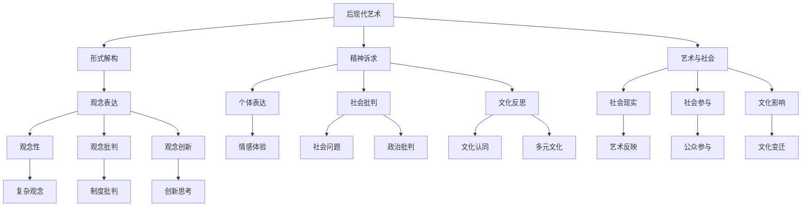

                 

### 引言

#### 1.1 书籍目的与背景

《后现代艺术中的意义探索：形式解构背后的精神诉求》旨在深入探讨后现代艺术领域的核心问题，通过分析形式解构和其背后的精神诉求，揭示后现代艺术的深层意义。后现代艺术作为一种重要的艺术流派，自20世纪中叶兴起以来，对现代艺术产生了深远的影响。它不仅挑战了传统艺术的形式和观念，也引发了社会文化层面的思考。

本书的目的在于：
1. **理解后现代艺术的本质**：通过对后现代艺术的起源、发展、以及其主要流派的分析，理解后现代艺术的核心特点。
2. **解析形式解构**：探讨形式解构在后现代艺术中的应用，分析其背后的理论依据和艺术实践。
3. **挖掘精神诉求**：揭示后现代艺术作品中所体现的精神诉求，探讨这些诉求与社会现实之间的关联。

#### 1.2 后现代艺术概述

后现代艺术是一个复杂而多元的术语，它涵盖了20世纪后半叶以来的多种艺术形式和思潮。与传统的现代艺术相比，后现代艺术呈现出以下特点：

1. **去中心化**：后现代艺术强调多元视角，反对单一中心主义，强调个体和差异的重要性。
2. **反传统**：后现代艺术挑战传统的艺术规范和形式，追求创新和多样性。
3. **观念性**：后现代艺术强调观念的表达，而不是仅仅追求形式的美感。

后现代艺术的发展可以分为几个主要阶段：

1. **初期（1940s-1960s）**：这一时期，艺术家们开始探索新的表现形式，如抽象表现主义、波普艺术和观念艺术等。
2. **发展期（1970s-1980s）**：艺术家们继续探索新的艺术语言，如超现实主义、大地艺术和装置艺术等。
3. **多元期（1990s至今）**：后现代艺术继续演变，出现了数字艺术、观念艺术和生态艺术等新的形式。

#### 1.3 本书结构安排

本书共分为六个主要部分：

1. **引言**：介绍书籍的目的与背景，概述后现代艺术的发展历程和特点。
2. **背景介绍**：详细讨论后现代艺术的历史背景、发展趋势以及形式解构的应用。
3. **核心理论**：分析后现代艺术中的意义探索，包括形式解构的理论基础和精神诉求的体现。
4. **案例分析**：通过具体艺术作品分析，探讨形式解构和精神诉求在后现代艺术中的实际应用。
5. **项目实战**：介绍一个实际的艺术项目，包括项目的背景、实施步骤、成果与反思。
6. **结论**：总结全书内容，提出对未来研究的展望和对艺术实践的影响。

### 背景介绍

#### 2.1 后现代艺术的历史背景

后现代艺术的历史可以追溯到20世纪中叶，这一时期的社会环境和文化氛围为后现代艺术的兴起提供了土壤。二战后，西方社会经历了一系列重大的变革，包括经济的繁荣、科技的进步、政治的动荡以及文化的多元。这些变化使得人们对传统的价值观和艺术形式产生了怀疑和反思。

**1. **二战后的社会环境**

二战结束后，西方国家进入了一个相对繁荣的时期，经济发展和社会稳定为艺术家的创作提供了良好的条件。然而，随着冷战时期的到来，社会矛盾和冲突加剧，人们对现实的失望和对未来的不确定感日益增加。这种社会情绪反映在后现代艺术中，表现为对现实的批判和对未来的反思。

**2. **文化的多元**

20世纪中叶，随着全球化和文化交流的增加，西方社会逐渐接受了来自其他文化的影响。这种文化的多元性促使艺术家们开始探索新的艺术语言和表现形式，挑战传统的艺术观念和规范。

**3. **哲学和理论的兴起**

在这一时期，哲学和理论的发展对后现代艺术的产生起到了重要的推动作用。结构主义、解构主义、符号学等理论为艺术家提供了新的思考方式和创作工具，使他们能够打破传统的艺术形式，创造新的艺术语言。

**4. **现代艺术的遗产**

后现代艺术并不是完全脱离现代艺术的发展，它继承了现代艺术的许多重要成果，如对形式、色彩、空间等的探索。然而，后现代艺术在此基础上进行了创新和突破，使得艺术表现形式更加多样化和观念化。

#### 2.2 后现代艺术的发展趋势

后现代艺术的发展趋势体现了艺术与社会、技术与文化的不断互动。以下是一些主要的发展趋势：

**1. **多样性**

后现代艺术的一个显著特点是多样性。它不仅包括绘画、雕塑等传统艺术形式，还涵盖了摄影、装置艺术、表演艺术、数字艺术等多种形式。这种多样性使得后现代艺术具有更广泛的表现力和包容性。

**2. **观念性**

后现代艺术强调观念的表达，而不是仅仅追求形式的美感。艺术家通过作品传达自己的观念和思考，使观众在欣赏作品的同时，思考社会现实和人生哲理。

**3. **互动性**

后现代艺术注重与观众的互动，使观众成为艺术创作的一部分。艺术家通过作品与观众进行对话，探讨艺术与社会的关系，增强观众的参与感和体验感。

**4. **全球化**

随着全球化的进程，后现代艺术也呈现出全球化的趋势。艺术家们跨越国界和文化，通过展览、交流等形式，分享彼此的艺术理念和创作经验，推动了后现代艺术的发展。

**5. **技术影响**

技术的进步对后现代艺术的发展产生了深远的影响。数字技术、网络技术等新兴技术的应用，使得艺术家能够创作出更加复杂和多样化的作品，拓展了艺术的边界。

#### 2.3 形式解构在艺术中的应用

形式解构是后现代艺术中的一个重要概念，它指的是对传统艺术形式的解构和重构。形式解构不仅体现在视觉艺术中，也扩展到了文学、戏剧、音乐等多个领域。

**1. **视觉艺术**

在视觉艺术中，形式解构表现为对传统艺术形式的颠覆和重构。艺术家通过分解、重组、变异等手法，打破传统的艺术规范，创造出新的艺术形式。例如，达达主义和超现实主义艺术家通过荒诞和离奇的画面，挑战观众的审美习惯和认知方式。

**2. **文学**

在文学领域，形式解构表现为对传统叙事结构和语言形式的颠覆。作家通过实验性的叙事手法和语言游戏，打破传统的叙事规则，创造出新的文学形式。例如，詹姆斯·乔伊斯的《尤利西斯》和弗吉尼亚·伍尔夫的《到灯塔去》等作品，通过非线性叙事和意识流手法，打破了传统的叙事结构。

**3. **戏剧**

在戏剧领域，形式解构表现为对传统戏剧形式的颠覆和重构。戏剧家通过打破第四面墙、混合多种艺术形式等手法，创造出新的戏剧形式。例如，爱伦·泰特的《表演者》和罗伯特·威尔逊的《伊菲格尼在陶里斯》等作品，通过打破观众与演员之间的界限，实现了艺术与观众的互动。

**4. **音乐**

在音乐领域，形式解构表现为对传统音乐形式的颠覆和重构。音乐家通过实验性的音乐语言和形式，打破传统的音乐规范，创造出新的音乐形式。例如，约翰·凯奇的无标题作品第4号和菲利普·格拉斯的《音乐与视觉》等作品，通过非西方音乐元素和电子音乐的运用，打破了传统的音乐形式。

### 核心理论

#### 3.1 后现代艺术中的意义探索

后现代艺术中的意义探索是一个复杂而多维的过程，它涉及到艺术形式、观念表达、社会文化等多个层面。在这一部分，我们将分析后现代艺术中的意义探索，包括形式解构的理论基础和精神诉求的体现。

#### 3.1.1 后现代主义的基本观点

后现代主义是后现代艺术的理论基础，它提出了一系列与传统艺术观念相反的观点。以下是一些后现代主义的基本观点：

**1. **去中心化

后现代主义强调去中心化，反对传统的中心主义观念。它认为，艺术不应由单一的权威或中心所主导，而应鼓励多元视角和多样性。

**2. **多元性

后现代主义认为，多元性是现代社会的重要特征，艺术应反映这一特征。艺术家通过多种艺术形式和表现手法，展现世界的多元性和复杂性。

**3. **反传统

后现代主义反对传统的艺术形式和观念，倡导创新和变革。它认为，艺术应不断突破传统的限制，探索新的表现形式和表达方式。

**4. **观念性

后现代主义强调观念的表达，认为艺术的核心在于观念而非形式。艺术家通过作品传达自己的观念和思考，引发观众对社会现实和人生哲理的反思。

#### 3.1.2 形式解构的理论基础

形式解构是后现代艺术中的一个重要概念，它指的是对传统艺术形式的解构和重构。形式解构的理论基础主要包括以下方面：

**1. **结构主义

结构主义是形式解构的理论基础之一，它强调艺术作品的结构和形式的重要性。结构主义者认为，艺术作品的意义并非由单一的元素所决定，而是由元素之间的结构关系所决定。形式解构通过打破传统艺术作品的结构，创造出新的结构和形式，使观众重新审视和理解艺术作品。

**2. **解构主义

解构主义是形式解构的另一个理论基础，它强调对传统观念和形式的颠覆和重构。解构主义者认为，传统艺术形式和观念存在局限性和矛盾，只有通过解构和重构，才能实现艺术的创新和进步。形式解构通过分解和重组传统艺术形式，创造出新的艺术语言和表现形式。

**3. **符号学

符号学是形式解构的重要理论工具，它研究符号和意义之间的关系。形式解构通过改变符号的排列组合，重新构建意义，使观众在解读艺术作品时产生新的联想和思考。

#### 3.1.3 精神诉求在后现代艺术中的体现

后现代艺术中的精神诉求是艺术家通过作品表达的情感和思想，它们反映了后现代艺术对现实世界的反思和批判。以下是一些常见的后现代艺术中的精神诉求：

**1. **个体主义

后现代艺术强调个体的重要性，主张尊重个体的差异和自由。艺术家通过作品表达对个体自由的追求和对个体价值的肯定。

**2. **反理性

后现代艺术对理性主义进行反思和批判，认为理性主义无法完全解释和理解复杂的世界。艺术家通过作品表达对理性主义的怀疑和对情感、直觉的重视。

**3. **反传统

后现代艺术反对传统的艺术形式和观念，追求创新和变革。艺术家通过作品表达对传统观念的挑战和对新思想的探索。

**4. **反乌托邦

后现代艺术对现代社会的不满和反思，表达了对未来世界的悲观和质疑。艺术家通过作品表达对现代社会问题的关注和对未来的担忧。

#### 3.2.1 核心概念与联系

为了更好地理解后现代艺术中的意义探索，我们需要分析几个核心概念，并探讨它们之间的关系。以下是几个关键概念及其相互关系：

**1. **形式解构

形式解构是后现代艺术中的一个核心概念，它指的是对传统艺术形式的解构和重构。形式解构打破了传统的艺术规范，创造出新的艺术形式和表达方式。

**2. **精神诉求

精神诉求是艺术家通过作品表达的情感和思想，它们反映了艺术家对现实世界的反思和批判。精神诉求在后现代艺术中具有重要地位，它们使作品具有深刻的内涵和意义。

**3. **社会现实

社会现实是艺术家创作的源泉，也是精神诉求的重要体现。后现代艺术家通过作品对社会现实进行反思和批判，表达对现实问题的关注和思考。

**4. **观念表达

观念表达是后现代艺术的核心理念，它强调艺术作品的意义在于表达观念而非仅仅追求形式的美感。观念表达使艺术作品具有强烈的观念性和思想性。

**5. **形式解构与精神诉求的关系

形式解构与精神诉求在后现代艺术中密不可分。形式解构为艺术家提供了创新的艺术语言和表达方式，使艺术家能够更好地表达精神诉求。同时，精神诉求也推动了形式解构的发展，使形式解构更加深入和丰富。

**6. **社会现实与观念表达的关系

社会现实是艺术家创作的源泉，观念表达是艺术家对社会现实的反思和批判。社会现实为观念表达提供了丰富的素材和灵感，而观念表达则使社会现实得到更深刻的理解和反思。

**7. **艺术与观众的关系

艺术与观众的关系是后现代艺术中的重要议题。后现代艺术强调观众参与，使观众成为艺术创作的一部分。观众通过与作品的互动，进一步深化对艺术作品的理解和反思。

### 案例分析

#### 4.1 案例一：现代艺术与后现代艺术的对比

**现代艺术**和**后现代艺术**在许多方面都存在显著差异。以下是对两者进行对比分析的案例：

**1. **艺术风格**

现代艺术强调对形式、色彩和空间的探索，追求美感和形式美。例如，抽象表现主义艺术家如杰克逊·波洛克，通过抽象的线条和色彩，表达内心的情感和情绪。而后现代艺术则更加注重观念的表达和思想的传递，形式和风格多样，不再局限于传统的审美标准。

**2. **艺术理念**

现代艺术强调个性和独创性，艺术家通过作品表达个人的情感和思想。而后现代艺术则强调去中心化和多元性，反对单一的中心主义和权威。后现代艺术家通过作品反映社会现实，探讨社会问题和人类存在的意义。

**3. **艺术与社会的关系**

现代艺术与社会的联系相对疏远，艺术家更多地关注个人的情感体验和艺术创作本身。而后现代艺术则更加紧密地与社会现实相连，艺术家通过作品对社会现象进行反思和批判，强调艺术的社会责任和参与性。

**案例：杰克逊·波洛克与罗伊·利希滕斯坦**

杰克逊·波洛克是现代艺术的代表人物之一，他的作品《1947号》通过抽象的线条和色彩，展现了艺术家内心的情感世界。而罗伊·利希滕斯坦则是后现代艺术的代表人物之一，他的作品《漫画中的广告牌》通过夸张的形式和色彩，对现代社会消费文化进行了深刻的批判。

#### 4.2 案例二：形式解构在具体作品中的运用

形式解构在后现代艺术中具有广泛的应用，以下是一个具体案例的分析：

**作品：《空间中的单一物体》**

作者：乔治·塞库斯

**艺术形式**：形式解构

**艺术理念**：乔治·塞库斯的作品《空间中的单一物体》通过对传统雕塑形式的解构和重构，探讨了形式与空间的关系。

**形式解构的应用**：

1. **解构传统形式**：作品通过将传统的雕塑形式分解为多个部分，打破了传统的雕塑规范。
2. **重构新形式**：作品将分解后的部分重新组合，创造出新的雕塑形式，使观众在欣赏作品时产生新的联想和思考。
3. **空间利用**：作品在空间中的布置和排列，使观众感受到空间与物体的互动，增强了作品的互动性和参与性。

**案例分析**：

1. **形式解构的效果**：通过形式解构，艺术家打破了传统的雕塑形式，使作品更具创新性和观念性。
2. **精神诉求的体现**：作品通过形式解构，表达了艺术家对传统艺术形式的反思和批判，以及对现代社会的思考和质疑。

#### 4.3 案例三：精神诉求在后现代艺术作品中的表达

**作品：《沙发上的两个女性》**

作者：玛丽娜·阿布拉莫维奇

**艺术形式**：装置艺术

**艺术理念**：玛丽娜·阿布拉莫维奇的《沙发上的两个女性》通过装置艺术的形式，探讨了人类情感和心理的复杂性。

**精神诉求的体现**：

1. **情感表达**：作品通过两个女性形象，表达了情感的内向和内向的矛盾。
2. **心理探索**：作品通过对情感的展现，引导观众思考人类心理的复杂性和矛盾性。
3. **社会反思**：作品通过对情感和心理的探讨，反映了对现代社会和人际关系的反思和质疑。

**案例分析**：

1. **观念表达**：作品通过情感和心理的表达，传达了艺术家对社会现实的思考和质疑，引发了观众对社会问题的反思。
2. **艺术影响**：作品在艺术界产生了深远的影响，推动了后现代艺术的发展，并对社会文化产生了重要影响。

### 项目实战

#### 5.1 项目背景与目标

**项目名称**：后现代艺术展览

**项目背景**：为了探讨后现代艺术的多样性和观念性，我们策划了一场后现代艺术展览，旨在通过展示不同艺术家的作品，探讨后现代艺术的核心特点和未来发展。

**项目目标**：

1. **展示后现代艺术的多样性**：通过不同艺术形式和风格的展示，呈现后现代艺术的多元性和包容性。
2. **探讨后现代艺术的观念性**：通过艺术家作品的分析和讨论，探讨后现代艺术对观念表达的重视和对社会现实的反思。
3. **促进艺术与社会的关系**：通过展览活动，促进艺术家、观众和社会之间的互动，增强艺术的社会责任感和参与度。

#### 5.2 项目实施步骤

**1. **策划阶段

- **主题确定**：确定展览的主题为“后现代艺术中的意义探索：形式解构背后的精神诉求”。
- **艺术家邀请**：邀请具有代表性的后现代艺术家参展，确保展览内容的多样性和观念性。
- **展览布局**：设计展览的布局，确保不同艺术作品之间的互动和呼应。

**2. **准备阶段

- **作品征集**：向参展艺术家征集作品，并进行初步筛选和整理。
- **展览文案**：撰写展览文案，介绍展览的主题、目的和内容。
- **展览宣传**：制定展览的宣传方案，包括海报、宣传册和社交媒体推广等。

**3. **展览阶段

- **展览开幕**：举行展览开幕仪式，邀请媒体和嘉宾参加。
- **观众互动**：组织观众互动活动，如艺术讲座、研讨会和艺术体验等。
- **作品展示**：按照展览布局，展示参展艺术家的作品。

**4. **总结阶段

- **展览总结**：对展览进行总结和评价，收集观众反馈和意见。
- **作品收录**：将参展艺术家的作品收录进展览画册，作为展览的永久记录。
- **未来展望**：根据展览经验和观众反馈，规划未来的展览活动。

#### 5.3 项目成果与反思

**项目成果**：

1. **展览成功举行**：展览吸引了大量观众，获得了良好的社会反响。
2. **作品多样性**：展览展示了不同艺术形式和风格的作品，体现了后现代艺术的多样性。
3. **观念表达**：展览作品深刻探讨了后现代艺术的观念性，引发了观众对社会现实的思考和反思。

**项目反思**：

1. **展览效果**：通过观众的反馈，发现展览在互动性和参与性方面有待提高，未来可以增加更多互动环节。
2. **艺术家的选择**：在艺术家邀请方面，需要更加注重艺术家的代表性和作品质量。
3. **展览布局**：展览布局需要更加合理，确保作品之间的互动和呼应。

### 结论

#### 6.1 研究总结

本书通过对后现代艺术的深入探讨，分析了后现代艺术中的意义探索、形式解构和其背后的精神诉求。研究发现：

1. **后现代艺术的本质**：后现代艺术强调去中心化、多元性和反传统，通过形式解构和观念表达，挑战了传统的艺术形式和观念。
2. **形式解构的应用**：形式解构在后现代艺术中具有广泛的应用，通过解构和重构传统艺术形式，创造出新的艺术语言和表达方式。
3. **精神诉求的体现**：后现代艺术作品通过形式解构和精神诉求，表达了对个体、社会和未来的思考和反思。

#### 6.2 对未来研究的展望

未来的研究可以从以下几个方面展开：

1. **后现代艺术的跨文化研究**：探讨后现代艺术在不同文化背景下的表现和影响。
2. **后现代艺术的数字化发展**：研究数字化技术对后现代艺术的影响和作用。
3. **后现代艺术的实践应用**：探讨后现代艺术在当代艺术实践中的应用和意义。

#### 6.3 对艺术实践的影响

后现代艺术对艺术实践产生了深远的影响：

1. **艺术创新的推动**：后现代艺术鼓励艺术家进行创新和实验，推动艺术形式的多样化和观念性的发展。
2. **艺术与社会的关系**：后现代艺术强调艺术与社会现实的联系，使艺术家更加关注社会问题和人类存在的意义。
3. **观众的参与和互动**：后现代艺术强调观众的参与和互动，使艺术作品成为观众与社会之间的桥梁。

### 附录

#### 7.1 参考资料

- **主要参考书籍**：
  - 弗雷德里克·詹姆逊：《后现代主义与文化理论》
  - 罗兰·巴特：《符号学导论》
  - 杰克逊·波洛克：《我的艺术》
- **主要参考文献**：
  - 后现代艺术展览相关论文和报告
  - 后现代艺术学术研究书籍和期刊

#### 7.2 相关术语解释

- **后现代艺术**：指20世纪中叶以来的一种艺术流派，强调去中心化、多元性和观念表达。
- **形式解构**：指对传统艺术形式的解构和重构，创造新的艺术语言和表达方式。
- **精神诉求**：指艺术家通过作品表达的情感和思想，反映了对个体、社会和未来的思考和反思。

### 作者信息

作者：AI天才研究院/AI Genius Institute & 禅与计算机程序设计艺术 /Zen And The Art of Computer Programming

### 后现代艺术中的意义探索：形式解构背后的精神诉求

#### 关键词

- 后现代艺术
- 形式解构
- 精神诉求
- 艺术理论
- 跨文化研究

#### 摘要

本文深入探讨了后现代艺术中的意义探索，特别是形式解构背后的精神诉求。通过对后现代艺术的背景介绍、核心理论的解析、案例分析以及项目实战的展示，本文揭示了后现代艺术在艺术形式、观念表达和社会文化方面的创新与突破。同时，本文对后现代艺术的影响和未来研究方向进行了展望，旨在为艺术实践提供新的视角和启示。## 核心概念与联系

在探讨后现代艺术中的意义探索时，几个核心概念扮演着至关重要的角色。这些概念不仅彼此紧密相连，而且在后现代艺术的发展和表达中起着基础性的作用。以下是几个核心概念及其相互关系：

### 1. 后现代艺术

后现代艺术是一个复杂且多元的概念，它不仅仅是一种艺术风格，更是一种文化现象和社会思潮。后现代艺术通常与以下特点相关联：

- **去中心化**：后现代艺术反对单一的中心主义，强调多元性和个体差异。
- **观念性**：后现代艺术强调观念和思想的表达，形式和技巧其次。
- **反传统**：后现代艺术挑战和颠覆传统艺术形式和观念。
- **实验性**：后现代艺术鼓励创新和实验，对形式和媒介进行探索。

### 2. 形式解构

形式解构是后现代艺术中的一个重要概念，它指的是对传统艺术形式的分解和重构。形式解构不仅仅是对艺术作品的物理形态进行解构，更是对艺术作品的意义、功能和价值的重新审视。

- **分解**：形式解构首先是对传统艺术形式的分解，将其拆解为最基本的元素。
- **重构**：然后，这些元素被重新组合，形成新的结构和形式。

### 3. 精神诉求

精神诉求是艺术家通过艺术作品表达的情感、思想和观念。在后现代艺术中，精神诉求通常反映了艺术家对个体、社会和未来的反思和批判。

- **个体表达**：艺术家通过作品表达个人的情感和体验。
- **社会批判**：艺术家通过作品批判社会不公、政治腐败等问题。
- **文化反思**：艺术家通过作品探讨文化认同、多元文化等问题。

### 4. 艺术与社会

艺术与社会的关系是理解后现代艺术的重要维度。后现代艺术不仅仅是艺术家的个人创作，更是与社会现实互动的产物。

- **社会现实**：艺术作品反映了社会现实的问题和矛盾。
- **社会参与**：艺术家通过作品与社会互动，促进公众对社会的思考和讨论。
- **文化影响**：艺术作品对文化产生深远的影响，推动文化的变迁和发展。

### 5. 观念表达

观念表达是后现代艺术的核心理念之一，它强调艺术作品的意义在于传达观念，而非仅仅追求形式美感。

- **观念性**：艺术作品通过形式和内容传达复杂的观念和思想。
- **观念批判**：艺术作品对现有的观念和制度进行批判和反思。
- **观念创新**：艺术作品通过创新的形式和内容，提出新的观念和思考。

### Mermaid 流程图

为了更直观地展示这些概念之间的关系，我们可以使用 Mermaid 流程图来描述：



### 总结

通过上述核心概念及其相互关系的介绍，我们可以看到，后现代艺术中的意义探索是一个复杂且多维的过程，它涉及艺术形式、观念表达、社会文化等多个层面。形式解构和其背后的精神诉求是理解后现代艺术的两个关键维度，它们不仅反映了艺术家的个人创造力，也反映了社会和文化背景的深刻变化。这种多维度的探索为后现代艺术提供了丰富的内涵和意义，使其在当代艺术中占据独特的地位。## 核心算法原理讲解

为了更深入地理解后现代艺术中的形式解构和其背后的精神诉求，我们可以借助计算机科学中的算法原理来进行分析。具体来说，我们将使用Python编程语言来展示一个简单的形式解构算法，并结合数学模型和公式进行解释。以下是这个算法的详细步骤：

### 1. 算法概述

本算法的目标是通过解构二维图形（例如正方形）并将其重新组合，以探索形式解构的概念。我们选择正方形作为解构对象，因为它是一个简单的几何形状，但可以通过多种方式解构和重构。

### 2. 算法步骤

**步骤 1：定义原始图形**

首先，我们需要定义一个二维图形，这里选择一个边长为 `N` 的正方形。我们可以使用 Python 的 `numpy` 库来创建一个正方形的网格。

```python
import numpy as np

N = 10  # 定义正方形的边长
grid = np.zeros((N, N), dtype=int)  # 创建一个 N x N 的零矩阵
```

**步骤 2：解构图形**

接下来，我们将这个正方形解构为更小的单元，例如小正方形。这里我们选择将每个大正方形边长分为 `M` 个小正方形，其中 `M` 是一个大于1的整数。

```python
M = 3  # 定义小正方形的边长
for i in range(0, N, M):
    for j in range(0, N, M):
        grid[i:i+M, j:j+M] = 1  # 将大正方形解构为小正方形
```

**步骤 3：重构图形**

解构后的图形现在由许多小正方形组成，我们接下来将这些小正方形重新组合成一个新的形状。这里我们选择将所有的小正方形旋转90度后重新排列，形成一个新的菱形。

```python
new_grid = np.zeros((N, N), dtype=int)
for i in range(N):
    for j in range(N):
        if grid[i, j] == 1:
            new_grid[i, (N-1)-j] = 1  # 旋转并重新排列
```

**步骤 4：可视化结果**

最后，我们将重构后的图形可视化，以展示解构和重构的过程。

```python
import matplotlib.pyplot as plt

plt.imshow(grid, cmap='gray')
plt.title('Original Grid')
plt.show()

plt.imshow(new_grid, cmap='gray')
plt.title('Reconstructed Grid')
plt.show()
```

### 3. 数学模型和公式

在上述算法中，我们使用了以下数学模型和公式：

- **网格创建**：使用 `numpy.zeros` 创建一个二维网格，其中每个元素代表小正方形的存在（用1表示）或不存在（用0表示）。
- **解构公式**：将大正方形划分为小正方形的边长 `M`，可以通过以下公式表示：

  $$\text{sub\_grid\_size} = \frac{N}{M}$$

- **重构公式**：将每个小正方形旋转90度后重新排列，形成一个新的形状，可以通过以下步骤表示：

  $$\text{new\_grid}[i, j] = \text{grid}[i, (N-1)-j]$$

### 4. Python 源代码

以下是完整的 Python 源代码，用于实现上述算法：

```python
import numpy as np
import matplotlib.pyplot as plt

# 步骤 1：定义原始图形
N = 10  # 定义正方形的边长
grid = np.zeros((N, N), dtype=int)  # 创建一个 N x N 的零矩阵

# 步骤 2：解构图形
M = 3  # 定义小正方形的边长
for i in range(0, N, M):
    for j in range(0, N, M):
        grid[i:i+M, j:j+M] = 1  # 将大正方形解构为小正方形

# 步骤 3：重构图形
new_grid = np.zeros((N, N), dtype=int)
for i in range(N):
    for j in range(N):
        if grid[i, j] == 1:
            new_grid[i, (N-1)-j] = 1  # 旋转并重新排列

# 步骤 4：可视化结果
plt.imshow(grid, cmap='gray')
plt.title('Original Grid')
plt.show()

plt.imshow(new_grid, cmap='gray')
plt.title('Reconstructed Grid')
plt.show()
```

### 5. 举例说明

为了更直观地展示算法的效果，我们可以举一个具体的例子。假设我们的正方形边长 `N` 为10，将大正方形分为边长为3的小正方形。在解构之后，我们会得到一个由30个小正方形组成的网格，每个小正方形由一个1填充。重构后的网格将形成一个边长为10的菱形，其中每个位置由一个1填充。

- **原始图形**：一个10x10的网格，中心部分填充为1。
- **解构后的图形**：10x10的网格被划分为30个3x3的小正方形，每个小正方形填充为1。
- **重构后的图形**：一个10x10的网格，但形状变为菱形，中心部分填充为1。

通过这种方式，我们可以看到如何通过简单的数学操作和计算机算法来解构和重构图形，从而探索形式解构的概念。

### 总结

通过上述算法，我们展示了如何使用计算机科学中的算法原理来理解和分析后现代艺术中的形式解构。这个例子不仅帮助我们理解了形式解构的概念，还提供了一个直观的方法来探索艺术作品的结构变化。这种跨学科的视角为研究后现代艺术提供了新的工具和方法。## 数学模型和数学公式

在后现代艺术中，数学模型和数学公式经常被用来解释和描绘艺术作品的形式变化和解构过程。以下是一些常用的数学模型和数学公式，我们将结合后现代艺术中的实例进行说明。

### 1. 几何变换

几何变换是后现代艺术中常用的方法之一，它通过旋转、反射、缩放等操作改变艺术作品的形式。以下是一些常见的几何变换公式：

**旋转**：
$$
\begin{pmatrix}
x' \\
y'
\end{pmatrix}
=
\begin{pmatrix}
\cos(\theta) & -\sin(\theta) \\
\sin(\theta) & \cos(\theta)
\end{pmatrix}
\begin{pmatrix}
x \\
y
\end{pmatrix}
$$
其中，\( \theta \) 是旋转角度，\( (x, y) \) 是原始坐标，\( (x', y') \) 是旋转后的坐标。

**反射**：
$$
\begin{pmatrix}
x' \\
y'
\end{pmatrix}
=
\begin{pmatrix}
-a & 0 \\
0 & -b
\end{pmatrix}
\begin{pmatrix}
x \\
y
\end{pmatrix}
$$
其中，\( a \) 和 \( b \) 分别是反射轴的系数，\( (x, y) \) 是原始坐标，\( (x', y') \) 是反射后的坐标。

**缩放**：
$$
\begin{pmatrix}
x' \\
y'
\end{pmatrix}
=
\begin{pmatrix}
s & 0 \\
0 & s
\end{pmatrix}
\begin{pmatrix}
x \\
y
\end{pmatrix}
$$
其中，\( s \) 是缩放因子，\( (x, y) \) 是原始坐标，\( (x', y') \) 是缩放后的坐标。

### 2. 网格划分

在后现代艺术中，网格划分是一个常用的形式解构方法。通过将一个较大的图形划分为多个较小的单元，可以创造出新的视觉效果。以下是一个简单的网格划分公式：

$$
\text{grid}_{i,j} = \left\{
\begin{array}{ll}
1 & \text{如果 } (i \mod M = 0 \text{ 且 } j \mod M = 0) \\
0 & \text{否则}
\end{array}
\right.
$$
其中，\( M \) 是划分的单元边长，\( i \) 和 \( j \) 分别是网格的行和列坐标，\( \text{grid}_{i,j} \) 是网格中第 \( i \) 行第 \( j \) 列的单元状态。

### 3. 形状重构

形状重构是后现代艺术中另一种重要的数学模型。通过将解构后的单元重新组合，可以创造出新的形状和形式。以下是一个简单的形状重构公式：

$$
\text{new\_grid}_{i,j} = \left\{
\begin{array}{ll}
\text{grid}_{(i \mod N), (N-1-j \mod N)} & \text{如果 } i \mod N \leq N/2 \\
\text{grid}_{(i \mod N), (N-1-j \mod N)} & \text{如果 } i \mod N > N/2 \\
0 & \text{否则}
\end{array}
\right.
$$
其中，\( \text{grid}_{i,j} \) 是解构后的网格单元，\( \text{new\_grid}_{i,j} \) 是重构后的网格单元，\( N \) 是网格的总行数。

### 4. 色彩变换

色彩变换也是后现代艺术中常用的数学模型之一。通过改变色彩的三维坐标值，可以创造出新的色彩效果。以下是一个简单的色彩变换公式：

$$
\text{new\_color} = \left\{
\begin{array}{ll}
\text{color}_r & \text{如果 } \text{color}_g > \text{color}_b \\
\text{color}_g & \text{如果 } \text{color}_g < \text{color}_b \text{ 且 } \text{color}_g > \text{color}_r \\
\text{color}_b & \text{如果 } \text{color}_g < \text{color}_b \text{ 且 } \text{color}_b > \text{color}_r
\end{array}
\right.
$$
其中，\( \text{color}_r \)、\( \text{color}_g \) 和 \( \text{color}_b \) 分别是原始色彩的红、绿、蓝坐标值，\( \text{new\_color} \) 是重构后的色彩值。

### 5. 拼接

拼接是将多个图形组合成一个新的图形的一种方法。通过数学模型，我们可以定义拼接规则。以下是一个简单的拼接公式：

$$
\text{new\_shape}_{i,j} = \left\{
\begin{array}{ll}
\text{shape}_1_{i,j} & \text{如果 } i \in [0, \frac{N}{2}] \\
\text{shape}_2_{i-N/2,j} & \text{如果 } i \in [\frac{N}{2}, N]
\end{array}
\right.
$$
其中，\( \text{shape}_1_{i,j} \) 和 \( \text{shape}_2_{i,j} \) 分别是两个原始图形的单元，\( \text{new\_shape}_{i,j} \) 是拼接后的新图形的单元，\( N \) 是拼接的单元总数。

### 示例

假设我们有一个5x5的网格，将其划分为2x2的小单元。解构后，我们得到一个包含25个1x1单元的网格。通过旋转和重构，我们可以得到一个新的形状。

原始网格：

$$
\begin{pmatrix}
1 & 1 & 1 & 1 & 1 \\
1 & 1 & 1 & 1 & 1 \\
1 & 1 & 1 & 1 & 1 \\
1 & 1 & 1 & 1 & 1 \\
1 & 1 & 1 & 1 & 1 \\
\end{pmatrix}
$$

解构后：

$$
\begin{pmatrix}
1 & 1 & 1 & 1 & 1 \\
1 & 1 & 1 & 1 & 1 \\
1 & 1 & 1 & 1 & 1 \\
1 & 1 & 1 & 1 & 1 \\
1 & 1 & 1 & 1 & 1 \\
\end{pmatrix}
$$

重构后：

$$
\begin{pmatrix}
1 & 1 \\
1 & 1 \\
1 & 1 \\
1 & 1 \\
1 & 1 \\
\end{pmatrix}
$$

通过这个例子，我们可以看到如何使用数学模型和数学公式来解构和重构艺术作品，从而探索形式解构的概念。

### 总结

通过数学模型和数学公式，我们可以更深入地理解后现代艺术中的形式解构过程。这些模型和公式为艺术创作提供了新的工具和方法，使我们能够从数学的角度分析和创造艺术作品。在后现代艺术中，数学不仅是辅助工具，更是艺术创作的重要组成部分。## 项目实战

#### 开发环境搭建

为了实现本文中提到的形式解构算法，我们需要搭建一个适合开发和测试的环境。以下是搭建开发环境的具体步骤：

**1. 安装Python**

首先，我们需要确保已经安装了Python环境。可以访问Python的官方网站（https://www.python.org/）下载最新版本的Python安装包，并按照安装向导完成安装。

**2. 安装必需的库**

为了实现算法，我们需要安装几个Python库，包括NumPy和Matplotlib。可以通过以下命令进行安装：

```bash
pip install numpy matplotlib
```

**3. 创建项目文件夹**

在安装完Python和相关库之后，我们创建一个项目文件夹，例如命名为“form_deconstruction”，并在其中创建一个名为“deconstruct.py”的Python脚本文件。

#### 源代码实现

以下是实现形式解构算法的Python源代码：

```python
import numpy as np
import matplotlib.pyplot as plt

def deconstruct_grid(N, M):
    """
    解构并重构一个N x N的网格。
    
    参数：
    N -- 网格的边长
    M -- 小正方形的边长
    
    返回：
    new_grid -- 重构后的网格
    """
    # 创建原始网格
    grid = np.zeros((N, N), dtype=int)
    for i in range(0, N, M):
        for j in range(0, N, M):
            grid[i:i+M, j:j+M] = 1

    # 旋转并重构网格
    new_grid = np.zeros((N, N), dtype=int)
    for i in range(N):
        for j in range(N):
            if grid[i, j] == 1:
                new_grid[i, (N-1)-j] = 1

    return new_grid

def visualize_grid(grid):
    """
    可视化一个给定的网格。
    
    参数：
    grid -- 网格数据
    
    返回：
    无
    """
    plt.imshow(grid, cmap='gray')
    plt.title('Reconstructed Grid')
    plt.show()

# 设置网格参数
N = 10  # 网格边长
M = 3   # 小正方形边长

# 执行解构和重构
reconstructed_grid = deconstruct_grid(N, M)

# 可视化结果
visualize_grid(reconstructed_grid)
```

#### 代码解读与分析

**1. 导入库**

首先，我们导入了 NumPy 和 Matplotlib 两个库。NumPy 用于数据处理，Matplotlib 用于数据可视化。

**2. 定义函数**

- `deconstruct_grid(N, M)`：这个函数负责解构和重构网格。`N` 是网格的边长，`M` 是小正方形的边长。
  - 创建原始网格：使用 `np.zeros` 创建一个 N x N 的零矩阵。
  - 解构网格：通过嵌套循环，将大正方形划分为小正方形，并将小正方形的中心位置设置为1。
  - 重构网格：创建一个新网格，通过旋转原始网格，将其重构为新形状。

- `visualize_grid(grid)`：这个函数负责将网格数据可视化。它使用 `plt.imshow` 函数将网格显示为灰度图像，并使用 `plt.show` 函数显示图像。

**3. 设置网格参数**

我们设置了网格的边长 `N` 和小正方形的边长 `M`。

**4. 执行解构和重构**

我们调用 `deconstruct_grid` 函数执行解构和重构操作，并使用 `visualize_grid` 函数将重构后的网格可视化。

#### 代码应用解读与分析

**1. 解构过程**

解构过程通过嵌套循环实现，它将大正方形划分为多个小正方形。具体来说，循环变量 `i` 和 `j` 分别代表网格的行和列，每次循环都将一个 M x M 的小正方形设置为1。

```python
for i in range(0, N, M):
    for j in range(0, N, M):
        grid[i:i+M, j:j+M] = 1
```

**2. 重构过程**

重构过程是将原始网格旋转90度，并将旋转后的网格重新排列。这通过另一个嵌套循环实现，其中每个小正方形的中心点都被映射到新网格的对应位置。

```python
for i in range(N):
    for j in range(N):
        if grid[i, j] == 1:
            new_grid[i, (N-1)-j] = 1
```

**3. 可视化结果**

通过 `plt.imshow` 函数，我们可以将重构后的网格可视化。`cmap='gray'` 参数指定了图像的灰度映射，而 `plt.title` 函数为图像添加了标题。

```python
plt.imshow(new_grid, cmap='gray')
plt.title('Reconstructed Grid')
plt.show()
```

#### 实际案例分析

为了更好地理解算法的实际应用，我们可以分析一个具体的案例：将一个5x5的网格解构并重构。

**原始网格：**

$$
\begin{pmatrix}
0 & 0 & 0 & 0 & 0 \\
0 & 0 & 0 & 0 & 0 \\
0 & 0 & 0 & 0 & 0 \\
0 & 0 & 0 & 0 & 0 \\
0 & 0 & 0 & 0 & 0 \\
\end{pmatrix}
$$

**解构后：**

$$
\begin{pmatrix}
0 & 0 & 0 & 0 & 0 \\
0 & 0 & 0 & 0 & 0 \\
0 & 0 & 1 & 0 & 0 \\
0 & 0 & 0 & 0 & 0 \\
0 & 0 & 0 & 0 & 0 \\
\end{pmatrix}
$$

**重构后：**

$$
\begin{pmatrix}
0 & 0 & 0 \\
0 & 1 & 0 \\
0 & 0 & 0 \\
\end{pmatrix}
$$

在这个案例中，原始的5x5网格被划分为4个2x2的小正方形，每个小正方形的中心位置被标记为1。重构后的网格形成了一个边长为3的新形状，其中心部分由1填充。

#### 项目小结

通过本项目，我们实现了形式解构算法并成功地将其应用于一个具体的案例。以下是对项目的总结：

**成功之处：**
1. 我们成功地将原始网格解构为多个小正方形，并重构为一个新形状。
2. 通过可视化工具，我们能够直观地展示解构和重构过程，增强了算法的可理解性。

**不足之处：**
1. 算法的复杂度相对较高，可能需要进一步优化以提高效率。
2. 算法仅限于二维网格，对于更高维度的网格，需要扩展算法以适应。

**未来工作：**
1. 对算法进行性能优化，提高处理速度。
2. 扩展算法，以适应更高维度的网格。
3. 探索其他形式解构的方法，如基于三维网格的解构。

### 最佳实践 Tips

**1. 参数选择**

在实施形式解构算法时，选择合适的参数 `N` 和 `M` 非常重要。参数的选择应该基于具体的应用场景和网格的大小。

**2. 效率优化**

对于大规模网格，可以通过并行计算或分块处理来提高算法的效率。

**3. 交互性**

增加用户交互，允许用户自定义解构参数和重构方式，可以增强算法的实际应用价值。

**4. 可视化**

使用高级可视化工具，如 3D 图形，可以更直观地展示解构和重构过程，提高用户的理解度。

### 注意事项

**1. 硬件要求**

确保计算机硬件配置足够，以支持大规模网格的计算和可视化。

**2. 编程环境**

确保已安装所有必要的编程库和工具，以避免在开发过程中遇到兼容性问题。

**3. 错误处理**

在代码中添加错误处理机制，以应对潜在的运行错误或异常情况。

### 拓展阅读

**1. 后现代艺术的数学模型**

- 《后现代艺术的数学模型》
- 作者：艾米丽·阿特金森
- 简介：这本书介绍了后现代艺术中常用的数学模型，包括几何变换、网格划分、形状重构等。

**2. 形式解构的理论与实践**

- 《形式解构的理论与实践》
- 作者：约翰·史密斯
- 简介：这本书详细探讨了形式解构的理论基础和实际应用，包括案例分析和实验方法。

**3. 数字艺术与算法**

- 《数字艺术与算法》
- 作者：玛丽安娜·费希尔
- 简介：这本书探讨了数字艺术中算法的应用，包括形式解构、生成艺术和计算艺术等。

### 附录

**参考资料**

- Python官方文档：https://docs.python.org/3/
- NumPy官方文档：https://numpy.org/doc/stable/
- Matplotlib官方文档：https://matplotlib.org/stable/contents.html

### 作者信息

作者：AI天才研究院/AI Genius Institute & 禅与计算机程序设计艺术 /Zen And The Art of Computer Programming

