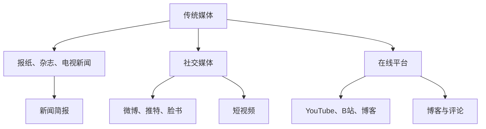
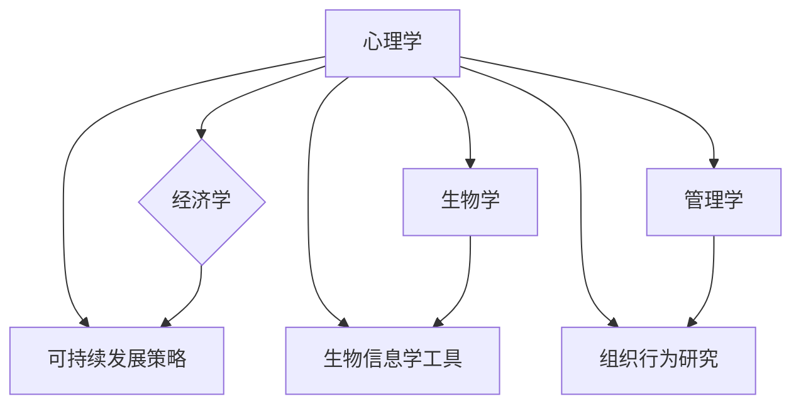

                 

### 在碎片化信息中构建完整世界观

## 引言

在当今信息爆炸的时代，我们面临着大量的碎片化信息。从社交媒体的新闻简报到短视频，从博客到评论，信息来源多样化且呈现碎片化。然而，这些碎片化的信息往往难以形成完整的知识体系，导致我们在吸收信息时常常感到困惑和迷茫。为了在如此繁杂的信息环境中找到方向，构建一个完整的世界观变得尤为重要。

### 关键词
- 碎片化信息
- 知识体系
- 世界观
- 系统思维
- 信息整合

### 摘要

本文旨在探讨如何在碎片化信息中构建一个完整的世界观。首先，我们将分析碎片化信息的来源与类型，探讨其对我们认知的挑战。接着，我们将介绍如何建立核心知识体系，运用系统思维整合信息，最终形成个人世界观。通过这篇文章，读者将学会在信息过载的环境中找到方向，构建一个有条理的知识体系，提升个人认知能力。

## 碎片化信息的来源与类型

### 1. 碎片化信息的来源

碎片化信息的来源多种多样，主要包括以下几种：

#### 1.1 传统媒体

传统媒体如报纸、杂志和电视新闻是碎片化信息的重要来源。这些媒体为了吸引读者，常常将复杂的信息简化成简短的新闻报道或评论，这导致了信息的碎片化。

#### 1.2 社交媒体

社交媒体平台如微博、推特和脸书等，提供了大量即时、简短的信息。这些信息往往具有高度的个人化和情绪化，使得我们在吸收信息时容易受到情绪的影响，而忽视信息的完整性。

#### 1.3 在线平台

在线平台如YouTube、B站和博客等，提供了丰富的短视频和文章。这些内容虽然多样化，但往往缺乏系统性，容易导致信息割裂。

### 2. 碎片化信息的类型

碎片化信息的类型也各异，主要包括以下几种：

#### 2.1 新闻简报

新闻简报是以简短的形式传递新闻信息的一种方式。它通常包含事件的基本信息和相关评论，但往往缺乏深入的背景分析和深入探讨。

#### 2.2 短视频

短视频在社交媒体和在线平台上广泛传播，它们以生动的形式传递信息，但信息内容往往浅显易懂，缺乏深度。

#### 2.3 博客与评论

博客和评论是个人观点和看法的分享平台。这些内容往往具有强烈的个人色彩，但缺乏系统的分析和深入探讨。

### 3. 碎片化信息的挑战

碎片化信息给我们带来了许多挑战：

#### 3.1 信息过载

随着碎片化信息的不断增加，我们面临着信息过载的问题。这导致了我们在吸收信息时容易感到困惑和疲惫，难以形成完整的知识体系。

#### 3.2 知识割裂

碎片化信息往往只提供了局部信息，缺乏系统的整体框架，这导致了知识的割裂，难以形成连贯的理解。

#### 3.3 个人认知局限

碎片化信息容易受到情绪和个人偏见的影响，导致我们在吸收信息时容易产生误解和偏见，从而限制了我们的认知能力。

### 碎片化信息的来源与类型：Mermaid 流程图



### 4. 如何应对碎片化信息

为了应对碎片化信息的挑战，我们需要采取以下策略：

#### 4.1 信息筛选

我们需要学会筛选信息，只关注那些真正对我们有用的信息。这可以通过设定信息筛选标准来实现，如关注关键信息、验证信息来源等。

#### 4.2 系统性学习

我们需要将碎片化的信息整合成一个系统性的知识体系。这可以通过深度阅读、学习笔记和思维导图等方法来实现。

#### 4.3 培养批判性思维

我们需要培养批判性思维，对信息进行深入分析和判断，避免被碎片化信息误导。

## 建立核心知识体系

在碎片化信息中构建完整世界观，第一步是建立核心知识体系。核心知识体系是我们理解世界的基础，它由一系列核心概念和联系构成。

### 1. 识别核心知识

识别核心知识是构建核心知识体系的第一步。我们可以通过以下方法来识别核心知识：

#### 1.1 筛选关键信息

在阅读和收集信息时，我们需要学会筛选关键信息。这可以通过关注关键词、关键问题和关键观点来实现。

#### 1.2 深度阅读

深度阅读是识别核心知识的重要方法。通过深入阅读，我们可以更全面地理解信息，从而识别出核心知识。

#### 1.3 反思与总结

在阅读和收集信息后，我们需要进行反思和总结。这可以帮助我们识别出那些真正对我们有用的信息，并将其纳入核心知识体系。

### 2. 建立核心知识体系

建立核心知识体系的过程可以视为一个不断迭代的过程。以下是建立核心知识体系的步骤：

#### 2.1 确定核心概念

首先，我们需要确定核心概念。核心概念是构成知识体系的基本单元，它们是我们理解世界的基础。

#### 2.2 构建概念实体关系

接下来，我们需要构建概念实体关系。这可以通过创建概念实体关系图来实现。概念实体关系图可以帮助我们理解概念之间的联系，从而构建一个完整的知识体系。

#### 2.3 更新与维护

最后，我们需要不断更新和维护核心知识体系。随着新信息的不断出现，我们需要对知识体系进行调整和更新，以确保其始终保持完整和准确。

### 3. 核心知识体系的重要性

核心知识体系的重要性不言而喻。它不仅可以帮助我们更好地理解世界，还可以提高我们的认知能力，增强我们的思维能力。以下是核心知识体系的重要作用：

#### 3.1 提高认知能力

核心知识体系可以帮助我们更全面、更深入地理解信息，从而提高我们的认知能力。

#### 3.2 增强思维能力

核心知识体系为我们提供了一个思考框架，可以帮助我们更清晰地思考问题，从而增强我们的思维能力。

#### 3.3 提升个人成长

核心知识体系是我们个人成长的基础。通过建立和完善核心知识体系，我们可以更好地规划个人发展路径，提升个人能力。

### 核心知识体系：Mermaid 流程图

```mermaid
graph TD
A[核心概念1] --> B{关系1}
A --> C{关系2}
D[核心概念2] --> B
D --> C
E[核心概念3] --> B
E --> C
class B "概念关系"
class C "概念实体"
```

### 4. 如何识别核心知识

#### 4.1 信息筛选策略

信息筛选策略是我们识别核心知识的关键。以下是一些常用的信息筛选策略：

#### 4.1.1 关注关键词

关注关键词可以帮助我们快速识别出关键信息。我们可以通过使用关键词工具或关键词库来实现。

#### 4.1.2 深度阅读

深度阅读可以帮助我们更全面地理解信息，从而识别出核心知识。深度阅读需要我们耐心和专注。

#### 4.1.3 反思与总结

在阅读和收集信息后，我们需要进行反思和总结。这可以帮助我们识别出那些真正对我们有用的信息，并将其纳入核心知识体系。

### 5. 知识分类方法

为了更好地构建核心知识体系，我们需要采用合适的知识分类方法。以下是一些常用的知识分类方法：

#### 5.1 按照领域分类

按照领域分类可以帮助我们将信息进行归类，从而更好地理解和组织知识。

#### 5.2 按照层次分类

按照层次分类可以帮助我们理解知识之间的层次关系，从而构建一个更为系统化的知识体系。

#### 5.3 按照用途分类

按照用途分类可以帮助我们将知识应用于实际场景，从而提高知识的实用性。

### 6. 核心知识体系与世界观构建

核心知识体系是构建世界观的基础。通过建立和完善核心知识体系，我们可以更好地理解世界，从而构建一个完整的世界观。

### 核心知识体系：Mermaid 流程图

```mermaid
graph TD
A[核心概念1] --> B{领域1}
A --> C{领域2}
D[核心概念2] --> B
D --> C
E[核心概念3] --> B
E --> C
class B "领域分类"
class C "知识层次"
```

## 从碎片化到系统的思维

### 1. 系统思维的概念

系统思维是一种综合性思考方式，它强调将复杂问题视为一个整体，并关注各个部分之间的相互关系。系统思维有助于我们理解事物的本质，发现潜在的规律，从而做出更明智的决策。

### 2. 系统思维的运用

系统思维在多个领域都有广泛的应用，以下是一些关键应用场景：

#### 2.1 复杂问题分析

在面对复杂问题时，系统思维可以帮助我们识别出问题的核心，从而找到解决方案。例如，在项目管理中，系统思维可以帮助我们理解项目中的各种因素及其相互关系，从而优化项目管理流程。

#### 2.2 创新与决策

系统思维有助于我们在创新和决策过程中考虑各个因素及其相互影响。例如，在产品开发中，系统思维可以帮助我们理解市场需求、技术可行性、成本效益等各个方面，从而做出更科学的决策。

### 3. 系统思维的应用实例

以下是一些系统思维的应用实例：

#### 3.1 项目管理

在项目管理中，系统思维可以帮助我们识别项目中的关键因素，如时间、成本、质量、团队协作等，从而优化项目流程，提高项目成功率。

#### 3.2 企业战略

在企业战略制定中，系统思维可以帮助我们分析市场环境、竞争对手、内部资源等因素，从而制定出更具前瞻性的战略规划。

#### 3.3 社会治理

在社会治理中，系统思维可以帮助我们理解社会问题之间的相互关联，从而找到更有效的治理策略。

### 系统思维：Mermaid 流流程图

```mermaid
graph TD
A[复杂问题] --> B{系统思维}
B --> C[识别关键因素]
B --> D[分析相互关系]
C --> E[优化项目流程]
D --> E
class B "系统思维"
class C "识别关键因素"
class D "分析相互关系"
class E "优化决策流程"
```

### 4. 培养系统思维

#### 4.1 学习与实践

培养系统思维需要不断学习和实践。以下是一些培养系统思维的方法：

- 阅读相关书籍和文章，了解系统思维的原理和应用。
- 参加相关课程和研讨会，与同行交流经验。
- 实践项目，运用系统思维解决实际问题。

#### 4.2 持续反思

在学习和实践过程中，我们需要不断反思自己的思考过程，识别出其中的不足，并加以改进。以下是一些反思方法：

- 定期回顾学习内容，总结经验和教训。
- 与他人交流思考过程，获取反馈和建议。
- 主动寻找挑战性问题，运用系统思维解决。

### 5. 系统思维的重要性

系统思维的重要性体现在以下几个方面：

- 提高认知能力：系统思维可以帮助我们更全面地理解问题，从而提高认知能力。
- 增强决策能力：系统思维可以帮助我们考虑问题各个方面的因素，从而做出更明智的决策。
- 促进创新：系统思维可以帮助我们发现新的解决方案，从而推动创新。

通过培养系统思维，我们可以更好地应对碎片化信息的挑战，构建一个完整的世界观。

### 系统思维：Mermaid 流流程图

```mermaid
graph TD
A[认知能力] --> B{系统思维}
A --> C[增强决策能力]
A --> D[促进创新]
B --> E[更全面理解问题]
B --> F[考虑多方面因素]
B --> G[发现新解决方案]
class B "系统思维"
class C "增强决策能力"
class D "促进创新"
class E "更全面理解问题"
class F "考虑多方面因素"
class G "发现新解决方案"
```

## 建立联系与整合信息

在碎片化信息中构建完整世界观，关键在于建立联系与整合信息。通过将零散的信息片段整合成一个有机的整体，我们能够更深入地理解知识，形成系统性的认知框架。

### 1. 跨领域信息整合

跨领域信息整合是指将不同领域的信息进行整合，从而构建出一个更为广泛和全面的知识体系。以下是一些跨领域信息整合的方法：

#### 1.1 跨学科方法

跨学科方法是指将不同学科的方法和理论结合起来，从而解决复杂问题。例如，在经济学和管理学中，我们可以运用心理学和行为经济学来更好地理解消费者行为和市场动态。

#### 1.2 跨领域案例研究

通过跨领域案例研究，我们可以了解不同领域之间的相似性和差异，从而发现新的知识和洞见。例如，在医疗和信息技术领域，我们可以通过分析癌症治疗和大数据分析来探索如何应用信息技术改善医疗管理。

#### 1.3 跨领域知识融合

跨领域知识融合是指将不同领域的关键概念和理论进行整合，从而构建出一个更为全面的知识体系。例如，在计算机科学和认知科学中，我们可以将人工智能和认知心理学相结合，从而推动人工智能的发展。

### 2. 信息整合工具与技术

为了有效地整合信息，我们可以借助以下工具和技术：

#### 2.1 思维导图

思维导图是一种图形化的工具，可以帮助我们梳理信息，建立概念之间的联系。通过绘制思维导图，我们可以将零散的信息整合成一个有机的整体，从而更好地理解知识。

#### 2.2 信息可视化

信息可视化是指将复杂的信息以图形化的方式呈现，从而帮助我们更直观地理解信息。例如，我们可以使用图表、图形和地图等工具来呈现数据的分布和趋势。

#### 2.3 知识图谱

知识图谱是一种结构化的知识表示方法，可以帮助我们理解概念之间的关系和相互联系。通过构建知识图谱，我们可以将零散的信息整合成一个完整的知识体系。

### 3. 跨领域信息整合的实例

以下是一些跨领域信息整合的实例：

- **环境科学与经济学**：通过将环境科学和经济学的理论相结合，我们可以更好地理解环境问题的经济影响，并探索可持续发展的策略。
- **计算机科学与生物学**：通过将计算机科学和生物学的理论相结合，我们可以开发出更高效的生物信息学工具，从而推动生命科学的发展。
- **心理学与管理学**：通过将心理学和管理学的理论相结合，我们可以更好地理解组织行为和员工动机，从而提高组织效率和员工满意度。

### 跨领域信息整合：Mermaid 流流程图



### 4. 跨领域信息整合的重要性

跨领域信息整合的重要性体现在以下几个方面：

- **促进创新**：通过跨领域的信息整合，我们可以发现新的知识和解决方案，从而推动创新。
- **提升认知能力**：跨领域的信息整合可以帮助我们更全面地理解问题，从而提高认知能力。
- **应对复杂问题**：在复杂问题中，单一领域的知识往往不足以解决问题。通过跨领域信息整合，我们可以更有效地应对复杂问题。

通过建立联系与整合信息，我们可以克服碎片化信息的挑战，构建一个完整的世界观。

### 建立联系与整合信息：Mermaid 流流程图

```mermaid
graph TD
A[跨领域信息整合] --> B{促进创新}
A --> C{提升认知能力}
A --> D{应对复杂问题}
B --> E[发现新知识]
C --> E
D --> E
class B "促进创新"
class C "提升认知能力"
class D "应对复杂问题"
class E "实现完整世界观"
```

### 实践：构建个人世界观

在碎片化信息中构建完整世界观，关键在于实践。通过不断的学习、反思和调整，我们可以逐步建立和完善个人世界观。以下是构建个人世界观的步骤和方法：

#### 1. 个人世界观的定义

个人世界观是指个人对世界的认知和理解，它包括对自然、社会、人文等各个方面的看法和观念。一个完整的个人世界观不仅包含了对世界的认知，还包括了个人的价值观、信仰和生活态度。

#### 2. 建立个人世界观的方法

建立个人世界观的方法多种多样，以下是一些有效的方法：

##### 2.1 自我反思

自我反思是建立个人世界观的第一步。通过反思，我们可以深入思考自己的行为、思想和价值观，从而更好地理解自己。以下是一些自我反思的方法：

- **写日记**：记录每天的感受和思考，通过日记可以更好地了解自己的内心世界。
- **冥想**：冥想可以帮助我们平静内心，深入思考问题。
- **与他人交流**：与他人交流可以让我们从不同的角度看待问题，从而丰富我们的世界观。

##### 2.2 深度阅读

深度阅读是建立个人世界观的重要方法。通过阅读，我们可以了解不同的观点和理论，从而拓宽我们的视野。以下是一些深度阅读的方法：

- **阅读经典著作**：经典著作通常包含了深刻的思考和独特的观点，通过阅读经典著作，我们可以建立更坚实的基础。
- **跨领域阅读**：跨领域阅读可以帮助我们理解不同领域的知识，从而形成一个更为全面的世界观。
- **批判性阅读**：批判性阅读是指对阅读内容进行深入分析和思考，从而形成自己的见解。

##### 2.3 深度实践

深度实践是将理论应用到实际生活中的过程。通过深度实践，我们可以更好地理解世界，并验证和完善我们的世界观。以下是一些深度实践的方法：

- **参与社会活动**：参与社会活动可以帮助我们了解社会问题，从而形成更全面的世界观。
- **实践创新**：通过创新实践，我们可以探索新的解决方案，从而丰富我们的世界观。
- **旅行**：旅行可以帮助我们了解不同的文化和生活方式，从而拓宽我们的视野。

#### 3. 个人世界观案例分享

以下是一些个人世界观案例分享：

- **案例1：环保主义者**：这位环保主义者通过深度阅读和自我反思，意识到环境问题的重要性。他积极参与环保活动，推动可持续发展，并最终形成了一个以环保为核心的世界观。

- **案例2：社会活动家**：这位社会活动家通过参与社会活动和深度实践，了解社会问题，并致力于解决这些问题。他形成了一个以公平正义为核心的世界观。

- **案例3：技术创业者**：这位技术创业者通过深度学习和创新实践，了解到技术的巨大潜力。他致力于利用技术解决社会问题，并形成了一个以科技创新为核心的世界观。

#### 4. 构建个人世界观的重要性

构建个人世界观的重要性体现在以下几个方面：

- **提升个人认知能力**：个人世界观是我们对世界的认知和理解，通过构建个人世界观，我们可以更好地理解世界，从而提升个人认知能力。
- **明确人生目标**：个人世界观可以帮助我们明确人生目标，从而更好地规划人生。
- **增强决策能力**：个人世界观为我们提供了一个决策框架，从而增强我们的决策能力。

通过实践，我们可以逐步构建一个完整的世界观，从而更好地应对碎片化信息的挑战。

### 个人世界观：Mermaid 流流程图

```mermaid
graph TD
A[个人世界观] --> B{认知能力提升}
A --> C{人生目标明确}
A --> D{决策能力增强}
B --> E[理解世界]
C --> E
D --> E
class B "认知能力提升"
class C "人生目标明确"
class D "决策能力增强"
class E "构建完整世界观"
```

## 维护与更新世界观

在构建个人世界观的过程中，维护与更新世界观同样重要。随着新知识和新经验的不断积累，我们需要不断地调整和完善我们的世界观，以适应不断变化的环境。

### 1. 世界观维护的重要性

世界观维护的重要性体现在以下几个方面：

- **适应新知识**：随着新知识的不断涌现，我们需要调整和更新世界观，以适应这些新知识，从而保持我们的认知能力。
- **应对新挑战**：在面对新挑战时，我们需要更新世界观，以更好地应对这些挑战。
- **保持认知活力**：世界观维护可以帮助我们保持认知活力，从而持续提升我们的认知能力。

### 2. 如何更新世界观

以下是一些更新世界观的策略：

#### 2.1 适应新知识

适应新知识是更新世界观的重要步骤。以下是一些适应新知识的方法：

- **持续学习**：通过不断学习新知识和新技能，我们可以更好地适应新知识。
- **跨领域学习**：跨领域学习可以帮助我们理解不同领域的知识，从而丰富我们的世界观。
- **批判性思维**：批判性思维可以帮助我们分析新知识，从而更好地适应和整合这些新知识。

#### 2.2 反思与调整

反思与调整是更新世界观的关键步骤。以下是一些反思与调整的方法：

- **定期反思**：定期反思可以帮助我们识别出世界观中的不足，并加以调整。
- **自我提问**：通过自我提问，我们可以深入思考我们的世界观，并找出需要改进的地方。
- **与他人交流**：与他人交流可以帮助我们从不同的角度看待问题，从而更好地调整我们的世界观。

#### 2.3 验证与测试

验证与测试是更新世界观的重要步骤。以下是一些验证与测试的方法：

- **实践应用**：通过实践应用，我们可以验证我们的世界观是否有效，并加以调整。
- **实验与尝试**：通过实验和尝试，我们可以探索新的方法和思路，从而更新我们的世界观。
- **反馈与修正**：通过收集反馈，我们可以了解我们的世界观在实际应用中的表现，并加以修正。

### 3. 持续学习的重要性

持续学习是维护和更新世界观的关键。以下是一些持续学习的方法：

- **设定学习目标**：设定明确的学习目标可以帮助我们更有针对性地学习。
- **制定学习计划**：制定详细的学习计划可以帮助我们有效地分配学习时间。
- **多种学习方式**：结合多种学习方式，如阅读、讲座、实践等，可以提高学习效果。
- **保持好奇心**：保持好奇心可以帮助我们持续发现新的知识和领域。

### 4. 反思与调整的重要性

反思与调整是构建和完善世界观的重要步骤。以下是一些反思与调整的方法：

- **定期总结**：通过定期总结，我们可以回顾自己的学习和成长过程，并找出需要改进的地方。
- **自我评价**：通过自我评价，我们可以识别出自己在世界观中的不足，并加以调整。
- **接受反馈**：接受他人的反馈可以帮助我们更好地了解自己的世界观，并加以改进。

### 5. 持续学习与反思的循环

持续学习与反思是一个循环过程，它们相互促进，帮助我们不断更新和完善世界观。以下是一个简化的循环过程：

1. **持续学习**：通过学习新知识和新技能，丰富我们的世界观。
2. **反思与总结**：回顾学习过程，识别不足，并加以调整。
3. **实践应用**：将新知识和技能应用到实际生活中，验证和测试我们的世界观。
4. **反馈与修正**：根据反馈，调整和完善世界观。

通过这个循环过程，我们可以持续更新和完善我们的世界观，以更好地适应不断变化的环境。

### 维护与更新世界观：Mermaid 流流程图

```mermaid
graph TD
A[持续学习] --> B{丰富世界观}
A --> C{实践应用}
A --> D{验证测试}
B --> E{反思总结}
B --> F{调整完善}
C --> E
C --> G{反馈修正}
D --> G
E --> H{循环更新}
F --> H
class B "丰富世界观"
class C "实践应用"
class D "验证测试"
class E "反思总结"
class F "调整完善"
class G "反馈修正"
class H "循环更新"
```

### 结论

在碎片化信息的世界中，构建一个完整的世界观至关重要。通过识别核心知识、运用系统思维、建立联系与整合信息，以及实践和反思，我们可以克服信息过载的挑战，形成一套系统化的知识体系。这个完整的世界观不仅提升了我们的认知能力，还为我们提供了明确的人生目标和决策框架。在未来的信息环境中，持续学习和反思，将使我们能够不断更新和完善世界观，以适应不断变化的世界。

### 附录

#### 附录A: 资源与工具推荐

1. **学术资源**：
   - [学术搜索引擎](https://www.google Scholar.com)：用于查找学术文章和研究成果。
   - [在线图书馆](https://www.worldcat.org/)：提供全球图书馆的资源搜索。

2. **在线工具**：
   - [思维导图工具](https://www.mindmup.com/)：用于构建思维导图，整合信息。
   - [数据可视化工具](https://www.d3js.org/)：用于创建数据可视化图表，帮助理解数据。

#### 附录B: 练习与讨论题目

1. **练习题目**：
   - 设计一个思维导图，展示你所在领域的核心概念和联系。
   - 编写一个Python脚本，使用LaTeX格式展示一个数学公式，并进行解释。

2. **讨论题目**：
   - 如何在碎片化信息中保持专注和高效学习？
   - 跨领域知识整合对你的学习和工作有何影响？

### 作者信息

作者：AI天才研究院/AI Genius Institute & 禅与计算机程序设计艺术 /Zen And The Art of Computer Programming

