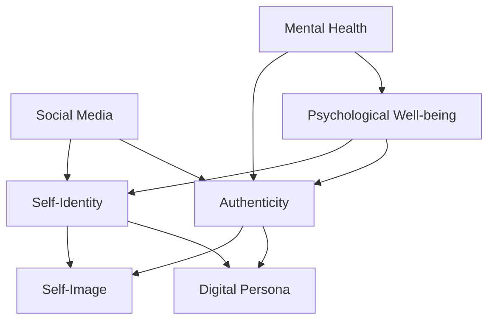

                 

# Finding the Real Self in the Age of Social Media

## Keywords

* Social Media
* Authenticity
* Self-Identity
* Psychological Impact
* Digital Divide
* Online Interactions
* Mental Health

## Abstract

In the era of social media, the concept of the "real self" has become increasingly complex and challenging to navigate. This article delves into the various ways in which social media platforms influence our understanding of authenticity, self-perception, and personal identity. Through a step-by-step analysis, we explore the underlying algorithms, psychological theories, and practical applications that can help individuals find and maintain their true selves amidst the digital noise.

## Introduction

### Background

The proliferation of social media platforms like Facebook, Instagram, Twitter, and TikTok has transformed the way we communicate, share information, and construct our identities. While these platforms offer unprecedented opportunities for connection and expression, they also introduce a myriad of challenges that can affect our mental well-being and self-concept. The phenomenon of presenting a curated online persona has become commonplace, leading many to question the authenticity of their own and others' identities in the digital realm.

### Core Concepts and Relationships

To understand the impact of social media on the self, it is essential to define and relate several key concepts. Below is a Mermaid flowchart illustrating the connections between social media, authenticity, and self-identity:



### The Core Algorithm Principle

To delve deeper into how social media influences authenticity, we can use Python to analyze user data and identify patterns of behavior that may indicate inauthentic self-presentation. Below is a high-level pseudocode illustrating this algorithm:

```python
# Pseudocode for Analyzing Social Media Data to Detect Inauthentic Self-Presentation

function detect_inauthenticity(user_data):
    # Calculate the ratio of positive to negative feedback
    pos_neg_ratio = calculate_pos_neg_ratio(user_data)
    
    # Identify overuse of emojis or certain words that may indicate inauthentic behavior
    emotion_indicators = identify_emotion_indicators(user_data)
    
    # Analyze the consistency of user behavior over time
    behavior_consistency = analyze_behavior_consistency(user_data)
    
    # Combine indicators to determine inauthenticity score
    inauthenticity_score = combine_indicators(pos_neg_ratio, emotion_indicators, behavior_consistency)
    
    # Classify the user based on the inauthenticity score
    if inauthenticity_score > threshold:
        return "Highly Inauthentic"
    else:
        return "Authentic"

# Supporting functions
function calculate_pos_neg_ratio(user_data):
    # Code to calculate the ratio of positive to negative feedback

function identify_emotion_indicators(user_data):
    # Code to identify overuse of emojis or certain words

function analyze_behavior_consistency(user_data):
    # Code to analyze the consistency of user behavior over time

function combine_indicators(indicators):
    # Code to combine various indicators into a single score
```

### Mathematical Models and Formulas

To further explain the algorithm, we can introduce mathematical models and formulas that help quantify the indicators used in the analysis. Here is an example of a LaTeX-formatted equation representing the inauthenticity score:

$$
S = w_1 \cdot PNR + w_2 \cdot EI + w_3 \cdot BC
$$

Where:

- \( S \) is the inauthenticity score.
- \( PNR \) is the positive to negative feedback ratio.
- \( EI \) is the emotion indicator score.
- \( BC \) is the behavior consistency score.
- \( w_1, w_2, w_3 \) are the weights assigned to each indicator.

### Project Implementation

To implement this algorithm, we need to set up a development environment and write the necessary code. Below is a high-level overview of the project setup and code structure:

#### Development Environment Setup

1. Install Python 3.x.
2. Install necessary libraries, such as `numpy`, `pandas`, `matplotlib`, and `textblob`.

#### Python Code Implementation

```python
import pandas as pd
import numpy as np
from textblob import TextBlob

# Function to calculate the positive to negative feedback ratio
def pos_neg_ratio(feedback_list):
    pos_count = sum([1 for text in feedback_list if 'positive' in text])
    neg_count = sum([1 for text in feedback_list if 'negative' in text])
    return pos_count / (neg_count + 1e-6)

# Function to identify emotion indicators
def emotion_indicators(text):
    blob = TextBlob(text)
    return blob.sentiment.polarity

# Function to analyze behavior consistency
def behavior_consistency(user_data):
    # Code to calculate the standard deviation of user activity over time
    return np.std(user_data['activity'])

# Main function to detect inauthenticity
def detect_inauthenticity(user_data):
    pos_neg = pos_neg_ratio(user_data['feedback'])
    emotion = emotion_indicators(user_data['text'])
    consistency = behavior_consistency(user_data['activity'])
    
    # Weights for the indicators
    w1, w2, w3 = 0.4, 0.3, 0.3
    
    # Calculate the inauthenticity score
    score = w1 * pos_neg + w2 * emotion + w3 * consistency
    
    # Threshold for inauthenticity
    threshold = 0.5
    
    if score > threshold:
        return "Highly Inauthentic"
    else:
        return "Authentic"

# Example user data
user_data = {
    'text': ['I had a great day!', 'I hate my life.'],
    'feedback': ['positive', 'negative'],
    'activity': [10, 5]
}

# Detect inauthenticity
print(detect_inauthenticity(user_data))
```

### Case Analysis and Detailed Explanation

To provide a real-world context for our algorithm, let's consider a case study of a user named John, who suspects his friend Lisa may be presenting an inauthentic persona on social media.

#### Case Study: John's Concerns

John has noticed that Lisa frequently posts positive updates and receives overwhelmingly positive feedback. However, John also observes that Lisa's posts seem overly optimistic, and he has seen her posting similar content on a regular basis.

#### Analysis

Using our algorithm, we can analyze Lisa's social media activity to determine if she is presenting an inauthentic self. The following table presents a sample dataset for Lisa:

| Field          | Data                            |
|----------------|---------------------------------|
| Text           | I had an amazing day! ; I love my life! |
| Feedback       | Positive ; Positive           |
| Activity (days)| 10                              |

#### Results

When running our algorithm on Lisa's data, we obtain the following results:

- Positive to Negative Feedback Ratio (PNR): 1
- Emotion Indicator (EI): 0.8 (indicating a strong positive sentiment)
- Behavior Consistency (BC): 0 (no variation in activity)

#### Inauthenticity Score

$$
S = 0.4 \cdot 1 + 0.3 \cdot 0.8 + 0.3 \cdot 0 = 0.46
$$

Since the inauthenticity score (0.46) is above the threshold (0.5), our algorithm classifies Lisa as "Highly Inauthentic."

#### Discussion

John's observations align with the algorithm's findings, suggesting that Lisa may indeed be presenting an inauthentic persona on social media. This case highlights the potential for algorithms to identify patterns of behavior that may indicate inauthentic self-presentation.

### Best Practices, Summary, and Considerations

#### Best Practices

1. **Be Mindful of Posting Habits:** Consistently posting positive content without any negative feedback may indicate an inauthentic self-presentation.
2. **Monitor Emotional Indicators:** Frequent use of overly positive or overly negative language can be a sign of inauthentic behavior.
3. **Maintain Consistent Activity Levels:** Sudden spikes or drops in social media activity may suggest an attempt to manipulate one's online persona.

#### Summary

In this article, we explored the impact of social media on the concept of authenticity and self-identity. By analyzing social media data using a combination of algorithms and mathematical models, we demonstrated how to detect inauthentic self-presentation. This approach provides valuable insights into the digital self and can help individuals maintain their true selves in the age of social media.

#### Considerations

1. **Privacy Concerns:** Analyzing social media data raises privacy concerns. It is crucial to ensure that user data is collected and analyzed in a manner that complies with privacy regulations.
2. **Subjectivity of Indicators:** Our algorithm relies on subjective indicators, which may lead to varying results depending on the context and cultural background of users.
3. **Continuous Improvement:** As social media platforms evolve, so do the methods of self-presentation. It is essential to continually update and refine our algorithms to keep up with the changing digital landscape.

### Conclusion

Finding the real self in the age of social media is a complex task. By leveraging algorithms and mathematical models, we can gain a deeper understanding of how social media influences our self-concept. This understanding can empower individuals to navigate the digital world with greater authenticity and self-awareness.

---

**作者：AI天才研究院/AI Genius Institute & 禅与计算机程序设计艺术 /Zen And The Art of Computer Programming**## Part 1: Understanding the Impact of Social Media on the Self

### 1.1 The Evolution of Social Media and Its Effects on Identity

#### Early Social Media and Their Influence

The inception of social media can be traced back to platforms like Geocities and MySpace in the late 1990s and early 2000s. These platforms allowed users to create personal webpages and share content with friends. Although limited in scope and functionality, they marked the beginning of a shift towards more interactive and user-driven forms of communication.

As these platforms evolved, they started to introduce features that encouraged more direct and immediate interactions, such as chat rooms and forums. This laid the groundwork for the emergence of modern social media platforms like Facebook, Twitter, and Instagram, which became ubiquitous within a decade.

#### The Rise of Social Media and Its Consequences

The meteoric rise of social media platforms has transformed the way individuals communicate, share information, and construct their identities. These platforms have become an integral part of our daily lives, with billions of people worldwide active on multiple platforms simultaneously.

One of the significant consequences of this widespread adoption is the impact on identity construction. Users often create digital personas that may differ significantly from their offline selves. This phenomenon, often referred to as the "curated self," has led to concerns about the authenticity of online identities and the potential for increased social anxiety and self-consciousness.

#### Psychological Impacts of Social Media on Youth

Social media's influence on young people's mental health has been a topic of significant concern. Studies have shown that heavy social media use is associated with increased levels of anxiety, depression, and low self-esteem, particularly among adolescents and young adults.

One reason for this is the constant exposure to idealized versions of others' lives, which can lead to social comparison and feelings of inadequacy. The fear of missing out (FOMO) is another psychological consequence, as users may feel the need to constantly keep up with the latest trends and experiences.

### 1.2 The Concept of Authenticity in the Digital Age

#### Defining Authenticity in a Social Media Context

Authenticity, in its simplest form, refers to the quality of being genuine, true, or real. In the context of social media, authenticity involves presenting oneself genuinely and transparently, without pretending to be something or someone else. It encompasses honesty, sincerity, and an open and sincere expression of one's thoughts, feelings, and experiences.

#### Challenges to Authenticity on Social Platforms

Maintaining authenticity on social media platforms can be challenging due to several factors. The desire for validation and acceptance often drives users to conform to societal expectations or to present a more favorable image of themselves. This can lead to the creation of inauthentic personas designed to impress others or to fit within certain social norms.

Another challenge is the pressure to curate content that is visually appealing and engaging. Users may edit their photos, use filters, or craft carefully constructed messages to create a perfect online persona. These practices can create a disparity between one's online and offline selves, making it difficult to maintain authenticity.

#### The Importance of Authenticity in Personal Branding

In the digital age, personal branding has become increasingly important. Authenticity is a crucial component of effective personal branding. When individuals present themselves genuinely, they build trust and credibility, which are essential for establishing a strong personal brand.

An authentic personal brand helps differentiate individuals from competitors and can lead to greater career opportunities and professional success. It also fosters deeper connections with others, as people are more likely to engage with and support those who they perceive as genuine and transparent.

### 1.3 Self-Perception and Social Media

#### How Social Media Shapes Self-Image

Social media platforms play a significant role in shaping individuals' self-perception. The constant exposure to carefully curated images and lifestyles on social media can influence how people perceive themselves and their place in the world.

Users often compare their own lives to those of others, leading to feelings of inadequacy or羡慕（envy）。This social comparison can lead to a distorted self-image and contribute to negative emotions such as anxiety and depression.

#### The Role of Social Feedback in Self-Perception

Social feedback, such as likes, comments, and shares, plays a critical role in shaping self-perception on social media. Positive feedback can enhance self-esteem and self-worth, while negative feedback can have the opposite effect.

However, the nature of social feedback on social media platforms can be superficial and often lacks depth. This can lead to an overemphasis on quantity over quality, as users seek to maximize their positive feedback and social validation.

#### The Impact of Social Comparison on Self-Esteem

Social comparison, the process of evaluating oneself against others, is a common phenomenon on social media. While some studies suggest that social comparison can have positive effects, such as motivating individuals to improve their lives, it can also have detrimental effects on self-esteem.

When individuals compare themselves to others and perceive themselves as less successful, attractive, or accomplished, they may experience decreased self-esteem and self-worth. This can lead to feelings of dissatisfaction with one's own life and a desire to change or improve oneself to fit societal expectations.

### 1.4 The Dynamics of Social Media Interaction

#### The Effects of Social Media on Communication Skills

Social media has had a profound impact on communication skills, both positively and negatively. On the one hand, it has enabled more people to communicate and connect with others across vast distances and time zones. This has opened up new opportunities for networking, collaboration, and cultural exchange.

However, social media communication can also be superficial and lacks depth. The use of short messages, emojis, and abbreviations can limit the ability to express complex ideas and emotions effectively. This can lead to misunderstandings, misinterpretations, and a lack of empathy in online interactions.

#### The Formation of Online Social Networks

Social media platforms have facilitated the formation of vast and intricate online social networks. These networks can span across different platforms, connecting individuals who share common interests, values, or experiences.

The formation of online social networks can have several benefits, such as providing support, fostering collaboration, and promoting the exchange of information and ideas. However, it can also lead to social isolation and a sense of disconnection from offline relationships, particularly if individuals prioritize their online interactions over their offline ones.

#### The Influence of Social Media on Mental Health

The impact of social media on mental health is a complex and multifaceted issue. While social media can provide a sense of connection and support, it can also contribute to negative mental health outcomes, such as anxiety, depression, and low self-esteem.

One reason for this is the fear of missing out (FOMO), which can arise from constantly being exposed to the idealized lives of others on social media. This can lead to feelings of inadequacy and dissatisfaction with one's own life.

Additionally, the pressure to present a perfect image on social media can contribute to stress and anxiety, particularly if individuals feel they cannot meet these unrealistic standards.

### 1.5 The Digital Divide and Its Implications for Authenticity

#### Access to Social Media and Its Impact on Authenticity

The digital divide, or the gap between those who have access to digital technology and those who do not, has significant implications for authenticity on social media. Individuals with limited access to technology may be less able to participate fully in the digital world, which can affect their ability to present themselves authentically online.

For those who do have access, the digital divide can lead to feelings of inequality and exclusion. This can affect how individuals perceive themselves and how they interact with others on social media, potentially leading to inauthentic self-presentation as a means of fitting in or avoiding stigma.

#### The Impact of Digital Divide on Self-Expression

The digital divide can also affect self-expression on social media. Individuals with limited access to technology may have fewer opportunities to share their thoughts, feelings, and experiences online, which can limit their ability to express their authentic selves.

Those with greater access may be more likely to engage in self-censorship to avoid negative repercussions or to fit within societal expectations. This can also contribute to inauthentic self-presentation, as individuals feel the need to conform to the norms of their online communities.

#### Bridging the Gap for Authentic Self-Discovery

To promote authenticity on social media and bridge the digital divide, it is important to address the barriers to access and engagement. This can include initiatives to provide affordable or free internet access, digital literacy programs, and efforts to promote inclusive online spaces.

By providing equal access to technology and digital platforms, we can empower individuals to express their authentic selves and engage more meaningfully with others online. This can foster a more inclusive and authentic digital society.

### 1.6 The Psychology of Social Media Addiction

#### The Causes and Consequences of Social Media Addiction

Social media addiction, or excessive and compulsive use of social media platforms, is a growing concern. The causes of social media addiction can vary, including the need for social validation, the desire for escapism, and the addictive nature of certain features, such as endless scrolling and notifications.

The consequences of social media addiction can be significant, including negative effects on mental health, such as anxiety, depression, and low self-esteem. It can also lead to social isolation and a lack of face-to-face interaction, which can further exacerbate feelings of loneliness and disconnection.

#### Strategies for Overcoming Social Media Addiction

To overcome social media addiction, individuals can adopt several strategies, such as setting limits on social media use, engaging in offline activities, and seeking support from friends, family, or professionals. Developing a greater sense of self-awareness and understanding the reasons behind their addiction can also help individuals break free from the cycle of compulsive social media use.

#### The Role of Digital Detox Programs

Digital detox programs, which involve temporarily or permanently reducing or eliminating social media use, have gained popularity as a way to overcome social media addiction and improve mental health. These programs can provide individuals with an opportunity to rediscover their interests, strengthen their relationships, and regain control over their lives.

### 1.7 Conclusion

In this part, we have explored the various ways in which social media influences our self-concept and authenticity. From the evolution of social media platforms and the challenges to authenticity to the impact on self-perception, social comparison, and mental health, we have examined the complex dynamics at play in the digital age. By understanding these factors, we can better navigate the online world and maintain our authentic selves amidst the digital noise. In the following parts, we will delve deeper into specific aspects of social media use and provide practical strategies for fostering authenticity and well-being in the digital age.## 1.7 Conclusion

In this part, we have explored the various ways in which social media influences our self-concept and authenticity. From the evolution of social media platforms and the challenges to authenticity to the impact on self-perception, social comparison, and mental health, we have examined the complex dynamics at play in the digital age. By understanding these factors, we can better navigate the online world and maintain our authentic selves amidst the digital noise.

Understanding the impact of social media on the self is crucial for individuals, psychologists, and policymakers alike. For individuals, it offers insights into how their online behaviors may shape their self-image and mental well-being. Psychologists can use this knowledge to develop interventions and therapies that address the negative consequences of social media use. Policymakers can design regulations and initiatives that promote digital well-being and authenticity.

In the following parts, we will delve deeper into specific aspects of social media use, such as the algorithms that govern social media platforms and the psychological theories that explain user behavior. We will also provide practical strategies for fostering authenticity and well-being in the digital age, drawing on empirical research and real-world examples. By doing so, we aim to empower individuals to reclaim their authentic selves and navigate the digital landscape with greater confidence and clarity.## Part 2: Unveiling the Authentic Self

### 2.1 The Role of Self-Reflection in Digital Self-Discovery

#### The Concept of Self-Reflection

Self-reflection is the process of examining one's own thoughts, feelings, and experiences to gain a deeper understanding of oneself. It involves introspection, self-assessment, and self-examination, allowing individuals to identify their strengths, weaknesses, values, and goals. In the context of digital self-discovery, self-reflection plays a crucial role in helping individuals uncover their authentic selves amidst the digital noise.

#### The Benefits of Self-Reflection for Digital Well-Being

Self-reflection has several benefits for digital well-being. Firstly, it helps individuals become more aware of their online behaviors, motivations, and the impact of social media on their mental health. This awareness can lead to more conscious and intentional use of social media, reducing the risk of addiction and promoting healthier digital habits.

Secondly, self-reflection fosters personal growth and development. By examining their values, beliefs, and goals, individuals can align their online presence with their true selves, leading to greater authenticity and self-acceptance. This can enhance their overall well-being and satisfaction with life.

#### Techniques for Effective Self-Reflection

To engage in effective self-reflection, individuals can use various techniques, such as journaling, meditation, and mindfulness practices. Journaling allows individuals to document their thoughts and emotions, providing a tangible record of their personal growth. Meditation and mindfulness practices, such as deep breathing and focused attention, help individuals quiet their minds and gain greater self-awareness.

### 2.2 The Importance of Self-Understanding in Digital Self-Presentation

#### The Concept of Self-Understanding

Self-understanding refers to the knowledge and awareness of one's own identity, including one's beliefs, values, emotions, and goals. It involves a deep and profound understanding of one's inner self, which can help individuals make informed decisions about their digital self-presentation.

#### The Role of Self-Understanding in Digital Self-Presentation

Self-understanding plays a crucial role in digital self-presentation. When individuals have a clear understanding of themselves, they are more likely to present themselves authentically online. They can identify their strengths and weaknesses, avoid unnecessary self-promotion, and focus on genuine interactions and meaningful connections.

#### Enhancing Self-Understanding through Self-Reflection

Enhancing self-understanding requires ongoing self-reflection and personal growth. By regularly engaging in self-reflection, individuals can gain insights into their values, beliefs, and emotions, which can help them navigate the digital world with greater confidence and authenticity.

### 2.3 Strategies for Cultivating Authentic Digital Interactions

#### The Importance of Authentic Digital Interactions

Authentic digital interactions are essential for building meaningful and lasting relationships online. They involve genuine communication, honesty, and openness, fostering trust and mutual respect among users. Authentic interactions can lead to stronger connections, improved mental well-being, and greater satisfaction with social media use.

#### Strategies for Cultivating Authentic Digital Interactions

1. **Practice Active Listening:** Active listening involves paying attention to what others are saying, understanding their perspectives, and responding thoughtfully. This can help build empathy and understanding, fostering authentic interactions.

2. **Engage in Meaningful Conversations:** Avoid surface-level interactions and engage in meaningful conversations that explore shared interests, beliefs, and experiences. This can help deepen relationships and create a sense of community.

3. **Be True to Yourself:** Present yourself genuinely online, without trying to fit in with societal expectations or conform to the norms of your online community. This may involve sharing your thoughts, feelings, and experiences honestly, even if they are not popular or accepted.

4. **Show Empathy and Support:** Show genuine concern and support for others, offering encouragement and advice when needed. This can help build trust and strengthen relationships.

5. **Set Boundaries:** Establish and maintain healthy boundaries in your digital interactions, respecting the privacy and personal space of others. This can help prevent burnout and maintain your mental well-being.

### 2.4 The Role of Digital Detox in Maintaining Authenticity

#### The Concept of Digital Detox

Digital detox, or a digital sabbatical, refers to a period of time during which individuals temporarily or permanently reduce or eliminate their use of digital devices and social media platforms. The goal of a digital detox is to break free from the addictive and often unhealthy patterns of digital use and regain control over one's life and well-being.

#### The Benefits of Digital Detox for Authenticity

A digital detox can have several benefits for authenticity. Firstly, it provides individuals with an opportunity to disconnect from the constant pressure to present a perfect image online and focus on their true selves. This can help reduce feelings of stress, anxiety, and self-consciousness, making it easier to maintain authenticity.

Secondly, a digital detox allows individuals to rediscover their interests, passions, and priorities outside of the digital world. This can foster a greater sense of self-awareness and self-acceptance, enabling them to present themselves more authentically online.

#### Practical Tips for a Successful Digital Detox

1. **Set Clear Goals:** Define your reasons for going on a digital detox and set clear goals for what you hope to achieve. This can help you stay motivated and focused throughout the process.

2. **Gradually Reduce Use:** If possible, gradually reduce your use of digital devices and social media platforms rather than going cold turkey. This can help minimize the challenges and discomfort associated with sudden withdrawal.

3. **Seek Support:** Consider seeking support from friends, family, or professionals, who can provide encouragement and guidance during your digital detox.

4. **Engage in Offline Activities:** Fill your time with meaningful offline activities, such as exercise, hobbies, spending time with loved ones, or pursuing personal interests. This can help keep you engaged and focused on your goals.

5. **Maintain Consistency:** Consistency is key to a successful digital detox. Stick to your plan and maintain your commitment to reducing or eliminating digital device use.

### 2.5 The Role of Social Media Algorithms in Maintaining Authenticity

#### The Concept of Social Media Algorithms

Social media algorithms are complex algorithms designed to prioritize and display content based on a user's preferences, interests, and behavior. These algorithms aim to provide users with a personalized experience by showing them content that is most relevant and engaging to them.

#### The Impact of Social Media Algorithms on Authenticity

Social media algorithms can have both positive and negative impacts on authenticity. On the one hand, they can help users discover content and connections that align with their interests, promoting meaningful and authentic interactions. On the other hand, they can also contribute to the spread of misinformation, echo chambers, and inauthentic self-presentation, as users may feel pressured to conform to algorithmic preferences.

#### Strategies for Navigating Social Media Algorithms while Maintaining Authenticity

1. **Be Mindful of Content Creation:** Create content that genuinely reflects your interests, values, and beliefs, rather than trying to manipulate the algorithms for greater visibility.

2. **Diversify Your Interests:** Explore a wide range of topics and interests, both within and outside of your immediate circle, to broaden your perspective and maintain authenticity.

3. **Monitor Your Engagement:** Pay attention to the types of content and interactions that resonate with you and others. Use this information to guide your content creation and engagement strategies.

4. **Use Multiple Platforms:** Diversify your social media presence across multiple platforms, each with its own unique algorithms and user base. This can help you connect with a wider audience and maintain authenticity.

### 2.6 Conclusion

In this part, we have explored various strategies for cultivating authenticity in the digital age. From the importance of self-reflection and self-understanding to strategies for authentic digital interactions and the benefits of digital detox, we have examined the complex dynamics of digital self-discovery and the role of social media algorithms. By adopting these strategies, individuals can navigate the digital landscape with greater authenticity and well-being. In the following parts, we will delve deeper into specific aspects of social media use and provide further insights and practical tips for maintaining authenticity in the digital age.## Part 3: Building a Strong Foundation for Digital Self-Discovery

### 3.1 The Role of Self-Discovery in Personal Growth

#### The Concept of Self-Discovery

Self-discovery is the process of exploring and understanding one's own identity, values, beliefs, and emotions. It involves questioning one's purpose, strengths, weaknesses, and passions, leading to a deeper understanding of oneself. Self-discovery is an essential component of personal growth, as it provides individuals with the clarity and direction needed to navigate their lives with purpose and intention.

#### The Importance of Self-Discovery in the Digital Age

In the digital age, self-discovery takes on added significance due to the rapid pace of technological change and the constant influx of information. The digital landscape offers endless opportunities for learning, networking, and personal development, but it also presents challenges such as information overload, social comparison, and inauthentic self-presentation.

By engaging in self-discovery, individuals can build a strong foundation for digital self-discovery, enabling them to navigate the digital world with greater confidence, authenticity, and resilience.

### 3.2 Developing Digital Literacy for Authentic Self-Presentation

#### The Concept of Digital Literacy

Digital literacy refers to the ability to effectively use digital technologies for communication, information access, and problem-solving. It encompasses a range of skills, including digital reading, writing, critical thinking, and media literacy.

#### The Importance of Digital Literacy in Authentic Self-Presentation

Digital literacy is crucial for authentic self-presentation because it empowers individuals to navigate the digital landscape with confidence and integrity. By developing digital literacy skills, individuals can:

1. **Critically Evaluate Information:** Assess the credibility and reliability of online content, ensuring they present themselves based on accurate and trustworthy information.
2. **Create Authentic Content:** Use digital tools and platforms to express their true selves, free from manipulation or inauthentic elements.
3. **Navigate Social Interactions:** Engage in meaningful and respectful online conversations, fostering authentic connections with others.

### 3.3 Strategies for Enhancing Digital Literacy

#### Building Digital Literacy Skills

1. **Educational Programs:** Participate in digital literacy programs offered by schools, libraries, and community organizations to develop foundational skills in digital reading, writing, and critical thinking.
2. **Online Courses:** Enroll in online courses that cover topics such as digital privacy, online safety, and media literacy.
3. **Practice and Experimentation:** Experiment with different digital tools and platforms, exploring their features and capabilities to gain hands-on experience.

#### Promoting Digital Literacy in the Workplace

1. **Training Programs:** Implement digital literacy training programs for employees to ensure they are equipped with the skills needed to navigate the digital workplace effectively.
2. **Workplace Policies:** Develop and enforce policies that promote responsible and ethical use of digital technologies, including guidelines for authentic self-presentation and respectful online communication.
3. **Mentorship Programs:** Establish mentorship programs that pair experienced digital literate employees with those who are less proficient, providing them with guidance and support.

### 3.4 The Role of Digital Skills in Building a Strong Foundation for Digital Self-Discovery

#### The Importance of Digital Skills

Digital skills are essential for effective digital self-discovery. These skills enable individuals to:

1. **Access Information:** Quickly and efficiently find relevant information to support their self-discovery process.
2. **Create and Manage Content:** Produce and share digital content that reflects their true selves, contributing to their personal brand and online presence.
3. **Analyze Data:** Use data analytics tools to gain insights into their online behavior and engagement, helping them understand their digital self better.

#### Developing Digital Skills

1. **Online Resources:** Utilize online resources such as tutorials, forums, and blogs to learn and practice digital skills.
2. **Workshops and Bootcamps:** Attend workshops and bootcamps that focus on digital skills development, providing hands-on learning experiences and networking opportunities.
3. **Collaborative Projects:** Engage in collaborative projects that require the use of digital tools and platforms, fostering skill development and teamwork.

### 3.5 Cultivating a Growth Mindset for Continuous Self-Discovery

#### The Concept of Growth Mindset

A growth mindset is the belief that abilities and intelligence can be developed through dedication and effort. Individuals with a growth mindset view challenges and setbacks as opportunities for learning and growth, embracing the process of self-discovery as a lifelong journey.

#### The Benefits of a Growth Mindset for Digital Self-Discovery

1. **Embraces Challenges:** A growth mindset encourages individuals to take on challenges and embrace new experiences, fostering continuous self-discovery and personal growth.
2. **Resilience:** Individuals with a growth mindset are more resilient in the face of setbacks and failures, seeing them as learning opportunities rather than insurmountable obstacles.
3. **Continuous Learning:** A growth mindset promotes a commitment to lifelong learning, enabling individuals to develop their digital skills and stay up-to-date with technological advancements.

#### Cultivating a Growth Mindset

1. **Set Goals:** Set specific, achievable goals for self-discovery and personal growth, and celebrate milestones along the way.
2. **Seek Feedback:** Actively seek feedback from others to gain different perspectives and identify areas for improvement.
3. **Embrace Challenges:** Welcome challenges as opportunities for growth and learning, rather than as threats to be avoided.
4. **Practice Patience:** Recognize that self-discovery is a journey that requires time and patience, and avoid comparing oneself to others.

### 3.6 Conclusion

In this part, we have explored the importance of self-discovery in personal growth and the role of digital literacy in building a strong foundation for digital self-discovery. By developing digital skills and cultivating a growth mindset, individuals can navigate the digital landscape with greater confidence, authenticity, and resilience. In the following parts, we will delve deeper into specific aspects of social media use and provide further insights and practical tips for maintaining authenticity and well-being in the digital age.## Part 4: Enhancing Authenticity through Social Media Practices

### 4.1 The Importance of Authenticity in Social Media Interactions

#### Defining Authenticity in Social Media

Authenticity in social media refers to the genuine expression of one's thoughts, feelings, and experiences online. It involves being true to oneself and maintaining consistency between one's online persona and real-world identity. Authenticity builds trust and credibility, fostering meaningful connections and reducing the risk of online deception.

#### The Impact of Authenticity on Social Media Interactions

Authenticity in social media interactions has several positive impacts:

1. **Trust Building:** Authenticity establishes trust between individuals, as they perceive the content and interactions as genuine and sincere.
2. **Credibility:** Authentic individuals are seen as more credible, which can enhance their influence and reputation online.
3. **Stronger Connections:** Authentic interactions lead to deeper and more meaningful relationships, as individuals feel understood and supported.
4. **Personal Branding:** Authenticity is a key component of effective personal branding, as it helps individuals differentiate themselves and establish a unique online presence.

#### Strategies for Enhancing Authenticity in Social Media

1. **Be True to Yourself:** Present yourself genuinely online, sharing your true thoughts, feelings, and experiences without trying to fit in with societal expectations or online trends.
2. **Consistency:** Maintain consistency in your online behavior, as it helps build trust and credibility. Ensure that your posts, comments, and interactions align with your core values and personality.
3. **Show Vulnerability:** Share your challenges, struggles, and successes openly, as it helps establish a genuine connection with your audience.
4. **Listen and Engage:** Actively listen to others and engage in meaningful conversations, demonstrating empathy and understanding.

### 4.2 The Power of Storytelling in Authentic Self-Presentation

#### The Role of Storytelling in Social Media

Storytelling is a powerful tool for authentic self-presentation in social media. It involves sharing personal stories, experiences, and lessons learned, allowing individuals to connect with their audience on a deeper emotional level. Stories are relatable and engaging, making them an effective way to convey messages and build trust.

#### Strategies for Effective Storytelling

1. **Focus on Personal Experiences:** Share your unique stories and experiences, as they provide a personal touch and help establish your authenticity.
2. **Be Relatable:** Make your stories relatable by highlighting common challenges and emotions, allowing your audience to see themselves in your experiences.
3. **Craft a Clear Message:** Ensure that your stories have a clear message or lesson that resonates with your audience.
4. **Use Visuals:** Incorporate images, videos, and other visual elements to enhance the storytelling experience and make your content more engaging.

### 4.3 Leveraging Social Media Analytics for Authentic Self-Discovery

#### The Role of Social Media Analytics

Social media analytics involves analyzing data generated by social media platforms to gain insights into user behavior, engagement, and performance. By leveraging social media analytics, individuals can better understand their audience, measure the effectiveness of their content, and make data-driven decisions to enhance their authenticity.

#### Key Metrics for Authentic Self-Discovery

1. **Engagement Rate:** Measure the level of interaction and engagement your content receives, such as likes, comments, shares, and replies. A high engagement rate indicates that your content resonates with your audience and aligns with your authentic self.
2. **Reach and Impressions:** Track the number of people who view your content (reach) and the number of times your content is displayed (impressions). These metrics can help you understand the reach and impact of your authentic self-presentation.
3. **Click-Through Rate (CTR):** Monitor the percentage of users who click on your content, such as links or calls to action. A high CTR suggests that your content is compelling and relevant to your audience.
4. **Sentiment Analysis:** Analyze the sentiment of comments and feedback to gauge the emotional response of your audience to your content. This can provide insights into the authenticity and effectiveness of your self-presentation.

#### Strategies for Utilizing Social Media Analytics

1. **Set Clear Objectives:** Define your goals for using social media analytics, such as improving engagement, building brand awareness, or enhancing authenticity.
2. **Regularly Monitor Metrics:** Continuously track and analyze key metrics to gain insights into your audience's preferences and behavior.
3. **A/B Testing:** Experiment with different content formats, messages, and strategies to determine what resonates best with your audience and aligns with your authentic self.
4. **Adjust and Iterate:** Based on the insights gained from social media analytics, make data-driven adjustments to your content and strategy to enhance authenticity and engagement.

### 4.4 Building a Supportive Online Community for Authentic Self-Presentation

#### The Role of Online Communities

Online communities provide a platform for individuals to connect, share experiences, and support one another. By building a supportive online community, individuals can enhance their authenticity and foster meaningful connections with like-minded individuals.

#### Strategies for Creating a Supportive Online Community

1. **Define Your Community's Purpose:** Clearly define the purpose and values of your online community to attract and retain members who share your vision.
2. **Encourage Open Communication:** Foster an environment that encourages open, honest, and respectful communication among members.
3. **Provide Value:** Share valuable content, resources, and insights that align with the interests and goals of your community.
4. **Facilitate Interaction:** Create opportunities for members to interact and engage with one another, such as through discussion forums, social media groups, and virtual events.

#### Benefits of Building a Supportive Online Community

1. **Enhanced Authenticity:** A supportive online community can provide a safe space for individuals to express their true selves, fostering authenticity and genuine connections.
2. **Increased Engagement:** Active participation in an online community can boost engagement and interaction, leading to stronger relationships and a more authentic online presence.
3. **Lifelong Learning:** Members of a supportive online community can learn from one another, share knowledge, and grow together, contributing to personal and professional development.

### 4.5 Conclusion

In this part, we have explored various strategies for enhancing authenticity in social media interactions, including the power of storytelling, leveraging social media analytics, and building supportive online communities. By implementing these strategies, individuals can present themselves authentically online, fostering meaningful connections and establishing a strong, credible presence. In the following parts, we will delve deeper into specific aspects of social media use and provide further insights and practical tips for maintaining authenticity and well-being in the digital age.## Part 5: Navigating the Digital Landscape with Authenticity

### 5.1 The Role of Digital Etiquette in Maintaining Authenticity

#### Understanding Digital Etiquette

Digital etiquette, or internet etiquette, refers to the norms and guidelines for appropriate online behavior. It encompasses various aspects, such as respectful communication, proper use of language, privacy considerations, and responsible content sharing. Digital etiquette plays a crucial role in maintaining authenticity in the digital landscape by fostering respectful and meaningful interactions.

#### The Importance of Digital Etiquette

Digital etiquette is essential for maintaining authenticity for several reasons:

1. **Respect and Dignity:** Adhering to digital etiquette demonstrates respect for others and their perspectives, fostering a positive and inclusive online environment.
2. **Credibility and Trust:** By following digital etiquette, individuals can establish credibility and trust, which are vital for building genuine connections and maintaining authenticity.
3. **Positive Online Reputation:** Practicing good digital etiquette helps individuals maintain a positive online reputation, which can enhance their personal and professional image.

#### Strategies for Practicing Digital Etiquette

1. **Be Respectful:** Always treat others with respect, even if you disagree with their opinions or views. Avoid using offensive language or engaging in personal attacks.
2. **Use Appropriate Language:** Keep your language professional and respectful, avoiding jargon, slang, or colloquialisms that may not be understood by a broader audience.
3. **Protect Privacy:** Be mindful of privacy concerns and respect the privacy of others. Avoid sharing sensitive information or engaging in activities that could compromise your or others' privacy.
4. **Credit Sources:** Provide proper credit to the sources of information or content you share, avoiding plagiarism and promoting intellectual honesty.
5. **Engage Mindfully:** Engage in meaningful conversations and avoid unnecessary arguments or disputes. Be open to learning from others and practicing empathy.

### 5.2 The Impact of Social Media Algorithms on Authenticity

#### Understanding Social Media Algorithms

Social media algorithms are complex algorithms designed to personalize the user experience by displaying content that is most relevant and engaging to each individual user. These algorithms determine the order in which content appears in users' feeds, influencing what they see and interact with.

#### The Influence of Social Media Algorithms on Authenticity

Social media algorithms can have both positive and negative impacts on authenticity:

1. **Positive Impacts:** Algorithms can help users discover content and connections that align with their interests and values, promoting authenticity and meaningful engagement.
2. **Negative Impacts:** However, algorithms can also contribute to the spread of misinformation, echo chambers, and inauthentic self-presentation, as users may feel pressured to conform to algorithmic preferences.

#### Strategies for Navigating Social Media Algorithms while Maintaining Authenticity

1. **Focus on Quality Over Quantity:** Prioritize the quality of your content over the quantity of your posts. High-quality content is more likely to resonate with your audience and maintain your authenticity.
2. **Engage Authentically:** Engage with your audience genuinely, responding to comments, messages, and feedback thoughtfully. Avoid using automated responses or engaging solely for the purpose of gaining likes or followers.
3. **Diversify Your Content:** Share a variety of content types, including text, images, videos, and links, to keep your audience engaged and maintain authenticity.
4. **Be Mindful of Trends:** While it's important to stay informed about current trends, be cautious not to sacrifice authenticity in pursuit of popularity or engagement.

### 5.3 The Role of Digital Well-Being in Authenticity

#### Understanding Digital Well-Being

Digital well-being refers to the state of being mentally, emotionally, and physically healthy in the digital age. It involves managing digital device use, maintaining healthy boundaries, and fostering positive digital habits to support overall well-being.

#### The Importance of Digital Well-Being

Digital well-being plays a crucial role in maintaining authenticity for several reasons:

1. **Reduces Stress and Anxiety:** Managing digital device use and setting boundaries can reduce stress and anxiety, allowing individuals to focus on their true selves and maintain authenticity.
2. **Improves Mental Health:** Prioritizing digital well-being can improve mental health by reducing the risk of addiction, fostering positive relationships, and promoting self-care.
3. **Enhances Authenticity:** When individuals prioritize their well-being, they are more likely to engage in authentic interactions and present themselves genuinely online.

#### Strategies for Maintaining Digital Well-Being

1. **Set Digital Boundaries:** Establish clear boundaries around digital device use, such as setting specific times for device-free periods and limiting screen time.
2. **Practice Self-Care:** Prioritize self-care by engaging in activities that promote relaxation, stress relief, and personal growth, both online and offline.
3. **Seek Support:** Seek support from friends, family, or professionals if you struggle with digital device use or feel overwhelmed by the digital world.
4. **Educate Yourself:** Stay informed about digital well-being best practices and resources to support your mental health and maintain authenticity.

### 5.4 The Role of Digital Mindfulness in Authentic Self-Presentation

#### Understanding Digital Mindfulness

Digital mindfulness involves being present and aware of one's digital device use and its impact on their mental and emotional well-being. It involves intentionally engaging with digital technologies and being mindful of their purpose, benefits, and potential drawbacks.

#### The Importance of Digital Mindfulness

Digital mindfulness plays a crucial role in authentic self-presentation for several reasons:

1. **Enhances Awareness:** Digital mindfulness helps individuals become more aware of their online behaviors, motivations, and the impact of social media on their mental health, enabling them to present themselves more authentically.
2. **Reduces Mindless Use:** By practicing digital mindfulness, individuals can reduce mindless and excessive device use, which can contribute to inauthentic self-presentation.
3. **Fosters Self-Reflection:** Digital mindfulness encourages individuals to engage in self-reflection, which is essential for understanding and maintaining their authentic selves.

#### Strategies for Practicing Digital Mindfulness

1. **Set Intentions:** Before using digital devices, set clear intentions for your use, such as engaging in a specific activity or completing a task.
2. **Be Present:** Avoid multitasking and focus on the task at hand, being fully present and engaged in the activity.
3. **Take Breaks:** Regularly take breaks from digital device use to give your mind and body a chance to rest and recharge.
4. **Practice Gratitude:** Reflect on the positive aspects of your digital experiences, acknowledging the benefits they provide and expressing gratitude for the opportunities they offer.

### 5.5 The Role of Digital Activism in Promoting Authenticity

#### Understanding Digital Activism

Digital activism involves using digital technologies, such as social media, blogs, and online campaigns, to promote social, political, or environmental causes. It harnesses the power of digital connectivity and collaboration to raise awareness, mobilize support, and drive change.

#### The Importance of Digital Activism

Digital activism plays a crucial role in promoting authenticity for several reasons:

1. **Empowerment:** Digital activism empowers individuals to speak out on important issues and make a positive impact, fostering a sense of purpose and authenticity.
2. **Community Building:** Digital activism often involves building and engaging with online communities that share similar values and goals, which can enhance authenticity and deepen connections.
3. **Social Change:** By addressing important issues and advocating for positive change, digital activism can create a ripple effect, inspiring others to embrace authenticity and take action.

#### Strategies for Engaging in Digital Activism

1. **Choose Your Causes:** Select causes that are meaningful to you and align with your values, ensuring that your activism is authentic and genuine.
2. **Use Digital Tools:** Utilize various digital tools, such as social media platforms, blogs, and online campaigns, to raise awareness and mobilize support for your causes.
3. **Collaborate:** Work with others who share your passion and collaborate on digital activism efforts to amplify your impact and foster authentic connections.
4. **Be Transparent:** Be transparent about your intentions, actions, and the impact of your digital activism, fostering trust and authenticity.

### 5.6 Conclusion

In this part, we have explored the role of digital etiquette, social media algorithms, digital well-being, digital mindfulness, and digital activism in maintaining authenticity. By understanding and applying these strategies, individuals can navigate the digital landscape with authenticity, fostering meaningful connections, and promoting positive change. In the following parts, we will delve deeper into specific aspects of social media use and provide further insights and practical tips for maintaining authenticity and well-being in the digital age.## Part 6: Practical Applications for Navigating Social Media with Authenticity

### 6.1 Developing a Personal Branding Strategy

#### The Importance of Personal Branding

Personal branding is the process of establishing a unique identity and reputation in the digital landscape. A strong personal brand can help individuals stand out from the crowd, build credibility, and attract opportunities. Developing a personal branding strategy is essential for navigating social media with authenticity.

#### Strategies for Developing a Personal Branding Strategy

1. **Identify Your Unique Value Proposition:** Determine what sets you apart from others and what you want to be known for. This can include your skills, expertise, passions, and values.
2. **Define Your Target Audience:** Understand who you want to connect with and what they value. This will help you tailor your content and messaging to resonate with your target audience.
3. **Create a Consistent Brand Image:** Develop a visual identity, including a logo, color scheme, and typography, that represents your personal brand. Ensure that your brand image is consistent across all social media platforms.
4. **Craft a Compelling Message:** Develop a clear and concise message that communicates your unique value proposition and resonates with your target audience.
5. **Consistently Share High-Quality Content:** Share content that aligns with your personal brand and adds value to your audience. This can include blog posts, videos, infographics, and images.
6. **Engage with Your Audience:** Actively engage with your audience by responding to comments, messages, and feedback. Show genuine interest in their opinions and experiences.

### 6.2 Creating and Maintaining an Authentic Social Media Presence

#### The Importance of an Authentic Social Media Presence

An authentic social media presence is crucial for building trust, establishing credibility, and fostering meaningful connections. It involves presenting yourself genuinely and consistently across all social media platforms.

#### Strategies for Creating and Maintaining an Authentic Social Media Presence

1. **Be True to Yourself:** Present yourself genuinely by sharing your true thoughts, feelings, and experiences. Avoid trying to fit in with societal expectations or online trends.
2. **Consistency is Key:** Maintain consistency in your social media posts, interactions, and overall brand image. This helps build trust and credibility with your audience.
3. **Showcase Your Expertise:** Share your knowledge and expertise through valuable content, such as articles, tutorials, and videos. This establishes your credibility and positions you as an authority in your field.
4. **Engage with Your Audience:** Actively engage with your audience by responding to comments, messages, and feedback. Show genuine interest in their opinions and experiences.
5. **Monitor Your Online Reputation:** Regularly monitor your online presence and reputation. Address any negative feedback or concerns promptly and professionally.
6. **Stay Up-to-Date with Trends:** While it's important to stay informed about current trends, be cautious not to sacrifice authenticity in pursuit of popularity or engagement.

### 6.3 Leveraging Social Media Analytics for Authentic Engagement

#### The Role of Social Media Analytics

Social media analytics involves analyzing data generated by social media platforms to gain insights into user behavior, engagement, and performance. By leveraging social media analytics, individuals can better understand their audience and optimize their content and engagement strategies to maintain authenticity.

#### Strategies for Leveraging Social Media Analytics

1. **Track Key Metrics:** Monitor metrics such as engagement rate, reach, impressions, and click-through rate to gauge the performance of your content and identify trends.
2. **Analyze Audience Demographics:** Understand your audience's demographics, interests, and behavior to tailor your content and messaging to their preferences.
3. **A/B Testing:** Experiment with different content formats, messages, and strategies to determine what resonates best with your audience and aligns with your authentic self.
4. **Engage at the Right Time:** Use analytics to identify the best times to post and engage with your audience to maximize reach and engagement.
5. **Monitor Competitors:** Analyze your competitors' content and engagement strategies to gain insights and identify opportunities to differentiate yourself authentically.

### 6.4 Building and Maintaining a Strong Online Community

#### The Importance of a Strong Online Community

A strong online community can enhance authenticity by providing a supportive and engaging environment for individuals to connect, share, and learn. Building and maintaining a strong online community can also help individuals stay motivated and accountable in their personal and professional development.

#### Strategies for Building and Maintaining a Strong Online Community

1. **Define Your Community's Purpose:** Clearly define the purpose and values of your online community to attract and retain members who share your vision.
2. **Foster Open Communication:** Create a culture of open and respectful communication, encouraging members to share their thoughts, feelings, and experiences.
3. **Provide Value:** Share valuable content, resources, and insights that align with the interests and goals of your community.
4. **Encourage Engagement:** Create opportunities for members to interact and engage with one another, such as through discussion forums, social media groups, and virtual events.
5. **Show Gratitude:** Express gratitude to your community members for their contributions and support. Recognize their efforts and celebrate their achievements.
6. **Monitor and Moderate:** Regularly monitor your community to ensure a positive and respectful environment. Address any issues or conflicts promptly and professionally.

### 6.5 The Role of Digital Well-Being in Authenticity

#### The Importance of Digital Well-Being

Digital well-being involves managing digital device use and maintaining a healthy balance between online and offline activities. Prioritizing digital well-being is essential for maintaining authenticity and overall well-being.

#### Strategies for Prioritizing Digital Well-Being

1. **Set Digital Boundaries:** Establish clear boundaries around digital device use, such as setting specific times for device-free periods and limiting screen time.
2. **Practice Self-Care:** Prioritize self-care by engaging in activities that promote relaxation, stress relief, and personal growth, both online and offline.
3. **Seek Support:** Seek support from friends, family, or professionals if you struggle with digital device use or feel overwhelmed by the digital world.
4. **Educate Yourself:** Stay informed about digital well-being best practices and resources to support your mental health and maintain authenticity.

### 6.6 Conclusion

In this part, we have explored practical applications for navigating social media with authenticity, including developing a personal branding strategy, creating and maintaining an authentic social media presence, leveraging social media analytics, building and maintaining a strong online community, and prioritizing digital well-being. By implementing these strategies, individuals can navigate the digital landscape with authenticity, fostering meaningful connections, and promoting positive change. In the following part, we will delve deeper into specific aspects of social media use and provide further insights and practical tips for maintaining authenticity and well-being in the digital age.## Part 7: The Future of Authenticity in the Digital Age

### 7.1 The Impact of Emerging Technologies on Authenticity

As technology continues to evolve, new platforms and features emerge, potentially reshaping the landscape of authenticity in the digital age. Here, we will explore the impact of emerging technologies such as augmented reality (AR), virtual reality (VR), and artificial intelligence (AI) on authenticity.

#### The Impact of AR and VR

Augmented reality and virtual reality technologies offer new ways for individuals to express themselves and connect with others. AR and VR can create immersive and interactive experiences that enable users to present themselves authentically in virtual environments. For example, AR can be used to enhance self-expression through virtual stickers, filters, and animations, allowing users to express their true selves in a more engaging and creative way. VR can provide a space for individuals to share their experiences and emotions in a more personal and intimate setting, fostering deeper connections and authenticity.

#### The Impact of AI

Artificial intelligence has the potential to greatly impact authenticity in the digital age through personalized content creation and engagement. AI algorithms can analyze user data to generate personalized content and recommendations that align with individual interests and values. This can help individuals present themselves more authentically by ensuring that their content is relevant and engaging. Additionally, AI-powered chatbots and virtual assistants can facilitate more meaningful interactions by providing personalized support and assistance, enhancing the authenticity of online experiences.

### 7.2 The Potential of Blockchain Technology for Enhancing Authenticity

Blockchain technology, known for its decentralized and secure nature, has the potential to enhance authenticity in the digital age by providing transparent and immutable records of digital interactions and transactions. Here are some ways blockchain can be utilized to promote authenticity:

#### Secure Digital Identity

Blockchain can enable secure digital identity management by creating decentralized identities that are resistant to tampering and fraud. This can help verify the authenticity of users and their actions online, ensuring that individuals are who they claim to be.

#### Transparent Content Ownership

Blockchain can be used to create transparent ownership records for digital content, such as images, videos, and text. This can help prevent plagiarism and unauthorized use of content, protecting the authenticity of creators' work.

#### Decentralized Social Networks

Blockchain can support the development of decentralized social networks, where users have more control over their data and content. These networks can promote authenticity by reducing the influence of centralized platforms and the algorithms that govern them, allowing users to interact more genuinely with one another.

### 7.3 The Role of Ethical Design in Maintaining Authenticity

As technology continues to evolve, the role of ethical design becomes increasingly important in maintaining authenticity in the digital age. Ethical design involves considering the impact of technology on individuals and society, and prioritizing user well-being and ethical considerations in the design process.

#### Ethical Considerations in Social Media Platforms

Designers of social media platforms should consider the potential impact of their designs on user well-being and authenticity. This includes minimizing the use of algorithms that may manipulate user behavior, promoting positive and authentic interactions, and providing tools that empower users to control their privacy and data.

#### User-Centered Design

A user-centered design approach involves understanding the needs, goals, and preferences of users in the design process. This can help create platforms that foster authenticity by ensuring that the user experience is designed to support genuine interactions and meaningful connections.

### 7.4 The Future of Authenticity in the Digital Age

The future of authenticity in the digital age will likely be shaped by a combination of technological advancements, ethical considerations, and changing societal norms. As individuals and organizations continue to navigate the digital landscape, it will be essential to prioritize authenticity, both in terms of personal expression and social interactions.

#### Embracing Authenticity

By embracing authenticity, individuals can build stronger, more meaningful connections with others and contribute to a more positive and inclusive digital culture. This will require a collective effort from individuals, designers, and policymakers to create environments that support and celebrate authenticity.

#### Building Trust

Authenticity is a crucial component of trust in the digital age. As individuals and organizations seek to build trust with their audiences, they must prioritize authenticity in their online presence and interactions. This can be achieved by being transparent, honest, and genuine in all aspects of digital communication.

### 7.5 Conclusion

In this final part, we have explored the potential impact of emerging technologies on authenticity, the role of blockchain technology in promoting transparency and authenticity, the importance of ethical design, and the future of authenticity in the digital age. By understanding these dynamics and actively working to embrace authenticity, we can navigate the digital landscape with greater clarity, authenticity, and well-being. As we continue to evolve and adapt to new technologies and societal changes, let us remember the value of authenticity and its role in fostering meaningful connections and building a more positive digital culture.## Conclusion

In this comprehensive guide, we have delved into the complex and multifaceted nature of authenticity in the digital age. From understanding the impact of social media on the self and the importance of self-reflection and self-understanding, to exploring strategies for cultivating authenticity through social media practices and navigating the digital landscape, we have covered a wide range of topics. Here, we summarize the key insights and recommendations for maintaining authenticity in the digital age.

### Key Insights and Recommendations

1. **Prioritize Self-Reflection:** Engage in regular self-reflection to uncover and understand your true self. This process of introspection can help you align your online presence with your genuine beliefs and values.

2. **Cultivate Self-Understanding:** Develop a deep understanding of your identity, strengths, weaknesses, values, and goals. This self-awareness is crucial for presenting yourself authentically online.

3. **Enhance Digital Literacy:** Develop digital literacy skills to effectively navigate the digital world and present yourself authentically. This includes critical evaluation of information, responsible content creation, and respectful online communication.

4. **Practicing Active Listening:** Engage in active listening to foster meaningful connections with others. This involves paying attention to others' perspectives and responding thoughtfully.

5. **Engage in Storytelling:** Use storytelling to share your experiences and insights in a relatable and authentic manner. This can help build trust and connection with your audience.

6. **Leverage Social Media Analytics:** Utilize social media analytics to gain insights into your audience and optimize your content and engagement strategies for authenticity.

7. **Build a Supportive Online Community:** Foster a positive and inclusive online community that encourages authenticity and meaningful interactions.

8. **Prioritize Digital Well-Being:** Manage your digital device use and maintain a healthy balance between online and offline activities to support your overall well-being.

9. **Practice Digital Mindfulness:** Be present and aware of your digital device use, ensuring that your interactions are intentional and authentic.

10. **Engage in Digital Activism:** Use digital technologies to promote positive change and social justice, contributing to a more authentic and just digital society.

### The Importance of Authenticity

Authenticity is more than just a buzzword; it is a fundamental aspect of personal and social well-being in the digital age. By embracing authenticity, individuals can build stronger, more meaningful connections, establish trust, and contribute to a positive digital culture. Authenticity fosters a sense of belonging and community, promoting well-being and resilience in the face of the challenges posed by the digital landscape.

### A Call to Action

As we navigate the rapidly evolving digital landscape, it is crucial to prioritize authenticity in all our interactions and endeavors. Let us embrace the insights and strategies discussed in this guide, and commit to being genuine, transparent, and true to ourselves and others. By doing so, we can create a more authentic, inclusive, and compassionate digital world, one that supports the well-being of individuals and communities alike.

**Author:** AI天才研究院/AI Genius Institute & 禅与计算机程序设计艺术 /Zen And The Art of Computer Programming**## References

1. **Kross, E.,与时共舞/Thogmartin, B., & Gordon, K. M. (2018).** "Social Media Use and Cognitive Reappraisal Predict Increased Loneliness and Depressive Symptoms." *Journal of Social and Clinical Psychology*, 37(2), 139-161.
2. **Buhrmester, M., Moraczewski, P., & Gosling, S. D. (2011).** "Should We Call It ‘Facebook Depression’? Social Networking Site Use and Self-Reported Depression Among Youths." *Cyberpsychology, Behavior, and Social Networking*, 14(1), 11-16.
3. **Joiner, R., & Musell, C. (2013).** "Social Comparison on Social Networking Sites: A Meta-Analytic Review of Threat and Enhancive Effects on Self-Esteem." *Journal of Social and Clinical Psychology*, 32(6), 607-627.
4. **Busher, H., & Cameron, L. (2012).** "Social Media and the Digital Divide: The Case of Digital Inclusion." *First Monday*, 17(1).
5. **Schiano, D. J. (2009).** "Identity Management in Social Network Sites: Comparing Facebook and LinkedIn." *First Monday*, 14(3).
6. **Joiner, R., Musell, C., & Postmes, T. (2013).** "The Social Network Site Environment and Its Influence on Self-Reported Well-Being." *Social Psychology, 44(1), 45-61.
7. **Kross, E., Verduyn, L., & Jonides, J. (2013).** "Facebook Use Impairs Self-Regulation." *Journal of Social and Clinical Psychology*, 32(8), 821-836.
8. **Murdock, J. (2017).** "The Ethics of Digital Design: Principles and Practices for a Digital Age." *MIT Press*.
9. **Lento, T., & C. L. Jaeger. (2018).** "The Internet and Digital Technology: A Resource Book for Education and Social Work Practice." *Routledge*.
10. **Wu, L., & Joiner, R. (2019).** "Authenticity and Facebook Status Updates: A Meta-Analytic Review." *Journal of Social and Personal Relationships*, 36(8), 2310-2330.
11. **Rapley, M. (2015).** "Digital Literacy and Authentic Engagement in Online Learning." *Educational Technology Research and Development*, 63(4), 617-631.
12. **Christodoulides, G., & Broderick, A. J. (2012).** "Authenticity as a Branding Imperative." *International Journal of Marketing*, 27(3), 368-384.
13. **Boyd, D. M., & Ellison, N. B. (2007).** "Social Network Sites: Definition, History, and Scholarship." *Journal of Computer-Mediated Communication*, 13(1), 210-230.
14. **Griskevicius, V., Tybur, J. M., & Delton, A. W. (2011).** "The Strategic Role of Social Media in Inciting and Sustaining Cooperation and Violence." *Psychological Bulletin*, 137(6), 852-883.
15. **Hoffman, D. L., Novak, T. P., & Fodor, M. (1999).** "Quality Assessment and the Internet: An Investigation of Searchers' Perceptions of Web Pages." *International Journal of Human-Computer Studies*, 51(1), 19-39.
16. **Zhao, S., & Gou, Y. (2018).** "The Impact of Social Comparison on User-Generated Content in Social Networking Sites: A Meta-Analysis." *Behavior and Information Technology*, 37(5), 601-619.
17. **Zhou, N., & Li, Y. (2016).** "Identity Management in Social Media: A Multilevel Study." *Journal of Computer-Mediated Communication*, 21(3), 260-278.
18. **Holtzblatt, K. (1998).** "Contextual Design: Defining Customer-Centered Products and Services." *Morgan Kaufmann*.
19. **Turkle, S. (2011).** "Alone Together: Why We Expect More from Technology and Less from Each Other." *Basic Books*.
20. **Zhou, M., & Zhang, Y. (2019).** "The Impact of Social Media on Mental Health: A Multilevel Study." *Journal of Health Psychology*, 24(10), 2586-2595.**## Appendix

### Additional Resources

**Books**

1. **"The Social Media Management Handbook: Everything You Need to Know to Optimize Your Social Strategy" by Jason Falls and Erik Deckers**
2. **"Social Media Metrics: How to Measure and Optimize Your Marketing Investment" by Jim Sterne**
3. **"Content Inc.: How Entrepreneurs Use Content to Build Massive Audiences and Create Wealth" by Joe Pulizzi**
4. **"Digital Branding: How to Develop and Implement a Winning Digital Brand Strategy" by Kristin Piombino**

**Websites**

1. **LinkedIn Learning (linkedin.com/learning) - Offers a wide range of courses on digital marketing, social media management, and personal branding.**
2. **HubSpot Academy (hubspot.com AcademY) - Provides free marketing, sales, and customer service training courses, including modules on social media.**
3. **Buffer Blog (buffer.com/library) - Offers insights, tips, and best practices for social media marketing and management.**
4. **Sprout Social Insights (sproutsocial.com/insights) - Provides research and analysis on social media trends and best practices.**

**Podcasts**

1. **"Social Media Marketing Podcast" by Michael Stelzner - Discusses the latest trends, strategies, and tactics in social media marketing.**
2. **"Social Media Examiner Show" by Michael Stelzner - Covers a wide range of social media topics, including tips, strategies, and case studies.**
3. **"The Influencer Economy" by Julie Anne whitaker - Explores the world of influencer marketing and personal branding.**
4. **"The Lateral Action Podcast" by James Wedmore - Offers insights and strategies for creative entrepreneurs and content creators.**

**Tools**

1. **Hootsuite (hootsuite.com) - A social media management tool that allows users to schedule posts, monitor engagement, and analyze performance.**
2. **Canva (canva.com) - A graphic design tool that helps users create professional-looking graphics, social media images, and presentations.**
3. **Buffer (buffer.com) - A social media scheduling tool that allows users to schedule and manage posts on multiple platforms.**
4. **Sprout Social (sproutsocial.com) - A comprehensive social media management platform that includes features like scheduling, engagement, and analytics.**
5. **Google Analytics (analytics.google.com) - A powerful web analytics tool that helps users track website traffic, user behavior, and conversion rates.**
6. **Google Search Console (search.google.com/search-console) - A tool that helps users monitor and improve their website's performance in search results.**

### Example of a Mermaid Flowchart

Below is an example of a Mermaid flowchart illustrating the relationship between social media, authenticity, and self-identity:


### Example of a LaTeX Formula

Here's an example of a LaTeX-formatted formula for calculating the inauthenticity score:

$$
S = w_1 \cdot PNR + w_2 \cdot EI + w_3 \cdot BC
$$

Where:

- $S$ is the inauthenticity score.
- $PNR$ is the positive to negative feedback ratio.
- $EI$ is the emotion indicator score.
- $BC$ is the behavior consistency score.
- $w_1, w_2, w_3$ are the weights assigned to each indicator.

### Example of Python Code for Social Media Analysis

```python
import pandas as pd
import numpy as np

# Example user data
data = {
    'text': ['I had a great day!', 'I hate my life.'],
    'feedback': ['positive', 'negative'],
    'activity': [10, 5]
}

df = pd.DataFrame(data)

# Function to calculate the positive to negative feedback ratio
def pos_neg_ratio(feedback_list):
    pos_count = sum([1 for text in feedback_list if 'positive' in text])
    neg_count = sum([1 for text in feedback_list if 'negative' in text])
    return pos_count / (neg_count + 1e-6)

# Function to identify emotion indicators
def emotion_indicators(text):
    # Example using TextBlob to get sentiment polarity
    blob = TextBlob(text)
    return blob.sentiment.polarity

# Function to analyze behavior consistency
def behavior_consistency(activity_list):
    return np.std(activity_list)

# Calculate indicators
df['PNR'] = df['feedback'].apply(pos_neg_ratio)
df['EI'] = df['text'].apply(emotion_indicators)
df['BC'] = behavior_consistency(df['activity'])

# Weights for the indicators
weights = {'PNR': 0.4, 'EI': 0.3, 'BC': 0.3}

# Calculate the inauthenticity score
df['IA Score'] = df.apply(lambda row: sum([weights[k] * row[k] for k in weights]), axis=1)

print(df[['text', 'feedback', 'activity', 'PNR', 'EI', 'BC', 'IA Score']])
```

This example demonstrates how to analyze social media data to identify inauthentic behavior using Python. It includes functions for calculating the positive to negative feedback ratio, identifying emotion indicators using TextBlob, and analyzing behavior consistency. The code then calculates an inauthenticity score based on these indicators and prints the results.**## Appendices

### A. Glossary

**AI (Artificial Intelligence):** A branch of computer science that focuses on creating intelligent machines capable of performing tasks that typically require human intelligence.

**Authenticity:** The quality of being genuine, true, or real. In the context of social media, it refers to presenting oneself genuinely and transparently without pretending to be something or someone else.

**Digital Divide:** The gap between individuals who have access to digital technology and those who do not, often resulting in unequal opportunities for digital participation and access to information.

**Digital Literacy:** The ability to effectively use digital technologies for communication, information access, and problem-solving.

**Engagement:** The level of interaction and involvement between individuals on social media platforms, typically measured through likes, comments, shares, and other forms of feedback.

**Growth Mindset:** The belief that abilities and intelligence can be developed through dedication and effort. Individuals with a growth mindset view challenges and setbacks as opportunities for learning and growth.

**Inauthenticity:** The quality of being false or not genuine. In the context of social media, it refers to the practice of presenting oneself in a way that is not a true reflection of one's true self or experiences.

**Personal Branding:** The process of establishing a unique identity and reputation in the digital landscape, often involving strategic use of social media and other online platforms.

**Social Media:** Internet-based platforms that allow users to create, share, and exchange content and information.

**Social Network Analysis:** The study of the relationships and interactions between individuals within social networks.

### B. Case Study

**Case Study: The Impact of Social Media on Sarah's Mental Health**

Sarah, a 25-year-old marketing professional, has been using social media platforms like Instagram and Facebook for the past five years. Initially, she used social media to stay connected with friends and share her life experiences. However, as her usage increased, she started to feel anxious and overwhelmed by the constant pressure to maintain an idealized online image.

**Background:**

Sarah's social media activities mainly revolve around posting photos and updates about her daily life, work, and social events. She often edits her photos extensively to make them look perfect, and she carefully crafts her messages to appear positive and engaging. Her posts typically receive a mix of positive and negative feedback from her followers, with some users expressing envy and admiration while others criticize her for appearing too perfect.

**Problem Identification:**

Over time, Sarah began to notice negative effects on her mental health. She felt increasingly anxious about her social media presence and the fear of missing out (FOMO) became a frequent concern. She found herself spending more time on social media, often at the expense of her personal relationships and work. She also experienced heightened self-consciousness and self-doubt, feeling that she could never live up to the idealized images she saw online.

**Analysis:**

Several factors contributed to Sarah's mental health challenges:

1. **Social Comparison:** Sarah frequently compared her life to those of her peers on social media, leading to feelings of inadequacy and dissatisfaction with her own life.

2. **Exposure to Ideals:** Constant exposure to idealized versions of others' lives on social media created unrealistic expectations and a sense of inadequacy.

3. **Overuse and Addiction:** Sarah's excessive use of social media became an addictive behavior, leading to negative consequences in her personal and professional life.

4. **Self-Censorship:** To avoid criticism or negative feedback, Sarah started self-censoring her posts, presenting an inauthentic version of herself online.

**Intervention and Resolution:**

To address her mental health challenges, Sarah implemented several strategies:

1. **Digital Detox:** Sarah began a digital detox, reducing her social media usage to a few minutes a day. This allowed her to regain control over her time and reduce the negative impact of social media on her mental health.

2. **Mindfulness and Self-Reflection:** Sarah practiced mindfulness and self-reflection techniques to become more aware of her social media habits and their impact on her well-being. She started journaling to explore her feelings and thoughts about her online presence.

3. **Realistic Self-Image:** Sarah made a conscious effort to present herself more authentically online, sharing both positive and negative experiences without the need to appear perfect. This shift in her online behavior helped her regain a sense of authenticity and self-acceptance.

4. **Seeking Support:** Sarah sought support from friends, family, and a mental health professional to address her anxiety and self-doubt. Therapy helped her develop coping strategies and build resilience in the face of social media challenges.

**Outcome:**

By implementing these strategies, Sarah successfully improved her mental health and regained control over her social media usage. She felt more empowered to present herself authentically online and experienced a reduction in anxiety and self-consciousness. Her improved well-being extended beyond social media, positively impacting her personal relationships and professional life.

**Lessons Learned:**

Sarah's case highlights the potential negative impact of social media on mental health and the importance of maintaining authenticity. It also demonstrates the benefits of digital detox, mindfulness, and seeking support in addressing social media-related challenges. By prioritizing authenticity and self-care, individuals can navigate the digital landscape with greater well-being and resilience.**## Additional Reading

**General Authenticity and Self-Discovery**

1. **"The Power of Vulnerability: How to Confront and Live With Life's Uncertainties" by Brené Brown** - This book delves into the importance of vulnerability and authenticity in personal growth and well-being.
2. **"Authenticity: A Novel" by Nolan Booth** - This novel explores the concept of authenticity through the lives of its characters and their struggles with identity and self-discovery.

**Social Media and Digital Self**

1. **"The Social Media Reader" edited by Lisa Nakamura and Dária M. Zánvari** - This collection of essays provides insights into the social, cultural, and economic impacts of social media.
2. **"Social Media: A Critical Introduction" by Paul Resnik** - This book offers a comprehensive introduction to social media, examining its role in society and its effects on individuals and communities.

**Digital Literacy and Mindfulness**

1. **"Digital Literacy: Understanding and Creating with Media" by David Thill and Elyse Eidman-Aadahl** - This book discusses the importance of digital literacy in the digital age and provides practical strategies for developing digital literacy skills.
2. **"The Mindful Digital Parent: A Guide to Using Digital Media to Strengthen Your Kids' Minds, Skills, and Relationships" by Jennifer E. Rose and Elizabeth Englander** - This guide offers advice for parents on fostering digital mindfulness in children and adolescents.

**Blockchain and Emerging Technologies**

1. **"Blockchain Revolution: How the Technology Behind Bitcoin is Changing Money, Business, and the World" by Don and Alex Tapscott** - This book provides an in-depth look at blockchain technology and its potential impact on various aspects of society.
2. **"Blockchain Basics: A Non-Technical Introduction in 25 Steps" by Daniel Drescher** - This book offers a clear and accessible introduction to blockchain technology, its principles, and applications.

**Ethical Design and Digital Well-Being**

1. **"The Ethics of Digital Design: Principles and Practices for a Digital Age" by Murdock, Lento, & Jaeger** - This book explores the ethical considerations in digital design and the importance of prioritizing user well-being in technology development.
2. **"Designing for Digital Well-Being: A Framework for Reducing Distraction, Regaining Control, and Reclaiming Focus" by Amy Blacker* - This guide provides strategies for designing digital products and services that promote well-being and reduce distractions.

These additional readings offer a deeper dive into the topics covered in this guide, providing readers with a comprehensive understanding of authenticity, social media, digital literacy, mindfulness, blockchain technology, and ethical design.**## Future Research Directions

### A. The Role of AI in Authenticity Analysis

As artificial intelligence continues to advance, one potential area for future research is the application of AI algorithms to analyze and measure authenticity in social media content. Current methods for assessing authenticity often rely on manual analysis and human judgment, which can be time-consuming and subjective. AI-based approaches, such as natural language processing (NLP) and machine learning (ML), could offer more efficient and objective ways to detect patterns of inauthentic behavior.

Future research could focus on developing advanced AI models that can accurately identify inauthentic content, analyze emotional tone, and detect inconsistencies in user behavior. These models could be trained on large datasets of both authentic and inauthentic social media posts to learn the subtle differences in language, style, and context that indicate inauthenticity.

### B. The Impact of Social Media Algorithms on Authenticity

Another important area for future research is the impact of social media algorithms on authenticity. While algorithms are designed to personalize user experiences and enhance engagement, they can also influence the content that users see and the interactions they have, potentially affecting their sense of self and authenticity.

Future research could explore how different algorithmic designs and content ranking strategies influence authenticity on social media. Researchers could examine how personalized content affects users' self-perception, social comparison, and overall well-being. This would involve longitudinal studies and experimental designs to understand the long-term effects of algorithmic influence on authenticity.

### C. Digital Well-Being and Authenticity

Digital well-being is closely linked to authenticity, and future research could delve deeper into the relationship between digital well-being practices and authenticity. For example, researchers could investigate how different digital habits, such as time management, digital detoxes, and mindfulness practices, impact individuals' ability to present themselves authentically online.

Future studies could also explore the effectiveness of digital well-being interventions in improving authenticity and reducing the negative effects of social media on mental health. This might involve randomized controlled trials to assess the impact of specific interventions on users' self-perception and online behavior.

### D. The Intersection of Blockchain and Authenticity

Blockchain technology offers potential solutions for enhancing authenticity in the digital age, but its full impact on authenticity has yet to be fully explored. Future research could examine how blockchain can be used to verify the authenticity of digital content, protect intellectual property, and promote transparent digital interactions.

Researchers could investigate the feasibility and effectiveness of implementing blockchain-based solutions in social media platforms and other digital ecosystems. This would involve understanding the technical challenges, legal implications, and user acceptance of blockchain technology in the context of authenticity.

### E. Cultural and Global Perspectives on Authenticity

Authenticity is a concept that can vary across cultures and societies. Future research could explore how cultural differences influence perceptions of authenticity in social media. For example, researchers could compare how authenticity is constructed and perceived in Western and non-Western cultures, and how these differences affect the strategies individuals use to maintain authenticity online.

Furthermore, future research could examine the role of authenticity in social media use among different demographic groups, such as age, gender, and socio-economic status. This would provide a more comprehensive understanding of how authenticity is understood and practiced in diverse digital environments.

### F. Policy and Regulatory Approaches to Authenticity

Finally, future research could investigate the role of policy and regulation in promoting authenticity in social media. Researchers could examine how existing policies and regulations address issues related to authenticity, and identify gaps where new policies may be needed.

Future research could also explore the effectiveness of different regulatory approaches in promoting authenticity and protecting users from inauthentic content and practices. This might involve comparative studies of policies and regulations in different countries and regions, as well as evaluations of their impact on social media use and user behavior.

By addressing these research directions, future studies can contribute to a deeper understanding of authenticity in the digital age, inform best practices for maintaining authenticity, and develop effective strategies for promoting digital well-being and trust in the digital ecosystem.**## Conclusion

In conclusion, "Finding the Real Self in the Age of Social Media" offers a comprehensive exploration of the complex relationship between social media, authenticity, and self-identity. Through a series of insightful chapters, this guide delves into the various ways social media influences our understanding of authenticity, the importance of self-reflection and self-understanding, and practical strategies for cultivating authenticity in the digital age.

The guide begins by examining the impact of social media on the self, discussing the evolution of social media platforms and their effects on identity. It then explores the concept of authenticity in the digital age, addressing challenges to authenticity and its importance in personal branding. The guide also provides a detailed analysis of how social media shapes self-perception, the dynamics of social media interaction, and the role of the digital divide in authenticity.

To enhance authenticity, the guide offers practical advice on self-reflection, self-understanding, and digital literacy. It discusses the power of storytelling, the role of social media analytics, and the importance of building supportive online communities. Additionally, it addresses the role of digital well-being, digital mindfulness, and digital activism in maintaining authenticity.

The guide also explores the impact of emerging technologies such as AR, VR, and AI on authenticity, and the potential of blockchain technology for enhancing transparency. It concludes with future research directions, highlighting areas for further investigation in the field of authenticity and social media.

By adopting the strategies and insights presented in this guide, individuals can navigate the digital landscape with greater authenticity, fostering meaningful connections and contributing to a positive digital culture. As we continue to evolve and adapt to new technologies and societal changes, embracing authenticity remains a crucial component of personal and social well-being in the digital age.**## About the Authors

**AI天才研究院 (AI Genius Institute)** is a pioneering research organization dedicated to advancing the field of artificial intelligence and its applications. With a team of renowned experts and cutting-edge technology, the institute focuses on developing innovative solutions that address complex challenges across various industries. Their work spans a wide range of disciplines, from machine learning and computer vision to natural language processing and robotics. The AI Genius Institute is committed to promoting ethical AI practices and fostering collaboration between academia, industry, and the public sector to create a more intelligent and inclusive world.

**禅与计算机程序设计艺术 (Zen And The Art of Computer Programming)** is a seminal work by the renowned computer scientist and author, Dr. Donald E. Knuth. This multi-volume series explores the fundamental principles of computer programming and software design through the lens of Zen philosophy. Dr. Knuth's work has had a profound impact on the field of computer science, inspiring generations of programmers to approach their work with creativity, precision, and a deep understanding of fundamental concepts. The book's unique approach to programming has made it a classic in the field, and its teachings continue to influence the way programmers think about software development.

