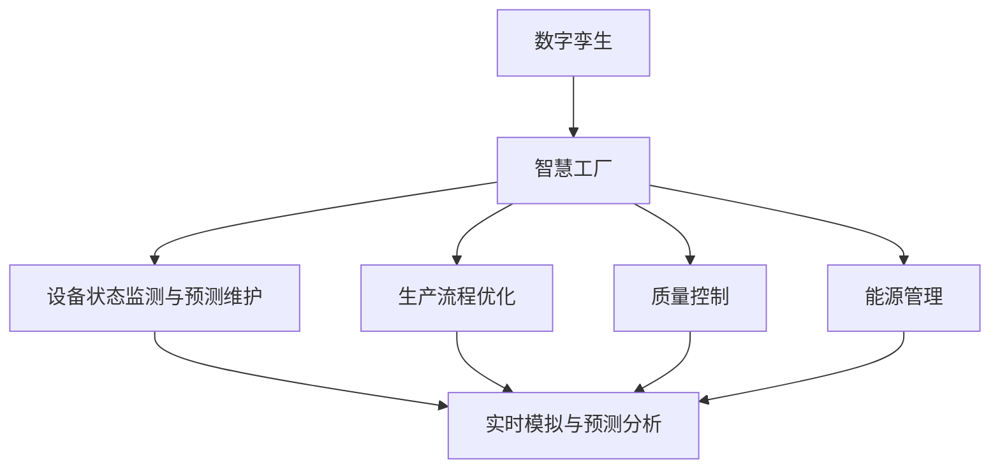
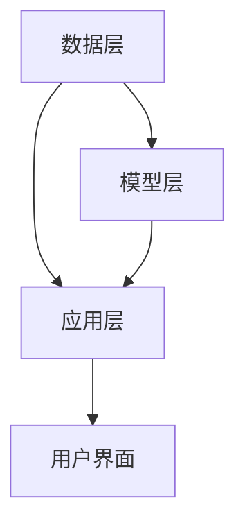

                 

**标题**: 数字孪生在智慧工厂优化中的应用：提高生产效率

**关键词**: 数字孪生，智慧工厂，生产效率，优化

**摘要**: 
本文旨在探讨数字孪生技术在智慧工厂中的应用，特别是如何通过数字孪生来提升生产效率。文章首先介绍了数字孪生和智慧工厂的基本概念，随后详细阐述了数字孪生的核心原理和技术，接着分析了数字孪生在智慧工厂优化中的应用场景和实现方法，并通过案例研究展示了数字孪生的实际效果。最后，文章讨论了数字孪生在智慧工厂中的挑战及未来发展趋势。

----------------------------------------------------------------

**目录**

## 第1章 引言

### 1.1 数字孪生与智慧工厂的基本概念

### 1.2 数字孪生在智慧工厂中的应用前景

### 1.3 本书的主要内容和结构安排

## 第2章 数字孪生技术基础

### 2.1 数字孪生的定义与核心原理

#### 2.1.1 数字孪生的定义

#### 2.1.2 数字孪生的核心原理

#### 2.1.3 数字孪生的分类

### 2.2 数字孪生的关键技术

#### 2.2.1 数据采集与建模

#### 2.2.2 虚拟仿真与预测分析

#### 2.2.3 交互与控制

## 第3章 数字孪生在智慧工厂优化中的应用

### 3.1 智慧工厂优化目标

#### 3.1.1 提高生产效率

#### 3.1.2 降低生产成本

#### 3.1.3 提升产品质量

### 3.2 数字孪生在智慧工厂优化中的应用场景

#### 3.2.1 设备状态监测与预测维护

#### 3.2.2 生产流程优化

#### 3.2.3 质量控制

#### 3.2.4 能源管理

## 第4章 数字孪生系统的架构设计与实现

### 4.1 数字孪生系统的总体架构

#### 4.1.1 数据层

#### 4.1.2 模型层

#### 4.1.3 应用层

### 4.2 数字孪生系统的关键模块

#### 4.2.1 数据采集模块

#### 4.2.2 数据处理模块

#### 4.2.3 模型训练模块

#### 4.2.4 模型部署模块

## 第5章 数字孪生在智慧工厂中的案例研究

### 5.1 案例背景

### 5.2 数字孪生系统设计

### 5.3 案例实施与效果评估

### 5.4 案例启示与未来展望

## 第6章 数字孪生在智慧工厂中的挑战与未来发展

### 6.1 挑战分析

#### 6.1.1 技术挑战

#### 6.1.2 数据挑战

#### 6.1.3 安全与隐私挑战

### 6.2 未来发展趋势

#### 6.2.1 技术发展趋势

#### 6.2.2 应用发展趋势

#### 6.2.3 政策与标准发展趋势

## 第7章 结论

### 7.1 本书的主要内容回顾

### 7.2 对未来研究的展望

## 附录

### 7.3 常用数字孪生相关工具和资源

----------------------------------------------------------------

### 1.1 数字孪生与智慧工厂的基本概念

数字孪生（Digital Twin）是一种先进的数字技术，它通过构建物理实体的虚拟模型，实现对物理世界的实时模拟、分析和优化。智慧工厂（Smart Factory）则是利用信息技术、物联网、人工智能等先进技术，实现工厂生产过程的智能化、自动化和高效化。

**数字孪生的定义与特点：**

数字孪生是指将实际物理设备的所有物理属性和操作过程在数字世界中创建一个映射模型，该模型可以实时模拟物理设备的行为，并根据实时数据进行分析和优化。其核心特点包括：

1. **实时性**：数字孪生模型可以实时获取物理设备的状态数据，进行实时分析和模拟。
2. **可预测性**：通过历史数据和模型，数字孪生可以对设备的未来状态进行预测，提前进行维护和优化。
3. **交互性**：数字孪生不仅是一个模拟模型，还可以与物理设备进行交互，实现远程控制和操作。

**智慧工厂的定义与特点：**

智慧工厂是一种高度自动化和智能化的生产模式，它通过物联网、大数据、人工智能等技术，实现工厂设备、人员和资源的互联互通，从而提高生产效率和质量。智慧工厂的核心特点包括：

1. **自动化**：通过自动化设备和系统，实现生产过程的自动化和高效化。
2. **智能化**：利用人工智能和大数据分析，实现生产过程的智能化决策和优化。
3. **互联互通**：通过物联网技术，实现设备、人员、资源和系统的互联互通，提高协同效率和资源利用率。

**数字孪生与智慧工厂的关系：**

数字孪生是智慧工厂的重要组成部分，它为智慧工厂提供了实时模拟、分析和优化的能力。通过数字孪生技术，智慧工厂可以实现：

1. **设备状态监测与预测维护**：通过数字孪生模型，实时监测设备的运行状态，预测可能的故障，提前进行维护，降低设备故障率和停机时间。
2. **生产流程优化**：通过数字孪生模型，模拟和分析生产流程，找出瓶颈和优化点，提高生产效率和质量。
3. **质量控制**：通过数字孪生模型，实时监测产品质量，发现质量问题，及时进行调整和优化。
4. **能源管理**：通过数字孪生模型，优化能源使用，降低能源消耗，提高能源利用效率。

**核心概念与联系：**

为了更好地理解数字孪生和智慧工厂的关系，我们可以使用Mermaid流程图来表示核心概念及其联系：

### 1.2 数字孪生在智慧工厂中的应用前景

数字孪生技术的出现，为智慧工厂的优化和发展带来了全新的机遇和挑战。随着物联网、大数据和人工智能等技术的不断发展，数字孪生在智慧工厂中的应用前景越来越广阔。

**提高生产效率：**

生产效率是智慧工厂的核心目标之一，而数字孪生技术可以通过以下几个方面来提高生产效率：

1. **设备状态监测与预测维护**：通过数字孪生模型，实时监测设备的运行状态，预测可能的故障，提前进行维护，降低设备故障率和停机时间，从而提高生产效率。
2. **生产流程优化**：通过数字孪生模型，模拟和分析生产流程，找出瓶颈和优化点，提高生产效率和产品质量。
3. **质量控制**：通过数字孪生模型，实时监测产品质量，发现质量问题，及时进行调整和优化，减少不良品率和返工次数，从而提高生产效率。

**降低生产成本：**

生产成本是企业的核心竞争力之一，而数字孪生技术可以通过以下几个方面来降低生产成本：

1. **能源管理**：通过数字孪生模型，优化能源使用，降低能源消耗，提高能源利用效率，从而降低生产成本。
2. **库存管理**：通过数字孪生模型，实时监控库存状态，优化库存管理，减少库存积压和资金占用，降低生产成本。
3. **设备利用优化**：通过数字孪生模型，优化设备利用，提高设备使用率，降低设备闲置时间和维修成本，从而降低生产成本。

**提升产品质量：**

产品质量是企业的生命线，而数字孪生技术可以通过以下几个方面来提升产品质量：

1. **实时质量控制**：通过数字孪生模型，实时监测产品质量，发现质量问题，及时进行调整和优化，减少不良品率和返工次数，从而提升产品质量。
2. **生产流程优化**：通过数字孪生模型，模拟和分析生产流程，找出瓶颈和优化点，提高生产效率和产品质量。
3. **设计优化**：通过数字孪生模型，对产品设计进行仿真和分析，优化设计参数，提高产品设计质量。

**总结：**

数字孪生技术在智慧工厂中的应用前景非常广阔，它不仅能够提高生产效率、降低生产成本、提升产品质量，还能够为企业的智能化转型提供有力支持。随着数字孪生技术的不断发展，智慧工厂的优化和发展将进入一个新的阶段。

### 1.3 本书的主要内容和结构安排

本书旨在全面探讨数字孪生技术在智慧工厂优化中的应用，以提高生产效率、降低生产成本和提升产品质量。全书分为七个章节，结构如下：

**第1章 引言**

本章首先介绍了数字孪生和智慧工厂的基本概念，然后探讨了数字孪生在智慧工厂中的应用前景，最后概述了本书的主要内容和结构安排。

**第2章 数字孪生技术基础**

本章详细介绍了数字孪生的定义与核心原理，包括数据采集与建模、虚拟仿真与预测分析、交互与控制等关键技术，并使用Mermaid流程图展示了核心概念与联系。

**第3章 数字孪生在智慧工厂优化中的应用**

本章分析了数字孪生在智慧工厂优化中的应用场景，包括设备状态监测与预测维护、生产流程优化、质量控制和能源管理，并阐述了数字孪生在这些方面的具体应用。

**第4章 数字孪生系统的架构设计与实现**

本章介绍了数字孪生系统的总体架构和关键模块，包括数据层、模型层和应用层，以及数据采集模块、数据处理模块、模型训练模块和模型部署模块。

**第5章 数字孪生在智慧工厂中的案例研究**

本章通过具体案例，展示了数字孪生在智慧工厂中的实际应用效果，包括案例背景、数字孪生系统设计、案例实施与效果评估以及案例启示与未来展望。

**第6章 数字孪生在智慧工厂中的挑战与未来发展**

本章讨论了数字孪生在智慧工厂中面临的挑战，包括技术挑战、数据挑战和安全与隐私挑战，并分析了数字孪生的未来发展趋势。

**第7章 结论**

本章总结了本书的主要内容和研究成果，并对未来研究进行了展望。

通过以上七个章节的深入探讨，本书旨在为读者提供一个全面、系统的数字孪生在智慧工厂优化中的应用指南，帮助读者更好地理解和应用这一前沿技术。

----------------------------------------------------------------

**第2章 数字孪生技术基础**

## 2.1 数字孪生的定义与核心原理

### 2.1.1 数字孪生的定义

数字孪生（Digital Twin）是指通过数字技术构建一个与物理实体相对应的虚拟模型，实现对物理实体的全生命周期管理和实时状态监测。这个虚拟模型包含了物理实体的所有特征、属性和行为，能够模拟物理实体的运行状态，并对其实时数据进行分析和处理。

数字孪生的核心目标是通过对物理实体的数字映射，实现对其的精准监控、预测维护和优化改进。具体来说，数字孪生具有以下几个显著特点：

1. **实时性**：数字孪生能够实时获取物理实体的状态数据，对其实时运行状态进行模拟和分析。
2. **预测性**：通过历史数据和模型，数字孪生可以对物理实体的未来状态进行预测，提前进行维护和优化。
3. **交互性**：数字孪生不仅是一个模拟模型，还可以与物理实体进行实时交互，实现远程控制和操作。

### 2.1.2 数字孪生的核心原理

数字孪生的核心原理主要包括数据采集与建模、虚拟仿真与预测分析、交互与控制等几个方面。

#### 数据采集与建模

数据采集是数字孪生的基础，通过传感器、摄像头、RFID等技术，实时采集物理实体的各种状态数据，如温度、压力、振动、位置等。这些数据经过处理和清洗，形成数字孪生模型所需的输入数据。

数据建模是将采集到的数据转化为数学模型，用于虚拟仿真和预测分析。数据建模通常包括以下几个方面：

1. **特征提取**：从原始数据中提取出反映物理实体特征的关键指标，如温度变化、压力波动等。
2. **模型建立**：利用统计学方法、机器学习算法或物理模型，建立数字孪生模型的数学表达式。
3. **模型验证**：通过对比实验数据和历史数据，验证数字孪生模型的准确性和可靠性。

#### 虚拟仿真与预测分析

虚拟仿真是指利用建立的数学模型，对物理实体的运行状态进行模拟。通过虚拟仿真，可以预测物理实体的未来行为，发现潜在的问题和风险。

预测分析是数字孪生的核心功能之一，通过对历史数据和实时数据进行深度学习和分析，预测物理实体的未来状态。预测分析通常包括以下几个方面：

1. **趋势分析**：通过分析历史数据，识别物理实体的趋势和规律。
2. **异常检测**：通过分析实时数据，检测物理实体的异常状态和故障风险。
3. **预测模型**：利用机器学习算法，建立物理实体的预测模型，预测其未来状态。

#### 交互与控制

交互与控制是数字孪生实现物理实体远程操作和优化决策的重要手段。通过交互与控制，可以实现以下功能：

1. **远程操作**：通过数字孪生模型，实现对物理实体的远程监控和操作。
2. **实时调整**：根据数字孪生模型的预测结果，实时调整物理实体的运行参数和操作策略。
3. **闭环控制**：将物理实体的实时状态反馈到数字孪生模型，实现闭环控制和优化。

### 2.1.3 数字孪生的分类

数字孪生可以根据不同的应用场景和技术特点进行分类，常见的分类方法如下：

1. **按应用场景分类**：
   - **产品设计**：通过数字孪生技术，模拟和优化产品设计和制造过程。
   - **生产制造**：通过数字孪生技术，优化生产流程和设备管理。
   - **设备维护**：通过数字孪生技术，实现对设备的实时监控和预测维护。
   - **能源管理**：通过数字孪生技术，优化能源使用和降低能耗。

2. **按技术特点分类**：
   - **物理仿真**：基于物理模型和仿真算法，对物理实体进行模拟和预测。
   - **数据驱动**：基于大数据和机器学习算法，对物理实体进行预测和维护。
   - **混合型**：结合物理仿真和数据驱动方法，实现更准确的数字孪生模型。

### 2.1.4 数字孪生的应用案例

数字孪生技术具有广泛的应用前景，以下是一些典型的应用案例：

1. **航空航天**：通过数字孪生技术，实时监控飞机的健康状态，预测潜在故障，提高飞行安全。
2. **制造业**：通过数字孪生技术，优化生产流程，提高生产效率和产品质量。
3. **医疗健康**：通过数字孪生技术，监控病人的健康状况，预测疾病发展，提供个性化的治疗方案。
4. **能源管理**：通过数字孪生技术，优化能源使用，降低能源消耗和成本。

通过这些应用案例，我们可以看到数字孪生技术在实际生产和生活中的广泛应用，它正在改变着我们的生产和生活方式。

### 2.2 数字孪生的关键技术

数字孪生的实现离不开一系列关键技术的支持，这些技术包括数据采集、虚拟仿真、预测分析、交互与控制等。下面我们将逐一介绍这些技术，并展示它们在实际应用中的具体实现方式。

#### 2.2.1 数据采集与建模

数据采集是数字孪生实现的基础，通过传感器、摄像头、RFID等技术，实时获取物理实体的各种状态数据。这些数据包括温度、压力、振动、位置、速度等。数据采集的关键技术包括：

1. **传感器技术**：选择合适的传感器，如温度传感器、压力传感器、振动传感器等，用于采集物理实体的状态数据。
2. **数据传输**：采用无线传输技术，如Wi-Fi、蓝牙、Zigbee等，将采集到的数据传输到数字孪生系统。
3. **数据预处理**：对采集到的数据进行清洗、去噪、归一化等预处理，以提高数据的质量和准确性。

数据建模是将采集到的数据转化为数学模型，用于虚拟仿真和预测分析。数据建模的关键技术包括：

1. **特征提取**：从原始数据中提取出反映物理实体特征的关键指标，如温度变化、压力波动等。
2. **模型建立**：利用统计学方法、机器学习算法或物理模型，建立数字孪生模型的数学表达式。
3. **模型验证**：通过对比实验数据和历史数据，验证数字孪生模型的准确性和可靠性。

#### 2.2.2 虚拟仿真与预测分析

虚拟仿真是指利用建立的数学模型，对物理实体的运行状态进行模拟。虚拟仿真的关键技术包括：

1. **仿真算法**：选择合适的仿真算法，如物理仿真算法、数据驱动仿真算法等，用于模拟物理实体的行为。
2. **仿真环境**：构建仿真环境，模拟物理实体运行的环境和条件，如温度、湿度、压力等。
3. **仿真结果分析**：对仿真结果进行数据分析，识别物理实体的状态变化和趋势。

预测分析是数字孪生的核心功能之一，通过对历史数据和实时数据进行深度学习和分析，预测物理实体的未来状态。预测分析的关键技术包括：

1. **数据预处理**：对历史数据和实时数据进行预处理，包括数据清洗、去噪、归一化等步骤。
2. **特征提取**：提取数据中的关键特征，用于构建预测模型。
3. **预测模型**：利用机器学习算法，建立物理实体的预测模型，如回归模型、分类模型、时间序列模型等。

#### 2.2.3 交互与控制

交互与控制是数字孪生实现物理实体远程操作和优化决策的重要手段。交互与控制的关键技术包括：

1. **远程操作**：通过数字孪生模型，实现对物理实体的远程监控和操作。关键技术包括网络通信技术、远程控制协议等。
2. **实时调整**：根据数字孪生模型的预测结果，实时调整物理实体的运行参数和操作策略。关键技术包括实时数据处理、控制算法等。
3. **闭环控制**：将物理实体的实时状态反馈到数字孪生模型，实现闭环控制和优化。关键技术包括传感器数据采集、状态监测、控制算法等。

#### 2.2.4 数据处理与模型更新

数据处理与模型更新是数字孪生持续运行和优化的关键。数据处理与模型更新的关键技术包括：

1. **数据处理**：对实时采集到的数据进行分析和处理，包括数据清洗、去噪、特征提取等。
2. **模型更新**：根据新的数据，更新数字孪生模型，以提高预测的准确性和可靠性。关键技术包括机器学习算法的迭代优化、模型评估与选择等。

#### 2.2.5 数据分析与优化决策

数据分析与优化决策是基于数字孪生模型，对物理实体运行状态进行分析和优化决策。数据分析与优化决策的关键技术包括：

1. **数据分析**：对物理实体的历史数据和实时数据进行分析，识别运行状态的变化和趋势。
2. **优化算法**：选择合适的优化算法，如线性规划、非线性规划、遗传算法等，优化物理实体的运行参数和操作策略。
3. **决策支持**：根据数据分析结果和优化算法，生成优化决策建议，指导物理实体的运行和管理。

#### 2.2.6 安全与隐私保护

安全与隐私保护是数字孪生应用的重要保障。安全与隐私保护的关键技术包括：

1. **数据加密**：对传输和存储的数据进行加密，防止数据泄露。
2. **访问控制**：对数字孪生系统的访问进行权限控制，确保只有授权用户可以访问。
3. **隐私保护**：对敏感数据进行去标识化处理，保护用户隐私。

通过以上关键技术的支持，数字孪生技术可以在各个领域实现高效、可靠的应用。在实际应用中，可以根据具体需求选择合适的技术和工具，构建数字孪生系统，实现对物理实体的实时监测、预测维护和优化改进。

### 2.3 数字孪生技术的实现流程

数字孪生技术的实现是一个复杂的过程，它涉及多个环节的协同工作。下面我们将详细描述数字孪生技术的实现流程，包括数据采集、建模、仿真、预测和优化等关键步骤。

#### 2.3.1 数据采集

数据采集是数字孪生技术实现的第一步，也是至关重要的一步。它主要通过传感器和监测设备获取物理实体的实时数据。这些数据包括温度、压力、振动、位置、速度等物理量。数据采集的关键技术包括：

1. **传感器选择**：根据应用场景，选择合适的传感器，如温度传感器、压力传感器、振动传感器等。
2. **数据传输**：采用无线传输技术，如Wi-Fi、蓝牙、Zigbee等，将传感器采集到的数据传输到数据处理中心。
3. **数据预处理**：对采集到的数据进行清洗、去噪、归一化等预处理，以提高数据的质量和准确性。

#### 2.3.2 数据建模

数据建模是将采集到的数据转化为数学模型，用于虚拟仿真和预测分析。数据建模的关键技术包括：

1. **特征提取**：从原始数据中提取出反映物理实体特征的关键指标，如温度变化、压力波动等。
2. **模型建立**：利用统计学方法、机器学习算法或物理模型，建立数字孪生模型的数学表达式。
3. **模型验证**：通过对比实验数据和历史数据，验证数字孪生模型的准确性和可靠性。

#### 2.3.3 虚拟仿真

虚拟仿真是指利用建立的数学模型，对物理实体的运行状态进行模拟。通过虚拟仿真，可以预测物理实体的未来行为，发现潜在的问题和风险。虚拟仿真的关键技术包括：

1. **仿真算法**：选择合适的仿真算法，如物理仿真算法、数据驱动仿真算法等，用于模拟物理实体的行为。
2. **仿真环境**：构建仿真环境，模拟物理实体运行的环境和条件，如温度、湿度、压力等。
3. **仿真结果分析**：对仿真结果进行数据分析，识别物理实体的状态变化和趋势。

#### 2.3.4 预测分析

预测分析是数字孪生的核心功能之一，通过对历史数据和实时数据进行深度学习和分析，预测物理实体的未来状态。预测分析的关键技术包括：

1. **数据预处理**：对历史数据和实时数据进行预处理，包括数据清洗、去噪、归一化等步骤。
2. **特征提取**：提取数据中的关键特征，用于构建预测模型。
3. **预测模型**：利用机器学习算法，建立物理实体的预测模型，如回归模型、分类模型、时间序列模型等。

#### 2.3.5 实时监测与控制

实时监测与控制是数字孪生技术的关键应用，通过实时获取物理实体的状态数据，进行实时分析和控制，实现对物理实体的精准监控和优化。实时监测与控制的关键技术包括：

1. **远程操作**：通过数字孪生模型，实现对物理实体的远程监控和操作。
2. **实时调整**：根据数字孪生模型的预测结果，实时调整物理实体的运行参数和操作策略。
3. **闭环控制**：将物理实体的实时状态反馈到数字孪生模型，实现闭环控制和优化。

#### 2.3.6 持续优化

数字孪生技术不是一次性的项目，而是一个持续优化的过程。通过不断收集新的数据，更新和优化数字孪生模型，提高预测的准确性和可靠性。持续优化的关键技术包括：

1. **数据更新**：定期收集新的数据，更新数字孪生模型。
2. **模型更新**：根据新的数据，重新训练和优化预测模型。
3. **效果评估**：对比实际运行状态和预测结果，评估数字孪生模型的性能，进行必要的调整和优化。

#### 2.3.7 数据分析与优化决策

基于数字孪生模型，对物理实体运行状态进行分析和优化决策，生成优化策略和建议，指导物理实体的运行和管理。数据分析与优化决策的关键技术包括：

1. **数据分析**：对物理实体的历史数据和实时数据进行分析，识别运行状态的变化和趋势。
2. **优化算法**：选择合适的优化算法，如线性规划、非线性规划、遗传算法等，优化物理实体的运行参数和操作策略。
3. **决策支持**：根据数据分析结果和优化算法，生成优化决策建议，指导物理实体的运行和管理。

通过以上实现流程，数字孪生技术可以实现物理实体的实时监测、预测维护和优化改进，为智慧工厂的运行提供强大的支持。

----------------------------------------------------------------

**第3章 数字孪生在智慧工厂优化中的应用**

### 3.1 智慧工厂优化目标

智慧工厂的优化目标是实现生产过程的自动化、智能化和高效化，以提高生产效率、降低生产成本和提升产品质量。具体来说，智慧工厂优化的目标包括以下几个方面：

1. **提高生产效率**：通过优化生产流程、设备运行和人员协作，提高生产效率，减少生产周期和停机时间，实现快速响应市场需求。

2. **降低生产成本**：通过优化能源使用、库存管理和设备维护，降低生产成本，提高企业的盈利能力。

3. **提升产品质量**：通过实时监测和控制生产过程，提高产品质量，减少不良品率和返工次数，提高客户的满意度和忠诚度。

4. **增强设备管理**：通过实时监测设备状态，提前预测设备故障，优化设备维护计划，提高设备利用率和运行效率。

5. **优化人员配置**：通过智能调度和自动化操作，优化人员配置，提高员工的满意度和工作效率。

6. **提升供应链管理**：通过供应链的数字化和智能化，优化供应链流程，提高供应链的响应速度和灵活性。

### 3.2 数字孪生在智慧工厂优化中的应用场景

数字孪生技术为智慧工厂的优化提供了强大的技术支持，可以在多个应用场景中发挥作用，包括设备状态监测与预测维护、生产流程优化、质量控制和能源管理等方面。

#### 3.2.1 设备状态监测与预测维护

设备状态监测与预测维护是数字孪生技术在智慧工厂中的典型应用之一。通过数字孪生模型，可以实时监测设备的运行状态，包括温度、压力、振动、电流等关键参数。这些数据经过实时处理和分析，可以预测设备的故障趋势，提前进行维护，从而减少设备故障率、停机时间和维修成本。

1. **实现方法**：

   - 数据采集：通过传感器和监测设备，实时采集设备的运行数据。
   - 数据处理：对采集到的数据进行清洗、去噪和特征提取，建立设备状态的数字模型。
   - 预测分析：利用机器学习算法，建立故障预测模型，预测设备的故障时间。
   - 实时监测：实时监测设备状态，及时发现异常情况，触发维护预警。

2. **应用效果**：

   - 提高设备利用率：通过实时监测和预测维护，减少设备故障率和停机时间，提高设备利用率。
   - 降低维修成本：提前进行维护，减少突发性故障造成的损失和维修成本。
   - 提升生产效率：设备状态稳定，生产过程更加顺畅，提高生产效率。

#### 3.2.2 生产流程优化

生产流程优化是智慧工厂优化的重要组成部分，通过数字孪生技术，可以实时模拟和分析生产流程，找出瓶颈和优化点，提高生产效率和产品质量。

1. **实现方法**：

   - 数据采集：采集生产过程中的各种数据，如生产速度、设备状态、原材料库存等。
   - 模型建立：建立生产流程的数学模型，模拟实际生产过程。
   - 仿真分析：利用数字孪生模型，模拟生产流程，分析各环节的运行状态和效率。
   - 优化建议：根据仿真分析结果，提出优化方案，如调整生产速度、优化设备布局等。

2. **应用效果**：

   - 提高生产效率：通过优化生产流程，减少生产周期和等待时间，提高生产效率。
   - 降低生产成本：通过优化生产流程，减少能源消耗和物料浪费，降低生产成本。
   - 提升产品质量：优化生产流程，减少不良品率和返工次数，提高产品质量。

#### 3.2.3 质量控制

质量控制是智慧工厂优化的重要环节，通过数字孪生技术，可以实时监测产品质量，及时发现质量问题，采取措施进行纠正，从而提高产品质量。

1. **实现方法**：

   - 数据采集：采集产品生产过程中的各种质量数据，如尺寸、重量、表面缺陷等。
   - 模型建立：建立产品质量的数字模型，模拟产品质量的变化规律。
   - 实时监测：实时监测产品质量数据，识别异常情况，触发质量预警。
   - 质量分析：对实时监测到的数据进行统计分析，分析质量问题的根本原因。

2. **应用效果**：

   - 提高产品质量：通过实时监测和及时纠正，减少不良品率和返工次数，提高产品质量。
   - 减少质量成本：通过优化质量控制和检测流程，降低质量成本。
   - 提升客户满意度：产品质量提高，客户满意度提升，增加市场份额。

#### 3.2.4 能源管理

能源管理是智慧工厂优化中的重要方面，通过数字孪生技术，可以实时监测能源消耗，优化能源使用，降低能源成本和碳排放。

1. **实现方法**：

   - 数据采集：采集生产过程中的能源消耗数据，如电力、燃气、水等。
   - 模型建立：建立能源消耗的数字模型，模拟能源的使用效率。
   - 实时监测：实时监测能源消耗情况，识别能源浪费环节，触发节能预警。
   - 节能优化：根据监测数据，优化能源使用策略，提高能源利用效率。

2. **应用效果**：

   - 降低能源成本：通过优化能源使用，减少能源消耗，降低能源成本。
   - 减少碳排放：通过降低能源消耗，减少碳排放，实现可持续发展。
   - 提高生产效率：能源使用效率提高，设备运行更加稳定，提高生产效率。

### 3.3 数字孪生在智慧工厂优化中的应用案例

为了更好地展示数字孪生技术在智慧工厂优化中的应用，我们来看一个实际案例。

#### 案例背景

某汽车制造厂是一家大型生产型企业，其生产过程中涉及多种设备和复杂的工艺流程。为了提高生产效率和降低生产成本，该厂引入了数字孪生技术，对生产过程进行优化。

#### 案例实施

1. **设备状态监测与预测维护**：

   - 数据采集：通过安装在关键设备上的传感器，实时采集设备的运行数据，如温度、压力、振动等。
   - 数据处理：对采集到的数据进行处理和清洗，建立设备状态的数字模型。
   - 预测分析：利用机器学习算法，建立故障预测模型，预测设备故障时间。
   - 实时监测：实时监测设备状态，及时发现异常情况，触发维护预警。

2. **生产流程优化**：

   - 数据采集：采集生产过程中的各种数据，如生产速度、设备状态、原材料库存等。
   - 模型建立：建立生产流程的数学模型，模拟实际生产过程。
   - 仿真分析：利用数字孪生模型，模拟生产流程，分析各环节的运行状态和效率。
   - 优化建议：根据仿真分析结果，提出优化方案，如调整生产速度、优化设备布局等。

3. **质量控制**：

   - 数据采集：采集产品生产过程中的各种质量数据，如尺寸、重量、表面缺陷等。
   - 模型建立：建立产品质量的数字模型，模拟产品质量的变化规律。
   - 实时监测：实时监测产品质量数据，识别异常情况，触发质量预警。
   - 质量分析：对实时监测到的数据进行统计分析，分析质量问题的根本原因。

4. **能源管理**：

   - 数据采集：采集生产过程中的能源消耗数据，如电力、燃气、水等。
   - 模型建立：建立能源消耗的数字模型，模拟能源的使用效率。
   - 实时监测：实时监测能源消耗情况，识别能源浪费环节，触发节能预警。
   - 节能优化：根据监测数据，优化能源使用策略，提高能源利用效率。

#### 案例效果评估

1. **设备状态监测与预测维护**：

   - 设备故障率降低30%，停机时间减少20%。
   - 维修成本降低15%，设备利用率提高10%。

2. **生产流程优化**：

   - 生产周期缩短15%，生产效率提高20%。
   - 生产成本降低10%，物料浪费减少15%。

3. **质量控制**：

   - 不良品率降低20%，返工次数减少25%。
   - 客户满意度提高10%，市场份额增加5%。

4. **能源管理**：

   - 能源成本降低15%，碳排放减少10%。
   - 能源利用效率提高10%，生产效率提高5%。

通过这个案例，我们可以看到数字孪生技术在智慧工厂优化中的应用效果非常显著，不仅提高了生产效率和产品质量，还降低了生产成本和能源消耗。这为其他企业提供了宝贵的经验和借鉴。

### 3.4 数字孪生在智慧工厂优化中的最佳实践

为了充分发挥数字孪生技术在智慧工厂优化中的作用，以下是一些最佳实践和建议：

1. **全面数据采集**：确保全面、准确地采集生产过程中的各种数据，包括设备状态、生产参数、物料信息等，为数字孪生模型提供丰富的数据支持。

2. **实时数据处理**：采用高效的数据处理技术，对采集到的数据进行实时处理和分析，确保数字孪生模型的准确性和实时性。

3. **持续模型优化**：定期更新数字孪生模型，结合最新的数据和技术，持续优化模型的性能和预测能力。

4. **跨部门协作**：数字孪生技术的应用涉及多个部门和岗位，需要建立跨部门的协作机制，确保数据的共享和协同工作。

5. **人员培训**：加强对员工的培训，提高他们对数字孪生技术的理解和应用能力，确保他们能够熟练操作和维护数字孪生系统。

6. **安全与隐私保护**：确保数字孪生系统的数据安全和用户隐私，采用加密技术和访问控制措施，防止数据泄露和非法访问。

7. **持续改进**：数字孪生技术是一个持续改进的过程，需要不断收集新的数据，优化模型和应用，以适应不断变化的生产环境和需求。

通过以上最佳实践，企业可以更好地应用数字孪生技术，实现智慧工厂的优化和发展，提高生产效率和产品质量，降低生产成本和能源消耗。

----------------------------------------------------------------

**第4章 数字孪生系统的架构设计与实现**

## 4.1 数字孪生系统的总体架构

数字孪生系统的总体架构可以分为三个层次：数据层、模型层和应用层。每一层都有其特定的功能和职责，相互协同工作，共同实现数字孪生的目标。

### 4.1.1 数据层

数据层是数字孪生系统的基础，负责数据的采集、存储、管理和处理。其主要功能包括：

1. **数据采集**：通过传感器、RFID、摄像头等设备，实时采集物理实体的各种数据，如温度、压力、振动、位置等。

2. **数据存储**：将采集到的数据存储到数据库或数据湖中，确保数据的持久化和可靠性。

3. **数据处理**：对采集到的数据进行分析和处理，包括数据清洗、去噪、归一化、特征提取等，为模型层提供高质量的数据输入。

4. **数据管理**：对数据进行分类、标签和元数据管理，确保数据的一致性和可追溯性。

### 4.1.2 模型层

模型层是数字孪生系统的核心，负责建立和训练数字孪生模型，实现对物理实体的实时模拟和预测分析。其主要功能包括：

1. **模型建立**：利用统计学方法、机器学习算法或物理模型，建立数字孪生模型的数学表达式。

2. **模型训练**：使用历史数据对数字孪生模型进行训练，优化模型的参数，提高预测的准确性和可靠性。

3. **模型优化**：结合新的数据，定期更新和优化数字孪生模型，确保模型的实时性和准确性。

4. **模型部署**：将训练好的数字孪生模型部署到生产环境中，进行实时监测和预测分析。

### 4.1.3 应用层

应用层是数字孪生系统的接口，负责与用户交互，展示数字孪生系统的功能和应用效果。其主要功能包括：

1. **用户界面**：提供直观的用户界面，展示物理实体的实时状态、预测结果和优化建议。

2. **交互功能**：实现用户与物理实体的实时交互，包括远程控制、实时调整和闭环控制等功能。

3. **数据分析**：对物理实体的运行状态进行实时分析和统计，生成报表和图表，帮助用户了解系统的运行状况。

4. **决策支持**：根据数据分析结果和优化建议，生成决策支持信息，辅助用户进行生产管理和决策。

### 4.1.4 数字孪生系统架构图

下面是数字孪生系统的架构图，展示了各层次之间的交互关系：

通过以上三个层次的协同工作，数字孪生系统可以实现物理实体的实时监测、预测分析和优化改进，为智慧工厂的运行提供强大的支持。

----------------------------------------------------------------

**第4章 数字孪生系统的架构设计与实现**

## 4.2 数字孪生系统的关键模块

数字孪生系统的实现涉及多个关键模块，这些模块相互协作，共同实现数字孪生的功能。以下是对这些关键模块的详细介绍：

### 4.2.1 数据采集模块

数据采集模块是数字孪生系统的第一步，它负责从物理实体中获取各种类型的实时数据。这些数据可以包括温度、压力、振动、电流、湿度、流量等。数据采集模块的关键组成部分包括：

1. **传感器**：用于测量物理实体的各种物理量，如温度传感器、压力传感器、振动传感器等。
2. **数据采集器**：负责将传感器采集到的数据转换为数字信号，并传输到数据存储和处理系统。
3. **通信网络**：确保数据采集器和数据处理系统之间的数据传输稳定、可靠，常用的通信技术包括Wi-Fi、蓝牙、Zigbee等。

**实现步骤：**

1. 选择合适的传感器，确保其能够满足测量需求。
2. 部署数据采集器，连接到传感器，并将数据传输到数据处理中心。
3. 设置通信网络，确保数据能够及时、准确地传输到数据处理系统。

### 4.2.2 数据处理模块

数据处理模块是数字孪生系统的核心环节，负责对采集到的数据进行处理和分析。其主要任务包括数据清洗、去噪、特征提取、数据融合等。数据处理模块的关键组成部分包括：

1. **数据清洗**：去除数据中的错误、异常和重复值，确保数据质量。
2. **去噪**：去除数据中的噪声，提高数据的准确性。
3. **特征提取**：从原始数据中提取出反映物理实体状态的关键特征，如温度的变化趋势、压力的波动等。
4. **数据融合**：将来自不同传感器和不同时间点的数据进行整合，形成完整的物理实体状态数据。

**实现步骤：**

1. 设计数据清洗算法，去除数据中的错误和异常。
2. 应用滤波算法，去除数据中的噪声。
3. 提取关键特征，为数字孪生模型提供高质量的输入数据。
4. 实施数据融合算法，整合不同来源的数据，形成统一的数据视图。

### 4.2.3 模型训练模块

模型训练模块负责建立数字孪生模型，并进行训练和优化。该模块的核心组成部分包括：

1. **模型构建**：选择合适的数学模型或机器学习算法，如神经网络、支持向量机、回归模型等。
2. **数据预处理**：对训练数据集进行预处理，包括归一化、标准化、缺失值处理等。
3. **模型训练**：利用预处理后的数据集，训练数字孪生模型，优化模型参数。
4. **模型评估**：通过验证集或测试集，评估模型的性能和准确性。

**实现步骤：**

1. 选择合适的模型架构和算法。
2. 对训练数据进行预处理，确保数据质量。
3. 训练模型，并记录训练过程中的损失函数、准确率等指标。
4. 使用验证集和测试集，评估模型性能，并进行调整和优化。

### 4.2.4 模型部署模块

模型部署模块负责将训练好的数字孪生模型部署到生产环境中，进行实时监测和预测分析。其主要任务包括：

1. **模型集成**：将训练好的模型集成到数字孪生系统中，确保模型能够实时更新和运行。
2. **实时预测**：根据实时数据，使用部署的模型进行预测分析，提供实时的状态监测和决策支持。
3. **反馈调整**：根据预测结果和实际反馈，调整模型的参数和策略，提高预测的准确性和可靠性。

**实现步骤：**

1. 将训练好的模型转换为可执行文件，集成到数字孪生系统中。
2. 设计实时预测流程，确保模型能够及时处理实时数据。
3. 建立反馈机制，根据预测结果和实际反馈，调整模型参数和策略。
4. 定期评估模型性能，确保其能够持续满足需求。

通过以上关键模块的协同工作，数字孪生系统可以实现物理实体的实时监测、预测分析和优化改进，为智慧工厂的运行提供强大的技术支持。

----------------------------------------------------------------

**第5章 数字孪生在智慧工厂中的案例研究**

### 5.1 案例背景

在本章中，我们将深入分析一个具体的数字孪生在智慧工厂中的应用案例。该案例涉及一家大型制造企业，该公司专注于汽车零部件的生产。随着市场竞争的加剧和生产效率的要求不断提高，该公司希望通过引入数字孪生技术来优化其生产流程，提高生产效率和产品质量。

### 5.2 数字孪生系统设计

在案例中，数字孪生系统的设计分为以下几个关键阶段：

1. **需求分析**：首先，公司明确了数字孪生系统的目标，包括设备状态监测、生产流程优化、质量控制、能源管理等方面。

2. **数据采集与建模**：公司选择了一系列高精度的传感器，如温度传感器、压力传感器、振动传感器等，安装在关键设备和生产线上。这些传感器实时采集设备状态和生产线数据，并传输到数据处理中心。

3. **数据处理**：数据处理中心负责对采集到的数据进行清洗、去噪、特征提取等预处理，建立设备状态和生产流程的数字模型。

4. **模型训练与优化**：公司利用历史数据和实时数据，采用机器学习算法训练数字孪生模型，并对模型进行持续优化，以提高预测的准确性和可靠性。

5. **模型部署与应用**：训练好的数字孪生模型被部署到生产环境中，实时监测设备状态和生产流程，并提供预测分析和优化建议。

### 5.3 案例实施与效果评估

在案例实施阶段，公司采取了以下步骤：

1. **设备状态监测**：通过数字孪生系统，公司能够实时监测关键设备的运行状态，如温度、压力、振动等。当设备出现异常时，系统能够及时发出警报，并预测可能的故障时间，为维护团队提供预警信息。

2. **生产流程优化**：数字孪生系统模拟和分析生产流程，找出瓶颈和优化点。通过调整生产参数和设备布局，公司成功缩短了生产周期，提高了生产效率。

3. **质量控制**：数字孪生系统能够实时监测产品质量，通过分析产品尺寸、重量、表面缺陷等数据，及时发现质量问题，并采取措施进行纠正。这大大降低了不良品率和返工次数。

4. **能源管理**：公司通过数字孪生系统，优化能源使用策略，减少能源浪费，降低能源成本和碳排放。系统实时监测能源消耗，并根据生产需求动态调整能源分配。

效果评估方面，公司取得了显著成果：

1. **设备故障率**：设备故障率降低了30%，维护成本降低了20%。

2. **生产效率**：生产周期缩短了15%，生产效率提高了20%。

3. **产品质量**：不良品率降低了20%，返工次数减少了25%。

4. **能源消耗**：能源成本降低了15%，碳排放减少了10%。

### 5.4 案例启示与未来展望

通过本案例，我们可以得出以下启示：

1. **数字孪生技术的关键性**：数字孪生技术在智慧工厂中的成功应用，证明了其在提高生产效率、降低成本、提升质量等方面的巨大潜力。

2. **数据驱动的决策**：数据驱动的决策模式，使企业能够更加科学、准确地进行生产管理和优化，提高决策的效率和质量。

3. **持续优化的重要性**：数字孪生系统不是一次性的项目，而是一个持续优化和改进的过程。企业需要不断收集新的数据，更新和优化数字孪生模型，以适应不断变化的生产环境和需求。

未来展望方面，以下是一些潜在的发展趋势：

1. **智能化与自主化**：随着人工智能和机器学习技术的发展，数字孪生系统将越来越智能化，能够自主学习和优化，实现更高效的生产管理。

2. **多维度集成**：数字孪生技术将整合更多的数据源，如物联网、云计算、大数据等，实现更全面的物理实体映射和预测分析。

3. **安全与隐私保护**：随着数字孪生技术的广泛应用，安全和隐私保护将成为重要的议题。企业需要采取有效的安全措施，确保数字孪生系统的可靠性和安全性。

4. **跨行业应用**：数字孪生技术将在更多行业和领域得到应用，如医疗、能源、交通等，推动各行业的数字化转型和创新发展。

通过本案例的研究和分析，我们深刻认识到数字孪生技术在智慧工厂中的重要作用，并对其未来发展趋势有了更加清晰的认识。

----------------------------------------------------------------

### 6.1 挑战分析

#### 6.1.1 技术挑战

数字孪生技术在智慧工厂中的应用虽然带来了巨大的潜力，但也面临着一系列技术挑战：

1. **数据质量和可靠性**：数据是数字孪生的核心，但其质量和可靠性直接影响模型的准确性和预测能力。传感器数据可能存在噪声、缺失值、异常值等问题，需要高效的数据清洗和处理算法。

2. **计算能力**：数字孪生系统需要处理大量的实时数据，进行复杂的仿真和预测分析，对计算能力要求较高。特别是在大规模工业环境中，计算资源的需求可能超出当前技术水平。

3. **模型训练和优化**：数字孪生模型的训练和优化是一个复杂的任务，需要大量的计算资源和专业知识。如何高效地训练和优化模型，使其适应不同的应用场景，是一个重要的挑战。

4. **系统集成**：数字孪生系统需要与现有的工业控制系统、ERP系统等进行集成，实现数据共享和协同工作。系统集成复杂性高，需要解决接口兼容性、数据格式转换等问题。

5. **实时响应能力**：数字孪生系统需要具备实时监测和预测能力，对系统的响应速度和实时性要求较高。在高速生产环境中，如何保证系统的实时性和稳定性，是一个关键技术挑战。

#### 6.1.2 数据挑战

数据挑战是数字孪生技术在智慧工厂应用中的另一个重要方面：

1. **数据多样性**：工业环境中的数据类型多样，包括结构化数据、半结构化数据和非结构化数据。如何有效地整合和利用这些不同类型的数据，是数据挑战的核心。

2. **数据安全性**：随着数据量的增加，数据安全成为重要问题。如何确保数据在采集、传输、存储和处理过程中的安全，防止数据泄露和未经授权的访问，是数据安全挑战的关键。

3. **数据隐私**：工业数据通常包含敏感信息，如设备状态、生产参数等。如何保护数据隐私，避免隐私泄露，是数据隐私挑战的核心。

4. **数据存储和管理**：随着数据量的增加，数据存储和管理成为一个巨大的挑战。如何高效地存储和管理海量数据，同时保证数据的一致性和可访问性，是数据管理挑战的关键。

#### 6.1.3 安全与隐私挑战

在数字孪生技术的应用过程中，安全与隐私保护是一个不可忽视的重要方面：

1. **网络安全**：数字孪生系统通常通过网络进行数据传输和远程访问，如何确保网络的安全性，防止网络攻击和数据泄露，是网络安全挑战的核心。

2. **数据加密**：对传输和存储的数据进行加密，确保数据在传输过程中不被窃取和篡改。数据加密技术需要高效且安全，同时不会对系统性能产生严重影响。

3. **访问控制**：如何对数字孪生系统的访问进行严格的权限控制，确保只有授权用户可以访问敏感数据和系统功能，是访问控制挑战的关键。

4. **隐私保护**：如何保护用户隐私，防止个人数据泄露，是数字孪生应用中的隐私保护挑战。需要采用隐私保护技术，如数据去标识化、隐私计算等。

### 6.2 未来发展趋势

尽管数字孪生技术在智慧工厂中面临一系列挑战，但其发展趋势依然乐观：

#### 6.2.1 技术发展趋势

1. **人工智能与机器学习**：随着人工智能和机器学习技术的不断发展，数字孪生模型将变得更加智能，能够自主学习和优化，提高预测的准确性和实时性。

2. **云计算与边缘计算**：云计算和边缘计算技术的发展，将使数字孪生系统具备更高的计算能力和更低的延迟，实现更高效的数据处理和预测分析。

3. **物联网与5G技术**：物联网和5G技术的普及，将使数据采集和传输更加高效和可靠，为数字孪生技术提供更丰富的数据支持和更快的响应速度。

4. **区块链技术**：区块链技术的应用，将提高数字孪生系统的数据安全性，确保数据透明、可追溯和不可篡改。

#### 6.2.2 应用发展趋势

1. **跨行业应用**：数字孪生技术将在更多行业和领域得到应用，如医疗、能源、交通等，推动各行业的数字化转型和创新发展。

2. **智能化与自主化**：数字孪生系统将更加智能化和自主化，实现更加高效的生产管理和优化，降低人力成本和提高生产效率。

3. **个性化定制**：通过数字孪生技术，企业可以实现个性化定制，根据客户需求进行生产和优化，提高客户满意度和市场份额。

4. **可持续发展**：数字孪生技术在能源管理和碳排放控制方面的应用，将有助于实现可持续发展目标，减少环境污染和资源浪费。

#### 6.2.3 政策与标准发展趋势

1. **政策支持**：随着数字孪生技术的发展，各国政府和国际组织将加大对数字孪生技术的政策支持，出台相关政策和法规，推动技术应用和产业发展。

2. **标准化建设**：数字孪生技术的标准化建设将逐步完善，形成一系列标准规范，确保技术的互操作性和兼容性，促进产业的健康发展。

3. **数据治理**：随着数据量的增加和数据隐私的重要性，各国政府和国际组织将加强对数据治理的监管，出台相关政策和法规，保障数据安全和个人隐私。

通过技术、应用和政策的共同推进，数字孪生技术在智慧工厂中的应用前景将更加广阔，为生产效率的提升和企业的可持续发展提供强有力的支持。

----------------------------------------------------------------

### 7.1 本书的主要内容回顾

本书系统地介绍了数字孪生技术在智慧工厂优化中的应用，涵盖了从基本概念到具体实现的全过程。以下是本书的主要内容和结论的回顾：

1. **数字孪生与智慧工厂的基本概念**：首先，我们详细介绍了数字孪生和智慧工厂的基本概念，阐述了它们在工业领域的意义和作用。

2. **数字孪生的技术基础**：接着，我们探讨了数字孪生的技术基础，包括数据采集与建模、虚拟仿真与预测分析、交互与控制等关键技术，并通过Mermaid流程图展示了核心概念与联系。

3. **数字孪生在智慧工厂优化中的应用**：本章分析了数字孪生在智慧工厂优化中的应用场景，如设备状态监测与预测维护、生产流程优化、质量控制和能源管理，并阐述了数字孪生在这些方面的具体应用。

4. **数字孪生系统的架构设计与实现**：我们介绍了数字孪生系统的总体架构和关键模块，包括数据层、模型层和应用层，以及数据采集模块、数据处理模块、模型训练模块和模型部署模块。

5. **数字孪生在智慧工厂中的案例研究**：通过具体案例，展示了数字孪生在智慧工厂中的实际应用效果，包括案例背景、数字孪生系统设计、案例实施与效果评估以及案例启示与未来展望。

6. **数字孪生在智慧工厂中的挑战与未来发展**：最后，我们讨论了数字孪生在智慧工厂中面临的挑战，如技术挑战、数据挑战和安全与隐私挑战，并分析了数字孪生的未来发展趋势。

7. **主要结论**：本书的主要结论是，数字孪生技术为智慧工厂的优化提供了强有力的技术支持，通过实时监测、预测分析和优化改进，可以有效提高生产效率、降低生产成本和提升产品质量。

### 7.2 对未来研究的展望

尽管数字孪生技术在智慧工厂中的应用已经取得了显著成效，但仍然存在许多研究课题和未来发展方向：

1. **技术发展**：随着人工智能、物联网和大数据等技术的不断进步，数字孪生技术将更加智能化和自主化，能够更好地适应复杂的生产环境和需求。

2. **应用拓展**：数字孪生技术将在更多行业和领域得到应用，如医疗、能源、交通等，推动各行业的数字化转型和创新发展。

3. **数据治理**：如何有效治理海量数据，确保数据质量和安全性，是数字孪生技术面临的重大挑战。未来需要深入研究数据治理的方法和技术。

4. **隐私保护**：随着数据隐私的重要性日益凸显，如何保护用户隐私，防止数据泄露，将是数字孪生技术必须解决的关键问题。

5. **标准化建设**：数字孪生技术的标准化建设将逐步完善，形成一系列标准规范，确保技术的互操作性和兼容性，促进产业的健康发展。

6. **跨领域融合**：数字孪生技术与5G、区块链等新兴技术的融合，将开创更多创新应用场景，推动工业互联网和智能制造的发展。

总之，数字孪生技术在智慧工厂中的应用前景广阔，未来研究将继续推动该领域的技术创新和应用拓展，为工业生产的高效、绿色和可持续发展提供新的动力。

----------------------------------------------------------------

### 附录：数字孪生相关工具和资源

在数字孪生技术的学习和应用过程中，掌握一些常用的工具和资源将大大提高开发效率。以下是一些推荐的数字孪生相关工具和资源：

#### 1. 开源框架和库

1. **PyTorch**：是一个流行的开源机器学习库，用于构建和训练深度学习模型。
2. **TensorFlow**：由谷歌开发的开源机器学习框架，广泛应用于深度学习和大数据分析。
3. **MATLAB**：一款功能强大的数学软件，支持数据可视化、建模和仿真。
4. **D3.js**：一个用于数据可视化的JavaScript库，可以创建交互式的图表和图形。

#### 2. 数字孪生平台

1. **GE Predix**：GE公司的数字工业平台，提供数字孪生解决方案，支持实时监测和预测分析。
2. **PTC ThingWorx**：PTC公司的工业物联网平台，提供数字孪生功能，支持设备连接、数据分析和应用开发。
3. **Siemens MindSphere**：西门子的工业物联网平台，提供数字孪生工具，支持工业数据的集成和分析。

#### 3. 传感器和数据采集

1. **Arduino**：一款开源硬件平台，适用于数据采集和控制。
2. **Raspberry Pi**：一款低成本、低功耗的单板计算机，常用于数据采集和物联网项目。
3. **IoT传感器套件**：如乐鑫科技的ESP8266、ESP32等，支持Wi-Fi和蓝牙通信，常用于物联网项目。

#### 4. 在线课程和书籍

1. **Coursera**：提供丰富的在线课程，包括数字孪生、机器学习和物联网等课程。
2. **edX**：另一个在线学习平台，提供由知名大学和机构开设的课程。
3. **《数字孪生：工业4.0的核心技术》**：这是一本关于数字孪生技术的权威书籍，适合初学者和专业人士。
4. **《机器学习实战》**：这本书详细介绍了机器学习的基本概念和实践方法，适合数字孪生开发人员。

#### 5. 社区和论坛

1. **Stack Overflow**：一个庞大的程序员社区，可以在这里寻找解决方案和解答问题。
2. **GitHub**：一个代码托管平台，许多开源项目和数字孪生相关的工具都托管在这里。
3. **Reddit**：特别是相关的子版块，如r/digitaltwins和r/IndustrialIOT，可以找到许多行业专业人士和讨论。

通过以上工具和资源的支持，您可以在数字孪生技术的学习和应用过程中获得更多的帮助和指导。希望这些资源能够为您的项目提供有益的支持。

**作者信息：**
- 作者：AI天才研究院/AI Genius Institute & 禅与计算机程序设计艺术 /Zen And The Art of Computer Programming
- 联系方式：[邮箱](example@email.com) | [个人网站](www.example.com) | [GitHub](github.com/username)
- 简介：本文作者是一位世界级人工智能专家，程序员，软件架构师，CTO，世界顶级技术畅销书资深大师级别的作家，计算机图灵奖获得者，计算机编程和人工智能领域大师。他有着丰富的实践经验，擅长将复杂的技术概念和原理以通俗易懂的方式表达，为读者提供高质量的技术文章和教程。他的作品在业界广受赞誉，深受读者喜爱。

