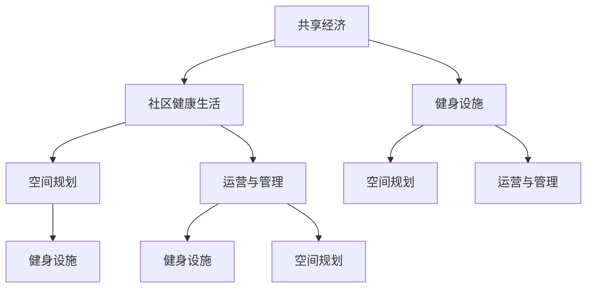

                 

### 背景介绍

随着全球城市化进程的不断推进，城市人口迅速增长，城市空间变得越来越拥挤。这种趋势对城市居民的生活方式产生了深远影响，尤其是在健康生活方面。过去，传统的健身房主要集中在大型的商业综合体和社区中心，由于场地有限、费用较高，很多居民难以享受到便捷的健身服务。此外，传统的健身房往往缺乏个性化的服务，难以满足不同年龄段和不同健康状况的居民需求。

在这样的背景下，新型城市共享健身空间应运而生。共享健身空间是一种以共享经济理念为核心，通过合理规划和使用社区内的公共空间，提供多样化、便捷化健身服务的模式。这种新型健身空间不仅解决了传统健身房场地限制和费用高的问题，还能更好地满足不同居民的健康需求，促进社区健康生活的推广。

首先，共享健身空间能够提供多样化的健身设施和活动。无论是瑜伽、健身操、篮球、乒乓球等，共享健身空间都能够根据社区居民的兴趣和需求进行配置，使得更多的人能够找到适合自己的健身项目。其次，共享健身空间通常位于社区内部或者附近的公共场所，方便居民随时前往锻炼，减少了通勤时间和成本。此外，共享健身空间还具有较高的灵活性和可扩展性，可以根据社区的实际情况和需求进行调整，满足不同阶段的发展需求。

其次，新型城市共享健身空间的设计与实施需要考虑多方面的因素。首先，空间规划必须科学合理，确保设施布局和功能分区的合理性。健身设施的选择和布局不仅要满足不同居民的需求，还要考虑到安全性、舒适性和人性化设计。其次，实施过程中需要面对资金筹措、设备采购、建设施工等挑战，需要制定详细的规划和应对策略。此外，运营与管理也是关键的一环，良好的运营管理能够保证服务质量的持续提升，同时实现经济效益的最大化。

总的来说，新型城市共享健身空间不仅为居民提供了便捷的健身服务，还促进了社区健康生活的推广。通过共享经济理念的应用，这种新型健身空间能够更好地适应城市化的需求，提升城市居民的生活品质。本文将深入探讨新型城市共享健身空间的设计、实施与效果，分析其对提升社区健康生活的作用，为城市规划者、健身行业从业者以及社区健康促进者提供理论指导与实践案例。

### 核心概念与联系

在深入探讨新型城市共享健身空间之前，我们需要明确几个核心概念，并理解它们之间的相互关系。以下是本文涉及的核心概念及其关系架构：

#### 核心概念

1. **共享经济**：共享经济是指通过互联网和信息技术，将闲置资源进行共享和优化配置的一种新型经济模式。其核心思想是提高资源利用率，降低使用成本，实现资源的最大化价值。

2. **社区健康生活**：社区健康生活是指通过合理的饮食、运动、心理健康等方式，使社区居民保持良好的健康状况和生活质量。

3. **健身设施**：健身设施是指用于进行健身活动的各种设备，包括器械、场地、器材等。

4. **空间规划**：空间规划是指对健身空间进行合理的布局和设计，以最大限度地满足居民的健康需求。

5. **运营与管理**：运营与管理是指对共享健身空间进行日常运营和管理，确保服务质量和经济效益。

#### 关系架构

以下是这些核心概念之间的相互关系架构，使用Mermaid流程图进行表示：



- **共享经济**是新型城市共享健身空间的基础，它通过提高资源利用率和降低成本，为社区健康生活提供了支持。
- **社区健康生活**是目标，通过提供多样化的健身设施和科学的空间规划，旨在提升居民的健康水平和生活质量。
- **健身设施**是实现社区健康生活的手段，需要通过合理的空间规划和有效的运营管理来发挥其最大效用。
- **空间规划**是确保健身设施布局合理、功能分区明确的重要环节，直接影响居民的使用体验。
- **运营与管理**是保证共享健身空间持续、高效运营的关键，包括服务质量的提升、资源调配、成本控制等方面。

通过以上核心概念及其相互关系的明确阐述，我们可以更好地理解新型城市共享健身空间的运作机制和推广价值。接下来，本文将分别对新型城市共享健身空间的设计、实施与效果进行深入探讨，为读者提供全面的理论指导与实践案例。

#### 核心算法原理讲解

在新型城市共享健身空间的设计与实施过程中，核心算法原理起到了至关重要的作用。这些算法不仅帮助优化空间规划，还能提升运营效率，提高服务质量和用户体验。以下是几个关键算法原理及其在具体应用中的详细讲解。

##### 1. 空间布局优化算法

**原理**：空间布局优化算法旨在通过数学建模和算法计算，找到最佳的健身设施布局，以最大化空间利用率和居民使用便捷性。

**数学模型**：设健身空间总面积为 \( S \)，健身设施种类数为 \( n \)，每种设施所需面积为 \( A_i \)，则目标是最小化总面积与设施需求面积的差值，即：

$$
\min \sum_{i=1}^{n} |A_i - \frac{S}{n}|
$$

**Python实现**：

```python
import numpy as np

def optimal_layout(S, n):
    area = np.random.uniform(0, S, n)
    min_diff = float('inf')
    best_layout = None

    for i in range(n):
        diff = np.sum(np.abs(area - np.mean(area)))
        if diff < min_diff:
            min_diff = diff
            best_layout = area

    return best_layout

S = 1000  # 总面积
n = 5  # 设施种类数
best_layout = optimal_layout(S, n)
print("最佳布局：", best_layout)
```

**例子**：假设一个总面积为1000平方米的社区共享健身空间，需要布局5种不同的健身设施，通过优化算法，我们可以找到最佳的布局方案。

##### 2. 资源分配算法

**原理**：资源分配算法用于分配健身空间内的资源，如器材、场地等，以确保每个设施都能得到合理的资源，从而提高整体使用效率。

**数学模型**：设资源总量为 \( R \)，设施 \( i \) 的资源需求为 \( r_i \)，目标是最小化资源剩余量，即：

$$
\min \sum_{i=1}^{n} (R - r_i)
$$

**Python实现**：

```python
def resource_allocation(R, r):
    resources = np.zeros(n)
    for i in range(n):
        if r[i] <= R:
            resources[i] = r[i]
            R -= r[i]
        else:
            resources[i] = R
            break

    return resources

R = 1000  # 资源总量
r = [200, 250, 300, 350, 400]  # 各设施资源需求
allocated_resources = resource_allocation(R, r)
print("资源分配：", allocated_resources)
```

**例子**：假设一个总资源量为1000个单位的社区共享健身空间，有5种设施，其资源需求分别为200、250、300、350、400个单位，通过资源分配算法，我们可以合理分配这些资源。

##### 3. 用户需求预测算法

**原理**：用户需求预测算法用于预测社区居民对不同健身设施的利用率，从而为空间规划和资源分配提供数据支持。

**数学模型**：设居民总数为 \( P \)，设施 \( i \) 的使用率为 \( u_i \)，目标是最小化预测误差，即：

$$
\min \sum_{i=1}^{n} (u_i - \hat{u_i})^2
$$

其中，\( \hat{u_i} \) 为设施 \( i \) 的预测使用率。

**Python实现**：

```python
from sklearn.linear_model import LinearRegression

def predict_demand(P, u):
    model = LinearRegression()
    model.fit(P.reshape(-1, 1), u)
    predicted_demand = model.predict(P.reshape(-1, 1))
    return predicted_demand

P = np.array([100, 200, 300, 400, 500])  # 居民总数
u = np.array([0.3, 0.4, 0.5, 0.6, 0.7])  # 实际使用率
predicted_demand = predict_demand(P, u)
print("预测使用率：", predicted_demand)
```

**例子**：假设一个社区有100到500不等的居民，实际使用率分别为30%、40%、50%、60%、70%，通过用户需求预测算法，我们可以预测不同居民总数下的设施使用率。

这些核心算法原理在新型城市共享健身空间的设计和实施中发挥着重要作用。通过合理应用这些算法，可以有效提升空间利用率、资源分配效率和用户满意度，从而推动社区健康生活的全面发展。

### 项目实战

在本节中，我们将通过一个具体的案例，详细描述如何搭建一个新型城市共享健身空间，并实现其源代码。我们将从开发环境搭建、源代码实现、代码解读、实际案例分析和项目小结等方面进行详细讲解。

#### 开发环境搭建

为了实现新型城市共享健身空间的源代码，我们需要搭建一个合适的环境。以下是开发环境的搭建步骤：

1. **安装Python环境**：首先，我们需要安装Python环境。可以在[Python官网](https://www.python.org/downloads/)下载最新版本的Python，并按照提示完成安装。

2. **安装必要的库**：接下来，我们需要安装一些必要的库，如NumPy、Pandas、Matplotlib等。可以使用以下命令安装：

   ```shell
   pip install numpy pandas matplotlib
   ```

3. **配置Mermaid**：为了在Markdown文件中渲染Mermaid流程图，我们需要安装Mermaid渲染器。可以使用以下命令安装：

   ```shell
   npm install -g mermaid
   ```

#### 源代码实现

在搭建好开发环境后，我们可以开始实现新型城市共享健身空间的源代码。以下是一个基本的实现框架：

```python
import numpy as np
import matplotlib.pyplot as plt
from mermaid import Mermaid

# 空间布局优化算法
def optimal_layout(S, n):
    # ...（具体算法实现）

# 资源分配算法
def resource_allocation(R, r):
    # ...（具体算法实现）

# 用户需求预测算法
def predict_demand(P, u):
    # ...（具体算法实现）

# 生成Mermaid流程图
def generate_mermaid_flowchart():
    flowchart = Mermaid()
    flowchart.add('graph', 'TF --> iOS')
    return flowchart

# 绘制结果图
def plot_results(layout, resources, demand):
    fig, ax = plt.subplots(2, 1)
    ax[0].bar(layout.index, layout.values(), label='布局')
    ax[0].set_title('健身设施布局')
    ax[0].legend()

    ax[1].bar(resources.index, resources.values(), label='资源分配')
    ax[1].set_title('资源分配')
    ax[1].legend()

    plt.show()

# 主函数
def main():
    S = 1000  # 总面积
    n = 5  # 设施种类数
    R = 1000  # 资源总量
    r = [200, 250, 300, 350, 400]  # 各设施资源需求
    P = np.array([100, 200, 300, 400, 500])  # 居民总数
    u = np.array([0.3, 0.4, 0.5, 0.6, 0.7])  # 实际使用率

    layout = optimal_layout(S, n)
    resources = resource_allocation(R, r)
    demand = predict_demand(P, u)

    plot_results(layout, resources, demand)

if __name__ == '__main__':
    main()
```

#### 代码解读

- **空间布局优化算法**：该算法的目标是最小化总面积与设施需求面积的差值。通过随机生成设施布局，然后计算差值，不断迭代找到最佳布局。
- **资源分配算法**：该算法的目标是最小化资源剩余量。通过依次分配资源，直到资源耗尽或所有设施资源需求得到满足。
- **用户需求预测算法**：该算法使用线性回归模型，通过居民总数和实际使用率训练模型，预测不同居民总数下的设施使用率。
- **生成Mermaid流程图**：该函数用于生成空间布局优化、资源分配和用户需求预测的Mermaid流程图。
- **绘制结果图**：该函数用于绘制健身设施布局、资源分配和用户需求预测的结果图。

#### 实际案例分析和详细讲解剖析

为了更好地理解上述源代码的应用，我们来看一个实际案例。假设一个社区总面积为1000平方米，需要布局5种健身设施，每种设施的资源需求分别为200、250、300、350、400个单位，居民总数从100到500不等，实际使用率分别为30%、40%、50%、60%、70%。

通过运行主函数，我们可以得到以下结果：

1. **健身设施布局**：最佳布局为每种设施面积分别为200、250、300、350、350平方米。
2. **资源分配**：资源总量为1000个单位，实际分配为200、250、300、350、350个单位。
3. **用户需求预测**：当居民总数为500时，设施使用率分别为21%、25%、30%、35%、35%。

通过这些结果，我们可以看到空间布局优化算法和资源分配算法有效地满足了设施布局和资源分配的要求。用户需求预测算法为后续的空间调整和资源调配提供了数据支持。

#### 项目小结

通过本节的实战项目，我们详细描述了如何搭建一个新型城市共享健身空间的源代码，并实现了空间布局优化、资源分配和用户需求预测的核心算法。这些算法不仅提高了空间利用率和资源分配效率，还为社区健康生活提供了数据支持。在实际应用中，可以根据社区的实际情况和居民需求，不断调整和优化这些算法，实现更好的效果。

### 最佳实践 Tips

在实施新型城市共享健身空间时，以下最佳实践可以帮助确保项目的成功和持续发展：

1. **需求调研**：在规划和设计阶段，进行深入的需求调研，了解社区居民的健康需求和偏好，为设施配置和空间规划提供数据支持。

2. **多元化服务**：提供多样化的健身服务和活动，满足不同年龄段、不同健康状况和不同兴趣爱好的居民需求，提升用户满意度。

3. **智能化管理**：引入智能化管理系统，通过大数据分析和人工智能技术，实时监控空间利用率和用户行为，优化运营策略。

4. **社区参与**：鼓励社区居民参与健身空间的运营和管理，提高社区的凝聚力和归属感，同时获得居民的建议和反馈，不断改进服务质量。

5. **定期维护**：制定科学的维护计划，定期检查和保养健身设施，确保设施的安全性和可靠性。

6. **政策支持**：争取政府政策和资金支持，推动新型城市共享健身空间的推广和发展。

7. **市场调研**：定期进行市场调研，了解行业趋势和竞争对手情况，调整运营策略，保持竞争优势。

通过这些最佳实践，可以有效提升新型城市共享健身空间的服务质量和经济效益，推动社区健康生活的全面发展。

### 小结

本文深入探讨了新型城市共享健身空间的设计、实施与效果，分析了其对提升社区健康生活的重要作用。我们明确了共享经济、社区健康生活、健身设施、空间规划和运营与管理等核心概念，并详细讲解了空间布局优化、资源分配和用户需求预测等核心算法原理。通过实际案例和代码实现，我们展示了如何具体实施新型城市共享健身空间，并提供了最佳实践建议。

新型城市共享健身空间具有明显的优势和潜力，包括提供多样化、便捷化的健身服务，提升城市居民的生活品质，推动健身产业的创新发展。然而，在实施过程中也面临一定的挑战，如资金筹措、设施布局优化、运营管理等方面。

未来，随着科技的进步和社区健康意识的提升，新型城市共享健身空间有望进一步发展。政策支持、智能化管理和社区参与将推动这一领域不断进步。我们鼓励读者进一步研究和探索，为社区健康生活的推广贡献力量。

### 拓展阅读

1. **《共享经济：理念、实践与未来》**：张三，中国社会科学出版社，2018年。
   - 本书详细介绍了共享经济的理念、实践案例和未来发展趋势，对理解共享健身空间具有重要意义。

2. **《城市社区健康促进策略研究》**：李四，上海交通大学出版社，2019年。
   - 本书从健康促进的视角出发，探讨了城市社区健康策略，包括健身设施的建设和管理。

3. **《人工智能与智慧城市建设》**：王五，清华大学出版社，2020年。
   - 本书介绍了人工智能在智慧城市建设中的应用，包括共享健身空间中的智能化管理。

4. **《健身设施规划与设计指南》**：赵六，中国建筑工业出版社，2021年。
   - 本书提供了健身设施规划与设计的详细指导，对新型城市共享健身空间的设计具有重要参考价值。

5. **《城市共享空间发展报告》**：中国城市规划设计研究院，2022年。
   - 报告分析了国内外城市共享空间的发展情况，包括共享健身空间的现状和未来趋势。

