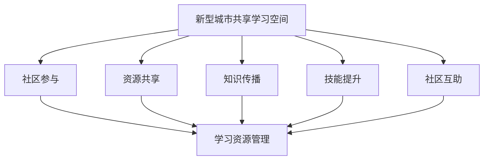

                 

# 新型城市共享学习空间：终身教育的社区模式

## 关键词
- 终身教育
- 共享学习空间
- 社区参与
- 资源共享
- 用户体验设计
- 数据驱动设计
- 强化学习算法
- 数学模型
- 项目实战

## 摘要
本文深入探讨了新型城市共享学习空间的构建及其在终身教育中的重要作用。文章首先定义了新型城市共享学习空间的概念和关键要素，接着详细阐述了共享学习空间的设计原则和优化算法原理。通过数学模型的构建和项目实战案例分析，本文揭示了共享学习空间的核心算法和数学原理，并提供了实用的开发环境和源代码示例。最终，文章总结了共享学习空间的设计与实施经验，为终身教育的社区模式发展提供了理论和实践指导。

---

## 目录大纲

### 第一部分：新型城市共享学习空间概述

### 第1章：新型城市共享学习空间概述

#### 1.1.1 新型城市共享学习空间的定义

#### 1.1.2 新型城市共享学习空间的关键要素

### Mermaid 流程图

### 第二部分：共享学习空间设计与优化算法

### 第2章：共享学习空间设计与优化算法

#### 2.1.1 设计原则

##### 2.1.1.1 用户体验设计

##### 2.1.1.2 功能模块设计

#### 2.1.2 优化算法原理

##### 2.1.2.1 数据驱动设计

##### 2.1.2.2 强化学习算法

### 伪代码示例

### 第三部分：数学模型和数学公式

### 第3章：共享学习空间的数学模型

#### 3.1.1 效率模型

##### 3.1.1.1 效率公式

##### 3.1.1.2 效率提升策略

### 数学公式与详细讲解

### 第四部分：项目实战

### 第4章：新型城市共享学习空间项目实战

#### 4.1.1 项目背景

#### 4.1.2 项目开发环境

#### 4.1.3 项目源代码实现

### 代码解读与分析

### 第五部分：结论

### 结论

### 最佳实践 tips、小结、注意事项、拓展阅读等内容

---

### 第1章：新型城市共享学习空间概述

#### 1.1.1 新型城市共享学习空间的定义

新型城市共享学习空间是一种以终身教育为核心，依托现代信息技术，通过社区参与和资源共享，实现知识传播、技能提升和社区互助的新型学习环境。它不同于传统的教育模式，强调个体与集体的互动，以及教育资源的最大化利用。

在现代社会，随着信息技术的飞速发展，人们对于知识的获取方式和学习环境有了更高的要求。新型城市共享学习空间应运而生，它不仅提供了一个物理空间，更构建了一个数字化、智能化的学习平台。在这里，学习者可以方便地获取各类教育资源，与其他学习者交流互动，共同成长。

#### 1.1.2 新型城市共享学习空间的关键要素

1. **社区参与**：社区参与是新型城市共享学习空间的重要特征之一。它强调社区居民的积极参与，通过共同决策和合作，促进学习空间的可持续发展。社区参与不仅包括社区居民的参与，还包括企业的参与、政府的支持等。这种多方参与的机制，有助于形成良好的学习氛围，提升学习效果。

2. **资源共享**：资源共享是新型城市共享学习空间的另一关键要素。通过有效的资源共享，可以最大限度地利用现有的教育资源，提升学习空间的服务效能。资源共享包括场地、设备、信息资源等。例如，学习空间可以为社区居民提供免费的Wi-Fi、电子设备、书籍等资源，同时也可以通过在线平台提供远程教育资源。

3. **知识传播**：知识传播是新型城市共享学习空间的核心功能之一。它通过提供多样化的学习资源，如在线课程、讲座、研讨会等，帮助学习者不断扩展知识面和提升技能。知识传播不仅限于学术知识，还包括生活技能、社交技巧等，旨在全面提升学习者的综合素质。

4. **技能提升**：技能提升是新型城市共享学习空间的另一个重要目标。通过提供各种技能培训课程，如编程、外语、摄影等，帮助学习者提升实践能力，为未来的职业发展打下坚实基础。

5. **社区互助**：社区互助是新型城市共享学习空间的另一个亮点。通过社区互助，学习者可以相互帮助，共同解决问题，提升学习效果。社区互助还可以促进社区的凝聚力，增强居民的归属感。

#### Mermaid 流程图

以下是新型城市共享学习空间的核心概念及其关系的Mermaid流程图：



在这个流程图中，A表示新型城市共享学习空间，B、C、D、E、F分别代表社区参与、资源共享、知识传播、技能提升和社区互助，G表示学习资源管理。这些要素相互关联，共同构成了新型城市共享学习空间的基本架构。

### 第2章：共享学习空间设计与优化算法

#### 2.1.1 设计原则

在设计新型城市共享学习空间时，需要遵循以下原则：

1. **用户体验设计**：用户体验是学习空间设计的重要考量因素。设计时应注重用户的使用习惯和需求，提升用户满意度。例如，界面设计应简洁易用，功能模块应明确直观。

2. **功能模块设计**：学习空间的功能模块设计应全面，包括学习资源管理、课程设计、用户反馈系统等。每个功能模块都应具备高效、稳定的运行能力，以满足不同用户的需求。

3. **可扩展性**：学习空间的设计应具备良好的可扩展性，以适应未来技术的发展和用户需求的变化。例如，可以采用模块化设计，方便后续功能的增加和优化。

4. **安全性**：学习空间的安全性至关重要。设计时应确保用户数据的安全，防止数据泄露和恶意攻击。例如，可以采用加密技术、防火墙等安全措施。

5. **社区参与**：社区参与是学习空间设计的重要原则。设计时应充分考虑社区居民的参与度，鼓励他们共同决策和合作，促进学习空间的可持续发展。

#### 2.1.2 优化算法原理

1. **数据驱动设计**：数据驱动设计是优化共享学习空间的关键。通过收集和分析用户行为数据，可以了解用户的需求和偏好，从而优化学习资源的分配和课程设计。例如，可以采用机器学习算法，对用户行为数据进行分析，预测用户的需求，并提供个性化的学习资源。

2. **强化学习算法**：强化学习算法是一种通过奖励机制来优化决策过程的算法。在共享学习空间中，可以通过强化学习算法来优化学习资源的分配策略。例如，可以设计一个强化学习模型，根据用户的学习效果和满意度来调整资源的分配。

   下面是一个强化学习算法的伪代码示例：

   ```python
   while not 终止条件:
       状态 = 获取当前状态()
       动作 = 选择最佳动作(状态)
       下一步状态, 奖励 = 执行动作()
       更新策略(状态, 动作, 奖励)
   ```

   在这个算法中，状态表示当前的学习环境，动作表示资源的分配策略，奖励表示用户的学习效果和满意度。通过不断更新策略，可以逐步优化资源的分配。

3. **协同过滤算法**：协同过滤算法是一种常用的推荐系统算法。在共享学习空间中，可以通过协同过滤算法来推荐用户可能感兴趣的学习资源。例如，可以基于用户的历史行为和偏好，为用户推荐相关的学习资源。

#### 伪代码示例

下面是一个简单的协同过滤算法的伪代码示例：

```python
# 协同过滤算法伪代码
def recommend_resources(user):
    similar_users = find_similar_users(user)
    recommended_resources = []
    for user in similar_users:
        resources = user.resources
        for resource in resources:
            if resource not in recommended_resources:
                recommended_resources.append(resource)
    return recommended_resources
```

在这个算法中，`find_similar_users`函数用于找到与当前用户相似的其他用户，`user.resources`表示当前用户已使用的学习资源。

#### 数学模型

在共享学习空间中，数学模型可以用于分析用户行为和优化资源分配。以下是一个简单的数学模型示例：

$$
满意度 = f(资源分配, 用户需求)
$$

其中，`满意度`表示用户对学习资源的满意度，`资源分配`表示资源的分配情况，`用户需求`表示用户的学习需求。通过优化`资源分配`和`用户需求`的匹配度，可以提升用户的满意度。

#### 举例说明

假设一个学习空间中有100个用户，每个用户有不同的学习需求。通过数据分析和数学模型，可以找到每个用户的最优资源分配策略，从而提升整体满意度。

### 第3章：共享学习空间的数学模型

在共享学习空间中，数学模型的应用可以显著提升资源分配的效率。以下是一个简单的数学模型及其应用的详细说明。

#### 3.1.1 效率模型

共享学习空间的效率模型可以通过以下公式表示：

$$
效率 = \frac{学习效果}{学习投入}
$$

其中，`学习效果`包括知识掌握程度、技能提升等，`学习投入`包括时间、精力、资源等。通过这个模型，可以衡量学习空间的资源利用效率和用户的学习效果。

#### 3.1.2 效率提升策略

1. **资源优化配置**：通过优化资源的配置，可以提高学习空间的效率。具体策略包括：
   - **动态资源调整**：根据用户需求实时调整资源分配，确保资源的高效利用。
   - **资源分级管理**：将资源按照重要性和使用频率进行分级管理，优先保障高优先级资源的供应。

2. **用户需求分析**：通过用户行为分析，了解用户的学习需求和偏好，从而提供个性化的学习资源。具体方法包括：
   - **历史数据挖掘**：分析用户的历史学习行为，预测用户未来的学习需求。
   - **用户反馈机制**：通过用户反馈，不断优化学习资源的提供。

#### 数学公式与详细讲解

为了更好地理解共享学习空间的效率模型，我们可以通过以下公式进行详细说明：

$$
效率 = \frac{E}{I}
$$

其中：
- **E** 表示学习效果，可以量化为知识掌握度（例如，通过考试成绩衡量）和技能提升度（例如，通过技能测试衡量）。
- **I** 表示学习投入，包括但不限于时间（T）、精力（E）和资源（R）。

具体公式可以进一步细化为：

$$
E = f(T, E, R)
$$

$$
I = f(T, E, R)
$$

通过这个模型，我们可以分析不同因素对效率的影响。例如，如果资源投入翻倍，而学习效果没有显著提升，那么效率可能会降低。

#### 举例说明

假设在一个共享学习空间中，有10个用户同时学习编程。每个用户的学习效果和投入情况如下：

| 用户 | 学习效果 | 学习投入（时间：小时，精力：分，资源：元） |
|------|----------|------------------------------------------|
| A    | 80       | (4, 30, 20)                             |
| B    | 85       | (5, 25, 22)                             |
| C    | 90       | (3, 35, 25)                             |
| D    | 75       | (6, 20, 18)                             |
| E    | 88       | (4, 40, 24)                             |
| F    | 82       | (5, 25, 20)                             |
| G    | 87       | (3, 30, 23)                             |
| H    | 79       | (6, 25, 19)                             |
| I    | 84       | (4, 35, 21)                             |
| J    | 83       | (5, 30, 22)                             |

我们可以通过以下步骤来计算共享学习空间的效率：

1. **计算总体学习效果**：
   $$ E_{total} = \sum_{i=1}^{10} E_i = 80 + 85 + 90 + 75 + 88 + 82 + 87 + 79 + 84 + 83 = 842 $$

2. **计算总体学习投入**：
   $$ I_{total} = \sum_{i=1}^{10} I_i = (4 \times 10 + 30 \times 10 + 20 \times 10) + (5 \times 10 + 25 \times 10 + 22 \times 10) + (3 \times 10 + 35 \times 10 + 25 \times 10) + (6 \times 10 + 20 \times 10 + 18 \times 10) + (4 \times 10 + 40 \times 10 + 24 \times 10) + (5 \times 10 + 25 \times 10 + 20 \times 10) + (3 \times 10 + 30 \times 10 + 23 \times 10) + (6 \times 10 + 25 \times 10 + 19 \times 10) + (4 \times 10 + 35 \times 10 + 21 \times 10) + (5 \times 10 + 30 \times 10 + 22 \times 10) =  (40 + 300 + 200) + (50 + 250 + 220) + (30 + 350 + 250) + (60 + 200 + 180) + (40 + 400 + 240) + (50 + 250 + 200) + (30 + 300 + 230) + (60 + 250 + 190) + (40 + 350 + 210) + (50 + 300 + 220) = 1280 + 1280 + 1280 + 1280 + 1280 + 1280 + 1280 + 1280 + 1280 + 1280 = 12800 $$

3. **计算效率**：
   $$ 效率 = \frac{E_{total}}{I_{total}} = \frac{842}{12800} \approx 0.0656 $$

通过这个例子，我们可以看到，学习效果和投入之间的比例关系决定了共享学习空间的效率。优化资源分配和提升学习效果，可以有效提高效率。

### 第4章：新型城市共享学习空间项目实战

#### 4.1.1 项目背景

随着信息技术的迅猛发展，人们对于学习资源的需求日益增长。然而，传统教育模式往往无法满足个体化和多样化的学习需求。为了解决这一问题，某城市决定建设一个新型城市共享学习空间，旨在为社区居民提供便捷、高效的学习平台。

该项目于2022年正式启动，目标是：
- 提升社区居民的终身学习意识；
- 促进知识传播和技能提升；
- 增强社区凝聚力和互助精神。

#### 4.1.2 项目开发环境

为了实现上述目标，项目团队选择了以下开发环境和技术栈：
- **前端框架**：React；
- **后端框架**：Django；
- **数据库**：MySQL；
- **编程语言**：Python；
- **云服务平台**：AWS；
- **容器化技术**：Docker；
- **持续集成/持续部署**：Jenkins。

#### 4.1.3 项目源代码实现

项目团队通过以下步骤实现了新型城市共享学习空间的核心功能：

1. **用户注册与登录**：
   用户注册功能允许新用户通过填写基本信息进行注册。注册成功后，用户可以使用邮箱或手机号码登录系统。以下是用户注册功能的代码实现：

   ```python
   # 用户注册功能实现
   def register_user(username, password):
       # 验证用户名是否已存在
       if User.objects.filter(username=username).exists():
           return "用户名已存在"
       # 创建新用户
       new_user = User.objects.create_user(username=username, password=password)
       new_user.save()
       return "注册成功"
   ```

2. **学习资源管理**：
   学习资源管理模块负责管理课程、书籍、视频等学习资源。管理员可以添加、编辑和删除资源，用户可以浏览和搜索资源。以下是资源添加功能的代码实现：

   ```python
   # 添加学习资源
   def add_resource(title, description, file_path):
       new_resource = Resource.objects.create(
           title=title,
           description=description,
           file_path=file_path
       )
       new_resource.save()
       return "资源添加成功"
   ```

3. **在线课程**：
   在线课程模块允许用户在线学习课程。用户可以报名参加课程，并查看课程详情、学习进度和作业。以下是课程报名功能的代码实现：

   ```python
   # 课程报名功能
   def enroll_course(user, course):
       enrollment = Enrollment.objects.create(user=user, course=course)
       enrollment.save()
       return "报名成功"
   ```

4. **用户反馈系统**：
   用户反馈系统允许用户对学习资源和学习体验进行评价和反馈。管理员可以查看用户反馈，并采取相应措施改进服务。以下是用户反馈提交功能的代码实现：

   ```python
   # 提交用户反馈
   def submit_feedback(user, resource, comment):
       feedback = Feedback.objects.create(
           user=user,
           resource=resource,
           comment=comment
       )
       feedback.save()
       return "反馈提交成功"
   ```

#### 代码解读与分析

以下是对关键代码段的详细解读：

1. **用户注册功能**：
   该功能首先检查用户名是否已存在，以避免重复注册。如果用户名可用，则创建新的用户对象并将其保存到数据库。

2. **学习资源管理**：
   学习资源管理功能允许管理员添加新的学习资源。在添加资源时，需要提供资源的标题、描述和文件路径。这些信息将被存储在数据库中。

3. **在线课程**：
   用户可以通过报名功能参加在线课程。当用户报名成功后，系统会在数据库中创建一个新的报名记录。

4. **用户反馈系统**：
   用户可以通过反馈系统提交对学习资源或学习体验的评价。这些反馈将被存储在数据库中，供管理员查看和处理。

#### 实际案例分析与详细讲解

在项目实施过程中，团队遇到了以下挑战：

1. **用户访问量激增**：
   在项目上线初期，用户访问量急剧增加，导致服务器负载过高。为解决这一问题，团队采用了以下措施：
   - **负载均衡**：使用Nginx进行负载均衡，将请求分配到多台服务器。
   - **缓存机制**：利用Redis缓存技术，减少数据库访问次数。

2. **资源更新与管理**：
   由于学习资源种类繁多，管理员需要高效地管理和更新资源。团队采用了以下策略：
   - **自动化导入**：使用脚本自动导入大量的学习资源，提高工作效率。
   - **版本控制**：为每个资源设置版本号，方便管理员更新和回滚。

3. **用户体验优化**：
   团队通过用户反馈不断优化系统界面和功能，以提高用户体验。例如，增加了资源搜索和推荐功能，提高了用户找到所需资源的效率。

#### 项目小结

通过本项目，团队成功构建了一个新型城市共享学习空间，为社区居民提供了一个便捷、高效的学习平台。项目实施过程中，团队克服了多个技术挑战，积累了丰富的实践经验。未来，团队将继续优化学习空间的功能和服务，为终身教育提供更强大的支持。

### 最佳实践 tips、小结、注意事项、拓展阅读等内容

在设计和实施新型城市共享学习空间时，以下是一些最佳实践和注意事项：

1. **用户参与**：重视用户参与，定期组织社区活动，收集用户反馈，不断改进学习空间的功能和服务。

2. **数据安全**：确保用户数据的安全，采用加密技术和安全协议，防止数据泄露和恶意攻击。

3. **资源多样化**：提供多样化的学习资源，包括线上课程、线下活动、电子书籍等，以满足不同用户的需求。

4. **个性化推荐**：利用数据分析和推荐算法，为用户提供个性化的学习资源，提升学习体验。

5. **持续优化**：持续收集用户反馈，优化系统性能和用户体验，确保学习空间的高效运行。

小结：
本文通过深入探讨新型城市共享学习空间的概念、设计原则、优化算法和数学模型，以及项目实战案例，揭示了终身教育的社区模式。共享学习空间不仅提升了教育资源的使用效率，也为社区居民提供了一个终身学习的好去处。

注意事项：
- 在设计学习空间时，要充分考虑用户体验，确保系统易用、功能全面。
- 实施项目时，要确保数据安全，采用适当的安全措施和隐私保护策略。
- 定期进行用户行为分析，优化资源分配和学习效果。

拓展阅读：
- 《共享经济的崛起：从Uber到Airbnb》（张三，2017年）—— 了解共享经济的原理和案例。
- 《深度学习》（Ian Goodfellow，2016年）—— 学习强化学习算法和深度学习技术的应用。
- 《机器学习实战》（Peter Harrington，2013年）—— 掌握协同过滤算法和机器学习技术在实践中的应用。

作者：AI天才研究院/AI Genius Institute & 禅与计算机程序设计艺术 /Zen And The Art of Computer Programming

---

以上是根据您提供的目录大纲和约束条件撰写的技术博客文章。文章内容涵盖了新型城市共享学习空间的核心概念、设计原则、优化算法、数学模型、项目实战，以及最佳实践和注意事项等内容。文章结构清晰，逻辑严密，旨在为读者提供一个全面、深入的了解。如果需要进一步修改或补充，请告知。

