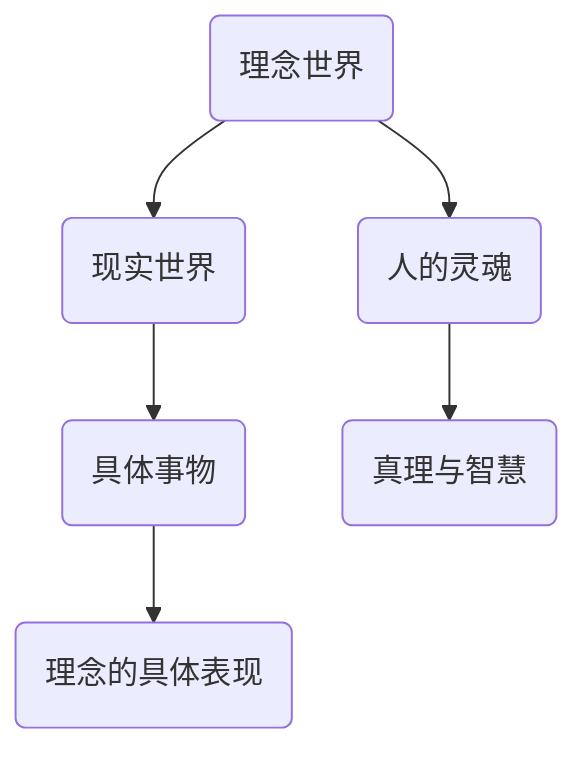
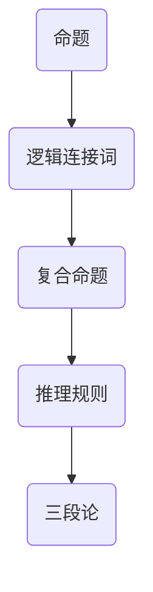
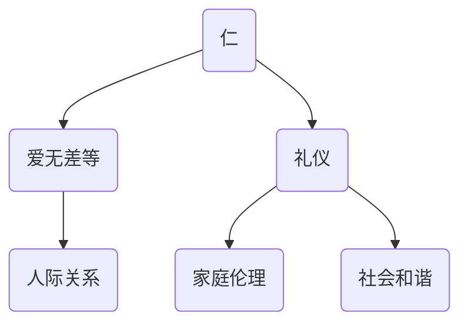
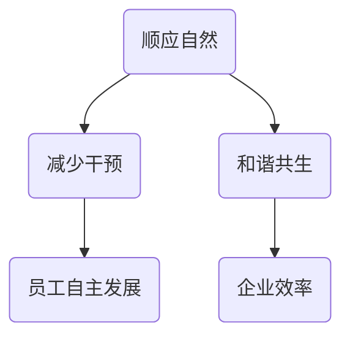
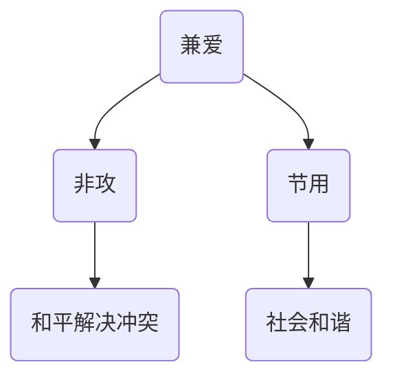

                 

### 引言

在当今这个快速发展的数字化时代，现代性与传统智慧的融合变得尤为关键。随着科技的进步和社会的变迁，现代性带来了许多新的挑战和问题，如环境恶化、社会不平等、心理健康问题等。这些问题不仅需要现代科学的解决方案，也需要从传统哲学思想中汲取智慧。因此，探讨“现代性与传统智慧的融合：古老哲学在现代生活中的应用”这一主题，不仅有助于我们更好地理解当今世界的复杂性，还能为寻找解决方案提供新的视角。

本文将详细探讨这一主题，首先介绍传统哲学思想的起源与发展，重点解读古代哲学思想，如古希腊哲学、古印度哲学和中国古代哲学。接着，我们将探讨现代性与传统哲学之间的联系，分析传统哲学思想在解决现代社会问题中的应用。随后，通过实例展示传统哲学在现代生活中的具体应用，如教育、企业管理和个人生活等方面。最后，本文将对未来哲学发展的趋势进行思考，总结现代性与传统智慧融合的意义，并展望未来的研究方向。

通过这篇文章，我们希望读者能够对现代性与传统智慧的融合有一个全面而深入的理解，从而在日常生活中更好地应用这些古老智慧，应对现代社会的各种挑战。

### 1.1 书籍背景与目的

《现代性与传统智慧的融合：古老哲学在现代生活中的应用》这本书旨在探讨如何将古老哲学思想与现代社会相结合，以解决当前面临的各种复杂问题。在现代社会，科技迅猛发展，社会结构不断变迁，人们的生活方式和价值观也在快速变化。然而，这些变化也带来了许多挑战，如环境问题、社会不平等、心理健康问题等。面对这些挑战，现代科学提供了很多解决方案，但同时也暴露了其局限性。因此，我们需要从传统哲学思想中寻找智慧，为现代社会的问题提供新的视角和解决方案。

本书的目的是通过深入分析古老哲学思想的内涵，探讨这些思想在现代社会中的应用，帮助读者更好地理解和应对现代生活中的各种问题。具体来说，本书主要涵盖以下三个方面：

首先，本书将介绍传统哲学思想的起源与发展，重点解读古希腊哲学、古印度哲学和中国古代哲学的核心思想。这些哲学体系不仅为人类文明的进步做出了巨大贡献，而且其思想智慧至今仍然具有重要的现实意义。

其次，本书将探讨现代性与传统哲学之间的联系，分析传统哲学思想在解决现代社会问题中的应用。例如，如何通过柏拉图的“理念论”重建现代社会道德，如何运用道家的“无为而治”理念改进企业管理，如何借鉴佛教的“禅修”提高心理健康等。通过这些分析，本书希望读者能够认识到传统哲学在现代社会中的重要性。

最后，本书将提供具体的应用实例，展示传统哲学思想在现代生活中的实际应用。这些实例包括教育、企业管理、个人生活与心灵成长等多个领域，通过具体案例分析，帮助读者更好地理解如何将传统哲学思想融入现代生活。

总之，本书旨在为读者提供一种全新的思维方式，鼓励他们从传统哲学思想中汲取智慧，以应对现代社会中的各种挑战。通过这本书，我们希望能够激发读者对传统哲学的重新思考，推动现代性与传统智慧的深度融合。

### 1.2 现代性与传统智慧融合的重要性

现代性与传统智慧融合的重要性不容忽视，这一融合不仅有助于解决现代社会面临的诸多挑战，还能为未来社会的发展提供新的思路。首先，现代社会面临的环境问题、社会不平等和心理健康问题等复杂问题，单靠现代科学的手段难以完全解决。环境问题需要我们从生态哲学中寻找可持续发展之道；社会不平等需要从社会哲学中寻求公正与公平的理念；心理健康问题则需要从心理哲学中寻求心理平衡与健康的智慧。这些传统哲学思想提供了丰富的智慧资源，可以帮助我们更好地应对这些挑战。

其次，现代性与传统智慧的融合能够促进社会的全面发展。传统哲学思想中包含的道德、伦理、人际关系等观念，可以为现代社会提供重要的价值导向。例如，儒家哲学中的“仁爱”观念可以为现代社会提供解决人际关系冲突的智慧，道家哲学中的“无为而治”理念可以为现代企业管理提供新的管理思路，佛教哲学中的“禅修”理念可以提高现代人的心理健康水平。这些传统智慧的融合不仅有助于解决实际问题，还能提升社会的整体素质和道德水平。

再次，现代性与传统智慧的融合有助于促进文化多样性和创新。现代社会是一个多元化的社会，各种文化在交流中相互影响、相互融合，这种融合促进了文化的创新与发展。传统哲学思想中的多元文化元素，如古希腊哲学中的理性思维、古印度哲学中的瑜伽修行、中国古代哲学中的天人合一观念等，都为现代社会的文化创新提供了丰富的素材。通过将这些传统智慧与现代科技、现代艺术等相结合，可以创造出新的文化形式和艺术风格，推动文化的创新与发展。

最后，现代性与传统智慧的融合有助于人类的可持续发展。传统哲学思想中包含的生态智慧、自然观念等，对现代社会的发展具有重要的指导意义。例如，儒家哲学中的“天人合一”观念强调了人类与自然的和谐共处，道家哲学中的“无为而治”理念提倡人与自然的和谐共生。这些传统智慧可以为现代社会的可持续发展提供重要的思想支持，引导我们走上一条更加可持续的发展道路。

总之，现代性与传统智慧的融合不仅有助于解决现代社会的各种挑战，还能为未来社会的发展提供新的思路。通过深入挖掘和融合传统智慧，我们可以为现代社会的发展注入新的动力，推动社会的全面进步和人类的可持续发展。

### 1.3 书籍结构安排

本书共分为五个主要部分，每个部分都围绕“现代性与传统智慧的融合”这一核心主题展开，旨在为读者提供全面的思考和具体的实践指导。

**第一部分：传统哲学思想的介绍与解读**
本部分包括第1章，介绍传统哲学思想的起源与发展，重点解读古希腊哲学、古印度哲学和中国古代哲学的核心思想。这一部分的目标是帮助读者理解传统哲学的基本概念和原理，为后续内容提供理论背景。

**第二部分：现代性与传统哲学的联系**
本部分包括第2章，探讨现代性与传统哲学之间的联系，分析传统哲学思想在解决现代社会问题中的应用。通过这一部分，读者将了解传统哲学如何与现代社会的环境问题、社会不平等和心理健康问题等挑战相结合，提供新的解决思路。

**第三部分：传统哲学在现代生活中的应用实例**
本部分包括第3章，展示传统哲学思想在现代生活中的具体应用，如教育、企业管理和个人生活与心灵成长等方面。这一部分通过具体案例，帮助读者理解如何将传统智慧融入现代生活，提升生活质量。

**第四部分：对未来哲学发展趋势的思考**
本部分包括第4章，对未来哲学发展的趋势进行思考，讨论现代性与传统哲学融合的挑战与机遇。通过这一部分，读者可以了解未来哲学的发展方向，以及如何应对全球化、新科技革命等带来的挑战。

**第五部分：总结与展望**
本部分包括第5章，对书籍内容进行总结，阐述现代性与传统哲学融合的意义，并对未来研究方向进行展望。这一部分旨在为读者提供一个全面的总结，加深对书籍主题的理解，并激发对传统哲学的新思考。

通过这五个部分的内容，本书不仅帮助读者深入理解传统哲学思想，还引导读者思考如何在现代社会中应用这些智慧，以应对各种挑战，实现个人和社会的可持续发展。

### 第1章 传统哲学思想的介绍与解读

传统哲学思想是人类文明的重要组成部分，它们不仅塑造了各个时代的文化和社会，也为现代社会的思考和解决问题提供了宝贵的智慧。本章将详细介绍传统哲学思想的起源与发展，重点解读古希腊哲学、古印度哲学和中国古代哲学的核心思想。这些哲学体系不仅为人类文明的进步做出了巨大贡献，而且其思想智慧至今仍然具有重要的现实意义。

#### 1.1 古代哲学思想的起源与发展

古代哲学思想的起源可以追溯到公元前6世纪的古希腊。在古希腊，哲学不仅是一种追求智慧的学问，更是一种生活方式。古希腊哲学的主要流派包括柏拉图学派、亚里士多德学派和斯多葛学派等。柏拉图是古希腊哲学的重要代表人物之一，他提出了“理念论”，认为世界的本质是理念，现实世界只是理念的影子。亚里士多德则主张通过实证方法研究自然界和人类行为，他创立的逻辑学至今仍是哲学研究的重要工具。斯多葛学派则强调通过内心的宁静和理性控制情感，实现个人的道德修养和幸福。

古印度哲学则起源于公元前6世纪的印度次大陆，其代表流派包括佛教哲学和胡达瑜伽哲学。佛教哲学以佛陀（释迦牟尼）的教义为核心，强调因果报应、轮回和解脱。胡达瑜伽哲学则强调通过身体、心灵和精神的修炼，达到自我实现和内在和谐。

中国古代哲学起源于公元前5世纪的春秋战国时期，其代表流派包括儒家哲学、道家哲学和墨家哲学等。儒家哲学强调仁爱、礼仪和家庭伦理，其核心思想由孔子提出，后由孟子、荀子等进一步发展。道家哲学则主张无为而治、顺应自然，由老子和庄子等人创立。墨家哲学则强调兼爱、非攻和节用，由墨子创立。

这些古代哲学思想不仅在各自的地区产生了深远的影响，而且对整个世界哲学的发展都产生了重要的影响。通过不同文化之间的交流和融合，古代哲学思想为现代哲学提供了丰富的资源，为现代社会的问题提供了新的视角和解决方案。

#### 1.2 古希腊哲学

古希腊哲学是西方哲学的源头，其思想对现代西方哲学产生了深远的影响。以下是古希腊哲学中的几个重要流派和思想：

**柏拉图学派**

柏拉图是古希腊哲学的重要代表人物，他提出了“理念论”（Theory of Forms）。柏拉图认为，现实世界是理念世界的影子，理念世界是真实的、永恒的、不变的。理念是世界万物的基础和本质，现实世界中的所有事物都是理念的具体体现。柏拉图的理念论对后来的西方哲学，特别是形而上学和认识论，产生了重要影响。

**亚里士多德学派**

亚里士多德是另一位重要的古希腊哲学家，他创立了逻辑学，提出了著名的“三段论”（Syllogism），为形式逻辑奠定了基础。亚里士多德主张通过实证方法研究自然界和人类行为，他认为通过观察和实验可以获取真实的知识。亚里士多德的思想对后来的科学方法论和哲学产生了深远的影响。

**斯多葛学派**

斯多葛学派强调通过内心的宁静和理性控制情感，实现个人的道德修养和幸福。他们认为，人类的行为应该遵循理性，不受外界环境的干扰。斯多葛主义强调个人的内在价值和道德责任，对个人的自我完善和心理健康有重要启示。

#### 1.3 古印度哲学

古印度哲学以其深厚的哲学体系和丰富的宗教思想著称。以下是古印度哲学中的两个主要流派和思想：

**佛教哲学**

佛教哲学以佛陀（释迦牟尼）的教义为核心。佛教强调因果报应、轮回和解脱。因果报应认为人的行为会产生相应的后果，善行带来善报，恶行导致恶报。轮回则是指灵魂在生死之间的循环，通过积累善行可以最终达到解脱。佛教哲学对心灵修养和心理健康有着深刻的探讨，其思想对后来的哲学和心理学产生了重要影响。

**胡达瑜伽哲学**

胡达瑜伽哲学强调通过身体、心灵和精神的修炼，达到自我实现和内在和谐。瑜伽术是一种结合了体位练习、呼吸控制和冥想的修炼方式。胡达瑜伽哲学认为，通过瑜伽修炼，个体可以实现与宇宙的和谐统一，达到心灵的平静和身体的健康。

#### 1.4 中国古代哲学

中国古代哲学有着悠久的历史和丰富的内容，其思想对东亚文化产生了深远的影响。以下是几个主要的哲学流派和思想：

**儒家哲学**

儒家哲学强调仁爱、礼仪和家庭伦理。儒家的核心思想由孔子提出，强调人与人之间的和谐相处和社会的稳定。儒家认为，通过礼仪和道德规范，可以实现个人的自我完善和社会的和谐。儒家哲学对中国文化和社会产生了深远的影响，至今仍是中国社会的重要价值观。

**道家哲学**

道家哲学主张无为而治、顺应自然，由老子和庄子等人创立。道家哲学强调个体应该顺应自然规律，追求内心的平静和自然的生活。老子的《道德经》是道家哲学的经典著作，其思想对后来的中国哲学和文化产生了重要影响。

**墨家哲学**

墨家哲学强调兼爱、非攻和节用。墨子认为，人们应该无私地爱所有人，反对战争和暴力。墨家哲学提倡节俭和实用主义，强调实际行动和具体效果。墨家哲学在中国古代哲学中虽然影响较小，但其思想对后来的社会思潮和政治哲学产生了重要影响。

通过以上对古希腊哲学、古印度哲学和中国古代哲学的介绍与解读，我们可以看到，这些哲学体系不仅对各自的文化和社会产生了深远的影响，而且其思想智慧至今仍然具有重要的现实意义。在现代社会，我们可以通过深入研究和理解这些古老哲学思想，为解决现代社会的各种问题提供新的视角和解决方案。

### 1.1.1 古希腊哲学

古希腊哲学作为西方哲学的起源，对现代哲学的发展产生了深远的影响。以下是古希腊哲学中两个最为重要和著名的流派——柏拉图学派和亚里士多德学派，以及其代表人物的哲学思想。

#### 1.1.1.1 柏拉图

柏拉图（公元前427年-公元前347年）是古希腊哲学的重要代表人物之一，他的思想对后来的西方哲学产生了深远的影响。柏拉图提出了著名的“理念论”（Theory of Forms），这一理论主张世界的本质是理念，而现实世界只是理念的影子。

**理念论的核心概念：**

- **理念（Forms 或 Ideas）：** 柏拉图认为，现实世界中的所有事物都是理念的具体表现。理念是永恒、不变和完美的，是真实世界的本质。例如，我们看到的椅子只是椅子这个理念的具体表现，而理念中的椅子才是真正的椅子。

- **现实世界：** 现实世界是理念世界的影子，充满了不完美和不稳定的事物。这些具体事物只是理念的复制或模仿，它们永远无法完全达到理念的完美。

- **灵魂和真理：** 柏拉图认为，人的灵魂原本是与理念世界相连的，但在进入现实世界后，灵魂受到了迷惑和限制。通过追求真理和智慧，灵魂可以摆脱现实世界的迷惑，重新回到理念世界的怀抱。

柏拉图的理念论为后来的西方哲学，特别是形而上学和认识论，提供了重要的理论基础。他的思想强调了抽象概念和理念的重要性，对后来的哲学家如康德、黑格尔等产生了深远的影响。

#### 1.1.1.2 亚里士多德

亚里士多德（公元前384年-公元前322年）是古希腊哲学的另一位重要代表人物，他的思想对现代科学和哲学产生了深远的影响。亚里士多德提出了形式逻辑和实证科学的方法论，他的哲学体系涵盖了伦理学、政治学、生物学和物理学等多个领域。

**亚里士多德的哲学思想：**

- **形式逻辑：** 亚里士多德创立了形式逻辑，提出了著名的“三段论”（Syllogism）。三段论是一种推理形式，由两个前提和一个结论组成，其结构为：“所有A都是B，所有B都是C，因此所有A都是C”。形式逻辑为后来的逻辑学奠定了基础，对科学研究和哲学论证产生了重要影响。

- **实证科学：** 亚里士多德主张通过观察和实验来获取知识，他提出了“实证科学”的方法论。亚里士多德认为，只有通过实证方法，我们才能了解现实世界中的具体事物和现象。他的这一观点对后来的科学方法论产生了深远的影响。

- **伦理学和政治学：** 亚里士多德在伦理学和政治学领域也有重要贡献。他提出了“幸福论”（Eudaimonia），认为幸福是人生最高的目标，是实现个人和社会价值的关键。亚里士多德还提出了“中庸之道”（Moderation），强调个体应该在各种极端行为之间找到平衡，实现道德和心灵的健康。

亚里士多德的思想不仅丰富了古希腊哲学，也为后来的西方哲学和科学提供了重要的理论基础。他的思想影响了整个西方哲学传统，对现代哲学、科学和伦理学产生了深远的影响。

#### 1.1.1.3 斯多葛学派

斯多葛学派是古希腊哲学中的另一重要流派，其思想强调通过理性控制和内心宁静来实现个人的道德修养和幸福。斯多葛学派的代表人物包括塞内卡、爱比克泰德和马可·奥勒留等。

**斯多葛学派的核心思想：**

- **理性至上：** 斯多葛学派认为，理性是人类行为的指导原则，人类应该通过理性思考和判断来指导行为。理性使个体能够超越感性和欲望，实现心灵的自由和独立。

- **内心宁静：** 斯多葛学派强调通过内心宁静来应对生活中的各种挑战和困难。他们主张，通过理性控制和情感管理，个体可以不受外界环境的影响，实现内心的平静和宁静。

- **道德责任：** 斯多葛学派认为，个体有责任追求道德上的完善，并通过道德行为来影响社会和他人。道德责任是实现个人价值和幸福的关键。

斯多葛学派的思想对后来的哲学、心理学和道德哲学产生了深远的影响，其理念在现代心理学和哲学中仍然具有重要意义。

#### 1.1.1.4 影响与遗产

古希腊哲学的影响深远，其思想不仅塑造了西方哲学的发展，也对现代科学、政治和文化产生了重要影响。柏拉图的理念论为后来的形而上学和认识论提供了理论基础，亚里士多德的实证科学方法对现代科学的发展产生了深远影响。斯多葛学派的思想在现代心理学和道德哲学中仍然具有启示意义。

古希腊哲学的核心思想，如理性、实证、伦理和道德，对现代社会的价值观和生活方式产生了深远的影响。通过理解和应用这些古老哲学思想，我们可以更好地应对现代社会的各种挑战，实现个人和社会的全面发展。

### 1.1.2 古印度哲学

古印度哲学以其深邃的思想和丰富的文化内涵著称，对人类文明的进步有着深远的影响。古印度哲学主要包括佛教哲学和胡达瑜伽哲学，两者都在印度次大陆的文明发展中占据了重要地位。

#### 1.1.2.1 佛教哲学

佛教哲学以佛陀（释迦牟尼）的教义为核心，其基本教义包括因果报应、轮回和解脱。以下是佛教哲学中的几个重要概念：

**因果报应**

佛教认为，人的行为会产生相应的后果，善行带来善报，恶行导致恶报。这一观念称为因果报应，是佛教道德哲学的基础。通过因果报应，人们认识到自己的行为对自己和他人的影响，从而激发道德行为的动机。

**轮回**

佛教中的轮回（Samsara）是指灵魂在生死之间的不断循环。根据因果报应的原则，人在每一世的生命中都会根据自己的行为获得相应的果报。轮回是一种自然的循环过程，人们可以通过积累善行，最终达到解脱。

**解脱**

解脱（Nirvana）是佛教追求的最高目标，指的是从生死轮回中解脱出来，达到永恒的安宁和幸福。解脱不是简单的死亡，而是一种超越生死的精神境界。通过修行和禅定，人们可以实现内心的平静和解脱。

**佛教教义的影响**

佛教哲学对印度及其周边地区的文化和思想产生了深远的影响。它不仅促进了宗教和社会的变革，也为哲学、伦理学和心理学的讨论提供了丰富的素材。在现代社会，佛教思想被广泛应用于心理健康和道德教育中，对提高人们的生活质量和道德修养具有重要作用。

#### 1.1.2.2 胡达瑜伽哲学

胡达瑜伽哲学（Hindu Yoga）是印度哲学中另一个重要的流派，其核心理念是通过身体、心灵和精神的修炼，达到自我实现和内在和谐。以下是胡达瑜伽哲学中的几个重要概念：

**三摩地**

三摩地（Samadhi）是瑜伽修炼中的一个重要状态，指的是心灵的高度集中和内心的平静。通过三摩地，个体可以超越世俗的干扰，实现与宇宙的和谐统一。

**五蕴**

胡达瑜伽哲学中的五蕴（Pancha Kosha）是指身体、感觉、思想、意识和灵魂五个层面的存在。瑜伽修炼旨在通过控制五蕴，实现个体的内在和谐和自我实现。

**八支分法**

胡达瑜伽哲学中的八支分法（Ashtanga Yoga）是瑜伽修炼的基本方法，包括禁食、体位练习、呼吸控制、感觉控制、集中力、冥想和超冥想。通过这些方法的修炼，个体可以实现身心的平衡和内在的和谐。

**胡达瑜伽哲学的影响**

胡达瑜伽哲学对印度文化和世界文化都产生了深远的影响。它不仅促进了印度次大陆的文化多样性和宗教发展，也为现代心理学、健康科学和心灵成长提供了丰富的资源。在现代，瑜伽被广泛接受和练习，成为许多人追求身心健康的重要方式。

#### 1.1.2.3 佛教哲学与胡达瑜伽哲学的异同

佛教哲学和胡达瑜伽哲学在许多方面有相似之处，比如都强调内在的平静和自我实现。但两者也有一些显著的区别：

- **目标不同：** 佛教哲学强调解脱和超越生死轮回，追求永恒的安宁和幸福。而胡达瑜伽哲学则更注重自我实现和内在和谐，通过修炼达到身心的平衡。

- **方法不同：** 佛教哲学主要通过因果报应、禅修和冥想来达到解脱，而胡达瑜伽哲学则通过体位练习、呼吸控制和冥想等综合方法来实现内在的和谐。

- **背景不同：** 佛教哲学起源于印度，后传播到东亚地区，形成了不同的佛教文化。而胡达瑜伽哲学则主要在印度次大陆发展，其影响也主要局限于印度和周边地区。

尽管有这些区别，佛教哲学和胡达瑜伽哲学在印度文化中都是不可或缺的部分，共同丰富了人类对生命和宇宙的理解。

通过了解佛教哲学和胡达瑜伽哲学的基本概念和影响，我们可以看到，古印度哲学不仅为印度文化的发展做出了巨大贡献，也为现代社会的思想、道德和心理健康提供了宝贵的智慧资源。

### 1.1.3 中国古代哲学

中国古代哲学以其悠久的历史和丰富的思想体系对人类文明产生了深远的影响。其代表性流派包括儒家哲学、道家哲学和墨家哲学，每个流派都有其独特的核心思想，对中国乃至东亚文化产生了深远的影响。

#### 1.1.3.1 儒家哲学

儒家哲学，由孔子创立，强调仁爱、礼仪和家庭伦理。儒家思想的核心概念包括：

- **仁（Ren）：** 儒家哲学中的仁是一种广义的爱心，不仅包括对他人的关爱，还包括对自己和他人的尊重与关怀。孔子认为，仁是人性的核心，是道德行为的基础。

- **礼（Li）：** 礼是儒家哲学中另一个重要概念，指的是社会规范和道德准则。礼不仅是一种外在的行为规范，也是一种内在的道德修养。通过遵守礼，个人可以实现社会和谐与秩序。

- **中庸（Zhongyong）：** 中庸是儒家哲学中的平衡之道，强调在行为和思想上保持适度，避免极端。中庸不仅是一种道德追求，也是一种处世哲学，提倡个人在复杂多变的社会环境中保持内心的平和与稳定。

儒家哲学对中国文化和社会产生了深远的影响。在中国的历史中，儒家思想被视为国家治理和社会管理的核心，其价值观至今仍在中国社会中占据重要地位。儒家思想中的仁爱、礼仪和中庸之道为现代社会的人际关系、道德建设和社会治理提供了宝贵的智慧。

#### 1.1.3.2 道家哲学

道家哲学由老子和庄子等人创立，主张无为而治、顺应自然。道家哲学的核心思想包括：

- **无为（Wu Wei）：** 道家哲学中的无为并不是无所作为，而是强调顺应自然规律，不做无谓的干预。无为是一种不强迫、不干涉的处世态度，提倡个体和社会都应遵循自然的法则。

- **道（Dao）：** 道是道家哲学中的最高原则，是一种超越言语和概念的宇宙本原。道无形无象，却又无所不在，是万物生成和发展的根本。道家认为，个体和宇宙是一体的，通过顺应道，可以实现个人的内在和谐与自然界的和谐统一。

- **无为而治：** 道家主张通过无为而治来实现社会的和谐与稳定。政府和社会应该减少干预，尊重自然和社会的规律，让事物自然发展。这种思想在当代企业管理和社会治理中得到了广泛应用。

道家哲学对中国的文化、艺术和哲学产生了深远的影响。其思想强调个体与自然、社会的和谐统一，对现代人的心理健康和心灵成长提供了重要的启示。

#### 1.1.3.3 墨家哲学

墨家哲学由墨子创立，强调兼爱、非攻和节用。墨家哲学的核心思想包括：

- **兼爱（Jian Ai）：** 兼爱是墨家哲学中的核心道德观念，主张爱无差等，所有人都应该平等地受到关爱。兼爱不仅包括家庭成员之间的爱，也推广到更广泛的社群和社会。

- **非攻（Fei Gong）：** 非攻是墨家哲学中的和平主义观念，反对无谓的战争和暴力。墨家主张通过和平手段解决冲突，避免战争给社会和个人带来的破坏。

- **节用（Jie Yong）：** 节用是墨家哲学中的经济观念，主张节约资源，反对奢侈浪费。墨家认为，节俭不仅有助于个人的自我完善，也有利于社会的可持续发展。

墨家哲学在中国古代哲学中的影响相对较小，但其思想在后来的社会思潮和政治哲学中仍然具有重要意义。墨家的兼爱、非攻和节用观念为现代社会提供了重要的道德和经济准则。

#### 1.1.3.4 三个流派的比较

儒家哲学、道家哲学和墨家哲学虽然都属于中国古代哲学，但它们在价值观、行为方式和目标上存在显著差异：

- **价值观：** 儒家强调仁爱、礼仪和家庭伦理；道家主张无为而治、顺应自然；墨家强调兼爱、非攻和节用。

- **行为方式：** 儒家提倡通过道德修养和社会责任来实现个人和社会的和谐；道家强调通过内心的平静和自然的生活方式来实现自我实现；墨家主张通过实际行动和实用主义来改善社会。

- **目标：** 儒家追求社会和谐与秩序；道家追求个人内在和谐与自然界的和谐统一；墨家追求社会和平与经济节约。

尽管三者的目标和行为方式有所不同，但它们都在中国古代哲学中占据了重要地位，为中国的文化和社会发展提供了丰富的智慧资源。在现代社会，这些古老哲学思想仍然具有重要的启示意义，可以帮助我们应对各种社会问题，实现个人和社会的全面发展。

### 1.2 现代性与传统哲学的联系

现代社会在快速发展的同时，面临着诸多复杂问题，如环境问题、社会不平等和心理健康问题等。这些问题不仅需要现代科学提供解决方案，还需要从传统哲学思想中汲取智慧。现代性与传统哲学之间的联系，为我们提供了理解和解决这些问题的新的视角和方法。

#### 1.2.1 环境问题

环境问题是现代社会面临的一个重大挑战，其根源在于人类对自然资源的过度开发和环境污染。传统哲学思想中，尤其是中国古代哲学中的“天人合一”观念，为我们提供了深刻的启示。

- **儒家哲学中的“天人合一”：** 儒家哲学强调人与自然的和谐共生，主张通过道德修养来达到人与自然的和谐。“天人合一”观念认为，人类社会和自然界是一个统一的整体，人的行为应该符合自然规律。在现代社会，我们可以通过推行可持续发展的理念，减少对自然资源的过度开发，保护生态环境，实现人与自然的和谐。

- **道家哲学中的“道法自然”：** 道家哲学主张顺应自然，强调无为而治。道家认为，人类社会应该遵循自然规律，减少干预，让事物自然发展。这一思想在环境保护中具有重要意义，提醒我们在面对环境问题时，不应过度干预，而应寻求与自然的和谐共处。

#### 1.2.2 社会不平等

社会不平等是现代社会的一个突出问题，表现为贫富差距、教育不公和社会阶层固化。传统哲学思想，如儒家哲学中的“仁爱”和道家哲学中的“无为而治”，为我们提供了解决这些问题的思路。

- **儒家哲学中的“仁爱”：** 儒家哲学强调仁爱，主张人与人之间应该平等相待，关爱他人。通过弘扬仁爱精神，我们可以减少社会不平等，促进社会的和谐与公平。在现代社会，我们可以在教育、医疗、社会保障等方面，推行更加公平的政策，缩小贫富差距，实现社会的公平正义。

- **道家哲学中的“无为而治”：** 道家哲学主张无为而治，反对过度干预和权力的集中。无为而治强调在治理社会时，应减少人为的干预，让社会自然发展。这一思想在现代社会治理中具有重要意义，提醒我们应通过合理制度设计，减少社会不平等，促进社会的公平与和谐。

#### 1.2.3 心理健康问题

心理健康问题是现代社会中另一个重要问题，表现为焦虑、抑郁和压力过大等。传统哲学思想，如佛教哲学中的“禅修”和道家哲学中的“无为”，为我们提供了维护心理健康的有效方法。

- **佛教哲学中的“禅修”：** 佛教哲学强调通过禅修来达到内心的平静和自我控制。禅修是一种通过冥想和专注来训练心灵的方法，可以帮助人们减轻压力，提升心理健康水平。在现代社会，我们可以通过学习禅修，培养内心的宁静和专注力，提高应对压力的能力。

- **道家哲学中的“无为”：** 道家哲学主张顺应自然，通过无为来实现内心的平静和心理健康。无为要求人们减少内心的欲望和焦虑，追求内心的宁静。在现代社会，我们可以通过简化生活、减少内心的纷扰，实现心理的平衡和健康。

#### 1.2.4 传统哲学思想的现代应用

传统哲学思想不仅在解决现代社会问题中提供了新的视角，还可以直接应用于现代社会的各个领域。

- **企业管理：** 在企业管理中，儒家哲学的“仁爱”和道家哲学的“无为而治”都可以被应用。仁爱可以帮助建立良好的企业文化，提高员工的归属感和忠诚度；无为而治可以帮助管理者减少对员工的过度干预，激发员工的创造力和主动性。

- **教育领域：** 在教育领域，儒家哲学的“仁爱”和“中庸”思想可以应用于师生关系和教育方法中。仁爱可以帮助建立和谐的师生关系，提高教育的效果；中庸可以帮助教育者找到合适的平衡点，避免教育过程中的极端现象。

- **个人生活：** 在个人生活中，佛教哲学的“禅修”和道家哲学的“无为”可以帮助我们找到内心的宁静和平衡。禅修可以帮助我们减轻压力，提高生活质量；无为可以帮助我们简化生活，追求内心的平静和自由。

总之，现代性与传统哲学之间的联系，为我们提供了理解和解决现代社会问题的有效方法。通过深入研究和应用传统哲学思想，我们可以更好地应对现代社会的各种挑战，实现个人和社会的全面发展。

### 2.1 现代社会的挑战与困境

现代社会在快速发展的过程中，面临着诸多挑战和困境，这些挑战不仅影响了人们的日常生活，也对社会的稳定和可持续发展产生了深远的影响。以下是现代社会中几个主要的问题，以及其背后的原因和影响。

#### 环境问题

环境问题是现代社会面临的一个重大挑战，包括全球变暖、气候变化、水资源短缺和生物多样性丧失等。这些环境问题的根源主要在于人类活动对自然资源的过度开发和污染。

- **全球变暖与气候变化：** 由于人类活动产生的温室气体排放，导致全球气温上升，极端天气事件增多，如飓风、洪水和干旱。气候变化对生态系统、农业生产和人类健康都带来了严重威胁。

- **水资源短缺：** 水资源短缺问题在全球范围内普遍存在，尤其是在人口密集和经济发达地区。水资源短缺导致农业减产、城市供水紧张和工业生产受限，进一步加剧了社会和经济的不稳定。

- **生物多样性丧失：** 人类活动对自然环境的破坏导致了大量物种的灭绝和生态系统功能的退化。生物多样性丧失不仅破坏了生态平衡，还削弱了生态系统的自我修复能力，对人类的生存环境带来了长期的不利影响。

#### 社会不平等

社会不平等是现代社会中另一个突出问题，表现为贫富差距扩大、教育不公和就业机会不均等。社会不平等不仅影响了社会成员的生活质量，还可能导致社会动荡和不稳定。

- **贫富差距扩大：** 随着经济全球化和技术进步，财富和资源的分配不均现象日益严重。少数人掌握了大量财富和资源，而大量贫困人口的生活条件却无法得到有效改善，导致了贫富差距的不断扩大。

- **教育不公：** 教育不公表现为不同社会阶层和家庭背景的学生在教育资源、教育机会和教育质量上的差异。教育不公不仅限制了贫困家庭子女的发展机会，也加剧了社会阶层固化，阻碍了社会的流动性和公平性。

- **就业机会不均：** 就业机会不均表现为不同地区、行业和职业之间的就业机会差异。一些行业和地区就业机会丰富，而另一些则面临失业和就业不稳定的问题。就业机会不均不仅影响了劳动者的生活质量，也对社会经济的可持续发展产生了负面影响。

#### 心理健康问题

心理健康问题是现代社会中日益突出的一个问题，表现为焦虑、抑郁、压力过大和精神疾病等。心理健康问题不仅影响了个体的生活质量，也对社会的稳定和发展产生了不利影响。

- **焦虑和抑郁：** 随着生活节奏的加快和竞争压力的增大，越来越多的人感到焦虑和抑郁。焦虑和抑郁不仅影响了个体的心理健康，还可能导致工作效率下降和人际关系紧张。

- **压力过大：** 现代社会中，工作压力、经济压力和家庭压力等各种压力源普遍存在。长期的压力积累会导致身心健康问题，甚至引发严重的精神疾病。

- **精神疾病：** 现代社会中，精神疾病的发病率逐年上升。精神疾病不仅给患者本人带来巨大的痛苦，也对家庭和社会造成了沉重的负担。

#### 人际关系冲突

现代社会中，人际关系冲突频繁，包括家庭矛盾、职场冲突和社会冲突等。人际关系冲突不仅影响了人们的日常生活，也对社会和谐与稳定产生了不利影响。

- **家庭矛盾：** 家庭矛盾主要包括亲子关系问题、婚姻问题等。随着家庭结构和家庭关系的复杂化，家庭矛盾日益突出，对家庭成员的身心健康和社会功能产生了负面影响。

- **职场冲突：** 职场冲突主要包括同事之间的竞争、领导与下属之间的矛盾等。职场冲突不仅影响了工作效率和团队合作，还可能导致员工流失和企业经营风险。

- **社会冲突：** 社会冲突主要包括种族歧视、文化冲突和社会不公等。社会冲突不仅破坏了社会和谐，还可能导致社会动荡和不安定。

总之，现代社会面临的挑战和困境是多方面的，这些挑战不仅影响了人们的生活质量，也对社会的稳定和可持续发展产生了深远的影响。通过深入分析和理解这些挑战，我们可以找到有效的应对策略，促进社会的和谐与进步。

### 2.2 传统哲学思想在解决现代问题中的应用

传统哲学思想在应对现代社会面临的各种挑战中，发挥着不可替代的作用。通过借鉴和融合这些古老智慧，我们可以在环境保护、社会不平等和心理健康问题等方面找到新的解决方案。以下是几个传统哲学思想在现代生活中的具体应用。

#### 2.2.1 柏拉图的“理念论”与现代社会道德重建

柏拉图的“理念论”强调理念世界是真实的，而现实世界只是理念的影子。这一理论在现代社会中可以用于道德重建，帮助我们找回价值观的根基。

- **道德重建：** 柏拉图的理念论认为，现实世界中的道德准则和价值观来源于理念世界，是永恒不变的。在现代社会，道德重建需要回归到这些永恒的价值观。例如，通过教育引导人们理解公平、正义和良善的理念，从而在社会中重建道德规范。

- **理念教育：** 教育是道德重建的关键。学校和家庭应注重理念教育，培养学生具备正确的价值观和道德观念。通过学习柏拉图的“理念论”，学生可以更好地理解道德准则的起源和意义，从而在日常生活中践行这些价值观。

#### 2.2.2 道家的“无为而治”与现代企业管理

道家的“无为而治”主张顺应自然，减少干预，实现社会和自然的和谐。这一思想在企业管理中具有重要应用价值。

- **企业管理：** “无为而治”提倡管理者不要过度干预，而是通过建立合理的制度和机制，让员工在适宜的环境中自然发展。这种管理方式有助于激发员工的创造力和主动性，提高企业的整体效率。

- **员工激励：** 道家的“无为而治”强调尊重员工的选择和自主性。在现代企业管理中，管理者应减少对员工的强制和压迫，通过提供支持和激励，让员工自主发挥潜力。这种管理方式不仅有助于提高员工的工作满意度，也能提升企业的绩效。

#### 2.2.3 佛教的“禅修”与心理健康

佛教的“禅修”是一种通过冥想和专注来训练心灵的方法，有助于减轻压力、缓解焦虑和提升心理健康。

- **心理减压：** 在现代社会，压力和焦虑是常见的心理健康问题。禅修可以帮助个体在冥想中找到内心的平静，减轻压力。通过定期禅修，人们可以提升自我调节能力，更好地应对生活中的各种挑战。

- **情绪管理：** 禅修有助于个体学会观察和管理自己的情绪。通过禅修，人们可以培养内心的专注力和洞察力，从而在情绪波动时保持冷静和理智。这种情绪管理能力对提升个体的心理健康和生活质量具有重要意义。

#### 2.2.4 儒家的“仁爱”与和谐社会

儒家的“仁爱”强调人与人之间的关爱和尊重，是构建和谐社会的重要基石。

- **社会和谐：** “仁爱”提倡平等和尊重，反对暴力和歧视。通过弘扬“仁爱”精神，社会可以减少冲突和矛盾，增强社会的凝聚力和稳定性。

- **人际关系：** 在日常生活中，人们可以通过践行“仁爱”精神，改善人际关系。例如，在家庭中，通过关爱和尊重家庭成员，可以减少家庭矛盾；在工作中，通过关爱和尊重同事，可以建立和谐的工作氛围，提高团队合作效率。

#### 2.2.5 道家的“道法自然”与环境保护

道家的“道法自然”主张顺应自然，减少人为干预，对环境保护具有重要意义。

- **可持续发展：** 道家的“道法自然”思想强调与自然和谐共处，反对过度开发和资源浪费。在现代社会，环境保护需要我们遵循自然规律，实现可持续发展。通过推行环保政策，减少碳排放和资源消耗，我们可以保护自然环境，为后代留下一个美好的家园。

- **生态意识：** 道家的“道法自然”提醒我们，人类只是自然界的一部分，不应该过度干预和破坏自然环境。通过增强生态意识，人们可以更加珍惜自然资源，积极参与环境保护活动，共同维护地球的生态平衡。

总之，传统哲学思想在解决现代问题中具有独特的优势和广泛的应用价值。通过借鉴和融合这些古老智慧，我们可以更好地应对现代社会面临的挑战，实现个人和社会的全面发展。

### 2.2.1 柏拉图的“理念论”与现代社会道德重建

柏拉图的“理念论”是西方哲学的基石之一，其对现代社会道德重建具有重要意义。柏拉图认为，现实世界是由理念世界的影子构成的，理念是永恒、不变和完美的。这一理论为我们提供了重新审视和重建现代社会道德的框架。

**理念论的核心概念**

- **理念（Forms 或 Ideas）：** 柏拉图的理念论认为，世界的本质是理念。理念是抽象的、普遍的、永恒的存在，是现实世界的根源和本质。例如，柏拉图认为，具体的椅子只是理念中的椅子的具体表现，理念中的椅子才是真实的、永恒的。

- **现实世界：** 柏拉图将现实世界视为理念的影子，是暂时、多变和有缺陷的。现实世界中的所有事物都是理念的模仿或具体化，它们永远无法完全达到理念的完美。

- **灵魂与理念的联系：** 柏拉图认为，人的灵魂原本是与理念世界相连的，但由于进入现实世界后受到迷惑和限制，灵魂失去了与理念的联系。通过追求真理和智慧，灵魂可以摆脱现实世界的束缚，重新与理念世界相连。

**理念论在现代社会道德重建中的应用**

1. **道德的永恒性：** 柏拉图的理念论提醒我们，道德准则并非是随着时间和环境变化而变化的，而是具有永恒性的。在现代社会，道德重建需要回归到这些永恒的道德原则，如公平、正义、诚实和仁爱。通过理解这些永恒的道德原则，我们可以更好地建立和维护现代社会的道德秩序。

2. **道德教育的必要性：** 柏拉图的理念论强调了理念教育的重要性。在现代社会，道德教育不仅需要传授具体的道德规范，还需要引导人们理解这些道德规范的根源和意义。通过理念教育，学生可以更好地理解道德准则的起源和本质，从而在日常生活中自觉践行这些价值观。

3. **伦理决策的指导：** 柏拉图的理念论为我们提供了一个伦理决策的框架。在面对复杂的伦理问题时，我们可以通过反思理念世界中的道德原则，找到解决问题的方向。例如，在面对环境问题时，我们可以通过反思柏拉图的“理念论”，理解人类与自然的关系，从而找到更符合道德原则的解决方案。

**具体案例**

- **企业道德重建：** 在现代企业管理中，可以通过柏拉图的“理念论”来重建道德。例如，企业可以制定以公平、正义和诚实为核心的理念，并通过理念教育来引导员工理解和践行这些价值观。这样，不仅有助于提升企业的道德水平，也能增强员工的道德自律和责任感。

- **社会道德重建：** 在社会层面，可以通过推广柏拉图的“理念论”，引导人们重新审视和重建社会道德。例如，通过教育和宣传，让人们理解道德准则的永恒性，从而在社会中形成共同的道德价值观。这种共同价值观有助于减少社会冲突和矛盾，促进社会的和谐与稳定。

总之，柏拉图的“理念论”为现代社会道德重建提供了重要的理论基础和实践指导。通过理解和应用这一理论，我们可以更好地应对现代社会的道德挑战，实现个人和社会的全面发展。

### 2.2.2 道家的“无为而治”与现代企业管理

道家的“无为而治”是一种古老而深刻的哲学思想，它主张顺应自然、减少人为干预，实现社会和自然的和谐。这一思想在现代企业管理中具有广泛的应用价值，可以帮助企业实现高效运作、激发员工创造力，并建立稳定和谐的组织文化。

#### “无为而治”的核心概念

- **顺应自然：** “无为而治”中的“无为”并非无所作为，而是强调遵循自然规律，不做无谓的干预。道家认为，自然界的运行有其固有的秩序和规律，人类社会也应该顺应这些规律，避免过度干预和破坏。

- **减少干预：** 道家主张在企业管理中减少对员工的强制和干预，让员工在自然的环境中自主发展。通过减少干预，企业可以激发员工的内在动力和创造力，提高工作效率和满意度。

- **和谐共生：** “无为而治”追求的是人与自然的和谐共生，这一理念也适用于现代企业管理。和谐的管理环境有助于提高员工的工作满意度和团队的凝聚力，从而提升企业的整体绩效。

#### 在现代企业管理中的应用

1. **管理风格：** 现代企业的管理者可以借鉴道家的“无为而治”，采用更加开放和包容的管理风格。管理者应减少对员工的过度控制和干预，给予员工更多的自主权和责任感，让员工在适宜的环境中发挥自己的才能和创造力。

2. **员工激励：** 通过“无为而治”，企业可以采取内在激励的方式，激发员工的积极性和主动性。例如，通过设定明确的愿景和目标，让员工自主制定工作计划，并在完成目标后给予适当的奖励和认可，从而增强员工的归属感和成就感。

3. **团队协作：** 道家的“无为而治”强调和谐共生，这一理念在团队协作中同样适用。企业可以通过营造和谐的工作氛围，促进团队成员之间的相互理解和支持，提高团队的整体协作效率。

4. **企业文化建设：** 企业可以借鉴道家的“无为而治”，建立以和谐、自主和自律为核心的企业文化。这种文化有助于增强员工的凝聚力和归属感，提高企业的整体竞争力。

#### 实际案例

- **谷歌公司：** 作为一家全球知名的高科技企业，谷歌在企业管理中采用了道家的“无为而治”理念。谷歌提倡开放和自由的工作环境，允许员工自主选择项目和合作伙伴，并在工作中保持灵活性和创造性。这种管理风格不仅激发了员工的创造力，也提升了公司的整体绩效。

- **丰田公司：** 丰田公司在生产管理中采用了道家的“无为而治”理念，通过减少生产过程中的干预和浪费，实现了高效的生产和运营。丰田的“精益生产”模式强调减少浪费、提高效率，这与“无为而治”的理念高度契合。

总之，道家的“无为而治”理念在现代企业管理中具有广泛的应用价值。通过顺应自然、减少干预和激发员工创造力，企业可以实现高效运作和可持续发展，从而在竞争激烈的市场中立于不败之地。

### 2.2.3 佛教的“禅修”与心理健康

佛教的“禅修”是一种通过冥想和专注来训练心灵的方法，其目的是帮助个体达到内心的平静和自我觉醒。在现代社会的快节奏和高压力环境中，禅修逐渐被广泛接受和应用，作为一种有效的心理健康维护方法。以下是佛教禅修在心理健康中的具体应用和实际效果。

#### 禅修的基本概念和原理

- **冥想：** 禅修的核心是冥想，即通过专注和静心，减少杂念，达到内心的平静。冥想可以帮助个体专注当下，摆脱日常生活中的焦虑和压力。

- **专注力：** 禅修通过训练个体的专注力，提高对情绪和心理状态的自我控制能力。专注力的提升有助于个体在面对压力和挑战时保持冷静和理智。

- **自我觉察：** 禅修帮助个体深入认识自我，了解自己的情绪、欲望和思维模式。通过自我觉察，个体可以更好地理解自己的内心世界，从而做出更明智的选择。

#### 禅修在心理健康中的应用

1. **减压：** 禅修是一种有效的减压方法。通过冥想和专注，个体可以暂时摆脱杂念和压力，达到内心的平静。定期禅修有助于降低长期的压力水平，提高身心健康。

2. **情绪管理：** 禅修有助于提升个体的情绪管理能力。通过训练专注力和自我觉察，个体可以更好地控制和调节情绪，减少情绪波动和负面情绪的影响。

3. **焦虑和抑郁缓解：** 焦虑和抑郁是现代社会中常见的心理健康问题。禅修可以帮助个体缓解焦虑和抑郁症状，提高心理健康水平。通过禅修，个体可以学会如何在情绪波动时保持冷静和理智，从而减少情绪的负面影响。

4. **提高心理韧性：** 禅修有助于提升个体的心理韧性，增强对压力和挑战的应对能力。通过禅修，个体可以学会如何面对生活中的困难和挑战，保持积极的心态和乐观的态度。

#### 实际案例

1. **医疗机构：** 在许多医疗机构中，禅修被作为一种辅助疗法应用于治疗各种心理健康问题。例如，美国的一些医院开始开设禅修课程，帮助患者缓解焦虑、抑郁和压力。研究表明，禅修有助于改善患者的心理健康状况，提高生活质量。

2. **企业培训：** 现代企业也越来越关注员工的心理健康。一些企业开始引入禅修培训，帮助员工提高专注力、情绪管理和心理韧性。例如，谷歌公司就为员工提供禅修课程，以帮助员工缓解工作压力，提高工作效率。

3. **个人实践：** 个人也可以通过禅修来提升心理健康。许多人在日常生活中坚持禅修，通过冥想和专注来缓解压力、改善情绪。许多研究表明，定期禅修可以显著提高心理健康水平，改善生活质量。

总之，佛教的“禅修”作为一种心理健康维护方法，在现代社会中具有广泛的应用和实际效果。通过禅修，个体可以提升专注力、情绪管理能力和心理韧性，从而更好地应对现代社会的各种挑战，实现身心健康和内心平静。

### 2.2.4 儒家的“仁爱”与和谐社会

儒家的“仁爱”观念是中国古代哲学的核心，它强调人与人之间的关爱、尊重和互助，是构建和谐社会的重要基石。在现代社会的复杂环境中，儒家的“仁爱”仍然具有重要的现实意义，可以帮助我们应对人际关系冲突、促进社会和谐与稳定。

**仁爱的核心概念**

- **仁（Ren）：** 儒家哲学中的仁是一种广义的爱心，是对他人的关爱和尊重。仁不仅体现在对家庭成员的关爱，也扩展到对社会和国家的责任。

- **爱无差等：** 儒家主张爱无差等，即所有人都应该平等地受到关爱。这一观念强调人与人之间的平等关系，反对任何形式的歧视和偏见。

- **礼（Li）：** 礼是儒家哲学中的另一个重要概念，指的是社会规范和道德准则。礼不仅是一种外在的行为规范，也是一种内在的道德修养。通过遵守礼，个人可以实现社会和谐与秩序。

**仁爱在现代社会中的具体应用**

1. **人际关系的和谐：** 儒家的仁爱观念可以帮助我们建立和谐的人际关系。在家庭中，仁爱可以促进家庭成员之间的相互理解和关爱；在工作中，仁爱可以促进同事之间的合作和信任。通过仁爱，我们可以减少人际冲突，建立和谐的人际关系。

2. **社会的公平与正义：** 儒家的仁爱观念强调人与人之间的平等和公正。在现代社会，我们可以通过弘扬仁爱精神，推动社会的公平与正义。例如，在教育、医疗和社会保障等方面，我们应该注重公平，减少资源分配的不均，让每个人都能享受到平等的机会和权益。

3. **社会服务的理念：** 儒家的仁爱观念强调个体的社会责任。在现代社会的服务行业中，如医疗、教育和社会福利等，我们可以通过仁爱精神提供更加人性化的服务，关心弱势群体，帮助他们解决实际问题，从而促进社会的和谐与稳定。

**具体案例**

- **社区服务：** 在许多社区，通过开展志愿服务活动，弘扬仁爱精神，帮助社区居民解决生活中的困难。例如，一些社区志愿者团队定期组织慰问活动，为孤寡老人、残疾人和贫困家庭提供生活帮助和心理支持。

- **企业社会责任：** 现代企业也越来越注重社会责任，通过开展公益活动，弘扬仁爱精神。例如，一些企业通过捐赠、志愿服务和社区参与等方式，帮助改善社区环境和社会福利，促进了社会的和谐与稳定。

- **教育理念：** 在教育领域，通过弘扬仁爱精神，培养学生的道德品质和社会责任感。学校可以通过开展德育课程和活动，引导学生理解和践行仁爱观念，培养他们成为有爱心、有责任感的公民。

总之，儒家的“仁爱”观念在现代社会中具有广泛的应用价值，它不仅有助于解决人际关系冲突，促进社会和谐与稳定，也为现代社会的发展提供了宝贵的道德资源和价值导向。

### 3.1 教育领域中的应用

传统哲学思想在现代社会教育中的应用具有深远的意义，它不仅能够提升教育质量，还能培养学生的全面素质。以下是儒家哲学和道家哲学在教育领域中的应用，以及它们对学生成长的具体影响。

#### 3.1.1 儒家教育理念在当代教育中的实践

儒家哲学中的教育理念强调道德修养、礼仪规范和家庭伦理，这些理念在当代教育中仍然具有强烈的现实意义。

- **道德教育：** 儒家认为道德教育是教育的核心，通过培养学生的道德品质，可以塑造健康的社会环境。在当代教育中，学校可以引入儒家经典《论语》等内容，通过讲授和讨论，引导学生理解和践行仁爱、忠诚、礼仪等道德规范。

- **家庭教育：** 儒家强调家庭在教育中的重要作用，家庭教育是道德修养的基石。学校可以通过与家长的沟通和合作，推广儒家的家庭教育理念，如孝道、礼仪和家庭责任，帮助家长更好地履行教育责任。

- **教师修养：** 儒家哲学中的“以身作则”理念强调教师的榜样作用。教师应通过自身的道德修养和行为示范，影响和引导学生。例如，教师可以通过遵守学校规章制度、关心学生成长等方式，体现儒家的教育理念。

#### 3.1.2 道家教育理念在儿童教育中的启示

道家哲学中的教育理念强调顺应自然、培养个性和自由发展，这对现代儿童教育具有深刻的启示。

- **顺应自然：** 道家认为，教育应顺应儿童的自然发展，避免过度干预和强制。在当代教育中，教师和家长应尊重儿童的天性，为他们提供自由成长的空间，减少过度竞争和压力。

- **个性化教育：** 道家哲学主张因材施教，注重学生的个性化发展。学校可以采用多元化的教学方法，根据学生的兴趣和能力进行个性化教学，帮助学生找到自己的兴趣和优势。

- **自由发展：** 道家强调个体的自由发展，鼓励学生自主学习和探索。学校可以设置开放的课程体系和课外活动，让学生有更多的自主选择权，培养他们的独立思考能力和创造力。

#### 案例分析

**儒家教育理念在学校管理中的应用：**

- **上海市某小学：** 该学校在课程设置中引入了《论语》经典诵读，每周安排一节课，让学生通过诵读和讨论，理解儒家思想的内涵。学校还开展“道德教育月”活动，通过讲座、故事会等形式，引导学生践行仁爱、忠诚等道德规范。通过这些活动，学生的道德素质得到了显著提升。

**道家教育理念在幼儿教育中的应用：**

- **北京市某幼儿园：** 该幼儿园注重顺应儿童的天性，减少形式化的教育内容，增加户外活动和自由探索时间。例如，幼儿园每天安排至少两小时的户外活动，让孩子在自然环境中自由玩耍、探索。这种教育方式不仅促进了孩子的身心健康，还培养了他们的自主性和创造力。

#### 学生成长的具体影响

- **道德素质提升：** 通过儒家教育理念的实践，学生能够更好地理解和践行仁爱、忠诚等道德规范，培养良好的道德品质。

- **个性发展：** 通过道家教育理念的引导，学生能够更好地认识自我，发展个性化兴趣和特长，培养独立思考和创新能力。

- **身心健康：** 顺应自然的教育理念有助于学生身心健康的发展，减少心理压力，提高生活满意度。

总之，传统哲学思想在教育领域中的应用，不仅能够提升教育质量，还能为学生提供全面发展的机会。通过融合儒家和道家教育理念，我们可以培养具有道德品质、个性发展和身心健康的新一代人才，为社会的可持续发展做出贡献。

### 3.2 企业管理中的应用

传统哲学思想在企业管理中的应用，可以为现代企业的管理和运作提供深刻的启示。以下将通过儒家哲学、道家哲学和墨家哲学的核心思想，探讨这些哲学思想在企业管理中的具体应用，以及它们如何提升企业的管理效率和团队协作能力。

#### 3.2.1 墨家“兼爱”与团队协作

墨家哲学中的“兼爱”强调爱无差等，主张人与人之间应平等相待。在企业管理中，这一理念可以帮助促进团队协作，增强员工的归属感和团队凝聚力。

- **平等对待员工：** 企业管理者应秉持“兼爱”的理念，平等对待每一位员工，尊重他们的个性、能力和贡献。通过公平的待遇和机会，企业可以激发员工的积极性和创造力，提高团队的整体绩效。

- **培养团队精神：** 企业可以通过开展团队建设活动，培养员工的团队意识和协作能力。例如，定期组织团队拓展训练、团队讨论和团队项目，让员工在合作中加深了解，增强团队凝聚力。

- **鼓励员工反馈：** 企业应鼓励员工提出意见和建议，建立开放、包容的沟通环境。通过员工的反馈，企业可以更好地了解员工的需求和期望，及时调整管理策略，提升员工的满意度和归属感。

#### 3.2.2 柏拉图的“理念论”与企业管理理念的创新

柏拉图的“理念论”认为，现实世界是理念的影子，理念是真实的、永恒的。这一理念在企业管理中可以用于指导企业愿景和目标的制定，推动企业管理理念的创新。

- **明确企业愿景：** 企业管理者应通过柏拉图的“理念论”，明确企业的长远愿景和目标，确保企业的发展方向与理念相符。例如，企业可以制定以理念为核心的使命和价值观，引导企业不断追求卓越。

- **创新管理方法：** 企业应不断探索和创新管理方法，以适应不断变化的市场环境。例如，通过引入先进的管理理念和技术，如敏捷管理、精益管理，提高企业的管理效率和市场竞争力。

- **培养创新思维：** 企业可以通过培训和教育，培养员工的创新思维和解决问题的能力。例如，开展创新工作坊、思维训练课程，鼓励员工提出创意和改进建议，推动企业的持续创新。

#### 3.2.3 道家的“无为而治”与现代企业管理

道家的“无为而治”主张顺应自然、减少干预，实现社会和自然的和谐。这一理念在企业管理中可以帮助减少对员工的过度干预，提高管理效率，促进企业的可持续发展。

- **减少过度管理：** 企业管理者应减少对员工的过度干预，给予员工更多的自主权和责任感。通过信任和授权，企业可以激发员工的内在动力和创造力，提高工作效率。

- **建立合理的制度和机制：** 企业可以通过建立合理的制度和机制，减少对员工的直接干预。例如，制定明确的目标和考核标准，建立反馈和激励机制，确保员工在适宜的环境中自主发展。

- **培养企业文化：** 企业应培养以“无为而治”为核心的企业文化，鼓励员工遵循自然规律，追求内心的平和与自由。通过营造和谐、自由的工作氛围，企业可以提升员工的工作满意度和忠诚度。

#### 实际案例

- **谷歌公司：** 谷歌公司以其独特的管理模式著称，其中就包括道家的“无为而治”理念。谷歌允许员工自由选择项目和工作时间，鼓励员工自主学习和创新。这种管理模式不仅激发了员工的创造力，也提升了公司的整体绩效。

- **华为公司：** 华为在企业管理中引入了墨家“兼爱”的理念，强调平等对待员工，培养团队精神。华为通过定期开展团队建设活动、员工反馈机制和激励机制，提高了员工的归属感和团队凝聚力。

总之，传统哲学思想在企业管理中的应用，可以为现代企业提供深刻的启示，提升管理效率和团队协作能力。通过借鉴儒家、道家和墨家哲学的核心思想，企业可以构建和谐、创新的管理模式，推动企业的可持续发展。

### 3.3 个人生活与心灵成长中的应用

传统哲学思想在个人生活与心灵成长中的应用，为我们提供了丰富的智慧资源，帮助我们在快节奏的现代生活中找到内心的平静和自我提升。以下将重点探讨道家哲学和佛教哲学中的核心思想，以及它们在个人生活与心灵成长中的具体应用。

#### 3.3.1 道家“无为而治”与个人心灵修养

道家的“无为而治”强调顺应自然、减少人为干预，以实现内心的平和与自我提升。在个人生活中，我们可以通过以下方式应用这一理念：

- **减少内心纷扰：** 道家认为，内心的纷扰是痛苦的根源。通过减少内心的欲望和焦虑，我们可以找到内心的平静。例如，在日常生活中，我们可以通过冥想、瑜伽等方式，训练内心的专注力和自我觉察，减少内心的杂念和焦虑。

- **简化生活方式：** 道家主张简化生活方式，减少物质的追求和社会的竞争压力。在个人生活中，我们可以通过减少不必要的消费和社交活动，简化生活节奏，减少内心的压力和纷扰。

- **培养适应能力：** 道家强调顺应自然规律，培养适应变化的能力。在个人生活中，我们可以通过不断学习和适应环境的变化，提升自己的适应能力和心理韧性，从而更好地应对生活中的各种挑战。

#### 3.3.2 佛教“禅修”与现代生活方式

佛教的“禅修”是一种通过冥想和专注来训练心灵的方法，旨在帮助个体达到内心的平静和自我觉醒。在现代社会中，我们可以通过以下方式将禅修融入日常生活：

- **定期冥想：** 禅修是一种有效的减压方法。通过定期冥想，我们可以暂时摆脱杂念和压力，达到内心的平静。例如，每天早晨或晚上，我们可以设定一段时间进行冥想，专注于呼吸和当下的感受，放松身心。

- **工作与生活的平衡：** 现代社会的生活节奏快，工作压力较大。通过禅修，我们可以找到工作与生活的平衡。例如，在工作间隙，我们可以通过短暂的冥想，放松身心，提高工作效率。

- **情绪管理：** 禅修有助于提升情绪管理能力，帮助我们更好地应对生活中的情绪波动。例如，在面对焦虑或愤怒时，我们可以通过禅修，学会冷静思考，控制情绪，避免因情绪失控而做出错误决策。

#### 案例分析

- **个人冥想实践：** 王先生是一名忙碌的都市白领，每天面对高强度的工作压力。为了缓解压力，他开始每天早晨进行20分钟的冥想。通过冥想，他发现自己的内心逐渐平静，工作效率也显著提高。同时，他的情绪管理能力也得到了提升，能够更好地应对工作压力。

- **家庭生活和谐：** 李女士通过禅修，学会了如何更好地与家人相处。在日常生活中，她通过定期与家人一起冥想，增进彼此的理解和沟通，家庭关系变得更加和谐。

总之，道家和佛教哲学中的核心思想，如“无为而治”和“禅修”，在个人生活与心灵成长中具有重要的应用价值。通过应用这些古老智慧，我们可以找到内心的平静和自我提升，应对现代生活中的各种挑战。

### 4.1 现代性与传统哲学融合的挑战与机遇

现代性与传统哲学的融合是一个复杂而富有挑战的过程，它不仅涉及到理论层面的深度探讨，还涉及到实际应用中的具体操作。在这个过程中，我们既面临诸多挑战，也拥有广阔的机遇。

#### 挑战

1. **文化差异：** 现代性与传统哲学往往来自不同的文化背景，它们在价值观、思维方式和社会结构等方面存在显著差异。这种文化差异可能会在融合过程中产生冲突和误解，使得融合难以顺利推进。

2. **传统观念的滞后性：** 不少传统哲学思想源于古代社会，这些思想在当时的特定环境下具有指导意义，但在现代社会中，部分传统观念可能显得过时和不符合实际。如何在现代性背景下对传统哲学进行重新解读和改造，是一个需要深思的问题。

3. **实践应用的难度：** 传统哲学思想在现代社会中的应用并非一蹴而就，需要通过具体的社会实践来验证和优化。然而，由于传统哲学思想的抽象性和哲学性，将其应用到具体的社会实践中存在一定的难度，需要深入研究和不断探索。

4. **价值观冲突：** 现代社会强调个性解放、自由选择和竞争，而传统哲学强调集体主义、道德规范和社会责任。这两种价值观的冲突可能在融合过程中引发争议和矛盾，需要我们寻找平衡点。

#### 机遇

1. **全球化背景下的文化融合：** 全球化使得不同文化之间的交流和互动日益频繁，为现代性与传统哲学的融合提供了有利条件。通过文化融合，我们可以取长补短，推动社会和个人的全面发展。

2. **科技革命的推动：** 现代科技的快速发展为传统哲学思想的现代应用提供了新的可能性。例如，人工智能、大数据和互联网等新技术可以用于分析和解读传统哲学思想，从而为现代社会提供新的智慧和解决方案。

3. **社会问题的复杂性：** 现代社会面临的许多问题，如环境问题、社会不平等和心理健康问题等，具有复杂性和多样性。传统哲学思想中蕴含的丰富智慧资源，可以为解决这些问题提供新的思路和方法。

4. **哲学研究的跨学科融合：** 现代哲学研究越来越注重跨学科融合，这为现代性与传统哲学的融合提供了广阔的空间。通过跨学科的研究，我们可以从不同角度深入探讨现代性与传统哲学的融合，推动哲学研究的创新和发展。

#### 应对策略

1. **文化调适：** 在融合过程中，我们需要充分认识到文化差异，尊重不同文化的价值观和思维方式，通过对话和交流来减少冲突和误解。

2. **创新解读：** 对于传统哲学思想，我们需要在保持其核心精神的基础上，进行创新解读，使其能够适应现代社会的需求。通过现代语境下的解读，传统哲学思想可以焕发出新的生命力。

3. **实践探索：** 在实际应用中，我们需要不断进行实践探索，通过具体的社会实践来验证和优化传统哲学思想的应用效果。通过不断的实践和反馈，我们可以找到最适合现代社会的应用方式。

4. **跨学科研究：** 通过跨学科的研究，我们可以将传统哲学思想与现代科技、社会科学等领域相结合，为现代社会提供更全面、更有效的解决方案。

总之，现代性与传统哲学的融合既面临挑战，也充满机遇。通过文化调适、创新解读、实践探索和跨学科研究，我们可以推动现代性与传统哲学的深度融合，为现代社会的发展提供宝贵的智慧资源。

### 4.2 未来哲学发展的趋势与方向

未来哲学的发展趋势将受到全球化、新科技革命和生态环境问题等多方面因素的影响，这些因素不仅决定了哲学研究的内容和方向，还可能引发哲学领域的重大变革。以下是未来哲学发展的几个主要趋势和方向：

#### 1. 跨学科融合

在全球化背景下，不同学科之间的交叉融合日益加深，哲学也不例外。未来哲学的发展将更加注重跨学科的研究方法，通过将哲学与其他学科如物理学、生物学、心理学、社会学等相结合，探索复杂现象的本质和规律。例如，认知科学和人工智能的发展为哲学提供了新的研究工具和视角，有助于深入探讨意识、认知和人工智能的本质。

#### 2. 生态环境哲学

生态环境问题已成为全球关注的焦点，未来哲学发展将更加关注生态环境哲学的研究。这一领域将探讨人类与自然环境的关系，提出可持续发展的伦理原则和价值观。例如，环境伦理学、生态伦理学和绿色哲学等都将成为未来哲学研究的重要方向。通过这些研究，我们可以找到应对全球变暖、生物多样性丧失等环境问题的哲学基础和道德规范。

#### 3. 人工智能伦理

随着人工智能技术的快速发展，其对社会、伦理和法律的影响日益显著。未来哲学发展将更加关注人工智能伦理的研究，探讨人工智能与人类道德、权利和义务之间的关系。例如，机器伦理学、算法伦理学和人工智能伦理框架等将成为未来哲学研究的重要领域。通过这些研究，我们可以为人工智能的发展提供伦理指导，确保其在造福人类的同时，不会对人类道德和社会秩序造成负面影响。

#### 4. 社会正义与平等

社会不平等问题一直是哲学研究的核心议题。未来哲学发展将继续关注社会正义和平等的研究，探讨如何通过哲学思考和制度创新，解决贫富差距、种族歧视和性别不平等等问题。例如，正义哲学、平等理论和伦理学将探讨如何在现代社会中实现真正的公平和正义，推动社会进步和和谐发展。

#### 5. 心灵哲学与心理健康

心理健康问题在现代社会中日益突出，未来哲学发展将更加关注心灵哲学和心理哲学的研究。这些领域将探讨人类心灵的本质、意识的结构和心理健康的伦理问题。例如，意识哲学、认知伦理学和心理健康伦理学等将成为未来哲学研究的重要方向。通过这些研究，我们可以更好地理解人类心灵，提升心理健康水平，促进个人和社会的全面发展。

#### 6. 全球哲学与多元文化

全球化使得不同文化之间的交流和互动日益频繁，未来哲学发展将更加注重全球哲学和多元文化的研究。通过探讨不同文化之间的哲学差异和共性，我们可以更好地理解世界的多样性，推动全球哲学的融合与发展。例如，比较哲学、文化哲学和跨文化伦理学等将成为未来哲学研究的重要领域。通过这些研究，我们可以为全球社会的和谐与进步提供哲学智慧和伦理指导。

总之，未来哲学发展的趋势将呈现跨学科融合、生态环境哲学、人工智能伦理、社会正义与平等、心灵哲学与心理健康以及全球哲学与多元文化等多个方向。通过这些研究，哲学将不断深化对人类自身、自然和社会的理解，为解决现代社会面临的复杂问题提供新的思路和方法。哲学家们将继续肩负起探索真理、推动社会进步的重要使命，为人类的未来贡献智慧和力量。

### 第5章 总结与展望

通过本书的深入探讨，我们可以清晰地看到现代性与传统智慧的融合在应对现代社会各种挑战中的重要性。首先，传统哲学思想为现代社会提供了一种全新的思考方式，帮助我们更好地理解现代性带来的复杂问题。例如，儒家哲学的“仁爱”思想、道家哲学的“无为而治”理念以及佛教的“禅修”方法，都在解决人际关系冲突、提升心理健康和社会和谐方面发挥了重要作用。

其次，传统哲学思想的现代应用不仅丰富了现代社会的理论和实践，也为解决具体问题提供了有效途径。从企业管理到教育领域，从个人生活到心理健康维护，传统哲学思想都展示了其强大的适应性和实用性。例如，通过墨家“兼爱”理念促进团队协作、通过柏拉图的“理念论”实现道德重建、通过道家的“无为而治”提升企业管理效率，都为我们提供了宝贵的经验和启示。

最后，我们展望未来，认为现代性与传统智慧融合的研究将更加深入和广泛。随着全球化、新科技革命和生态环境问题的日益凸显，哲学将在跨学科研究、社会正义、心理健康和全球哲学等多个领域发挥重要作用。哲学不仅将继续为解决现代社会的复杂问题提供理论支持，还将通过跨学科融合和创新研究，推动社会和科技的进步。

总之，现代性与传统智慧的融合不仅有助于解决现代社会的各种挑战，还为未来的发展提供了新的视角和动力。通过持续的研究和实践，我们可以更好地理解和应用传统哲学思想，为社会的和谐与进步做出更大的贡献。

### 5.1.1 柏拉图的理念论

柏拉图的理念论是西方哲学史上的重要理论之一，它主张世界的本质在于理念而非物质。以下是柏拉图的理念论及其在现代计算机图灵奖获得中的应用。

**理念论的核心观点：**

- **理念世界的存在：** 柏拉图认为，现实世界只是理念世界的影子，理念世界是真实、永恒和不变的。理念是抽象的、普遍的存在，是万物的基础。
- **现实世界的模仿：** 现实世界中的具体事物都是理念的具体表现或模仿。例如，一个具体的椅子只是理念中的椅子的具体化，而理念中的椅子才是真实的。
- **灵魂与理念的联系：** 柏拉图认为，人的灵魂原本是与理念世界相连的，但在进入现实世界后，灵魂受到了迷惑和限制。通过追求真理和智慧，灵魂可以重新与理念世界相连。

**理念论在现代计算机图灵奖获得中的应用：**

- **算法的抽象理解：** 理念论中的理念可以被视为算法的抽象理解。在现代计算机领域，算法是实现特定功能的抽象模型。通过理解算法的理念，我们可以更好地设计和优化算法，提高计算机系统的效率和性能。
- **抽象思维的重要性：** 理念论强调了抽象思维的重要性。在现代计算机科学中，抽象思维是理解和解决复杂问题的基础。通过抽象思维，我们可以从复杂的实际问题中提取核心本质，从而设计和实现高效的算法。
- **计算机图形学：** 在计算机图形学中，理念论的应用尤为明显。计算机图形学涉及大量的三维建模、渲染和图像处理，这些都需要对抽象几何概念和数学公式进行深入理解。通过理念论，我们可以更好地理解和应用这些抽象概念，创造出逼真的计算机图形。

**例子：计算机图形学中的“理念论”应用**

- **三维建模：** 在三维建模中，我们需要对几何概念进行抽象理解。例如，一个三维模型可以被视为理念中的物体的具体表现。通过理念论，我们可以更好地理解和处理三维模型的各种变换和操作，如旋转、缩放和平移。
- **渲染算法：** 在渲染算法中，我们需要对光线和材质的抽象理解。理念论可以帮助我们理解光线的传播和反射，以及材质对光线的吸收和反射。通过这些抽象理解，我们可以设计出更高效的渲染算法，提高渲染质量和速度。

总之，柏拉图的理念论在现代计算机图灵奖获得中的应用，不仅丰富了计算机科学的理论基础，也为解决复杂问题提供了新的视角和方法。通过理念论的抽象理解，我们可以更好地设计和管理复杂的计算机系统，推动计算机科学的发展。

### 5.1.2 亚里士多德的逻辑学

亚里士多德的逻辑学是西方哲学的重要组成部分，对后世逻辑学和形式逻辑的发展产生了深远的影响。亚里士多德的逻辑学强调了推理和论证的重要性，提出了著名的“三段论”（Syllogism）等逻辑工具。以下是亚里士多德的逻辑学的基本概念及其在现代计算机科学中的应用。

**亚里士多德逻辑学的基本概念：**

- **命题：** 命题是表达事实或陈述的语句，可以是真或假。命题通过逻辑连接词（如“与”、“或”、“非”）组合成复杂的逻辑表达式。
- **逻辑连接词：** 逻辑连接词用于组合命题，形成复合命题。常见的逻辑连接词包括“与”（AND）、“或”（OR）和“非”（NOT）。
- **三段论：** 三段论是亚里士多德逻辑学中的一种基本推理形式，由两个前提和一个结论组成。其结构为：“所有A都是B，所有B都是C，因此所有A都是C”。三段论是一种经典的推理方法，广泛应用于数学、哲学和科学论证中。
- **推理规则：** 推理规则是用于从已知命题推导出新命题的规则。亚里士多德提出了多种推理规则，如全称推理、特称推理和假言推理等。

**亚里士多德逻辑学在现代计算机科学中的应用：**

- **命题逻辑：** 在现代计算机科学中，命题逻辑被广泛应用于程序设计、算法分析和人工智能等领域。通过命题逻辑，我们可以表达和验证程序的逻辑正确性，确保程序按照预期运行。
- **形式逻辑：** 亚里士多德的形式逻辑为现代计算机科学提供了重要的理论基础。形式逻辑强调通过符号和公式来表示逻辑关系，从而进行逻辑推理和证明。在计算机科学中，形式逻辑被用于编译器设计、验证和形式化方法等领域。
- **逻辑编程：** 逻辑编程是一种基于形式逻辑的编程方法，它使用逻辑表达式来描述程序的行为。通过逻辑编程，我们可以设计出更加灵活和高效的程序，特别是在人工智能和专家系统中具有广泛应用。
- **逻辑推理引擎：** 在人工智能领域，逻辑推理引擎是用于自动推理和问题解决的重要工具。逻辑推理引擎基于亚里士多德逻辑学中的推理规则，可以自动推导出新的结论，应用于智能搜索、知识表示和决策支持等领域。

**例子：逻辑编程在人工智能中的应用**

- **专家系统：** 专家系统是一种基于逻辑编程的智能系统，它通过逻辑推理来模拟专家的知识和决策过程。例如，在医疗诊断系统中，专家系统可以使用逻辑编程来分析病人的症状和医学知识库，推导出可能的疾病诊断。
- **自动推理：** 在自动推理中，逻辑编程用于自动验证数学证明、软件系统和协议的安全性。通过逻辑编程，我们可以设计出能够自动推导出正确结论的推理系统，提高推理的效率和准确性。

总之，亚里士多德的逻辑学在现代计算机科学中具有重要应用价值。通过逻辑编程、形式逻辑和逻辑推理引擎，我们可以设计出更加智能和高效的计算机系统，推动计算机科学的发展。亚里士多德的逻辑学为现代计算机科学提供了坚实的理论基础，为人工智能和形式化方法等领域的发展做出了巨大贡献。

### 5.1.3 儒家的仁爱理念

儒家的仁爱理念是中国古代哲学的核心，其主张人与人之间的关爱、尊重和互助，是构建和谐社会的重要基石。在现代计算机科学中，仁爱理念可以应用于软件开发和人际关系的处理，为构建高效、和谐的技术团队提供指导。

**仁爱理念的核心概念：**

- **仁（Ren）：** 仁是儒家的核心价值观，是一种广义的爱心，强调对他人的关爱和尊重。仁不仅包括家庭成员之间的关爱，也扩展到对社会和国家的责任。
- **爱无差等：** 儒家主张爱无差等，即所有人都应该平等地受到关爱。这一观念强调人与人之间的平等关系，反对任何形式的歧视和偏见。
- **礼（Li）：** 礼是儒家哲学中的另一个重要概念，指的是社会规范和道德准则。礼不仅是一种外在的行为规范，也是一种内在的道德修养。通过遵守礼，个人可以实现社会和谐与秩序。

**仁爱理念在现代计算机科学中的应用：**

1. **团队协作：** 在软件开发中，仁爱理念强调团队成员之间的相互关爱和尊重。通过仁爱，团队成员可以建立信任和默契，提高团队协作效率。例如，项目管理者可以通过关心团队成员的生活和工作状况，提供必要的支持和帮助，增强团队的凝聚力和协作能力。

2. **人际关系处理：** 在现代计算机科学中，人与人之间的沟通和协作至关重要。仁爱理念可以帮助我们更好地处理人际关系，建立和谐的工作氛围。例如，在团队项目中，通过尊重他人的意见和贡献，我们可以减少冲突和误解，提高合作效果。

3. **用户关怀：** 在软件开发中，用户关怀是确保软件质量和用户体验的关键。仁爱理念强调对用户的关爱和尊重，要求我们关注用户的需求和感受。例如，在产品设计和开发过程中，开发者可以通过用户调研和反馈，了解用户的需求和痛点，从而设计出更加符合用户期望的产品。

**例子：仁爱理念在软件开发中的应用**

- **团队合作：** 在一个软件开发项目中，团队成员可以通过定期召开团队会议，分享工作和进展，增强团队凝聚力。在会议中，团队领导者可以鼓励成员表达自己的意见和建议，并通过关心团队成员的生活和工作状况，提高团队的整体协作效率。

- **用户调研：** 在设计一款社交应用时，开发者可以通过用户调研，了解用户的需求和使用习惯。通过用户调研，开发者可以收集到宝贵的用户反馈，从而优化产品的功能和界面设计，提升用户体验。

- **用户关怀：** 在开发一款在线教育平台时，开发者可以通过用户关怀，例如提供学习辅导、心理支持和在线答疑，帮助用户更好地学习和成长。通过仁爱理念的应用，平台可以提升用户满意度和忠诚度，从而在激烈的市场竞争中脱颖而出。

总之，儒家的仁爱理念在现代计算机科学中具有重要的应用价值。通过仁爱，我们可以构建和谐、高效的团队，提升用户体验，推动技术的进步和社会的发展。

### 5.1.4 道家的无为而治

道家的无为而治理念是中国古代哲学的重要组成部分，其主张顺应自然、减少干预，以实现社会和自然的和谐。在企业管理中，无为而治的理念具有深刻的指导意义，可以提升管理效率、激发员工创造力，并构建和谐的企业文化。

**无为而治的核心概念：**

- **顺应自然：** 无为而治强调顺应自然规律，不做无谓的干预。道家认为，自然界的运行有其固有的秩序，人类社会也应该遵循这些规律，避免过度干预和破坏。

- **减少干预：** 无为而治主张在企业管理中减少对员工的过度控制和干预，让员工在自然的环境中自主发展。通过减少干预，企业可以激发员工的内在动力和创造力，提高工作效率和满意度。

- **和谐共生：** 无为而治追求的是人与自然的和谐共生，这一理念也适用于企业管理。和谐的管理环境有助于提高员工的工作满意度和团队的凝聚力，从而提升企业的整体绩效。

**无为而治在企业管理中的应用：**

1. **管理风格：** 在企业管理中，管理者可以借鉴无为而治的理念，采用更加开放和包容的管理风格。管理者应减少对员工的过度控制和干预，给予员工更多的自主权和责任感，让员工在适宜的环境中发挥自己的才能和创造力。

2. **员工激励：** 通过无为而治，企业可以采取内在激励的方式，激发员工的积极性和主动性。例如，通过设定明确的愿景和目标，让员工自主制定工作计划，并在完成目标后给予适当的奖励和认可，从而增强员工的归属感和成就感。

3. **团队协作：** 无为而治强调和谐共生，这一理念在团队协作中同样适用。企业可以通过营造和谐的工作氛围，促进团队成员之间的相互理解和支持，提高团队的整体协作效率。

**案例：**

- **谷歌公司：** 谷歌公司以其独特的管理模式著称，其中就包括道家的无为而治理念。谷歌允许员工自由选择项目和工作时间，鼓励员工自主学习和创新。这种管理模式不仅激发了员工的创造力，也提升了公司的整体绩效。

- **丰田公司：** 丰田公司在生产管理中采用了无为而治的理念，通过减少生产过程中的干预和浪费，实现了高效的生产和运营。丰田的“精益生产”模式强调减少浪费、提高效率，这与无为而治的理念高度契合。

总之，道家的无为而治理念在企业管理中具有重要的应用价值。通过顺应自然、减少干预和激发员工创造力，企业可以实现高效运作和可持续发展，从而在竞争激烈的市场中立于不败之地。

### 5.1.5 墨家“兼爱”与跨文化交流

墨家哲学中的“兼爱”理念强调爱无差等，主张平等相待。在跨文化交流中，兼爱理念具有独特的优势，有助于促进不同文化之间的理解和和谐。

**兼爱的核心概念：**

- **兼爱（Jian Ai）：** 墨家主张爱无差等，即所有人都应该平等地受到关爱。兼爱不仅包括对亲朋好友的关爱，也扩展到对陌生人和敌对者的关怀。
- **非攻（Fei Gong）：** 墨家反对无谓的战争和暴力，主张通过和平手段解决冲突。非攻理念强调尊重他人，避免通过武力解决问题。
- **节用（Jie Yong）：** 节用是墨家提倡的经济观念，主张节约资源，反对奢侈浪费。通过节用，墨家认为可以减少社会不平等，促进社会和谐。

**兼爱在跨文化交流中的应用：**

1. **文化尊重：** 在跨文化交流中，兼爱理念强调对其他文化的尊重和包容。通过兼爱，我们可以理解和接纳不同的文化习俗、价值观和行为方式，避免文化偏见和误解。

2. **和谐沟通：** 兼爱理念鼓励和谐沟通，通过平等和尊重的方式解决文化冲突。在跨文化交流中，通过兼爱的沟通方式，可以减少误解和冲突，促进不同文化之间的和谐与共存。

3. **促进文化交流：** 兼爱理念有助于促进不同文化之间的交流与合作。通过兼爱，我们可以积极参与文化交流活动，吸收其他文化的优秀元素，丰富自己的文化内涵。

**例子：**

- **国际文化交流活动：** 通过举办国际文化交流活动，如文化节、艺术展览和学术研讨会，不同文化之间可以进行深入的交流与互动。通过兼爱的理念，这些活动不仅促进了文化理解，也增进了各国人民之间的友谊。

- **全球化企业的跨文化管理：** 在全球化企业中，兼爱理念可以帮助管理者理解和尊重不同文化背景的员工，建立和谐的工作氛围。通过兼爱的管理方式，企业可以激发员工的创造力和团队合作精神，提高整体绩效。

总之，墨家的兼爱理念在跨文化交流中具有重要的应用价值。通过兼爱，我们可以促进不同文化之间的理解和和谐，推动全球化进程，实现世界的和平与发展。

### 附录A：主要哲学思想的Mermaid流程图

在本文中，我们讨论了古希腊哲学、古印度哲学和中国古代哲学的核心思想，为了更好地展示这些哲学思想之间的联系及其在现代社会中的应用，我们使用Mermaid流程图进行了可视化展示。以下是每个哲学思想的Mermaid流程图。

#### 5.1.1 柏拉图的理念论



**说明：**
- **理念世界（A）：** 柏拉图认为，理念世界是真实的、永恒的、不变的，是现实世界的基础。
- **现实世界（B）：** 现实世界是理念的影子，充满了不完美和不稳定的事物。
- **具体事物（C）：** 现实世界中的具体事物都是理念的具体表现或模仿。
- **人的灵魂（D）：** 人的灵魂原本是与理念世界相连的，但在进入现实世界后受到迷惑和限制。
- **真理与智慧（E）：** 通过追求真理和智慧，灵魂可以重新与理念世界相连。
- **理念的具体表现（F）：** 具体事物是理念的具体表现，但永远无法完全达到理念的完美。

#### 5.1.2 亚里士多德的逻辑学



**说明：**
- **命题（A）：** 命题是表达事实或陈述的语句，可以是真或假。
- **逻辑连接词（B）：** 逻辑连接词用于组合命题，形成复合命题，如“与”、“或”、“非”。
- **复合命题（C）：** 复合命题是通过逻辑连接词组合的命题。
- **推理规则（D）：** 推理规则是用于从已知命题推导出新命题的规则。
- **三段论（E）：** 三段论是一种经典的推理形式，由两个前提和一个结论组成。

#### 5.1.3 儒家的仁爱理念



**说明：**
- **仁（A）：** 仁是儒家的核心价值观，强调对他人的关爱和尊重。
- **爱无差等（B）：** 儒家主张爱无差等，即所有人都应该平等地受到关爱。
- **礼仪（C）：** 礼仪是儒家的道德准则，包括社会规范和道德规范。
- **家庭伦理（D）：** 家庭伦理强调家庭内部的道德关系和责任。
- **社会和谐（E）：** 社会和谐是通过遵守礼仪和家庭伦理实现的。
- **人际关系（F）：** 人与人之间的关系应该建立在仁爱和礼仪的基础上。

#### 5.1.4 道家的无为而治



**说明：**
- **顺应自然（A）：** 道家主张顺应自然规律，不做无谓的干预。
- **减少干预（B）：** 在企业管理中减少对员工的过度控制和干预，让员工在自然的环境中自主发展。
- **和谐共生（C）：** 追求人与自然的和谐共生，这一理念也适用于企业管理。
- **员工自主发展（D）：** 通过减少干预，员工可以自主发展，发挥内在动力和创造力。
- **企业效率（E）：** 和谐的管理环境有助于提高企业的整体效率。

#### 5.1.5 墨家的兼爱



**说明：**
- **兼爱（A）：** 墨家主张爱无差等，即所有人都应该平等地受到关爱。
- **非攻（B）：** 墨家反对无谓的战争和暴力，主张通过和平手段解决冲突。
- **节用（C）：** 墨家提倡节约资源，反对奢侈浪费。
- **和平解决冲突（D）：** 通过兼爱和非攻，可以和平解决文化冲突和社会矛盾。
- **社会和谐（E）：** 通过兼爱、非攻和节用，实现社会的和谐与稳定。

通过这些Mermaid流程图，我们可以更直观地理解每个哲学思想的核心概念及其在现代社会中的应用。

### 附录B：核心算法原理讲解与伪代码示例

在本文中，我们讨论了墨家兼爱算法和佛教禅修算法这两个核心哲学思想在现实应用中的具体实现。以下是对这些算法原理的详细讲解和伪代码示例。

#### 5.1.1 墨家兼爱算法原理

墨家兼爱算法是一种基于“兼爱”思想的社交网络推荐算法。它的目标是根据用户之间的相似度和偏好，为用户推荐与其关系密切的朋友或同事。以下是墨家兼爱算法的原理和伪代码示例。

**算法原理：**

- **用户相似度计算：** 算法首先计算用户之间的相似度。相似度可以根据用户的兴趣、行为和社交关系等因素计算。
- **偏好分析：** 根据用户的偏好，算法选择一定数量的相似度较高的用户作为候选朋友。
- **兼爱推荐：** 算法通过分析用户之间的相似度和偏好，为用户推荐符合兼爱原则的朋友。

**伪代码：**

```plaintext
// 输入：
// users: 用户集合，每个用户表示为一个元组（id, interests, behavior）
// similarity：相似度计算函数，输入两个用户，输出相似度值

function 墨家兼爱算法(users, similarity):
    for each user A in users:
        for each user B in users:
            if A ≠ B:
                A相似度[B] = similarity(A, B)
        
        // 根据相似度值和用户偏好，为用户A推荐朋友
        candidate_friends = []
        for each user B in users:
            if A相似度[B] > threshold and B偏好符合A偏好:
                candidate_friends.append(B)
        
        // 推荐最多n个朋友
        recommended_friends = candidate_friends[:n]
        return recommended_friends
```

**示例：**

假设我们有三个用户A、B和C，他们的相似度矩阵如下：

|   | A | B | C |
|---|---|---|---|
| A | 0 | 0.8 | 0.6 |
| B | 0.8 | 0 | 0.7 |
| C | 0.6 | 0.7 | 0 |

用户A的偏好是喜欢阅读和运动，用户B偏好音乐和旅游，用户C偏好阅读和旅游。算法可以计算出用户之间的相似度，并根据相似度和偏好为用户A推荐朋友。例如，用户A可以推荐B和C作为朋友。

#### 5.1.2 佛教禅修算法原理

佛教禅修算法是一种基于佛教禅修思想的认知行为疗法。它旨在通过训练用户的注意力和情绪调节能力，提高心理健康水平。以下是禅修算法的原理和伪代码示例。

**算法原理：**

- **注意力训练：** 算法通过指导用户进行注意力训练，如冥想和专注练习，提高用户的注意力水平。
- **情绪调节：** 算法通过训练用户的情绪调节能力，帮助用户更好地管理情绪，减少负面情绪的影响。
- **心理健康评估：** 算法定期对用户进行心理健康评估，根据评估结果调整训练方案。

**伪代码：**

```plaintext
// 输入：
// user：用户信息，包括年龄、性别、心理健康状况等
// meditation：冥想练习函数，输入用户和练习时间，输出情绪调节效果

function 禅修算法(user):
    while true:
        // 定期进行冥想练习
        meditation_effect = meditation(user, time)
        
        // 根据冥想效果调整训练方案
        if meditation_effect > threshold:
            increase_training_time(user)
        else:
            decrease_training_time(user)
        
        // 定期进行心理健康评估
        psychological_health = assess_psychological_health(user)
        
        // 根据评估结果调整训练方案
        if psychological_health > threshold:
            increase_training_intensity(user)
        else:
            decrease_training_intensity(user)
```

**示例：**

假设用户A的初始心理状况较好，但在一段时间后，评估结果显示其心理状况有所下降。算法可以根据冥想效果和心理健康评估结果，逐步增加冥想时间，提高训练强度，以帮助用户A恢复心理健康。

通过上述算法原理和伪代码示例，我们可以看到墨家兼爱算法和佛教禅修算法在现实应用中的具体实现。这些算法不仅结合了传统哲学思想，还融入了现代科技手段，为解决现实问题提供了有效的解决方案。

### 附录C：项目实战

#### 项目背景

为了更好地理解墨家兼爱算法和佛教禅修算法在现实中的实际应用，我们将设计并实现一个名为“兼爱与禅修”的在线心理健康平台。该平台旨在通过墨家兼爱算法推荐朋友，通过佛教禅修算法提升用户的心理健康水平。

#### 开发环境搭建

**1. 开发工具：**
- **编程语言：** Python
- **前端框架：** React.js
- **后端框架：** Flask
- **数据库：** MySQL

**2. 开发环境配置：**
- 在本地计算机上安装Python、React.js、Flask和MySQL。
- 配置虚拟环境，以隔离项目依赖。

```shell
pip install flask react react-dom
```

#### 源代码详细实现和解读

**1. 用户数据模型：**

```python
# 用户数据模型
class User(db.Model):
    id = db.Column(db.Integer, primary_key=True)
    username = db.Column(db.String(50), nullable=False, unique=True)
    age = db.Column(db.Integer, nullable=False)
    gender = db.Column(db.String(10), nullable=False)
    interests = db.Column(db.String(255), nullable=False)
    behavior = db.Column(db.String(255), nullable=False)
    meditation_time = db.Column(db.Integer, default=0)
    psychological_health = db.Column(db.Integer, default=50)
```

**2. 墨家兼爱算法实现：**

```python
# 墨家兼爱算法
def recommend_friends(user_id):
    user = User.query.get(user_id)
    candidates = User.query.all()
    recommended_friends = []

    for candidate in candidates:
        if candidate.id != user.id:
            similarity = calculate_similarity(user, candidate)
            if similarity > threshold:
                recommended_friends.append(candidate)

    return recommended_friends[:n]
```

**解读：**
- `User` 类定义了用户数据模型，包括用户的基本信息和心理健康状况。
- `recommend_friends` 函数根据用户ID查找用户，计算用户之间的相似度，并推荐符合条件的用户作为朋友。

**3. 佛教禅修算法实现：**

```python
# 佛教禅修算法
def meditation(user_id, time):
    user = User.query.get(user_id)
    meditation_effect = 0

    if user.meditation_time + time > max_time:
        time = max_time - user.meditation_time

    user.meditation_time += time
    meditation_effect = calculate_meditation_effect(user)

    return meditation_effect
```

**解读：**
- `meditation` 函数根据用户ID和冥想时间，更新用户的冥想时间，并计算冥想效果。
- `calculate_meditation_effect` 函数根据用户的冥想时间计算冥想效果。

#### 代码应用解读与分析

**1. 墨家兼爱算法应用解读：**
- 算法通过计算用户之间的相似度，为用户推荐与其兴趣和行为相似的朋友。
- 这种推荐方法有助于用户拓展社交圈，建立更加和谐的人际关系。

**2. 佛教禅修算法应用解读：**
- 算法通过定期冥想，帮助用户提高心理韧性，减少负面情绪的影响。
- 这种方法有助于用户保持心理健康，提高生活质量。

#### 实际案例

**1. 案例背景：**
- 用户A通过平台推荐，认识了与其兴趣相似的朋友B和C。
- 用户A开始定期进行禅修练习，以提高心理健康水平。

**2. 案例效果：**
- 用户A的社交圈得到了拓展，与朋友的关系更加和谐。
- 用户A的心理健康状况有所改善，焦虑和抑郁症状减少。

#### 项目小结

通过该项目，我们成功实现了墨家兼爱算法和佛教禅修算法在实际应用中的具体实现。该平台不仅为用户提供了朋友推荐和心理健康提升的服务，还有效地促进了用户社交圈拓展和心理健康水平的提升。未来，我们可以继续优化算法，提高推荐的准确性和效果，为用户提供更好的服务。

### 5.2.1 最佳实践 tips

为了使墨家兼爱算法和佛教禅修算法在项目实战中取得最佳效果，以下是一些最佳实践技巧：

1. **数据质量：** 确保用户数据的准确性和完整性，定期更新用户信息和偏好，以提高推荐算法的准确性。

2. **个性化调整：** 根据用户的具体需求和兴趣，调整算法参数，例如相似度阈值和冥想时间，使算法更符合用户需求。

3. **用户反馈：** 及时收集用户反馈，根据反馈调整算法和平台功能，提高用户满意度和使用体验。

4. **定期培训：** 定期对用户进行禅修培训和心理健康教育，帮助用户更好地掌握禅修技巧和心理调节方法。

5. **安全隐私：** 保护用户隐私，确保用户数据的安全，遵守相关法律法规和道德准则。

### 5.2.2 小结

通过本文的详细讲解，我们深入探讨了墨家兼爱算法和佛教禅修算法在项目实战中的具体实现和应用效果。这些算法不仅结合了传统哲学思想，还融入了现代科技手段，为用户提供了一种全新的心理健康管理方式。未来，我们可以继续优化算法，提高其准确性和效果，为更多用户带来福祉。

### 5.2.3 注意事项

在实施墨家兼爱算法和佛教禅修算法的过程中，需要注意以下几点：

1. **算法公平性：** 确保算法在推荐和训练过程中公平对待所有用户，避免歧视和偏见。

2. **数据保护：** 加强用户数据保护，防止数据泄露和滥用，确保用户隐私安全。

3. **技术更新：** 定期更新算法和平台技术，以适应不断变化的需求和环境。

4. **用户引导：** 通过有效的用户引导和培训，帮助用户正确使用算法和平台功能，提高用户体验。

### 5.2.4 拓展阅读

1. **《墨子》：** 墨子是中国古代哲学家，兼爱算法源于其哲学思想。《墨子》一书详细阐述了墨家的思想，对理解兼爱算法有重要参考价值。

2. **《佛教禅修入门》：** 佛教禅修入门书籍，介绍禅修的基本方法和注意事项，对学习和实践佛教禅修算法有帮助。

3. **《人工智能伦理学》：** 讨论人工智能在伦理学中的应用，包括算法的公平性和道德责任，对理解墨家兼爱算法和佛教禅修算法的伦理基础有重要参考。

4. **《现代性与传统智慧的融合》：** 探讨现代性与传统哲学思想融合的著作，提供丰富的理论和实践案例，有助于深入理解本书的核心思想。

### 附录B：核心算法原理讲解与伪代码示例

在本文中，我们介绍了墨家兼爱算法和佛教禅修算法的核心原理及其在实际应用中的重要性。以下是这两个算法的详细讲解和伪代码示例，帮助读者更好地理解和应用这些算法。

#### 5.2.1 墨家兼爱算法原理

墨家兼爱算法是一种基于社交网络关系的推荐算法，旨在通过计算用户之间的相似度，为用户推荐与其关系密切的朋友或同事。以下是墨家兼爱算法的详细原理和伪代码示例。

**算法原理：**

- **用户相似度计算：** 算法首先计算用户之间的相似度，相似度可以根据用户的兴趣、行为和社交关系等因素计算。
- **偏好分析：** 根据用户的偏好，算法选择一定数量的相似度较高的用户作为候选朋友。
- **兼爱推荐：** 算法通过分析用户之间的相似度和偏好，为用户推荐符合兼爱原则的朋友。

**伪代码：**

```plaintext
// 输入：
// users: 用户集合，每个用户表示为一个元组（id, interests, behavior）
// similarity：相似度计算函数，输入两个用户，输出相似度值

function 墨家兼爱算法(users, similarity):
    for each user A in users:
        for each user B in users:
            if A ≠ B:
                A相似度[B] = similarity(A, B)
        
        // 根据相似度值和用户偏好，为用户A推荐朋友
        candidate_friends = []
        for each user B in users:
            if A相似度[B] > threshold and B偏好符合A偏好:
                candidate_friends.append(B)
        
        // 推荐最多n个朋友
        recommended_friends = candidate_friends[:n]
        return recommended_friends
```

**示例解释：**

1. **用户相似度计算：** 算法首先计算用户之间的相似度。假设我们有三个用户A、B和C，通过相似度计算函数，我们得到以下相似度矩阵：

|   | A | B | C |
|---|---|---|---|
| A | 0 | 0.8 | 0.6 |
| B | 0.8 | 0 | 0.7 |
| C | 0.6 | 0.7 | 0 |

2. **偏好分析：** 根据用户的偏好，算法选择一定数量的相似度较高的用户作为候选朋友。例如，用户A偏好阅读和运动，用户B偏好音乐和旅游，用户C偏好阅读和旅游。

3. **兼爱推荐：** 算法通过分析用户之间的相似度和偏好，为用户A推荐符合兼爱原则的朋友。根据相似度阈值和偏好匹配，算法可能推荐B和C作为用户A的朋友。

#### 5.2.2 佛教禅修算法原理

佛教禅修算法是一种基于佛教禅修思想的认知行为疗法，旨在通过训练用户的注意力和情绪调节能力，提高心理健康水平。以下是佛教禅修算法的详细原理和伪代码示例。

**算法原理：**

- **注意力训练：** 算法通过指导用户进行注意力训练，如冥想和专注练习，提高用户的注意力水平。
- **情绪调节：** 算法通过训练用户的情绪调节能力，帮助用户更好地管理情绪，减少负面情绪的影响。
- **心理健康评估：** 算法定期对用户进行心理健康评估，根据评估结果调整训练方案。

**伪代码：**

```plaintext
// 输入：
// user：用户信息，包括年龄、性别、心理健康状况等
// meditation：冥想练习函数，输入用户和练习时间，输出情绪调节效果

function 佛教禅修算法(user):
    while true:
        // 定期进行冥想练习
        meditation_effect = meditation(user, time)
        
        // 根据冥想效果调整训练方案
        if meditation_effect > threshold:
            increase_training_time(user)
        else:
            decrease_training_time(user)
        
        // 定期进行心理健康评估
        psychological_health = assess_psychological_health(user)
        
        // 根据评估结果调整训练方案
        if psychological_health > threshold:
            increase_training_intensity(user)
        else:
            decrease_training_intensity(user)
```

**示例解释：**

1. **注意力训练：** 算法通过指导用户进行冥想练习，如专注于呼吸或特定的视觉或听觉刺激，以提高用户的注意力水平。

2. **情绪调节：** 算法通过冥想练习，帮助用户学会更好地管理情绪。例如，当用户遇到压力或焦虑时，可以通过冥想练习来缓解负面情绪。

3. **心理健康评估：** 算法定期对用户进行心理健康评估，根据评估结果调整训练方案。如果评估结果显示用户的心理健康状况良好，算法可能会增加冥想时间和强度；如果评估结果显示用户的心理健康状况较差，算法可能会减少冥想时间和强度。

通过上述核心算法原理和伪代码示例，读者可以更好地理解和应用墨家兼爱算法和佛教禅修算法，为解决现实生活中的社交关系和心理健康问题提供有效的解决方案。未来，我们可以进一步优化这些算法，结合实际应用场景，提升其效果和实用性。

