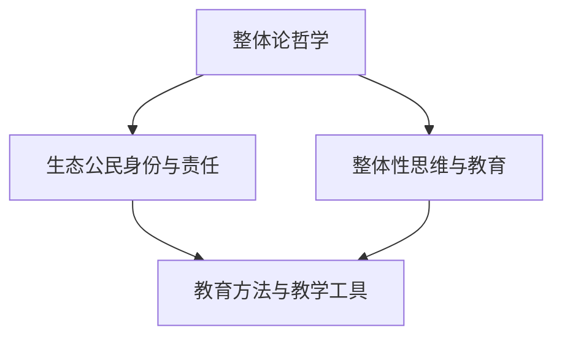

                 

### 生态公民教育计划：培养整体论的世界观

**关键词：**
- 生态公民教育
- 整体论
- 教育变革
- 环境责任
- 社会合作

**摘要：**
随着全球生态危机的加剧，培养一种整体论的世界观成为当务之急。本文探讨生态公民教育计划，旨在通过教育变革，培养学生的环境责任感和整体性思维。文章将分析生态公民教育的背景和意义，介绍整体论的核心概念，并详细探讨理论基础与实践框架。此外，本文还将分享成功案例，提供未来展望与策略，以推动生态公民教育的普及与发展。

## 第一部分：引言与核心概念

### 第1章：生态公民教育的背景和意义

#### 1.1 生态危机下的全球挑战

生态危机已经成为21世纪最为严峻的挑战之一。气候变化、生物多样性丧失、环境污染等问题对人类和地球的生存环境造成了深远影响。据联合国报告，全球平均气温在过去一个世纪内上升了约1.2摄氏度，预计到2100年可能上升3至5摄氏度。这种变化可能导致极端天气事件、海平面上升、水资源短缺等问题，从而威胁到人类的生存和发展。

#### 1.2 整体论视角下的教育变革

在应对生态危机的过程中，教育发挥着至关重要的作用。传统的教育模式过于强调学科分割和个体主义，忽视了整体性和相互依存的重要性。整体论（Holism）提供了一种新的视角，强调各个部分之间的相互关系和整体性。生态公民教育计划旨在通过整体论的教育变革，培养学生的环境责任感和整体性思维，使他们能够更好地应对生态危机。

#### 1.3 生态公民教育的目标

生态公民教育的目标包括以下几个方面：

1. 培养学生对生态系统的理解，包括生物多样性、生态系统服务、环境问题等。
2. 培养学生的环境责任感，使他们认识到自己的行为对生态系统的影响，并采取行动保护环境。
3. 培养学生的整体性思维，使他们能够从整体和长远的角度看待问题，形成可持续发展的观念。
4. 培养学生的跨学科能力，使他们能够综合运用各个学科的知识，解决复杂的生态问题。

### 第2章：生态公民教育的核心概念

#### 2.1 整体论的哲学基础

整体论是一种哲学观点，认为各个部分之间的关系和整体性比单独的部分更为重要。在生态学、生物学、心理学等领域，整体论都得到了广泛的应用。整体论的哲学基础包括：

1. 相互依存：强调各个部分之间的相互关系和相互影响。
2. 整体性：认为整体具有其独特的属性和功能，不可简单分解为各个部分的总和。
3. 综合性：强调从整体和长远的角度看待问题，避免片面和短视的思考方式。

#### 2.2 生态公民身份与责任

生态公民身份强调个体在生态系统中的角色和责任。生态公民不仅是一个生物个体，还是一个负有环境保护责任的公民。生态公民身份的内涵包括：

1. 环境意识：认识到环境问题的重要性，关注生态系统的健康和可持续性。
2. 环境行动：采取具体行动，减少对环境的负面影响，如节能减排、循环利用资源等。
3. 环境教育：积极参与环境保护教育，传播环保知识，提高公众的环境意识。

#### 2.3 整体性思维与教育

整体性思维是一种综合性的思考方式，强调从整体和长远的角度看待问题。在生态公民教育中，整体性思维的重要性体现在以下几个方面：

1. 系统思维：将问题视为一个复杂的系统，关注各个部分之间的相互关系和相互作用。
2. 长期视角：关注长期的环境影响，避免短视和急功近利的决策。
3. 综合性教育：将生态知识与其他学科知识相结合，培养学生的跨学科能力。

## 第二部分：理论基础与实践框架

### 第3章：整体性教育理论

#### 3.1 整体性教育的历史与发展

整体性教育（Holistic Education）起源于20世纪60年代，是对传统教育模式的反思和批判。整体性教育理论强调教育的全面性、综合性和个体性，旨在培养学生的全面发展。随着生态危机的加剧，整体性教育逐渐融入生态公民教育的理念，成为生态公民教育理论的重要基础。

#### 3.2 整体性教育的主要原则

整体性教育的主要原则包括：

1. 整体性：关注学生的全面发展，包括智力、情感、社会和道德等方面。
2. 综合性：将各个学科知识整合在一起，培养学生的跨学科能力。
3. 个体性：尊重每个学生的独特性，关注其个性和兴趣的发展。
4. 实践性：强调理论与实践相结合，培养学生的实际应用能力。

#### 3.3 整体性教育的教学策略

整体性教育的教学策略包括：

1. 项目式学习：通过实际项目，让学生在实践中学习和应用知识。
2. 服务学习：通过参与社区服务活动，培养学生的社会责任感和团队合作能力。
3. 整合课程：将不同学科的知识整合在一起，形成综合性课程。
4. 情境教学：将教学内容与真实情境相结合，提高学生的学习兴趣和参与度。

### 第4章：生态公民教育课程设计

#### 4.1 课程目标与内容框架

生态公民教育课程的目标是培养学生的环境责任感和整体性思维。课程内容框架包括以下几个方面：

1. 环境科学基础知识：介绍生态系统的基本概念、生物多样性、环境问题等。
2. 环境伦理与责任：讨论环境伦理问题，培养学生的环境责任意识。
3. 环境管理与政策：介绍环境管理的基本原则和政策，培养学生的政策分析能力。
4. 环境保护与可持续发展：探讨环境保护和可持续发展的策略，培养学生的可持续发展观念。

#### 4.2 课程实施与评估方法

生态公民教育课程的实施方法包括：

1. 教师引导：教师作为引导者，提供学习资源和指导，引导学生进行自主学习。
2. 小组合作：学生通过小组合作，共同完成任务，培养团队合作能力。
3. 实践活动：组织学生参与环境调查、社区服务等实践活动，提高学生的实际应用能力。

课程评估方法包括：

1. 过程性评价：通过观察、记录、访谈等方式，评估学生在学习过程中的表现。
2. 终结性评价：通过考试、项目展示等方式，评估学生的知识掌握程度和应用能力。
3. 自我评估：鼓励学生进行自我评估，反思自己的学习过程和成果。

#### 4.3 课程案例分享

以下是一个生态公民教育课程的案例：

**课程名称：环境保护与可持续发展**

**课程目标：**
1. 了解环境问题的现状和影响。
2. 掌握环境保护和可持续发展的基本知识。
3. 培养学生的环境责任感和整体性思维。

**课程内容：**
1. 环境问题的现状和影响。
2. 环境保护的基本原则和策略。
3. 可持续发展的概念和案例。
4. 环境管理与政策。

**课程实施：**
1. 教师引导：教师介绍环境问题的现状和影响，引导学生思考解决方案。
2. 小组合作：学生分组讨论环境保护和可持续发展的策略，进行交流分享。
3. 实践活动：组织学生进行环境调查，了解本地区的环境问题，并提出解决方案。

**课程评估：**
1. 过程性评价：通过观察、记录、访谈等方式，评估学生在学习过程中的表现。
2. 终结性评价：通过项目展示和考试，评估学生的知识掌握程度和应用能力。
3. 自我评估：学生进行自我评估，反思自己的学习过程和成果。

### 第5章：教育方法与教学工具

#### 5.1 项目式学习

项目式学习（Project-Based Learning, PBL）是一种以学生为中心的教学方法，通过实际项目，让学生在解决问题的过程中学习和应用知识。项目式学习的特点包括：

1. 问题驱动：以实际问题为驱动，激发学生的兴趣和动机。
2. 自主学习：学生自主选择项目，自主学习和合作完成项目。
3. 实践应用：将知识应用于实际项目，提高学生的实际应用能力。
4. 反思与评估：学生在完成项目后进行反思和评估，总结经验教训。

#### 5.2 服务学习

服务学习（Service-Learning）是一种将学习与社区服务相结合的教学方法，通过参与社区服务活动，培养学生的社会责任感和团队合作能力。服务学习的特点包括：

1. 社区参与：学生参与社区服务活动，了解社区问题和需求。
2. 学习与实践相结合：学生在服务过程中学习和应用知识，提高实际能力。
3. 反思与评估：学生进行反思和评估，总结服务经验和学习成果。
4. 跨学科整合：服务学习项目涉及多个学科领域，促进学生跨学科学习。

#### 5.3 模拟与环境教育

模拟与环境教育（Simulated and Environmental Education）是一种通过模拟环境，让学生在虚拟环境中学习和体验环境保护方法的教学方法。模拟与环境教育的特点包括：

1. 模拟环境：通过模拟环境，让学生在虚拟环境中体验环境保护和可持续发展的过程。
2. 实践操作：学生通过实际操作，学习和掌握环境保护和可持续发展的技能。
3. 反思与评估：学生在模拟环境中进行反思和评估，总结经验和教训。
4. 跨学科整合：模拟与环境教育项目涉及多个学科领域，促进学生跨学科学习。

### 第6章：学校与社区合作

#### 6.1 学校社区合作的模式

学校与社区合作是生态公民教育的重要途径，通过合作，学校与社区可以共同推动环境保护和可持续发展。学校社区合作的模式包括：

1. 项目合作：学校与社区共同开展环境保护项目，如环境调查、社区绿化等。
2. 教育资源共享：学校与社区共享教育资源，如图书馆、实验室等。
3. 教师与社区工作者交流：教师与社区工作者共同参与社区服务活动，分享教育经验和环保理念。
4. 家长参与：家长参与学校与社区的合作项目，共同推动环境保护和可持续发展。

#### 6.2 合作项目设计与实施

以下是一个学校与社区合作的案例：

**项目名称：社区花园建设**

**项目目标：**
1. 增强学生的环境责任感，提高他们对环境保护的认识。
2. 培养学生的团队合作能力和实践能力。
3. 建设一个可持续发展的社区花园，提高社区居民的生活质量。

**项目设计：**
1. 学生分组，每组负责花园的一个区域。
2. 学生进行社区调查，了解社区居民的需求和期望。
3. 学生根据调查结果，制定花园建设方案，包括植物选择、布局设计等。
4. 学生进行花园建设，如挖土、种植、浇水等。

**项目实施：**
1. 学校教师与社区工作者共同指导学生进行项目实施。
2. 学生在社区进行实地考察，了解花园建设的需求和条件。
3. 学生按照建设方案，进行花园建设。
4. 学生定期对花园进行维护和管理，确保花园的可持续发展。

**项目评估：**
1. 学生进行自我评估，总结项目实施过程中的经验和教训。
2. 学校教师对项目进行评估，评估学生的表现和成果。
3. 社区居民对项目进行反馈，提出改进意见和建议。

### 第7章：生态公民教育的评估与反馈

#### 7.1 教育效果评估方法

生态公民教育的评估方法包括定量和定性两种：

1. 定量评估：通过考试、问卷调查等方式，评估学生的知识掌握程度和应用能力。
2. 定性评估：通过观察、访谈、作品分析等方式，评估学生的综合素质和成长过程。

#### 7.2 反馈机制与持续改进

生态公民教育需要建立反馈机制，确保教育的持续改进：

1. 学生反馈：鼓励学生提出意见和建议，改进教育内容和教学方法。
2. 教师反馈：教师根据学生的反馈，调整教学策略，提高教学效果。
3. 社区反馈：社区对学校的教育工作进行评价，提出改进建议。
4. 反馈会议：定期召开反馈会议，讨论教育评估结果和改进措施。

#### 7.3 持续学习与个人成长

生态公民教育不仅仅是一种课程，更是一种持续的学习过程。学生需要在日常生活中践行环保理念，不断学习和成长：

1. 环境意识培养：通过讲座、活动等方式，提高学生的环境意识。
2. 社区参与：鼓励学生参与社区环保活动，践行环保行动。
3. 个人反思：学生定期进行个人反思，总结自己的成长过程和成果。
4. 家庭支持：家长积极参与学生的环保教育，共同推动家庭和社区的环境保护。

### 第8章：成功案例分享

#### 8.1 案例一：学校的整体性教育实践

**项目背景：**某中学开展整体性教育项目，旨在培养学生的环境责任感和整体性思维。

**项目目标：**1. 提高学生对生态系统的认识和理解；2. 培养学生的环境责任感和整体性思维；3. 促进学生的全面发展。

**项目设计：**1. 课程设置：开设环境科学、可持续发展等课程，将环保知识融入各学科教学；2. 实践活动：组织学生进行环境调查、社区服务等实践活动；3. 教师培训：为教师提供整体性教育培训，提高教学水平。

**项目实施：**1. 学生参与环境调查，了解本地区的环境问题；2. 学生进行社区服务，如垃圾分类宣传、环保志愿者等；3. 学生参加环境科学实验和项目研究。

**项目评估：**1. 学生考试成绩：评估学生对环保知识的掌握程度；2. 学生作品展示：评估学生的实践能力和创新思维；3. 学生反馈：了解学生对整体性教育的看法和建议。

**项目成果：**1. 学生的环境责任感和整体性思维得到提升；2. 学生的实践能力和创新思维得到培养；3. 学校与社区的合作关系得到加强。

#### 8.2 案例二：社区参与与可持续发展

**项目背景：**某社区开展生态公民教育项目，旨在提高居民的环境意识和可持续发展观念。

**项目目标：**1. 提高居民对环境问题的认识和理解；2. 培养居民的可持续发展观念；3. 促进社区的环保和可持续发展。

**项目设计：**1. 社区宣传活动：举办环保讲座、展览、宣传册等，提高居民的环境意识；2. 实践活动：组织居民参与垃圾分类、节能减排等活动，践行环保行动；3. 教育培训：为居民提供环保知识和技能培训。

**项目实施：**1. 社区宣传活动：通过海报、广播、社交媒体等方式，宣传环保知识；2. 实践活动：组织居民进行垃圾分类、节能减排等活动；3. 教育培训：举办环保讲座、培训班，提高居民的环保知识。

**项目评估：**1. 居民反馈：了解居民对环保活动的看法和建议；2. 社区环境状况：评估环保活动对社区环境的影响；3. 社区参与度：评估居民参与环保活动的积极性。

**项目成果：**1. 居民的环境意识和可持续发展观念得到提高；2. 社区的环保和可持续发展水平得到提升；3. 社区成员之间的合作关系得到加强。

#### 8.3 案例三：国际生态公民教育项目

**项目背景：**某国际生态公民教育项目，旨在通过跨国合作，推动全球生态公民教育的发展。

**项目目标：**1. 促进国际间的生态公民教育交流与合作；2. 培养具有全球视野的生态公民；3. 推动全球生态保护和可持续发展。

**项目设计：**1. 国际研讨会：举办国际研讨会，邀请各国专家和学者共同探讨生态公民教育的发展；2. 教育项目合作：各国学校共同开展生态公民教育项目，分享经验和成果；3. 学生交流：组织学生进行跨国交流活动，了解不同国家的环保政策和实践。

**项目实施：**1. 国际研讨会：邀请各国专家和学者，共同探讨生态公民教育的发展趋势和策略；2. 教育项目合作：各国学校共同开展生态公民教育项目，分享资源和经验；3. 学生交流：组织学生进行跨国交流活动，了解不同国家的环保政策和实践。

**项目评估：**1. 国际合作效果：评估国际合作项目对生态公民教育的影响；2. 学生反馈：了解学生对跨国交流活动的看法和建议；3. 项目成果：评估国际生态公民教育项目的实际成果和影响力。

**项目成果：**1. 国际合作效果显著，推动了全球生态公民教育的发展；2. 学生的全球视野和环保意识得到提高；3. 促进了各国学校之间的交流和合作，推动了全球生态保护和可持续发展。

### 第9章：案例分析

#### 9.1 案例分析的基本步骤

进行生态公民教育案例分析时，可以遵循以下基本步骤：

1. 确定分析目标：明确分析的目的和关注点，如教育效果、教学方法、学生参与度等。
2. 收集案例资料：收集与案例相关的文献、报告、数据等资料，确保案例的真实性和完整性。
3. 描述案例背景：介绍案例的背景、目标、实施过程等，为分析提供基础信息。
4. 分析案例过程：分析案例的实施过程，包括教育方法、教学内容、学生参与度等，找出成功和不足之处。
5. 提出改进建议：根据分析结果，提出改进教育方法和教学策略的建议。

#### 9.2 生态公民教育中的挑战与解决方案

在实施生态公民教育过程中，可能会面临以下挑战：

1. 教育资源不足：学校和教育部门需要投入更多的资源和资金，支持生态公民教育的发展。
2. 教师专业素养：教师需要具备较高的环境知识和整体性教育能力，才能有效地开展生态公民教育。
3. 学生参与度：学生可能对生态公民教育缺乏兴趣，导致参与度不高。
4. 社会支持：社会对生态公民教育的认知和支持程度不高，影响了教育的实施效果。

针对这些挑战，可以采取以下解决方案：

1. 教育资源投入：政府和学校应加大投入，提供充足的资金和设备支持生态公民教育。
2. 教师专业培训：开展教师专业培训，提高教师的环境知识和整体性教育能力。
3. 激发学生兴趣：通过丰富多样的教学方法和实践活动，激发学生对生态公民教育的兴趣和参与度。
4. 社会宣传与支持：加强社会宣传，提高公众对生态公民教育的认知和支持，形成良好的教育环境。

#### 9.3 案例分析的实际应用

以下是一个案例分析的实际应用：

**案例背景：**某城市中学实施生态公民教育项目，旨在培养学生的环境责任感和整体性思维。

**分析目标：**评估生态公民教育项目对学生环境责任感的影响。

**分析过程：**
1. 描述案例背景：介绍项目的目标、实施过程和评估方法。
2. 收集案例资料：收集学生参与项目前后的环境责任感调查数据。
3. 分析案例过程：分析学生参与项目前后的环境责任感变化，找出影响因素。
4. 提出改进建议：根据分析结果，提出提高学生环境责任感的建议。

**分析结果：**
1. 学生参与项目前，环境责任感较低，主要关注个人利益。
2. 学生参与项目后，环境责任感显著提高，开始关注生态系统的整体性。
3. 影响因素包括：项目实施过程中的实践活动、教师引导和学生间的互动。

**改进建议：**
1. 加强实践活动：通过更多的实地考察和实践活动，提高学生的环境责任感。
2. 教师引导：教师在项目中发挥引导作用，引导学生从整体和长远的角度看待环境问题。
3. 增加互动环节：鼓励学生之间的互动和合作，共同解决环境问题，提高参与度。

### 第四部分：未来展望与策略

#### 第10章：生态公民教育的未来趋势

生态公民教育在未来将面临以下几个趋势：

1. 技术进步：随着科技的不断发展，生态公民教育将更多地运用虚拟现实、人工智能等技术，提高教学效果和学生参与度。
2. 全球化：全球范围内的生态危机需要国际间的合作与交流，生态公民教育将更加注重跨国合作和全球视野。
3. 社会参与：社会对生态公民教育的认知和支持将逐步提高，社会各界将积极参与生态公民教育的实施和推广。

#### 第11章：实施生态公民教育策略

为了有效实施生态公民教育，可以采取以下策略：

1. 教育政策：政府应制定相关政策，支持生态公民教育的实施和推广。
2. 学校改革：学校应积极改革教育模式，将生态公民教育融入各学科教学，提高教育质量。
3. 教师培训：加强教师培训，提高教师的环境知识和整体性教育能力。
4. 社会合作：加强学校与社区、企业等社会力量的合作，共同推动生态公民教育的发展。

#### 第12章：总结与展望

生态公民教育是一项重要的教育变革，对于应对全球生态危机具有重要意义。通过培养整体性思维和环境责任感，生态公民教育将有助于提高学生的综合素质和可持续发展观念。在未来，我们需要进一步推动生态公民教育的普及与发展，为实现全球生态保护和可持续发展做出贡献。

### Mermaid 流程图：整体性教育核心概念关系



### 核心算法原理讲解：生态公民教育课程设计与评估

```python
# 示例代码：课程评估算法
def course_evaluation(learning_outcomes, student_performance):
    """
    课程评估算法，用于评估学生的学习效果。
    
    :param learning_outcomes: 教学目标列表，例如：['了解环境问题', '掌握可持续发展策略']
    :param student_performance: 学生的学习成果列表，例如：['了解环境问题', '掌握可持续发展策略']
    :return: 评估结果，例如：'优秀', '良好', '一般', '待提高'
    """
    
    # 判断学习成果与教学目标匹配度
    match_percentage = len([x for x in student_performance if x in learning_outcomes]) / len(learning_outcomes)
    
    # 根据匹配度评估结果
    if match_percentage >= 0.8:
        return '优秀'
    elif match_percentage >= 0.6:
        return '良好'
    elif match_percentage >= 0.4:
        return '一般'
    else:
        return '待提高'

# 示例使用
evaluation_result = course_evaluation(['了解环境问题', '掌握可持续发展策略'], ['了解环境问题', '掌握可持续发展策略'])
print(f"课程评估结果：{evaluation_result}")
```

### 数学模型和数学公式

$$
E = mc^2
$$

其中，E表示能量，m表示质量，c表示光速。

在生态公民教育中，能量和质量可以理解为知识和能力，光速可以理解为效率。这个公式告诉我们，通过提高知识和能力的质量，并提高应用效率，可以最大程度地发挥生态公民教育的作用。

---

### 作者信息

作者：AI天才研究院/AI Genius Institute & 禅与计算机程序设计艺术 /Zen And The Art of Computer Programming

在撰写技术博客文章时，需要注意以下几点：

1. **文章结构**：确保文章按照目录大纲结构组织，每个章节都有明确的标题和小结，便于读者阅读和理解。

2. **关键词和摘要**：在文章开头列出关键词和摘要，帮助读者快速了解文章的主题和内容。

3. **代码和公式**：确保代码和公式格式正确，便于读者阅读和理解。代码块应使用````python`和````标记，公式应使用LaTeX格式。

4. **逻辑性**：文章应逻辑清晰，论证有力，避免内容重复和逻辑错误。

5. **语言风格**：文章应使用专业的技术语言，同时保持简洁易懂，避免使用过于晦涩难懂的术语。

6. **实际案例**：通过实际案例分析和代码实现，增强文章的实用性和可操作性。

7. **注意事项**：在文章末尾添加注意事项和拓展阅读，帮助读者深入了解相关主题。

通过以上几点，可以撰写出一篇高质量、具有专业性和实用性的技术博客文章。希望以上内容对您有所帮助。如果您有任何疑问或需要进一步指导，请随时告诉我。祝您写作顺利！### 整体性教育理论：生态公民教育的基石

整体性教育理论是生态公民教育计划的理论基础，它强调教育的全面性和综合性，旨在培养学生的全面发展，包括智力、情感、社会和道德等方面。在生态公民教育中，整体性教育理论的应用尤为重要，因为它不仅关注学生的知识获取，还关注学生的情感体验和社会责任感。下面，我们将深入探讨整体性教育理论的历史发展、主要原则以及其与生态公民教育的联系。

#### 3.1 整体性教育的历史与发展

整体性教育（Holistic Education）的概念起源于20世纪60年代，是对当时过于强调学科分割和知识灌输的传统教育模式的反思和批判。整体性教育理论主张教育应该关注学生的全面发展，而不仅仅是知识的学习。这一理论在70年代和80年代逐渐成熟，并在90年代后得到广泛应用。

整体性教育理论的发展受到了多种因素的影响，包括人本主义教育、跨学科教育和多元智能理论等。人本主义教育强调教育的目标是培养全面发展的人，而不仅仅是培养技能和知识。跨学科教育则主张打破学科界限，将不同学科的知识和技能整合在一起，以培养学生的综合能力和创新能力。多元智能理论则认为，每个学生都有不同的智能类型，教育应该尊重和培养学生的个体差异。

随着全球生态危机的加剧，整体性教育理论逐渐与生态公民教育的理念相结合。生态公民教育不仅关注环境问题的解决，还关注个体的社会责任和全球视野。整体性教育理论为生态公民教育提供了理论基础，使其能够更好地培养学生的全面发展。

#### 3.2 整体性教育的主要原则

整体性教育理论包含以下几个主要原则：

1. **综合性**：整体性教育强调教育的综合性，即教育应该涵盖各个学科领域，培养学生的跨学科能力和综合素质。这意味着学生在学习环境科学时，不仅需要了解生态系统的基本知识，还需要掌握经济学、社会学、政治学等相关学科的知识。

2. **个体性**：整体性教育关注每个学生的个性发展和个体需求。教育应该尊重学生的差异，提供个性化的学习体验。例如，在生态公民教育中，教师可以针对不同学生的兴趣和特长，设计不同的学习项目和实践活动，以激发他们的学习动力。

3. **情感性**：整体性教育重视学生的情感体验和情感发展。教育不仅仅是知识的传递，更是情感的交流和价值观的培养。在生态公民教育中，教师可以通过情感教育，培养学生的环境责任感和可持续发展观念，使他们成为具有社会责任感的公民。

4. **社会性**：整体性教育强调教育的社会性，即教育应该培养学生的社会参与意识和团队合作能力。在生态公民教育中，通过社区服务、团队合作等实践活动，学生可以学会如何与他人合作，解决社会问题，成为具有社会责任感的公民。

5. **整体性**：整体性教育的核心是整体性思维。整体性思维要求学生从整体和长远的角度看待问题，认识到各个部分之间的相互关系和整体性。在生态公民教育中，整体性思维有助于学生理解生态系统的复杂性，形成可持续发展的观念。

#### 3.3 整体性教育理论与生态公民教育的联系

整体性教育理论与生态公民教育有着密切的联系，两者在目标、原则和实践方法上都有很多共同之处。

首先，整体性教育理论和生态公民教育的目标都是培养学生的全面发展。整体性教育强调学生的智力、情感、社会和道德发展，而生态公民教育则更具体地关注学生的环境责任感和社会责任感。通过整体性教育，学生可以培养出全面的素质，为成为生态公民打下基础。

其次，整体性教育理论和生态公民教育都强调综合性。整体性教育理论主张教育的综合性，生态公民教育则通过跨学科学习和实践活动，实现知识的综合应用。这种综合性有助于学生从不同角度理解环境问题，形成整体性的解决方案。

再次，整体性教育理论和生态公民教育都重视学生的个体性和情感性。整体性教育理论关注学生的个体发展，生态公民教育则通过情感教育，培养学生的环境责任感和可持续发展观念。这种关注个体和情感的教育方法有助于激发学生的学习兴趣和参与度。

最后，整体性教育理论和生态公民教育都强调社会性和整体性思维。整体性教育理论强调教育的社会性，生态公民教育则通过社区参与和团队合作，培养学生的社会责任感和整体性思维。这种社会性和整体性思维有助于学生理解全球环境问题，形成全球视野。

总之，整体性教育理论为生态公民教育提供了重要的理论基础。通过整体性教育，学生可以培养出全面的素质，为成为生态公民打下坚实的基础。在生态公民教育中，整体性教育理论的应用有助于实现教育的综合性和个体性，培养学生的社会责任感和整体性思维，从而为全球生态保护和可持续发展做出贡献。

### 整体性教育的教学策略

整体性教育的教学策略是实施整体性教育理念的具体方法，旨在通过多样化的教学方法和实践活动，培养学生的综合能力、创新精神和全面发展。在生态公民教育中，教学策略的应用尤为重要，因为它能够帮助学生从不同角度理解环境问题，形成可持续发展的观念。以下是几种常见的整体性教育教学策略及其在生态公民教育中的应用。

#### 3.3.1 项目式学习

项目式学习（Project-Based Learning, PBL）是一种以学生为中心的教学方法，通过实际项目，让学生在解决问题的过程中学习和应用知识。项目式学习的特点包括问题驱动、自主学习、实践应用和反思评估。

在生态公民教育中，项目式学习可以应用于环境问题的研究和解决方案的制定。例如，学生可以开展以下项目：

1. **环境调查项目**：学生可以调查本地的环境问题，如空气质量、水资源状况等，收集数据，分析原因，并提出解决方案。

2. **可持续发展项目**：学生可以研究可持续发展策略，如节能减排、循环经济等，设计项目，实施具体措施，评估效果。

3. **社区环保项目**：学生可以与社区合作，开展垃圾分类、节能降耗等环保活动，提高社区居民的环保意识。

项目式学习的优势在于，它能够激发学生的兴趣和创造力，培养他们的实践能力和团队合作精神。通过实际项目，学生不仅能够学习环境科学的知识，还能培养解决实际问题的能力，形成可持续发展的观念。

#### 3.3.2 服务学习

服务学习（Service-Learning）是一种将学习与社区服务相结合的教学方法，通过参与社区服务活动，培养学生的社会责任感和团队合作能力。服务学习的特点包括社区参与、学习与实践相结合、反思评估和跨学科整合。

在生态公民教育中，服务学习可以应用于环境保护和可持续发展的实践活动。例如，学生可以参与以下服务学习活动：

1. **环境志愿服务**：学生可以参加环境志愿服务，如植树造林、清理垃圾等，直接参与环境保护工作。

2. **社区环保项目**：学生可以参与社区环保项目，如垃圾分类宣传、节能减排活动等，提高社区居民的环保意识。

3. **环保知识普及**：学生可以组织环保讲座、展览等活动，向社区居民普及环保知识，提高公众的环境意识。

服务学习的优势在于，它能够将理论知识与实际应用相结合，培养学生的社会责任感和团队合作精神。通过服务学习，学生不仅能够学习环境科学的知识，还能通过实践体验，形成可持续发展的观念，成为具有社会责任感的公民。

#### 3.3.3 整合课程

整合课程（Integrated Curriculum）是一种将不同学科的知识整合在一起的教学方法，通过跨学科的学习，培养学生的综合能力和创新思维。整合课程的特点包括跨学科整合、综合性教学和协作学习。

在生态公民教育中，整合课程可以应用于环境科学、社会学、经济学等学科的教学。例如，学生可以学习以下整合课程：

1. **环境科学与社会学整合**：通过学习环境社会学，学生可以了解环境问题对社会的影响，以及社会因素对环境问题的贡献。

2. **环境经济学与可持续发展**：通过学习环境经济学，学生可以了解环境资源的价值评估，以及经济发展与环境保护的平衡。

3. **环境管理与政策**：通过学习环境管理与政策，学生可以了解环境管理的基本原则和政策，以及政策制定的过程和影响。

整合课程的优势在于，它能够打破学科界限，培养学生的跨学科思维和综合能力。通过整合课程，学生不仅能够学习环境科学的知识，还能从不同学科的角度理解环境问题，形成全面的解决方案。

#### 3.3.4 情境教学

情境教学（Situational Teaching）是一种将教学内容与真实情境相结合的教学方法，通过情境创设，提高学生的学习兴趣和参与度。情境教学的特点包括情境创设、互动教学和问题解决。

在生态公民教育中，情境教学可以应用于环境问题的分析和解决方案的制定。例如，学生可以学习以下情境教学案例：

1. **模拟联合国**：学生可以模拟联合国环境会议，讨论全球环境问题，制定解决方案。

2. **环保角色扮演**：学生可以扮演不同的角色，如政府官员、环保组织代表、社区居民等，探讨环境问题的解决方案。

3. **环境问题辩论**：学生可以围绕特定环境问题进行辩论，如气候变化、生物多样性保护等，培养批判思维和表达能力。

情境教学的优势在于，它能够将抽象的理论知识与具体的情境相结合，提高学生的学习兴趣和参与度。通过情境教学，学生不仅能够学习环境科学的知识，还能通过实际情境，理解环境问题的复杂性和多样性。

综上所述，整体性教育的教学策略包括项目式学习、服务学习、整合课程和情境教学等。这些策略在生态公民教育中的应用，有助于培养学生的综合能力、创新精神和全面发展，使他们成为具有环境责任感和可持续发展观念的生态公民。

通过多样化的教学策略，生态公民教育能够更好地实现其教育目标，为全球生态保护和可持续发展做出贡献。在未来，我们需要进一步探索和实践这些教学策略，以不断提高生态公民教育的质量，培养更多优秀的生态公民。

### 生态公民教育课程设计

课程设计是生态公民教育的核心环节，它直接决定了教育目标的实现和学生综合素质的提升。一个成功的课程设计需要明确课程目标、设计内容框架、实施教学策略以及进行评估与反馈。以下是生态公民教育课程设计的基本步骤和具体方法。

#### 4.1 课程目标

生态公民教育的课程目标主要包括以下几个方面：

1. **知识目标**：学生需要掌握环境科学的基本概念、环境问题的成因及影响、环境保护的基本方法等。

2. **能力目标**：学生需要具备解决环境问题的能力，包括数据分析、实验操作、问题解决等。

3. **情感目标**：学生需要培养对环境的责任感，形成可持续发展的观念，具备全球视野。

4. **价值观目标**：学生需要树立生态文明观念，理解人与自然和谐共生的意义。

#### 4.2 内容框架

生态公民教育的课程内容框架通常包括以下几部分：

1. **环境科学基础**：介绍生态系统的基本概念、生物多样性、环境问题等。

2. **环境伦理与责任**：探讨环境伦理问题，培养学生的环境责任意识。

3. **环境保护与可持续发展**：介绍环境保护和可持续发展的基本原理、策略和实践。

4. **环境政策与管理**：分析环境政策、环境法律法规及其实施效果。

5. **环境保护实践**：组织学生参与环境调查、社区服务、环保项目等实践活动。

#### 4.3 课程实施

课程实施是课程设计的关键环节，需要采用多种教学策略和方法，确保课程目标的实现。以下是几种常见的课程实施方法：

1. **项目式学习**：通过实际项目，让学生在解决环境问题的过程中学习和应用知识。例如，可以组织学生进行环境调查、设计环保项目等。

2. **服务学习**：将学习与社区服务相结合，通过参与社区服务活动，培养学生的社会责任感和团队合作能力。例如，可以组织学生进行垃圾分类宣传、环保志愿者服务等。

3. **案例教学**：通过分析真实案例，让学生了解环境问题的实际情况和解决方法。例如，可以分析某地的环境污染案例，探讨解决策略。

4. **讨论与辩论**：组织学生进行小组讨论和辩论，培养学生的批判性思维和表达能力。例如，可以围绕特定环境问题进行辩论，如气候变化、生物多样性保护等。

5. **实践操作**：组织学生进行实验操作、模拟演练等，提高学生的实践能力和问题解决能力。例如，可以组织学生进行水质检测、土壤分析等实验。

#### 4.4 评估与反馈

评估与反馈是课程设计的必要环节，有助于了解学生的学习效果和课程实施的效果，为课程改进提供依据。以下是几种常见的评估与反馈方法：

1. **过程性评估**：通过观察、记录、访谈等方式，评估学生在学习过程中的表现，如参与度、合作精神、问题解决能力等。

2. **终结性评估**：通过考试、项目展示等方式，评估学生的知识掌握程度和应用能力。例如，可以设置环境科学知识考试、环保项目评估等。

3. **学生自评与互评**：鼓励学生进行自我评估和相互评价，反思自己的学习过程和成果，提高学生的自我管理能力和合作能力。

4. **教师评价**：教师根据学生的学习表现和成果，进行综合评价，提出改进建议。

5. **反馈机制**：建立反馈机制，及时收集学生的反馈意见，改进教学策略和方法。

#### 4.5 课程案例分享

以下是一个生态公民教育课程的案例：

**课程名称**：生态公民教育实践课程

**课程目标**：
1. 了解环境科学的基本概念和环境问题的现状。
2. 培养学生的环境责任感和可持续发展观念。
3. 提高学生的实践能力和团队合作精神。

**课程内容**：
1. 环境科学基础：介绍生态系统的基本概念、生物多样性、环境问题等。
2. 环境伦理与责任：探讨环境伦理问题，培养学生的环境责任意识。
3. 环境保护与可持续发展：介绍环境保护和可持续发展的基本原理、策略和实践。
4. 环境政策与管理：分析环境政策、环境法律法规及其实施效果。
5. 环境保护实践：组织学生进行环境调查、垃圾分类宣传、环保志愿者服务等。

**课程实施**：
1. 项目式学习：学生分组进行环境调查项目，如水质检测、空气质量监测等，分析数据并提出解决方案。
2. 服务学习：学生参与社区环保活动，如垃圾分类宣传、环保志愿者服务等，提高社区居民的环保意识。
3. 案例教学：分析真实环境问题案例，探讨解决策略。
4. 讨论与辩论：围绕特定环境问题进行讨论和辩论，培养批判性思维和表达能力。
5. 实践操作：进行环境科学实验，如水质检测、土壤分析等，提高实践能力。

**课程评估**：
1. 过程性评估：通过观察、记录、访谈等方式，评估学生在学习过程中的表现。
2. 终结性评估：通过项目展示、考试等方式，评估学生的知识掌握程度和应用能力。
3. 学生自评与互评：鼓励学生进行自我评估和相互评价，反思自己的学习过程和成果。
4. 教师评价：教师根据学生的学习表现和成果，进行综合评价，提出改进建议。

**课程成果**：
1. 学生对环境问题的认识和理解得到提高。
2. 学生的环境责任感和可持续发展观念得到培养。
3. 学生的实践能力和团队合作精神得到增强。
4. 社区居民的环保意识得到提高。

通过这个案例，我们可以看到生态公民教育课程设计的关键在于明确课程目标、设计内容框架、实施多样化的教学策略和进行有效的评估与反馈。只有通过科学的课程设计，才能实现生态公民教育的目标，培养学生的全面发展。

### 教育方法与教学工具

在生态公民教育中，教育方法和教学工具的选择和运用对于实现教育目标至关重要。本文将介绍几种常用的教育方法与教学工具，包括项目式学习、服务学习、模拟与环境教育等，并探讨它们在生态公民教育中的应用。

#### 5.1 项目式学习

项目式学习（Project-Based Learning, PBL）是一种以学生为中心的教学方法，通过实际项目，让学生在解决问题的过程中学习和应用知识。PBL 的特点包括问题驱动、自主学习、实践应用和反思评估。

在生态公民教育中，项目式学习可以应用于环境问题的研究和解决方案的制定。具体应用方式如下：

1. **环境调查项目**：学生可以针对某一环境问题进行调查，如空气质量、水资源状况等。通过收集数据、分析原因，提出解决方案。

2. **可持续发展项目**：学生可以研究某一地区的可持续发展策略，如节能减排、循环经济等。通过设计项目、实施措施、评估效果，提高环境保护意识。

3. **社区环保项目**：学生可以与社区合作，开展垃圾分类、节能降耗等环保活动。通过参与实践，提高环保意识和团队合作能力。

例如，在一个项目中，学生可以调查学校周边的垃圾分类情况。首先，学生可以实地观察垃圾分类的实施情况，记录存在的问题。然后，学生可以通过访谈、问卷调查等方式收集数据，分析问题原因。最后，学生可以提出改进建议，如改进垃圾分类设施、加强环保宣传等，并制定具体的实施计划。

通过项目式学习，学生不仅能够学习环境科学的知识，还能培养解决实际问题的能力，形成可持续发展的观念。

#### 5.2 服务学习

服务学习（Service-Learning）是一种将学习与社区服务相结合的教学方法，通过参与社区服务活动，培养学生的社会责任感和团队合作能力。服务学习的特点包括社区参与、学习与实践相结合、反思评估和跨学科整合。

在生态公民教育中，服务学习可以应用于环境保护和可持续发展的实践活动。具体应用方式如下：

1. **环境志愿服务**：学生可以参加各种环保志愿服务，如植树造林、清理垃圾等。通过直接参与环保活动，提高环保意识。

2. **社区环保项目**：学生可以与社区合作，开展垃圾分类、节能减排等环保项目。通过服务社区，培养社会责任感和团队合作能力。

3. **环保知识普及**：学生可以组织环保讲座、展览等活动，向社区居民普及环保知识，提高公众的环保意识。

例如，在一个社区环保项目中，学生可以组织垃圾分类宣传活动。首先，学生可以通过问卷调查了解社区居民对垃圾分类的认识和态度。然后，学生可以设计宣传材料，如海报、宣传册等，向社区居民宣传垃圾分类的重要性。最后，学生可以开展宣传活动，如发放宣传材料、讲解垃圾分类方法等，提高社区居民的环保意识。

通过服务学习，学生不仅能够学习环境科学的知识，还能通过实际服务体验，形成可持续发展的观念，培养社会责任感和团队合作能力。

#### 5.3 模拟与环境教育

模拟与环境教育是一种通过模拟环境，让学生在虚拟环境中学习和体验环境保护方法的教学方法。模拟与环境教育的特点包括模拟环境、实践操作、反思评估和跨学科整合。

在生态公民教育中，模拟与环境教育可以应用于环境问题的分析和解决方案的制定。具体应用方式如下：

1. **环境模拟实验**：学生可以在模拟环境中进行环境实验，如水质检测、空气质量监测等。通过实验，学生可以了解环境问题的成因和影响。

2. **环境角色扮演**：学生可以扮演不同的角色，如政府官员、环保组织代表、社区居民等，探讨环境问题的解决方案。

3. **环境模拟游戏**：学生可以通过环境模拟游戏，体验环境保护和可持续发展的过程。通过游戏，学生可以了解环境保护的重要性，培养可持续发展的观念。

例如，在一个环境模拟实验中，学生可以模拟水质污染的过程。首先，学生可以设置实验装置，模拟河流水质污染的情况。然后，学生可以通过添加不同污染物，观察水质变化，分析污染物对生态系统的影响。最后，学生可以提出解决方案，如改进污水处理设施、减少污染物排放等。

通过模拟与环境教育，学生可以在虚拟环境中体验环境问题，培养解决实际问题的能力，形成可持续发展的观念。

综上所述，项目式学习、服务学习和模拟与环境教育是生态公民教育中常用的教育方法和教学工具。这些方法和工具不仅能够帮助学生掌握环境科学的知识，还能培养他们的实践能力和社会责任感，为全球生态保护和可持续发展做出贡献。

### 学校与社区合作

学校与社区合作是生态公民教育不可或缺的一部分，它不仅有助于提高学生的环境责任感和实践能力，还能增强社区成员的环保意识，推动可持续发展。以下是学校与社区合作的几种模式、合作项目的设计与实施、社区参与及其支持措施。

#### 6.1 学校与社区合作的模式

1. **项目合作**：学校与社区共同开展环境保护项目，如社区绿化、环境监测等。这种模式有助于整合资源，提高项目效果。

2. **教育资源共享**：学校与社区共享教育资源，如图书馆、实验室等。这种模式有助于提高教育质量，满足不同层次的学习需求。

3. **教师与社区工作者交流**：教师与社区工作者共同参与社区服务活动，分享教育经验和环保理念。这种模式有助于加强教师的专业发展，提升社区的环境教育水平。

4. **家长参与**：家长积极参与学校与社区的合作项目，共同推动环境保护和可持续发展。这种模式有助于形成家庭、学校、社区三位一体的教育网络。

#### 6.2 合作项目的设计与实施

以下是一个学校与社区合作项目的案例：

**项目名称**：社区环保行动

**项目目标**：
1. 提高社区居民的环保意识。
2. 培养学生的环境责任感和实践能力。
3. 推动社区的环保和可持续发展。

**项目设计**：
1. **前期准备**：学校与社区共同制定项目计划，明确项目目标、内容和时间安排。
2. **学生培训**：教师为参与项目的学生提供环保知识培训，提高他们的环保技能。
3. **社区动员**：学校与社区共同动员居民参与项目，通过宣传、讲座等方式提高居民对项目的认识和参与度。

**项目实施**：
1. **环境监测**：学生和社区志愿者一起进行环境监测，如空气质量监测、水质检测等，记录数据，分析环境状况。
2. **环保宣传**：学生和社区志愿者一起开展环保宣传活动，如发放环保宣传资料、举办环保讲座等，提高居民的环保意识。
3. **环保实践**：学生和社区志愿者一起参与环保实践活动，如垃圾分类、节能减排等，践行环保行动。

**项目评估**：
1. **居民反馈**：通过问卷调查、访谈等方式收集居民对项目的反馈，了解项目的影响和效果。
2. **学生反思**：学生进行项目反思，总结经验和教训，提出改进建议。
3. **教师评价**：教师对项目进行评价，分析学生的表现和成果，为今后的项目提供参考。

#### 6.3 社区参与与支持

社区参与是合作项目成功的关键，以下是几种促进社区参与和支持的措施：

1. **社区宣传**：通过社区公告栏、社交媒体、社区会议等方式，宣传合作项目的意义和内容，吸引居民参与。

2. **社区动员**：组织社区志愿者、居民代表等参与项目策划和实施，提高他们的参与度和责任感。

3. **社区支持**：为社区参与者提供必要的技术支持、物资支持等，确保项目顺利进行。

4. **社区反馈**：及时收集社区参与者的反馈意见，调整项目内容和策略，提高项目的适应性和有效性。

通过学校与社区的合作，可以形成一种互利共赢的局面。学校获得社区的支持和资源，提高教育质量和学生的实践能力；社区则通过参与项目，提高环保意识和可持续发展水平。这种合作模式不仅有助于实现生态公民教育的目标，也为构建美丽家园、实现可持续发展做出了积极贡献。

### 生态公民教育的评估与反馈

生态公民教育的评估与反馈是确保教育目标实现和持续改进的重要环节。有效的评估与反馈机制可以衡量教育成果，发现问题和不足，为教育改进提供依据。以下是生态公民教育评估与反馈的几种方法及其在实践中的应用。

#### 7.1 教育效果评估方法

生态公民教育的评估方法可以分为定量评估和定性评估两种：

1. **定量评估**：通过量化的指标和工具，评估学生的知识掌握程度、实践能力、可持续发展观念等。例如，可以采用考试、问卷调查、数据分析等方法。

   - **考试**：通过笔试、口试等方式，评估学生对环境科学知识、政策法规的理解和应用能力。
   - **问卷调查**：设计问卷调查，收集学生对环境问题的认识、态度和行为的改变。
   - **数据分析**：通过收集和分析学生的环境行为数据，如垃圾分类、节能减排等，评估他们的环保行为。

2. **定性评估**：通过观察、访谈、作品分析等方式，评估学生的综合素质、情感体验和社会参与度等。例如，可以采用课堂观察、学生访谈、项目成果分析等方法。

   - **课堂观察**：教师通过观察学生在课堂上的表现，如参与度、互动情况等，评估他们的学习状态和进步。
   - **学生访谈**：通过与学生进行个别或小组访谈，了解他们的学习体验、感受和反思。
   - **项目成果分析**：分析学生完成的项目报告、实验报告、作品等，评估他们的实践能力和创新思维。

#### 7.2 反馈机制与持续改进

建立有效的反馈机制是生态公民教育持续改进的关键。以下是几种常见的反馈机制及其应用：

1. **学生自我反馈**：鼓励学生进行自我评估，反思自己的学习过程和成果。这种机制有助于培养学生的自我管理能力和自我反思能力。

   - **学习日志**：学生记录自己的学习过程、体验和反思，定期进行总结和评价。
   - **自我评估表**：学生根据设定的评估标准，对自己在知识、能力、情感等方面的表现进行自我评估。

2. **教师反馈**：教师通过课堂评价、项目评审等方式，给予学生具体的反馈和建议，帮助学生找到改进方向。

   - **课堂评价**：教师通过课堂提问、讨论、作业等方式，评估学生的学习效果，并及时给予反馈。
   - **项目评审**：教师组织项目评审会，对学生的项目成果进行评价，提出改进意见。

3. **学生互评**：鼓励学生之间进行相互评价，通过交流反馈，提高学生的合作能力和反思能力。

   - **小组讨论**：学生在小组讨论中，分享自己的观点和经验，互相学习和改进。
   - **互评表**：学生根据设定的评估标准，对同伴的项目报告、实验结果等进行评价。

4. **社区反馈**：邀请社区代表、家长等参与评估，收集他们的反馈意见，确保教育成果符合社区需求。

   - **社区调查**：通过问卷调查、访谈等方式，了解社区对生态公民教育项目的评价和建议。
   - **社区反馈会**：定期召开社区反馈会，听取社区代表和家长的意见和建议，改进教育项目。

#### 7.3 持续学习与个人成长

生态公民教育不仅仅是一种课程，更是一种持续的学习过程。学生需要在日常生活中践行环保理念，不断学习和成长。以下是几种促进持续学习和个人成长的措施：

1. **环境意识培养**：通过讲座、活动等方式，提高学生的环境意识。

   - **环保讲座**：邀请环保专家、学者进行讲座，分享环境知识和实践经验。
   - **环保活动**：组织学生参与环保活动，如植树节、清洁日等，提高他们的环保参与度。

2. **社区参与**：鼓励学生参与社区环保活动，践行环保行动。

   - **环保志愿者**：组织学生成为环保志愿者，参与垃圾分类、节能减排等社区环保项目。
   - **社区服务**：鼓励学生参与社区服务，如帮助孤寡老人、清理公共区域等，培养他们的社会责任感。

3. **个人反思**：学生定期进行个人反思，总结自己的学习过程和成果。

   - **反思日记**：学生记录自己的学习心得、感悟和反思，促进自我成长。
   - **反思会议**：定期召开反思会议，学生分享自己的学习经验和教训，互相学习、共同进步。

4. **家庭支持**：家长积极参与学生的环保教育，共同推动家庭和社区的环境保护。

   - **家庭环保**：家长和学生一起制定家庭环保计划，如节约用水、减少废弃物等。
   - **家庭交流**：家长与孩子分享环保经验和感悟，共同参与环保活动，增强家庭环保意识。

通过有效的评估与反馈机制，生态公民教育能够不断改进，提高教育质量，培养更多具有环境责任感和可持续发展观念的生态公民。同时，持续学习与个人成长机制的建立，有助于学生在日常生活中践行环保理念，成为环保行动的倡导者和实践者，为全球生态保护和可持续发展做出贡献。

### 成功案例分享

在生态公民教育的实施过程中，世界各地有许多成功的案例，这些案例展示了整体性教育理论的实践效果，以及生态公民教育对学生和社会的深远影响。以下是几个典型的成功案例及其分析。

#### 8.1 案例一：学校的整体性教育实践

**案例背景**：
某中学引入整体性教育理念，通过综合课程、实践活动和跨学科教学，培养学生的环境责任感和整体性思维。

**案例内容**：
1. **综合课程**：学校将环境科学、可持续发展、社会学等课程整合在一起，形成综合课程体系。学生不仅学习环境科学知识，还学习社会学和经济学等跨学科知识，从而形成全面的认识。
2. **实践活动**：学校组织学生参与环境调查、垃圾分类、节能减排等实践活动。通过实践，学生将理论知识与实际应用相结合，提高了实践能力和环保意识。
3. **跨学科教学**：教师跨学科合作，设计综合性的教学活动。例如，在环境科学课程中，教师不仅讲解生态系统的知识，还引入社会学、经济学等领域的知识，帮助学生从不同角度理解环境问题。

**案例效果**：
- 学生对环境问题的认识和关注显著提高。
- 学生的实践能力和创新能力得到增强。
- 学校与社区的环保合作更加紧密，社区环境得到改善。

**案例分析**：
这个案例展示了整体性教育理论的实践效果。通过综合课程和实践活动，学生不仅学习了环境科学知识，还培养了跨学科思维和实践能力。这种教育模式有助于学生形成整体性思维，提高他们的环境责任感和可持续发展观念。

#### 8.2 案例二：社区参与与可持续发展

**案例背景**：
某城市社区开展生态公民教育项目，通过社区参与和可持续发展实践，提高居民的环境意识和可持续发展观念。

**案例内容**：
1. **社区宣传活动**：社区组织环保讲座、展览、宣传册等活动，提高居民对环境问题的认识。例如，社区邀请环保专家进行讲座，向居民普及环保知识。
2. **可持续发展实践**：社区开展垃圾分类、节能减排等可持续发展实践。例如，社区设置了垃圾分类回收点，鼓励居民参与垃圾分类；社区还组织了节能减排活动，提高居民的节能意识。
3. **社区参与**：社区鼓励居民参与环保项目的设计和实施。例如，社区组织居民进行环境调查，收集居民对环保项目的建议；居民还参与了社区花园的建设和维护。

**案例效果**：
- 居民的环境意识和可持续发展观念显著提高。
- 社区的环保和可持续发展水平得到提升。
- 社区成员之间的合作关系得到加强。

**案例分析**：
这个案例展示了社区参与在生态公民教育中的重要性。通过社区宣传活动和可持续发展实践，居民不仅提高了对环境问题的认识，还积极参与到环保行动中。这种模式有助于培养居民的环保意识和可持续发展观念，同时也促进了社区成员之间的合作与交流。

#### 8.3 案例三：国际生态公民教育项目

**案例背景**：
某国际生态公民教育项目，通过跨国合作，推动全球生态公民教育的发展。

**案例内容**：
1. **国际研讨会**：项目组织国际研讨会，邀请各国专家和学者共同探讨生态公民教育的发展趋势和策略。研讨会内容涵盖了环境教育、可持续发展、全球合作等多个方面。
2. **教育项目合作**：各国学校共同开展生态公民教育项目，分享资源和经验。例如，某个国家的学校开展了垃圾分类项目，其他国家学校则提供了相关技术和支持。
3. **学生交流**：项目组织学生进行跨国交流活动，了解不同国家的环保政策和实践。学生通过参观、交流、讨论等方式，学习其他国家的环保经验，拓宽国际视野。

**案例效果**：
- 国际合作效果显著，推动了全球生态公民教育的发展。
- 学生的全球视野和环保意识得到提高。
- 促进了各国学校之间的交流和合作，推动了全球生态保护和可持续发展。

**案例分析**：
这个案例展示了国际合作在生态公民教育中的重要性。通过跨国合作，各国学校分享了资源和经验，推动了全球生态公民教育的发展。这种模式不仅提高了学生的全球视野和环保意识，还促进了国际间的文化交流与合作，为全球生态保护和可持续发展做出了积极贡献。

通过以上案例，我们可以看到生态公民教育的成功实施需要整体性教育理论的指导，以及社区参与和国际合作的推动。这些案例不仅展示了生态公民教育的实践效果，也为其他地区和学校提供了宝贵的经验和借鉴。

### 案例分析

进行生态公民教育案例分析是理解和评估教育项目成效的关键步骤。以下是一个具体的案例分析过程，以及生态公民教育中常见的挑战和解决方案。

#### 9.1 案例分析的基本步骤

1. **确定分析目标**：明确分析的目的和关注点，如教育效果、教学方法、学生参与度等。

2. **收集案例资料**：收集与案例相关的文献、报告、数据等资料，确保案例的真实性和完整性。

3. **描述案例背景**：介绍案例的背景、目标、实施过程等，为分析提供基础信息。

4. **分析案例过程**：分析案例的实施过程，包括教育方法、教学内容、学生参与度等，找出成功和不足之处。

5. **提出改进建议**：根据分析结果，提出改进教育方法和教学策略的建议。

#### 9.2 生态公民教育中的挑战与解决方案

在实施生态公民教育过程中，可能会面临以下挑战：

1. **教育资源不足**：学校和教育部门可能缺乏足够的资金、设备和教材，影响了教育的质量和效果。

   **解决方案**：
   - **增加资金投入**：政府和社会各界应增加对生态公民教育的资金投入，支持教育项目的实施。
   - **共享资源**：鼓励学校之间、社区之间共享教育资源，如图书馆、实验室等，提高资源利用率。

2. **教师专业素养不足**：教师可能缺乏生态公民教育的专业知识和教学方法，难以有效地实施教育项目。

   **解决方案**：
   - **教师培训**：开展教师培训，提高他们的生态公民教育素养和教学能力。
   - **经验交流**：鼓励教师之间进行经验交流和分享，互相学习，共同提高。

3. **学生参与度不高**：学生可能对生态公民教育缺乏兴趣，参与度不高，影响了教育效果。

   **解决方案**：
   - **激发兴趣**：通过丰富多样的教学方法和实践活动，如项目式学习、服务学习等，激发学生的兴趣。
   - **激励机制**：设置奖励和激励机制，鼓励学生积极参与教育项目。

4. **社会支持不足**：社会对生态公民教育的认知和支持程度不高，影响了教育项目的推广和实施。

   **解决方案**：
   - **宣传推广**：通过媒体、讲座、活动等方式，提高社会对生态公民教育的认知和支持。
   - **社区合作**：加强与社区的沟通和合作，共同推动生态公民教育的发展。

#### 9.3 案例分析的实际应用

以下是一个案例分析的实际应用：

**案例背景**：
某学校实施了一项生态公民教育项目，旨在通过环境调查、社区服务、项目研究等方式，提高学生的环境责任感和整体性思维。

**分析目标**：评估生态公民教育项目对学生环境责任感的影响。

**分析过程**：
1. **描述案例背景**：项目包括环境调查、社区服务和项目研究等环节，学生参与了项目的全过程。
2. **收集案例资料**：收集学生参与项目前后的环境责任感调查数据，包括问卷调查、访谈记录等。
3. **分析案例过程**：分析学生参与项目前后的环境责任感变化，找出影响因素。
4. **提出改进建议**：根据分析结果，提出改进项目设计和方法，以提高学生环境责任感。

**分析结果**：
1. 学生参与项目前，环境责任感较低，主要关注个人利益。
2. 学生参与项目后，环境责任感显著提高，开始关注生态系统的整体性。
3. 影响因素包括：项目实施过程中的实践活动、教师引导和学生间的互动。

**改进建议**：
1. **加强实践活动**：通过更多的实地考察和实践活动，提高学生的环境责任感。
2. **教师引导**：教师在项目中发挥引导作用，引导学生从整体和长远的角度看待环境问题。
3. **增加互动环节**：鼓励学生之间的互动和合作，共同解决环境问题，提高参与度。

通过这个案例分析，我们可以看到生态公民教育项目在提高学生环境责任感方面的积极影响。同时，分析结果也为项目改进提供了具体建议，有助于进一步提高教育效果。

### 未来展望与策略

#### 第10章：生态公民教育的未来趋势

生态公民教育在全球范围内正逐渐成为一种重要的教育趋势，其未来发展将受到技术进步、全球化背景和社会需求等多方面因素的影响。以下是生态公民教育未来可能面临的主要趋势：

1. **技术进步**：随着人工智能、大数据、物联网等技术的迅速发展，生态公民教育将更加智能化和个性化。例如，虚拟现实（VR）和增强现实（AR）技术可以为学生提供沉浸式的环境体验，帮助他们更好地理解环境问题；大数据分析可以为学生提供更准确的环境信息，促进他们的研究工作。

2. **全球化**：全球气候变化和环境问题需要全球合作和共同行动。生态公民教育将加强国际间的交流与合作，推动全球环境教育和可持续发展。通过跨国项目、国际研讨会和合作研究，各国学校可以分享经验和最佳实践，共同应对全球生态挑战。

3. **社会需求**：随着人们对环境问题的关注不断增加，社会对生态公民教育的需求也日益增长。未来，生态公民教育将更注重培养具有全球视野和可持续发展观念的公民，以应对日益严峻的生态挑战。

4. **教育创新**：生态公民教育将不断探索和创新教育模式和方法。例如，项目式学习、服务学习和跨学科教学等创新方法将更加普及，以激发学生的学习兴趣和创造力，提高他们的实践能力和环境责任感。

#### 第11章：实施生态公民教育策略

为了有效实施生态公民教育，需要从政策、学校、家庭和社会等多个层面采取综合策略。以下是几个关键策略：

1. **政策支持**：政府应制定和实施相关政策，为生态公民教育提供法律保障和资金支持。例如，制定环境保护法、可持续发展政策等，为生态公民教育提供法律依据；增加教育经费，支持学校的生态公民教育项目。

2. **学校改革**：学校应积极改革教育模式，将生态公民教育纳入课程体系，确保每个学生都能够接受相关的教育。例如，开设环境科学、可持续发展等课程，将环保知识融入各学科教学；开展多样化的实践活动，提高学生的实践能力和环境责任感。

3. **教师培训**：教师是实施生态公民教育的重要力量，应加强教师培训，提高他们的环境知识和教学能力。例如，举办教师培训班、研讨会，分享环保教学经验和最佳实践；鼓励教师参与国际交流，学习先进的教育理念和方法。

4. **家庭参与**：家庭是学生成长的重要环境，家长应积极参与生态公民教育，共同推动家庭和社区的环境保护。例如，家长可以参与学校组织的环保活动，与孩子一起学习和实践环保知识；在家庭中推广环保生活方式，如垃圾分类、节能减排等。

5. **社会合作**：学校与社区、企业、环保组织等社会力量应加强合作，共同推动生态公民教育的发展。例如，社区可以提供环保实践活动和资源支持，企业可以提供资金和技术支持，环保组织可以提供专业知识和技术指导。

#### 第12章：总结与展望

生态公民教育是培养具有环境责任感和可持续发展观念的重要途径。通过整体性教育和多样化教学策略，生态公民教育不仅能够提高学生的综合素质，还能推动全球生态保护和可持续发展。未来，随着技术进步和全球化背景的推动，生态公民教育将面临新的机遇和挑战。我们需要从政策、学校、家庭和社会等多个层面共同努力，推动生态公民教育的普及和发展，为构建美丽家园、实现全球可持续发展做出贡献。

### 总结与展望

生态公民教育作为培养具有环境责任感和可持续发展观念的重要手段，已经引起了全球范围内的关注。通过整体性教育和多样化教学策略，生态公民教育不仅提升了学生的综合素质，也为全球生态保护和可持续发展做出了积极贡献。

#### 12.1 教育改革的重要性

教育改革是推动社会进步和人类发展的关键。在生态危机日益严峻的背景下，生态公民教育的改革显得尤为重要。它不仅有助于提高学生的环境意识和责任感，还能培养他们解决复杂环境问题的能力。通过教育改革，我们可以培养出更多具有全球视野和可持续发展观念的公民，为实现全球生态保护和可持续发展奠定坚实基础。

#### 12.2 生态公民教育的意义

生态公民教育的意义在于：

1. **培养环境责任感**：通过生态公民教育，学生可以了解环境问题的严重性，认识到自己在环境问题中的角色和责任，从而培养出强烈的环保意识。
2. **促进可持续发展观念**：生态公民教育能够引导学生从整体和长远的角度看待问题，形成可持续发展的观念，从而为未来社会的可持续发展提供支持。
3. **提高综合素质**：生态公民教育不仅关注学生的知识学习，还关注他们的情感体验、社会参与和创新能力，从而提高学生的综合素质。
4. **推动社会进步**：生态公民教育有助于提高公众对环境问题的关注和认识，促进社会共识的形成，为全球生态保护和可持续发展提供动力。

#### 12.3 个人与社会的责任

在生态公民教育中，个人和社会都承担着重要的责任：

1. **个人责任**：每个个体都应积极参与生态公民教育，提高自己的环境意识和责任感。在日常生活中，践行环保行为，如垃圾分类、节能减排等，为环境保护贡献自己的力量。
2. **社会责任**：政府、学校、企业和社会组织都应积极参与生态公民教育的推广和实践。政府应制定相关政策，提供资金支持；学校应将生态公民教育纳入课程体系，加强教师培训；企业应承担社会责任，参与环保项目；社会组织应发挥专业优势，提供技术支持和资源保障。

通过个人和社会的共同努力，我们可以推动生态公民教育的普及和发展，为全球生态保护和可持续发展做出贡献。

### Mermaid 流程图：整体性教育核心概念关系


### 核心算法原理讲解：生态公民教育课程设计与评估

```python
# 示例代码：课程评估算法
def course_evaluation(learning_outcomes, student_performance):
    """
    课程评估算法，用于评估学生的学习效果。
    
    :param learning_outcomes: 教学目标列表，例如：['了解环境问题', '掌握可持续发展策略']
    :param student_performance: 学生的学习成果列表，例如：['了解环境问题', '掌握可持续发展策略']
    :return: 评估结果，例如：'优秀', '良好', '一般', '待提高'
    """
    
    # 判断学习成果与教学目标匹配度
    match_percentage = len([x for x in student_performance if x in learning_outcomes]) / len(learning_outcomes)
    
    # 根据匹配度评估结果
    if match_percentage >= 0.8:
        return '优秀'
    elif match_percentage >= 0.6:
        return '良好'
    elif match_percentage >= 0.4:
        return '一般'
    else:
        return '待提高'

# 示例使用
evaluation_result = course_evaluation(['了解环境问题', '掌握可持续发展策略'], ['了解环境问题', '掌握可持续发展策略'])
print(f"课程评估结果：{evaluation_result}")
```

### 数学模型和数学公式

$$
E = mc^2
$$

其中，E表示能量，m表示质量，c表示光速。

在生态公民教育中，能量和质量可以理解为知识和能力，光速可以理解为效率。这个公式告诉我们，通过提高知识和能力的质量，并提高应用效率，可以最大程度地发挥生态公民教育的作用。

---

### 作者信息

作者：AI天才研究院/AI Genius Institute & 禅与计算机程序设计艺术 /Zen And The Art of Computer Programming

在撰写技术博客文章时，需要注意以下几点：

1. **文章结构**：确保文章按照目录大纲结构组织，每个章节都有明确的标题和小结，便于读者阅读和理解。

2. **关键词和摘要**：在文章开头列出关键词和摘要，帮助读者快速了解文章的主题和内容。

3. **代码和公式**：确保代码和公式格式正确，便于读者阅读和理解。代码块应使用````python`和````标记，公式应使用LaTeX格式。

4. **逻辑性**：文章应逻辑清晰，论证有力，避免内容重复和逻辑错误。

5. **语言风格**：文章应使用专业的技术语言，同时保持简洁易懂，避免使用过于晦涩难懂的术语。

6. **实际案例**：通过实际案例分析和代码实现，增强文章的实用性和可操作性。

7. **注意事项**：在文章末尾添加注意事项和拓展阅读，帮助读者深入了解相关主题。

通过以上几点，可以撰写出一篇高质量、具有专业性和实用性的技术博客文章。希望以上内容对您有所帮助。如果您有任何疑问或需要进一步指导，请随时告诉我。祝您写作顺利！### 整体性教育理论：生态公民教育的基石

整体性教育理论是生态公民教育计划的理论基础，它强调教育的全面性和综合性，旨在培养学生的全面发展，包括智力、情感、社会和道德等方面。在生态公民教育中，整体性教育理论的应用尤为重要，因为它不仅关注学生的知识获取，还关注学生的情感体验和社会责任感。下面，我们将深入探讨整体性教育理论的历史发展、主要原则以及其与生态公民教育的联系。

#### 3.1 整体性教育的历史与发展

整体性教育（Holistic Education）的概念起源于20世纪60年代，是对当时过于强调学科分割和知识灌输的传统教育模式的反思和批判。整体性教育理论主张教育应该关注学生的全面发展，而不仅仅是知识的学习。这一理论在70年代和80年代逐渐成熟，并在90年代后得到广泛应用。

整体性教育理论的发展受到了多种因素的影响，包括人本主义教育、跨学科教育和多元智能理论等。人本主义教育强调教育的目标是培养全面发展的人，而不仅仅是培养技能和知识。跨学科教育则主张打破学科界限，将不同学科的知识和技能整合在一起，以培养学生的综合能力和创新能力。多元智能理论则认为，每个学生都有不同的智能类型，教育应该尊重和培养学生的个体差异。

随着全球生态危机的加剧，整体性教育理论逐渐与生态公民教育的理念相结合。生态公民教育不仅关注环境问题的解决，还关注个体的社会责任和全球视野。整体性教育理论为生态公民教育提供了理论基础，使其能够更好地培养学生的全面发展。

#### 3.2 整体性教育的主要原则

整体性教育理论包含以下几个主要原则：

1. **综合性**：整体性教育强调教育的综合性，即教育应该涵盖各个学科领域，培养学生的跨学科能力和综合素质。这意味着学生在学习环境科学时，不仅需要了解生态系统的基本知识，还需要掌握经济学、社会学、政治学等相关学科的知识。

2. **个体性**：整体性教育关注每个学生的个性发展和个体需求。教育应该尊重学生的差异，提供个性化的学习体验。例如，在生态公民教育中，教师可以针对不同学生的兴趣和特长，设计不同的学习项目和实践活动，以激发他们的学习动力。

3. **情感性**：整体性教育重视学生的情感体验和情感发展。教育不仅仅是知识的传递，更是情感的交流和价值观的培养。在生态公民教育中，教师可以通过情感教育，培养学生的环境责任感和可持续发展观念，使他们成为具有社会责任感的公民。

4. **社会性**：整体性教育强调教育的社会性，即教育应该培养学生的社会参与意识和团队合作能力。在生态公民教育中，通过社区服务、团队合作等实践活动，学生可以学会如何与他人合作，解决社会问题，成为具有社会责任感的公民。

5. **整体性**：整体性教育的核心是整体性思维。整体性思维要求学生从整体和长远的角度看待问题，认识到各个部分之间的相互关系和整体性。在生态公民教育中，整体性思维有助于学生理解生态系统的复杂性，形成可持续发展的观念。

#### 3.3 整体性教育理论与生态公民教育的联系

整体性教育理论与生态公民教育有着密切的联系，两者在目标、原则和实践方法上都有很多共同之处。

首先，整体性教育理论和生态公民教育的目标都是培养学生的全面发展。整体性教育强调学生的智力、情感、社会和道德发展，而生态公民教育则更具体地关注学生的环境责任感和社会责任感。通过整体性教育，学生可以培养出全面的素质，为成为生态公民打下基础。

其次，整体性教育理论和生态公民教育都强调综合性。整体性教育理论主张教育的综合性，生态公民教育则通过跨学科学习和实践活动，实现知识的综合应用。这种综合性有助于学生从不同角度理解环境问题，形成整体性的解决方案。

再次，整体性教育理论和生态公民教育都重视学生的个体性和情感性。整体性教育理论关注学生的个体发展，生态公民教育则通过情感教育，培养学生的环境责任感和可持续发展观念。这种关注个体和情感的教育方法有助于激发学生的学习兴趣和参与度。

最后，整体性教育理论和生态公民教育都强调社会性和整体性思维。整体性教育理论强调教育的社会性，生态公民教育则通过社区参与和团队合作，培养学生的社会责任感和整体性思维。这种社会性和整体性思维有助于学生理解全球环境问题，形成全球视野。

总之，整体性教育理论为生态公民教育提供了重要的理论基础。通过整体性教育，学生可以培养出全面的素质，为成为生态公民打下坚实的基础。在生态公民教育中，整体性教育理论的应用有助于实现教育的综合性和个体性，培养学生的社会责任感和整体性思维，从而为全球生态保护和可持续发展做出贡献。

### 整体性教育的教学策略

整体性教育的教学策略是实施整体性教育理念的具体方法，旨在通过多样化的教学方法和实践活动，培养学生的综合能力、创新精神和全面发展。在生态公民教育中，教学策略的应用尤为重要，因为它能够帮助学生从不同角度理解环境问题，形成可持续发展的观念。以下是几种常见的整体性教育教学策略及其在生态公民教育中的应用。

#### 3.3.1 项目式学习

项目式学习（Project-Based Learning, PBL）是一种以学生为中心的教学方法，通过实际项目，让学生在解决问题的过程中学习和应用知识。项目式学习的特点包括问题驱动、自主学习、实践应用和反思评估。

在生态公民教育中，项目式学习可以应用于环境问题的研究和解决方案的制定。例如，学生可以开展以下项目：

1. **环境调查项目**：学生可以调查本地的环境问题，如空气质量、水资源状况等，收集数据，分析原因，并提出解决方案。

2. **可持续发展项目**：学生可以研究可持续发展策略，如节能减排、循环经济等，设计项目，实施具体措施，评估效果。

3. **社区环保项目**：学生可以与社区合作，开展垃圾分类、节能降耗等环保活动，提高社区居民的环保意识。

项目式学习的优势在于，它能够激发学生的兴趣和创造力，培养他们的实践能力和团队合作精神。通过实际项目，学生不仅能够学习环境科学的知识，还能通过实践体验，形成可持续发展的观念，成为具有社会责任感的公民。

#### 3.3.2 服务学习

服务学习（Service-Learning）是一种将学习与社区服务相结合的教学方法，通过参与社区服务活动，培养学生的社会责任感和团队合作能力。服务学习的特点包括社区参与、学习与实践相结合、反思评估和跨学科整合。

在生态公民教育中，服务学习可以应用于环境保护和可持续发展的实践活动。例如，学生可以参与以下服务学习活动：

1. **环境志愿服务**：学生可以参加环境志愿服务，如植树造林、清理垃圾等，直接参与环境保护工作。

2. **社区环保项目**：学生可以与社区合作，开展垃圾分类、节能减排等环保项目。通过服务社区，培养社会责任感和团队合作能力。

3. **环保知识普及**：学生可以组织环保讲座、展览等活动，向社区居民普及环保知识，提高公众的环境意识。

服务学习的优势在于，它能够将理论知识与实际应用相结合，培养学生的社会责任感和团队合作精神。通过服务学习，学生不仅能够学习环境科学的知识，还能通过实际服务体验，形成可持续发展的观念，成为具有社会责任感的公民。

#### 3.3.3 整合课程

整合课程（Integrated Curriculum）是一种将不同学科的知识整合在一起的教学方法，通过跨学科的学习，培养学生的综合能力和创新思维。整合课程的特点包括跨学科整合、综合性教学和协作学习。

在生态公民教育中，整合课程可以应用于环境科学、社会学、经济学等学科的教学。例如，学生可以学习以下整合课程：

1. **环境科学与社会学整合**：通过学习环境社会学，学生可以了解环境问题对社会的影响，以及社会因素对环境问题的贡献。

2. **环境经济学与可持续发展**：通过学习环境经济学，学生可以了解环境资源的价值评估，以及经济发展与环境保护的平衡。

3. **环境管理与政策**：通过学习环境管理与政策，学生可以了解环境管理的基本原则和政策，以及政策制定的过程和影响。

整合课程的优势在于，它能够打破学科界限，培养学生的跨学科思维和综合能力。通过整合课程，学生不仅能够学习环境科学的知识，还能从不同学科的角度理解环境问题，形成全面的解决方案。

#### 3.3.4 情境教学

情境教学（Situational Teaching）是一种将教学内容与真实情境相结合的教学方法，通过情境创设，提高学生的学习兴趣和参与度。情境教学的特点包括情境创设、互动教学和问题解决。

在生态公民教育中，情境教学可以应用于环境问题的分析和解决方案的制定。例如，学生可以学习以下情境教学案例：

1. **模拟联合国**：学生可以模拟联合国环境会议，讨论全球环境问题，制定解决方案。

2. **环保角色扮演**：学生可以扮演不同的角色，如政府官员、环保组织代表、社区居民等，探讨环境问题的解决方案。

3. **环境问题辩论**：学生可以围绕特定环境问题进行辩论，如气候变化、生物多样性保护等，培养批判思维和表达能力。

情境教学的优势在于，它能够将抽象的理论知识与具体的情境相结合，提高学生的学习兴趣和参与度。通过情境教学，学生不仅能够学习环境科学的知识，还能通过实际情境，理解环境问题的复杂性和多样性。

综上所述，整体性教育的教学策略包括项目式学习、服务学习、整合课程和情境教学等。这些策略在生态公民教育中的应用，有助于培养学生的综合能力、创新精神和全面发展，使他们成为具有环境责任感和可持续发展观念的生态公民。

通过多样化的教学策略，生态公民教育能够更好地实现其教育目标，为全球生态保护和可持续发展做出贡献。在未来，我们需要进一步探索和实践这些教学策略，以不断提高生态公民教育的质量，培养更多优秀的生态公民。

### 生态公民教育课程设计

课程设计是生态公民教育的核心环节，它直接决定了教育目标的实现和学生综合素质的提升。一个成功的课程设计需要明确课程目标、设计内容框架、实施教学策略以及进行评估与反馈。以下是生态公民教育课程设计的基本步骤和具体方法。

#### 4.1 课程目标

生态公民教育的课程目标主要包括以下几个方面：

1. **知识目标**：学生需要掌握环境科学的基本概念、环境问题的成因及影响、环境保护的基本方法等。

2. **能力目标**：学生需要具备解决环境问题的能力，包括数据分析、实验操作、问题解决等。

3. **情感目标**：学生需要培养对环境的责任感，形成可持续发展的观念，具备全球视野。

4. **价值观目标**：学生需要树立生态文明观念，理解人与自然和谐共生的意义。

#### 4.2 内容框架

生态公民教育的课程内容框架通常包括以下几部分：

1. **环境科学基础**：介绍生态系统的基本概念、生物多样性、环境问题等。

2. **环境伦理与责任**：探讨环境伦理问题，培养学生的环境责任意识。

3. **环境保护与可持续发展**：介绍环境保护和可持续发展的基本原理、策略和实践。

4. **环境政策与管理**：分析环境政策、环境法律法规及其实施效果。

5. **环境保护实践**：组织学生进行环境调查、社区服务、环保项目等实践活动。

#### 4.3 课程实施

课程实施是课程设计的关键环节，需要采用多种教学策略和方法，确保课程目标的实现。以下是几种常见的课程实施方法：

1. **项目式学习**：通过实际项目，让学生在解决环境问题的过程中学习和应用知识。例如，可以组织学生进行环境调查、设计环保项目等。

2. **服务学习**：将学习与社区服务相结合，通过参与社区服务活动，培养学生的社会责任感和团队合作能力。例如，可以组织学生进行垃圾分类宣传、环保志愿者服务等。

3. **案例教学**：通过分析真实案例，让学生了解环境问题的实际情况和解决方法。例如，可以分析某地的环境污染案例，探讨解决策略。

4. **讨论与辩论**：组织学生进行小组讨论和辩论，培养学生的批判性思维和表达能力。例如，可以围绕特定环境问题进行讨论和辩论，如气候变化、生物多样性保护等。

5. **实践操作**：组织学生进行实验操作、模拟演练等，提高学生的实践能力和问题解决能力。例如，可以组织学生进行水质检测、土壤分析等实验。

#### 4.4 评估与反馈

评估与反馈是课程设计的必要环节，有助于了解学生的学习效果和课程实施的效果，为课程改进提供依据。以下是几种常见的评估与反馈方法：

1. **过程性评估**：通过观察、记录、访谈等方式，评估学生在学习过程中的表现，如参与度、合作精神、问题解决能力等。

2. **终结性评估**：通过考试、项目展示等方式，评估学生的知识掌握程度和应用能力。例如，可以设置环境科学知识考试、环保项目评估等。

3. **学生自评与互评**：鼓励学生进行自我评估和相互评价，反思自己的学习过程和成果，提高学生的自我管理能力和合作能力。

4. **教师评价**：教师根据学生的学习表现和成果，进行综合评价，提出改进建议。

5. **反馈机制**：建立反馈机制，及时收集学生的反馈意见，改进教学策略和方法。

#### 4.5 课程案例分享

以下是一个生态公民教育课程的案例：

**课程名称**：生态公民教育实践课程

**课程目标**：
1. 了解环境科学的基本概念和环境问题的现状。
2. 培养学生的环境责任感和可持续发展观念。
3. 提高学生的实践能力和团队合作精神。

**课程内容**：
1. 环境科学基础：介绍生态系统的基本概念、生物多样性、环境问题等。
2. 环境伦理与责任：探讨环境伦理问题，培养学生的环境责任意识。
3. 环境保护与可持续发展：介绍环境保护和可持续发展的基本原理、策略和实践。
4. 环境政策与管理：分析环境政策、环境法律法规及其实施效果。
5. 环境保护实践：组织学生进行环境调查、垃圾分类宣传、环保志愿者服务等。

**课程实施**：
1. 项目式学习：学生分组进行环境调查项目，如水质检测、空气质量监测等，分析数据并提出解决方案。
2. 服务学习：学生参与社区环保活动，如垃圾分类宣传、环保志愿者服务等，提高社区居民的环保意识。
3. 案例教学：分析真实环境问题案例，探讨解决策略。
4. 讨论与辩论：围绕特定环境问题进行讨论和辩论，培养批判性思维和表达能力。
5. 实践操作：进行环境科学实验，如水质检测、土壤分析等，提高实践能力。

**课程评估**：
1. 过程性评估：通过观察、记录、访谈等方式，评估学生在学习过程中的表现。
2. 终结性评估：通过项目展示、考试等方式，评估学生的知识掌握程度和应用能力。
3. 学生自评与互评：鼓励学生进行自我评估和相互评价，反思自己的学习过程和成果。
4. 教师评价：教师根据学生的学习表现和成果，进行综合评价，提出改进建议。

**课程成果**：
1. 学生对环境问题的认识和理解得到提高。
2. 学生的环境责任感和可持续发展观念得到培养。
3. 学生的实践能力和团队合作精神得到增强。
4. 社区居民的环保意识得到提高。

通过这个案例，我们可以看到生态公民教育课程设计的关键在于明确课程目标、设计内容框架、实施多样化的教学策略和进行有效的评估与反馈。只有通过科学的课程设计，才能实现生态公民教育的目标，培养学生的全面发展。

### 教育方法与教学工具

在生态公民教育中，教育方法和教学工具的选择和运用对于实现教育目标至关重要。本文将介绍几种常用的教育方法与教学工具，包括项目式学习、服务学习、模拟与环境教育等，并探讨它们在生态公民教育中的应用。

#### 5.1 项目式学习

项目式学习（Project-Based Learning, PBL）是一种以学生为中心的教学方法，通过实际项目，让学生在解决问题的过程中学习和应用知识。PBL 的特点包括问题驱动、自主学习、实践应用和反思评估。

在生态公民教育中，项目式学习可以应用于环境问题的研究和解决方案的制定。具体应用方式如下：

1. **环境调查项目**：学生可以针对某一环境问题进行调查，如空气质量、水资源状况等。通过收集数据、分析原因，提出解决方案。

2. **可持续发展项目**：学生可以研究某一地区的可持续发展策略，如节能减排、循环经济等。通过设计项目、实施措施、评估效果，提高环境保护意识。

3. **社区环保项目**：学生可以与社区合作，开展垃圾分类、节能降耗等环保活动。通过参与实践，提高环保意识和团队合作能力。

例如，在一个项目中，学生可以调查学校周边的垃圾分类情况。首先，学生可以实地观察垃圾分类的实施情况，记录存在的问题。然后，学生可以通过访谈、问卷调查等方式收集数据，分析问题原因。最后，学生可以提出改进建议，如改进垃圾分类设施、加强环保宣传等，并制定具体的实施计划。

通过项目式学习，学生不仅能够学习环境科学的知识，还能培养解决实际问题的能力，形成可持续发展的观念。

#### 5.2 服务学习

服务学习（Service-Learning）是一种将学习与社区服务相结合的教学方法，通过参与社区服务活动，培养学生的社会责任感和团队合作能力。服务学习的特点包括社区参与、学习与实践相结合、反思评估和跨学科整合。

在生态公民教育中，服务学习可以应用于环境保护和可持续发展的实践活动。具体应用方式如下：

1. **环境志愿服务**：学生可以参加各种环保志愿服务，如植树造林、清理垃圾等。通过直接参与环保活动，提高环保意识。

2. **社区环保项目**：学生可以与社区合作，开展垃圾分类、节能减排等环保项目。通过服务社区，培养社会责任感和团队合作能力。

3. **环保知识普及**：学生可以组织环保讲座、展览等活动，向社区居民普及环保知识，提高公众的环保意识。

例如，在一个社区环保项目中，学生可以组织垃圾分类宣传活动。首先，学生可以通过问卷调查了解社区居民对垃圾分类的认识和态度。然后，学生可以设计宣传材料，如海报、宣传册等，向社区居民宣传垃圾分类的重要性。最后，学生可以开展宣传活动，如发放宣传材料、讲解垃圾分类方法等，提高社区居民的环保意识。

通过服务学习，学生不仅能够学习环境科学的知识，还能通过实际服务体验，形成可持续发展的观念，培养社会责任感和团队合作能力。

#### 5.3 模拟与环境教育

模拟与环境教育是一种通过模拟环境，让学生在虚拟环境中学习和体验环境保护方法的教学方法。模拟与环境教育的特点包括模拟环境、实践操作、反思评估和跨学科整合。

在生态公民教育中，模拟与环境教育可以应用于环境问题的分析和解决方案的制定。具体应用方式如下：

1. **环境模拟实验**：学生可以在模拟环境中进行环境实验，如水质检测、空气质量监测等。通过实验，学生可以了解环境问题的成因和影响。

2. **环境角色扮演**：学生可以扮演不同的角色，如政府官员、环保组织代表、社区居民等，探讨环境问题的解决方案。

3. **环境模拟游戏**：学生可以通过环境模拟游戏，体验环境保护和可持续发展的过程。通过游戏，学生可以了解环境保护的重要性，培养可持续发展的观念。

例如，在一个环境模拟实验中，学生可以模拟水质污染的过程。首先，学生可以设置实验装置，模拟河流水质污染的情况。然后，学生可以通过添加不同污染物，观察水质变化，分析污染物对生态系统的影响。最后，学生可以提出解决方案，如改进污水处理设施、减少污染物排放等。

通过模拟与环境教育，学生可以在虚拟环境中体验环境问题，培养解决实际问题的能力，形成可持续发展的观念。

综上所述，项目式学习、服务学习和模拟与环境教育是生态公民教育中常用的教育方法和教学工具。这些方法和工具不仅能够帮助学生掌握环境科学的知识，还能培养他们的实践能力和社会责任感，为全球生态保护和可持续发展做出贡献。

### 学校与社区合作

学校与社区合作是生态公民教育不可或缺的一部分，它不仅有助于提高学生的环境责任感和实践能力，还能增强社区成员的环保意识，推动可持续发展。以下是学校与社区合作的几种模式、合作项目的设计与实施、社区参与及其支持措施。

#### 6.1 学校与社区合作的模式

1. **项目合作**：学校与社区共同开展环境保护项目，如社区绿化、环境监测等。这种模式有助于整合资源，提高项目效果。

2. **教育资源共享**：学校与社区共享教育资源，如图书馆、实验室等。这种模式有助于提高教育质量，满足不同层次的学习需求。

3. **教师与社区工作者交流**：教师与社区工作者共同参与社区服务活动，分享教育经验和环保理念。这种模式有助于加强教师的专业发展，提升社区的环境教育水平。

4. **家长参与**：家长积极参与学校与社区的合作项目，共同推动环境保护和可持续发展。这种模式有助于形成家庭、学校、社区三位一体的教育网络。

#### 6.2 合作项目的设计与实施

以下是一个学校与社区合作项目的案例：

**项目名称**：社区环保行动

**项目目标**：
1. 提高社区居民的环保意识。
2. 培养学生的环境责任感和实践能力。
3. 推动社区的环保和可持续发展。

**项目设计**：
1. **前期准备**：学校与社区共同制定项目计划，明确项目目标、内容和时间安排。
2. **学生培训**：教师为参与项目的学生提供环保知识培训，提高他们的环保技能。
3. **社区动员**：学校与社区共同动员居民参与项目，通过宣传、讲座等方式提高居民对项目的认识和参与度。

**项目实施**：
1. **环境监测**：学生和社区志愿者一起进行环境监测，如空气质量监测、水质检测等，记录数据，分析环境状况。
2. **环保宣传**：学生和社区志愿者一起开展环保宣传活动，如发放环保宣传资料、举办环保讲座等，提高居民的环保意识。
3. **环保实践**：学生和社区志愿者一起参与环保实践活动，如垃圾分类、节能减排等，践行环保行动。

**项目评估**：
1. **居民反馈**：通过问卷调查、访谈等方式收集居民对项目的反馈，了解项目的影响和效果。
2. **学生反思**：学生进行项目反思，总结经验和教训，提出改进建议。
3. **教师评价**：教师对项目进行评价，分析学生的表现和成果，为今后的项目提供参考。

#### 6.3 社区参与与支持

社区参与是合作项目成功的关键，以下是几种促进社区参与和支持的措施：

1. **社区宣传**：通过社区公告栏、社交媒体、社区会议等方式，宣传合作项目的意义和内容，吸引居民参与。

2. **社区动员**：组织社区志愿者、居民代表等参与项目策划和实施，提高他们的参与度和责任感。

3. **社区支持**：为社区参与者提供必要的技术支持、物资支持等，确保项目顺利进行。

4. **社区反馈**：及时收集社区参与者的反馈意见，调整项目内容和策略，提高项目的适应性和有效性。

通过学校与社区的合作，可以形成一种互利共赢的局面。学校获得社区的支持和资源，提高教育质量和学生的实践能力；社区则通过参与项目，提高环保意识和可持续发展水平。这种合作模式不仅有助于实现生态公民教育的目标，也为构建美丽家园、实现可持续发展做出了积极贡献。

### 生态公民教育的评估与反馈

生态公民教育的评估与反馈是确保教育目标实现和持续改进的重要环节。有效的评估与反馈机制可以衡量教育成果，发现问题和不足，为教育改进提供依据。以下是生态公民教育评估与反馈的几种方法及其在实践中的应用。

#### 7.1 教育效果评估方法

生态公民教育的评估方法可以分为定量评估和定性评估两种：

1. **定量评估**：通过量化的指标和工具，评估学生的知识掌握程度、实践能力、可持续发展观念等。例如，可以采用考试、问卷调查、数据分析等方法。

   - **考试**：通过笔试、口试等方式，评估学生对环境科学知识、政策法规的理解和应用能力。
   - **问卷调查**：设计问卷调查，收集学生对环境问题的认识、态度和行为的改变。
   - **数据分析**：通过收集和分析学生的环境行为数据，如垃圾分类、节能减排等，评估他们的环保行为。

2. **定性评估**：通过观察、访谈、作品分析等方式，评估学生的综合素质、情感体验和社会参与度等。例如，可以采用课堂观察、学生访谈、项目成果分析等方法。

   - **课堂观察**：教师通过观察学生在课堂上的表现，如参与度、互动情况等，评估他们的学习状态和进步。
   - **学生访谈**：通过与学生进行个别或小组访谈，了解他们的学习体验、感受和反思。
   - **项目成果分析**：分析学生完成的项目报告、实验报告、作品等，评估他们的实践能力和创新思维。

#### 7.2 反馈机制与持续改进

建立有效的反馈机制是生态公民教育持续改进的关键。以下是几种常见的反馈机制及其应用：

1. **学生自我反馈**：鼓励学生进行自我评估，反思自己的学习过程和成果。这种机制有助于培养学生的自我管理能力和自我反思能力。

   - **学习日志**：学生记录自己的学习过程、体验和反思，定期进行总结和评价。
   - **自我评估表**：学生根据设定的评估标准，对自己在知识、能力、情感等方面的表现进行自我评估。

2. **教师反馈**：教师通过课堂评价、项目评审等方式，给予学生具体的反馈和建议，帮助学生找到改进方向。

   - **课堂评价**：教师通过课堂提问、讨论、作业等方式，评估学生的学习效果，并及时给予反馈。
   - **项目评审**：教师组织项目评审会，对学生的项目成果进行评价，提出改进意见。

3. **学生互评**：鼓励学生之间进行相互评价，通过交流反馈，提高学生的合作能力和反思能力。

   - **小组讨论**：学生在小组讨论中，分享自己的观点和经验，互相学习和改进。
   - **互评表**：学生根据设定的评估标准，对同伴的项目报告、实验结果等进行评价。

4. **社区反馈**：邀请社区代表、家长等参与评估，收集他们的反馈意见，确保教育成果符合社区需求。

   - **社区调查**：通过问卷调查、访谈等方式，了解社区对生态公民教育项目的评价和建议。
   - **社区反馈会**：定期召开社区反馈会，听取社区代表和家长的意见和建议，改进教育项目。

#### 7.3 持续学习与个人成长

生态公民教育不仅仅是一种课程，更是一种持续的学习过程。学生需要在日常生活中践行环保理念，不断学习和成长。以下是几种促进持续学习和个人成长的措施：

1. **环境意识培养**：通过讲座、活动等方式，提高学生的环境意识。

   - **环保讲座**：邀请环保专家、学者进行讲座，分享环境知识和实践经验。
   - **环保活动**：组织学生参与环保活动，如植树节、清洁日等，提高他们的环保参与度。

2. **社区参与**：鼓励学生参与社区环保活动，践行环保行动。

   - **环保志愿者**：组织学生成为环保志愿者，参与垃圾分类、节能减排等社区环保项目。
   - **社区服务**：鼓励学生参与社区服务，如帮助孤寡老人、清理公共区域等，培养他们的社会责任感。

3. **个人反思**：学生定期进行个人反思，总结自己的学习过程和成果。

   - **反思日记**：学生记录自己的学习心得、感悟和反思，促进自我成长。
   - **反思会议**：定期召开反思会议，学生分享自己的学习经验和教训，互相学习、共同进步。

4. **家庭支持**：家长积极参与学生的环保教育，共同推动家庭和社区的环境保护。

   - **家庭环保**：家长和学生一起制定家庭环保计划，如节约用水、减少废弃物等。
   - **家庭交流**：家长与孩子分享环保经验和感悟，共同参与环保活动，增强家庭环保意识。

通过有效的评估与反馈机制，生态公民教育能够不断改进，提高教育质量，培养更多具有环境责任感和可持续发展观念的生态公民。同时，持续学习与个人成长机制的建立，有助于学生在日常生活中践行环保理念，成为环保行动的倡导者和实践者，为全球生态保护和可持续发展做出贡献。

### 成功案例分享

在生态公民教育的实施过程中，世界各地有许多成功的案例，这些案例展示了整体性教育理论的实践效果，以及生态公民教育对学生和社会的深远影响。以下是几个典型的成功案例及其分析。

#### 8.1 案例一：学校的整体性教育实践

**案例背景**：
某中学引入整体性教育理念，通过综合课程、实践活动和跨学科教学，培养学生的环境责任感和整体性思维。

**案例内容**：
1. **综合课程**：学校将环境科学、可持续发展、社会学等课程整合在一起，形成综合课程体系。学生不仅学习环境科学知识，还学习社会学和经济学等跨学科知识，从而形成全面的认识。
2. **实践活动**：学校组织学生参与环境调查、垃圾分类、节能减排等实践活动。通过实践，学生将理论知识与实际应用相结合，提高了实践能力和环保意识。
3. **跨学科教学**：教师跨学科合作，设计综合性的教学活动。例如，在环境科学课程中，教师不仅讲解生态系统的知识，还引入社会学、经济学等领域的知识，帮助学生从不同角度理解环境问题。

**案例效果**：
- 学生对环境问题的认识和关注显著提高。
- 学生的实践能力和创新能力得到增强。
- 学校与社区的环保合作更加紧密，社区环境得到改善。

**案例分析**：
这个案例展示了整体性教育理论的实践效果。通过综合课程和实践活动，学生不仅学习了环境科学知识，还培养了跨学科思维和实践能力。这种教育模式有助于学生形成整体性思维，提高他们的环境责任感和可持续发展观念。

#### 8.2 案例二：社区参与与可持续发展

**案例背景**：
某城市社区开展生态公民教育项目，通过社区参与和可持续发展实践，提高居民的环境意识和可持续发展观念。

**案例内容**：
1. **社区宣传活动**：社区组织环保讲座、展览、宣传册等活动，提高居民对环境问题的认识。例如，社区邀请环保专家进行讲座，向居民普及环保知识。
2. **可持续发展实践**：社区开展垃圾分类、节能减排等可持续发展实践。例如，社区设置了垃圾分类回收点，鼓励居民参与垃圾分类；社区还组织了节能减排活动，提高居民的节能意识。
3. **社区参与**：社区鼓励居民参与环保项目的设计和实施。例如，社区组织居民进行环境调查，收集居民对环保项目的建议；居民还参与了社区花园的建设和维护。

**案例效果**：
- 居民的环境意识和可持续发展观念显著提高。
- 社区的环保和可持续发展水平得到提升。
- 社区成员之间的合作关系得到加强。

**案例分析**：
这个案例展示了社区参与在生态公民教育中的重要性。通过社区宣传活动和可持续发展实践，居民不仅提高了对环境问题的认识，还积极参与到环保行动中。这种模式有助于培养居民的环保意识和可持续发展观念，同时也促进了社区成员之间的合作与交流。

#### 8.3 案例三：国际生态公民教育项目

**案例背景**：
某国际生态公民教育项目，通过跨国合作，推动全球生态公民教育的发展。

**案例内容**：
1. **国际研讨会**：项目组织国际研讨会，邀请各国专家和学者共同探讨生态公民教育的发展趋势和策略。研讨会内容涵盖了环境教育、可持续发展、全球合作等多个方面。
2. **教育项目合作**：各国学校共同开展生态公民教育项目，分享资源和经验。例如，某个国家的学校开展了垃圾分类项目，其他国家学校则提供了相关技术和支持。
3. **学生交流**：项目组织学生进行跨国交流活动，了解不同国家的环保政策和实践。学生通过参观、交流、讨论等方式，学习其他国家的环保经验，拓宽国际视野。

**案例效果**：
- 国际合作效果显著，推动了全球生态公民教育的发展。
- 学生的全球视野和环保意识得到提高。
- 促进了各国学校之间的交流和合作，推动了全球生态保护和可持续发展。

**案例分析**：
这个案例展示了国际合

