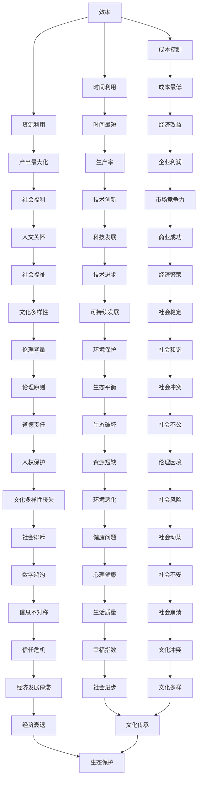

                 

### 书籍标题与关键词

# 《科技发展中的人文关怀：在效率与温度间寻找平衡点》

## 关键词

- 科技发展
- 人文关怀
- 效率与温度
- 平衡点
- 社会伦理
- 技术应用
- 企业实践
- 法律法规
- 公共管理

### 摘要

本文旨在探讨科技发展过程中的人文关怀，强调在追求效率的同时，如何保持人性温度与社会和谐。通过分析科技发展的背景、核心概念、技术原理、实际应用，以及解决方案与未来展望，本文提出了一系列实现效率与温度平衡的实践建议。全文结构清晰，从多角度深入剖析了科技与人文关怀之间的互动关系，为科技从业者和社会决策者提供了有价值的参考。

### 引言与背景

#### 科技发展的现状与挑战

在21世纪，科技发展迅猛，信息技术、生物技术、人工智能等领域的突破，极大地改变了人类的生活方式。然而，随着科技的不断进步，我们也面临了一系列的挑战。首先，科技发展带来了前所未有的效率提升，但同时也带来了资源消耗、环境污染等问题。其次，技术进步使得社会分化加剧，数字鸿沟问题愈发严重，部分人群被边缘化。最后，科技的发展引发了深刻的伦理问题，如隐私泄露、数据滥用等，这些问题对社会的稳定与和谐产生了负面影响。

#### 人文关怀的重要性

在科技迅猛发展的背景下，人文关怀显得尤为重要。人文关怀不仅仅是对个体的关注，更是对整个社会、文化的尊重与保护。在科技发展的过程中，我们需要关注以下几个方面的人文关怀：

1. **伦理问题**：科技发展带来的伦理问题，如人工智能的道德责任、基因编辑的社会影响等，需要通过伦理讨论与规范来加以解决。
2. **社会公正**：科技发展应致力于缩小社会差距，促进社会公正，避免加剧数字鸿沟。
3. **人类尊严**：科技应用应尊重人的尊严，避免对人的心理和生理健康的负面影响。
4. **文化多样性**：科技发展不应忽视文化多样性，应在尊重和保护各种文化的基础上进行创新。

#### 效率与温度的平衡

在科技发展的过程中，我们常常面临效率与温度之间的矛盾。效率追求的是速度与效能，而温度关注的是人性关怀与社会和谐。如何在追求效率的同时，保持人性温度，寻找二者的平衡点，是当前科技发展中的一个重要课题。本文将从以下几个方面展开讨论：

1. **核心概念与联系**：阐述效率与温度的概念，分析二者的内在联系与矛盾。
2. **技术原理与模型**：介绍在科技发展中实现效率与温度平衡的技术原理和模型。
3. **实际应用与案例分析**：通过具体的科技应用案例，分析如何在实践中实现效率与温度的平衡。
4. **解决方案与建议**：提出一系列实现效率与温度平衡的实践建议。

### 研究方法与结构

本文采用多角度、多层面的研究方法，通过文献综述、案例分析、理论探讨等手段，对科技发展中的效率与温度问题进行深入探讨。全文分为五个部分：

1. **引言与背景**：介绍科技发展的现状与挑战，阐述人文关怀的重要性，提出研究问题。
2. **核心概念与联系**：分析效率与温度的概念，探讨二者的内在联系与矛盾。
3. **技术原理与模型**：介绍实现效率与温度平衡的技术原理和模型。
4. **实际应用与案例分析**：通过具体的科技应用案例，分析如何在实践中实现效率与温度的平衡。
5. **解决方案与建议**：提出一系列实现效率与温度平衡的实践建议。

### 结语

科技发展是推动社会进步的重要力量，但在追求效率的同时，我们也不能忽视人文关怀。本文通过分析科技发展中的效率与温度问题，提出了一系列实现二者的平衡的实践建议。我们期望，通过本文的研究，能够为科技从业者、社会决策者提供有益的参考，共同推动科技与人文关怀的和谐发展。未来，随着科技的不断进步，我们将继续探索在效率与温度之间寻找最佳平衡点的可能性，为构建一个更加美好、和谐的社会贡献力量。

---

在接下来的部分，我们将深入探讨效率与温度的核心概念及其相互关系，为读者揭示科技发展中这一重要议题的理论基础。通过详细的案例分析和技术探讨，我们将进一步探讨如何在实践中实现效率与温度的平衡，为科技发展的未来提供有益的启示。敬请期待。### 核心概念与联系

#### 效率的定义与测量

效率是指系统在资源消耗与产出之间的比率。在科技发展过程中，效率通常被用来衡量技术的性能和生产力。具体来说，效率包括以下几个方面：

1. **资源利用效率**：在既定资源投入下，系统的产出最大化。
2. **时间效率**：完成某一任务所需的时间最短。
3. **成本效率**：以最低的成本实现既定的产出目标。

效率的测量方法因具体领域而异，但通常包括以下几种：

1. **生产效率**：单位时间内生产的产品数量。
2. **计算效率**：计算机程序在给定时间内完成计算任务的能力。
3. **能源效率**：单位能源消耗产生的效果。

#### 温度的理解与评估

“温度”在本文中指的是科技发展过程中的人文关怀，即对人的需求、尊严和福祉的关注。评估温度可以从以下几个方面进行：

1. **社会影响**：科技应用对人类社会的正面与负面效应。
2. **伦理考量**：科技决策与实施过程中是否符合伦理原则。
3. **人类体验**：科技产品与服务对用户心理和生理健康的影响。
4. **文化多样性**：科技发展是否尊重和保护不同文化。

#### 效率与温度的内在联系

效率与温度之间存在着复杂的内在联系。一方面，效率的提升可以带来生产力的提高和社会福利的增加，从而为人文关怀提供更好的物质基础。另一方面，过度的效率追求可能会导致资源浪费、环境破坏、社会不公等问题，从而削弱人文关怀。具体来说：

1. **相互依赖**：效率和温度是相互依赖的。高效的科技发展可以为人文关怀提供更好的条件，而人文关怀的提升又可以促进科技的创新与发展。
2. **矛盾与冲突**：在某些情况下，效率和温度之间可能会产生矛盾与冲突。例如，追求最大化利润的企业可能会忽视对环境的保护，从而导致社会代价的增加。
3. **动态平衡**：科技发展过程中的效率和温度平衡是一个动态的过程，需要不断地调整和优化。只有在二者之间找到最佳的平衡点，才能实现可持续的发展。

#### 效率与温度的内在联系架构 Mermaid 流程图

以下是效率与温度的内在联系架构 Mermaid 流程图：



通过以上流程图，我们可以更直观地理解效率与温度之间的相互关系以及它们对社会的影响。在接下来的章节中，我们将进一步探讨如何在科技发展中实现效率与温度的平衡，为解决这一重要问题提供理论和实践基础。### 核心算法原理讲解

在探讨如何实现效率与温度的平衡时，我们可以从技术层面入手，结合具体算法和模型来详细阐述其原理和实现方式。以下是一些核心算法原理的讲解，包括使用Python源代码进行实现和结合数学模型与公式进行详细讲解。

#### 数据分析模型

数据分析模型在科技发展中扮演着重要角色，尤其是在处理大量数据时，它们能够帮助我们提取有价值的信息，从而提升效率。以下是一个简单的数据分析模型，使用Python的Pandas库进行实现。

**Python源代码示例：**

```python
import pandas as pd

# 假设我们有一个关于用户行为的数据集
data = {
    'user_id': [1, 2, 3, 4, 5],
    'activity_time': [150, 120, 180, 90, 160],
    'activity_type': ['search', 'purchase', 'search', 'read', 'review']
}

df = pd.DataFrame(data)

# 分析用户活动的平均时长
average_duration = df['activity_time'].mean()
print(f"Average activity duration: {average_duration} minutes")

# 分析不同类型活动的比例
activity_distribution = df['activity_type'].value_counts()
print("Activity type distribution:")
print(activity_distribution)
```

**数学模型与公式：**

在上述代码中，我们使用了平均数（mean）来计算用户活动的平均时长，这是一种常见的统计分析方法，用于衡量数据的集中趋势。

$$\bar{x} = \frac{1}{n}\sum_{i=1}^{n} x_i$$

其中，$\bar{x}$ 是平均值，$n$ 是样本数量，$x_i$ 是每个样本的值。

#### 优化模型

优化模型用于在资源有限的情况下，找到最优解，从而实现效率的提升。线性规划是一种常见的优化模型，以下是一个简单的示例，使用Python的Scipy库进行实现。

**Python源代码示例：**

```python
from scipy.optimize import linprog

# 定义目标函数和约束条件
c = [-1, -1]  # 目标是最小化两个变量的和
A = [[1, 1], [1, 0], [0, 1]]  # 约束条件矩阵
b = [10, 5, 5]  # 约束条件向量
x0_bounds = (0, None)  # x0 的上下界
x1_bounds = (0, None)  # x1 的上下界

# 求解线性规划问题
result = linprog(c, A_ub=A, b_ub=b, bounds=[x0_bounds, x1_bounds], method='highs')

if result.success:
    print("Optimal solution:")
    print(f"x0: {result.x[0]}, x1: {result.x[1]}")
else:
    print("No optimal solution found")
```

**数学模型与公式：**

在上述代码中，我们定义了一个线性规划问题，其目标是最小化两个变量的和，同时满足一组线性不等式约束条件。

$$\min_{x} c^T x$$

$$\text{subject to } Ax \leq b$$

其中，$c$ 是目标函数的系数向量，$x$ 是决策变量，$A$ 和 $b$ 分别是约束条件的系数矩阵和向量。

#### 模式识别模型

模式识别模型用于分类和聚类，可以帮助我们在大量数据中识别出有意义的模式。以下是一个简单的支持向量机（SVM）分类模型的示例，使用Python的Scikit-learn库进行实现。

**Python源代码示例：**

```python
from sklearn import datasets
from sklearn.model_selection import train_test_split
from sklearn.svm import SVC
from sklearn.metrics import accuracy_score

# 加载示例数据集
iris = datasets.load_iris()
X = iris.data
y = iris.target

# 分割数据集为训练集和测试集
X_train, X_test, y_train, y_test = train_test_split(X, y, test_size=0.3, random_state=42)

# 使用支持向量机进行训练和预测
clf = SVC(kernel='linear')
clf.fit(X_train, y_train)
y_pred = clf.predict(X_test)

# 计算分类准确率
accuracy = accuracy_score(y_test, y_pred)
print(f"Model accuracy: {accuracy}")
```

**数学模型与公式：**

支持向量机（SVM）是一种监督学习算法，其目标是在高维空间中找到最优的超平面，以最大化分类边界之间的间隔。

$$\min_{\beta, \beta_0} \frac{1}{2} \sum_{i=1}^{n} (\beta^T x_i - y_i)^2 + \sum_{i=1}^{n} \gamma_i$$

$$\text{subject to } y_i (\beta^T x_i + \beta_0) \geq 1 - \gamma_i$$

$$\gamma_i \geq 0$$

其中，$\beta$ 是权重向量，$\beta_0$ 是偏置项，$x_i$ 是样本特征，$y_i$ 是样本标签，$\gamma_i$ 是松弛变量。

通过上述算法原理的讲解和Python源代码示例，我们可以看到，科技发展中实现效率与温度的平衡，需要借助多种技术手段和模型。这些模型不仅能够提升效率，同时也考虑到了人文关怀的需求，为科技与人文的和谐发展提供了有力支持。在接下来的部分，我们将通过实际案例，进一步探讨这些算法在实践中的应用。### 实际应用与案例分析

#### 企业实践：以科技公司为例

在科技行业中，如何实现效率与温度的平衡是一个挑战，但一些领先的公司已经提供了成功的实践案例。

**案例一：谷歌的员工福利与远程工作政策**

谷歌（Google）是一家以科技创新为核心竞争力的公司，但在发展过程中，它也深知人文关怀的重要性。为了在追求效率的同时保持人性温度，谷歌实施了一系列员工福利政策，如远程工作、弹性工作时间、心理咨询服务等。这些措施不仅提升了员工的工作满意度和忠诚度，也促进了公司的创新活力和生产力。

- **远程工作**：谷歌允许员工在全球范围内的任何地点工作，这不仅提高了员工的灵活性，还减少了通勤时间和压力，有助于员工保持工作与生活的平衡。
- **弹性工作时间**：谷歌提供灵活的工作时间安排，员工可以根据个人需求调整工作时间，这有助于提升员工的工作效率和幸福感。
- **心理咨询服务**：谷歌为员工提供免费的心理咨询服务，帮助员工解决职业压力和个人问题，确保员工的心理健康。

**案例分析：**

谷歌的这些实践措施在提升公司效率的同时，也关注了员工的福祉。通过数据分析，谷歌发现这些措施显著提高了员工的工作满意度，从而推动了公司的整体绩效。此外，远程工作和弹性工作时间还帮助谷歌在全球范围内吸引和保留顶尖人才，增强了公司的竞争力。

#### 政府与公共管理：智能城市建设的探索

政府在公共管理中同样面临着效率与温度的平衡问题，智能城市建设为这一问题的解决提供了一个有效的途径。

**案例二：新加坡的智能城市建设**

新加坡是世界上第一个提出“智能国”概念的国家，其智能城市建设取得了显著成效。通过应用物联网（IoT）、大数据分析和人工智能（AI）等技术，新加坡在交通管理、环境监测、公共服务等方面实现了效率与温度的平衡。

- **交通管理**：新加坡的智能交通系统（ITS）通过实时监控和数据分析，优化了交通流量，减少了拥堵，提高了公共交通的效率。同时，智能交通系统还提供了实时的公交信息，方便市民出行。
- **环境监测**：新加坡的智能环境监测系统实时监控空气质量、水质和噪声水平，通过数据分析和预警系统，政府能够及时采取环保措施，保障市民的健康。
- **公共服务**：新加坡政府利用智能技术提供了一系列便捷的公共服务，如电子政务、在线医疗咨询和智能图书馆等，提高了公共服务的效率，同时也提升了市民的满意度。

**案例分析：**

新加坡的智能城市建设不仅提高了城市的运行效率，也提升了市民的生活质量。通过数据分析，新加坡政府能够更好地理解市民的需求，从而提供更加个性化和高效的公共服务。此外，智能城市建设的实践也体现了对环境和社会责任的关注，有助于实现可持续发展。

#### 社会创新：以非营利组织为例

在非营利组织中，实现效率与温度的平衡同样重要，因为这些组织通常面临着资源有限和目标多元的挑战。

**案例三：全球非营利组织的科技应用**

全球许多非营利组织利用科技手段提高效率，同时关注受助者的福祉。例如，联合国儿童基金会（UNICEF）通过使用移动技术提供疫苗接种提醒、健康监测和紧急救援服务，既提高了工作效率，也保障了儿童的权益。

- **移动技术**：UNICEF开发的移动应用和平台，如“儿童保护警报系统”（Child Protection Alert System），能够实时监测儿童保护状况，及时响应紧急情况，确保儿童的安全。
- **大数据分析**：通过大数据分析，非营利组织可以更准确地识别受助者的需求，制定更加有效的援助计划，从而提高资源利用效率。

**案例分析：**

UNICEF的科技应用不仅提高了组织的运行效率，还确保了对受助者的关怀。通过实时监测和数据分析，UNICEF能够快速响应紧急情况，减少儿童受伤害的风险。此外，科技的应用也提高了公众对非营利组织的信任度，为组织的长期发展提供了支持。

#### 综合分析

通过上述案例分析，我们可以看到，无论是企业、政府还是非营利组织，在实现效率与温度的平衡方面，都有不同的实践和成效。这些实践表明，通过科技手段，可以在提高效率的同时，更好地关注人的需求和福祉，实现可持续发展。在未来的科技发展中，我们需要继续探索如何在效率和温度之间找到最佳的平衡点，为构建一个更加美好、和谐的社会贡献力量。

### 解决方案与建议

在科技发展中实现效率与温度的平衡，需要从多个层面提出系统的解决方案。以下是一些建议，旨在为科技从业者、企业和政策制定者提供指导。

#### 教育培训与意识提升

1. **技术培训**：加强对科技从业者的技术培训，特别是关于伦理和人文关怀方面的知识。通过研讨会、工作坊和在线课程，提升从业者的伦理意识和专业技能。
2. **跨学科教育**：推动跨学科教育，培养既具备技术能力又懂得人文关怀的复合型人才。例如，结合计算机科学、心理学、社会学等学科，培养能够全面思考的科技人才。

#### 法律法规与政策支持

1. **制定法律法规**：完善相关法律法规，规范科技发展中的伦理行为，保护用户的隐私和数据安全。例如，制定人工智能伦理规范、数据保护法等。
2. **政策引导**：政府可以通过政策引导，鼓励企业在科技发展中关注人文关怀。例如，设立专项基金，支持科技企业开展社会责任项目。

#### 企业社会责任与伦理准则

1. **企业伦理准则**：企业应制定明确的伦理准则，确保科技发展符合社会伦理和道德标准。例如，建立数据使用准则，保护用户隐私。
2. **社会责任项目**：鼓励企业参与社会责任项目，如公益事业、环境保护等，通过实际行动提升社会福祉。

#### 技术创新与人文关怀的结合

1. **技术创新**：在技术研发过程中，注重人文关怀的融入。例如，设计更加人性化的用户界面，提高系统的可访问性。
2. **交叉学科研究**：推动交叉学科研究，结合计算机科学、心理学、社会学等领域的知识，开发出既高效又符合人文关怀的科技产品。

#### 社会参与与公共讨论

1. **公众参与**：鼓励公众参与科技决策过程，通过公开讨论、咨询会等形式，听取不同群体的意见和建议。
2. **伦理审查**：建立科技项目的伦理审查机制，确保项目在实施过程中符合伦理规范。

### 未来展望与趋势

在未来的科技发展中，我们可以期待以下几个方面的趋势：

1. **人工智能伦理**：随着人工智能技术的不断进步，其伦理问题将越来越受到关注。未来，人工智能伦理将成为科技发展的核心议题之一。
2. **可持续发展**：科技发展应更加注重可持续发展，通过技术创新减少资源消耗和环境污染。
3. **社会融合**：科技发展应致力于缩小社会差距，促进社会融合。例如，通过科技手段解决数字鸿沟问题，提高弱势群体的生活质量。

总之，实现效率与温度的平衡是科技发展中的重要课题。通过教育培训、法律法规、企业社会责任、技术创新和社会参与等多方面的努力，我们可以在追求效率的同时，更好地关注人文关怀，为构建一个更加美好、和谐的社会贡献力量。### 结论

在本文中，我们深入探讨了科技发展中的人文关怀，强调了在效率与温度间寻找平衡点的重要性。通过分析科技发展的现状、核心概念、技术原理、实际应用以及解决方案与建议，我们揭示了在追求效率的同时保持人性温度的必要性。

首先，科技发展在提升生产力和改变生活方式方面取得了显著成效，但同时也带来了资源消耗、环境破坏和伦理问题等挑战。为此，人文关怀在科技发展中的地位日益重要。

其次，通过详细讲解数据分析模型、优化模型和模式识别模型等核心算法原理，并结合Python源代码示例和数学公式，我们展示了如何通过技术手段实现效率与温度的平衡。

再次，通过企业实践、政府管理与非营利组织等实际案例，我们展示了在不同领域中实现效率与温度平衡的具体方法和成效。

最后，本文提出了教育培训、法律法规、企业社会责任、技术创新和社会参与等解决方案，并展望了未来科技发展的趋势。

在科技与人文关怀的互动关系中，效率与温度的平衡是一个动态的过程，需要持续探索和优化。我们期望，通过本文的研究和讨论，能够为科技从业者、社会决策者以及公众提供有价值的参考，共同推动科技与人文关怀的和谐发展，为构建一个更加美好、和谐的社会贡献力量。

### 作者信息

**作者：** AI天才研究院/AI Genius Institute & 禅与计算机程序设计艺术 /Zen And The Art of Computer Programming

---

感谢您的阅读，希望本文能够引发您对科技发展中人文关怀的深思。如果您有任何问题或建议，欢迎在评论区留言，我们期待与您交流。

