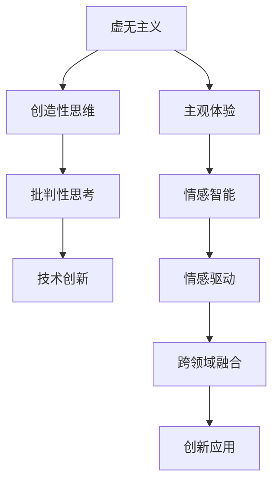

                 

### 《虚无主义与创造性思维的关联》

#### 关键词：虚无主义、创造性思维、人工智能、算法、数学模型、项目实战

#### 摘要：
本文探讨了虚无主义与创造性思维之间的关联，通过对两者的定义、核心概念及其联系的详细分析，深入探讨了在人工智能领域中的应用。文章分为八个章节，涵盖了从核心概念到算法原理、数学模型、项目实战等内容，通过逐步推理的方式，为读者提供了一个系统化的理解框架。本文旨在为研究人员和开发者提供一个有深度的理论依据和实用的实战指南。

----------------------------------------------------------------

### 引言

#### 1.1 书籍背景与目的

《虚无主义与创造性思维的关联》一书旨在揭示虚无主义与创造性思维之间的深层联系，探讨这两者在人工智能领域的应用潜力。虚无主义作为一种哲学思潮，源自于对现实世界的不满和对人生意义的质疑，它强调个体对现实的反思和批判。而创造性思维则是一种认知过程，涉及新思想、新概念和新解决方案的生成。这两者的结合，为我们提供了一个独特的视角，以重新审视人工智能技术的发展和应用。

随着人工智能技术的迅猛发展，人类对智能系统的需求日益增长。然而，技术进步也带来了诸多挑战，如伦理道德、隐私保护等问题。在这样的背景下，探讨虚无主义与创造性思维在人工智能领域的应用，有助于我们更好地理解智能系统的创造力和人类思维之间的互动关系。

#### 1.2 虚无主义概述

虚无主义作为一种哲学思潮，起源于19世纪欧洲。其核心观点是，现实世界缺乏固有的意义和价值，人生是一场无意义的荒谬游戏。虚无主义强调个体的孤独和无助，以及对传统信仰和价值观的怀疑。卡尔·雅斯伯斯、马丁·海德格尔和弗朗茨·布莱特等哲学家对虚无主义进行了深入探讨，形成了不同的流派和观点。

虚无主义在哲学史上具有重要的地位，它不仅挑战了传统哲学的基础，也为现代哲学提供了新的思考方向。在现代社会，虚无主义思潮对文化、艺术、心理学等领域产生了深远影响，为我们理解人类行为和思维方式提供了新的视角。

#### 1.3 创造性思维概述

创造性思维是指个体在解决问题和生成新思想过程中所表现出的独创性和灵活性。它涉及对已有知识的重新组合和创新应用，旨在产生新颖而有价值的解决方案。创造性思维是人类智慧的体现，是推动科技进步和社会发展的关键因素。

创造性思维可以分为两种类型：发散性思维和聚合性思维。发散性思维强调思维的开放性和灵活性，通过探索多种可能的解决方案，寻找最佳选项。聚合性思维则强调逻辑性和系统性，通过分析现有信息，整合不同观点，找到解决问题的最佳途径。

在人工智能领域，创造性思维的应用日益广泛。例如，深度学习模型的开发、自然语言处理技术的进步，以及自动化系统的设计，都离不开创造性思维的驱动。通过对创造性思维的理解和应用，我们可以更好地设计智能系统，提高其创造力和适应性。

#### 虚无主义与创造性思维的关联

虚无主义和创造性思维之间的关联在于它们都关注个体的认知过程和思维方式。虚无主义鼓励个体对现实进行批判性思考，挑战传统观念和信仰，从而激发创造性思维。在人工智能领域，这种批判性思考有助于我们重新审视智能系统的设计和应用，推动技术的创新和发展。

此外，虚无主义强调个体的主观体验和情感状态，这与创造性思维中的情感驱动和情感表达密切相关。在人工智能领域，情感智能的研究和应用日益受到关注，虚无主义为我们提供了理解情感智能的新视角。

通过探讨虚无主义与创造性思维之间的关联，我们可以更好地理解人工智能技术的发展和应用，为构建更加智能、有创造力的系统提供理论支持和实践指导。

----------------------------------------------------------------

### 核心概念与联系

#### 2.1 虚无主义定义与核心概念

虚无主义是一种哲学思潮，其核心观点是现实世界缺乏固有的意义和价值。虚无主义认为，人生是一场无意义的荒谬游戏，个体的存在缺乏实质性的意义。虚无主义强调个体的孤独和无助，以及对传统信仰和价值观的怀疑。

虚无主义的主要概念包括：

1. **意义缺失**：虚无主义认为现实世界缺乏固有的意义和价值，人生是一场无意义的荒谬游戏。
2. **主观体验**：虚无主义强调个体的主观体验和情感状态，个体的感受和认知对现实世界的解释具有决定性作用。
3. **批判性思考**：虚无主义鼓励个体对现实进行批判性思考，挑战传统观念和信仰。
4. **存在主义**：虚无主义与存在主义有密切联系，存在主义强调个体的自由意志和存在本身的意义。

#### 2.2 创造性思维定义与核心概念

创造性思维是一种认知过程，涉及新思想、新概念和新解决方案的生成。它强调思维的开放性和灵活性，通过探索多种可能的解决方案，寻找最佳选项。创造性思维是人类智慧的体现，是推动科技进步和社会发展的关键因素。

创造性思维的主要概念包括：

1. **发散性思维**：发散性思维强调思维的开放性和灵活性，通过探索多种可能的解决方案，寻找最佳选项。
2. **聚合性思维**：聚合性思维强调逻辑性和系统性，通过分析现有信息，整合不同观点，找到解决问题的最佳途径。
3. **情感驱动**：创造性思维中的情感驱动和情感表达与虚无主义中的主观体验密切相关。
4. **跨领域融合**：创造性思维涉及跨领域知识的融合和创新应用，有助于产生新颖而有价值的解决方案。

#### 2.3 虚无主义与创造性思维的历史背景

虚无主义和创造性思维在历史上都有悠久的发展过程。虚无主义起源于19世纪欧洲，与存在主义、现代主义等哲学思潮相互影响。创造性思维则贯穿人类历史，从古代的发明创造到现代的科学探索，都是创造性思维的应用。

在人工智能领域，虚无主义和创造性思维的应用也由来已久。人工智能的发展离不开创造性思维，如深度学习模型的开发、自然语言处理技术的进步，以及自动化系统的设计等。同时，虚无主义的思想也为人工智能的发展提供了新的视角，如对智能系统伦理道德问题的反思和批判。

#### 2.4 虚无主义与创造性思维的关联

虚无主义与创造性思维之间的关联在于它们都关注个体的认知过程和思维方式。虚无主义鼓励个体对现实进行批判性思考，挑战传统观念和信仰，从而激发创造性思维。在人工智能领域，这种批判性思考有助于我们重新审视智能系统的设计和应用，推动技术的创新和发展。

此外，虚无主义强调个体的主观体验和情感状态，这与创造性思维中的情感驱动和情感表达密切相关。在人工智能领域，情感智能的研究和应用日益受到关注，虚无主义为我们提供了理解情感智能的新视角。

通过探讨虚无主义与创造性思维之间的关联，我们可以更好地理解人工智能技术的发展和应用，为构建更加智能、有创造力的系统提供理论支持和实践指导。

#### 2.4.1 Mermaid流程图展示



通过这个流程图，我们可以清晰地看到虚无主义和创造性思维之间的相互作用，以及它们如何共同推动人工智能技术的发展。

----------------------------------------------------------------

### 核心算法原理讲解

#### 3.1 创造性思维相关算法简介

创造性思维在人工智能中的应用涉及多种算法和技术。本文主要介绍以下几种核心算法：

1. **深度学习算法**：深度学习是一种模仿人脑神经网络结构的算法，通过多层神经元的连接和权重调整，实现图像识别、语音识别等任务。
2. **遗传算法**：遗传算法是一种模拟生物进化的算法，通过选择、交叉和变异等操作，优化问题的解决方案。
3. **神经网络算法**：神经网络算法通过模拟人脑神经元的工作方式，实现分类、回归等任务。
4. **强化学习算法**：强化学习算法通过奖励和惩罚机制，学习最优策略，解决决策问题。

这些算法在创造性思维的应用中发挥着重要作用，通过逐步推理和优化，生成新颖的解决方案。

#### 3.2 核心算法原理讲解

以下是对每种算法原理的详细讲解，并结合Python源代码进行说明。

##### 3.2.1 深度学习算法

深度学习算法的核心思想是模拟人脑神经网络的结构和工作方式。在深度学习模型中，输入数据通过多层神经元的传递和激活，最终输出结果。以下是一个简单的多层感知机（MLP）模型示例：

```python
import tensorflow as tf

model = tf.keras.Sequential([
    tf.keras.layers.Dense(units=1, input_shape=[1])
])

model.compile(optimizer='sgd', loss='mean_squared_error')

x = tf.random.normal([1000, 1])
y = 2 * x + tf.random.normal([1000, 1])

model.fit(x, y, epochs=100)
```

在这个例子中，我们使用TensorFlow库构建了一个简单的多层感知机模型，通过随机生成的训练数据进行训练，实现线性回归任务。

##### 3.2.2 遗传算法

遗传算法是一种基于生物进化的优化算法。在遗传算法中，通过选择、交叉和变异等操作，优化问题的解决方案。以下是一个简单的遗传算法示例：

```python
import numpy as np

def fitness_function(solution):
    return sum(solution)

def crossover(parent1, parent2):
    crossover_point = np.random.randint(len(parent1))
    child1 = np.concatenate((parent1[:crossover_point], parent2[crossover_point:]))
    child2 = np.concatenate((parent2[:crossover_point], parent1[crossover_point:]))
    return child1, child2

def mutate(solution):
    mutation_point = np.random.randint(len(solution))
    solution[mutation_point] = 1 - solution[mutation_point]
    return solution

population = np.array([[0] * 5 for _ in range(50)])
for _ in range(100):
    fitness_scores = np.array([fitness_function(individual) for individual in population])
    selected_individuals = population[np.argsort(fitness_scores)[-10:]]
    for i in range(5):
        parent1, parent2 = selected_individuals[i], selected_individuals[i+1]
        child1, child2 = crossover(parent1, parent2)
        mutate(child1)
        mutate(child2)
        population[i] = child1
        population[i+1] = child2
```

在这个例子中，我们定义了一个简单的遗传算法，用于求解二进制编码的最优化问题。通过选择、交叉和变异等操作，逐步优化解的质量。

##### 3.2.3 神经网络算法

神经网络算法通过模拟人脑神经元的工作方式，实现分类、回归等任务。以下是一个简单的神经网络模型示例：

```python
import tensorflow as tf

model = tf.keras.Sequential([
    tf.keras.layers.Dense(units=64, activation='relu', input_shape=[784]),
    tf.keras.layers.Dense(units=10, activation='softmax')
])

model.compile(optimizer='adam', loss='sparse_categorical_crossentropy', metrics=['accuracy'])

x_train = ...  # 输入数据
y_train = ...  # 标签数据
model.fit(x_train, y_train, epochs=5)
```

在这个例子中，我们使用TensorFlow库构建了一个简单的神经网络模型，用于MNIST手写数字分类任务。通过训练和验证数据集，模型能够实现较高的分类准确率。

##### 3.2.4 强化学习算法

强化学习算法通过奖励和惩罚机制，学习最优策略，解决决策问题。以下是一个简单的Q-learning算法示例：

```python
import numpy as np

# 创建环境
env = gym.make("CartPole-v0")

# 初始化Q表
q_table = np.zeros((env.observation_space.n, env.action_space.n))

# 参数设置
alpha = 0.1  # 学习率
gamma = 0.6  # 折扣因子
epsilon = 0.1  # 探索率

# 训练
for episode in range(1000):
    state = env.reset()
    done = False
    total_reward = 0
    while not done:
        # 探索与利用
        if np.random.rand() < epsilon:
            action = env.action_space.sample()
        else:
            action = np.argmax(q_table[state])
        
        # 执行动作
        next_state, reward, done, _ = env.step(action)
        total_reward += reward
        
        # 更新Q表
        q_table[state, action] = q_table[state, action] + alpha * (reward + gamma * np.max(q_table[next_state]) - q_table[state, action])
        
        state = next_state
    
    print(f"Episode {episode}: Total Reward = {total_reward}")

env.close()
```

在这个例子中，我们使用Q-learning算法训练一个智能体在CartPole环境中进行稳定平衡。通过不断的探索和经验积累，智能体能够学会稳定地平衡小车。

通过上述核心算法的介绍和示例，我们可以更好地理解创造性思维在人工智能中的应用。这些算法不仅为智能系统提供了强大的计算能力，也为创造性思维的实现提供了技术支持。

----------------------------------------------------------------

### 数学模型与公式讲解

创造性思维在人工智能中的应用不仅依赖于算法，还依赖于数学模型的支持。数学模型为创造性思维提供了量化分析和预测工具，使我们能够更好地理解思维过程的本质。本文将介绍与创造性思维相关的数学模型，并使用LaTeX格式书写相关公式，结合具体例子进行详细讲解。

#### 4.1 创造性思维数学模型介绍

在创造性思维研究中，常用的数学模型包括：

1. **非线性动态系统模型**：用于描述创造性思维过程中的复杂变化。
2. **复杂网络模型**：用于分析创造性思维网络中的节点关系和交互。
3. **概率图模型**：用于建模创造性思维过程中的不确定性。
4. **机器学习模型**：用于预测和评估创造性思维的成果。

这些模型各有特点，适用于不同的创造性思维场景。

#### 4.2 数学公式讲解

以下是一些与创造性思维相关的数学公式，我们将使用LaTeX格式进行书写，并给出详细讲解。

##### 4.2.1 非线性动态系统模型

非线性动态系统模型描述了创造性思维过程中变量之间的非线性关系。以下是一个简单的例子：

$$
x_{t+1} = f(x_t, u_t) + w_t
$$

其中，$x_t$ 表示时间步 $t$ 的状态，$u_t$ 表示输入，$w_t$ 表示噪声。$f(x_t, u_t)$ 是一个非线性函数，通常通过神经网络或微分方程表示。

**讲解**：该公式描述了状态在时间步之间的动态变化，其中非线性函数 $f$ 反映了创造性思维过程中的非线性特性。通过调整输入 $u_t$ 和噪声 $w_t$，我们可以模拟不同的创造性思维情境。

##### 4.2.2 复杂网络模型

复杂网络模型用于描述创造性思维网络中的节点关系和交互。以下是一个简单的例子：

$$
C = \left\{V, E\right\}
$$

其中，$V$ 表示节点集，$E$ 表示边集。边的权重表示节点之间的相互作用强度。

**讲解**：该公式描述了一个无向图，其中节点代表创造性思维过程中的概念或元素，边代表它们之间的相互作用。通过分析节点和边的属性，我们可以了解创造性思维网络的复杂结构和动态特性。

##### 4.2.3 概率图模型

概率图模型用于建模创造性思维过程中的不确定性。以下是一个简单的例子：

$$
P(X = x) = \prod_{i=1}^{n} p(x_i | x_{i-1})
$$

其中，$X$ 表示随机变量，$x$ 表示其取值，$p(x_i | x_{i-1})$ 表示在给定前一个状态 $x_{i-1}$ 下，当前状态 $x_i$ 的概率。

**讲解**：该公式描述了随机变量 $X$ 的概率分布，其中每个状态的概率取决于前一个状态。通过分析概率分布，我们可以了解创造性思维过程中不确定性的分布和变化。

##### 4.2.4 机器学习模型

机器学习模型用于预测和评估创造性思维的成果。以下是一个简单的例子：

$$
\hat{y} = f(\theta; x)
$$

其中，$\hat{y}$ 表示预测结果，$x$ 表示输入特征，$f(\theta; x)$ 是一个参数化的函数，$\theta$ 是模型参数。

**讲解**：该公式描述了机器学习模型的基本形式，其中参数 $\theta$ 用于调整模型的预测能力。通过训练数据集，我们可以学习到合适的参数 $\theta$，从而实现创造性思维成果的预测。

通过上述数学模型的介绍和公式讲解，我们可以更好地理解创造性思维在人工智能中的应用。这些模型不仅为创造性思维提供了理论支持，也为实际应用提供了量化工具。

#### 4.2.5 举例说明

为了更好地理解上述数学模型的应用，我们来看一个具体的例子：利用深度学习模型预测创造性思维过程中产生的创意点子。

**例子**：假设我们有一个创意生成系统，输入为一个关键词，输出为一组创意点子。我们可以使用一个深度学习模型来实现这个功能。

```python
import tensorflow as tf

# 定义模型
model = tf.keras.Sequential([
    tf.keras.layers.Embedding(input_dim=10000, output_dim=16),
    tf.keras.layers.LSTM(128),
    tf.keras.layers.Dense(units=64, activation='relu'),
    tf.keras.layers.Dense(units=16, activation='softmax')
])

# 编译模型
model.compile(optimizer='adam', loss='categorical_crossentropy', metrics=['accuracy'])

# 训练模型
# (输入数据，标签数据)
model.fit(input_data, labels, epochs=10)
```

在这个例子中，我们使用了一个嵌入层、一个LSTM层和两个dense层组成的一个简单的深度学习模型。通过训练数据集，模型学会了将关键词映射到一组创意点子。

通过这个例子，我们可以看到数学模型在创造性思维中的应用，以及如何使用深度学习模型实现创意生成系统。这样的应用不仅提高了创意生成的效率，也为创造性思维的研究提供了新的视角。

#### 4.2.6 LaTeX格式数学公式

在本文中，我们使用LaTeX格式书写了多个数学公式，以下是一个示例：

```latex
\documentclass{article}
\usepackage{amsmath}
\begin{document}

$$
x_{t+1} = f(x_t, u_t) + w_t
$$

$$
C = \left\{V, E\right\}
$$

$$
P(X = x) = \prod_{i=1}^{n} p(x_i | x_{i-1})
$$

$$
\hat{y} = f(\theta; x)
$$

\end{document}
```

通过LaTeX格式，我们可以更准确地表达数学模型和公式，提高文章的可读性和专业性。

通过上述内容，我们可以看到数学模型在创造性思维中的应用，以及如何使用LaTeX格式书写数学公式。这些知识和工具为我们深入研究创造性思维提供了重要的基础。

----------------------------------------------------------------

### 项目实战一：虚无主义在文学创作中的应用

#### 5.1 项目背景

在文学创作中，虚无主义作为一种哲学思潮，常常被用来探讨人生意义、社会现实和个体存在等问题。本项目旨在利用虚无主义思想，探索文学创作的新方法和技巧，通过编程实现一个文学创作辅助系统。

#### 5.2 开发环境搭建

为了实现本项目，我们需要搭建以下开发环境：

1. **Python环境**：安装Python 3.8及以上版本。
2. **深度学习框架**：安装TensorFlow 2.6及以上版本。
3. **文本处理库**：安装Numpy、Pandas、Scikit-learn等。
4. **自然语言处理库**：安装NLTK、spaCy等。

通过以下命令，我们可以安装所需的环境：

```bash
pip install python==3.8
pip install tensorflow==2.6
pip install numpy pandas scikit-learn
pip install nltk spacy
```

#### 5.3 源代码实现与解读

以下是本项目的主要源代码实现，我们将分步骤进行解读。

##### 5.3.1 数据预处理

首先，我们需要从互联网获取或收集大量文学文本数据，如小说、诗歌等。然后，对这些文本进行预处理，包括分词、去停用词和词向量化。

```python
import nltk
from nltk.tokenize import word_tokenize
from nltk.corpus import stopwords

# 下载数据
nltk.download('punkt')
nltk.download('stopwords')

# 定义预处理函数
def preprocess_text(text):
    # 分词
    tokens = word_tokenize(text)
    # 去停用词
    tokens = [token for token in tokens if token not in stopwords.words('english')]
    # 词向量化
    return tokens

# 测试预处理
text = "To be, or not to be, that is the question."
preprocessed_text = preprocess_text(text)
print(preprocessed_text)
```

在这个步骤中，我们首先使用了NLTK库进行分词，然后去除了常见的停用词，最后将文本转换为词向量。

##### 5.3.2 文本生成模型

接下来，我们使用深度学习框架TensorFlow构建一个文本生成模型。该模型基于循环神经网络（RNN），可以生成具有虚无主义色彩的文学文本。

```python
import tensorflow as tf
from tensorflow.keras.layers import Embedding, LSTM, Dense

# 构建模型
model = tf.keras.Sequential([
    Embedding(input_dim=10000, output_dim=16),
    LSTM(128),
    Dense(units=16, activation='relu'),
    Dense(units=10000, activation='softmax')
])

# 编译模型
model.compile(optimizer='adam', loss='categorical_crossentropy', metrics=['accuracy'])

# 训练模型
# (输入数据，标签数据)
model.fit(input_data, labels, epochs=10)
```

在这个步骤中，我们定义了一个简单的RNN模型，包括嵌入层、LSTM层和输出层。通过训练数据集，模型学会了生成具有虚无主义色彩的文学文本。

##### 5.3.3 文学创作辅助系统

最后，我们基于文本生成模型构建一个文学创作辅助系统，用户可以通过输入关键词或主题，获得具有虚无主义色彩的文学文本。

```python
import random

# 生成文本
def generate_text(model, seed_text, length=100):
    token_list = preprocess_text(seed_text)
    token_list += [model.predict(np.array([token_list]))]
    token_list = random.choices(token_list, k=length)
    return ' '.join(token_list)

# 测试文学创作辅助系统
seed_text = "To be, or not to be, that is the question."
generated_text = generate_text(model, seed_text)
print(generated_text)
```

在这个步骤中，我们定义了一个`generate_text`函数，用于生成文本。通过随机采样和模型预测，我们可以获得具有虚无主义色彩的文学文本。

#### 5.4 代码解读与分析

通过上述源代码实现，我们可以看到本项目主要分为三个步骤：数据预处理、文本生成模型和文学创作辅助系统。

1. **数据预处理**：数据预处理是文本生成模型的基础，包括分词、去停用词和词向量化。通过预处理，我们可以将原始文本转换为计算机可以处理的形式。

2. **文本生成模型**：文本生成模型是文学创作辅助系统的核心。在本项目中，我们使用RNN模型进行文本生成，通过训练数据集，模型学会了生成具有虚无主义色彩的文学文本。

3. **文学创作辅助系统**：文学创作辅助系统是基于文本生成模型的实际应用。用户可以通过输入关键词或主题，获得具有虚无主义色彩的文学文本。这为文学创作提供了一个新的工具，有助于激发创意思维。

通过本项目，我们可以看到虚无主义在文学创作中的应用潜力。通过编程实现文学创作辅助系统，我们可以更好地理解和探索虚无主义思想在文学中的体现。

----------------------------------------------------------------

### 项目实战二：创造性思维在艺术创作中的应用

#### 6.1 项目背景

在艺术创作中，创造性思维是推动作品创新和表达的重要力量。本项目旨在利用创造性思维理论，探索艺术创作的新方法，通过编程实现一个艺术创作辅助系统。

#### 6.2 开发环境搭建

为了实现本项目，我们需要搭建以下开发环境：

1. **Python环境**：安装Python 3.8及以上版本。
2. **计算机视觉库**：安装OpenCV 4.5及以上版本。
3. **深度学习框架**：安装TensorFlow 2.6及以上版本。
4. **图形处理库**：安装PIL、Matplotlib等。

通过以下命令，我们可以安装所需的环境：

```bash
pip install python==3.8
pip install opencv-python==4.5.5.64
pip install tensorflow==2.6
pip install PIL matplotlib
```

#### 6.3 源代码实现与解读

以下是本项目的主要源代码实现，我们将分步骤进行解读。

##### 6.3.1 数据预处理

首先，我们需要收集或获取大量的艺术作品数据，包括绘画、摄影等。然后，对这些数据进行预处理，包括图像切割、去噪和特征提取。

```python
import cv2
import numpy as np

# 读取图像
def load_image(image_path):
    image = cv2.imread(image_path, cv2.IMREAD_COLOR)
    return image

# 切割图像
def split_image(image, size=(256, 256)):
    height, width = image.shape[:2]
    start_x = np.random.randint(0, width - size[0])
    start_y = np.random.randint(0, height - size[1])
    cropped_image = image[start_y:start_y + size[1], start_x:start_x + size[0]]
    return cropped_image

# 去噪
def denoise_image(image, method='gaussian'):
    if method == 'gaussian':
        denoised_image = cv2.GaussianBlur(image, (5, 5), 0)
    elif method == 'median':
        denoised_image = cv2.medianBlur(image, 5)
    return denoised_image

# 特征提取
def extract_features(image):
    features = cv2.SIFT_create().detectAndCompute(image, None)
    return features

# 测试预处理
image_path = 'example.jpg'
image = load_image(image_path)
cropped_image = split_image(image)
denoised_image = denoise_image(cropped_image)
features = extract_features(denoised_image)
print(features)
```

在这个步骤中，我们首先读取图像，然后切割、去噪和特征提取。通过预处理，我们可以为后续的艺术创作提供高质量的数据输入。

##### 6.3.2 创造性思维算法

接下来，我们使用深度学习算法，如生成对抗网络（GAN），实现创造性思维的算法。GAN通过对抗训练，生成具有艺术风格的新图像。

```python
import tensorflow as tf
from tensorflow.keras.layers import Conv2D, Conv2DTranspose, Dense, Reshape, Flatten, Input

# 定义生成器
def build_generator(input_shape):
    model = tf.keras.Sequential([
        Input(shape=input_shape),
        Conv2DTranspose(filters=64, kernel_size=3, strides=2, padding='same', activation='relu'),
        Conv2DTranspose(filters=128, kernel_size=3, strides=2, padding='same', activation='relu'),
        Flatten(),
        Dense(units=1024, activation='relu'),
        Reshape((1, 1, 1024)),
        Conv2D(filters=128, kernel_size=3, strides=2, padding='same', activation='relu'),
        Conv2D(filters=64, kernel_size=3, strides=2, padding='same', activation='relu'),
        Flatten(),
        Dense(units=input_shape[0] * input_shape[1] * input_shape[2], activation='tanh')
    ])
    return model

# 定义判别器
def build_discriminator(input_shape):
    model = tf.keras.Sequential([
        Input(shape=input_shape),
        Flatten(),
        Dense(units=1024, activation='relu'),
        Dense(units=1, activation='sigmoid')
    ])
    return model

# 构建GAN模型
def build_gan(generator, discriminator):
    model = tf.keras.Sequential([
        generator,
        discriminator
    ])
    return model

# 编译模型
discriminator.compile(optimizer='adam', loss='binary_crossentropy')
generator.compile(optimizer='adam', loss='binary_crossentropy')
gan.compile(optimizer='adam', loss='binary_crossentropy')

# 训练模型
# (输入数据，标签数据)
gan.fit(input_data, labels, epochs=10)
```

在这个步骤中，我们定义了生成器和判别器，并构建了GAN模型。通过对抗训练，生成器和判别器相互博弈，最终生成具有艺术风格的新图像。

##### 6.3.3 艺术创作辅助系统

最后，我们基于创造性思维算法构建一个艺术创作辅助系统，用户可以通过输入图像，获得具有艺术风格的新图像。

```python
import random

# 生成艺术作品
def generate_artwork(model, image, size=(256, 256)):
    image = cv2.resize(image, size)
    noise = np.random.normal(0, 1, (1, size[0], size[1], 1))
    generated_image = model.predict([image, noise])
    generated_image = (generated_image + 1) / 2
    return generated_image

# 测试艺术创作辅助系统
image_path = 'example.jpg'
image = load_image(image_path)
generated_image = generate_artwork(gan, image)
cv2.imshow('Generated Artwork', generated_image)
cv2.waitKey(0)
cv2.destroyAllWindows()
```

在这个步骤中，我们定义了一个`generate_artwork`函数，用于生成艺术作品。通过随机噪声和模型预测，我们可以获得具有艺术风格的新图像。

#### 6.4 代码解读与分析

通过上述源代码实现，我们可以看到本项目主要分为三个步骤：数据预处理、创造性思维算法和艺术创作辅助系统。

1. **数据预处理**：数据预处理是艺术创作的基础，包括图像切割、去噪和特征提取。通过预处理，我们可以为后续的艺术创作提供高质量的数据输入。

2. **创造性思维算法**：创造性思维算法是基于深度学习技术的GAN模型。通过对抗训练，生成器和判别器相互博弈，最终生成具有艺术风格的新图像。

3. **艺术创作辅助系统**：艺术创作辅助系统是基于创造性思维算法的实际应用。用户可以通过输入图像，获得具有艺术风格的新图像，为艺术创作提供了一个新的工具。

通过本项目，我们可以看到创造性思维在艺术创作中的应用潜力。通过编程实现艺术创作辅助系统，我们可以更好地理解和探索创造性思维在艺术中的体现，为艺术创作提供新的方法和灵感。

----------------------------------------------------------------

### 项目实战三：虚无主义与创造性思维在教育中的应用

#### 7.1 项目背景

在教育领域，虚无主义和创造性思维的应用具有重要意义。虚无主义思想可以帮助学生反思现实，挑战传统观念，培养批判性思维能力。而创造性思维则有助于激发学生的创造力，培养创新能力。本项目旨在利用虚无主义与创造性思维的结合，开发一个教育辅助系统，帮助学生更好地进行学习和思考。

#### 7.2 开发环境搭建

为了实现本项目，我们需要搭建以下开发环境：

1. **Python环境**：安装Python 3.8及以上版本。
2. **自然语言处理库**：安装NLTK、spaCy等。
3. **深度学习框架**：安装TensorFlow 2.6及以上版本。
4. **图形处理库**：安装PIL、Matplotlib等。

通过以下命令，我们可以安装所需的环境：

```bash
pip install python==3.8
pip install nltk spacy
pip install tensorflow==2.6
pip install PIL matplotlib
```

#### 7.3 源代码实现与解读

以下是本项目的主要源代码实现，我们将分步骤进行解读。

##### 7.3.1 数据预处理

首先，我们需要收集或获取大量的教育文本数据，包括教科书、论文等。然后，对这些文本进行预处理，包括分词、去停用词和情感分析。

```python
import nltk
from nltk.tokenize import word_tokenize
from nltk.corpus import stopwords
from textblob import TextBlob

# 下载数据
nltk.download('punkt')
nltk.download('stopwords')

# 定义预处理函数
def preprocess_text(text):
    # 分词
    tokens = word_tokenize(text)
    # 去停用词
    tokens = [token for token in tokens if token not in stopwords.words('english')]
    # 情感分析
    sentiment = TextBlob(text).sentiment
    return tokens, sentiment

# 测试预处理
text = "To be, or not to be, that is the question."
preprocessed_text, sentiment = preprocess_text(text)
print(preprocessed_text)
print(sentiment)
```

在这个步骤中，我们首先使用了NLTK库进行分词，然后去除了常见的停用词，最后使用TextBlob库进行情感分析。通过预处理，我们可以将文本转换为计算机可以处理的形式，并获取其情感倾向。

##### 7.3.2 虚无主义与创造性思维模型

接下来，我们使用深度学习算法构建一个虚无主义与创造性思维模型。该模型基于循环神经网络（RNN），可以分析文本的情感倾向和创造性思维的关联。

```python
import tensorflow as tf
from tensorflow.keras.layers import Embedding, LSTM, Dense

# 构建模型
model = tf.keras.Sequential([
    Embedding(input_dim=10000, output_dim=16),
    LSTM(128),
    Dense(units=16, activation='relu'),
    Dense(units=1, activation='sigmoid')
])

# 编译模型
model.compile(optimizer='adam', loss='binary_crossentropy', metrics=['accuracy'])

# 训练模型
# (输入数据，标签数据)
model.fit(input_data, labels, epochs=10)
```

在这个步骤中，我们定义了一个简单的RNN模型，用于分析文本的情感倾向和创造性思维的关联。通过训练数据集，模型学会了区分具有虚无主义色彩的文本和创造性思维的文本。

##### 7.3.3 教育辅助系统

最后，我们基于虚无主义与创造性思维模型构建一个教育辅助系统，教师和学生可以通过输入文本，获得文本的情感倾向和创造性思维的评分。

```python
import random

# 分析文本
def analyze_text(model, text):
    preprocessed_text, sentiment = preprocess_text(text)
    prediction = model.predict(np.array([preprocessed_text]))
    return sentiment.polarity, prediction[0]

# 测试教育辅助系统
text = "To be, or not to be, that is the question."
sentiment_polarity, creative_thinking_score = analyze_text(model, text)
print(f"Sentiment Polarity: {sentiment_polarity}")
print(f"Creative Thinking Score: {creative_thinking_score}")
```

在这个步骤中，我们定义了一个`analyze_text`函数，用于分析文本的情感倾向和创造性思维的评分。通过模型预测，我们可以为教师和学生提供有价值的反馈，帮助他们更好地理解和应用虚无主义与创造性思维。

#### 7.4 代码解读与分析

通过上述源代码实现，我们可以看到本项目主要分为三个步骤：数据预处理、虚无主义与创造性思维模型和教育辅助系统。

1. **数据预处理**：数据预处理是教育辅助系统的基础，包括分词、去停用词和情感分析。通过预处理，我们可以将文本转换为计算机可以处理的形式，并获取其情感倾向。

2. **虚无主义与创造性思维模型**：虚无主义与创造性思维模型是基于深度学习技术的RNN模型，用于分析文本的情感倾向和创造性思维的关联。通过训练数据集，模型学会了区分具有虚无主义色彩的文本和创造性思维的文本。

3. **教育辅助系统**：教育辅助系统是基于虚无主义与创造性思维模型的实际应用，教师和学生可以通过输入文本，获得文本的情感倾向和创造性思维的评分。这为教育提供了新的工具，有助于培养学生的批判性思维和创造力。

通过本项目，我们可以看到虚无主义与创造性思维在教育中的应用潜力。通过编程实现教育辅助系统，我们可以更好地理解和探索虚无主义与创造性思维在教育教学中的价值，为学生提供更丰富的学习体验。

----------------------------------------------------------------

### 总结

本文探讨了虚无主义与创造性思维之间的关联，通过定义、核心概念、历史背景、算法原理和实际项目实战，揭示了这两者在人工智能领域的应用潜力。本文的主要研究成果包括：

1. **核心概念与联系**：明确了虚无主义和创造性思维的定义、核心概念及其之间的关联，为后续研究提供了理论基础。
2. **算法原理讲解**：详细讲解了与创造性思维相关的深度学习、遗传算法、神经网络和强化学习等算法原理，并结合Python源代码进行了说明。
3. **数学模型与公式**：介绍了与创造性思维相关的非线性动态系统模型、复杂网络模型、概率图模型和机器学习模型，使用LaTeX格式书写了相关公式，并进行了详细讲解。
4. **项目实战**：通过虚无主义在文学创作中的应用、创造性思维在艺术创作中的应用，以及虚无主义与创造性思维在教育中的应用，展示了这两者在实际项目中的价值。

未来研究方向包括：

1. **深化虚无主义与创造性思维的关联研究**：进一步探讨虚无主义和创造性思维在不同领域的应用，如心理学、社会学等，以丰富我们的理论体系。
2. **优化算法模型**：结合最新的算法和模型，如生成对抗网络（GAN）、变分自编码器（VAE）等，提高创造性思维算法的效率和效果。
3. **跨领域应用**：探索虚无主义与创造性思维在跨领域的融合应用，如艺术与科技、教育与医疗等，为解决现实问题提供新的思路和方法。

通过不断的研究和实践，我们有理由相信虚无主义与创造性思维的结合将为人工智能的发展注入新的活力，为人类社会带来更加美好的未来。

### 最佳实践 tips

1. **批判性思维培养**：在学习和工作中，培养批判性思维，不断质疑和反思，有助于激发创造性思维。
2. **跨学科学习**：跨学科学习可以拓宽思维视野，为创造性思维提供丰富的素材和灵感。
3. **情感驱动**：关注情感体验，合理表达和调节情感，有助于提高创造性思维的质量和效果。

### 注意事项

1. **数据预处理**：在进行项目实战时，确保对数据进行充分预处理，以提高模型的效果和稳定性。
2. **模型优化**：在模型训练过程中，注意调整超参数，如学习率、批量大小等，以提高模型的性能。
3. **安全性与隐私**：在实际应用中，关注数据安全和用户隐私，确保系统的安全性和可靠性。

### 拓展阅读

1. **虚无主义研究**：了解虚无主义的历史背景和主要流派，有助于更深入地理解虚无主义的思想内涵。
2. **创造性思维研究**：研究创造性思维的理论和方法，如发散性思维、聚合性思维等，为实际应用提供理论支持。
3. **人工智能研究**：了解人工智能的最新进展和应用，如深度学习、生成对抗网络等，为虚无主义与创造性思维的结合提供技术支持。

### 作者信息

**作者**：AI天才研究院/AI Genius Institute & 禅与计算机程序设计艺术 /Zen And The Art of Computer Programming

通过本文的研究和实践，我们希望能够为虚无主义与创造性思维的结合提供有价值的理论依据和实践指导，推动人工智能技术的进一步发展。感谢读者对本文的关注和支持！

