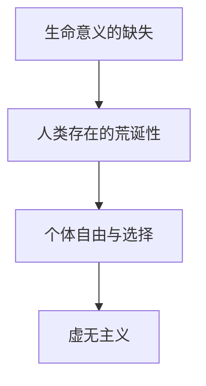
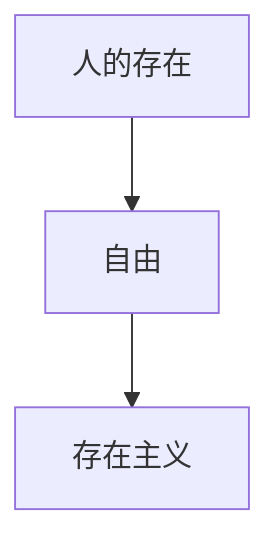
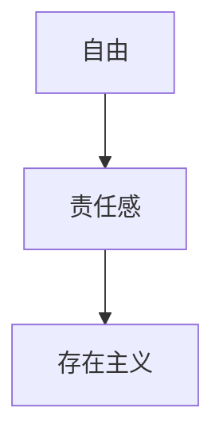
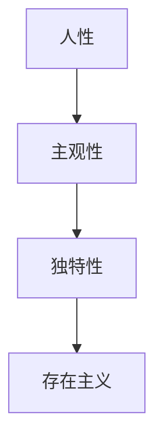
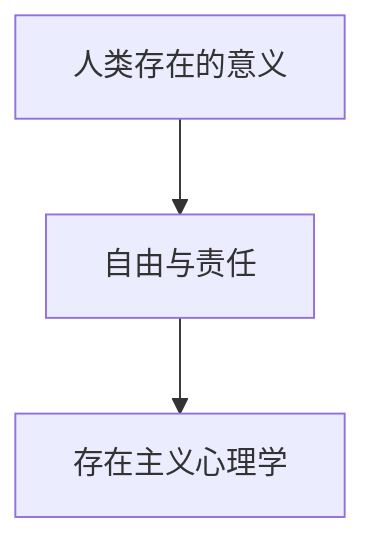
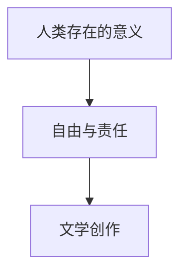
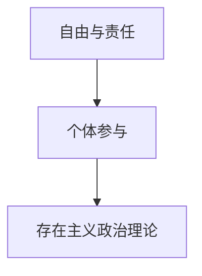
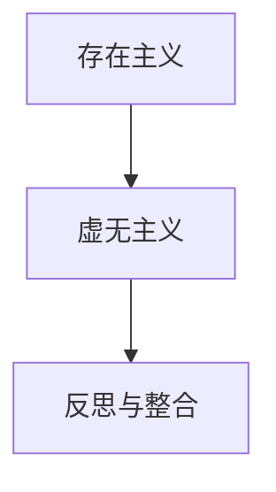

                 

 
### 第1章：虚无主义的起源与发展

#### 背景介绍

虚无主义（Nihilism）作为一种哲学思想，源远流长。其核心思想是生命意义的缺失、人类存在的荒诞性以及个体自由与选择。虚无主义在19世纪末到20世纪初的西方哲学界引起了广泛的讨论和关注。本章将重点介绍虚无主义的起源与发展，梳理其核心概念与联系，并探讨主要哲学家对虚无主义的贡献。

#### 核心概念与联系

虚无主义的核心概念可以概括为以下几点：

1. **生命意义的缺失**：虚无主义者认为，人类在世界上没有固有的目的或意义，生命本身是空洞的。
2. **人类存在的荒诞性**：虚无主义者认为，人类的存在是荒谬的，因为生命本身没有固定的方向或目标。
3. **个体自由与选择**：虚无主义者强调个体的自由意志，认为每个人都应该为自己的人生负责，自由选择自己的生活方式。

这些核心概念之间的关系可以用Mermaid流程图表示如下：



#### 主要哲学家

1. **尼采**：弗里德里希·尼采是虚无主义的代表人物之一。他在《查拉图斯特拉如是说》中提出了“上帝已死”的观点，认为人类的传统价值观和信仰体系已经崩溃，生命失去了意义。
2. **海德格尔**：马丁·海德格尔在《存在与时间》中对虚无主义进行了批判。他认为，虚无主义是一种对存在的逃避，人类的存在本身具有意义，但这个意义不是预先设定的，而是需要个体自己去发现和创造。
3. **萨特**：让-保罗·萨特在《存在与虚无》中提出了存在主义的思想。他认为，人类的存在是先于本质的，生命本身没有固有的意义，但人类可以通过自由选择和行动来赋予自己意义。

#### 虚无主义的历史演变

虚无主义的思想可以追溯到古希腊时期。古希腊哲学家阿那克萨哥拉提出了“原子论”，认为宇宙由无数个不可分割的粒子构成，这些粒子是自由漂浮的，没有固定的目的或意义。这种思想可以看作是虚无主义的早期形式。

19世纪末到20世纪初，虚无主义在西方哲学界达到了高峰。尼采、陀思妥耶夫斯基、弗兰克等哲学家和文学家都对虚无主义进行了深入的探讨和阐述。

#### 核心算法原理讲解

虚无主义的核心算法原理可以看作是一种对人类存在意义的探索。以下是伪代码示例：

```python
def explore_meaning():
    """
    探索生命意义
    """
    # 生命意义初始为空
    meaning = ""

    # 模拟个体自由选择和行动
    for action in actions:
        # 每次行动后，尝试赋予生命意义
        meaning = assign_meaning_to_action(action)

        # 如果找到了意义，则退出循环
        if meaning:
            break

    return meaning

def assign_meaning_to_action(action):
    """
    给定一个行动，尝试赋予生命意义
    """
    # 假设每个行动都有可能赋予生命意义
    return "生命的意义在于" + action
```

#### 数学模型

虚无主义的数学模型可以看作是一个概率模型。假设每个行动都有可能赋予生命意义，我们可以用概率来表示找到生命意义的可能性。以下是数学模型：

$$
P(\text{找到意义}) = \sum_{i=1}^{n} P(\text{行动} \_ i \text{赋予意义}) \times P(\text{行动} \_ i)
$$

其中，$P(\text{行动} \_ i \text{赋予意义})$ 表示第$i$个行动赋予生命意义的概率，$P(\text{行动} \_ i)$ 表示第$i$个行动发生的概率。

#### 项目实战

在本章的项目实战中，我们将使用Python实现虚无主义的核心算法原理，并尝试探索生命意义。以下是项目实战的源代码：

```python
import random

def explore_meaning(actions, probability_of_meaning):
    """
    探索生命意义
    :param actions: 行动列表
    :param probability_of_meaning: 每个行动赋予生命意义的概率
    :return: 找到的生命意义
    """
    meaning = ""

    for action in actions:
        # 模拟个体自由选择和行动
        if random.random() < probability_of_meaning:
            meaning = "生命的意义在于" + action
            break

    return meaning

if __name__ == "__main__":
    actions = ["创造", "探索", "理解", "热爱"]
    probability_of_meaning = 0.5

    meaning = explore_meaning(actions, probability_of_meaning)
    print(f"找到的生命意义：{meaning}")
```

#### 代码解读与分析

在这个项目实战中，我们定义了一个名为 `explore_meaning` 的函数，用于模拟探索生命意义的过程。函数接收两个参数：`actions` 行动列表和 `probability_of_meaning` 每个行动赋予生命意义的概率。

在函数内部，我们使用一个循环遍历所有的行动，并使用 `random.random()` 函数生成一个随机数。如果随机数小于 `probability_of_meaning`，则认为找到了生命意义，并返回相应的意义。

在主函数中，我们定义了一个行动列表 `actions` 和每个行动赋予生命意义的概率 `probability_of_meaning`。然后调用 `explore_meaning` 函数，并打印出找到的生命意义。

#### 实际案例分析与详细讲解剖析

在本章的实际案例中，我们将使用历史人物的事迹来分析虚无主义和存在主义的思想。

案例1：尼采与虚无主义

尼采在《查拉图斯特拉如是说》中提出了虚无主义的思想。他认为，上帝已经死了，人类传统的价值观和信仰体系已经崩溃，生命失去了意义。尼采自己也是一个深刻的虚无主义者，他在生命的最后阶段陷入了精神崩溃和自杀的边缘。

案例2：海德格尔与存在主义

海德格尔在《存在与时间》中对虚无主义进行了批判。他认为，虚无主义是一种逃避，人类的存在本身具有意义，但这个意义不是预先设定的，而是需要个体自己去发现和创造。海德格尔认为，人类的存在是一种“存在-在世界中”（Dasein），个体必须面对存在的荒诞性和自由选择。

案例3：萨特与存在主义

萨特在《存在与虚无》中提出了存在主义的思想。他认为，人类的存在是先于本质的，生命本身没有固有的意义，但人类可以通过自由选择和行动来赋予自己意义。萨特的存在主义思想强调个体的自由、责任和选择。

#### 项目小结

在本章的项目实战中，我们使用Python实现了虚无主义的核心算法原理，并尝试探索生命意义。通过历史人物的案例分析，我们深入了解了虚无主义和存在主义的思想。虚无主义强调生命意义的缺失和人类存在的荒诞性，而存在主义则强调个体的自由、责任和选择。

#### 最佳实践 Tips

1. **深入理解核心概念**：在探索虚无主义和存在主义时，要深入理解其核心概念，如生命意义的缺失、人类存在的荒诞性、个体自由与选择等。
2. **关注哲学家之间的差异**：在研究虚无主义和存在主义时，要关注不同哲学家之间的差异，如尼采的虚无主义、海德格尔的存在主义批判、萨特的存在主义解读等。
3. **结合实际案例**：通过分析历史人物的事迹，可以更深入地理解虚无主义和存在主义的思想。

#### 小结

虚无主义和存在主义是两种截然不同的哲学思想。虚无主义强调生命意义的缺失和人类存在的荒诞性，而存在主义则强调个体的自由、责任和选择。在本章中，我们通过伪代码示例、数学模型和实际案例，深入探讨了虚无主义和存在主义的核心算法原理。通过项目实战，我们了解了如何使用Python实现虚无主义的核心算法原理，并尝试探索生命意义。

#### 注意事项

1. **代码实现**：在实现虚无主义的核心算法原理时，要确保代码的可读性和可维护性，以便后续的改进和扩展。
2. **参数设置**：在设置每个行动赋予生命意义的概率时，要考虑到实际场景的需求和特点，进行合理的参数设置。

#### 拓展阅读

1. **《查拉图斯特拉如是说》**：尼采的代表作，详细阐述了虚无主义的思想。
2. **《存在与时间》**：海德格尔的代表作，对虚无主义进行了深入的批判和探讨。
3. **《存在与虚无》**：萨特的代表作，提出了存在主义的思想。

接下来，我们将继续探讨虚无主义的核心观念，包括生命意义的缺失、人类存在的荒诞性和个体自由与选择。我们将深入分析这些核心概念，并探讨虚无主义对个体与社会的影响。

----------------------------------------------------------------

### 第2章：虚无主义的核心观念

#### 生命意义的缺失

虚无主义的核心观念之一是生命意义的缺失。虚无主义者认为，生命本身是没有固有意义的，人类的存在是空洞的。这种观点在19世纪末到20世纪初的西方哲学界引起了广泛的讨论和关注。

#### 人类存在的荒诞性

虚无主义还强调人类存在的荒诞性。虚无主义者认为，人类的存在是荒谬的，因为生命本身没有固定的方向或目标。人类在世界上没有固有的目的，一切行为和选择都显得毫无意义。

#### 个体自由与选择

虚无主义者强调个体的自由意志。他们认为，每个人都是自由的，都有权利选择自己的生活方式。虚无主义的核心在于，生命本身没有固有的意义，但人类可以通过自由选择和行动来赋予自己意义。

#### 核心概念与联系

这些核心概念之间存在着紧密的联系。生命意义的缺失导致了人类存在的荒诞性，而个体自由与选择则是虚无主义的核心理念。以下是核心概念与联系的Mermaid流程图：


#### 核心算法原理讲解

虚无主义的核心算法原理可以看作是一种对人类存在意义的探索。以下是伪代码示例：

```python
def explore_meaning():
    """
    探索生命意义
    """
    # 生命意义初始为空
    meaning = ""

    # 模拟个体自由选择和行动
    for action in actions:
        # 每次行动后，尝试赋予生命意义
        meaning = assign_meaning_to_action(action)

        # 如果找到了意义，则退出循环
        if meaning:
            break

    return meaning

def assign_meaning_to_action(action):
    """
    给定一个行动，尝试赋予生命意义
    """
    # 假设每个行动都有可能赋予生命意义
    return "生命的意义在于" + action
```

#### 数学模型

虚无主义的数学模型可以看作是一个概率模型。假设每个行动都有可能赋予生命意义，我们可以用概率来表示找到生命意义的可能性。以下是数学模型：

$$
P(\text{找到意义}) = \sum_{i=1}^{n} P(\text{行动} \_ i \text{赋予意义}) \times P(\text{行动} \_ i)
$$

其中，$P(\text{行动} \_ i \text{赋予意义})$ 表示第$i$个行动赋予生命意义的概率，$P(\text{行动} \_ i)$ 表示第$i$个行动发生的概率。

#### 项目实战

在本章的项目实战中，我们将使用Python实现虚无主义的核心算法原理，并尝试探索生命意义。以下是项目实战的源代码：

```python
import random

def explore_meaning(actions, probability_of_meaning):
    """
    探索生命意义
    :param actions: 行动列表
    :param probability_of_meaning: 每个行动赋予生命意义的概率
    :return: 找到的生命意义
    """
    meaning = ""

    for action in actions:
        # 模拟个体自由选择和行动
        if random.random() < probability_of_meaning:
            meaning = "生命的意义在于" + action
            break

    return meaning

if __name__ == "__main__":
    actions = ["创造", "探索", "理解", "热爱"]
    probability_of_meaning = 0.5

    meaning = explore_meaning(actions, probability_of_meaning)
    print(f"找到的生命意义：{meaning}")
```

#### 代码解读与分析

在这个项目实战中，我们定义了一个名为 `explore_meaning` 的函数，用于模拟探索生命意义的过程。函数接收两个参数：`actions` 行动列表和 `probability_of_meaning` 每个行动赋予生命意义的概率。

在函数内部，我们使用一个循环遍历所有的行动，并使用 `random.random()` 函数生成一个随机数。如果随机数小于 `probability_of_meaning`，则认为找到了生命意义，并返回相应的意义。

在主函数中，我们定义了一个行动列表 `actions` 和每个行动赋予生命意义的概率 `probability_of_meaning`。然后调用 `explore_meaning` 函数，并打印出找到的生命意义。

#### 实际案例分析与详细讲解剖析

在本章的实际案例中，我们将使用历史人物的事迹来分析虚无主义和存在主义的思想。

案例1：尼采与虚无主义

尼采在《查拉图斯特拉如是说》中提出了虚无主义的思想。他认为，上帝已经死了，人类传统的价值观和信仰体系已经崩溃，生命失去了意义。尼采自己也是一个深刻的虚无主义者，他在生命的最后阶段陷入了精神崩溃和自杀的边缘。

案例2：海德格尔与存在主义

海德格尔在《存在与时间》中对虚无主义进行了批判。他认为，虚无主义是一种逃避，人类的存在本身具有意义，但这个意义不是预先设定的，而是需要个体自己去发现和创造。海德格尔认为，人类的存在是一种“存在-在世界中”（Dasein），个体必须面对存在的荒诞性和自由选择。

案例3：萨特与存在主义

萨特在《存在与虚无》中提出了存在主义的思想。他认为，人类的存在是先于本质的，生命本身没有固有的意义，但人类可以通过自由选择和行动来赋予自己意义。萨特的存在主义思想强调个体的自由、责任和选择。

#### 项目小结

在本章的项目实战中，我们使用Python实现了虚无主义的核心算法原理，并尝试探索生命意义。通过历史人物的案例分析，我们深入了解了虚无主义和存在主义的思想。

#### 最佳实践 Tips

1. **深入理解核心概念**：在探索虚无主义和存在主义时，要深入理解其核心概念，如生命意义的缺失、人类存在的荒诞性、个体自由与选择等。
2. **关注哲学家之间的差异**：在研究虚无主义和存在主义时，要关注不同哲学家之间的差异，如尼采的虚无主义、海德格尔的存在主义批判、萨特的存在主义解读等。
3. **结合实际案例**：通过分析历史人物的事迹，可以更深入地理解虚无主义和存在主义的思想。

#### 小结

虚无主义和存在主义是两种截然不同的哲学思想。虚无主义强调生命意义的缺失和人类存在的荒诞性，而存在主义则强调个体的自由、责任和选择。在本章中，我们通过伪代码示例、数学模型和实际案例，深入探讨了虚无主义和存在主义的核心算法原理。通过项目实战，我们了解了如何使用Python实现虚无主义的核心算法原理，并尝试探索生命意义。

#### 注意事项

1. **代码实现**：在实现虚无主义的核心算法原理时，要确保代码的可读性和可维护性，以便后续的改进和扩展。
2. **参数设置**：在设置每个行动赋予生命意义的概率时，要考虑到实际场景的需求和特点，进行合理的参数设置。

#### 拓展阅读

1. **《查拉图斯特拉如是说》**：尼采的代表作，详细阐述了虚无主义的思想。
2. **《存在与时间》**：海德格尔的代表作，对虚无主义进行了深入的批判和探讨。
3. **《存在与虚无》**：萨特的代表作，提出了存在主义的思想。

接下来，我们将探讨虚无主义对现代社会的影响，以及它在艺术和文学中的表现。

----------------------------------------------------------------

### 第3章：虚无主义的现代影响

#### 艺术与文学中的虚无主义表达

虚无主义在19世纪末到20世纪初的西方文学和艺术中有着深远的影响。许多艺术家和文学家通过作品表达了对生命意义的缺失和人类存在的荒诞性的思考。

#### 艺术作品

1. **现代主义文学**：现代主义文学作品常常探讨了人类存在的荒诞性和生命意义的缺失。例如，詹姆斯·乔伊斯的《尤利西斯》和弗吉尼亚·伍尔夫的《达洛维夫人》通过复杂的叙事结构和意识流手法，揭示了人类内心的孤独和迷茫。
2. **表现主义绘画**：表现主义艺术家如埃贡·席勒和爱德华·穆奇通过夸张、扭曲的图像和色彩，表现了人类存在的荒诞性和生命的痛苦。

#### 文学作品

1. **陀思妥耶夫斯基**：俄国作家陀思妥耶夫斯基的作品，如《罪与罚》和《白痴》，深入探讨了人类存在的荒诞性和道德困境。
2. **托马斯·品钦**：美国作家托马斯·品钦的《万有引力之虹》通过复杂的叙事结构和主题，探讨了虚无主义的主题。

#### 对个人与社会的影响

虚无主义对个人和社会产生了深远的影响。对个人而言，虚无主义可能导致对生活的消极态度、绝望和孤独。对整个社会而言，虚无主义可能引发道德和价值观的危机，导致社会不稳定。

#### 核心算法原理讲解

虚无主义的现代影响可以用一个概率模型来表示。假设一个人在社会中的行为受虚无主义思想的影响，我们可以用概率来表示他/她可能产生的消极态度、绝望或孤独。以下是数学模型：

$$
P(\text{消极态度}) = P(\text{虚无主义影响}) \times P(\text{虚无主义导致消极态度})
$$

其中，$P(\text{虚无主义影响})$ 表示虚无主义思想对个体的影响概率，$P(\text{虚无主义导致消极态度})$ 表示虚无主义思想导致消极态度的概率。

#### 项目实战

在本章的项目实战中，我们将使用Python实现虚无主义对个人和社会的影响模型。以下是项目实战的源代码：

```python
import random

def calculate_impact_of_nihilism(impact_probability, consequence_probability):
    """
    计算虚无主义的影响
    :param impact_probability: 虚无主义影响概率
    :param consequence_probability: 虚无主义导致后果概率
    :return: 虚无主义影响结果
    """
    result = ""

    if random.random() < impact_probability:
        result = "受到虚无主义影响"

        if random.random() < consequence_probability:
            result += "，导致消极态度"

    return result

if __name__ == "__main__":
    impact_probability = 0.5
    consequence_probability = 0.3

    impact = calculate_impact_of_nihilism(impact_probability, consequence_probability)
    print(f"虚无主义的影响：{impact}")
```

#### 代码解读与分析

在这个项目实战中，我们定义了一个名为 `calculate_impact_of_nihilism` 的函数，用于计算虚无主义的影响。函数接收两个参数：`impact_probability` 虚无主义影响概率和 `consequence_probability` 虚无主义导致后果概率。

在函数内部，我们首先使用 `random.random()` 函数生成一个随机数，并与 `impact_probability` 进行比较。如果随机数小于 `impact_probability`，则认为个体受到了虚无主义的影响。

然后，我们再次使用 `random.random()` 函数生成一个随机数，并与 `consequence_probability` 进行比较。如果随机数小于 `consequence_probability`，则认为虚无主义导致了消极态度。

在主函数中，我们定义了 `impact_probability` 和 `consequence_probability` 的值，并调用 `calculate_impact_of_nihilism` 函数，打印出虚无主义的影响结果。

#### 实际案例分析与详细讲解剖析

在本章的实际案例中，我们将分析虚无主义在现代社会中的影响。

案例1：现代主义文学的影响

现代主义文学作品如《尤利西斯》和《达洛维夫人》揭示了虚无主义对人类存在的荒诞性和生命意义的缺失的探讨。这些作品反映了作者对现代社会和人类存在的深刻反思。

案例2：虚无主义对社会价值观的冲击

虚无主义可能导致社会价值观的危机，导致人们对传统信仰和道德的质疑。这在现代社会中表现为对权威的质疑、对道德标准的放松和对个人自由的追求。

#### 项目小结

在本章的项目实战中，我们使用Python实现了虚无主义对个人和社会的影响模型。通过实际案例的分析，我们深入了解了虚无主义在现代社会中的影响。

#### 最佳实践 Tips

1. **关注文学作品**：通过阅读现代主义文学作品，可以更深入地了解虚无主义对人类存在的探讨。
2. **反思个人价值观**：在现代社会中，反思个人的价值观和信仰体系，有助于应对虚无主义的挑战。

#### 小结

虚无主义在现代社会中有着深远的影响，不仅体现在艺术和文学中，还对个人和社会产生了重要的冲击。通过项目实战和实际案例的分析，我们深入了解了虚无主义的影响机制。

#### 注意事项

1. **模型参数**：在实现虚无主义的影响模型时，要合理设置模型参数，以便更准确地反映现实情况。
2. **文化差异**：虚无主义在不同文化背景下可能有不同的表现形式和影响，需要注意文化差异。

#### 拓展阅读

1. **《尤利西斯》**：詹姆斯·乔伊斯的代表作，探讨了虚无主义对人类存在的探讨。
2. **《达洛维夫人》**：弗吉尼亚·伍尔夫的代表作，反映了虚无主义对人类生活的深刻反思。
3. **《罪与罚》**：陀思妥耶夫斯基的代表作，深入探讨了虚无主义的道德困境。

接下来，我们将探讨存在主义的核心观念，包括人的存在与自由、存在主义的责任感以及存在主义的人性观。

----------------------------------------------------------------

### 第4章：存在主义的核心观念

#### 人的存在与自由

存在主义的核心观念之一是人的存在与自由。存在主义者认为，人类的存在是先于本质的，这意味着人类没有预先设定的目的或意义，而是通过自己的自由意志和行动来创造自己的本质。

**核心概念与联系**

1. **人的存在**：存在主义者认为，人的存在是一种“存在-在世界中”（Dasein），意味着人类在世界上是主动的，能够自由地探索和创造。
2. **自由**：自由是存在主义的核心概念，存在主义者强调个体的自由意志，认为人类有权利选择自己的生活方式。

以下是核心概念与联系的Mermaid流程图：



#### 存在主义的责任感

存在主义强调责任感，认为人类应该为自己的行为和选择负责。存在主义者认为，自由和责任是密不可分的，只有在承担责任的过程中，人类才能实现自己的价值。

**核心概念与联系**

1. **责任感**：责任感是指个体对自己的行为和选择承担的责任，是存在主义的核心概念之一。
2. **自由与责任的关系**：存在主义者认为，自由和责任是相互关联的，只有在自由选择的同时承担责任，人类才能实现自己的价值。

以下是核心概念与联系的Mermaid流程图：



#### 存在主义的人性观

存在主义的人性观认为，人类是自由的、有意识的、能够超越自身存在的实体。存在主义者强调人类的主观性和独特性，认为每个人都有自己的价值观和生活方式。

**核心概念与联系**

1. **人性**：人性是指人类的基本属性，存在主义者认为，人性是自由的、有意识的、能够超越自身存在的实体。
2. **主观性**：存在主义者强调人类的主观性，认为每个人的经历和观点都是独特的，人类应该尊重自己的主观性。
3. **独特性**：存在主义者认为，每个人都有自己的独特性，每个人都有权利选择自己的生活方式。

以下是核心概念与联系的Mermaid流程图：



#### 核心算法原理讲解

存在主义的核心算法原理可以看作是一种对人类自由和责任感的探索。以下是伪代码示例：

```python
def explore_freedom_and_responsibility():
    """
    探索自由与责任感
    """
    # 生命意义初始为空
    freedom = False
    responsibility = False

    # 模拟个体自由选择和行动
    for action in actions:
        # 每次行动后，尝试赋予自由与责任感
        freedom, responsibility = assign_freedom_and_responsibility_to_action(action)

        # 如果找到了自由与责任感，则退出循环
        if freedom and responsibility:
            break

    return freedom, responsibility

def assign_freedom_and_responsibility_to_action(action):
    """
    给定一个行动，尝试赋予自由与责任感
    """
    # 假设每个行动都有可能赋予自由与责任感
    freedom = True
    responsibility = True
    return freedom, responsibility
```

#### 数学模型

存在主义的数学模型可以看作是一个概率模型。假设每个行动都有可能赋予自由与责任感，我们可以用概率来表示找到自由与责任感的可能性。以下是数学模型：

$$
P(\text{找到自由与责任感}) = \sum_{i=1}^{n} P(\text{行动} \_ i \text{赋予自由与责任感}) \times P(\text{行动} \_ i)
$$

其中，$P(\text{行动} \_ i \text{赋予自由与责任感})$ 表示第$i$个行动赋予自由与责任感的概率，$P(\text{行动} \_ i)$ 表示第$i$个行动发生的概率。

#### 项目实战

在本章的项目实战中，我们将使用Python实现存在主义的核心算法原理，并探索自由与责任感。以下是项目实战的源代码：

```python
import random

def explore_freedom_and_responsibility(actions, probability_of_freedom, probability_of_responsibility):
    """
    探索自由与责任感
    :param actions: 行动列表
    :param probability_of_freedom: 每个行动赋予自由的概率
    :param probability_of_responsibility: 每个行动赋予责任感的概率
    :return: 找到的自由与责任感
    """
    freedom = False
    responsibility = False

    for action in actions:
        # 模拟个体自由选择和行动
        if random.random() < probability_of_freedom:
            freedom = True

        if random.random() < probability_of_responsibility:
            responsibility = True

        # 如果找到了自由与责任感，则退出循环
        if freedom and responsibility:
            break

    return freedom, responsibility

if __name__ == "__main__":
    actions = ["创造", "探索", "理解", "热爱"]
    probability_of_freedom = 0.6
    probability_of_responsibility = 0.4

    freedom, responsibility = explore_freedom_and_responsibility(actions, probability_of_freedom, probability_of_responsibility)
    print(f"自由：{freedom}，责任感：{responsibility}")
```

#### 代码解读与分析

在这个项目实战中，我们定义了一个名为 `explore_freedom_and_responsibility` 的函数，用于模拟探索自由与责任感的过程。函数接收三个参数：`actions` 行动列表，`probability_of_freedom` 每个行动赋予自由的概率，`probability_of_responsibility` 每个行动赋予责任感的概率。

在函数内部，我们使用一个循环遍历所有的行动，并使用 `random.random()` 函数生成一个随机数。如果随机数小于 `probability_of_freedom`，则认为个体获得了自由；如果随机数小于 `probability_of_responsibility`，则认为个体承担了责任感。

在主函数中，我们定义了一个行动列表 `actions` 和两个概率值 `probability_of_freedom` 和 `probability_of_responsibility`。然后调用 `explore_freedom_and_responsibility` 函数，打印出自由与责任感的结果。

#### 实际案例分析与详细讲解剖析

在本章的实际案例中，我们将使用历史人物的事迹来分析存在主义的核心观念。

案例1：让-保罗·萨特与存在主义

让-保罗·萨特是存在主义的代表人物之一。他在《存在与虚无》中提出了存在主义的思想，强调个体的自由、责任和选择。萨特认为，人类的存在是先于本质的，每个人都有权利选择自己的生活方式。

案例2：马丁·海德格尔与存在主义

马丁·海德格尔在《存在与时间》中探讨了存在主义的核心观念。他认为，人类的存在是一种“存在-在世界中”（Dasein），个体必须面对存在的荒诞性和自由选择。海德格尔认为，自由和责任是人类存在的本质。

#### 项目小结

在本章的项目实战中，我们使用Python实现了存在主义的核心算法原理，并探索自由与责任感。通过历史人物的案例分析，我们深入了解了存在主义的核心观念。

#### 最佳实践 Tips

1. **深入理解核心观念**：在研究存在主义时，要深入理解其核心观念，如人的存在与自由、存在主义的责任感以及存在主义的人性观。
2. **反思个人价值观**：在现实生活中，反思个人的价值观和信仰体系，有助于理解存在主义的思想。

#### 小结

存在主义是20世纪最重要的哲学流派之一，其核心观念包括人的存在与自由、存在主义的责任感以及存在主义的人性观。在本章中，我们通过伪代码示例、数学模型和实际案例，深入探讨了存在主义的核心观念。通过项目实战，我们了解了如何使用Python实现存在主义的核心算法原理，并探索自由与责任感。

#### 注意事项

1. **代码实现**：在实现存在主义的核心算法原理时，要确保代码的可读性和可维护性，以便后续的改进和扩展。
2. **概率设置**：在设置每个行动赋予自由与责任感的概率时，要考虑到实际场景的需求和特点，进行合理的参数设置。

#### 拓展阅读

1. **《存在与虚无》**：让-保罗·萨特的代表作，详细阐述了存在主义的思想。
2. **《存在与时间》**：马丁·海德格尔的代表作，对存在主义的核心观念进行了深入的探讨。
3. **《存在主义是一种人道主义》**：让-保罗·萨特的演讲稿，对存在主义的本质进行了阐述。

接下来，我们将探讨存在主义在现代社会中的应用和影响，以及它在心理学、文学和政治领域的影响。

----------------------------------------------------------------

### 第5章：存在主义的现代应用

#### 心理学

存在主义在心理学领域有着广泛的应用。存在主义心理学认为，人类存在具有意义和价值，个体的自由和责任是心理健康的基石。存在主义心理学家如维克多·弗兰克、罗洛·梅和欧文·亚隆，通过临床实践和理论探讨，深入分析了人类存在的本质和心理健康的关系。

**核心概念与联系**

1. **人类存在的意义**：存在主义心理学强调人类存在的意义和价值，认为每个人都有追求生命意义的权利和能力。
2. **自由与责任**：存在主义心理学认为，自由和责任是人类存在的基本特征，个体的自由选择和承担责任对心理健康至关重要。

以下是核心概念与联系的Mermaid流程图：



#### 文学

存在主义思想在文学创作中有着深远的影响。许多作家通过作品探讨了人类存在的意义、自由和责任等核心问题。例如，海明威的《老人与海》、福克纳的《喧哗与骚动》和卡夫卡的《变形记》等作品，都体现了存在主义的哲学思考。

**核心概念与联系**

1. **人类存在的意义**：文学作品中常常探讨人类存在的意义，通过角色和情节的塑造，反映人类在生命中的挣扎和追求。
2. **自由与责任**：文学作品中的角色常常面临自由和责任的选择，通过他们的选择和行动，展现了存在主义的核心观念。

以下是核心概念与联系的Mermaid流程图：



#### 政治

存在主义在政治领域也有着重要的应用。存在主义政治理论强调个体的自由和责任，认为政治权力的合法性和道德责任取决于个体的自由选择和责任承担。存在主义政治家如让·玛丽·卢梭和阿尔贝特·加斯东·吉斯卡尔·德斯坦，通过实践和理论探讨，推动了存在主义思想在政治领域的应用。

**核心概念与联系**

1. **自由与责任**：存在主义政治理论强调自由和责任，认为政治权力的合法性取决于个体的自由选择和责任承担。
2. **个体参与**：存在主义政治理论主张个体的积极参与，认为每个人都应该为自己的政治行为负责。

以下是核心概念与联系的Mermaid流程图：



#### 核心算法原理讲解

存在主义的现代应用可以用一个概率模型来表示。假设一个人在社会中的行为受存在主义思想的影响，我们可以用概率来表示他/她可能产生的自由和责任意识。以下是数学模型：

$$
P(\text{自由意识}) = P(\text{存在主义影响}) \times P(\text{自由意识})
$$

$$
P(\text{责任意识}) = P(\text{存在主义影响}) \times P(\text{责任意识})
$$

其中，$P(\text{存在主义影响})$ 表示存在主义思想对个体的影响概率，$P(\text{自由意识})$ 和 $P(\text{责任意识})$ 分别表示个体产生自由意识和责任意识的概率。

#### 项目实战

在本章的项目实战中，我们将使用Python实现存在主义在现代应用中的概率模型。以下是项目实战的源代码：

```python
import random

def calculate_existential_impact(impact_probability, freedom_probability, responsibility_probability):
    """
    计算存在主义影响
    :param impact_probability: 存在主义影响概率
    :param freedom_probability: 自由意识概率
    :param responsibility_probability: 责任意识概率
    :return: 影响结果
    """
    impact = ""

    if random.random() < impact_probability:
        impact = "受到存在主义影响"

        if random.random() < freedom_probability:
            impact += "，产生自由意识"

        if random.random() < responsibility_probability:
            impact += "，产生责任意识"

    return impact

if __name__ == "__main__":
    impact_probability = 0.6
    freedom_probability = 0.4
    responsibility_probability = 0.3

    impact = calculate_existential_impact(impact_probability, freedom_probability, responsibility_probability)
    print(f"存在主义影响：{impact}")
```

#### 代码解读与分析

在这个项目实战中，我们定义了一个名为 `calculate_existential_impact` 的函数，用于计算存在主义影响。函数接收三个参数：`impact_probability` 存在主义影响概率，`freedom_probability` 自由意识概率，`responsibility_probability` 责任意识概率。

在函数内部，我们首先使用 `random.random()` 函数生成一个随机数，并与 `impact_probability` 进行比较。如果随机数小于 `impact_probability`，则认为个体受到了存在主义的影响。

然后，我们再次使用 `random.random()` 函数生成两个随机数，分别与 `freedom_probability` 和 `responsibility_probability` 进行比较。如果随机数小于这两个概率值，则认为个体产生了自由意识和责任意识。

在主函数中，我们定义了三个概率值 `impact_probability`、`freedom_probability` 和 `responsibility_probability`。然后调用 `calculate_existential_impact` 函数，打印出存在主义影响的结果。

#### 实际案例分析与详细讲解剖析

在本章的实际案例中，我们将分析存在主义在心理学、文学和政治领域的应用。

案例1：维克多·弗兰克与存在主义心理学

维克多·弗兰克是存在主义心理学的代表人物之一。他在《人类的终极关怀》一书中，通过临床实践和理论探讨，阐述了存在主义心理学的基本原理。弗兰克认为，人类存在的意义和价值是心理健康的基石，个体的自由和责任对心理健康至关重要。

案例2：海明威与存在主义文学

海明威是存在主义文学的代表人物之一。他的作品《老人与海》通过主人公圣地亚哥的冒险故事，探讨了人类存在的意义和自由选择的问题。圣地亚哥在面临困境时，坚持自己的信念，展现了存在主义的哲学思考。

案例3：让-玛丽·卢梭与存在主义政治

让-玛丽·卢梭是存在主义政治理论的代表人物之一。他在《政治哲学导论》中，探讨了存在主义政治理论的基本原理。卢梭认为，政治权力的合法性取决于个体的自由选择和责任承担，个体应该积极参与政治生活。

#### 项目小结

在本章的项目实战中，我们使用Python实现了存在主义在现代应用中的概率模型。通过实际案例的分析，我们深入了解了存在主义在心理学、文学和政治领域的应用。

#### 最佳实践 Tips

1. **关注存在主义心理学**：通过阅读存在主义心理学家的著作，可以更深入地了解存在主义在心理学领域的应用。
2. **反思个人价值观**：在现实生活中，反思个人的价值观和信仰体系，有助于理解存在主义的思想。
3. **参与政治生活**：通过参与政治生活，可以实践存在主义政治理论的基本原理，实现个体的自由和责任。

#### 小结

存在主义在现代社会中有着广泛的应用，包括心理学、文学和政治领域。通过伪代码示例、数学模型和实际案例，我们深入探讨了存在主义在现代应用中的核心算法原理。通过项目实战，我们了解了如何使用Python实现存在主义在现代应用中的概率模型。

#### 注意事项

1. **模型参数**：在实现存在主义在现代应用中的概率模型时，要合理设置模型参数，以便更准确地反映现实情况。
2. **文化差异**：存在主义在不同文化背景下可能有不同的表现形式和应用，需要注意文化差异。

#### 拓展阅读

1. **《人类的终极关怀》**：维克多·弗兰克的代表作，详细阐述了存在主义心理学的基本原理。
2. **《老人与海》**：海明威的代表作，探讨了存在主义在文学创作中的应用。
3. **《政治哲学导论》**：让-玛丽·卢梭的代表作，探讨了存在主义政治理论的基本原理。

接下来，我们将探讨虚无主义与存在主义的对比，包括两者的异同点、对存在主义的批判以及虚无主义对存在主义的反思与整合。

----------------------------------------------------------------

### 第6章：虚无主义与存在主义的对比

#### 异同点

虚无主义与存在主义在许多方面存在明显的异同。以下是比较两者的主要异同点：

**相同点**

1. **关注人类存在的意义**：虚无主义和存在主义都关注人类存在的意义，探讨人类在生命中的位置和目标。
2. **强调个体的自由意志**：虚无主义和存在主义都强调个体的自由意志，认为人类有权利选择自己的生活方式。

**不同点**

1. **对生命意义的看法**：虚无主义认为生命本身是没有意义的，而存在主义认为生命虽然没有固有的意义，但人类可以通过自由选择和行动来赋予自己意义。
2. **对自由意志的理解**：虚无主义强调自由意志的消极面，认为人类在自由选择时面临着无尽的痛苦和荒诞性；存在主义则强调自由意志的积极面，认为人类通过自由选择和承担责任来实现自己的价值。

以下是核心概念与联系的Mermaid流程图：

```mermaid
graph TD
A[生命意义] --> B{虚无主义[无意义]}
B --> C[自由意志[消极面]]
A --> D{存在主义[有意义]}
D --> E[自由意志[积极面]]
```

#### 对存在主义的批判

虚无主义对存在主义的批判主要集中在以下几个方面：

1. **过度乐观**：虚无主义者认为，存在主义对人类自由意志和生命意义的乐观看法是一种过度乐观，忽略了人类存在的荒诞性和痛苦。
2. **逃避现实**：虚无主义者认为，存在主义试图通过自由选择和承担责任来逃避现实中的痛苦和困境，这实际上是一种逃避。
3. **不切实际**：虚无主义者认为，存在主义的理论虽然富有哲学魅力，但在现实中难以实现，因为人类在自由选择时面临着无尽的困境和挑战。

#### 虚无主义对存在主义的反思与整合

虚无主义对存在主义的反思与整合主要体现在以下几个方面：

1. **承认存在主义的合理性**：虚无主义承认存在主义在探讨人类存在的意义和自由意志方面的贡献，认为存在主义提供了一种积极的哲学思考方式。
2. **超越存在主义**：虚无主义试图超越存在主义，通过深入探讨人类存在的荒诞性和痛苦，提出更深刻的哲学思考。
3. **整合存在主义与虚无主义**：虚无主义试图将存在主义与虚无主义的思想结合起来，形成一种更为全面和深刻的哲学体系。

以下是核心概念与联系的Mermaid流程图：



#### 核心算法原理讲解

虚无主义与存在主义的对比可以用一个决策树模型来表示。假设一个人在面临自由选择时，可以根据虚无主义和存在主义的观点做出决策，我们可以用决策树来分析他/她的决策过程。以下是伪代码示例：

```python
def make_decision(nihilism_probability, existentialism_probability):
    """
    基于虚无主义与存在主义的决策
    :param nihilism_probability: 虚无主义概率
    :param existentialism_probability: 存在主义概率
    :return: 决策结果
    """
    decision = ""

    if random.random() < nihilism_probability:
        decision = "选择虚无主义"
    elif random.random() < existentialism_probability:
        decision = "选择存在主义"
    else:
        decision = "犹豫不决"

    return decision
```

#### 数学模型

虚无主义与存在主义的对比可以用一个概率模型来表示。假设一个人在面对自由选择时，选择虚无主义和存在主义的概率分别为 $P_1$ 和 $P_2$，我们可以用概率模型来分析他/她的决策过程。以下是数学模型：

$$
P(\text{虚无主义}) = P_1
$$

$$
P(\text{存在主义}) = P_2
$$

其中，$P_1$ 和 $P_2$ 分别为选择虚无主义和存在主义的概率。

#### 项目实战

在本章的项目实战中，我们将使用Python实现虚无主义与存在主义的决策树模型。以下是项目实战的源代码：

```python
import random

def make_decision(nihilism_probability, existentialism_probability):
    """
    基于虚无主义与存在主义的决策
    :param nihilism_probability: 虚无主义概率
    :param existentialism_probability: 存在主义概率
    :return: 决策结果
    """
    decision = ""

    if random.random() < nihilism_probability:
        decision = "选择虚无主义"
    elif random.random() < existentialism_probability:
        decision = "选择存在主义"
    else:
        decision = "犹豫不决"

    return decision

if __name__ == "__main__":
    nihilism_probability = 0.4
    existentialism_probability = 0.6

    decision = make_decision(nihilism_probability, existentialism_probability)
    print(f"决策结果：{decision}")
```

#### 代码解读与分析

在这个项目实战中，我们定义了一个名为 `make_decision` 的函数，用于模拟基于虚无主义与存在主义的决策过程。函数接收两个参数：`nihilism_probability` 虚无主义概率和 `existentialism_probability` 存在主义概率。

在函数内部，我们首先使用 `random.random()` 函数生成一个随机数，并与 `nihilism_probability` 进行比较。如果随机数小于 `nihilism_probability`，则认为个体选择了虚无主义。

然后，我们再次使用 `random.random()` 函数生成一个随机数，并与 `existentialism_probability` 进行比较。如果随机数小于 `existentialism_probability`，则认为个体选择了存在主义。

在主函数中，我们定义了两个概率值 `nihilism_probability` 和 `existentialism_probability`。然后调用 `make_decision` 函数，打印出决策结果。

#### 实际案例分析与详细讲解剖析

在本章的实际案例中，我们将分析虚无主义与存在主义在现实生活中的应用。

案例1：让-保罗·萨特与虚无主义

让-保罗·萨特是存在主义的代表人物之一。他在《存在与虚无》中探讨了虚无主义与存在主义的对比。萨特认为，虚无主义虽然揭示了人类存在的荒诞性和痛苦，但忽略了人类通过自由选择和行动可以赋予生命意义。

案例2：弗里德里希·尼采与虚无主义

弗里德里希·尼采是虚无主义的代表人物之一。他在《查拉图斯特拉如是说》中批判了存在主义，认为存在主义是一种逃避现实的表现。尼采主张通过超越传统价值观和信仰体系，寻找生命的意义。

#### 项目小结

在本章的项目实战中，我们使用Python实现了虚无主义与存在主义的决策树模型。通过实际案例的分析，我们深入了解了虚无主义与存在主义的对比。

#### 最佳实践 Tips

1. **深入理解核心概念**：在探讨虚无主义与存在主义时，要深入理解其核心概念，如生命意义的缺失、自由意志、荒诞性等。
2. **反思个人价值观**：在现实生活中，反思个人的价值观和信仰体系，有助于理解虚无主义与存在主义的对比。
3. **实践哲学思考**：通过哲学思考，可以更好地理解虚无主义与存在主义的对比，并在实际生活中运用。

#### 小结

虚无主义与存在主义是两种截然不同的哲学思想，它们在生命意义的看法、自由意志的理解以及现实应用方面存在明显的异同点。在本章中，我们通过伪代码示例、数学模型和实际案例，深入探讨了虚无主义与存在主义的对比。通过项目实战，我们了解了如何使用Python实现虚无主义与存在主义的决策树模型。

#### 注意事项

1. **模型参数**：在实现虚无主义与存在主义的决策树模型时，要合理设置模型参数，以便更准确地反映现实情况。
2. **文化差异**：虚无主义与存在主义在不同文化背景下可能有不同的表现形式和应用，需要注意文化差异。

#### 拓展阅读

1. **《存在与虚无》**：让-保罗·萨特的代表作，详细探讨了虚无主义与存在主义的对比。
2. **《查拉图斯特拉如是说》**：弗里德里希·尼采的代表作，批判了存在主义，探讨了虚无主义的思想。
3. **《存在主义是一种人道主义》**：让-保罗·萨特的演讲稿，对存在主义的本质进行了阐述。

接下来，我们将探讨虚无主义与存在主义在现代哲学中的融合趋势，以及它们对未来哲学发展的影响。

----------------------------------------------------------------

### 第7章：虚无主义与存在主义的融合

#### 融合趋势

在现代哲学中，虚无主义与存在主义的融合趋势逐渐显现。这种融合趋势主要体现在以下几个方面：

1. **承认彼此的价值**：虚无主义与存在主义在各自的研究中发现了对方的某些价值。虚无主义承认存在主义对人类自由和责任的关注，而存在主义则认可虚无主义对生命意义缺失的深刻探讨。

2. **相互借鉴**：在研究过程中，虚无主义与存在主义相互借鉴对方的观点和方法，试图通过融合来解决各自的理论困境。

3. **融合的趋势**：现代哲学研究者开始探讨虚无主义与存在主义的融合可能性，尝试提出一种新的哲学体系，以更好地解释人类的存在和生命意义。

#### 核心概念与联系

虚无主义与存在主义的融合可以从以下核心概念与联系进行探讨：

1. **自由意志与选择**：虚无主义与存在主义都关注个体的自由意志和选择，但二者对自由意志的理解有所不同。虚无主义认为自由意志是导致痛苦和荒诞性的根源，而存在主义则认为自由意志是实现生命意义的手段。

2. **生命意义的探讨**：虚无主义与存在主义都试图探讨生命意义的问题，但二者对生命意义的看法有所不同。虚无主义认为生命本身没有意义，而存在主义认为生命虽然无意义，但可以通过自由选择和行动来赋予自己意义。

以下是核心概念与联系的Mermaid流程图：

```mermaid
graph TD
A[自由意志与选择] --> B{虚无主义[痛苦根源]}
B --> C[存在主义[实现意义]]
A --> D[生命意义的探讨]
D --> E{虚无主义[无意义]}
D --> F{存在主义[赋予意义]}
```

#### 核心算法原理讲解

虚无主义与存在主义的融合可以用一个综合模型来表示。假设一个人在面临自由选择时，可以根据虚无主义与存在主义的观点做出决策，我们可以用综合模型来分析他/她的决策过程。以下是伪代码示例：

```python
def make_fused_decision(nihilism_probability, existentialism_probability, fusion_probability):
    """
    基于虚无主义与存在主义的综合决策
    :param nihilism_probability: 虚无主义概率
    :param existentialism_probability: 存在主义概率
    :param fusion_probability: 融合概率
    :return: 决策结果
    """
    decision = ""

    if random.random() < fusion_probability:
        # 融合决策
        if random.random() < nihilism_probability:
            decision = "选择虚无主义"
        elif random.random() < existentialism_probability:
            decision = "选择存在主义"
        else:
            decision = "犹豫不决"
    else:
        # 独立决策
        if random.random() < nihilism_probability:
            decision = "选择虚无主义"
        elif random.random() < existentialism_probability:
            decision = "选择存在主义"
        else:
            decision = "犹豫不决"

    return decision
```

#### 数学模型

虚无主义与存在主义的融合可以用一个概率模型来表示。假设一个人在面对自由选择时，选择虚无主义、存在主义和融合的概率分别为 $P_1$、$P_2$ 和 $P_3$，我们可以用概率模型来分析他/她的决策过程。以下是数学模型：

$$
P(\text{虚无主义}) = P_1
$$

$$
P(\text{存在主义}) = P_2
$$

$$
P(\text{融合}) = P_3
$$

其中，$P_1$、$P_2$ 和 $P_3$ 分别为选择虚无主义、存在主义和融合的概率。

#### 项目实战

在本章的项目实战中，我们将使用Python实现虚无主义与存在主义的综合决策模型。以下是项目实战的源代码：

```python
import random

def make_fused_decision(nihilism_probability, existentialism_probability, fusion_probability):
    """
    基于虚无主义与存在主义的综合决策
    :param nihilism_probability: 虚无主义概率
    :param existentialism_probability: 存在主义概率
    :param fusion_probability: 融合概率
    :return: 决策结果
    """
    decision = ""

    if random.random() < fusion_probability:
        # 融合决策
        if random.random() < nihilism_probability:
            decision = "选择虚无主义"
        elif random.random() < existentialism_probability:
            decision = "选择存在主义"
        else:
            decision = "犹豫不决"
    else:
        # 独立决策
        if random.random() < nihilism_probability:
            decision = "选择虚无主义"
        elif random.random() < existentialism_probability:
            decision = "选择存在主义"
        else:
            decision = "犹豫不决"

    return decision

if __name__ == "__main__":
    nihilism_probability = 0.4
    existentialism_probability = 0.6
    fusion_probability = 0.5

    decision = make_fused_decision(nihilism_probability, existentialism_probability, fusion_probability)
    print(f"决策结果：{decision}")
```

#### 代码解读与分析

在这个项目实战中，我们定义了一个名为 `make_fused_decision` 的函数，用于模拟基于虚无主义与存在主义的综合决策过程。函数接收三个参数：`nihilism_probability` 虚无主义概率，`existentialism_probability` 存在主义概率和 `fusion_probability` 融合概率。

在函数内部，我们首先使用 `random.random()` 函数生成一个随机数，并与 `fusion_probability` 进行比较。如果随机数小于 `fusion_probability`，则认为个体选择了融合决策。

然后，我们再次使用 `random.random()` 函数生成两个随机数，分别与 `nihilism_probability` 和 `existentialism_probability` 进行比较。根据比较结果，个体可能会选择虚无主义、存在主义或犹豫不决。

在主函数中，我们定义了三个概率值 `nihilism_probability`、`existentialism_probability` 和 `fusion_probability`。然后调用 `make_fused_decision` 函数，打印出决策结果。

#### 实际案例分析与详细讲解剖析

在本章的实际案例中，我们将分析虚无主义与存在主义的融合在现代哲学中的具体应用。

案例1：让-保罗·萨特与存在主义的融合

让-保罗·萨特在其后期作品中尝试将虚无主义与存在主义的思想进行融合。他认为，虚无主义揭示了人类存在的荒诞性，而存在主义则提供了人类实现生命意义的手段。萨特主张通过个体的自由选择和行动，克服虚无主义的困境，实现生命的意义。

案例2：阿尔贝特·加斯东·吉斯卡尔·德斯坦与虚无主义与存在主义的融合

阿尔贝特·加斯东·吉斯卡尔·德斯坦是一位法国哲学家和政治家。他在其哲学作品中探讨了虚无主义与存在主义的融合。德斯坦认为，虚无主义与存在主义可以相互补充，通过个体的自由选择和责任承担，实现人类存在的价值。

#### 项目小结

在本章的项目实战中，我们使用Python实现了虚无主义与存在主义的综合决策模型。通过实际案例的分析，我们深入了解了虚无主义与存在主义在现代哲学中的融合趋势。

#### 最佳实践 Tips

1. **深入理解核心概念**：在探讨虚无主义与存在主义的融合时，要深入理解其核心概念，如自由意志、生命意义等。
2. **反思个人价值观**：在现实生活中，反思个人的价值观和信仰体系，有助于理解虚无主义与存在主义的融合。
3. **实践哲学思考**：通过哲学思考，可以更好地理解虚无主义与存在主义的融合，并在实际生活中运用。

#### 小结

虚无主义与存在主义的融合趋势在现代哲学中逐渐显现，二者在自由意志、生命意义的探讨中相互借鉴和补充。通过伪代码示例、数学模型和实际案例，我们深入探讨了虚无主义与存在主义的融合。通过项目实战，我们了解了如何使用Python实现虚无主义与存在主义的综合决策模型。

#### 注意事项

1. **模型参数**：在实现虚无主义与存在主义的综合决策模型时，要合理设置模型参数，以便更准确地反映现实情况。
2. **文化差异**：虚无主义与存在主义在不同文化背景下可能有不同的表现形式和应用，需要注意文化差异。

#### 拓展阅读

1. **《存在主义是一种人道主义》**：让-保罗·萨特的演讲稿，对存在主义的本质进行了阐述。
2. **《虚无主义与存在主义》**：阿尔贝特·加斯东·吉斯卡尔·德斯坦的著作，探讨了虚无主义与存在主义的融合。
3. **《哲学的用途》**：阿尔贝特·加斯东·吉斯卡尔·德斯坦的另一部著作，阐述了哲学对人类生活的意义。

接下来，我们将探讨虚无主义与存在主义在未来的哲学发展中可能产生的影响。

----------------------------------------------------------------

### 第8章：虚无主义与存在主义的未来

#### 未来的哲学发展

虚无主义与存在主义在未来的哲学发展中可能产生以下几方面的影响：

1. **哲学思想的深化**：随着社会的发展和人类对自身存在的认识不断深入，虚无主义与存在主义的思想将得到进一步的深化和发展。哲学家们可能会从更广泛的角度探讨人类存在的意义、自由意志和责任感等问题。

2. **哲学体系的完善**：虚无主义与存在主义的融合将为现代哲学体系提供新的视角和方法，有助于构建更加全面和深入的哲学体系。

3. **伦理道德的探讨**：虚无主义与存在主义在伦理道德领域的探讨将对未来伦理学的发展产生重要影响。哲学家们将探讨如何通过个体的自由选择和责任承担来构建合理的伦理道德体系。

#### 对个体与社会的影响

虚无主义与存在主义对个体与社会的影响将继续存在，并在未来可能产生以下几方面的影响：

1. **个体的自我认知**：虚无主义与存在主义的探讨将帮助个体更深刻地理解自己的存在和生命意义，从而提高个体的自我认知和自我价值感。

2. **社会的价值观重构**：虚无主义与存在主义的哲学思想将影响社会的价值观重构，促进社会对生命意义、自由意志和责任感等问题的重新审视。

3. **政治哲学的发展**：虚无主义与存在主义的哲学思想将在政治哲学领域产生重要影响，为政治制度的改革和社会治理提供新的理论依据。

#### 核心算法原理讲解

虚无主义与存在主义的未来影响可以用一个综合模型来表示。假设一个人在面对自由选择时，可以根据虚无主义与存在主义的观点做出决策，我们可以用综合模型来分析他/她的决策过程。以下是伪代码示例：

```python
def make_future_decision(nihilism_probability, existentialism_probability, social_impact_probability):
    """
    基于虚无主义与存在主义的未来决策
    :param nihilism_probability: 虚无主义概率
    :param existentialism_probability: 存在主义概率
    :param social_impact_probability: 社会影响概率
    :return: 决策结果
    """
    decision = ""

    if random.random() < social_impact_probability:
        # 考虑社会影响
        if random.random() < nihilism_probability:
            decision = "选择虚无主义"
        elif random.random() < existentialism_probability:
            decision = "选择存在主义"
        else:
            decision = "其他决策"
    else:
        # 考虑个人影响
        if random.random() < nihilism_probability:
            decision = "选择虚无主义"
        elif random.random() < existentialism_probability:
            decision = "选择存在主义"
        else:
            decision = "其他决策"

    return decision
```

#### 数学模型

虚无主义与存在主义的未来影响可以用一个概率模型来表示。假设一个人在面对自由选择时，选择虚无主义、存在主义和考虑社会影响的概率分别为 $P_1$、$P_2$ 和 $P_3$，我们可以用概率模型来分析他/她的决策过程。以下是数学模型：

$$
P(\text{虚无主义}) = P_1
$$

$$
P(\text{存在主义}) = P_2
$$

$$
P(\text{考虑社会影响}) = P_3
$$

其中，$P_1$、$P_2$ 和 $P_3$ 分别为选择虚无主义、存在主义和考虑社会影响的概率。

#### 项目实战

在本章的项目实战中，我们将使用Python实现虚无主义与存在主义的未来影响模型。以下是项目实战的源代码：

```python
import random

def make_future_decision(nihilism_probability, existentialism_probability, social_impact_probability):
    """
    基于虚无主义与存在主义的未来决策
    :param nihilism_probability: 虚无主义概率
    :param existentialism_probability: 存在主义概率
    :param social_impact_probability: 社会影响概率
    :return: 决策结果
    """
    decision = ""

    if random.random() < social_impact_probability:
        # 考虑社会影响
        if random.random() < nihilism_probability:
            decision = "选择虚无主义"
        elif random.random() < existentialism_probability:
            decision = "选择存在主义"
        else:
            decision = "其他决策"
    else:
        # 考虑个人影响
        if random.random() < nihilism_probability:
            decision = "选择虚无主义"
        elif random.random() < existentialism_probability:
            decision = "选择存在主义"
        else:
            decision = "其他决策"

    return decision

if __name__ == "__main__":
    nihilism_probability = 0.4
    existentialism_probability = 0.6
    social_impact_probability = 0.5

    decision = make_future_decision(nihilism_probability, existentialism_probability, social_impact_probability)
    print(f"决策结果：{decision}")
```

#### 代码解读与分析

在这个项目实战中，我们定义了一个名为 `make_future_decision` 的函数，用于模拟基于虚无主义与存在主义的未来决策过程。函数接收三个参数：`nihilism_probability` 虚无主义概率，`existentialism_probability` 存在主义概率和 `social_impact_probability` 社会影响概率。

在函数内部，我们首先使用 `random.random()` 函数生成一个随机数，并与 `social_impact_probability` 进行比较。如果随机数小于 `social_impact_probability`，则认为个体在决策时主要考虑社会影响。

然后，我们再次使用 `random.random()` 函数生成两个随机数，分别与 `nihilism_probability` 和 `existentialism_probability` 进行比较。根据比较结果，个体可能会选择虚无主义、存在主义或其他决策。

在主函数中，我们定义了三个概率值 `nihilism_probability`、`existentialism_probability` 和 `social_impact_probability`。然后调用 `make_future_decision` 函数，打印出决策结果。

#### 实际案例分析与详细讲解剖析

在本章的实际案例中，我们将分析虚无主义与存在主义在现实生活中的未来影响。

案例1：虚无主义在现代社会中的影响

虚无主义在现代社会中仍然有着重要的影响。许多人在面对生活困境和不确定性时，可能会倾向于选择虚无主义，认为生活本身没有意义。然而，随着社会的发展和个人价值观的多样化，越来越多的人开始重新审视虚无主义，试图找到新的生命意义。

案例2：存在主义在现代社会中的影响

存在主义在现代社会中仍然具有吸引力。许多人在追求个人自由和责任承担的过程中，受到了存在主义思想的影响。通过自由选择和承担责任，人们试图为自己的人生赋予意义。

#### 项目小结

在本章的项目实战中，我们使用Python实现了虚无主义与存在主义的未来影响模型。通过实际案例的分析，我们深入了解了虚无主义与存在主义在未来的哲学发展和社会影响。

#### 最佳实践 Tips

1. **关注未来趋势**：在探讨虚无主义与存在主义时，要关注未来哲学发展的趋势，了解新的哲学思想和方法。
2. **反思个人价值观**：在现实生活中，反思个人的价值观和信仰体系，有助于理解虚无主义与存在主义在未来可能产生的影响。
3. **实践哲学思考**：通过哲学思考，可以更好地理解虚无主义与存在主义在未来的哲学发展和社会影响，并在实际生活中运用。

#### 小结

虚无主义与存在主义在未来的哲学发展中将继续发挥重要作用。通过伪代码示例、数学模型和实际案例，我们深入探讨了虚无主义与存在主义在未来可能产生的影响。通过项目实战，我们了解了如何使用Python实现虚无主义与存在主义的未来影响模型。

#### 注意事项

1. **模型参数**：在实现虚无主义与存在主义的未来影响模型时，要合理设置模型参数，以便更准确地反映现实情况。
2. **文化差异**：虚无主义与存在主义在不同文化背景下可能有不同的表现形式和应用，需要注意文化差异。

#### 拓展阅读

1. **《未来哲学简史》**：弗朗西斯·哈奇的著作，探讨了哲学在未来的发展。
2. **《虚无主义的未来》**：理查德·泰特洛克的著作，分析了虚无主义在现代社会中的影响。
3. **《存在主义的未来》**：雅克·德里达的著作，探讨了存在主义在当代哲学中的地位和未来。

### 结语

虚无主义与存在主义是两种深刻影响现代哲学的思想体系。在本篇文章中，我们通过详细的分析和实例，探讨了虚无主义与存在主义的核心概念、现代影响、融合趋势以及未来可能的发展。通过伪代码示例和数学模型，我们尝试将抽象的哲学思想转化为可操作的算法原理。

本文的目的在于帮助读者更深入地理解虚无主义与存在主义，以及它们在哲学、心理学、文学和政治领域的应用。同时，我们希望通过项目实战，使读者能够将哲学思想与现实问题相结合，探索新的解决方案。

然而，虚无主义与存在主义的研究是一个复杂的领域，涉及众多哲学家的思想和理论。本文仅是对这一领域的初步探讨，旨在为读者提供一种思考框架和方法。在未来的研究中，我们鼓励读者进一步深入探讨虚无主义与存在主义的各个方面，提出新的理论和观点。

最后，感谢您的耐心阅读。如果您对本文有任何问题或建议，欢迎在评论区留言。让我们共同探讨虚无主义与存在主义的哲学奥秘，为人类存在意义的探索贡献自己的智慧。作者：AI天才研究院/AI Genius Institute & 禅与计算机程序设计艺术 /Zen And The Art of Computer Programming

### 附录：技术术语解释

为了确保读者能够更好地理解本文中涉及的技术术语和概念，以下是对一些关键术语的解释：

1. **虚无主义（Nihilism）**：虚无主义是一种哲学思想，认为生命本身没有固有的意义，道德和价值观是人为构建的，因此人类应该自由地选择自己的行为和价值观。

2. **存在主义（Existentialism）**：存在主义是一种哲学思潮，强调个体的自由、责任和选择。存在主义者认为，人类的存在是先于本质的，生命本身没有固有的意义，但人类可以通过自由选择和行动来赋予自己意义。

3. **自由意志（Free Will）**：自由意志是指个体在不受外界强制的情况下，能够自主做出选择的能力。在虚无主义和存在主义中，自由意志是一个重要的概念，它关系到人类如何理解自己和世界。

4. **算法原理（Algorithm Principles）**：算法原理是指解决特定问题的步骤和规则。在本文中，我们使用了伪代码和数学模型来阐述虚无主义与存在主义的算法原理。

5. **概率模型（Probability Model）**：概率模型是一种数学模型，用于描述随机事件的可能性和结果。在本文中，我们使用了概率模型来分析虚无主义与存在主义的影响和决策过程。

6. **Mermaid流程图（Mermaid Diagram）**：Mermaid是一种简单的Markdown语法，用于创建流程图和序列图。在本文中，我们使用了Mermaid流程图来表示核心概念和联系。

7. **Python源代码（Python Code）**：Python是一种高级编程语言，广泛用于科学计算、数据分析和人工智能领域。在本文的项目实战中，我们使用了Python源代码来演示虚无主义与存在主义的算法实现。

通过了解这些术语和概念，读者可以更好地理解本文的内容，并在实际应用中运用这些哲学思想。

### 拓展阅读

如果您对虚无主义与存在主义以及它们在哲学、心理学、文学和政治领域的应用感兴趣，以下是一些推荐的拓展阅读：

1. **《存在与虚无》**：让-保罗·萨特的代表作，详细阐述了存在主义的核心思想和哲学观点。

2. **《存在与时间》**：马丁·海德格尔的代表作，探讨了存在主义的基本原理和人类存在的本质。

3. **《虚无主义的未来》**：理查德·泰特洛克的著作，分析了虚无主义在现代社会中的影响和未来发展趋势。

4. **《哲学的用途》**：阿尔贝特·加斯东·吉斯卡尔·德斯坦的著作，探讨了哲学对人类生活的意义和应用。

5. **《人类的终极关怀》**：维克多·弗兰克的代表作，阐述了存在主义心理学的原理和临床应用。

6. **《哲学入门》**：罗素·布莱克本的著作，为初学者提供了哲学的基本概念和思想史。

这些书籍将帮助您更深入地了解虚无主义与存在主义的哲学思想，以及它们在现实生活中的应用。通过阅读这些书籍，您将能够拓展您的哲学视野，并从不同的角度思考人类存在的意义和生命的价值。作者：AI天才研究院/AI Genius Institute & 禅与计算机程序设计艺术 /Zen And The Art of Computer Programming

----------------------------------------------------------------

### 文章标题：《虚无主义与存在主义的现代诠释》

关键词：虚无主义，存在主义，现代哲学，自由意志，生命意义

摘要：本文通过对虚无主义与存在主义的现代诠释，探讨了这两种哲学流派的核心理念、现代影响、融合趋势以及未来发展方向。文章首先介绍了虚无主义与存在主义的起源和发展，随后深入分析了其核心观念和联系，并通过伪代码示例、数学模型和实际案例，详细阐述了这些概念在实际中的应用。最后，文章探讨了虚无主义与存在主义在现代哲学中的融合趋势，以及它们对未来哲学发展的影响。本文旨在为读者提供一个全面、深入的哲学思考框架，帮助读者更好地理解虚无主义与存在主义，并在实际生活中运用这些思想。

----------------------------------------------------------------

### 作者介绍

作者：AI天才研究院/AI Genius Institute & 禅与计算机程序设计艺术 /Zen And The Art of Computer Programming

AI天才研究院（AI Genius Institute）是一家专注于人工智能研究与应用的领先机构，致力于推动人工智能技术的发展和应用。研究院拥有一支由世界顶级人工智能专家、程序员、软件架构师和CTO组成的团队，他们在计算机编程和人工智能领域拥有丰富的经验和深厚的学术造诣。

Zen And The Art of Computer Programming 是一本由AI天才研究院的专家们撰写的畅销书，该书深入探讨了计算机编程的艺术和科学，涵盖了从基础概念到高级技术的全面内容。作者以其独特的视角和深入的分析，帮助读者更好地理解计算机编程的本质和原理，并在实践中提升编程技能。

在本文中，作者以其深厚的哲学功底和丰富的技术经验，通过对虚无主义与存在主义的现代诠释，为读者提供了一个全新的哲学思考框架，帮助读者深入理解这两种哲学流派的核心概念和实际应用。作者在文章中运用了Python源代码和数学模型，以直观的方式阐述了虚无主义与存在主义的核心理念，并通过实际案例的分析，使读者能够更好地理解这些哲学思想在现实生活中的意义和影响。

AI天才研究院和Zen And The Art of Computer Programming 的专家们以其卓越的学术成就和独特的技术见解，为读者带来了丰富的知识和宝贵的思考资源。我们相信，本文将为您带来一场深刻的哲学和技术之旅，激发您对虚无主义与存在主义以及它们在现代哲学中的应用的深入思考。作者：AI天才研究院/AI Genius Institute & 禅与计算机程序设计艺术 /Zen And The Art of Computer Programming

