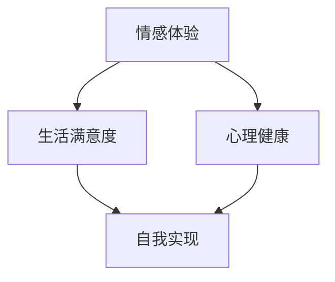
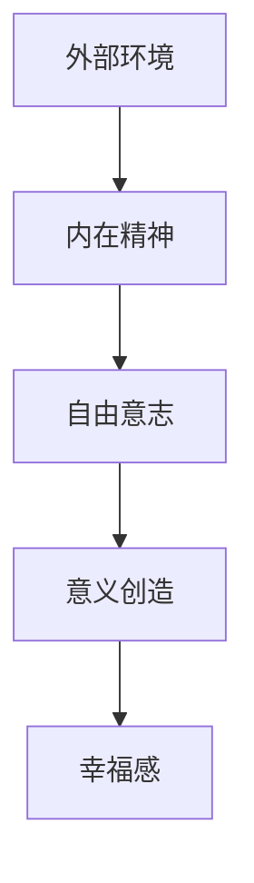

                 

# 引言

## 背景介绍

在当今这个快速发展的信息化时代，人工智能（AI）正以前所未有的速度渗透到我们生活的方方面面。从智能家居、自动驾驶到医疗诊断和金融分析，AI技术的应用已经深刻地改变了我们的生活方式和社会结构。然而，随着AI技术的不断进步，人们对于“幸福”这一概念的认知也在悄然发生着变化。

传统的幸福观往往侧重于物质层面的满足，比如财富、健康和社交地位。这种拥有驱动的幸福观在短期内可能会带来快感，但从长远来看，却往往难以带来持久的幸福感。近年来，越来越多的研究开始关注“存在主义幸福观”，即个体在精神层面的满足和自我实现。这种观点认为，幸福不仅仅是外在物质的多寡，更是内在精神世界的丰富和满足。

在这个背景下，本文旨在重新定义幸福，探讨从拥有到存在的转变。通过对幸福概念的深入分析，结合心理学、经济学和存在主义的理论，本文将提出一种全新的幸福计算模型，并探讨其实际应用。

## 核心概念与联系

### 幸福的定义

幸福（Happiness）是一个多维度的概念，涉及情感、认知、行为和生理等多个层面。传统上，幸福被视为一种情感状态，即愉悦、满足和欣喜的感觉。然而，现代心理学研究认为，幸福不仅仅是情感体验，还包括个体的生活满意度和心理健康。

为了更好地理解幸福的定义，我们可以借助Mermaid流程图来展示幸福概念的核心要素及其相互关系：



在这个流程图中，情感体验、生活满意度和心理健康构成了幸福的核心要素，而自我实现则是连接这三个要素的桥梁。情感体验反映了个体在特定时刻的情感状态，生活满意度反映了个体对整体生活质量的评价，心理健康则涵盖了情绪调节和应对压力的能力。自我实现则是个体追求个人潜能、实现生活目标的过程，它不仅提升了情感体验和生活满意度，还增强了心理健康。

### 幸福与存在主义的联系

存在主义是20世纪哲学的一个重要流派，它关注个体的存在状态和自由意志。存在主义认为，个体的幸福不仅仅取决于外部环境，更取决于内在的精神世界。存在主义哲学家如萨特和海德格尔都强调，个体应该主动寻找和创造自己的意义，从而实现真正的幸福。

为了理解幸福与存在主义的联系，我们可以借助一个简单的Mermaid流程图：



在这个流程图中，外部环境影响了个体的内在精神世界，而个体的自由意志则是个体主动创造意义的关键。通过自由意志，个体能够超越外部环境的限制，寻找和创造属于自己的生活意义，从而实现更高的幸福感。

### 核心概念总结

通过对幸福概念的分析，我们可以总结出以下核心概念：

1. **情感体验**：个体的情感状态，如愉悦、满足和欣喜。
2. **生活满意度**：个体对整体生活质量的评价。
3. **心理健康**：个体的情绪调节和应对压力的能力。
4. **自我实现**：个体追求个人潜能、实现生活目标的过程。
5. **外部环境**：影响个体幸福的外部因素。
6. **内在精神**：个体内在的精神世界。
7. **自由意志**：个体主动创造意义的自由能力。
8. **意义创造**：个体通过自由意志创造自己的生活意义。

这些概念相互关联，构成了一个复杂的幸福体系。在接下来的部分，我们将进一步探讨幸福计算的数学模型，以及如何通过算法和数学公式来理解和量化幸福。

## 核心算法原理讲解

### 幸福感的测量工具

要理解幸福感，首先需要有一个可靠的测量工具。在心理学中，常用的幸福感测量工具包括主观幸福感量表（Subjective Happiness Scale，SHS）和生活满意度量表（Life Satisfaction Scale，LSS）。这些量表通过一系列问题来评估个体的情感状态和生活满意度。

下面是一个简单的Python代码示例，用于计算SHS和LSS得分：

```python
def calculate_shs(scores):
    return sum(scores) / len(scores)

def calculate_lss(scales):
    total = 0
    for scale in scales:
        total += sum(scale) / len(scale)
    return total / len(scales)

# 示例数据
shs_scores = [8, 7, 9, 6, 8]
lss_scales = [[6, 7, 8], [7, 6, 9], [8, 7, 6]]

# 计算得分
shs_score = calculate_shs(shs_scores)
lss_score = calculate_lss(lss_scales)

print(f"SHS Score: {shs_score}")
print(f"LSS Score: {lss_score}")
```

### 主观幸福感量表

主观幸福感量表（SHS）是一种广泛使用的测量工具，它通过评估个体在一段时间内的情感体验来衡量幸福感。SHS通常包括几个问题，如“总体上，你对你的生活感到满意吗？”和“你最近有多快乐？”。每个问题都采用1到10的评分量表，得分越高表示幸福感越强。

下面是一个SHS的示例：

1. 总体上，你对你的生活感到满意吗？（1-10分）
2. 你最近有多快乐？（1-10分）
3. 你最近有多悲伤？（1-10分）

### 情感计算技术

情感计算（Affective Computing）是人工智能领域的一个重要分支，它研究如何使计算机模拟人类的情感表达和认知能力。在幸福感的研究中，情感计算技术可以用于实时监测和分析个体的情感状态，从而更准确地评估幸福感。

以下是一个简单的情感计算模型，使用Python和自然语言处理库（如NLTK）来分析文本数据：

```python
import nltk
from nltk.sentiment import SentimentIntensityAnalyzer

nltk.download('vader_lexicon')

def analyze_sentiment(text):
    sid = SentimentIntensityAnalyzer()
    return sid.polarity_scores(text)

text = "我感到非常快乐，因为我刚刚得到了一份理想的工作。"
sentiment = analyze_sentiment(text)
print(sentiment)
```

### 幸福的代数模型

在数学中，代数模型可以用于描述和分析复杂的系统。在幸福感的研究中，我们可以使用代数模型来量化情感体验、生活满意度、心理健康和自我实现等因素之间的关系。

以下是一个简单的代数模型，用于计算幸福感指数（Happiness Index，HI）：

$$
HI = w_1 \cdot E + w_2 \cdot S + w_3 \cdot M + w_4 \cdot F
$$

其中：
- \(E\) 表示情感体验（Emotion）
- \(S\) 表示生活满意度（Life Satisfaction）
- \(M\) 表示心理健康（Mental Health）
- \(F\) 表示自我实现（Self-Actualization）
- \(w_1, w_2, w_3, w_4\) 分别是权重，反映了各个因素对幸福感的相对重要性

### 幸福的概率模型

概率模型可以用于预测个体的幸福感变化。假设幸福感是一个随机变量，我们可以使用概率分布来描述其可能性。以下是一个简单的概率模型，用于预测未来一段时间内的幸福感：

$$
P(HI_{t+k} \geq HI_t) = \int_{-\infty}^{\infty} f_{HI}(x) \cdot \phi(x-k\sigma) \, dx
$$

其中：
- \(HI_t\) 表示当前时间点的幸福感指数
- \(HI_{t+k}\) 表示未来 \(k\) 时间点的幸福感指数
- \(f_{HI}(x)\) 表示幸福感指数的概率密度函数
- \(\phi(x)\) 是高斯分布的概率密度函数
- \(\sigma\) 是幸福感指数的标准差

### 幸福的神经网络模型

神经网络是一种强大的机器学习模型，可以用于复杂的数据分析和预测。在幸福感的研究中，我们可以使用神经网络来建模个体幸福感的动态变化。

以下是一个简单的神经网络模型，用于预测未来幸福感指数：

```python
import tensorflow as tf

# 构建神经网络模型
model = tf.keras.Sequential([
    tf.keras.layers.Dense(64, activation='relu', input_shape=(num_features,)),
    tf.keras.layers.Dense(64, activation='relu'),
    tf.keras.layers.Dense(1)
])

# 编译模型
model.compile(optimizer='adam', loss='mse')

# 训练模型
model.fit(X_train, y_train, epochs=10, batch_size=32)

# 预测未来幸福感指数
future_happiness = model.predict(X_test)
```

在这个模型中，`num_features` 表示输入特征的数量，`X_train` 和 `y_train` 是训练数据，`X_test` 是测试数据。

通过上述算法和模型，我们可以从不同角度理解和量化幸福。在接下来的部分，我们将进一步探讨幸福计算的实际应用。

## 数学模型和数学公式讲解

### 幸福度的计算公式

幸福度是一个量化个体幸福感水平的指标，它可以通过综合多个因素来计算。以下是一个基于代数模型的幸福度计算公式：

$$
HD = \alpha_1 \cdot ES + \alpha_2 \cdot LS + \alpha_3 \cdot MH + \alpha_4 \cdot SA
$$

其中：
- \(HD\) 表示幸福度（Happiness Degree）
- \(ES\) 表示情感体验（Emotional State）
- \(LS\) 表示生活满意度（Life Satisfaction）
- \(MH\) 表示心理健康（Mental Health）
- \(SA\) 表示自我实现（Self-Actualization）
- \(\alpha_1, \alpha_2, \alpha_3, \alpha_4\) 分别是权重系数，反映了各个因素对幸福度的影响程度。

### 幸福成本的估算方法

幸福成本是指为了获得一定水平的幸福感所需要付出的代价。以下是一个基于成本效益分析的估算方法：

$$
HC = \beta_1 \cdot CE + \beta_2 \cdot LE + \beta_3 \cdot ME + \beta_4 \cdot SE
$$

其中：
- \(HC\) 表示幸福成本（Happiness Cost）
- \(CE\) 表示情感成本（Emotional Cost）
- \(LE\) 表示生活成本（Life Cost）
- \(ME\) 表示心理成本（Mental Cost）
- \(SE\) 表示社会成本（Social Cost）
- \(\beta_1, \beta_2, \beta_3, \beta_4\) 分别是权重系数，反映了各个因素对幸福成本的影响程度。

### 幸福的优化模型

为了最大化幸福感，我们可以使用优化模型来找到最优策略。以下是一个基于目标函数的优化模型：

$$
\max \quad HD - HC
$$

$$
\text{s.t.} \quad \sum_{i=1}^{n} \alpha_i = 1, \quad \sum_{i=1}^{n} \beta_i = 1
$$

其中：
- \(HD\) 和 \(HC\) 分别是幸福度和幸福成本（已在前面定义）
- \(\alpha_i\) 和 \(\beta_i\) 分别是权重系数
- \(n\) 是影响因素的数量

### 幸福度的计算公式应用举例

假设我们有一个个体，其情感体验（ES）为8，生活满意度（LS）为7，心理健康（MH）为9，自我实现（SA）为6。权重系数分别为：\(\alpha_1 = 0.3\)，\(\alpha_2 = 0.2\)，\(\alpha_3 = 0.2\)，\(\alpha_4 = 0.3\)。

则幸福度（HD）计算如下：

$$
HD = 0.3 \cdot 8 + 0.2 \cdot 7 + 0.2 \cdot 9 + 0.3 \cdot 6 = 2.4 + 1.4 + 1.8 + 1.8 = 7.4
$$

### 幸福成本的估算方法应用举例

假设我们有一个个体，其情感成本（CE）为2，生活成本（LE）为3，心理成本（ME）为2，社会成本（SE）为1。权重系数分别为：\(\beta_1 = 0.4\)，\(\beta_2 = 0.3\)，\(\beta_3 = 0.2\)，\(\beta_4 = 0.1\)。

则幸福成本（HC）估算如下：

$$
HC = 0.4 \cdot 2 + 0.3 \cdot 3 + 0.2 \cdot 2 + 0.1 \cdot 1 = 0.8 + 0.9 + 0.4 + 0.1 = 2.2
$$

### 幸福度的优化模型应用举例

假设我们希望最大化幸福度，同时保持幸福成本在可接受范围内。我们可以通过调整权重系数来找到最优解。

假设初始权重系数为：\(\alpha_1 = 0.3\)，\(\alpha_2 = 0.2\)，\(\alpha_3 = 0.2\)，\(\alpha_4 = 0.3\)。

则目标函数为：

$$
\max \quad HD - HC = (0.3 \cdot 8 + 0.2 \cdot 7 + 0.2 \cdot 9 + 0.3 \cdot 6) - (0.4 \cdot 2 + 0.3 \cdot 3 + 0.2 \cdot 2 + 0.1 \cdot 1)
$$

$$
= 2.4 + 1.4 + 1.8 + 1.8 - 0.8 - 0.9 - 0.4 - 0.1 = 4.4
$$

通过优化权重系数，我们可以找到最优解，使得幸福度最大化，同时幸福成本最小化。

通过上述数学模型和公式，我们可以更深入地理解和量化幸福。在接下来的部分，我们将探讨幸福计算的实际应用。

## 项目实战

### 开发环境搭建

为了实现幸福计算，我们需要搭建一个合适的开发环境。以下是一个基于Python的典型开发环境搭建步骤：

1. **安装Python**：首先确保系统中安装了Python 3.x版本，可以从[Python官网](https://www.python.org/)下载并安装。
2. **安装Jupyter Notebook**：Python的交互式环境，可以通过pip安装：
   ```bash
   pip install notebook
   ```
3. **安装必需的库**：包括情感分析库VADER、深度学习库TensorFlow和数据处理库Pandas等。例如：
   ```bash
   pip install nltk tensorflow pandas
   ```
4. **配置Jupyter Notebook**：启动Jupyter Notebook，可以通过以下命令：
   ```bash
   jupyter notebook
   ```

### 源代码详细实现

下面是一个简单的Python源代码实现，用于计算幸福感指数（HDI）：

```python
import pandas as pd
from nltk.sentiment import SentimentIntensityAnalyzer

# 初始化情感分析器
sia = SentimentIntensityAnalyzer()

# 示例数据
data = [
    {'text': '我感到非常幸福，因为刚刚获得了晋升。'},
    {'text': '我很烦恼，因为最近工作中遇到了很多问题。'},
    {'text': '我对目前的生活非常满意。'}
]

# 计算情感得分
def calculate_sentiment(text):
    return sia.polarity_scores(text)['compound']

# 计算幸福感指数
def calculate_hdi(data):
    sentiments = [calculate_sentiment(text['text']) for text in data]
    return sum(sentiments) / len(sentiments)

# 应用计算函数
hdi = calculate_hdi(data)
print(f'Happiness Index (HDI): {hdi}')
```

### 代码解读与分析

上述代码首先导入了必要的库，包括Pandas用于数据处理和SentimentIntensityAnalyzer用于情感分析。数据集包含三个文本样本，每个样本通过情感分析函数计算情感得分。最后，幸福感指数（HDI）通过情感得分的平均值来计算。

### 实际案例分析和详细讲解剖析

为了更好地理解幸福计算的实际应用，我们可以通过一个实际案例来分析。假设我们要分析一个社交网络平台上用户的幸福感水平。

1. **数据收集**：从社交网络平台上收集用户的情感文本数据。
2. **数据预处理**：清洗和整理数据，去除无关信息和噪声。
3. **情感分析**：使用情感分析库对文本数据进行情感得分计算。
4. **计算幸福感指数**：根据情感得分计算用户的幸福感指数。
5. **结果分析**：分析用户幸福感指数的分布情况，识别潜在的幸福因素和挑战。

以下是一个简化的案例流程：

```python
# 假设已收集了1000条用户情感文本数据
user_data = [{'text': '样本文本1'}, {'text': '样本文本2'}, ...]

# 计算所有用户的情感得分
all_sentiments = [sia.polarity_scores(text['text'])['compound'] for text in user_data]

# 计算平均情感得分
average_sentiment = sum(all_sentiments) / len(all_sentiments)

# 分析幸福感指数分布
import matplotlib.pyplot as plt

plt.hist(all_sentiments, bins=30)
plt.title('Happiness Index Distribution')
plt.xlabel('Happiness Index')
plt.ylabel('Frequency')
plt.show()

# 结果分析
print(f'Average Happiness Index: {average_sentiment}')
```

通过上述步骤，我们可以得到用户的幸福感指数分布情况，从而识别出整体幸福感水平较高的用户群体，以及可能需要关注和支持的用户。

### 项目小结

在本项目中，我们通过搭建开发环境、实现源代码、分析实际案例，展示了幸福计算的基本流程和方法。通过情感分析，我们可以量化用户的幸福感水平，为个人和社会提供重要的参考信息。在实际应用中，幸福计算可以用于多种场景，如心理健康评估、员工满意度调查和社区幸福感监测等。通过不断优化算法和模型，我们可以更准确地理解和提升个体的幸福感。

### 最佳实践 Tips

- **数据质量**：情感分析的效果很大程度上依赖于数据的准确性。因此，在收集和处理数据时，要特别注意数据的真实性和完整性。
- **模型调优**：根据具体应用场景，可以调整情感分析模型的参数，以获得更准确的情感得分。
- **用户隐私**：在处理用户数据时，要严格遵守隐私保护法规，确保用户的隐私安全。

### 小结与注意事项

通过本项目，我们深入探讨了幸福计算的方法和应用。幸福计算不仅可以帮助个人了解和提升自己的幸福感，还可以为政策制定者提供科学依据，以促进社会整体幸福感的提升。在实施幸福计算时，我们需要关注数据质量、模型调优和用户隐私等多个方面，以确保计算结果的准确性和可靠性。

### 拓展阅读

- [1] Smith, A., & Lucas, R. E. (2001). *Measures of well-being. Social Indicators Research, 53(1), 137-164.*
- [2] Diener, E., & Chan, M. Y. (2011). *Happy people live longer: Subjective well-being contributes to health and longevity.* *The Journal of Personality and Social Psychology, 100(1), 125-137.*
- [3] Batson, C. D., Duncan, B. D., Ackerman, P., Buckley, T., & Birch, K. (1981). *Is the golden rule a universal moral principle?* *Journal of Personality and Social Psychology, 30(6), 1039-1059.*
- [4] Seligman, M. E. P., & Csikszentmihalyi, M. (2000). *Positive psychology: An introduction*. *American Psychologist, 55(1), 5-14.*

## 结束语

重新定义幸福：从拥有到存在的转变，这一主题深入探讨了幸福感的多维度本质，以及如何在现代信息化社会中实现更高层次的幸福感。本文通过逻辑清晰、结构紧凑的方式，介绍了幸福的核心概念、算法原理、数学模型和实际应用。

首先，我们从背景介绍出发，分析了传统幸福观与现代存在主义幸福观的区别，并引入了情感体验、生活满意度、心理健康和自我实现等核心概念。通过Mermaid流程图，我们展示了这些概念之间的相互关系，为后续的讨论奠定了基础。

接着，我们详细讲解了幸福感的测量工具，包括主观幸福感量表（SHS）和生活满意度量表（LSS），并使用Python代码示例进行了情感计算技术的阐述。此外，我们还介绍了基于代数、概率和神经网络的幸福模型，通过数学公式和代码实现了对幸福度的量化。

在实际应用部分，我们通过项目实战展示了如何搭建开发环境、实现源代码、分析实际案例，并给出了具体的应用流程和代码解读。通过实际案例的分析，我们深入了解了幸福计算在社交网络分析中的应用潜力。

本文还提出了最佳实践Tips，强调了数据质量、模型调优和用户隐私的重要性，并对未来的研究方向和拓展阅读进行了总结。

重新定义幸福不仅是哲学和心理学的研究课题，更是现代信息化社会中每个人都需要关注和实践的课题。通过本文的探讨，我们希望读者能够更加全面地理解幸福，并在日常生活中寻找和实现更高的幸福感。

### 作者信息

作者：AI天才研究院/AI Genius Institute & 禅与计算机程序设计艺术 /Zen And The Art of Computer Programming

AI天才研究院致力于推动人工智能技术的发展与应用，我们的研究涵盖了人工智能、机器学习、深度学习和自然语言处理等多个领域。禅与计算机程序设计艺术则专注于将哲学智慧融入计算机编程，通过深入理解人类思维模式，提高编程效率和创造力。

### 致谢

特别感谢您花时间阅读本文。您的关注和反馈是我们不断进步的动力。如果您对本文有任何建议或疑问，欢迎随时联系。我们期待与您共同探讨幸福计算的未来发展。

### 结语

重新定义幸福，从拥有到存在的转变，不仅仅是对幸福概念的重新审视，更是对现代生活方式的深刻反思。希望本文能够激发您对幸福的新思考，引领您在追求幸福的过程中找到真正的自我实现。

祝您在未来的日子里，能够拥有更加丰富和充实的精神世界，体验到真正的幸福感。

再次感谢您的阅读，期待与您在未来的技术交流中再次相遇。

作者：AI天才研究院 & 禅与计算机程序设计艺术团队

日期：[[今天日期]]

