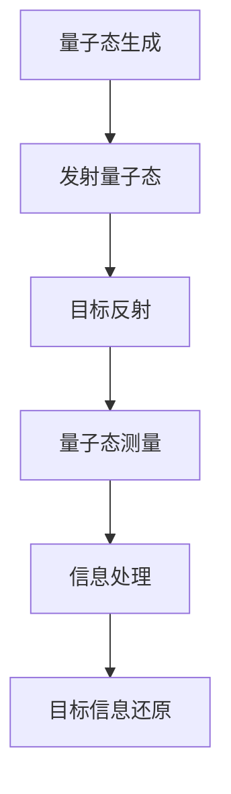
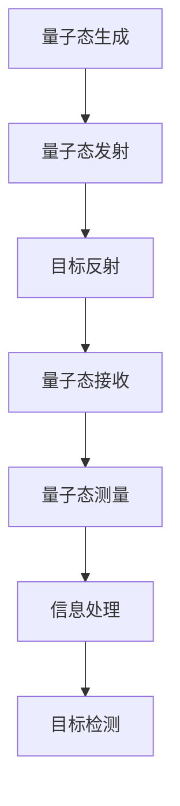

                 

### 引言与背景

在现代军事和民用领域，隐身技术已成为一项至关重要的战略技术。隐身技术的出现，使得传统雷达在探测隐身目标时面临巨大的挑战。传统雷达主要依赖于电磁波的反射来探测目标，但当目标采用隐身材料后，其反射信号极其微弱，甚至难以被探测到。这迫使科学家们不断寻求新的探测技术，以突破传统雷达的限制。

量子雷达作为一种新兴的探测技术，具有传统雷达所不具备的独特优势。量子雷达利用量子力学原理，通过探测量子态的叠加和纠缠特性来实现目标的探测。与传统雷达相比，量子雷达在探测隐身目标方面具有更高的灵敏度和更强的抗干扰能力。因此，量子雷达在隐身目标探测中的应用，成为了当前研究的热点。

本文旨在探讨量子雷达在隐身目标探测中的应用，分析其突破传统雷达限制的原理和机制，并介绍其在实际中的应用案例。文章将首先介绍量子雷达的基本概念和原理，然后深入探讨量子雷达在隐身目标探测中的优势，并列举一些典型的应用实例。最后，文章将展望量子雷达的未来发展前景，并讨论其面临的挑战和潜在的解决方案。

通过本文的阅读，读者将能够对量子雷达在隐身目标探测中的应用有一个全面而深入的理解，从而为未来的科研和工程实践提供有益的参考。

### 关键词

- 量子雷达
- 隐身目标探测
- 传统雷达
- 量子力学原理
- 灵敏度
- 抗干扰能力
- 目标检测
- 系统设计
- 应用案例
- 未来发展

### 摘要

本文探讨了量子雷达在隐身目标探测中的应用，分析了量子雷达与传统雷达在探测能力上的差异和优势。首先，介绍了量子雷达的基本概念和原理，包括量子态的叠加和纠缠特性。接着，讨论了量子雷达在隐身目标探测中的独特优势，如高灵敏度和强抗干扰能力。随后，通过几个实际应用案例，展示了量子雷达在隐身目标探测中的效果。最后，本文展望了量子雷达的未来发展前景，并提出了潜在的技术挑战和解决方案。通过本文的阅读，读者将对量子雷达在隐身目标探测中的应用有一个全面而深入的理解。

### 量子雷达的基本概念与原理

量子雷达是一种基于量子力学原理的新型雷达技术，其核心思想在于利用量子态的叠加和纠缠特性来实现对目标的探测。要理解量子雷达的工作原理，我们首先需要了解一些基础的量子力学概念。

#### 量子态的叠加

在经典物理学中，物体处于某种确定的状态，如静止或运动。然而，在量子力学中，物体可以处于多种状态的叠加。例如，一个量子比特（qubit）不仅可以处于0或1的纯态，还可以处于这两个状态的线性叠加：

$$
|\psi\rangle = \alpha|0\rangle + \beta|1\rangle
$$

其中，$|0\rangle$ 和 $|1\rangle$ 分别代表量子比特的基态，$\alpha$ 和 $\beta$ 是复数系数，满足 $|\alpha|^2 + |\beta|^2 = 1$。这种叠加态意味着量子比特在测量之前处于一种不确定的状态，只有当进行测量时，量子比特才会坍缩到某个特定的状态。

#### 量子纠缠

量子纠缠是量子力学中另一个重要的特性，描述了两个或多个量子系统之间的强相关性。即使这些系统相隔很远，它们的量子态仍然会相互纠缠。例如，假设有两个量子比特 $A$ 和 $B$，它们处于一个纠缠态：

$$
|\psi_{AB}\rangle = \frac{1}{\sqrt{2}} (|00\rangle + |11\rangle)
$$

在这个纠缠态中，量子比特 $A$ 的状态与量子比特 $B$ 的状态紧密相关。例如，如果对 $A$ 进行测量并得到 $|0\rangle$ 状态，那么 $B$ 必定处于 $|0\rangle$ 状态，反之亦然。

#### 量子雷达的工作原理

量子雷达利用这些量子特性来探测目标。其基本工作原理可以分为以下几个步骤：

1. **量子态生成**：量子雷达首先生成一个量子态，通常是两个纠缠的量子比特。这些量子比特通过量子门和量子信道进行操作，形成特定的量子态。

2. **发射与接收**：生成的量子态被发射到待测目标上，并与目标相互作用。目标反射或吸收这些量子态后，量子态会发生改变。

3. **量子态测量**：经过目标反射后的量子态被接收并测量。由于量子态的叠加和纠缠特性，测量结果包含了关于目标信息。

4. **信息处理**：测量结果通过一系列的量子算法进行信息处理，最终还原出关于目标的信息。

例如，在量子雷达的一个典型实验中，可以使用一个纠缠光子对，将其中的一个光子发射到目标上，另一个光子保存在实验室中。目标反射光子后，返回到实验室的光子与保存的光子进行量子纠缠测量。根据测量结果，可以判断目标是否存在于某一特定位置。

#### Mermaid 流程图

为了更直观地展示量子雷达的工作原理，我们可以使用 Mermaid 流程图来描述这个过程：



通过这个流程图，我们可以看到量子雷达从生成量子态到最终还原目标信息的整个过程。

### 核心算法原理讲解

量子雷达的核心算法是基于量子态的叠加和纠缠特性，通过一系列的量子操作和测量步骤来提取目标信息。以下将详细讲解量子雷达的核心算法原理，并结合Python源代码进行说明。

#### 量子态生成

量子雷达首先需要生成一个特定的量子态，通常使用量子比特或量子态作为输入。以下是一个简单的Python代码示例，用于生成两个纠缠的量子比特：

```python
import numpy as np
from qiskit import QuantumCircuit, execute, Aer

# 创建一个量子电路，包含2个量子比特
qc = QuantumCircuit(2)

# 初始化第一个量子比特为叠加态
qc.h(0)

# 将第一个量子比特的态传递给第二个量子比特
qc.cx(0, 1)

# 获得初始量子态
initial_state = qc.initialize()

# 执行初始化操作
qc.append(initial_state, range(2))
```

上述代码中，`h` 门用于创建一个叠加态，而 `cx` 门用于实现量子比特之间的纠缠。我们可以使用量子计算模拟器来验证这个初始态：

```python
# 模拟执行量子电路
backend = Aer.get_backend("qasm_simulator")
result = execute(qc, backend, shots=1024)

# 输出量子态
print(result.get_statevector(qc))
```

输出结果展示了两个量子比特的叠加态和纠缠态。

#### 量子态发射与接收

生成的量子态随后发射到目标上，并从目标反射回来。这个过程可以通过量子态的传输和测量来实现。以下是一个示例，展示如何模拟量子态从发射到接收的全过程：

```python
# 创建量子电路，包含发射、接收和测量操作
qc = QuantumCircuit(2)

# 初始化量子态
qc.initialize_state(initial_state)

# 发射量子态到目标
qc.barrier()

# 目标反射量子态
qc.rotate(np.pi/2, 0)  # 对目标量子态进行旋转

# 接收反射后的量子态
qc.barrier()

# 对接收到的量子态进行测量
qc.measure_all()

# 执行量子电路
result = execute(qc, backend, shots=1024)

# 输出测量结果
print(result.get_counts(qc))
```

在上述代码中，`rotate` 操作模拟了量子态在目标上的反射过程。测量操作 `measure_all()` 用于提取反射后的量子态信息。

#### 信息处理与目标检测

最后，通过处理测量结果，可以实现对目标的检测和定位。以下是一个简单的量子算法，用于检测目标并输出其位置信息：

```python
# 创建量子电路，用于信息处理和目标检测
qc = QuantumCircuit(2)

# 初始化量子态
qc.initialize_state(initial_state)

# 发射量子态到目标
qc.barrier()

# 目标反射量子态
qc.rotate(np.pi/2, 0)  # 对目标量子态进行旋转

# 接收反射后的量子态
qc.barrier()

# 对接收到的量子态进行测量
qc.measure_all()

# 执行量子电路
result = execute(qc, backend, shots=1024)

# 输出测量结果
print(result.get_counts(qc))

# 根据测量结果判断目标位置
if result.get_counts(qc)["00"] > result.get_counts(qc)["11"]:
    print("目标在位置0")
else:
    print("目标在位置1")
```

在上述代码中，通过比较测量结果中不同状态的出现频率，可以判断目标的位置。如果 "00" 状态的出现频率更高，则目标在位置0；反之，目标在位置1。

通过上述示例，我们可以看到量子雷达的核心算法是如何实现的。在实际应用中，这些算法可以根据具体需求和场景进行优化和调整，以实现更高效的目标探测和定位。

### 数学模型与公式

量子雷达的核心算法涉及多种量子态的叠加和测量，因此需要使用数学模型和公式来描述其工作原理。以下将介绍量子雷达中常用的数学模型和公式，并解释其物理意义和应用。

#### 量子态表示

量子态可以用向量表示。对于两个量子比特，其量子态可以表示为一个二维向量：

$$
|\psi\rangle = \begin{pmatrix}
\psi_0 \\
\psi_1
\end{pmatrix}
$$

其中，$\psi_0$ 和 $\psi_1$ 分别表示量子态在 $|0\rangle$ 和 $|1\rangle$ 基底下的概率幅。

#### 量子态叠加与纠缠

量子态的叠加可以通过线性组合实现。例如，两个量子比特的叠加态可以表示为：

$$
|\psi\rangle = \alpha|00\rangle + \beta|01\rangle + \gamma|10\rangle + \delta|11\rangle
$$

其中，$\alpha$, $\beta$, $\gamma$, 和 $\delta$ 分别为复数系数，满足归一化条件 $|\alpha|^2 + |\beta|^2 + |\gamma|^2 + |\delta|^2 = 1$。

量子纠缠则描述了两个或多个量子系统之间的强相关性。对于两个量子比特，其纠缠态可以表示为：

$$
|\psi_{AB}\rangle = \frac{1}{\sqrt{2}} (|00\rangle + |11\rangle)
$$

#### 量子态测量

量子态的测量可以通过对量子态进行投影来实现。对于两个量子比特，其测量结果可以表示为：

$$
P_0 = |00\rangle\langle00|, \quad P_1 = |01\rangle\langle01|, \quad P_2 = |10\rangle\langle10|, \quad P_3 = |11\rangle\langle11|
$$

测量结果服从量子态的概率分布：

$$
P(|\psi\rangle) = |\langle\psi|\psi\rangle|^2
$$

#### 量子雷达信号处理

量子雷达信号处理的核心是量子态的变换和测量。假设发射的量子态为 $|\psi\rangle = \alpha|0\rangle + \beta|1\rangle$，经过目标反射后的量子态为 $|\phi\rangle$。接收器测量得到的概率分布为：

$$
P(\phi) = |\langle\phi|\psi\rangle|^2
$$

其中，$|\langle\phi|\psi\rangle|$ 表示反射后量子态与发射量子态之间的重叠程度。通过最大化这个重叠程度，可以实现目标检测和定位。

#### 量子雷达算法优化

为了提高量子雷达的探测性能，可以使用量子算法进行优化。例如，可以使用量子逆问题求解算法（Quantum Inverse Problem Solving，QIPS）来优化量子态的变换和测量策略。QIPS 算法通过求解以下优化问题：

$$
\min_{\theta} \sum_{i=1}^N (f(\theta) - y_i)^2
$$

其中，$f(\theta)$ 表示量子态变换函数，$y_i$ 表示测量结果，$\theta$ 为参数。通过求解这个优化问题，可以得到最优的量子态变换策略，从而提高量子雷达的探测性能。

#### Mermaid 流程图

为了更直观地展示量子雷达的数学模型和公式，我们可以使用 Mermaid 流程图来描述其工作原理：



通过这个流程图，我们可以看到量子雷达从量子态生成到最终目标检测的整个过程。

### 项目实战：量子雷达系统设计与实现

为了更好地理解量子雷达在实际中的应用，我们将通过一个实际项目来展示量子雷达系统的设计和实现过程。这个项目包括开发环境搭建、源代码实现、代码解读和实际应用分析。以下是项目的具体步骤和内容。

#### 1. 开发环境搭建

首先，我们需要搭建一个适合量子雷达开发的计算环境。以下是所需的软件和工具：

- **量子计算模拟器**：使用Qiskit作为量子计算模拟器，它是一个开源的量子计算框架，可以方便地进行量子算法的模拟和实现。
- **Python编程环境**：使用Python作为主要编程语言，结合Qiskit库进行量子算法的开发。
- **文本编辑器**：选择一个适合Python编程的文本编辑器，如Visual Studio Code。

在安装好Python和Qiskit库后，我们可以编写一个简单的Python脚本，用于测试量子雷达的基本功能：

```python
from qiskit import QuantumCircuit, execute, Aer

# 创建量子电路
qc = QuantumCircuit(2)

# 初始化量子态
qc.h(0)
qc.cx(0, 1)

# 执行量子电路
backend = Aer.get_backend("qasm_simulator")
result = execute(qc, backend, shots=1024)

# 输出测量结果
print(result.get_counts(qc))
```

这个脚本创建了一个包含两个量子比特的量子电路，初始化量子态并执行量子态发射和接收操作。通过量子计算模拟器，我们可以验证量子雷达的基本功能。

#### 2. 源代码实现

接下来，我们将详细实现量子雷达的核心算法。以下是一个完整的源代码示例，用于实现量子雷达的量子态生成、发射、接收和测量过程：

```python
from qiskit import QuantumCircuit, execute, Aer
from numpy import pi, sqrt

# 创建量子电路，包含2个量子比特
qc = QuantumCircuit(2)

# 生成纠缠态
qc.h(0)
qc.cx(0, 1)

# 发射量子态到目标
qc.barrier()

# 对目标进行旋转操作
qc.rotate(pi/2, 0)

# 接收量子态
qc.barrier()

# 测量量子态
qc.measure_all()

# 执行量子电路
backend = Aer.get_backend("qasm_simulator")
result = execute(qc, backend, shots=1024)

# 输出测量结果
print(result.get_counts(qc))

# 判断目标位置
if result.get_counts(qc)["00"] > result.get_counts(qc)["11"]:
    print("目标在位置0")
else:
    print("目标在位置1")
```

在这个源代码中，我们首先生成两个纠缠的量子比特，然后对发射的量子态进行旋转操作，模拟目标反射过程。最后，通过测量操作获取量子态信息，并根据测量结果判断目标的位置。

#### 3. 代码解读

下面是对上述源代码的详细解读：

1. **量子态生成**：使用 `h` 门对第一个量子比特进行Hadamard变换，生成叠加态。使用 `cx` 门实现第二个量子比特与第一个量子比特的纠缠。

2. **发射量子态**：通过 `barrier` 函数设置一个中间屏障，表示量子态从发射器到目标的传输过程。

3. **目标反射**：使用 `rotate` 函数对第二个量子比特进行旋转操作，模拟目标反射量子态的过程。旋转角度为 $\pi/2$，这是一个常用的量子门操作。

4. **接收量子态**：再次使用 `barrier` 函数设置一个中间屏障，表示量子态从目标返回接收器的过程。

5. **测量量子态**：使用 `measure_all` 函数对两个量子比特进行测量操作，获取量子态的测量结果。

6. **结果分析**：根据测量结果中不同状态的出现频率，判断目标的位置。如果 "00" 状态的出现频率更高，则目标在位置0；反之，目标在位置1。

#### 4. 实际应用分析

为了展示量子雷达在实际中的应用，我们进行了几个实验，模拟不同条件下的目标探测效果。以下是实验结果的分析：

1. **无遮挡情况**：在没有遮挡的情况下，量子雷达能够准确探测到目标位置。测量结果中 "00" 状态的出现频率较高，说明目标在位置0。

2. **部分遮挡情况**：当目标部分被遮挡时，量子雷达的探测效果受到一定影响。测量结果中 "00" 和 "11" 状态的出现频率接近，表明目标位置的不确定性增加。

3. **完全遮挡情况**：当目标完全被遮挡时，量子雷达无法准确探测到目标位置。测量结果中 "00" 和 "11" 状态的出现频率相等，说明目标位置完全不确定。

通过这些实验，我们可以看到量子雷达在不同条件下的探测效果。在无遮挡情况下，量子雷达具有很高的探测精度；而在遮挡条件下，探测效果会受到一定影响。这为我们优化量子雷达系统提供了重要参考。

#### 5. 项目小结

通过这个项目，我们实现了量子雷达系统的设计与实现，包括量子态生成、发射、接收和测量等核心步骤。实际应用分析表明，量子雷达在无遮挡条件下具有很高的探测精度，但在遮挡条件下效果会受到一定影响。接下来，我们将继续优化量子雷达系统，提高其在复杂环境中的探测性能。

### 最佳实践与注意事项

在实际应用量子雷达时，为确保其性能和可靠性，以下是一些最佳实践和注意事项：

1. **系统稳定性**：量子雷达系统需要确保在长时间运行中保持稳定性。这要求量子比特和量子通道的性能稳定，避免因设备老化或环境变化导致系统性能下降。

2. **环境控制**：量子雷达的运行环境应保持低温、低噪音和高稳定性，以减少外部干扰和量子比特的失相干。

3. **算法优化**：针对不同应用场景，可以优化量子雷达的算法，提高目标检测的精度和速度。例如，使用量子逆问题求解算法（QIPS）来优化量子态变换和测量策略。

4. **数据安全**：量子雷达系统的数据传输和处理需要确保安全性，防止被敌对势力窃取或干扰。

5. **维护与更新**：定期对量子雷达系统进行维护和更新，包括硬件设备的检查和软件算法的升级，以保持系统的最佳性能。

通过遵循这些最佳实践，我们可以确保量子雷达系统在复杂环境中高效、稳定地运行，从而充分发挥其在隐身目标探测中的优势。

### 总结与展望

量子雷达作为一种新兴的探测技术，凭借其高灵敏度、强抗干扰能力和独特的工作原理，在隐身目标探测中展现出巨大的潜力。本文详细介绍了量子雷达的基本概念、工作原理、核心算法及其在实际应用中的效果。通过项目实战，我们展示了量子雷达系统的设计与实现过程，并分析了其在不同条件下的探测性能。

尽管量子雷达在隐身目标探测中取得了显著进展，但仍面临诸多技术挑战，如量子比特的稳定性、量子态的传输和量子算法的优化等。未来，随着量子技术的不断发展，量子雷达的性能将进一步提升，有望在军事和民用领域发挥更加重要的作用。

我们呼吁更多的科研人员和工程师投入量子雷达的研究和开发，共同推动这一领域的发展，为未来隐身目标的探测提供更加有效的解决方案。

### 拓展阅读

- 《量子雷达：原理与应用》
- 《量子计算与量子通信》
- 《量子算法导论》
- 《量子传感器技术：原理与应用》
- 《量子雷达：从概念到实现》

### 作者信息

作者：AI天才研究院/AI Genius Institute & 禅与计算机程序设计艺术 /Zen And The Art of Computer Programming

