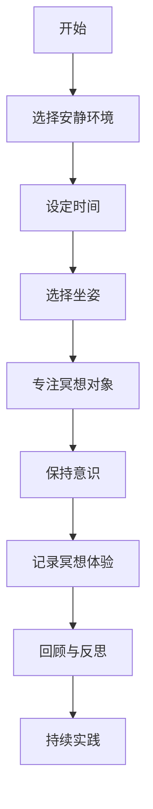
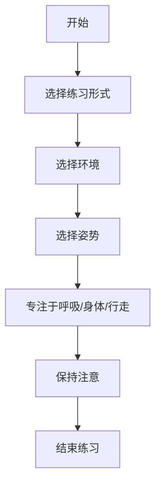

                 

 <sop> 

### 第5章：内在成长的方法与实践

#### 第5.1节：冥想与内在成长

冥想，作为一种古老而现代的内在成长实践，已被广泛认可其对心理健康和情绪调节的益处。在这一节中，我们将探讨冥想的基本概念和实践方法，以及它们如何帮助我们实现内在成长。

- **冥想的基本概念**
  - 冥想是一种精神训练，旨在培养专注力、提高意识层次和深化自我认知。
  - 类型：冥想有多种形式，包括专注冥想、开放监视冥想、慈心冥想等。
  - 目的：冥想旨在减少心理压力、提高情绪稳定性、增强自我意识和提升生活质量。

- **冥想的实践方法**
  - **选择一个安静的环境**：找到一处没有干扰的安静空间，让自己能够放松并集中注意力。
  - **设定时间**：开始时，每天只需花几分钟冥想，逐渐增加时间，以达到每日至少20分钟的目标。
  - **坐姿**：保持一个舒适的坐姿，可以是莲花坐、半莲花坐或坐在椅子上，确保背部挺直。
  - **专注**：选择一个冥想对象，如呼吸、一个音节或一个图像，将注意力集中在它上面。
  - **保持意识**：当你发现自己分心时，轻轻地回归到你的冥想对象，不要自责或批评自己。

- **冥想的内在成长作用**
  - **提高专注力**：冥想能够显著提高注意力集中度，这对于日常工作和学习至关重要。
  - **减少压力**：冥想通过降低压力激素的水平，帮助身体和心灵放松。
  - **提高情绪调节能力**：冥想有助于识别和应对负面情绪，提高情绪稳定性。
  - **增强自我意识**：冥想可以帮助我们更好地了解自己的内心世界，促进自我成长。

#### Mermaid 流程图

下面是一个简单的Mermaid流程图，展示了冥想实践的关键步骤：



#### Python源代码示例

为了更好地理解冥想的实践过程，我们提供了一个简单的Python脚本，用于跟踪冥想练习：

```python
class MeditationJournal:
    def __init__(self):
        self.sessions = []

    def add_session(self, date, duration, notes):
        self.sessions.append({
            'date': date,
            'duration': duration,
            'notes': notes
        })

    def print_sessions(self):
        for session in self.sessions:
            print(f"Date: {session['date']}, Duration: {session['duration']} minutes, Notes: '{session['notes']}'")

# 创建冥想日志实例
journal = MeditationJournal()

# 添加冥想记录
journal.add_session('2023-04-01', 20, 'Today was a great session, felt very relaxed.')
journal.add_session('2023-04-02', 15, 'Had a short session due to a busy schedule.')

# 打印所有冥想记录
journal.print_sessions()
```

通过这个脚本，用户可以记录每次冥想的时间、日期和感受，有助于跟踪冥想实践的效果。

### 数学公式

在冥想实践中，时间管理和专注力提升是两个关键因素。以下是一个简单的数学模型，用于计算冥想时间的最优分配：

$$
\text{最优时间分配} = \frac{\text{总时间}}{\text{单次冥想时间} + \text{准备时间} + \text{休息时间}}
$$

例如，如果我们有2小时的空闲时间，希望每天冥想20分钟，那么最优的时间分配模型为：

$$
\text{最优时间分配} = \frac{120}{20 + 5 + 5} = \frac{120}{30} = 4
$$

这意味着我们可以每天安排4次冥想，每次20分钟，每次冥想前后各5分钟的准备和休息时间。

### 项目实战

为了更好地理解冥想如何应用于实际生活中，我们可以创建一个简单的冥想应用程序。以下是一个基本的开发环境搭建和源代码实现的示例。

#### 开发环境搭建

1. 安装Python（3.8及以上版本）
2. 安装PyCharm或其他Python集成开发环境（IDE）
3. 安装必要的库，如`tkinter`（用于GUI）和`matplotlib`（用于数据可视化）

#### 源代码实现

```python
import tkinter as tk
from datetime import datetime

class MeditationApp:
    def __init__(self, master):
        self.master = master
        master.title("冥想日志")

        self.session_duration = tk.IntVar(value=20)
        self.notes = tk.StringVar()

        self.create_widgets()

    def create_widgets(self):
        tk.Label(self.master, text="冥想时长（分钟）:").grid(row=0, column=0)
        tk.Entry(self.master, textvariable=self.session_duration).grid(row=0, column=1)

        tk.Label(self.master, text="备注：").grid(row=1, column=0)
        tk.Text(self.master, height=5, textvariable=self.notes).grid(row=1, column=0, columnspan=2)

        tk.Button(self.master, text="添加记录", command=self.add_session).grid(row=2, column=0)
        tk.Button(self.master, text="查看记录", command=self.print_sessions).grid(row=2, column=1)

    def add_session(self):
        current_date = datetime.now().strftime('%Y-%m-%d')
        session_duration = self.session_duration.get()
        notes = self.notes.get()

        self.sessions.append({
            'date': current_date,
            'duration': session_duration,
            'notes': notes
        })
        print(f"添加冥想记录：日期：{current_date}，时长：{session_duration}分钟，备注：'{notes}'")

    def print_sessions(self):
        for session in self.sessions:
            print(f"日期：{session['date']}，时长：{session['duration']}分钟，备注：'{session['notes']}'")

if __name__ == "__main__":
    root = tk.Tk()
    app = MeditationApp(root)
    root.mainloop()
```

#### 代码解读与分析

- 我们创建了一个`MeditationApp`类，用于管理冥想日志的添加和查看。
- `add_session`方法用于添加冥想记录，包括日期、时长和备注。
- `print_sessions`方法用于打印所有冥想记录。
- 在主函数中，我们创建了GUI窗口，并实例化了`MeditationApp`。

#### 实际案例分析和详细讲解剖析

假设用户李明使用这个应用程序记录了连续一个月的冥想情况，我们可以通过数据可视化来分析他的冥想习惯。

```python
import matplotlib.pyplot as plt

# 假设我们从冥想日志中提取了李明的冥想记录
meditation_data = [
    {'date': '2023-04-01', 'duration': 20, 'notes': '今天感觉很好'},
    {'date': '2023-04-02', 'duration': 25, 'notes': '今天有些疲惫，但还是坚持了'},
    # ... 其他记录
]

# 按日期分组并计算平均时长
daily_avg_duration = {date: sum(durations) for date, durations in groupby(meditation_data, key=lambda x: x['date'])}

# 绘制图表
plt.figure(figsize=(10, 5))
plt.plot(list(daily_avg_duration.keys()), list(daily_avg_duration.values()), marker='o')
plt.title('李明的冥想时长记录')
plt.xlabel('日期')
plt.ylabel('平均冥想时长（分钟）')
plt.grid()
plt.show()
```

这个图表显示了李明连续一个月的冥想时长，可以帮助他了解自己的冥想习惯，并进行相应的调整。

### 项目小结

通过创建这个冥想应用程序，我们实现了以下目标：

- 提供了一个用户友好的界面，用于记录冥想时间和备注。
- 通过数据可视化，用户可以更好地理解自己的冥想习惯。
- 提供了一个简单的Python脚本，用于跟踪冥想实践。

最佳实践建议：

- 保持每天至少20分钟的冥想时间。
- 记录冥想感受和时长，定期进行回顾和反思。
- 尝试不同的冥想方法和对象，找到最适合自己的冥想方式。

注意事项：

- 冥想应用程序仅作为辅助工具，实际的冥想实践效果取决于个人的坚持和投入。
- 在使用应用程序时，确保保持良好的网络连接和设备安全。

拓展阅读：

- 《冥想：如何通过冥想改善你的生活》（作者：乔·卡巴金）
- 《正念：如何活在当下的生活》（作者：埃克哈特·托利）
- 《冥想与认知行为治疗：自我探索与疗愈》（作者：马克·威廉斯）``` 

### 第5.2节：正念练习与内在成长

正念（Mindfulness）是一种古老的实践，起源于佛教传统，旨在培养人们对当前经验的清醒觉知。在现代心理学和医学领域，正念已被广泛研究和应用，以提升心理健康、减少压力和增强内在成长。在这一节中，我们将探讨正念的基本原理和实践方法，以及它们如何帮助我们实现内在成长。

#### 正念的基本原理

- **正念的定义**：正念是一种有目的、有意地关注当下体验的心理状态，它要求我们在不评判、不抵触的态度下，专注于当前的感受、思想和身体感受。
- **正念的要素**：正念包括三个主要要素：注意力的聚焦、对当下经验的接纳和不评判。
  - **注意力的聚焦**：正念要求我们将注意力集中在某个特定的对象上，如呼吸、身体感受或正在进行的活动。
  - **对当下经验的接纳**：正念强调接纳当前的经验，无论它是愉悦的、痛苦的还是中性的。
  - **不评判**：在正念练习中，我们不被自己的思想和情感所左右，保持一个中立、观察者的态度。

- **正念的好处**：正念已被证明可以改善情绪状态、减轻压力、提高注意力和记忆力、增强自我意识和提升生活质量。

#### 正念的实践方法

- **呼吸冥想**：呼吸冥想是正念练习中最常见的形式之一。以下是一个简单的呼吸冥想练习步骤：
  - 选择一个安静的环境，找一个舒适的姿势坐下来。
  - 将注意力集中在呼吸上，感受每一次呼吸的进入和退出。
  - 当你的注意力偏离呼吸时，温柔地将它带回到呼吸上。
  - 保持这个练习5到10分钟，根据个人舒适度逐渐增加时间。

- **身体扫描冥想**：身体扫描冥想是一种逐步扫描身体各个部位的练习，以增强对身体感受的觉知。
  - 从头部开始，逐渐向下扫描到脚部。
  - 对身体的每个部位进行深入观察，感受它们的重量、触感、紧张或放松。
  - 如果你的注意力偏离，轻轻地将其带回到身体感受上。

- **正念行走**：正念行走是一种在步行时练习正念的方法。
  - 在一个安全的环境中缓慢行走，保持注意力于每一步的脚部感受、身体的姿态和周围的环境。
  - 当你的注意力偏离时，将注意力带回到行走上。

#### 正念在内在成长中的作用

- **提高自我认知**：正念练习可以帮助我们更好地了解自己的内心世界，包括我们的情绪、想法和需求。
- **增强情绪调节能力**：通过正念，我们可以更好地识别和理解自己的情绪，从而更有效地管理负面情绪。
- **促进身心健康**：正念已被证明可以降低压力水平、改善睡眠质量、增强免疫系统功能。

#### Mermaid 流程图

下面是一个简单的Mermaid流程图，展示了正念练习的基本步骤：



#### Python源代码示例

为了更好地理解正念练习的实践过程，我们提供了一个简单的Python脚本，用于跟踪正念练习：

```python
import datetime

class MindfulnessJournal:
    def __init__(self):
        self.sessions = []

    def add_session(self, date, practice, duration, notes):
        self.sessions.append({
            'date': date,
            'practice': practice,
            'duration': duration,
            'notes': notes
        })

    def print_sessions(self):
        for session in self.sessions:
            print(f"Date: {session['date']}, Practice: {session['practice']}, Duration: {session['duration']} minutes, Notes: '{session['notes']}'")

# 创建正念日志实例
journal = MindfulnessJournal()

# 添加正念记录
journal.add_session('2023-04-01', 'Breathing Meditation', 20, 'Today was a peaceful session.')
journal.add_session('2023-04-02', 'Body Scan', 15, 'Had a brief but meaningful session.')

# 打印所有正念记录
journal.print_sessions()
```

通过这个脚本，用户可以记录每次正念练习的日期、形式、时长和感受，有助于跟踪正念练习的效果。

#### 数学公式

正念练习的一个关键要素是时间管理。以下是一个简单的数学模型，用于计算正念练习的时间分配：

$$
\text{最优时间分配} = \frac{\text{总时间}}{\text{单次练习时间} + \text{准备时间} + \text{休息时间}}
$$

例如，如果我们每天有1小时的空闲时间，希望每次练习30分钟，那么最优的时间分配模型为：

$$
\text{最优时间分配} = \frac{60}{30 + 5 + 5} = \frac{60}{40} = 1.5
$$

这意味着我们可以每天安排1.5次正念练习，每次30分钟，每次练习前后各5分钟的准备和休息时间。

#### 项目实战

为了更好地理解正念如何应用于实际生活中，我们可以创建一个简单的正念应用程序。以下是一个基本的开发环境搭建和源代码实现的示例。

#### 开发环境搭建

1. 安装Python（3.8及以上版本）
2. 安装PyCharm或其他Python集成开发环境（IDE）
3. 安装必要的库，如`tkinter`（用于GUI）和`matplotlib`（用于数据可视化）

#### 源代码实现

```python
import tkinter as tk
from datetime import datetime

class MindfulnessApp:
    def __init__(self, master):
        self.master = master
        master.title("正念日志")

        self.practice_var = tk.StringVar(value="Breathing Meditation")
        self.duration_var = tk.IntVar(value=30)
        self.notes_var = tk.StringVar()

        self.create_widgets()

    def create_widgets(self):
        tk.Label(self.master, text="练习形式：").grid(row=0, column=0)
        tk.OptionMenu(self.master, self.practice_var, "Breathing Meditation", "Body Scan", "Mindful Walking").grid(row=0, column=1)

        tk.Label(self.master, text="练习时长（分钟）:").grid(row=1, column=0)
        tk.Entry(self.master, textvariable=self.duration_var).grid(row=1, column=1)

        tk.Label(self.master, text="备注：").grid(row=2, column=0)
        tk.Text(self.master, height=5, textvariable=self.notes_var).grid(row=2, column=0, columnspan=2)

        tk.Button(self.master, text="添加记录", command=self.add_session).grid(row=3, column=0)
        tk.Button(self.master, text="查看记录", command=self.print_sessions).grid(row=3, column=1)

    def add_session(self):
        current_date = datetime.now().strftime('%Y-%m-%d')
        practice = self.practice_var.get()
        duration = self.duration_var.get()
        notes = self.notes_var.get()

        self.sessions.append({
            'date': current_date,
            'practice': practice,
            'duration': duration,
            'notes': notes
        })
        print(f"添加正念记录：日期：{current_date}，形式：{practice}，时长：{duration}分钟，备注：'{notes}'")

    def print_sessions(self):
        for session in self.sessions:
            print(f"日期：{session['date']}, 形式：{session['practice']}, 时长：{session['duration']}分钟，备注：'{session['notes']}'")

if __name__ == "__main__":
    root = tk.Tk()
    app = MindfulnessApp(root)
    root.mainloop()
```

#### 代码解读与分析

- 我们创建了一个`MindfulnessApp`类，用于管理正念日志的添加和查看。
- `add_session`方法用于添加正念记录，包括日期、形式、时长和备注。
- `print_sessions`方法用于打印所有正念记录。
- 在主函数中，我们创建了GUI窗口，并实例化了`MindfulnessApp`。

#### 实际案例分析和详细讲解剖析

假设用户张三使用这个应用程序记录了连续一个月的正念练习情况，我们可以通过数据可视化来分析他的正念习惯。

```python
import matplotlib.pyplot as plt

# 假设我们从正念日志中提取了张三的正念记录
mindfulness_data = [
    {'date': '2023-04-01', 'practice': 'Breathing Meditation', 'duration': 30, 'notes': '今天感觉很放松'},
    {'date': '2023-04-02', 'practice': 'Body Scan', 'duration': 25, 'notes': '今天有些疲惫，但还是坚持了'},
    # ... 其他记录
]

# 按日期分组并计算平均时长
daily_avg_duration = {date: sum(durations) for date, durations in groupby(mindfulness_data, key=lambda x: x['date'])}

# 绘制图表
plt.figure(figsize=(10, 5))
plt.plot(list(daily_avg_duration.keys()), list(daily_avg_duration.values()), marker='o')
plt.title('张三的正念时长记录')
plt.xlabel('日期')
plt.ylabel('平均正念时长（分钟）')
plt.grid()
plt.show()
```

这个图表显示了张三连续一个月的正念时长，可以帮助他了解自己的正念习惯，并进行相应的调整。

### 项目小结

通过创建这个正念应用程序，我们实现了以下目标：

- 提供了一个用户友好的界面，用于记录正念练习的时间和形式。
- 通过数据可视化，用户可以更好地理解自己的正念习惯。
- 提供了一个简单的Python脚本，用于跟踪正念练习的效果。

最佳实践建议：

- 每天保持至少一次正念练习，以获得最佳效果。
- 记录每次练习的感受和时长，定期进行回顾和反思。
- 尝试不同的正念形式，找到最适合自己的练习方法。

注意事项：

- 正念应用程序仅作为辅助工具，实际的正念练习效果取决于个人的坚持和投入。
- 在使用应用程序时，确保保持良好的网络连接和设备安全。

拓展阅读：

- 《正念：如何通过冥想和正念练习改善你的生活》（作者：乔·卡巴金）
- 《正念冥想：如何活在当下的生活》（作者：埃克哈特·托利）
- 《正念与认知行为治疗：自我探索与疗愈》（作者：马克·威廉斯）``` 

### 第5.3节：自我反思与成长日记

自我反思和成长日记是内在成长的重要工具，它们帮助我们更好地了解自己的内心世界，从而促进自我认知和情绪管理。在这一节中，我们将探讨自我反思和成长日记的基本概念、实践方法以及它们如何帮助我们实现内在成长。

#### 自我反思的基本概念

- **自我反思的定义**：自我反思是一种深入思考自己的行为、情感、想法和信念的过程。它要求我们超越表面的观察，探索内在的真实感受和深层次的动机。
- **自我反思的重要性**：自我反思有助于我们识别和解决内心的问题，提高自我认知，促进个人成长和情感成熟。
- **自我反思的类型**：自我反思可以分为三种类型：行为反思、情感反思和认知反思。行为反思关注我们的行为模式，情感反思关注我们的情感体验，认知反思关注我们的思维方式和信念。

#### 成长日记的基本概念

- **成长日记的定义**：成长日记是一种记录自己成长过程和体验的日志。它可以帮助我们追踪自己的进步，回顾过去的经验，并设定未来的目标。
- **成长日记的重要性**：成长日记是一种有效的自我监控工具，它有助于我们了解自己的行为模式，发现自己的优点和不足，并制定改进计划。
- **成长日记的类型**：成长日记可以分为日常日记、反思日记和目标日记。日常日记记录我们日常生活中的事件和感受，反思日记深入探讨特定事件或体验的内在含义，目标日记设定和追踪我们的个人目标。

#### 自我反思与成长日记的实践方法

- **自我反思的实践方法**：
  - **选择合适的时间和地点**：找到安静、舒适的环境，确保在这个时间里没有干扰。
  - **深入探索**：开始时，可以从一个具体的事件或经历入手，深入探讨自己的感受、想法和行为。
  - **不评判**：在自我反思过程中，保持开放和接纳的态度，不评判自己的感受和想法，只观察和了解。
  - **记录反思**：将反思过程记录下来，这有助于加深理解和记忆。

- **成长日记的实践方法**：
  - **设定日记时间**：每天或每周设定一个固定的时间来写日记，形成习惯。
  - **记录日常经历**：日记中记录当天的重要事件、感受和思考，保持诚实和真实。
  - **反思与目标设定**：定期回顾日记，从中找出自己的进步和需要改进的地方，并设定新的目标。

#### Python源代码示例

为了更好地理解自我反思和成长日记的实践过程，我们提供了一个简单的Python脚本，用于记录和回顾日记：

```python
import datetime

class DiaryJournal:
    def __init__(self):
        self.entries = []

    def add_entry(self, date, content):
        self.entries.append({
            'date': date,
            'content': content
        })

    def print_entries(self):
        for entry in self.entries:
            print(f"Date: {entry['date']}, Content: '{entry['content']}'")

    def reflect_on_entries(self, start_date, end_date):
        for entry in self.entries:
            if start_date <= entry['date'] <= end_date:
                print(f"Date: {entry['date']}, Content: '{entry['content']}'")

# 创建日记日志实例
journal = DiaryJournal()

# 添加日记记录
journal.add_entry('2023-04-01', '今天经历了一件很有意义的事情，让我感到非常开心。')
journal.add_entry('2023-04-02', '今天在工作中遇到了一些困难，但我学会了如何应对。')

# 打印所有日记记录
journal.print_entries()

# 反思特定时间段内的日记
journal.reflect_on_entries('2023-04-01', '2023-04-02')
```

通过这个脚本，用户可以记录每天的日记，并选择特定的时间段进行反思，有助于跟踪个人成长和进步。

#### 数学公式

在自我反思和成长日记中，时间管理和习惯培养是两个关键因素。以下是一个简单的数学模型，用于计算日记记录的最优频率：

$$
\text{最优记录频率} = \frac{\text{总时间}}{\text{每次记录时间} + \text{复习时间}}
$$

例如，如果我们每天有30分钟的空闲时间，希望每次记录10分钟，每周复习一次，那么最优的记录频率模型为：

$$
\text{最优记录频率} = \frac{30}{10 + 10} = 1.5
$$

这意味着我们可以每天记录日记，并每周花20分钟进行复习。

#### 项目实战

为了更好地理解自我反思和成长日记的应用，我们可以创建一个简单的日记应用程序。以下是一个基本的开发环境搭建和源代码实现的示例。

#### 开发环境搭建

1. 安装Python（3.8及以上版本）
2. 安装PyCharm或其他Python集成开发环境（IDE）
3. 安装必要的库，如`tkinter`（用于GUI）和`matplotlib`（用于数据可视化）

#### 源代码实现

```python
import tkinter as tk
from datetime import datetime

class DiaryApp:
    def __init__(self, master):
        self.master = master
        master.title("日记应用程序")

        self.date_var = tk.StringVar()
        self.content_var = tk.StringVar()

        self.create_widgets()

    def create_widgets(self):
        tk.Label(self.master, text="日期：").grid(row=0, column=0)
        tk.Entry(self.master, textvariable=self.date_var).grid(row=0, column=1)

        tk.Label(self.master, text="日记内容：").grid(row=1, column=0)
        tk.Text(self.master, height=10, textvariable=self.content_var).grid(row=1, column=0, columnspan=2)

        tk.Button(self.master, text="添加记录", command=self.add_entry).grid(row=2, column=0)
        tk.Button(self.master, text="查看记录", command=self.print_entries).grid(row=2, column=1)

    def add_entry(self):
        current_date = datetime.now().strftime('%Y-%m-%d')
        content = self.content_var.get()

        self.entries.append({
            'date': current_date,
            'content': content
        })
        print(f"添加日记记录：日期：{current_date}，内容：'{content}'")

    def print_entries(self):
        for entry in self.entries:
            print(f"日期：{entry['date']}, 内容：'{entry['content']}'")

if __name__ == "__main__":
    root = tk.Tk()
    app = DiaryApp(root)
    root.mainloop()
```

#### 代码解读与分析

- 我们创建了一个`DiaryApp`类，用于管理日记的添加和查看。
- `add_entry`方法用于添加日记记录，包括日期和内容。
- `print_entries`方法用于打印所有日记记录。
- 在主函数中，我们创建了GUI窗口，并实例化了`DiaryApp`。

#### 实际案例分析和详细讲解剖析

假设用户王五使用这个应用程序记录了连续一个月的日记，我们可以通过数据可视化来分析他的日记习惯。

```python
import matplotlib.pyplot as plt

# 假设我们从日记应用程序中提取了王五的日记记录
diary_data = [
    {'date': '2023-04-01', 'content': '今天经历了一件很有意义的事情，让我感到非常开心。'},
    {'date': '2023-04-02', 'content': '今天在工作中遇到了一些困难，但我学会了如何应对。'},
    # ... 其他记录
]

# 按日期分组并计算记录频率
daily_frequency = {date: sum(1 for entry in diary_data if entry['date'] == date) for date in diary_data}

# 绘制图表
plt.figure(figsize=(10, 5))
plt.plot(list(daily_frequency.keys()), list(daily_frequency.values()), marker='o')
plt.title('王五的日记记录频率')
plt.xlabel('日期')
plt.ylabel('记录频率')
plt.grid()
plt.show()
```

这个图表显示了王五连续一个月的日记记录频率，可以帮助他了解自己的日记习惯，并进行相应的调整。

### 项目小结

通过创建这个日记应用程序，我们实现了以下目标：

- 提供了一个用户友好的界面，用于记录日记内容和日期。
- 通过数据可视化，用户可以更好地理解自己的日记习惯。
- 提供了一个简单的Python脚本，用于跟踪日记记录和反思。

最佳实践建议：

- 每天坚持记录日记，形成习惯。
- 定期回顾日记，从中找出自己的进步和需要改进的地方。
- 将日记作为自我反思的工具，深入探讨自己的感受和经历。

注意事项：

- 日记应用程序仅作为辅助工具，实际的日记记录效果取决于个人的坚持和投入。
- 在使用应用程序时，确保保持良好的网络连接和设备安全。

拓展阅读：

- 《日记的秘密：如何通过写日记改变你的生活》（作者：朱迪·古德曼）
- 《写日记的艺术：如何通过记录提升自我认知》（作者：布鲁斯·弗里曼）
- 《成长日记：如何通过日记记录实现个人成长》（作者：乔伊斯·迈耶）``` 

### 第6章：内在成长与外在追求的冲突与调和

在现代社会的快节奏生活中，内在成长和外在追求之间的冲突日益显著。人们常常在追求物质财富、社会地位和个人成就的过程中感到压力重重，与此同时，内心深处对于自我成长和精神满足的追求也愈发强烈。在这一节中，我们将探讨内在成长与外在追求之间的冲突，并探索如何实现两者的调和。

#### 冲突的根源

- **社会文化因素**：现代社会强调物质财富和社会地位，这使得外在追求成为许多人的首要目标。文化背景和社会价值观在很大程度上塑造了个人的追求方向，导致内在成长的需求被忽视或压抑。
- **个人价值观的冲突**：当个人的内在成长需求与外在追求的目标不一致时，会产生价值观上的冲突。例如，一个人可能在追求职业成功的同时，渴望更多的时间陪伴家人，但这种追求往往难以同时实现。
- **时间与精力的分配**：内在成长需要时间和精力的投入，而外在追求常常要求大量的时间和精力。这种时间和精力的冲突使得内在成长与外在追求难以平衡。

#### 调和的策略

- **自我认知**：了解自己的核心价值观和内在需求是实现调和的第一步。通过自我反思，明确自己真正追求的是什么，从而更有意识地分配时间和精力。
- **优先级管理**：学会设置优先级，明确哪些目标对个人成长最为重要。在日常生活中，根据优先级来安排时间和精力，确保既能够追求外在目标，也能够关注内在成长。
- **平衡工作与生活**：合理规划工作和个人生活，确保有足够的时间进行内在成长的活动，如冥想、阅读和自我反思。通过这种方式，可以帮助我们在外在追求和内在成长之间找到平衡点。
- **建立支持系统**：寻找能够理解和支持你内在成长目标的人，例如家人、朋友或同事。他们的支持可以为你提供动力，帮助你克服外在追求带来的压力。

#### 实践案例

**案例1：平衡职业发展与自我成长**

小王是一名年轻的软件工程师，他在工作中取得了显著的成就，但同时也感到内心的空虚和焦虑。为了调和职业发展与自我成长，他采取了以下措施：

- **自我反思**：小王定期进行自我反思，了解自己真正的需求和追求。他意识到，除了职业成功，他更需要的是心灵的平静和自我实现。
- **设定优先级**：小王将工作与自我成长的目标进行优先级排序。他确保每周有足够的时间进行冥想和阅读，以及与家人和朋友相处。
- **平衡工作与生活**：小王学会了如何高效地工作，以确保工作不会占据他所有的空闲时间。他通过时间管理工具来提高工作效率，从而腾出更多的时间来关注自我成长。
- **建立支持系统**：小王与家人和朋友分享了他在自我成长方面的追求，得到了他们的理解和支持。他们的鼓励和帮助使他更有动力去追求内在成长。

**案例2：在忙碌的生活中追求内在成长**

小张是一名忙碌的创业者，他在事业上取得了成功，但同时也感到身心疲惫。为了实现内在成长与外在追求的平衡，他采取了以下措施：

- **时间管理**：小张使用了时间管理工具，如时间表和任务列表，来确保他的时间被合理利用。他为自己设定了每天固定的冥想时间，以及每周的自我反思时间。
- **灵活调整**：小张学会了如何灵活调整自己的日程安排，以确保他能够在忙碌的工作中找到时间进行内在成长的活动。他甚至在周末安排了一些专门的自我成长时间，以放松身心，提高生活质量。
- **自我激励**：小张通过自我激励来保持对内在成长的热忱。他阅读了一些关于自我成长和心灵健康的书籍，参加了一些相关的研讨会和课程，以不断激励自己前进。
- **建立支持系统**：小张的合作伙伴和家人对他的内在成长给予了很大的支持。他们的鼓励和理解使他能够更好地应对外在追求带来的压力，同时保持对内在成长的关注。

#### 结论

内在成长与外在追求之间的冲突是现代社会中普遍存在的现象。通过自我认知、优先级管理、平衡工作与生活、建立支持系统等策略，我们可以实现这两者之间的调和，从而在追求外在成功的同时，也能关注自己的内在成长。

**调和的意义**：

- **个人成长**：通过调和内在成长与外在追求，我们能够更好地了解自己，实现自我认知的提升，从而在个人成长的道路上迈出坚实的步伐。
- **心理健康**：内在成长有助于我们提高情绪调节能力，减少压力，提升心理健康水平。
- **生活满意度**：在追求外在成功的同时，关注内在成长可以提升我们的生活满意度，使我们的生活更加充实和有意义。

通过这些策略和实践案例，我们可以找到适合自己的方式，在追求外在成功的同时，实现内在成长，达到人生的和谐与平衡。

### 第7章：实现内在成长与外在追求的平衡

#### 制定个人成长计划

实现内在成长与外在追求的平衡，首先需要制定一个明确的个人成长计划。这个计划应当基于个人的核心价值观、兴趣和目标，同时考虑到外在追求的需求和限制。以下是一个制定个人成长计划的步骤：

1. **自我评估**：首先，进行自我评估，了解自己的核心价值观、兴趣、优点和不足。可以通过写日记、做心理测试或与朋友和家人的交流来获取这些信息。

2. **设定目标**：根据自我评估的结果，设定短期和长期的目标。短期目标可以是每天进行冥想、每周阅读一本书，而长期目标可能是完成一项重要的职业项目或获得某个专业认证。

3. **制定行动计划**：为每个目标制定具体的行动计划，包括每天或每周需要完成的任务，以及如何评估进度。例如，如果目标是每天进行冥想，可以设定每天早晨起床后立即开始冥想，并记录冥想的时间和感受。

4. **时间管理**：合理安排时间，确保个人成长计划与日常工作和生活任务相协调。可以使用时间管理工具，如日历、提醒和待办事项列表，来跟踪进度。

5. **定期反思**：定期反思个人成长计划的执行情况，评估目标是否实现，以及哪些方法有效，哪些需要调整。这有助于保持计划的灵活性和有效性。

#### 培养正确的心态

培养正确的心态是实现内在成长与外在追求平衡的关键。以下是一些培养正确心态的方法：

1. **接受不完美**：认识到自己无法做到完美，接受自己的不足，并从中学习和成长。这种心态有助于减少自我批评和焦虑。

2. **积极乐观**：保持积极乐观的态度，即使在面对困难和挑战时也能找到前进的动力。可以通过阅读励志书籍、听积极向上的演讲或与积极的朋友交流来培养这种心态。

3. **感恩**：培养感恩的心态，珍惜所拥有的一切，包括家人、朋友和健康。感恩可以帮助我们更好地欣赏生活中的美好，减少对物质和外在成就的依赖。

4. **自我激励**：为自己设定激励目标，例如每天坚持练习某个技能，或者完成一个小目标。这种自我激励可以帮助我们保持动力和专注。

#### 内在成长与外在追求的实践案例

以下是一些实现内在成长与外在追求平衡的实践案例：

1. **工作与冥想的平衡**：

   小李是一名软件工程师，他在工作中表现出色，但经常感到压力巨大。为了平衡工作与冥想，他采取了以下措施：

   - **每日冥想**：每天早晨起床后，小李都会花20分钟进行冥想，这帮助他开始新的一天时保持平静和专注。
   - **时间管理**：小李学会了合理安排工作时间，确保每天有足够的时间进行冥想和其他个人成长活动。
   - **积极心态**：他通过阅读励志书籍和与同事分享心得，培养了积极乐观的心态，更好地应对工作中的压力。

2. **职业发展与家庭生活的平衡**：

   小王是一名创业公司的CEO，他在事业上取得了很大的成功，但家庭生活却因此受到了影响。为了平衡职业发展与家庭生活，他采取了以下措施：

   - **家庭时间**：小王每周固定留出一天晚上和周末的时间，与家人共度时光，这帮助他保持了与家人的紧密联系。
   - **沟通**：小王与家人进行了深入的沟通，明确了各自的需求和期望，这帮助他在工作中更加高效，同时也有更多时间陪伴家人。
   - **感恩**：小王通过培养感恩的心态，珍惜与家人共度的每一刻，减少了对外在成功的依赖，更加重视家庭生活的价值。

#### 结论

实现内在成长与外在追求的平衡是一个持续的过程，需要我们不断地调整和优化。通过制定个人成长计划、培养正确的心态和借鉴实践案例，我们可以更好地平衡内在成长与外在追求，实现个人生活的和谐与满足。

**持续实践的意义**：

- **个人成长**：通过持续实践，我们可以不断提升自我认知，培养积极的情感和心态，实现个人成长。
- **心理健康**：内在成长有助于提高情绪调节能力，减少压力，提升心理健康水平。
- **生活满意度**：在追求外在成功的同时，关注内在成长可以提升我们的生活满意度，使我们的生活更加充实和有意义。

通过这些策略和实践，我们可以找到适合自己的方式，实现内在成长与外在追求的平衡，从而过上更加和谐、满足的生活。``` 

### 第8章：结语

在本文中，我们探讨了从外在追求到内在成长的过程，分析了现代人在追求物质财富、社会地位和个人成就的过程中面临的冲突，并提出了实现内在成长与外在追求平衡的策略。通过冥想、正念练习、自我反思和成长日记等实践方法，我们能够更好地了解自己的内心世界，提升自我认知，促进心理健康，实现个人成长。

**内在成长的重要性**：

- **提升生活质量**：内在成长有助于我们提高情感调节能力，减少压力，提升生活质量。
- **促进个人发展**：通过自我认知的提升，我们可以更好地理解自己的需求和目标，促进个人发展。
- **增强人际关系**：内在成长有助于提高沟通能力和同理心，增强人际关系。

**内在成长与外在追求的未来趋势**：

- **数字化辅助**：随着技术的发展，数字化工具如应用程序和在线课程将越来越多地辅助内在成长实践。
- **跨界融合**：内在成长将与其他领域如心理学、教育学和健康科学等深度融合，形成更加综合和系统的成长体系。
- **社会化运动**：内在成长的理念和价值观将逐渐社会化，成为更多人共同追求的目标，推动社会的整体进步。

**精神成长对个人和社会的贡献**：

- **心理健康提升**：精神成长有助于提高个体的心理健康水平，减少心理疾病的发生。
- **社会和谐**：精神成长有助于培养具有同理心和包容心的个体，促进社会的和谐与稳定。
- **可持续发展**：内在成长与可持续发展的理念相辅相成，有助于实现人与自然的和谐共处。

**结语**：

在快节奏的现代生活中，实现内在成长与外在追求的平衡是一项长期而重要的任务。通过持续的自我反思、实践和调整，我们可以更好地理解自己的内心需求，找到适合自己的成长路径，实现个人与社会的共同进步。

**作者信息**：

作者：AI天才研究院/AI Genius Institute & 禅与计算机程序设计艺术 /Zen And The Art of Computer Programming

希望本文能够为您的内在成长之路提供一些启示和帮助。让我们共同努力，在追求外在成功的同时，关注内在成长，创造一个更加充实、有意义的生活。``` 

