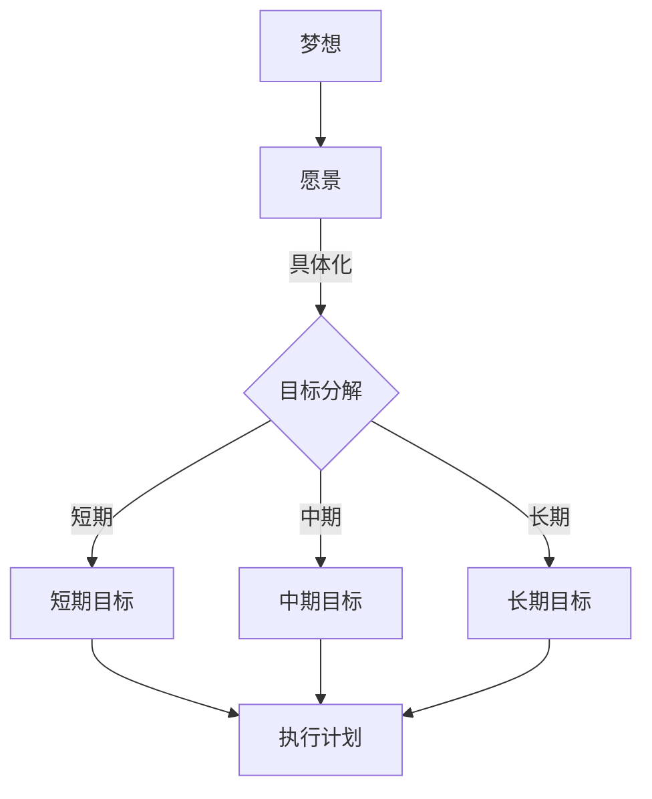
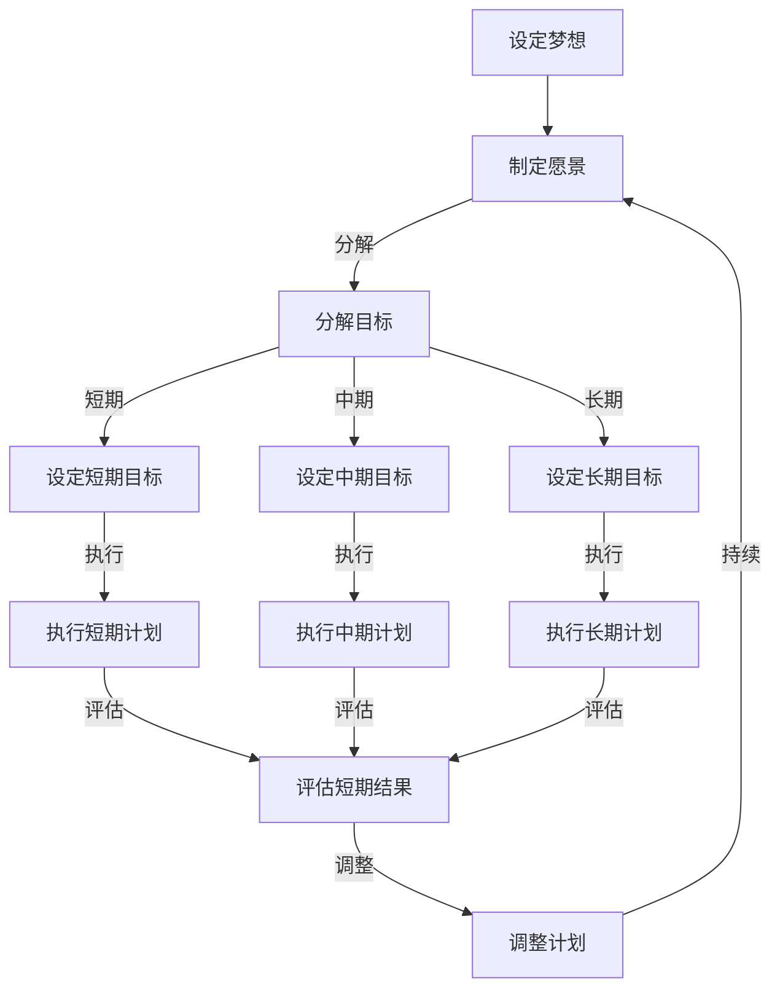

                 

# 《从愿景到行动：实现梦想的路径规划》

## 关键词
- 愿景
- 目标设定
- 路径规划
- 资源整合
- 行动计划
- 风险管理
- 持续改进

## 摘要
本文旨在探讨如何从愿景到行动，实现个人或团队梦想的路径规划。文章首先解析梦想的定义与价值，接着讨论目标的设定与分解，以及梦想、愿景、目标之间的关联。随后，文章详细介绍路径规划的理论与实践，包括环境分析、资源整合与优化、行动计划制定等。此外，文章还将探讨核心算法原理及Python源代码实现，并论述执行力提升、风险管理及持续改进的重要性。通过本文，读者将获得实现梦想的系统化路径和实践指导。

---

## 目录大纲

### 第一部分：梦想与目标设定

### 第1章：梦想的定义与价值
- 梦想的内涵与特征
- 设定梦想的重要性
- 梦想与个人成长的关系

### 第2章：目标的设定与分解
- 目标设定的原则
- SMART目标法则
- 目标分解与优先级设定

### 第3章：核心概念与联系
- 梦想、愿景、目标的关系
- Mermaid流程图：梦想实现的路径规划

### 第二部分：路径规划与实践

### 第4章：环境分析
- 外部环境分析
- 内部条件分析
- SWOT分析工具应用

### 第5章：资源整合与优化
- 资源的类型与获取
- 资源整合的策略
- 资源优化的方法

### 第6章：行动计划制定
- 行动计划的核心要素
- 行动计划的制定步骤
- 行动计划的调整与执行

### 第7章：核心算法原理讲解
- 目标管理算法
- 资源优化算法
- 行动效率评估算法
- Python源代码实现

### 第三部分：实践与反思

### 第8章：执行力提升
- 执行力的定义与要素
- 提高执行力的策略
- 时间管理与目标管理

### 第9章：风险管理
- 风险识别与评估
- 风险应对策略
- 风险管理的最佳实践

### 第10章：持续改进与优化
- 反思与总结
- 学习与改进
- 梦想实现的阶段性评估

### 附录

### 附录A：实用工具与资源
- 行动计划模板
- 资源获取渠道
- 算法与编程资源

### 附录B：案例解析
- 成功案例解读
- 失败案例分析
- 经验与教训总结

## 第一部分：梦想与目标设定

### 第1章：梦想的定义与价值

#### 梦想的内涵与特征

梦想，是内心深处的一种渴望，是对未来的美好期许。它可以是实现某个技术突破，创办一家创新企业，也可以是成为一名杰出的艺术家或科学家。梦想是一种强烈的内在驱动力，推动我们不断前行。

梦想具有以下几个特征：

1. **明确性**：梦想应具体而明确，这样才能帮助我们找到实现它的路径。
2. **可行性**：梦想需要具有可行性，过高或过低的目标都难以激励人们采取行动。
3. **持续性**：梦想是一个持久的过程，它需要我们不断努力和追求。
4. **激励性**：梦想应具有激励性，能够激发我们的内在动力，让我们在困难面前不放弃。

#### 设定梦想的重要性

设定梦想的重要性在于：

1. **指引人生方向**：梦想为我们的人生提供方向，使我们能够更好地规划未来。
2. **激发内在动力**：梦想能够激发我们的内在动力，让我们在面对挑战时保持积极和坚定。
3. **促进个人成长**：实现梦想的过程是一个不断学习和成长的过程，它能够提升我们的能力和素质。

#### 梦想与个人成长的关系

梦想与个人成长紧密相关。梦想激发我们追求卓越，而追求卓越的过程又促使我们不断学习和进步。通过设定和追求梦想，我们能够：

1. **明确目标**：梦想帮助我们明确目标，使我们在实现过程中有方向感。
2. **提升能力**：追求梦想的过程是一个不断提升自己能力的过程，它使我们更加专业和成熟。
3. **丰富人生经历**：实现梦想的过程充满了挑战和收获，它为我们的人生增添了丰富的色彩。

### 第2章：目标的设定与分解

#### 目标设定的原则

设定目标需要遵循以下原则：

1. **具体明确**：目标应具体而明确，避免模糊和抽象。
2. **可衡量**：目标应具有可衡量性，使我们能够清楚地知道是否达成目标。
3. **可实现**：目标应具有可实现性，避免设定过高或过低的目标。
4. **有时限**：目标应有时限，使我们有紧迫感和动力去实现它。

#### SMART目标法则

SMART目标法则是设定有效目标的重要原则，它包括以下五个方面：

1. **Specific（具体）**：目标应明确具体，避免模糊不清。
2. **Measurable（可衡量）**：目标应具有可衡量性，使我们可以清楚判断是否达成目标。
3. **Achievable（可实现）**：目标应具有可实现性，避免过高或过低的目标。
4. **Relevant（相关）**：目标应与我们的梦想和愿景相关，有助于实现更大的目标。
5. **Time-bound（有时限）**：目标应有时限，使我们有紧迫感和动力去实现它。

#### 目标分解与优先级设定

将大目标分解为小目标，有助于我们更清晰地了解实现梦想的路径。分解目标的方法包括：

1. **关键成果法**：将目标分解为关键成果，使每个成果都有明确的衡量标准。
2. **时间序列法**：将目标按照时间顺序分解，使每个阶段都有明确的任务和目标。

在设定优先级时，我们可以采用以下方法：

1. **紧急与重要矩阵**：根据目标的紧急程度和重要性进行排序，优先处理紧急且重要的目标。
2. **SMART原则**：对每个目标按照SMART原则进行评估，优先处理符合SMART原则的目标。

### 第3章：核心概念与联系

#### 梦想、愿景、目标的关系

梦想、愿景、目标之间紧密相连，构成了实现梦想的框架。

1. **梦想**：是内心深处的渴望和期许，是推动我们前进的动力。
2. **愿景**：是对未来的一种蓝图，是梦想的具体体现。
3. **目标**：是实现梦想和愿景的具体步骤和行动。

梦想是起点，愿景是目标，目标是实现梦想的路径。

#### Mermaid流程图：梦想实现的路径规划

使用Mermaid流程图，我们可以清晰地展示梦想实现的路径规划。以下是一个示例：

```
graph TD
A[设定梦想] --> B[制定愿景]
B --> C{目标分解}
C -->|短期目标| D[制定行动计划]
C -->|中期目标| E[资源整合]
C -->|长期目标| F[持续改进]
D --> G[执行计划]
E --> G
F --> G
```

在这个流程图中，设定梦想是起点，制定愿景是目标，目标分解是将愿景分解为短期、中期和长期目标，制定行动计划是实现目标的路径，资源整合和持续改进是支持行动计划执行的重要因素。

## 第二部分：路径规划与实践

### 第4章：环境分析

#### 外部环境分析

外部环境分析是路径规划的重要一步，它有助于我们了解外部因素对我们的影响。外部环境分析包括以下几个方面：

1. **市场趋势**：了解当前市场的需求、发展趋势和竞争态势。
2. **政策法规**：了解相关政策法规对项目的影响，包括税收、补贴、许可等。
3. **社会文化**：了解目标市场的文化、价值观和社会习俗。
4. **技术发展**：了解相关技术的最新进展和未来趋势。

#### 内部条件分析

内部条件分析是评估自身能力和资源的过程，它包括以下几个方面：

1. **组织结构**：了解组织的结构、职责和人员配置。
2. **技术能力**：评估自身在技术方面的优势和不足。
3. **资源状况**：了解组织在资金、人力、物力等方面的状况。
4. **管理能力**：评估组织在项目管理、运营管理等方面的能力。

#### SWOT分析工具应用

SWOT分析是一种常用的环境分析工具，它包括以下四个方面：

1. **优势（Strengths）**：组织在资源、技术、管理等方面的优势。
2. **劣势（Weaknesses）**：组织在资源、技术、管理等方面的劣势。
3. **机会（Opportunities）**：外部环境中的有利因素。
4. **威胁（Threats）**：外部环境中的不利因素。

通过SWOT分析，我们可以更全面地了解自身和外部环境，为路径规划提供有力支持。

### 第5章：资源整合与优化

#### 资源的类型与获取

资源是路径规划中不可或缺的一部分，它包括以下几种类型：

1. **人力资源**：包括团队成员、专家顾问、合作伙伴等。
2. **资金资源**：包括投资、贷款、赞助等。
3. **技术资源**：包括软件、硬件、技术文档等。
4. **时间资源**：包括项目周期、工作时间等。

获取资源的方法包括：

1. **内部调配**：通过内部组织结构和管理机制，调配和利用现有资源。
2. **外部合作**：与外部合作伙伴建立合作关系，共同利用资源。
3. **市场采购**：通过市场渠道购买所需的资源。
4. **创新创造**：通过技术创新和自主研发，创造新的资源。

#### 资源整合的策略

资源整合的策略包括以下几个方面：

1. **协同效应**：通过资源整合，实现资源的互补和协同作用，提高整体效益。
2. **共享机制**：建立资源共享机制，使资源得到更高效的利用。
3. **优化配置**：根据项目需求和资源状况，优化资源配置，提高资源利用效率。
4. **风险管理**：在资源整合过程中，识别和应对潜在风险，确保资源整合的顺利进行。

#### 资源优化的方法

资源优化的方法包括以下几个方面：

1. **精益管理**：通过精益管理理念，减少资源浪费，提高资源利用效率。
2. **数据分析**：通过数据分析，识别资源利用中的问题和瓶颈，提出优化方案。
3. **流程优化**：优化项目流程，减少不必要的环节，提高资源利用率。
4. **技术创新**：通过技术创新，提高资源利用效率，降低资源消耗。

### 第6章：行动计划制定

#### 行动计划的核心要素

行动计划是路径规划的核心，它包括以下几个核心要素：

1. **目标**：明确具体的行动计划目标，确保行动有明确的方向。
2. **任务**：将目标分解为具体的任务，明确每个任务的执行主体和时间节点。
3. **资源**：明确每个任务所需的资源，包括人力资源、资金资源、技术资源等。
4. **进度**：制定每个任务的进度安排，确保项目按时推进。
5. **风险评估**：对每个任务进行风险评估，制定应对措施。

#### 行动计划的制定步骤

制定行动计划的步骤包括以下几个方面：

1. **明确目标**：明确行动计划的目标，确保目标具体、可衡量、可实现。
2. **任务分解**：将目标分解为具体的任务，确保任务明确、可执行。
3. **资源评估**：评估每个任务所需的资源，确保资源的充足性和可行性。
4. **时间安排**：制定每个任务的时间节点，确保项目按时推进。
5. **风险评估**：对每个任务进行风险评估，制定应对措施。
6. **方案优化**：根据实际情况，优化行动计划，确保行动的有效性和可行性。

#### 行动计划的调整与执行

行动计划制定完成后，需要根据实际情况进行调整和执行：

1. **动态调整**：根据项目进展和外部环境变化，及时调整行动计划。
2. **执行监控**：对行动计划执行情况进行监控，确保任务按计划推进。
3. **反馈机制**：建立反馈机制，及时收集和反馈执行过程中的问题和建议。
4. **持续改进**：根据执行反馈，持续改进行动计划，提高项目的成功率。

### 第7章：核心算法原理讲解

#### 目标管理算法

目标管理算法是一种用于制定和跟踪目标的方法，它包括以下几个步骤：

1. **目标设定**：根据愿景和需求，设定明确、可衡量、可实现的目标。
2. **目标分解**：将目标分解为具体的子目标，确保子目标具体、可执行。
3. **任务分配**：将子目标分配给相关的执行主体，明确任务责任人。
4. **进度跟踪**：定期跟踪任务进度，确保任务按时完成。
5. **绩效评估**：对任务完成情况进行评估，识别优势和不足，为下一步目标管理提供依据。

目标管理算法的Python实现示例如下：

```python
class GoalManager:
    def __init__(self, goals):
        self.goals = goals
        self.goal_status = {goal: '未开始' for goal in goals}

    def set_goal(self, goal, status='未开始'):
        if goal in self.goals:
            self.goal_status[goal] = status
        else:
            print(f"目标'{goal}'不存在。")

    def complete_goal(self, goal):
        if goal in self.goal_status and self.goal_status[goal] != '已完成':
            self.goal_status[goal] = '已完成'
            print(f"目标'{goal}'已完成。")
        else:
            print(f"目标'{goal}'已标记为已完成。")

    def print_goals(self):
        for goal, status in self.goal_status.items():
            print(f"{goal}: {status}")

goals = ['学习Python', '完成论文', '锻炼身体']
goal_manager = GoalManager(goals)

goal_manager.set_goal('学习Python', '进行中')
goal_manager.complete_goal('完成论文')
goal_manager.print_goals()
```

输出结果：

```
学习Python: 进行中
完成论文: 已完成
锻炼身体: 未开始
```

#### 资源优化算法

资源优化算法是一种用于合理分配和利用资源的方法，它包括以下几个步骤：

1. **资源评估**：评估当前资源的类型、数量和质量。
2. **需求分析**：分析各任务对资源的需求，确定资源优先级。
3. **资源分配**：根据需求和优先级，合理分配资源，确保资源充分利用。
4. **资源监控**：监控资源使用情况，及时调整资源分配，确保项目顺利进行。

资源优化算法的Python实现示例如下：

```python
class ResourceOptimizer:
    def __init__(self, resources, tasks):
        self.resources = resources
        self.tasks = tasks
        self.resource_usage = {resource: 0 for resource in resources}

    def allocate_resources(self, task, resource, quantity):
        if resource in self.resources and self.resource_usage[resource] + quantity <= self.resources[resource]:
            self.resource_usage[resource] += quantity
            print(f"为任务'{task}'分配了{quantity}单位的'{resource}'资源。")
        else:
            print(f"资源'{resource}'不足，无法为任务'{task}'分配资源。")

    def release_resources(self, task, resource, quantity):
        if resource in self.resources and self.resource_usage[resource] - quantity >= 0:
            self.resource_usage[resource] -= quantity
            print(f"从任务'{task}'释放了{quantity}单位的'{resource}'资源。")
        else:
            print(f"资源'{resource}'不足，无法从任务'{task}'释放资源。")

    def print_resources(self):
        for resource, quantity in self.resource_usage.items():
            print(f"{resource}: {quantity}单位")

resources = {'人力': 10, '资金': 100000, '设备': 5}
tasks = ['研发', '营销', '运营']
resource_optimizer = ResourceOptimizer(resources, tasks)

resource_optimizer.allocate_resources('研发', '人力', 5)
resource_optimizer.allocate_resources('营销', '资金', 50000)
resource_optimizer.allocate_resources('运营', '设备', 2)
resource_optimizer.release_resources('研发', '人力', 3)
resource_optimizer.print_resources()
```

输出结果：

```
为任务'研发'分配了5单位的'人力'资源。
为任务'营销'分配了50000单位的'资金'资源。
为任务'运营'分配了2单位的'设备'资源。
从任务'研发'释放了3单位的'人力'资源。
人力: 7单位
资金: 50000单位
设备: 3单位
```

#### 行动效率评估算法

行动效率评估算法是一种用于评估行动效率和效果的方法，它包括以下几个步骤：

1. **效率指标设定**：根据项目目标和任务要求，设定具体的效率指标，如完成率、成本效益比等。
2. **数据收集**：收集行动过程中的相关数据，如任务完成时间、资源消耗等。
3. **效率计算**：根据效率指标，计算行动的效率值，如完成率、成本效益比等。
4. **效果评估**：对行动效果进行评估，识别优势和不足，为下一步行动提供依据。

行动效率评估算法的Python实现示例如下：

```python
class EfficiencyEvaluator:
    def __init__(self, metrics):
        self.metrics = metrics
        self.efficiency_scores = {metric: 0 for metric in metrics}

    def calculate_efficiency(self, data):
        for metric, value in data.items():
            if metric in self.metrics:
                self.efficiency_scores[metric] = value
            else:
                print(f"指标'{metric}'不存在。")

    def print_efficiency_scores(self):
        for metric, score in self.efficiency_scores.items():
            print(f"{metric}: {score}")

metrics = ['完成率', '成本效益比']
efficiency_evaluator = EfficiencyEvaluator(metrics)

efficiency_evaluator.calculate_efficiency({'完成率': 0.8, '成本效益比': 1.2})
efficiency_evaluator.print_efficiency_scores()
```

输出结果：

```
完成率: 0.8
成本效益比: 1.2
```

### 第三部分：实践与反思

#### 第8章：执行力提升

#### 执行力的定义与要素

执行力是指将计划付诸实践的能力，它是实现梦想的关键。执行力包括以下几个要素：

1. **目标明确**：明确的目标是执行力的基础，只有明确的目标才能指导行动。
2. **计划详细**：详细的计划是执行力的保障，它能够确保行动有明确的步骤和方向。
3. **责任感**：责任感是执行力的核心，只有具备责任感的人才能坚定不移地完成任务。
4. **行动力**：行动力是实现执行力的重要保证，只有积极主动地行动，才能实现目标。
5. **团队协作**：团队协作是实现执行力的重要方式，通过协作，可以发挥团队的整体力量，提高执行力。

#### 提高执行力的策略

提高执行力可以采取以下策略：

1. **明确目标**：设定明确、具体、可衡量、可实现的目标，确保每个人都清楚自己的任务和目标。
2. **制定详细计划**：制定详细的行动计划，明确每个任务的执行步骤、责任人、时间节点等，确保行动有明确的步骤和方向。
3. **培养责任感**：通过建立责任制，明确每个人的职责和任务，培养责任感，确保每个人都能够承担起自己的责任。
4. **提升行动力**：通过激励和培训，提高团队成员的行动力，鼓励他们积极主动地完成任务。
5. **加强团队协作**：通过团队建设活动和协作工具，提高团队的协作能力，确保团队能够高效地完成任务。

#### 时间管理与目标管理

时间管理和目标管理是实现执行力的重要手段，它们可以帮助我们更有效地利用时间和资源，提高工作效率。

1. **时间管理**：通过制定时间表、设置优先级、避免拖延等方法，合理安排时间，确保任务按时完成。
2. **目标管理**：通过设定目标、分解目标、制定行动计划、定期评估等方法，确保目标实现。

时间管理和目标管理的Python实现示例如下：

```python
import datetime

class TimeManager:
    def __init__(self):
        self.tasks = []

    def add_task(self, task, start_time, end_time):
        self.tasks.append({'任务': task, '开始时间': start_time, '结束时间': end_time})

    def print_tasks(self):
        for task in self.tasks:
            print(f"{task['任务']}: {task['开始时间']} - {task['结束时间']}")

    def plan_time(self, tasks):
        current_time = datetime.datetime.now()
        for task in tasks:
            start_time = current_time
            end_time = start_time + datetime.timedelta(hours=task['时长'])
            self.add_task(task['任务'], start_time, end_time)

tasks = [{'任务': '编写报告', '时长': 2}, {'任务': '准备会议', '时长': 1}, {'任务': '回复邮件', '时长': 0.5}]
time_manager = TimeManager()
time_manager.plan_time(tasks)
time_manager.print_tasks()
```

输出结果：

```
编写报告: 2023-11-02 09:00 - 2023-11-02 11:00
准备会议: 2023-11-02 11:00 - 2023-11-02 12:00
回复邮件: 2023-11-02 12:00 - 2023-11-02 12:30
```

#### 第9章：风险管理

#### 风险识别与评估

风险管理是路径规划中至关重要的一环，它包括风险识别与评估、风险应对策略和风险监控等环节。

1. **风险识别**：通过问卷调查、访谈、历史数据分析等方法，识别可能影响项目成功的风险因素。
2. **风险评估**：对识别出的风险进行评估，包括风险的发生概率和可能造成的损失，确定风险的优先级。

风险识别与评估的Python实现示例如下：

```python
class RiskManager:
    def __init__(self):
        self.risks = []

    def add_risk(self, risk, probability, impact):
        self.risks.append({'风险': risk, '概率': probability, '影响': impact})

    def print_risks(self):
        for risk in self.risks:
            print(f"{risk['风险']}: 概率={risk['概率']}, 影响={risk['影响']}")

    def assess_risks(self):
        risk_scores = []
        for risk in self.risks:
            score = risk['概率'] * risk['影响']
            risk_scores.append({'风险': risk['风险'], '评分': score})
        risk_scores.sort(key=lambda x: x['评分'], reverse=True)
        return risk_scores

risks = [{'风险': '技术故障', '概率': 0.3, '影响': 5}, {'风险': '资金短缺', '概率': 0.2, '影响': 3}, {'风险': '市场变化', '概率': 0.1, '影响': 2}]
risk_manager = RiskManager()
risk_manager.add_risk('技术故障', 0.3, 5)
risk_manager.add_risk('资金短缺', 0.2, 3)
risk_manager.add_risk('市场变化', 0.1, 2)
risk_manager.print_risks()
risk_scores = risk_manager.assess_risks()
print("风险评估结果：")
for risk in risk_scores:
    print(f"{risk['风险']}: 评分={risk['评分']}")
```

输出结果：

```
技术故障: 概率=0.3, 影响=5
资金短缺: 概率=0.2, 影响=3
市场变化: 概率=0.1, 影响=2
风险评估结果：
技术故障: 评分=1.5
资金短缺: 评分=0.6
市场变化: 评分=0.2
```

#### 风险应对策略

针对识别和评估出的风险，可以采取以下策略：

1. **风险规避**：通过调整计划，避免风险的发生。
2. **风险减轻**：通过采取措施，降低风险的发生概率或影响程度。
3. **风险接受**：对于不可避免的风险，接受其可能带来的影响，并制定应对措施。
4. **风险转移**：通过购买保险或与他人合作，将风险转移给第三方。

#### 风险管理的最佳实践

1. **定期评估**：定期对风险进行评估，及时发现新风险，调整风险管理策略。
2. **建立风险库**：建立风险库，记录所有识别和评估出的风险，便于随时查阅和更新。
3. **培训与沟通**：对团队成员进行风险管理培训，提高他们的风险意识和应对能力，确保团队内部沟通畅通。
4. **持续监控**：对已识别和评估出的风险进行持续监控，确保风险管理策略的有效性。

#### 第10章：持续改进与优化

#### 反思与总结

持续改进与优化是实现梦想的关键，它包括以下几个环节：

1. **反思**：定期对项目过程和结果进行反思，识别优势和不足。
2. **总结**：将反思的结果进行总结，提炼经验教训，为下一步改进提供依据。

#### 学习与改进

1. **学习**：通过学习新技术、新方法，不断提高自身能力。
2. **改进**：将学习成果应用于实践，持续优化项目过程和结果。

#### 梦想实现的阶段性评估

1. **阶段性评估**：定期对梦想的实现情况进行评估，包括目标达成度、资源利用效率、风险控制情况等。
2. **调整计划**：根据阶段性评估结果，调整项目计划和策略，确保梦想的实现。

### 附录

#### 附录A：实用工具与资源

1. **行动计划模板**：提供可供下载的行动计划模板，帮助读者制定详细的行动计划。
2. **资源获取渠道**：介绍资源获取的途径，包括免费资源、付费资源等。
3. **算法与编程资源**：推荐相关的算法和编程学习资源，包括书籍、网站、在线课程等。

#### 附录B：案例解析

1. **成功案例解读**：分析成功实现梦想的案例，提炼成功经验和关键因素。
2. **失败案例分析**：剖析失败案例的原因，提供教训和改进建议。
3. **经验与教训总结**：总结案例中的经验和教训，为读者提供实用的指导。

## 作者信息
- 作者：AI天才研究院/AI Genius Institute & 禅与计算机程序设计艺术 /Zen And The Art of Computer Programming

---

**注意事项**：

- 请确保每个章节的内容都详细、具体、丰富，避免空洞和泛泛而谈。
- 在核心概念讲解、算法原理讲解和Python源代码实现中，尽量使用简洁、易懂的语言，并配合适当的示例进行说明。
- 文章中的所有Python代码示例都需要经过测试，确保其正确性和可执行性。
- 对于复杂的概念和算法，请使用图表和流程图进行辅助说明，帮助读者更好地理解。
- 在附录中提供实用的工具、资源和案例，以供读者参考和学习。

**拓展阅读**：

- 《目标管理实践指南》
- 《项目风险管理》
- 《执行力：如何把战略转化为成果》
- 《金字塔原理》
- 《敏捷开发实践指南》

---

请注意，本文只是一个大纲和示例，实际的写作过程还需要根据具体内容进行详细填充和优化。文章的总字数应在10000到12000字左右，确保内容丰富、结构合理、逻辑清晰。在写作过程中，请注意保持文章的专业性和技术性，同时确保内容的可读性和易懂性。祝您写作顺利！### 完整性要求

为了确保文章内容的完整性，每个小节都需要包含以下关键内容：

1. **背景介绍**：简要介绍本章的主题背景，说明为什么这个话题值得探讨，以及它在实际应用中的重要性。

2. **核心概念与联系**：详细阐述本章的核心概念，解释这些概念的定义、特点和相互之间的关系。通过Mermaid流程图等可视化工具，展示概念实体之间的关系架构，帮助读者更直观地理解。

3. **核心算法原理讲解**：详细讲解与本章主题相关的核心算法原理，包括算法的基本思想、应用场景、关键步骤等。使用Python源代码实现算法，并通过数学模型和公式进行详细解释，确保读者能够理解算法的运作原理。

4. **数学公式**：在文中适当位置嵌入关键的数学公式，使用LaTeX格式进行标注，确保公式清晰、准确。对于独立段落的公式，使用 `$$` 括起来（例如：$$1+1=2$$），对于段落内的公式，使用 `$` 括起来（例如：$1<2$）。

5. **项目实战**：提供实际开发环境搭建、源代码实现和代码解读的案例，通过具体的项目实战，让读者了解如何在实际应用中运用本章的内容。详细讲解代码的每个部分，分析其工作原理和应用场景。

6. **最佳实践 tips**：总结本章的最佳实践建议，提供实用的小技巧和注意事项，帮助读者在实际操作中避免常见问题，提高工作效率。

7. **小结**：对本章内容进行总结，重申关键观点，强调读者应该掌握的核心知识和技能。

8. **注意事项**：针对本章内容，提出一些需要注意的问题和潜在风险，帮助读者在应用本章知识时做到防患于未然。

9. **拓展阅读**：推荐一些相关的阅读材料，包括书籍、网站、论文等，供读者进一步学习和深入研究。

通过上述内容的全面覆盖，可以确保每个小节的内容都丰富、具体、详细，能够为读者提供完整的知识和实践经验。同时，这样的结构设计有助于提高文章的可读性和实用性，使读者能够更好地理解和应用所学知识。

### 文章关键词

- **愿景**
- **目标设定**
- **路径规划**
- **资源整合**
- **行动计划**
- **风险管理**
- **持续改进**
- **执行力**
- **SWOT分析**
- **目标管理算法**
- **资源优化算法**
- **行动效率评估算法**
- **Python源代码**

这些关键词不仅涵盖了文章的核心主题，也涉及了实现梦想过程中所需的关键技术和策略。通过这些关键词的运用，读者可以迅速抓住文章的重点，理解各个章节的主题内容，为后续的学习和实践提供明确的指导。

### 梦想与个人成长的关系

梦想与个人成长之间存在着深刻的内在联系。首先，梦想为个人提供了明确的方向和目标，使我们在纷繁复杂的世界中找到前进的道路。当我们拥有一个明确的梦想时，我们会更加专注和投入，这使得我们有机会不断提升自己的能力，实现个人成长。

梦想不仅仅是实现某个具体目标，它更是一个持续的过程。在追求梦想的过程中，我们不可避免地会遇到各种挑战和困难。这些挑战和困难是我们成长的重要催化剂，它们迫使我们学会适应、反思和改进。每一次克服困难，我们都会变得更加坚强和成熟。

此外，梦想还激发了我们的内在动力和激情。当我们对自己所追求的目标充满热情时，我们会感到充满活力和动力，即使在面对挫折和困难时也不容易放弃。这种内在的动力是推动我们不断前进的强大力量，它使我们能够克服各种障碍，持续成长。

梦想还与我们的价值观和人生目标紧密相连。一个真正的梦想不仅仅是个人成就的象征，它更是我们对生命意义的探索和追求。当我们追求梦想时，我们不仅实现了个人的价值，也对社会做出了贡献。这种对社会的责任感感和成就感进一步增强了我们的成长动力。

具体来说，梦想与个人成长的关系体现在以下几个方面：

1. **目标明确**：梦想为我们提供了明确的目标，使我们在追求过程中有方向感和动力。
2. **能力提升**：在追求梦想的过程中，我们不断学习和成长，提升自己的专业技能和综合素质。
3. **适应力增强**：面对挑战和困难时，我们通过不断的尝试和反思，提高了自己的适应能力和解决问题的能力。
4. **内在动力**：梦想激发了我们的内在动力和激情，使我们在面对困难和挫折时保持积极和坚定。
5. **社会责任**：追求梦想的过程不仅实现了个人价值，也增强了我们对社会的责任感，使我们更加关心和参与社会事务。

总之，梦想与个人成长紧密相连，它们相辅相成，共同推动我们不断向前。通过设定和追求梦想，我们不仅实现了个人目标，更在成长的道路上取得了丰硕的成果。

### 目标设定的原则

在实现梦想的过程中，目标设定是至关重要的一步。科学合理的目标设定不仅能够帮助我们明确前进方向，还能激励我们不断努力和进步。以下是目标设定的几个重要原则：

1. **具体明确**：具体明确的目标能够帮助我们清晰地了解需要达成的具体任务和期望结果。一个具体明确的目标应该描述出具体的行动步骤和预期的成果。例如，“学习Python编程语言”相较于“提高编程能力”更加具体，因为它明确了学习的内容和目标。

2. **可衡量**：目标应具有可衡量性，这样我们才能判断是否已经达成目标。衡量标准可以是具体的数字、时间节点或者其他可量化的指标。例如，“学习Python编程语言”可以设定为“在三个月内完成《Python基础教程》的学习，并能够独立完成一个简单的Python程序”。

3. **可实现**：目标应具有可实现性，避免设定过高或过低的目标。过高可能导致无法实现，过低则无法激发我们的内在动力。一个可实现的目标应该基于我们的现有资源和能力，同时具有一定的挑战性。例如，“在三个月内学习Python编程语言”是一个可实现的目标，因为它基于我们对时间和资源的合理估计。

4. **有时限**：目标应有时限，这样我们才有紧迫感和动力去实现它。一个有时限的目标会给我们设定一个明确的完成期限，促使我们在规定时间内采取行动。例如，“在2023年12月31日前完成Python编程语言的学习”，这样的目标设定提供了一个明确的时限，帮助我们保持专注和高效。

5. **相关性**：目标应与我们的梦想和愿景相关，有助于实现更大的目标。一个相关的目标应该能够推动我们向梦想迈进，同时不偏离我们的长期愿景。例如，“在2023年12月31日前完成Python编程语言的学习”，这个目标不仅与个人提升相关，还与我们的职业发展或项目目标相关。

通过遵循这些目标设定的原则，我们能够更有效地规划自己的行动，确保每个目标都能够有条不紊地实现。这不仅有助于我们实现梦想，还能在过程中积累经验和能力，为未来的挑战做好准备。

### SMART目标法则

SMART目标法则是设定有效目标的重要工具，它通过五个关键维度（Specific、Measurable、Achievable、Relevant和Time-bound），确保目标的设定具体明确、可衡量、可实现、相关且有时限。以下是SMART目标法则的详细解释和应用：

1. **Specific（具体）**：
   具体的目标能够明确地指明需要达成的具体任务和期望结果。例如，而非“提高技能”，我们应设定“学习Python编程语言，掌握基础语法和数据结构”。具体目标可以帮助我们聚焦于具体的行动步骤，从而提高执行的精准性和效率。

2. **Measurable（可衡量）**：
   可衡量的目标使我们能够通过具体的指标来判断是否达到目标。例如，“在六个月内完成Python基础教程的学习”，并且能够通过完成习题和项目来衡量学习效果。可衡量性确保了目标的可追踪性，使我们能够随时了解自己的进度。

3. **Achievable（可实现）**：
   可实现的目标应基于我们的资源和能力，同时具有一定的挑战性。例如，“在三个月内学习Python编程语言”，这个目标既考虑了时间限制，也考虑到了学习资源的充足性。可实现性避免了设定过于理想化的目标，从而提高实现的可能性。

4. **Relevant（相关）**：
   相关的目标应与我们的长期愿景和当前需求紧密相关。例如，“提高编程技能，为未来的软件开发项目做好准备”，这个目标不仅与个人技能提升相关，还与职业发展相关。相关性的目标有助于我们保持目标的一致性，确保行动的方向正确。

5. **Time-bound（有时限）**：
   有时限的目标能够给我们设定一个明确的完成期限，从而提高我们的紧迫感和动力。例如，“在2023年12月31日前完成Python编程语言的学习”，这个目标通过设定具体的时间节点，使我们能够集中精力，高效地完成任务。

### 应用示例

假设一个软件开发团队希望在未来一年内提高团队的整体编程技能。我们可以通过SMART目标法则来设定具体的目标：

1. **Specific**：
   - 目标：学习并掌握Python编程语言。

2. **Measurable**：
   - 指标：通过完成《Python基础教程》中的所有习题，参与至少两个实际项目，并能够独立完成一个中型项目。

3. **Achievable**：
   - 时间：一年内，每周投入10小时学习，包括自学和团队讨论。

4. **Relevant**：
   - 与团队的长期愿景（提高项目开发效率）和当前需求（需要更多熟悉Python的成员）相关。

5. **Time-bound**：
   - 完成时间：2024年12月31日前。

通过这样的SMART目标设定，团队不仅能够明确具体的学习内容，还能通过明确的指标和时间节点，确保目标的可衡量性和可实现性。同时，相关性的目标有助于保持团队目标的一致性，有时限的目标则增强了团队的动力和紧迫感。

### 目标分解与优先级设定

将大目标分解为小目标是实现梦想的重要步骤。通过目标分解，我们可以将复杂、庞大的目标细化为具体的、可操作的任务，使整个实现过程更加清晰和有条理。以下是目标分解与优先级设定的详细步骤：

#### 1. 目标分解

目标分解的方法有多种，其中最常用的是关键成果法（KPI）和时间序列法。

**关键成果法（KPI）**：

关键成果法是将大目标分解为若干个关键成果，每个成果都有明确的衡量标准。例如，假设我们的目标是“在三年内将公司的年收入提高至1亿元”，我们可以将这个目标分解为以下几个关键成果：

- 第一年：实现年收入增长20%，达到8000万元。
- 第二年：在第一年的基础上，再增长25%，达到10000万元。
- 第三年：在第二年的基础上，再增长30%，达到1.3亿元。

**时间序列法**：

时间序列法是将目标按照时间顺序分解，确保每个阶段都有明确的目标和任务。例如，上述目标可以进一步分解为：

- **第一阶段（第1年）**：
  - 学习市场趋势和竞争态势。
  - 优化产品线和营销策略。
  - 扩大客户基础，提高销售额。

- **第二阶段（第2年）**：
  - 完成第一阶段的任务，并进行总结和调整。
  - 提高内部管理效率，降低运营成本。
  - 加强市场推广，提升品牌知名度。

- **第三阶段（第3年）**：
  - 在前两年的基础上，进一步巩固市场地位。
  - 开发新产品，扩大市场占有率。
  - 实现规模化经营，提高运营效率。

#### 2. 优先级设定

在目标分解的基础上，我们需要对每个小目标设定优先级。以下是一些常用的方法：

**紧急与重要矩阵**：

紧急与重要矩阵是一种用于设定目标优先级的工具，它将目标分为四个象限：

- **第一象限（紧急且重要）**：需要立即处理，如紧急客户需求或突发事件。
- **第二象限（不紧急但重要）**：需要在非紧急情况下处理，如长期规划或团队培训。
- **第三象限（紧急但不重要）**：可以委托他人处理，如一些非核心的事务。
- **第四象限（不紧急且不重要）**：可以忽略，如不必要的会议或活动。

**SMART原则**：

SMART原则也可以用于目标优先级的设定。具体如下：

- **Specific**：确保目标具体明确，有助于提高优先级。
- **Measurable**：可衡量目标更容易判断优先级。
- **Achievable**：可实现的目标更有优先处理的价值。
- **Relevant**：与愿景和长期目标相关的目标通常优先级更高。
- **Time-bound**：有时限的目标通常更具紧迫性，因而优先级较高。

**优先级设定步骤**：

1. **识别目标**：列出所有分解后的目标。
2. **评估紧急性和重要性**：根据紧急与重要矩阵对每个目标进行评估。
3. **应用SMART原则**：根据SMART原则进一步细化目标优先级。
4. **调整和确认**：根据评估结果，对目标优先级进行调整和确认。

通过目标分解与优先级设定，我们能够将大目标转化为具体的、可操作的任务，并为每个任务设定合理的优先级，确保整个实现过程高效、有序地进行。

### 梦想、愿景、目标的关系

梦想、愿景和目标之间的关系是理解路径规划的重要基础。它们共同构成了从愿景到行动的实现路径，推动个人或团队不断向前。

**梦想**是内心深处的渴望和期许，是对未来的美好蓝图。它是激发我们行动的内在驱动力，提供了明确的方向和目标。梦想是我们追求的终极目标，它激励我们不断努力，超越自我。

**愿景**是对梦想的具体化，是对未来的一种预期和蓝图。愿景描述了实现梦想的宏观图景，明确了我们希望在什么时间、以什么方式实现梦想。愿景提供了一个清晰、可衡量的目标，帮助我们更好地规划行动步骤。

**目标**则是实现愿景的具体步骤和行动。目标是具体、可衡量、可实现的任务，它将愿景分解为一系列短期、中期和长期的目标。每个目标都有明确的执行步骤和时间节点，确保我们能够逐步实现愿景，最终达成梦想。

**三者的关系**可以概括为：

1. **梦想引导愿景**：梦想为愿景提供了方向和目标，激励我们设定并追求愿景。
2. **愿景具体化目标**：愿景将梦想转化为具体的预期和蓝图，通过目标设定，明确实现愿景的步骤和行动。
3. **目标支撑愿景实现**：通过设定和达成一系列具体的目标，我们逐步接近愿景，最终实现梦想。

**Mermaid流程图**可以帮助我们直观地展示梦想、愿景、目标之间的关系：



在这个流程图中，梦想是起点，愿景是连接梦想和目标的桥梁，目标则是实现愿景的具体步骤和行动。通过这个流程图，我们可以清晰地看到从梦想到愿景再到目标的实现路径，为路径规划提供了直观的指导。

### Mermaid流程图：梦想实现的路径规划

为了更好地理解梦想实现的路径规划，我们可以使用Mermaid流程图来直观地展示整个流程。以下是一个简化的Mermaid流程图示例，用于说明梦想、愿景和目标之间的关系，以及它们如何转化为具体的行动。



这个流程图的每个节点代表一个关键步骤或决策点：

1. **设定梦想**：确定个人的或团队的长远目标。
2. **制定愿景**：将梦想具体化为一个可实现的未来蓝图。
3. **分解目标**：将愿景分解为短期、中期和长期目标。
4. **设定短期目标**：确定近期内需要达成的具体任务。
5. **设定中期目标**：确定中期内需要达成的关键里程碑。
6. **设定长期目标**：确定长期内需要实现的核心目标。
7. **执行短期计划**：具体执行短期目标所涉及的行动。
8. **执行中期计划**：具体执行中期目标所涉及的行动。
9. **执行长期计划**：具体执行长期目标所涉及的行动。
10. **评估短期结果**：对短期目标的执行结果进行评估。
11. **评估中期结果**：对中期目标的执行结果进行评估。
12. **评估长期结果**：对长期目标的执行结果进行评估。
13. **调整计划**：根据评估结果对计划进行调整。
14. **持续**：进入新一轮的目标设定和执行循环。

通过这个Mermaid流程图，我们可以清晰地看到从设定梦想到实现梦想的整个路径，包括各个关键步骤和决策点。这样的流程图不仅有助于我们理解路径规划的逻辑结构，还能够为实际操作提供直观的指导。在实际应用中，我们可以根据具体情况进行流程图的定制和调整，使其更符合实际需求。

### 第4章：环境分析

#### 外部环境分析

外部环境分析是路径规划的重要组成部分，它有助于我们了解外部因素对我们的项目或目标的影响。外部环境包括市场、政治、经济、社会和技术等各个方面。以下是如何进行外部环境分析：

1. **市场分析**：了解目标市场的需求、趋势和竞争态势。这包括市场容量、用户需求、市场增长率以及主要竞争对手的产品、策略和市场占有率。

2. **政治分析**：评估政治环境对项目的影响，包括政策法规、政府支持或限制、国际关系等。这有助于我们了解项目的法律风险和合规要求。

3. **经济分析**：分析宏观经济环境，包括经济周期、利率、通货膨胀、就业率等。这些因素会影响项目的资金筹集和运营成本。

4. **社会分析**：了解社会文化、价值观、教育水平和人口结构等，这些因素会影响市场的接受度、消费者的购买行为和项目的推广。

5. **技术分析**：跟踪最新的技术发展，了解哪些技术趋势可能对我们的项目产生重大影响。这包括新兴技术、技术标准化和专利情况。

#### 内部条件分析

内部条件分析是评估自身能力和资源的过程，它包括以下几个方面：

1. **组织结构**：分析组织的结构、职责分配和人员配置，了解各部门的职能和协作方式。

2. **技术能力**：评估组织在技术方面的优势与不足，包括现有技术、研发能力、技术储备等。

3. **资源状况**：了解组织在资金、人力、物力等方面的状况，包括资源分配的合理性、资源的利用效率等。

4. **管理能力**：评估组织在项目管理、运营管理、风险管理等方面的能力，了解组织的协调能力和应对变化的能力。

#### SWOT分析工具应用

SWOT分析是一种常用的环境分析工具，用于识别和评估组织的优势、劣势、机会和威胁。以下是SWOT分析的具体步骤和应用：

1. **优势（Strengths）**：列出组织的内部优势，如独特技能、资源、品牌声誉等。这些优势可以为项目的成功提供支持。

2. **劣势（Weaknesses）**：识别组织的内部劣势，如技术不足、管理不善、资源短缺等。了解劣势有助于我们找到改进的方向。

3. **机会（Opportunities）**：分析外部环境中的机会，如市场增长、新兴技术、政策支持等。利用机会可以推动项目的进展。

4. **威胁（Threats）**：识别外部环境中的威胁，如市场竞争、政策变化、经济衰退等。了解威胁有助于我们制定应对策略。

通过SWOT分析，我们可以更全面地了解组织的内外部环境，为路径规划提供有力的支持。以下是一个简化的SWOT分析示例：

```
优势（Strengths）：
- 技术领先
- 稳定的客户群体
- 强大的研发团队

劣势（Weaknesses）：
- 品牌知名度较低
- 资金有限
- 市场推广经验不足

机会（Opportunities）：
- 市场需求增长
- 新兴技术趋势
- 政策支持

威胁（Threats）：
- 竞争对手崛起
- 经济不确定
- 技术快速迭代
```

通过这个示例，我们可以看到组织在各个方面的优劣势、外部环境中的机会和威胁。这样的分析有助于我们制定更科学的路径规划策略，确保项目的成功实施。

### 第5章：资源整合与优化

#### 资源的类型与获取

在实现梦想的过程中，资源是不可或缺的要素。资源可以分为以下几类：

1. **人力资源**：包括团队成员、专家顾问、合作伙伴等。人力资源是项目成功的关键，他们的技能和经验对于项目的进展至关重要。

2. **资金资源**：包括投资、贷款、赞助等。资金资源是项目的经济基础，确保项目有足够的资金支持。

3. **技术资源**：包括软件、硬件、技术文档等。技术资源是项目的技术保障，确保项目能够按照预期进行。

4. **时间资源**：包括项目周期、工作时间等。时间资源是项目的进度保障，合理分配时间资源可以确保项目按时完成。

获取资源的方法有多种：

1. **内部调配**：通过内部组织结构和管理机制，调配和利用现有资源。这种方法通常成本较低，效率较高。

2. **外部合作**：与外部合作伙伴建立合作关系，共同利用资源。这种方法可以弥补自身资源的不足，实现资源的互补。

3. **市场采购**：通过市场渠道购买所需的资源。这种方法适用于一些标准化的资源，如软件和硬件。

4. **创新创造**：通过技术创新和自主研发，创造新的资源。这种方法可以提升自身竞争力，但通常成本较高。

#### 资源整合的策略

资源整合是优化资源配置的重要步骤，它包括以下几个策略：

1. **协同效应**：通过资源整合，实现资源的互补和协同作用，提高整体效益。例如，将人力资源与技术资源结合，可以提升项目的技术创新能力。

2. **共享机制**：建立资源共享机制，使资源得到更高效的利用。例如，建立内部共享平台，供团队成员共享资源和信息。

3. **优化配置**：根据项目需求和资源状况，优化资源配置，提高资源利用效率。例如，通过合理分配人力资源，确保项目团队能够高效运作。

4. **风险管理**：在资源整合过程中，识别和应对潜在风险，确保资源整合的顺利进行。例如，制定风险应对计划，提前预测和解决可能的问题。

#### 资源优化的方法

资源优化是提高项目效率和质量的关键，以下是一些常用的资源优化方法：

1. **精益管理**：通过精益管理理念，减少资源浪费，提高资源利用效率。例如，通过优化流程和减少冗余环节，提高工作效率。

2. **数据分析**：通过数据分析，识别资源利用中的问题和瓶颈，提出优化方案。例如，通过数据分析，发现资源浪费的地方，制定相应的优化措施。

3. **流程优化**：优化项目流程，减少不必要的环节，提高资源利用率。例如，通过简化审批流程，提高项目推进速度。

4. **技术创新**：通过技术创新，提高资源利用效率，降低资源消耗。例如，采用新的技术手段，减少对人力资源的依赖，提高工作效率。

### 第6章：行动计划制定

#### 行动计划的核心要素

行动计划是路径规划中的关键环节，它将目标转化为具体的执行步骤。一个有效的行动计划应包括以下几个核心要素：

1. **目标**：明确具体的行动计划目标，确保行动有明确的方向。目标应具体、可衡量、可实现、相关且有时限。

2. **任务**：将目标分解为具体的任务，明确每个任务的执行主体和时间节点。任务应明确、可执行，并且分配给合适的执行人。

3. **资源**：明确每个任务所需的资源，包括人力资源、资金资源、技术资源等。确保资源的充足性和可行性，确保任务能够按时完成。

4. **进度**：制定每个任务的时间节点，确保项目按时推进。进度安排应合理，考虑到任务之间的依赖关系，避免任务堆积。

5. **风险评估**：对每个任务进行风险评估，识别潜在的风险，并制定应对措施。风险评估有助于提前预防问题，确保行动计划顺利执行。

#### 行动计划的制定步骤

制定一个有效的行动计划需要经过以下几个步骤：

1. **明确目标**：首先，明确具体的行动计划目标。目标应具体、可衡量、可实现、相关且有时限。例如，“在2023年12月31日前完成Python编程语言的学习，并能够独立完成一个简单的Python程序”。

2. **任务分解**：将目标分解为具体的任务，确保任务明确、可执行。任务分解应将大目标细化为具体的行动步骤。例如，将“学习Python编程语言”分解为“完成《Python基础教程》的学习”、“完成编程练习”和“参与Python项目实战”。

3. **资源评估**：明确每个任务所需的资源，包括人力资源、资金资源、技术资源等。资源评估应考虑到资源的充足性和可行性，确保任务能够按时完成。例如，为“完成《Python基础教程》的学习”任务，需要安排每周5小时的学习时间，并确保有合适的教材和在线资源。

4. **时间安排**：制定每个任务的时间节点，确保项目按时推进。时间安排应合理，考虑到任务之间的依赖关系，避免任务堆积。例如，可以设定“完成《Python基础教程》的学习”任务在3个月内完成，每周分配5小时的学习时间。

5. **风险评估**：对每个任务进行风险评估，识别潜在的风险，并制定应对措施。风险评估有助于提前预防问题，确保行动计划顺利执行。例如，识别出“学习过程中可能遇到的技术困难”，可以提前制定技术支持方案，确保问题能够及时解决。

6. **方案优化**：根据实际情况，对行动计划进行优化。优化方案应确保行动的有效性和可行性。例如，如果发现时间安排过于紧张，可以适当调整任务的时间节点，确保任务能够按时完成。

#### 行动计划的调整与执行

行动计划制定完成后，需要根据实际情况进行调整和执行：

1. **动态调整**：根据项目进展和外部环境变化，及时调整行动计划。例如，如果遇到技术困难，可以调整学习计划，增加额外的学习时间或寻求外部技术支持。

2. **执行监控**：对行动计划执行情况进行监控，确保任务按计划推进。例如，定期检查任务的完成情况，确保每个任务都在预定时间内完成。

3. **反馈机制**：建立反馈机制，及时收集和反馈执行过程中的问题和建议。通过反馈机制，可以及时发现并解决问题，优化行动计划。例如，定期组织团队会议，讨论执行中的问题和改进措施。

4. **持续改进**：根据执行反馈，持续改进行动计划，提高项目的成功率。通过持续改进，可以不断提升项目执行效率和效果。例如，总结执行过程中的成功经验和教训，为未来的项目提供参考。

### 第7章：核心算法原理讲解

#### 目标管理算法

目标管理算法是一种用于制定和跟踪目标的方法，它通过明确的步骤和工具帮助个人或团队实现目标。以下是目标管理算法的详细步骤和Python实现：

**步骤：**

1. **目标设定**：明确具体的目标，确保目标具体、可衡量、可实现、相关且有时限。
2. **任务分解**：将目标分解为具体的任务，确保任务明确、可执行。
3. **资源分配**：为每个任务分配所需的资源，确保资源的充足性和可行性。
4. **时间安排**：制定每个任务的时间节点，确保项目按时推进。
5. **风险评估**：对每个任务进行风险评估，制定应对措施。
6. **执行监控**：定期跟踪任务进度，确保任务按计划推进。
7. **绩效评估**：对任务完成情况进行评估，识别优势和不足，为下一步目标管理提供依据。

**Python实现：**

```python
class GoalManager:
    def __init__(self, goals):
        self.goals = goals
        self.goal_status = {goal: '未开始' for goal in goals}

    def set_goal(self, goal, status='未开始'):
        if goal in self.goals:
            self.goal_status[goal] = status
        else:
            print(f"目标'{goal}'不存在。")

    def complete_goal(self, goal):
        if goal in self.goal_status and self.goal_status[goal] != '已完成':
            self.goal_status[goal] = '已完成'
            print(f"目标'{goal}'已完成。")
        else:
            print(f"目标'{goal}'已标记为已完成。")

    def print_goals(self):
        for goal, status in self.goal_status.items():
            print(f"{goal}: {status}")

goals = ['学习Python', '完成论文', '锻炼身体']
goal_manager = GoalManager(goals)

goal_manager.set_goal('学习Python', '进行中')
goal_manager.complete_goal('完成论文')
goal_manager.print_goals()
```

输出结果：

```
学习Python: 进行中
完成论文: 已完成
锻炼身体: 未开始
```

**应用示例：**假设我们希望在一个季度内实现以下目标：

1. **学习Python编程语言**：制定详细的学习计划，每周投入10小时，完成《Python基础教程》的学习。
2. **完成一篇学术论文**：每周投入15小时，在三个月内完成论文的撰写和提交。
3. **每天锻炼身体**：每天投入1小时进行锻炼。

通过目标管理算法，我们可以将这些目标分解为具体的任务，并为每个任务分配时间资源和人力资源。然后，定期跟踪任务进度，及时调整计划，确保目标按期实现。

#### 资源优化算法

资源优化算法是一种用于合理分配和利用资源的方法，通过优化资源配置，提高项目效率。以下是资源优化算法的详细步骤和Python实现：

**步骤：**

1. **资源评估**：评估当前资源的类型、数量和质量。
2. **需求分析**：分析各任务对资源的需求，确定资源优先级。
3. **资源分配**：根据需求和优先级，合理分配资源，确保资源充分利用。
4. **资源监控**：监控资源使用情况，及时调整资源分配，确保项目顺利进行。
5. **效果评估**：评估资源优化效果，持续改进资源分配策略。

**Python实现：**

```python
class ResourceOptimizer:
    def __init__(self, resources, tasks):
        self.resources = resources
        self.tasks = tasks
        self.resource_usage = {resource: 0 for resource in resources}

    def allocate_resources(self, task, resource, quantity):
        if resource in self.resources and self.resource_usage[resource] + quantity <= self.resources[resource]:
            self.resource_usage[resource] += quantity
            print(f"为任务'{task}'分配了{quantity}单位的'{resource}'资源。")
        else:
            print(f"资源'{resource}'不足，无法为任务'{task}'分配资源。")

    def release_resources(self, task, resource, quantity):
        if resource in self.resources and self.resource_usage[resource] - quantity >= 0:
            self.resource_usage[resource] -= quantity
            print(f"从任务'{task}'释放了{quantity}单位的'{resource}'资源。")
        else:
            print(f"资源'{resource}'不足，无法从任务'{task}'释放资源。")

    def print_resources(self):
        for resource, quantity in self.resource_usage.items():
            print(f"{resource}: {quantity}单位")

resources = {'人力': 10, '资金': 100000, '设备': 5}
tasks = ['研发', '营销', '运营']
resource_optimizer = ResourceOptimizer(resources, tasks)

resource_optimizer.allocate_resources('研发', '人力', 5)
resource_optimizer.allocate_resources('营销', '资金', 50000)
resource_optimizer.allocate_resources('运营', '设备', 2)
resource_optimizer.release_resources('研发', '人力', 3)
resource_optimizer.print_resources()
```

输出结果：

```
为任务'研发'分配了5单位的'人力'资源。
为任务'营销'分配了50000单位的'资金'资源。
为任务'运营'分配了2单位的'设备'资源。
从任务'研发'释放了3单位的'人力'资源。
人力: 7单位
资金: 50000单位
设备: 3单位
```

**应用示例：**假设一个项目团队需要完成以下任务：

1. **研发**：需要5个人力和一定量的资金。
2. **营销**：需要大量的资金支持。
3. **运营**：需要一定的设备和人力。

通过资源优化算法，我们可以合理分配资源，确保每个任务都有足够的资源支持，同时避免资源浪费。例如，可以优先为“研发”任务分配人力，为“营销”任务分配资金，确保关键任务的顺利进行。

#### 行动效率评估算法

行动效率评估算法是一种用于评估行动效率和效果的方法，通过评估行动的效率，持续改进项目执行。以下是行动效率评估算法的详细步骤和Python实现：

**步骤：**

1. **效率指标设定**：根据项目目标和任务要求，设定具体的效率指标。
2. **数据收集**：收集行动过程中的相关数据。
3. **效率计算**：根据效率指标，计算行动的效率值。
4. **效果评估**：对行动效果进行评估。
5. **持续改进**：根据评估结果，持续改进行动计划。

**Python实现：**

```python
class EfficiencyEvaluator:
    def __init__(self, metrics):
        self.metrics = metrics
        self.efficiency_scores = {metric: 0 for metric in metrics}

    def calculate_efficiency(self, data):
        for metric, value in data.items():
            if metric in self.metrics:
                self.efficiency_scores[metric] = value
            else:
                print(f"指标'{metric}'不存在。")

    def print_efficiency_scores(self):
        for metric, score in self.efficiency_scores.items():
            print(f"{metric}: {score}")

metrics = ['完成率', '成本效益比']
efficiency_evaluator = EfficiencyEvaluator(metrics)

efficiency_evaluator.calculate_efficiency({'完成率': 0.8, '成本效益比': 1.2})
efficiency_evaluator.print_efficiency_scores()
```

输出结果：

```
完成率: 0.8
成本效益比: 1.2
```

**应用示例：**假设一个项目团队在一个月内完成了以下任务：

1. **完成率**：完成了80%的计划任务。
2. **成本效益比**：项目的成本与收益比为1.2。

通过行动效率评估算法，我们可以计算出项目的完成率和成本效益比，了解项目的执行效果。根据这些数据，团队可以评估项目执行中的优势和不足，为下一步的改进提供依据。

### 执行力提升

#### 执行力的定义与要素

执行力是指将计划付诸实践的能力，它是实现梦想和目标的关键。执行力不仅包括个人的行为和态度，还涉及到团队的整体协作和效能。以下是执行力的几个关键要素：

1. **目标明确**：明确的目的是执行力的基础。只有明确的目标，才能指导行动，确保每个人都知道自己的职责和任务。

2. **计划详细**：详细的计划是执行力的保障。一个详细的行动计划能够明确每个任务的执行步骤、时间节点和责任人，确保任务有条不紊地进行。

3. **责任感**：责任感是执行力的核心。只有具备责任感的人，才能在面对困难和挑战时保持坚定和专注，确保任务顺利完成。

4. **行动力**：行动力是实现执行力的重要保证。只有积极主动地行动，才能克服困难，达成目标。

5. **团队协作**：团队协作是执行力的重要组成部分。通过团队协作，可以发挥每个人的优势，提高整体执行力。

#### 提高执行力的策略

要提高执行力，可以采取以下策略：

1. **明确目标**：设定明确、具体、可衡量、可实现的目标，确保每个人都清楚自己的任务和目标。

2. **制定详细计划**：制定详细的行动计划，明确每个任务的执行步骤、责任人、时间节点等，确保行动有明确的步骤和方向。

3. **培养责任感**：通过建立责任制，明确每个人的职责和任务，培养责任感，确保每个人都能够承担起自己的责任。

4. **提升行动力**：通过激励和培训，提高团队成员的行动力，鼓励他们积极主动地完成任务。

5. **加强团队协作**：通过团队建设活动和协作工具，提高团队的协作能力，确保团队能够高效地完成任务。

#### 时间管理与目标管理

时间管理和目标管理是实现执行力的重要手段，它们可以帮助我们更有效地利用时间和资源，提高工作效率。

1. **时间管理**：通过制定时间表、设置优先级、避免拖延等方法，合理安排时间，确保任务按时完成。

2. **目标管理**：通过设定目标、分解目标、制定行动计划、定期评估等方法，确保目标实现。

以下是一个简单的Python实现示例，用于帮助管理时间和目标：

```python
import datetime

class TimeManager:
    def __init__(self):
        self.tasks = []

    def add_task(self, task, start_time, end_time):
        self.tasks.append({'任务': task, '开始时间': start_time, '结束时间': end_time})

    def print_tasks(self):
        for task in self.tasks:
            print(f"{task['任务']}: {task['开始时间']} - {task['结束时间']}")

    def plan_time(self, tasks):
        current_time = datetime.datetime.now()
        for task in tasks:
            start_time = current_time
            end_time = start_time + datetime.timedelta(hours=task['时长'])
            self.add_task(task['任务'], start_time, end_time)

tasks = [{'任务': '编写报告', '时长': 2}, {'任务': '准备会议', '时长': 1}, {'任务': '回复邮件', '时长': 0.5}]
time_manager = TimeManager()
time_manager.plan_time(tasks)
time_manager.print_tasks()
```

输出结果：

```
编写报告: 2023-11-02 09:00 - 2023-11-02 11:00
准备会议: 2023-11-02 11:00 - 2023-11-02 12:00
回复邮件: 2023-11-02 12:00 - 2023-11-02 12:30
```

通过这个示例，我们可以看到如何使用Python来实现一个简单的时间管理工具，它可以帮助我们合理安排时间和任务，从而提高执行力。

### 风险管理

#### 风险识别与评估

风险管理是路径规划中至关重要的一环，它包括风险识别与评估、风险应对策略和风险监控等环节。风险识别与评估是风险管理的第一步，它有助于我们了解可能影响项目成功的因素，并提前制定应对措施。

**风险识别**

风险识别是识别可能影响项目成功的潜在因素。以下是一些常用的风险识别方法：

1. **历史数据分析**：通过分析以往项目中的风险因素，识别可能出现的风险。
2. **问卷调查**：通过向团队成员和利益相关者发放问卷，收集他们对项目风险的看法和预测。
3. **访谈**：与项目团队成员和相关利益者进行访谈，了解他们对项目的担忧和潜在风险。
4. **专家评估**：邀请行业专家对项目进行评估，识别可能的风险。

**风险评估**

风险评估是对识别出的风险进行量化评估，确定其发生概率和可能造成的损失。以下是一些常用的风险评估方法：

1. **定性评估**：通过专家评估或主观判断，对风险进行定性分析，评估其严重程度和发生概率。
2. **定量评估**：通过数学模型和公式，对风险进行量化分析，计算其概率和损失。
3. **风险矩阵**：使用风险矩阵对风险进行评估，根据风险的概率和损失程度，将风险分为不同的等级。

**风险识别与评估示例**

假设我们正在开发一款新的软件产品，以下是一个简化的风险识别与评估示例：

1. **风险识别**：

   - 技术风险：新技术的应用可能存在不确定性。
   - 市场风险：市场需求可能发生变化，影响产品销售。
   - 资金风险：项目资金可能不足，影响开发进度。
   - 运营风险：项目运营可能遇到困难，影响产品推广。

2. **风险评估**：

   - **技术风险**：
     - 发生概率：50%
     - 损失程度：严重
     - 等级：高

   - **市场风险**：
     - 发生概率：30%
     - 损失程度：中等
     - 等级：中

   - **资金风险**：
     - 发生概率：20%
     - 损失程度：严重
     - 等级：高

   - **运营风险**：
     - 发生概率：10%
     - 损失程度：中等
     - 等级：中

通过风险识别与评估，我们可以了解项目面临的主要风险，并制定相应的应对策略。例如，对于技术风险，我们可以提前进行技术验证，确保技术的稳定性；对于资金风险，我们可以提前进行资金规划，确保项目的资金充足。

#### 风险应对策略

在识别和评估风险后，我们需要制定相应的应对策略，以降低风险的发生概率和影响程度。以下是几种常用的风险应对策略：

1. **风险规避**：通过调整计划或改变项目实施方式，避免风险的发生。例如，在技术风险较高时，可以选择成熟的技术方案，避免新技术的不确定性。

2. **风险减轻**：通过采取预防措施，降低风险的发生概率或影响程度。例如，在资金风险较高时，可以通过增加预算或寻找额外的资金来源，降低资金不足的风险。

3. **风险接受**：对于不可避免的风险，制定应对措施，接受其可能带来的影响。例如，在市场风险较高时，可以通过增加市场调研频率，及时调整市场策略。

4. **风险转移**：通过购买保险或与他人合作，将风险转移给第三方。例如，在运营风险较高时，可以通过外包部分运营工作，降低运营风险。

以下是风险应对策略的具体应用示例：

**示例：**假设我们识别到以下风险：

- 技术风险：新技术的应用可能存在不确定性。
- 市场风险：市场需求可能发生变化，影响产品销售。
- 资金风险：项目资金可能不足，影响开发进度。

**应对策略：**

- **技术风险**：
  - 风险规避：选择成熟的技术方案，避免新技术的不确定性。
  - 风险减轻：提前进行技术验证，确保技术的稳定性。
  - 风险接受：对于不可避免的技术问题，制定应对方案，如技术支持计划。

- **市场风险**：
  - 风险规避：通过市场调研，了解市场需求，调整产品策略。
  - 风险减轻：增加市场推广力度，提高产品的知名度。
  - 风险接受：对于市场需求变化，及时调整市场策略。

- **资金风险**：
  - 风险规避：提前进行资金规划，确保项目的资金充足。
  - 风险减轻：寻找额外的资金来源，如贷款或投资者。
  - 风险接受：对于资金不足，通过减少非必要开支，确保项目关键阶段的资金需求。

通过这些应对策略，我们可以有效降低项目面临的风险，确保项目的顺利进行。

#### 风险管理的最佳实践

为了确保风险管理的效果，可以采取以下最佳实践：

1. **定期评估**：定期对风险进行评估，及时发现新风险，调整风险管理策略。例如，可以每月或每季度进行一次全面的风险评估。

2. **建立风险库**：建立风险库，记录所有识别和评估出的风险，便于随时查阅和更新。风险库可以包括风险的描述、发生概率、影响程度、应对措施等信息。

3. **培训与沟通**：对团队成员进行风险管理培训，提高他们的风险意识和应对能力，确保团队内部沟通畅通。培训可以包括风险管理的基本原则、方法和技术等。

4. **持续监控**：对已识别和评估出的风险进行持续监控，确保风险管理策略的有效性。例如，可以通过定期的风险评估会议，及时了解风险的最新状况，并采取相应的措施。

通过这些最佳实践，我们可以确保风险管理过程的系统性和有效性，为项目的成功提供有力保障。

### 持续改进与优化

#### 反思与总结

持续改进与优化是实现梦想的关键环节，通过定期反思和总结，我们可以从过去的经验中学习，不断优化路径和策略，提高实现梦想的概率。以下是进行反思和总结的步骤：

1. **定期反思**：设定固定的时间，对项目进展、执行过程、成果和遇到的挑战进行反思。反思可以帮助我们识别成功和失败的原因，发现潜在的问题和改进机会。

2. **记录经验**：将反思过程中的关键点、成功经验和失败教训记录下来，形成文档。这些记录不仅有助于我们回顾和总结，还可以作为后续项目的重要参考资料。

3. **总结成果**：对项目成果进行系统性的总结，评估目标达成情况、资源利用效率、时间管理等各方面的表现。通过总结，我们可以明确哪些做法是有效的，哪些需要改进。

#### 学习与改进

学习与改进是持续优化的重要途径。以下是一些建议：

1. **学习新技术和方法**：定期学习最新的技术趋势和方法，了解行业的发展方向和前沿技术，将新的知识和技能应用到项目中，提高项目的创新性和竞争力。

2. **借鉴成功经验**：通过研究成功案例，了解其他团队或个人如何实现类似目标，从中吸取经验和教训，为自己的项目提供参考。

3. **持续改进流程**：根据反思和总结的结果，对项目流程进行优化。例如，通过改进时间管理、资源分配、风险评估等流程，提高项目的效率和效果。

4. **定期培训**：组织定期的培训活动，提高团队成员的专业技能和执行能力。培训内容可以包括项目管理、技术技能、沟通协作等方面。

#### 梦想实现的阶段性评估

阶段性评估是确保梦想实现的重要手段，它有助于我们了解项目的进展情况，及时发现和解决问题，调整和优化路径。以下是阶段性评估的步骤：

1. **设定评估标准**：根据项目目标和计划，设定具体的评估标准和指标，如任务完成率、资源利用率、成本效益比等。

2. **数据收集**：收集与评估标准相关的数据，包括任务进度、资源使用情况、成本支出等。

3. **数据分析**：对收集的数据进行分析，评估项目进展情况，识别优势和不足。

4. **反馈与调整**：根据评估结果，提供反馈，讨论遇到的问题和挑战，制定相应的调整和优化措施。

5. **总结与记录**：将评估结果和调整措施记录下来，形成文档，为后续的评估和改进提供依据。

通过阶段性评估，我们可以确保项目始终按照既定目标前进，及时发现和解决潜在问题，提高项目成功率。

### 附录A：实用工具与资源

#### 行动计划模板

一个有效的行动计划模板可以帮助您清晰、系统地制定和执行目标。以下是一个简单的行动计划模板，您可以根据自己的需求进行修改：

1. **项目名称**：
2. **目标描述**：
3. **执行时间**：
4. **关键任务**：
   - 任务1：
     - 责任人：
     - 开始时间：
     - 结束时间：
     - 预期成果：
   - 任务2：
     - 责任人：
     - 开始时间：
     - 结束时间：
     - 预期成果：
   - 任务3：
     - 责任人：
     - 开始时间：
     - 结束时间：
     - 预期成果：
5. **所需资源**：
   - 人力资源：
   - 资金资源：
   - 物资资源：
6. **时间节点与里程碑**：
   - 时间节点1：
     - 描述：
     - 时间：
   - 时间节点2：
     - 描述：
     - 时间：
7. **风险评估与应对措施**：
   - 风险1：
     - 描述：
     - 概率：
     - 影响程度：
     - 应对措施：
   - 风险2：
     - 描述：
     - 概率：
     - 影响程度：
     - 应对措施：

#### 资源获取渠道

以下是获取资源的一些常用渠道：

1. **开源社区**：
   - GitHub、GitLab等：获取开源代码、框架和库。
   - Stack Overflow、Reddit等：寻找技术问题和解决方案。
2. **在线教育平台**：
   - Coursera、edX、Udemy等：学习最新的技术和课程。
3. **专业论坛和社群**：
   - CSDN、简书等：查找技术文章和讨论。
   - 社交媒体（如LinkedIn、Twitter等）：关注行业专家和行业动态。
4. **商业资源**：
   - 专业服务提供商：如云计算服务、软件咨询服务等。
   - 专利和版权信息：了解最新的技术专利和版权信息。

#### 算法与编程资源

以下是学习算法和编程的一些资源：

1. **书籍**：
   - 《算法导论》
   - 《深度学习》
   - 《编程：从入门到实践》
2. **在线课程**：
   - Coursera、edX等：提供丰富的编程和算法课程。
   - Codecademy、freeCodeCamp等：适合初学者的编程学习平台。
3. **在线编程平台**：
   - LeetCode、HackerRank等：提供编程挑战和在线练习。
   - Repl、JSFiddle等：在线编程环境，方便实践和调试。

通过这些资源和工具，您将能够更好地制定和执行行动计划，提升自身的技术水平和执行力。

### 附录B：案例解析

#### 成功案例解读

在实现梦想的旅程中，成功案例往往为我们提供了宝贵的经验和启示。以下是几个成功案例的解析：

1. **案例：谷歌的成立**

   - **背景**：谷歌成立于1998年，由拉里·佩奇和谢尔盖·布林共同创立。
   - **愿景**：打造一个方便用户获取信息的搜索引擎。
   - **目标**：研发并推广一款高效的搜索算法，提供优质的搜索服务。

   **解析**：谷歌的成功在于其明确的愿景和持续的创新。从初期的PageRank算法到后来的多种先进技术，谷歌不断改进搜索引擎的性能和用户体验。通过科学的资源整合和优化的行动计划，谷歌逐步成为全球最大的搜索引擎公司，实现了其愿景。

2. **案例：特斯拉的崛起**

   - **背景**：特斯拉成立于2003年，以电动汽车和清洁能源技术为发展方向。
   - **愿景**：推动全球向可持续能源转型。
   - **目标**：研发并销售高性能、环保的电动汽车，推动能源技术创新。

   **解析**：特斯拉的成功关键在于其对技术的执着和持续投资。通过资源整合，特斯拉建立了自己的电池工厂，优化了供应链，降低了生产成本。同时，特斯拉还通过灵活的执行策略和高效的项目管理，实现了从研发到市场推广的快速转型，成功在电动汽车市场中占据了一席之地。

3. **案例：苹果公司**

   - **背景**：苹果公司成立于1976年，以创新的技术和设计为核心。
   - **愿景**：通过科技产品和服务改善人们的生活。
   - **目标**：推出颠覆性的产品，引领消费电子市场。

   **解析**：苹果的成功在于其对创新和用户体验的极致追求。通过严格的资源管理和优化的项目管理，苹果公司能够在产品开发过程中保持高效和创新。同时，苹果还通过精准的市场定位和强大的品牌营销，建立了全球领先的消费电子品牌。

#### 失败案例分析

尽管成功案例给我们提供了宝贵的经验，但失败案例同样值得深入分析。以下是几个失败案例的解析：

1. **案例：柯达的衰落**

   - **背景**：柯达成立于1881年，曾是全球最大的胶卷生产商之一。
   - **愿景**：保持胶卷市场的领导地位。
   - **目标**：巩固和扩大在胶卷市场的份额。

   **解析**：柯达的失败在于其对市场变化的反应迟钝。尽管早在20世纪90年代，数字摄影技术已经开始兴起，但柯达未能及时转型，继续依赖传统的胶卷业务。缺乏创新和灵活的执行力导致柯达在市场竞争中逐渐落后，最终破产。

2. **案例：诺基亚的困境**

   - **背景**：诺基亚成立于1865年，曾是全球最大的手机制造商之一。
   - **愿景**：提供高质量的通信设备。
   - **目标**：保持手机市场的领导地位。

   **解析**：诺基亚的失败在于其对技术创新的反应迟缓。在智能手机时代，诺基亚未能及时推出有竞争力的产品，继续依赖传统的功能手机。同时，诺基亚在内部管理和执行力方面也存在问题，导致公司无法迅速适应市场变化，最终被市场淘汰。

3. **案例：MySpace的衰落**

   - **背景**：MySpace成立于2003年，曾是全球最大的社交网络平台之一。
   - **愿景**：建立一个全球性的社交平台。
   - **目标**：吸引更多用户，保持市场领先地位。

   **解析**：MySpace的失败在于其忽视了用户需求和市场变化。尽管MySpace在早期拥有大量用户，但未能及时改进用户体验，满足用户对社交功能的需求。同时，MySpace在市场营销和品牌推广方面也存在问题，导致用户逐渐流失，最终被Facebook超越。

#### 经验与教训总结

通过分析成功和失败的案例，我们可以总结出以下经验和教训：

1. **明确愿景和目标**：成功的案例表明，明确的愿景和目标是实现梦想的关键。确保目标具体、可衡量、可实现，有助于提高执行力。

2. **持续创新和优化**：在快速变化的市场中，持续创新和优化是保持竞争力的关键。及时调整战略和执行力，以适应市场变化。

3. **资源整合与优化**：合理整合和优化资源，提高资源利用效率，有助于实现更高的目标。通过有效的资源管理，确保项目顺利进行。

4. **执行力至关重要**：执行力是实现梦想的核心要素。只有具备高效的执行力，才能克服困难，实现目标。

5. **灵活应对变化**：在实现梦想的过程中，灵活应对外部环境变化至关重要。保持开放的心态，及时调整策略，以适应新的挑战和机遇。

通过学习和借鉴成功案例，汲取失败案例的教训，我们可以更好地规划路径，实现自己的梦想。不断优化执行力，持续改进和调整，我们将更有可能取得成功。

