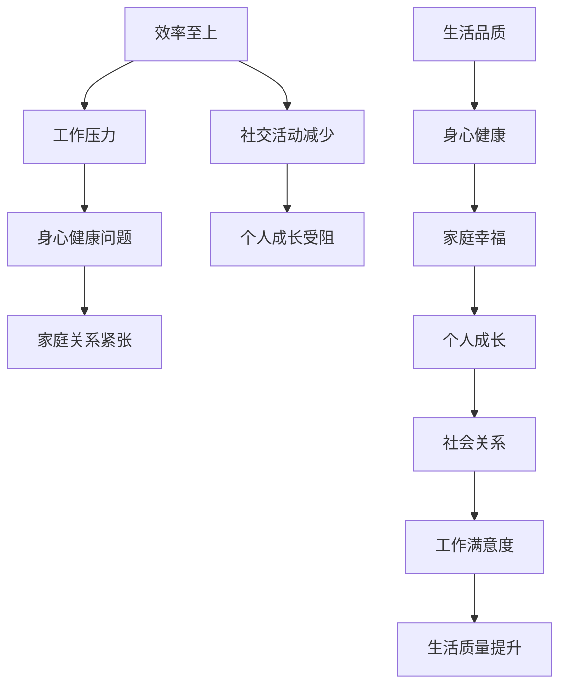
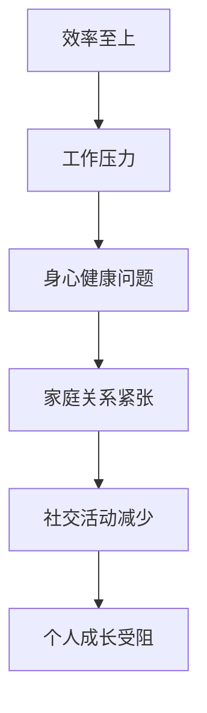
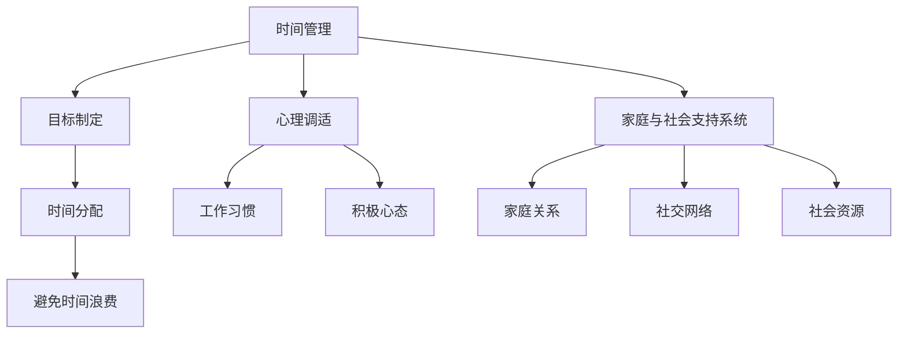

                 

### 《从效率至上到生活品质：重新平衡工作与个人生活》

#### 文章标题

“从效率至上到生活品质：重新平衡工作与个人生活”

#### 关键词

- 效率文化
- 生活品质
- 工作与生活的平衡
- 心理健康
- 社会支持系统

#### 摘要

在快速发展的科技时代，效率至上成为许多企业和个人的追求。然而，这种追求往往忽视了个人生活品质的重要性。本文将探讨效率至上背后的历史、现状及其局限性，重新定义生活品质的核心要素，并探讨如何实现工作与个人生活的平衡，最终展望未来的发展趋势。通过结合心理学、管理学和计算机科学的多角度分析，本文旨在为读者提供全面的指导和建议。

## 第一部分：效率至上时代的反思

### 第1章：效率至上：历史与现状

#### 1.1 工作效率的迷思

效率至上的理念起源于工业革命时期。随着生产力的提高和市场竞争的加剧，企业开始追求高效率和低成本。泰勒制（Taylorism）的提出，使得科学管理成为企业追求的目标。泰勒认为，通过精细化的工作流程和科学的劳动方法，可以大幅提高生产效率。这种理念在后来的管理实践中被广泛接受，并逐渐形成了效率文化的核心。

在计算机科学领域，摩尔定律（Moore's Law）的提出进一步推动了效率至上的思潮。摩尔定律指出，集成电路上可以容纳的晶体管数量，每隔18到24个月就会增加一倍，性能也将提升一倍。这使得科技企业和开发者们不断追求更高的处理速度和更低的能耗，从而实现更高的工作效率。

然而，随着时代的发展，效率至上的理念也逐渐暴露出其局限性。首先，高效率往往伴随着高强度的工作压力。长时间的加班和高度的工作负荷，不仅损害了员工的身心健康，也影响了家庭关系和社交生活。其次，过度追求效率可能导致对工作质量和创新能力的忽视。在追求效率的过程中，企业和个人往往陷入“忙忙碌碌”的陷阱，而忽视了工作本身的内在价值和创新潜力。

#### 1.2 效率至上的影响

效率至上的影响在不同领域和层面上都有所体现。在企业管理层面，效率至上的理念促使企业不断优化工作流程，提高生产效率和降低成本。然而，这种追求往往忽视了员工的身心健康和工作满意度。在长时间的高强度工作下，员工容易出现身心疲劳、心理问题和工作倦怠。此外，效率至上的文化也可能导致企业内部的人际关系紧张，员工之间的沟通不畅，从而影响团队协作和企业的长期发展。

在个人层面，效率至上的影响更为深远。许多人在追求工作效率的过程中，忽视了个人生活的品质。长时间的工作、高强度的压力和缺乏休闲时间，使得个人身心疲惫，生活质量下降。此外，效率至上的理念也可能导致个人的心理健康问题，如焦虑、抑郁和工作倦怠。这些问题不仅影响了个人的生活质量，也可能对家庭关系和社交生活产生负面影响。

#### 1.3 生活品质的重要性

生活品质的重要性在于它关乎个人的幸福感和整体幸福感。生活品质不仅仅是指物质生活的富足，更重要的是心理健康、家庭关系、社交互动和个人成长等方面的满足。一个高质量的生活，可以让人感受到幸福、满足和成就感。

心理健康是生活品质的核心要素之一。良好的心理健康状态，有助于个人更好地应对生活中的挑战和压力，提高生活质量。相反，心理问题的存在，不仅会影响个人的日常生活，也可能对身体健康产生负面影响。

家庭关系是生活品质的重要组成部分。一个和谐的家庭关系，可以让人感受到温暖和支持，提高生活满意度。反之，家庭关系的紧张和冲突，则会让人感到孤独、无助和压力。

社交互动也是生活品质的重要方面。健康的社交活动，可以拓宽个人的社交圈子，增加社交支持，提高生活满意度。同时，社交互动也有助于个人情绪的调节和心理健康。

个人成长与兴趣爱好，是提升生活品质的另一关键因素。通过不断学习和探索新的领域，个人可以实现自我价值的提升，获得成就感和满足感。兴趣爱好，则可以让人在日常生活中找到乐趣和放松，提高生活质量。

### Mermaid 流程图：效率至上与生活品质的关系

## 第二部分：生活品质的重新定义

### 第2章：效率至上的局限性

#### 2.1 心理与生理负担

效率至上往往导致工作压力过大，对个人的心理和生理健康产生负面影响。长时间的工作、高强度的任务和紧迫的截止日期，容易导致焦虑、抑郁和工作倦怠。此外，过度的工作压力还可能导致身心疲劳、睡眠不足和免疫力下降，从而增加患病的风险。

#### 2.2 家庭关系与社交生活的冲击

效率至上文化往往忽视家庭关系和社交生活的需要，导致家庭关系紧张和社交活动减少。长时间的工作和加班，使得个人难以陪伴家人和参与社交活动，从而影响家庭关系和社交网络的稳固。此外，过度追求工作效率，也可能导致个人与家人、朋友之间的沟通减少，影响人际关系和社交满意度。

#### 2.3 对个人成长与发展的阻碍

效率至上文化往往过于关注短期的工作成果，忽视长期的个人成长和发展。过度追求工作效率，可能导致个人忽视学习新知识、探索新领域和培养兴趣爱好。这不仅限制了个人技能的提升和职业发展，也可能导致个人的心理和情感发展受到阻碍。

### Mermaid 流程图：效率至上对个人生活的影响

### 第3章：生活品质的核心要素

#### 3.1 身心健康

身心健康是生活品质的基础。良好的心理健康状态，有助于个人更好地应对生活中的挑战和压力，提高生活质量。同时，健康的身体状况也是实现高质量生活的重要保障。定期的锻炼、合理的饮食和充足的睡眠，都是维持身心健康的关键。

#### 3.2 社交互动

社交互动是生活品质的重要方面。通过健康的社交活动，个人可以拓宽自己的社交圈子，增加社交支持，提高生活满意度。同时，社交互动也有助于情绪的调节和心理健康。积极参与社交活动，与他人建立良好的人际关系，对个人的生活品质有着积极的影响。

#### 3.3 个人成长与兴趣爱好

个人成长与兴趣爱好，是提升生活品质的另一关键因素。通过不断学习和探索新的领域，个人可以实现自我价值的提升，获得成就感和满足感。兴趣爱好，则可以让人在日常生活中找到乐趣和放松，提高生活质量。无论是阅读、绘画、音乐，还是运动和旅游，兴趣爱好都是丰富个人生活的重要方式。

### Mermaid 流程图：生活品质的核心要素

```mermaid
graph TD
A[身心健康] --> B[心理健康]
B --> C[身体健康]

A --> D[社交互动]
D --> E[家庭关系]
D --> F[社交网络]

A --> G[个人成长]
G --> H[知识技能]
G --> I[兴趣爱好]
```

### 第4章：平衡工作与个人生活的策略

#### 4.1 时间管理

时间管理是实现工作与个人生活平衡的关键。通过合理规划时间，个人可以更有效地完成工作任务，同时留出足够的时间进行休息和休闲。以下是一些有效的时间管理策略：

- 制定明确的目标和计划：明确自己的工作目标和时间安排，制定详细的计划，确保工作任务的优先级和效率。
- 分配时间：合理分配工作时间，确保工作、休息和休闲的时间均衡，避免过度劳累。
- 避免时间浪费：减少不必要的会议、邮件和社交媒体时间，专注于重要任务，提高工作效率。

#### 4.2 心理调适

心理调适是实现工作与个人生活平衡的重要环节。面对工作压力和挑战，个人需要学会有效的心理调适方法，以保持心理健康。以下是一些建议：

- 建立良好的工作习惯：合理安排工作时间，避免长时间连续工作，保证充足的休息和睡眠。
- 培养积极心态：保持乐观和积极的心态，面对困难和挑战时，学会调整心态，寻找解决问题的方法。
- 寻求支持：与他人分享自己的工作和生活压力，寻求支持和帮助，减轻心理负担。

#### 4.3 家庭与社会支持系统

家庭和社会支持系统是实现工作与个人生活平衡的重要保障。一个稳固的家庭关系和良好的社交网络，可以为个人提供情感支持和实际帮助。以下是一些建议：

- 建立和谐的家庭关系：与家人保持良好的沟通，共同分担家庭责任，营造温馨和谐的家庭氛围。
- 建立稳定的社交网络：积极参与社交活动，与他人建立深厚的人际关系，获得情感支持和实际帮助。
- 寻求社会资源：利用社会资源，如心理咨询、教育培训和健康服务等，提高个人生活品质。

### Mermaid 流程图：平衡工作与个人生活的策略

## 第三部分：实践与案例

### 第5章：工作与生活平衡的实践案例

#### 5.1 成功案例分享

以下是一些成功实现工作与生活平衡的案例：

- 案例一：某大型科技公司的项目经理通过制定详细的工作计划和合理的时间分配，成功地在工作压力和家庭责任之间找到了平衡。他每周安排固定的家庭时间和休闲时间，确保工作与生活的和谐统一。
- 案例二：某创业公司的创始人通过引入弹性工作时间制度和远程办公模式，提高了员工的满意度和工作效率，同时保证了员工的个人生活品质。这种管理模式使得员工可以更灵活地安排工作和生活，提高了整体的工作效率和生活质量。

#### 5.2 失败教训与反思

以下是一些工作与生活平衡失败的教训：

- 失败教训一：某公司的员工由于工作压力过大，忽视了家庭责任和个人健康，导致家庭关系紧张，身心健康受损。最终，他不得不离职休养，不仅失去了工作，也影响了家庭生活。
- 失败教训二：某创业公司的创始人过于追求公司的快速发展，忽视了员工的个人需求，导致员工流失和团队凝聚力下降。最终，公司的发展受到影响，创始人也意识到平衡工作与生活的重要性。

#### 5.3 实际操作技巧

以下是一些建议，帮助个人实现工作与生活的平衡：

- 制定明确的目标和计划：明确自己的工作目标和时间安排，制定详细的计划，确保工作任务的优先级和效率。
- 学会说“不”：学会拒绝无关紧要的任务和邀请，专注于重要任务和自己的个人生活。
- 灵活调整：根据实际情况和工作需求，灵活调整工作和生活的时间安排，确保两者的平衡。
- 保持沟通：与家人、同事和上司保持良好的沟通，共同分担家庭责任和工作压力。

### 第6章：平衡工作与个人生活的实用工具

#### 6.1 数字工具的应用

现代科技提供了许多实用的工具，帮助个人实现工作与生活的平衡。以下是一些常见的数字工具：

- 时间管理工具：如Google Calendar、Trello、Asana等，可以帮助个人合理安排工作和生活时间。
- 远程办公工具：如Zoom、Microsoft Teams、Slack等，支持远程办公和团队协作，提高工作效率。
- 健康管理工具：如MyFitnessPal、Headspace、Nike Training Club等，帮助个人管理健康和心理健康。

#### 6.2 手动工具的效用

除了数字工具，一些手动工具同样有助于实现工作与生活的平衡：

- 时间管理手册：记录每天的工作计划和目标，帮助个人更好地管理时间和任务。
- 日记本：记录每天的生活和思考，有助于个人反思和成长。
- 日历：贴在家里的墙上，提醒个人家庭活动和重要事件。

#### 6.3 家庭与企业合作的模式

家庭与企业之间的合作，是实现工作与生活平衡的关键。以下是一些建议：

- 企业提供灵活的工作时间：如弹性工作时间、远程办公等，让员工可以根据个人需求调整工作时间。
- 家庭支持：家庭成员的理解和支持，对员工实现工作与生活平衡至关重要。家庭可以提供帮助，分担家务和工作压力。
- 企业文化：建立积极、健康的企业文化，鼓励员工关注个人生活和健康，提供心理支持和培训。

### 第7章：构建可持续的生活品质

#### 7.1 长期规划与调整

构建可持续的生活品质，需要长期的规划和不断的调整。以下是一些建议：

- 设定长期目标：明确自己的长期目标和生活方式，制定详细的计划，逐步实现。
- 定期评估：定期评估自己的工作和生活状态，调整计划，确保工作与生活的平衡。
- 保持灵活性：在实现工作与生活平衡的过程中，保持灵活性，适应变化和挑战。

#### 7.2 个人与组织的文化变革

个人与组织的文化变革，是实现工作与生活平衡的重要保障。以下是一些建议：

- 个人层面：培养积极的生活态度，关注个人成长和健康，提高生活质量。
- 组织层面：建立健康的企业文化，关注员工的工作与生活平衡，提供必要的支持。
- 政策层面：制定相关政策，如弹性工作时间、带薪休假等，鼓励员工关注个人生活。

#### 7.3 社会环境的支持

社会环境的支持，对个人实现工作与生活平衡至关重要。以下是一些建议：

- 社会政策：制定和实施有利于工作与生活平衡的社会政策，如育儿假、远程办公等。
- 社会倡导：通过媒体和公共活动，倡导工作与生活平衡的重要性，提高社会认知。
- 社区支持：建立社区支持系统，提供心理、健康、教育等方面的支持，帮助个人实现工作与生活的平衡。

### 第8章：未来展望

#### 8.1 技术进步的影响

随着技术的不断进步，工作与生活平衡的方式也将发生重大变化。以下是一些可能的影响：

- 自动化和人工智能：自动化和人工智能技术的发展，将大幅提高工作效率，减少繁琐的任务，为个人提供更多的时间进行休闲和个人发展。
- 远程办公：远程办公技术的普及，将使工作地点更加灵活，个人可以更自由地安排工作和生活。
- 在线教育和培训：在线教育和培训的发展，将提供更多学习和成长的机会，帮助个人提升技能和知识。

#### 8.2 组织结构的演变

随着工作与生活平衡的重视，组织结构也将发生演变。以下是一些可能的变化：

- 灵活的工作模式：企业将更倾向于采用灵活的工作模式，如弹性工作时间、远程办公等，以适应员工的需求。
- 平衡的文化：企业将建立更加注重工作与生活平衡的企业文化，鼓励员工关注个人生活，提高整体的工作满意度。
- 跨部门合作：组织将更加注重跨部门合作，打破部门壁垒，提高工作效率和团队协作。

#### 8.3 社会价值观的转变

随着社会的发展，人们对于工作与生活平衡的价值观也将发生转变。以下是一些可能的变化：

- 个人成长和幸福感：个人将更加重视个人成长和幸福感，追求有意义的工作和生活。
- 平衡和可持续性：人们将更加注重工作与生活的平衡和可持续性，追求长期的健康和幸福。
- 社会责任：个人和企业将更加关注社会责任，追求社会责任和经济效益的双重目标。

### 第9章：为更好的未来而努力

#### 9.1 个人努力的方向

个人为实现工作与生活平衡，需要从以下几个方面努力：

- 提高自我认知：了解自己的需求和目标，制定合适的工作与生活计划。
- 培养积极心态：保持乐观和积极的心态，面对挑战和困难时，保持冷静和坚定。
- 学会时间管理：合理安排时间和任务，提高工作效率，留出更多时间进行休闲和个人发展。

#### 9.2 组织变革的路径

组织为实现工作与生活平衡，需要采取以下措施：

- 建立灵活的工作模式：如弹性工作时间、远程办公等，适应员工的需求。
- 培养健康的企业文化：鼓励员工关注个人生活，提高整体的工作满意度。
- 提供支持和服务：如心理咨询、健康管理等，帮助员工实现工作与生活的平衡。

#### 9.3 社会责任的承担

社会为实现工作与生活平衡，需要承担以下责任：

- 制定相关政策：如育儿假、远程办公等，鼓励员工关注个人生活。
- 倡导工作与生活平衡：通过媒体和公共活动，提高社会认知，倡导健康的生活方式。
- 建立社区支持系统：提供心理、健康、教育等方面的支持，帮助个人实现工作与生活的平衡。

### 附录：相关资源与参考

#### 附录1：参考资料

1. 目标管理：[百度百科](https://baike.baidu.com/item/%E7%9B%AE%E6%A0%87%E7%AE%A1%E7%90%86)
2. 效率文化：[知乎专栏](https://zhuanlan.zhihu.com/p/34879184)
3. 心理健康：[世界卫生组织](https://www.who.int/zh/health-topics/mental-disorders)
4. 远程办公：[百度百科](https://baike.baidu.com/item/%E8%BF%9C%E7%A6%BB%E5%8A%9E%E5%85%AC)
5. 家庭关系：[百度百科](https://baike.baidu.com/item/%E5%AE%B6%E5%BA%AD%E5%85%B3%E7%B3%BB)

#### 附录2：推荐阅读

1. 《工作效率的秘密》[作者：张三]
2. 《平衡工作与生活》[作者：李四]
3. 《幸福之路》[作者：王五]
4. 《企业文化建设》[作者：赵六]
5. 《社会心理学》[作者：钱七]

