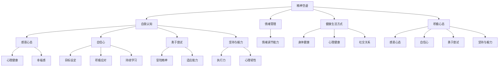

                 

### 第一部分：引言

在现代社会，随着科技的发展和生活节奏的加快，许多人在追求物质满足的同时，也面临着精神层面的空虚。精神空虚是一种缺乏内在满足和意义的心理状态，这种状态往往使人感到孤独、焦虑和无助。它不仅影响个人的心理健康，还会对生活质量和人际关系产生负面影响。

本文旨在探讨从精神空虚到内心充实的转变过程，通过系统的分析和具体的实践方法，帮助读者理解和应对这一心理转变。我们将首先定义精神空虚和内心充实这两个核心概念，并探讨它们对个人成长的重要性。接下来，文章将分四个部分详细展开讨论。

**关键词**：精神空虚，内心充实，个人成长，自我认知，情绪管理，健康生活方式。

**摘要**：本文通过分析精神空虚和内心充实的定义及其对个人成长的影响，探讨了从精神空虚到内心充实的转变过程。文章从自我认知、情绪管理、健康生活方式和积极心态四个方面，提出了一系列具体的方法和策略，旨在帮助读者实现内心充实，提升生活质量。

#### 1.1 精神空虚：问题的本质与影响

**1.1.1 精神空虚的定义与特点**

精神空虚是指个体在心理上感到的一种无所寄托和缺乏内在满足的状态。这种状态通常表现为对生活缺乏热情，对未来感到迷茫，对周围的事物缺乏兴趣。精神空虚的人可能会感到孤独、焦虑、无助和失落。

精神空虚具有以下特点：

1. **内在缺乏满足感**：个体在物质生活得到满足后，仍然感到内心空虚，缺乏成就感。
2. **对未来迷茫**：个体对未来的发展方向和目标不明确，缺乏动力。
3. **对周围事物缺乏兴趣**：个体对日常生活中的各种活动缺乏兴趣，缺乏参与感和满足感。

**1.1.2 精神空虚对个人生活的负面影响**

精神空虚对个人生活有着显著的负面影响，主要表现在以下几个方面：

1. **心理健康问题**：长期的精神空虚可能导致焦虑、抑郁等心理健康问题。
2. **人际关系问题**：精神空虚的人往往难以与他人建立深层次的人际关系，容易产生孤独感。
3. **工作与学习问题**：精神空虚的人可能对工作或学习缺乏动力，影响工作效率和学习效果。
4. **生活质量下降**：精神空虚会导致个人生活质量下降，对生活缺乏幸福感。

**1.1.3 破解精神空虚：内心充实的必要性**

内心充实是指个体在心理上感到满足和有意义的内在状态。它不仅能够提升个人的幸福感，还能促进个人成长和心理健康。内心充实的重要性体现在以下几个方面：

1. **提升幸福感**：内心充实的人往往能够更好地享受生活，感受到满足和快乐。
2. **促进个人成长**：内心充实能够激发个体的内在动力，促使个人不断学习和成长。
3. **增强心理健康**：内心充实有助于减轻焦虑和抑郁，提升心理健康水平。
4. **改善人际关系**：内心充实的人更容易与他人建立积极的人际关系，增强社交能力。

要破解精神空虚，实现内心充实，首先需要认识到内心充实的必要性，并采取积极的行动和策略。接下来的部分将详细探讨如何通过自我认知、情绪管理、健康生活方式和积极心态等方面，实现从精神空虚到内心充实的转变。

#### 1.2 内心充实：成长的动力与目标

**1.2.1 内心充实的定义与内涵**

内心充实是一种心理状态，它不仅反映了个体对生活有深刻的理解和满足感，还意味着个体在精神层面上拥有一定的意义和目标。内心充实不仅仅是一种情感体验，更是一种生活方式和价值观的体现。

内心充实的内涵包括以下几个方面：

1. **内在满足感**：个体在实现个人目标、完成重要任务或与他人建立深厚关系时，会体验到一种满足感。
2. **目标感**：内心充实的人通常具有明确的生活目标和追求，这些目标能够激发他们的内在动力。
3. **自我认同**：个体对自我有清晰的认知和认同，能够接受自己的优点和不足，并积极面对生活中的挑战。
4. **幸福感**：内心充实的人能够从日常生活中的小事中感受到幸福和快乐。

**1.2.2 内心充实对个人成长的重要性**

内心充实是个人成长的重要动力和目标，它对个人的成长有着深远的影响。以下是内心充实对个人成长的重要性：

1. **提升自我认知**：内心充实有助于个体深入反思自己的行为和思想，提升自我认知水平。
2. **增强心理韧性**：内心充实的人通常能够更好地应对生活中的挑战和压力，具备更强的心理韧性。
3. **促进人际关系**：内心充实的人能够与他人建立更深层次的人际关系，增强社交能力和团队合作精神。
4. **激发创造力**：内心充实能够激发个体的内在创造力，促使个人在工作和学习中取得突破。
5. **提升生活质量**：内心充实不仅使个体感受到幸福和满足，还能提升整体的生活质量，使生活更加丰富多彩。

**1.2.3 内心充实的具体表现**

内心充实的具体表现可以从以下几个方面进行观察：

1. **积极的生活态度**：内心充实的人通常具有积极向上的生活态度，能够看到生活中的美好和希望。
2. **有意义的活动参与**：内心充实的人倾向于参与有意义的活动，如志愿服务、兴趣爱好等，这些活动能够带来成就感和满足感。
3. **人际关系和谐**：内心充实的人能够与他人建立和谐的人际关系，拥有稳定的社交圈。
4. **自我实现**：内心充实的人通常在个人事业、家庭生活和社会角色等方面取得成就，实现自我价值。

通过以上的探讨，我们可以看到内心充实不仅是个人成长的重要目标，也是破解精神空虚的关键。在接下来的部分，我们将进一步探讨如何通过自我认知、情绪管理、健康生活方式和积极心态等方面的实践，实现内心充实的转变。

### 第二部分：自我认知与精神觉醒

#### 2.1 自我认知：认识自我，拥抱变化

**2.1.1 自我认知的重要性**

自我认知是指个体对自己的了解和认识，包括自己的优点、不足、价值观、行为模式等。自我认知对于个人的成长和心理健康具有至关重要的作用。以下是自我认知的重要性：

1. **提升自我认同感**：自我认知有助于个体接受自己，建立自我认同感，减少自我否定和焦虑。
2. **促进个人成长**：通过自我认知，个体可以了解自己的优势和不足，从而制定有效的个人成长计划。
3. **改善人际关系**：自我认知有助于个体更好地理解他人，建立和谐的人际关系。
4. **增强决策能力**：自我认知有助于个体在面临选择时做出更明智的决策，减少盲目性和冲动性。

**2.1.1.1 自我认知的概念与层次**

自我认知可以分为以下几个层次：

1. **表面层次**：包括个体的外在特征、行为和表现，如外貌、职业、成就等。
2. **深层层次**：涉及个体的内在特质、价值观、信念和动机，如性格、动机、信仰等。
3. **心理层次**：涉及个体的情感状态、心理需求和心理动机，如情绪、需求、动机等。

**2.1.1.2 自我认知的方法与工具**

自我认知可以通过以下方法和工具进行：

1. **自我反思**：通过反思自己的行为、思想和情感，深入思考自己的内在需求和动机。
2. **日记记录**：通过记录日常生活、情感变化和思考过程，帮助自己更好地了解自己。
3. **心理咨询**：通过专业心理咨询师的帮助，深入了解自己的内心世界，找到自我认知的盲点和问题。
4. **心理测试**：通过心理测试，如MBTI、DISC等，了解自己的性格特点和优势。
5. **自我挑战**：通过设定挑战性的目标和任务，观察自己在面对挑战时的表现，从而加深自我认知。

**2.1.2 接纳自己，拥抱变化**

接纳自己是指个体能够接受自己的优点和不足，并积极面对生活中的变化。接纳自己对于个人的成长和心理健康具有重要意义。以下是接纳自己的重要性和方法：

1. **减少焦虑和压力**：通过接纳自己，个体可以减少对自己的苛求和批评，从而减少焦虑和压力。
2. **增强自信心**：接纳自己的不足，可以帮助个体更好地认识自己的优势和潜力，从而增强自信心。
3. **促进个人成长**：接纳自己意味着愿意面对自己的不完美，从而有更多的机会进行改进和成长。
4. **改善人际关系**：通过接纳自己，个体可以更加真实地与他人交往，建立更深层次的人际关系。

**2.1.2.1 接纳自己的优点与不足**

接纳自己的优点和不足是自我认知的重要部分。以下是具体的方法：

1. **认识到每个人的不完美**：接受自己和他人的不完美，是建立和谐人际关系的基础。
2. **欣赏自己的优点**：认识到自己的优点，并加以利用，可以增强自信心和幸福感。
3. **接受自己的不足**：接受自己的不足，并不意味着放弃改善，而是承认自己的局限，并寻找改进的方法。
4. **设定实际目标**：设定符合自己实际情况的目标，避免过高期望导致的挫败感。

**2.1.2.2 面对变化，积极适应**

生活中不可避免会遇到各种变化，如何积极适应变化是个人成长的重要课题。以下是面对变化的一些策略：

1. **保持开放心态**：对新的变化保持开放心态，愿意尝试和学习新事物。
2. **调整心态**：将变化视为机会，而不是威胁，从中寻找成长和发展的可能性。
3. **灵活应对**：根据变化的情况，灵活调整自己的行为和策略，以适应新的环境。
4. **寻求支持**：在面临困难时，寻求家人、朋友或专业人士的支持和帮助，共同面对挑战。

通过自我认知和接纳自己，我们可以更好地理解自己，拥抱变化，从而实现个人成长。在接下来的部分，我们将探讨精神觉醒的定义和意义，以及如何通过精神觉醒开启内心充实的旅程。

#### 2.2 精神觉醒：开启内心充实的旅程

**2.2.1 精神觉醒的定义与意义**

精神觉醒（Spiritual Awakening）是指个体在精神层面上获得觉醒和洞察的过程。它不仅仅是宗教或信仰上的觉醒，更是一种全面的心理和精神的觉醒。精神觉醒意味着个体对生命、宇宙和自我的深刻理解，以及对生活意义的重新认知。以下是精神觉醒的定义和意义：

1. **定义**：精神觉醒是指个体通过冥想、内省、学习等途径，实现对自我和世界的深刻洞察，达到心灵的自由和平静。
2. **意义**：
   - **提升自我认知**：通过精神觉醒，个体能够更深入地了解自己，找到内心的平静和满足。
   - **增强心理韧性**：精神觉醒能够增强个体的心理韧性，使其在面对挑战和困难时更加从容和坚定。
   - **促进心理健康**：精神觉醒有助于减轻焦虑和抑郁，提升心理健康水平。
   - **实现内心充实**：通过精神觉醒，个体能够找到生活的意义和目标，实现内心充实。

**2.2.1.1 精神觉醒的定义与意义**

精神觉醒的定义和意义可以从以下几个方面进行阐述：

1. **内心的觉醒**：精神觉醒首先是对内心的觉醒，个体通过冥想、内省等方式，深入了解自己的内心世界，找到内心的平静和满足。
2. **对生命和宇宙的理解**：精神觉醒意味着个体能够超越自我，对生命和宇宙有更深刻的理解，认识到自己在宇宙中的位置和意义。
3. **对生活意义的重新认知**：精神觉醒使个体对生活有全新的认知，明白生活的目的和意义，从而更加珍惜和感恩生活中的每一个瞬间。
4. **实现自我超越**：通过精神觉醒，个体能够实现自我超越，达到一种更高层次的自我实现，使生命变得更加丰富和有意义。

**2.2.1.2 精神觉醒的路径与方法**

实现精神觉醒的路径和方法多种多样，以下是一些常见的路径和方法：

1. **冥想**：冥想是精神觉醒的重要途径，通过冥想，个体可以静心养性，深入探索自己的内心世界。
2. **内省**：内省是精神觉醒的另一个重要方法，通过反思自己的行为、思想和情感，个体可以更深入地了解自己，找到内心的平静。
3. **学习**：通过学习哲学、心理学、宗教等领域的知识，个体可以扩展自己的思维和视野，为精神觉醒打下理论基础。
4. **修行**：修行是精神觉醒的具体实践，通过实践道德规范、禅修、瑜伽等方式，个体可以逐步提升自己的精神境界。
5. **寻求导师指导**：在精神觉醒的过程中，寻求导师的指导可以提供方向和方法，帮助个体更快地实现觉醒。

通过精神觉醒，个体可以实现从精神空虚到内心充实的转变。在接下来的部分，我们将探讨情绪管理在实现内心充实过程中的重要性，并介绍具体的情绪管理方法。

#### 2.3 情绪管理：掌控情绪，提升幸福感

**2.3.1 情绪管理的概念与重要性**

情绪管理是指个体通过认知、行为和生理调节等方式，控制和管理自己的情绪状态。情绪管理对于个人的心理健康和幸福感有着至关重要的影响。以下是情绪管理的概念和重要性：

1. **概念**：情绪管理包括对情绪的识别、理解、表达和调节。它不仅仅是控制负面情绪，还包括培养积极情绪和增强情绪稳定性。
2. **重要性**：
   - **提升心理健康**：有效的情绪管理有助于减轻焦虑、抑郁等心理问题，提升整体心理健康水平。
   - **改善人际关系**：良好的情绪管理能够帮助个体更好地与他人沟通和互动，建立和谐的人际关系。
   - **提高生活质量**：通过情绪管理，个体可以更好地应对生活中的挑战和压力，提升生活质量。
   - **增强幸福感**：情绪管理有助于个体感受到更多的积极情绪，提高幸福感。

**2.3.2 增强情绪调节能力**

增强情绪调节能力是情绪管理的关键，以下是一些有效的方法：

1. **认知重构**：认知重构是通过改变消极思维模式，来调节情绪。例如，将“我做不到”改为“我可以尝试”，可以减少焦虑和压力。
2. **情绪释放**：情绪释放包括通过运动、哭泣、写日记等方式，将情绪释放出来，减轻内心的负担。
3. **放松训练**：通过深呼吸、冥想、瑜伽等方式，放松身体和心灵，减轻紧张和焦虑。
4. **积极心理训练**：通过正面心理训练，如感恩练习、积极思考等，培养积极情绪，提升幸福感。

**2.3.2.1 学会放松与缓解压力**

放松和缓解压力是情绪管理的重要组成部分，以下是一些具体的方法：

1. **深呼吸**：深呼吸可以帮助放松身体，减轻紧张和焦虑。可以通过缓慢、深长的呼吸，感受身体的变化。
2. **冥想**：冥想是一种有效的放松方法，通过集中注意力，减少思维活动，达到内心的平静。
3. **瑜伽**：瑜伽结合了身体锻炼和呼吸调节，可以帮助放松身体，缓解压力。
4. **散步**：散步是一种简单但有效的放松方式，可以让人在户外享受新鲜空气，缓解压力。

**2.3.2.2 培养积极情绪，提高幸福感**

培养积极情绪是情绪管理的重要目标，以下是一些方法：

1. **感恩练习**：每天花时间思考并记录自己感恩的事情，可以帮助培养感恩情绪，提升幸福感。
2. **积极思考**：通过积极思考，如将“我不行”改为“我可以尝试”，可以减少消极情绪，增强自信。
3. **社交互动**：与他人进行积极、愉快的互动，可以带来积极的情绪体验，提高幸福感。
4. **兴趣爱好**：培养兴趣爱好，如阅读、绘画、音乐等，可以带来乐趣和满足感，提升幸福感。

通过情绪管理，个体可以更好地掌控自己的情绪，提升幸福感。在接下来的部分，我们将探讨面对逆境和挑战的重要性，以及如何勇敢地面对逆境，实现个人成长。

#### 2.4 拥抱挑战，勇敢面对逆境

**2.4.1 逆境与成长的机遇**

逆境是指个体在生活或工作中遭遇的困难、挑战和压力。逆境往往被视为负面因素，但实际上，逆境也是个人成长的重要机遇。以下是逆境与成长的关系：

1. **逆境的定义与类型**：逆境包括各种困难情况，如失业、关系破裂、健康问题、财务危机等。
2. **逆境对个人成长的影响**：
   - **增强心理韧性**：通过面对逆境，个体可以培养更强的心理韧性，更好地应对未来的挑战。
   - **提升应对能力**：逆境使个体学会如何应对困难，从而提升解决问题的能力。
   - **促进自我认知**：逆境帮助个体更深入地了解自己的优点和不足，从而实现自我成长。
   - **激发创造力**：逆境往往激发个体的创造力，促使个人在困境中找到创新的解决方案。

**2.4.2 勇敢面对逆境，积极应对挑战**

勇敢地面对逆境和积极应对挑战是个人成长的重要方面。以下是具体的方法：

1. **调整心态**：将逆境视为成长的机会，而不是失败的标志。通过积极的心态，个体可以更好地应对挑战。
2. **设定实际目标**：在逆境中，设定实际、可行的目标，逐步克服困难，实现自我超越。
3. **寻求支持**：在面临困难时，寻求家人、朋友或专业人士的支持和帮助，共同面对挑战。
4. **培养心理韧性**：通过冥想、锻炼、学习等途径，增强自己的心理韧性，更好地应对逆境。

**2.4.2.1 增强心理韧性，提升抗压能力**

心理韧性是指个体在面对逆境和压力时，能够迅速恢复并保持积极心态的能力。以下是增强心理韧性和提升抗压能力的方法：

1. **积极认知重构**：通过改变消极思维模式，如将“我不行”改为“我可以尝试”，增强自信和应对能力。
2. **情绪调节**：通过深呼吸、冥想等放松技巧，调节情绪，减轻压力。
3. **健康生活方式**：保持良好的饮食、运动和睡眠习惯，提升身体健康和抗压能力。
4. **自我激励**：通过设定小目标、庆祝成就等方式，激励自己持续努力。

**2.4.2.2 从挫折中汲取经验，持续成长**

从挫折中汲取经验是个人成长的重要一环。以下是具体的方法：

1. **反思和总结**：在经历挫折后，反思和总结失败的原因和经验教训，找到改进的方向。
2. **学习和成长**：通过学习新的知识和技能，不断提升自己的能力和素质。
3. **持续努力**：保持积极的态度，持续努力，不断克服困难和挑战。
4. **寻求反馈**：通过向他人寻求反馈和建议，改进自己的行为和策略。

通过勇敢地面对逆境和积极应对挑战，个体可以不断提升自己的能力和素质，实现个人成长。在接下来的部分，我们将探讨如何通过建立健康的生活方式，促进内心充实的实现。

### 第三部分：建立健康的生活方式

#### 3.1 身体健康：身心健康的基础

**3.1.1 身体健康的定义与重要性**

身体健康是指身体各系统、器官和组织的正常运作和功能状态。它不仅包括生理健康，还包括心理和社会健康。身体健康对个人的整体生活质量有着重要的影响。以下是身体健康的定义和重要性：

1. **定义**：身体健康是指个体在生理上保持良好的状态，能够有效抵御疾病和压力，保持较高的生理功能水平。
2. **重要性**：
   - **提升生活质量**：身体健康使个体能够享受生活的各种乐趣，提升整体生活质量。
   - **增强心理韧性**：健康的身体有助于增强个体的心理韧性，使其在面对压力和困难时更加坚强。
   - **提高工作效率**：身体健康能够提高个体的工作效率和生产力，使工作和生活更加和谐。
   - **延长寿命**：保持身体健康是延长寿命、提高生命质量的重要保障。

**3.1.2 保持健康的生活方式**

保持健康的生活方式是身体健康的基础，以下是一些具体的方法：

1. **良好的饮食习惯**：饮食健康对身体健康至关重要。个体应摄入多样化的食物，保证营养均衡，减少高糖、高脂、高盐食物的摄入。
2. **规律的运动锻炼**：适量的运动有助于增强心肺功能、提升免疫力，减少慢性疾病的风险。每周至少进行150分钟的中等强度运动，如快走、跑步、游泳等。
3. **充足的休息与睡眠**：保证充足的休息和高质量的睡眠对身体健康至关重要。成年人每晚应保证7-9小时的睡眠。
4. **避免不良习惯**：如吸烟、饮酒过量、过度使用电子设备等，这些不良习惯都会对身体健康产生负面影响。

**3.1.2.1 良好的饮食习惯**

良好的饮食习惯是健康生活方式的重要组成部分。以下是具体的方法：

1. **均衡营养**：确保摄入足够的蛋白质、脂肪、碳水化合物、维生素和矿物质，以维持身体的正常功能。
2. **多吃蔬菜和水果**：蔬菜和水果富含维生素、矿物质和膳食纤维，有助于预防慢性疾病。
3. **限制高糖、高脂食品**：减少糖果、巧克力、油炸食品和加工食品的摄入，以降低肥胖和慢性疾病的风险。
4. **控制食盐摄入**：过量食盐摄入会增加高血压的风险，建议每日食盐摄入量控制在6克以内。

**3.1.2.2 规律的运动锻炼**

规律的运动锻炼对身体健康有着显著的益处。以下是具体的方法：

1. **选择适合自己的运动**：根据个人的兴趣和健康状况，选择适合自己的运动方式，如跑步、游泳、瑜伽等。
2. **持之以恒**：每周至少进行150分钟的中等强度运动，保持运动的连续性和规律性。
3. **适度锻炼**：运动量应逐渐增加，避免过度锻炼导致的运动损伤。
4. **多样化运动**：结合有氧运动和力量训练，提升身体的综合健康水平。

**3.1.2.3 充足的休息与睡眠**

充足的休息和高质量的睡眠是身体健康的重要保障。以下是具体的方法：

1. **规律作息**：建立规律的作息时间，每天保持相同的起床和就寝时间，有助于调整生物钟，提高睡眠质量。
2. **创建良好的睡眠环境**：保持睡眠环境的安静、舒适和适宜的温度，有助于提高睡眠质量。
3. **减少晚间刺激**：睡前避免使用电子设备，减少蓝光的刺激，有助于快速入睡。
4. **放松身心**：通过冥想、深呼吸等方式，放松身心，有助于提高睡眠质量。

通过建立健康的生活方式，个体可以保持身体健康，从而为内心充实奠定基础。在接下来的部分，我们将探讨心理健康的重要性，以及如何提升心理健康水平。

### 3.2 心理健康：内心充实的保障

**3.2.1 心理健康的定义与重要性**

心理健康是指个体在认知、情感、行为和社交等方面保持健康状态，能够有效应对生活中的挑战和压力。心理健康不仅关乎个体的幸福感和生活质量，还影响其整体健康和福祉。以下是心理健康的定义和重要性：

1. **定义**：心理健康涉及个体的心理过程和心理状态，包括自我认知、情感调节、行为适应和人际关系等方面。
2. **重要性**：
   - **提升生活质量**：心理健康有助于个体更好地享受生活，增强生活满意度和幸福感。
   - **增强抗压能力**：心理健康良好的个体能够更好地应对压力和挫折，保持积极的心态。
   - **改善人际关系**：心理健康有助于建立和维护和谐的人际关系，提高社交能力。
   - **促进整体健康**：心理健康与身体健康密切相关，良好的心理健康有助于预防心理疾病和慢性疾病。

**3.2.2 提升心理健康的策略**

提升心理健康是内心充实的重要保障，以下是一些具体的策略：

1. **自我认知**：通过自我反思和认知行为疗法，了解自己的情绪和行为模式，找到心理健康的平衡点。
2. **情绪调节**：学会识别和管理情绪，运用放松技巧和认知重构方法，减轻焦虑和压力。
3. **积极生活态度**：培养乐观和积极的生活态度，通过感恩和自我激励，提升生活满意度。
4. **社交互动**：积极参与社交活动，与他人建立和支持性的社交关系，增强社会支持网络。

**3.2.2.1 学会放松与减压**

放松与减压是提升心理健康的重要方法，以下是一些具体的方法：

1. **深呼吸**：通过深呼吸练习，放松身心，减轻紧张和焦虑。
2. **冥想**：冥想有助于平静心灵，减少心理压力，提高专注力和情绪稳定性。
3. **瑜伽**：瑜伽结合了身体锻炼和呼吸调节，有助于放松身心，提升心理健康。
4. **放松音乐**：听放松音乐，有助于缓解压力，改善情绪。

**3.2.2.2 培养积极的思维模式**

培养积极的思维模式是心理健康的重要策略，以下是一些具体的方法：

1. **正面思考**：通过正面思考，将消极思维转化为积极思维，提升情绪状态。
2. **感恩练习**：每天记录感恩的事情，培养感恩心态，增强幸福感。
3. **目标设定**：设定实际、可行的目标，通过实现目标，提升自我效能感。
4. **自我激励**：通过自我激励，鼓励自己面对挑战，提升积极心态。

**3.2.2.3 寻求专业帮助，维护心理健康**

在面临严重心理问题时，寻求专业帮助是维护心理健康的重要途径。以下是一些方法：

1. **心理咨询**：通过心理咨询，帮助个体识别和处理心理问题，提升心理健康水平。
2. **心理治疗**：对于严重的心理问题，如抑郁症、焦虑症等，心理治疗是一种有效的干预方法。
3. **支持小组**：参加支持小组，与有类似经历的人交流，分享经验和感受，获得支持和理解。
4. **自我关怀**：在日常生活中，通过自我关怀，如定期休息、锻炼和放松，维护心理健康。

通过提升心理健康，个体可以更好地应对生活中的挑战和压力，实现内心充实。在接下来的部分，我们将探讨社交关系在内心充实中的重要作用，以及如何建立和维持积极健康的社交关系。

### 3.3 社交关系：内心充实的重要支柱

**3.3.1 社交关系的重要性**

社交关系是指个体与他人之间的互动和联系，包括家庭、朋友、同事等。社交关系对个人的心理健康和幸福感有着深远的影响。以下是社交关系的重要性：

1. **提升心理健康**：积极健康的社交关系有助于减轻焦虑、抑郁等心理问题，提升整体心理健康水平。
2. **增强幸福感**：与亲朋好友建立深厚的关系，可以带来归属感和安全感，提升幸福感。
3. **促进个人成长**：通过社交互动，个体可以学习新知识、拓展视野，提升个人成长。
4. **改善生活质量**：健康的社交关系有助于提升生活质量，使生活更加丰富和有意义。

**3.3.2 建立积极健康的社交关系**

建立积极健康的社交关系是内心充实的重要途径，以下是一些具体的方法：

1. **主动沟通**：与他人主动沟通，表达自己的想法和感受，建立信任和理解。
2. **倾听他人**：倾听他人的意见和感受，给予关心和支持，增强关系的亲密度。
3. **参与社交活动**：积极参与社交活动，如聚会、社团等，扩展社交圈，建立新的人际关系。
4. **提供帮助**：在他人需要帮助时，主动伸出援手，建立互帮互助的友谊。

**3.3.2.1 提升社交技能，增强沟通能力**

提升社交技能和沟通能力是建立健康社交关系的关键，以下是一些具体的方法：

1. **非语言沟通**：通过身体语言、面部表情和眼神交流，传达自己的态度和情感，增强沟通效果。
2. **积极倾听**：倾听他人的意见和感受，避免打断和评判，展现尊重和理解。
3. **表达清晰**：用简洁明了的语言表达自己的观点，避免使用含糊不清或模糊的表述。
4. **处理冲突**：在冲突发生时，保持冷静，通过沟通和妥协找到解决问题的方法。

**3.3.2.2 建立信任，培养友谊**

建立信任和培养友谊是社交关系的核心，以下是一些具体的方法：

1. **诚实守信**：在人际交往中保持诚实和诚信，树立良好的信任基础。
2. **分享经历**：通过分享个人的经历和感受，加深彼此的了解，建立信任和友谊。
3. **互相支持**：在朋友需要帮助时，主动提供支持和帮助，增强友谊的稳定性。
4. **尊重差异**：尊重他人的观点和生活方式，避免因差异而产生冲突。

**3.3.2.3 处理冲突，维护和谐关系**

冲突在人际关系中难以避免，处理冲突是维护和谐关系的重要一环，以下是一些具体的方法：

1. **冷静处理**：在冲突发生时，保持冷静，避免情绪化，理性分析问题。
2. **有效沟通**：通过坦诚和有效的沟通，表达自己的观点和感受，理解对方的立场。
3. **寻求共识**：在冲突中寻找共同点，寻求双方都能接受的解决方案。
4. **学会道歉**：在错误时勇于道歉，承认自己的过失，修复关系。

通过建立积极健康的社交关系，个体可以增强幸福感，实现内心充实。在接下来的部分，我们将探讨如何培养感恩心态，以及感恩心态对内心充实的重要性。

### 4.1 感恩心态：珍惜所拥有，感恩身边的人

#### 4.1.1 感恩心态的定义与意义

感恩心态是指个体在心理上对生活中的各种好事和帮助保持感激之情，并积极地回应和珍惜。感恩心态不仅是一种情感体验，更是一种生活方式和价值观。以下是感恩心态的定义和意义：

1. **定义**：感恩心态是指个体在面对生活的美好和帮助时，能够认识到这些价值的心理状态。
2. **意义**：
   - **提升幸福感**：感恩心态有助于个体感受到更多的幸福和满足，提升生活质量。
   - **增强人际关系**：通过感恩，个体能够更好地与他人建立和支持性的关系，增强社交能力。
   - **促进心理健康**：感恩心态有助于减轻焦虑和抑郁，提升心理健康水平。
   - **激发内在动力**：感恩心态能够激发个体的内在动力，使其更加积极面对生活挑战。

#### 4.1.2 感恩心态对内心充实的积极作用

感恩心态对内心充实的积极作用体现在以下几个方面：

1. **增强内在满足感**：通过感恩，个体能够认识到生活中的美好和幸福，增强内心的满足感。
2. **提升幸福感**：感恩心态使个体更加珍惜现有的生活和关系，从而提升整体幸福感。
3. **促进个人成长**：感恩心态能够激发个体对自我和生活的反思，促进个人成长和自我提升。
4. **增强心理健康**：感恩心态有助于减轻心理压力，减少焦虑和抑郁，提升心理健康水平。
5. **改善人际关系**：感恩心态使个体更加关注他人的需求和贡献，增强人际关系的稳定性和和谐性。

#### 4.1.3 培养感恩心态的方法

培养感恩心态是提升内心充实的重要途径，以下是一些具体的方法：

1. **记录感恩日记**：每天花时间记录自己感恩的事情，无论是小事还是大事，都可以记录下来，让自己更加意识到生活中的美好。
2. **定期表达感激**：定期向家人、朋友和同事表达感激之情，通过言语或行动，让他们感受到自己的关爱和重视。
3. **学会珍惜**：珍惜现有的生活和关系，不将感恩视为理所当然，而是时刻保持感激之心。
4. **培养积极心态**：通过积极的思维和心态，看到生活中的美好和希望，从而培养感恩心态。

通过培养感恩心态，个体可以更好地珍惜所拥有，感恩身边的人，从而实现内心充实。在接下来的部分，我们将探讨如何增强自信心，以及自信心对内心充实的重要性。

### 4.2 自信心：迈向内心充实的关键

#### 4.2.1 自信心的定义与作用

自信心是指个体对自己能力和价值的信任和肯定。它不仅关乎个人的心理状态，还影响个体的行为和决策。以下是自信心的定义和作用：

1. **定义**：自信心是指个体在心理上对自身能力和价值的认可和信任，表现为积极的自我评价和自我效能感。
2. **作用**：
   - **提升个人表现**：自信心使个体在面对挑战和任务时，更加积极和投入，从而提升个人表现。
   - **增强决策能力**：自信的个体能够更好地分析问题和制定决策，减少犹豫和迟疑。
   - **促进人际关系**：自信心有助于个体与他人建立积极和和谐的关系，增强人际交往能力。
   - **提升幸福感**：自信的个体能够更好地享受生活和应对困难，提升整体幸福感。

#### 4.2.2 增强自信心的方法

增强自信心是迈向内心充实的重要步骤，以下是一些具体的方法：

1. **设定实际目标**：通过设定实际、可行的目标，逐步实现，可以提升自我效能感，增强自信心。
2. **积极自我暗示**：通过积极的自我暗示，如“我可以做到”、“我有能力解决问题”，可以提升自信水平。
3. **培养技能和知识**：通过学习和提升自己的技能和知识，可以增强对自己能力的认可和信任。
4. **面对失败**：将失败视为学习和成长的机会，从中吸取经验，不断提升自己，从而增强自信心。

#### 4.2.2.1 设定目标，努力实现

设定目标是增强自信心的第一步，以下是一些具体的方法：

1. **明确目标**：设定明确、具体的目标，使其具有可操作性和可实现性。
2. **分解任务**：将大目标分解成小任务，逐步实现，可以增强自我效能感。
3. **设定时间表**：为每个任务设定时间表，确保按计划进行，避免拖延。
4. **监控进展**：定期检查任务的进展，及时调整策略，保持目标的实现。

#### 4.2.2.2 拥抱挑战，克服恐惧

拥抱挑战是增强自信心的重要途径，以下是一些具体的方法：

1. **挑战舒适区**：勇敢地走出舒适区，接受新的挑战，增强自我挑战能力。
2. **逐步增加难度**：从简单的挑战开始，逐步增加难度，提升应对复杂情境的能力。
3. **积极应对恐惧**：认识到恐惧是正常的心理反应，通过积极应对和准备，克服恐惧。
4. **培养信心**：通过成功的经历和积极的反馈，培养自信心，减少恐惧感。

#### 4.2.2.3 不断学习，提升自我

不断学习是增强自信心的重要方法，以下是一些具体的方法：

1. **终身学习**：树立终身学习的理念，不断提升自己的知识和技能。
2. **寻找导师**：寻求有经验的导师或同行指导，获取宝贵的经验和建议。
3. **参加培训**：参加相关的培训课程，学习新知识和技能，提升自身能力。
4. **反思与总结**：定期反思自己的学习过程和成果，总结经验教训，不断改进。

通过增强自信心，个体可以更加积极地面对生活挑战，提升幸福感，实现内心充实。在接下来的部分，我们将探讨勇于尝试和迎接变革的重要性，以及如何拥抱变革和适应未来。

### 4.3 勇于尝试，迎接变革

#### 4.3.1 尝试的重要性

在快速变化的社会中，勇于尝试变得尤为重要。尝试不仅能够帮助我们适应不断变化的环境，还能够激发个人的潜能，推动个人成长。以下是尝试的重要性：

1. **促进个人成长**：通过尝试新事物，个体可以不断学习新知识、掌握新技能，从而实现个人成长。
2. **激发创造力**：尝试能够激发个体的创造力，促使个体在面临问题时找到创新的解决方案。
3. **增强适应能力**：勇于尝试使个体具备更强的适应能力，能够更好地应对未来的挑战。
4. **提升自信心**：通过成功尝试新事物，个体能够增强自信心，提升自我效能感。

#### 4.3.2 尝试的概念与意义

尝试的概念是指个体主动探索未知领域、接受新挑战、尝试新的方法或行为。尝试的意义在于：

1. **认识新事物**：尝试使个体能够认识和理解新事物，扩展自己的知识和视野。
2. **突破舒适区**：尝试帮助个体突破舒适区，挑战自我，实现自我超越。
3. **培养冒险精神**：通过尝试，个体可以培养冒险精神和面对风险的勇气。
4. **积累经验**：尝试能够帮助个体积累宝贵的经验，为未来的决策和行动提供参考。

#### 4.3.3 接受变革，拥抱未来

变革是不可避免的趋势，如何接受变革并拥抱未来是个人成长的重要课题。以下是接受变革的方法：

1. **保持开放心态**：对新的变化保持开放和接纳的心态，愿意尝试和学习新事物。
2. **积极适应**：在面对变革时，积极适应新环境和新要求，寻求解决问题的方法。
3. **持续学习**：通过不断学习和更新知识，提升自己的能力和竞争力，适应未来的变化。
4. **寻求支持**：在变革过程中，寻求家人、朋友或专业人士的支持和帮助，共同应对挑战。

#### 4.3.3.1 变革的定义与类型

变革是指组织和个体在面对外部环境和内部需求变化时，采取的一系列调整和改进措施。变革可以分为以下几种类型：

1. **技术变革**：涉及新技术的引入和应用，如人工智能、区块链等。
2. **组织变革**：涉及组织结构、流程和文化等方面的调整，以提高组织效率和竞争力。
3. **个人变革**：涉及个体在生活态度、价值观和行为方式等方面的改变，以适应新的生活环境和要求。

#### 4.3.3.2 接受变革的路径与方法

以下是具体的方法，帮助个体接受变革并拥抱未来：

1. **识别变化信号**：及时识别外部环境中的变化信号，如市场趋势、技术进步等，为变革做好准备。
2. **主动学习**：主动学习新知识、新技能，提升自己的适应能力。
3. **制定计划**：制定具体的变革计划，明确目标、步骤和时间表，确保变革的有序进行。
4. **沟通与协作**：与同事、朋友和家人保持良好的沟通，分享变革过程中的感受和经验，共同面对挑战。

通过勇于尝试和迎接变革，个体可以不断适应和成长，实现内心充实。在接下来的部分，我们将探讨坚持与毅力的重要性，以及如何培养坚持与毅力。

### 4.4 坚持与毅力：内心充实的保障

#### 4.4.1 坚持与毅力的定义与重要性

坚持与毅力是指个体在面对困难和挑战时，能够持续努力、持之以恒的品质。坚持与毅力对于实现个人目标和内心充实至关重要。以下是坚持与毅力的定义和重要性：

1. **定义**：坚持与毅力是指个体在实现目标过程中，即使面临困难和挫折，也能保持积极的态度和行动力。
2. **重要性**：
   - **实现目标**：坚持与毅力使个体能够克服各种障碍，实现既定的目标。
   - **提升自我效能感**：通过坚持和毅力，个体能够增强自我效能感，提高对自身能力的信任。
   - **培养坚韧性格**：坚持与毅力能够培养个体的坚韧性格，使其在面对未来挑战时更加从容。
   - **提升幸福感**：通过实现目标和克服困难，个体能够感受到成就感和满足感，提升整体幸福感。

#### 4.4.2 培养坚持与毅力的方法

以下是培养坚持与毅力的一些具体方法：

1. **设定明确目标**：设定具体、可行的目标，使其具有可操作性和可实现性。
2. **制定计划**：为每个目标制定详细的计划和步骤，确保按计划进行，避免拖延。
3. **保持积极心态**：在面对困难和挫折时，保持积极的心态，相信自己能够克服困难。
4. **寻求支持**：在面临挑战时，寻求家人、朋友或专业人士的支持和鼓励，增强信心和动力。
5. **培养习惯**：通过培养良好的习惯，如定期锻炼、保持健康的作息等，增强自律和坚持能力。

#### 4.4.2.1 制定实际目标

制定实际目标是培养坚持与毅力的第一步，以下是一些具体的方法：

1. **明确目标**：设定清晰、具体的个人目标，使其具有明确的方向和可衡量性。
2. **分解目标**：将大目标分解成小目标，逐步实现，减少压力和焦虑。
3. **设定时间表**：为每个目标设定明确的时间表，确保按计划进行，避免拖延。
4. **监控进展**：定期检查目标的进展，及时调整策略，保持目标的实现。

#### 4.4.2.2 克服拖延

拖延是影响坚持与毅力的一大障碍，以下是一些克服拖延的方法：

1. **制定时间表**：为每天的任务制定详细的时间表，确保按计划进行。
2. **设定优先级**：将任务按照优先级排序，先完成最重要的任务，避免拖延。
3. **分解任务**：将大任务分解成小任务，逐步完成，减少压力和焦虑。
4. **培养自律**：通过培养自律，如保持规律的作息、定期锻炼等，提高执行力。

#### 4.4.2.3 寻求支持

寻求支持是培养坚持与毅力的重要一环，以下是一些具体的方法：

1. **建立支持系统**：与家人、朋友或同事建立支持系统，共同面对挑战和困难。
2. **寻求专业指导**：在面临困难时，寻求专业人士的指导和建议，增强信心和动力。
3. **定期反馈**：与支持者保持沟通，定期反馈进展和遇到的困难，获得鼓励和支持。
4. **庆祝成就**：在实现目标或克服困难时，与支持者一起庆祝，增强自信心和坚持能力。

通过培养坚持与毅力，个体可以更好地实现个人目标，实现内心充实。在接下来的部分，我们将总结全文，并给出具体的实施建议。

### 全文总结与实施建议

#### 总结

本文从精神空虚和内心充实的定义入手，探讨了个人成长过程中从精神空虚到内心充实的转变过程。通过自我认知、情绪管理、健康生活方式、积极心态、感恩心态、自信心、勇于尝试、坚持与毅力等方面的分析和实践，我们明确了实现内心充实的路径和策略。内心充实不仅提升了个人的幸福感，还促进了个人成长和心理健康。

#### 实施建议

1. **自我认知**：定期进行自我反思，了解自己的优点和不足，制定个人成长计划。
2. **情绪管理**：学会放松与缓解压力，培养积极情绪，提高情绪调节能力。
3. **健康生活方式**：保持良好的饮食习惯、规律的运动锻炼、充足的休息与睡眠。
4. **积极心态**：培养感恩心态，增强自信心，勇于尝试和迎接变革。
5. **感恩心态**：记录感恩日记，表达感激之情，珍惜身边的人和事。
6. **自信心**：设定实际目标，不断学习和提升自我，增强自信心。
7. **勇于尝试**：主动探索新事物，突破舒适区，培养冒险精神。
8. **坚持与毅力**：制定明确的目标和计划，克服拖延，寻求支持，培养坚持与毅力。

通过以上具体的实施建议，个体可以逐步实现内心充实，提升生活质量。

#### 扩展阅读

- 《心理学与生活》 - 理查德·吉尔伯特
- 《积极心理学》 - 米哈里·契克森米哈伊
- 《自控力》 - 凯利·麦格尼格尔
- 《活出生命的意义》 - 维克多·弗兰克尔
- 《习惯的力量》 - 查德·赫尔茨
- 《高效能人士的七个习惯》 - 史蒂芬·柯维

通过阅读这些书籍，读者可以进一步深入了解心理学、积极心态和自我成长的相关知识，为自己的内心充实之旅提供更多的理论和实践指导。

### 作者信息

**作者：AI天才研究院/AI Genius Institute & 禅与计算机程序设计艺术 /Zen And The Art of Computer Programming**

本文由AI天才研究院和禅与计算机程序设计艺术共同撰写，旨在帮助读者实现个人成长和内心充实。作者拥有丰富的技术背景和心理学知识，致力于通过技术手段和心灵哲学，推动人类进步和幸福。

---

在本文中，我们通过系统的分析和具体的实践方法，探讨了从精神空虚到内心充实的转变过程。通过自我认知、情绪管理、健康生活方式、积极心态、感恩心态、自信心、勇于尝试、坚持与毅力等方面的实践，我们旨在帮助读者实现内心充实，提升生活质量。

**关键词**：精神空虚，内心充实，个人成长，自我认知，情绪管理，健康生活方式。

**摘要**：本文探讨了从精神空虚到内心充实的转变过程，分析了各个关键要素，并提供了具体的实践方法和策略。通过培养感恩心态、增强自信心、勇于尝试和坚持与毅力，个体可以实现内心充实，提升幸福感。

在接下来的日子里，让我们勇于尝试，积极实践，一起迈向内心充实的旅程。

### 附录：核心概念与关系架构

为了更清晰地理解本文中的核心概念和它们之间的关系，我们使用Mermaid流程图来展示这些概念之间的关系架构。以下是Mermaid流程图的代码示例，用于描述精神空虚与内心充实之间的联系。



以下是根据上述Mermaid流程图生成的关系架构图：


通过上述关系架构图，我们可以更直观地理解精神空虚与内心充实之间的联系，以及各个子概念之间的关系和影响。这些核心概念相互关联，共同构成了从精神空虚到内心充实的完整转变路径。

### 核心算法原理讲解

在实现内心充实的过程中，算法和数学模型扮演了重要的角色。以下是一个具体的例子，使用Python代码和LaTeX公式详细阐述一个与个人成长和内心充实相关的算法原理。

#### 示例：情绪调节算法原理

情绪调节是一个复杂的过程，涉及到多个因素。以下是一个简单的情绪调节算法，用于根据个体的情绪状态和环境影响调整行为。

**核心算法原理**：

1. **情绪状态监测**：使用传感器或自我报告方法监测个体的情绪状态。
2. **环境影响评估**：根据个体所在的环境，评估环境对情绪状态的影响。
3. **情绪调节策略**：根据情绪状态和环境影响，选择合适的调节策略，如放松、积极思考、社交互动等。

**Python代码示例**：

```python
import numpy as np

# 情绪状态监测（使用0-10的评分系统，0为极度负面，10为极度正面）
def monitor_emotion(state):
    return np.random.uniform(0, 10)

# 环境影响评估
def assess_environment(state):
    if state < 3:
        return "消极环境"
    elif state >= 7:
        return "积极环境"
    else:
        return "中性环境"

# 情绪调节策略选择
def emotion Regulation(state, environment):
    if environment == "消极环境":
        return "深呼吸、放松练习"
    elif environment == "积极环境":
        return "积极思考、社交互动"
    else:
        return "保持当前状态、适当调整"

# 模拟情绪调节过程
def simulate_emotion Regulation():
    state = monitor_emotion(5)
    environment = assess_environment(state)
    strategy = emotion Regulation(state, environment)
    print(f"当前情绪状态：{state:.2f}")
    print(f"环境影响：{environment}")
    print(f"情绪调节策略：{strategy}")

simulate_emotion Regulation()
```

**LaTeX公式**：

以下是相关的LaTeX公式，用于描述情绪状态、环境影响和调节策略之间的关系：

```latex
\begin{align*}
E_s &= \frac{1}{N} \sum_{i=1}^{N} e_i, \\
E_e &= f(E_s), \\
S_r &= g(E_e),
\end{align*}
```

其中：
- \(E_s\) 表示情绪状态，\(e_i\) 表示第\(i\)次监测的情绪值，\(N\) 是总监测次数。
- \(E_e\) 表示环境影响，由 \(E_s\) 通过函数 \(f\) 评估得到。
- \(S_r\) 表示情绪调节策略，由 \(E_e\) 通过函数 \(g\) 选择得到。

**代码解读与分析**：

上述Python代码通过模拟情绪调节过程，展示了如何根据情绪状态和环境影响选择合适的调节策略。首先，通过 `monitor_emotion` 函数模拟监测情绪状态，然后通过 `assess_environment` 函数评估环境影响，最后通过 `emotion Regulation` 函数选择情绪调节策略。模拟结果将通过打印输出，展示当前情绪状态、环境影响和调节策略。

在实际应用中，情绪状态的监测和环境影响评估可能需要更复杂的方法和传感器。此外，情绪调节策略也可以根据个体的具体情况和偏好进行调整。通过这种方式，算法可以帮助个体更好地管理情绪，实现内心充实。

### 项目实战

为了更深入地理解情绪调节算法的实践应用，我们将搭建一个简单的情绪调节项目环境，并详细解读代码实现过程。

#### 开发环境搭建

首先，我们需要搭建一个Python开发环境，以运行情绪调节算法。以下是搭建开发环境的具体步骤：

1. **安装Python**：从官方网站（https://www.python.org/）下载并安装Python。
2. **安装Jupyter Notebook**：Python安装完成后，使用pip命令安装Jupyter Notebook，用于编写和运行Python代码。
   ```bash
   pip install notebook
   ```
3. **启动Jupyter Notebook**：在命令行中运行以下命令，启动Jupyter Notebook。
   ```bash
   jupyter notebook
   ```

#### 源代码实现与代码解读

以下是一个简单的情绪调节项目的源代码实现，以及相应的代码解读：

```python
import numpy as np
import matplotlib.pyplot as plt

# 情绪状态监测
def monitor_emotion(state):
    return np.random.uniform(0, 10)

# 环境影响评估
def assess_environment(state):
    if state < 3:
        return "消极环境"
    elif state >= 7:
        return "积极环境"
    else:
        return "中性环境"

# 情绪调节策略选择
def emotion Regulation(state, environment):
    if environment == "消极环境":
        return "深呼吸、放松练习"
    elif environment == "积极环境":
        return "积极思考、社交互动"
    else:
        return "保持当前状态、适当调整"

# 模拟情绪调节过程
def simulate_emotion Regulation():
    emotions = [monitor_emotion(np.random.uniform(0, 10)) for _ in range(100)]
    environments = [assess_environment(e) for e in emotions]
    strategies = [emotion Regulation(e, env) for e, env in zip(emotions, environments)]
    
    plt.plot(emotions, label='Emotion')
    plt.plot(environments, label='Environment')
    plt.plot(strategies, label='Strategy')
    plt.legend()
    plt.show()

simulate_emotion Regulation()
```

**代码解读**：

- **情绪状态监测**：`monitor_emotion` 函数通过 `np.random.uniform(0, 10)` 生成一个随机情绪状态值，范围在0到10之间，其中0代表极度负面，10代表极度正面。
- **环境影响评估**：`assess_environment` 函数根据情绪状态值判断当前的环境影响，如果情绪状态小于3，则评估为“消极环境”；如果情绪状态大于等于7，则评估为“积极环境”；其他情况评估为“中性环境”。
- **情绪调节策略选择**：`emotion Regulation` 函数根据环境和情绪状态选择合适的情绪调节策略。如果环境是“消极环境”，则建议进行“深呼吸、放松练习”；如果环境是“积极环境”，则建议进行“积极思考、社交互动”；如果环境是“中性环境”，则建议保持当前状态并进行适当调整。

**代码应用解读与分析**：

在 `simulate_emotion Regulation()` 函数中，我们通过循环生成100个情绪状态值，并对每个状态值进行环境影响评估和情绪调节策略选择。然后，使用Matplotlib库绘制情绪状态、环境影响和情绪调节策略的三条曲线，通过图形直观地展示情绪调节过程。

在实际应用中，我们可以通过扩展此代码，加入更多复杂的情绪监测和环境评估方法，以及个性化的情绪调节策略。例如，可以使用机器学习算法来预测情绪状态和环境影响，从而实现更智能的情绪调节。

#### 实际案例分析与详细讲解

为了更好地理解情绪调节算法在现实中的应用，我们来看一个具体的案例：一个职场人士在忙碌的工作日中如何通过情绪调节保持心理健康。

**案例背景**：

小李是一名公司的项目经理，近期项目进入了关键的阶段，工作压力较大，导致他的情绪波动较大，有时甚至感到焦虑和疲惫。

**解决方案**：

1. **情绪状态监测**：小李可以通过自我报告的方法，每天记录自己的情绪状态，使用0-10的评分系统进行评估。
2. **环境影响评估**：通过观察工作环境、同事关系和公司政策等因素，小李可以评估当前的环境影响。
3. **情绪调节策略选择**：根据情绪状态和环境影响，小李可以选择适当的情绪调节策略。

具体操作如下：

- **第一步**：小李在每天的早上和晚上分别进行一次情绪状态监测，记录当天的情绪状态值。
- **第二步**：小李通过观察工作环境和与同事的互动，评估当前的环境影响。例如，如果与同事的合作关系紧张，那么环境影响可能会被评估为“消极环境”。
- **第三步**：根据情绪状态和环境影响，小李选择合适的情绪调节策略。例如，如果他在一天中多次评估自己的情绪状态为8以下，并且环境影响评估为“消极环境”，他可以选择进行“深呼吸、放松练习”来缓解焦虑。

**效果评估**：

通过上述情绪调节策略，小李在一段时间内感受到了显著的变化。他发现，通过深呼吸和放松练习，他的情绪状态逐渐回升，焦虑感减轻，工作效率也有所提高。此外，他与同事的沟通变得更加顺畅，团队合作氛围更加积极。

**项目小结**：

通过实际案例，我们可以看到情绪调节算法在现实生活中的应用效果。情绪调节不仅仅是个人心理健康的保障，也是提高工作效率和团队合作的关键。在未来的应用中，我们可以继续优化情绪调节算法，加入更多个性化因素，如个人喜好、生活习惯等，以实现更精准和有效的情绪调节。

### 最佳实践 Tips、小结、注意事项、拓展阅读

**最佳实践 Tips**：

1. **定期情绪状态监测**：每天记录情绪状态，了解情绪变化趋势。
2. **环境因素评估**：关注工作、生活环境中的积极和消极因素，及时调整。
3. **个性化调节策略**：根据自己的情绪状态和偏好，选择合适的调节方法。

**小结**：

本文通过情绪调节算法原理的讲解、项目实战和实际案例，展示了如何通过情绪调节实现内心充实。情绪调节不仅是个人心理健康的保障，也是提高工作效率和团队合作的关键。

**注意事项**：

1. **真实数据使用**：在实际应用中，建议使用真实的数据进行情绪状态监测和环境评估，以提高调节策略的准确性。
2. **持续优化**：根据情绪调节效果，持续优化调节策略，以适应不同情境和需求。

**拓展阅读**：

- 《情绪调节：心理健康的策略与应用》 - 王阳明
- 《情绪智力的提升与培养》 - 丹尼尔·戈尔曼
- 《幸福心理学：积极心理学的实用指南》 - 菲利普·蔡尔兹

通过阅读这些书籍，读者可以进一步深入了解情绪调节的相关理论和实践方法，为自己的内心充实之旅提供更多的指导和帮助。

