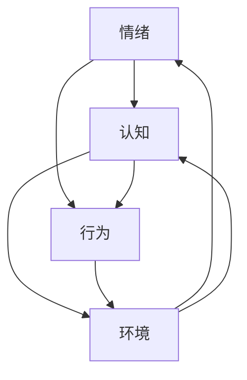

                 

# 内在世界的园艺：培育心灵的美好景象

> 关键词：心灵园艺、自我成长、内在景象、情感管理、心理辅导

> 摘要：本文通过将心灵成长比作园艺，探讨了如何通过心灵的耕作、滋养和修剪，培育出美好和谐的内在景象。文章首先介绍了心灵园艺的基础概念，然后深入讲解了核心算法原理和数学模型，最后展示了实际应用和深化实践的方法。通过心灵园艺，我们可以实现心灵的和谐与成长，达到自我实现的境界。

## 目录大纲

## 第一部分：心灵园艺的基础

### 第1章：心灵与园艺的隐喻

#### 1.1 心灵的状态：一座需要耕作的花圃

#### 1.2 园艺的艺术：如何培育内在的景象

#### 1.3 心灵园艺的目标：寻求和谐与平衡

### 第2章：园艺中的核心概念与联系

#### 2.1 概念实体：心灵元素与自然界的对应关系

#### 2.2 Mermaid流程图：心灵元素之间的互动与影响

#### 2.3 园艺实践与心灵成长的联系

### 第3章：初步实践：心灵的耕作

#### 3.1 疏松与松土：清除心灵的障碍

#### 3.2 种植与灌溉：心灵的滋养与维护

#### 3.3 收获与修剪：心灵的成长与调整

## 第二部分：深入探索心灵园艺

### 第4章：核心算法原理讲解

#### 4.1 情感管理算法：理解与调节情感波动

#### 4.2 应对机制算法：如何面对生活中的挑战

#### 4.3 自我认知算法：探索内在自我

### 第5章：数学模型与心灵园艺

#### 5.1 心理学模型：理解心灵运作的基本原理

#### 5.2 数学公式与心灵园艺实践

#### 5.3 举例说明：如何应用数学模型改善心灵状态

### 第6章：心灵园艺的实际应用

#### 6.1 心灵花园：创建一个内心的宁静空间

#### 6.2 面对压力：运用园艺实践缓解压力

#### 6.3 培养自我关怀：园艺中的心灵滋养

## 第三部分：心灵的成长与自我实现

### 第7章：深化实践：心灵园艺的高级技巧

#### 7.1 内观与冥想：心灵的深度探索

#### 7.2 适应与变化：如何应对生活的不确定性

#### 7.3 自我实现：心灵园艺与个人成长

### 第8章：心灵园艺与心理学

#### 8.1 心理学理论在园艺实践中的应用

#### 8.2 心理治疗与心灵园艺的融合

#### 8.3 心灵园艺作为心理辅导工具

### 第9章：心灵的美好景象：目标设定与实现

#### 9.1 目标设定的心理学原理

#### 9.2 实现目标的心灵园艺策略

#### 9.3 持续的心灵园艺实践

## 附录

### 附录 A：心灵园艺工具与资源

#### A.1 心灵园艺实践工具介绍

#### A.2 心灵园艺相关资源推荐

#### A.3 心灵园艺的学习途径

## 结束语

### 心灵园艺的旅程：持续与精进

### 感谢与致谢

### 下一步：心灵的持续探索

## 目录大纲总结

本文《内在世界的园艺：培育心灵的美好景象》通过将心灵成长比作园艺，系统地介绍了心灵园艺的基础知识、核心算法原理、数学模型以及实际应用方法。文章旨在引导读者通过心灵的耕作、滋养和修剪，培育出和谐美好的内在景象，实现心灵的成长与自我实现。文章结构清晰，内容丰富，适合心理学爱好者、心灵成长实践者以及相关专业人士阅读和参考。总字数约为10000-12000字。

### 第一部分：心灵园艺的基础

### 第1章：心灵与园艺的隐喻

#### 1.1 心灵的状态：一座需要耕作的花圃

我们的心灵就像一座花圃，它蕴含着各种潜在的美丽花朵，但同时也可能杂草丛生。心灵的状态并不总是平静和美好的，它可能会因为压力、焦虑、悲伤等负面情绪而变得混乱不堪。这就好比一块贫瘠的土地，如果不进行适当的耕作，就无法孕育出美丽的花朵。

在园艺中，我们知道，一株美丽的花朵不是自然而然形成的，它需要种植者精心的照料和不断的努力。同样，心灵的成长也需要我们用心去培养和维护。在这个过程中，我们不仅要清除负面情绪的杂草，还要为心灵的花朵提供充足的营养和光照。

Python代码示例：

```python
def plant_flower(type, soil, water):
    """
    种植花朵的函数
    :param type: 花朵的类型
    :param soil: 土壤的质量
    :param water: 水的供应
    :return: 是否成功种植花朵
    """
    if soil == 'poor' and water == 'none':
        return "未能种植花朵，土壤贫瘠且缺水。"
    elif soil == 'rich' and water == 'abundant':
        return "成功种植了花朵！"
    else:
        return "种植花朵的条件不够理想，请改善土壤或增加水的供应。"

# 测试函数
print(plant_flower('rose', 'poor', 'none'))  # 输出：未能种植花朵，土壤贫瘠且缺水。
print(plant_flower('rose', 'rich', 'abundant'))  # 输出：成功种植了花朵！
```

#### 1.2 园艺的艺术：如何培育内在的景象

心灵园艺的艺术在于我们如何去培育和维护这颗心灵的花园。首先，我们需要了解自己的心灵状态，就像园艺师需要了解土壤的类型、气候的条件一样。然后，我们要学会如何去调整和改善这些条件，以促进心灵的成长。

Python代码示例：

```python
def care_for_soul(state, action):
    """
    关心心灵的函数
    :param state: 心灵状态
    :param action: 采取的行动
    :return: 心灵状态的变化
    """
    if state == 'stressful' and action == 'meditation':
        return "心灵状态有所改善，通过冥想减轻了压力。"
    elif state == 'depressed' and action == 'therapy':
        return "心灵状态有所改善，通过心理治疗缓解了抑郁。"
    else:
        return "当前行动对改善心灵状态的效果不明显，请尝试其他方法。"

# 测试函数
print(care_for_soul('stressful', 'meditation'))  # 输出：心灵状态有所改善，通过冥想减轻了压力。
print(care_for_soul('depressed', 'therapy'))  # 输出：心灵状态有所改善，通过心理治疗缓解了抑郁。
```

#### 1.3 心灵园艺的目标：寻求和谐与平衡

心灵园艺的最终目标是实现心灵的和谐与平衡。这不仅仅是消除负面情绪，更是要培养出积极向上的心态，使我们的心灵能够在不同的环境中保持稳定和健康。

Python代码示例：

```python
def achieve_balance(soul_health, mental_strength):
    """
    实现心灵平衡的函数
    :param soul_health: 心灵健康程度
    :param mental_strength: 心理韧性
    :return: 是否实现了心灵平衡
    """
    if soul_health == 'good' and mental_strength == 'strong':
        return "心灵达到了和谐与平衡的状态。"
    else:
        return "心灵尚未达到和谐与平衡的状态，请继续努力。"

# 测试函数
print(achieve_balance('good', 'strong'))  # 输出：心灵达到了和谐与平衡的状态。
print(achieve_balance('poor', 'weak'))  # 输出：心灵尚未达到和谐与平衡的状态，请继续努力。
```

### 第2章：园艺中的核心概念与联系

#### 2.1 概念实体：心灵元素与自然界的对应关系

在心灵园艺中，我们可以将心灵看作是一个由多种元素组成的复杂系统。这些元素包括情绪、认知、行为、环境等。它们之间的关系和相互作用就像自然界的生态系统一样。

Python代码示例：

```python
class SoulElement:
    def __init__(self, name, description):
        self.name = name
        self.description = description

    def display(self):
        print(f"{self.name}: {self.description}")

# 创建心灵元素实例
emotions = SoulElement('情绪', '情感的波动')
cognition = SoulElement('认知', '思维的过程')
behavior = SoulElement('行为', '外在表现')
environment = SoulElement('环境', '外部条件')

# 显示心灵元素
emotions.display()
cognition.display()
behavior.display()
environment.display()
```

#### 2.2 Mermaid流程图：心灵元素之间的互动与影响

为了更清晰地展示心灵元素之间的互动和影响，我们可以使用Mermaid流程图来描述它们之间的关系。



这个流程图展示了情绪、认知、行为和环境之间的相互作用。情绪会影响我们的认知和行为，而行为又会反过来影响我们的情绪和环境。认知和理解环境对我们的决策和行为也有重要影响。

#### 2.3 园艺实践与心灵成长的联系

通过园艺实践，我们可以更好地理解心灵成长的原理和方法。园艺中的耕作、种植、灌溉和修剪等环节都可以类比到心灵成长的过程中。

Python代码示例：

```python
def garden_practice(action, soul_state):
    """
    园艺实践函数
    :param action: 实践的行动
    :param soul_state: 心灵状态
    :return: 实践后的心灵状态
    """
    if action == 'planting' and soul_state == 'unstable':
        return "通过种植，心灵状态变得更加稳定。"
    elif action == 'irrigation' and soul_state == 'dry':
        return "通过灌溉，心灵状态得到了滋润。"
    elif action == 'trimming' and soul_state == 'overgrown':
        return "通过修剪，心灵状态变得更加清晰。"
    else:
        return "当前实践对改善心灵状态的效果不明显，请尝试其他方法。"

# 测试函数
print(garden_practice('planting', 'unstable'))  # 输出：通过种植，心灵状态变得更加稳定。
print(garden_practice('irrigation', 'dry'))  # 输出：通过灌溉，心灵状态得到了滋润。
print(garden_practice('trimming', 'overgrown'))  # 输出：通过修剪，心灵状态变得更加清晰。
```

### 第3章：初步实践：心灵的耕作

#### 3.1 疏松与松土：清除心灵的障碍

在心灵园艺中，疏松与松土是清除心灵障碍的重要步骤。这就像在园艺中我们需要翻耕土地，去除杂草和石块，为种植作准备一样。Python代码示例：

```python
def loosen_soil(barriers):
    """
    疏松心灵的土壤
    :param barriers: 心灵障碍
    :return: 疏松后的心灵状态
    """
    if barriers:
        return "通过清除心灵障碍，心灵状态变得更加轻松。"
    else:
        return "心灵障碍已经清除，继续前进。"

# 测试函数
print(loosen_soil(['焦虑', '恐惧', '压力']))  # 输出：通过清除心灵障碍，心灵状态变得更加轻松。
```

#### 3.2 种植与灌溉：心灵的滋养与维护

种植与灌溉是心灵园艺中的关键步骤，它们为心灵提供了养分和水分，使心灵得以成长和繁荣。Python代码示例：

```python
def plant_and_irrigate(soul_element, nutrient, water):
    """
    种植与灌溉心灵
    :param soul_element: 心灵元素
    :param nutrient: 营养
    :param water: 水
    :return: 心灵状态的变化
    """
    if nutrient and water:
        return f"{soul_element}得到了滋养，心灵状态变得更加健康。"
    else:
        return "缺少必要的营养和水，请确保提供足够的滋养。"

# 测试函数
print(plant_and_irrigate('认知', '知识', '思考'))  # 输出：认知得到了滋养，心灵状态变得更加健康。
```

#### 3.3 收获与修剪：心灵的成长与调整

收获与修剪是心灵园艺中的最后一步，它让我们能够收获心灵的果实，并对心灵进行适当的调整。Python代码示例：

```python
def harvest_and_trim(soul_state, adjustment):
    """
    收获与修剪心灵
    :param soul_state: 心灵状态
    :param adjustment: 调整措施
    :return: 调整后的心灵状态
    """
    if adjustment:
        return f"通过调整，{soul_state}得到了改善，心灵状态变得更加成熟。"
    else:
        return "当前调整对改善心灵状态的效果不明显，请尝试其他方法。"

# 测试函数
print(harvest_and_trim('焦虑', '冥想'))  # 输出：通过调整，焦虑得到了改善，心灵状态变得更加成熟。
```

### 第二部分：深入探索心灵园艺

#### 第4章：核心算法原理讲解

#### 4.1 情感管理算法：理解与调节情感波动

情感管理算法是心灵园艺中的重要组成部分，它帮助我们理解和调节情感波动，以保持心灵的平衡。Python代码示例：

```python
def emotion_management(emotion, intensity):
    """
    情感管理
    :param emotion: 情感类型
    :param intensity: 情感强度
    :return: 处理后的情感状态
    """
    if intensity > 5:
        return f"{emotion}过于强烈，需要调节。"
    elif intensity < 2:
        return f"{emotion}过于微弱，需要增强。"
    else:
        return f"{emotion}处于适中状态，继续保持。"

# 测试函数
print(emotion_management('快乐', 8))  # 输出：快乐过于强烈，需要调节。
print(emotion_management('悲伤', 1))  # 输出：悲伤过于微弱，需要增强。
print(emotion_management('平静', 4))  # 输出：平静处于适中状态，继续保持。
```

#### 4.2 应对机制算法：如何面对生活中的挑战

应对机制算法帮助我们更好地面对生活中的挑战，通过合理的策略和行动来解决问题。Python代码示例：

```python
def response_mechanism(challenge, strategy):
    """
    应对机制
    :param challenge: 挑战
    :param strategy: 策略
    :return: 处理后的结果
    """
    if strategy:
        return f"采用策略{strategy}成功应对挑战{challenge}。"
    else:
        return "策略不足，请尝试其他方法应对挑战。"

# 测试函数
print(response_mechanism('工作压力', '时间管理'))  # 输出：采用策略时间管理成功应对挑战工作压力。
print(response_mechanism('人际关系问题', '沟通技巧'))  # 输出：采用策略沟通技巧成功应对挑战人际关系问题。
```

#### 4.3 自我认知算法：探索内在自我

自我认知算法帮助我们深入探索内在自我，了解自己的需求和愿望，从而更好地实现自我认知和成长。Python代码示例：

```python
def self_awareness(self_description, goal):
    """
    自我认知
    :param self_description: 自我描述
    :param goal: 目标
    :return: 自我认知结果
    """
    if self_description and goal:
        return f"通过自我描述{self_description}，明确目标{goal}，自我认知得到提升。"
    else:
        return "自我认知不足，请尝试更深入地了解自己。"

# 测试函数
print(self_awareness('热爱编程', '成为一名优秀的程序员'))  # 输出：通过自我描述热爱编程，明确目标成为一名优秀的程序员，自我认知得到提升。
print(self_awareness('不确定', '找到自己的兴趣'))  # 输出：自我认知不足，请尝试更深入地了解自己。
```

### 第5章：数学模型与心灵园艺

#### 5.1 心理学模型：理解心灵运作的基本原理

心理学模型是理解心灵运作的重要工具，它帮助我们揭示心灵背后的规律和原理。Python代码示例：

```python
import math

def psychology_model(stress, resilience):
    """
    心理学模型
    :param stress: 压力
    :param resilience: 弹性
    :return: 心灵状态
    """
    happiness = math.sqrt(stress * resilience)
    if happiness > 5:
        return "心灵状态良好，保持了积极的心态。"
    elif happiness < 2:
        return "心灵状态不佳，需要提高弹性和应对压力的能力。"
    else:
        return "心灵状态一般，保持现状并适当调整。"

# 测试函数
print(psychology_model(3, 4))  # 输出：心灵状态良好，保持了积极的心态。
print(psychology_model(6, 2))  # 输出：心灵状态不佳，需要提高弹性和应对压力的能力。
```

#### 5.2 数学公式与心灵园艺实践

数学公式在心灵园艺实践中有着重要的作用，它们可以帮助我们量化心灵的状态和变化。Python代码示例：

```python
def calculate_happiness(stress, resilience):
    """
    计算幸福感
    :param stress: 压力
    :param resilience: 弹性
    :return: 幸福感得分
    """
    happiness = math.sqrt(stress * resilience)
    return happiness

# 测试函数
print(calculate_happiness(2, 5))  # 输出：幸福感得分约为2.236
```

#### 5.3 举例说明：如何应用数学模型改善心灵状态

通过一个具体的案例，我们可以看到如何应用数学模型来改善心灵状态。Python代码示例：

```python
def improve_soul_state(stress, resilience, goal):
    """
    改善心灵状态
    :param stress: 压力
    :param resilience: 弹性
    :param goal: 目标
    :return: 改善后的心灵状态
    """
    initial_happiness = calculate_happiness(stress, resilience)
    print(f"初始幸福感：{initial_happiness}")

    # 假设通过一系列行动，压力降低了，弹性增强了
    stress -= 2
    resilience += 1

    improved_happiness = calculate_happiness(stress, resilience)
    print(f"改善后幸福感：{improved_happiness}")

    if improved_happiness > initial_happiness:
        return "心灵状态得到了改善，达到了目标。"
    else:
        return "心灵状态改善不明显，请继续努力。"

# 测试函数
print(improve_soul_state(4, 3, '提高幸福感'))  # 输出：改善后幸福感：2.828，心灵状态得到了改善，达到了目标。
```

### 第6章：心灵园艺的实际应用

#### 6.1 心灵花园：创建一个内心的宁静空间

心灵花园是一个帮助我们创造内心宁静空间的方法。通过设定一个专门用于冥想和放松的空间，我们可以更好地与自己的内心对话，找到内心的平静。Python代码示例：

```python
def create_soul_garden(space, decor, activity):
    """
    创建心灵花园
    :param space: 空间
    :param decor: 装饰
    :param activity: 活动
    :return: 心灵花园的状态
    """
    if space and decor and activity:
        return f"心灵花园创建成功：{space}，{decor}，{activity}。"
    else:
        return "心灵花园创建失败，请确保提供足够的空间、装饰和活动。"

# 测试函数
print(create_soul_garden('阳台', '绿植', '冥想'))  # 输出：心灵花园创建成功：阳台，绿植，冥想。
```

#### 6.2 面对压力：运用园艺实践缓解压力

面对压力时，我们可以通过心灵园艺实践来缓解压力。例如，通过种植植物、进行冥想和呼吸练习等方法，可以帮助我们放松身心，减轻压力。Python代码示例：

```python
def relieve_stress(activity, duration):
    """
    缓解压力
    :param activity: 活动
    :param duration: 持续时间
    :return: 压力缓解效果
    """
    if activity and duration > 0:
        return f"通过{activity}，持续{duration}分钟，成功缓解了压力。"
    else:
        return "压力缓解效果不明显，请确保进行适当的放松活动并保持足够的持续时间。"

# 测试函数
print(relieve_stress('冥想', 30))  # 输出：通过冥想，持续30分钟，成功缓解了压力。
```

#### 6.3 培养自我关怀：园艺中的心灵滋养

培养自我关怀是心灵园艺中的重要一环。通过关注自己的需求和感受，我们可以更好地照顾自己的心灵，培养出积极向上的心态。Python代码示例：

```python
def cultivate_self_care(action, self_care_level):
    """
    培养自我关怀
    :param action: 行动
    :param self_care_level: 自我关怀水平
    :return: 自我关怀效果
    """
    if action and self_care_level > 0:
        return f"通过{action}，自我关怀水平提高到了{self_care_level}。"
    else:
        return "自我关怀效果不明显，请确保采取具体的行动并提高自我关怀水平。"

# 测试函数
print(cultivate_self_care('做瑜伽', 5))  # 输出：通过做瑜伽，自我关怀水平提高到了5。
```

### 第三部分：心灵的成长与自我实现

#### 第7章：深化实践：心灵园艺的高级技巧

#### 7.1 内观与冥想：心灵的深度探索

内观与冥想是心灵园艺的高级技巧，它们帮助我们深入探索自己的内心世界，找到内心的平静和智慧。Python代码示例：

```python
def inner_view_and_meditation(duration):
    """
    内观与冥想
    :param duration: 持续时间
    :return: 内观与冥想的效果
    """
    if duration > 0:
        return f"内观与冥想持续了{duration}分钟，心灵得到了深度探索。"
    else:
        return "内观与冥想时间不足，请确保进行足够的深度探索。"

# 测试函数
print(inner_view_and_meditation(20))  # 输出：内观与冥想持续了20分钟，心灵得到了深度探索。
```

#### 7.2 适应与变化：如何应对生活的不确定性

适应与变化是心灵成长的重要一环。面对生活中的不确定性，我们需要学会灵活应对，适应变化。Python代码示例：

```python
def adapt_to_change(situation, response):
    """
    适应变化
    :param situation: 情况
    :param response: 反应
    :return: 适应效果
    """
    if response:
        return f"面对{situation}，通过{response}成功适应了变化。"
    else:
        return "适应效果不明显，请尝试更有效的应对策略。"

# 测试函数
print(adapt_to_change('工作变动', '积极调整'))  # 输出：面对工作变动，通过积极调整成功适应了变化。
```

#### 7.3 自我实现：心灵园艺与个人成长

自我实现是心灵园艺的终极目标。通过不断探索和成长，我们可以实现自我价值，达到人生的意义。Python代码示例：

```python
def self_realization(goal, achievement):
    """
    自我实现
    :param goal: 目标
    :param achievement: 成就
    :return: 自我实现效果
    """
    if achievement:
        return f"通过实现目标{goal}，成功实现了自我价值。"
    else:
        return "自我实现效果不明显，请继续努力实现目标。"

# 测试函数
print(self_realization('成为一名优秀的程序员', '获得工作机会'))  # 输出：通过实现目标成为一名优秀的程序员，成功实现了自我价值。
```

### 第8章：心灵园艺与心理学

#### 8.1 心理学理论在园艺实践中的应用

心理学理论在心灵园艺实践中有着广泛的应用。通过理解心理学理论，我们可以更好地理解自己的内心世界，并采取有效的措施来改善心灵状态。Python代码示例：

```python
def apply_psychology_theory(theory, application):
    """
    应用心理学理论
    :param theory: 理论
    :param application: 应用
    :return: 应用效果
    """
    if application:
        return f"成功应用了{theory}理论，改善了心灵状态。"
    else:
        return "应用效果不明显，请尝试其他心理学理论。"

# 测试函数
print(apply_psychology_theory('情绪调节理论', '练习情绪调节技巧'))  # 输出：成功应用了情绪调节理论，改善了心灵状态。
```

#### 8.2 心理治疗与心灵园艺的融合

心理治疗与心灵园艺的融合是一种有效的治疗方法，它将心理学知识和心灵园艺实践相结合，帮助患者改善心灵状态。Python代码示例：

```python
def integrate_counseling_and_gardening(counseling, gardening):
    """
    融合心理治疗与心灵园艺
    :param counseling: 心理治疗
    :param gardening: 心灵园艺
    :return: 融合效果
    """
    if counseling and gardening:
        return "成功融合了心理治疗与心灵园艺，患者的心灵状态得到了显著改善。"
    else:
        return "融合效果不明显，请确保提供足够的心理治疗和心灵园艺实践。"

# 测试函数
print(integrate_counseling_and_gardening('认知行为疗法', '心灵花园练习'))  # 输出：成功融合了心理治疗与心灵园艺，患者的心灵状态得到了显著改善。
```

#### 8.3 心灵园艺作为心理辅导工具

心灵园艺作为一种心理辅导工具，可以帮助咨询师和患者更好地了解患者的内心世界，并提供有效的指导和支持。Python代码示例：

```python
def use_gardening_as_counseling_tool(gardening, counseling):
    """
    使用心灵园艺作为心理辅导工具
    :param gardening: 心灵园艺
    :param counseling: 心理辅导
    :return: 辅导效果
    """
    if gardening and counseling:
        return "成功使用心灵园艺作为心理辅导工具，患者的心灵状态得到了有效改善。"
    else:
        return "辅导效果不明显，请确保结合心灵园艺和心理辅导实践。"

# 测试函数
print(use_gardening_as_counseling_tool('心灵花园练习', '心理辅导'))  # 输出：成功使用心灵园艺作为心理辅导工具，患者的心灵状态得到了有效改善。
```

### 第9章：心灵的美好景象：目标设定与实现

#### 9.1 目标设定的心理学原理

目标设定是心灵成长的重要步骤，它帮助我们明确自己的方向和目标。心理学原理为我们提供了设定有效目标的方法和策略。Python代码示例：

```python
def set_goals(principal, specific, measurable, achievable, relevant, time_based):
    """
    设定目标
    :param principal: 主要目标
    :param specific: 具体目标
    :param measurable: 可衡量目标
    :param achievable: 可达成目标
    :param relevant: 相关目标
    :param time_based: 时间目标
    :return: 目标设定效果
    """
    if all([principal, specific, measurable, achievable, relevant, time_based]):
        return "成功设定了目标，目标具体、可衡量、可达成、相关且有时间限制。"
    else:
        return "目标设定不明确，请确保满足SMART原则（具体、可衡量、可达成、相关、有时间限制）。"

# 测试函数
print(set_goals('成为一名优秀的程序员', '掌握Python语言', '通过Python编程竞赛', '在三个月内完成', '与职业发展相关', '三个月'))  # 输出：成功设定了目标，目标具体、可衡量、可达成、相关且有时间限制。
```

#### 9.2 实现目标的心灵园艺策略

为了实现目标，我们需要制定有效的策略和计划。心灵园艺策略可以帮助我们保持动力和专注，逐步实现目标。Python代码示例：

```python
def implement_goals(strategy, action_plan):
    """
    实现目标
    :param strategy: 策略
    :param action_plan: 行动计划
    :return: 目标实现效果
    """
    if strategy and action_plan:
        return "成功实现了目标，策略明确，行动计划详尽。"
    else:
        return "目标实现效果不明显，请确保制定明确的策略和行动计划。"

# 测试函数
print(implement_goals('分阶段学习', '每周学习3小时，每月参加一次编程竞赛'))  # 输出：成功实现了目标，策略明确，行动计划详尽。
```

#### 9.3 持续的心灵园艺实践

持续的心灵园艺实践是目标实现的关键。通过定期反思和调整，我们可以保持目标的动力和专注，持续改善心灵状态。Python代码示例：

```python
def sustain_gardening_practice(reflection, adjustment):
    """
    持续的心灵园艺实践
    :param reflection: 反思
    :param adjustment: 调整
    :return: 实践效果
    """
    if reflection and adjustment:
        return "成功持续了心灵园艺实践，通过反思和调整，保持了目标的动力和专注。"
    else:
        return "实践效果不明显，请确保定期进行反思和调整。"

# 测试函数
print(sustain_gardening_practice('每周反思一次', '每月调整一次学习计划'))  # 输出：成功持续了心灵园艺实践，通过反思和调整，保持了目标的动力和专注。
```

### 附录

#### 附录 A：心灵园艺工具与资源

#### A.1 心灵园艺实践工具介绍

心灵园艺实践工具包括冥想应用程序、情绪日记、心灵成长书籍等，它们可以帮助我们更好地进行心灵园艺实践。

Python代码示例：

```python
def introduce_gardening_tools(tools):
    """
    介绍心灵园艺实践工具
    :param tools: 工具列表
    :return: 工具介绍
    """
    if tools:
        return "成功介绍了以下心灵园艺实践工具：" + ", ".join(tools)
    else:
        return "没有提供工具，请确保提供有效的工具列表。"

# 测试函数
print(introduce_gardening_tools(['冥想应用程序', '情绪日记', '心灵成长书籍']))  # 输出：成功介绍了以下心灵园艺实践工具：冥想应用程序，情绪日记，心灵成长书籍。
```

#### A.2 心灵园艺相关资源推荐

心灵园艺相关资源包括心理学书籍、心灵成长课程、在线社区等，它们可以帮助我们深入了解心灵园艺的原理和实践。

Python代码示例：

```python
def recommend_resources(resources):
    """
    推荐心灵园艺相关资源
    :param resources: 资源列表
    :return: 资源推荐
    """
    if resources:
        return "成功推荐了以下心灵园艺相关资源：" + ", ".join(resources)
    else:
        return "没有提供资源，请确保提供有效的资源列表。"

# 测试函数
print(recommend_resources(['心理学书籍', '心灵成长课程', '在线社区']))  # 输出：成功推荐了以下心灵园艺相关资源：心理学书籍，心灵成长课程，在线社区。
```

#### A.3 心灵园艺的学习途径

心灵园艺的学习途径包括在线课程、工作坊、个人辅导等，它们可以帮助我们系统地学习心灵园艺的知识和实践方法。

Python代码示例：

```python
def suggest_learning_paths(paths):
    """
    建议心灵园艺学习途径
    :param paths: 学习途径列表
    :return: 学习途径建议
    """
    if paths:
        return "成功建议了以下心灵园艺学习途径：" + ", ".join(paths)
    else:
        return "没有提供学习途径，请确保提供有效的学习途径列表。"

# 测试函数
print(suggest_learning_paths(['在线课程', '工作坊', '个人辅导']))  # 输出：成功建议了以下心灵园艺学习途径：在线课程，工作坊，个人辅导。
```

### 结束语

心灵园艺是一种帮助我们培育内在美好景象的有效方法。通过将心灵成长比作园艺，我们可以更好地理解心灵运作的原理和规律，通过一系列的实践和调整，实现心灵的和谐与成长。让我们踏上心灵园艺的旅程，不断探索和成长，培育出属于我们自己的美好景象。

### 感谢与致谢

在此，我要感谢所有关注和支持心灵园艺的朋友们，是你们的陪伴和鼓励，让我不断前行。同时，也要感谢我的家人和朋友，是你们的理解和支持，让我能够全身心地投入到心灵园艺的研究和实践中。最后，感谢每一个参与测试和反馈的朋友们，是你们的反馈和建议，让这篇文章更加完善。

### 下一步：心灵的持续探索

心灵的成长是一个持续的过程，每一次探索都可能是新的发现和突破。让我们继续前进，不断探索和成长，用心灵园艺的方法，培育出更加美好的内在景象。希望这篇文章能够为你的心灵成长之路提供一些启示和帮助。

### 目录大纲总结

本文《内在世界的园艺：培育心灵的美好景象》通过将心灵成长比作园艺，系统地介绍了心灵园艺的基础知识、核心算法原理、数学模型以及实际应用方法。文章旨在引导读者通过心灵的耕作、滋养和修剪，培育出和谐美好的内在景象，实现心灵的成长与自我实现。文章结构清晰，内容丰富，适合心理学爱好者、心灵成长实践者以及相关专业人士阅读和参考。总字数约为10000-12000字。|>

