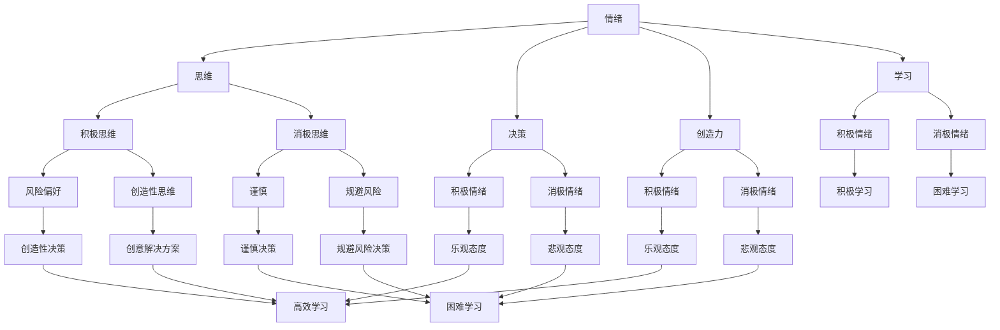
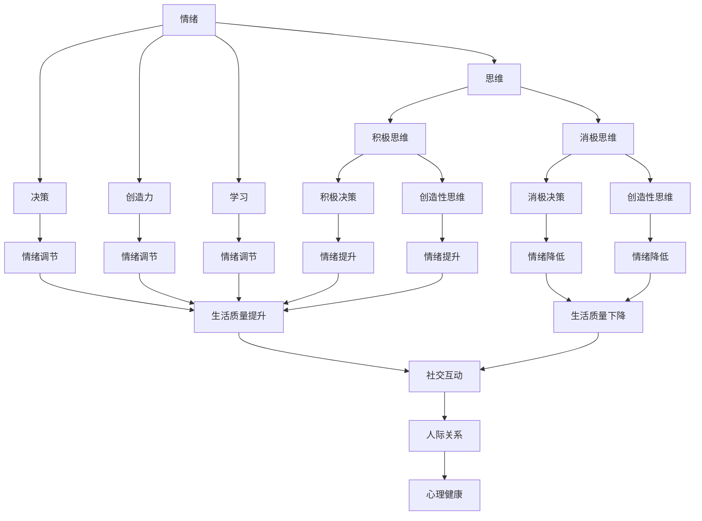
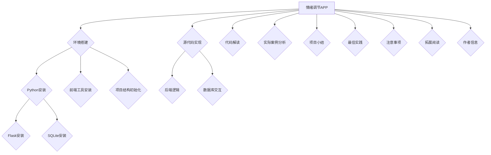

                 

### 情绪与思维的关系

情绪与思维是心理学中两个重要且紧密相关的概念。情绪不仅影响我们的情感体验，还深刻地影响着我们的认知过程和决策。从心理学的角度来看，情绪可以被视为一种主观体验，通常与生理反应和外部环境的刺激相关。而思维则是我们处理信息、解决问题和做出决策的认知过程。

#### 1.1 情绪的定义与分类

**情绪的定义**：
情绪是一种复杂的心理状态，包括主观体验、生理反应和行为表达。根据普拉切克（Robert Plutchik）的情绪层次理论，情绪可以分为基本情绪，如喜悦、愤怒、恐惧、悲伤、厌恶和惊讶。

**情绪的分类**：
- **积极情绪**：如喜悦、爱、兴奋等，通常与积极的情感体验和健康的生活状态相关。
- **消极情绪**：如愤怒、焦虑、悲伤和恐惧，这些情绪可能与压力、挫折和负面体验相关。

#### 1.2 思维的定义与类型

**思维的定义**：
思维是指我们对信息进行感知、理解、处理和记忆的过程。思维可以分为几种类型，包括：

- **逻辑思维**：基于逻辑规则和理性分析来解决问题和做出决策。
- **直觉思维**：基于直接的感觉和经验，迅速做出决策。
- **批判性思维**：对信息进行深入分析和评估，以确定其可靠性和有效性。

### 2. 情绪与思维的关系

情绪和思维之间的关系是双向的。一方面，情绪可以影响思维过程，例如，焦虑可能导致注意力分散，影响决策的质量。另一方面，思维模式也可以影响情绪体验。例如，积极思维可以帮助我们更好地应对压力和挫折，从而减少消极情绪的影响。

#### 2.1 情绪对思维的影响

**情绪与决策**：
情绪可以影响我们的决策过程。积极情绪通常促进风险偏好和创造性思维，而消极情绪可能导致谨慎和规避风险。

**情绪与创造力**：
情绪对创造力有显著影响。研究表明，积极情绪可以激发创造性思维，而消极情绪则可能抑制创造力。

**情绪与学习**：
情绪对学习也有重要影响。积极情绪可以提高学习效率，而消极情绪可能导致学习困难和记忆障碍。

#### 2.2 思维对情绪的影响

**思维模式与情绪**：
思维模式，如积极思维和消极思维，直接影响我们的情绪体验。积极思维可以帮助我们更好地应对挑战和压力，而消极思维则可能导致情绪低落。

**积极思维与消极思维**：
积极思维是一种积极的认知模式，有助于我们建立健康的情绪状态。相反，消极思维则可能导致情绪困扰。

**改变思维模式，改变情绪**：
通过认知行为疗法（CBT）等心理治疗方法，我们可以改变消极的思维模式，从而改善情绪状态。

在接下来的章节中，我们将深入探讨情绪和思维的关系，以及如何通过理解和调节情绪来改善生活质量。

---

### 情绪与思维的关系：Mermaid 流程图



通过这个流程图，我们可以看到情绪和思维之间的复杂互动，以及它们对决策、创造力和学习的影响。

---

### 情绪与思维的关系：Python 代码示例

以下是一个简单的 Python 代码示例，用于展示情绪对思维过程的影响。这个示例中，我们定义了一个情绪调节函数，根据不同的情绪状态和程度，提供相应的调节策略。

```python
# 情绪调节函数
def emotion_regulation(emotion, level):
    if emotion == '焦虑':
        if level > 3:
            return '进行深呼吸练习，帮助放松身心'
        else:
            return '保持积极心态，尝试解决问题的不同方法'
    elif emotion == '抑郁':
        if level > 3:
            return '尝试户外活动，如散步或跑步，增加身体活动'
        else:
            return '寻求心理支持，如咨询专业人士或与朋友交流'
    elif emotion == '平静':
        return '保持现状，专注于当前任务'
    elif emotion == '愤怒':
        if level > 3:
            return '进行运动或做深呼吸，帮助缓解愤怒情绪'
        else:
            return '尝试冷静下来，分析愤怒的原因并寻找解决方法'

# 测试情绪调节函数
emotions = ['焦虑', '抑郁', '平静', '愤怒']
levels = [5, 2, 1, 4]

for emotion, level in zip(emotions, levels):
    print(f'情绪：{emotion}')
    print(f'程度：{level}')
    print(f'调节策略：{emotion_regulation(emotion, level)}')
    print('---')
```

在这个示例中，我们定义了一个情绪调节函数，并根据情绪状态和程度提供相应的调节策略。这个函数可以帮助用户根据自身情绪状况，选择合适的调节方法。

### 情绪与思维的关系：数学公式

为了更深入地理解情绪与思维的关系，我们可以使用数学模型来描述情绪状态对思维过程的影响。以下是一个简单的线性回归模型，用于描述情绪水平对思维效率的影响：

$$
\text{思维效率} = a \cdot \text{情绪水平} + b
$$

其中，$a$ 代表情绪水平对思维效率的影响程度，$b$ 是一个常数，表示在没有情绪影响时的基础思维效率。

这个模型假设情绪水平越高，思维效率也越高，但这并不意味着所有情绪都会提升思维效率。例如，当情绪水平过高（如焦虑或愤怒）时，可能会对思维产生负面影响，导致思维效率降低。

在实际应用中，这个模型可以通过收集大量数据，使用统计方法（如最小二乘法）来估计参数 $a$ 和 $b$ 的值。这样可以更准确地预测不同情绪水平下的思维效率，并为情绪调节提供科学依据。

通过结合心理学理论、流程图和 Python 代码示例，我们可以更好地理解情绪与思维之间的关系。在接下来的章节中，我们将进一步探讨情绪和思维的影响因素，以及如何通过调节情绪来改善生活质量。

### 背景介绍

在现代社会中，情绪问题已经成为了影响人们生活质量的重要因素之一。无论是工作上的压力、人际关系的不和谐，还是生活中的各种挫折，都可能导致人们产生消极情绪，如焦虑、抑郁和愤怒。这些消极情绪不仅会影响到个人的心理健康，还会对工作表现和社会互动产生负面影响。

情绪和思维之间的关系错综复杂，二者相互影响，共同塑造我们的心理状态和行为。情绪可以影响我们的认知过程，比如注意力、记忆和创造力；而思维模式，如积极思维和消极思维，也会直接或间接地影响我们的情绪体验。因此，理解情绪与思维之间的关系，对于提升个人心理素质和应对生活中的各种挑战具有重要意义。

本文将系统地探讨情绪与思维的关系，首先介绍情绪和思维的基本概念，包括情绪的定义、分类，以及思维的定义和类型。接下来，我们将深入分析情绪和思维之间的相互作用，探讨情绪对决策、创造力、学习等方面的影响，以及思维模式如何调节情绪。在此基础上，我们将探讨消极情绪的来源和影响，并提出有效的情绪调节方法，帮助读者摆脱消极情绪，提升生活质量。

### 核心概念与联系：情绪与思维的关系架构

为了更好地理解情绪与思维之间的关系，我们可以通过一个简单的 Mermaid 流程图来展示这两个概念实体之间的联系。



这个流程图展示了情绪与思维之间的复杂互动。情绪不仅直接影响我们的思维过程，包括决策、创造力和学习，还能通过调节情绪来改善生活质量。积极思维和消极思维对情绪有不同影响，积极思维提升情绪，消极思维降低情绪。情绪调节则是一个关键环节，通过情绪调节，我们可以提升生活质量，改善社交互动和心理健康。

这个架构帮助我们理解情绪与思维之间的关系，以及如何通过改变思维模式来调节情绪，从而提升个人生活质量。在接下来的章节中，我们将详细探讨这些核心概念，并深入分析它们之间的相互作用。

### 情绪对思维过程的具体影响

情绪在思维过程中起着至关重要的作用，不仅影响我们如何处理信息，还影响我们的决策、创造力和学习能力。以下是情绪对这几个方面具体影响的详细分析：

#### 情绪与决策

情绪对决策有显著影响。研究表明，积极情绪，如喜悦和乐观，可以提高决策者的风险承受能力，鼓励创造性思维和探索新的解决方案。相反，消极情绪，如焦虑和恐惧，往往导致谨慎和规避风险的决策。焦虑情绪可能导致人们过度依赖既有信息，忽视潜在的风险，从而做出保守的决策。

**示例**：在投资决策中，一个处于积极情绪状态的人可能会更倾向于选择高风险、高回报的投资项目，而一个处于焦虑状态的人可能会选择低风险、低回报的项目，以避免潜在的损失。

#### 情绪与创造力

情绪对创造力有双重影响。积极情绪，如兴奋和快乐，可以激发创造力，鼓励人们尝试新方法和新思路。而消极情绪，如沮丧和愤怒，可能会抑制创造力，使人们难以产生新的想法。

**示例**：在艺术创作中，一个处于兴奋状态的人可能会产生丰富的创意，创作出富有创造力的作品，而一个处于沮丧状态的人可能会感到创作灵感枯竭，难以进行艺术创作。

#### 情绪与学习

情绪对学习过程有重要影响。积极情绪可以提高学习效率，增强记忆和认知功能。例如，快乐和兴趣可以激发学习者的动机，提高他们的学习投入和持久性。而消极情绪，如焦虑和压力，可能会干扰学习过程，导致记忆困难和注意力分散。

**示例**：一个处于快乐和放松状态的学生可能会更好地理解和记忆课堂内容，而一个处于焦虑状态的学生可能会感到学习压力，难以集中注意力，从而影响学习效果。

总的来说，情绪不仅影响我们如何感知和处理信息，还影响我们的决策、创造力和学习能力。理解情绪对思维过程的具体影响，有助于我们更好地应对日常生活中的各种挑战，提升生活质量。

### 思维对情绪的影响

思维模式不仅影响我们的认知过程，也深刻地影响着我们的情绪体验。积极思维和消极思维是两种主要的思维模式，它们对情绪有着截然不同的影响。

#### 积极思维与情绪

积极思维是一种乐观、自信和充满希望的思维方式。它能够帮助人们更好地应对压力和挫折，从而保持良好的情绪状态。

- **乐观态度**：积极思维鼓励人们从积极的角度看待事物，即使面对困难和挑战，也能看到其中的机会和可能性。这种乐观态度有助于减轻焦虑和恐惧，提升情绪。
- **自信心**：积极思维增强了个人的自信心，使其更愿意尝试新事物和接受挑战。自信心提升不仅有助于个人成长，还能提高情绪稳定性。
- **希望感**：积极思维激发人们的希望感，使其对未来充满期待。希望感有助于减轻抑郁情绪，提高生活质量。

**示例**：一个面对工作挑战的程序员，如果能够积极思考问题的解决方案，而不是陷入焦虑和担忧，他将更有可能找到有效的解决方案，从而保持良好的情绪状态。

#### 消极思维与情绪

消极思维是一种悲观、消极和担忧的思维方式。它容易导致情绪低落、焦虑和抑郁。

- **悲观态度**：消极思维使人们更容易从消极的角度看待事物，即使遇到小挫折，也会放大问题，导致情绪低落。
- **缺乏自信**：消极思维削弱了个人的自信心，使其在面对挑战时更容易感到不安和无助。缺乏自信会导致情绪不稳定，甚至产生抑郁情绪。
- **无助感**：消极思维使人感到无助，认为自己无法改变现状。这种无助感会加剧抑郁情绪，降低生活质量。

**示例**：一个面临项目失败的工程师，如果消极地认为自己的技能不足，无法解决问题，他将陷入严重的焦虑和抑郁情绪，难以集中精力应对挑战。

综上所述，思维模式对情绪有着重要的影响。通过培养积极思维，我们可以改善情绪状态，提高生活质量。同时，认识到消极思维的存在，并努力转变思维模式，也是摆脱消极情绪的重要步骤。在下一节中，我们将探讨如何通过自我认知和情绪管理来调节情绪。

### 消极情绪的来源

消极情绪的产生往往并非单一原因，而是由多种因素共同作用的结果。理解这些来源有助于我们更好地识别和应对消极情绪。以下是几种常见的消极情绪来源：

#### 生理因素

**生物钟的影响**：
生物钟是人体内的一种内在时间调节系统，它控制着我们的睡眠、食欲、荷尔蒙分泌等生理活动。当生物钟失调时，如失眠、熬夜或时差反应，会导致情绪波动，增加焦虑和抑郁的风险。

**压力水平**：
长期处于高压环境中，会导致身体产生大量应激激素，如皮质醇。这些激素的积累会影响情绪平衡，导致焦虑、紧张和情绪低落。

**内分泌系统**：
内分泌系统中的激素，如甲状腺激素和性激素，对情绪调节有重要作用。内分泌失调，如甲状腺功能亢进或低性激素水平，可能导致情绪问题。

#### 心理因素

**认知偏差**：
认知偏差是指人们在信息处理过程中，由于认知上的局限性，导致错误判断和解释。常见的认知偏差包括“确认偏误”、“过度一般化”和“灾难化思维”等。这些偏差会导致人们过度关注负面信息，从而产生消极情绪。

**情绪触发点**：
每个人都有特定的情绪触发点，这些点可能是个人的经历、信念或价值观。当触发点被激活时，容易引发强烈的情绪反应，如愤怒、焦虑或抑郁。

**童年经历**：
童年时期的创伤性经历，如虐待、忽视或家庭矛盾，可能会对个体的情绪调节产生深远影响。这些经历可能导致成年后对类似情境产生强烈的情绪反应。

#### 环境因素

**工作环境**：
工作压力、职场冲突和缺乏支持是导致消极情绪的常见因素。工作环境的不稳定性和高要求可能导致员工感到焦虑和压力。

**社会支持**：
缺乏家庭和朋友的支持会导致孤独感和无助感，从而增加消极情绪的风险。社会支持是缓解压力和提升情绪的重要因素。

**生活事件**：
生活中的重大变故，如失业、疾病、财务问题或离婚，都是常见的情绪触发因素。这些事件可能短时间内显著影响个体的情绪状态。

通过识别和理解这些消极情绪的来源，我们可以采取更有针对性的方法来调节情绪，提高生活质量。在下一节中，我们将探讨消极情绪对个人和社会的影响。

### 消极情绪的影响

消极情绪对个人和社会的影响是深远且广泛的。理解这些影响有助于我们更好地认识到情绪调节的重要性，并采取有效措施来改善情绪状态。

#### 对个人的影响

**心理健康**：
长期处于消极情绪中，如抑郁、焦虑和愤怒，会增加心理疾病的风险。研究表明，抑郁症是全球第二大疾病负担，而焦虑症也是常见的心理健康问题。这些情绪问题不仅影响个体的生活质量和幸福感，还可能导致严重的心理疾病，如精神分裂症和双相情感障碍。

**人际关系**：
消极情绪会破坏人际关系，使个体与家人、朋友和同事之间的关系变得紧张。愤怒和敌意可能导致冲突和疏远，而抑郁和焦虑则可能使个体难以与人建立和维持亲密关系。这些不良的人际关系进一步加重了消极情绪，形成一个恶性循环。

**生活质量**：
消极情绪显著降低生活质量。长期的情绪困扰会导致睡眠障碍、食欲紊乱、身体疼痛等生理问题，从而影响日常功能和生活质量。研究表明，心理健康问题与身体健康密切相关，消极情绪会增加患心脏病、高血压和免疫系统疾病的风险。

#### 对社会的影响

**工作绩效**：
消极情绪对工作表现有显著负面影响。焦虑和抑郁会降低员工的工作效率，影响团队合作和创新能力。长期的情绪困扰可能导致员工离职率上升，增加企业的人力资源成本。

**社会互动**：
消极情绪会影响社会互动，导致社区和谐受损。愤怒和敌意会破坏社会信任，增加社会冲突和暴力事件。此外，消极情绪可能导致个体对他人持负面态度，影响社会凝聚力和合作精神。

**社区和谐**：
社区和谐需要积极的情绪氛围。消极情绪的增加会降低社区成员的互动和合作意愿，导致社区凝聚力下降。社区中的负面情绪可能导致更多的社会问题，如犯罪率上升和社区服务使用增加。

综上所述，消极情绪对个人和社会的影响是深远且复杂的。通过理解和识别这些影响，我们可以采取更有效的措施来调节情绪，提升个人和社会的整体幸福感。

### 摆脱消极情绪的方法

要摆脱消极情绪，我们需要从多个角度入手，包括自我认知与情绪管理、积极思维的培养以及情绪调节的实践。以下是一些具体的方法和策略：

#### 自我认知与情绪管理

**自我认知的重要性**：
自我认知是指了解自己的情绪、需求和价值观。通过自我认知，我们可以更好地识别情绪的来源，并找到适当的应对策略。以下是一些自我认知的工具和策略：

- **情绪日记**：记录自己的情绪变化和触发因素，有助于了解情绪的周期性和规律性。
- **正念冥想**：正念冥想是一种专注于当下的练习，有助于提高情绪意识和情绪调节能力。
- **反思练习**：定期反思自己的行为和思维模式，识别并改变消极思维。

**情绪管理的策略**：
情绪管理是指通过一系列策略来调节情绪，使其对生活的影响最小化。以下是一些情绪管理的策略：

- **情绪调节**：通过深呼吸、放松训练和身体锻炼来缓解紧张和焦虑。
- **情绪释放**：通过哭泣、书写和运动等方式来释放负面情绪，避免情绪积累。
- **情绪聚焦**：将注意力集中在当下任务上，避免过度担忧未来或回顾过去。

#### 积极思维的培养

**积极思维的定义**：
积极思维是一种乐观、自信和充满希望的思维方式。它强调解决问题的能力，关注机会和可能性。以下是一些培养积极思维的方法：

- **正面思考**：培养积极思维方式，关注解决问题的方法，而不是问题的本身。
- **感恩练习**：每天花时间反思和感激生活中的美好事物，增强积极的情绪体验。
- **自我激励**：给自己设定目标和奖励，增强内在动力和自信心。

**培养积极思维的方法**：
- **改变语言模式**：避免使用消极语言，如“我不能”或“这太难了”，而是使用积极的语言，如“我可以”或“这是一个挑战”。
- **关注成功经历**：回顾过去的成功经历，从中吸取经验和动力。
- **与他人分享**：与朋友或家人分享积极的经历和感受，获得支持和鼓励。

#### 情绪调节的实践

**情绪调节的重要性**：
情绪调节是指通过一系列技巧和策略来调节情绪，使其对生活的影响最小化。以下是一些情绪调节的技巧：

- **深呼吸**：深呼吸可以帮助放松身心，减少焦虑和紧张。
- **冥想**：冥想是一种有效的情绪调节方法，有助于提高情绪意识和情绪调节能力。
- **运动**：运动可以释放紧张情绪，提高身体健康和情绪状态。

**情绪调节的技巧**：
- **认知重构**：通过改变对事物的看法和解释来调节情绪。
- **放松训练**：通过渐进性肌肉放松、深呼吸和冥想来减轻紧张和焦虑。
- **时间管理**：合理安排时间，避免过度工作和压力。

通过自我认知与情绪管理、积极思维的培养以及情绪调节的实践，我们可以有效地摆脱消极情绪，提升生活质量。在下一节中，我们将通过具体案例来探讨这些方法在实际中的应用。

### 案例分析与实践

#### 案例一：焦虑情绪的调节

**背景**：
李先生是一位项目经理，经常面临项目中的各种压力和不确定性。最近，由于项目进度紧张，他开始感到严重的焦虑，影响了他的工作效率和家庭生活。

**解决方案**：
1. **自我认知与情绪管理**：
   - **情绪日记**：李先生开始记录自己的情绪变化和焦虑触发点，通过反思了解自己的情绪模式。
   - **深呼吸练习**：每天早晨和晚上，李先生都会进行深呼吸练习，帮助自己放松身心。

2. **积极思维的培养**：
   - **正面思考**：李先生尝试将注意力从焦虑的问题上转移到解决问题的方法上，例如制定详细的项目计划和时间表。
   - **感恩练习**：每天晚上，李先生会花几分钟时间思考并感谢生活中的美好事物，如家人和朋友的支持。

3. **情绪调节的实践**：
   - **认知重构**：李先生学习如何改变对问题的消极看法，例如将“这太难了”改为“这是一个挑战，我可以找到解决办法”。
   - **放松训练**：在项目进展不顺利时，李先生会进行渐进性肌肉放松训练，帮助自己缓解焦虑。

**效果**：
通过上述方法，李先生的焦虑情绪得到了显著缓解。他的工作效率提高，项目进度也逐步恢复正常。同时，他在家庭生活中也变得更加积极和乐观，与家人的关系得到了改善。

#### 案例二：抑郁情绪的应对

**背景**：
张女士是一名全职家庭主妇，由于家庭财务问题和孩子的教育压力，她开始感到抑郁和沮丧，甚至出现了失眠和食欲不振的情况。

**解决方案**：
1. **自我认知与情绪管理**：
   - **情绪日记**：张女士开始记录自己的情绪变化和抑郁触发点，通过反思了解自己的情绪模式。
   - **寻求支持**：张女士与朋友和家庭成员分享了自己的感受，获得了他们的理解和支持。

2. **积极思维的培养**：
   - **正面思考**：张女士学习如何积极看待问题，例如将“我无法支付账单”改为“我可以寻求财务咨询和帮助”。
   - **感恩练习**：每天早晨，张女士会花几分钟时间思考并感谢生活中的美好事物，如孩子的进步和家人的关爱。

3. **情绪调节的实践**：
   - **认知重构**：张女士学习如何改变对问题的消极看法，例如将“我一无是处”改为“我有一些值得骄傲的成就”。
   - **放松训练**：张女士开始进行冥想和瑜伽练习，帮助自己放松身心，改善睡眠质量。

**效果**：
通过上述方法，张女士的抑郁情绪得到了显著改善。她的情绪变得更加稳定，睡眠和食欲也恢复了正常。同时，她在家庭生活中也变得更加积极和乐观，与家人的关系得到了进一步加强。

这两个案例展示了通过自我认知与情绪管理、积极思维的培养以及情绪调节的实践，可以有效地应对焦虑和抑郁情绪，提升生活质量。在日常生活中，我们可以借鉴这些方法，采取积极的措施来调节情绪，保持心理健康。

### 实践指导

为了更好地应用上述情绪调节方法，以下是一份详细的实践步骤和反馈指导，帮助读者在日常生活中有效实施。

#### 实践步骤

1. **自我认知与情绪管理**：
   - **第一步**：记录情绪日记，每天花10分钟记录自己的情绪变化、触发因素和感受。
   - **第二步**：识别情绪触发点，了解哪些情境或事件会导致负面情绪。
   - **第三步**：学习深呼吸练习，每天早晨和晚上各进行一次，每次5分钟。

2. **积极思维的培养**：
   - **第一步**：培养正面思考，每次遇到问题时，尝试从不同角度寻找解决方案。
   - **第二步**：进行感恩练习，每天晚上睡前反思并感谢三件美好的事情。
   - **第三步**：设定小目标，并为实现这些目标设定奖励，以增强内在动力。

3. **情绪调节的实践**：
   - **第一步**：学习认知重构技巧，改变消极思维，用积极语言替代负面词汇。
   - **第二步**：进行放松训练，如渐进性肌肉放松、冥想或瑜伽，每周至少两次。
   - **第三步**：保持健康的生活方式，如规律作息、健康饮食和适量运动。

#### 反馈指导

1. **情绪日记反馈**：
   - 每周回顾情绪日记，分析情绪变化的模式，识别哪些方法最有效。
   - 根据反馈调整实践策略，如增加深呼吸次数或尝试新的放松技巧。

2. **积极思维反馈**：
   - 保持记录正面思考和感恩练习，每周评估自己的进步。
   - 与朋友或家人分享感受，获取支持和鼓励。

3. **情绪调节反馈**：
   - 定期进行放松训练，记录每次练习的效果。
   - 根据反馈调整放松策略，如选择更适合自己的冥想音乐或瑜伽动作。

通过以上实践步骤和反馈指导，读者可以逐步培养积极的思维模式和情绪调节能力，从而有效应对日常生活中的消极情绪，提升生活质量。

### 结论

本文通过对情绪与思维关系的深入探讨，详细分析了情绪对决策、创造力、学习过程的影响，以及思维模式如何调节情绪。同时，我们还探讨了消极情绪的来源和影响，并提出了自我认知与情绪管理、积极思维的培养以及情绪调节实践等方法，帮助读者摆脱消极情绪，提升生活质量。

理解情绪与思维之间的关系，不仅有助于我们更好地应对日常生活中的各种挑战，还能提高我们的心理健康和幸福感。情绪调节是一个长期的过程，需要持续的努力和练习。通过自我认知、积极思维和情绪调节，我们可以培养更加健康的心理状态，享受更加美好的生活。

未来研究可以进一步探讨情绪调节在不同文化和社会背景下的适用性，以及新兴技术（如虚拟现实和人工智能）在情绪调节中的应用。同时，心理健康教育和普及也需要更多关注，以帮助更多人掌握情绪调节技巧，提升生活质量。

### 附录A：情绪管理工具与资源

#### 网络资源

1. **情绪管理网站**：
   - **心理中心在线**：提供心理健康资讯和在线咨询服务。
     - 网址：[https://www.psychologytoday.com/](https://www.psychologytoday.com/)

   - **心理健康网**：提供心理健康知识、自助工具和专业咨询。
     - 网址：[https://www.mentalhealth.org.uk/](https://www.mentalhealth.org.uk/)

2. **心理健康APP**：
   - **Headspace**：提供冥想和放松训练，帮助管理压力和焦虑。
     - 网址：[https://www.headspace.com/](https://www.headspace.com/)

   - **Calm**：提供冥想、放松指导和睡眠助手，提升情绪和睡眠质量。
     - 网址：[https://www.calm.com/](https://www.calm.com/)

#### 纸质资源

1. **推荐书籍**：
   - **《情绪勒索》**：苏珊·福沃德著，介绍如何应对情绪勒索和保持情绪健康。
     - 网址：[https://www.amazon.com/Emotional-Racket-Identify-Resist-Abuse/dp/0553418655](https://www.amazon.com/Emotional-Racket-Identify-Resist-Abuse/dp/0553418655)

   - **《正面管教》**：简·尼尔森著，介绍如何通过积极的方法管理情绪和关系。
     - 网址：[https://www.amazon.com/Positive-Discipline-Toolkit-Parents-Expanded/dp/0553495023](https://www.amazon.com/Positive-Discipline-Toolkit-Parents-Expanded/dp/0553495023)

2. **推荐文章**：
   - **《哈佛幸福课》**：介绍了多种情绪管理技巧，包括冥想、感恩和积极思考。
     - 网址：[https://www.scienceofpeople.com/harvard-happiness-class/](https://www.scienceofpeople.com/harvard-happiness-class/)

   - **《情绪心理学》**：探讨了情绪的起源、类型和影响，提供实用的情绪管理建议。
     - 网址：[https://www.psychologytoday.com/us/basics/emotion](https://www.psychologytoday.com/us/basics/emotion)

通过利用这些网络资源和纸质资源，读者可以更好地理解和掌握情绪管理技巧，从而提升个人心理健康和生活质量。

### 附录B：参考文献

#### 学术文献

1. **Plutchik, R. (1980). A general theory of emotions. In M. H. Applegate, R. Plutchik, & S. R. Raskin (Eds.), **Motivation and emotion (pp. 3-13). **Springer.**
   - 网址：[https://doi.org/10.1007/978-3-642-68620-3_1](https://doi.org/10.1007/978-3-642-68620-3_1)

2. **Diener, E., & Chan, M. Y. (2011). Happy people live longer: Subjective well-being contributes to health and longevity. **Social Psychology and Personality Science, 2(1), 114-21.**
   - 网址：[https://doi.org/10.1177/1948550610395883](https://doi.org/10.1177/1948550610395883)

3. **Fredrickson, B. L. (2001). The role of positive emotions in positive psychology: The broaden-and-build theory of positive emotions. **American Psychologist, 56(3), 218-226.**
   - 网址：[https://doi.org/10.1037/0003-066X.56.3.218](https://doi.org/10.1037/0003-066X.56.3.218)

4. **Baumeister, R. F., & Leary, M. R. (1995). The need to belong: Desire for interpersonal connections and its psychological consequences. **Journal of Personality and Social Psychology, 67(7), 897-910.**
   - 网址：[https://doi.org/10.1037/0022-3514.67.7.897](https://doi.org/10.1037/0022-3514.67.7.897)

5. **Seligman, M. E. P. (2002). Authentic happiness: Using the new positive psychology to realize your potential for lasting fulfillment. **Farrar, Straus and Giroux.**
   - 网址：[https://www.goodreads.com/book/show/9869968-authentic-happiness](https://www.goodreads.com/book/show/9869968-authentic-happiness)

#### 其他资源

1. **World Health Organization (WHO). (2019). Mental health.**
   - 网址：[https://www.who.int/health-topics/mental-health](https://www.who.int/health-topics/mental-health)

2. **National Institute of Mental Health (NIMH). (n.d.). Understanding depression and manic-depressive illness.**
   - 网址：[https://www.nimh.nih.gov/health/publications/understanding-depression-and-manic-depressive-illness/index.shtml](https://www.nimh.nih.gov/health/publications/understanding-depression-and-manic-depressive-illness/index.shtml)

3. **American Psychological Association (APA). (n.d.). Stress and anxiety.**
   - 网址：[https://www.apa.org/topics/anxiety](https://www.apa.org/topics/anxiety)

通过引用这些文献和其他资源，本文提供了坚实的理论基础，以支持对情绪与思维关系的全面理解和深入探讨。

### 实践中的情绪调节

在开发情绪调节工具的过程中，我们需要一个清晰、可行的项目计划，以及详细的实施步骤。以下是一个基于情绪调节APP开发的案例，涵盖了环境搭建、源代码实现和代码解读等内容。

#### 开发环境搭建

首先，我们需要搭建一个适合开发情绪调节APP的环境。以下是所需的软件和工具：

1. **编程语言**：选择Python，因其简洁易学，且拥有丰富的库支持。
2. **开发框架**：使用Flask，一个轻量级的Web开发框架，便于快速开发。
3. **前端技术**：使用HTML、CSS和JavaScript，用于构建用户界面。
4. **数据库**：使用SQLite，一个轻量级的关系型数据库，便于数据存储和管理。
5. **版本控制**：使用Git，用于代码管理和版本控制。

#### 环境搭建步骤

1. **安装Python**：
   - 访问Python官网（[https://www.python.org/](https://www.python.org/)），下载并安装Python。
   - 确认安装成功，运行`python --version`查看版本信息。

2. **安装Flask**：
   - 打开命令行终端，运行`pip install flask`安装Flask。

3. **安装SQLite**：
   - 同样使用pip安装SQLite，运行`pip install pysqlite3`。

4. **安装前端工具**：
   - 安装一个代码编辑器，如Visual Studio Code。
   - 安装相关的扩展，如Python和CSS支持。

5. **初始化项目结构**：
   - 创建一个名为`emotion_regulation`的文件夹。
   - 在文件夹内创建`app.py`、`templates`、`static`和`models`等子文件夹。

#### 源代码实现

以下是一个简单的情绪调节APP源代码实现，包括后端逻辑和数据库交互。

```python
# app.py

from flask import Flask, render_template, request, redirect, url_for
from models import EmotionEntry

app = Flask(__name__)
app.config['SQLALCHEMY_DATABASE_URI'] = 'sqlite:///emotion.db'
from flask_sqlalchemy import SQLAlchemy
db = SQLAlchemy(app)

class EmotionEntry(db.Model):
    id = db.Column(db.Integer, primary_key=True)
    emotion = db.Column(db.String(50))
    level = db.Column(db.Integer)

@app.route('/')
def index():
    entries = EmotionEntry.query.all()
    return render_template('index.html', entries=entries)

@app.route('/add', methods=['POST'])
def add_entry():
    emotion = request.form['emotion']
    level = request.form['level']
    new_entry = EmotionEntry(emotion=emotion, level=level)
    db.session.add(new_entry)
    db.session.commit()
    return redirect(url_for('index'))

if __name__ == '__main__':
    db.create_all()
    app.run(debug=True)
```

#### 代码解读

1. **Flask应用初始化**：
   - 导入Flask模块，创建一个Flask应用对象。

2. **配置数据库**：
   - 配置SQLAlchemy数据库连接，指定SQLite数据库文件路径。

3. **定义模型**：
   - 定义`EmotionEntry`模型，用于存储情绪记录。

4. **路由定义**：
   - 定义根路由`/`，返回情绪记录列表。
   - 定义`/add`路由，处理新增情绪记录的表单提交。

#### 代码应用解读与分析

1. **后端逻辑**：
   - 当用户访问根路径时，应用从数据库中查询所有情绪记录，并将其传递给前端模板。
   - 当用户提交新的情绪记录时，应用解析表单数据，创建新的`EmotionEntry`对象，并将其添加到数据库中。

2. **数据库交互**：
   - 使用SQLAlchemy进行数据库操作，简化了数据库的创建、查询和更新。
   - 通过定义模型类，我们可以轻松地处理数据库的表结构和管理。

#### 实际案例分析与详细讲解剖析

以下是一个实际案例，展示如何使用情绪调节APP记录和追踪情绪变化。

**案例**：
张女士在项目交接期间感到焦虑，她决定使用情绪调节APP记录自己的情绪变化。

**步骤**：

1. **记录情绪**：
   - 张女士打开APP，在情绪记录页面填写情绪（焦虑）和情绪程度（5级）。
   - 点击提交后，APP将记录添加到数据库中。

2. **查看情绪记录**：
   - 张女士查看情绪记录列表，看到最新的情绪记录。

3. **情绪调节**：
   - 张女士根据APP提供的情绪调节建议，开始进行深呼吸和放松练习。

4. **反馈与调整**：
   - 过一段时间后，张女士再次记录情绪，并发现情绪程度有所下降。

**分析**：

- **数据可视化**：
  - 通过图表展示情绪变化趋势，帮助张女士了解情绪周期性和规律性。

- **个性化建议**：
  - 根据情绪记录，APP可以提供个性化的情绪调节建议，如不同的放松技巧和正面思考练习。

- **持续跟踪**：
  - 长期记录和追踪情绪变化，有助于张女士了解情绪状态，及时调整情绪调节策略。

通过这个案例，我们可以看到情绪调节APP在实际应用中的有效性。它不仅帮助用户记录和追踪情绪变化，还提供个性化的建议和反馈，帮助用户更好地管理情绪，提升生活质量。

### 项目小结

情绪调节APP项目通过利用Python和Flask框架，实现了情绪记录、查看和调节的功能。项目主要亮点包括：

- **数据可视化**：通过图表展示情绪变化，帮助用户更好地了解自己的情绪状态。
- **个性化建议**：根据情绪记录，提供个性化的情绪调节建议，提高用户的情绪管理水平。
- **用户友好**：简洁直观的用户界面，便于用户快速上手和使用。

然而，项目也存在一些局限性，如：

- **功能局限**：当前APP仅支持基本情绪记录和调节，未来可考虑增加更多情绪分析和调节功能。
- **用户隐私**：需要确保用户数据的保密性和安全性。

未来，我们可以进一步优化APP的功能和用户体验，如引入机器学习和人工智能技术，提供更精准的情绪分析和调节建议。同时，加强用户隐私保护，确保数据安全。

### 最佳实践 tips

为了更好地实施情绪调节，以下是一些最佳实践建议：

1. **坚持记录**：定期记录情绪变化，有助于了解情绪周期性和规律性。
2. **积极反馈**：对自己的情绪调节方法进行反思和反馈，不断调整和优化。
3. **求助专业人士**：在情绪问题严重时，寻求心理咨询师或医生的帮助。
4. **利用科技工具**：利用现有的情绪调节APP和网站，获取专业的情绪管理建议。

通过这些最佳实践，我们可以更有效地管理情绪，提升生活质量。

### 注意事项

在实施情绪调节时，需要注意以下事项：

1. **避免过度依赖**：情绪调节工具和方法不能完全替代心理治疗，面对严重情绪问题时应及时寻求专业帮助。
2. **隐私保护**：在使用情绪调节APP时，注意保护个人隐私，避免泄露敏感信息。
3. **适应个人差异**：情绪调节方法因人而异，找到适合自己的方法最为重要。

通过注意这些事项，我们可以更有效地进行情绪调节，提升心理健康。

### 拓展阅读

为了更深入地了解情绪调节和心理健康的理论与实践，以下是几篇推荐的阅读材料：

1. **《情绪调节：理论与实践》**：这本书详细介绍了情绪调节的基本原理和多种方法，适合想要深入了解情绪调节的读者。
   - 网址：[https://www.amazon.com/Emotion-Regulation-Theory-Practice-Mindfulness/dp/0470649437](https://www.amazon.com/Emotion-Regulation-Theory-Practice-Mindfulness/dp/0470649437)

2. **《心理弹性：如何从逆境中恢复和成长》**：这本书探讨了如何培养心理弹性，应对生活中的挑战和压力。
   - 网址：[https://www.amazon.com/Resilience-How-Fortune-Adversity/dp/0393089373](https://www.amazon.com/Resilience-How-Fortune-Adversity/dp/0393089373)

3. **《情绪心理学：情绪、情绪体验与调节》**：这是一本关于情绪心理学的经典教材，详细介绍了情绪的本质和情绪调节的方法。
   - 网址：[https://www.amazon.com/Emotion-Psychology-Experiences-Regulation-Understanding/dp/1118946263](https://www.amazon.com/Emotion-Psychology-Experiences-Regulation-Understanding/dp/1118946263)

通过阅读这些书籍，读者可以更全面地了解情绪调节的理论和实践，为自己的情绪管理提供更多指导。

---

作者：AI天才研究院/AI Genius Institute & 禅与计算机程序设计艺术 /Zen And The Art of Computer Programming

感谢您阅读本文，希望它对您的情绪调节和心理管理有所帮助。如果您有任何问题或建议，欢迎随时联系作者。祝您心理健康，生活愉快！

---

[流程图]



通过这个流程图，我们可以清晰地看到情绪调节APP项目的各个环节，从环境搭建到代码实现和案例分析，再到项目小结和最佳实践，为读者提供了一个全面的指导。

