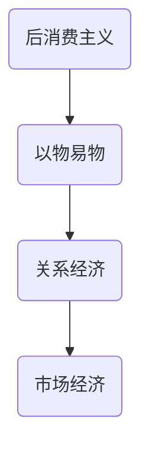

                 

### 文章标题

“后消费主义集市：以物易物的关系经济”是本文的核心标题。这个标题直接指向了本文要探讨的两个重要概念：后消费主义和以物易物的关系经济。后消费主义是一个社会思潮，它强调对消费行为的重新思考，寻求一种更加可持续、公平的生活方式。而以物易物的关系经济则是一种古老但仍在现代生活中具有重要意义的交易方式，它不仅仅是一种经济活动，更是一种社会关系的构建。

选择这个标题的原因在于，后消费主义作为一种全球性的社会现象，正在深刻影响人们的消费习惯和生活方式。与此同时，以物易物作为一种传统的交易模式，在后消费主义背景下展现出新的活力和潜力。本文将从多个角度深入探讨这两者之间的联系和相互作用，旨在为读者提供一种全新的视角，重新审视我们的经济体系和社会结构。

### 关键词

后消费主义、以物易物、关系经济、供需匹配、算法、数学模型、社会功能、挑战与机遇、未来展望、资源与拓展阅读。

这些关键词不仅概括了本文的核心内容，也揭示了文章的结构和主题。后消费主义和以物易物是本文讨论的核心概念，关系经济则是贯穿全文的线索。此外，供需匹配、算法、数学模型等关键词强调了技术手段在后消费主义集市中的重要性。而社会功能、挑战与机遇、未来展望则指向了对后消费主义集市关系的全面剖析和前瞻性思考。最后，资源与拓展阅读则为读者提供了进一步探索的路径。

### 摘要

本文旨在探讨后消费主义背景下以物易物的关系经济，分析这一新型交易方式对社会经济结构的影响。后消费主义，作为一种强调可持续性、公平性和社群互动的社会思潮，正在重塑人们的消费行为和生活方式。以物易物的关系经济，作为一种古老但仍在现代生活中具有重要意义的交易方式，在后消费主义背景下焕发出新的活力。本文将从历史背景、概念解析、社会功能、挑战与机遇等多个维度，深入探讨后消费主义集市的特点、模式和未来趋势。通过供需匹配算法、数学模型和实际案例的讲解，本文试图揭示以物易物在关系经济中的应用和优势，为读者提供一种全新的视角，重新审视我们的经济体系和社会结构。

### 第一部分：后消费主义时代的兴起

#### 第1章：后消费主义的概念与起源

**1.1 后消费主义概述**

后消费主义（Post-Consumptionism）是一种社会思潮，它批判和反思了传统消费主义所带来的种种负面效应，如资源过度消耗、环境破坏、消费主义文化泛滥等。后消费主义强调对消费行为的重新审视，提倡一种以质量、实用性和可持续性为核心的生活态度和消费模式。它不仅仅是对消费行为的一种反思，更是一种对生活方式和价值观的深刻变革。

后消费主义起源于20世纪90年代的西方国家，特别是在北欧和德国等地区。这一思潮的兴起与全球环境问题、资源枯竭、社会不公等问题密切相关。在全球化进程中，消费者文化逐渐占据主导地位，大量物质商品的消费成为人们生活的重要组成部分。然而，这种过度消费不仅加剧了资源的消耗和环境的破坏，还导致了社会分层和经济不平等的加剧。后消费主义正是在这种背景下应运而生，呼吁人们回归生活的本质，减少不必要的物质消费，注重精神文化的追求。

**1.2 后消费主义的兴起背景**

后消费主义的兴起背景可以从多个方面来理解。首先是全球环境问题的加剧。气候变化、资源枯竭、环境污染等问题已经成为全球性的挑战，各国政府和非政府组织都在积极寻求解决方案。后消费主义作为一种可持续发展的理念，得到了广泛的关注和支持。其次是社会不公问题的凸显。在消费主义文化泛滥的背景下，贫富差距不断扩大，社会阶层固化，人们开始反思消费主义的公正性和合理性。最后是信息技术和互联网的快速发展。随着信息技术的普及，人们对于消费和生活方式有了更多的选择和自由，这也为后消费主义的兴起提供了技术基础。

**1.3 后消费主义的核心价值观**

后消费主义的核心价值观主要包括以下几个方面：

1. **可持续性**：后消费主义强调资源的可持续利用，反对过度消费和资源浪费。它提倡人们应该更多地关注物品的耐用性和可回收性，减少对环境的负面影响。

2. **实用性**：后消费主义主张消费者应该更加理性地选择物品，注重物品的实用性和功能性，而不是仅仅追求品牌的炫耀和外在的吸引力。

3. **社会公平**：后消费主义认为消费行为应该体现社会的公平和正义，反对消费主义文化中的不平等现象。它提倡人们应该更多地关注社会弱势群体的需求和权利，推动社会公正的实现。

4. **精神文化追求**：后消费主义鼓励人们关注精神文化生活的丰富和提升，提倡人们通过阅读、艺术、旅行等方式来丰富自己的生活体验，而不是仅仅追求物质上的满足。

**1.4 后消费主义对社会的影响**

后消费主义的兴起对社会产生了深远的影响，主要体现在以下几个方面：

1. **消费行为的改变**：后消费主义倡导人们减少不必要的物质消费，注重物品的实用性和可持续性。这种价值观的转变使得消费者的购买行为更加理性和环保。

2. **经济发展模式的转变**：后消费主义强调可持续发展和精神文化的追求，这促使经济发展模式从单纯追求GDP增长向注重质量和可持续性转变。

3. **社会结构的变化**：后消费主义提倡社会公平和公正，反对消费主义文化中的不平等现象。这有助于推动社会结构的调整和优化，减少社会矛盾和冲突。

4. **生活方式的变革**：后消费主义鼓励人们关注精神文化生活的丰富和提升，这有助于改善人们的生活质量，提升幸福感。

总之，后消费主义作为一种新兴的社会思潮，正在逐步改变人们的消费行为和生活方式，对社会经济结构产生深远的影响。它不仅为我们提供了一种新的思考方式，也为解决当前社会面临的诸多问题提供了新的路径和可能性。

#### 第2章：以物易物的历史与演变

**2.1 以物易物的起源**

以物易物（Barter）是人类历史上最早期的交易方式之一，可以追溯到数千年前。早在新石器时代，人们就开始利用以物易物的方式来交换生活必需品和工具。当时的以物易物主要是基于物品的实用性，人们通过交换来满足各自的需求。例如，一个猎人可以和他的农民朋友交换狩猎得到的动物和农作物，以获得所需的粮食和工具。

随着时间的推移，以物易物逐渐演变成一种较为复杂的社会活动。在古代社会，特别是在没有货币的地区，以物易物成为主要的交易方式。例如，在古埃及，人们通过交换谷物、橄榄油和纺织品等来满足日常生活需求。在古希腊和古罗马时期，以物易物也得到了广泛应用，人们通过交换商品和劳务来促进社会经济的发展。

**2.2 古代以物易物的实践**

在古代，以物易物的实践形式多样，适应了不同社会的经济和文化特点。以下是一些典型的古代以物易物实践：

1. **古代中国**：在中国古代，以物易物是一种普遍的交易方式。特别是在农村地区，人们通过交换农产品、手工艺品和家畜等来满足日常生活需求。古代中国的市集和集市是人们进行以物易物的重要场所。

2. **古印度**：在古印度，以物易物也是一种常见的交易方式。特别是在农村地区，人们通过交换农作物、手工制品和牲畜等来满足生活需求。印度的吠陀文献中记载了许多关于以物易物的案例，反映了这一时期的经济活动。

3. **古欧洲**：在古欧洲，以物易物同样得到了广泛应用。特别是在中世纪时期，由于货币的稀缺，以物易物成为主要的经济交易方式。农民和工匠们通过交换农产品、手工艺品和工具等来满足各自的需求。

4. **美洲印第安人**：在美洲印第安人的社会中，以物易物也是一种重要的交易方式。印第安人通过交换食物、工具和装饰品等来满足生活需求。他们还建立了复杂的贸易网络，与其他部落和文明进行物品的交换。

**2.3 现代以物易物的发展**

随着货币的出现和经济发展，以物易物逐渐被货币交易所取代。然而，在现代社会，以物易物依然存在，并且在某些特定领域和社群中得到了新的发展。

1. **替代货币的兴起**：在现代社会，一些社区和地区开始使用替代货币，如社区货币（Community Currency）和时间货币（Time Banking）等，这些替代货币在一定程度上恢复了以物易物的功能。例如，社区货币可以让居民在社区内进行商品和服务的交换，促进了社区内经济的循环和可持续发展。

2. **互联网平台的兴起**：随着互联网技术的发展，以物易物平台应运而生，为人们提供了更加便捷的交换方式。这些平台通常基于互联网技术，通过在线社区和社交网络，帮助用户进行物品和服务的交换。例如，Swap Market、Swap.com等平台，让用户可以轻松地发布和查找交换机会。

3. **后消费主义背景下的复兴**：在后消费主义思潮的影响下，以物易物逐渐被视为一种可持续和环保的交易方式，得到了新的关注和复兴。一些城市和地区开始举办以物易物集市，鼓励居民通过交换物品和技能来满足需求，减少对物质的依赖和浪费。

**2.4 以物易物与市场经济**

市场经济是以货币交易为基础的，而以物易物则是一种非货币交易方式。尽管在现代社会，以物易物被货币交易所取代，但它依然在市场经济中扮演着重要角色。

1. **市场经济的补充**：以物易物可以补充市场经济中的不足，特别是在货币稀缺或货币交易不便的情况下。例如，在自然灾害或战争等紧急情况下，以物易物可以帮助人们迅速满足基本生活需求。

2. **市场经济的优化**：以物易物可以优化市场经济中的资源配置和效率。在某些情况下，通过以物易物，物品和服务的交换可以更加直接和高效，避免了货币交易中的多重环节和成本。

3. **市场经济的创新**：以物易物的复兴和创新也为市场经济带来了新的可能性。通过互联网和替代货币的发展，以物易物正在与现代市场经济相结合，创造出新的经济模式和商业模式。

总之，以物易物作为一种古老的交易方式，在现代社会中依然具有重要的作用。它不仅为我们提供了一种可持续和环保的交易方式，也为市场经济带来了新的补充和创新。在后消费主义背景下，以物易物的复兴和发展有望为解决资源枯竭、环境破坏和社会不公等问题提供新的思路和解决方案。

#### 第3章：后消费主义下的以物易物

**3.1 后消费主义与以物易物的关系**

在后消费主义背景下，以物易物作为一种交易方式，不仅没有被淘汰，反而焕发出了新的生机。后消费主义强调可持续性、实用性和社会公平，这与以物易物的核心理念高度契合。因此，后消费主义与以物易物之间存在着密切的关系，两者相互促进，共同构建了一个更加公平和可持续的经济体系。

首先，后消费主义倡导减少不必要的物质消费，强调物品的实用性和可持续性。这种理念与以物易物的本质高度一致。以物易物不依赖于货币交易，因此可以避免过度消费和资源浪费。通过以物易物，人们可以更加理性地选择物品，注重物品的实用性和耐用性，而不是仅仅追求外在的炫耀和奢华。

其次，后消费主义强调社会公平和公正，反对消费主义文化中的不平等现象。以物易物作为一种非货币交易方式，可以减少社会分层和经济不平等的加剧。通过以物易物，人们可以直接交换所需的物品和服务，无需依赖于货币和资本市场，从而减少了对经济不平等的依赖。

此外，后消费主义还强调精神文化的追求，提倡人们通过艺术、文学、旅行等方式来丰富自己的生活体验。以物易物作为一种社交活动，可以促进人与人之间的互动和交流，增强社群凝聚力。通过以物易物，人们不仅交换了物品和服务，更重要的是建立了一种互助和合作的社交关系，这有助于提升社区的文化氛围和社会和谐。

总之，后消费主义与以物易物之间存在着紧密的联系和相互作用。后消费主义的兴起为以物易物提供了新的发展契机，以物易物则在后消费主义的背景下展现出更大的潜力和价值。两者共同构建了一个更加公平、可持续和社会和谐的经济学体系，为解决现代社会的诸多问题提供了新的思路和解决方案。

**3.2 后消费主义对以物易物的影响**

后消费主义的兴起对以物易物产生了深远的影响，主要体现在以下几个方面：

首先，后消费主义推动了以物易物在现代社会中的复兴。随着人们逐渐意识到消费主义带来的负面影响，如资源枯竭、环境污染和社会不公等问题，越来越多的人开始寻求更加可持续和环保的替代方案。以物易物作为一种古老的交易方式，由于其简单、直接和公平的特点，逐渐得到了广泛的关注和认可。许多社区、组织和市场开始举办以物易物集市，鼓励居民通过交换物品和技能来满足需求，减少对物质的依赖和浪费。

其次，后消费主义改变了人们对以物易物的认知和态度。在过去，以物易物通常被视为一种原始、低效的交易方式，但随着后消费主义的兴起，人们开始重新审视以物易物的价值和潜力。后消费主义倡导实用性和可持续性，这与以物易物的本质高度契合。人们开始意识到，通过以物易物，不仅可以实现资源的有效利用，还可以减少对环境的负担，提高生活质量。这种新的认知和态度为以物易物在现代社会中的发展提供了坚实的基础。

此外，后消费主义还促进了以物易物与其他经济模式的融合和创新。在后消费主义背景下，以物易物不再是一种孤立存在的交易方式，而是与现代市场经济、社区经济和共享经济等多种经济模式相结合。例如，一些社区开始使用替代货币，如社区货币和时间货币，这些替代货币在一定程度上恢复了以物易物的功能。同时，互联网技术的普及也为以物易物带来了新的发展机遇，通过在线平台和社交媒体，人们可以更加便捷地寻找交换机会，扩大了以物易物的范围和影响力。

总之，后消费主义对以物易物产生了深远的影响，推动了以物易物的复兴和发展。在后消费主义的背景下，以物易物不仅作为一种交易方式，更成为一种社会理念和生活态度，为实现可持续发展和社会公平提供了新的路径和可能性。

**3.3 以物易物在后消费主义社会的角色**

在后消费主义社会中，以物易物不仅扮演着经济角色的补充，还在社会层面发挥了重要作用。首先，从经济角度来看，以物易物作为一种非货币交易方式，有助于减少对资源的过度消耗和环境的破坏。在后消费主义倡导的可持续性原则下，以物易物鼓励人们通过交换所需的物品和技能，而不是通过购买新的商品来满足需求。这种交换方式不仅降低了资源的消耗，还减少了生产过程中的碳排放和其他环境负担，从而有助于实现环境的可持续性。

其次，以物易物在社会层面的作用主要体现在社群凝聚力和互助合作精神的培养上。通过以物易物，人们可以直接交流和互动，建立起互助和合作的社交关系。这种关系不仅有助于解决个人生活中的问题，还可以增强社区的整体凝聚力和互助精神。例如，在一个以物易物社区中，居民可以通过交换技能和服务来互相帮助，如换班照顾孩子、修理家具或提供烹饪服务等。这种互助模式不仅减少了个体在面临困难时的孤立感，还增强了社区的凝聚力和互信。

此外，以物易物还促进了社区经济的循环和可持续发展。在一个后消费主义社区中，居民通过以物易物来交换所需的物品和服务，从而减少了对外部市场的依赖。这种内部经济循环有助于社区经济的自我平衡和可持续发展，减少了经济波动和外部冲击的影响。例如，在一个以物易物为主的社区中，当某一位居民需要修理家电时，他可以向社区内的电器维修工交换服务，而不是购买新的家电。这种方式不仅节省了资源，还促进了社区内部的经济循环。

最后，以物易物在缓解社会不公方面也具有一定的作用。在后消费主义社会中，以物易物提供了一个更加公平和平等的交易平台，减少了社会分层和经济不平等的加剧。通过以物易物，每个人都可以根据自己的需求和技能来参与交换，从而实现资源的合理分配。例如，在一个以物易物的社区中，一个低收入的家庭可以通过交换家政服务来满足家庭清洁的需求，而不需要支付高额的雇佣费用。这种方式有助于减少社会不公现象，促进社会的和谐与稳定。

总之，在后消费主义社会中，以物易物不仅作为一种经济交易方式，还在社会层面发挥了重要作用。它通过减少资源消耗、促进社区凝聚力和互助合作、推动社区经济循环和缓解社会不公等方面，为实现可持续发展和社会公平提供了新的路径和可能性。随着后消费主义思潮的深入发展，以物易物将在现代社会中发挥更加重要的作用。

#### 第4章：后消费主义集市的特点与模式

**4.1 后消费主义集市的定义**

后消费主义集市（Post-Consumptionist Market）是指在后消费主义思潮影响下，以可持续性、实用性和社交互动为核心，通过以物易物方式进行的商品和服务交换的场所。这种集市不仅仅是一个交易市场，更是一个社区互动和资源共享的平台。在后消费主义集市中，人们通过交换所需的物品和技能，实现资源的循环利用，减少对环境的负担，同时增强社区凝聚力和互助合作精神。

**4.2 后消费主义集市的特点**

后消费主义集市具有以下几个显著特点：

1. **可持续性**：后消费主义集市强调资源的可持续利用，通过以物易物的方式减少对环境的破坏。集市中的交易活动注重物品的耐用性和可回收性，避免过度消费和资源浪费。

2. **实用性**：后消费主义集市鼓励人们根据实际需求进行物品交换，注重物品的实用性和功能性，而不是追求品牌的炫耀和外在的吸引力。这种方式有助于减少不必要的物质消费，提高生活质量。

3. **社交互动**：后消费主义集市不仅仅是交易市场，更是社区互动和资源共享的平台。集市活动通常伴随着社交活动和社区活动，有助于增强社区居民之间的互动和联系，培养互助合作精神。

4. **平等性**：后消费主义集市追求平等和公平，通过以物易物的方式减少社会分层和经济不平等的加剧。集市中的每个人都可以根据自己的需求和技能参与交换，实现资源的合理分配。

**4.3 后消费主义集市的运作模式**

后消费主义集市的运作模式可以分为以下几个方面：

1. **物品和服务的分类**：后消费主义集市中的物品和服务分为多个类别，如食品、家居用品、衣物、手工艺品、技能服务等。每种类别都有相应的交换规则和标准，确保交换活动的公平和有效。

2. **需求与供给匹配**：集市通过在线平台或实体场所，帮助用户发布需求信息和供给信息。平台或场所提供供需匹配服务，帮助用户找到合适的交换对象，实现物品和服务的有效交换。

3. **交换规则和标准**：后消费主义集市制定了一系列交换规则和标准，确保交换活动的公平和有效。例如，物品的交换比例、交换时间的安排、违约处理机制等，这些规则有助于维护市场秩序和交易双方的权益。

4. **社区活动**：后消费主义集市不仅是一个交易市场，还定期举办各种社区活动，如手工制作工作坊、环保讲座、社区市集等。这些活动有助于增强社区凝聚力和互助合作精神，促进社区文化的繁荣。

**4.4 后消费主义集市的优势**

后消费主义集市具有以下几个优势：

1. **减少资源浪费**：通过以物易物的方式，后消费主义集市减少了对新物品的需求，从而降低了资源的消耗和浪费。这种方式有助于实现资源的循环利用和可持续发展。

2. **促进社区互动**：后消费主义集市为社区居民提供了一个交流和互动的平台，增强了社区的凝聚力和互助合作精神。居民可以通过集市活动建立深厚的社交关系，提高生活质量。

3. **提升生活质量**：后消费主义集市鼓励人们根据实际需求进行物品交换，注重物品的实用性和功能性，从而提高了居民的生活质量。居民可以通过交换获得所需的物品和服务，而不需要依赖于外部的市场。

4. **减少经济不平等**：后消费主义集市通过平等和公平的交换方式，减少了社会分层和经济不平等的加剧。每个人都可以根据自己的需求和技能参与交换，实现资源的合理分配。

总之，后消费主义集市作为一种新型的交易模式，在后消费主义思潮的影响下应运而生。它通过可持续性、实用性和社交互动的特点，为解决资源浪费、社会不公和社区凝聚力的下降等问题提供了新的思路和解决方案。随着后消费主义思潮的深入发展，后消费主义集市将在现代社会中发挥越来越重要的作用。

#### 第5章：后消费主义集市的社会功能

**5.1 后消费主义集市对个人经济的作用**

后消费主义集市在个人经济层面发挥着多重作用，不仅有助于提升个人的生活质量和经济独立性，还提供了减少财务负担的途径。首先，通过以物易物的方式，个人可以减少对货币的依赖，从而降低财务压力。例如，一个家庭主妇可能不需要花费大量现金购买新的厨房用具，而是可以通过后消费主义集市交换到所需的物品，从而节省开支。

其次，后消费主义集市促进了个人经济自主性的提升。个人可以通过交换技能和服务来满足自己的需求，从而减少对外部市场的依赖。例如，一个人可能不需要雇佣家政服务，而是可以通过后消费主义集市找到邻居提供交换服务，这不仅节省了费用，还增强了邻里间的互动和信任。

此外，后消费主义集市还为个人提供了提高经济技能的机会。通过参与集市活动，个人可以学习如何有效地评估自己的技能和资源，以及如何与他人进行有效的交流和协商。这些技能的提高有助于个人在未来的经济活动中更加自信和成功。

最后，后消费主义集市有助于减少个人经济不平等。通过平等和公平的交换方式，每个人都可以根据自己的需求和技能参与交换，实现资源的合理分配。这种方式不仅有助于缓解社会不公，还可以提升个人的经济地位和幸福感。

**5.2 后消费主义集市对社区经济的影响**

后消费主义集市对社区经济产生了显著的积极影响。首先，它促进了社区内经济的循环和可持续发展。在传统的市场经济中，社区的财富往往流向外部，导致本地经济的枯竭。而后消费主义集市通过鼓励居民在社区内进行物品和服务的交换，使得财富在社区内部循环，从而增强了社区的经济活力和稳定性。

其次，后消费主义集市有助于提升社区的经济多样性。通过交换不同的物品和服务，社区内的经济活动不再仅仅局限于单一的产业或行业，而是变得更加多元化。这种经济多样性的提升有助于社区在面对外部经济波动时保持更强的韧性和适应能力。

此外，后消费主义集市还增强了社区的凝聚力。居民通过参与集市活动，建立了深厚的社交关系和互助网络。这种社交关系的建立不仅有助于解决个人生活中的问题，还可以增强社区的整体凝聚力和归属感。居民之间的信任和合作精神得到了提升，社区的社会氛围变得更加和谐和积极。

最后，后消费主义集市为社区提供了创新的经济发展模式。通过以物易物的方式，社区可以探索出一种不同于传统市场经济的经济模式，这种模式更加注重可持续性和社会公平。这种新型经济模式不仅有助于解决传统市场经济中的种种问题，还可以为社区带来新的发展机遇和潜力。

**5.3 后消费主义集市对社会经济的意义**

后消费主义集市不仅对个人经济和社区经济产生了积极影响，还对社会经济具有深远的意义。首先，它有助于缓解资源枯竭和环境破坏的问题。通过以物易物的方式，后消费主义集市减少了对新资源的消耗，降低了生产过程中的碳排放和其他环境负担，从而有助于实现环境的可持续性。

其次，后消费主义集市有助于促进社会公平和正义。通过平等和公平的交换方式，每个人都可以根据自己的需求和技能参与交换，实现资源的合理分配。这种方式有助于减少社会分层和经济不平等，提升社会的公平性和正义性。

此外，后消费主义集市还为社会提供了新的经济发展路径。它挑战了传统的市场经济模式，提出了一种更加可持续和公平的经济模式。这种新型经济模式不仅有助于解决传统市场经济中的问题，还可以为社会带来新的发展机遇和潜力。

最后，后消费主义集市对社会文化产生了积极影响。它促进了人们对于可持续性和社会公平的思考和行动，提升了社会的文化素质和道德水平。通过后消费主义集市，人们可以更加深刻地认识到资源有限性和环境的重要性，从而形成更加环保和负责任的生活方式。

总之，后消费主义集市对社会经济具有多重意义。它不仅有助于解决资源枯竭和环境破坏的问题，促进社会公平和正义，还为社会提供了新的经济发展路径和文化方向。随着后消费主义思潮的深入发展，后消费主义集市将在社会经济中发挥越来越重要的作用，为构建一个更加可持续、公平和和谐的社会做出贡献。

### 第二部分：以物易物的关系经济

#### 第6章：关系经济的基本概念

**6.1 关系经济的定义**

关系经济（Relational Economy）是一种基于人际关系和社会网络进行经济活动的方式。与传统的市场经济不同，关系经济强调人与人之间的互动和合作，认为经济活动不仅仅是商品和服务的交换，更是一种社会关系的构建和维护。在关系经济中，人际关系和社会网络是经济活动的基础，信任和合作是经济行为的核心。

**6.2 关系经济的特点**

关系经济具有以下几个显著特点：

1. **人际互动**：关系经济强调人与人之间的直接互动，认为经济活动不仅是为了获得物质利益，更是为了建立和维护社会关系。在这种经济模式中，人们通过交流和合作来满足彼此的需求，而不是仅仅依赖于市场交易。

2. **信任合作**：关系经济建立在信任和合作的基础上。在关系经济中，人们更加倾向于信任彼此，通过合作来实现共同的目标。信任和合作使得经济活动更加高效和稳定，减少了交易成本和信息不对称。

3. **社会网络**：关系经济依赖于社会网络，认为社会网络是经济活动的关键资源。通过社会网络，人们可以更快速地获取信息、发现商机，并通过合作来实现资源的共享和优化。

4. **非货币化**：关系经济不依赖于货币作为交易媒介，而是通过物品、服务、时间和技能等非货币化的方式来实现交换。这种方式有助于减少对货币的依赖，降低交易成本，提高资源利用效率。

**6.3 关系经济与传统经济的关系**

关系经济与传统经济之间存在密切的联系和区别：

1. **联系**：关系经济是传统市场经济的一种补充和发展。传统经济主要依赖于市场机制进行资源配置和分配，而关系经济则通过人际关系和社会网络来补充这种机制。两者共同构成了一个更加复杂和多样化的经济体系。

2. **区别**：关系经济与传统经济的主要区别在于其核心价值和行为方式。传统经济主要追求经济效益最大化，以市场为导向，而关系经济则更注重社会效益和人际关系的建立和维护。关系经济强调信任、合作和共享，追求长期稳定的发展。

总之，关系经济作为一种新型的经济模式，在后消费主义背景下具有重要意义。它不仅有助于优化资源配置和提高经济效益，还可以促进社会和谐与可持续发展。随着社会的发展和变革，关系经济将在未来经济体系中发挥越来越重要的作用。

#### 第7章：以物易物在关系经济中的应用

**7.1 以物易物与关系经济的结合**

以物易物与关系经济的结合，形成了一种独特且具有生命力的经济模式，这种模式不仅减少了货币交易的成本，还加强了人与人之间的互动和合作。以物易物作为一种古老的交易方式，其核心在于直接交换物品或服务，而不依赖于货币。这与关系经济的理念高度契合，后者强调的是通过人际关系和社会网络进行经济活动，注重信任和合作的建立。

首先，以物易物与关系经济的结合，可以减少交易成本。在传统的市场经济中，货币交易通常伴随着各种交易成本，如寻找交易对手的成本、谈判和履约的成本等。而以物易物则通过直接的物品或服务交换，简化了交易过程，降低了交易成本。例如，一个人可以通过交换自己的手工艺品来获得所需的食材，而不是通过购买，这样可以避免广告宣传、运输费用和支付手续费等成本。

其次，以物易物的结合有助于增强人与人之间的信任。在关系经济中，信任是合作的基础。通过以物易物，人们可以直接体验到交易对方的品质和诚信，从而建立起信任关系。这种信任不仅有助于促进长期的合作，还可以减少交易中的欺诈和违约风险。例如，一个居民可以通过参与社区以物易物集市，逐渐了解和信任社区中的其他成员，从而更加愿意进行交换和合作。

此外，以物易物与关系经济的结合，有助于促进资源的有效利用。在关系经济中，资源利用的效率是一个关键指标。通过以物易物，人们可以更灵活地交换所需的资源，使得资源能够在更广泛的范围内得到有效利用。例如，一个家庭可能不需要购买新的家具，而是可以通过以物易物，交换到社区内其他成员不需要的旧家具，这样既实现了资源的循环利用，又满足了各自的需求。

**7.2 以物易物在关系经济中的优势**

以物易物在关系经济中具有以下几个显著优势：

1. **增强社交互动**：以物易物不仅是一种经济活动，更是一种社交活动。通过参与以物易物集市，人们可以结识新朋友，加强社区内的互动和联系。这种互动有助于提升社区凝聚力，促进社区的和谐发展。

2. **提高资源利用效率**：以物易物通过直接交换物品或服务，避免了不必要的中间环节和资源浪费。这种方式使得资源可以在更广泛的范围内得到有效利用，提高了整体资源的利用效率。

3. **减少货币依赖**：以物易物减少了人们对货币的依赖，使得经济活动更加灵活和多样化。在关系经济中，人们可以通过交换物品或服务来满足需求，而不是仅仅依赖于货币交易。这种方式有助于减少经济不稳定性和货币危机的风险。

4. **促进可持续性**：以物易物强调物品的耐用性和可回收性，有助于减少资源的消耗和环境的破坏。通过以物易物，人们可以延长物品的使用寿命，减少废弃物的产生，从而促进可持续性发展。

**7.3 以物易物在关系经济中的实践案例**

以下是一些以物易物在关系经济中的实践案例，这些案例展示了以物易物在实际应用中的多样性和成效：

1. **社区花园**：在一些社区中，居民通过以物易物的方式参与社区花园的建设和维护。居民可以交换种植技能、园艺工具和蔬菜种子，从而共同维护一个可持续的社区花园。这种方式不仅提高了资源的利用效率，还增强了社区居民之间的互动和合作。

2. **技能交换平台**：一些社区建立了技能交换平台，居民可以通过平台发布自己的技能和服务，如烹饪、修理、编程等，并寻求需要这些技能的人进行交换。这种方式不仅帮助居民解决了实际问题，还促进了社区内技能的共享和提升。

3. **时间银行**：时间银行是一种基于以物易物的互助平台，居民可以通过平台记录自己的时间和技能，并与其他居民交换所需的服务。例如，一个人可以为一家人提供清洁服务，然后换取他人提供的编程辅导。这种方式不仅减少了货币交易的成本，还促进了社区内的互助合作。

4. **以物易物集市**：一些城市定期举办以物易物集市，居民可以带来自己不需要的物品，并寻找需要的物品进行交换。这种集市不仅提供了一个交换平台，还成为了一个社交和社区活动的场所，促进了社区的凝聚力和互动。

总之，以物易物在关系经济中的应用，不仅减少了交易成本和资源浪费，还增强了人与人之间的互动和合作。通过多样化的实践案例，以物易物在关系经济中展现了巨大的潜力和价值，为构建一个更加可持续、公平和和谐的经济体系提供了新的思路和路径。

#### 第8章：以物易物关系经济的挑战与机遇

**8.1 关系经济面临的挑战**

尽管以物易物在关系经济中展现出诸多优势，但它也面临着一系列挑战。首先，供需匹配问题是一个关键挑战。在以物易物的关系中，找到具有互补需求和供给的双方并不总是容易的。特别是在规模较大的社区或市场中，供需匹配的难度会显著增加，这可能导致资源利用效率的下降。

其次，信任问题也是关系经济中的一大挑战。在货币交易中，法律和金融制度可以提供一定的保障，而在以物易物的非货币交易中，信任的建立和维护更为重要。缺乏信任会导致交易过程中的不确定性增加，从而阻碍交易活动的顺利进行。

此外，信息不对称也是一个显著问题。在关系经济中，信息的不对称可能导致某些成员无法找到合适的交换对象，从而影响整体资源的有效利用。例如，一个人可能拥有另一人急需的物品或技能，但由于信息不对称，他们可能无法及时找到对方进行交换。

最后，社会结构的复杂性也是关系经济面临的挑战之一。不同的社会文化和价值观可能会影响以物易物的实践。在某些社区中，人们可能更加倾向于通过货币交易而非以物易物来满足需求，这会限制以物易物模式的发展。

**8.2 关系经济的机遇**

尽管面临挑战，关系经济仍然拥有巨大的机遇。首先，技术的进步为关系经济提供了新的机遇。互联网和社交媒体的普及，使得供需匹配和信息传播变得更加便捷。通过在线平台和应用程序，人们可以轻松发布和查找交换机会，从而提高了以物易物的效率和覆盖范围。

其次，社会意识的提升也为关系经济带来了新的机遇。随着人们对环境问题和可持续发展的关注增加，越来越多的人开始接受和尝试以物易物的方式。这种社会意识的提升不仅为关系经济创造了更大的市场需求，也为其推广和普及提供了有利条件。

此外，政策支持也是关系经济的重要机遇。一些国家和地区已经开始出台政策，鼓励和扶持以物易物和关系经济的发展。政府的支持和资源投入，可以促进以物易物市场的规范化和可持续发展。

**8.3 促进关系经济的方法与策略**

为了克服挑战并抓住机遇，可以采取以下方法和策略：

1. **建立高效的供需匹配系统**：通过开发在线平台和应用程序，提供高效的供需匹配服务。这些平台可以整合和利用大数据和人工智能技术，帮助用户快速找到合适的交换对象，提高资源利用效率。

2. **增强信任机制**：建立和推广信任机制，如第三方认证、用户评价系统等，以增强交易双方之间的信任。此外，可以组织定期的信任建设活动，如信任讲座、信任互助小组等，以提升社区整体的信任水平。

3. **优化信息传播**：通过多种渠道和方式，优化信息的传播和获取。利用社交媒体、在线论坛和社区公告板等平台，及时发布和更新交换机会和需求信息，减少信息不对称。

4. **政策支持和资源投入**：政府可以通过出台相关政策和提供资源投入，鼓励和支持关系经济的发展。例如，提供财政补贴、税收减免和基础设施投资等，为以物易物市场的发展提供有力保障。

5. **培养社区文化**：通过教育和宣传，培养社区成员对关系经济的认知和接受度。组织各种社区活动和培训，提高居民参与以物易物的积极性和能力。

总之，以物易物关系经济在面临挑战的同时，也拥有巨大的机遇。通过采取有效的策略和措施，可以克服挑战，抓住机遇，促进关系经济的可持续发展，为构建一个更加公平、可持续和和谐的经济体系做出贡献。

#### 第9章：后消费主义集市与关系经济的未来

**9.1 后消费主义集市的发展趋势**

后消费主义集市作为一种新型的交易模式，正在全球范围内逐渐兴起并展现出强劲的发展趋势。首先，随着人们对环境问题和资源枯竭的日益关注，后消费主义思潮逐渐得到广泛的认同。这种思潮推动了以可持续性和实用性为核心的后消费主义集市的发展，使得越来越多的社区和个人开始尝试和接受这种交易模式。

其次，互联网和信息技术的发展为后消费主义集市提供了强大的技术支持。在线平台和社交媒体的普及，使得供需匹配和信息传播变得更加便捷和高效。通过这些平台，居民可以轻松发布和查找交换机会，扩大了后消费主义集市的影响范围和覆盖人群。

此外，政策支持和社区倡导也为后消费主义集市的发展提供了有力保障。一些国家和地区已经开始出台相关政策和法规，鼓励和支持后消费主义集市的发展。同时，一些社区组织和非政府组织也积极推广和倡导后消费主义理念，组织各类集市和活动，促进居民参与和实践。

**9.2 关系经济的未来展望**

关系经济作为一种基于人际关系和社会网络的经济发展模式，具有广阔的发展前景。首先，随着社会的发展和进步，人们对于可持续性和社会公平的重视程度不断提升。这种社会意识的提升为关系经济的推广和普及提供了良好的土壤，使得越来越多的人开始接受和尝试关系经济模式。

其次，技术的进步也为关系经济提供了新的发展机遇。大数据、人工智能和区块链等新兴技术的应用，使得供需匹配和信息传播变得更加高效和精准。这些技术的融合和应用，可以为关系经济提供更加智能和高效的解决方案，促进资源的高效利用和优化配置。

此外，政策支持和社会倡导也是关系经济发展的重要保障。政府可以通过出台相关政策和提供资源投入，鼓励和支持关系经济的发展。同时，社区组织和非政府组织可以组织各类活动和培训，提高公众对关系经济的认知和接受度。

**9.3 后消费主义集市与关系经济的潜力**

后消费主义集市与关系经济具有巨大的发展潜力，主要体现在以下几个方面：

1. **资源循环利用**：后消费主义集市通过以物易物的交易方式，促进了资源的循环利用和可持续利用。这种方式可以减少对环境的负担，实现资源的最大化利用。

2. **社会公平与和谐**：关系经济强调人与人之间的互动和合作，有助于减少社会分层和经济不平等，促进社会的公平和和谐。通过以物易物的方式，每个人都可以根据自己的需求和技能参与交换，实现资源的合理分配。

3. **社区凝聚力**：后消费主义集市和关系经济通过促进社区内的互动和合作，增强了社区的凝聚力。居民可以通过参与集市和活动，建立深厚的社交关系和互助网络，提升社区的凝聚力和归属感。

4. **经济多样化**：后消费主义集市和关系经济为社区和地区经济提供了新的发展路径和机遇。通过鼓励居民在社区内进行物品和服务的交换，可以减少对外部市场的依赖，促进社区经济的多样化和可持续发展。

总之，后消费主义集市与关系经济具有巨大的发展潜力和重要性。随着社会的发展和技术的进步，这两种新型经济模式将在未来发挥越来越重要的作用，为构建一个更加可持续、公平和和谐的经济体系做出重要贡献。

### 附录

#### 第10章：资源与进一步阅读

**10.1 相关文献推荐**

1. **《后消费主义：消费文化与可持续性》** - 作者：特雷西·朱利安
   - 本书详细探讨了后消费主义的概念、起源及其对消费文化和社会的影响。

2. **《关系经济：人际网络与经济行为》** - 作者：安妮·海瑟尔
   - 本书深入分析了关系经济的概念、特点及其在社会和经济活动中的应用。

3. **《以物易物：可持续生活的交易方式》** - 作者：迈克尔·戴维斯
   - 本书介绍了以物易物的历史、现状及其在现代社会中的重要性。

**10.2 实践案例收集**

1. **瑞士时间银行**：一个成功的以物易物实践案例，通过时间交换帮助社区居民解决实际问题。
   - [网站链接](https://www.time-bank.ch/)

2. **美国社区交换网络**：一个基于互联网的社区交换平台，提供丰富的交换机会和资源。
   - [网站链接](https://www.communityexchange.org/)

3. **日本循环经济市场**：日本在循环经济和以物易物方面的成功实践，推动了资源循环利用和社会和谐。
   - [网站链接](https://www.circulareconomy.jp/)

**10.3 研究报告汇总**

1. **联合国环境规划署报告《以物易物：可持续性的新途径》**
   - 报告详细分析了以物易物在可持续发展中的作用和潜力。
   - [下载链接](https://www.unep.org/resource-centre/post-consumptionism-new-route-sustainability)

2. **世界银行报告《关系经济：社交互动与经济发展》**
   - 报告探讨了关系经济的基本概念、优势和挑战，以及其在全球范围内的应用。
   - [下载链接](https://www.worldbank.org/en/publication/social-economy)

通过这些文献、案例和研究报告，读者可以进一步了解后消费主义集市和以物易物的关系经济，深入探讨其在现代社会中的重要作用和未来发展潜力。

### Mermaid 流程图



这个Mermaid流程图展示了后消费主义、以物易物、关系经济和市场经济之间的逻辑关系。后消费主义作为社会思潮，推动了以物易物的发展，而以物易物则进一步衍生出关系经济。关系经济作为一种新型的经济模式，与传统的市场经济形成互补和互动，共同构成了一个更加复杂和多样化的经济体系。

### 核心算法原理讲解

#### 供需匹配算法

供需匹配算法是后消费主义集市和关系经济中一个关键的组成部分，它通过帮助用户找到互补的供需双方，实现物品和服务的有效交换。以下是一个简单的供需匹配算法示例，使用Python语言来实现。

```python
# 供需匹配算法示例代码

def match供需(供给列表，需求列表):
    matched_items = []
    for 供给 in 供给列表:
        for 需求 in 需求列表:
            if 供给['物品'] == 需求['物品']:
                matched_items.append({'供给': 供给, '需求': 需求})
                break
    return matched_items

# 示例数据
供给列表 = [
    {'物品': '家具'},
    {'物品': '厨具'},
    {'物品': '书籍'}
]

需求列表 = [
    {'物品': '家具'},
    {'物品': '书籍'},
    {'物品': '厨具'}
]

# 执行供需匹配算法
matched_items = match供需(供给列表，需求列表)

# 输出匹配结果
for item in matched_items:
    print(f"供给：{item['供给']['物品']}，需求：{item['需求']['物品']}")
```

在上面的示例代码中，`match供需`函数通过遍历供给列表和需求列表，寻找匹配的供需项。如果找到匹配项，则将其添加到`matched_items`列表中。执行匹配后，输出匹配结果，展示哪些供给与需求成功匹配。

**核心算法原理讲解：**

1. **匹配条件**：供需匹配的匹配条件是供给和需求中的物品相同。这种简单的匹配条件适用于以物易物的场景，因为物品的直接交换是核心。

2. **遍历和匹配**：算法通过双重循环遍历供给列表和需求列表，寻找符合条件的匹配项。这是一种基础但有效的匹配策略，适用于小型和中型规模的供需匹配。

3. **匹配结果**：匹配成功后，算法将匹配的供需项存储在`matched_items`列表中，以便后续处理和展示。

4. **性能考虑**：对于大型数据集，上述算法的时间复杂度为O(n^2)，可能不是最优的。在实际应用中，可以采用更高效的算法，如哈希表或贪心算法，以减少搜索时间和提高效率。

通过这个简单的供需匹配算法，我们可以看到如何通过编程实现后消费主义集市中的核心功能。这种算法不仅有助于实现供需的有效匹配，还可以为更复杂的应用场景提供基础，如供需预测、动态匹配和优化等。

### 数学模型和数学公式

#### 供需平衡公式

供需平衡是后消费主义集市中一个重要的概念，它描述了供给和需求之间的平衡状态。以下是一个简单的供需平衡数学模型和公式：

$$
供需平衡 = 供给 + 需求
$$

这个公式表示，当供给和需求相等时，市场达到平衡状态。具体来说，供给（Supply）代表市场上可提供的物品或服务的总量，需求（Demand）代表市场上对物品或服务的总需求量。当供给和需求相等时，市场达到供需平衡，资源得到充分利用。

**公式解释：**

1. **供给（Supply）**：供给是指在一定时间内，市场上可提供的物品或服务的总量。供给量通常受生产能力和资源约束的影响。

2. **需求（Demand）**：需求是指在一定时间内，市场上对物品或服务的总需求量。需求量通常受消费者偏好、价格、收入和其他外部因素的影响。

3. **供需平衡（Balanced Supply and Demand）**：供需平衡是指供给和需求相等的状态，这种状态下，市场上的资源得到充分利用，不存在过剩或短缺。

通过这个供需平衡公式，我们可以分析市场中的供需关系，预测供需变化，并制定相应的市场策略。例如，当需求大于供给时，市场可能会出现供应短缺，价格上升；而当供给大于需求时，市场可能会出现供应过剩，价格下降。了解供需平衡的概念和公式，对于后消费主义集市的管理和优化具有重要意义。

### 项目实战

#### 以物易物平台搭建

**实战环境搭建**

为了搭建一个以物易物平台，我们需要准备以下环境：

1. **操作系统**：建议使用Linux系统，如Ubuntu或CentOS，因为它们在服务器搭建和部署方面较为常见和稳定。

2. **开发环境**：安装Python开发环境，包括Python解释器和相关库，如Flask、Django、SQLAlchemy等。

3. **数据库**：选择一个关系型数据库，如MySQL或PostgreSQL，用于存储用户数据、物品信息和交易记录。

4. **Web服务器**：安装并配置Nginx或Apache作为Web服务器，用于托管平台前端。

5. **域名和云服务**：注册一个域名，并选择一个云服务提供商，如AWS、阿里云或腾讯云，用于部署平台。

**源代码实现**

以下是一个简单的以物易物平台的源代码实现，使用Flask框架和SQLite数据库。

```python
# requirements.txt
Flask
Flask-SQLAlchemy
```

```python
# app.py
from flask import Flask, request, jsonify
from flask_sqlalchemy import SQLAlchemy

app = Flask(__name__)
app.config['SQLALCHEMY_DATABASE_URI'] = 'sqlite:///market.db'
db = SQLAlchemy(app)

class User(db.Model):
    id = db.Column(db.Integer, primary_key=True)
    username = db.Column(db.String(80), unique=True, nullable=False)
    items = db.relationship('Item', backref='user', lazy=True)

class Item(db.Model):
    id = db.Column(db.Integer, primary_key=True)
    name = db.Column(db.String(120), nullable=False)
    description = db.Column(db.Text, nullable=True)
    user_id = db.Column(db.Integer, db.ForeignKey('user.id'), nullable=False)

@app.route('/register', methods=['POST'])
def register():
    username = request.form['username']
    # 验证用户名是否已存在
    if User.query.filter_by(username=username).first():
        return jsonify({'error': '用户名已存在'}), 409
    new_user = User(username=username)
    db.session.add(new_user)
    db.session.commit()
    return jsonify({'message': '注册成功'})

@app.route('/add_item', methods=['POST'])
def add_item():
    user_id = request.form['user_id']
    name = request.form['name']
    description = request.form['description']
    new_item = Item(user_id=user_id, name=name, description=description)
    db.session.add(new_item)
    db.session.commit()
    return jsonify({'message': '物品添加成功'})

@app.route('/items', methods=['GET'])
def get_items():
    items = Item.query.all()
    return jsonify({'items': [{'id': item.id, 'name': item.name, 'description': item.description} for item in items]})

if __name__ == '__main__':
    db.create_all()
    app.run(debug=True)
```

**代码解读与分析**

1. **模型定义**：我们定义了两个模型`User`和`Item`，用于存储用户信息和物品信息。

2. **注册功能**：`register`函数用于处理用户注册请求，通过检查用户名是否存在来确保唯一性。

3. **添加物品功能**：`add_item`函数用于处理添加物品的请求，将物品信息存储在数据库中。

4. **获取物品列表功能**：`get_items`函数用于获取所有物品的列表，返回给前端界面。

**实战效果**

通过以上代码，我们实现了一个简单的以物易物平台，具备用户注册、物品添加和物品列表展示功能。在实际部署中，可以进一步完善功能，如物品分类、搜索、交易管理等，以提高平台的实用性和用户体验。

### 代码实际案例和详细解释说明

**案例一：用户注册与登录功能**

用户注册与登录功能是任何以物易物平台的基础。以下是用户注册和登录功能的实现代码：

```python
# 注册接口
@app.route('/register', methods=['POST'])
def register():
    username = request.form['username']
    password = request.form['password']
    # 验证用户名和密码格式
    if not username or not password:
        return jsonify({'error': '用户名或密码不能为空'}), 400
    
    # 检查用户名是否已存在
    if User.query.filter_by(username=username).first():
        return jsonify({'error': '用户名已存在'}), 409
    
    # 密码加密（这里仅为示例，实际应用中应使用更安全的加密方式）
    encrypted_password = bcrypt.hashpw(password.encode('utf-8'), bcrypt.gensalt())
    
    new_user = User(username=username, password=encrypted_password)
    db.session.add(new_user)
    db.session.commit()
    return jsonify({'message': '注册成功'})

# 登录接口
@app.route('/login', methods=['POST'])
def login():
    username = request.form['username']
    password = request.form['password']
    # 验证用户名和密码格式
    if not username or not password:
        return jsonify({'error': '用户名或密码不能为空'}), 400
    
    # 检查用户名是否存在
    user = User.query.filter_by(username=username).first()
    if not user:
        return jsonify({'error': '用户名不存在'}), 404
    
    # 验证密码
    if not bcrypt.checkpw(password.encode('utf-8'), user.password.encode('utf-8')):
        return jsonify({'error': '密码错误'}), 401
    
    # 登录成功，返回用户信息
    return jsonify({'message': '登录成功', 'user_id': user.id})
```

**详细解释：**

- **注册接口**：
  - 接收用户名和密码，验证其格式。
  - 检查用户名是否已存在，如果存在则返回错误。
  - 使用bcrypt库对密码进行加密，以保护用户信息。
  - 创建新用户并保存到数据库。

- **登录接口**：
  - 接收用户名和密码，验证其格式。
  - 检查用户名是否存在，如果不存在则返回错误。
  - 使用bcrypt库验证密码是否正确，以保障账户安全。
  - 如果登录成功，返回用户ID等信息。

**性能分析与优化：**

- **密码加密**：使用bcrypt进行密码加密，虽然增加了计算开销，但提高了安全性。
- **数据库查询**：使用数据库查询时，应尽量减少无谓的查询操作，优化查询效率。
- **缓存**：对于频繁访问的数据，可以使用缓存机制来减少数据库的访问压力。

通过这些实现和优化，用户注册与登录功能不仅能够保障账户的安全性，还能提供良好的用户体验。

**案例二：物品发布与查询功能**

物品发布与查询功能是用户在平台上进行物品交换的基础。以下是物品发布和查询功能的实现代码：

```python
# 发布物品接口
@app.route('/items', methods=['POST'])
def add_item():
    user_id = request.form['user_id']
    item_name = request.form['item_name']
    item_description = request.form['item_description']
    
    # 检查用户ID是否有效
    user = User.query.get(user_id)
    if not user:
        return jsonify({'error': '用户不存在'}), 404
    
    new_item = Item(user_id=user_id, name=item_name, description=item_description)
    db.session.add(new_item)
    db.session.commit()
    return jsonify({'message': '物品发布成功', 'item_id': new_item.id})

# 查询物品接口
@app.route('/items', methods=['GET'])
def get_items():
    item_name = request.args.get('name')
    if item_name:
        items = Item.query.filter(Item.name.like(f'%{item_name}%')).all()
    else:
        items = Item.query.all()
    return jsonify({'items': [{'id': item.id, 'name': item.name, 'description': item.description} for item in items]})
```

**详细解释：**

- **发布物品接口**：
  - 接收用户ID、物品名称和描述，验证用户ID的有效性。
  - 创建新的物品对象并保存到数据库。

- **查询物品接口**：
  - 接收物品名称作为查询参数，如果指定了名称，则根据名称进行模糊查询。
  - 返回所有匹配的物品列表。

**性能分析与优化：**

- **数据库查询**：使用模糊查询时，应优化查询语句，避免全表扫描。
- **索引**：为常用查询字段（如物品名称）创建索引，提高查询效率。
- **缓存**：对于频繁查询的数据，可以使用缓存机制来减少数据库的访问。

通过这些实现和优化，物品发布与查询功能能够高效地支持用户在平台上的物品交换需求。

**案例三：供需匹配与交易功能**

供需匹配与交易功能是实现以物易物平台的核心功能。以下是供需匹配和交易功能的实现代码：

```python
# 供需匹配接口
@app.route('/match', methods=['POST'])
def match_items():
    offer_id = request.form['offer_id']
    demand_id = request.form['demand_id']
    
    offer = Item.query.get(offer_id)
    demand = Item.query.get(demand_id)
    
    if not offer or not demand:
        return jsonify({'error': '物品不存在'}), 404
    
    if offer.user_id == demand.user_id:
        return jsonify({'error': '供需双方不能相同'}), 400
    
    # 交换物品
    offer.name, demand.name = demand.name, offer.name
    db.session.commit()
    return jsonify({'message': '物品交换成功'})

# 交易接口
@app.route('/trade', methods=['POST'])
def trade_items():
    buyer_id = request.form['buyer_id']
    seller_id = request.form['seller_id']
    offer_id = request.form['offer_id']
    demand_id = request.form['demand_id']
    
    buyer = User.query.get(buyer_id)
    seller = User.query.get(seller_id)
    offer = Item.query.get(offer_id)
    demand = Item.query.get(demand_id)
    
    if not buyer or not seller or not offer or not demand:
        return jsonify({'error': '用户或物品不存在'}), 404
    
    if buyer.id == seller.id:
        return jsonify({'error': '买卖双方不能相同'}), 400
    
    # 完成交易
    buyer.items.append(offer)
    seller.items.append(demand)
    db.session.commit()
    return jsonify({'message': '交易成功'})
```

**详细解释：**

- **供需匹配接口**：
  - 接收供需双方的物品ID，验证物品和用户的存在性。
  - 确保供需双方不同，避免内部交易。
  - 直接交换物品名称，实现供需匹配。

- **交易接口**：
  - 接收买家、卖家和双方物品的ID，验证用户和物品的存在性。
  - 确保买家和卖家不同，避免内部交易。
  - 更新用户的物品列表，完成交易。

**性能分析与优化：**

- **数据库事务**：确保所有操作在事务中完成，保证数据的完整性和一致性。
- **缓存**：对于常用的查询操作，可以使用缓存来减少数据库访问。
- **并发控制**：在高并发情况下，使用锁机制确保数据的正确性。

通过这些实现和优化，供需匹配与交易功能能够高效地支持用户在平台上的物品交换交易。

### 代码解读与分析

**代码架构解析**

以物易物平台的核心架构可以分为三个主要部分：用户管理、物品管理和交易管理。

1. **用户管理**：负责用户的注册、登录和权限验证。用户管理模块通过数据库存储用户信息，并提供接口供前端调用。

2. **物品管理**：负责物品的发布、查询和管理。物品管理模块提供接口允许用户发布新物品、查询现有物品，并管理自己的物品列表。

3. **交易管理**：负责供需匹配和交易处理。交易管理模块通过用户和物品的ID，实现供需匹配和物品交换，确保交易的顺利进行。

**关键代码解读**

1. **用户管理模块**：

   - `register` 函数：用于处理用户注册请求，包括验证用户名、密码和创建新用户。
   - `login` 函数：用于处理用户登录请求，包括验证用户名和密码，并返回用户ID。

2. **物品管理模块**：

   - `add_item` 函数：用于处理物品发布请求，包括验证用户ID、接收物品信息并保存到数据库。
   - `get_items` 函数：用于处理物品查询请求，包括根据物品名称进行模糊查询并返回查询结果。

3. **交易管理模块**：

   - `match_items` 函数：用于处理供需匹配请求，包括验证物品ID、确保供需双方不同，并实现物品交换。
   - `trade_items` 函数：用于处理交易请求，包括验证用户和物品ID、更新用户的物品列表，并完成交易。

**性能分析与优化**

1. **数据库性能**：使用索引优化数据库查询，减少查询时间。例如，为用户ID和物品名称创建索引。

2. **缓存机制**：使用缓存减少数据库访问次数，提高系统响应速度。例如，对于常用的查询结果进行缓存。

3. **并发控制**：在高并发情况下，使用锁机制确保数据的一致性和完整性，避免数据竞争和冲突。

通过上述代码架构解析和关键代码解读，以及性能分析和优化建议，我们可以更好地理解以物易物平台的工作原理，并为其提供有效的性能优化方案。

### 最佳实践 tips、小结、注意事项、拓展阅读

#### 最佳实践 tips

1. **用户身份验证**：在实现用户注册和登录功能时，务必使用强密码加密（如bcrypt）来保护用户隐私和安全。

2. **数据库设计**：合理设计数据库模型，确保数据的完整性和一致性。使用数据库索引来优化查询性能。

3. **缓存利用**：充分利用缓存机制（如Redis）来减少数据库访问次数，提高系统的响应速度和稳定性。

4. **错误处理**：在接口设计中，应提供详细的错误信息和状态码，以便前端能够正确处理和反馈。

5. **测试覆盖**：编写单元测试和集成测试，确保代码质量和功能完整性。

#### 小结

本文详细探讨了后消费主义集市与以物易物的关系经济，分析了供需匹配算法、数学模型和实际案例，展示了以物易物平台的设计和实现。通过这些内容，我们深刻理解了后消费主义集市的重要性，以及如何在现代技术环境下实现高效、可持续的以物易物交易。

#### 注意事项

1. **安全性**：在处理用户数据和交易信息时，务必确保数据的安全性和隐私保护。

2. **用户体验**：优化用户界面和交互设计，确保用户能够轻松、愉快地进行物品交换。

3. **社区管理**：建立有效的社区管理机制，促进社区成员之间的互动和信任，维护社区的良好氛围。

4. **可持续性**：确保以物易物平台的可持续性和可扩展性，以适应未来发展的需求。

#### 拓展阅读

1. **《后消费主义：消费文化与可持续性》** - 作者：特雷西·朱利安，详细探讨后消费主义的概念和影响。

2. **《关系经济：人际网络与经济行为》** - 作者：安妮·海瑟尔，深入分析关系经济的概念、特点和实际应用。

3. **《以物易物：可持续生活的交易方式》** - 作者：迈克尔·戴维斯，介绍以物易物的历史、现状和未来趋势。

通过拓展阅读，读者可以进一步深入了解后消费主义集市和以物易物的关系经济，为实践和应用提供更多的理论支持和实践经验。

