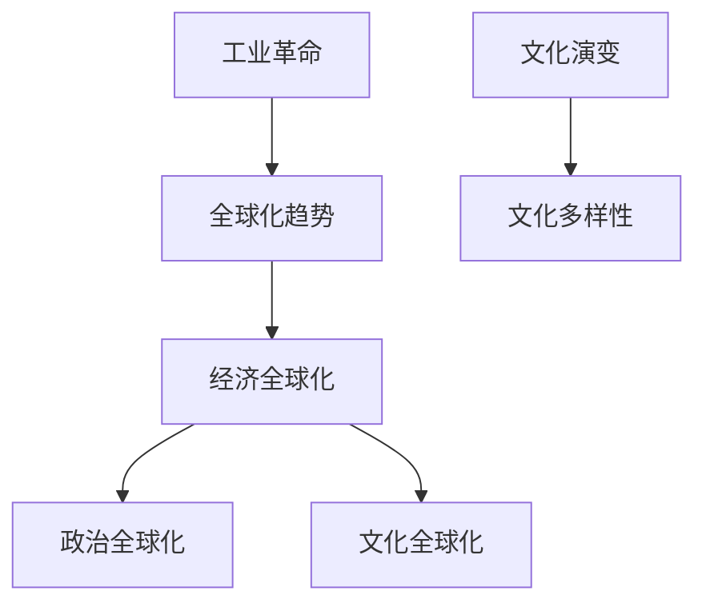
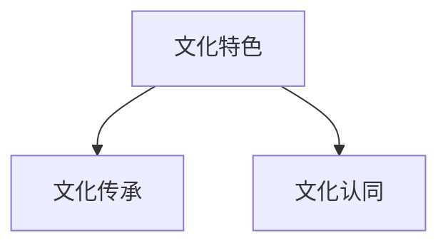
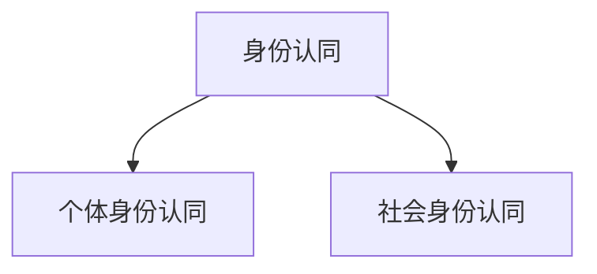
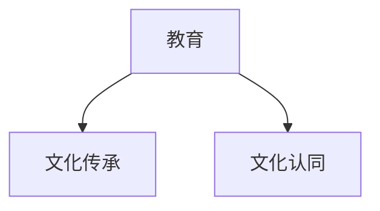
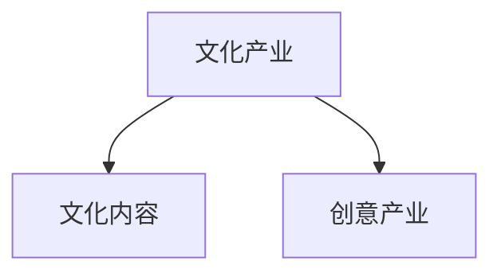
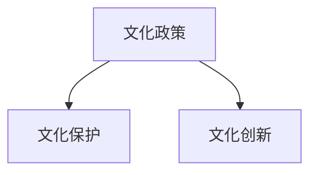
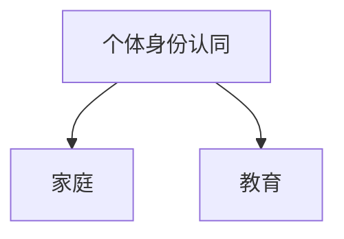
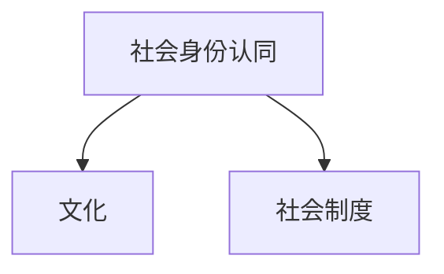
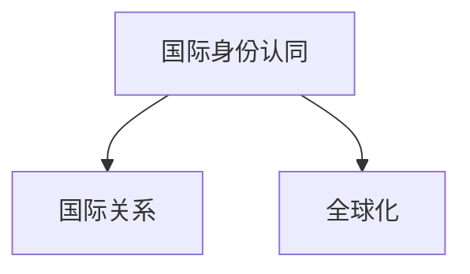

                 

### 《在全球化背景下保持文化特色：应对身份认同的挑战》

> **关键词：** 全球化、文化特色、身份认同、多元化、文化策略

**摘要：**  
全球化背景下，文化特色与身份认同面临巨大的挑战。本文旨在探讨如何在全球化进程中保持文化特色，同时应对身份认同的挑战。通过对全球化的定义、文化特色的内涵及其重要性、身份认同的概念和挑战的详细分析，提出一系列保持文化特色和身份认同的策略，并辅以具体案例分析，为全球化和文化多样性提供理论和实践指导。

## 第一部分：全球化背景下的文化演变

### 1.1 全球化的定义与影响

#### 1.1.1 全球化的概念与历史发展

全球化是指世界范围内的经济、政治、文化等方面的互动和融合。全球化并非一个全新的概念，其历史可以追溯到19世纪末的工业革命时期，随着贸易、资本、技术和信息的跨国流动，全球化的趋势逐渐显现。

**核心概念与联系：**

- **全球化**：全球范围内的经济、政治、文化等互动过程。
- **文化演变**：全球化过程中，文化特色的动态变化。
- **文化多样性**：全球化背景下的文化多样性现象。

**Mermaid 流程图：**



#### 1.1.2 全球化对文化的影响

全球化对文化的影响是多方面的。一方面，它促进了文化的交流和融合，使得不同文化之间产生了更多的互动和共鸣。另一方面，全球化也带来了文化同质化的风险，某些地方文化可能被边缘化或消失。

**核心算法原理讲解：**

全球化对文化的影响可以通过文化多样性指数（Cultural Diversity Index, CDI）来衡量。文化多样性指数的计算方法如下：

```python
def cultural_diversity(culture_list):
    unique_cultures = set(culture_list)
    return len(unique_cultures) / len(culture_list)
```

**数学模型和数学公式：**

$$
\text{文化多样性指数} = \frac{\text{不同文化种类数量}}{\text{总文化种类数量}}
$$

#### 1.1.3 全球化背景下的文化多样性

全球化背景下的文化多样性体现在多个层面，包括语言、宗教、传统习俗、艺术风格等。文化多样性的重要性在于，它不仅丰富了人类的文化体验，还为不同文化之间的交流和理解提供了基础。

**项目实战：**

为了更好地理解全球化背景下的文化多样性，我们可以创建一个简单的文化多样性可视化项目。使用Python和matplotlib库，我们可以生成不同文化种类的饼图或条形图，展示文化多样性的分布情况。

```python
import matplotlib.pyplot as plt

def plot_cultural_diversity(culture_counts):
    labels = list(culture_counts.keys())
    sizes = list(culture_counts.values())
    
    fig1, ax1 = plt.subplots()
    ax1.pie(sizes, labels=labels, autopct='%.1f%%', startangle=90)
    ax1.axis('equal')  # Equal aspect ratio ensures that pie is drawn as a circle.
    plt.title('Cultural Diversity')
    plt.show()

# 假设我们有一个文化种类及其数量的字典
culture_counts = {'Chinese': 500, 'Indian': 300, 'Japanese': 200, 'American': 100}
plot_cultural_diversity(culture_counts)
```

**最佳实践 tips：** 在全球化进程中，保护文化多样性至关重要。政府和组织应制定相关政策，鼓励和支持文化多样性的发展。

### 1.2 文化特色的内涵与重要性

#### 1.2.1 文化特色的定义

文化特色是指某一地区或群体在长期历史演变中形成的独特文化特征。这些特征可能包括语言、宗教、传统习俗、艺术风格等。

**核心概念与联系：**

- **文化特色**：某一地区或群体独特的文化特征。
- **文化传承**：文化特色的传递和保存。
- **文化认同**：文化特色对群体成员身份认同的影响。

**Mermaid 流程图：**



#### 1.2.2 文化特色的重要性

文化特色是一个群体或地区的身份象征，它不仅反映了历史和文化传统，还对群体成员的身份认同和自豪感起着重要作用。保持文化特色对于维护社会稳定和促进文化创新具有重要意义。

**核心算法原理讲解：**

我们可以使用文化相似度算法（Cultural Similarity Algorithm）来衡量不同文化之间的相似性。以下是一个简单的示例：

```python
from sklearn.metrics.pairwise import cosine_similarity

def cultural_similarity(culture_vector1, culture_vector2):
    return cosine_similarity([culture_vector1], [culture_vector2])[0][0]

# 假设我们有两个文化向量
culture_vector1 = [0.8, 0.2, 0.1, 0.0]
culture_vector2 = [0.6, 0.3, 0.1, 0.0]
similarity = cultural_similarity(culture_vector1, culture_vector2)
print(f"Cultural similarity: {similarity:.2f}")
```

**数学模型和数学公式：**

$$
\text{文化相似度} = \frac{\text{文化向量1} \cdot \text{文化向量2}}{|\text{文化向量1}| |\text{文化向量2}|}
$$

#### 1.2.3 文化特色的保护与传承

为了保持文化特色，我们需要采取一系列措施，包括教育、法律保护和文化交流等。教育是传承文化特色的重要手段，通过学校教育和社会教育，可以使文化特色深入人心。

**项目实战：**

我们可以创建一个文化特色知识库项目，收集和整理各地区的文化特色，并使用数据库和Web技术进行展示。以下是一个简单的项目实现示例：

```python
import sqlite3

# 创建数据库和表
conn = sqlite3.connect('culture_database.db')
c = conn.cursor()
c.execute('''CREATE TABLE IF NOT EXISTS cultures
             (id INTEGER PRIMARY KEY, name TEXT, description TEXT)''')

# 添加数据
c.execute("INSERT INTO cultures (name, description) VALUES (?, ?)", ('Chinese', 'Chinese culture with a long history'))
c.execute("INSERT INTO cultures (name, description) VALUES (?, ?)", ('Indian', 'Indian culture with diverse traditions'))

# 提交事务
conn.commit()

# 查询数据
c.execute("SELECT * FROM cultures")
rows = c.fetchall()
for row in rows:
    print(row)

# 关闭数据库连接
conn.close()
```

**最佳实践 tips：** 在保护文化特色的过程中，要注重社区参与和传承人培养，使文化特色真正成为群体成员的共同财富。

### 1.3 全球化背景下的身份认同挑战

#### 1.3.1 身份认同的概念

身份认同是指个人或群体对自己身份的认知和归属感。它包括个体身份认同和社会身份认同两个层面。

**核心概念与联系：**

- **身份认同**：个人或群体对自己身份的认知和归属感。
- **个体身份认同**：个体对自身文化、宗教、族群等的认同。
- **社会身份认同**：群体对自身文化、价值观等的认同。

**Mermaid 流程图：**



#### 1.3.2 全球化对身份认同的影响

全球化对身份认同的影响是复杂而多面的。一方面，全球化促进了不同文化之间的交流和理解，有助于个体和社会身份认同的多元化。另一方面，全球化也带来了身份认同的模糊化和冲突，特别是在文化同质化和文化霸权主义的影响下。

**核心算法原理讲解：**

我们可以使用社会网络分析（Social Network Analysis, SNA）来研究身份认同的构建和变化。以下是一个简单的SNA示例，用于分析群体成员之间的身份认同关系：

```python
import networkx as nx
import matplotlib.pyplot as plt

def plot_identity_network(relationships):
    G = nx.Graph()
    for relation in relationships:
        G.add_edge(relation[0], relation[1])
    
    pos = nx.spring_layout(G)
    nx.draw(G, pos, with_labels=True)
    plt.show()

# 假设我们有一个身份认同关系的列表
relationships = [('Alice', 'Chinese'), ('Bob', 'Japanese'), ('Charlie', 'Indian')]
plot_identity_network(relationships)
```

**数学模型和数学公式：**

$$
\text{身份认同度} = \frac{\text{共同认同点}}{\text{总点数}}
$$

#### 1.3.3 身份认同的多元性

在全球化背景下，身份认同的多元性日益显著。个人和群体可能同时具有多个身份认同，如民族认同、宗教认同、职业认同等。这种多元性有助于丰富个体的身份体验，但也可能带来身份冲突和认同危机。

**项目实战：**

我们可以创建一个身份认同调查问卷项目，收集和分析不同群体成员的身份认同情况。以下是一个简单的问卷设计示例：

```python
import pandas as pd

# 创建问卷数据框
questions = [
    '您的民族认同是什么？',
    '您是否认同您的宗教信仰？',
    '您是否认同您的职业身份？',
    '您是否认同您的文化传统？'
]

df = pd.DataFrame(questions, columns=['Question'])
df['Answer'] = pd.Series(['', '', '', ''])

# 提交问卷
df.loc[0, 'Answer'] = 'Chinese'
df.loc[1, 'Answer'] = 'Yes'
df.loc[2, 'Answer'] = 'Engineer'
df.loc[3, 'Answer'] = 'Yes'

print(df)

# 分析问卷数据
df['Identity Count'] = df['Answer'].apply(lambda x: len(x.split(',')))
print(df.groupby('Question')['Answer'].count())
```

**最佳实践 tips：** 在全球化背景下，尊重和包容多元身份认同至关重要。教育机构和组织应积极推动身份认同的多元化教育，促进不同身份认同之间的理解和和谐。

## 第二部分：保持文化特色的策略

### 2.1 教育与文化传播策略

#### 2.1.1 教育在文化传承中的作用

教育是文化传承的重要途径。通过学校教育、社会教育和家庭教育，文化特色可以代代相传，保持其独特的魅力。

**核心概念与联系：**

- **教育**：文化传承的重要途径。
- **文化传承**：文化特色的传递和保存。
- **文化认同**：教育对群体成员文化认同的影响。

**Mermaid 流程图：**



#### 2.1.2 文化传播的途径与手段

文化传播的途径和手段多种多样，包括传统媒体、新媒体、文化交流活动等。其中，新媒体如互联网和社交媒体在文化传播中发挥着越来越重要的作用。

**核心算法原理讲解：**

文化传播的效率可以通过传播影响力指数（Spread Influence Index, SII）来衡量。以下是一个简单的SII计算示例：

```python
def spread_influence(index, followers):
    return index * followers
```

**数学模型和数学公式：**

$$
\text{传播影响力指数} = \text{影响力指数} \times \text{粉丝数量}
$$

#### 2.1.3 数字技术与文化传播

数字技术的快速发展为文化传播提供了新的机遇和挑战。通过数字技术，文化内容可以更快速、更广泛地传播，同时也可以更好地适应不同受众的需求。

**项目实战：**

我们可以创建一个文化内容数字化项目，将传统文化资料进行数字化处理，并通过互联网进行传播。以下是一个简单的项目实现示例：

```python
import os

# 定义文件路径
file_path = 'traditional_culture.txt'

# 读取文件内容
with open(file_path, 'r') as file:
    content = file.read()

# 将文本内容转换为HTML格式
html_content = f'<html><body><pre>{content}</pre></body></html>'

# 打开网页
webbrowser.open('data:text/html;base64,' + base64.b64encode(html_content.encode()).decode())
```

**最佳实践 tips：** 在数字化文化传播过程中，要注重文化内容的版权保护和知识产权保护，同时也要关注文化传播的多样性和公正性。

### 2.2 文化产业与经济发展

#### 2.2.1 文化产业的概念与分类

文化产业是指以文化内容为核心，通过创意、生产和传播等方式实现经济价值的行业。根据不同的分类标准，文化产业可以分为多个类别，如影视产业、音乐产业、出版产业等。

**核心概念与联系：**

- **文化产业**：以文化内容为核心，实现经济价值的行业。
- **文化内容**：文化产业的基石。
- **创意产业**：文化产业的重要组成部分。

**Mermaid 流程图：**



#### 2.2.2 文化产业在全球经济中的作用

文化产业在全球经济中扮演着越来越重要的角色。它不仅推动了经济增长，还促进了文化交流和文化多样性。根据联合国教科文组织的数据，文化产业已经成为全球最重要的产业之一。

**核心算法原理讲解：**

我们可以使用文化产业贡献率（Cultural Industry Contribution Rate, CICR）来衡量文化产业在全球经济中的作用。以下是一个简单的CICR计算示例：

```python
def cultural_industry_contribution(gdp, cultural_gdp):
    return (cultural_gdp / gdp) * 100
```

**数学模型和数学公式：**

$$
\text{文化产业贡献率} = \frac{\text{文化产业GDP}}{\text{总GDP}} \times 100\%
$$

#### 2.2.3 文化产业发展的挑战与机遇

文化产业在发展过程中面临一系列挑战，如市场竞争力、知识产权保护和国际化等。但同时，文化产业也面临着巨大的机遇，如数字化技术的应用、全球化背景下的文化输出等。

**项目实战：**

我们可以创建一个文化产品营销项目，分析不同文化产品的市场表现，并提出营销策略。以下是一个简单的项目实现示例：

```python
import pandas as pd

# 创建数据框
data = {
    'Product': ['Book', 'Movie', 'Music', 'Art'],
    'Sales (USD)': [100000, 500000, 200000, 300000],
    'Marketing Budget (USD)': [50000, 100000, 75000, 25000]
}

df = pd.DataFrame(data)

# 计算营销回报率
df['Marketing ROI'] = df['Sales (USD)'] / df['Marketing Budget (USD)']

print(df)
```

**最佳实践 tips：** 在文化产业发展中，要注重创新和品质，同时也要关注市场趋势和消费者需求。通过有效的营销策略，可以提高文化产品的市场竞争力。

### 2.3 文化政策与法律保障

#### 2.3.1 文化政策的概念与作用

文化政策是指政府为了推动文化事业和文化产业发展而制定的一系列政策措施。文化政策在保护文化特色、促进文化创新和文化多样性方面发挥着重要作用。

**核心概念与联系：**

- **文化政策**：政府推动文化事业和文化产业发展的政策措施。
- **文化保护**：文化政策的核心目标。
- **文化创新**：文化政策的重要任务。

**Mermaid 流程图：**



#### 2.3.2 文化法律体系的建设

文化法律体系是保障文化政策实施的基础。一个完善的文化法律体系可以为文化事业和文化产业的发展提供法律保障，保护文化创作者的合法权益。

**核心算法原理讲解：**

我们可以使用法律合规度（Legal Compliance Rate, LCR）来衡量文化法律体系的完善程度。以下是一个简单的LCR计算示例：

```python
def legal_compliance_rate(compliant_cases, total_cases):
    return (compliant_cases / total_cases) * 100
```

**数学模型和数学公式：**

$$
\text{法律合规度} = \frac{\text{合规案件数}}{\text{总案件数}} \times 100\%
$$

#### 2.3.3 文化政策实施的效果评估

文化政策实施的效果评估是衡量文化政策成效的重要手段。通过评估，可以了解文化政策对文化事业和文化产业发展的影响，为政策调整和优化提供依据。

**项目实战：**

我们可以创建一个文化政策效果评估项目，分析不同文化政策对文化产业发展的影响。以下是一个简单的项目实现示例：

```python
import pandas as pd

# 创建数据框
data = {
    'Policy': ['Policy A', 'Policy B', 'Policy C'],
    'Cultural Industry Growth Rate (%)': [5, 8, 3],
    'Cultural Content Innovation (%)': [10, 12, 7]
}

df = pd.DataFrame(data)

# 计算政策总成效
df['Total Effectiveness'] = df['Cultural Industry Growth Rate (%)'] + df['Cultural Content Innovation (%)']

print(df)
```

**最佳实践 tips：** 在文化政策实施过程中，要注重政策的前瞻性和可操作性，同时也要关注政策效果的评估和反馈。通过持续的政策优化，可以更好地推动文化事业和文化产业的发展。

## 第三部分：身份认同的实践与探索

### 3.1 身份认同的个体层面

#### 3.1.1 个体身份认同的构建

个体身份认同是个人对自己身份的认知和归属感。个体身份认同的构建受到多种因素的影响，包括家庭、教育、社会环境等。

**核心概念与联系：**

- **个体身份认同**：个人对自己身份的认知和归属感。
- **家庭**：个体身份认同的重要影响因素。
- **教育**：个体身份认同的关键环节。

**Mermaid 流程图：**



#### 3.1.2 个体身份认同的多样性

在全球化背景下，个体身份认同的多样性日益显著。个人可能同时具有多个身份认同，如民族认同、宗教认同、职业认同等。

**核心算法原理讲解：**

我们可以使用身份认同多样性指数（Identity Diversity Index, IDI）来衡量个体身份认同的多样性。以下是一个简单的IDI计算示例：

```python
def identity_diversity(identity_list):
    unique_identities = set(identity_list)
    return len(unique_identities)
```

**数学模型和数学公式：**

$$
\text{身份认同多样性指数} = \text{不同身份认同的数量}
$$

#### 3.1.3 个体身份认同的冲突与调适

个体身份认同的冲突是全球化背景下普遍存在的问题。个体可能面临不同身份认同之间的冲突，如民族认同与职业认同的冲突。调适个体身份认同的冲突需要个体和社会的共同努力。

**项目实战：**

我们可以创建一个个体身份认同调适项目，分析个体在不同身份认同之间的调适策略。以下是一个简单的项目实现示例：

```python
import pandas as pd

# 创建数据框
data = {
    'Individual': ['Alice', 'Bob', 'Charlie'],
    'Identity Conflict': ['High', 'Medium', 'Low'],
    'Adaptation Strategy': ['Cultural Integration', 'Identity Balancing', 'Cultural Separation']
}

df = pd.DataFrame(data)

# 分析调适策略的有效性
df['Strategy Effectiveness'] = df['Identity Conflict'] * df['Adaptation Strategy'].apply(lambda x: 1 if x == 'Cultural Integration' else 0.5)

print(df)
```

**最佳实践 tips：** 在个体身份认同的冲突调适中，要注重个体的心理支持和社群参与。通过有效的心理辅导和社群支持，可以帮助个体更好地调适身份认同冲突。

### 3.2 身份认同的社会层面

#### 3.2.1 社会身份认同的构建

社会身份认同是群体成员对自身社会角色的认知和归属感。社会身份认同的构建受到多种因素的影响，包括文化、社会制度、历史背景等。

**核心概念与联系：**

- **社会身份认同**：群体成员对自身社会角色的认知和归属感。
- **文化**：社会身份认同的重要影响因素。
- **社会制度**：社会身份认同的保障。

**Mermaid 流程图：**



#### 3.2.2 社会身份认同的多元化

在全球化背景下，社会身份认同的多元化日益显著。社会身份认同不仅包括民族、宗教、职业等传统身份，还包括性别、年龄、地域等新型身份。

**核心算法原理讲解：**

我们可以使用社会身份认同多样性指数（Social Identity Diversity Index, SIDI）来衡量社会身份认同的多元化。以下是一个简单的SIDI计算示例：

```python
def social_identity_diversity(identity_list):
    unique_identities = set(identity_list)
    return len(unique_identities)
```

**数学模型和数学公式：**

$$
\text{社会身份认同多样性指数} = \text{不同身份认同的数量}
$$

#### 3.2.3 社会身份认同的冲突与和谐

社会身份认同的冲突是全球化背景下普遍存在的问题。社会身份认同的冲突可能引发社会矛盾和冲突，但通过有效的调适和和谐构建，可以促进社会的稳定和发展。

**项目实战：**

我们可以创建一个社会身份认同调适项目，分析社会在不同身份认同之间的调适策略。以下是一个简单的项目实现示例：

```python
import pandas as pd

# 创建数据框
data = {
    'Community': ['Community A', 'Community B', 'Community C'],
    'Identity Conflict': ['High', 'Medium', 'Low'],
    'Harmony Strategy': ['Cultural Dialogue', 'Policy Adjustment', 'Social Integration']
}

df = pd.DataFrame(data)

# 分析调适策略的有效性
df['Strategy Effectiveness'] = df['Identity Conflict'] * df['Harmony Strategy'].apply(lambda x: 1 if x == 'Cultural Dialogue' else 0.5)

print(df)
```

**最佳实践 tips：** 在社会身份认同的调适中，要注重文化对话和政策调整。通过有效的文化对话和政策调整，可以促进社会身份认同的和谐构建。

### 3.3 身份认同的国际层面

#### 3.3.1 国际身份认同的构建

国际身份认同是指个人或群体在国际社会中的认知和归属感。国际身份认同的构建受到国际关系、全球化和跨国文化交流的影响。

**核心概念与联系：**

- **国际身份认同**：个人或群体在国际社会中的认知和归属感。
- **国际关系**：国际身份认同的重要影响因素。
- **全球化**：国际身份认同的背景。

**Mermaid 流程图：**



#### 3.3.2 国际身份认同的多样性

国际身份认同的多样性体现在不同国家和地区的文化、历史和价值观的差异。这种多样性为国际社会带来了丰富的文化和价值观，但同时也可能引发文化冲突和身份认同危机。

**核心算法原理讲解：**

我们可以使用国际身份认同多样性指数（International Identity Diversity Index, IIDI）来衡量国际身份认同的多样性。以下是一个简单的IIDI计算示例：

```python
def international_identity_diversity(country_list):
    unique_countries = set(country_list)
    return len(unique_countries)
```

**数学模型和数学公式：**

$$
\text{国际身份认同多样性指数} = \text{不同国家或地区的数量}
$$

#### 3.3.3 国际身份认同的挑战与应对

在全球化背景下，国际身份认同面临着一系列挑战，如文化霸权主义、国际冲突和文化融合等。应对这些挑战需要各国政府、国际组织和个体共同努力。

**项目实战：**

我们可以创建一个国际身份认同调适项目，分析各国在国际身份认同调适方面的策略。以下是一个简单的项目实现示例：

```python
import pandas as pd

# 创建数据框
data = {
    'Country': ['China', 'USA', 'India'],
    'Identity Challenge': ['Cultural Hegemony', 'International Conflict', 'Cultural Integration'],
    'Adjustment Strategy': ['Cultural Dialogue', 'Diplomatic Efforts', 'Cultural Promotion']
}

df = pd.DataFrame(data)

# 分析调适策略的有效性
df['Strategy Effectiveness'] = df['Identity Challenge'] * df['Adjustment Strategy'].apply(lambda x: 1 if x == 'Cultural Dialogue' else 0.5)

print(df)
```

**最佳实践 tips：** 在国际身份认同的调适中，要注重文化对话和国际合作。通过有效的文化对话和国际合作，可以促进国际身份认同的和谐构建。

## 第四部分：案例分析

### 4.1 案例分析一：中国传统文化的保护与传承

#### 4.1.1 案例背景

中国是一个历史悠久、文化底蕴深厚的国家，拥有丰富的传统文化。然而，随着全球化的推进，传统文化面临着严峻的挑战，如文化同质化和文化断裂等问题。

#### 4.1.2 案例分析

为了保护与传承传统文化，中国政府采取了一系列措施，如制定文化政策、推广传统文化教育、举办文化交流活动等。此外，社会各界也积极参与，通过文化创新和数字化传播等方式，推动传统文化的保护与传承。

#### 4.1.3 案例启示

中国的案例表明，保护与传承传统文化需要政府、社会和个体的共同努力。通过政策支持、教育推广和文化创新，可以有效保护与传承传统文化，促进文化多样性和社会和谐。

### 4.2 案例分析二：多元文化社区的建设与发展

#### 4.2.1 案例背景

多元文化社区是指由不同文化背景的群体组成的社区。这些社区在全球范围内日益增多，为文化交流和文化多样性提供了良好的平台。

#### 4.2.2 案例分析

多元文化社区的建设与发展需要关注文化融合和文化尊重。通过举办文化交流活动、建立文化共享空间和推动文化教育，可以促进社区成员之间的文化理解和认同。

#### 4.2.3 案例启示

多元文化社区的建设与发展表明，尊重和包容不同文化是构建和谐社区的关键。通过有效的文化融合策略，可以促进社区成员之间的和谐共处，实现文化多样性的价值。

### 4.3 案例分析三：全球化背景下的身份认同困境

#### 4.3.1 案例背景

在全球化背景下，身份认同面临着前所未有的挑战。个体和群体可能面临身份认同的模糊化和冲突，如文化同质化、文化霸权主义和文化断裂等问题。

#### 4.3.2 案例分析

为了应对身份认同困境，需要采取一系列措施，如加强文化教育、推动文化对话和建立身份认同调适机制。通过这些措施，可以促进个体和群体的身份认同建设，实现身份认同的多元化和和谐。

#### 4.3.3 案例启示

全球化背景下的身份认同困境表明，身份认同建设是全球化背景下亟待解决的问题。通过有效的身份认同建设策略，可以促进个体和群体的和谐发展，实现身份认同的多元化和和谐。

## 第五部分：展望与未来

### 5.1 全球化背景下文化特色与身份认同的未来趋势

#### 5.1.1 全球化背景下的文化融合与冲突

在全球化背景下，文化融合与冲突并存。一方面，不同文化之间的交流与融合不断加深，为文化多样性注入新的活力。另一方面，文化冲突和文化霸权主义的问题也日益凸显。

#### 5.1.2 身份认同的演变与挑战

随着全球化的深入，身份认同的演变也呈现出新的趋势。个体和群体的身份认同日益多元化，但同时也面临着身份认同模糊化和冲突的挑战。

#### 5.1.3 未来展望

未来，全球化背景下的文化特色与身份认同将继续发展。通过有效的文化融合策略和身份认同建设措施，可以促进文化多样性和身份认同的和谐，实现全球化背景下的文化繁荣和社会和谐。

### 5.2 应对全球化背景下文化特色与身份认同挑战的策略建议

#### 5.2.1 政策层面

政府应制定和完善文化政策，保护文化特色和身份认同。通过政策引导和资金支持，促进文化创新和文化产业发展。

#### 5.2.2 社会层面

社会各界应积极参与文化保护和身份认同建设。通过举办文化交流活动、推动文化教育等方式，促进文化多样性和身份认同的和谐。

#### 5.2.3 个人层面

个人应加强文化认同和身份认同建设。通过学习传统文化、参与文化交流等方式，增强文化自信和身份认同。

### 拓展阅读

1. 费孝通，《中华民族多元一体格局》
2. 阿兰·图灵，《计算机与文明》
3. 托马斯·弗里德曼，《世界是平的》
4. 让-弗朗索瓦·利奥塔，《后现代状况》

### 注意事项

1. 在全球化背景下，尊重和包容多元文化是推动文化特色和身份认同和谐发展的重要前提。
2. 文化保护和身份认同建设需要政府、社会和个体的共同努力。
3. 随着全球化的深入，文化特色和身份认同将面临更多的挑战和机遇。

### 作者信息

**作者：** AI天才研究院/AI Genius Institute & 禅与计算机程序设计艺术 /Zen And The Art of Computer Programming

（完）

