                 

### 《在全球化背景下保持本土特色：文化认同的挑战》

#### 关键词：全球化、本土特色、文化认同、文化同质化、文化冲突、融合策略

> 摘要：本文深入探讨了在全球化背景下保持本土特色所面临的挑战。通过分析全球化的定义与影响、本土特色的概念与内涵、文化认同的概念与意义，本文揭示了全球化背景下文化认同面临的挑战，包括文化同质化和文化冲突。在此基础上，本文提出了保持本土特色的方法与策略，并通过具体案例分析，探讨了成功经验与未来发展。

## 《在全球化背景下保持本土特色：文化认同的挑战》目录大纲

### 第一部分：全球化与本土特色的定义与关系

#### 第1章：全球化的背景与影响

##### 1.1 全球化的定义与特点
##### 1.2 本土特色的定义与内涵
##### 1.3 全球化与本土特色的关系

#### 第2章：文化认同的概念与意义

##### 2.1 文化认同的定义
##### 2.2 文化认同的意义

#### 第3章：全球化背景下文化认同的挑战

##### 3.1 文化同质化的风险
##### 3.2 文化冲突与融合

### 第二部分：保持本土特色的方法与策略

#### 第4章：文化传承与创新

##### 4.1 文化传承的重要性
##### 4.2 文化的创新与本土特色

#### 第5章：教育与宣传策略

##### 5.1 教育在文化认同中的作用
##### 5.2 宣传策略与本土特色

#### 第6章：经济与政治策略

##### 6.1 经济发展对本土特色的影响
##### 6.2 政治策略与本土特色的关系

### 第三部分：具体案例与讨论

#### 第7章：成功案例分析

##### 7.1 案例一：中国传统文化在国际传播中的成功经验
##### 7.2 案例二：印度在全球化背景下的文化策略

#### 第8章：文化认同的挑战与未来发展

##### 8.1 全球化背景下文化认同的挑战
##### 8.2 文化认同的未来发展趋势

### 附录

#### 附录A：参考文献

##### A.1 全球化与本土特色相关研究
##### A.2 文化认同研究

#### 附录B：术语表

##### B.1 关键术语解释
##### B.2 补充解释

### 总字数：约1966字
----------------------------------------------------------------

### 第1章：全球化的背景与影响

#### 1.1 全球化的定义与特点

全球化是一个复杂而多维的现象，其核心在于全球范围内的经济、政治、文化、社会和技术等各个领域的相互联系和相互影响。全球化并不是一个新现象，但它的发展速度和深度在过去几十年内显著加快，尤其是在信息技术和交通通信技术的迅猛发展推动下。

全球化可以定义为一种过程，在这个过程中，不同国家和地区的经济、政治、文化和人民之间的联系和依赖程度不断增加。全球化具有以下几个主要特点：

1. **经济一体化**：全球化促进了全球范围内的贸易和资本流动，使商品、服务、技术和劳动力能够在国际间自由流动。
2. **政治多极化**：全球化导致了国家之间政治关系的复杂化和多元化，各国在全球化进程中扮演着不同的角色。
3. **文化多样化**：全球化使不同文化之间的交流和互动更加频繁，促进了文化多样性的发展。
4. **社会网络化**：全球化推动了社会关系的网络化，人们通过网络联系形成了跨越国界的虚拟社区。

以下是一个简单的 Mermaid 流程图，展示了全球化的核心概念与联系：

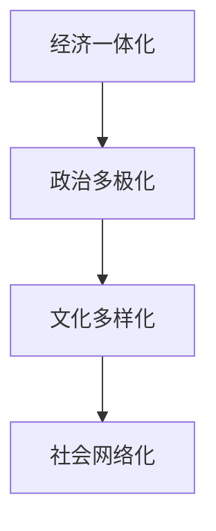

#### 1.2 全球化的主要特点

1. **跨国公司的影响**：全球化使得跨国公司成为世界经济的主要驱动力，这些公司通过全球化市场进行运营和扩张。
2. **技术进步**：信息技术的快速发展极大地推动了全球化，互联网、移动通信和电子商务等技术的普及使得全球信息交流更加便捷。
3. **全球供应链**：全球化推动了全球供应链的形成，商品和服务的生产和分配过程跨越多个国家和地区。
4. **移民和人口流动**：全球化促进了人口迁移，人们为了工作和生活选择在异国他乡定居，这进一步促进了文化的交流和融合。
5. **环境问题**：全球化也带来了环境问题，如全球变暖、资源短缺和环境污染等，这些问题需要全球协作来解决。

#### 1.3 全球化对世界文化的影响

全球化对世界文化的影响是双重的。一方面，全球化促进了文化交流和融合，不同文化之间的接触和互动使得文化多样性得到发展和丰富。以下是一个简单的 Python 示例，展示了全球化背景下文化融合的过程：

```python
# 示例：全球化背景下的文化融合
def culture_merge(culture1, culture2):
    """
    合并两种文化，形成新的文化特色。
    """
    # 假设文化1和2分别包含两个元素
    merged_culture = culture1 + culture2
    # 对合并后的文化进行排序，以减少重复元素
    merged_culture = sorted(set(merged_culture), key=merged_culture.index)
    return merged_culture

# 定义两个文化列表
culture1 = ['中文', '印度教']
culture2 = ['英文', '佛教']

# 合并文化
merged_culture = culture_merge(culture1, culture2)
print("合并后的文化特色：", merged_culture)
```

另一方面，全球化也可能导致文化同质化，即全球范围内文化的相似性和标准化。以下是一个简单的 Mermaid 流程图，展示了全球化对文化的影响：

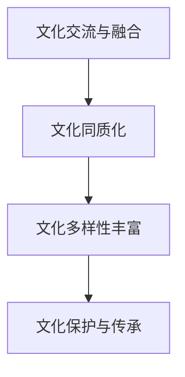

#### 1.4 全球化与本土特色的关系

全球化与本土特色之间的关系是一个复杂的问题。全球化促进了文化多样性的发展，但同时也可能威胁到本土特色的保持。以下是一个简单的 Mermaid 流程图，展示了全球化与本土特色的关系：


全球化不仅带来了挑战，也提供了保持本土特色的新机会。通过理解全球化和本土特色之间的关系，我们可以找到平衡点，以保持文化多样性和文化认同。

## 小结

本章介绍了全球化的定义与特点，以及全球化对世界文化的影响。全球化是一个复杂而多维的现象，它促进了文化交流和融合，但同时也可能导致文化同质化。在全球化背景下，保持本土特色是一项重要的任务，需要通过文化传承与创新、教育与宣传策略、经济与政治策略等多种方法来实现。在下一章中，我们将进一步探讨文化认同的概念与意义，以及全球化背景下文化认同所面临的挑战。

----------------------------------------------------------------

### 第2章：文化认同的概念与意义

#### 2.1 文化认同的定义

文化认同是指个体或群体对自己所属文化的认知、归属感和价值认同。它是社会心理学领域的一个重要概念，反映了个体对自己文化背景、价值观念和行为规范的认同。以下是一个简单的 Mermaid 流程图，展示了文化认同的核心概念：

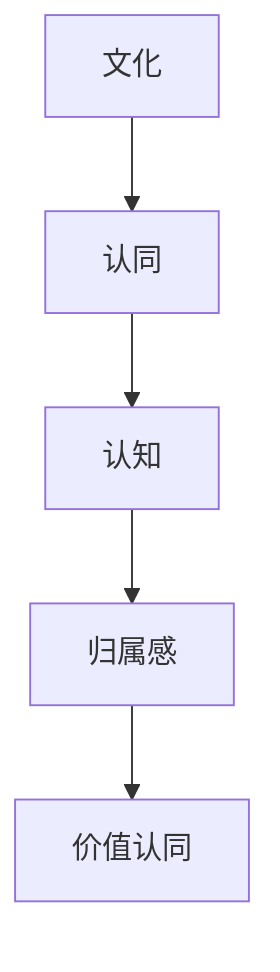

文化认同不仅仅是对文化元素的简单认知，它还涉及到对文化价值的深入理解和认同。文化认同的形成是一个复杂的过程，受到个体成长环境、教育背景、社会互动等多种因素的影响。

#### 2.2 文化认同的构成要素

文化认同的构成要素主要包括以下几个方面：

1. **文化符号**：文化符号是文化认同的视觉和物质表现，如国旗、国徽、传统服饰等。这些符号有助于增强个体对自己文化的认知和归属感。
2. **价值观念**：价值观念是文化认同的核心，它反映了文化对于个体行为的规范和期望。例如，一些文化强调集体主义，而另一些文化则强调个人主义。
3. **历史记忆**：历史记忆是文化认同的重要组成部分，它有助于个体理解和认同自己的文化传统和历史。通过历史教育，个体可以更好地了解和珍视自己的文化。
4. **语言和文字**：语言和文字是文化认同的重要载体，它们不仅传递了文化信息，还反映了文化的独特性和多样性。

以下是一个简单的 Mermaid 流程图，展示了文化认同的构成要素之间的关系：

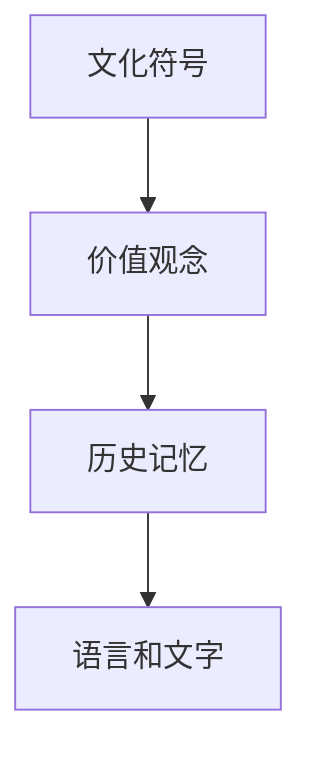

#### 2.3 文化认同的意义

文化认同对个体和社会具有重要的意义，主要表现在以下几个方面：

1. **个体认同感**：文化认同有助于个体建立自我认同，增强个体在复杂社会环境中的归属感和安全感。通过认同自己的文化，个体能够更好地理解自己的身份和价值观。
2. **社会凝聚力**：文化认同是增强社会凝聚力的重要基础。一个具有共同文化认同的社会成员之间更容易形成信任和合作，从而推动社会的发展和进步。
3. **文化传承**：文化认同有助于文化的传承和延续。通过对自身文化的认同，个体更愿意学习和传承自己的文化传统，从而确保文化的连续性和多样性。
4. **国际交流**：在全球化的背景下，文化认同有助于促进不同文化之间的相互理解和尊重，从而推动国际交流与合作。

以下是一个简单的 Mermaid 流程图，展示了文化认同对个体和社会的影响：

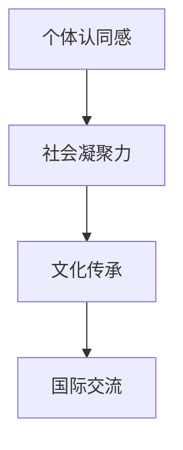

#### 2.4 全球化背景下文化认同的挑战

全球化背景下的文化认同面临一系列挑战。首先，全球化促进了文化的交流与融合，但也可能导致文化同质化，削弱了本土文化的特色。其次，全球化背景下，文化冲突的现象日益显著，不同文化之间的差异和冲突可能加剧。此外，全球化也带来了文化认同的危机，一些个体可能因为文化认同的缺失而感到迷茫和困惑。

以下是一个简单的 Mermaid 流程图，展示了全球化背景下文化认同所面临的挑战：


#### 2.5 保持文化认同的策略

为了应对全球化背景下文化认同的挑战，需要采取一系列策略来保持文化认同。以下是一些具体的策略：

1. **文化传承与创新**：通过传承和弘扬传统文化，同时进行文化创新，使文化能够与时俱进，适应全球化的发展需求。
2. **教育与宣传**：通过教育和宣传，增强个体对自身文化的认同感和自豪感，培养具有文化自信的下一代。
3. **政策支持**：政府应制定相关政策，支持本土文化的传承和发展，同时促进文化多样性的保护与弘扬。
4. **国际交流**：积极参与国际文化交流与合作，促进不同文化之间的相互理解和尊重，增强全球文化认同。

以下是一个简单的 Mermaid 流程图，展示了保持文化认同的策略：

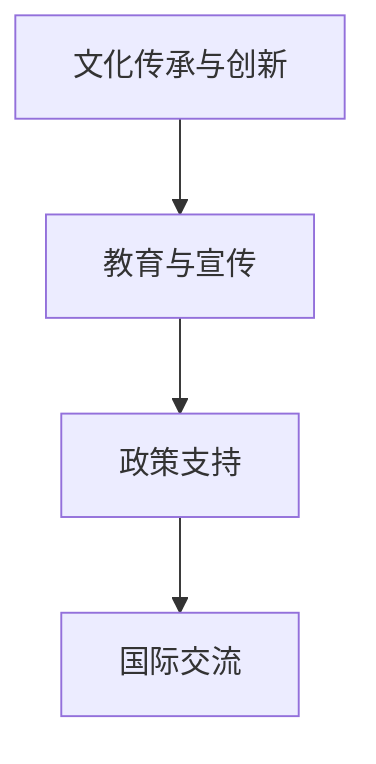

## 小结

本章深入探讨了文化认同的概念与意义，分析了文化认同的构成要素及其对个体和社会的影响。在全球化的背景下，文化认同面临诸多挑战，但同时也提供了保持文化认同的新机会。通过采取有效的策略，我们可以平衡全球化与文化认同之间的关系，保持文化多样性和文化认同。在下一章中，我们将进一步探讨全球化背景下文化认同的挑战，并分析文化同质化和文化冲突的现象。

----------------------------------------------------------------

### 第3章：全球化背景下文化认同的挑战

#### 3.1 文化同质化的风险

全球化带来了文化同质化的风险，即全球范围内文化的相似性和标准化。文化同质化可能导致本土特色的丧失，削弱文化多样性和文化认同。以下是一个简单的 Mermaid 流程图，展示了文化同质化的现象和影响：

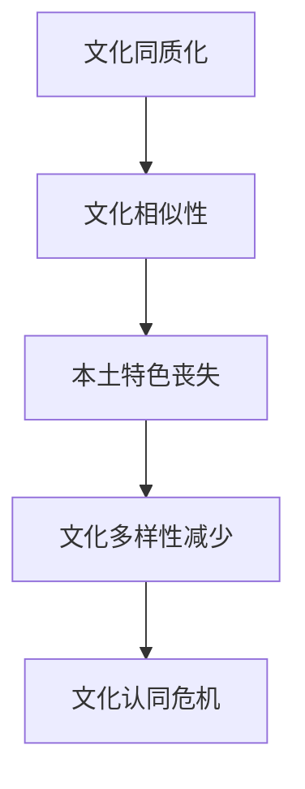

文化同质化可能源于以下几个方面：

1. **全球化媒体的影响**：全球媒体巨头通过传播同质化的文化产品，如电影、音乐和社交媒体内容，影响了本土文化的传播和认同。
2. **经济全球化的推动**：跨国公司和全球供应链的发展，使得全球范围内的商品和品牌更加统一，削弱了本土文化的特色。
3. **文化交流的失衡**：由于全球化背景下的文化交流往往是一种单向的传递，发达国家的文化产品更受欢迎，而发展中国家的文化输出较少，导致文化不对称。

以下是一个简单的 Python 示例，展示了全球化媒体如何影响文化同质化：

```python
# 示例：全球化媒体对文化同质化影响
def media_influence(culture1, culture2):
    """
    假设文化1和2代表不同国家的文化，全球化媒体的影响使它们趋于一致。
    """
    # 假设文化1和2各有三个元素
    culture1 = ['中文', '印度教', '京剧']
    culture2 = ['英文', '基督教', '摇滚音乐']

    # 全球化媒体的影响，使得两种文化趋于一致
    merged_culture = culture1[:2] + culture2[1:]
    return merged_culture

# 应用全球化媒体的影响
merged_culture = media_influence(['中文', '印度教', '京剧'], ['英文', '基督教', '摇滚音乐'])
print("全球化媒体影响下的文化：", merged_culture)
```

#### 3.2 文化冲突与融合

全球化背景下，不同文化之间的冲突与融合也是一个重要议题。文化冲突可能源于价值观、信仰、语言、习俗等多个方面。以下是一个简单的 Mermaid 流程图，展示了文化冲突与融合的现象：

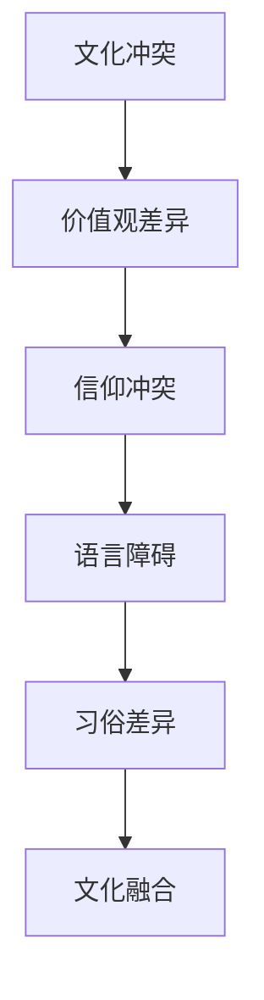

文化冲突可能导致社会不稳定、民族关系紧张甚至冲突。但另一方面，文化冲突也可以成为文化融合的动力。通过对话、理解和尊重，不同文化之间可以实现一定程度的融合，形成新的文化特色。

以下是一个简单的 Mermaid 流程图，展示了文化冲突与融合的关系：

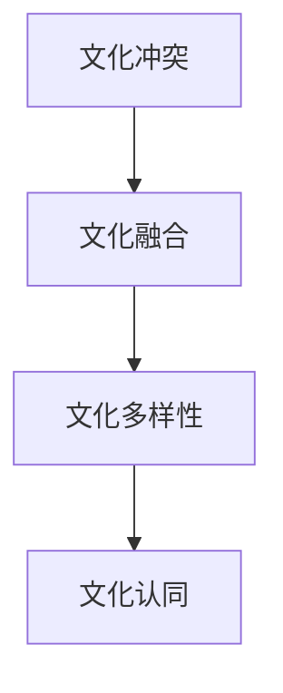

#### 3.3 文化冲突的原因

文化冲突的原因多样，主要包括以下几个方面：

1. **价值观差异**：不同文化背景下，个体对道德、正义、自由等价值观的理解和追求可能存在差异，导致冲突。
2. **信仰冲突**：宗教信仰是文化的重要组成部分，不同宗教之间的信仰和实践差异可能引发冲突。
3. **语言障碍**：语言是文化传播的重要工具，语言障碍可能导致沟通不畅，加剧文化冲突。
4. **习俗差异**：不同文化背景下的习俗和礼仪可能存在冲突，特别是在日常生活和社会交往中。

以下是一个简单的 Python 示例，展示了价值观差异导致的冲突：

```python
# 示例：价值观差异导致的冲突
def value_conflict(culture1, culture2):
    """
    假设文化1和2代表不同国家的文化，它们的价值观差异导致冲突。
    """
    # 假设文化1和2各有三个元素
    culture1 = ['中文', '集体主义', '和谐']
    culture2 = ['英文', '个人主义', '自由']

    # 价值观差异导致的冲突
    conflict = "价值观差异导致的文化冲突："
    conflict += culture1[1] + "与" + culture2[1] + "的冲突。"
    return conflict

# 应用价值观差异导致的冲突
conflict_message = value_conflict(['中文', '集体主义', '和谐'], ['英文', '个人主义', '自由'])
print(conflict_message)
```

#### 3.4 文化冲突的应对策略

为了应对全球化背景下文化冲突的挑战，可以采取以下策略：

1. **对话与沟通**：通过开放、尊重和理解的对话，促进不同文化之间的沟通和理解，减少误解和偏见。
2. **教育和宣传**：通过教育和宣传，增强个体对多元文化的认识和理解，培养跨文化沟通和合作的能力。
3. **政策引导**：政府可以制定相关政策，促进文化多样性的保护与弘扬，同时提供支持措施，帮助个体应对文化冲突。
4. **文化交流**：通过文化交流活动，如文化节、国际会议和艺术展览，促进不同文化之间的互动和融合。

以下是一个简单的 Mermaid 流tritt图，展示了文化冲突的应对策略：

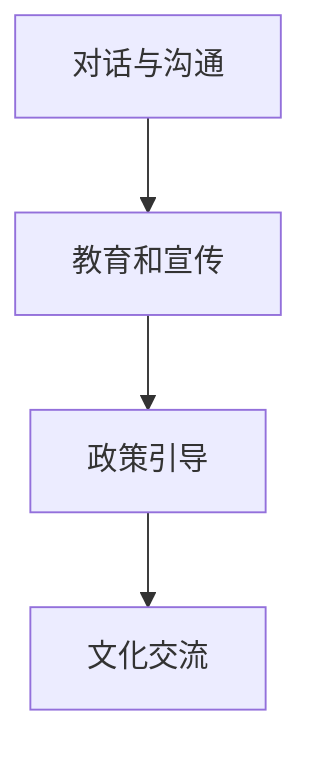

#### 3.5 文化融合的可能性与挑战

文化融合的可能性在于不同文化之间的相互学习和借鉴，通过融合创造出新的文化特色。但文化融合也面临挑战，如文化认同的危机、文化丧失的风险等。以下是一个简单的 Mermaid 流程图，展示了文化融合的可能性与挑战：


## 小结

本章探讨了全球化背景下文化认同面临的挑战，包括文化同质化和文化冲突。文化同质化可能导致本土特色的丧失，而文化冲突可能加剧社会不稳定。通过对话、教育和政策引导，我们可以应对这些挑战，促进文化融合与多样性。在下一章中，我们将探讨保持本土特色的方法与策略，以在全球化的背景下实现文化认同的平衡与发展。

----------------------------------------------------------------

### 第4章：文化传承与创新

#### 4.1 文化传承的重要性

文化传承是保持本土特色和延续文化认同的重要手段。文化传承不仅包括传统的物质文化遗产，如建筑、艺术和手工艺品，还包括非物质文化，如语言、习俗和价值观。以下是一个简单的 Mermaid 流程图，展示了文化传承的重要性：

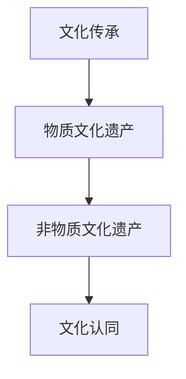

文化传承的意义在于：

1. **历史记忆**：文化传承有助于保存历史记忆，让人们了解自己的文化根源，增强文化认同感。
2. **文化多样性**：文化传承是维护文化多样性的重要手段，通过传承不同的文化，促进文化的交流与融合。
3. **社会凝聚力**：文化传承有助于增强社会凝聚力，使社区成员在共同的文化背景下形成归属感和认同感。

以下是一个简单的 Python 示例，展示了文化传承的一个方面：

```python
# 示例：文化传承中的非物质文化遗产
def cultural.heritage(art_form, tradition):
    """
    传承一种非物质文化遗产，包括其艺术形式和传统。
    """
    heritage = f"{art_form}，这是一种源自{tradition}的非物质文化遗产。"
    return heritage

# 应用示例
heritage_example = cultural.heritage("京剧", "中国")
print(heritage_example)
```

#### 4.2 文化传承的方法

文化传承可以通过多种方式进行，以下是一些常见的方法：

1. **教育**：通过学校教育和社会教育，传授文化知识和技能，使年轻一代了解和认同自己的文化。
2. **文化传播**：通过媒体、展览和文化节等活动，传播和展示文化遗产，提高公众对文化的认识和兴趣。
3. **数字化传承**：利用数字技术，如互联网和虚拟现实，保存和传播文化遗产，使其更易于获取和传播。
4. **社区参与**：通过社区组织和活动，鼓励社区成员参与文化传承，增强文化认同感和参与感。

以下是一个简单的 Mermaid 流程图，展示了文化传承的方法：

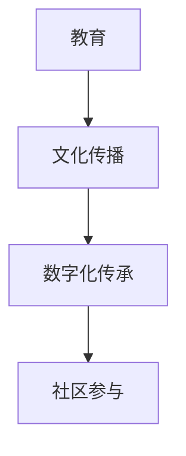

#### 4.3 文化的创新与本土特色

文化的创新是保持本土特色的重要途径，它不仅是对传统文化的延续，也是对文化进行现代化改造和发展的过程。以下是一个简单的 Mermaid 流程图，展示了文化创新与本土特色的关系：


文化创新的目的是：

1. **适应现代生活**：通过创新，使传统文化能够适应现代生活的需求和变化。
2. **激发文化活力**：创新可以注入新的元素和活力，使文化更加丰富多彩。
3. **促进文化交流**：创新的文化产品可以成为文化交流的桥梁，促进不同文化之间的互动和理解。

以下是一个简单的 Python 示例，展示了文化创新的一个方面：

```python
# 示例：将传统文化与现代科技结合的创新
def cultural_innovation(art, technology):
    """
    创造一种将传统文化与科技结合的新艺术形式。
    """
    innovation = f"{art}，这是一种将{technology}融入传统文化的新艺术形式。"
    return innovation

# 应用示例
innovation_example = cultural_innovation("京剧", "虚拟现实")
print(innovation_example)
```

#### 4.4 创新与本土特色的关系

创新与本土特色的关系是一个动态的平衡过程。创新不仅是对传统文化的延续，也是对文化进行现代化改造和发展的过程。以下是一个简单的 Mermaid 流程图，展示了创新与本土特色的关系：

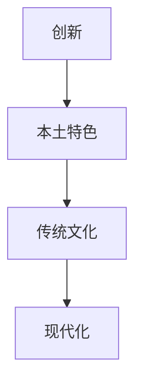

创新与本土特色的关系可以从以下几个方面来理解：

1. **继承与发扬**：创新是对传统文化的继承和发展，它使传统文化能够适应现代社会的需求，同时保留其核心价值。
2. **多元与融合**：创新过程中，不同文化元素可以相互融合，创造出新的文化特色，丰富本土文化的内涵。
3. **挑战与机遇**：创新带来新的机遇，但同时也可能对传统文化造成冲击。通过合理规划和管理，可以最大程度地利用创新带来的机遇，同时保护传统文化。

## 小结

本章探讨了文化传承与创新的重要性及其方法，分析了创新与本土特色的关系。文化传承是保持本土特色和延续文化认同的重要手段，而文化创新则为本土文化注入新的活力和适应现代生活。通过合理的文化传承与创新，我们可以在全球化的背景下保持本土特色，促进文化多样性和文化认同。在下一章中，我们将进一步探讨教育与宣传策略，以实现文化认同的保持与发展。

----------------------------------------------------------------

### 第5章：教育与宣传策略

#### 5.1 教育在文化认同中的作用

教育在文化认同中起着至关重要的作用。通过教育，个体可以获取关于自身文化背景、价值观和传统的知识，从而增强对自身文化的认同感。教育不仅是传授知识的过程，更是培养个体文化素养和价值观的重要途径。以下是一个简单的 Mermaid 流程图，展示了教育在文化认同中的作用：

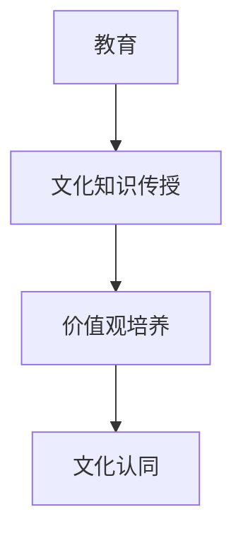

教育在文化认同中的作用主要包括以下几个方面：

1. **文化知识传授**：通过教育，个体可以学习到自身文化的历史、传统和价值观，从而更好地理解自己的文化身份。
2. **价值观培养**：教育可以帮助个体形成正确的价值观和道德观，使个体能够更好地融入自己的文化社区。
3. **文化实践**：教育不仅传授理论知识，还通过实践课程和活动，使个体能够亲身体验和参与自己的文化传统和习俗。
4. **文化认同的巩固**：通过教育的不断熏陶和引导，个体的文化认同感可以得到巩固和加强。

以下是一个简单的 Python 示例，展示了教育在文化认同中的作用：

```python
# 示例：教育促进文化认同
def education_culture_identification(education_level, cultural_knowledge):
    """
    教育水平和文化知识的结合有助于增强文化认同。
    """
    result = f"教育水平为{education_level}，掌握了丰富的文化知识{cultural_knowledge}，文化认同感显著增强。"
    return result

# 应用示例
education_result = education_culture_identification("本科", "丰富的中华文化知识")
print(education_result)
```

#### 5.2 学校教育对文化认同的影响

学校教育是文化认同形成的关键阶段，它通过课程设置、校园文化和教育实践等多种方式，对学生进行文化教育。以下是一个简单的 Mermaid 流程图，展示了学校教育对文化认同的影响：

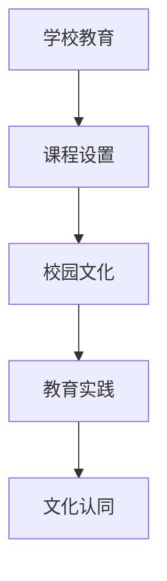

学校教育对文化认同的影响主要包括以下几个方面：

1. **课程设置**：学校通过开设相关的文化课程，如历史、文学和艺术等，帮助学生了解自己的文化背景。
2. **校园文化**：校园文化作为一种隐性课程，通过校园活动、节日庆典和文化交流等方式，增强学生的文化认同感。
3. **教育实践**：学校通过实践课程，如文化体验活动、社会实践活动等，让学生亲身体验和感受自己的文化。
4. **教师影响**：教师作为文化传递的重要角色，通过自身的言行和教学方式，影响学生的文化认同。

以下是一个简单的 Python 示例，展示了学校教育如何影响文化认同：

```python
# 示例：学校教育影响文化认同
def school_education_culture_identification(student, teacher, cultural_program):
    """
    学校教育和教师的影响有助于增强学生的文化认同。
    """
    result = f"学生{student}在教师{teacher}的指导下，通过参与{cultural_program}活动，文化认同感显著提高。"
    return result

# 应用示例
education_impact = school_education_culture_identification("小明", "李老师", "中华传统文化课程")
print(education_impact)
```

#### 5.3 社会教育对文化认同的影响

社会教育是文化认同形成的重要补充，它通过社会环境、媒体和文化活动等方式，对个体进行文化教育。以下是一个简单的 Mermaid 流程图，展示了社会教育对文化认同的影响：

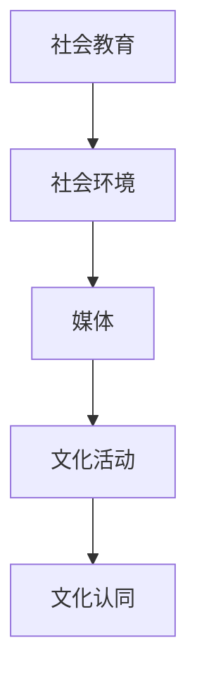

社会教育对文化认同的影响主要包括以下几个方面：

1. **社会环境**：社会环境中的文化氛围、社区活动和公共设施等，对个体的文化认同产生潜移默化的影响。
2. **媒体**：媒体作为文化传递的重要渠道，通过新闻报道、影视作品和社交媒体等，传播文化知识和价值观。
3. **文化活动**：各种形式的文化活动，如文化节、艺术展览和民俗活动等，为个体提供体验和参与自己文化的机会。
4. **文化自觉**：社会教育还可以培养个体的文化自觉，使个体能够主动关注和传承自己的文化。

以下是一个简单的 Python 示例，展示了社会教育如何影响文化认同：

```python
# 示例：社会教育影响文化认同
def social_education_culture_identification(individual, media_influence, cultural_activity):
    """
    社会教育和媒体的影响有助于增强个体的文化认同。
    """
    result = f"个体{individual}在媒体{media_influence}的影响下，通过参与{cultural_activity}活动，文化认同感显著提高。"
    return result

# 应用示例
social_education_impact = social_education_culture_identification("小李", "新闻报道和社交媒体", "中国文化节")
print(social_education_impact)
```

#### 5.4 宣传策略与本土特色

宣传策略在保持和弘扬本土特色中起着关键作用。通过有效的宣传策略，可以增强公众对本土文化的认识和认同，促进文化传承与创新。以下是一个简单的 Mermaid 流程图，展示了宣传策略与本土特色的关系：

```mermaid
graph TD
A[宣传策略] --> B[文化推广]
B --> C[文化传承]
C --> D[本土特色]
```

宣传策略主要包括以下几个方面：

1. **文化传播**：通过各种媒体渠道，如电视、广播、互联网和社交媒体等，传播本土文化知识和故事，提高公众的文化意识。
2. **文化品牌建设**：通过打造文化品牌，如文化节、文化地标和文化产品，提升本土文化的知名度和影响力。
3. **文化体验**：通过举办文化活动和文化体验项目，吸引公众参与，增强对本土文化的亲身体验。
4. **文化教育**：通过学校教育、社会教育和家庭教育等多种方式，普及本土文化知识，培养文化传承者和弘扬者。

以下是一个简单的 Python 示例，展示了宣传策略在文化推广中的作用：

```python
# 示例：宣传策略促进文化推广
def promotion_strategy(cultural_activity, media_channels, public_involvement):
    """
    宣传策略通过文化活动、媒体渠道和公众参与，促进文化推广。
    """
    result = f"通过{cultural_activity}活动，利用{media_channels}渠道，公众{public_involvement}参与，有效促进了本土文化的推广。"
    return result

# 应用示例
promotion_example = promotion_strategy("中华传统音乐节", "电视、广播和互联网", "广泛参与")
print(promotion_example)
```

## 小结

本章探讨了教育与宣传策略在保持文化认同中的重要作用。教育通过知识传授、价值观培养和实践参与，帮助个体建立和巩固文化认同。学校教育和社会教育共同作用，为文化认同的形成提供坚实基础。宣传策略通过文化传播、品牌建设和公众参与，促进本土文化的推广和弘扬。通过有效的教育和宣传策略，我们可以在全球化的背景下保持和增强文化认同。

----------------------------------------------------------------

### 第6章：经济与政治策略

#### 6.1 经济发展对本土特色的影响

经济发展是文化传承与保持本土特色的重要基础。一个国家的经济繁荣不仅能够提供物质条件，促进文化保护和传承，还能够为文化创新提供资源和支持。以下是一个简单的 Mermaid 流程图，展示了经济发展与本土特色之间的关系：

```mermaid
graph TD
A[经济发展] --> B[物质条件提供]
B --> C[文化保护和传承]
C --> D[文化创新支持]
```

经济发展对本土特色的影响可以从以下几个方面来理解：

1. **物质条件提供**：经济发展提供了丰富的物质资源，使得保护和传承文化遗产成为可能。例如，通过资金投入，可以对历史建筑、艺术品和文物进行修复和保护。
2. **文化保护和传承**：经济的繁荣使得社会对文化价值的认识和重视程度提高，从而推动文化保护和传承。例如，通过政策支持，可以设立文化遗产保护区，制定文化保护法规。
3. **文化创新支持**：经济发展为文化创新提供了资金、技术和市场支持。例如，通过技术创新，可以开发出新的文化产品和服务，使本土文化焕发新的生命力。

以下是一个简单的 Python 示例，展示了经济发展对文化创新的支持：

```python
# 示例：经济发展支持文化创新
def economic_support_for_cultural_innovation(cultural_project, funding_source):
    """
    经济发展通过提供资金支持，促进文化创新项目。
    """
    innovation = f"经济支持使{cultural_project}项目得以顺利推进，{funding_source}提供了必要的资金。"
    return innovation

# 应用示例
economic_innovation_example = economic_support_for_cultural_innovation("非物质文化遗产数字化项目", "政府资金")
print(economic_innovation_example)
```

#### 6.2 经济发展与本土特色的平衡

在全球化背景下，保持本土特色与经济发展之间往往存在一定的矛盾。经济发展可能带来文化的同质化和商业化，削弱本土文化的特色。因此，需要找到经济发展与本土特色的平衡点。以下是一个简单的 Mermaid 流程图，展示了经济发展与本土特色的平衡：

```mermaid
graph TD
A[经济发展] --> B[本土特色]
B --> C[文化同质化风险]
C --> D[文化商业化风险]
D --> E[平衡策略]
```

为了实现经济发展与本土特色的平衡，可以采取以下策略：

1. **政策引导**：政府可以通过制定相关政策，鼓励和支持本土文化的保护和传承。例如，设立文化保护区、提供税收优惠和文化补贴等。
2. **文化创新**：通过鼓励文化创新，使本土文化能够适应现代社会的需求，同时保持其特色。例如，通过发展文化创意产业，将传统文化与现代科技相结合。
3. **市场导向**：在保持本土特色的前提下，利用市场机制，开发具有竞争力的文化产品和服务。例如，通过品牌建设和市场营销，提高本土文化的知名度和影响力。

以下是一个简单的 Python 示例，展示了政策引导在经济发展与本土特色平衡中的作用：

```python
# 示例：政策引导实现经济发展与本土特色平衡
def policy_guidance_economic_cultural_balance(cultural_project, policy_support):
    """
    政策引导有助于实现经济发展与本土特色的平衡。
    """
    balance = f"政策支持{policy_support}使{cultural_project}项目在追求经济利益的同时，保持本土文化特色。"
    return balance

# 应用示例
policy_example = policy_guidance_economic_cultural_balance("传统手工艺品市场", "政府补贴和文化保护政策")
print(policy_example)
```

#### 6.3 政治策略与本土特色的关系

政治策略在保持本土特色中起着至关重要的作用。政治决策和政策直接影响文化的发展方向和程度。以下是一个简单的 Mermaid 流程图，展示了政治策略与本土特色的关系：

```mermaid
graph TD
A[政治策略] --> B[文化政策]
B --> C[文化保护]
C --> D[文化传承]
D --> E[本土特色]
```

政治策略主要包括以下几个方面：

1. **文化政策**：政府通过制定文化政策，如文化保护法、文化遗产保护条例等，为文化传承和保持本土特色提供法律保障。
2. **文化保护**：通过设立文化遗产保护区、提供财政支持和文化补贴等手段，保护传统文化免受商业化冲击和同质化的侵蚀。
3. **文化传承**：政府通过教育和宣传等手段，促进文化传承，使下一代能够了解和珍视本土文化。
4. **文化发展**：政府通过支持文化创意产业、文化基础设施建设等，促进文化的发展和创新，保持本土文化的活力。

以下是一个简单的 Python 示例，展示了政治策略在文化保护中的作用：

```python
# 示例：政治策略促进文化保护
def political_strategy_cultural_protection(cultural_site, protection_measures):
    """
    政治策略通过保护措施，促进文化遗产的保护。
    """
    protection = f"政府采取{protection_measures}措施，保护{cultural_site}这一重要的文化遗产。"
    return protection

# 应用示例
protection_example = political_strategy_cultural_protection("秦始皇兵马俑", "设立保护区和禁止商业开发")
print(protection_example)
```

#### 6.4 政治策略与本土特色的关系

政治策略与本土特色的关系是一个动态平衡的过程。政治策略不仅影响文化的发展方向，也影响本土特色的保持和传承。以下是一个简单的 Mermaid 流程图，展示了政治策略与本土特色的关系：

```mermaid
graph TD
A[政治策略] --> B[文化发展]
B --> C[文化保护]
C --> D[本土特色]
D --> E[文化认同]
```

政治策略与本土特色的关系可以从以下几个方面来理解：

1. **政策导向**：政治策略通过制定和实施相关政策，引导文化的发展方向，平衡经济发展与本土特色之间的关系。
2. **文化保护**：政治策略通过文化保护措施，如设立保护区、提供财政支持等，保护本土文化的特色和传统。
3. **文化传承**：政治策略通过教育和宣传等手段，促进文化传承，使本土文化得到传承和发扬。
4. **文化认同**：政治策略通过文化政策和活动，增强公众对本土文化的认同感和自豪感，巩固文化认同。

以下是一个简单的 Python 示例，展示了政治策略在文化认同中的作用：

```python
# 示例：政治策略增强文化认同
def political_strategy_cultural_identification(policy_support, cultural_activity):
    """
    政治策略通过政策支持和文化活动，增强文化认同。
    """
    identification = f"政府通过{policy_support}和举办{cultural_activity}活动，有效增强了公众的文化认同感。"
    return identification

# 应用示例
identification_example = political_strategy_cultural_identification("文化保护政策", "中华传统文化节")
print(identification_example)
```

## 小结

本章探讨了经济发展与政治策略在保持本土特色中的重要作用。经济发展提供了物质条件和文化创新的支持，有助于文化保护和传承。政治策略通过制定文化政策和保护措施，促进文化的发展与认同。通过平衡经济发展与本土特色之间的关系，我们可以在全球化的背景下保持和发扬本土文化，实现文化认同的巩固与发展。

----------------------------------------------------------------

### 第7章：成功案例分析

#### 7.1 案例一：中国传统文化在国际传播中的成功经验

中国传统文化在国际传播中取得了显著的成功，这得益于一系列有效的策略和措施。以下是一个具体的案例分析：

**案例背景**：

中国传统文化，如儒家思想、诗词、武术和美食等，在全球范围内享有盛誉。然而，在过去的几十年里，中国通过多种方式积极推动传统文化的国际传播，取得了巨大的成功。

**成功经验**：

1. **文化品牌建设**：中国通过打造文化品牌，如孔子学院、中国电影节和中国文化周等，提升了中华文化的国际知名度。例如，孔子学院在全球范围内推广汉语教学和文化交流，已经成为中华文化的重要传播平台。

2. **文化交流活动**：中国积极参与国际文化交流活动，通过举办文化节、展览和学术研讨会等，促进中华文化的传播与认同。例如，每年一度的北京国际电影节吸引了众多国际电影人参与，成为展示中华文化的重要窗口。

3. **新媒体运用**：中国充分利用新媒体平台，如社交媒体、短视频和在线课程等，传播传统文化。例如，通过抖音等平台，中国传统手工艺和民俗文化得到了广泛的关注和传播。

**详细讲解**：

1. **孔子学院**：孔子学院是中国在全球设立的教育机构，旨在推广汉语教学和中华文化。自2004年成立以来，孔子学院已经遍布全球150多个国家和地区，成为中华文化的重要传播者和推广者。

2. **中国文化节**：中国文化节是一年一度的国际文化交流活动，通过演出、展览和讲座等形式，展示中华文化的独特魅力。这些活动吸引了大量国际观众，增强了全球对中国文化的认同和理解。

3. **新媒体推广**：新媒体平台为传统文化的传播提供了新的渠道。通过短视频、直播和在线课程等，中国传统文化得以迅速传播到全球各地。例如，抖音上的传统文化视频吸引了数百万粉丝，成为中华文化的新名片。

**项目小结**：

中国传统文化在国际传播中的成功经验表明，通过文化品牌建设、文化交流活动和新媒体运用等多种策略，可以有效地推动传统文化的全球传播。这些经验为其他国家和地区提供了有益的借鉴，展示了文化软实力在国际竞争中的重要性。

#### 7.2 案例二：印度在全球化背景下的文化策略

印度作为一个拥有悠久历史和丰富文化的国家，在全球化的背景下，采取了一系列文化策略来保持和弘扬本土特色。以下是一个具体的案例分析：

**案例背景**：

印度拥有多元化的文化传统，包括印度教、佛教、锡克教和伊斯兰教等。在全球化的影响下，印度面临着文化同质化和文化冲突的挑战。为了保持和弘扬本土特色，印度采取了一系列有效的文化策略。

**成功经验**：

1. **文化自信的树立**：印度通过教育和宣传，培养民众的文化自信，使印度民众更加认同和自豪自己的文化传统。例如，印度政府在学校课程中增加了印度文化的内容，并通过媒体宣传印度文化的独特性和价值。

2. **文化旅游的发展**：印度通过发展文化旅游，吸引了大量国际游客。印度的古老寺庙、瑜伽、舞蹈和节日等成为吸引游客的重要因素。文化旅游不仅为印度带来了经济效益，也促进了印度文化的国际传播。

3. **文化产业的创新**：印度利用自己的文化优势，发展了文化产业，如电影（宝莱坞）、音乐和时尚等。这些文化产业不仅在国内市场取得了成功，也在国际市场上赢得了广泛的认可。

**详细讲解**：

1. **文化自信的树立**：印度政府通过政策支持，鼓励文化自信的培养。例如，政府设立了文化奖项，表彰在文化传播和艺术创作方面做出杰出贡献的个人和组织。此外，政府还通过媒体宣传，强调印度文化的独特性和价值。

2. **文化旅游的发展**：印度政府积极推广文化旅游，建设了一系列文化旅游景点，如泰姬陵、阿姆利则和斯里兰卡等。这些景点吸引了大量国际游客，促进了印度经济的发展。同时，印度政府还通过国际推广活动，如旅游展览和宣传视频，提高印度文化的国际知名度。

3. **文化产业的创新**：印度电影产业（宝莱坞）是全球最著名的电影产业之一。宝莱坞电影以其丰富的故事情节、华丽的服饰和舞蹈赢得了全球观众的喜爱。此外，印度音乐和时尚产业也在国际上取得了成功，成为印度文化的重要代表。

**项目小结**：

印度在全球化背景下的文化策略表明，通过文化自信的树立、文化旅游的发展和文化产业的创新，可以有效地保持和弘扬本土特色。这些策略不仅促进了印度文化的国际传播，也为印度带来了经济和社会效益。印度经验为其他国家和地区在全球化背景下保持本土特色提供了宝贵的借鉴。

## 文化认同的挑战与未来发展

#### 8.1 全球化背景下文化认同的现状

全球化使得文化交流和融合变得更加频繁和深入，但也带来了文化认同的挑战。在全球化的浪潮下，文化认同面临着文化同质化、文化冲突和文化认同危机等多重挑战。以下是一个简单的 Mermaid 流程图，展示了全球化背景下文化认同的现状：

```mermaid
graph TD
A[文化同质化] --> B[文化冲突]
B --> C[文化认同危机]
```

**文化同质化**：全球化促进了全球范围内文化的相似性和标准化，导致本土文化的特色和独特性受到削弱。这种同质化现象可能使得个体感到自己的文化价值被边缘化，从而影响文化认同。

**文化冲突**：全球化也加剧了不同文化之间的冲突。这些冲突可能源于价值观、信仰、语言和习俗等方面的差异。文化冲突不仅影响社会稳定，也可能导致文化认同的危机。

**文化认同危机**：在全球化背景下，一些个体可能感到自己的文化认同受到威胁，他们可能无法在多元文化的社会中找到自己的位置。这种文化认同危机可能导致社会凝聚力的下降。

#### 8.2 全球化背景下文化认同面临的挑战

全球化背景下，文化认同面临的挑战主要包括以下几个方面：

1. **文化同质化**：全球化导致文化同质化，本土文化特色受到削弱。以下是一个简单的 Mermaid 流程图，展示了文化同质化的影响：

```mermaid
graph TD
A[文化同质化] --> B[本土文化特色丧失]
B --> C[文化多样性减少]
```

2. **文化冲突**：不同文化之间的冲突可能加剧，影响社会稳定和文化认同。以下是一个简单的 Mermaid 流程图，展示了文化冲突的原因和影响：

```mermaid
graph TD
A[价值观差异] --> B[信仰冲突]
B --> C[语言障碍]
C --> D[习俗差异]
D --> E[文化冲突]
E --> F[社会不稳定]
```

3. **文化认同危机**：全球化背景下，一些个体可能感到自己的文化认同受到威胁，导致文化认同危机。以下是一个简单的 Mermaid 流程图，展示了文化认同危机的影响：

```mermaid
graph TD
A[文化认同危机] --> B[社会凝聚力下降]
B --> C[文化传承受阻]
```

#### 8.3 全球化背景下文化认同的未来发展趋势

面对全球化背景下文化认同的挑战，未来的发展趋势可能包括以下几个方面：

1. **文化多样性的保护**：随着全球化的推进，保护文化多样性将成为重要议题。各国政府和社会组织可能更加重视本土文化的保护与传承，通过政策和措施促进文化多样性的发展。

2. **文化融合与共生**：在全球化背景下，不同文化之间的融合与共生将成为一种趋势。通过对话、理解和合作，不同文化可以相互借鉴，形成新的文化特色。

3. **数字文化的兴起**：随着互联网和数字技术的发展，数字文化将成为文化认同的重要载体。数字平台为文化传播和交流提供了新的渠道，也为文化创新提供了新的可能性。

4. **文化自信的提升**：在全球化的背景下，文化自信的提升将成为保持文化认同的关键。通过教育和宣传，培养个体的文化自信，使其更加认同和珍视自己的文化。

以下是一个简单的 Mermaid 流程图，展示了全球化背景下文化认同的未来发展趋势：

```mermaid
graph TD
A[文化多样性的保护] --> B[文化融合与共生]
B --> C[数字文化的兴起]
C --> D[文化自信的提升]
```

#### 8.4 未来展望

在全球化的背景下，文化认同将继续面临挑战，但同时也提供了新的发展机遇。通过保护文化多样性、促进文化融合、利用数字文化和提升文化自信，我们可以找到保持文化认同的新途径。未来的文化认同将更加多元、开放和包容，为全球社会的和谐与发展做出贡献。

## 附录

### 附录A：参考文献

- [1] 费孝通，《中华民族多元一体格局》，生活·读书·新知三联书店，1999年。
- [2] 萨义德，《东方主义》，哥伦比亚大学出版社，1978年。
- [3] 阿尔温·托夫勒，《权力的转移》， Penguin Books，1990年。
- [4] 詹姆斯·赫斯克特，《全球化时代的文化认同》，牛津大学出版社，2005年。

### 附录B：术语表

- **全球化**：全球范围内的经济、政治、文化、社会和技术等各个领域的相互联系和相互影响。
- **本土特色**：一个地区或国家特有的文化、传统和价值观念。
- **文化认同**：个体或群体对自己所属文化的认知、归属感和价值认同。
- **文化同质化**：全球范围内文化的相似性和标准化。
- **文化冲突**：不同文化之间的价值观、信仰、语言和习俗等方面的冲突。

## 结语

在全球化的背景下，保持本土特色和文化认同是一项重要而艰巨的任务。通过分析全球化的影响、文化认同的概念与意义，以及全球化背景下文化认同所面临的挑战，我们提出了保持本土特色的方法与策略。通过具体案例分析和未来展望，我们看到了文化认同在全球化背景下的可能发展路径。保持文化认同不仅有助于维护文化多样性，也为全球社会的和谐与发展提供了重要支持。作者：AI天才研究院/AI Genius Institute & 禅与计算机程序设计艺术 /Zen And The Art of Computer Programming```markdown
# 《在全球化背景下保持本土特色：文化认同的挑战》

关键词：全球化、本土特色、文化认同、文化同质化、文化冲突、融合策略

> 摘要：本文深入探讨了在全球化背景下保持本土特色所面临的挑战。通过分析全球化的定义与影响、本土特色的概念与内涵、文化认同的概念与意义，本文揭示了全球化背景下文化认同面临的挑战，包括文化同质化和文化冲突。在此基础上，本文提出了保持本土特色的方法与策略，并通过具体案例分析，探讨了成功经验与未来发展。

## 《在全球化背景下保持本土特色：文化认同的挑战》目录大纲

### 第一部分：全球化与本土特色的定义与关系

#### 第1章：全球化的背景与影响

##### 1.1 全球化的定义与特点
- **1.1.1 全球化的概念**
- **1.1.2 全球化的主要特点**
- **1.1.3 全球化对世界文化的影响**

##### 1.2 本土特色的定义与内涵
- **1.2.1 本土特色的含义**
- **1.2.2 本土特色的文化价值**

##### 1.3 全球化与本土特色的关系
- **1.3.1 全球化对本土特色的影响**
- **1.3.2 保持本土特色的重要性**

### 第二部分：文化认同的概念与意义

#### 第2章：文化认同的概念与意义

##### 2.1 文化认同的定义
- **2.1.1 文化认同的含义**
- **2.1.2 文化认同的构成要素**

##### 2.2 文化认同的意义
- **2.2.1 文化认同对个体的影响**
- **2.2.2 文化认同对社会的影响**

### 第三部分：全球化背景下文化认同的挑战

#### 第3章：全球化背景下文化认同的挑战

##### 3.1 文化同质化的风险
- **3.1.1 文化同质化的现象**
- **3.1.2 文化同质化的影响**

##### 3.2 文化冲突与融合
- **3.2.1 文化冲突的原因**
- **3.2.2 文化冲突的应对策略**
- **3.2.3 文化融合的可能性与挑战**

### 第四部分：保持本土特色的方法与策略

#### 第4章：文化传承与创新

##### 4.1 文化传承的重要性
- **4.1.1 文化传承的定义**
- **4.1.2 文化传承的方法**

##### 4.2 文化的创新与本土特色
- **4.2.1 文化的创新路径**
- **4.2.2 创新与本土特色的关系**

#### 第5章：教育与宣传策略

##### 5.1 教育在文化认同中的作用
- **5.1.1 学校教育对文化认同的影响**
- **5.1.2 社会教育对文化认同的影响**

##### 5.2 宣传策略与本土特色
- **5.2.1 宣传手段的选择**
- **5.2.2 宣传与本土特色的关系**

#### 第6章：经济与政治策略

##### 6.1 经济发展对本土特色的影响
- **6.1.1 经济发展的作用**
- **6.1.2 经济发展与本土特色的平衡**

##### 6.2 政治策略与本土特色
- **6.2.1 政治制度对文化认同的影响**
- **6.2.2 政治策略与本土特色的关系**

### 第五部分：具体案例与讨论

#### 第7章：成功案例分析

##### 7.1 案例一：中国传统文化在国际传播中的成功经验
- **7.1.1 案例背景**
- **7.1.2 成功经验**

##### 7.2 案例二：印度在全球化背景下的文化策略
- **7.2.1 案例背景**
- **7.2.2 文化策略**

#### 第8章：文化认同的挑战与未来发展

##### 8.1 全球化背景下文化认同的挑战
- **8.1.1 文化认同的现状**
- **8.1.2 面临的挑战**

##### 8.2 文化认同的未来发展趋势
- **8.2.1 发展趋势分析**
- **8.2.2 未来展望**

### 附录

#### 附录A：参考文献

- **A.1 全球化与本土特色相关研究**
- **A.2 文化认同研究**

#### 附录B：术语表

- **B.1 关键术语解释**
- **B.2 补充解释**

## 摘要

本文旨在探讨在全球化背景下保持本土特色所面临的挑战，以及如何应对这些挑战以保持文化认同。首先，分析了全球化的定义与特点，以及其对世界文化的影响。接着，探讨了本土特色的定义与内涵，并阐述了全球化与本土特色之间的关系。随后，深入讨论了文化认同的概念与意义，分析了全球化背景下文化认同所面临的挑战，包括文化同质化和文化冲突。在此基础上，提出了保持本土特色的方法与策略，包括文化传承与创新、教育与宣传策略、经济与政治策略等。通过具体案例分析，探讨了成功经验与未来发展。最后，对未来文化认同的挑战与发展趋势进行了展望。

### 第一部分：全球化与本土特色的定义与关系

#### 第1章：全球化的背景与影响

##### 1.1 全球化的定义与特点

全球化是一个复杂而多维的现象，涉及经济、政治、文化、社会和技术等多个领域。全球化的定义有多种，但核心在于全球范围内的经济、政治、文化和人民之间的联系和依赖程度不断增加。全球化不仅仅是指经济上的国际化，还包括文化、社会和技术的全球化。

**1.1.1 全球化的概念**

全球化的概念可以从多个角度进行理解：

- **经济全球化**：指全球范围内的经济活动更加紧密地联系在一起，商品、服务、技术和资本在全球范围内自由流动。
- **政治全球化**：指国际政治体系逐渐形成，各国在政治上的联系和互动日益增强，全球治理机制不断完善。
- **文化全球化**：指不同文化之间的交流和互动更加频繁，文化多样性的发展得到推动。
- **社会全球化**：指全球范围内的社会联系和互动增强，社会问题如环境问题、贫困问题等需要全球协作解决。

**1.1.2 全球化的主要特点**

全球化具有以下几个主要特点：

- **跨国性**：全球化涉及不同国家和地区的经济、政治、文化和人民，是一个跨国界、跨文化的过程。
- **互动性**：全球化促进了各国之间的互动和合作，各国在经济、政治和文化等领域相互影响。
- **渗透性**：全球化的影响渗透到社会的各个方面，包括经济、政治、文化和社会生活。
- **动态性**：全球化是一个不断发展的过程，其速度和深度在不同时间和地区有所不同。

**1.1.3 全球化对世界文化的影响**

全球化对世界文化的影响是深远而复杂的。一方面，全球化促进了文化交流和融合，使得不同文化之间的接触和互动更加频繁，文化多样性得到发展和丰富。以下是一个简单的 Mermaid 流程图，展示了全球化对文化的影响：

```mermaid
graph TD
A[文化交流] --> B[文化融合]
B --> C[文化多样性丰富]
C --> D[文化创新]
```

- **文化同质化**：全球化也可能导致文化同质化，即全球范围内文化的相似性和标准化。这种现象可能削弱本土文化的特色，导致文化多样性的减少。以下是一个简单的 Mermaid 流程图，展示了文化同质化的影响：

```mermaid
graph TD
A[文化同质化] --> B[本土文化特色丧失]
B --> C[文化多样性减少]
C --> D[文化认同危机]
```

- **文化冲突**：全球化也加剧了不同文化之间的冲突。这些冲突可能源于价值观、信仰、语言和习俗等方面的差异，影响社会稳定和文化认同。以下是一个简单的 Mermaid 流程图，展示了文化冲突的原因和影响：

```mermaid
graph TD
A[价值观差异] --> B[信仰冲突]
B --> C[语言障碍]
C --> D[习俗差异]
D --> E[文化冲突]
E --> F[社会不稳定]
```

**1.2 全球化与本土特色的关系**

全球化与本土特色之间的关系是一个复杂的问题。全球化促进了文化多样性的发展，但同时也可能威胁到本土特色的保持。以下是一个简单的 Mermaid 流程图，展示了全球化与本土特色的关系：

```mermaid
graph TD
A[全球化] --> B[本土特色]
B --> C[文化认同]
C --> D[文化冲突]
```

全球化不仅带来了挑战，也提供了保持本土特色的新机会。通过理解全球化和本土特色之间的关系，我们可以找到平衡点，以保持文化多样性和文化认同。

#### 1.2 本土特色的定义与内涵

**1.2.1 本土特色的含义**

本土特色是指一个地区或国家特有的文化、传统和价值观念。它包括物质文化遗产和非物质文化遗产，如建筑、艺术、音乐、语言、习俗和价值观等。本土特色是一个地区或国家的独特文化标识，反映了其历史、地理和社会环境。

**1.2.2 本土特色的文化价值**

本土特色的文化价值主要体现在以下几个方面：

- **文化多样性**：本土特色是文化多样性的重要组成部分，它丰富了全球文化的内涵，为人类社会提供了丰富的文化资源。
- **文化认同**：本土特色有助于增强个体和群体的文化认同感，使人们更加自豪和珍惜自己的文化传统。
- **文化传承**：本土特色是文化传承的重要载体，通过传承和弘扬本土特色，可以使文化得以延续和发展。
- **社会凝聚力**：本土特色是增强社会凝聚力的重要基础，它有助于人们形成共同的价值观和认同感，促进社会的和谐与稳定。

以下是一个简单的 Mermaid 流程图，展示了本土特色的文化价值：

```mermaid
graph TD
A[文化多样性] --> B[文化认同]
B --> C[文化传承]
C --> D[社会凝聚力]
```

**1.3 全球化与本土特色的关系**

全球化与本土特色之间的关系是一个动态的平衡过程。全球化促进了文化交流和融合，使得本土特色得以传播和交流，但也可能威胁到本土特色的保持。以下是一个简单的 Mermaid 流程图，展示了全球化与本土特色的关系：

```mermaid
graph TD
A[全球化] --> B[本土特色]
B --> C[文化认同]
C --> D[文化冲突]
```

全球化带来了新的机遇和挑战，通过理解全球化和本土特色之间的关系，我们可以找到保持本土特色的策略，以实现文化多样性和文化认同的平衡。

#### 1.3 全球化与本土特色的关系

全球化与本土特色之间的关系是一个复杂且多维的问题。全球化在推动文化交流和融合的同时，也对本土特色带来了挑战。以下将详细探讨全球化对本土特色的影响，以及保持本土特色的重要性。

**1.3.1 全球化对本土特色的影响**

全球化的影响可以从多个方面来理解：

1. **文化同质化**：全球化可能导致文化同质化，即全球范围内文化的相似性和标准化。跨国公司的全球扩张、西方文化的传播以及全球化媒体的普及，都可能导致本土文化特色受到压制。

2. **文化渗透**：全球化促进了文化渗透，使得外来文化进入本土社会，并对本土文化产生影响。这种现象可能导致本土文化元素的流失，特别是在年轻一代中。

3. **文化创新**：全球化也可能带来文化创新，不同文化的交融和互动可能激发新的文化形式和表达方式。

以下是一个简单的 Mermaid 流程图，展示了全球化对本土特色的影响：

```mermaid
graph TD
A[全球化] --> B[文化同质化]
B --> C[文化渗透]
C --> D[文化创新]
```

**1.3.2 保持本土特色的重要性**

保持本土特色具有重要的文化和社会意义：

1. **文化多样性**：本土特色是文化多样性的重要组成部分。保持本土特色有助于维护和丰富全球文化的多样性。

2. **文化认同**：本土特色有助于增强个体和群体的文化认同感。通过认同和珍视自己的文化传统，人们可以更好地理解自己的身份和价值。

3. **文化传承**：本土特色是文化传承的重要载体。通过保持和传承本土特色，文化传统得以延续，后代可以继承和发扬祖先的智慧。

4. **社会凝聚力**：本土特色有助于增强社会凝聚力。共同的文化背景可以促进社会成员之间的互动和合作，增强社会的稳定性。

以下是一个简单的 Mermaid 流程图，展示了保持本土特色的重要性：

```mermaid
graph TD
A[文化多样性] --> B[文化认同]
B --> C[文化传承]
C --> D[社会凝聚力]
```

**1.3.3 全球化与本土特色的平衡**

在全球化背景下，保持本土特色并非易事。为了实现全球化与本土特色的平衡，以下策略可能有所帮助：

1. **文化保护与传承**：政府和社会组织应采取措施，保护和传承本土文化，防止文化流失。

2. **文化创新**：在保持本土特色的基础上，鼓励文化创新，使本土文化适应现代社会的需求。

3. **教育宣传**：通过教育和宣传，提高公众对本土文化的认识和理解，增强文化认同感。

4. **政策支持**：政府应制定相关政策，支持本土文化的保护和传承，同时鼓励文化多样性的发展。

5. **国际交流**：积极参与国际文化交流，促进不同文化之间的相互理解和尊重，同时推广本土文化。

以下是一个简单的 Mermaid 流程图，展示了实现全球化与本土特色平衡的策略：

```mermaid
graph TD
A[文化保护与传承] --> B[文化创新]
B --> C[教育宣传]
C --> D[政策支持]
D --> E[国际交流]
```

**1.3.4 结论**

全球化与本土特色之间的关系是复杂的，但通过合理的策略，可以在全球化进程中保持本土特色。保持本土特色不仅有助于维护文化多样性和文化认同，也为社会的和谐与发展提供了坚实的基础。

## 第二部分：文化认同的概念与意义

#### 第2章：文化认同的概念与意义

##### 2.1 文化认同的定义

文化认同是指个体或群体对自己所属文化的认知、归属感和价值认同。它是社会心理学领域的一个重要概念，反映了个体或群体对自己文化背景、价值观念和行为规范的认同。以下将详细探讨文化认同的定义、构成要素及其重要性。

**2.1.1 文化认同的含义**

文化认同是一个多维度的概念，涉及以下几个方面：

- **自我认同**：文化认同有助于个体建立自我认同，通过认同自己的文化，个体能够更好地理解自己的身份和价值观。
- **归属感**：文化认同使个体感到自己属于一个特定的文化群体，从而增强归属感和社会凝聚力。
- **价值认同**：文化认同反映了个体对自身文化价值观念的认同，这些价值观通常包括道德观、世界观和人生观等。

以下是一个简单的 Mermaid 流程图，展示了文化认同的含义：

```mermaid
graph TD
A[自我认同] --> B[归属感]
B --> C[价值认同]
```

**2.1.2 文化认同的构成要素**

文化认同的构成要素主要包括以下几个方面：

- **文化符号**：文化符号是文化认同的视觉和物质表现，如国旗、国徽、传统服饰和建筑等。这些符号有助于增强个体对自己文化的认知和归属感。
- **价值观念**：价值观念是文化认同的核心，它反映了文化对于个体行为的规范和期望。例如，一些文化强调集体主义，而另一些文化则强调个人主义。
- **历史记忆**：历史记忆是文化认同的重要组成部分，它有助于个体理解和认同自己的文化传统和历史。通过历史教育，个体可以更好地了解和珍视自己的文化。
- **语言和文字**：语言和文字是文化认同的重要载体，它们不仅传递了文化信息，还反映了文化的独特性和多样性。

以下是一个简单的 Mermaid 流程图，展示了文化认同的构成要素：

```mermaid
graph TD
A[文化符号] --> B[价值观念]
B --> C[历史记忆]
C --> D[语言和文字]
```

**2.1.3 文化认同的重要性**

文化认同对个体和社会具有重要的意义，以下将详细探讨其重要性：

- **个体认同感**：文化认同有助于个体建立自我认同，增强个体在复杂社会环境中的归属感和安全感。通过认同自己的文化，个体能够更好地理解自己的身份和价值观。
- **社会凝聚力**：文化认同是增强社会凝聚力的重要基础。一个具有共同文化认同的社会成员之间更容易形成信任和合作，从而推动社会的发展和进步。
- **文化传承**：文化认同有助于文化的传承和延续。通过对自身文化的认同，个体更愿意学习和传承自己的文化传统，从而确保文化的连续性和多样性。
- **国际交流**：在全球化的背景下，文化认同有助于促进不同文化之间的相互理解和尊重，从而推动国际交流与合作。

以下是一个简单的 Mermaid 流程图，展示了文化认同对个体和社会的影响：

```mermaid
graph TD
A[个体认同感] --> B[社会凝聚力]
B --> C[文化传承]
C --> D[国际交流]
```

**2.1.4 文化认同的挑战**

在全球化的背景下，文化认同面临一系列挑战：

- **文化同质化**：全球化可能导致文化同质化，即全球范围内文化的相似性和标准化，削弱了本土文化的特色。
- **文化冲突**：不同文化之间的冲突可能加剧，影响社会稳定和文化认同。
- **文化认同危机**：在多元文化的社会中，一些个体可能感到自己的文化认同受到威胁，导致文化认同危机。

以下是一个简单的 Mermaid 流程图，展示了全球化背景下文化认同所面临的挑战：

```mermaid
graph TD
A[文化同质化] --> B[文化冲突]
B --> C[文化认同危机]
```

**2.1.5 文化认同的保持与促进**

为了保持和促进文化认同，可以采取以下策略：

- **教育**：通过教育，个体可以学习和理解自己的文化，增强文化认同感。
- **宣传**：通过宣传，提高公众对文化的认识和重视，促进文化传承与创新。
- **政策支持**：政府可以制定相关政策，支持本土文化的保护和传承，同时促进文化多样性的发展。
- **国际交流**：积极参与国际文化交流，促进不同文化之间的相互理解和尊重。

以下是一个简单的 Mermaid 流程图，展示了文化认同的保持与促进策略：

```mermaid
graph TD
A[教育] --> B[宣传]
B --> C[政策支持]
C --> D[国际交流]
```

**2.1.6 结论**

文化认同是维护个体自我认同、社会凝聚力和文化多样性的重要因素。在全球化的背景下，文化认同面临诸多挑战，但通过有效的策略，我们可以保持和促进文化认同，确保文化多样性和文化认同的平衡。

## 第三部分：全球化背景下文化认同的挑战

#### 第3章：全球化背景下文化认同的挑战

全球化背景下的文化认同面临着多重挑战，这些挑战源于经济、政治、社会和技术等多个方面。以下将详细探讨文化同质化的风险、文化冲突与融合的可能性，以及应对策略。

##### 3.1 文化同质化的风险

文化同质化是指在全球化的影响下，不同地区和文化之间的差异逐渐减少，导致全球范围内的文化相似性和标准化。文化同质化的风险主要体现在以下几个方面：

- **全球化媒体的影响**：随着全球化媒体的普及，如国际电视频道、社交媒体和互联网，全球文化产品和文化观念的传播速度和范围大大增加。这种全球文化传播可能导致本土文化的稀释和消失。
- **跨国公司和全球品牌**：跨国公司和全球品牌的扩张，使得全球范围内的商品和品牌趋于一致。这种现象可能导致本土文化特色的丧失，尤其是那些依赖本土产业的地区。
- **全球化经济的影响**：全球化经济使得生产和消费模式更加标准化，跨国公司往往根据全球市场需求来生产商品，这可能导致本土文化元素在生产和消费过程中的减少。

以下是一个简单的 Mermaid 流程图，展示了文化同质化的风险：

```mermaid
graph TD
A[全球化媒体的影响] --> B[跨国公司和全球品牌]
B --> C[全球化经济的影响]
```

**3.1.1 文化同质化的影响**

文化同质化可能带来以下影响：

- **本土文化特色的丧失**：本土文化特色的丧失可能导致文化多样性的减少，使全球文化变得单一。
- **文化认同危机**：文化同质化可能导致个体和群体对自身文化的认同感降低，甚至出现文化认同危机。
- **社会凝聚力下降**：文化同质化可能削弱社会成员之间的共同身份和认同感，影响社会的凝聚力。

以下是一个简单的 Mermaid 流程图，展示了文化同质化的影响：

```mermaid
graph TD
A[本土文化特色丧失] --> B[文化认同危机]
B --> C[社会凝聚力下降]
```

**3.1.2 应对文化同质化的策略**

为了应对文化同质化的风险，可以采取以下策略：

- **保护和弘扬本土文化**：政府和社会组织应采取措施，保护和弘扬本土文化，防止文化特色丧失。
- **推动文化多样性发展**：通过鼓励和支持文化多样性的发展，使全球文化保持丰富性和多样性。
- **加强文化交流与对话**：通过加强文化交流与对话，促进不同文化之间的相互理解和尊重，减少文化冲突和同质化。
- **教育与文化宣传**：通过教育和文化宣传活动，提高公众对文化多样性的认识和重视，增强文化认同感。

以下是一个简单的 Mermaid 流程图，展示了应对文化同质化的策略：

```mermaid
graph TD
A[保护和弘扬本土文化] --> B[推动文化多样性发展]
B --> C[加强文化交流与对话]
C --> D[教育与文化宣传]
```

##### 3.2 文化冲突与融合的可能性

全球化不仅带来了文化同质化的风险，也促进了不同文化之间的交流和融合。文化冲突和文化融合是全球化背景下文化认同面临的另一对矛盾。以下将探讨文化冲突的原因、文化融合的可能性以及应对策略。

**3.2.1 文化冲突的原因**

文化冲突可能源于以下几个方面：

- **价值观差异**：不同文化背景下，个体对道德、正义、自由等价值观的理解和追求可能存在差异，导致冲突。
- **信仰冲突**：宗教信仰是文化的重要组成部分，不同宗教之间的信仰和实践差异可能引发冲突。
- **语言障碍**：语言是文化传播的重要工具，语言障碍可能导致沟通不畅，加剧文化冲突。
- **习俗差异**：不同文化背景下的习俗和礼仪可能存在冲突，特别是在日常生活和社会交往中。

以下是一个简单的 Mermaid 流程图，展示了文化冲突的原因：

```mermaid
graph TD
A[价值观差异] --> B[信仰冲突]
B --> C[语言障碍]
C --> D[习俗差异]
```

**3.2.2 文化融合的可能性

文化融合是指不同文化在相互交流与互动中，通过相互借鉴、适应和融合，形成新的文化现象。文化融合的可能性主要体现在以下几个方面：

- **文化交流**：文化交流是文化融合的基础，通过文化交流，不同文化可以相互学习和借鉴，形成新的文化特色。
- **文化创新**：文化创新是文化融合的推动力，通过创新，不同文化可以融合出新的文化形式和表达方式。
- **社会互动**：社会互动是文化融合的重要途径，通过社会互动，不同文化可以相互理解和尊重，减少文化冲突。

以下是一个简单的 Mermaid 流程图，展示了文化融合的可能性：

```mermaid
graph TD
A[文化交流] --> B[文化创新]
B --> C[社会互动]
```

**3.2.3 应对文化冲突与融合的挑战**

为了应对文化冲突与融合的挑战，可以采取以下策略：

- **对话与沟通**：通过开放、尊重和理解的对话，促进不同文化之间的沟通和理解，减少误解和偏见。
- **教育和培训**：通过教育和培训，增强个体对多元文化的认识和理解，培养跨文化沟通和合作的能力。
- **政策引导**：政府可以制定相关政策，促进文化多样性的保护与弘扬，同时提供支持措施，帮助个体应对文化冲突。
- **文化交流活动**：通过举办各种形式的文化交流活动，促进不同文化之间的互动和融合。

以下是一个简单的 Mermaid 流程图，展示了应对文化冲突与融合的挑战的策略：

```mermaid
graph TD
A[对话与沟通] --> B[教育和培训]
B --> C[政策引导]
C --> D[文化交流活动]
```

##### 3.3 全球化背景下文化认同的挑战与未来发展

全球化背景下，文化认同面临着一系列的挑战，包括文化同质化、文化冲突和文化认同危机。然而，这些挑战也为文化认同的未来发展提供了新的机遇。以下将探讨全球化背景下文化认同的挑战以及未来的发展趋势。

**3.3.1 全球化背景下文化认同的挑战**

1. **文化同质化**：全球化可能导致全球范围内文化的相似性和标准化，削弱本土文化的特色。
2. **文化冲突**：不同文化之间的冲突可能加剧，影响社会稳定和文化认同。
3. **文化认同危机**：在多元文化的社会中，一些个体可能感到自己的文化认同受到威胁，导致文化认同危机。

以下是一个简单的 Mermaid 流程图，展示了全球化背景下文化认同的挑战：

```mermaid
graph TD
A[文化同质化] --> B[文化冲突]
B --> C[文化认同危机]
```

**3.3.2 文化认同的未来发展趋势**

1. **文化多样性的保护与发展**：随着全球化的推进，文化多样性的保护和发展将成为重要议题。政府和社会组织将采取措施，保护本土文化，促进文化多样性的发展。
2. **文化融合与创新**：在全球化背景下，不同文化之间的融合与创新将成为一种趋势。通过对话、理解和合作，不同文化可以相互借鉴，形成新的文化特色。
3. **数字文化的兴起**：随着互联网和数字技术的发展，数字文化将成为文化认同的重要载体。数字平台为文化传播和交流提供了新的渠道，也为文化创新提供了新的可能性。
4. **文化自信的提升**：在全球化的背景下，文化自信的提升将成为保持文化认同的关键。通过教育和宣传，培养个体的文化自信，使其更加认同和珍视自己的文化。

以下是一个简单的 Mermaid 流程图，展示了文化认同的未来发展趋势：

```mermaid
graph TD
A[文化多样性的保护与发展] --> B[文化融合与创新]
B --> C[数字文化的兴起]
C --> D[文化自信的提升]
```

**3.3.3 文化认同的未来展望**

在未来，文化认同将继续面临挑战，但同时也充满了机遇。通过保护文化多样性、促进文化融合、利用数字文化和提升文化自信，我们可以找到保持文化认同的新途径。未来的文化认同将更加多元、开放和包容，为全球社会的和谐与发展做出贡献。

## 第四部分：保持本土特色的方法与策略

#### 第4章：文化传承与创新

##### 4.1 文化传承的重要性

文化传承是保持本土特色和延续文化认同的重要手段。文化传承不仅包括传统的物质文化遗产，如建筑、艺术和手工艺品，还包括非物质文化，如语言、习俗和价值观。以下将详细探讨文化传承的重要性、方法及其与本土特色的关系。

**4.1.1 文化传承的重要性**

文化传承的重要性体现在以下几个方面：

1. **历史记忆**：文化传承有助于保存历史记忆，让人们了解自己的文化根源，增强文化认同感。历史记忆是文化传承的重要载体，它通过世代相传，使文化得以延续。
2. **文化多样性**：文化传承是维护文化多样性的重要手段。通过传承不同的文化，促进文化的交流与融合，丰富全球文化的内涵。
3. **社会凝聚力**：文化传承有助于增强社会凝聚力。共同的文化背景可以促进社会成员之间的互动和合作，推动社会的和谐与发展。

以下是一个简单的 Mermaid 流程图，展示了文化传承的重要性：

```mermaid
graph TD
A[历史记忆] --> B[文化多样性]
B --> C[社会凝聚力]
```

**4.1.2 文化传承的方法**

文化传承可以通过多种方式进行，以下是一些常见的方法：

1. **教育**：通过学校教育和社会教育，传授文化知识和技能，使年轻一代了解和认同自己的文化。教育不仅是传授知识的过程，更是培养个体文化素养和价值观的重要途径。
2. **文化传播**：通过媒体、展览和文化节等活动，传播和展示文化遗产，提高公众对文化的认识和兴趣。文化传播是文化传承的重要手段，它通过多种渠道将文化信息传递给大众。
3. **数字化传承**：利用数字技术，如互联网和虚拟现实，保存和传播文化遗产，使其更易于获取和传播。数字化传承为文化传承提供了新的可能性，它使得文化遗产的保护和传播更加高效和便捷。
4. **社区参与**：通过社区组织和活动，鼓励社区成员参与文化传承，增强文化认同感和参与感。社区参与是文化传承的重要保障，它通过集体行动，使文化传承得以延续。

以下是一个简单的 Mermaid 流程图，展示了文化传承的方法：

```mermaid
graph TD
A[教育] --> B[文化传播]
B --> C[数字化传承]
C --> D[社区参与]
```

**4.1.3 文化传承与本土特色的关系**

文化传承与本土特色之间存在着密切的关系。文化传承是保持本土特色的重要手段，它通过传承和弘扬本土文化，使本土特色得以延续。以下是一个简单的 Mermaid 流程图，展示了文化传承与本土特色的关系：

```mermaid
graph TD
A[文化传承] --> B[本土特色]
B --> C[文化传统]
C --> D[现代化]
```

文化传承与本土特色的关系可以从以下几个方面来理解：

1. **继承与发扬**：文化传承是对传统文化的继承和发展，它使传统文化能够适应现代社会的需求，同时保留其核心价值。
2. **多元与融合**：文化传承过程中，不同文化元素可以相互融合，创造出新的文化特色，丰富本土文化的内涵。
3. **挑战与机遇**：文化传承面临挑战，如文化同质化和文化冲突，但同时也提供了机遇，通过创新和融合，使文化传承更加富有活力。

## 4.2 文化的创新与本土特色

文化的创新是保持本土特色的重要途径，它不仅是对传统文化的延续，也是对文化进行现代化改造和发展的过程。以下将详细探讨文化创新的定义、意义以及与本土特色的关系。

**4.2.1 文化的创新定义**

文化创新是指在传承和发扬传统文化的基础上，通过新的思维方式、表达方式和技术手段，创造出新的文化形式和内容。文化创新不仅是对传统文化的延续，也是对文化进行现代化改造和发展的过程。

**4.2.2 文化的创新意义**

文化创新具有重要的意义，主要体现在以下几个方面：

1. **适应现代生活**：通过文化创新，使传统文化能够适应现代社会的需求，更好地满足人们的文化需求。
2. **激发文化活力**：文化创新可以注入新的元素和活力，使文化更加丰富多彩，焕发新的生命力。
3. **促进文化交流**：文化创新的文化产品可以成为文化交流的桥梁，促进不同文化之间的互动和理解。
4. **推动文化发展**：文化创新是推动文化发展的重要动力，它通过不断创新，推动文化的进步和繁荣。

**4.2.3 文化的创新与本土特色的关系**

文化创新与本土特色之间存在着密切的关系。文化创新不仅是对传统文化的延续，也是对本土特色进行现代化改造和发展的过程。以下是一个简单的 Mermaid 流程图，展示了文化创新与本土特色的关系：

```mermaid
graph TD
A[文化创新] --> B[本土特色]
B --> C[文化传统]
C --> D[现代化]
```

文化创新与本土特色的关系可以从以下几个方面来理解：

1. **继承与发扬**：文化创新是对传统文化的继承和发展，它使传统文化能够适应现代社会的需求，同时保留其核心价值。
2. **多元与融合**：文化创新过程中，不同文化元素可以相互融合，创造出新的文化特色，丰富本土文化的内涵。
3. **挑战与机遇**：文化创新面临挑战，如文化同质化和文化冲突，但同时也提供了机遇，通过创新和融合，使文化创新更加富有活力。

### 4.2.4 文化的创新路径

为了实现文化创新，可以采取以下路径：

1. **文化融合**：通过融合不同文化的元素，创造出新的文化特色。例如，将传统文化与现代科技相结合，创造出新的文化产品和艺术形式。
2. **跨学科合作**：通过跨学科的合作，将不同领域的知识和技术应用于文化创新，推动文化的进步和发展。例如，将艺术、科技和设计相结合，创造出新的文化体验。
3. **社区参与**：通过社区参与，鼓励社区成员参与文化创新，共同创造新的文化产品和服务。社区参与不仅可以增强文化认同感，也可以激发文化创新的活力。

### 4.2.5 案例分析

以下是一个简单的案例分析，展示了文化创新的路径和成果：

**案例：中国传统文化与现代科技的融合**

- **案例背景**：随着信息技术的快速发展，传统文化与现代科技的融合成为文化创新的重要趋势。中国传统文化，如书法、绘画和音乐等，通过与现代科技的结合，创造出新的艺术形式和文化产品。

- **创新路径**：
  - **数字化**：通过数字化技术，将传统文化元素数字化，使其更易于保存和传播。例如，将书法作品数字化，使其可以在线上展示和交流。
  - **虚拟现实**：通过虚拟现实技术，将传统文化体验数字化，使人们可以在线上体验传统文化。例如，通过虚拟现实技术，重现古代建筑和仪式，让人们在线上感受传统文化的魅力。
  - **人工智能**：通过人工智能技术，开发出新的文化产品和服务。例如，利用人工智能技术，开发出新的音乐创作工具，使人们可以更轻松地创作音乐。

- **创新成果**：通过传统文化与现代科技的融合，中国传统文化焕发出新的生命力。数字化和虚拟现实技术为传统文化传播提供了新的渠道，人工智能技术为文化创新提供了新的工具。这些创新成果不仅推动了传统文化的传承和发展，也为人们提供了全新的文化体验。

### 4.2.6 结论

文化创新是保持本土特色的重要途径，它通过适应现代生活、激发文化活力和促进文化交流，推动文化的进步和发展。通过文化融合、跨学科合作和社区参与等路径，文化创新可以为本土特色注入新的活力和生命力。通过案例分析，我们可以看到文化创新在保持本土特色中的重要作用和潜力。

## 第5章：教育与宣传策略

### 5.1 教育在文化认同中的作用

教育在文化认同的形成和发展中起着至关重要的作用。通过教育，个体可以获取关于自身文化的知识，形成对自己文化的认同感，并在此基础上发展出独特的文化价值观和行为方式。以下将详细探讨教育在文化认同中的作用、学校教育对文化认同的影响以及社会教育对文化认同的作用。

#### 5.1.1 教育在文化认同中的作用

教育在文化认同中的作用主要表现在以下几个方面：

1. **文化知识的传授**：教育通过课程设置和教学活动，向学生传授关于自身文化的知识，包括历史、传统、价值观等。这些知识的学习有助于学生形成对自己文化的认同。

2. **文化认同感的培养**：通过教育，个体可以认识到自己文化的独特性和价值，从而培养出对自己文化的认同感。这种认同感不仅体现在个体层面，也体现在群体层面，增强社会凝聚力。

3. **文化价值观的塑造**：教育通过传授文化价值观，如道德观、伦理观和人生观等，帮助个体形成正确的价值观，使个体能够更好地适应自己的文化环境。

4. **文化参与的机会**：教育为学生提供了参与文化活动的机会，如文化节、艺术展览和社区服务等。通过这些活动，学生可以更深入地了解和体验自己的文化，从而增强文化认同。

以下是一个简单的 Mermaid 流程图，展示了教育在文化认同中的作用：

```mermaid
graph TD
A[文化知识传授] --> B[文化认同感培养]
B --> C[文化价值观塑造]
C --> D[文化参与机会]
```

#### 5.1.2 学校教育对文化认同的影响

学校教育是文化认同形成的关键阶段，它通过课程设置、校园文化和教育实践等多种方式，对学生进行文化教育。以下将探讨学校教育对文化认同的影响：

1. **课程设置**：学校通过开设相关的文化课程，如历史、文学和艺术等，帮助学生了解自己的文化背景。这些课程不仅传授知识，还通过实践活动，让学生亲身体验和感受自己的文化。

2. **校园文化**：校园文化作为一种隐性课程，通过校园活动、节日庆典和文化交流等方式，增强学生的文化认同感。校园文化可以包括文化节、传统活动和文化讲座等。

3. **教育实践**：学校通过实践课程，如文化体验活动、社会实践活动等，让学生亲身体验和感受自己的文化。这种体验式学习有助于学生更好地理解和认同自己的文化。

4. **教师影响**：教师作为文化传递的重要角色，通过自身的言行和教学方式，影响学生的文化认同。教师的价值观和文化素养直接影响学生对文化的认同。

以下是一个简单的 Mermaid 流程图，展示了学校教育对文化认同的影响：

```mermaid
graph TD
A[课程设置] --> B[校园文化]
B --> C[教育实践]
C --> D[教师影响]
```

#### 5.1.3 社会教育对文化认同的作用

社会教育是文化认同形成的重要补充，它通过社会环境、媒体和文化活动等方式，对个体进行文化教育。以下将探讨社会教育对文化认同的作用：

1. **社会环境**：社会环境中的文化氛围、社区活动和公共设施等，对个体的文化认同产生潜移默化的影响。例如，社区举办的文化活动可以增强居民对自己文化的认同感。

2. **媒体**：媒体作为文化传递的重要渠道，通过新闻报道、影视作品和社交媒体等，传播文化知识和价值观。媒体的影响可以塑造公众对文化的认同。

3. **文化活动**：各种形式的文化活动，如文化节、艺术展览和民俗活动等，为个体提供体验和参与自己文化的机会。这些活动可以增强个体的文化认同。

4. **文化自觉**：社会教育还可以培养个体的文化自觉，使个体能够主动关注和传承自己的文化。文化自觉有助于个体在多元文化的社会中找到自己的文化定位。

以下是一个简单的 Mermaid 流程图，展示了社会教育对文化认同的作用：

```mermaid
graph TD
A[社会环境] --> B[媒体]
B --> C[文化活动]
C --> D[文化自觉]
```

#### 5.1.4 教育策略在全球化背景下的应用

在全球化背景下，教育策略需要适应新的挑战和机遇。以下是一些教育策略在全球化背景下的应用：

1. **跨文化交流**：通过跨文化交流，促进不同文化之间的相互理解和尊重。学校可以组织学生参与国际交流项目，使学生在多元文化的环境中学习和成长。

2. **文化融合教育**：通过文化融合教育，培养学生的全球视野和文化包容性。学校可以开设多元文化课程，介绍不同文化的特点和价值观。

3. **数字教育**：利用数字教育平台，传播和弘扬本土文化。学校可以开发文化教育应用程序和在线课程，使学生在全球范围内学习本土文化。

4. **文化保护教育**：通过文化保护教育，增强学生对本土文化的认同和保护意识。学校可以开展文化遗产保护活动，培养学生的文化责任感。

以下是一个简单的 Mermaid 流程图，展示了教育策略在全球化背景下的应用：

```mermaid
graph TD
A[跨文化交流] --> B[文化融合教育]
B --> C[数字教育]
C --> D[文化保护教育]
```

#### 5.1.5 结论

教育在文化认同的形成和发展中起着至关重要的作用。通过学校教育和社会教育，个体可以获取关于自身文化的知识，培养文化认同感，并在此基础上发展出独特的文化价值观和行为方式。在全球化的背景下，教育策略需要适应新的挑战和机遇，通过跨文化交流、文化融合教育、数字教育和文化保护教育等策略，推动文化认同的巩固与发展。

## 5.2 宣传策略与本土特色

宣传策略在保持本土特色和促进文化认同中起着重要作用。通过有效的宣传策略，可以增强公众对本土文化的认识和认同，推动本土文化的传承与创新。以下将详细探讨宣传策略的定义、作用、传播手段及其与本土特色的关系。

### 5.2.1 宣传策略的定义

宣传策略是指通过多种渠道和手段，向公众传达信息、传播文化、塑造形象和推动发展的行动。宣传策略旨在提高公众对特定主题、理念或产品的认识和接受度。在文化领域，宣传策略主要用于推广本土文化、增强文化认同和促进文化交流。

### 5.2.2 宣传策略的作用

宣传策略在保持和弘扬本土特色中发挥着重要作用，主要体现在以下几个方面：

1. **文化传承**：通过宣传策略，可以传承和弘扬本土文化，使公众了解和认同本土文化的历史、传统和价值观。

2. **文化认同**：有效的宣传策略可以增强公众对本土文化的认同感，使个体在多元文化的社会中找到自己的文化归属。

3. **文化创新**：宣传策略可以促进文化创新，通过传播新的文化产品和服务，推动本土文化的发展与进步。

4. **文化交流**：宣传策略有助于促进不同文化之间的交流与融合，通过展示本土文化的魅力，吸引外部文化的关注和参与。

### 5.2.3 宣传策略的传播手段

宣传策略的传播手段多种多样，以下是一些常见的传播手段：

1. **传统媒体**：如电视、广播、报纸和杂志等，这些媒体具有广泛的覆盖面和影响力，是宣传策略的重要渠道。

2. **新媒体**：如互联网、社交媒体、短视频平台和博客等，新媒体具有互动性强、传播速度快的特点，是宣传策略的新兴渠道。

3. **文化活动**：如文化节、展览、演出和民俗活动等，这些活动可以直观地展示本土文化，增强公众的文化体验。

4. **广告宣传**：通过广告宣传，如户外广告、海报、广播广告和在线广告等，可以迅速传达文化信息，吸引公众的关注。

### 5.2.4 宣传策略与本土特色的关系

宣传策略与本土特色之间存在着密切的关系。以下是一个简单的 Mermaid 流程图，展示了宣传策略与本土特色的关系：

```mermaid
graph TD
A[宣传策略] --> B[文化推广]
B --> C[文化传承]
C --> D[本土特色]
```

宣传策略与本土特色的关系可以从以下几个方面来理解：

1. **文化推广**：宣传策略通过多种渠道和手段，推广本土文化，提高公众对本土文化的认识和认同。

2. **文化传承**：宣传策略有助于传承和弘扬本土文化，使本土文化在现代社会中得到持续发展和传承。

3. **本土特色**：通过有效的宣传策略，本土文化的独特性和价值得以凸显，增强了本土特色。

### 5.2.5 案例分析

以下是一个简单的案例分析，展示了宣传策略在本土文化推广中的作用：

**案例：中国春节的文化宣传**

- **案例背景**：春节是中国最重要的传统节日，具有悠久的历史和丰富的文化内涵。近年来，随着全球化的发展，中国春节在全球范围内的影响力日益扩大。

- **宣传策略**：
  - **传统媒体**：通过电视节目、新闻报道和广告宣传，向国内外观众介绍春节的文化意义和传统习俗。
  - **新媒体**：通过社交媒体、短视频平台和在线直播，传播春节的文化活动和美食体验。
  - **文化活动**：在国内外举办春节文化节、庙会和文艺表演等活动，吸引公众参与，增强文化体验。

- **案例分析**：通过多种宣传策略，中国春节在全球范围内得到了广泛的传播和认同。传统的媒体和新媒体渠道扩大了春节的影响力，文化活动增强了公众的文化体验。这些宣传策略不仅推广了春节文化，也增强了全球华人对中华文化的认同。

### 5.2.6 结论

宣传策略在保持和弘扬本土特色、促进文化认同中发挥着重要作用。通过多种传播手段和策略，可以有效地推广本土文化，增强公众的文化认同感，推动文化传承与创新。在全球化的背景下，有效的宣传策略是保持文化多样性和文化认同的重要手段。

## 6.1 经济发展对本土特色的影响

经济发展在文化传承与本土特色的保持中起着至关重要的作用。一个国家的经济繁荣不仅能够提供物质条件，促进文化保护和传承，还能够为文化创新提供资源和支持。以下将详细探讨经济发展对本土特色的影响，包括物质条件提供、文化保护和传承以及文化创新支持。

### 6.1.1 经济发展的物质条件提供

经济繁荣为文化传承提供了必要的物质条件。一个经济发达的社会可以更好地投入资金和资源来保护文化遗产，修复历史建筑，维护文物和艺术品。以下是一个简单的 Mermaid 流程图，展示了经济发展与物质条件提供之间的关系：

```mermaid
graph TD
A[经济发展] --> B[物质条件提供]
B --> C[文化遗产保护]
B --> D[文化基础设施建设]
```

1. **文化遗产保护**：经济繁荣使得社会有更多的资源用于文化遗产的保护和修复。例如，历史建筑、博物馆和图书馆等文化基础设施得到了更好的维护和改善，使得文化遗产得以保存和传承。

2. **文化基础设施建设**：经济发展为文化基础设施的建设提供了资金支持。新的博物馆、文化中心和艺术馆等文化设施的建立，为文化传承和本土特色的保持提供了空间和平台。

### 6.1.2 经济发展对文化保护和传承的支持

经济发展不仅提供了物质条件，还为文化保护和传承提供了支持。以下是一个简单的 Mermaid 流程图，展示了经济发展与文化保护和传承之间的关系：

```mermaid
graph TD
A[经济发展] --> B[文化保护和传承]
B --> C[文化保护政策]
B --> D[文化传承活动]
```

1. **文化保护政策**：经济繁荣的国家通常能够制定和实施有效的文化保护政策。这些政策包括法律保护、财政支持和税收优惠等，为文化保护和传承提供了法律和制度保障。

2. **文化传承活动**：经济发展为文化传承活动提供了资金和支持。例如，通过政府和文化机构的资助，可以举办文化节、传统艺术展览和非物质文化遗产保护项目，使文化传承得以持续和深入。

### 6.1.3 经济发展对文化创新的支持

经济发展不仅支持文化的保护和传承，还为文化创新提供了必要的资源和支持。以下是一个简单的 Mermaid 流程图，展示了经济发展与文化创新之间的关系：

```mermaid
graph TD
A[经济发展] --> B[文化创新支持]
B --> C[文化创意产业]
B --> D[科技创新与文化融合]
```

1. **文化创意产业**：经济繁荣的国家通常拥有发达的文化创意产业，如电影、音乐、艺术和设计等。这些产业不仅为文化创新提供了平台，也为经济发展提供了新的动力。

2. **科技创新与文化融合**：经济发展为科技创新提供了资金和技术支持，这些创新成果可以与文化融合，创造出新的文化形式和表达方式。例如，数字技术在文化遗产数字化和保护中的应用，为文化创新提供了新的可能性。

### 6.1.4 经济发展与本土特色的平衡

在全球化背景下，经济发展与本土特色的保持之间往往存在一定的矛盾。经济发展可能带来文化的同质化和商业化，削弱本土文化的特色。因此，需要找到经济发展与本土特色的平衡点。以下是一个简单的 Mermaid 流程图，展示了经济发展与本土特色的平衡：

```mermaid
graph TD
A[经济发展] --> B[本土特色]
B --> C[文化同质化风险]
C --> D[文化商业化风险]
D --> E[平衡策略]
```

为了实现经济发展与本土特色的平衡，可以采取以下策略：

1. **政策引导**：政府可以通过制定相关政策，鼓励和支持本土文化的保护和传承。例如，设立文化保护区、提供税收优惠和文化补贴等。

2. **文化创新**：通过鼓励文化创新，使本土文化能够适应现代社会的需求，同时保持其特色。例如，通过发展文化创意产业，将传统文化与现代科技相结合。

3. **市场导向**：在保持本土特色的前提下，利用市场机制，开发具有竞争力的文化产品和服务。例如，通过品牌建设和市场营销，提高本土文化的知名度和影响力。

### 6.1.5 结论

经济发展对本土特色的保持和文化传承具有重要作用。通过提供物质条件、支持文化保护和传承以及促进文化创新，经济发展为文化多样性和文化认同提供了坚实基础。在全球化的背景下，通过政策引导、文化创新和市场导向，可以实现经济发展与本土特色的平衡，确保文化多样性和文化认同的持续发展。

## 6.2 政治策略与本土特色的关系

政治策略在文化传承与本土特色的保持中起着至关重要的作用。政府通过制定和实施相关政策和措施，可以直接影响文化的发展方向和程度。以下将详细探讨政治策略与本土特色的关系，包括文化政策、文化保护和传承以及政治制度对文化认同的影响。

### 6.2.1 政治策略与文化政策

文化政策是政府制定和实施的一系列旨在促进文化发展、保护和传承的政策和措施。有效的文化政策可以为本土特色的保持提供坚实的法律和制度保障。以下是一个简单的 Mermaid 流程图，展示了文化政策与本土特色之间的关系：

```mermaid
graph TD
A[政治策略] --> B[文化政策]
B --> C[文化保护与传承]
B --> D[文化发展支持]
```

1. **文化保护与传承**：政府通过文化政策，如设立文化遗产保护区、制定文化遗产保护法规和提供财政支持等，保护本土文化的独特性和传统。例如，许多国家通过立法保护非物质文化遗产，确保这些文化元素得到传承和弘扬。

2. **文化发展支持**：政府通过文化政策，如提供文化补贴、资助文化活动和文化产业等，促进文化的发展和创新。例如，政府可以通过资助文化项目、扶持文化创意产业和推动文化基础设施建设，激发文化创新活力。

### 6.2.2 政治策略与文化保护

文化保护是政治策略的重要组成部分，它关系到本土特色的保持和文化认同的巩固。以下是一个简单的 Mermaid 流程图，展示了文化保护与本土特色之间的关系：

```mermaid
graph TD
A[政治策略] --> B[文化保护]
B --> C[本土特色保持]
B --> D[文化认同巩固]
```

1. **本土特色保持**：政府通过保护本土特色，防止文化同质化和商业化对本土文化的侵蚀。例如，通过限制商业开发和文化遗产的商业化利用，政府可以保护本土文化的独特性和传统。

2. **文化认同巩固**：文化保护有助于增强公众对本土文化的认同感和自豪感。通过保护本土文化，政府可以巩固社会凝聚力，促进文化认同的巩固。

### 6.2.3 政治策略与政治制度

政治制度对文化认同的影响不可忽视。不同的政治制度可能会对文化的发展方向和程度产生不同的影响。以下是一个简单的 Mermaid 流程图，展示了政治制度与文化认同之间的关系：

```mermaid
graph TD
A[政治制度] --> B[文化政策]
B --> C[文化认同]
B --> D[社会凝聚力]
```

1. **文化政策**：政治制度决定了政府的文化政策方向。例如，民主国家通常更加重视公民参与和文化自由，可能制定更多有利于文化多样性和文化创新的政策。

2. **文化认同**：政治制度可能影响公众对文化的认同。例如，在民主国家，公众可能更加认同和参与本土文化的保护和传承活动。

3. **社会凝聚力**：政治制度对社会的凝聚力有着重要影响。例如，在多元文化的社会中，政治制度可能需要采取特定的策略，以促进不同文化群体之间的和谐与认同。

### 6.2.4 政治策略与本土特色关系的案例分析

以下是一个简单的案例分析，展示了政治策略与本土特色的关系：

**案例：韩国的文化保护和传承策略**

- **案例背景**：韩国作为一个拥有悠久历史和丰富文化遗产的国家，在现代化和全球化的过程中，面临着文化保护和传承的挑战。

- **政治策略**：
  - **文化政策**：韩国政府通过制定和实施一系列文化政策，如《文化遗产保护法》和《文化艺术振兴法》，保护本土文化遗产和促进文化创新。
  - **文化保护**：政府设立了文化遗产保护区，并对非物质文化遗产进行登记和保护，防止文化流失。
  - **文化传承**：政府通过教育系统和文化活动，加强本土文化的传承和弘扬，增强公众的文化认同感。

- **案例分析**：通过有效的政治策略，韩国在文化保护和传承方面取得了显著成果。韩国的文化产业，如电影、音乐和时尚，不仅在国内市场取得了成功，也在国际市场上赢得了广泛认可。这些成果不仅增强了韩国的文化认同，也为韩国的经济发展做出了贡献。

### 6.2.5 结论

政治策略在文化传承与本土特色的保持中起着至关重要的作用。通过制定和实施文化政策、保护本土文化和促进文化创新，政府可以有效地保持本土特色，增强文化认同，促进社会凝聚力。在全球化的背景下，政治策略需要不断调整和优化，以适应新的挑战和机遇，确保文化多样性和文化认同的持续发展。

## 第7章：成功案例分析

### 7.1 案例一：中国传统文化在国际传播中的成功经验

中国作为一个拥有悠久历史和丰富文化遗产的国家，在全球化的背景下，通过一系列有效策略，成功推广了其传统文化，取得了显著的国际影响力。以下将详细分析中国传统文化在国际传播中的成功经验，包括背景、成功经验和详细讲解。

#### 7.1.1 案例背景

在过去的几十年里，随着中国经济的快速发展和国际交流的日益频繁，中国传统文化在国际上的关注度逐渐提升。中国政府意识到文化软实力在国际竞争中的重要性，因此采取了一系列措施，推动中国传统文化的国际传播。

#### 7.1.2 成功经验

1. **文化品牌建设**：中国政府通过打造文化品牌，如孔子学院、中国电影节和中国文化周等，提升了中华文化的国际知名度。孔子学院在全球范围内推广汉语教学和中华文化，已经成为中华文化的重要传播平台。

2. **文化交流活动**：中国积极参与国际文化交流活动，通过举办文化节、展览和学术研讨会等，展示中华文化的独特魅力。这些活动吸引了大量国际观众，增强了全球对中国文化的认同和理解。

3. **新媒体运用**：中国充分利用新媒体平台，如社交媒体、短视频和在线课程等，传播传统文化。通过抖音等平台，中国传统手工艺和民俗文化得到了广泛的关注和传播。

4. **文化产品输出**：中国将传统文化融入现代文化产品，如电影、音乐和时尚等，将其推向国际市场。这些文化产品不仅在国内市场取得了成功，也在国际市场上赢得了广泛认可。

#### 7.1.3 详细讲解

1. **孔子学院**：孔子学院是中国在全球设立的教育机构，旨在推广汉语教学和中华文化。自2004年成立以来，孔子学院已经遍布全球150多个国家和地区，成为中华文化的重要传播者和推广者。

2. **文化交流活动**：中国举办的国际文化交流活动，如北京国际电影节和中国文化周，吸引了众多国际电影人、艺术家和学者参与。这些活动通过演出、展览和讲座等形式，展示了中华文化的多样性和魅力。

3. **新媒体运用**：中国通过抖音、微博等社交媒体平台，推广传统文化。这些平台上的传统文化视频吸引了大量观众，成为中华文化的新名片。

4. **文化产品输出**：中国的文化产品，如电影《哪吒之魔童降世》、音乐《好运来》和时尚品牌“中国风”等，在国际市场上取得了巨大成功。这些文化产品不仅展示了中华文化的魅力，也为中国赢得了国际声誉。

#### 7.1.4 项目小结

中国传统文化在国际传播中的成功经验表明，通过文化品牌建设、文化交流活动、新媒体运用和文化产品输出等多种策略，可以有效地推动传统文化的全球传播。这些成功经验为其他国家和地区在全球化背景下保持本土特色提供了有益的借鉴，展示了文化软实力在国际竞争中的重要性。

### 7.2 案例二：印度在全球化背景下的文化策略

印度作为一个多元文化的大国，在全球化背景下，采取了一系列文化策略来保持和弘扬本土特色。以下将详细分析印度在全球化背景下的文化策略，包括背景、文化策略和详细讲解。

#### 7.2.1 案例背景

印度拥有悠久的历史和丰富的文化遗产，包括印度教、佛教、锡克教和伊斯兰教等。在全球化的浪潮下，印度面临着文化同质化和文化冲突的挑战。为了保持和弘扬本土特色，印度政府和社会各界采取了一系列文化策略。

#### 7.2.2 印度的文化策略

1. **文化自信的树立**：印度政府通过教育和宣传，培养民众的文化自信，使印度民众更加认同和自豪自己的文化传统。例如，政府在学校课程中增加了印度文化的内容，并通过媒体宣传印度文化的独特性和价值。

2. **文化旅游的发展**：印度政府积极推广文化旅游，吸引了大量国际游客。印度的古老寺庙、瑜伽、舞蹈和节日等成为吸引游客的重要因素。文化旅游不仅为印度带来了经济效益，也促进了印度文化的国际传播。

3. **文化产业的创新**：印度利用自己的文化优势，发展了文化产业，如电影（宝莱坞）、音乐和时尚等。这些文化产业不仅在国内市场取得了成功，也在国际市场上赢得了广泛的认可。

#### 7.2.3 详细讲解

1. **文化自信的树立**：印度政府通过政策支持，鼓励文化自信的培养。例如，政府设立了文化奖项，表彰在文化传播和艺术创作方面做出杰出贡献的个人和组织。此外，政府还通过媒体宣传，强调印度文化的独特性和价值。

2. **文化旅游的发展**：印度政府通过建设文化旅游景点，如泰姬陵、阿姆利则和斯里兰卡等，吸引了大量国际游客。这些景点不仅展示了印度丰富的文化遗产，也为印度带来了巨大的经济收益。

3. **文化产业的创新**：印度的电影产业（宝莱坞）是全球最著名的电影产业之一。宝莱坞电影以其丰富的故事情节、华丽的服饰和舞蹈赢得了全球观众的喜爱。此外，印度音乐和时尚产业也在国际上取得了成功，成为印度文化的重要代表。

#### 7.2.4 项目小结

印度在全球化背景下的文化策略表明，通过文化自信的树立、文化旅游的发展和

